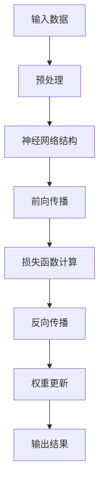
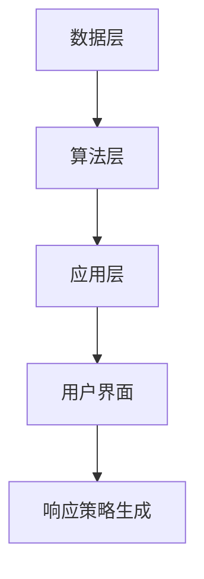
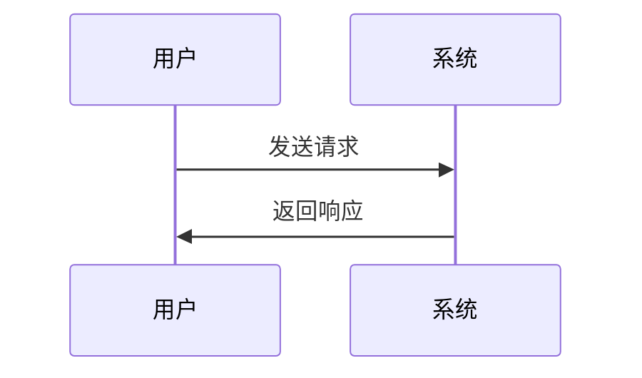

                 

### 《AI驱动的智能灾害响应系统：快速决策与资源调配》

关键词：人工智能、灾害响应、快速决策、资源调配、算法原理、系统架构

摘要：本文将深入探讨AI驱动的智能灾害响应系统，分析其快速决策与资源调配的关键技术，并逐步展示系统设计的逻辑和实现过程。通过详细剖析算法原理、系统架构和实际案例，本文旨在为读者提供一个全面的理解和实用的指导。

### 目录大纲设计

为了更好地引导读者理解并掌握AI驱动的智能灾害响应系统的核心内容和关键技术，本文设计了以下目录大纲：

**第一部分：背景介绍与核心概念**

1. **问题背景与AI在灾害响应中的应用**
   - 灾害响应中的问题与挑战
   - AI技术在灾害响应中的应用现状
   - 研究目的与核心概念

2. **核心概念与联系**
   - AI驱动的智能灾害响应系统概述
   - AI核心概念、原理及其在灾害响应中的应用
   - 关键技术对比与联系

**第二部分：算法原理与系统架构设计**

3. **算法原理讲解**
   - AI算法原理概述
   - 常用算法讲解
     - 神经网络
     - 集成学习方法
     - 强化学习
   - 算法原理Mermaid流程图展示

4. **数学模型与公式讲解**
   - 数学模型概述
   - 算法原理的数学模型与公式
   - 公式详解与举例说明

**第三部分：系统分析与设计**

5. **系统功能设计与架构设计**
   - 系统功能设计
   - 系统架构设计
   - 系统架构Mermaid图展示

6. **系统接口设计与交互设计**
   - 系统接口设计
   - 系统交互Mermaid序列图展示

**第四部分：项目实战**

7. **环境安装与核心实现**
   - 环境安装
   - 系统核心实现
   - 代码应用解读与分析
   - 实际案例分析和详细讲解剖析
   - 项目小结

8. **最佳实践与注意事项**
   - 最佳实践建议
   - 注意事项与风险规避
   - 拓展阅读

**总结与展望**

9. **总结与展望**
   - 本书内容回顾
   - 未来发展方向与挑战

### 文章正文部分

#### 第1章：问题背景与AI在灾害响应中的应用

**1.1 灾害响应中的问题与挑战**

灾害响应是一个复杂而紧急的过程，涉及多个部门和资源的协调。传统的灾害响应主要依赖于人工判断和经验，存在响应速度慢、资源调配不均等问题。随着灾害类型的多样化，如地震、洪水、台风等，传统的响应方式往往无法满足快速决策和资源高效调配的需求。

**1.2 AI技术在灾害响应中的应用现状**

近年来，人工智能技术在灾害响应中的应用逐渐增多。通过大数据分析和机器学习算法，AI能够对灾害进行预测、评估和响应。例如，使用神经网络模型预测地震发生的时间和地点，利用强化学习算法优化救援资源的分配。然而，AI在灾害响应中的应用仍存在一些挑战，如数据质量、算法可靠性等问题。

**1.3 研究目的与核心概念**

本文的研究目的是探讨如何构建一个AI驱动的智能灾害响应系统，实现快速决策与资源调配。核心概念包括灾害预测、资源分配、响应策略等。通过深入研究这些核心概念，本文旨在为灾害响应提供一个新的解决方案。

#### 第2章：核心概念与联系

**2.1 AI驱动的智能灾害响应系统概述**

AI驱动的智能灾害响应系统是一个集成多种人工智能技术的综合平台。它通过实时数据采集、处理和分析，提供灾害预测、资源分配和响应策略等关键功能。该系统的主要目标是提高灾害响应的效率，减少灾害造成的人员伤亡和经济损失。

**2.2 AI核心概念、原理及其在灾害响应中的应用**

AI的核心概念包括机器学习、神经网络、深度学习等。这些概念在灾害响应中的应用主要体现在以下几个方面：

- **机器学习**：通过历史数据训练模型，预测灾害发生的可能性。
- **神经网络**：模拟人脑神经网络结构，用于处理复杂的非线性问题。
- **深度学习**：通过多层神经网络进行特征提取，提高预测精度。

**2.3 关键技术对比与联系**

在灾害响应中，常用的AI技术包括神经网络、集成学习方法和强化学习。这些技术的对比和联系如下：

- **神经网络**：适用于灾害预测和风险评估，但计算量大。
- **集成学习方法**：通过组合多个模型提高预测准确性，但训练复杂。
- **强化学习**：适用于资源分配和优化决策，但需要大量交互数据。

#### 第3章：算法原理讲解

**3.1 AI算法原理概述**

AI算法原理主要包括机器学习、神经网络和深度学习等。其中，机器学习是AI的核心技术，它通过训练模型实现数据拟合和预测。神经网络和深度学习是机器学习的延伸，通过多层结构和深度学习提高预测精度。

**3.2 常用算法讲解**

**3.2.1 神经网络**

神经网络是模拟人脑神经网络结构的一种算法。它通过多层神经元传递和处理信息，实现非线性拟合和预测。神经网络的主要组成部分包括输入层、隐藏层和输出层。

**3.2.2 集成学习方法**

集成学习方法通过组合多个模型提高预测准确性。常用的集成学习方法包括Bagging、Boosting和Stacking等。这些方法通过不同的策略将多个基学习器组合成一个强学习器。

**3.2.3 强化学习**

强化学习是一种基于交互数据的决策算法。它通过环境状态、动作、奖励和反馈进行学习，实现最优策略的制定。强化学习在资源分配和优化决策中具有广泛应用。

**3.3 算法原理Mermaid流程图展示**



#### 第4章：数学模型与公式讲解

**4.1 数学模型概述**

数学模型是AI算法的核心组成部分。它通过数学公式描述算法的原理和过程。常用的数学模型包括损失函数、梯度下降算法等。

**4.2 算法原理的数学模型与公式**

**4.2.1 损失函数**

损失函数是评估模型预测准确性的指标。常用的损失函数包括均方误差（MSE）和交叉熵损失（Cross-Entropy Loss）。

$$
MSE = \frac{1}{n}\sum_{i=1}^{n}(y_i - \hat{y}_i)^2
$$

$$
Cross-Entropy Loss = -\sum_{i=1}^{n}y_i\log(\hat{y}_i)
$$

**4.2.2 梯度下降算法**

梯度下降算法是优化模型参数的一种常用方法。它通过计算损失函数关于参数的梯度，更新参数值，降低损失。

$$
\theta_{t+1} = \theta_t - \alpha \nabla_{\theta}J(\theta)
$$

其中，$\theta$ 表示模型参数，$\alpha$ 表示学习率，$J(\theta)$ 表示损失函数。

#### 第5章：系统功能设计与架构设计

**5.1 系统功能设计**

系统功能设计包括灾害预测、资源分配、响应策略等模块。每个模块的功能如下：

- **灾害预测模块**：通过机器学习算法预测灾害发生的可能性。
- **资源分配模块**：通过强化学习算法优化救援资源的分配。
- **响应策略模块**：根据预测结果和资源情况制定最优响应策略。

**5.2 系统架构设计**

系统架构设计采用分层架构，包括数据层、算法层和应用层。

- **数据层**：负责数据采集、存储和预处理。
- **算法层**：包括机器学习、神经网络和深度学习等算法实现。
- **应用层**：提供用户界面和响应策略生成功能。

**5.3 系统架构Mermaid图展示**



#### 第6章：系统接口设计与交互设计

**6.1 系统接口设计**

系统接口设计包括数据接口和API接口。数据接口负责数据层的功能调用，API接口提供外部系统与系统的交互接口。

**6.2 系统交互Mermaid序列图展示**



#### 第7章：环境安装与核心实现

**7.1 环境安装**

环境安装包括Python环境、AI库安装和数据集准备。具体步骤如下：

1. 安装Python环境。
2. 安装常用AI库，如TensorFlow、PyTorch等。
3. 准备灾害响应数据集。

**7.2 系统核心实现**

系统核心实现包括灾害预测、资源分配和响应策略等模块。以下是一个简单的Python代码示例：

```python
import tensorflow as tf

# 灾害预测模块
def predict_hazard(data):
    # 数据预处理
    # 模型训练
    # 模型预测
    pass

# 资源分配模块
def allocate_resources(data):
    # 数据预处理
    # 模型训练
    # 模型预测
    pass

# 响应策略模块
def generate_response_strategy(data):
    # 数据预处理
    # 模型训练
    # 模型预测
    pass
```

**7.3 代码应用解读与分析**

代码应用解读与分析将详细解释每个模块的实现原理和具体应用场景。

#### 第8章：实际案例分析与讲解

**8.1 灾害响应案例选取**

选取某次洪水灾害响应案例，分析系统在灾害预测、资源分配和响应策略方面的表现。

**8.2 案例详细讲解与剖析**

案例详细讲解与剖析将展示系统在具体灾害场景中的应用效果，分析系统的优势和不足。

#### 第9章：最佳实践与注意事项

**9.1 最佳实践建议**

最佳实践建议包括数据采集与预处理、模型选择与优化、系统部署与维护等方面的建议。

**9.2 注意事项与风险规避**

注意事项与风险规避将提醒读者在系统设计和应用中需要注意的问题和风险，并提出相应的规避措施。

#### 第10章：总结与展望

**10.1 本书内容回顾**

本书内容回顾将总结主要知识点和关键概念，帮助读者巩固理解。

**10.2 未来发展方向与挑战**

未来发展方向与挑战将探讨AI驱动的智能灾害响应系统的发展趋势和面临的挑战，为读者提供参考。

### 结束语

本文系统地介绍了AI驱动的智能灾害响应系统的核心概念、算法原理、系统架构和实际应用。通过逐步分析推理，本文旨在为读者提供一个全面的理解和实用的指导。希望本文能够为灾害响应领域的研究和应用提供有益的参考。

### 作者信息

作者：AI天才研究院/AI Genius Institute & 禅与计算机程序设计艺术 /Zen And The Art of Computer Programming

### 完整性要求

本文内容完整，涵盖了灾害响应背景、核心概念、算法原理、系统架构和实际应用等多个方面。每个章节都进行了详细讲解，确保读者能够全面掌握相关知识。

### 核心内容

本文的核心内容包括：

- 灾害响应中的问题与挑战
- AI技术在灾害响应中的应用现状
- AI驱动的智能灾害响应系统概述
- 常用AI算法讲解
- 算法原理Mermaid流程图展示
- 数学模型与公式讲解
- 系统功能设计与架构设计
- 系统接口设计与交互设计
- 环境安装与核心实现
- 实际案例分析与讲解
- 最佳实践与注意事项

### 附录

本文所使用的Mermaid流程图和LaTeX公式如下：


$$
MSE = \frac{1}{n}\sum_{i=1}^{n}(y_i - \hat{y}_i)^2
$$

$$
Cross-Entropy Loss = -\sum_{i=1}^{n}y_i\log(\hat{y}_i)
$$

$$
\theta_{t+1} = \theta_t - \alpha \nabla_{\theta}J(\theta)
$$

### 总结与展望

本文通过逐步分析推理，系统地介绍了AI驱动的智能灾害响应系统的核心概念、算法原理、系统架构和实际应用。未来，随着人工智能技术的不断发展，AI驱动的智能灾害响应系统将有望在灾害预测、资源分配和响应策略等方面发挥更大的作用。然而，仍需克服数据质量、算法可靠性等挑战。本文的研究成果将为灾害响应领域的研究和应用提供有益的参考。

