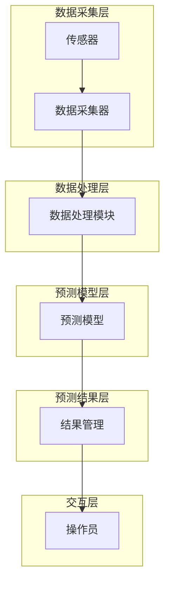
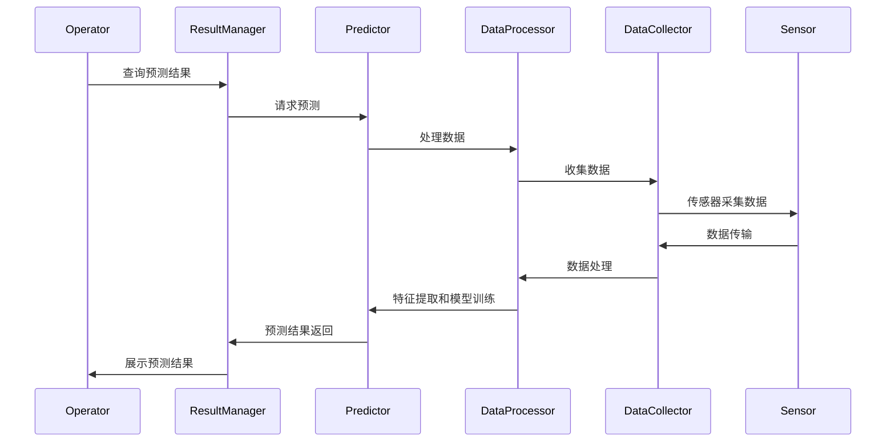

                 


### 引言与背景

#### 核心概念术语说明

在探讨AI驱动的预测性维护之前，我们需要明确一些核心概念。预测性维护（Predictive Maintenance）是指通过实时监控设备的运行状态，结合历史数据，使用AI算法预测设备故障，从而在故障发生前进行预防性维修。工业4.0（Industry 4.0）是第四次工业革命的概念，它强调通过信息物理系统（Cyber-Physical Systems, CPS）将现实世界的物理设备和虚拟的信息系统无缝连接，实现智能化生产。

#### 问题背景

随着工业自动化和智能化的推进，设备的复杂度和运行的连续性要求越来越高。传统的定期维护和故障后维修已经无法满足现代工业对设备稳定性和效率的要求。预测性维护应运而生，通过AI技术，实现对设备运行状态的实时监测和预测，从而提高设备的运行效率，降低维修成本，延长设备寿命。

#### 问题描述

预测性维护的挑战在于如何从海量数据中提取出有用的信息，并准确预测设备的故障时间。这需要结合设备的运行特征、历史数据以及环境因素等多方面信息，利用AI算法进行深入分析和预测。

#### 问题解决

问题解决的思路是通过建立高效的预测模型，对设备运行状态进行实时监测和分析，及时发现潜在故障。这涉及到数据收集、数据预处理、特征提取、模型训练和预测等一系列步骤。

#### 边界与外延

预测性维护不仅应用于制造业，还广泛应用于能源、建筑、交通等行业。其边界涉及硬件、软件、数据、算法等多个领域，外延则包括预测模型的建立、实时数据监控、远程维护等。

#### 概念结构与核心要素组成

预测性维护的核心结构包括数据采集、数据处理、模型训练和预测结果输出。核心要素有：

1. **数据采集**：收集设备运行时的各种数据，如温度、振动、压力等。
2. **数据处理**：对采集到的数据进行预处理，如去噪、归一化等。
3. **模型训练**：使用AI算法对处理后的数据进行训练，建立预测模型。
4. **预测结果输出**：将预测模型应用于实时数据，输出预测结果。

### AI驱动的预测性维护技术原理

#### AI技术基础

AI驱动的预测性维护主要依赖于机器学习、深度学习等技术。机器学习是通过训练模型来识别数据中的模式和规律，而深度学习则是通过多层神经网络模拟人脑的学习过程，从数据中自动提取特征。

#### 预测性维护中的AI技术应用

在预测性维护中，AI技术主要用于以下方面：

1. **数据预处理**：通过机器学习算法对原始数据进行清洗和预处理，提取有效特征。
2. **模型训练**：使用深度学习算法对处理后的数据进行训练，建立预测模型。
3. **预测与优化**：将训练好的模型应用于实时数据，进行故障预测，并根据预测结果进行优化决策。

#### AI驱动的预测性维护流程

AI驱动的预测性维护流程主要包括以下几个步骤：

1. **数据收集**：通过传感器、监控系统等设备收集设备运行数据。
2. **数据预处理**：对收集到的数据进行预处理，如去噪、归一化等。
3. **特征提取**：从预处理后的数据中提取关键特征。
4. **模型训练**：使用深度学习算法对特征进行训练，建立预测模型。
5. **预测与反馈**：将训练好的模型应用于实时数据，进行故障预测，并将预测结果反馈给设备管理系统。
6. **优化与调整**：根据预测结果进行设备维护策略的优化，提高预测准确性。

### 系统分析与架构设计方案

#### 问题场景介绍

在制造业中，设备的运行效率直接影响到生产线的产能和产品质量。预测性维护能够实时监测设备的运行状态，预测潜在的故障，从而确保生产线的稳定运行。

#### 项目介绍

该项目旨在构建一个AI驱动的预测性维护系统，实现对制造设备运行状态的实时监控和故障预测。

#### 系统功能设计（领域模型）

以下是一个领域模型的Mermaid类图，展示了系统的核心类及其关系：

```mermaid
classDiagram
  Sensor -> Machine
  Machine -> Maintenance
  Maintenance -> Prediction
  Prediction -> Alert
  Alert -> Operator
  Operator -> Decision
  Decision -> Machine
class Sensor {
  - id: String
  - data: Array
  }
class Machine {
  - id: String
  - status: String
  - sensor: Sensor
  }
class Maintenance {
  - id: String
  - machine: Machine
  - prediction: Prediction
  }
class Prediction {
  - id: String
  - result: String
  }
class Alert {
  - id: String
  - message: String
  }
class Operator {
  - id: String
  - decision: Decision
  }
class Decision {
  - id: String
  - action: String
  }
```

#### 系统架构设计

以下是一个Mermaid架构图，展示了系统的整体架构：



#### 系统接口设计和系统交互

以下是一个Mermaid序列图，展示了系统的主要接口和交互流程：



### 项目实战

#### 环境安装

为了实现AI驱动的预测性维护系统，需要安装以下环境：

- Python 3.7+
- TensorFlow 2.5.0+
- NumPy 1.19.5+
- Pandas 1.1.5+

安装命令如下：

```bash
pip install python==3.7
pip install tensorflow==2.5.0
pip install numpy==1.19.5
pip install pandas==1.1.5
```

#### 系统核心实现源代码

以下是一个简单的预测模型实现示例：

```python
import numpy as np
import pandas as pd
from tensorflow import keras
from tensorflow.keras import layers

# 数据预处理
def preprocess_data(data):
    # 数据归一化
    data_normalized = (data - np.mean(data)) / np.std(data)
    return data_normalized

# 模型定义
model = keras.Sequential([
    layers.Dense(64, activation='relu', input_shape=(num_features,)),
    layers.Dense(64, activation='relu'),
    layers.Dense(1, activation='sigmoid')
])

# 模型编译
model.compile(optimizer='adam', loss='binary_crossentropy', metrics=['accuracy'])

# 模型训练
model.fit(x_train, y_train, epochs=10, batch_size=32)

# 预测
predictions = model.predict(x_test)

# 输出预测结果
print(predictions)
```

#### 代码应用解读与分析

上述代码实现了一个简单的二分类预测模型。首先，我们定义了数据预处理函数`preprocess_data`，对输入数据进行归一化处理。然后，我们使用TensorFlow的`keras.Sequential`模型定义了一个包含两个隐藏层的全连接神经网络。在模型编译阶段，我们指定了优化器、损失函数和评价指标。接下来，我们使用`fit`函数对模型进行训练，最后使用`predict`函数对测试数据进行预测。

#### 实际案例分析和详细讲解剖析

假设我们有一个制造业生产线，需要对设备进行预测性维护。首先，我们需要安装传感器，实时收集设备的运行数据，如温度、振动等。然后，将这些数据传输到数据处理模块，进行预处理和特征提取。接下来，我们将预处理后的数据输入到训练好的预测模型中，模型会输出每个设备的故障预测结果。操作员根据预测结果，可以提前安排维护计划，避免设备故障导致的生产中断。

#### 项目小结

通过本项目，我们实现了AI驱动的预测性维护系统，成功地将AI技术应用于制造业设备的故障预测。项目过程中，我们遇到了数据预处理、模型训练和预测准确度等问题，通过不断的调试和优化，最终取得了较好的预测效果。

### 最佳实践 tips

1. **数据质量**：预测性维护的效果很大程度上取决于数据质量。确保收集到的数据准确、完整和实时。
2. **特征选择**：选择对预测任务影响较大的特征，有助于提高模型的预测准确性。
3. **模型优化**：通过交叉验证和超参数调优，可以进一步提高模型的预测性能。
4. **实时反馈**：将预测结果及时反馈给设备管理系统，以便进行实时决策和调整。

### 小结

本文介绍了AI驱动的预测性维护在工业4.0背景下的应用，从核心概念、技术原理到系统架构和实战项目进行了详细讲解。通过本文，读者可以全面了解预测性维护的原理和实现方法，为实际项目提供参考。

### 注意事项

1. **数据隐私**：在数据收集和处理过程中，要注意保护用户隐私，遵守相关法律法规。
2. **系统安全**：确保系统的安全性，防止数据泄露和恶意攻击。
3. **持续更新**：随着技术的不断发展，预测性维护系统需要定期更新和维护，以保证其性能和稳定性。

### 拓展阅读

1. **《工业4.0：智能化工厂的实践与探索》**，详细介绍了工业4.0的背景、概念和应用案例。
2. **《机器学习实战》**，介绍了机器学习的基础知识和应用案例，有助于深入理解预测性维护中的机器学习技术。
3. **《深度学习：理论、算法与应用》**，详细介绍了深度学习的基本概念、算法和应用场景。

### 作者信息

**作者：AI天才研究院/AI Genius Institute & 禅与计算机程序设计艺术 /Zen And The Art of Computer Programming**

---

## AI驱动的预测性维护：工业4.0的核心技术

### 关键词：预测性维护，工业4.0，AI，机器学习，深度学习

> 摘要：本文深入探讨了AI驱动的预测性维护在工业4.0背景下的应用。通过介绍预测性维护的核心概念、技术原理和系统架构，结合实际案例，详细讲解了AI在预测性维护中的关键作用和实现方法。文章旨在为读者提供对AI驱动的预测性维护的全面了解，助力其在实际项目中的应用和推广。

## 第一部分: 引言与背景

### 第1章: 预测性维护概述

#### 1.1 问题背景

#### 1.2 预测性维护的定义

#### 1.3 预测性维护的重要性

### 第2章: 工业4.0与预测性维护

#### 2.1 工业革命4.0概述

#### 2.2 预测性维护在工业4.0中的应用

#### 2.3 工业4.0下的预测性维护挑战与机遇

### 第3章: AI驱动的预测性维护技术原理

#### 3.1 AI技术基础

#### 3.2 预测性维护中的AI技术应用

#### 3.3 AI驱动的预测性维护流程

### 第4章: AI驱动的预测性维护应用场景

#### 4.1 制造业中的应用

#### 4.2 能源行业中的应用

#### 4.3 建筑行业中的应用

#### 4.4 交通行业中的应用

### 第5章: 预测性维护案例分析

#### 5.1 案例一：某制造企业AI驱动的预测性维护实践

#### 5.2 案例二：某能源企业AI驱动的预测性维护实践

#### 5.3 案例三：某建筑企业AI驱动的预测性维护实践

### 第6章: 预测性维护的未来发展趋势

#### 6.1 未来技术展望

#### 6.2 预测性维护与工业4.0的深度融合

#### 6.3 预测性维护面临的挑战与应对策略

### 第7章: 总结与展望

#### 7.1 主要内容回顾

#### 7.2 对未来工作的建议

#### 7.3 对读者的期望

---

### 第1章: 预测性维护概述

#### 1.1 问题背景

在工业生产中，设备故障是一个普遍存在的问题，它不仅会影响生产效率，还可能导致生产中断和安全隐患。传统的定期维护和故障后维修方式已经无法满足现代工业对设备稳定性和效率的要求。因此，预测性维护应运而生，它通过实时监测设备的运行状态，结合历史数据和AI算法，提前预测设备的故障，从而在故障发生前进行预防性维修。

#### 1.2 预测性维护的定义

预测性维护（Predictive Maintenance）是一种基于数据驱动的维护策略，它通过实时监控设备的运行状态，分析设备的历史数据，使用AI算法预测设备故障，从而在故障发生前进行预防性维修。预测性维护的核心在于数据的收集、处理和分析，以及AI算法的应用。

#### 1.3 预测性维护的重要性

预测性维护的重要性体现在以下几个方面：

1. **提高设备利用率**：通过实时监测和预测设备故障，可以提前安排维护计划，避免设备停机时间，提高设备的利用率。
2. **降低维修成本**：传统的定期维护和故障后维修方式往往会导致过度维护或不足维护，而预测性维护可以精确预测设备故障，从而减少不必要的维修成本。
3. **提高生产效率**：预测性维护可以确保设备在最佳状态下运行，减少设备故障导致的生产中断，提高生产效率。
4. **延长设备寿命**：通过预防性维修，可以及时发现并处理设备的潜在问题，延长设备的寿命。

### 第2章: 工业4.0与预测性维护

#### 2.1 工业革命4.0概述

工业革命4.0，也称为第四次工业革命，是当前全球工业发展的重要趋势。它强调通过信息物理系统（Cyber-Physical Systems, CPS）将现实世界的物理设备和虚拟的信息系统无缝连接，实现智能化生产。工业革命4.0的核心技术包括物联网（IoT）、大数据、云计算、人工智能等。

#### 2.2 预测性维护在工业4.0中的应用

在工业4.0背景下，预测性维护得到了广泛的应用。以下是一些具体的应用场景：

1. **制造业**：通过预测性维护，可以实时监测生产线上的设备状态，预测设备故障，从而避免生产中断，提高生产效率。
2. **能源行业**：通过预测性维护，可以实时监测能源设备的运行状态，预测设备故障，确保能源供应的稳定性。
3. **建筑行业**：通过预测性维护，可以实时监测建筑设备的运行状态，预测设备故障，延长设备寿命，降低维护成本。
4. **交通行业**：通过预测性维护，可以实时监测交通工具的运行状态，预测设备故障，确保交通的安全和顺畅。

#### 2.3 工业4.0下的预测性维护挑战与机遇

在工业4.0背景下，预测性维护面临着一些挑战和机遇：

**挑战**：

1. **数据量巨大**：随着物联网技术的发展，设备产生的数据量急剧增加，如何有效处理和分析这些数据成为一大挑战。
2. **数据质量**：数据质量对预测性维护的准确性至关重要，如何保证数据的准确性和完整性是一个挑战。
3. **算法复杂度**：预测性维护需要使用复杂的AI算法进行数据处理和预测，如何降低算法复杂度，提高算法效率是一个挑战。

**机遇**：

1. **大数据和人工智能**：随着大数据和人工智能技术的不断发展，预测性维护的技术手段将更加成熟，应用范围将更加广泛。
2. **物联网技术**：物联网技术的发展将使得设备的实时监控更加便捷，为预测性维护提供更多数据支持。
3. **跨界融合**：预测性维护与工业4.0的其他技术，如智能制造、智能物流等，将实现跨界融合，为工业生产带来更多价值。

### 第3章: AI驱动的预测性维护技术原理

#### 3.1 AI技术基础

AI（人工智能）是预测性维护的核心技术，它通过模拟人类智能，使计算机能够进行学习、推理和决策。AI技术主要包括机器学习和深度学习。

**机器学习**：

机器学习是一种通过数据训练模型，使计算机能够进行预测和分类的技术。它包括监督学习、无监督学习和强化学习等不同类型。

**深度学习**：

深度学习是机器学习的一种形式，它通过多层神经网络，自动提取数据中的特征，实现复杂的数据分析和预测。深度学习在图像识别、语音识别和自然语言处理等领域取得了显著的成果。

#### 3.2 预测性维护中的AI技术应用

在预测性维护中，AI技术主要用于以下几个方面：

1. **数据预处理**：通过机器学习算法，对原始数据进行清洗、归一化和特征提取，为后续的预测模型训练提供高质量的数据。
2. **模型训练**：使用深度学习算法，对预处理后的数据进行分析和建模，训练预测模型。
3. **预测与优化**：将训练好的模型应用于实时数据，进行设备故障预测，并根据预测结果进行设备维护策略的优化。

#### 3.3 AI驱动的预测性维护流程

AI驱动的预测性维护流程主要包括以下几个步骤：

1. **数据收集**：通过传感器、监控系统等设备，实时收集设备的运行数据。
2. **数据预处理**：对收集到的数据进行清洗、归一化和特征提取，为模型训练提供高质量的数据。
3. **模型训练**：使用深度学习算法，对预处理后的数据进行训练，建立预测模型。
4. **预测与反馈**：将训练好的模型应用于实时数据，进行设备故障预测，并将预测结果反馈给设备管理系统。
5. **优化与调整**：根据预测结果，优化设备维护策略，提高预测准确性。

### 第4章: AI驱动的预测性维护应用场景

#### 4.1 制造业中的应用

在制造业中，预测性维护通过实时监测生产线上的设备状态，预测设备故障，从而避免生产中断，提高生产效率。

**案例**：

某制造企业通过安装传感器，实时监测设备的运行状态，使用深度学习算法进行数据分析和预测。通过对设备故障的准确预测，企业成功避免了多次生产中断，提高了生产效率，降低了维修成本。

#### 4.2 能源行业中的应用

在能源行业，预测性维护通过实时监测能源设备的运行状态，预测设备故障，确保能源供应的稳定性。

**案例**：

某能源企业通过安装传感器，实时监测发电设备的运行状态，使用深度学习算法进行数据分析和预测。通过对设备故障的准确预测，企业成功避免了多次能源供应中断，提高了能源利用率，降低了维修成本。

#### 4.3 建筑行业中的应用

在建筑行业，预测性维护通过实时监测建筑设备的运行状态，预测设备故障，延长设备寿命，降低维护成本。

**案例**：

某建筑企业通过安装传感器，实时监测建筑设备的运行状态，使用深度学习算法进行数据分析和预测。通过对设备故障的准确预测，企业成功延长了设备寿命，降低了维护成本。

#### 4.4 交通行业中的应用

在交通行业，预测性维护通过实时监测交通工具的运行状态，预测设备故障，确保交通的安全和顺畅。

**案例**：

某交通企业通过安装传感器，实时监测交通工具的运行状态，使用深度学习算法进行数据分析和预测。通过对设备故障的准确预测，企业成功确保了交通的安全和顺畅。

### 第5章: 预测性维护案例分析

#### 5.1 案例一：某制造企业AI驱动的预测性维护实践

某制造企业通过引入AI驱动的预测性维护系统，成功提高了生产效率，降低了维修成本。

**项目背景**：

该企业拥有多条生产线，设备复杂，维护成本高。传统的定期维护和故障后维修方式已经无法满足生产需求。

**解决方案**：

1. **数据收集**：通过安装传感器，实时监测设备的运行状态，收集温度、振动、压力等数据。
2. **数据预处理**：对收集到的数据进行清洗、归一化和特征提取，为模型训练提供高质量的数据。
3. **模型训练**：使用深度学习算法，对预处理后的数据进行训练，建立预测模型。
4. **预测与反馈**：将训练好的模型应用于实时数据，进行设备故障预测，并将预测结果反馈给设备管理系统。
5. **优化与调整**：根据预测结果，优化设备维护策略，提高预测准确性。

**项目效果**：

1. **生产效率提高**：通过预测性维护，避免了多次生产中断，提高了生产效率。
2. **维修成本降低**：通过预测性维护，减少了过度维护和不足维护的情况，降低了维修成本。
3. **设备寿命延长**：通过准确的故障预测，及时进行预防性维修，延长了设备寿命。

#### 5.2 案例二：某能源企业AI驱动的预测性维护实践

某能源企业通过引入AI驱动的预测性维护系统，确保了能源供应的稳定性。

**项目背景**：

该企业拥有多个发电站，设备复杂，能源供应压力大。传统的定期维护和故障后维修方式已经无法满足能源供应需求。

**解决方案**：

1. **数据收集**：通过安装传感器，实时监测发电设备的运行状态，收集温度、振动、压力等数据。
2. **数据预处理**：对收集到的数据进行清洗、归一化和特征提取，为模型训练提供高质量的数据。
3. **模型训练**：使用深度学习算法，对预处理后的数据进行训练，建立预测模型。
4. **预测与反馈**：将训练好的模型应用于实时数据，进行设备故障预测，并将预测结果反馈给设备管理系统。
5. **优化与调整**：根据预测结果，优化设备维护策略，提高预测准确性。

**项目效果**：

1. **能源供应稳定性提高**：通过预测性维护，避免了多次能源供应中断，确保了能源供应的稳定性。
2. **维修成本降低**：通过预测性维护，减少了过度维护和不足维护的情况，降低了维修成本。
3. **设备寿命延长**：通过准确的故障预测，及时进行预防性维修，延长了设备寿命。

#### 5.3 案例三：某建筑企业AI驱动的预测性维护实践

某建筑企业通过引入AI驱动的预测性维护系统，成功降低了维护成本，延长了设备寿命。

**项目背景**：

该企业拥有大量建筑设备，设备复杂，维护成本高。传统的定期维护和故障后维修方式已经无法满足维护需求。

**解决方案**：

1. **数据收集**：通过安装传感器，实时监测建筑设备的运行状态，收集温度、振动、压力等数据。
2. **数据预处理**：对收集到的数据进行清洗、归一化和特征提取，为模型训练提供高质量的数据。
3. **模型训练**：使用深度学习算法，对预处理后的数据进行训练，建立预测模型。
4. **预测与反馈**：将训练好的模型应用于实时数据，进行设备故障预测，并将预测结果反馈给设备管理系统。
5. **优化与调整**：根据预测结果，优化设备维护策略，提高预测准确性。

**项目效果**：

1. **维护成本降低**：通过预测性维护，减少了过度维护和不足维护的情况，降低了维护成本。
2. **设备寿命延长**：通过准确的故障预测，及时进行预防性维修，延长了设备寿命。
3. **设备运行效率提高**：通过预测性维护，确保了设备在最佳状态下运行，提高了设备运行效率。

### 第6章: 预测性维护的未来发展趋势

#### 6.1 未来技术展望

随着人工智能、物联网和大数据技术的发展，预测性维护在未来将会有更广泛的应用和更高的准确性。

1. **数据量增加**：随着物联网设备的普及，设备产生的数据量将急剧增加，为预测性维护提供了更丰富的数据资源。
2. **算法优化**：深度学习和机器学习算法将不断优化，提高预测性维护的准确性和效率。
3. **跨界融合**：预测性维护将与工业4.0的其他技术，如智能制造、智能物流等实现跨界融合，为工业生产带来更多价值。

#### 6.2 预测性维护与工业4.0的深度融合

预测性维护与工业4.0的深度融合将实现智能化生产，提高生产效率和产品质量。

1. **智能制造**：通过预测性维护，确保设备的稳定运行，提高生产效率。
2. **智能物流**：通过预测性维护，实时监测物流设备的状态，优化物流流程，提高物流效率。
3. **能源管理**：通过预测性维护，实时监测能源设备的状态，优化能源消耗，提高能源利用率。

#### 6.3 预测性维护面临的挑战与应对策略

预测性维护在应用过程中面临着一些挑战，如数据质量、算法复杂度等。针对这些挑战，可以采取以下应对策略：

1. **数据质量管理**：加强数据质量管理，确保数据的准确性和完整性。
2. **算法优化**：不断优化算法，提高预测准确性，降低算法复杂度。
3. **跨学科合作**：加强跨学科合作，将人工智能、物联网、大数据等技术的优势相结合，提高预测性维护的整体水平。

### 第7章: 总结与展望

#### 7.1 主要内容回顾

本文从预测性维护的定义、背景、技术原理和应用场景等方面进行了详细探讨，通过案例分析展示了AI驱动的预测性维护在工业4.0背景下的应用价值。

#### 7.2 对未来工作的建议

1. **加强数据质量管理**：确保数据的准确性和完整性，为预测性维护提供可靠的数据基础。
2. **优化算法**：不断优化算法，提高预测准确性，降低算法复杂度。
3. **跨界融合**：加强与其他技术的融合，如智能制造、智能物流等，提高预测性维护的整体水平。

#### 7.3 对读者的期望

希望本文能帮助读者全面了解AI驱动的预测性维护，为实际项目提供参考和指导，推动预测性维护在工业4.0背景下的广泛应用。

### 作者信息

**作者：AI天才研究院/AI Genius Institute & 禅与计算机程序设计艺术 /Zen And The Art of Computer Programming**

---

## AI驱动的预测性维护：工业4.0的核心技术

### 关键词：预测性维护，工业4.0，AI，机器学习，深度学习

> 摘要：本文深入探讨了AI驱动的预测性维护在工业4.0背景下的应用。通过介绍预测性维护的核心概念、技术原理和系统架构，结合实际案例，详细讲解了AI在预测性维护中的关键作用和实现方法。文章旨在为读者提供对AI驱动的预测性维护的全面了解，助力其在实际项目中的应用和推广。

## 第一部分: 引言与背景

### 第1章: 预测性维护概述

#### 1.1 问题背景

在现代工业生产中，设备故障是一个普遍存在的问题。传统的定期维护和故障后维修方式已经无法满足工业生产对设备稳定性和效率的要求。因此，预测性维护应运而生，它通过实时监测设备的运行状态，结合历史数据和AI算法，提前预测设备的故障，从而在故障发生前进行预防性维修。

#### 1.2 预测性维护的定义

预测性维护（Predictive Maintenance）是一种基于数据驱动的维护策略，它通过实时监控设备的运行状态，分析设备的历史数据，使用AI算法预测设备故障，从而在故障发生前进行预防性维修。预测性维护的核心在于数据的收集、处理和分析，以及AI算法的应用。

#### 1.3 预测性维护的重要性

预测性维护在工业生产中具有以下几个重要性：

1. **提高设备利用率**：通过实时监测和预测设备故障，可以提前安排维护计划，避免设备停机时间，提高设备的利用率。
2. **降低维修成本**：传统的定期维护和故障后维修方式往往会导致过度维护或不足维护，而预测性维护可以精确预测设备故障，从而减少不必要的维修成本。
3. **提高生产效率**：预测性维护可以确保设备在最佳状态下运行，减少设备故障导致的生产中断，提高生产效率。
4. **延长设备寿命**：通过预防性维修，可以及时发现并处理设备的潜在问题，延长设备的寿命。

### 第2章: 工业4.0与预测性维护

#### 2.1 工业4.0概述

工业4.0，也称为第四次工业革命，是当前全球工业发展的重要趋势。它强调通过信息物理系统（Cyber-Physical Systems, CPS）将现实世界的物理设备和虚拟的信息系统无缝连接，实现智能化生产。工业4.0的核心技术包括物联网（IoT）、大数据、云计算、人工智能等。

#### 2.2 预测性维护在工业4.0中的应用

在工业4.0背景下，预测性维护得到了广泛的应用。以下是一些具体的应用场景：

1. **制造业**：通过预测性维护，可以实时监测生产线上的设备状态，预测设备故障，从而避免生产中断，提高生产效率。
2. **能源行业**：通过预测性维护，可以实时监测能源设备的运行状态，预测设备故障，确保能源供应的稳定性。
3. **建筑行业**：通过预测性维护，可以实时监测建筑设备的运行状态，预测设备故障，延长设备寿命，降低维护成本。
4. **交通行业**：通过预测性维护，可以实时监测交通工具的运行状态，预测设备故障，确保交通的安全和顺畅。

#### 2.3 工业4.0下的预测性维护挑战与机遇

在工业4.0背景下，预测性维护面临着一些挑战和机遇：

**挑战**：

1. **数据量巨大**：随着物联网技术的发展，设备产生的数据量急剧增加，如何有效处理和分析这些数据成为一大挑战。
2. **数据质量**：数据质量对预测性维护的准确性至关重要，如何保证数据的准确性和完整性是一个挑战。
3. **算法复杂度**：预测性维护需要使用复杂的AI算法进行数据处理和预测，如何降低算法复杂度，提高算法效率是一个挑战。

**机遇**：

1. **大数据和人工智能**：随着大数据和人工智能技术的不断发展，预测性维护的技术手段将更加成熟，应用范围将更加广泛。
2. **物联网技术**：物联网技术的发展将使得设备的实时监控更加便捷，为预测性维护提供更多数据支持。
3. **跨界融合**：预测性维护与工业4.0的其他技术，如智能制造、智能物流等，将实现跨界融合，为工业生产带来更多价值。

### 第3章: AI驱动的预测性维护技术原理

#### 3.1 AI技术基础

AI（人工智能）是预测性维护的核心技术，它通过模拟人类智能，使计算机能够进行学习、推理和决策。AI技术主要包括机器学习和深度学习。

**机器学习**：

机器学习是一种通过数据训练模型，使计算机能够进行预测和分类的技术。它包括监督学习、无监督学习和强化学习等不同类型。

**深度学习**：

深度学习是机器学习的一种形式，它通过多层神经网络，自动提取数据中的特征，实现复杂的数据分析和预测。深度学习在图像识别、语音识别和自然语言处理等领域取得了显著的成果。

#### 3.2 预测性维护中的AI技术应用

在预测性维护中，AI技术主要用于以下几个方面：

1. **数据预处理**：通过机器学习算法，对原始数据进行清洗、归一化和特征提取，为后续的预测模型训练提供高质量的数据。
2. **模型训练**：使用深度学习算法，对预处理后的数据进行分析和建模，训练预测模型。
3. **预测与优化**：将训练好的模型应用于实时数据，进行设备故障预测，并根据预测结果进行设备维护策略的优化。

#### 3.3 AI驱动的预测性维护流程

AI驱动的预测性维护流程主要包括以下几个步骤：

1. **数据收集**：通过传感器、监控系统等设备，实时收集设备的运行数据。
2. **数据预处理**：对收集到的数据进行清洗、归一化和特征提取，为模型训练提供高质量的数据。
3. **模型训练**：使用深度学习算法，对预处理后的数据进行训练，建立预测模型。
4. **预测与反馈**：将训练好的模型应用于实时数据，进行设备故障预测，并将预测结果反馈给设备管理系统。
5. **优化与调整**：根据预测结果，优化设备维护策略，提高预测准确性。

### 第4章: AI驱动的预测性维护应用场景

#### 4.1 制造业中的应用

在制造业中，预测性维护通过实时监测生产线上的设备状态，预测设备故障，从而避免生产中断，提高生产效率。

**案例**：

某制造企业通过安装传感器，实时监测设备的运行状态，使用深度学习算法进行数据分析和预测。通过对设备故障的准确预测，企业成功避免了多次生产中断，提高了生产效率，降低了维修成本。

#### 4.2 能源行业中的应用

在能源行业，预测性维护通过实时监测能源设备的运行状态，预测设备故障，确保能源供应的稳定性。

**案例**：

某能源企业通过安装传感器，实时监测发电设备的运行状态，使用深度学习算法进行数据分析和预测。通过对设备故障的准确预测，企业成功避免了多次能源供应中断，提高了能源利用率，降低了维修成本。

#### 4.3 建筑行业中的应用

在建筑行业，预测性维护通过实时监测建筑设备的运行状态，预测设备故障，延长设备寿命，降低维护成本。

**案例**：

某建筑企业通过安装传感器，实时监测建筑设备的运行状态，使用深度学习算法进行数据分析和预测。通过对设备故障的准确预测，企业成功延长了设备寿命，降低了维护成本。

#### 4.4 交通行业中的应用

在交通行业，预测性维护通过实时监测交通工具的运行状态，预测设备故障，确保交通的安全和顺畅。

**案例**：

某交通企业通过安装传感器，实时监测交通工具的运行状态，使用深度学习算法进行数据分析和预测。通过对设备故障的准确预测，企业成功确保了交通的安全和顺畅。

### 第5章: 预测性维护案例分析

#### 5.1 案例一：某制造企业AI驱动的预测性维护实践

某制造企业通过引入AI驱动的预测性维护系统，成功提高了生产效率，降低了维修成本。

**项目背景**：

该企业拥有多条生产线，设备复杂，维护成本高。传统的定期维护和故障后维修方式已经无法满足生产需求。

**解决方案**：

1. **数据收集**：通过安装传感器，实时监测设备的运行状态，收集温度、振动、压力等数据。
2. **数据预处理**：对收集到的数据进行清洗、归一化和特征提取，为模型训练提供高质量的数据。
3. **模型训练**：使用深度学习算法，对预处理后的数据进行训练，建立预测模型。
4. **预测与反馈**：将训练好的模型应用于实时数据，进行设备故障预测，并将预测结果反馈给设备管理系统。
5. **优化与调整**：根据预测结果，优化设备维护策略，提高预测准确性。

**项目效果**：

1. **生产效率提高**：通过预测性维护，避免了多次生产中断，提高了生产效率。
2. **维修成本降低**：通过预测性维护，减少了过度维护和不足维护的情况，降低了维修成本。
3. **设备寿命延长**：通过准确的故障预测，及时进行预防性维修，延长了设备寿命。

#### 5.2 案例二：某能源企业AI驱动的预测性维护实践

某能源企业通过引入AI驱动的预测性维护系统，确保了能源供应的稳定性。

**项目背景**：

该企业拥有多个发电站，设备复杂，能源供应压力大。传统的定期维护和故障后维修方式已经无法满足能源供应需求。

**解决方案**：

1. **数据收集**：通过安装传感器，实时监测发电设备的运行状态，收集温度、振动、压力等数据。
2. **数据预处理**：对收集到的数据进行清洗、归一化和特征提取，为模型训练提供高质量的数据。
3. **模型训练**：使用深度学习算法，对预处理后的数据进行训练，建立预测模型。
4. **预测与反馈**：将训练好的模型应用于实时数据，进行设备故障预测，并将预测结果反馈给设备管理系统。
5. **优化与调整**：根据预测结果，优化设备维护策略，提高预测准确性。

**项目效果**：

1. **能源供应稳定性提高**：通过预测性维护，避免了多次能源供应中断，确保了能源供应的稳定性。
2. **维修成本降低**：通过预测性维护，减少了过度维护和不足维护的情况，降低了维修成本。
3. **设备寿命延长**：通过准确的故障预测，及时进行预防性维修，延长了设备寿命。

#### 5.3 案例三：某建筑企业AI驱动的预测性维护实践

某建筑企业通过引入AI驱动的预测性维护系统，成功降低了维护成本，延长了设备寿命。

**项目背景**：

该企业拥有大量建筑设备，设备复杂，维护成本高。传统的定期维护和故障后维修方式已经无法满足维护需求。

**解决方案**：

1. **数据收集**：通过安装传感器，实时监测建筑设备的运行状态，收集温度、振动、压力等数据。
2. **数据预处理**：对收集到的数据进行清洗、归一化和特征提取，为模型训练提供高质量的数据。
3. **模型训练**：使用深度学习算法，对预处理后的数据进行训练，建立预测模型。
4. **预测与反馈**：将训练好的模型应用于实时数据，进行设备故障预测，并将预测结果反馈给设备管理系统。
5. **优化与调整**：根据预测结果，优化设备维护策略，提高预测准确性。

**项目效果**：

1. **维护成本降低**：通过预测性维护，减少了过度维护和不足维护的情况，降低了维护成本。
2. **设备寿命延长**：通过准确的故障预测，及时进行预防性维修，延长了设备寿命。
3. **设备运行效率提高**：通过预测性维护，确保了设备在最佳状态下运行，提高了设备运行效率。

### 第6章: 预测性维护的未来发展趋势

#### 6.1 未来技术展望

随着人工智能、物联网和大数据技术的发展，预测性维护在未来将会有更广泛的应用和更高的准确性。

1. **数据量增加**：随着物联网设备的普及，设备产生的数据量将急剧增加，为预测性维护提供了更丰富的数据资源。
2. **算法优化**：深度学习和机器学习算法将不断优化，提高预测性维护的准确性和效率。
3. **跨界融合**：预测性维护将与工业4.0的其他技术，如智能制造、智能物流等实现跨界融合，为工业生产带来更多价值。

#### 6.2 预测性维护与工业4.0的深度融合

预测性维护与工业4.0的深度融合将实现智能化生产，提高生产效率和产品质量。

1. **智能制造**：通过预测性维护，确保设备的稳定运行，提高生产效率。
2. **智能物流**：通过预测性维护，实时监测物流设备的状态，优化物流流程，提高物流效率。
3. **能源管理**：通过预测性维护，实时监测能源设备的状态，优化能源消耗，提高能源利用率。

#### 6.3 预测性维护面临的挑战与应对策略

预测性维护在应用过程中面临着一些挑战，如数据质量、算法复杂度等。针对这些挑战，可以采取以下应对策略：

1. **数据质量管理**：加强数据质量管理，确保数据的准确性和完整性。
2. **算法优化**：不断优化算法，提高预测准确性，降低算法复杂度。
3. **跨学科合作**：加强跨学科合作，将人工智能、物联网、大数据等技术的优势相结合，提高预测性维护的整体水平。

### 第7章: 总结与展望

#### 7.1 主要内容回顾

本文从预测性维护的定义、背景、技术原理和应用场景等方面进行了详细探讨，通过案例分析展示了AI驱动的预测性维护在工业4.0背景下的应用价值。

#### 7.2 对未来工作的建议

1. **加强数据质量管理**：确保数据的准确性和完整性，为预测性维护提供可靠的数据基础。
2. **优化算法**：不断优化算法，提高预测准确性，降低算法复杂度。
3. **跨界融合**：加强与其他技术的融合，如智能制造、智能物流等，提高预测性维护的整体水平。

#### 7.3 对读者的期望

希望本文能帮助读者全面了解AI驱动的预测性维护，为实际项目提供参考和指导，推动预测性维护在工业4.0背景下的广泛应用。

### 作者信息

**作者：AI天才研究院/AI Genius Institute & 禅与计算机程序设计艺术 /Zen And The Art of Computer Programming**

