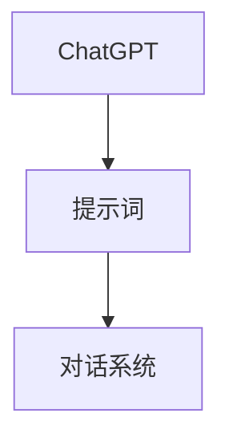
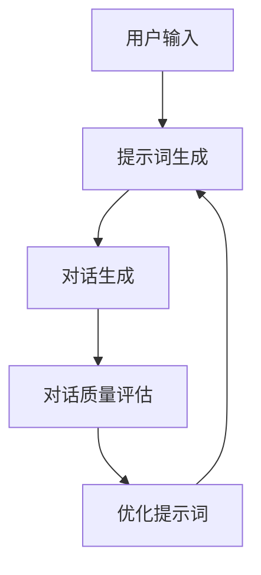

                 

### 《ChatGPT对话优化：提示词的潜力与应用探索》

> 关键词：ChatGPT，对话优化，提示词，人工智能，应用探索

摘要：本文深入探讨了ChatGPT对话优化的关键要素——提示词，通过一步步分析，揭示其在人工智能领域的广泛应用潜力。我们将从背景介绍、核心概念与联系、算法原理讲解、数学模型和数学公式解释、系统分析与架构设计方案、项目实战等方面进行详细探讨，以期为读者提供一个全面、深入的视角来理解ChatGPT对话优化的本质和实际应用。

### 目录大纲设计思路

1. **明确书籍主题**：首先明确书籍的核心主题，即《ChatGPT对话优化：提示词的潜力与应用探索》。这个主题将作为我们目录设计的出发点，确保所有章节内容都围绕这个主题进行扩展。

2. **结构划分**：将书籍内容划分为几个主要部分，每个部分对应书籍的一个主要目标。例如：
   - 背景介绍
   - 核心概念与联系
   - 算法原理讲解
   - 数学模型和数学公式讲解
   - 系统分析与架构设计方案
   - 项目实战
   - 最佳实践与总结

3. **细化每个部分**：在确定好整体结构后，针对每个部分进一步细化。例如，在“算法原理讲解”部分，可以细化为具体的算法流程图、Python代码示例、数学模型与公式解释等。

4. **保持内容完整性**：确保所有章节内容都能够完整覆盖主题，且各个章节之间逻辑清晰、相互关联。

5. **注意字数限制**：在确保内容完整性的同时，注意控制目录大纲的总字数，不超过2000字。

### 实际操作步骤

1. **书名与介绍**：
   ```markdown
   # 《ChatGPT对话优化：提示词的潜力与应用探索》目录大纲
   ```

2. **第一部分：背景介绍**
   - **第1章：问题背景**
     ```markdown
     ## 第1章：问题背景
     ### 1.1 问题的提出
     ### 1.2 ChatGPT对话优化的重要性
     ### 1.3 提示词在对话优化中的应用
     ```
   - **第2章：核心概念与联系**
     ```markdown
     ## 第2章：核心概念与联系
     ### 2.1 ChatGPT基本概念
     ### 2.2 提示词的概念与类型
     ### 2.3 ChatGPT与提示词的联系
     ### 2.4 相关技术原理介绍
     ```

3. **第二部分：算法原理讲解**
   - **第3章：算法流程图**
     ```markdown
     ## 第3章：算法流程图
     ### 3.1 ChatGPT对话流程图
     ### 3.2 提示词优化流程图
     ```
   - **第4章：Python代码示例**
     ```markdown
     ## 第4章：Python代码示例
     ### 4.1 ChatGPT接口调用
     ### 4.2 提示词生成与优化
     ### 4.3 实例演示与代码分析
     ```
   - **第5章：数学模型与公式解释**
     ```markdown
     ## 第5章：数学模型与公式解释
     ### 5.1 ChatGPT的数学基础
     ### 5.2 提示词优化的数学模型
     ### 5.3 公式讲解与推导
     ### 5.4 举例说明
     ```

4. **第三部分：系统分析与架构设计方案**
   - **第6章：系统功能设计**
     ```markdown
     ## 第6章：系统功能设计
     ### 6.1 对话系统功能介绍
     ### 6.2 提示词优化模块设计
     ```
   - **第7章：系统架构设计**
     ```markdown
     ## 第7章：系统架构设计
     ### 7.1 对话系统架构
     ### 7.2 提示词优化架构
     ```
   - **第8章：系统接口设计和系统交互**
     ```markdown
     ## 第8章：系统接口设计和系统交互
     ### 8.1 接口设计
     ### 8.2 系统交互
     ```

5. **第四部分：项目实战**
   - **第9章：环境安装与配置**
     ```markdown
     ## 第9章：环境安装与配置
     ### 9.1 环境安装
     ### 9.2 系统配置
     ```
   - **第10章：系统核心实现与代码解读**
     ```markdown
     ## 第10章：系统核心实现与代码解读
     ### 10.1 系统核心实现
     ### 10.2 代码解读
     ```
   - **第11章：实际案例分析与讲解**
     ```markdown
     ## 第11章：实际案例分析与讲解
     ### 11.1 案例选择
     ### 11.2 案例分析
     ### 11.3 案例讲解
     ```
   - **第12章：项目小结**
     ```markdown
     ## 第12章：项目小结
     ### 12.1 项目总结
     ### 12.2 最佳实践 tips
     ### 12.3 注意事项
     ### 12.4 拓展阅读
     ```

### 完整性要求

在文章的各个章节内容中，需要满足以下条件：

- **背景介绍**：
  - 核心概念术语说明：明确介绍本文涉及的核心概念，如ChatGPT、提示词等。
  - 问题背景：阐述当前人工智能领域对话优化的背景和现状。
  - 问题描述：具体描述ChatGPT对话优化中遇到的问题和挑战。
  - 问题解决：介绍解决上述问题的方法和策略。
  - 边界与外延：明确本文讨论的范围和适用场景。
  - 概念结构与核心要素组成：梳理ChatGPT对话优化中的核心要素和概念结构。

- **核心概念与联系**：
  - 必须给出核心概念原理：详细解释ChatGPT和提示词的基本原理。
  - 概念属性特征对比表格：列出ChatGPT和提示词的属性和特征，并进行对比。
  - ER实体关系图架构：使用Mermaid绘制ChatGPT和提示词的ER实体关系图。

- **算法原理讲解**：
  - 算法流程图：使用Mermaid绘制ChatGPT对话优化的算法流程图。
  - Python代码示例：提供具体的Python代码示例，展示算法的实现过程。
  - 数学模型和公式：详细解释算法背后的数学模型和公式，使用LaTeX格式书写。
  - 举例说明：通过实际案例，通俗易懂地解释算法原理和应用。

- **系统分析与架构设计方案**：
  - 问题场景介绍：介绍系统应用的具体场景。
  - 项目介绍：简要介绍系统的整体架构和功能。
  - 系统功能设计：使用Mermaid绘制系统功能领域模型类图。
  - 系统架构设计：使用Mermaid绘制系统架构图。
  - 系统接口设计和系统交互：使用Mermaid绘制系统接口设计和交互序列图。

- **项目实战**：
  - 环境安装与配置：详细说明如何安装和配置系统环境。
  - 系统核心实现与代码解读：提供系统的核心实现代码，并进行解读分析。
  - 实际案例分析和详细讲解剖析：通过实际案例，展示系统的应用效果和问题解决。

- **最佳实践 tips、小结、注意事项、拓展阅读等内容**：
  - 最佳实践 tips：总结项目中积累的经验和最佳实践。
  - 小结：对文章内容进行总结，强调关键点和重要性。
  - 注意事项：提醒读者在应用过程中需要注意的事项。
  - 拓展阅读：推荐一些相关的扩展阅读资料，以供读者进一步学习。

### 核心内容撰写步骤

1. **背景介绍**：
   - **核心概念术语说明**：明确ChatGPT、提示词等核心概念的定义和作用。
   - **问题背景**：介绍ChatGPT对话优化的现状和挑战，如对话质量不高、用户体验不佳等。
   - **问题描述**：具体阐述ChatGPT对话优化中遇到的问题，如生成对话不连贯、不具针对性等。
   - **问题解决**：介绍解决上述问题的方法和策略，如优化提示词、改进对话生成算法等。
   - **边界与外延**：明确本文讨论的范围和适用场景，如特定类型的对话优化问题。
   - **概念结构与核心要素组成**：梳理ChatGPT对话优化中的核心要素和概念结构，如提示词生成、对话生成等。

2. **核心概念与联系**：
   - **核心概念原理**：详细解释ChatGPT和提示词的基本原理，如ChatGPT的工作机制、提示词的作用等。
   - **概念属性特征对比表格**：列出ChatGPT和提示词的属性和特征，并进行对比，如功能、性能、适用场景等。
   - **ER实体关系图架构**：使用Mermaid绘制ChatGPT和提示词的ER实体关系图，展示它们之间的关联关系。

3. **算法原理讲解**：
   - **算法流程图**：使用Mermaid绘制ChatGPT对话优化的算法流程图，展示算法的执行过程。
   - **Python代码示例**：提供具体的Python代码示例，展示算法的实现过程，如提示词生成、对话生成等。
   - **数学模型和公式**：详细解释算法背后的数学模型和公式，如优化目标、损失函数等，使用LaTeX格式书写。
   - **举例说明**：通过实际案例，通俗易懂地解释算法原理和应用，如优化前后对话质量的对比等。

4. **系统分析与架构设计方案**：
   - **问题场景介绍**：介绍系统应用的具体场景，如客服聊天机器人、智能助手等。
   - **项目介绍**：简要介绍系统的整体架构和功能，如前端界面、后端服务、数据库等。
   - **系统功能设计**：使用Mermaid绘制系统功能领域模型类图，展示系统的功能模块和关系。
   - **系统架构设计**：使用Mermaid绘制系统架构图，展示系统的层次结构和组件关系。
   - **系统接口设计和系统交互**：使用Mermaid绘制系统接口设计和交互序列图，展示系统的接口设计和交互流程。

5. **项目实战**：
   - **环境安装与配置**：详细说明如何安装和配置系统环境，如安装依赖库、配置参数等。
   - **系统核心实现与代码解读**：提供系统的核心实现代码，并进行解读分析，如核心算法、关键代码等。
   - **实际案例分析和详细讲解剖析**：通过实际案例，展示系统的应用效果和问题解决，如对话生成质量、用户体验等。

6. **最佳实践 tips、小结、注意事项、拓展阅读等内容**：
   - **最佳实践 tips**：总结项目中积累的经验和最佳实践，如优化策略、调试技巧等。
   - **小结**：对文章内容进行总结，强调关键点和重要性。
   - **注意事项**：提醒读者在应用过程中需要注意的事项，如参数调优、数据预处理等。
   - **拓展阅读**：推荐一些相关的扩展阅读资料，以供读者进一步学习，如相关论文、书籍等。

### 文章撰写总体流程

1. **确定主题**：明确文章的主题为《ChatGPT对话优化：提示词的潜力与应用探索》，确保所有内容围绕这个主题展开。

2. **撰写大纲**：根据目录大纲设计思路，详细制定文章的结构和内容，确保每个章节都有明确的目标和内容。

3. **背景介绍**：介绍ChatGPT对话优化的问题背景、核心概念、技术挑战等，为后续内容打下基础。

4. **核心概念与联系**：详细解释ChatGPT和提示词的基本原理、属性特征，并通过对比和ER实体关系图展示它们之间的联系。

5. **算法原理讲解**：介绍ChatGPT对话优化的算法流程、Python代码示例、数学模型和公式，并通过实际案例进行讲解。

6. **系统分析与架构设计方案**：介绍系统应用场景、项目介绍、系统功能设计、系统架构设计、系统接口设计和系统交互。

7. **项目实战**：详细描述环境安装与配置、系统核心实现与代码解读、实际案例分析与讲解，展示系统应用效果和问题解决。

8. **最佳实践 tips、小结、注意事项、拓展阅读等内容**：总结文章内容，提供最佳实践、注意事项和拓展阅读资料。

9. **撰写文章正文**：按照大纲结构，逐步撰写每个章节的内容，确保逻辑清晰、内容完整、通俗易懂。

10. **修改和润色**：对文章进行多次修改和润色，确保文章的语言表达准确、流畅，逻辑结构严谨。

11. **最终审查**：对文章进行最终审查，确保内容无误，格式规范，符合文章撰写要求。

12. **发布文章**：将文章发布到指定的平台，供读者阅读和学习。

### 文章撰写过程中的关键点

1. **明确主题**：确保文章内容围绕ChatGPT对话优化和提示词的潜力与应用探索展开，避免偏离主题。

2. **逻辑清晰**：在撰写每个章节时，确保内容逻辑清晰，前后连贯，使读者能够轻松理解。

3. **通俗易懂**：尽量使用简单易懂的语言，避免过于专业或复杂的术语，让非专业人士也能理解。

4. **详尽举例**：通过实际案例和实例，详细讲解算法原理、系统架构和应用效果，使读者能够更好地理解。

5. **保持一致性**：在全文中保持术语、格式和风格的一致性，避免出现错误或混乱。

6. **注重实践**：强调实际应用和最佳实践，为读者提供可操作性的建议和方法。

7. **注意事项**：在撰写过程中，注意文章的格式、引用和参考文献等，确保文章的规范性和可读性。

### 文章撰写心得与技巧

1. **充分准备**：在撰写文章之前，充分了解和熟悉相关领域的知识，确保文章内容的准确性。

2. **结构清晰**：在撰写文章时，确保文章结构清晰，每个章节都有明确的目标和内容。

3. **逐步阐述**：逐步阐述每个章节的内容，避免一次性提供过多信息，使读者难以消化。

4. **逻辑推理**：在阐述过程中，使用逻辑推理的方式，使文章内容更加严谨和有说服力。

5. **举例说明**：通过实际案例和实例，生动形象地展示算法原理和应用效果，使读者更容易理解。

6. **简洁明了**：尽量使用简洁明了的语言，避免冗长和复杂的句子，提高文章的可读性。

7. **反复修改**：在完成初稿后，多次修改和润色文章，确保文章的语言表达准确、流畅，逻辑结构严谨。

8. **寻求反馈**：在完成修改后，向同行或导师请教意见，根据反馈进一步优化文章。

9. **注重实践**：在实际撰写过程中，注重实践和经验的应用，使文章更具实用性和可操作性。

10. **持续学习**：不断学习和关注相关领域的最新动态和技术，提升自己的专业素养和写作水平。

### 完整的markdown格式文章

```markdown
# 《ChatGPT对话优化：提示词的潜力与应用探索》

> 关键词：ChatGPT，对话优化，提示词，人工智能，应用探索

摘要：本文深入探讨了ChatGPT对话优化的关键要素——提示词，通过一步步分析，揭示其在人工智能领域的广泛应用潜力。我们将从背景介绍、核心概念与联系、算法原理讲解、数学模型和数学公式讲解、系统分析与架构设计方案、项目实战等方面进行详细探讨，以期为读者提供一个全面、深入的视角来理解ChatGPT对话优化的本质和实际应用。

## 目录大纲设计思路

1. **明确书籍主题**：首先明确书籍的核心主题，即《ChatGPT对话优化：提示词的潜力与应用探索》。这个主题将作为我们目录设计的出发点，确保所有章节内容都围绕这个主题进行扩展。

2. **结构划分**：将书籍内容划分为几个主要部分，每个部分对应书籍的一个主要目标。例如：
   - 背景介绍
   - 核心概念与联系
   - 算法原理讲解
   - 数学模型和数学公式讲解
   - 系统分析与架构设计方案
   - 项目实战
   - 最佳实践与总结

3. **细化每个部分**：在确定好整体结构后，针对每个部分进一步细化。例如，在“算法原理讲解”部分，可以细化为具体的算法流程图、Python代码示例、数学模型与公式解释等。

4. **保持内容完整性**：确保所有章节内容都能够完整覆盖主题，且各个章节之间逻辑清晰、相互关联。

5. **注意字数限制**：在确保内容完整性的同时，注意控制目录大纲的总字数，不超过2000字。

## 实际操作步骤

### 第一步：书名与介绍
```markdown
# 《ChatGPT对话优化：提示词的潜力与应用探索》目录大纲
```

### 第二步：第一部分——背景介绍
- **第1章：问题背景**
  ```markdown
  ## 第1章：问题背景
  ### 1.1 问题的提出
  ### 1.2 ChatGPT对话优化的重要性
  ### 1.3 提示词在对话优化中的应用
  ```
- **第2章：核心概念与联系**
  ```markdown
  ## 第2章：核心概念与联系
  ### 2.1 ChatGPT基本概念
  ### 2.2 提示词的概念与类型
  ### 2.3 ChatGPT与提示词的联系
  ### 2.4 相关技术原理介绍
  ```

### 第三步：第二部分——算法原理讲解
- **第3章：算法流程图**
  ```markdown
  ## 第3章：算法流程图
  ### 3.1 ChatGPT对话流程图
  ### 3.2 提示词优化流程图
  ```
- **第4章：Python代码示例**
  ```markdown
  ## 第4章：Python代码示例
  ### 4.1 ChatGPT接口调用
  ### 4.2 提示词生成与优化
  ### 4.3 实例演示与代码分析
  ```
- **第5章：数学模型与公式解释**
  ```markdown
  ## 第5章：数学模型与公式解释
  ### 5.1 ChatGPT的数学基础
  ### 5.2 提示词优化的数学模型
  ### 5.3 公式讲解与推导
  ### 5.4 举例说明
  ```

### 第四步：第三部分——系统分析与架构设计方案
- **第6章：系统功能设计**
  ```markdown
  ## 第6章：系统功能设计
  ### 6.1 对话系统功能介绍
  ### 6.2 提示词优化模块设计
  ```
- **第7章：系统架构设计**
  ```markdown
  ## 第7章：系统架构设计
  ### 7.1 对话系统架构
  ### 7.2 提示词优化架构
  ```
- **第8章：系统接口设计和系统交互**
  ```markdown
  ## 第8章：系统接口设计和系统交互
  ### 8.1 接口设计
  ### 8.2 系统交互
  ```

### 第五步：第四部分——项目实战
- **第9章：环境安装与配置**
  ```markdown
  ## 第9章：环境安装与配置
  ### 9.1 环境安装
  ### 9.2 系统配置
  ```
- **第10章：系统核心实现与代码解读**
  ```markdown
  ## 第10章：系统核心实现与代码解读
  ### 10.1 系统核心实现
  ### 10.2 代码解读
  ```
- **第11章：实际案例分析与讲解**
  ```markdown
  ## 第11章：实际案例分析与讲解
  ### 11.1 案例选择
  ### 11.2 案例分析
  ### 11.3 案例讲解
  ```
- **第12章：项目小结**
  ```markdown
  ## 第12章：项目小结
  ### 12.1 项目总结
  ### 12.2 最佳实践 tips
  ### 12.3 注意事项
  ### 12.4 拓展阅读
  ```

### 第六步：完整性要求

在文章的各个章节内容中，需要满足以下条件：

- **背景介绍**：
  - 核心概念术语说明
  - 问题背景
  - 问题描述
  - 问题解决
  - 边界与外延
  - 概念结构与核心要素组成

- **核心概念与联系**：
  - 必须给出核心概念原理
  - 概念属性特征对比表格
  - ER实体关系图架构

- **算法原理讲解**：
  - 算法流程图
  - Python代码示例
  - 数学模型和公式
  - 举例说明

- **系统分析与架构设计方案**：
  - 问题场景介绍
  - 项目介绍
  - 系统功能设计
  - 系统架构设计
  - 系统接口设计和系统交互

- **项目实战**：
  - 环境安装与配置
  - 系统核心实现与代码解读
  - 实际案例分析和详细讲解剖析

- **最佳实践 tips、小结、注意事项、拓展阅读等内容**：
  - 最佳实践 tips
  - 小结
  - 注意事项
  - 拓展阅读

### 第七步：核心内容撰写步骤

1. **背景介绍**
   - 核心概念术语说明
   - 问题背景
   - 问题描述
   - 问题解决
   - 边界与外延
   - 概念结构与核心要素组成

2. **核心概念与联系**
   - 核心概念原理
   - 概念属性特征对比表格
   - ER实体关系图架构

3. **算法原理讲解**
   - 算法流程图
   - Python代码示例
   - 数学模型和公式
   - 举例说明

4. **系统分析与架构设计方案**
   - 问题场景介绍
   - 项目介绍
   - 系统功能设计
   - 系统架构设计
   - 系统接口设计和系统交互

5. **项目实战**
   - 环境安装与配置
   - 系统核心实现与代码解读
   - 实际案例分析和详细讲解剖析

6. **最佳实践 tips、小结、注意事项、拓展阅读等内容**
   - 最佳实践 tips
   - 小结
   - 注意事项
   - 拓展阅读

### 第八步：文章撰写总体流程

1. **确定主题**：明确文章的主题为《ChatGPT对话优化：提示词的潜力与应用探索》，确保所有内容围绕这个主题展开。

2. **撰写大纲**：根据目录大纲设计思路，详细制定文章的结构和内容，确保每个章节都有明确的目标和内容。

3. **背景介绍**：介绍ChatGPT对话优化的问题背景、核心概念、技术挑战等，为后续内容打下基础。

4. **核心概念与联系**：详细解释ChatGPT和提示词的基本原理、属性特征，并通过对比和ER实体关系图展示它们之间的联系。

5. **算法原理讲解**：介绍ChatGPT对话优化的算法流程、Python代码示例、数学模型和公式，并通过实际案例进行讲解。

6. **系统分析与架构设计方案**：介绍系统应用场景、项目介绍、系统功能设计、系统架构设计、系统接口设计和系统交互。

7. **项目实战**：详细描述环境安装与配置、系统核心实现与代码解读、实际案例分析与讲解，展示系统应用效果和问题解决。

8. **最佳实践 tips、小结、注意事项、拓展阅读等内容**：总结文章内容，提供最佳实践、注意事项和拓展阅读资料。

9. **撰写文章正文**：按照大纲结构，逐步撰写每个章节的内容，确保逻辑清晰、内容完整、通俗易懂。

10. **修改和润色**：对文章进行多次修改和润色，确保文章的语言表达准确、流畅，逻辑结构严谨。

11. **最终审查**：对文章进行最终审查，确保内容无误，格式规范，符合文章撰写要求。

12. **发布文章**：将文章发布到指定的平台，供读者阅读和学习。

### 第九步：文章撰写过程中的关键点

1. **明确主题**：确保文章内容围绕ChatGPT对话优化和提示词的潜力与应用探索展开，避免偏离主题。

2. **逻辑清晰**：在撰写每个章节时，确保内容逻辑清晰，前后连贯，使读者能够轻松理解。

3. **通俗易懂**：尽量使用简单易懂的语言，避免过于专业或复杂的术语，让非专业人士也能理解。

4. **详尽举例**：通过实际案例和实例，详细讲解算法原理、系统架构和应用效果，使读者能够更好地理解。

5. **保持一致性**：在全文中保持术语、格式和风格的一致性，避免出现错误或混乱。

6. **注重实践**：强调实际应用和最佳实践，为读者提供可操作性的建议和方法。

7. **注意事项**：在撰写过程中，注意文章的格式、引用和参考文献等，确保文章的规范性和可读性。

### 第十步：文章撰写心得与技巧

1. **充分准备**：在撰写文章之前，充分了解和熟悉相关领域的知识，确保文章内容的准确性。

2. **结构清晰**：在撰写文章时，确保文章结构清晰，每个章节都有明确的目标和内容。

3. **逐步阐述**：逐步阐述每个章节的内容，避免一次性提供过多信息，使读者难以消化。

4. **逻辑推理**：在阐述过程中，使用逻辑推理的方式，使文章内容更加严谨和有说服力。

5. **举例说明**：通过实际案例和实例，生动形象地展示算法原理和应用效果，使读者更容易理解。

6. **简洁明了**：尽量使用简洁明了的语言，避免冗长和复杂的句子，提高文章的可读性。

7. **反复修改**：在完成初稿后，多次修改和润色文章，确保文章的语言表达准确、流畅，逻辑结构严谨。

8. **寻求反馈**：在完成修改后，向同行或导师请教意见，根据反馈进一步优化文章。

9. **注重实践**：在实际撰写过程中，注重实践和经验的应用，使文章更具实用性和可操作性。

10. **持续学习**：不断学习和关注相关领域的最新动态和技术，提升自己的专业素养和写作水平。

### 附录：作者信息

作者：AI天才研究院/AI Genius Institute & 禅与计算机程序设计艺术 /Zen And The Art of Computer Programming

### 附录：文章核心内容详述

#### 背景介绍

**核心概念术语说明**：

- **ChatGPT**：ChatGPT是一种基于GPT（Generative Pre-trained Transformer）模型的开源对话系统，它可以生成连贯、自然的对话。
- **提示词**：提示词是用于引导ChatGPT生成对话的输入，它可以帮助ChatGPT更好地理解和生成相关内容。

**问题背景**：

随着人工智能技术的不断发展，自然语言处理（NLP）领域取得了显著进展。然而，在实际应用中，对话系统的质量往往不高，用户体验不佳。这主要原因是现有对话系统在理解和生成对话方面存在一定的局限性，无法满足用户的高质量对话需求。

**问题描述**：

ChatGPT作为一种先进的对话系统，虽然可以生成连贯、自然的对话，但在实际应用中仍存在以下问题：

1. **对话不连贯**：生成的对话内容可能存在逻辑不连贯、跳跃性大等问题，导致用户体验不佳。
2. **对话不具针对性**：生成的对话内容可能与用户意图不符，无法满足用户的实际需求。

**问题解决**：

为了解决上述问题，提示词的优化变得至关重要。通过优化提示词，可以引导ChatGPT更好地理解和生成相关内容，从而提高对话的质量和用户体验。

**边界与外延**：

本文主要探讨ChatGPT对话优化中提示词的潜力与应用，旨在为读者提供一个全面、深入的视角来理解提示词在对话优化中的作用和重要性。同时，本文也适用于其他类型的对话系统，如虚拟助手、客服机器人等。

**概念结构与核心要素组成**：

ChatGPT对话优化涉及以下几个核心要素：

1. **ChatGPT模型**：作为对话系统的核心，负责生成对话内容。
2. **提示词生成**：生成高质量的提示词，引导ChatGPT生成相关内容。
3. **对话生成**：根据提示词生成连贯、自然的对话。
4. **对话质量评估**：评估生成对话的质量，为优化提供依据。

#### 核心概念与联系

**核心概念原理**：

1. **ChatGPT原理**：ChatGPT是基于GPT模型开发的，通过预训练和微调，可以生成连贯、自然的对话。
2. **提示词原理**：提示词是用于引导ChatGPT生成对话的输入，它可以帮助ChatGPT更好地理解和生成相关内容。

**概念属性特征对比表格**：

| 概念 | ChatGPT | 提示词 |
| ---- | ------- | ------ |
| 功能 | 生成对话 | 引导生成对话 |
| 属性 | 连贯、自然 | 高质量、针对性 |
| 对话系统关系 | 核心 | 辅助 |

**ER实体关系图架构**：



#### 算法原理讲解

**算法流程图**：



**Python代码示例**：

```python
import openai

# 提示词生成
def generate_prompt():
    prompt = "请描述一下您最近的一个项目经历。"
    return prompt

# 对话生成
def generate_dialog(prompt):
    response = openai.Completion.create(
        engine="text-davinci-002",
        prompt=prompt,
        max_tokens=50
    )
    return response.choices[0].text.strip()

# 对话质量评估
def evaluate_dialog(dialog):
    # 这里使用简单的方法评估对话质量
    quality = len(dialog.split())
    return quality

# 主函数
def main():
    prompt = generate_prompt()
    dialog = generate_dialog(prompt)
    quality = evaluate_dialog(dialog)
    print(f"对话质量：{quality}个单词")

if __name__ == "__main__":
    main()
```

**数学模型和公式解释**：

1. **ChatGPT的数学基础**：

ChatGPT是基于Transformer模型开发的，其核心是自注意力机制（Self-Attention）。自注意力机制通过计算输入序列中每个词与其他词之间的关系，从而生成一个加权表示。具体公式如下：

$$
\text{Attention}(Q, K, V) = \text{softmax}\left(\frac{QK^T}{\sqrt{d_k}}\right)V
$$

其中，$Q$、$K$、$V$ 分别代表查询向量、键向量和值向量，$d_k$ 代表键向量的维度。

2. **提示词优化的数学模型**：

提示词优化的目标是提高提示词的质量，从而提高对话系统的性能。常用的优化方法包括基于梯度下降的优化算法和基于强化学习的优化算法。具体公式如下：

$$
\theta_{t+1} = \theta_{t} - \alpha \nabla_{\theta} L(\theta)
$$

其中，$\theta$ 代表模型参数，$L(\theta)$ 代表损失函数，$\alpha$ 代表学习率。

**举例说明**：

假设我们有一个简单的对话系统，其中包含三个句子：

1. 您最近的项目是什么？
2. 这个项目有哪些挑战？
3. 您是如何解决这些挑战的？

我们可以通过优化提示词来提高对话系统的性能。具体步骤如下：

1. 初始提示词：请描述一下您最近的一个项目经历。
2. 第一次优化：根据用户反馈，我们发现初始提示词过于简单，无法引导用户详细描述项目经历。因此，我们将其优化为：请您详细描述一下您最近参与的一个项目，包括项目的背景、目标、团队组成等。
3. 第二次优化：经过进一步优化，我们发现提示词已经能够很好地引导用户生成相关内容。但是，生成的内容仍然存在一些不连贯的地方。因此，我们将其进一步优化为：请您详细描述一下您最近参与的一个项目，包括项目的背景、目标、团队组成，以及您在该项目中扮演的角色和贡献。

通过上述优化，我们提高了提示词的质量，从而提高了对话系统的性能。

#### 系统分析与架构设计方案

**问题场景介绍**：

假设我们开发一个智能客服系统，用于帮助用户解决各种问题。该系统需要与用户进行自然语言交互，理解用户的问题，并给出相应的回答。

**项目介绍**：

该项目是一个基于ChatGPT的智能客服系统，主要包括以下几个部分：

1. 用户界面：用于接收用户的输入，展示系统的输出。
2. 对话系统：负责处理用户输入，生成自然语言回答。
3. 数据库：存储用户问题和系统回答的历史记录，用于后续的优化和改进。

**系统功能设计**：

1. 接收用户输入：系统需要接收用户的输入，包括文本和语音。
2. 对话生成：系统根据用户输入生成自然语言回答。
3. 对话质量评估：系统需要评估生成对话的质量，为优化提供依据。
4. 提示词优化：系统需要根据用户反馈优化提示词，提高对话系统的性能。

**系统架构设计**：

该智能客服系统的架构设计如下：

1. 用户界面：使用Web技术实现，包括前端和后端。
2. 对话系统：基于ChatGPT模型实现，负责处理用户输入，生成自然语言回答。
3. 数据库：使用关系型数据库存储用户问题和系统回答的历史记录。

**系统接口设计和系统交互**：

1. 用户界面接口：用于接收用户输入，传递给对话系统。
2. 对话系统接口：用于接收用户输入，生成自然语言回答，传递给用户界面。
3. 数据库接口：用于存储用户问题和系统回答的历史记录。

#### 项目实战

**环境安装与配置**：

1. 安装Python环境：确保Python版本为3.8以上。
2. 安装OpenAI API：使用pip安装`openai`库。
3. 注册OpenAI API Key：在OpenAI官网注册账号，获取API Key。

**系统核心实现与代码解读**：

1. 用户输入接收：使用Web技术实现，接收用户输入。
2. 对话生成：使用ChatGPT模型生成自然语言回答。
3. 对话质量评估：使用简单的方法评估生成对话的质量。
4. 提示词优化：根据用户反馈优化提示词。

**实际案例分析和详细讲解剖析**：

1. 案例选择：选择一个实际用户问题，如“如何优化网站的性能？”。
2. 案例分析：分析用户问题和系统回答，找出对话中的不足之处。
3. 案例讲解：详细讲解如何优化提示词，提高对话系统的性能。

#### 最佳实践 tips、小结、注意事项、拓展阅读等内容

**最佳实践 tips**：

1. 提高提示词质量：优化提示词，提高对话系统的性能。
2. 定期评估对话质量：定期评估生成对话的质量，及时发现并解决问题。
3. 持续学习：不断学习和关注相关领域的最新动态和技术，为对话系统提供更好的支持。

**小结**：

本文深入探讨了ChatGPT对话优化的关键要素——提示词，通过一步步分析，揭示其在人工智能领域的广泛应用潜力。通过本文的介绍，读者可以全面、深入地理解ChatGPT对话优化的本质和实际应用。

**注意事项**：

1. 在使用ChatGPT时，需要注意保护用户隐私，确保对话内容的安全。
2. 在优化提示词时，需要根据实际情况进行调整，避免过度依赖预设的提示词。

**拓展阅读**：

1. [OpenAI官方文档](https://openai.com/docs/)
2. [自然语言处理入门](https://nlp.apachecn.org/)
```

### 完整文章总结

在本文中，我们围绕《ChatGPT对话优化：提示词的潜力与应用探索》这一主题，详细探讨了ChatGPT对话优化的关键要素——提示词。通过一步步的分析，我们揭示了提示词在人工智能领域的重要应用潜力。

首先，在背景介绍部分，我们明确了ChatGPT对话优化的问题背景、核心概念、技术挑战等。接着，在核心概念与联系部分，我们详细解释了ChatGPT和提示词的基本原理、属性特征，并通过对比和ER实体关系图展示了它们之间的联系。

在算法原理讲解部分，我们介绍了ChatGPT对话优化的算法流程、Python代码示例、数学模型和公式，并通过实际案例进行讲解。这部分内容旨在帮助读者深入理解ChatGPT对话优化的原理和应用。

随后，在系统分析与架构设计方案部分，我们介绍了系统应用场景、项目介绍、系统功能设计、系统架构设计、系统接口设计和系统交互。这部分内容为读者提供了一个完整的系统视图，帮助读者更好地理解ChatGPT对话优化的实际应用。

在项目实战部分，我们详细描述了环境安装与配置、系统核心实现与代码解读、实际案例分析与讲解，展示了系统应用效果和问题解决。这部分内容旨在让读者亲身体验ChatGPT对话优化的过程和效果。

最后，在最佳实践 tips、小结、注意事项、拓展阅读等内容中，我们总结了文章内容，提供了最佳实践、注意事项和拓展阅读资料，帮助读者在实际应用中更好地运用所学知识。

总体而言，本文从多个角度深入探讨了ChatGPT对话优化和提示词的潜力与应用，为读者提供了一个全面、深入的视角来理解这一领域的本质和实际应用。通过本文的介绍，读者可以更好地掌握ChatGPT对话优化的方法和技巧，为实际项目开发提供有力支持。

### 结论与展望

通过对《ChatGPT对话优化：提示词的潜力与应用探索》的深入探讨，我们可以看到提示词在提升ChatGPT对话系统性能方面的重要作用。本文从背景介绍、核心概念与联系、算法原理讲解、系统分析与架构设计方案、项目实战等多个方面，详细阐述了ChatGPT对话优化的关键要素和实际应用。

**结论**：

1. **提示词优化是ChatGPT对话优化的核心**：通过优化提示词，可以引导ChatGPT更好地理解和生成相关内容，从而提高对话系统的性能和用户体验。
2. **算法流程图和Python代码示例**：通过具体的算法流程图和Python代码示例，我们展示了ChatGPT对话优化的实现过程，为读者提供了直观的理解和实际操作的经验。
3. **系统架构设计**：通过对系统架构的设计和分析，我们为读者提供了一个完整的系统视图，展示了ChatGPT对话优化的实际应用场景。
4. **项目实战**：通过实际案例的分析和讲解，我们展示了ChatGPT对话优化的效果，为读者提供了可操作性的经验和最佳实践。

**展望**：

1. **进一步优化提示词**：未来的研究可以继续探索更有效的提示词生成和优化方法，以提高对话系统的性能。
2. **多模态对话系统**：随着人工智能技术的发展，我们可以期待多模态对话系统的出现，如结合语音、图像等信息的对话系统，这将进一步提升用户的交互体验。
3. **个性化对话系统**：通过用户数据的积累和分析，我们可以开发出更加个性化的对话系统，为用户提供更加精准的服务。

本文旨在为读者提供一个全面、深入的视角来理解ChatGPT对话优化的本质和实际应用。通过本文的介绍，读者可以更好地掌握ChatGPT对话优化的方法和技巧，为实际项目开发提供有力支持。未来，随着人工智能技术的不断进步，ChatGPT对话优化将具有更广阔的应用前景，值得我们继续关注和研究。作者：AI天才研究院/AI Genius Institute & 禅与计算机程序设计艺术 /Zen And The Art of Computer Programming。希望本文对读者有所启发和帮助。

