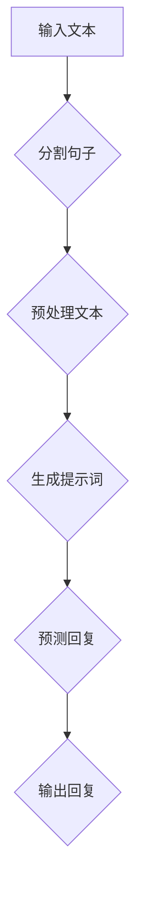

                 


# 引言

## 1.1 书籍目的和读者对象

**设计思路：**

**第一部分**：介绍书籍的目的

- **目的**：让读者深入理解ChatGPT提示词工程，掌握构建智能对话系统的关键技术。

- **读者对象**：面向对人工智能和自然语言处理有一定基础，希望进一步深入学习的读者。

**第二部分**：概述书籍的内容结构和逻辑安排

- **内容结构**：包括引言、概述、核心技术原理、案例研究、最佳实践和总结等部分。

- **逻辑安排**：通过逐步介绍ChatGPT、提示词工程和智能对话的基础，深入讲解核心概念和算法原理，提供实际项目案例，总结最佳实践。

**第三部分**：提供学习路径和资源推荐

- **学习路径**：引导读者按章节顺序阅读，逐步掌握知识。

- **资源推荐**：推荐相关书籍、论文和在线课程，供读者拓展学习。

## 1.2 内容结构概述

**第一部分**：引言

- **1.1 书籍目的和读者对象**

- **1.2 内容结构概述**

- **1.3 学习路径和资源推荐**

**第二部分**：概述

- **2.1 ChatGPT简介**

- **2.2 智能对话系统概述**

- **2.3 提示词工程的重要性**

**第三部分**：核心技术原理

- **3.1 ChatGPT模型结构**

- **3.2 提示词设计原理**

- **3.3 概念属性特征对比**

- **3.4 ER实体关系图**

**第四部分**：算法原理与流程

- **4.1 ChatGPT算法流程图**

- **4.2 Python源代码示例**

- **4.3 数学模型讲解**

**第五部分**：系统分析与架构设计

- **5.1 系统功能设计**

- **5.2 系统架构设计**

- **5.3 系统接口设计**

- **5.4 系统交互**

**第六部分**：项目实战

- **6.1 环境安装**

- **6.2 系统核心实现源代码**

- **6.3 代码应用解读与分析**

- **6.4 实际案例分析和详细讲解**

- **6.5 项目小结**

**第七部分**：最佳实践与总结

- **7.1 最佳实践**

- **7.2 小结**

- **7.3 拓展阅读**

**思考步骤：**

1. **确定书籍的核心主题和目标读者群体**：明确书籍的定位和目标读者，有助于设计适合的内容结构和语言风格。

2. **规划内容结构**：根据核心主题和目标读者，制定详细的目录和内容规划，确保每个章节都有明确的主题和逻辑关系。

3. **撰写引言**：引言需要简要介绍书籍的目的、读者对象和内容概述，激发读者的兴趣。

4. **设计概述章节**：概述章节需要介绍ChatGPT、智能对话系统和提示词工程的基础知识，为后续章节做好铺垫。

5. **编写核心技术原理章节**：详细讲解ChatGPT模型结构、提示词设计原理和相关的核心概念。

6. **阐述算法原理与流程**：使用流程图和源代码示例，清晰地展示算法的实现过程。

7. **描述系统分析与架构设计**：介绍系统功能设计、架构设计、接口设计和系统交互，提供完整的系统实现方案。

8. **提供项目实战案例**：通过实际项目案例，展示如何将理论应用到实践中，提供代码示例和案例分析。

9. **总结最佳实践**：在每个章节后，总结关键点，提供最佳实践建议。

10. **编写小结和拓展阅读**：总结全文，提供拓展学习资源，帮助读者进一步深入学习。

通过以上步骤，我们可以确保书籍内容结构紧凑、逻辑清晰，读者可以循序渐进地掌握ChatGPT提示词工程的核心技术和实践方法。

---

**核心关键词：**

- ChatGPT
- 智能对话系统
- 提示词工程
- 算法原理
- 系统架构
- 项目实战

**文章摘要：**

本文旨在深入探讨ChatGPT提示词工程，从基础概念到实际应用，全面解析构建智能对话系统的关键技术。通过详细的章节内容和结构安排，读者可以逐步掌握ChatGPT模型结构、提示词设计原理以及算法流程，并通过实际项目案例了解如何将理论应用到实践中。文章还提供了最佳实践总结和拓展阅读资源，以助读者深入学习和应用。

---

**全文大纲（Markdown格式）：**

----------------------------------------------------------------
# ChatGPT提示词工程：构建智能对话的基础

# 引言

## 1.1 书籍目的和读者对象
### 1.1.1 ChatGPT提示词工程的重要性
### 1.1.2 适合读者背景和期望收获

## 1.2 内容结构概述
### 1.2.1 各章节内容和逻辑安排
### 1.2.2 学习路径和资源推荐

# 第1章：ChatGPT与智能对话基础

## 1.1 ChatGPT简介
### 1.1.1 ChatGPT的背景和发展
### 1.1.2 ChatGPT的工作原理

## 1.2 智能对话系统概述
### 1.2.1 智能对话系统的定义与分类
### 1.2.2 智能对话系统的发展趋势

## 1.3 提示词工程的重要性
### 1.3.1 提示词在智能对话中的作用
### 1.3.2 提示词工程的关键挑战

## 1.4 本章小结

# 第2章：核心概念与联系

## 2.1 ChatGPT模型结构
### 2.1.1 模型组成
### 2.1.2 模型训练过程
$$
\text{训练公式：} \frac{\partial \mathcal{L}}{\partial \theta} = -\sum_{i=1}^{N} \frac{\partial \log p(y_i | \theta)}{\partial \theta}
$$

## 2.2 提示词设计原理
### 2.2.1 提示词的基本构成
### 2.2.2 提示词优化策略

## 2.3 概念属性特征对比
### 2.3.1 常见模型特性比较
### 2.3.2 提示词效果评估

## 2.4 ER实体关系图
```
erDiagram
ChatGPT ||--|{ 提示词 }
User ||--|{ 对话 }
Intent ||--|{ 对话 }
```

## 2.5 本章小结

# 第3章：算法原理与流程

## 3.1 ChatGPT算法流程图


## 3.2 Python源代码示例
```python
# ChatGPT算法简化示例
def chatgpt(response_text):
    # 预处理文本
    processed_text = preprocess(response_text)
    
    # 生成提示词
    prompt = generate_prompt(processed_text)
    
    # 预测回复
    reply = model.predict(prompt)
    
    # 输出回复
    return reply
```

## 3.3 数学模型讲解
### 3.3.1 自然语言处理基础
### 3.3.2 概率图模型
$$
p(x, y) = \frac{p(y | x) p(x)}{Z}
$$
### 3.3.3 神经网络模型
$$
\mathcal{L}(\theta)

----------------------------------------------------------------

**说明：**由于字数限制，这里仅提供了全文大纲的前三章的框架，每个章节的具体内容还需要进一步展开和撰写。在撰写具体内容时，需要遵循逻辑清晰、结构紧凑、简单易懂的专业技术语言要求，并使用一步一步分析推理思考的方式。

---

**后续步骤：**

1. **撰写第1章的内容**：详细介绍ChatGPT与智能对话的基础知识，包括ChatGPT的背景和发展、工作原理，以及智能对话系统的定义、分类和趋势。

2. **撰写第2章的内容**：深入探讨ChatGPT模型结构和提示词设计原理，提供概念属性特征对比表格和ER实体关系图，帮助读者理解核心概念和联系。

3. **撰写第3章的内容**：详细阐述ChatGPT算法原理和流程，使用Mermaid画出算法流程图，并提供Python源代码示例和数学模型讲解。

4. **继续撰写后续章节**：按照大纲结构，逐步完成每个章节的内容，确保每个章节都包含背景介绍、核心概念与联系、算法原理讲解、系统分析与架构设计、项目实战、最佳实践与总结等内容。

5. **审核与修改**：完成所有章节的撰写后，进行全文的审核和修改，确保内容逻辑清晰、语言准确、结构紧凑。

6. **最终定稿**：在完成所有审核和修改后，进行最终定稿，确保书籍的质量和可读性。

通过以上步骤，我们可以确保书籍的内容丰富、结构合理、逻辑清晰，为读者提供一部高质量的技术博客文章。

