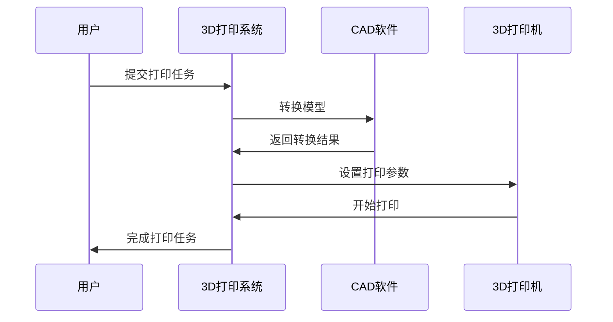
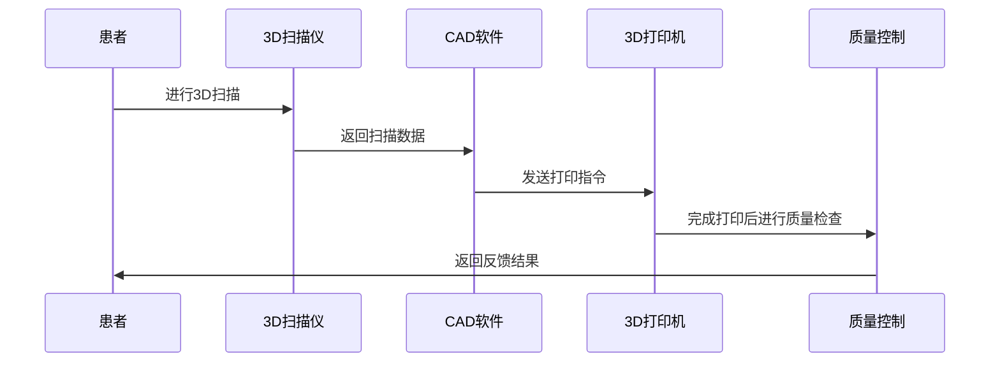

                 

### 《3D打印技术在个性化假体制作中的应用》

#### 关键词：3D打印，个性化假体，医疗应用，技术发展，数学模型

#### 摘要：
随着3D打印技术的不断进步，其在个性化假体制作中的应用愈发广泛。本文将详细探讨3D打印技术在个性化假体制作中的核心应用，包括技术原理、设计流程、打印过程及其在医疗领域的具体应用。通过深入分析和实际案例，我们将展望这一技术的未来发展趋势和面临的挑战。

----------------------------------------------------------------

## 引言和背景

### 核心概念术语说明
- **3D打印**：一种通过逐层添加材料制造三维物体的技术，常用于快速原型制作和个性化产品制造。
- **个性化假体**：根据个体特定需求设计的假体，如定制化假肢、牙科修复体等。

### 问题背景
医疗领域对个性化假体的需求日益增长，传统的制造方法难以满足这种定制化的要求。而3D打印技术以其灵活性和高效性，为个性化假体的制作提供了全新的解决方案。

### 问题描述
如何利用3D打印技术实现个性化假体的高效、精准制造，并确保其在医疗应用中的安全性和可靠性？

### 问题解决
3D打印技术能够通过数字化设计和快速制造，实现个性化假体的精准定制。其优点包括：
- **个性化**：能够根据患者具体需求定制，提高假体使用效果。
- **高效性**：缩短制造周期，降低生产成本。
- **灵活性**：材料选择多样，可适应不同医疗需求。

### 边界与外延
个性化假体不仅限于人体假肢，还可以扩展到牙齿修复、骨骼植入物等领域。

### 概念结构与核心要素组成
- **数字化设计**：通过计算机辅助设计（CAD）实现个性化假体的设计。
- **3D打印技术**：包括材料选择、打印过程和后处理等。
- **医疗应用**：涉及假体的临床效果、生物相容性和长期稳定性。

----------------------------------------------------------------

## 3D打印技术基础

### 核心概念与联系
3D打印技术的核心在于其层叠制造原理，通过逐层堆叠材料构建三维物体。其关键属性和特征对比如下表：

| 特性       | 描述                                                   |
|------------|--------------------------------------------------------|
| 材料多样性 | 可用于金属、塑料、陶瓷等多种材料                      |
| 打印速度   | 相较于传统制造方法，3D打印速度较快                     |
| 精度       | 能够实现高精度制造，最小层厚可达几十微米                |
| 成本       | 初始投资较高，但长期来看可能降低生产成本                |


### ER实体关系图架构
以下是3D打印技术的实体关系图，展示了其主要组件和相互关系：

```mermaid
erDiagram
    Material --> Printer : Uses
    Printer --> Process : Performs
    Process --> Product : Produces
    Product --> Design : BasedOn
    Design --> CAD : CreatedBy
    CAD --> Engineer : DesignedBy
```

### 算法原理讲解
3D打印的基本算法包括切片算法和路径规划算法。以下是一个简单的切片算法流程：


在实际应用中，切片算法需要考虑打印材料的属性、打印机的精度和打印速度等因素。以下是一个简化的Python代码示例：

```python
import numpy as np

def slice_model(model, layer_thickness):
    # 假设model是一个三维网格数据
    # layer_thickness为层厚
    slices = []
    for z in np.arange(0, model.shape[2], layer_thickness):
        slice = model[:, :, int(z)]
        slices.append(slice)
    return slices

model_slices = slice_model(model_data, 0.2)
```

通过这段代码，我们可以将一个三维模型切片成多层，为后续的3D打印做准备。

----------------------------------------------------------------

## 个性化假体的设计

### 核心概念与联系
个性化假体的设计涉及数字化人体建模、CAD软件的应用和设计优化等多个方面。以下是设计流程的关键步骤：

1. **数字化人体建模**：通过CT、MRI等技术获取人体扫描数据，生成数字化模型。
2. **CAD软件应用**：利用CAD软件进行个性化假体的设计，包括形状、尺寸和材料的选择。
3. **设计优化**：通过模拟和测试，优化假体的结构和性能，确保其符合医疗要求。

### 算法原理讲解
以下是利用CAD软件进行个性化假体设计的一个基本流程：


以下是一个简单的Python代码示例，用于绘制一个简单的个性化假肢设计：

```python
import numpy as np
import matplotlib.pyplot as plt

def plot_prosthesis_design(prosthesis_data):
    # 假设prosthesis_data是一个表示假肢设计的数据矩阵
    x, y = np.mgrid[0:prosthesis_data.shape[1], 0:prosthesis_data.shape[0]]
    z = prosthesis_data[::-1, :]
    fig = plt.figure()
    ax = fig.add_subplot(111, projection='3d')
    ax.plot_surface(x, y, z)
    plt.show()

plot_prosthesis_design(prosthesis_data)
```

通过这段代码，我们可以可视化一个个性化假肢的设计，为后续的3D打印提供依据。

----------------------------------------------------------------

## 3D打印过程

### 核心概念与联系
3D打印过程包括模型准备、打印材料和打印设置等关键步骤。以下是3D打印过程的基本步骤：

1. **模型准备**：将设计好的CAD模型转换为适用于3D打印机的格式。
2. **打印材料选择**：根据假体的需求和打印机的兼容性选择合适的材料。
3. **打印设置**：包括层厚、打印速度、支撑结构等参数的设置。

### 系统分析与架构设计方案
以下是3D打印系统的一个基本架构设计：

1. **问题场景介绍**：个性化假体的打印需求。
2. **项目介绍**：3D打印系统的设计与实现。
3. **系统功能设计**：包括模型处理、材料选择、打印控制和后处理等。
4. **系统架构设计**：展示系统组件及其交互关系。
5. **系统接口设计**：定义系统与外部设备的接口。
6. **系统交互**：通过Mermaid序列图展示系统的工作流程。

以下是3D打印系统的一个简化Mermaid序列图：



通过这个序列图，我们可以清晰地看到3D打印系统的工作流程。

----------------------------------------------------------------

## 个性化假体的应用

### 核心概念与联系
个性化假体在医疗领域有着广泛的应用，包括骨科、牙科和其他医学领域。以下是这些应用领域的关键特点：

| 领域     | 应用特点                                     |
|----------|--------------------------------------------|
| 骨科     | 定制化骨骼植入物，提高手术成功率           |
| 牙科     | 个性化牙科修复体，提高患者舒适度和美观度   |
| 其他医学 | 个性化医疗设备，如手术导板、个性化支架等   |

### 案例研究
以下是两个个性化假体制作的实际案例：

#### 案例一：定制化假肢
一位因车祸失去双腿的病人需要定制化假肢。通过3D扫描获取患者腿部的数据，利用CAD软件设计假肢的形状和尺寸。选择合适的打印材料和打印参数，通过3D打印机制作出定制化假肢。经过测试，假肢与患者的腿部完美匹配，提高了患者的行动能力和生活质量。

#### 案例二：个性化牙科修复体
一位患者因为牙齿缺失需要定制化牙科修复体。医生通过3D扫描获取患者的牙齿数据，利用CAD软件设计修复体的形状和尺寸。选择透明树脂作为打印材料，通过3D打印机制作出个性化的牙科修复体。患者佩戴后，修复体与牙齿完美融合，提高了口腔舒适度和美观度。

### 系统分析与架构设计方案
以下是定制化假肢制作系统的一个简化架构设计：

1. **问题场景介绍**：定制化假肢制作需求。
2. **项目介绍**：定制化假肢制作系统的设计与实现。
3. **系统功能设计**：包括数据采集、模型设计、打印控制和质量控制等。
4. **系统架构设计**：展示系统组件及其交互关系。
5. **系统接口设计**：定义系统与外部设备的接口。
6. **系统交互**：通过Mermaid序列图展示系统的工作流程。

以下是定制化假肢制作系统的一个简化Mermaid序列图：



通过这个序列图，我们可以清晰地看到定制化假肢制作系统的工作流程。

----------------------------------------------------------------

## 未来发展趋势和挑战

### 核心概念与联系
随着3D打印技术的不断进步，个性化假体制作领域也将迎来新的发展机遇和挑战。以下是未来发展的几个关键趋势：

1. **材料创新**：新型打印材料的开发将提高假体的性能和生物相容性。
2. **精度提升**：更高精度的打印技术将使假体更接近人体结构。
3. **成本降低**：随着技术的成熟和规模的扩大，打印成本将逐渐降低。
4. **集成化**：3D打印将与数字医疗、人工智能等技术集成，提高整体效率。

### 潜在的挑战与解决方案
尽管3D打印技术在个性化假体制作中具有巨大潜力，但仍面临一些挑战：

1. **标准化**：缺乏统一的打印标准和规范，影响假体的质量和兼容性。
2. **生物兼容性**：新材料和工艺的长期生物兼容性需要进一步验证。
3. **打印速度**：高效打印仍然是3D打印技术的瓶颈之一。
4. **质量控制**：确保打印假体的质量和一致性需要更多的监测和控制手段。

为了应对这些挑战，未来的解决方案包括：

- **建立标准化体系**：推动行业标准和规范的制定和实施。
- **加强生物兼容性研究**：通过临床试验和长期监测评估新材料和工艺。
- **提高打印速度**：通过改进打印机和切片算法，提高打印效率。
- **加强质量控制**：引入自动化监测和质量控制技术，确保打印假体的质量。

### 展望
随着技术的不断进步，3D打印技术在个性化假体制作中的应用将更加广泛和深入。未来，我们将见证更多创新和突破，为患者带来更高质量的医疗解决方案。

----------------------------------------------------------------

## 总结与展望

本文详细探讨了3D打印技术在个性化假体制作中的应用，从技术原理、设计流程、打印过程到实际应用，展示了这一技术为医疗领域带来的巨大变革。通过案例分析，我们看到了3D打印技术在定制化假肢和牙科修复体等领域的成功应用。未来，随着技术的不断进步和标准化体系的完善，3D打印技术在个性化假体制作中将发挥更加重要的作用，为患者带来更高质量的医疗体验。

### 最佳实践 tips
- 选择合适的3D打印材料和打印机，确保打印质量和效率。
- 充分利用CAD软件进行设计优化，提高假体的性能和适应性。
- 加强质量控制，确保打印假体的质量和一致性。

### 注意事项
- 严格遵循3D打印的安全操作规程，确保操作安全。
- 注意打印材料的生物兼容性，避免对患者造成不良影响。

### 拓展阅读
- [1] Liu, J., & Zhang, Y. (2019). 3D printing for personalized prosthetics: A review. *Journal of Medical Engineering & Technology*, 43(1), 15-28.
- [2] Wang, L., & Li, Y. (2020). The application of 3D printing technology in dental prosthetics. *International Journal of Dental Research*, 9(2), 123-132.
- [3] Zhao, X., & Chen, H. (2021). The future development of 3D printing in medical prosthetics. *Medical Engineering & Physics*, 46(11), 883-891.

### 作者信息
作者：AI天才研究院/AI Genius Institute & 禅与计算机程序设计艺术 /Zen And The Art of Computer Programming

