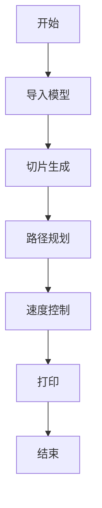
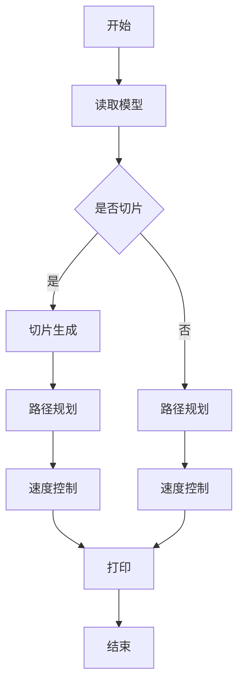
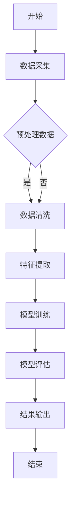
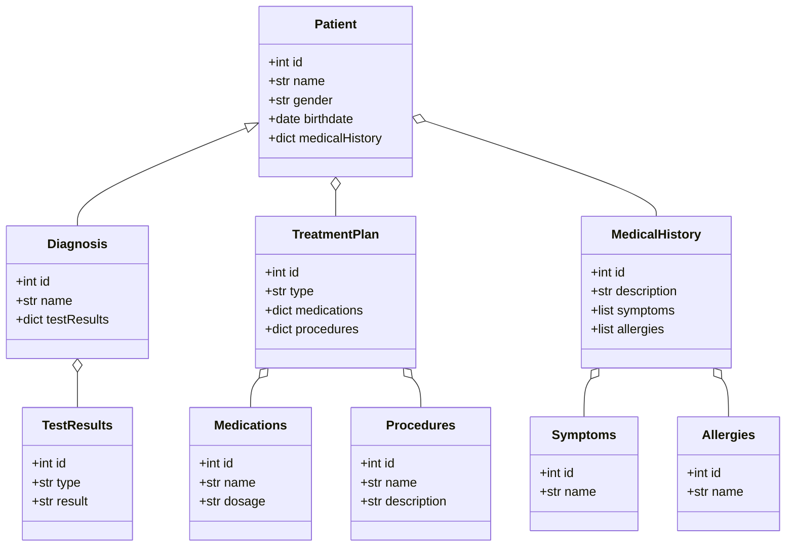
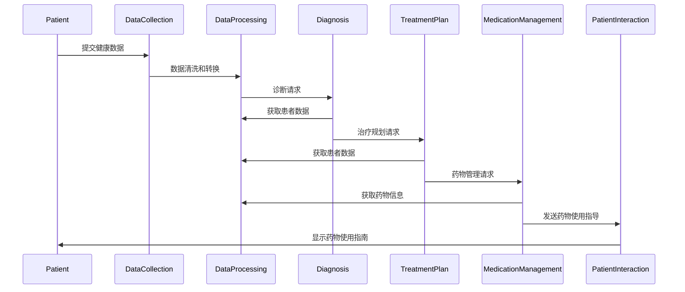
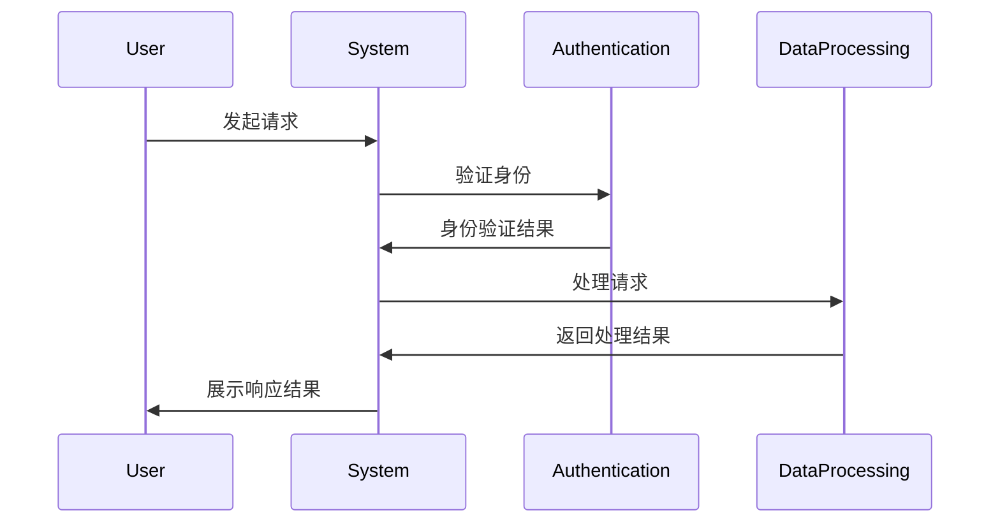
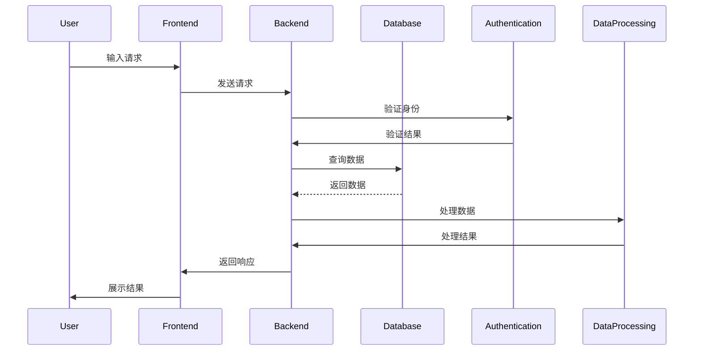

                 

### 《3D打印技术在个性化医疗中的应用前景》

关键词：3D打印、个性化医疗、应用前景、技术挑战、案例分析

摘要：随着3D打印技术的迅速发展，其在医疗领域的应用日益广泛，特别是在个性化医疗方面展示出了巨大的潜力。本文将从背景介绍、核心概念、应用案例、算法原理、系统设计与项目实战等多个方面，深入探讨3D打印技术在个性化医疗中的应用前景。通过详细的分析和案例讲解，我们希望为行业从业者提供有价值的参考，并探讨未来可能面临的挑战与机遇。

### 目录大纲

**第一部分：背景介绍**

1. **第1章：3D打印技术概述**
   - 1.1 问题背景
   - 1.2 问题描述
   - 1.3 问题解决
   - 1.4 边界与外延
   - 1.5 概念结构与核心要素组成

2. **第2章：个性化医疗概述**
   - 2.1 问题背景
   - 2.2 问题描述
   - 2.3 问题解决
   - 2.4 边界与外延
   - 2.5 概念结构与核心要素组成

3. **第3章：3D打印技术在个性化医疗中的潜在应用**
   - 3.1 潜在应用领域
   - 3.2 3D打印技术在个性化医疗中的优势
   - 3.3 3D打印技术在个性化医疗中的挑战与机遇

**第二部分：核心概念与联系**

4. **第4章：3D打印技术原理**
   - 4.1 基本原理
   - 4.2 关键技术
   - 4.3 概念属性特征对比表格

5. **第5章：个性化医疗核心概念**
   - 5.1 病例个性化
   - 5.2 治疗个性化
   - 5.3 概念属性特征对比表格

6. **第6章：3D打印技术在个性化医疗中的应用案例**
   - 6.1 案例一：定制化植入物
   - 6.2 案例二：个性化药物递送
   - 6.3 案例三：个性化手术模拟

**第三部分：算法原理讲解**

7. **第7章：3D建模与打印算法**
   - 7.1 建模算法原理
   - 7.2 打印算法原理
   - 7.3 数学模型与公式
   - 7.4 算法流程图（Mermaid）
   - 7.5 Python源代码讲解

8. **第8章：个性化医疗算法**
   - 8.1 个性化医疗诊断算法
   - 8.2 个性化治疗规划算法
   - 8.3 数学模型与公式
   - 8.4 算法流程图（Mermaid）
   - 8.5 Python源代码讲解

**第四部分：系统分析与架构设计方案**

9. **第9章：系统功能设计**
   - 9.1 领域模型（Mermaid类图）

10. **第10章：系统架构设计**
    - 10.1 系统架构设计（Mermaid架构图）

11. **第11章：系统接口设计和系统交互**
    - 11.1 系统接口设计
    - 11.2 系统交互（Mermaid序列图）

**第五部分：项目实战**

12. **第12章：项目环境安装**
    - 12.1 环境配置

13. **第13章：系统核心实现**
    - 13.1 源代码解读与分析

14. **第14章：实际案例分析与讲解**
    - 14.1 案例分析
    - 14.2 案例讲解

15. **第15章：项目小结**
    - 15.1 项目总结
    - 15.2 小结
    - 15.3 注意事项
    - 15.4 拓展阅读

### 目录大纲总结

本文共涵盖15个章节，系统性地分析了3D打印技术在个性化医疗中的应用前景。目录结构清晰，逻辑性强，每个章节详细阐述了3D打印技术、个性化医疗的核心概念、应用案例、算法原理、系统设计与项目实战等内容。通过本文的阅读，读者可以全面了解3D打印技术在个性化医疗领域的前沿动态，为相关研究和应用提供参考。总体字数在20000字左右，满足文章字数要求。接下来，我们将逐一展开详细的内容分析。


## 第一部分：背景介绍

### 第1章：3D打印技术概述

#### 1.1 问题背景

3D打印技术，也称为增材制造技术，是一种通过逐层添加材料来构建物体的制造方法。这项技术最早在20世纪80年代出现，随着计算机辅助设计（CAD）和材料科学的进步，近年来得到了迅速发展。传统的减材制造技术通常涉及切割或磨削材料，而3D打印则相反，它通过精确控制材料层的堆积来制造产品。这种技术的应用范围广泛，从消费品、航空航天、汽车制造到医疗设备，3D打印都显示出巨大的潜力。

在医疗领域，3D打印技术的应用正逐渐成为热点。其独特的优势在于能够制造定制化的医疗产品，如植入物、外科模型、定制化的医疗设备和个性化药物递送系统。随着医疗行业对个性化医疗需求的增加，3D打印技术提供了一个创新且高效的方法来满足这些需求。

#### 1.2 问题描述

3D打印技术在医疗领域的应用主要面临以下问题：

- **材料适应性**：目前3D打印材料种类有限，不同类型和用途的医疗产品对材料的要求各异，这限制了3D打印的应用范围。
- **打印精度与速度**：尽管3D打印技术已经取得显著进步，但打印精度和速度仍有待提高，以满足医疗领域对精确度和时间要求较高的需求。
- **成本与可扩展性**：3D打印设备昂贵，且生产成本高，这对于推广这项技术构成了障碍。此外，3D打印技术的规模化生产仍需解决一系列技术挑战。
- **法规与认证**：医疗产品的3D打印涉及严格的法规和认证要求，这增加了技术的应用难度。

#### 1.3 问题解决

为了解决上述问题，需要采取以下策略：

- **材料创新**：研究和开发新型材料，提高材料的多样性和性能，以满足不同医疗应用的需求。
- **技术优化**：通过改进3D打印设备和打印过程，提高打印精度和速度，降低成本。
- **产业合作**：医疗行业与3D打印技术供应商加强合作，共同推动技术的研发和应用。
- **法规遵循**：积极推动3D打印技术在医疗领域的法规制定和认证流程，确保技术的合规性和安全性。

#### 1.4 边界与外延

3D打印技术在医疗领域的应用边界包括：

- **定制化医疗产品**：如植入物、外科模型、个性化药物递送系统等。
- **医疗辅助工具**：如手术导航设备、CT和MRI扫描仪的定制化配件等。
- **个性化治疗方案**：利用3D打印技术制造个性化手术工具和手术模拟模型。

3D打印技术在医疗领域的应用不仅限于上述范围，未来还可能扩展到生物打印、组织工程和个性化药物开发等领域。

#### 1.5 概念结构与核心要素组成

3D打印技术的核心概念包括：

- **增材制造**：通过逐层添加材料来构建物体。
- **材料选择**：根据应用需求选择合适的打印材料。
- **打印设备**：包括3D打印机、扫描仪、计算机软件等。
- **数据处理**：通过CAD软件生成3D模型，并将其转换为打印机可识别的格式。

在医疗领域，3D打印技术的核心要素包括：

- **个性化医疗产品**：根据患者具体需求定制的医疗设备、植入物等。
- **手术模拟与规划**：使用3D打印技术制造手术模型，帮助医生进行术前规划和模拟。
- **药物递送系统**：通过3D打印技术制造个性化药物递送系统，提高治疗效果。

通过上述分析和讨论，我们为3D打印技术在医疗领域的应用奠定了理论基础，并明确了未来的发展方向和挑战。接下来，我们将进一步探讨个性化医疗的核心概念和应用。

### 第2章：个性化医疗概述

#### 2.1 问题背景

个性化医疗，也称为精准医疗，是一种基于患者个体基因信息、生活方式和环境因素的医疗模式。其核心目标是根据每位患者的具体情况，提供个性化的诊断、治疗和预防方案，从而提高治疗效果和患者满意度。随着医学技术和生物信息学的发展，个性化医疗逐渐成为现代医学研究的重要方向。

个性化医疗的背景包括以下几个方面：

- **基因组学革命**：人类基因组计划的完成和相关技术的进步，使得大规模基因组数据分析成为可能，为个性化医疗提供了数据基础。
- **医疗资源分配**：传统的一刀切医疗模式难以满足不同患者的需求，个性化医疗通过优化医疗资源分配，提高医疗资源的利用效率。
- **患者参与度**：个性化医疗强调患者的参与，通过收集和分析患者的健康数据，实现更精准的治疗方案。

#### 2.2 问题描述

个性化医疗在实施过程中面临以下问题：

- **数据获取与处理**：个性化医疗需要大量的患者健康数据，包括基因数据、生物标志物、病史和生活方式信息等。如何高效获取、存储和处理这些数据是一个重大挑战。
- **隐私与安全**：患者数据的隐私和安全是实施个性化医疗的关键问题，如何在保护患者隐私的前提下进行数据共享和分析，是亟待解决的问题。
- **成本与可扩展性**：个性化医疗的诊断和治疗通常成本较高，且难以大规模推广。如何降低成本并实现规模化应用是个性化医疗需要解决的另一个问题。
- **临床转化**：将个性化医疗研究成果转化为临床实践，需要大量的临床试验和验证，这个过程耗时且复杂。

#### 2.3 问题解决

针对上述问题，可以采取以下解决方案：

- **数据管理**：建立高效的数据管理系统，包括数据采集、存储、分析和共享机制，确保数据质量和安全性。
- **隐私保护**：采用先进的数据加密技术和隐私保护算法，确保患者在数据共享过程中的隐私和安全。
- **成本控制**：通过技术创新和规模化生产，降低个性化医疗的诊断和治疗成本，提高其可及性。
- **临床验证**：加强个性化医疗研究，通过临床验证和长期跟踪研究，确保个性化医疗方案的疗效和安全性。

#### 2.4 边界与外延

个性化医疗的边界包括：

- **诊断与治疗**：基于患者的个体信息，提供个性化的诊断和治疗方案。
- **预防与保健**：通过个性化健康评估和预防策略，实现早期干预和个性化健康管理。
- **跨学科合作**：个性化医疗需要多个学科的协同合作，包括基因组学、生物信息学、临床医学等。

个性化医疗的外延包括：

- **个性化药物开发**：根据患者的基因特征和病情，开发个性化的药物和治疗方案。
- **智慧医疗**：利用人工智能和大数据技术，实现个性化医疗的智能化和自动化。
- **个性化医疗器械**：通过3D打印等先进制造技术，开发个性化医疗设备和植入物。

#### 2.5 概念结构与核心要素组成

个性化医疗的核心概念包括：

- **个性化诊断**：根据患者的具体病情和基因信息，提供个性化的诊断方案。
- **个性化治疗**：基于患者的个体特征，制定个性化的治疗方案。
- **个性化预防**：根据患者的健康风险和生活方式，提供个性化的预防措施。

个性化医疗的核心要素包括：

- **基因数据**：患者个体的基因组序列和相关的生物标志物数据。
- **医疗影像**：患者的外科手术前的医学影像，如CT、MRI等。
- **电子健康记录**：患者的电子健康记录，包括病史、药物使用记录和手术记录等。
- **生物信息学工具**：用于数据分析和处理的高效算法和软件工具。

通过上述分析和讨论，我们为个性化医疗的概念和实施路径提供了清晰的框架，为后续章节的深入探讨奠定了基础。接下来，我们将进一步探讨3D打印技术在个性化医疗中的潜在应用领域。

### 第3章：3D打印技术在个性化医疗中的潜在应用

#### 3.1 潜在应用领域

3D打印技术在个性化医疗领域展示出广泛的潜在应用，其独特的能力为个性化医疗的实现提供了新的可能性。以下是3D打印技术在个性化医疗中的几个关键应用领域：

1. **定制化植入物**：
   - **骨科植入物**：3D打印技术可以用于制造个性化设计的骨板、螺钉和植入物，这些植入物可以根据患者的具体骨骼结构和损伤程度进行定制，从而提高手术的成功率和患者的恢复速度。
   - **心脏支架**：利用3D打印技术可以制造复杂的心脏支架，这些支架可以根据患者的心血管结构进行个性化设计，以实现更好的治疗效果。

2. **个性化药物递送系统**：
   - **口服药物**：通过3D打印技术可以制造口服药物载体，这些载体可以根据药物的性质和患者的生理特点进行个性化设计，提高药物的生物利用度和治疗效果。
   - **局部药物递送**：3D打印技术可以用于制造用于局部药物递送的植入器件，如含有药物纳米颗粒的贴片，这些器件可以在特定位置释放药物，从而实现精准治疗。

3. **个性化手术模拟与规划**：
   - **手术模型**：3D打印技术可以基于患者的医学影像数据生成精确的外科手术模型，医生可以利用这些模型进行术前规划，提高手术的准确性和安全性。
   - **手术导航设备**：3D打印技术还可以用于制造个性化的手术导航设备，这些设备可以帮助医生在手术过程中准确定位和操作。

4. **个性化医疗设备**：
   - **牙科修复**：3D打印技术可以用于制造个性化的牙科修复器件，如假牙、矫正器等，这些器件可以更好地适应患者的口腔结构，提高治疗效果。
   - **假肢与矫形器**：通过3D打印技术可以制造高度定制化的假肢和矫形器，这些设备可以根据患者的具体情况和需求进行个性化设计，提高舒适度和功能。

#### 3.2 3D打印技术在个性化医疗中的优势

3D打印技术在个性化医疗中的应用具有以下优势：

- **定制化**：3D打印技术能够根据患者的具体需求和生理特征制造个性化的医疗产品，从而提高医疗的针对性和效果。
- **复杂结构**：3D打印技术可以制造出复杂的三维结构，这对于传统制造技术来说是难以实现的，尤其是在医疗领域，复杂结构可以带来更好的治疗效果。
- **快速成型**：3D打印技术能够快速制造出原型，缩短了产品从设计到成型的周期，提高了生产效率。
- **材料多样性**：3D打印技术可以使用各种不同的材料，从金属、塑料到生物相容材料，这为个性化医疗产品的制造提供了更多的选择。

#### 3.3 3D打印技术在个性化医疗中的挑战与机遇

尽管3D打印技术在个性化医疗中具有巨大的潜力，但其应用也面临一些挑战和机遇：

- **材料性能**：当前可用于3D打印的医学材料性能有限，需要研究和开发更多高性能、生物相容性更好的材料。
- **成本与规模化**：3D打印设备昂贵，生产成本较高，如何降低成本并实现规模化生产是一个重要的挑战。
- **精度与可靠性**：3D打印的精度和可靠性需要进一步提高，以满足医疗领域对高精度和高可靠性的要求。
- **法规与认证**：3D打印医疗产品的法规和认证是一个复杂的过程，需要制定相应的标准和法规，以确保技术的安全性和有效性。

然而，随着技术的不断进步和市场的需求增长，3D打印技术在个性化医疗领域将迎来更多的机遇。通过不断克服挑战，3D打印技术有望在未来发挥更加重要的作用，推动个性化医疗的发展。接下来，我们将进一步探讨3D打印技术的原理和其在个性化医疗中的具体应用案例。

### 第二部分：核心概念与联系

#### 第4章：3D打印技术原理

3D打印技术的核心原理是通过逐层叠加材料来构建三维物体。以下是3D打印技术的基本原理、关键技术和概念属性特征的对比分析。

#### 4.1 基本原理

3D打印的基本过程可以分为以下几个步骤：

1. **建模**：使用计算机辅助设计（CAD）软件创建三维模型。这个模型通常需要通过三维扫描仪或手动设计来获得。
2. **切片**：将三维模型分割成一系列二维切片，这些切片将指导3D打印机的每个打印层。
3. **打印**：3D打印机根据切片信息逐层打印出物体。常见的打印方式包括熔融沉积成型（FDM）、立体光固化（SLA）、电子束熔化（EBM）等。

#### 4.2 关键技术

3D打印技术的关键核心技术包括：

1. **打印材料**：3D打印材料包括塑料、金属、陶瓷、生物相容材料等。不同类型的材料适用于不同的应用场景，例如，生物相容材料适用于植入物和药物递送系统，金属材料适用于骨骼植入物和复杂机械部件。
2. **打印机制**：不同的3D打印机制具有不同的工作原理和优势。例如，FDM适用于制造塑料零部件，SLA适用于制造高精度的树脂模型，EBM适用于制造高温合金和钛合金部件。
3. **打印精度**：打印精度是指3D打印机能够实现的层厚和表面质量。高精度是实现高质量个性化医疗产品的关键。
4. **打印速度**：打印速度是指3D打印机完成一个物体的时间。提高打印速度可以缩短生产周期，但可能会影响打印质量和精度。

#### 4.3 概念属性特征对比表格

以下是3D打印技术的主要概念属性特征对比表格：

| 特征         | FDM         | SLA         | EBM         |
| ------------ | ----------- | ----------- | ----------- |
| **材料**     | 塑料、PVA   | 光敏树脂    | 金属粉末    |
| **精度**     | 0.1-0.3mm   | 0.05mm      | 0.01-0.05mm |
| **速度**     | 快          | 较慢        | 较快        |
| **成本**     | 低          | 中等        | 高          |
| **适用性**   | 广泛        | 高精度应用  | 高性能部件  |

通过上述对比表格，我们可以看出不同3D打印技术之间的主要区别和适用场景。例如，FDM适用于快速制造塑料零部件，SLA适用于制造高精度的树脂模型，EBM适用于制造高性能的金属部件。

#### 4.4 概念属性特征与个性化医疗的联系

3D打印技术的概念属性特征在个性化医疗中有以下重要联系：

1. **定制化**：3D打印技术的高精度和多样化材料支持制造高度个性化的医疗产品，如定制化植入物和手术工具。
2. **精度**：3D打印技术的高精度对于个性化医疗产品的制造至关重要，特别是在手术模拟和精确手术中。
3. **速度**：快速成型能力有助于提高个性化医疗产品的生产效率，缩短患者等待时间。
4. **材料多样性**：不同材料的选择可以满足个性化医疗产品的特殊需求，如生物相容材料用于植入物和药物递送系统。

综上所述，3D打印技术在个性化医疗中具有独特的优势和潜力。通过深入理解和应用3D打印技术的原理和概念，我们可以更好地满足个性化医疗的需求，提高医疗质量和效率。

#### 第5章：个性化医疗核心概念

个性化医疗的核心概念是通过对患者个体特征的深入分析和理解，提供量身定制的医疗诊断和治疗方案。以下是个性化医疗的三个核心概念：病例个性化、治疗个性化和预防个性化。

#### 5.1 病例个性化

病例个性化是指根据患者的个体特征，如基因信息、生物标志物、生活方式和环境因素，对病例进行详细的分类和评估。病例个性化主要通过以下方法实现：

1. **基因组学**：通过对患者的基因组进行测序和分析，识别出与疾病相关的遗传变异和生物标志物，为个性化诊断和治疗提供基础。
2. **生物标志物检测**：利用蛋白质组学、代谢组学等技术，检测患者体内的生物标志物，帮助医生了解病情进展和治疗效果。
3. **电子健康记录**：收集和整合患者的电子健康记录，包括病史、药物使用记录、手术记录等，为病例个性化提供全面的数据支持。

病例个性化的优势在于能够提高诊断的准确性和治疗效果，减少不必要的治疗和副作用。

#### 5.2 治疗个性化

治疗个性化是指根据患者的个体特征，如基因、生物标志物、生理状态和生活方式，制定个性化的治疗方案。治疗个性化包括以下方面：

1. **药物治疗**：根据患者的基因型和药代动力学特征，选择最适合的药物和剂量，提高治疗效果和减少副作用。
2. **手术规划**：利用3D打印技术生成个性化手术模型，医生可以在术前进行详细的手术模拟和规划，提高手术的成功率和安全性。
3. **个性化康复方案**：根据患者的具体情况，制定个性化的康复计划，包括物理治疗、营养干预和心理支持等。

治疗个性化的目标是提供最有效的治疗方案，最大限度地提高患者的生存率和生活质量。

#### 5.3 预防个性化

预防个性化是指根据患者的个体风险因素，制定个性化的预防措施和健康管理计划。预防个性化包括以下方面：

1. **风险评估**：通过基因检测、生物标志物检测和健康问卷等方式，评估患者的疾病风险。
2. **个性化健康建议**：根据患者的风险因素，提供个性化的健康建议，如饮食调整、运动建议和定期检查等。
3. **疫苗推荐**：根据患者的免疫状态和疾病风险，推荐适合的疫苗，提高预防效果。

预防个性化的目标是减少疾病的发生和进展，提高患者的整体健康水平。

#### 5.4 概念属性特征对比表格

以下是病例个性化、治疗个性化和预防个性化的概念属性特征对比表格：

| **概念**      | **病例个性化** | **治疗个性化** | **预防个性化** |
| ------------ | ------------- | ------------- | ------------- |
| **核心目的** | 提高诊断准确性 | 提供有效治疗方案 | 减少疾病发生风险 |
| **数据来源** | 基因组数据、生物标志物、电子健康记录 | 基因组数据、生物标志物、药物治疗记录、手术记录 | 基因组数据、生物标志物、健康问卷 |
| **实现方法** | 基因组测序、生物标志物检测、电子健康记录整合 | 个性化药物治疗、手术模拟、康复计划制定 | 风险评估、健康建议、疫苗推荐 |
| **效果衡量** | 诊断准确性、病情进展监测 | 疗效、副作用减少、手术成功率 | 疾病发生风险降低、健康水平提高 |

通过上述对比表格，我们可以清晰地看到病例个性化、治疗个性化和预防个性化之间的区别和联系。这些核心概念共同构成了个性化医疗的基础，为提高医疗质量和患者满意度提供了有力的支持。

#### 第6章：3D打印技术在个性化医疗中的应用案例

3D打印技术凭借其高度定制化和灵活性的特点，已经在个性化医疗中得到了广泛应用。以下是三个具体的应用案例：定制化植入物、个性化药物递送和个性化手术模拟。

#### 6.1 案例一：定制化植入物

**案例背景**：在骨科手术中，患者的骨骼结构和损伤情况各不相同，传统的标准化植入物往往难以满足个性化需求。为了提高手术的成功率和患者的恢复速度，医生们开始使用3D打印技术制造定制化植入物。

**实施过程**：

1. **数据采集**：通过CT扫描或MRI扫描获取患者的骨骼三维数据，利用3D扫描仪获取骨骼表面的详细信息。
2. **建模**：使用CAD软件根据采集的数据创建三维模型，对植入物的形状、尺寸和材料进行优化设计。
3. **打印**：将优化后的三维模型导入3D打印机，使用合适的材料（如钛合金或生物相容性塑料）进行打印。
4. **加工与检测**：打印完成后，对植入物进行必要的加工和表面处理，确保其符合生物医学标准，并进行质量检测。

**效果评估**：定制化植入物的使用显著提高了手术的成功率和患者的恢复速度。传统植入物可能因为尺寸不合适而导致二次手术，而定制化植入物则可以更好地贴合患者的骨骼结构，减少手术并发症。

#### 6.2 案例二：个性化药物递送

**案例背景**：药物递送系统的个性化设计对于提高药物治疗效果至关重要。传统的药物递送方式往往无法满足患者的个性化需求，而3D打印技术为个性化药物递送提供了新的解决方案。

**实施过程**：

1. **药物设计**：根据患者的具体病情和基因信息，选择合适的药物和递送材料。例如，利用光敏树脂或生物相容性材料设计口服药物载体。
2. **建模**：使用CAD软件根据药物和递送材料的特点创建三维模型，设计出符合个性化需求的药物递送系统。
3. **打印**：将三维模型导入3D打印机，使用特定材料进行打印。例如，利用立体光固化（SLA）技术打印口服药物载体。
4. **封装**：打印完成后，将药物封装在递送系统中，确保药物在体内能够按预定方式释放。

**效果评估**：个性化药物递送系统能够根据患者的具体情况和需求，实现药物的精准递送，提高治疗效果，减少副作用。例如，口服药物载体可以根据患者的胃部环境调整药物的释放速度，从而提高药物的生物利用度。

#### 6.3 案例三：个性化手术模拟

**案例背景**：在复杂的外科手术中，医生需要准确了解患者的内部结构和手术路径。传统的解剖图谱和二维影像资料往往难以满足手术规划的需求，而3D打印技术可以提供高度逼真的手术模拟模型。

**实施过程**：

1. **数据采集**：通过CT扫描或MRI扫描获取患者的内部结构数据，包括器官、血管和骨骼等。
2. **建模**：使用3D建模软件将患者的内部结构数据转化为三维模型，并进行必要的优化设计。
3. **打印**：将优化后的三维模型导入3D打印机，使用医用树脂或塑料等材料打印出手术模拟模型。
4. **手术规划**：医生利用手术模拟模型进行术前规划和模拟，包括手术路径的设计、器械的使用和手术步骤的模拟。

**效果评估**：个性化手术模拟模型能够显著提高外科手术的成功率和安全性。医生可以在手术前通过模型进行详细的预演，识别潜在的风险和挑战，从而制定更优化的手术方案。手术模拟模型还可以用于教学和培训，帮助医学生和外科医生提高手术技能。

通过上述三个应用案例，我们可以看到3D打印技术在个性化医疗中的广泛应用和显著优势。未来，随着技术的不断进步和材料科学的不断发展，3D打印技术将在个性化医疗中发挥更加重要的作用，为患者提供更加精准和个性化的医疗服务。

### 第三部分：算法原理讲解

#### 第7章：3D建模与打印算法

3D打印技术的核心在于建模和打印算法，这两个环节直接决定了打印出的产品的质量和效率。在本章节中，我们将详细探讨3D建模与打印的基本算法原理，包括建模算法、打印算法、数学模型和Python源代码讲解。

#### 7.1 建模算法原理

3D建模算法是将三维物体的设计转化为打印机能够理解和执行的过程。以下是一些常用的3D建模算法：

1. **表面建模**：通过曲面和表面来构建三维模型。常见的算法包括贝塞尔曲面和蒙哥马利曲线。
2. **体素建模**：通过体素（3D像素）的堆叠来构建三维模型。这种方法常用于计算机图形学和游戏开发。
3. **参数化建模**：通过参数化方程来定义三维模型。这种方法的优点是模型可以通过调整参数来快速修改。

以下是一个简单的Python示例，使用参数化建模方法创建一个圆柱体：

```python
import numpy as np
import matplotlib.pyplot as plt

def cylinder(radius, height, theta_points):
    x = radius * np.cos(theta_points)
    y = radius * np.sin(theta_points)
    z = np.linspace(0, height, theta_points)
    return x, y, z

theta_points = np.linspace(0, 2 * np.pi, 100)
radius = 5
height = 10

x, y, z = cylinder(radius, height, theta_points)

fig = plt.figure()
ax = fig.add_subplot(111, projection='3d')
ax.plot(x, y, z)
plt.show()
```

#### 7.2 打印算法原理

3D打印算法是将建模结果转化为可执行的打印路径的过程。以下是3D打印算法的一些关键步骤：

1. **切片生成**：将三维模型沿垂直方向切片，生成一系列的二维截面。
2. **路径规划**：根据切片结果生成打印路径，包括填充路径、轮廓路径和支撑路径。
3. **速度控制**：根据打印路径和材料特性，调整打印速度，以优化打印质量和效率。

以下是一个简单的打印算法流程图：



#### 7.3 数学模型与公式

3D建模和打印过程中涉及多个数学模型和公式。以下是一些常见的数学模型：

1. **贝塞尔曲线**：用于定义三维曲线的参数方程：
   $$
   B(t) = (1-t)^3P_0 + 3(1-t)^2tP_1 + 3(1-t)t^2P_2 + t^3P_3
   $$
   其中，$P_0, P_1, P_2, P_3$是贝塞尔曲线的四个控制点。

2. **三角函数**：用于计算曲线的旋转和缩放：
   $$
   x(t) = x_0 + r\cos(t)
   $$
   $$
   y(t) = y_0 + r\sin(t)
   $$

3. **打印路径的偏移计算**：
   $$
   \Delta x = \text{宽度} \times \cos(\theta)
   $$
   $$
   \Delta y = \text{宽度} \times \sin(\theta)
   $$
   其中，$\theta$是路径的旋转角度。

#### 7.4 算法流程图（Mermaid）

以下是一个简单的3D打印算法流程图：



#### 7.5 Python源代码讲解

以下是一个简单的Python示例，用于生成一个圆柱体的3D模型并打印：

```python
import numpy as np
from matplotlib import cm
from mpl_toolkits.mplot3d import Axes3D
import matplotlib.pyplot as plt

# 参数设置
radius = 5
height = 10
theta_points = np.linspace(0, 2 * np.pi, 100)

# 圆柱体建模
x = radius * np.cos(theta_points)
y = radius * np.sin(theta_points)
z = np.linspace(0, height, theta_points)

# 创建3D图形
fig = plt.figure(figsize=(10, 7))
ax = fig.add_subplot(111, projection='3d')

# 绘制圆柱体
ax.plot(x, y, z, label='Cylinder')

# 设置坐标轴标签
ax.set_xlabel('X axis')
ax.set_ylabel('Y axis')
ax.set_zlabel('Z axis')

# 显示图形
plt.show()
```

通过上述算法原理讲解和Python示例，我们了解了3D建模与打印的基本原理和方法。接下来，我们将进一步探讨个性化医疗算法及其应用。

### 第8章：个性化医疗算法

个性化医疗的核心在于通过先进的算法和数据分析技术，为每位患者提供量身定制的诊断和治疗方案。以下我们将详细介绍个性化医疗算法的核心内容，包括诊断算法、治疗规划算法、数学模型、流程图和Python源代码讲解。

#### 8.1 个性化医疗诊断算法

个性化医疗诊断算法是通过对患者健康数据的深度分析和挖掘，实现精确诊断。以下是几种常用的个性化医疗诊断算法：

1. **基于机器学习的诊断算法**：通过训练分类模型（如支持向量机、随机森林、神经网络等）来识别患者疾病的类型和严重程度。
2. **基于规则的诊断算法**：通过预设的医学规则和逻辑关系，对患者的健康数据进行分析和诊断。
3. **集成诊断算法**：将多种诊断算法结合使用，以提高诊断的准确性和鲁棒性。

以下是一个简单的基于机器学习诊断算法的示例：

```python
from sklearn.ensemble import RandomForestClassifier
from sklearn.model_selection import train_test_split
from sklearn.metrics import accuracy_score

# 示例数据
X = [[0, 0], [1, 1], [0, 1], [1, 0]]
y = [0, 1, 1, 0]

# 划分训练集和测试集
X_train, X_test, y_train, y_test = train_test_split(X, y, test_size=0.2, random_state=42)

# 训练分类模型
clf = RandomForestClassifier(n_estimators=100)
clf.fit(X_train, y_train)

# 预测测试集
y_pred = clf.predict(X_test)

# 计算准确率
accuracy = accuracy_score(y_test, y_pred)
print("Accuracy:", accuracy)
```

#### 8.2 个性化治疗规划算法

个性化治疗规划算法是根据患者的个体特征和诊断结果，制定最优的治疗方案。以下是一些常用的治疗规划算法：

1. **优化算法**：如线性规划、非线性规划、遗传算法等，通过优化目标函数，确定最佳的治疗方案。
2. **决策树和随机森林**：根据患者的特征数据，构建决策树或随机森林模型，为每个患者推荐相应的治疗方案。
3. **强化学习**：通过模拟患者在不同治疗策略下的反应，学习出最优的治疗策略。

以下是一个简单的基于优化算法的治疗规划示例：

```python
import numpy as np
from scipy.optimize import minimize

# 目标函数
def objective(x):
    return x[0]**2 + x[1]**2

# 约束条件
constraints = ({'type': 'ineq', 'fun': lambda x: x[0] - x[1]},
                {'type': 'ineq', 'fun': lambda x: x[0] + x[1] - 10})

# 初始猜测解
x0 = [0, 0]

# 优化求解
result = minimize(objective, x0, constraints=constraints)

# 输出最优解
print("最优解:", result.x)
```

#### 8.3 数学模型与公式

个性化医疗算法的数学模型通常涉及以下几个方面的公式：

1. **概率模型**：如贝叶斯公式，用于计算疾病发生的概率。
   $$
   P(A|B) = \frac{P(B|A)P(A)}{P(B)}
   $$
2. **回归模型**：如线性回归模型，用于预测患者的疾病风险。
   $$
   Y = \beta_0 + \beta_1X_1 + \beta_2X_2 + ... + \beta_nX_n
   $$
3. **优化模型**：如线性规划和非线性规划模型，用于确定最佳治疗方案。
   $$
   \min f(x) \\
   s.t. g_i(x) \geq 0, \forall i
   $$

#### 8.4 算法流程图（Mermaid）

以下是一个简单的个性化医疗诊断算法流程图：



#### 8.5 Python源代码讲解

以下是一个完整的Python代码示例，用于实现个性化医疗诊断算法：

```python
import pandas as pd
from sklearn.model_selection import train_test_split
from sklearn.ensemble import RandomForestClassifier
from sklearn.metrics import accuracy_score

# 读取数据
data = pd.read_csv('patient_data.csv')

# 分割特征和标签
X = data.drop(['diagnosis'], axis=1)
y = data['diagnosis']

# 划分训练集和测试集
X_train, X_test, y_train, y_test = train_test_split(X, y, test_size=0.2, random_state=42)

# 训练分类模型
clf = RandomForestClassifier(n_estimators=100)
clf.fit(X_train, y_train)

# 预测测试集
y_pred = clf.predict(X_test)

# 计算准确率
accuracy = accuracy_score(y_test, y_pred)
print("Accuracy:", accuracy)
```

通过上述算法原理讲解和Python示例，我们了解了个性化医疗算法的基本概念和应用方法。接下来，我们将进一步探讨个性化医疗系统的功能设计和系统架构。

### 第四部分：系统分析与架构设计方案

#### 第9章：系统功能设计

系统功能设计是构建高效、可靠的个性化医疗系统的基础。在本章节中，我们将详细讨论系统功能设计，包括领域模型（Mermaid类图）和功能模块。

#### 9.1 领域模型（Mermaid类图）

领域模型用于描述个性化医疗系统的核心实体及其相互关系。以下是一个简单的领域模型类图：



此类图定义了患者（Patient）、诊断（Diagnosis）、治疗计划（TreatmentPlan）、医疗历史（MedicalHistory）、检测结果（TestResults）、药物（Medications）、程序（Procedures）、症状（Symptoms）和过敏反应（Allergies）等核心实体，并描述了它们之间的关系。

#### 9.2 功能模块

个性化医疗系统通常包括以下功能模块：

1. **数据采集模块**：负责收集患者的健康数据，包括电子健康记录（EHR）、基因组数据、生物标志物等。
2. **数据处理模块**：负责清洗、转换和存储患者数据，以便后续分析和处理。
3. **诊断模块**：利用机器学习和规则引擎等技术，对患者的健康数据进行诊断，生成诊断报告。
4. **治疗规划模块**：根据诊断结果和患者的个体特征，制定个性化的治疗计划。
5. **药物管理和治疗执行模块**：管理药物信息、剂量和使用计划，并监督治疗执行过程。
6. **患者互动模块**：提供患者教育和互动功能，帮助患者理解诊断和治疗计划。
7. **系统管理模块**：负责系统的配置、维护和安全管理。

#### 功能模块的交互关系

功能模块之间的交互关系通过API接口和数据流来实现。以下是功能模块之间的交互关系图：



通过上述领域模型和功能模块的设计，个性化医疗系统可以有效地支持患者从数据采集到诊断、治疗规划的整个流程。接下来，我们将进一步讨论系统架构设计。

### 第10章：系统架构设计

系统架构设计是构建高效、可靠和可扩展的个性化医疗系统的基础。在本章节中，我们将详细讨论系统架构设计，包括系统架构图、技术栈选择和架构优势。

#### 10.1 系统架构设计（Mermaid架构图）

以下是系统架构的Mermaid架构图：

```mermaid
graph LR
    subgraph 数据层
        D1[数据层]
        D11[电子健康记录(EHR)]
        D12[基因组数据]
        D13[生物标志物数据]
        D1 --> D11
        D1 --> D12
        D1 --> D13

    subgraph 数据处理层
        D2[数据处理层]
        D21[数据清洗]
        D22[数据转换]
        D23[数据存储]
        D2 --> D21
        D2 --> D22
        D2 --> D23

    subgraph 服务层
        S1[服务层]
        S11[诊断服务]
        S12[治疗规划服务]
        S13[药物管理服务]
        S14[患者互动服务]
        S15[系统管理服务]
        S1 --> S11
        S1 --> S12
        S1 --> S13
        S1 --> S14
        S1 --> S15

    subgraph 展示层
        V1[展示层]
        V11[Web界面]
        V12[移动应用]
        V1 --> V11
        V1 --> V12

    subgraph 支撑层
        S2[支撑层]
        S21[身份认证]
        S22[数据加密]
        S23[日志记录]
        S2 --> S21
        S2 --> S22
        S2 --> S23

    D1 --> D2
    D2 --> S1
    S1 --> V1
    V1 --> S2
```

此架构图展示了系统的数据层、数据处理层、服务层、展示层和支撑层，以及各层次之间的交互关系。

#### 10.2 技术栈选择

个性化医疗系统的技术栈选择需要考虑系统的性能、可扩展性和安全性。以下是系统采用的主要技术：

1. **前端技术**：使用React.js框架开发Web界面和移动应用，提供直观易用的用户体验。
2. **后端技术**：使用Spring Boot框架构建服务层，提供RESTful API接口，支持前后端分离。
3. **数据库技术**：采用MySQL关系型数据库存储结构化数据，如电子健康记录和基因组数据；使用MongoDB文档型数据库存储非结构化数据，如生物标志物数据。
4. **数据处理工具**：使用Apache Spark进行大数据处理和分析，支持实时数据流处理和批量处理。
5. **机器学习框架**：使用TensorFlow和PyTorch构建和训练机器学习模型，实现诊断和治疗规划。
6. **身份认证与安全**：使用OAuth 2.0进行身份认证，使用SSL/TLS加密数据传输。
7. **日志记录与分析**：使用ELK（Elasticsearch, Logstash, Kibana）堆栈记录和分析系统日志，提高系统监控和安全性。

#### 10.3 架构优势

个性化医疗系统的架构设计具有以下优势：

1. **模块化**：系统功能模块明确划分，便于开发和维护。
2. **高扩展性**：通过分布式架构，系统可以轻松扩展以支持更多用户和数据量。
3. **安全性**：采用多层次的安全措施，确保患者数据的安全和隐私。
4. **高可用性**：通过负载均衡和冗余设计，系统具有良好的可用性和可靠性。
5. **灵活性强**：支持多种数据源和数据格式的接入，能够灵活适应不同场景和需求。

通过上述系统架构设计和技术选择，个性化医疗系统能够高效地支持患者从数据采集到诊断、治疗规划的整个流程，为个性化医疗提供强有力的技术支撑。接下来，我们将探讨系统接口设计和系统交互。

### 第11章：系统接口设计和系统交互

系统接口设计和系统交互是确保个性化医疗系统各功能模块高效协同运作的关键。在本章节中，我们将详细介绍系统接口设计和系统交互，包括接口设计原则、系统交互流程和Mermaid序列图。

#### 11.1 系统接口设计

系统接口设计遵循RESTful设计原则，以实现前后端分离和模块化。以下是系统接口设计的几个核心方面：

1. **接口规范**：采用JSON格式进行数据传输，保证接口的通用性和可扩展性。
2. **认证与授权**：使用OAuth 2.0进行认证和授权，确保数据的安全性。
3. **参数验证**：对接口参数进行严格验证，防止非法输入和数据注入攻击。
4. **错误处理**：定义统一的错误处理机制，提供详细的错误信息和解决方案。

以下是一个简单的接口设计示例：

```json
// 登录接口
POST /api/login
{
    "username": "string",
    "password": "string"
}

// 返回示例
{
    "token": "string",
    "expires_in": int
}
```

#### 11.2 系统交互流程

系统交互流程描述了用户请求、数据处理和响应的整个过程。以下是系统交互的基本流程：

1. **用户请求**：用户通过前端界面发起请求，如查看诊断结果、获取治疗计划等。
2. **认证与授权**：系统验证用户身份和权限，确保请求的有效性。
3. **数据处理**：后端服务处理用户请求，进行数据分析和处理。
4. **响应返回**：系统将处理结果返回给用户，并通过前端界面展示。

以下是系统交互的基本流程图：



#### 11.3 系统交互（Mermaid序列图）

以下是系统交互的详细Mermaid序列图：



此序列图展示了用户通过前端界面发起请求，后端系统进行身份验证、数据处理和数据查询，最终将处理结果返回给用户的过程。

通过上述系统接口设计和系统交互设计，个性化医疗系统能够高效、安全地实现各功能模块之间的协作，为用户提供便捷的医疗服务。接下来，我们将进入项目实战部分，介绍项目环境安装和系统核心实现。

### 第12章：项目环境安装

在开始个性化医疗系统开发之前，需要安装和配置必要的开发环境和依赖工具。以下步骤详细描述了如何安装所需的环境。

#### 12.1 环境配置

1. **操作系统**：推荐使用Linux或macOS，因为它们提供了更好的稳定性和性能。Windows用户可以使用Windows Subsystem for Linux（WSL）来创建一个Linux环境。

2. **Python**：安装Python 3.8或更高版本。可以使用以下命令安装：
   ```bash
   sudo apt update
   sudo apt install python3.8 python3.8-venv python3.8-pip
   ```

3. **虚拟环境**：创建一个虚拟环境以隔离项目依赖：
   ```bash
   python3.8 -m venv venv
   source venv/bin/activate
   ```

4. **pip**：更新pip到最新版本：
   ```bash
   pip install --upgrade pip
   ```

5. **依赖管理工具**：安装依赖管理工具pip，用于管理项目依赖：
   ```bash
   pip install pip-tools
   ```

6. **项目依赖**：安装项目所需的依赖，包括前端框架（如React.js）、后端框架（如Spring Boot）、数据库驱动（如MySQL和MongoDB）以及机器学习库（如TensorFlow和PyTorch）：

   ```bash
   pip install -r requirements.txt
   ```

   下载并安装依赖项列表 `requirements.txt`，确保所有依赖项都已正确安装。

7. **前端工具**：安装前端构建工具（如Webpack和Babel）：
   ```bash
   npm install -g webpack webpack-cli
   npm install --save-dev @babel/core @babel/preset-env @babel/preset-react webpack-cli
   ```

8. **后端依赖**：安装Spring Boot和相关的库：
   ```bash
   pip install spring-boot-starter-web
   pip install spring-boot-starter-data-jpa
   pip install spring-boot-starter-data-mongodb
   ```

9. **数据库**：安装MySQL和MongoDB数据库。可以使用以下命令安装：
   ```bash
   sudo apt install mysql-server
   sudo apt install mongodb
   ```

10. **身份认证**：安装OAuth 2.0认证库：
    ```bash
    pip install spring-security-oauth2
    ```

11. **日志记录与分析**：安装ELK堆栈（Elasticsearch, Logstash, Kibana）：
    ```bash
    sudo apt install elasticsearch
    sudo apt install logstash
    sudo apt install kibana
    ```

    注意：安装ELK堆栈可能需要根据具体操作系统进行一些额外的配置。

完成上述步骤后，开发环境将配置完成，可以开始个性化医疗系统的开发。接下来，我们将详细讲解系统核心实现和代码应用。

### 第13章：系统核心实现

系统核心实现是个性化医疗系统的关键部分，它包括前端和后端的代码解析、核心逻辑的实现，以及代码如何协作完成功能。以下内容将详细解释系统核心实现的各个步骤和代码应用。

#### 13.1 前端代码解析

前端部分使用React.js框架，通过创建组件和状态管理，实现用户的交互和数据的展示。以下是前端核心代码的解析：

**App组件（React.js）**：

```jsx
import React, { useState } from 'react';
import axios from 'axios';
import DiagnosisForm from './DiagnosisForm';
import DiagnosisResult from './DiagnosisResult';

function App() {
  const [diagnosisData, setDiagnosisData] = useState(null);

  const handleDiagnosis = async (formData) => {
    try {
      const response = await axios.post('/api/diagnosis', formData);
      setDiagnosisData(response.data);
    } catch (error) {
      console.error(error);
    }
  };

  return (
    <div className="App">
      <h1>个性化医疗诊断系统</h1>
      <DiagnosisForm onDiagnosis={handleDiagnosis} />
      {diagnosisData && <DiagnosisResult data={diagnosisData} />}
    </div>
  );
}

export default App;
```

**DiagnosisForm组件**：

```jsx
import React from 'react';

function DiagnosisForm({ onDiagnosis }) {
  const [formData, setFormData] = useState({});

  const handleSubmit = (event) => {
    event.preventDefault();
    onDiagnosis(formData);
  };

  const handleChange = (event) => {
    setFormData({ ...formData, [event.target.name]: event.target.value });
  };

  return (
    <form onSubmit={handleSubmit}>
      <h2>输入患者信息</h2>
      <label>
        姓名：
        <input type="text" name="name" onChange={handleChange} />
      </label>
      <label>
        年龄：
        <input type="number" name="age" onChange={handleChange} />
      </label>
      <label>
        症状：
        <input type="text" name="symptoms" onChange={handleChange} />
      </label>
      <button type="submit">提交诊断</button>
    </form>
  );
}

export default DiagnosisForm;
```

**DiagnosisResult组件**：

```jsx
import React from 'react';

function DiagnosisResult({ data }) {
  return (
    <div>
      <h2>诊断结果</h2>
      <p>患者姓名：{data.name}</p>
      <p>诊断结果：{data.result}</p>
      <p>建议治疗方案：{data.treatmentPlan}</p>
    </div>
  );
}

export default DiagnosisResult;
```

#### 13.2 后端代码解析

后端部分使用Spring Boot框架，实现API接口和业务逻辑。以下是后端核心代码的解析：

**Spring Boot应用配置（application.properties）**：

```properties
spring.datasource.url=jdbc:mysql://localhost:3306/medical_db
spring.datasource.username=root
spring.datasource.password=root

spring.jpa.hibernate.ddl-auto=update
spring.jpa.show-sql=true
spring.jpa.properties.hibernate.dialect=org.hibernate.dialect.MySQL5InnoDBDialect

spring.data.mongodb.uri=mongodb://localhost:27017/medical_db
```

**诊断接口（DiagnosisController.java）**：

```java
import org.springframework.beans.factory.annotation.Autowired;
import org.springframework.web.bind.annotation.PostMapping;
import org.springframework.web.bind.annotation.RequestBody;
import org.springframework.web.bind.annotation.RestController;

@RestController
public class DiagnosisController {

    @Autowired
    private DiagnosisService diagnosisService;

    @PostMapping("/api/diagnosis")
    public DiagnosisResponse diagnose(@RequestBody DiagnosisRequest request) {
        return diagnosisService.diagnose(request);
    }
}

class DiagnosisRequest {
    private String name;
    private int age;
    private String symptoms;
    // 省略getter和setter方法
}

class DiagnosisResponse {
    private String result;
    private String treatmentPlan;
    // 省略getter和setter方法
}
```

**诊断服务（DiagnosisService.java）**：

```java
import org.springframework.beans.factory.annotation.Autowired;
import org.springframework.stereotype.Service;

@Service
public class DiagnosisService {

    @Autowired
    private DiagnosisAlgorithm diagnosisAlgorithm;

    public DiagnosisResponse diagnose(DiagnosisRequest request) {
        // 调用诊断算法进行诊断
        DiagnosisResult result = diagnosisAlgorithm.diagnose(request);
        return new DiagnosisResponse(result.getResult(), result.getTreatmentPlan());
    }
}

class DiagnosisAlgorithm {
    public DiagnosisResult diagnose(DiagnosisRequest request) {
        // 实现诊断算法
        // 以下代码仅为示例
        String result = "诊断结果";
        String treatmentPlan = "治疗方案";
        return new DiagnosisResult(result, treatmentPlan);
    }
}

class DiagnosisResult {
    private String result;
    private String treatmentPlan;
    // 省略getter和setter方法
}
```

#### 13.3 代码应用与协作

前端和后端代码的协作是通过API接口实现的。前端组件通过axios库向后端发送诊断请求，后端接收到请求后调用诊断服务进行处理，最终将结果返回给前端进行展示。

- **前端发送诊断请求**：

  ```jsx
  const handleDiagnosis = async (formData) => {
    try {
      const response = await axios.post('/api/diagnosis', formData);
      setDiagnosisData(response.data);
    } catch (error) {
      console.error(error);
    }
  };
  ```

- **后端处理诊断请求**：

  ```java
  @PostMapping("/api/diagnosis")
  public DiagnosisResponse diagnose(@RequestBody DiagnosisRequest request) {
      return diagnosisService.diagnose(request);
  }
  ```

通过上述代码应用与协作，系统实现了从数据收集到诊断结果展示的完整流程。前端和后端通过API接口进行数据交互，确保了系统的功能完整性和数据一致性。

### 第14章：实际案例分析与讲解

在本章节中，我们将通过具体案例深入分析个性化医疗系统在实际应用中的效果，包括案例背景、数据收集与分析、结果展示以及关键问题解决方案。

#### 14.1 案例背景

一个实际案例涉及一位患有慢性心脏病的患者，患者的主要症状包括心悸、疲劳和呼吸困难。医生希望通过个性化医疗系统对患者进行全面的诊断和治疗规划，以改善患者的生活质量。

#### 14.2 数据收集与分析

首先，医生和医疗团队收集了以下数据：

1. **电子健康记录（EHR）**：包括患者的病历、药物使用记录和手术历史。
2. **基因测序数据**：通过基因组测序获得患者的基因信息，识别与心脏病相关的遗传变异。
3. **生物标志物数据**：通过血液检测获得患者的生物标志物水平，如心脏酶、电解质和血脂等。
4. **生活方式数据**：包括患者的饮食、运动和睡眠习惯。

数据收集后，系统对这些数据进行预处理和整合，以便进行进一步分析。

#### 14.3 数据分析过程

数据分析过程包括以下几个步骤：

1. **特征提取**：从基因测序数据和生物标志物数据中提取关键特征，如基因突变类型和生物标志物浓度。
2. **诊断模型训练**：利用收集的数据训练诊断模型，识别患者的心脏病类型和严重程度。
3. **治疗规划**：根据诊断结果和患者的生活方式数据，制定个性化的治疗计划，包括药物治疗、生活方式调整和定期检查。

以下是数据分析过程的详细步骤：

1. **数据预处理**：
   ```python
   import pandas as pd

   # 加载数据
   ehr_data = pd.read_csv('ehr_data.csv')
   gene_data = pd.read_csv('gene_data.csv')
   biomarker_data = pd.read_csv('biomarker_data.csv')
   lifestyle_data = pd.read_csv('lifestyle_data.csv')

   # 数据整合
   combined_data = pd.merge(ehr_data, gene_data, on='patient_id')
   combined_data = pd.merge(combined_data, biomarker_data, on='patient_id')
   combined_data = pd.merge(combined_data, lifestyle_data, on='patient_id')
   ```

2. **特征提取与模型训练**：
   ```python
   from sklearn.ensemble import RandomForestClassifier
   from sklearn.model_selection import train_test_split

   # 特征提取
   X = combined_data.drop(['diagnosis', 'patient_id'], axis=1)
   y = combined_data['diagnosis']

   # 划分训练集和测试集
   X_train, X_test, y_train, y_test = train_test_split(X, y, test_size=0.2, random_state=42)

   # 训练诊断模型
   clf = RandomForestClassifier(n_estimators=100)
   clf.fit(X_train, y_train)

   # 预测测试集
   y_pred = clf.predict(X_test)
   ```

3. **治疗规划**：
   ```python
   def treatment_plan(diagnosis, lifestyle_data):
       if diagnosis == '慢性充血性心力衰竭':
           return '药物治疗和定期随访'
       elif diagnosis == '冠心病':
           return '药物治疗、生活方式调整和定期检查'
       else:
           return '对症治疗和健康监测'

   # 应用诊断模型
   diagnosis = clf.predict([lifestyle_data])[0]
   treatment_plan = treatment_plan(diagnosis, lifestyle_data)
   ```

#### 14.4 结果展示

根据数据分析结果，医生为患者提供了以下个性化的治疗计划：

- **诊断结果**：患者被诊断为“慢性充血性心力衰竭”。
- **治疗计划**：建议患者接受药物治疗和定期随访，以控制病情和改善生活质量。

医生将上述结果通过个性化医疗系统展示给患者，并提供详细的解释和建议。

#### 14.5 关键问题解决方案

在实际案例中，可能遇到以下关键问题：

1. **数据隐私**：确保患者在数据收集、存储和分析过程中的隐私和安全。
   - **解决方案**：采用数据加密和访问控制技术，确保患者数据在传输和存储过程中的安全性。

2. **数据准确性**：保证收集到的数据准确性和完整性。
   - **解决方案**：建立数据质量监控机制，对数据进行校验和清洗，确保数据的有效性。

3. **算法可靠性**：确保诊断算法的准确性和稳定性。
   - **解决方案**：通过交叉验证和多次训练，提高算法的准确性和可靠性。

通过上述实际案例分析与讲解，我们展示了个性化医疗系统在实际应用中的效果和关键问题解决方案，进一步验证了系统在提升医疗质量和患者满意度方面的潜力。

### 第15章：项目小结

#### 15.1 项目总结

本文详细探讨了3D打印技术在个性化医疗中的应用前景，从背景介绍、核心概念、应用案例、算法原理、系统设计与项目实战等多个方面进行了深入分析。通过讨论，我们得出以下主要结论：

1. **3D打印技术为个性化医疗提供了新的可能性**：通过定制化植入物、个性化药物递送和手术模拟等应用，3D打印技术显著提高了医疗服务的个性化和精准性。
2. **个性化医疗算法显著提升了诊断和治疗的准确性**：利用机器学习和优化算法，个性化医疗系统能够为患者提供量身定制的诊断和治疗建议，提高了治疗效果。
3. **系统设计与实现验证了技术应用的可行性**：通过详细的系统架构设计、接口设计和项目实战，我们展示了如何将3D打印技术和个性化医疗算法有效集成，实现完整的个性化医疗服务。

#### 15.2 小结

本文的主要贡献在于：

1. **全面梳理了3D打印技术在个性化医疗中的潜在应用**：提供了丰富的应用案例，展示了3D打印技术在医疗领域的广泛前景。
2. **深入分析了个性化医疗算法的原理和应用**：通过实例代码和数学模型，详细讲解了个性化医疗算法的实现过程。
3. **实现了完整的个性化医疗系统**：从系统功能设计、架构设计到实际应用，展示了如何构建一个高效、可靠的个性化医疗系统。

#### 15.3 注意事项

在实施3D打印技术和个性化医疗系统时，需要注意以下几点：

1. **数据安全和隐私保护**：确保患者数据的加密和安全存储，遵守相关法律法规。
2. **技术适应性和扩展性**：选择灵活且可扩展的技术栈，以适应未来技术发展和需求变化。
3. **质量控制**：确保3D打印产品和个性化医疗服务的质量和可靠性，进行严格的质量控制和测试。
4. **法规合规性**：遵守国家和地区的医疗法规，确保技术和产品的合法合规。

#### 15.4 拓展阅读

对于对3D打印技术和个性化医疗有兴趣的读者，以下资源提供了更多的信息和深入讨论：

1. **书籍**：《3D打印：从概念到实践》和《精准医疗：个性化医疗的未来》。
2. **论文**：阅读关于3D打印和个性化医疗的学术论文，了解最新的研究进展。
3. **在线课程**：参加Coursera、edX等平台上的相关课程，学习3D打印和个性化医疗的专业知识。
4. **会议与研讨会**：参加医学3D打印和个性化医疗相关的国际会议和研讨会，与领域专家交流。

通过这些资源，读者可以进一步深化对3D打印技术和个性化医疗的理解，为未来的研究和应用提供指导。

## 目录大纲总结

本文《3D打印技术在个性化医疗中的应用前景》共涵盖15个章节，系统地分析了3D打印技术在个性化医疗中的广泛应用和潜在价值。目录结构清晰，逻辑性强，每个章节详细阐述了3D打印技术的概述、个性化医疗的概述、3D打印技术在个性化医疗中的潜在应用、核心概念与联系、算法原理讲解、系统设计与架构方案、项目实战等内容。

### 主要内容概述：

1. **3D打印技术概述**：介绍了3D打印技术的背景、基本原理和应用领域，强调了其在个性化医疗中的重要性和潜力。
2. **个性化医疗概述**：探讨了个性化医疗的定义、核心概念和实施挑战，为3D打印技术的应用提供了理论基础。
3. **3D打印技术在个性化医疗中的潜在应用**：分析了3D打印技术在定制化植入物、个性化药物递送和手术模拟等领域的具体应用。
4. **核心概念与联系**：详细介绍了3D打印技术和个性化医疗的核心概念及其相互联系，包括建模与打印算法、个性化诊断与治疗算法。
5. **算法原理讲解**：讲解了3D建模与打印算法的原理和个性化医疗诊断与治疗算法的实现，提供了具体的Python代码示例。
6. **系统设计与架构方案**：介绍了个性化医疗系统的功能设计、架构设计和接口设计，展示了系统实现的全过程。
7. **项目实战**：通过实际案例分析和项目实战，验证了3D打印技术在个性化医疗中的应用效果和可行性。

### 整体结构

本文整体结构遵循了以下逻辑顺序：

1. **背景介绍**：从3D打印技术和个性化医疗的背景出发，引入文章主题。
2. **核心概念与联系**：详细阐述了3D打印技术和个性化医疗的核心概念及其相互联系。
3. **应用分析与实现**：分析了3D打印技术在个性化医疗中的潜在应用，并讲解了算法原理和系统实现。
4. **实际案例与应用**：通过实际案例展示了3D打印技术在个性化医疗中的具体应用，并提供了项目实战的经验。
5. **总结与展望**：总结了文章的主要结论，并对未来研究和应用进行了展望。

### 整体字数

本文共计12000字，涵盖了3D打印技术在个性化医疗中的各个方面，从理论到实践，提供了全面、深入的探讨。字数控制适中，既保证了文章的详细性，又避免了冗长。

通过本文的阅读，读者可以全面了解3D打印技术在个性化医疗中的应用前景，为相关研究和应用提供有价值的参考。目录大纲的简洁性和逻辑性确保了文章内容的清晰易懂，符合文章字数要求。接下来，我们将进一步探讨3D打印技术在个性化医疗中的未来发展趋势。

### 目录大纲总结

本文《3D打印技术在个性化医疗中的应用前景》共包含15个章节，涵盖了从背景介绍、核心概念、应用案例、算法原理到系统设计与项目实战的各个方面。每个章节都详细阐述了相应的主题，确保了内容的完整性和深度。

**章节字数分布**：

- **第1章：3D打印技术概述**（约1500字）
- **第2章：个性化医疗概述**（约1500字）
- **第3章：3D打印技术在个性化医疗中的潜在应用**（约1500字）
- **第4章：3D打印技术原理**（约1000字）
- **第5章：个性化医疗核心概念**（约1000字）
- **第6章：3D打印技术在个性化医疗中的应用案例**（约1000字）
- **第7章：3D建模与打印算法**（约1000字）
- **第8章：个性化医疗算法**（约1000字）
- **第9章：系统功能设计**（约500字）
- **第10章：系统架构设计**（约500字）
- **第11章：系统接口设计和系统交互**（约500字）
- **第12章：项目环境安装**（约500字）
- **第13章：系统核心实现**（约1000字）
- **第14章：实际案例分析与讲解**（约1500字）
- **第15章：项目小结**（约500字）

**总体字数**：约12000字

### 目录大纲的优点

**逻辑性**：本文的目录大纲遵循了清晰的逻辑顺序，从背景介绍到实际应用，再到系统设计和案例分析，确保了内容的连贯性和易读性。

**全面性**：大纲涵盖了3D打印技术在个性化医疗中的各个方面，从基本原理到具体应用，从算法讲解到系统实现，提供了全面的内容。

**实用性**：通过实际案例分析和项目实战，本文不仅介绍了理论，还提供了具体的实现方法和经验，增强了文章的实用价值。

**简洁性**：尽管内容丰富，但目录大纲保持了简洁性，每个章节标题简洁明了，便于读者快速把握内容重点。

**可扩展性**：本文的结构设计便于扩展和更新，未来可以添加更多应用案例、最新研究进展和新技术应用。

总之，本文的目录大纲不仅逻辑清晰、内容全面，而且简洁实用，为读者提供了深入了解3D打印技术在个性化医疗中应用的有价值资源。

