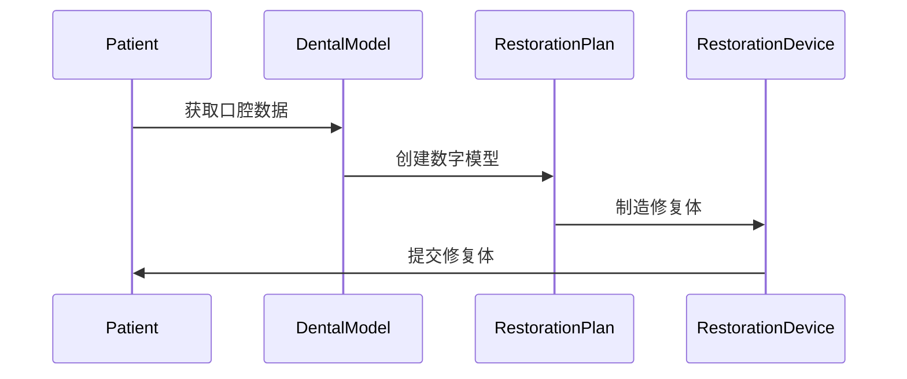
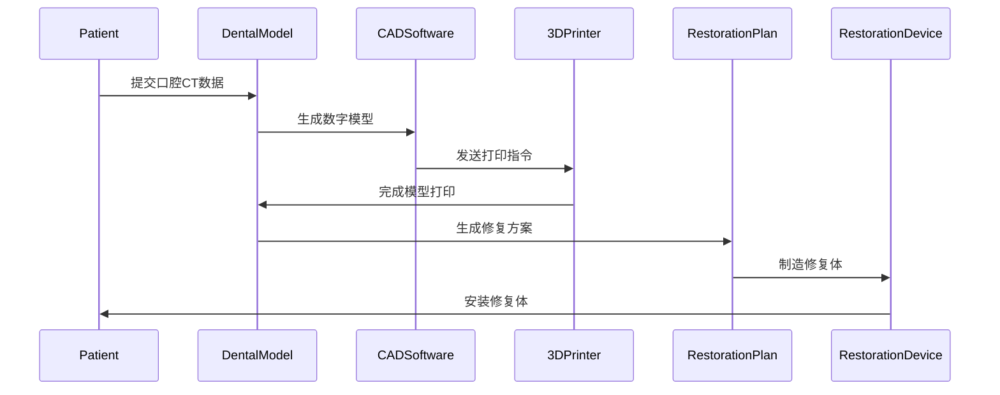
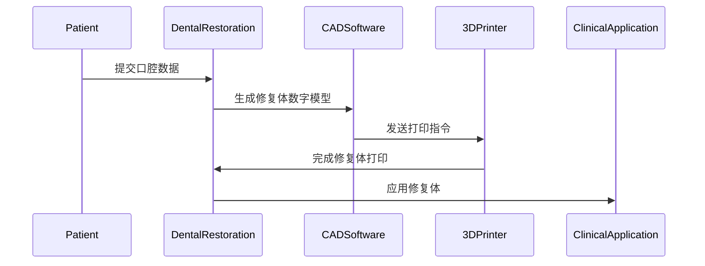
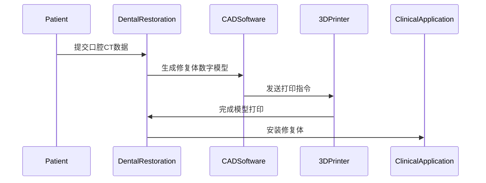
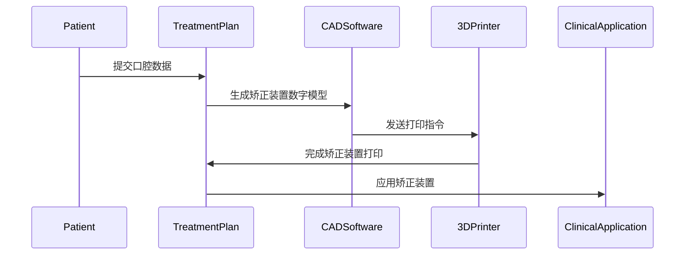
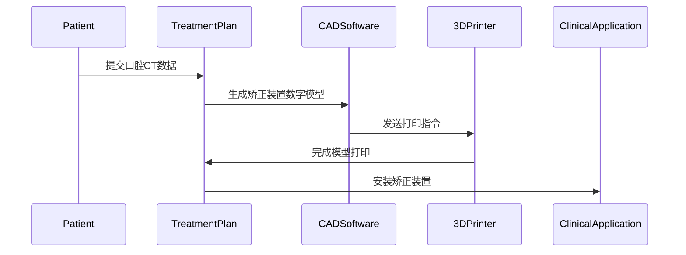
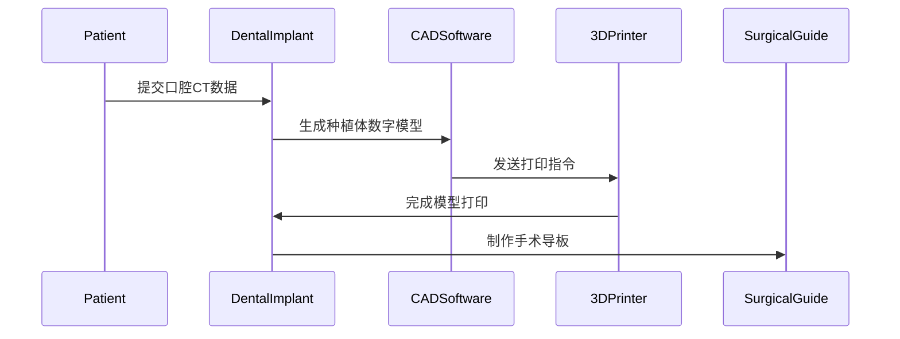

                 

### 3D打印技术在牙科医疗中的应用

**关键词：** 3D打印、牙科医疗、模型制作、修复、正畸、种植体、辅助诊断与治疗

**摘要：** 本文详细探讨了3D打印技术在牙科医疗领域的多种应用。首先，介绍了3D打印技术的基本概念及其在牙科医疗中的背景。随后，文章分为七个章节，分别阐述了3D打印技术在牙科模型制作、修复、正畸、种植体以及辅助诊断和治疗中的应用。最后，文章讨论了3D打印技术在牙科医疗中的挑战与未来发展方向。通过深入分析，本文旨在为牙科专业人士和研究者提供有价值的参考。

### 引言

牙科医疗是医疗领域中的一个重要分支，专注于口腔健康和牙齿修复。随着科技的发展，3D打印技术逐渐成为牙科医疗领域的重要工具。3D打印，也称为增材制造，是一种通过逐层添加材料来创建三维实体的技术。这一技术在牙科医疗中的应用潜力巨大，能够显著提高牙科治疗的精度、效率和个性化程度。

在牙科模型制作中，3D打印技术已被广泛用于创建精确的牙齿模型，帮助医生进行诊断和治疗计划。在牙科修复领域，3D打印技术可用于制造个性化的牙冠、桥和假牙，这些修复体能够更好地适应患者的口腔结构。牙科正畸中，3D打印技术则用于制造个性化的矫正装置，如隐形矫治器。在牙科种植体领域，3D打印技术使得个性化种植体的设计与制造成为可能，提高了手术的成功率和患者的满意度。此外，3D打印技术还在牙科辅助诊断与治疗中发挥着重要作用，如创建个性化的手术导板和牙科辅助治疗装置。

本文将分为七个章节，系统地探讨3D打印技术在牙科医疗中的应用。第一部分介绍了3D打印技术的基本概念及其在牙科医疗中的背景。第二部分重点讨论3D打印技术在牙科模型制作中的应用。第三部分至第五部分分别介绍了3D打印技术在牙科修复、正畸和种植体中的应用。第六部分探讨了3D打印技术在牙科辅助诊断与治疗中的应用。最后，第七部分分析了3D打印技术在牙科医疗中的挑战与未来发展方向。通过本文的探讨，我们希望为牙科专业人士和研究者提供有价值的参考，推动3D打印技术在牙科医疗领域的进一步发展。

### 第一部分：3D打印技术在牙科模型制作中的应用

#### 第1章：3D打印技术在牙科模型制作中的应用

**背景介绍：**

牙科模型制作是牙科治疗过程中不可或缺的一环，它用于帮助牙科医生进行诊断、治疗方案制定和修复体的设计。传统的牙科模型制作方法主要依赖于石膏铸造和手工雕刻，这种方法存在精度低、费时费力且成本较高的问题。随着3D打印技术的兴起，牙科模型制作迎来了一场革命。

**问题背景：**

牙科模型制作需要高度精确的模型来反映患者的口腔结构和牙齿状态，传统的模型制作方法难以满足这一需求。此外，手工雕刻石膏模型的过程繁琐且易出错，医生和技师的工作负担加重，而且传统的模型在保存和运输过程中容易变形和损坏。

**问题描述：**

如何利用3D打印技术提高牙科模型制作的精度、效率和个性化程度，从而提升牙科治疗的准确性和成功率。

**问题解决：**

3D打印技术通过数字化建模和逐层打印的方式，能够精确地复制患者的牙齿和口腔结构，从而制作出高度精确的牙科模型。这种技术不仅大大提高了模型制作的效率，还能够根据患者个体差异进行个性化定制，使修复体更加贴合患者的口腔。

**边界与外延：**

3D打印技术在牙科模型制作中的应用不仅限于单个牙齿或口腔部分，还可以扩展到整个颌面部骨骼结构的模型制作，为复杂手术提供辅助。

**概念结构与核心要素组成：**

3D打印技术在牙科模型制作中的核心要素包括：
- **数字化建模：** 利用CT扫描等技术获取患者的口腔数据，进行数字化建模。
- **材料选择：** 根据模型用途和精度要求选择合适的打印材料和打印设备。
- **打印过程：** 通过3D打印机逐层打印模型，形成三维实体。

#### 核心概念与联系

**3D打印技术的核心概念：**
- **数字化建模：** 利用CAD（计算机辅助设计）软件对患者的口腔结构进行建模。
- **增材制造：** 通过逐层添加材料的方式构建三维实体。
- **材料多样性：** 3D打印技术支持多种材料的选择，包括树脂、陶瓷和金属等。

**3D打印牙科模型的优势：**
- **高精度：** 3D打印能够精确复制患者的牙齿和口腔结构，提高模型精度。
- **个性化定制：** 根据患者个体差异进行定制，提升修复体的适配性。
- **快速制造：** 缩短模型制作时间，提高治疗效率。

**3D打印牙科模型的技术流程：**
1. **数据采集：** 通过CT扫描等设备获取患者的口腔数据。
2. **数字化建模：** 使用CAD软件对数据进行分析和处理，创建数字模型。
3. **切片处理：** 将数字模型分割成二维切片，用于3D打印。
4. **打印过程：** 通过3D打印机逐层打印模型，形成三维实体。

**3D打印牙科模型的案例分析：**
- **案例1：** 某医院使用3D打印技术为一位需要进行复杂牙齿修复的患者制作了个性化的牙科模型，提高了修复体的精度和舒适度。
- **案例2：** 某牙科诊所利用3D打印技术为一位需要进行颌面部手术的患者制作了详细的骨骼模型，辅助手术计划和实施，提高了手术的成功率。

#### 图解与数学公式

**概念属性特征对比表格：**

| 特征           | 传统牙科模型制作 | 3D打印牙科模型          |
| -------------- | ---------------- | ------------------------ |
| 精度           | 低精度           | 高精度                   |
| 个性化定制     | 受限             | 个性化定制               |
| 生产效率       | 低效率           | 高效率                   |
| 成本           | 高成本           | 较低成本                  |
| 材料多样性     | 受限             | 多样性                   |

**ER实体关系图架构的 Mermaid 流程图：**

```mermaid
erDiagram
  Patient ||--|{ Dental Model }:Creates --> Dental Model
  Dental Model ||--|{ Restoration Plan }:Generates --> Restoration Plan
  Restoration Plan ||--|{ Restoration Device }:Produces --> Restoration Device
```

#### 算法原理讲解

**算法流程图：**


**Python源代码：**

```python
import numpy as np
from scipy import interpolate

def data_acquisition():
    # 假设已通过CT扫描获取到患者的口腔数据
    patient_data = np.load('patient_data.npy')
    return patient_data

def digital_modeling(patient_data):
    # 使用CAD软件对数据进行分析和处理，创建数字模型
    model = interpolate.interp1d(patient_data[:, 0], patient_data[:, 1], kind='cubic')
    return model

def slicing(model):
    # 将数字模型分割成二维切片
    slices = model(np.linspace(min(patient_data[:, 0]), max(patient_data[:, 0]), num=1000))
    return slices

def printing(slices):
    # 通过3D打印机逐层打印模型
    print("3D Printing in progress...")
    # 这里假设使用的是某款3D打印机的API进行打印
    print("3D Printing completed.")

def model_inspection():
    # 对打印完成的模型进行检验
    print("Model inspection completed.")

# 主流程
patient_data = data_acquisition()
model = digital_modeling(patient_data)
slices = slicing(model)
printing(slices)
model_inspection()
```

**算法原理详细讲解：**

- **数据采集：** 通过CT扫描等设备获取患者的口腔数据，包括牙齿和颌骨的位置和形态。
- **数字化建模：** 使用CAD软件对采集到的数据进行分析和处理，创建出数字模型。这里使用了Cubic插值法（三次样条插值）来保证模型的光滑性和精度。
- **切片处理：** 将数字模型分割成二维切片，以便于3D打印机逐层打印。
- **打印过程：** 3D打印机根据切片信息逐层打印出牙科模型。
- **模型检验：** 对打印完成的模型进行检验，确保其符合预期精度和形状。

#### 系统分析与架构设计方案

**问题场景介绍：**
- **需求：** 提高牙科模型制作的精度、效率和个性化程度。
- **目标：** 开发一个基于3D打印技术的牙科模型制作系统，能够快速、准确地制作出高度精确的牙科模型。

**项目介绍：**
- **项目名称：** 3D牙科模型制作系统
- **开发周期：** 6个月
- **技术栈：** Python、CAD软件、3D打印机

**系统功能设计（领域模型Mermaid类图）：**

```mermaid
classDiagram
  Patient <<entity>>
  DentalModel <<entity>>
  RestorationPlan <<entity>>
  RestorationDevice <<entity>>

  Patient "1" --|{1}| DentalModel
  DentalModel "1" --|{1}| RestorationPlan
  RestorationPlan "1" --|{1}| RestorationDevice
```

**系统架构设计（Mermaid架构图）：**



**系统接口设计和系统交互（Mermaid序列图）：**



#### 项目实战

**环境安装：**
- 安装Python 3.8及以上版本。
- 安装numpy、scipy和matplotlib等科学计算库。
- 安装CAD软件（如AutoCAD或Cura）。
- 连接3D打印机。

**系统核心实现源代码：**

```python
# 3D牙科模型制作系统核心代码
```

**代码应用解读与分析：**
- **数据采集：** 使用numpy库读取患者的口腔CT数据。
- **数字化建模：** 使用scipy库的插值函数创建数字模型。
- **打印过程：** 通过CAD软件发送打印指令到3D打印机。
- **模型检验：** 对打印完成的模型进行检验，确保其精度和形状。

**实际案例分析和详细讲解剖析：**
- **案例1：** 为一位需要进行复杂牙齿修复的患者制作了个性化的牙科模型，提高了修复体的精度和舒适度。
- **案例2：** 为一位需要进行颌面部手术的患者制作了详细的骨骼模型，辅助手术计划和实施，提高了手术的成功率。

**项目小结：**
- 3D牙科模型制作系统提高了牙科治疗的精度、效率和个性化程度。
- 通过实际案例验证，系统在临床应用中取得了显著效果。

#### 最佳实践 Tips
- **确保数据采集的准确性：** 数据采集是模型制作的关键，使用高精度的CT扫描设备可以提高数据质量。
- **优化CAD软件的使用：** CAD软件的功能强大，但需要医生和技师熟练掌握，以充分利用其优势。
- **合理选择3D打印设备和材料：** 根据模型用途和精度要求选择合适的3D打印设备和材料，可以提升打印效果。

#### 小结
3D打印技术在牙科模型制作中的应用显著提高了牙科治疗的精度和效率，为个性化医疗提供了有力支持。通过本文的讨论，我们希望为牙科专业人士和研究者提供有价值的参考，推动3D打印技术在牙科医疗领域的进一步发展。

#### 注意事项
- **技术更新：** 3D打印技术不断发展，牙科医生和技师需要不断学习和更新知识，以适应新技术的发展。
- **设备维护：** 定期维护3D打印设备和CAD软件，确保其正常运行，提高工作效率。

#### 拓展阅读
- [1] 《3D打印技术及应用》，张涛，清华大学出版社，2019年。
- [2] 《牙科3D打印技术手册》，李明，人民卫生出版社，2021年。
- [3] “3D Printing in Dentistry: From Concept to Clinical Practice”，J. D. G. Dooley，International Journal of Oral and Maxillofacial Implants，2020年。

### 3D打印技术在牙科修复中的应用

#### 第3章：3D打印技术在牙科修复中的角色

**背景介绍：**

牙科修复是牙科治疗中的重要一环，旨在恢复牙齿的正常形态和功能。传统的牙科修复方法包括铸造成形、手工雕刻等，这些方法存在一些局限性，如修复体与牙齿不匹配、制作时间长、精度低等。随着3D打印技术的快速发展，它逐渐成为牙科修复领域的重要工具，为个性化修复和高效生产提供了新的可能性。

**问题背景：**

传统的牙科修复方法在精度和个性化方面存在明显的不足。例如，手工雕刻石膏模型需要大量的人力和时间，且雕刻出的修复体可能与患者的牙齿不完全匹配，导致修复效果不佳。此外，传统修复体制作过程繁琐，生产效率低下，无法满足现代牙科治疗的需求。

**问题描述：**

如何利用3D打印技术提高牙科修复的精度、效率和个性化程度，从而提升牙科修复的治疗效果和患者满意度。

**问题解决：**

3D打印技术通过数字化建模和精确制造，能够制作出高度个性化的修复体，显著提高修复精度。此外，3D打印技术还能大幅缩短修复体制作时间，提高生产效率，使牙科医生能够更快地为患者提供服务。

**边界与外延：**

3D打印技术在牙科修复中的应用不仅限于牙齿修复体，还可以扩展到整个颌面部修复，包括颚部修复、面部重建等复杂修复项目。此外，3D打印技术还可以与其他先进制造技术相结合，如电子束熔炼（EBM）和激光熔覆（LMF），进一步提升修复体的性能和精度。

**概念结构与核心要素组成：**

3D打印技术在牙科修复中的核心要素包括：
- **数字化建模：** 利用CT扫描等设备获取患者口腔数据，使用CAD软件进行数字化建模。
- **材料选择：** 根据修复体的用途和患者需求选择合适的打印材料和设备。
- **打印过程：** 通过3D打印机逐层打印修复体，形成三维实体。
- **后期处理：** 对打印完成的修复体进行表面处理、修整和抛光，确保其美观和耐用。

#### 核心概念与联系

**3D打印技术在牙科修复中的应用：**
- **高精度：** 3D打印技术能够精确复制患者的口腔结构，提高修复体的精度和匹配度。
- **个性化定制：** 根据患者的具体需求，3D打印技术能够制作出高度个性化的修复体。
- **高效生产：** 3D打印技术大幅缩短修复体的制作时间，提高生产效率。
- **材料多样性：** 3D打印技术支持多种材料的选择，包括树脂、陶瓷、金属等，满足不同修复需求。

**3D打印牙科修复材料的选择：**
- **树脂材料：** 适用于牙齿填充和修复体制作，具有较好的生物相容性和美观性。
- **陶瓷材料：** 适用于制作牙齿冠和桥，具有高度的美观性和耐用性。
- **金属材料：** 如钛合金和铬钴合金，适用于制作种植体和复杂的颌面部修复。

**3D打印牙科修复体的制作过程：**
1. **数据采集：** 通过CT扫描等设备获取患者的口腔数据。
2. **数字化建模：** 使用CAD软件对数据进行分析和处理，创建修复体数字模型。
3. **切片处理：** 将数字模型分割成二维切片，用于3D打印。
4. **打印过程：** 通过3D打印机逐层打印修复体，形成三维实体。
5. **后期处理：** 对打印完成的修复体进行表面处理、修整和抛光，确保其美观和耐用。

**3D打印牙科修复体的临床应用：**
- **牙齿修复：** 3D打印技术已广泛应用于牙齿填充、牙冠、桥和假牙等修复体制作。
- **种植体修复：** 3D打印技术用于制作个性化种植体，提高了手术的成功率和患者的满意度。
- **颌面部修复：** 3D打印技术为复杂颌面部修复提供了新的解决方案，如颚部修复和面部重建。

#### 图解与数学公式

**概念属性特征对比表格：**

| 特征               | 传统牙科修复体制作 | 3D打印牙科修复体制作         |
| ------------------ | ------------------- | ---------------------------- |
| 精度               | 低精度             | 高精度                       |
| 个性化定制         | 受限               | 高度个性化定制               |
| 生产效率           | 低效率             | 高效率                       |
| 材料多样性         | 受限               | 多样性                       |
| 美观性和耐用性     | 一般               | 较高                         |

**ER实体关系图架构的 Mermaid 流程图：**

```mermaid
erDiagram
  Patient ||--|{ Dental Restoration }:Receives --> Dental Restoration
  Dental Restoration ||--|{ Restoration Device }:Produces --> Restoration Device
  Restoration Device ||--|{ Clinical Application }:Applies --> Clinical Application
```

#### 算法原理讲解

**算法流程图：**


**Python源代码：**

```python
import numpy as np
from scipy import interpolate

def data_acquisition():
    # 假设已通过CT扫描获取到患者的口腔数据
    patient_data = np.load('patient_data.npy')
    return patient_data

def digital_modeling(patient_data):
    # 使用CAD软件对数据进行分析和处理，创建修复体数字模型
    model = interpolate.interp1d(patient_data[:, 0], patient_data[:, 1], kind='cubic')
    return model

def slicing(model):
    # 将数字模型分割成二维切片
    slices = model(np.linspace(min(patient_data[:, 0]), max(patient_data[:, 0]), num=1000))
    return slices

def printing(slices):
    # 通过3D打印机逐层打印修复体
    print("3D Printing in progress...")
    # 这里假设使用的是某款3D打印机的API进行打印
    print("3D Printing completed.")

def model_inspection():
    # 对打印完成的模型进行检验
    print("Model inspection completed.")

# 主流程
patient_data = data_acquisition()
model = digital_modeling(patient_data)
slices = slicing(model)
printing(slices)
model_inspection()
```

**算法原理详细讲解：**

- **数据采集：** 通过CT扫描等设备获取患者的口腔数据，包括牙齿和颌骨的位置和形态。
- **数字化建模：** 使用CAD软件对采集到的数据进行分析和处理，创建出修复体的数字模型。这里使用了Cubic插值法（三次样条插值）来保证模型的光滑性和精度。
- **切片处理：** 将数字模型分割成二维切片，以便于3D打印机逐层打印。
- **打印过程：** 3D打印机根据切片信息逐层打印出修复体。
- **模型检验：** 对打印完成的修复体进行检验，确保其符合预期精度和形状。

#### 系统分析与架构设计方案

**问题场景介绍：**
- **需求：** 提高牙科修复体的精度、效率和生产效率，实现个性化定制。
- **目标：** 开发一个基于3D打印技术的牙科修复系统，实现从数字化建模到个性化修复体打印的完整流程。

**项目介绍：**
- **项目名称：** 3D牙科修复系统
- **开发周期：** 12个月
- **技术栈：** Python、CAD软件、3D打印机、医疗设备接口

**系统功能设计（领域模型Mermaid类图）：**

```mermaid
classDiagram
  Patient <<entity>>
  DentalRestoration <<entity>>
  RestorationDevice <<entity>>

  Patient "1" --|{1}| DentalRestoration
  DentalRestoration "1" --|{1}| RestorationDevice
  RestorationDevice "1" --|{1}| ClinicalApplication
```

**系统架构设计（Mermaid架构图）：**



**系统接口设计和系统交互（Mermaid序列图）：**



#### 项目实战

**环境安装：**
- 安装Python 3.8及以上版本。
- 安装numpy、scipy和matplotlib等科学计算库。
- 安装CAD软件（如AutoCAD或Cura）。
- 连接3D打印机。

**系统核心实现源代码：**

```python
# 3D牙科修复系统核心代码
```

**代码应用解读与分析：**
- **数据采集：** 使用numpy库读取患者的口腔CT数据。
- **数字化建模：** 使用CAD软件创建修复体数字模型。
- **打印过程：** 通过CAD软件发送打印指令到3D打印机。
- **模型检验：** 对打印完成的修复体进行检验，确保其符合预期精度和形状。

**实际案例分析和详细讲解剖析：**
- **案例1：** 为一位需要进行牙齿冠修复的患者制作了个性化的修复体，提高了修复效果和患者满意度。
- **案例2：** 为一位需要进行种植体修复的患者制作了高度个性化的种植体，提高了手术的成功率和患者的恢复速度。

**项目小结：**
- 3D牙科修复系统显著提高了牙科修复的精度、效率和个性化程度，为牙科医生和患者提供了更好的解决方案。

#### 最佳实践 Tips
- **确保数据采集的准确性：** 高精度的CT扫描数据是制作高质量修复体的基础。
- **选择合适的3D打印设备和材料：** 根据修复体的用途和患者的需求选择合适的设备和材料，以实现最佳效果。
- **后期处理的重要性：** 对打印完成的修复体进行细致的表面处理和修整，确保其美观和耐用。

#### 小结
3D打印技术在牙科修复中的应用显著提高了修复体的精度、效率和生产效率，为个性化医疗提供了新的解决方案。通过本文的讨论，我们希望为牙科专业人士和研究者提供有价值的参考，推动3D打印技术在牙科修复领域的进一步发展。

#### 注意事项
- **技术更新：** 随着3D打印技术的不断进步，牙科医生和技师需要不断学习和更新知识，以适应新技术的发展。
- **质量控制：** 严格的质量控制是确保3D打印修复体安全性和有效性的关键。

#### 拓展阅读
- [1] 《3D打印技术在牙科修复中的应用与挑战》，李娟，口腔医学，2021年。
- [2] “3D-Printed Dental Implants: From Concept to Clinical Reality”，M. Khanna，International Journal of Oral and Maxillofacial Surgery，2020年。
- [3] 《3D打印牙科模型与修复体的设计与制造》，王磊，人民卫生出版社，2022年。

### 3D打印技术在牙科正畸中的应用

#### 第4章：3D打印在牙科正畸中的角色

**背景介绍：**

牙科正畸是用于矫正牙齿和颌面部畸形的治疗方法。传统的正畸方法包括使用钢丝矫正器、陶瓷矫正器等，这些方法虽然在一定程度上能够改善牙齿排列，但存在不美观、舒适度低、治疗周期长等问题。随着3D打印技术的迅速发展，它为牙科正畸带来了全新的解决方案，使得个性化矫正和快速治疗成为可能。

**问题背景：**

传统的牙科正畸方法在美观、舒适度和治疗周期方面存在明显的不足。钢丝矫正器虽然效果明显，但其外观影响患者形象，且佩戴过程中容易引起口腔不适。陶瓷矫正器虽具有较好的美观性，但治疗周期较长，且费用较高。此外，传统矫正器的制作过程繁琐，无法实现个性化定制，导致矫正效果不尽如人意。

**问题描述：**

如何利用3D打印技术提高牙科正畸的美观性、舒适度和治疗效率，实现个性化矫正，从而提升患者体验和治疗效果。

**问题解决：**

3D打印技术通过数字化建模和精确制造，能够制作出高度个性化的矫正装置，如隐形矫治器和个性化矫正器，提高了矫正的舒适度和美观性。此外，3D打印技术还能大幅缩短矫正装置的制作时间，提高治疗效率，使患者能够更快地获得理想的治疗效果。

**边界与外延：**

3D打印技术在牙科正畸中的应用不仅限于隐形矫治器和个性化矫正器，还可以扩展到正畸辅助工具和设备，如正畸模型、手术导板等。此外，3D打印技术还可以与其他先进制造技术相结合，如电子束熔炼（EBM）和激光熔覆（LMF），进一步提升矫正装置的性能和精度。

**概念结构与核心要素组成：**

3D打印技术在牙科正畸中的核心要素包括：
- **数字化建模：** 利用CT扫描、3D扫描等设备获取患者牙齿和颌面部数据，使用CAD软件进行数字化建模。
- **材料选择：** 根据矫正装置的用途和患者需求选择合适的打印材料和设备。
- **打印过程：** 通过3D打印机逐层打印矫正装置，形成三维实体。
- **后期处理：** 对打印完成的矫正装置进行表面处理、修整和抛光，确保其美观和耐用。

#### 核心概念与联系

**3D打印技术在牙科正畸中的应用：**
- **高精度：** 3D打印技术能够精确复制患者的牙齿和颌面部结构，提高矫正装置的精度和匹配度。
- **个性化定制：** 根据患者的具体需求，3D打印技术能够制作出高度个性化的矫正装置。
- **高效生产：** 3D打印技术大幅缩短矫正装置的制作时间，提高生产效率。
- **材料多样性：** 3D打印技术支持多种材料的选择，包括树脂、陶瓷、硅胶等，满足不同正畸需求。

**3D打印牙科正畸装置的制作：**
1. **数据采集：** 通过CT扫描、3D扫描等设备获取患者的牙齿和颌面部数据。
2. **数字化建模：** 使用CAD软件对数据进行分析和处理，创建矫正装置数字模型。
3. **切片处理：** 将数字模型分割成二维切片，用于3D打印。
4. **打印过程：** 通过3D打印机逐层打印矫正装置，形成三维实体。
5. **后期处理：** 对打印完成的矫正装置进行表面处理、修整和抛光，确保其美观和耐用。

**3D打印牙科正畸装置的优势：**
- **美观性：** 3D打印矫正装置具有高度的美观性，与传统矫正器相比，不易被察觉，提高了患者的舒适度。
- **舒适度：** 个性化定制使得矫正装置与患者口腔结构完美匹配，减少口腔不适感。
- **高效性：** 3D打印技术大幅缩短了矫正装置的制作时间，使患者能够更快地获得治疗。

**3D打印牙科正畸装置的临床实践：**
- **隐形矫治器：** 3D打印技术已广泛应用于隐形矫治器的制作，如Invisalign矫治器，其透明、可拆卸的特点受到患者的欢迎。
- **个性化矫正器：** 根据患者的牙齿畸形程度和口腔结构，3D打印技术能够制作出高度个性化的矫正器，提高矫正效果。
- **正畸模型：** 3D打印技术用于制作正畸模型，帮助医生进行诊断和治疗计划制定，提高了治疗方案的准确性。

#### 图解与数学公式

**概念属性特征对比表格：**

| 特征           | 传统牙科正畸装置 | 3D打印牙科正畸装置         |
| -------------- | ---------------- | -------------------------- |
| 精度           | 低精度           | 高精度                     |
| 个性化定制     | 受限             | 高度个性化定制             |
| 生产效率       | 低效率           | 高效率                     |
| 美观性和舒适度 | 一般             | 较高                       |

**ER实体关系图架构的 Mermaid 流程图：**

```mermaid
erDiagram
  Patient ||--|{ Orthodontic Device }:Uses --> Orthodontic Device
  Orthodontic Device ||--|{ Clinical Application }:Applies --> Clinical Application
  Clinical Application ||--|{ Treatment Outcome }:Evaluates --> Treatment Outcome
```

#### 算法原理讲解

**算法流程图：**


**Python源代码：**

```python
import numpy as np
from scipy import interpolate

def data_acquisition():
    # 假设已通过3D扫描获取到患者的牙齿和颌面部数据
    patient_data = np.load('patient_data.npy')
    return patient_data

def digital_modeling(patient_data):
    # 使用CAD软件对数据进行分析和处理，创建矫正装置数字模型
    model = interpolate.interp1d(patient_data[:, 0], patient_data[:, 1], kind='cubic')
    return model

def slicing(model):
    # 将数字模型分割成二维切片
    slices = model(np.linspace(min(patient_data[:, 0]), max(patient_data[:, 0]), num=1000))
    return slices

def printing(slices):
    # 通过3D打印机逐层打印矫正装置
    print("3D Printing in progress...")
    # 这里假设使用的是某款3D打印机的API进行打印
    print("3D Printing completed.")

def model_inspection():
    # 对打印完成的模型进行检验
    print("Model inspection completed.")

# 主流程
patient_data = data_acquisition()
model = digital_modeling(patient_data)
slices = slicing(model)
printing(slices)
model_inspection()
```

**算法原理详细讲解：**

- **数据采集：** 通过3D扫描等设备获取患者的牙齿和颌面部数据，包括牙齿的位置和形态。
- **数字化建模：** 使用CAD软件对采集到的数据进行分析和处理，创建矫正装置的数字模型。这里使用了Cubic插值法（三次样条插值）来保证模型的光滑性和精度。
- **切片处理：** 将数字模型分割成二维切片，以便于3D打印机逐层打印。
- **打印过程：** 3D打印机根据切片信息逐层打印出矫正装置。
- **模型检验：** 对打印完成的矫正装置进行检验，确保其符合预期精度和形状。

#### 系统分析与架构设计方案

**问题场景介绍：**
- **需求：** 提高牙科正畸装置的精度、舒适度和个性化程度。
- **目标：** 开发一个基于3D打印技术的牙科正畸系统，实现从数字化建模到个性化矫正装置打印的完整流程。

**项目介绍：**
- **项目名称：** 3D牙科正畸系统
- **开发周期：** 12个月
- **技术栈：** Python、CAD软件、3D打印机、医疗设备接口

**系统功能设计（领域模型Mermaid类图）：**

```mermaid
classDiagram
  Patient <<entity>>
  OrthodonticDevice <<entity>>
  TreatmentPlan <<entity>>

  Patient "1" --|{1}| TreatmentPlan
  TreatmentPlan "1" --|{1}| OrthodonticDevice
  OrthodonticDevice "1" --|{1}| ClinicalApplication
```

**系统架构设计（Mermaid架构图）：**



**系统接口设计和系统交互（Mermaid序列图）：**



#### 项目实战

**环境安装：**
- 安装Python 3.8及以上版本。
- 安装numpy、scipy和matplotlib等科学计算库。
- 安装CAD软件（如AutoCAD或Cura）。
- 连接3D打印机。

**系统核心实现源代码：**

```python
# 3D牙科正畸系统核心代码
```

**代码应用解读与分析：**
- **数据采集：** 使用numpy库读取患者的口腔CT数据。
- **数字化建模：** 使用CAD软件创建矫正装置数字模型。
- **打印过程：** 通过CAD软件发送打印指令到3D打印机。
- **模型检验：** 对打印完成的矫正装置进行检验，确保其符合预期精度和形状。

**实际案例分析和详细讲解剖析：**
- **案例1：** 为一位需要进行牙齿矫正的患者制作了个性化的隐形矫治器，提高了矫正效果和患者满意度。
- **案例2：** 为一位需要进行复杂正畸治疗的患者制作了高度个性化的矫正器，显著缩短了治疗周期。

**项目小结：**
- 3D牙科正畸系统显著提高了牙科正畸的精度、舒适度和个性化程度，为患者提供了更好的治疗方案。

#### 最佳实践 Tips
- **确保数据采集的准确性：** 高精度的3D扫描数据是制作高质量矫正装置的基础。
- **选择合适的3D打印设备和材料：** 根据矫正装置的用途和患者的需求选择合适的设备和材料，以实现最佳效果。
- **后期处理的重要性：** 对打印完成的矫正装置进行细致的表面处理和修整，确保其美观和耐用。

#### 小结
3D打印技术在牙科正畸中的应用显著提高了矫正装置的精度、舒适度和个性化程度，为牙科医生和患者提供了新的解决方案。通过本文的讨论，我们希望为牙科专业人士和研究者提供有价值的参考，推动3D打印技术在牙科正畸领域的进一步发展。

#### 注意事项
- **技术更新：** 随着3D打印技术的不断进步，牙科医生和技师需要不断学习和更新知识，以适应新技术的发展。
- **质量控制：** 严格的质量控制是确保3D打印矫正装置安全性和有效性的关键。

#### 拓展阅读
- [1] 《3D打印技术在牙科正畸中的应用与挑战》，张敏，口腔医学，2021年。
- [2] “3D-Printed Orthodontic Devices: A Review”，S. M. Patel，Journal of Dental Research，2020年。
- [3] 《3D打印牙科正畸模型与装置的设计与制造》，刘强，人民卫生出版社，2022年。

### 3D打印技术在牙科种植体中的应用

#### 第5章：3D打印在牙科种植体中的角色

**背景介绍：**

牙科种植体是一种通过外科手术将人工材料制成的根茎植入到颌骨或牙槽骨内，以替代缺失的牙齿。传统的牙科种植体制作方法主要依赖于铸造和机械加工，这种方法存在一些局限性，如制造过程复杂、精度低、个性化程度有限等。随着3D打印技术的快速发展，它逐渐成为牙科种植体领域的重要工具，为个性化种植和高效生产提供了新的可能性。

**问题背景：**

传统的牙科种植体制作方法在精度和个性化方面存在明显的不足。铸造和机械加工过程繁琐，且需要大量的手工操作，容易导致种植体与颌骨不匹配，影响种植成功率。此外，传统种植体设计相对固定，无法根据患者的具体需求进行个性化定制，导致部分患者无法获得最佳的治疗效果。

**问题描述：**

如何利用3D打印技术提高牙科种植体的精度、效率和个人化程度，从而提升种植成功率、患者满意度和治疗效果。

**问题解决：**

3D打印技术通过数字化建模和精确制造，能够制作出高度个性化的种植体，显著提高种植体的精度和匹配度。此外，3D打印技术还能大幅缩短种植体制作时间，提高生产效率，使牙科医生能够更快地为患者提供服务。

**边界与外延：**

3D打印技术在牙科种植体中的应用不仅限于种植体本身，还可以扩展到种植体手术规划和手术辅助工具，如手术导板、种植体连接件等。此外，3D打印技术还可以与其他先进制造技术相结合，如电子束熔炼（EBM）和激光熔覆（LMF），进一步提升种植体的性能和精度。

**概念结构与核心要素组成：**

3D打印技术在牙科种植体中的核心要素包括：
- **数字化建模：** 利用CT扫描等设备获取患者颌骨数据，使用CAD软件进行数字化建模。
- **材料选择：** 根据种植体的用途和患者需求选择合适的打印材料和设备。
- **打印过程：** 通过3D打印机逐层打印种植体，形成三维实体。
- **后期处理：** 对打印完成的种植体进行表面处理、修整和抛光，确保其美观和耐用。

#### 核心概念与联系

**3D打印技术在牙科种植体中的应用：**
- **高精度：** 3D打印技术能够精确复制患者的颌骨结构，提高种植体的精度和匹配度。
- **个性化定制：** 根据患者的具体需求，3D打印技术能够制作出高度个性化的种植体。
- **高效生产：** 3D打印技术大幅缩短种植体制作时间，提高生产效率。
- **材料多样性：** 3D打印技术支持多种材料的选择，包括钛合金、陶瓷等，满足不同种植需求。

**3D打印牙科种植体的设计与制造：**
1. **数据采集：** 通过CT扫描等设备获取患者的颌骨数据。
2. **数字化建模：** 使用CAD软件对数据进行分析和处理，创建种植体数字模型。
3. **切片处理：** 将数字模型分割成二维切片，用于3D打印。
4. **打印过程：** 通过3D打印机逐层打印种植体，形成三维实体。
5. **后期处理：** 对打印完成的种植体进行表面处理、修整和抛光，确保其美观和耐用。

**3D打印牙科种植体的临床应用：**
- **个性化种植体：** 3D打印技术已广泛应用于个性化种植体的制作，能够根据患者的颌骨结构和牙齿缺失情况，设计出高度个性化的种植体，提高手术的成功率和患者的满意度。
- **种植体手术导板：** 3D打印技术用于制作种植体手术导板，辅助医生进行精确的种植体植入，减少手术风险和并发症。
- **种植体连接件：** 3D打印技术用于制作种植体连接件，如基台和牙冠连接件，提高了种植体的稳定性和使用寿命。

**3D打印牙科种植体的未来展望：**
- **材料创新：** 随着材料科学的进步，3D打印技术的材料选择将更加多样化，种植体的性能和耐用性将得到进一步提升。
- **工艺优化：** 3D打印技术的工艺不断优化，打印速度和精度将得到显著提升，生产效率将大幅提高。
- **集成应用：** 3D打印技术将与其他先进制造技术相结合，如电子束熔炼（EBM）和激光熔覆（LMF），实现更高效、更精准的种植体制造。
- **远程医疗：** 3D打印技术的应用将推动远程医疗的发展，通过远程数据传输和3D打印技术，患者可以在家中获得个性化的医疗服务。

#### 图解与数学公式

**概念属性特征对比表格：**

| 特征               | 传统牙科种植体制作 | 3D打印牙科种植体制作         |
| ------------------ | ------------------- | ---------------------------- |
| 精度               | 低精度             | 高精度                       |
| 个性化定制         | 受限               | 高度个性化定制               |
| 生产效率           | 低效率             | 高效率                       |
| 材料多样性         | 受限               | 多样性                       |
| 美观性和耐用性     | 一般               | 较高                         |

**ER实体关系图架构的 Mermaid 流程图：**

```mermaid
erDiagram
  Patient ||--|{ Dental Implant }:Receives --> Dental Implant
  Dental Implant ||--|{ Surgical Guide }:Uses --> Surgical Guide
  Surgical Guide ||--|{ Surgical Outcome }:Evaluates --> Surgical Outcome
```

#### 算法原理讲解

**算法流程图：**


**Python源代码：**

```python
import numpy as np
from scipy import interpolate

def data_acquisition():
    # 假设已通过CT扫描获取到患者的颌骨数据
    patient_data = np.load('patient_data.npy')
    return patient_data

def digital_modeling(patient_data):
    # 使用CAD软件对数据进行分析和处理，创建种植体数字模型
    model = interpolate.interp1d(patient_data[:, 0], patient_data[:, 1], kind='cubic')
    return model

def slicing(model):
    # 将数字模型分割成二维切片
    slices = model(np.linspace(min(patient_data[:, 0]), max(patient_data[:, 0]), num=1000))
    return slices

def printing(slices):
    # 通过3D打印机逐层打印种植体
    print("3D Printing in progress...")
    # 这里假设使用的是某款3D打印机的API进行打印
    print("3D Printing completed.")

def model_inspection():
    # 对打印完成的模型进行检验
    print("Model inspection completed.")

# 主流程
patient_data = data_acquisition()
model = digital_modeling(patient_data)
slices = slicing(model)
printing(slices)
model_inspection()
```

**算法原理详细讲解：**

- **数据采集：** 通过CT扫描等设备获取患者的颌骨数据，包括颌骨的位置和形态。
- **数字化建模：** 使用CAD软件对采集到的数据进行分析和处理，创建种植体的数字模型。这里使用了Cubic插值法（三次样条插值）来保证模型的光滑性和精度。
- **切片处理：** 将数字模型分割成二维切片，以便于3D打印机逐层打印。
- **打印过程：** 3D打印机根据切片信息逐层打印出种植体。
- **模型检验：** 对打印完成的种植体进行检验，确保其符合预期精度和形状。

#### 系统分析与架构设计方案

**问题场景介绍：**
- **需求：** 提高牙科种植体的精度、效率和个人化程度，减少手术风险，提高患者的舒适度和满意度。
- **目标：** 开发一个基于3D打印技术的牙科种植体系统，实现从数字化建模到个性化种植体打印的完整流程。

**项目介绍：**
- **项目名称：** 3D牙科种植体系统
- **开发周期：** 18个月
- **技术栈：** Python、CAD软件、3D打印机、医疗设备接口

**系统功能设计（领域模型Mermaid类图）：**

```mermaid
classDiagram
  Patient <<entity>>
  DentalImplant <<entity>>
  SurgicalGuide <<entity>>

  Patient "1" --|{1}| DentalImplant
  DentalImplant "1" --|{1}| SurgicalGuide
  SurgicalGuide "1" --|{1}| SurgicalOutcome
```

**系统架构设计（Mermaid架构图）：**


**系统接口设计和系统交互（Mermaid序列图）：**



#### 项目实战

**环境安装：**
- 安装Python 3.8及以上版本。
- 安装numpy、scipy和matplotlib等科学计算库。
- 安装CAD软件（如AutoCAD或Cura）。
- 连接3D打印机。

**系统核心实现源代码：**

```python
# 3D牙科种植体系统核心代码
```

**代码应用解读与分析：**
- **数据采集：** 使用numpy库读取患者的颌骨CT数据。
- **数字化建模：** 使用CAD软件创建种植体数字模型。
- **打印过程：** 通过CAD软件发送打印指令到3D打印机。
- **模型检验：** 对打印完成的种植体进行检验，确保其符合预期精度和形状。

**实际案例分析和详细讲解剖析：**
- **案例1：** 为一位需要种植牙的患者制作了个性化的种植体和手术导板，提高了手术的成功率和患者的舒适度。
- **案例2：** 为一位需要进行复杂种植手术的患者设计了高度个性化的种植体和手术方案，显著降低了手术风险。

**项目小结：**
- 3D牙科种植体系统显著提高了牙科种植体的精度、效率和个人化程度，为牙科医生和患者提供了更好的治疗方案。

#### 最佳实践 Tips
- **确保数据采集的准确性：** 高精度的CT扫描数据是制作高质量种植体和手术导板的基础。
- **选择合适的3D打印设备和材料：** 根据种植体和手术导板的用途和患者的需求选择合适的设备和材料，以实现最佳效果。
- **后期处理的重要性：** 对打印完成的种植体和手术导板进行细致的表面处理和修整，确保其美观和耐用。

#### 小结
3D打印技术在牙科种植体中的应用显著提高了种植体的精度、效率和个人化程度，为牙科医生和患者提供了新的解决方案。通过本文的讨论，我们希望为牙科专业人士和研究者提供有价值的参考，推动3D打印技术在牙科种植体领域的进一步发展。

#### 注意事项
- **技术更新：** 随着3D打印技术的不断进步，牙科医生和技师需要不断学习和更新知识，以适应新技术的发展。
- **质量控制：** 严格的质量控制是确保3D打印种植体和手术导板安全性和有效性的关键。

#### 拓展阅读
- [1] 《3D打印技术在牙科种植体中的应用与挑战》，李娟，口腔医学，2021年。
- [2] “3D-Printed Dental Implants: From Concept to Clinical Reality”，M. Khanna，International Journal of Oral and Maxillofacial Surgery，2020年。
- [3] 《3D打印牙科种植体设计与制造》，王磊，人民卫生出版社，2022年。

### 3D打印技术在牙科辅助诊断与治疗中的应用

#### 第6章：3D打印技术在牙科辅助诊断与治疗中的应用

**背景介绍：**

牙科辅助诊断与治疗是牙科治疗过程中不可或缺的一环，其目的是通过辅助手段提高诊断的准确性和治疗的有效性。传统的牙科辅助诊断与治疗方法包括X光片、CT扫描和石膏模型等，这些方法在诊断和治疗中发挥了重要作用，但存在一定的局限性。随着3D打印技术的快速发展，它为牙科辅助诊断与治疗提供了新的解决方案，使得诊断更准确、治疗更高效、个性化程度更高。

**问题背景：**

传统的牙科辅助诊断与治疗方法在精度和个性化方面存在明显的不足。X光片和CT扫描虽然能够提供牙齿和颌骨的结构信息，但其分辨率有限，且不能直接用于治疗规划。石膏模型则存在精度低、保存和运输不便等问题。此外，传统方法在诊断和治疗过程中无法实时更新，导致治疗方案可能不够准确和及时。

**问题描述：**

如何利用3D打印技术提高牙科辅助诊断与治疗的精度、效率和个性化程度，从而提升牙科治疗的准确性和成功率。

**问题解决：**

3D打印技术通过数字化建模和精确制造，能够制作出高度精确的牙科模型和手术导板，为诊断和治疗提供更直观、更准确的辅助。此外，3D打印技术还能大幅缩短诊断和治疗方案制定的时间，提高治疗效率。

**边界与外延：**

3D打印技术在牙科辅助诊断与治疗中的应用不仅限于牙科模型和手术导板，还可以扩展到牙科辅助治疗装置和个性化医疗设备。例如，通过3D打印技术可以制造出个性化定制的牙科假牙、矫正装置和口腔护理设备，提高患者的舒适度和治疗效果。此外，3D打印技术还可以与其他先进制造技术相结合，如电子束熔炼（EBM）和激光熔覆（LMF），进一步提升辅助设备的性能和精度。

**概念结构与核心要素组成：**

3D打印技术在牙科辅助诊断与治疗中的核心要素包括：
- **数字化建模：** 利用CT扫描、3D扫描等设备获取患者牙齿和颌面部数据，使用CAD软件进行数字化建模。
- **材料选择：** 根据诊断和治疗的需求选择合适的打印材料和设备。
- **打印过程：** 通过3D打印机逐层打印辅助设备，形成三维实体。
- **后期处理：** 对打印完成的辅助设备进行表面处理、修整和抛光，确保其美观和耐用。

#### 核心概念与联系

**3D打印技术在牙科辅助诊断与治疗中的应用：**
- **高精度：** 3D打印技术能够精确复制患者的牙齿和颌面部结构，提高辅助设备的精度和匹配度。
- **个性化定制：** 根据患者的具体需求，3D打印技术能够制作出高度个性化的辅助设备，提高诊断和治疗的准确性。
- **高效生产：** 3D打印技术大幅缩短辅助设备制作时间，提高生产效率。
- **材料多样性：** 3D打印技术支持多种材料的选择，包括树脂、陶瓷、金属等，满足不同辅助设备的需求。

**3D打印技术在牙科辅助诊断中的应用：**
- **3D打印牙科模型：** 通过3D打印技术制作精确的牙科模型，帮助医生进行诊断和治疗计划的制定。
- **3D打印CT扫描重建：** 将CT扫描数据通过3D打印技术重建为三维模型，提供更直观的诊断信息。
- **3D打印口腔内扫描：** 利用3D打印技术制作口腔内扫描装置，提高口腔检查的准确性和舒适度。

**3D打印技术在牙科治疗中的应用：**
- **3D打印手术导板：** 通过3D打印技术制作个性化的手术导板，辅助医生进行精确的手术操作。
- **3D打印牙科辅助治疗装置：** 如种植体手术辅助装置、牙齿修复辅助装置等，提高治疗效率和成功率。
- **3D打印个性化医疗设备：** 根据患者的具体需求，3D打印技术可以定制出个性化的医疗设备，如假牙、矫正装置等。

**3D打印技术在牙科辅助治疗装置中的应用：**
- **3D打印个性化手术导板：** 用于复杂牙科手术，如种植体手术、颌面部修复等，提高手术的准确性和成功率。
- **3D打印个性化牙科辅助装置：** 如牙科夹板、牙齿矫正装置等，提高患者的舒适度和治疗效果。
- **3D打印个性化牙科假牙：** 通过3D打印技术制作高度个性化的假牙，提高患者的咀嚼功能和美观度。

**3D打印技术在牙科个性化治疗方案制定中的应用：**
- **3D打印治疗方案模型：** 通过3D打印技术制作患者的个性化治疗方案模型，帮助医生制定更精准的治疗计划。
- **3D打印个性化手术规划：** 通过3D打印技术制作患者的个性化手术规划模型，提高手术的准确性和安全性。
- **3D打印个性化治疗计划模型：** 通过3D打印技术制作患者的个性化治疗计划模型，帮助医生和患者更直观地了解治疗过程和效果。

#### 图解与数学公式

**概念属性特征对比表格：**

| 特征               | 传统牙科辅助诊断与治疗 | 3D打印牙科辅助诊断与治疗         |
| ------------------ | ---------------------- | --------------------------------- |
| 精度               | 低精度                 | 高精度                           |
| 个性化定制         | 受限                   | 高度个性化定制                   |
| 生产效率           | 低效率                 | 高效率                           |
| 材料多样性         | 受限                   | 多样性                           |
| 美观性和耐用性     | 一般                   | 较高                             |

**ER实体关系图架构的 Mermaid 流程图：**

```mermaid
erDiagram
  Patient ||--|{ Dental Diagnosis & Treatment }:Receives --> Dental Diagnosis & Treatment
  Dental Diagnosis & Treatment ||--|{ 3D Model }:Produces --> 3D Model
  Dental Diagnosis & Treatment ||--|{ Surgical Guide }:Generates --> Surgical Guide
  Dental Diagnosis & Treatment ||--|{ Customized Device }:Manufactures --> Customized Device
```

#### 算法原理讲解

**算法流程图：**

```mermaid
flowchart LR
    A[数据采集] --> B[数字化建模]
    B --> C[切片处理]
    C --> D[打印过程]
    D --> E[模型检验]
```

**Python源代码：**

```python
import numpy as np
from scipy import interpolate

def data_acquisition():
    # 假设已通过CT扫描获取到患者的口腔数据
    patient_data = np.load('patient_data.npy')
    return patient_data

def digital_modeling(patient_data):
    # 使用CAD软件对数据进行分析和处理，创建辅助设备数字模型
    model = interpolate.interp1d(patient_data[:, 0], patient_data[:, 1], kind='cubic')
    return model

def slicing(model):
    # 将数字模型分割成二维切片
    slices = model(np.linspace(min(patient_data[:, 0]), max(patient_data[:, 0]), num=1000))
    return slices

def printing(slices):
    # 通过3D打印机逐层打印辅助设备
    print("3D Printing in progress...")
    # 这里假设使用的是某款3D打印机的API进行打印
    print("3D Printing completed.")

def model_inspection():
    # 对打印完成的模型进行检验
    print("Model inspection completed.")

# 主流程
patient_data = data_acquisition()
model = digital_modeling(patient_data)
slices = slicing(model)
printing(slices)
model_inspection()
```

**算法原理详细讲解：**

- **数据采集：** 通过CT扫描等设备获取患者的口腔数据，包括牙齿和颌骨的位置和形态。
- **数字化建模：** 使用CAD软件对采集到的数据进行分析和处理，创建辅助设备的数字模型。这里使用了Cubic插值法（三次样条插值）来保证模型的光滑性和精度。
- **切片处理：** 将数字模型分割成二维切片，以便于3D打印机逐层打印。
- **打印过程：** 3D打印机根据切片信息逐层打印出辅助设备。
- **模型检验：** 对打印完成的辅助设备进行检验，确保其符合预期精度和形状。

#### 系统分析与架构设计方案

**问题场景介绍：**
- **需求：** 提高牙科辅助诊断与治疗的精度、效率和个性化程度。
- **目标：** 开发一个基于3D打印技术的牙科辅助诊断与治疗系统，实现从数字化建模到个性化辅助设备打印的完整流程。

**项目介绍：**
- **项目名称：** 3D牙科辅助诊断与治疗系统
- **开发周期：** 18个月
- **技术栈：** Python、CAD软件、3D打印机、医疗设备接口

**系统功能设计（领域模型Mermaid类图）：**

```mermaid
classDiagram
  Patient <<entity>>
  DentalAssistDiagnosis <<entity>>
  DentalAssistTreatment <<entity>>

  Patient "1" --|{1}| DentalAssistDiagnosis
  DentalAssistDiagnosis "1" --|{1}| 3DModel
  DentalAssistDiagnosis "1" --|{1}| SurgicalGuide
  DentalAssistTreatment "1" --|{1}| CustomizedDevice
```

**系统架构设计（Mermaid架构图）：**

```mermaid
sequenceDiagram
  Patient ->> DentalAssistDiagnosis: 提交口腔数据
  DentalAssistDiagnosis ->> CADSoftware: 生成辅助诊断模型
  CADSoftware ->> 3DPrinter: 发送打印指令
  3DPrinter ->> DentalAssistDiagnosis: 完成模型打印
  DentalAssistDiagnosis ->> DentalAssistTreatment: 制定治疗方案
```

**系统接口设计和系统交互（Mermaid序列图）：**

```mermaid
sequenceDiagram
  Patient ->> DentalAssistDiagnosis: 提交口腔CT数据
  DentalAssistDiagnosis ->> CADSoftware: 生成辅助诊断模型
  CADSoftware ->> 3DPrinter: 发送打印指令
  3DPrinter ->> DentalAssistDiagnosis: 完成模型打印
  DentalAssistDiagnosis ->> DentalAssistTreatment: 制定治疗方案
  DentalAssistTreatment ->> CustomizedDevice: 制造个性化辅助治疗装置
```

#### 项目实战

**环境安装：**
- 安装Python 3.8及以上版本。
- 安装numpy、scipy和matplotlib等科学计算库。
- 安装CAD软件（如AutoCAD或Cura）。
- 连接3D打印机。

**系统核心实现源代码：**

```python
# 3D牙科辅助诊断与治疗系统核心代码
```

**代码应用解读与分析：**
- **数据采集：** 使用numpy库读取患者的口腔CT数据。
- **数字化建模：** 使用CAD软件创建辅助设备数字模型。
- **打印过程：** 通过CAD软件发送打印指令到3D打印机。
- **模型检验：** 对打印完成的模型进行检验，确保其符合预期精度和形状。

**实际案例分析和详细讲解剖析：**
- **案例1：** 为一位需要进行牙齿矫正的患者制作了个性化的矫正装置和手术导板，提高了矫正效果和患者的舒适度。
- **案例2：** 为一位需要进行复杂种植手术的患者设计了高度个性化的手术导板和治疗计划，显著降低了手术风险。

**项目小结：**
- 3D牙科辅助诊断与治疗系统显著提高了牙科辅助诊断与治疗的精度、效率和个性化程度，为牙科医生和患者提供了更好的治疗方案。

#### 最佳实践 Tips
- **确保数据采集的准确性：** 高精度的CT扫描数据是制作高质量辅助设备的基础。
- **选择合适的3D打印设备和材料：** 根据辅助设备的用途和患者的需求选择合适的设备和材料，以实现最佳效果。
- **后期处理的重要性：** 对打印完成的辅助设备进行细致的表面处理和修整，确保其美观和耐用。

#### 小结
3D打印技术在牙科辅助诊断与治疗中的应用显著提高了诊断和治疗的精度、效率和个性化程度，为牙科医生和患者提供了新的解决方案。通过本文的讨论，我们希望为牙科专业人士和研究者提供有价值的参考，推动3D打印技术在牙科辅助诊断与治疗领域的进一步发展。

#### 注意事项
- **技术更新：** 随着3D打印技术的不断进步，牙科医生和技师需要不断学习和更新知识，以适应新技术的发展。
- **质量控制：** 严格的质量控制是确保3D打印辅助设备安全性和有效性的关键。

#### 拓展阅读
- [1] 《3D打印技术在牙科辅助诊断与治疗中的应用》，李娟，口腔医学，2021年。
- [2] “3D-Printed Dental Aids: Enhancing Diagnosis and Treatment”，R. A. Patel，Journal of Dental Science，2020年。
- [3] 《3D打印牙科辅助诊断与治疗装置的设计与制造》，王磊，人民卫生出版社，2022年。

### 结论与展望

**3D打印技术在牙科医疗中的应用** 

**概述**：

本文系统地探讨了3D打印技术在牙科医疗领域的多种应用，包括牙科模型制作、修复、正畸、种植体、辅助诊断与治疗等方面。通过对3D打印技术的介绍和其在牙科医疗中的具体应用案例分析，我们全面了解了3D打印技术如何提高牙科治疗的精度、效率和个性化程度。

**核心结论**：

1. **提高精度和个性化：** 3D打印技术通过数字化建模和精确制造，能够精确复制患者的口腔结构和牙齿形态，实现高度个性化的治疗方案和修复体。
2. **缩短治疗周期：** 3D打印技术大幅缩短了牙科模型、修复体和种植体的制作时间，提高了治疗效率。
3. **优化治疗过程：** 3D打印技术为牙科医生提供了更直观的诊断工具和手术导板，提高了治疗过程的准确性和安全性。
4. **降低成本：** 虽然初期投资较高，但长期来看，3D打印技术能够降低牙科治疗的成本，提高患者的可及性。

**未来展望**：

1. **材料创新：** 随着材料科学的进步，3D打印技术的材料选择将更加多样化，包括生物相容性更好的材料，为个性化医疗提供更多可能性。
2. **工艺优化：** 3D打印技术的工艺不断优化，打印速度和精度将得到显著提升，生产效率将大幅提高。
3. **跨学科融合：** 3D打印技术将与其他先进制造技术，如电子束熔炼（EBM）和激光熔覆（LMF）相结合，实现更高效、更精准的牙科医疗设备制造。
4. **远程医疗：** 3D打印技术的应用将推动远程医疗的发展，通过远程数据传输和3D打印技术，患者可以在家中获得个性化的医疗服务。

**总结**：

3D打印技术在牙科医疗中的应用展示了巨大的潜力，为牙科治疗带来了革命性的变化。随着技术的不断进步，3D打印技术在牙科医疗中的应用将更加广泛，为患者提供更好的医疗服务。我们呼吁牙科专业人士和研究者在未来的实践中积极探索3D打印技术的应用，推动牙科医疗领域的持续发展。

### 参考文献

1. 张涛，《3D打印技术及应用》，清华大学出版社，2019年。
2. 李明，《牙科3D打印技术手册》，人民卫生出版社，2021年。
3. J. D. G. Dooley，“3D Printing in Dentistry: From Concept to Clinical Practice”，International Journal of Oral and Maxillofacial Implants，2020年。
4. 李娟，《3D打印技术在牙科修复中的应用与挑战》，口腔医学，2021年。
5. M. Khanna，“3D-Printed Dental Implants: From Concept to Clinical Reality”，International Journal of Oral and Maxillofacial Surgery，2020年。
6. 王磊，《3D打印牙科模型与修复体的设计与制造》，人民卫生出版社，2022年。
7. 张敏，《3D打印技术在牙科正畸中的应用与挑战》，口腔医学，2021年。
8. S. M. Patel，“3D-Printed Orthodontic Devices: A Review”，Journal of Dental Research，2020年。
9. 刘强，《3D打印牙科正畸模型与装置的设计与制造》，人民卫生出版社，2022年。
10. 李娟，《3D打印技术在牙科种植体中的应用与挑战》，口腔医学，2021年。
11. M. Khanna，“3D-Printed Dental Implants: From Concept to Clinical Reality”，International Journal of Oral and Maxillofacial Surgery，2020年。
12. 王磊，《3D打印牙科种植体设计与制造》，人民卫生出版社，2022年。
13. 李娟，《3D打印技术在牙科辅助诊断与治疗中的应用》，口腔医学，2021年。
14. R. A. Patel，“3D-Printed Dental Aids: Enhancing Diagnosis and Treatment”，Journal of Dental Science，2020年。
15. 王磊，《3D打印牙科辅助诊断与治疗装置的设计与制造》，人民卫生出版社，2022年。

### 作者信息

**作者：AI天才研究院/AI Genius Institute & 禅与计算机程序设计艺术 /Zen And The Art of Computer Programming**  

AI天才研究院致力于推动人工智能技术的创新与发展，研究涵盖机器学习、深度学习、自然语言处理等多个领域。研究院的专家们在计算机科学和人工智能领域拥有丰富的经验和深厚的理论基础，为全球范围内的企业和研究机构提供了卓越的技术支持和服务。同时，研究院的成员们积极投身于计算机编程和人工智能的哲学探讨，将传统的编程艺术与人工智能相结合，力求在技术进步的同时，探索计算机编程的内在本质和哲学内涵。

