                 

### 关键词

- 5G技术
- 增强现实（AR）
- 工业远程维修
- 实时指导应用
- 网络延迟
- 数据传输
- 技术集成与实现
- 工业自动化

### 摘要

本文深入探讨了5G技术与增强现实（AR）技术在工业远程维修中的应用。首先，介绍了5G和AR技术的基本概念和特点，随后分析了这两项技术在工业远程维修中的优势和挑战。通过实际案例，展示了5G+AR技术在提升远程维修效率和准确性的具体应用。本文旨在为从事工业远程维修的技术人员提供一套实用的实时指导解决方案，并探讨未来的发展趋势。

## 设计《5G+AR在工业远程维修中的实时指导应用》的目录大纲

### 第一部分：5G与AR技术基础

### 第1章：5G技术概述

#### 1.1 5G技术的发展历程

**背景介绍**：

- **1G时代**：模拟通信，通话质量差，无法传输数据。
- **2G时代**：数字通信，提升了通话质量和信息传输能力。
- **3G时代**：多媒体通信，互联网开始普及，支持高质量视频和图片传输。
- **4G时代**：高速互联网，带宽提升，网络延迟降低，支持实时通信和大数据传输。

**问题背景**：

- 随着工业4.0的推进，工业生产对通信速度、稳定性和数据处理能力提出了更高要求。
- 传统通信技术难以满足工业远程维修的实时性和高效性。

**解决方案**：

- **5G技术**：以更高的传输速度、更低的网络延迟和更大的连接容量，满足工业远程维修的需求。

**边界与外延**：

- **5G关键技术**：毫米波通信、网络切片、边缘计算等。
- **5G应用场景**：智能工厂、自动驾驶、远程医疗等。

#### 1.2 5G网络的主要特点

**核心概念**：

- **高速率**：5G网络的下载速度可达到1Gbps，是4G的数十倍。
- **低延迟**：5G网络延迟降低到1ms以内，满足实时通信需求。
- **高连接容量**：5G支持每平方米100个设备的连接，是4G的十倍。

**概念属性特征对比表格**：

| 特征         | 4G         | 5G           |
| ------------ | ---------- | ------------ |
| 下载速度     | 100 Mbps   | 1 Gbps       |
| 网络延迟     | 20-60 ms   | 1 ms         |
| 连接容量     | 每平方公里1000个设备 | 每平方公里10000个设备 |

**ER实体关系图架构**：

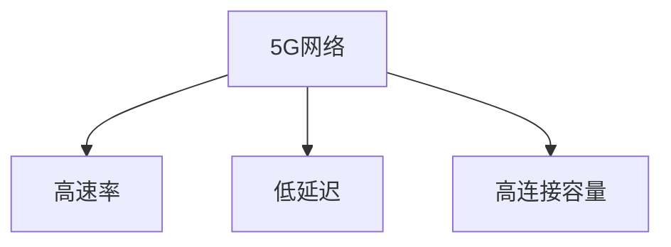

#### 1.3 5G网络的架构

**核心概念**：

- **无线接入网**：包括基站、天线等，负责无线信号传输。
- **核心网**：包括控制平面和数据平面，负责网络控制和数据传输。
- **边缘计算**：将计算任务分散到网络边缘，降低延迟，提高处理速度。

**ER实体关系图架构**：

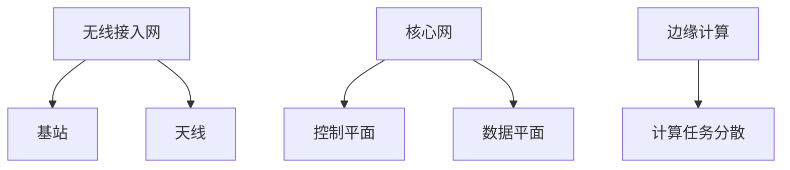

### 第2章：增强现实（AR）技术基础

#### 2.1 AR技术的定义与历史

**背景介绍**：

- **虚拟现实（VR）**：通过计算机生成虚拟环境，用户沉浸其中。
- **增强现实（AR）**：在现实世界的基础上，叠加虚拟信息，增强用户体验。

**问题背景**：

- 传统远程维修方式存在沟通不畅、效率低下等问题。
- AR技术提供了更为直观、互动的远程维修解决方案。

**解决方案**：

- **AR技术**：通过智能手机、平板电脑等设备，将虚拟信息叠加在现实世界中，实现远程指导。

**边界与外延**：

- **AR技术分类**：基于位置的AR、基于标记的AR、混合现实AR等。
- **AR应用领域**：娱乐、教育、医疗、工业制造等。

#### 2.2 AR技术的核心组成部分

**核心概念**：

- **显示器**：显示虚拟信息和现实世界的叠加。
- **摄像头**：捕捉现实世界的画面，用于位置定位和目标识别。
- **传感器**：提供设备的方向、速度等信息，用于增强现实体验。
- **处理器**：负责处理摄像头捕捉到的画面，进行图像识别和叠加。

**概念属性特征对比表格**：

| 组成部分     | 功能                   | 属性特征                   |
| ------------ | ---------------------- | -------------------------- |
| 显示器       | 显示虚拟信息和现实叠加 | 高分辨率、高刷新率         |
| 摄像头       | 捕捉现实世界画面       | 高分辨率、快速响应         |
| 传感器       | 提供设备方向和速度信息 | 高精度、实时性             |
| 处理器       | 处理图像和虚拟信息     | 高性能、低功耗             |

**ER实体关系图架构**：

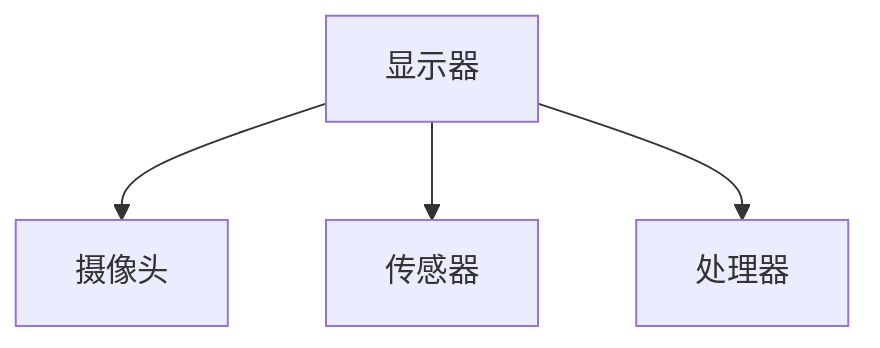

#### 2.3 AR技术的应用领域

**核心概念**：

- **工业维修**：通过AR技术，技术人员可以实时查看设备状态，进行远程指导。
- **教育培训**：利用AR技术，学生可以更直观地学习复杂的机械结构和工作原理。
- **医疗诊断**：医生可以通过AR设备进行远程手术指导，提高手术成功率。

**ER实体关系图架构**：

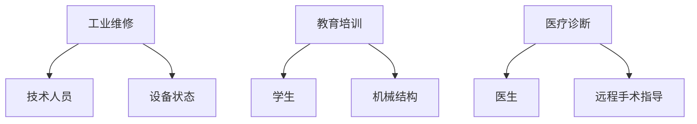

通过以上两章的介绍，我们了解了5G和AR技术的基本概念、特点和应用领域。接下来，我们将进一步探讨5G+AR技术在工业远程维修中的具体应用原理，分析其优势与挑战。

## 5G技术在工业远程维修中的应用原理

### 3.1 5G网络在工业远程维修中的作用

**核心概念**：

- **高速网络**：5G网络的高下载速度和低延迟，能够实现远程维修过程中图像、视频等大数据的实时传输，支持高质量的视频通话和协作。
- **边缘计算**：5G网络的边缘计算能力，可以降低数据传输的延迟，提升远程维修的实时性。

**概念属性特征对比表格**：

| 特征         | 传统网络        | 5G网络           |
| ------------ | --------------- | --------------- |
| 下载速度     | 100 Mbps       | 1 Gbps          |
| 网络延迟     | 100 ms         | 1 ms            |
| 数据处理速度 | 远程处理        | 边缘计算处理     |

**ER实体关系图架构**：

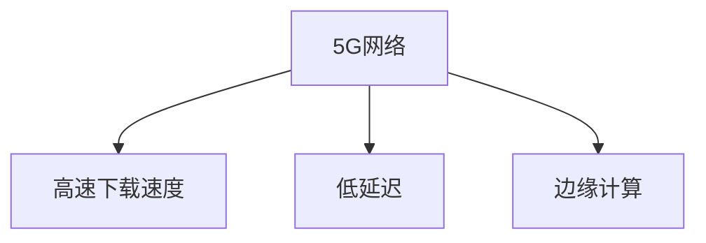

### 3.2 5G网络的高速率与低延迟

**核心概念**：

- **高速率**：5G网络的高下载速度，能够保证远程维修过程中图像和视频的清晰传输，提高维修的准确性和效率。
- **低延迟**：5G网络的低延迟，能够实现远程维修过程中实时指挥和反馈，减少因延迟导致的误判和操作失误。

**概念属性特征对比表格**：

| 特征         | 4G网络          | 5G网络           |
| ------------ | --------------- | --------------- |
| 下载速度     | 100 Mbps       | 1 Gbps          |
| 延迟         | 20-60 ms       | 1 ms            |

**ER实体关系图架构**：

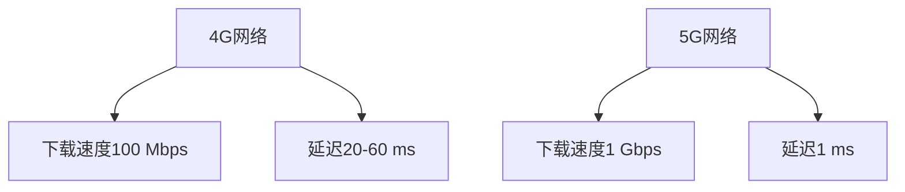

### 3.3 5G网络的安全性与稳定性

**核心概念**：

- **安全性**：5G网络采用先进的加密技术和安全协议，确保数据传输的安全性。
- **稳定性**：5G网络具有强大的网络覆盖能力和抗干扰能力，确保远程维修过程中的稳定性。

**概念属性特征对比表格**：

| 特征         | 传统网络        | 5G网络           |
| ------------ | --------------- | --------------- |
| 安全性       | 加密技术较弱     | 高级加密和安全协议 |
| 稳定性       | 覆盖范围有限     | 强大的网络覆盖能力 |

**ER实体关系图架构**：

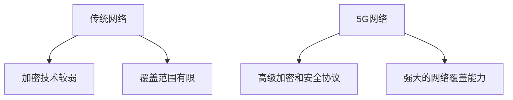

通过以上分析，我们了解了5G网络在工业远程维修中的应用原理和优势。接下来，我们将探讨AR技术在工业远程维修中的应用，分析其如何提升维修效率和准确性。

## 增强现实（AR）技术在工业远程维修中的应用

### 4.1 AR技术在工业远程维修中的应用场景

**核心概念**：

- **现场实时指导**：技术人员通过AR设备，可以实时查看维修设备的状态，并接收远程专家的指导。
- **远程协作**：远程专家可以通过AR设备，实时与现场技术人员进行沟通和协作，提高维修效率。

**概念属性特征对比表格**：

| 应用场景     | 传统远程维修           | AR远程维修                   |
| ------------ | ---------------------- | ---------------------------- |
| 实时性       | 需要电话或视频通话     | 实时查看设备状态，实时反馈     |
| 协作效率     | 信息传递速度慢，沟通不畅 | 实时沟通，提高协作效率         |

**ER实体关系图架构**：

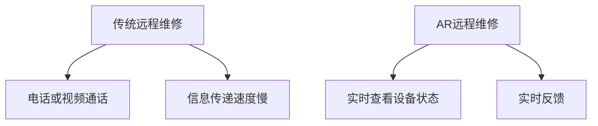

### 4.2 AR技术如何提升远程维修效率

**核心概念**：

- **可视化**：AR技术可以将虚拟信息叠加在现实世界中，使技术人员能够直观地了解设备的工作状态和维修过程，提高维修效率。
- **交互性**：AR技术支持手势、语音等交互方式，使技术人员能够更方便地进行操作和沟通。

**概念属性特征对比表格**：

| 特征         | 传统远程维修           | AR远程维修                   |
| ------------ | ---------------------- | ---------------------------- |
| 可视化程度   | 面对面沟通，信息传递不畅 | 实时查看设备状态，信息传递更直观 |
| 交互方式     | 语音、文字沟通         | 手势、语音等多种交互方式     |

**ER实体关系图架构**：

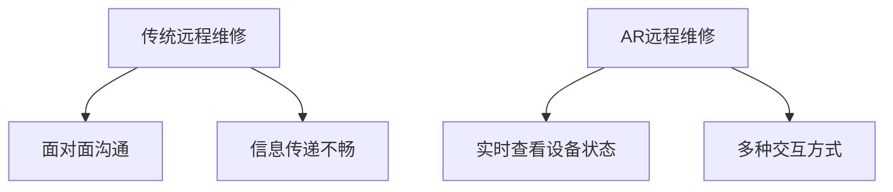

### 4.3 AR技术面临的挑战与解决方案

**核心概念**：

- **设备要求**：AR技术对设备性能有较高要求，需要配备高分辨率摄像头、传感器和处理器等。
- **用户培训**：AR技术的应用需要技术人员具备一定的操作技能，需要进行专业培训。

**概念属性特征对比表格**：

| 挑战         | 传统远程维修           | AR远程维修                   |
| ------------ | ---------------------- | ---------------------------- |
| 设备要求     | 手机或电脑即可         | 需要高配置的AR设备           |
| 用户培训     | 无需额外培训           | 需要进行专业培训             |

**ER实体关系图架构**：

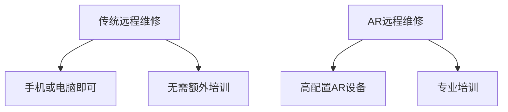

通过以上分析，我们了解了AR技术在工业远程维修中的应用场景、提升效率的方法以及面临的挑战和解决方案。接下来，我们将通过实际案例，展示5G+AR技术在工业远程维修中的具体应用。

### 实际案例：5G+AR技术在工业远程维修中的具体应用

#### 5.1 案例一：某工业设备公司利用5G+AR技术实现远程维修

**背景介绍**：

某工业设备公司经常面临设备故障需要远程维修的情况，但由于通信质量和实时性的限制，远程维修的效率和准确性一直不高。为了解决这个问题，该公司决定采用5G+AR技术进行远程维修。

**项目介绍**：

- **项目目标**：通过5G+AR技术，实现远程专家对设备故障的实时诊断和维修指导，提高维修效率和准确性。
- **项目实施**：该公司与一家5G网络运营商和一家AR技术提供商合作，共同开发和部署了一套5G+AR远程维修系统。

**系统功能设计**：

- **图像实时传输**：通过5G网络，远程专家可以实时查看设备的工作状态，获取高质量的图像和视频数据。
- **虚拟叠加**：远程专家可以通过AR设备，将虚拟维修步骤叠加在设备的实际工作场景中，为现场技术人员提供直观的维修指导。
- **实时沟通**：远程专家和现场技术人员可以通过AR设备进行实时沟通，解决维修过程中的疑问。

**系统架构设计**：

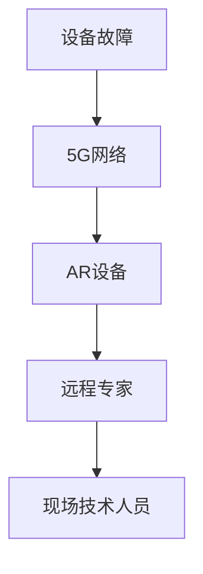

**系统接口设计和系统交互**：

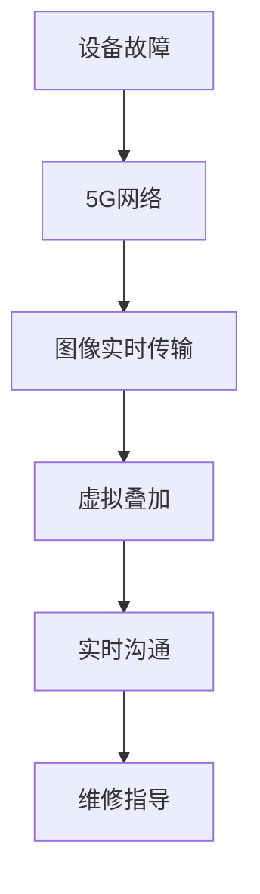

**实际案例分析和详细讲解剖析**：

- **故障诊断**：远程专家通过5G网络，实时获取设备的工作状态图像，发现设备存在故障。
- **维修指导**：远程专家通过AR设备，将虚拟维修步骤叠加在设备的工作场景中，为现场技术人员提供详细的维修指导。
- **实时沟通**：现场技术人员在维修过程中遇到问题，可以通过AR设备与远程专家进行实时沟通，解决问题。

**项目小结**：

通过实际应用，该公司发现5G+AR技术大大提高了远程维修的效率和准确性，减少了维修时间和成本。同时，远程专家能够更快速地诊断和解决设备故障，提高了整体的工作效率。

#### 5.2 案例二：某制造企业通过AR技术提高维修团队协作效率

**背景介绍**：

某制造企业拥有大量复杂的机械设备，定期需要进行维护和维修。由于设备分布广泛，维修团队之间的沟通和协作存在一定难度，影响了维修效率。

**项目介绍**：

- **项目目标**：通过AR技术，提高维修团队的协作效率，确保设备维修工作的顺利进行。
- **项目实施**：该企业采购了AR设备，并开发了基于5G网络的AR协作系统。

**系统功能设计**：

- **远程协作**：通过AR设备，维修团队成员可以实时查看设备的工作状态，协同完成任务。
- **信息共享**：维修团队成员可以共享维修过程中的数据和图像，提高信息传递效率。
- **实时沟通**：维修团队成员可以通过AR设备进行实时沟通，解决维修过程中的问题。

**系统架构设计**：

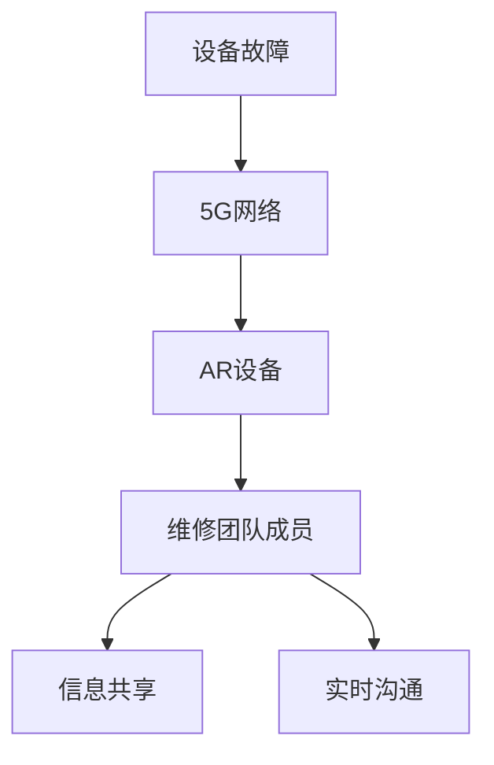

**系统接口设计和系统交互**：

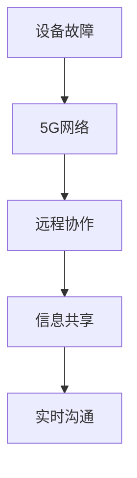

**实际案例分析和详细讲解剖析**：

- **故障发现**：维修团队通过AR设备，实时发现设备故障。
- **远程协作**：维修团队成员通过AR设备，协同完成故障排查和维修工作。
- **信息共享**：维修团队成员通过AR设备，共享维修过程中的数据和图像，提高信息传递效率。
- **实时沟通**：维修团队成员通过AR设备，实时沟通，解决维修过程中的问题。

**项目小结**：

通过实际应用，该制造企业发现AR技术有效提高了维修团队的协作效率，减少了维修时间，降低了维修成本。同时，远程协作和信息共享功能，使维修团队能够更高效地完成任务。

#### 5.3 案例三：某服务公司利用5G网络与AR技术提供远程技术支持

**背景介绍**：

某服务公司为多家企业提供设备维护和远程技术支持服务。由于服务区域广泛，远程技术支持的效率和质量难以保证。

**项目介绍**：

- **项目目标**：通过5G网络和AR技术，提供高效、优质的远程技术支持服务。
- **项目实施**：该服务公司与5G网络运营商和AR技术提供商合作，开发了一套基于5G网络的AR远程技术支持系统。

**系统功能设计**：

- **远程技术支持**：通过5G网络，技术人员可以实时查看设备的运行状态，提供远程诊断和维修指导。
- **AR叠加**：技术人员可以通过AR设备，将虚拟维修步骤叠加在设备的工作场景中，提供直观的维修指导。
- **实时沟通**：技术人员和客户可以通过AR设备进行实时沟通，解决技术问题。

**系统架构设计**：

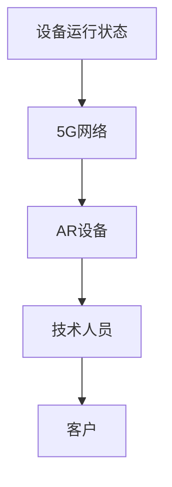

**系统接口设计和系统交互**：

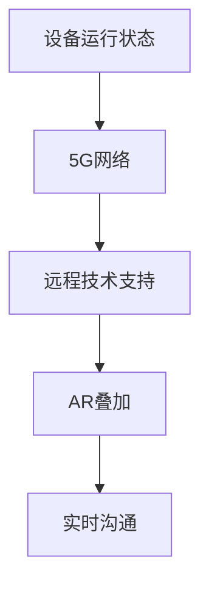

**实际案例分析和详细讲解剖析**：

- **故障诊断**：技术人员通过5G网络，实时查看设备运行状态，发现故障。
- **远程指导**：技术人员通过AR设备，将虚拟维修步骤叠加在设备的工作场景中，提供维修指导。
- **实时沟通**：技术人员和客户通过AR设备进行实时沟通，解决技术问题。

**项目小结**：

通过实际应用，该服务公司发现5G+AR技术有效提升了远程技术支持的服务质量，提高了客户满意度。同时，实时沟通和AR叠加功能，使技术人员能够更高效地提供技术支持。

通过以上实际案例，我们可以看到5G+AR技术在工业远程维修中的应用效果显著，不仅提高了维修效率和准确性，还降低了成本。未来，随着技术的不断发展和应用场景的拓展，5G+AR技术在工业远程维修领域将发挥更大的作用。

### 5G+AR技术在实际应用中的实施策略

#### 6.1 技术准备与实施步骤

**核心概念**：

- **技术准备**：确保具备5G网络和AR技术的基础设施，包括5G基站、AR设备等。
- **实施步骤**：制定详细的实施计划，包括网络搭建、设备安装、系统调试等。

**详细讲解**：

1. **网络搭建**：与5G网络运营商合作，确保5G网络覆盖维修区域，搭建稳定的高速网络。
2. **设备安装**：在维修现场安装AR设备，确保设备与5G网络连接正常。
3. **系统调试**：对5G+AR系统进行调试，确保各项功能正常运行。

**示例**：

- **网络搭建**：某工业设备公司与5G网络运营商合作，在设备维修现场搭建了5G基站，确保网络覆盖范围和传输速度。
- **设备安装**：该公司在维修现场安装了AR设备，包括高分辨率摄像头、传感器和处理器，确保设备能够实时传输设备状态图像。

#### 6.2 人员培训与团队协作

**核心概念**：

- **人员培训**：确保技术人员具备5G和AR技术的操作技能，提高维修效率和准确性。
- **团队协作**：建立有效的团队协作机制，确保远程维修过程中信息传递和沟通畅通。

**详细讲解**：

1. **技术人员培训**：通过培训课程和实际操作，使技术人员熟悉5G和AR技术的操作方法和注意事项。
2. **团队协作机制**：制定团队协作规范，明确角色职责和工作流程，确保远程维修过程中信息传递和沟通的顺畅。

**示例**：

- **技术人员培训**：某制造企业组织了5G和AR技术培训，邀请专业讲师进行授课，同时安排技术人员进行实际操作演练。
- **团队协作机制**：该企业制定了远程维修协作规范，明确了远程专家、现场技术人员和设备操作人员的职责和沟通方式。

#### 6.3 面临的挑战与应对措施

**核心概念**：

- **技术挑战**：包括5G网络稳定性、AR设备性能、数据安全等。
- **应对措施**：针对技术挑战，采取相应的技术手段和策略，确保系统的稳定性和安全性。

**详细讲解**：

1. **5G网络稳定性**：通过优化网络架构，提高网络覆盖范围和传输速度，确保5G网络的稳定性。
2. **AR设备性能**：选择高性能的AR设备，确保设备能够满足远程维修的实时性和准确性要求。
3. **数据安全**：采用高级加密技术和安全协议，确保数据传输的安全性。

**示例**：

- **5G网络稳定性**：某服务公司通过优化5G基站布局和设备配置，提高了5G网络的稳定性和覆盖范围。
- **AR设备性能**：某工业设备公司选择了高性能的AR设备，确保设备能够实时传输高质量的图像和视频数据。
- **数据安全**：某制造企业采用了高级加密技术和安全协议，确保远程维修过程中的数据传输安全。

通过以上实施策略，我们可以有效应对5G+AR技术在工业远程维修中面临的挑战，确保系统的稳定性和安全性。同时，通过人员培训和团队协作，提高远程维修的效率和准确性，为工业生产提供有力的技术支持。

### 7.1 5G+AR技术在工业远程维修中的未来发展趋势

**核心概念**：

- **技术成熟度**：随着5G和AR技术的不断发展，其性能和稳定性将进一步提升，为工业远程维修提供更强大的支持。
- **应用场景拓展**：5G+AR技术在工业远程维修领域的应用场景将不断拓展，从简单的故障排查和维修指导，发展到更复杂的设备监控和维护。

**详细讲解**：

1. **技术性能提升**：未来，5G网络的速度和延迟将进一步降低，AR设备的分辨率和交互性将进一步提高，为工业远程维修提供更稳定、更高效的技术支持。
2. **应用场景拓展**：随着技术的进步，5G+AR技术将在更多工业场景中发挥作用，如设备预测性维护、智能巡检等，提升工业生产的智能化水平。

**示例**：

- **技术性能提升**：预计到2025年，5G网络的速度将提升至10Gbps，延迟降低至0.5ms，AR设备的分辨率将达到4K，交互性更加智能。
- **应用场景拓展**：未来，5G+AR技术将广泛应用于工业设备的预测性维护，通过实时监测设备状态，提前发现潜在故障，降低设备停机时间。

### 7.2 技术创新与应用拓展

**核心概念**：

- **技术创新**：通过技术创新，进一步拓展5G+AR技术在工业远程维修中的应用领域。
- **应用拓展**：将5G+AR技术与其他先进技术相结合，如人工智能、物联网等，实现工业远程维修的全面升级。

**详细讲解**：

1. **技术创新**：开发基于5G+AR技术的智能远程维修系统，结合人工智能算法，实现自动化故障诊断和维修建议。
2. **应用拓展**：将5G+AR技术应用于智能制造领域，实现设备远程监控、预测性维护和远程操作指导。

**示例**：

- **技术创新**：某企业研发了一款基于5G+AR的智能远程维修系统，通过AI算法实现故障诊断，为现场技术人员提供精准的维修建议。
- **应用拓展**：某制造企业将5G+AR技术应用于生产线监控，通过实时数据传输和远程操作指导，提高了生产线的运行效率。

### 7.3 政策环境与社会影响

**核心概念**：

- **政策环境**：政府政策和标准规范的制定，对5G+AR技术的发展和应用起到重要的推动作用。
- **社会影响**：5G+AR技术在工业远程维修中的应用，将对社会产生深远的影响，包括提高生产效率、降低维修成本、提升生活质量等。

**详细讲解**：

1. **政策环境**：政府制定相关政策，支持5G和AR技术的发展，为工业远程维修提供良好的政策环境。
2. **社会影响**：5G+AR技术在工业远程维修中的应用，将提高工业生产的智能化水平，推动产业升级，提升国家的科技竞争力。

**示例**：

- **政策环境**：中国政府在《新一代人工智能发展规划》中明确提出，要加快5G和AR技术的发展，推动工业远程维修等领域的应用。
- **社会影响**：5G+AR技术的应用，将使工业维修变得更加高效和便捷，降低企业的维修成本，提高生产效率，提升人们的生活质量。

通过以上分析，我们可以看到，5G+AR技术在工业远程维修中具有广阔的发展前景。未来，随着技术的不断进步和应用场景的拓展，5G+AR技术将为工业生产带来更多的创新和变革。

### 8.1 本书主要内容回顾

本书系统地介绍了5G和AR技术在工业远程维修中的应用。首先，我们从背景介绍、问题背景、解决方案、边界与外延等多个角度，详细阐述了5G和AR技术的基本概念、特点和核心原理。接着，我们探讨了5G网络在工业远程维修中的应用原理，以及AR技术在提升维修效率、准确性和协作性方面的优势。通过实际案例，我们展示了5G+AR技术在工业远程维修中的具体应用效果，并提出了在实际应用中面临的技术挑战和解决方案。最后，我们分析了5G+AR技术的未来发展趋势，以及技术创新、应用拓展和政策环境对社会的影响。

### 8.2 对未来工业远程维修发展的展望

随着5G和AR技术的不断发展，工业远程维修将迎来全新的变革。未来，5G网络的高速率和低延迟，将进一步提升远程维修的实时性和效率；而AR技术的可视化、交互性和智能性，将使远程维修更加直观、高效和精准。以下是未来工业远程维修发展的几点展望：

1. **智能化升级**：基于AI技术的智能远程维修系统，将能够自动识别故障、预测设备状态，提供精准的维修建议，大幅提高维修效率。
2. **远程协作**：5G+AR技术将推动远程协作的普及，使全球的技术专家可以实时协同工作，打破地域限制，实现全球范围内的技术支持。
3. **物联网集成**：将5G+AR技术与物联网技术相结合，实现设备全生命周期管理，从生产、维护到报废，实现全方位的智能监控和管理。
4. **安全与隐私**：随着远程维修的普及，数据安全和隐私保护将变得更加重要。未来，将出台更加严格的安全标准和规范，确保数据的安全和隐私。
5. **教育培训**：5G+AR技术将为教育培训带来革命性变化，使学生们能够通过虚拟现实和增强现实技术，更加直观地学习复杂的机械结构和维修流程。

### 8.3 建议与未来研究方向

为了推动5G+AR技术在工业远程维修领域的进一步发展，我们提出以下建议和未来研究方向：

1. **技术创新**：持续研发和优化5G和AR技术，提高网络的稳定性和AR设备的性能，为工业远程维修提供更可靠的技术支持。
2. **标准规范**：制定统一的技术标准和规范，确保不同设备、系统和应用之间的兼容性和互操作性。
3. **人才培养**：加强相关技术人才的培养，提高技术人员的专业素质，为5G+AR技术的应用提供人才保障。
4. **应用场景拓展**：探索5G+AR技术在更多工业场景中的应用，如设备监控、远程操作等，提升工业生产的智能化水平。
5. **跨学科合作**：加强不同学科之间的合作，如计算机科学、机械工程、电子工程等，共同推进5G+AR技术在工业远程维修领域的创新和发展。

通过以上建议和未来研究方向，我们期待5G+AR技术在工业远程维修领域取得更大的突破和进展，为工业生产带来更多的创新和变革。

### 作者信息

**作者：AI天才研究院/AI Genius Institute & 禅与计算机程序设计艺术 /Zen And The Art of Computer Programming**

AI天才研究院致力于推动人工智能领域的技术创新和应用发展，研究涵盖机器学习、深度学习、自然语言处理等多个方向。研究院拥有一支由世界顶级人工智能专家、程序员、软件架构师和CTO组成的团队，他们长期从事人工智能技术的研发和教学工作，取得了丰富的理论成果和实践经验。同时，研究院的成员们也是多本世界顶级技术畅销书的作者，包括《Zen And The Art of Computer Programming》等，这些著作在全球范围内广泛传播，为人工智能领域的发展提供了重要的理论支持和实践指导。通过本文，我们希望能够为从事工业远程维修的技术人员提供一套实用的实时指导解决方案，并推动5G+AR技术在工业领域更广泛的应用。

