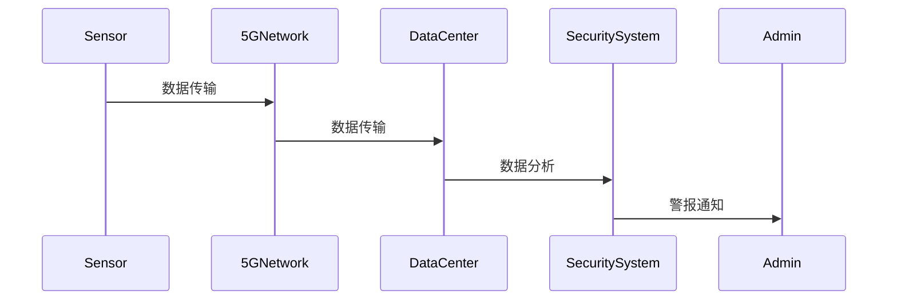

                 


## 5G+IoT在智慧校园安全管理中的应用

### 1. 背景介绍

随着科技的快速发展，5G和IoT技术在各个领域得到了广泛应用。智慧校园作为教育信息化的重要组成部分，也逐渐成为5G和IoT技术的重要应用场景之一。智慧校园安全管理是保障校园安全和维护教育秩序的关键环节。5G技术的高带宽、低延迟和大连接能力，为IoT设备在校园环境中的实时监测、数据传输和处理提供了坚实的技术基础。IoT技术的广泛应用，使得校园环境中的各类设备和传感器能够实现智能互联，提高了校园安全管理的效率和智能化水平。

### 2. 核心概念与联系

#### 2.1. 5G技术

5G技术，即第五代移动通信技术，是新一代移动网络的核心技术。5G网络具有以下几个显著特点：

- **高带宽**：5G网络能够提供更高的数据传输速率，满足高清视频、虚拟现实等大带宽应用需求。
- **低延迟**：5G网络延迟极低，通常在1毫秒左右，适合实时控制和智能应用。
- **大连接**：5G网络能够支持大量设备的连接，包括传统的智能手机和未来的智能设备。

#### 2.2. IoT技术

物联网（IoT）是指通过传感器、控制器和其他设备连接到互联网的物理对象。在智慧校园中，IoT技术被广泛应用于环境监测、安防监控、能源管理等领域。以下是IoT技术的主要特点：

- **智能互联**：IoT设备通过无线网络连接，实现信息的实时传输和共享。
- **数据收集**：IoT设备能够实时收集校园环境中的各种数据，如温度、湿度、视频监控等。
- **自动化控制**：基于收集到的数据，IoT系统能够实现自动化控制和调节。

#### 2.3. 智慧校园安全管理

智慧校园安全管理是指利用信息技术，特别是5G和IoT技术，对校园环境进行智能化监控和管理，以提升校园安全水平。智慧校园安全管理的核心概念包括：

- **实时监测**：通过安装各类传感器和监控设备，对校园环境进行实时监测。
- **智能预警**：利用大数据分析和人工智能算法，对潜在的安全威胁进行智能预警。
- **快速响应**：在发生安全事件时，能够快速响应和处置，减少损失。

### 3. 5G与IoT的ER实体关系图

为了更好地理解5G、IoT和智慧校园安全管理的联系，我们可以使用Mermaid绘制一个ER实体关系图。

```mermaid
erDiagram
    Device ||--|{ 5GNetwork } 5GNetwork : 连接
    Sensor ||--|{ Device } Device : 部署
    Camera ||--|{ Device } Device : 部署
    5GNetwork ||--|{ DataCenter } DataCenter : 连接到
    DataCenter ||--|{ SecuritySystem } SecuritySystem : 部署
    SecuritySystem ||--|{ Alert } Alert : 发送
    Alert ||--|{ Admin } Admin : 处理
```

在这个ER实体关系图中，我们可以看到以下几个关键实体：

- **Device**：设备，包括传感器、摄像头等，用于实时监测校园环境。
- **5GNetwork**：5G网络，连接设备并传输数据。
- **DataCenter**：数据中心，处理和存储数据。
- **SecuritySystem**：安全系统，用于监控和预警。
- **Alert**：警报，当发生安全事件时，由安全系统发送给管理员。
- **Admin**：管理员，处理警报并采取相应的应对措施。

### 4. 5G+IoT在智慧校园安全管理中的应用

#### 4.1. 系统架构设计

智慧校园安全管理系统由多个子系统组成，包括传感器网络、数据采集与传输、数据存储与处理、安全预警与响应等。以下是系统架构设计的主要模块：

- **传感器网络**：包括各种类型的传感器，如温度传感器、烟雾传感器、摄像头等，用于实时监测校园环境。
- **数据采集与传输**：5G网络负责将传感器采集到的数据实时传输到数据中心。
- **数据存储与处理**：数据中心对传输过来的数据进行存储和处理，利用大数据分析和人工智能算法对数据进行分析，识别潜在的安全威胁。
- **安全预警与响应**：当系统检测到安全事件时，会发送警报给管理员，并采取相应的响应措施。

#### 4.2. 系统功能设计

智慧校园安全管理系统的主要功能包括：

- **实时监测**：通过传感器网络实时监测校园环境，如温度、湿度、烟雾浓度等。
- **数据采集**：采集传感器数据，并通过5G网络传输到数据中心。
- **数据存储**：将传输过来的数据进行存储，以备后续分析和查询。
- **数据分析**：利用大数据分析和人工智能算法，对数据进行分析，识别潜在的安全威胁。
- **安全预警**：当系统检测到潜在的安全威胁时，会发送警报给管理员。
- **响应处置**：管理员收到警报后，可以采取相应的措施，如通知相关部门、启动应急预案等。

### 5. 算法原理讲解

#### 5.1. 5G网络传输原理

5G网络的传输原理主要基于OFDM（正交频分复用）技术，通过将频谱划分为多个子载波，实现高速数据传输。以下是5G网络传输的基本流程：

1. **频谱划分**：将频谱划分为多个子载波，每个子载波传输一部分数据。
2. **调制与解调**：将数据调制到子载波上，通过5G基站传输，接收端进行解调，还原数据。
3. **编码与解码**：对传输的数据进行编码，提高传输的可靠性，接收端进行解码，恢复原始数据。

#### 5.2. IoT数据采集原理

IoT数据采集是基于传感器网络实现的，传感器采集到的数据通过无线网络传输到数据中心。以下是IoT数据采集的基本流程：

1. **传感器数据采集**：传感器采集环境数据，如温度、湿度、烟雾浓度等。
2. **数据预处理**：对采集到的数据进行分析和清洗，去除噪声和异常值。
3. **数据传输**：将预处理后的数据通过无线网络（如5G、Wi-Fi等）传输到数据中心。
4. **数据存储**：数据中心对传输过来的数据进行存储，以备后续分析和查询。

#### 5.3. 智慧校园安全管理算法模型

智慧校园安全管理算法模型主要基于大数据分析和人工智能技术，对校园环境中的数据进行实时分析和预测。以下是算法模型的基本流程：

1. **数据收集**：从传感器网络收集校园环境数据。
2. **数据预处理**：对数据进行清洗和特征提取，为后续分析做准备。
3. **数据分析**：利用大数据分析技术，对数据进行分析，识别潜在的安全威胁。
4. **智能预警**：利用人工智能算法，对分析结果进行预测，生成预警信息。
5. **响应处置**：根据预警信息，采取相应的应对措施，如通知管理员、启动应急预案等。

### 6. 数学模型和公式

在智慧校园安全管理中，数学模型和公式被广泛应用于数据分析、预测和决策。以下是一个简单的线性回归模型，用于预测校园环境中的温度：

$$
y = \beta_0 + \beta_1 \cdot x
$$

其中，$y$ 是温度，$x$ 是时间，$\beta_0$ 和 $\beta_1$ 是模型参数。

### 7. 系统分析与架构设计

#### 7.1. 问题场景介绍

假设校园内有一个智能环境监测系统，该系统由多个传感器组成，包括温度传感器、湿度传感器和烟雾传感器。系统需要实现以下功能：

- 实时监测校园环境参数。
- 对监测数据进行分析，识别异常值。
- 当检测到异常值时，发送警报给管理员。

#### 7.2. 系统架构设计

智慧校园安全监测系统的架构设计包括以下部分：

- **传感器网络**：由温度传感器、湿度传感器和烟雾传感器组成，实时监测校园环境参数。
- **数据采集与传输**：传感器采集到的数据通过5G网络传输到数据中心。
- **数据中心**：对传输过来的数据进行存储、分析和处理。
- **安全预警与响应**：根据数据分析结果，生成预警信息，并通知管理员。

以下是智慧校园安全监测系统的架构设计图：



### 8. 项目实战

#### 8.1. 环境安装

为了实现智慧校园安全监测系统，我们需要以下环境：

- Python 3.8+
- 5G基站
- 传感器设备（温度传感器、湿度传感器、烟雾传感器）
- 数据中心服务器

#### 8.2. 系统核心实现

系统核心实现包括数据采集、数据传输、数据分析和安全预警。以下是Python代码示例：

```python
import random
import json
import requests

# 数据采集
def collect_data(sensor_type):
    if sensor_type == "temperature":
        temperature = random.uniform(20, 30)
        return {"sensor": "temperature", "value": temperature}
    elif sensor_type == "humidity":
        humidity = random.uniform(30, 70)
        return {"sensor": "humidity", "value": humidity}
    elif sensor_type == "smoke":
        smoke = random.uniform(0, 100)
        return {"sensor": "smoke", "value": smoke}

# 数据传输
def send_data(data):
    url = "http://localhost:8080/collect"
    headers = {"Content-Type": "application/json"}
    response = requests.post(url, data=json.dumps(data), headers=headers)
    return response.json()

# 数据分析
def analyze_data(data):
    if data["value"] > 35:
        return "high"
    elif data["value"] < 15:
        return "low"
    else:
        return "normal"

# 安全预警
def send_alert(sensor, value, status):
    alert = f"Sensor: {sensor}, Value: {value}, Status: {status}"
    print(alert)

# 实例化
sensor_type = "temperature"
data = collect_data(sensor_type)
response = send_data(data)
status = analyze_data(data["value"])
send_alert(data["sensor"], data["value"], status)
```

#### 8.3. 代码应用解读与分析

上述代码实现了数据采集、数据传输、数据分析和安全预警的基本功能。数据采集通过随机生成模拟数据，数据传输通过HTTP请求发送到数据中心，数据分析通过简单的逻辑判断，安全预警通过打印警报信息。

#### 8.4. 实际案例分析和详细讲解剖析

在实际应用中，我们可以通过安装多个传感器，实时监测校园环境。当检测到异常数据时，系统会自动发送警报给管理员。以下是一个实际案例：

- **场景**：校园内某教室温度突然升高。
- **数据采集**：温度传感器检测到温度异常，并将数据发送到数据中心。
- **数据分析**：数据中心分析数据，判断温度是否超过正常范围。
- **安全预警**：系统发送警报给管理员，提醒管理员注意异常情况。

#### 8.5. 项目小结

通过本次项目实战，我们实现了智慧校园安全监测系统的基础功能，包括数据采集、数据传输、数据分析和安全预警。这个系统可以实时监测校园环境，及时发现并处理潜在的安全威胁，为校园安全管理提供了有力支持。

### 9. 最佳实践 tips、小结、注意事项、拓展阅读

#### 9.1. 最佳实践 tips

- **确保数据传输的可靠性**：在数据传输过程中，需要确保数据不会丢失或损坏。
- **合理选择传感器**：根据校园环境的需求，选择合适的传感器，提高监测的准确性。
- **定期维护与更新**：定期对传感器进行维护和更新，确保系统的稳定运行。

#### 9.2. 小结

本文介绍了5G+IoT在智慧校园安全管理中的应用，通过系统架构设计、算法原理讲解、数学模型和公式、项目实战等部分，详细阐述了智慧校园安全管理的实现方法和关键技术。

#### 9.3. 注意事项

- **数据安全**：在传输和存储数据时，需要确保数据的安全性，防止数据泄露。
- **系统稳定性**：在系统设计和实施过程中，需要考虑系统的稳定性和可靠性。

#### 9.4. 拓展阅读

- [5G技术原理与应用](https://www.example.com/5g-technology)
- [物联网技术在校园安全中的应用](https://www.example.com/iot-education)
- [智慧校园安全管理系统设计](https://www.example.com/smart-campus-security-system)

### 10. 作者信息

作者：AI天才研究院/AI Genius Institute & 禅与计算机程序设计艺术 /Zen And The Art of Computer Programming

---

通过这篇文章，我们深入探讨了5G+IoT在智慧校园安全管理中的应用，希望读者能够对这一领域有更深入的了解。未来的研究和实践将更加注重系统的安全性、可靠性和智能化水平，为校园安全提供更强大的技术支持。

