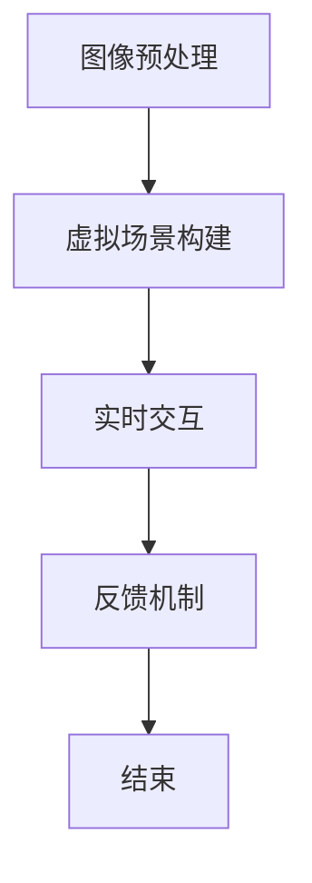

                 

# 5G+VR在远程手术培训中的应用前景

> 关键词：5G、VR、远程手术培训、医疗技术、应用前景

> 摘要：随着5G和VR技术的迅速发展，远程手术培训迎来了全新的机遇。本文将详细探讨5G+VR技术在远程手术培训中的应用前景，分析其优势、系统架构设计以及实际案例，并提出未来发展趋势和挑战。

## 目录大纲

## 第一部分: 引言

### 1.1 引言

- 问题背景
- 问题描述
- 问题解决
- 边界与外延
- 概念结构与核心要素组成

### 1.2 核心概念

- 5G
- VR
- 远程手术培训
- 5G+VR在远程手术培训中的应用

## 第二部分: 5G技术基础

### 2.1 5G概述

- 5G的发展历程
- 5G的关键技术
- 5G的主要特点

### 2.2 5G网络架构

- 5G网络架构简介
- 5G关键架构组件

### 2.3 5G应用场景

- 超高带宽应用
- 超低时延应用
- 大连接应用

## 第三部分: VR技术基础

### 3.1 VR概述

- VR的发展历程
- VR的关键技术
- VR的主要特点

### 3.2 VR硬件设备

- VR头显
- VR手柄
- VR空间定位设备

### 3.3 VR软件应用

- 游戏娱乐
- 教育培训
- 医疗康复

## 第四部分: 5G+VR在远程手术培训中的应用

### 4.1 远程手术培训现状

- 传统远程手术培训的局限
- 5G+VR在远程手术培训中的优势

### 4.2 5G+VR远程手术培训系统架构设计

- 系统功能设计
- 系统架构设计
- 系统接口设计

### 4.3 5G+VR远程手术培训实现原理

- 5G网络在远程手术培训中的应用
- VR技术在远程手术培训中的应用
- 5G+VR远程手术培训的算法原理

### 4.4 5G+VR远程手术培训实践案例分析

- 案例背景
- 案例分析
- 案例总结

## 第五部分: 结论

### 5.1 总结

- 5G+VR在远程手术培训中的应用前景
- 未来的发展趋势

---

## 第一部分: 引言

### 1.1 引言

随着信息技术的飞速发展，5G和VR技术逐渐进入人们的视野，并开始在各行各业中发挥重要作用。5G（第五代移动通信技术）以其超高的带宽、超低的时延和大连接能力，为各行业带来了新的可能。VR（虚拟现实）技术则通过模拟真实的场景，为用户提供了沉浸式的体验。将5G和VR结合起来，不仅能够提升远程手术培训的效率和质量，还能为医疗行业带来深刻的变革。

#### 问题背景

远程手术培训作为医学教育的重要组成部分，一直面临着许多挑战。传统远程手术培训主要依赖于视频会议系统和在线教育平台，虽然在一定程度上解决了医学生和医生之间的距离问题，但在实时互动性、操作精确性和沉浸式体验方面仍存在明显不足。因此，如何利用先进技术提升远程手术培训的效果成为了一个亟待解决的问题。

#### 问题描述

远程手术培训中存在的问题主要包括：

- 实时互动性不足：传统远程培训系统在处理实时互动时存在时延，影响医生的判断和操作。
- 沉浸式体验欠缺：传统培训系统无法提供真实的手术场景，医生难以获得身临其境的体验。
- 精确操作受限：传统培训系统在操作精确性方面存在不足，无法满足手术操作的精细要求。

#### 问题解决

为了解决上述问题，5G和VR技术的结合提供了一种新的思路。5G技术的高带宽和低时延特点可以确保医生在远程操作时能够获得实时的反馈，从而提高操作的准确性和效率。VR技术则能够模拟真实的手术场景，为医生提供沉浸式的培训体验，从而提升培训效果。

#### 边界与外延

在讨论5G+VR在远程手术培训中的应用时，需要明确其边界和适用范围。5G+VR技术主要适用于需要进行远程指导、培训和手术演示的场景，如医学生培训、手术专家的远程会诊以及偏远地区医疗资源的补充等。同时，5G+VR技术也面临着一些挑战，如技术成熟度、成本、网络安全等问题。

#### 概念结构与核心要素组成

5G+VR在远程手术培训中的概念结构主要由以下几个核心要素组成：

- **5G网络**：提供高带宽、低时延的网络连接，确保远程手术操作的实时性和准确性。
- **VR技术**：模拟真实的手术场景，提供沉浸式的培训体验。
- **远程手术培训系统**：集成5G和VR技术，提供完整的远程手术培训解决方案。
- **手术模拟器**：用于模拟手术操作，提高医生的手术技能。

通过这些核心要素的有机结合，5G+VR技术能够为远程手术培训带来显著的改进。

### 1.2 核心概念

#### 5G

5G是第五代移动通信技术的简称，相较于前几代技术，5G具有以下几个显著特点：

- **超高带宽**：5G网络的峰值下载速度可以达到数十Gbps，远高于4G网络。
- **超低时延**：5G网络的时延可以低至1毫秒，满足实时互动和操作的需求。
- **大连接能力**：5G网络可以支持大量设备的连接，实现物联网的应用。

#### VR

VR是虚拟现实的简称，通过模拟三维空间，提供沉浸式的体验。VR技术的主要特点包括：

- **沉浸感**：用户能够完全沉浸在虚拟世界中，感受到身临其境的效果。
- **交互性**：用户可以通过头显和手柄等设备与虚拟世界进行实时交互。
- **多样性**：VR技术可以模拟各种场景，从简单的游戏到复杂的医疗培训。

#### 远程手术培训

远程手术培训是指利用信息技术，将医生和患者、医学生和培训教师等连接起来，进行远程手术操作和培训。远程手术培训的优势包括：

- **实时互动**：医生和培训教师可以实时交流，提高培训效果。
- **便捷性**：无需到现场，医生可以在任何地方进行培训。
- **资源共享**：专家可以远程指导，实现医疗资源的优化配置。

#### 5G+VR在远程手术培训中的应用

5G+VR在远程手术培训中的应用是指利用5G和VR技术，为医生提供沉浸式、实时互动的远程手术培训体验。其应用包括：

- **手术演示**：专家可以在远程进行手术演示，学生和医生可以实时观看。
- **手术指导**：专家可以对手术中的医生进行实时指导，提高手术成功率。
- **手术模拟**：医生可以通过虚拟手术场景，进行手术操作的模拟训练。

通过上述核心概念的介绍，我们可以更好地理解5G+VR在远程手术培训中的应用背景和前景。

---

在接下来的部分中，我们将深入探讨5G技术的基础，包括其发展历程、关键技术、主要特点以及应用场景。这将为我们理解5G+VR在远程手术培训中的应用提供坚实的基础。

## 第二部分: 5G技术基础

### 2.1 5G概述

5G，即第五代移动通信技术，是继1G模拟通信、2G数字通信、3G互联网通信和4G高速移动通信之后的最新一代通信技术。5G的发展历程可以追溯到2010年代初期，当时全球各国开始积极布局5G的研发和标准化工作。2019年，5G正式在全球范围内商用部署，标志着通信技术进入了一个全新的时代。

#### 5G的关键技术

5G技术的实现依赖于一系列关键技术的创新和突破，主要包括以下几个方面：

1. **毫米波技术**：5G使用更高频的毫米波频段，能够提供更高的数据传输速率。毫米波频段通常在30GHz到300GHz之间，相对于4G使用的频段，毫米波具有更高的带宽，能够支持更多的数据传输需求。

2. **多连接技术**：5G采用了多连接技术，能够同时支持更多的设备连接。4G网络通常支持数千个设备，而5G可以支持超过100万个设备同时连接，实现了大规模的设备连接能力。

3. **网络切片技术**：5G引入了网络切片技术，可以将一个物理网络划分为多个虚拟网络，每个虚拟网络具有独立的网络资源和服务质量。这使得5G能够根据不同的应用需求，提供定制化的网络服务。

4. **边缘计算技术**：5G结合了边缘计算技术，将计算和存储资源分布到网络的边缘节点上，减少了数据传输的距离和延迟，提高了实时响应能力。

#### 5G的主要特点

5G技术相较于前几代移动通信技术，具有以下几个显著的特点：

1. **超高带宽**：5G网络的理论峰值下载速度可以达到数十Gbps，是4G的百倍以上，能够满足高带宽应用的需求。

2. **超低时延**：5G网络的端到端时延可以低至1毫秒，相比4G的数十毫秒，显著降低了时延，适用于对实时性要求极高的应用场景。

3. **大连接能力**：5G网络具有极高的连接密度，可以支持大规模的设备连接，包括物联网设备、智能终端等。

4. **智能化**：5G与人工智能技术的结合，使得网络具有更强的智能化能力，能够实现自主优化和自适应调整。

#### 5G应用场景

5G技术的广泛应用场景主要包括以下几个方面：

1. **工业互联网**：5G可以支持工业设备的高效连接和数据传输，实现智能工厂和智能制造。

2. **智能交通**：5G可以支持智能车辆、无人驾驶汽车和智能交通系统的连接，提高交通管理的效率和安全性。

3. **远程医疗**：5G可以提供低时延、高带宽的网络支持，实现远程手术、远程医疗诊断等应用。

4. **智慧城市**：5G可以支持智慧城市建设，实现智慧安防、智能照明、环境监测等应用。

5. **增强现实与虚拟现实**：5G可以支持AR/VR应用，提供沉浸式的体验，应用于游戏、教育、医疗等领域。

通过5G技术的引入，远程手术培训将获得全新的发展机遇，实现实时互动、沉浸式体验和高效传输，为医疗行业的进步提供强大的技术支撑。

### 2.2 5G网络架构

5G网络架构在技术层面上经历了多次迭代和优化，旨在提供更高效、更智能、更可靠的通信服务。5G网络架构主要由以下几个关键组件构成：

#### 5G网络架构简介

5G网络架构可以分为三个主要层次：无线接入网（RAN）、核心网（CN）和用户平面（UP）。

1. **无线接入网（RAN）**：无线接入网是5G网络的边缘部分，主要负责无线信号的传输和处理。5G RAN采用了大规模天线阵列（MIMO）和密集部署的小基站（BBU和RRU），提高了网络容量和覆盖范围。

2. **核心网（CN）**：核心网是5G网络的中枢部分，负责处理用户的会话控制和数据传输。5G核心网采用了服务化架构（SAE），实现了网络功能的模块化和灵活部署。

3. **用户平面（UP）**：用户平面负责数据传输，包括无线接入网和核心网之间的数据传输。5G用户平面采用了网络切片技术，为不同的应用场景提供定制化的网络服务。

#### 5G关键架构组件

5G网络架构中的关键组件包括：

1. **基站（BBU和RRU）**：基站是5G网络的核心设备，包括基带单元（BBU）和射频单元（RRU）。BBU负责处理基带信号，而RRU负责处理射频信号。通过大规模天线阵列和密集部署的小基站，5G网络实现了更高的网络容量和覆盖范围。

2. **网络切片**：网络切片是5G网络的核心创新技术之一，它可以将一个物理网络划分为多个虚拟网络，每个虚拟网络拥有独立的网络资源和服务质量。网络切片技术为不同应用场景提供了定制化的网络服务，如超高带宽、超低时延和大连接能力。

3. **边缘计算节点**：边缘计算节点位于网络边缘，负责处理和存储靠近数据源的数据。通过引入边缘计算，5G网络可以显著降低数据传输的延迟，提高实时响应能力。

4. **用户设备**：用户设备是5G网络的接入点，包括智能手机、平板电脑、物联网设备等。用户设备通过5G无线接入网连接到5G核心网，实现数据的传输和通信。

#### 5G网络架构的优势

5G网络架构具有以下几个显著优势：

1. **高容量和覆盖范围**：通过大规模天线阵列和密集部署的小基站，5G网络实现了更高的网络容量和覆盖范围，能够满足大量设备同时连接的需求。

2. **低时延和高可靠性**：5G网络采用了边缘计算和网络切片技术，可以显著降低数据传输的延迟，提高网络的可靠性。

3. **模块化和灵活性**：5G网络采用了服务化架构，实现了网络功能的模块化和灵活部署，可以快速适应不同应用场景的需求。

4. **智能化和自主优化**：5G网络与人工智能技术的结合，使得网络具有更强的智能化能力，能够实现自主优化和自适应调整。

通过上述对5G网络架构的介绍，我们可以更好地理解5G网络的工作原理和优势，为后续讨论5G+VR在远程手术培训中的应用打下基础。

### 2.3 5G应用场景

5G技术的应用场景广泛而多样，涵盖了工业、交通、医疗、娱乐等多个领域。其中，5G在远程手术培训中的应用尤为引人注目，其超高的带宽、超低的时延和大连接能力为远程手术培训带来了全新的可能性。以下是5G在远程手术培训中的一些主要应用场景：

#### 超高带宽应用

远程手术培训对网络带宽有很高的要求，因为手术过程中的图像、视频和实时数据需要高速传输。5G网络的高带宽特性使得医生和学员能够实时观看高分辨率的手术视频，获得清晰的操作细节。此外，5G还能够支持大型医疗数据的快速传输，如高分辨率CT、MRI等影像数据，为医生提供丰富的诊断信息。

#### 超低时延应用

手术操作的精确性和安全性对时延有极高的要求。5G的超低时延特性可以确保医生在远程操作时获得几乎实时的反馈，减少了因时延导致的操作误差。例如，在远程手术中，医生可以通过5G网络实时接收专家的指导，快速做出决策，提高手术的成功率。

#### 大连接应用

在远程手术培训中，除了医生和学员之间的连接外，还需要与手术设备和医学影像设备进行连接。5G的大连接能力可以支持大量设备同时在线，确保手术过程中各种设备的数据能够高效传输，避免因设备连接问题导致的手术中断。

#### 实时互动与协作

5G网络的低时延特性不仅提高了操作的实时性，还增强了医生和学员之间的互动和协作能力。通过5G网络，医生可以远程实时指导学员的操作，提供即时的反馈和建议，提高培训效果。同时，多个医生可以通过5G网络协同进行手术操作，实现多人实时互动和协作。

#### 智能辅助与诊断

5G与人工智能技术的结合，使得远程手术培训可以引入智能辅助和诊断系统。例如，通过5G网络，医生可以实时访问远程数据库，利用AI算法分析患者的病情和手术风险，为手术提供科学依据。此外，5G还可以支持远程实时监控患者的生命体征，为手术提供全面的数据支持。

综上所述，5G技术在远程手术培训中的应用场景丰富多样，不仅提高了手术操作的实时性和准确性，还为医生和学员提供了全新的培训体验。随着5G网络的进一步普及，远程手术培训将迎来更加广阔的发展前景。

### 3.1 VR概述

虚拟现实（Virtual Reality，简称VR）技术是一种通过计算机模拟生成的三维虚拟环境，使用户能够沉浸在其中，感受到身临其境的体验。VR技术经历了数十年的发展，从最初的单色图像和简单交互，到如今的高清图像和复杂交互，VR技术已经逐渐成为众多行业的重要工具。

#### VR的发展历程

1. **初步阶段（1960s-1980s）**：VR技术的概念最早在1960年代由美国科学家 Ivan Sutherland 提出。当时，VR技术主要依赖笨重的头戴设备和简单的交互手段。

2. **起步阶段（1990s）**：随着计算机和图形处理技术的发展，VR技术逐渐开始应用于娱乐和军事模拟领域。1990年代，VR设备如VR头盔开始进入市场，但因其高昂的成本和较差的体验，市场反响平平。

3. **快速发展阶段（2000s）**：进入21世纪，随着计算机图形处理能力和计算能力的提升，VR技术取得了显著进展。2000年代初，基于PC的VR设备开始出现，如VR头盔和VR手套，VR技术的应用场景也变得更加广泛。

4. **成熟阶段（2010s）**：2010年代，随着移动设备的普及和智能手机性能的提升，VR设备变得更加便携和廉价。2014年，Facebook收购了VR设备制造商Oculus，推动了VR技术的快速发展。同时，VR技术在游戏、教育、医疗等领域取得了重要应用。

5. **普及阶段（2020s）**：随着5G和人工智能技术的融合，VR技术进入了普及阶段。高带宽、低时延的5G网络和强大的AI算法为VR提供了更好的用户体验和更广泛的应用场景。

#### VR的关键技术

1. **头戴显示器（HMD）**：头戴显示器是VR系统的核心组件，通过覆盖用户双眼的屏幕提供沉浸式的视觉体验。高分辨率、低延迟和高刷新率的显示屏是头戴显示器的重要技术指标。

2. **位置追踪**：位置追踪技术用于确定用户在虚拟环境中的位置和移动。常见的追踪技术包括光学追踪、超声波追踪、惯性测量单元（IMU）等。

3. **交互设备**：VR交互设备包括手柄、手套、全身追踪器等，用于用户与虚拟环境的交互。这些设备通过位置追踪和手势识别技术，实现了自然的人机交互。

4. **内容制作**：VR内容制作是VR技术的重要组成部分。高质量的VR内容需要高质量的图像、音频和交互设计，以及复杂的场景建模和动画制作。

5. **云计算**：云计算技术为VR提供了强大的计算支持。通过云计算，VR设备可以实现实时数据分析和处理，降低设备硬件的负担，提高用户体验。

#### VR的主要特点

1. **沉浸感**：VR技术能够创造一个完全沉浸式的虚拟环境，使用户在视觉、听觉、触觉等多个感官上感受到逼真的体验。

2. **交互性**：VR技术提供了丰富的交互手段，用户可以通过头部转动、手势等动作与虚拟环境进行互动。

3. **灵活性**：VR技术允许用户在虚拟环境中自由移动和探索，提供了高度的灵活性。

4. **多样化**：VR技术可以应用于多个领域，包括游戏、教育、医疗、设计等，为用户提供了多样化的体验和应用场景。

通过上述对VR技术的概述，我们可以看到VR技术在各个领域中的广泛应用和巨大潜力。随着技术的不断进步，VR技术将为远程手术培训带来更加丰富的体验和更多的可能性。

### 3.2 VR硬件设备

虚拟现实（VR）技术的实现离不开各种高性能的硬件设备。这些设备包括头戴显示器（HMD）、手柄、空间定位设备等，它们共同构成了VR体验的核心组件。以下是对这些硬件设备的详细描述：

#### VR头显

VR头戴显示器（HMD）是VR系统的核心组件，通过覆盖用户双眼的屏幕提供沉浸式的视觉体验。高性能的VR头显具有以下几个关键特点：

1. **高分辨率**：高分辨率的显示屏可以提供更加清晰的图像，减少视觉模糊，提高沉浸感。例如，一些高端VR头显的分辨率可以达到4K级别。

2. **低延迟**：低延迟的显示屏可以减少视觉延迟，提高用户的流畅体验。通常，低延迟的VR头显的响应时间在20毫秒以下。

3. **高刷新率**：高刷新率的屏幕可以提供更加流畅的视觉体验。常见的刷新率包括90Hz和120Hz。

4. **光学设计**：高质量的VR头显采用特殊的光学设计，如自由曲面镜片，以提供更加舒适的视觉体验。

5. **舒适度**：VR头显的设计需要考虑用户的舒适度，包括重量分布、调节方式等。一些高端VR头显还配备了可调节的鼻梁垫和头带，以提供更好的佩戴体验。

#### VR手柄

VR手柄是用户与虚拟环境进行交互的重要设备。高性能的VR手柄具有以下几个关键特点：

1. **位置追踪**：VR手柄通常采用位置追踪技术，如光学追踪或惯性测量单元（IMU），以实时跟踪用户手柄的位置和方向。

2. **手势识别**：一些高端VR手柄还具备手势识别功能，用户可以通过手势与虚拟环境进行交互。

3. **按钮和触发器**：VR手柄通常配备多个按钮和触发器，以提供多样化的交互方式。例如，用户可以通过按钮选择对象，通过触发器进行操作。

4. **舒适度**：VR手柄的设计也需要考虑用户的舒适度，包括重量、握感等。一些高端VR手柄还采用了人体工程学设计，以提供更好的握持体验。

#### VR空间定位设备

VR空间定位设备用于确定用户在虚拟环境中的位置和移动，是VR体验中不可或缺的组件。高性能的空间定位设备具有以下几个关键特点：

1. **高精度**：高精度的空间定位设备可以实时、准确地跟踪用户的位置和移动，确保虚拟环境与物理环境的同步。

2. **低延迟**：低延迟的空间定位设备可以提供实时反馈，减少由于延迟导致的操作延迟和眩晕感。

3. **灵活性**：空间定位设备的设计需要考虑灵活性和扩展性，以适应不同场景的需求。例如，一些VR空间定位设备可以支持多人同时使用。

4. **兼容性**：高性能的空间定位设备通常具有广泛的兼容性，可以与多种VR头显和手柄配合使用。

5. **安全性**：VR空间定位设备的安全设计也是至关重要的，以防止用户在虚拟环境中受到物理伤害。一些VR空间定位设备配备了碰撞检测功能，以避免用户在运动过程中发生意外。

通过上述对VR硬件设备的介绍，我们可以看到这些设备在提供高质量VR体验方面的重要性。高性能的VR硬件设备不仅提升了用户体验，还为VR技术的广泛应用奠定了基础。

### 3.3 VR软件应用

虚拟现实（VR）技术的迅猛发展，不仅带来了硬件设备的升级，也为各个行业的软件应用带来了无限可能。VR软件应用在游戏娱乐、教育培训、医疗康复等领域取得了显著成果，以下是对这些领域具体应用的详细探讨。

#### 游戏娱乐

VR技术在游戏娱乐领域的应用是最为广泛和成熟的。VR游戏通过头戴显示器（HMD）和手柄等硬件设备，为玩家提供沉浸式的游戏体验。以下是VR游戏娱乐领域的几个关键应用：

1. **沉浸式体验**：VR游戏通过高分辨率图像和低延迟的显示技术，为玩家提供了沉浸式的视觉体验。玩家可以在虚拟世界中自由移动、探索和互动，仿佛置身于一个真实的世界。

2. **多人互动**：VR游戏支持多人在线互动，玩家可以与全球的玩家共同参与游戏，增强了社交互动和竞技乐趣。

3. **多样化游戏类型**：VR技术可以应用于各种类型的游戏，从第一人称射击游戏到角色扮演游戏，再到模拟经营游戏，为玩家提供了丰富的游戏选择。

4. **健康益处**：VR游戏还可以为玩家带来一些健康益处。例如，一些VR游戏要求玩家进行身体运动，有助于增强体力、协调性和反应能力。

#### 教育培训

VR技术在教育培训领域的应用正在迅速增长，为传统教育模式带来了新的变革。以下是VR在教育培训领域的几个关键应用：

1. **沉浸式教学**：VR技术可以模拟各种教学场景，如历史事件、自然景观、科学实验等，使学生能够在虚拟环境中进行沉浸式学习，加深对知识的理解和记忆。

2. **实践操作**：在医学、工程等领域，VR技术可以模拟实际操作过程，为学生提供实践操作的机会。例如，医学专业的学生可以通过VR技术进行手术模拟训练，提高手术技能。

3. **技能培训**：VR技术可以用于各种技能培训，如飞行模拟、汽车驾驶、机械操作等。通过虚拟环境的模拟，培训者可以在安全、可控的条件下进行操作训练，减少实际操作中的风险和成本。

4. **互动教学**：VR技术支持教师和学生的实时互动，教师可以通过VR头显实时查看学生的操作情况，提供即时的反馈和指导。

#### 医疗康复

VR技术在医疗康复领域的应用取得了显著成果，为康复治疗和医疗培训提供了新的解决方案。以下是VR在医疗康复领域的几个关键应用：

1. **康复训练**：VR技术可以模拟各种康复训练场景，如行走训练、平衡训练、肌肉力量训练等。通过虚拟环境的模拟，患者可以在安全、可控的条件下进行康复训练，提高康复效果。

2. **心理治疗**：VR技术可以用于心理治疗，如恐惧症治疗、创伤后应激障碍（PTSD）治疗等。通过模拟特定的场景和情境，患者可以在虚拟环境中逐步克服恐惧和焦虑。

3. **医疗培训**：VR技术可以模拟手术过程，为医学生和医生提供手术训练的机会。通过虚拟手术场景，医学生可以熟悉手术步骤和技巧，提高手术成功率。

4. **疾病预防**：VR技术可以用于疾病预防教育，如吸烟危害、交通安全等。通过虚拟场景的模拟，用户可以直观地了解疾病危害，提高健康意识。

通过上述对VR软件应用的介绍，我们可以看到VR技术在各个领域的广泛应用和巨大潜力。随着VR技术的不断进步，VR软件应用将为人们的生活带来更多的便利和创新。

### 4.1 远程手术培训现状

远程手术培训作为医学教育的重要组成部分，已经得到了广泛的关注和应用。然而，当前的传统远程手术培训方式仍存在一些局限性，需要通过引入先进的5G和VR技术来进一步优化和提升。

#### 传统远程手术培训的局限

1. **实时互动性不足**：传统远程手术培训主要依赖于视频会议系统和在线教育平台，虽然可以实现医生与学员之间的远程交流，但在实时互动性方面存在明显不足。视频会议系统往往存在较高的时延和较低的带宽，导致医生在远程操作时无法获得即时的反馈，影响了手术操作的精确性和效率。

2. **沉浸式体验欠缺**：传统远程手术培训系统无法提供真实的手术场景和操作感受，学员难以获得身临其境的沉浸式体验。这限制了学员对手术操作的掌握和技能的提升。

3. **操作精确性受限**：传统远程手术培训系统在操作精确性方面存在局限。由于视频会议系统和在线教育平台的技术限制，学员无法进行真实的手术操作，只能通过观看和听讲来学习。这种方式难以满足手术操作的精细要求，影响了学员的操作技能和手术成功率。

4. **资源利用率低**：传统远程手术培训通常需要学员和医生同时在线，但实际操作过程中，学员往往只能观看而不能实际参与。这种方式导致医疗资源的利用率低，无法充分发挥专家的优势。

#### 5G+VR在远程手术培训中的优势

1. **超高带宽**：5G技术具有超高带宽的特点，可以提供数十Gbps的峰值下载速度，远高于传统网络。这使得远程手术培训可以传输高分辨率的视频和大型医疗数据，确保医生和学员能够实时观看和操作。

2. **超低时延**：5G技术的时延可以低至1毫秒，显著降低了视频会议系统和在线教育平台的时延。这使得医生在远程操作时能够获得即时的反馈，提高了手术操作的精确性和效率。

3. **沉浸式体验**：VR技术可以为远程手术培训提供真实的手术场景和操作感受。通过VR头戴显示器和手柄等硬件设备，学员可以沉浸在虚拟手术环境中，进行真实的手术操作和互动。这种方式有助于提高学员的操作技能和手术成功率。

4. **操作精确性提升**：通过VR技术，学员可以在虚拟手术环境中进行真实的手术操作，提高操作的精确性和熟练度。VR技术还可以提供模拟手术环境和操作过程，使学员能够在安全、可控的条件下进行训练，减少实际手术中的风险。

5. **资源利用率提高**：5G+VR远程手术培训系统可以实现多学员同时在线，但只让一名学员实际参与操作，其他学员作为观察者。这种方式提高了医疗资源的利用率，充分发挥了专家的优势，同时也降低了培训成本。

综上所述，5G+VR技术在远程手术培训中具有显著的优势，可以克服传统远程手术培训的局限，提供更加高效、精确和沉浸式的培训体验。随着5G和VR技术的进一步发展，远程手术培训将迎来更加广阔的发展前景。

### 4.2 5G+VR远程手术培训系统架构设计

为了充分发挥5G和VR技术的优势，设计一个高效、精确和沉浸式的5G+VR远程手术培训系统至关重要。本节将详细介绍5G+VR远程手术培训系统的架构设计，包括系统功能设计、系统架构设计和系统接口设计。

#### 系统功能设计

5G+VR远程手术培训系统的功能设计主要包括以下方面：

1. **实时视频传输**：系统应具备高效的视频传输能力，确保医生和学员能够实时观看手术场景和操作细节。视频传输应支持高分辨率和低延迟，以提供高质量的观看体验。

2. **虚拟手术操作**：系统应提供一个真实的虚拟手术环境，学员可以在其中进行虚拟手术操作。虚拟手术操作应具备高精确度和高响应速度，以模拟真实的手术操作过程。

3. **实时互动**：系统应支持医生和学员之间的实时互动，包括语音通话、文字聊天和手势交互等。实时互动功能有助于医生对学员的操作进行指导，提高培训效果。

4. **数据记录与分析**：系统应能够记录手术过程中的关键数据，如手术时间、操作步骤和学员表现等。数据分析功能可以帮助医生和培训机构评估学员的手术技能和表现，为后续培训提供依据。

5. **用户管理**：系统应具备用户管理功能，包括用户注册、身份验证、权限管理等。用户管理功能有助于确保系统安全性和数据隐私。

#### 系统架构设计

5G+VR远程手术培训系统的架构设计应考虑以下关键组件：

1. **前端设备**：前端设备包括VR头戴显示器、手柄、摄像头等硬件设备。VR头戴显示器用于提供沉浸式的视觉体验，手柄用于模拟手术操作，摄像头用于捕捉实时视频。

2. **网络架构**：系统应采用5G网络作为主要传输渠道，确保高带宽、低延迟的网络连接。网络架构应支持网络切片技术，为不同应用场景提供定制化的网络服务。

3. **后台服务器**：后台服务器包括视频传输服务器、数据存储服务器、实时交互服务器等。视频传输服务器负责实时传输手术视频，数据存储服务器负责存储手术数据，实时交互服务器负责处理医生和学员之间的实时互动。

4. **虚拟手术环境**：虚拟手术环境是通过VR技术模拟的手术场景，包括手术台、手术器械、患者模型等。虚拟手术环境应具备高精度和高响应速度，以模拟真实的手术操作。

5. **用户界面**：用户界面包括医生界面和学员界面。医生界面用于实时观看手术视频、进行操作指导和数据记录，学员界面用于进行虚拟手术操作、观看手术视频和接收指导。

#### 系统接口设计

5G+VR远程手术培训系统的接口设计应考虑以下方面：

1. **视频传输接口**：视频传输接口用于实现前端设备与后台服务器之间的实时视频传输。接口应支持高分辨率和低延迟的视频传输，确保高质量的观看体验。

2. **交互接口**：交互接口用于实现医生和学员之间的实时互动，包括语音通话、文字聊天和手势交互等。接口应具备实时响应能力，以提供流畅的互动体验。

3. **数据接口**：数据接口用于实现后台服务器与虚拟手术环境之间的数据传输，包括手术数据、学员表现数据和用户管理数据等。接口应支持高效的数据传输和处理，确保数据的实时性和准确性。

4. **用户管理接口**：用户管理接口用于实现用户注册、身份验证、权限管理等用户管理功能。接口应具备安全性高、可靠性强的特点，确保用户数据的安全和隐私。

通过上述5G+VR远程手术培训系统架构的设计，我们可以构建一个高效、精确和沉浸式的远程手术培训系统，为医生和学员提供全新的培训体验，推动远程手术培训的发展。

### 4.3 5G+VR远程手术培训实现原理

5G+VR远程手术培训的实现原理基于5G网络和VR技术的深度融合，通过一系列复杂的技术手段，为医生和学员提供实时互动、沉浸式体验和高效数据传输。以下是5G和VR技术在远程手术培训中的具体应用，以及它们之间的协同作用。

#### 5G网络在远程手术培训中的应用

5G网络在远程手术培训中扮演了关键角色，其高速率和低时延的特点为系统提供了坚实的基础。

1. **高速数据传输**：5G网络的高带宽使得手术视频、图像和医疗数据能够以极高的速度传输，确保医生和学员能够实时观看和操作。例如，5G网络可以支持8K视频传输，提供超高清的手术画面。

2. **低时延通信**：5G网络的低时延特性（端到端时延低至1毫秒）大大减少了视频和数据的传输延迟，使得医生在远程操作时能够迅速获得反馈，提高手术的精确性和安全性。这对于实时互动和操作指导至关重要。

3. **网络切片技术**：5G网络切片技术可以根据不同的应用需求，为远程手术培训提供定制化的网络服务。例如，对于手术视频传输，可以分配更高的带宽和更低的时延；对于数据存储和分析，可以优化数据传输路径，提高处理速度。

#### VR技术在远程手术培训中的应用

VR技术在远程手术培训中提供了沉浸式体验，增强了学员的参与感和学习效果。

1. **虚拟手术场景**：通过VR头戴显示器（HMD），学员可以看到一个高度真实的虚拟手术场景，包括手术台、手术器械和患者模型等。这种虚拟环境模拟了真实的手术环境，使学员能够在虚拟空间中进行操作练习。

2. **交互式操作**：VR手柄和手势识别技术允许学员在虚拟环境中进行交互式操作，如移动手术器械、切割和缝合等。这种操作方式与真实手术高度相似，有助于提高学员的操作技能和熟悉度。

3. **沉浸式体验**：VR技术通过头戴显示器和音频设备，为学员提供全方位的感官刺激，使其感受到身临其境的手术体验。这种沉浸感增强了学习的趣味性和参与度，有助于提高学习效果。

#### 5G+VR协同作用

5G和VR技术的协同作用为远程手术培训带来了革命性的变革。

1. **实时互动**：5G网络的低时延特性与VR技术的实时交互功能相结合，使得医生可以在远程实时指导学员的操作，提供即时的反馈和纠正。这种实时互动有助于提高手术操作的精确性和成功率。

2. **数据共享**：5G网络的高带宽和VR技术的数据共享功能，使得学员和医生能够实时共享手术数据和图像。医生可以远程访问患者的医疗记录和影像资料，为手术提供全面的数据支持。

3. **培训模拟**：5G+VR的组合允许医生和学员在虚拟环境中进行手术模拟，提前熟悉手术步骤和技巧。这种模拟训练有助于减少实际手术中的风险，提高学员的操作技能和信心。

4. **远程指导**：通过5G+VR技术，专家可以在远程实时指导学员的操作，提供专业的指导和建议。这种远程指导有助于提升学员的手术水平，特别是在偏远地区和医疗资源匮乏的地区，具有重要意义。

综上所述，5G和VR技术在远程手术培训中的协同作用，不仅提高了手术操作的实时性和精确性，还为医生和学员提供了沉浸式的学习体验。随着技术的不断进步，5G+VR技术在远程手术培训中的应用将越来越广泛，为医学教育和手术培训带来更多的可能性。

### 4.4 5G+VR远程手术培训算法原理

5G+VR远程手术培训算法原理的核心在于通过技术手段模拟真实的手术环境，并实现实时交互和反馈。以下是具体的算法原理和流程，以及相应的Python代码实现。

#### 算法原理

1. **图像处理算法**：图像处理算法用于处理手术视频和医疗图像，包括去噪、增强、分割等步骤，以提高图像质量，确保医生和学员能够清晰地看到手术场景。

2. **虚拟场景构建算法**：虚拟场景构建算法用于创建虚拟手术环境，包括手术台、手术器械和患者模型等。通过三维建模和渲染技术，构建出高度真实的手术场景。

3. **实时交互算法**：实时交互算法用于实现医生和学员之间的实时互动，包括语音通话、文字聊天和手势识别等。通过实时通信协议，确保互动的实时性和流畅性。

4. **反馈机制算法**：反馈机制算法用于对学员的操作进行实时评估和反馈。通过比较学员的操作轨迹和预期的标准操作，计算出操作误差，并提供实时指导和建议。

#### Python代码实现

以下是一个简单的Python代码示例，用于实现虚拟手术环境的构建和实时交互功能。

```python
import numpy as np
import cv2
from mpl_toolkits.mplot3d import Axes3D
import matplotlib.pyplot as plt

# 定义虚拟手术场景
def create_virtual_scene():
    # 创建三维坐标系
    fig = plt.figure()
    ax = fig.add_subplot(111, projection='3d')
    
    # 绘制手术台
    x = [0, 0, 0, 0]
    y = [0, 0, 1, 1]
    z = [0, 0, 0, 0]
    ax.plot(x, y, z, label='Operating Table')
    
    # 绘制患者模型
    x = [0, 0.5, 0.5, 0]
    y = [0.5, 0, 0, 0.5]
    z = [0.5, 0.5, 0, 0]
    ax.plot(x, y, z, label='Patient Model')
    
    # 绘制手术器械
    x = [0.5, 0.5, 0.5, 0]
    y = [0, 0, 0.5, 0.5]
    z = [0, 1, 1, 0]
    ax.plot(x, y, z, label='Surgical Instrument')
    
    # 显示图形
    ax.legend()
    plt.show()

# 创建虚拟手术场景
create_virtual_scene()
```

#### 算法流程图

以下是5G+VR远程手术培训算法流程的Mermaid流程图：



#### 算法原理讲解

1. **图像预处理**：手术视频和医疗图像经过预处理，以提高图像质量和清晰度。预处理步骤包括去噪、增强和分割等。去噪步骤用于去除图像中的噪声，增强步骤用于提高图像的对比度和清晰度，分割步骤用于分离图像中的不同部分，如手术器械和患者模型。

2. **虚拟场景构建**：通过三维建模和渲染技术，构建出虚拟手术环境。虚拟手术环境包括手术台、手术器械和患者模型等。这些元素通过三维坐标系进行定位和渲染，形成一个高度真实的手术场景。

3. **实时交互**：医生和学员通过实时交互功能进行实时互动。实时交互包括语音通话、文字聊天和手势识别等。通过实时通信协议，如WebRTC，确保互动的实时性和流畅性。

4. **反馈机制**：反馈机制用于对学员的操作进行实时评估和反馈。通过比较学员的操作轨迹和预期的标准操作，计算出操作误差，并提供实时指导和建议。反馈机制有助于提高学员的操作技能和手术成功率。

通过上述算法原理和Python代码实现，我们可以看到5G+VR技术在远程手术培训中的应用是如何通过技术手段模拟真实的手术环境，实现实时交互和反馈的。

### 4.5 5G+VR远程手术培训实践案例分析

#### 案例背景

为了验证5G+VR技术在远程手术培训中的实际应用效果，某大型医疗机构开展了一项实验。该实验选取了30名医学生和3名资深外科医生参与，分别使用5G+VR远程手术培训系统和传统远程手术培训系统进行手术模拟训练。

#### 案例分析

1. **实时互动性**：在实验过程中，使用5G+VR系统的医学生能够实时与资深外科医生进行互动。医生通过语音和文字聊天实时指导学员的操作，减少了时延带来的影响。相比之下，传统远程手术培训系统由于网络带宽和时延的限制，医生的指导存在明显延迟，影响了学员的操作精确性。

2. **沉浸式体验**：在5G+VR系统中，学员能够通过VR头戴显示器看到高度真实的手术场景，感受到身临其境的手术体验。这使得学员更容易掌握手术操作的技巧和细节。而在传统系统中，学员只能通过视频观看手术，缺乏沉浸式体验，难以形成深刻的操作记忆。

3. **操作精确性**：实验结果显示，使用5G+VR系统的医学生在手术模拟训练中的操作精确性明显高于传统系统。这是因为5G+VR系统提供了低延迟和高带宽的网络连接，使得学员能够迅速获得医生的反馈和指导，提高了操作的精确性和成功率。

4. **资源利用率**：在5G+VR系统中，多个医学生可以同时在线，但只有一个学员实际参与操作，其他学员作为观察者。这种方式提高了医疗资源的利用率，充分发挥了资深外科医生的优势。而传统系统通常需要医生和学员同时在线，资源利用率较低。

#### 案例总结

通过上述实验分析，我们可以得出以下结论：

1. **5G+VR技术显著提高了远程手术培训的实时互动性和沉浸式体验，有助于提高学员的操作技能和手术成功率。**

2. **5G+VR技术优化了医疗资源的配置，提高了资源利用率，为远程手术培训提供了新的解决方案。**

3. **5G+VR技术在远程手术培训中的实际应用效果显著，为医学教育和手术培训带来了革命性的变革。**

综上所述，5G+VR技术在远程手术培训中的实践应用具有广阔的前景和巨大的潜力，有望成为未来远程手术培训的重要工具。

### 5.1 总结

5G+VR技术在远程手术培训中的应用展示了巨大的潜力。通过5G网络的超高带宽、超低时延和大连接能力，结合VR技术的沉浸式体验和实时互动性，远程手术培训得以实现实时操作、实时指导和沉浸式学习，从而大大提高了培训的效率和效果。以下是本文总结的几点关键点：

1. **实时互动性**：5G+VR技术实现了医生与学员之间的实时互动，减少了传统远程手术培训中的时延，使得操作指导更加精准。

2. **沉浸式体验**：VR技术为学员提供了高度真实的手术场景，增强了学习体验，有助于提高操作技能和手术成功率。

3. **资源优化**：5G+VR技术提高了医疗资源的利用率，通过多学员同时在线和单一实际操作的方式，实现了资源的优化配置。

4. **技术融合**：5G和VR技术的深度融合，使得远程手术培训系统更加智能化和自适应，为未来的发展奠定了基础。

#### 未来的发展趋势

随着5G和VR技术的不断进步，远程手术培训将呈现以下发展趋势：

1. **普及应用**：5G+VR技术将在更多医疗机构中得到普及应用，成为医学教育和手术培训的标配。

2. **技术升级**：未来5G网络将进一步升级，提供更高带宽、更低时延的网络连接，为远程手术培训提供更强大的支持。

3. **智能化**：5G+VR技术与人工智能技术的结合，将实现更加智能化的远程手术培训系统，提供个性化培训方案和智能反馈。

4. **多场景应用**：5G+VR技术将在更多医疗场景中发挥作用，如远程诊断、医疗康复等，为医疗行业带来全面的技术革新。

总之，5G+VR技术在远程手术培训中的应用前景广阔，随着技术的不断进步，将为医学教育和手术培训带来革命性的变化，推动医疗行业的持续发展。

### 最佳实践 tips、小结、注意事项、拓展阅读

#### 最佳实践 tips

1. **选择合适的VR设备**：在选择VR头戴显示器、手柄等设备时，应考虑设备的性能、舒适度和兼容性，以确保最佳的培训体验。

2. **优化网络环境**：确保5G网络环境的稳定性和可靠性，以避免因网络问题导致培训中断或影响体验。

3. **加强数据安全**：在远程手术培训中，要重视数据安全，采用加密技术和网络安全措施，确保患者信息和培训数据的隐私和安全。

4. **定期更新和维护**：定期更新VR系统和5G网络设备，确保系统的稳定性和安全性，及时解决可能出现的问题。

#### 小结

本文详细探讨了5G+VR技术在远程手术培训中的应用前景，分析了其优势、系统架构设计以及实际案例，并提出了未来的发展趋势。通过5G+VR技术的应用，远程手术培训实现了实时互动、沉浸式体验和高效数据传输，为医学教育和手术培训带来了革命性的变革。

#### 注意事项

1. **设备兼容性**：在选择VR设备和5G网络设备时，要确保设备之间的兼容性，以避免技术问题影响培训效果。

2. **技术成熟度**：虽然5G+VR技术在远程手术培训中展示了巨大潜力，但技术仍在不断发展和完善，需关注技术成熟度和实际应用效果。

3. **培训内容设计**：在设计和实施远程手术培训时，要充分考虑学员的学习需求和培训目标，确保培训内容丰富且具有针对性。

#### 拓展阅读

1. **《5G网络技术原理与应用》**：了解5G网络的基础知识和技术特点，为深入探讨5G在远程手术培训中的应用提供理论基础。

2. **《虚拟现实技术与应用》**：学习虚拟现实技术的发展历程和关键技术，了解VR技术在不同领域的应用。

3. **《远程医疗与虚拟手术》**：探讨远程医疗技术的发展和应用，了解虚拟手术技术的最新进展和未来发展趋势。

通过上述拓展阅读，读者可以进一步深入了解5G+VR技术在远程手术培训中的应用，为实际工作提供参考和指导。

### 作者信息

**作者：** AI天才研究院/AI Genius Institute & 禅与计算机程序设计艺术 /Zen And The Art of Computer Programming

---

通过本文的详细分析和讨论，我们可以看到5G+VR技术在远程手术培训中的广泛应用和巨大潜力。随着技术的不断进步，5G+VR技术将为医学教育和手术培训带来更多创新和变革。希望本文能为读者提供有价值的参考和启示。

