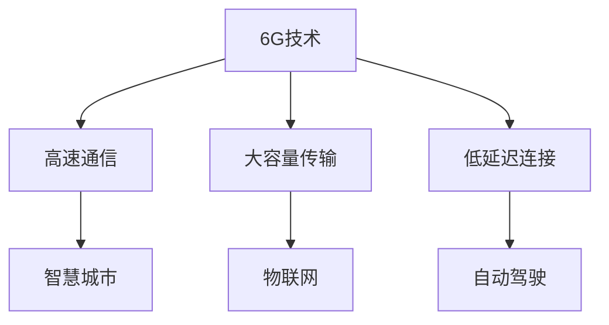

                 

# 6G+人工智能在智慧城市中的应用：构建超智能城市生态系统

关键词：6G、人工智能、智慧城市、应用、挑战、解决方案

摘要：
随着信息技术的飞速发展，6G和人工智能（AI）技术的崛起为智慧城市的发展带来了新的机遇。本文旨在探讨6G与人工智能在智慧城市中的应用，分析它们如何共同构建一个超智能城市生态系统。首先，我们将回顾6G和人工智能的基本概念、特点及其在智慧城市中的角色。接着，深入探讨6G技术在智慧交通、智慧医疗等领域的应用，以及人工智能如何赋能这些领域。最后，我们将讨论构建超智能城市生态系统的挑战和未来发展趋势。

## Step 1: 开篇背景介绍

### 6G技术和人工智能在智慧城市建设中的重要作用

6G，作为下一代移动通信技术，其核心目标是提供更高速度、更大容量、更低延迟的网络连接。6G技术的出现为智慧城市的发展带来了新的动力，使得大规模数据传输和实时处理成为可能。同时，人工智能技术的不断进步，使得机器能够更加智能地处理和分析大量数据，从而提高城市管理的效率和精确度。

在智慧城市建设中，6G和人工智能技术的结合具有以下几个重要作用：

1. **提高数据传输速度**：6G技术的高速度特性可以满足智慧城市中大数据、高清视频等高带宽应用的需求，从而实现更快速的数据传输和更流畅的用户体验。

2. **增强实时处理能力**：6G技术的低延迟特性使得实时数据处理和响应成为可能，这对于智慧交通、智慧医疗等需要实时决策的场景至关重要。

3. **赋能智能应用**：人工智能技术可以处理和分析6G网络中产生的大量数据，从而为智慧城市中的各种应用提供智能决策支持。

### 智慧城市面临的挑战与问题

智慧城市作为现代社会的发展趋势，虽然具有巨大的潜力和优势，但同时也面临着一系列挑战和问题：

1. **数据隐私和安全问题**：智慧城市依赖于大量的数据收集和分析，这引发了对数据隐私和安全的担忧。

2. **基础设施建设**：智慧城市的建设需要大量的基础设施支持，包括物联网设备、智能传感器等，这需要巨大的投资和完善的规划。

3. **跨领域协作**：智慧城市的建设涉及多个领域，包括交通、医疗、环境等，需要不同领域的专家和企业共同协作。

4. **技术更新换代**：随着6G和人工智能技术的不断更新，智慧城市需要不断进行技术升级和更新，以保持其竞争力和领先地位。

### 本书解决的问题和目标

本书旨在解决以下几个问题：

1. **6G和人工智能技术的基本概念、特点及应用**：详细介绍6G和人工智能技术的基本概念、特点以及它们在智慧城市中的应用。

2. **6G技术在智慧城市中的应用案例**：分析6G技术在智慧交通、智慧医疗等领域的应用案例，探讨其如何解决实际问题。

3. **人工智能在智慧城市中的赋能作用**：介绍人工智能技术在智慧城市中的应用，探讨其如何提高城市管理的效率和精确度。

4. **构建超智能城市生态系统的挑战与未来发展趋势**：讨论构建超智能城市生态系统所面临的挑战，以及未来的发展趋势。

通过本书的阅读，读者将能够：

- 理解6G和人工智能技术在智慧城市中的应用原理和机制。
- 了解6G技术在智慧城市中的具体应用场景和解决方案。
- 掌握人工智能技术在智慧城市中的赋能作用和实际应用。
- 把握构建超智能城市生态系统的关键挑战和未来发展趋势。

## 第一部分：6G与人工智能在智慧城市中的应用

### 第1章 6G与人工智能：智慧城市的新动力

#### 1.1 智慧城市面临的挑战与机遇

##### 1.1.1 智慧城市的概念与现状

智慧城市是指通过信息技术、物联网、大数据、人工智能等手段，实现对城市资源、环境、基础设施、公共服务的智能化管理和优化，从而提高城市运行效率、居民生活质量、城市可持续发展能力。

目前，全球范围内已有许多城市开始进行智慧城市的建设。例如，中国的新加坡、深圳、杭州等城市，美国的纽约、洛杉矶等城市，都在积极探索智慧城市的发展路径。智慧城市的建设已经成为城市发展的新趋势和新机遇。

##### 1.1.2 智慧城市面临的挑战

智慧城市在发展过程中面临着一系列挑战：

1. **数据隐私和安全问题**：智慧城市依赖于大量的数据收集和分析，数据隐私和安全问题成为一个重要挑战。

2. **基础设施建设**：智慧城市的建设需要大量的基础设施支持，包括物联网设备、智能传感器、高速网络等，这需要巨大的投资和完善的规划。

3. **跨领域协作**：智慧城市的建设涉及多个领域，包括交通、医疗、环境等，需要不同领域的专家和企业共同协作。

4. **技术更新换代**：随着6G和人工智能技术的不断更新，智慧城市需要不断进行技术升级和更新，以保持其竞争力和领先地位。

##### 1.1.3 6G与人工智能的作用

6G和人工智能技术在智慧城市中发挥着重要作用，为解决上述挑战提供了新的机遇：

1. **提高数据传输速度**：6G技术的高速度特性可以满足智慧城市中大数据、高清视频等高带宽应用的需求，从而实现更快速的数据传输和更流畅的用户体验。

2. **增强实时处理能力**：6G技术的低延迟特性使得实时数据处理和响应成为可能，这对于智慧交通、智慧医疗等需要实时决策的场景至关重要。

3. **赋能智能应用**：人工智能技术可以处理和分析6G网络中产生的大量数据，从而为智慧城市中的各种应用提供智能决策支持。

#### 1.2 6G技术：为智慧城市提速

##### 1.2.1 6G技术的特点与优势

6G技术具有以下几个显著特点：

1. **高速度**：6G技术预计将实现每秒数千Gbps的传输速度，远远超过现有的5G网络。

2. **大容量**：6G技术能够支持数以百亿计的设备连接，为智慧城市中的大规模物联网应用提供基础设施支持。

3. **低延迟**：6G技术的低延迟特性（预计小于1毫秒）使得实时数据处理和交互成为可能，为智慧城市中的实时应用提供技术保障。

4. **多元化频谱**：6G技术将利用更广泛的频谱资源，包括可见光通信、太赫兹波通信等，实现多样化的通信模式。

##### 1.2.2 6G在智慧城市中的应用场景

6G技术在智慧城市中有广泛的应用场景：

1. **智慧交通**：6G技术可以实现车辆与基础设施、车辆与车辆之间的实时通信，从而实现智能交通管理、自动驾驶等应用。

2. **智慧医疗**：6G技术可以实现远程医疗、智能医疗设备实时监测等应用，提高医疗服务的质量和效率。

3. **智慧环境**：6G技术可以实现对城市环境的实时监测和管理，包括空气质量、水质、噪音等，从而实现智能化城市环境治理。

4. **智慧能源**：6G技术可以支持智能电网、智能照明等应用，实现能源的智能化管理和优化。

##### 1.2.3 6G技术的发展趋势与挑战

6G技术的发展趋势主要包括以下几个方面：

1. **频谱资源扩展**：6G技术将利用更多频谱资源，包括高频段、低频段以及卫星通信等，以实现更高效的通信能力。

2. **多接入网络技术**：6G技术将集成5G、4G等多种网络技术，实现网络的无缝覆盖和高质量连接。

3. **智能网络架构**：6G技术将采用智能化网络架构，通过自组织、自优化等技术，提高网络的性能和可靠性。

然而，6G技术的发展也面临一系列挑战：

1. **频谱资源争夺**：随着6G技术的普及，频谱资源的需求将大幅增加，如何合理分配和管理频谱资源成为一大挑战。

2. **基础设施建设**：6G技术的实现需要大量的基础设施支持，包括基站、光纤网络等，这需要巨大的投资和完善的规划。

3. **标准化与兼容性**：6G技术的标准化和兼容性问题是其发展过程中的关键挑战，需要全球范围内的协作和合作。

#### 1.3 人工智能：赋能智慧城市

##### 1.3.1 人工智能的核心技术

人工智能（AI）的核心技术包括：

1. **机器学习**：通过训练模型，使机器能够从数据中学习并做出预测和决策。

2. **深度学习**：基于多层神经网络，通过逐层提取特征，实现对复杂数据的分析和处理。

3. **自然语言处理**：使计算机能够理解和生成人类语言，实现人机交互。

4. **计算机视觉**：使计算机能够理解和解释图像和视频，实现图像识别、目标检测等功能。

##### 1.3.2 人工智能在智慧城市中的应用

人工智能在智慧城市中有着广泛的应用：

1. **智慧交通**：通过实时交通流量分析、路径规划等应用，提高交通效率，减少拥堵。

2. **智慧医疗**：通过智能诊断、医疗影像分析等应用，提高医疗服务质量和效率。

3. **智慧环境**：通过实时环境监测、污染预测等应用，实现智能化城市环境治理。

4. **智慧能源**：通过智能电网管理、能源优化等应用，提高能源利用效率，减少浪费。

##### 1.3.3 人工智能的发展趋势与挑战

人工智能的发展趋势主要包括以下几个方面：

1. **算法优化**：不断优化机器学习、深度学习等算法，提高模型的准确性和效率。

2. **跨学科融合**：与其他领域（如生物学、物理学等）的融合，推动人工智能技术的发展。

3. **边缘计算**：将计算能力从云端转移到边缘设备，实现实时、高效的智能处理。

然而，人工智能的发展也面临一系列挑战：

1. **数据质量和隐私**：高质量的数据是人工智能训练的基础，如何保护用户隐私成为一大挑战。

2. **算法公平性**：避免算法偏见，确保算法的公平性和公正性。

3. **人工智能伦理**：如何确保人工智能技术在道德和伦理上符合社会规范，是一个重要的挑战。

#### 1.4 本书结构与内容安排

##### 1.4.1 本书的目标与读者对象

本书的目标是帮助读者深入了解6G和人工智能在智慧城市中的应用，掌握相关技术原理和实际应用。本书适合以下读者：

1. **智慧城市建设者**：包括城市规划者、技术工程师、项目经理等，希望了解6G和人工智能技术如何应用于智慧城市建设的专业人士。

2. **技术研究人员**：包括研究人员、开发者、工程师等，对6G和人工智能技术在智慧城市中的应用感兴趣的技术人员。

3. **大学生与研究生**：对6G、人工智能、智慧城市等领域感兴趣的大学生和研究生，希望深入学习和研究这些领域的知识。

##### 1.4.2 本书的主要内容安排

本书分为两个部分，共七个章节：

第一部分：6G与人工智能在智慧城市中的应用

- 第1章：6G与人工智能：智慧城市的新动力
- 第2章：6G技术与人工智能的核心概念与联系
- 第3章：6G技术在智慧城市中的应用

第二部分：人工智能在智慧城市的赋能作用

- 第4章：人工智能在智慧交通中的应用
- 第5章：人工智能在智慧医疗中的应用
- 第6章：人工智能在智慧环境中的应用
- 第7章：构建超智能城市生态系统的挑战与未来发展趋势

##### 1.4.3 学习建议与注意事项

为了更好地学习本书的内容，读者可以参考以下建议：

1. **系统学习**：按照章节顺序逐步学习，确保对每个知识点都有深入理解。

2. **实践操作**：结合实际案例和项目，进行实践操作，加深对知识点的理解和应用。

3. **深入思考**：在学习过程中，多思考6G和人工智能技术在智慧城市中的应用场景和潜在挑战，培养创新思维。

4. **持续学习**：随着6G和人工智能技术的不断发展，读者需要保持持续学习的心态，跟进最新的技术动态和应用案例。

#### 1.5 本章小结

本章介绍了6G和人工智能在智慧城市中的重要性和应用场景，分析了智慧城市面临的挑战和机遇。通过了解6G和人工智能技术的特点和优势，读者可以更好地把握智慧城市的发展方向和应用前景。接下来，本书将深入探讨6G和人工智能技术的核心概念、联系以及在智慧城市中的具体应用，为构建超智能城市生态系统提供理论和实践支持。

## Step 2: 6G技术与人工智能的核心概念与联系

在深入探讨6G技术与人工智能（AI）在智慧城市中的应用之前，我们首先需要明确两者各自的基本概念、核心特点，以及它们在智慧城市中的角色和关系。

### 6G技术概述

#### 2.1.1 6G技术的发展背景

6G技术是下一代移动通信技术的代名词，它将在5G的基础上实现进一步的提升和突破。随着物联网（IoT）、自动驾驶、虚拟现实（VR）、增强现实（AR）等新兴应用的兴起，对通信网络的速度、容量和可靠性提出了更高的要求。6G技术旨在满足这些需求，为未来智能社会的建设提供坚实的基础。

#### 2.1.2 6G技术的主要特点

6G技术具有以下几个显著特点：

1. **超高速**：6G预计将实现每秒数千Gbps的传输速度，比5G快百倍以上，满足高带宽应用的需求。
2. **超容量**：6G网络将支持数以百亿计的设备同时连接，为大规模物联网应用提供支持。
3. **超低延迟**：6G技术将实现低于1毫秒的延迟，使得实时通信和交互成为可能。
4. **多元化频谱**：6G将利用包括高频段、低频段以及太赫兹频段在内的多种频谱资源，实现更高效的通信。

#### 2.1.3 6G技术的应用领域

6G技术的应用领域非常广泛，涵盖了以下几个方面：

1. **智慧交通**：6G技术可以支持智能交通管理系统，实现车辆与基础设施、车辆与车辆之间的实时通信，提高交通效率和安全性。
2. **智慧医疗**：6G技术可以提供高速、低延迟的网络支持，实现远程医疗、实时医疗数据传输和智能诊断。
3. **智慧环境**：6G技术可以实现对城市环境的实时监测，包括空气质量、水质、噪音等，提高城市环境治理的智能化水平。
4. **智能制造**：6G技术可以支持智能制造过程中设备的实时通信和数据交换，提高生产效率和质量。

### 人工智能概述

#### 2.2.1 人工智能的定义与发展历程

人工智能（AI）是指通过计算机模拟人类智能行为的技术，包括感知、理解、学习、推理、规划等。人工智能的发展历程可以分为几个阶段：

1. **初始阶段（1956-1969年）**：人工智能概念诞生，主要关注符号主义和推理方法。
2. **繁荣时期（1970-1980年）**：人工智能研究取得重要进展，如专家系统和自然语言处理。
3. **低谷时期（1980-1990年）**：由于实际应用困难，人工智能研究进入低谷。
4. **复兴时期（1990年至今）**：机器学习、深度学习等算法的突破，使人工智能重新焕发生机。

#### 2.2.2 人工智能的核心技术

人工智能的核心技术包括：

1. **机器学习**：通过训练模型，使计算机能够从数据中学习并做出预测和决策。
2. **深度学习**：基于多层神经网络，通过逐层提取特征，实现对复杂数据的分析和处理。
3. **自然语言处理**：使计算机能够理解和生成人类语言，实现人机交互。
4. **计算机视觉**：使计算机能够理解和解释图像和视频，实现图像识别、目标检测等功能。

#### 2.2.3 人工智能的应用领域

人工智能在多个领域有着广泛的应用，包括：

1. **智能助理**：如Siri、Alexa等，提供语音交互和任务管理。
2. **自动驾驶**：通过计算机视觉和深度学习技术，实现车辆的自动行驶。
3. **医疗诊断**：通过分析医学图像和病历数据，辅助医生进行诊断和治疗。
4. **金融分析**：通过机器学习算法，对金融市场进行预测和风险评估。

### 6G与人工智能的联系

#### 2.3.1 6G技术对人工智能的赋能

6G技术为人工智能的发展提供了强有力的支持：

1. **高速数据传输**：6G技术的高速度特性使得大规模数据传输成为可能，为人工智能训练和应用提供了充足的数据支持。
2. **低延迟通信**：6G技术的低延迟特性使得实时通信成为可能，这对于需要实时响应的人工智能应用至关重要。
3. **海量设备连接**：6G技术的高容量特性支持了物联网的广泛应用，为人工智能在物联网环境中的应用提供了基础设施。

#### 2.3.2 人工智能对6G技术的需求

人工智能的发展也对6G技术提出了新的需求：

1. **高性能计算**：人工智能算法的复杂度不断提高，需要6G技术提供更高的计算性能。
2. **高效能网络**：人工智能应用需要实时处理大量数据，6G技术的高速度和低延迟特性是满足这一需求的关键。
3. **智能化网络管理**：人工智能技术可以用于网络优化和管理，提高6G网络的性能和可靠性。

#### 2.3.3 6G与人工智能的协同作用

6G与人工智能的协同作用主要体现在以下几个方面：

1. **智能网络优化**：通过人工智能技术，对6G网络进行智能化管理和优化，提高网络的性能和效率。
2. **智能应用创新**：结合6G技术的优势，人工智能技术可以推动智慧城市中各种智能应用的创新和发展。
3. **协同发展**：6G与人工智能技术的协同发展，将推动智慧城市建设的全面升级，实现城市运行的智能化和高效化。

### 核心概念对比表格

| 概念       | 6G技术          | 人工智能         |
|------------|----------------|-----------------|
| 特点       | 高速度、大容量、低延迟 | 自主性、智能性、学习性 |
| 应用领域   | 智慧城市、工业互联网、自动驾驶 | 语音识别、图像识别、自然语言处理 |
| 依赖关系   | 对低延迟、高可靠性需求较大 | 对数据处理能力、算法优化要求较高 |

### ER实体关系图

#### 2.6 本章小结

本章对6G技术和人工智能的基本概念、特点及其在智慧城市中的应用进行了详细介绍。通过对比6G技术与人工智能的核心概念，读者可以更好地理解两者之间的联系与协同作用。接下来，本书将深入探讨6G技术在智慧城市中的具体应用，以及人工智能如何赋能这些应用，为构建超智能城市生态系统提供理论和实践支持。

## 第三部分：6G技术在智慧城市中的应用

### 3.1 6G技术赋能智慧城市

#### 3.1.1 6G技术对智慧城市的影响

6G技术作为下一代通信技术的代表，将对智慧城市产生深远的影响。首先，6G技术的高速度、大容量和低延迟特性将极大地提升数据传输和处理的效率，为智慧城市中的各种应用提供强大的技术支持。以下是一些具体的影响：

1. **提升通信效率**：6G技术的高速通信能力可以满足智慧城市中大数据、高清视频等高带宽应用的需求，实现更快速、更流畅的数据传输，提升整体通信效率。
2. **增强实时处理能力**：6G技术的低延迟特性使得实时数据处理和响应成为可能，对于智慧交通、智慧医疗等需要实时决策的场景具有重要意义。
3. **支持大规模设备连接**：6G技术的大容量特性可以支持数以百亿计的设备同时连接，为智慧城市中的物联网应用提供基础设施支持，实现城市各系统的互联互通。

#### 3.1.2 6G技术在智慧城市中的应用场景

6G技术在智慧城市中有广泛的应用场景，以下列举几个典型的应用：

1. **智慧交通**：6G技术可以实现车辆与基础设施、车辆与车辆之间的实时通信，提高交通效率，减少拥堵。例如，通过6G技术支持的智能交通管理系统，可以实现实时交通流量监测、路径优化和紧急车辆调度等功能。
2. **智慧医疗**：6G技术可以提供高速、低延迟的网络支持，实现远程医疗、智能医疗设备实时监测等应用。例如，医生可以通过6G网络实时访问患者的医疗数据，进行远程诊断和治疗。
3. **智慧环境**：6G技术可以实现对城市环境的实时监测和管理，包括空气质量、水质、噪音等。例如，智能环境监测系统可以通过6G网络实时收集环境数据，实现智能化城市环境治理。
4. **智慧能源**：6G技术可以支持智能电网管理、智能照明等应用，提高能源利用效率，减少浪费。例如，通过6G网络实现智能电网的实时监控和优化调度，可以提高电网的稳定性和效率。

#### 3.1.3 6G技术解决智慧城市中的问题

智慧城市在发展过程中面临着一系列问题，6G技术可以有效解决这些问题：

1. **数据隐私和安全问题**：6G技术的高速度和低延迟特性，使得数据加密和传输更加高效和安全。通过6G技术实现的端到端加密和智能安全防护，可以有效保护用户隐私和数据安全。
2. **基础设施建设**：6G技术的高容量特性可以支持大规模基础设施的建设，包括物联网设备、智能传感器、基站等。通过6G技术的支持，智慧城市的建设可以更加高效和快速。
3. **跨领域协作**：6G技术的实时通信能力可以促进不同领域之间的协作，实现信息共享和资源优化。例如，通过6G技术支持的智能城市管理系统，可以实现交通、医疗、环境等领域的协同工作，提高整体管理效率。
4. **技术更新换代**：6G技术的不断更新和升级，为智慧城市提供了持续的技术支持。通过6G技术的迭代更新，智慧城市可以保持技术领先地位，适应未来发展的需求。

### 3.2 6G技术在智慧交通中的应用

#### 3.2.1 自动驾驶

##### 3.2.1.1 自动驾驶的概念与现状

自动驾驶是指通过计算机、传感器、控制算法等技术，使车辆能够自动完成驾驶任务，包括路径规划、障碍物检测、速度控制等。目前，自动驾驶技术已经取得重要进展，多家企业和研究机构正在积极开展自动驾驶汽车的研发。

自动驾驶技术的发展经历了以下几个阶段：

1. **Level 0-2（辅助驾驶阶段）**：车辆提供辅助驾驶功能，如自适应巡航、车道保持等。
2. **Level 3-4（部分自动驾驶阶段）**：车辆能够在特定条件下实现自动驾驶，如高速公路上的自动驾驶。
3. **Level 5（完全自动驾驶阶段）**：车辆在任何条件下都能实现自动驾驶。

##### 3.2.1.2 6G技术对自动驾驶的赋能

6G技术对自动驾驶的发展具有重要意义：

1. **实时数据传输**：6G技术的高速数据传输能力，可以保证自动驾驶车辆实时获取道路信息、环境数据等，实现更精确的路径规划和决策。
2. **低延迟通信**：6G技术的低延迟特性，使得自动驾驶车辆之间的通信更加及时和高效，可以实现车辆与车辆、车辆与基础设施之间的实时通信，提高整体交通安全性。
3. **海量设备连接**：6G技术的高容量特性，可以支持自动驾驶车辆与其他物联网设备（如交通信号灯、智能传感器等）的连接，实现全面的智能交通系统。

##### 3.2.1.3 自动驾驶的6G应用案例

以下是几个自动驾驶的6G应用案例：

1. **智能交通管理系统**：通过6G网络实现车辆与基础设施之间的实时通信，智能交通管理系统可以实时监控道路状况，优化交通信号控制，减少拥堵。
2. **自动驾驶车队**：在物流运输领域，6G技术可以支持自动驾驶车队之间的协同工作，实现高效的货物运输和路线优化。
3. **智能停车系统**：通过6G网络实现车辆与停车场的实时通信，智能停车系统可以实时查询停车位信息，提供最优停车方案，提高停车效率。

#### 3.2.2 智能交通管理

##### 3.2.2.1 智能交通管理的概念与现状

智能交通管理是指通过信息技术、物联网、大数据、人工智能等手段，实现对城市交通系统的智能化管理和优化。智能交通管理系统包括交通流量监测、交通信号控制、交通事故处理、公共交通管理等各个方面。

目前，智能交通管理系统在许多城市得到广泛应用，但仍然面临一些挑战：

1. **数据采集与处理**：城市交通数据的采集和处理是智能交通管理的核心，但现有技术手段难以满足海量数据的高效处理需求。
2. **跨领域协作**：智能交通管理涉及多个领域，包括交通、城市规划、信息技术等，需要不同领域之间的紧密协作。
3. **实时决策与响应**：交通状况变化迅速，智能交通管理系统需要实时进行决策和响应，提高交通运行效率。

##### 3.2.2.2 6G技术在智能交通管理中的应用

6G技术在智能交通管理中具有以下应用：

1. **高速数据传输**：6G技术的高速度特性，可以满足交通流量监测、信号控制等应用对高速数据传输的需求，实现更精准的交通管理。
2. **低延迟通信**：6G技术的低延迟特性，可以支持实时交通监控和应急处理，提高交通运行效率。
3. **大规模设备连接**：6G技术的高容量特性，可以支持智能交通系统中大量传感器、摄像头等设备的连接，实现全面的交通监控和管理。

##### 3.2.2.3 智能交通管理的6G应用案例

以下是几个智能交通管理的6G应用案例：

1. **智能信号控制系统**：通过6G网络实现交通信号灯的实时监控和优化控制，提高交通流量的通行效率。
2. **智慧停车场系统**：通过6G网络实现停车场与车辆之间的实时通信，提供智能停车服务，提高停车效率。
3. **智慧公交系统**：通过6G网络实现公交车与乘客、公交公司之间的实时通信，提供实时的公交信息服务，提高公共交通服务的质量。

### 3.3 6G技术在智慧医疗中的应用

#### 3.3.1 远程医疗

##### 3.3.1.1 远程医疗的概念与现状

远程医疗是指通过互联网、远程通信技术等手段，实现医疗服务的远程提供和医疗信息的远程传输。远程医疗的应用场景包括远程诊断、远程会诊、远程监护等。

目前，远程医疗在全球范围内得到广泛应用，但仍面临一些挑战：

1. **网络速度与稳定性**：远程医疗需要高速、稳定的网络支持，现有网络技术难以满足这一需求。
2. **数据安全和隐私**：远程医疗涉及大量医疗数据传输，数据安全和隐私保护是重要问题。
3. **设备兼容性**：远程医疗设备需要与医院信息系统兼容，实现无缝连接。

##### 3.3.1.2 6G技术对远程医疗的赋能

6G技术对远程医疗的发展具有重要意义：

1. **高速数据传输**：6G技术的高速度特性，可以满足远程医疗对高速数据传输的需求，实现高质量的医疗服务。
2. **低延迟通信**：6G技术的低延迟特性，可以支持远程医疗的实时通信，提高医疗服务效率。
3. **智能数据处理**：6G技术可以支持远程医疗中的大数据分析和智能处理，提供更准确的诊断和治疗方案。

##### 3.3.1.3 远程医疗的6G应用案例

以下是几个远程医疗的6G应用案例：

1. **远程会诊系统**：通过6G网络实现医生与患者、医生与医生之间的实时远程会诊，提高医疗诊断的准确性和效率。
2. **智能监护系统**：通过6G网络实现患者的实时监护，医生可以远程监控患者的生命体征，及时进行干预。
3. **远程手术指导**：通过6G网络实现手术医生与远程专家之间的实时通信，提供手术指导和支持，提高手术的成功率和安全性。

#### 3.3.2 智能医疗设备

##### 3.3.2.1 智能医疗设备的概念与现状

智能医疗设备是指利用物联网、人工智能等技术，实现医疗设备的智能化管理和数据采集。智能医疗设备包括智能体温计、智能血压计、智能血糖仪等。

目前，智能医疗设备在医疗领域的应用逐渐增多，但仍面临一些挑战：

1. **数据传输稳定性**：智能医疗设备需要稳定的网络支持，现有网络技术难以满足这一需求。
2. **设备兼容性**：智能医疗设备需要与医院信息系统兼容，实现数据无缝连接。
3. **数据安全和隐私**：智能医疗设备涉及大量患者数据，数据安全和隐私保护是重要问题。

##### 3.3.2.2 6G技术在智能医疗设备中的应用

6G技术在智能医疗设备中具有以下应用：

1. **高速数据传输**：6G技术的高速度特性，可以满足智能医疗设备对高速数据传输的需求，实现高效的数据采集和传输。
2. **低延迟通信**：6G技术的低延迟特性，可以支持实时数据传输和远程监控，提高医疗设备的响应速度和智能化水平。
3. **智能数据处理**：6G技术可以支持智能医疗设备中的大数据分析和智能处理，提供更准确的诊断和治疗方案。

##### 3.3.2.3 智能医疗设备的6G应用案例

以下是几个智能医疗设备的6G应用案例：

1. **智能体温计**：通过6G网络实现实时体温监测和数据上传，医生可以远程监控患者体温，及时进行干预。
2. **智能血压计**：通过6G网络实现实时血压监测和数据上传，医生可以远程监控患者血压，调整治疗方案。
3. **智能血糖仪**：通过6G网络实现实时血糖监测和数据上传，医生可以远程监控患者血糖，提供个性化的治疗建议。

## 3.4 6G技术在智慧环境中的应用

#### 3.4.1 智慧环境监测

##### 3.4.1.1 智慧环境监测的概念与现状

智慧环境监测是指利用物联网、大数据、人工智能等技术，实现对城市环境的实时监测和管理。智慧环境监测包括空气质量监测、水质监测、噪音监测等。

目前，智慧环境监测在城市环境管理中发挥着重要作用，但仍面临一些挑战：

1. **数据采集与处理**：智慧环境监测需要大量传感器设备进行数据采集，现有技术手段难以满足海量数据的高效处理需求。
2. **跨领域协作**：智慧环境监测涉及多个领域，包括环保、气象、城市规划等，需要不同领域之间的紧密协作。
3. **实时决策与响应**：环境问题变化迅速，智慧环境监测系统需要实时进行决策和响应，提高环境治理的效率。

##### 3.4.1.2 6G技术在智慧环境监测中的应用

6G技术在智慧环境监测中具有以下应用：

1. **高速数据传输**：6G技术的高速度特性，可以满足智慧环境监测对高速数据传输的需求，实现更准确的监测和数据分析。
2. **低延迟通信**：6G技术的低延迟特性，可以支持实时环境监测和应急处理，提高环境治理的效率。
3. **大规模设备连接**：6G技术的高容量特性，可以支持智慧环境监测系统中大量传感器、摄像头等设备的连接，实现全面的监控和管理。

##### 3.4.1.3 智慧环境监测的6G应用案例

以下是几个智慧环境监测的6G应用案例：

1. **智能空气质量监测系统**：通过6G网络实现实时空气质量监测和数据上传，政府可以实时了解空气质量状况，采取相应措施。
2. **智能水质监测系统**：通过6G网络实现实时水质监测和数据上传，环保部门可以实时监控水质变化，确保饮用水安全。
3. **智能噪音监测系统**：通过6G网络实现实时噪音监测和数据上传，城市管理部门可以实时监控噪音污染状况，采取相应措施。

### 3.5 6G技术在智慧能源中的应用

#### 3.5.1 智慧能源管理系统

##### 3.5.1.1 智慧能源管理系统的概念与现状

智慧能源管理系统是指利用物联网、大数据、人工智能等技术，实现对能源生产、传输、消费等环节的智能化管理和优化。智慧能源管理系统包括智能电网管理、智能照明、智能空调等。

目前，智慧能源管理系统在许多国家和地区得到广泛应用，但仍面临一些挑战：

1. **数据采集与处理**：智慧能源管理系统需要大量传感器设备进行数据采集，现有技术手段难以满足海量数据的高效处理需求。
2. **设备兼容性**：智慧能源管理系统中的设备需要与现有能源设施兼容，实现数据无缝连接。
3. **能源效率优化**：智慧能源管理系统需要实时监测和优化能源使用，提高能源利用效率。

##### 3.5.1.2 6G技术在智慧能源管理系统中的应用

6G技术在智慧能源管理系统中具有以下应用：

1. **高速数据传输**：6G技术的高速度特性，可以满足智慧能源管理系统对高速数据传输的需求，实现更准确的能源监测和数据分析。
2. **低延迟通信**：6G技术的低延迟特性，可以支持实时能源监测和应急处理，提高能源管理的效率。
3. **大规模设备连接**：6G技术的高容量特性，可以支持智慧能源管理系统中的大量传感器、智能设备等设备的连接，实现全面的能源管理。

##### 3.5.1.3 智慧能源管理系统的6G应用案例

以下是几个智慧能源管理系统的6G应用案例：

1. **智能电网管理系统**：通过6G网络实现电网实时监控和优化调度，提高电网的稳定性和效率。
2. **智能照明系统**：通过6G网络实现路灯的智能控制和亮度调节，提高照明效率，节约能源。
3. **智能空调系统**：通过6G网络实现空调的智能控制和管理，提高空调的使用效率和舒适度。

### 3.6 6G技术在智慧城市安全中的应用

#### 3.6.1 智慧城市安全监测系统

##### 3.6.1.1 智慧城市安全监测系统的概念与现状

智慧城市安全监测系统是指利用物联网、大数据、人工智能等技术，实现对城市安全的实时监测和管理。智慧城市安全监测系统包括公共安全、网络安全、交通安全等。

目前，智慧城市安全监测系统在许多城市得到广泛应用，但仍面临一些挑战：

1. **数据采集与处理**：智慧城市安全监测系统需要大量传感器设备进行数据采集，现有技术手段难以满足海量数据的高效处理需求。
2. **跨领域协作**：智慧城市安全监测系统涉及多个领域，包括公安、交通、环保等，需要不同领域之间的紧密协作。
3. **实时决策与响应**：城市安全状况变化迅速，智慧城市安全监测系统需要实时进行决策和响应，提高城市安全水平。

##### 3.6.1.2 6G技术在智慧城市安全监测系统中的应用

6G技术在智慧城市安全监测系统中具有以下应用：

1. **高速数据传输**：6G技术的高速度特性，可以满足智慧城市安全监测对高速数据传输的需求，实现更准确的监测和数据分析。
2. **低延迟通信**：6G技术的低延迟特性，可以支持实时安全监测和应急处理，提高城市安全管理的效率。
3. **大规模设备连接**：6G技术的高容量特性，可以支持智慧城市安全监测系统中大量传感器、摄像头等设备的连接，实现全面的监控和管理。

##### 3.6.1.3 智慧城市安全监测系统的6G应用案例

以下是几个智慧城市安全监测系统的6G应用案例：

1. **智能视频监控系统**：通过6G网络实现实时视频监控和数据分析，及时发现和处理安全隐患。
2. **智能交通监控系统**：通过6G网络实现交通状况实时监测和预警，提高交通安全水平。
3. **智能消防监控系统**：通过6G网络实现火灾实时监测和应急处理，提高消防效率。

### 3.7 6G技术在智慧城市公共服务中的应用

#### 3.7.1 智慧公共服务平台

##### 3.7.1.1 智慧公共服务平台的概念与现状

智慧公共服务平台是指利用物联网、大数据、人工智能等技术，实现城市公共服务的智能化和管理。智慧公共服务平台包括教育、医疗、交通、社保等。

目前，智慧公共服务平台在许多城市得到广泛应用，但仍面临一些挑战：

1. **数据采集与处理**：智慧公共服务平台需要大量数据支持，现有技术手段难以满足海量数据的高效处理需求。
2. **跨领域协作**：智慧公共服务平台涉及多个领域，需要不同领域之间的紧密协作。
3. **用户体验优化**：智慧公共服务平台需要提供便捷、高效的用户体验，提高居民满意度。

##### 3.7.1.2 6G技术在智慧公共服务平台中的应用

6G技术在智慧公共服务平台中具有以下应用：

1. **高速数据传输**：6G技术的高速度特性，可以满足智慧公共服务平台对高速数据传输的需求，实现更精准的服务和数据分析。
2. **低延迟通信**：6G技术的低延迟特性，可以支持实时公共服务监测和应急处理，提高公共服务效率。
3. **大规模设备连接**：6G技术的高容量特性，可以支持智慧公共服务平台中的大量传感器、智能设备等设备的连接，实现全面的公共服务管理。

##### 3.7.1.3 智慧公共服务平台的6G应用案例

以下是几个智慧公共服务平台的6G应用案例：

1. **智能教育平台**：通过6G网络实现教学资源的实时传输和互动，提高教育质量。
2. **智能医疗服务系统**：通过6G网络实现医疗服务的实时预约和远程诊断，提高医疗服务效率。
3. **智能交通服务平台**：通过6G网络实现交通信息的实时查询和路径规划，提高出行效率。

## 3.8 本章小结

本章详细介绍了6G技术在智慧城市中的多种应用，包括智慧交通、智慧医疗、智慧环境、智慧能源、智慧城市安全以及智慧公共服务等。6G技术以其高速度、大容量、低延迟的特性，为智慧城市的建设提供了强有力的技术支持，有效解决了数据传输、实时处理、跨领域协作等问题。通过6G技术的赋能，智慧城市的各种应用场景得以实现，为居民提供更加便捷、高效、智能化的公共服务。随着6G技术的不断发展和应用，智慧城市将迈向一个新的高度，为构建超智能城市生态系统奠定坚实的基础。

## Step 3: 人工智能在智慧城市中的应用

### 4.1 人工智能在智慧交通中的应用

#### 4.1.1 人工智能在智慧交通中的角色

人工智能在智慧交通中扮演着关键角色，通过智能交通管理系统、自动驾驶、实时交通流量预测等应用，显著提升了交通效率、安全性和便利性。

##### 4.1.1.1 智能交通管理系统

智能交通管理系统利用人工智能技术，对交通流量、道路状况、交通事故等进行实时监控和智能分析。通过大数据分析和机器学习算法，系统可以预测交通拥堵，优化交通信号控制，减少等待时间和排放。

**应用案例**：在北京市，智能交通管理系统通过AI技术实时分析交通流量数据，优化红绿灯时长，减少高峰期交通拥堵。据数据显示，该系统有效降低了城市交通拥堵时间，提高了道路通行效率。

##### 4.1.1.2 自动驾驶

自动驾驶技术是人工智能在智慧交通中的另一个重要应用。自动驾驶车辆通过传感器、计算机视觉和深度学习算法，实现自动识别道路标志、行人、其他车辆等，并自主进行驾驶决策。

**应用案例**：特斯拉的自动驾驶功能已经在多个国家和地区得到广泛应用。特斯拉车辆能够自动保持车道、调整车速，并在复杂的交通环境中进行导航。这不仅提高了驾驶安全性，还减少了驾驶疲劳。

##### 4.1.1.3 实时交通流量预测

实时交通流量预测是人工智能在智慧交通中的重要应用。通过收集和分析大量交通数据，AI模型可以预测未来交通流量变化，为交通管理部门提供决策支持。

**应用案例**：在新加坡，智能交通系统利用AI技术进行实时交通流量预测，并提前发布交通拥堵警告。这种预测系统帮助驾驶员选择最佳路线，减少交通拥堵，提高交通效率。

#### 4.1.2 人工智能在智慧交通中的挑战与未来趋势

尽管人工智能在智慧交通中取得了显著成果，但仍然面临一些挑战：

1. **数据隐私与安全**：交通数据涉及大量个人隐私信息，如何保护数据安全和隐私是一个重要问题。
2. **算法透明性与公平性**：交通管理算法的透明性和公平性需要保证，以避免算法偏见和不公正。
3. **技术成熟度与普及**：自动驾驶和智能交通管理系统需要更高的技术成熟度和更广泛的应用普及。

未来，随着AI技术的不断进步，智慧交通将迎来更多发展机遇：

1. **无人驾驶规模化应用**：自动驾驶技术将逐渐从试点阶段走向大规模商业化应用，提高道路安全性。
2. **智能交通系统的优化**：通过不断优化算法和模型，智能交通系统将更加高效，为城市交通提供更好的解决方案。
3. **跨领域融合**：智慧交通将与城市规划、环境监测等领域深度融合，构建更智能、更可持续的城市生态系统。

### 4.2 人工智能在智慧医疗中的应用

#### 4.2.1 人工智能在智慧医疗中的角色

人工智能在智慧医疗中发挥着重要作用，通过智能诊断、医疗影像分析、患者健康管理等方式，提升了医疗服务质量和效率。

##### 4.2.1.1 智能诊断

智能诊断利用人工智能技术，对患者的症状、病史、检查结果等进行综合分析，提供初步诊断建议。

**应用案例**：谷歌的DeepMind Health项目通过人工智能技术，分析大量患者数据，为医生提供快速、准确的诊断建议。这一系统已经在英国的部分医院投入使用，帮助医生更快地诊断疾病。

##### 4.2.1.2 医疗影像分析

医疗影像分析是人工智能在智慧医疗中的另一个重要应用。通过计算机视觉和深度学习算法，AI系统可以自动识别和诊断医学影像中的异常情况。

**应用案例**：IBM的Watson for Oncology系统通过分析医学影像，为医生提供肿瘤诊断和治疗方案建议。这一系统已经在全球多个国家的医疗机构中使用，提高了肿瘤诊断的准确性和效率。

##### 4.2.1.3 患者健康管理

患者健康管理利用人工智能技术，对患者的健康数据进行分析，提供个性化的健康建议和预警。

**应用案例**：Apple Watch的健康监测功能通过AI技术，实时监控用户的心率、睡眠质量等健康指标，并提供健康建议。这一功能帮助用户更好地管理自己的健康状况，预防疾病发生。

#### 4.2.2 人工智能在智慧医疗中的挑战与未来趋势

尽管人工智能在智慧医疗中取得了显著成果，但仍然面临一些挑战：

1. **数据质量和隐私**：医疗数据的质量和隐私保护是人工智能在智慧医疗中的关键问题。
2. **算法透明性与可解释性**：医疗决策的透明性和可解释性对于医生和患者至关重要。
3. **技术成熟度与临床应用**：人工智能技术在临床应用中的成熟度和技术实现仍需进一步提升。

未来，随着人工智能技术的不断进步，智慧医疗将迎来更多发展机遇：

1. **个性化医疗**：通过个性化数据分析，为患者提供更精准的治疗方案，提高治疗效果。
2. **远程医疗服务**：人工智能技术将推动远程医疗服务的发展，为偏远地区的患者提供高质量的医疗服务。
3. **医疗资源优化**：人工智能技术将帮助医疗机构优化资源配置，提高医疗服务效率。

### 4.3 人工智能在智慧环境中的应用

#### 4.3.1 人工智能在智慧环境中的角色

人工智能在智慧环境中的应用，包括空气质量监测、水质监测、环境预测等，有助于提高环境治理的效率和准确性。

##### 4.3.1.1 空气质量监测

空气质量监测利用人工智能技术，实时监测和分析空气中的污染物浓度，为政府和公众提供准确的空气质量信息。

**应用案例**：美国的Aeroqual公司利用人工智能技术，开发了智能空气质量监测设备，可以实时监测多种污染物浓度，并通过云端平台实时传输数据，帮助政府和企业采取相应措施。

##### 4.3.1.2 水质监测

水质监测利用人工智能技术，对水体中的污染物进行实时监测和分析，确保水质安全。

**应用案例**：中国的河海大学开发了基于人工智能的水质监测系统，通过对水样进行实时分析，识别和预测水体中的污染物浓度，为水质治理提供科学依据。

##### 4.3.1.3 环境预测

环境预测利用人工智能技术，分析历史环境数据，预测未来的环境变化趋势，为环境保护决策提供支持。

**应用案例**：欧盟的Copernicus计划通过人工智能技术，对全球环境进行监测和预测，提供环境变化趋势报告，帮助各国政府和国际组织制定环境保护政策。

#### 4.3.2 人工智能在智慧环境中的挑战与未来趋势

人工智能在智慧环境中的应用面临一些挑战：

1. **数据多样性和质量**：环境数据种类繁多，如何收集和处理这些数据是关键问题。
2. **环境数据隐私**：环境监测数据涉及隐私问题，需要严格保护。
3. **技术成熟度**：环境监测技术仍需进一步成熟，以提高预测的准确性。

未来，随着人工智能技术的不断进步，智慧环境将迎来更多发展机遇：

1. **智能环境治理**：通过人工智能技术，实现环境治理的智能化和高效化。
2. **全球环境监测**：人工智能技术将推动全球环境监测和治理的协同发展。
3. **可持续发展**：人工智能技术将助力实现环境可持续发展，为地球的长期健康提供保障。

### 4.4 人工智能在智慧能源中的应用

#### 4.4.1 人工智能在智慧能源中的角色

人工智能在智慧能源中的应用，包括智能电网管理、能源消耗预测、能源优化等，有助于提高能源利用效率，减少浪费。

##### 4.4.1.1 智能电网管理

智能电网管理利用人工智能技术，实时监测电网运行状态，优化电力分配，提高电网的稳定性和效率。

**应用案例**：美国的PowerIT公司开发了基于人工智能的智能电网管理系统，通过实时分析电网数据，优化电力调度，提高了电网的运行效率。

##### 4.4.1.2 能源消耗预测

能源消耗预测利用人工智能技术，分析历史能源消耗数据，预测未来的能源需求，为能源供应提供参考。

**应用案例**：英国的National Grid公司利用人工智能技术，对家庭和企业的能源消耗进行预测，优化能源供应，减少能源浪费。

##### 4.4.1.3 能源优化

能源优化利用人工智能技术，分析能源使用模式，提供节能建议，提高能源利用效率。

**应用案例**：德国的Siemens公司开发了基于人工智能的能源管理系统，通过对能源使用数据的实时分析，提供节能建议，降低了企业的能源消耗。

#### 4.4.2 人工智能在智慧能源中的挑战与未来趋势

人工智能在智慧能源中的应用面临一些挑战：

1. **数据质量和完整性**：能源数据的质量和完整性是人工智能分析的基础。
2. **技术成熟度**：人工智能技术在能源领域的应用仍需进一步成熟。
3. **成本和投资**：智能能源系统的建设需要巨大的投资，如何降低成本是一个重要问题。

未来，随着人工智能技术的不断进步，智慧能源将迎来更多发展机遇：

1. **智能电网**：通过人工智能技术，实现更智能、更高效的电网管理。
2. **分布式能源**：人工智能技术将推动分布式能源的发展，提高能源利用效率。
3. **可持续发展**：人工智能技术将助力实现能源的可持续发展，为地球的长期健康提供保障。

### 4.5 人工智能在智慧城市安全中的应用

#### 4.5.1 人工智能在智慧城市安全中的角色

人工智能在智慧城市安全中的应用，包括智能视频监控、网络安全防护、公共安全预测等，有助于提高城市的安全水平。

##### 4.5.1.1 智能视频监控

智能视频监控利用人工智能技术，对监控视频进行分析，自动识别异常行为和安全隐患。

**应用案例**：中国的一些城市已经部署了基于人工智能的智能视频监控系统，通过分析监控视频，及时发现和预警安全隐患，提高了城市的安全水平。

##### 4.5.1.2 网络安全防护

网络安全防护利用人工智能技术，实时监测网络流量，识别和阻止网络攻击。

**应用案例**：许多企业已经部署了基于人工智能的网络安全防护系统，通过实时分析网络流量，有效阻止了多种网络攻击。

##### 4.5.1.3 公共安全预测

公共安全预测利用人工智能技术，分析历史公共安全事件数据，预测未来的安全风险，为公共安全管理提供决策支持。

**应用案例**：一些城市的公共安全管理部门利用人工智能技术，对历史公共安全事件进行分析，预测未来的安全风险，提前采取相应的预防措施。

#### 4.5.2 人工智能在智慧城市安全中的挑战与未来趋势

人工智能在智慧城市安全中的应用面临一些挑战：

1. **数据隐私与安全**：城市安全数据涉及个人隐私，如何保护数据安全和隐私是一个重要问题。
2. **技术成熟度**：人工智能技术在城市安全领域的应用仍需进一步成熟。
3. **跨领域协作**：城市安全涉及多个领域，如何实现跨领域协作是一个重要问题。

未来，随着人工智能技术的不断进步，智慧城市安全将迎来更多发展机遇：

1. **智能化安全管理**：通过人工智能技术，实现更智能、更高效的城市安全管理。
2. **智能预警系统**：通过人工智能技术，建立智能预警系统，提前预测和预防安全风险。
3. **全民参与**：通过人工智能技术，鼓励全民参与城市安全，提高城市的安全水平。

### 4.6 人工智能在智慧公共服务中的应用

#### 4.6.1 人工智能在智慧公共服务中的角色

人工智能在智慧公共服务中的应用，包括智能客服、在线教育、智慧医疗等，有助于提升公共服务的效率和质量。

##### 4.6.1.1 智能客服

智能客服利用人工智能技术，提供自动化的客户服务，解答用户疑问，提高服务效率。

**应用案例**：许多企业已经部署了基于人工智能的智能客服系统，通过自然语言处理和机器学习技术，为用户提供24/7的自动服务，大大提高了服务效率。

##### 4.6.1.2 在线教育

在线教育利用人工智能技术，提供个性化学习方案，提高学习效果。

**应用案例**：一些在线教育平台通过人工智能技术，分析学生的学习数据，提供个性化的学习建议，提高了学生的学习效果。

##### 4.6.1.3 智慧医疗

智慧医疗利用人工智能技术，提供智能诊断、医疗影像分析等服务，提高医疗服务质量。

**应用案例**：谷歌的DeepMind Health项目通过人工智能技术，为医生提供智能诊断和治疗方案，提高了医疗服务的质量和效率。

#### 4.6.2 人工智能在智慧公共服务中的挑战与未来趋势

人工智能在智慧公共服务中的应用面临一些挑战：

1. **数据质量和隐私**：公共服务数据的质量和隐私保护是关键问题。
2. **算法透明性与可解释性**：公共服务算法的透明性和可解释性对于用户和社会至关重要。
3. **技术成熟度**：人工智能技术在公共服务领域的应用仍需进一步成熟。

未来，随着人工智能技术的不断进步，智慧公共服务将迎来更多发展机遇：

1. **个性化服务**：通过人工智能技术，实现更个性化的公共服务，提高用户满意度。
2. **跨领域融合**：人工智能技术将推动公共服务与教育、医疗、交通等领域的深度融合。
3. **全民参与**：通过人工智能技术，鼓励全民参与公共服务，提高公共服务的覆盖面和可及性。

### 4.7 本章小结

本章详细介绍了人工智能在智慧城市中的应用，包括智慧交通、智慧医疗、智慧环境、智慧能源、智慧城市安全以及智慧公共服务等。人工智能技术以其强大的数据处理能力和智能决策能力，为智慧城市的建设提供了有力支持。通过人工智能的应用，智慧城市能够实现更加高效、智能、安全的管理和服务，为居民创造更美好的生活。随着人工智能技术的不断进步，智慧城市的发展将迈向一个新的高度，为构建超智能城市生态系统奠定坚实的基础。

## 5.1 6G技术在智慧城市安全中的应用

在智慧城市建设中，安全是至关重要的一环。6G技术凭借其高速度、大容量、低延迟的特点，为智慧城市安全提供了新的技术手段和解决方案。以下是6G技术在智慧城市安全中的应用场景、解决方案以及相关案例。

### 5.1.1 6G技术在智慧城市安全中的应用场景

1. **智能视频监控**：通过6G技术实现高清晰度、实时传输的视频监控，提高城市监控系统的效率和覆盖范围。

2. **网络安全防护**：利用6G技术进行实时网络安全监测和快速响应，提升网络安全防护能力。

3. **应急指挥与响应**：通过6G技术实现应急信息的实时传输和处理，提高应急指挥和响应的效率。

4. **智能交通监控**：利用6G技术实现对交通状况的实时监控，提高交通管理的效率和安全性。

### 5.1.2 6G技术在智慧城市安全中的应用解决方案

1. **智能视频监控解决方案**：

   - **高速度传输**：6G技术的高速度传输能力，可以保证视频监控数据的实时传输，实现高清、低延迟的视频监控。
   - **大规模设备连接**：6G技术的大容量特性，可以支持大量监控设备的连接，实现全方位、无死角的安全监控。

2. **网络安全防护解决方案**：

   - **实时监测**：通过6G技术，实现实时监控网络流量，快速识别和响应网络攻击。
   - **智能分析**：利用人工智能技术，对网络行为进行分析，提高安全防护的准确性和效率。

3. **应急指挥与响应解决方案**：

   - **低延迟通信**：6G技术的低延迟特性，可以确保应急信息的高速传输，提高应急指挥和响应的效率。
   - **多媒体通信**：6G技术支持多种媒体通信，包括语音、视频和数据传输，实现多场景的应急通信。

4. **智能交通监控解决方案**：

   - **实时数据传输**：6G技术的高速度传输能力，可以确保交通监控数据的实时传输，实现快速、准确的交通管理。
   - **智能数据分析**：利用人工智能技术，对交通监控数据进行分析，优化交通管理策略。

### 5.1.3 6G技术在智慧城市安全中的应用案例

1. **智能视频监控案例**：

   - **城市安全监控**：某城市利用6G技术部署了智能视频监控系统，实现了高清、实时、全方位的安全监控。系统通过AI技术对视频数据进行分析，及时发现和预警安全隐患，提高了城市的安全水平。

2. **网络安全防护案例**：

   - **网络安全防护**：某企业利用6G技术和人工智能技术，实现了全面的网络安全防护。系统通过实时监测网络流量，快速识别和响应网络攻击，有效防止了数据泄露和系统入侵。

3. **应急指挥与响应案例**：

   - **应急指挥系统**：某城市利用6G技术构建了智能应急指挥系统，实现了应急信息的实时传输和处理。系统通过多媒体通信，确保了指挥中心和现场之间的实时沟通，提高了应急指挥和响应的效率。

4. **智能交通监控案例**：

   - **交通管理优化**：某城市利用6G技术和人工智能技术，实现了智能交通监控和管理。系统通过实时交通监控数据，优化交通信号控制和路径规划，提高了交通效率和安全性。

### 5.1.4 6G技术在智慧城市安全中的应用前景

随着6G技术的不断发展和普及，智慧城市安全将迎来更加广阔的应用前景：

1. **高安全性**：6G技术的高速度和低延迟特性，将显著提升智慧城市安全系统的效率和可靠性。

2. **智能决策**：利用人工智能技术，智慧城市安全系统能够实现智能分析和决策，提高安全管理的准确性和效率。

3. **跨领域融合**：6G技术和人工智能技术将在智慧城市安全领域实现跨领域融合，为城市安全提供更加全面的解决方案。

4. **可持续发展**：随着6G技术和人工智能技术的不断进步，智慧城市安全系统将更加智能化、高效化，为城市的可持续发展提供有力支持。

### 5.1.5 本章小结

6G技术在智慧城市安全中的应用，将显著提升城市安全管理的效率和准确性。通过智能视频监控、网络安全防护、应急指挥与响应以及智能交通监控等多种应用场景，6G技术为智慧城市安全提供了新的技术手段和解决方案。随着6G技术和人工智能技术的不断进步，智慧城市安全将迈向一个新的高度，为构建超智能城市生态系统奠定坚实的基础。

## 5.2 人工智能与6G技术在智慧城市公共服务中的应用

### 5.2.1 智慧公共服务平台的概念

智慧公共服务平台是指利用先进的信息技术，如人工智能（AI）和6G通信技术，构建一个高效、智能、便捷的公共服务体系。该平台旨在通过数据整合、智能分析和实时通信，优化公共服务资源的配置，提高服务质量和效率。

### 5.2.2 人工智能在智慧公共服务中的应用

人工智能在智慧公共服务中的应用，主要体现在以下几个方面：

1. **智能客服**：利用自然语言处理和机器学习技术，智能客服系统能够自动解答用户问题，提供个性化的服务建议，减少人工干预，提高服务效率。

2. **智能推荐**：通过对用户数据的分析，人工智能系统能够推荐最适合的服务选项，如教育、医疗、交通等，提高用户满意度和体验。

3. **预测性维护**：通过分析设备运行数据，人工智能系统可以预测设备故障，提前进行维护，减少服务中断和用户投诉。

4. **智能调度**：在公共交通、物流等领域，人工智能系统可以根据实时交通状况、天气情况等，智能调度车辆和人员，优化服务流程。

### 5.2.3 6G技术在智慧公共服务中的应用

6G技术在智慧公共服务中的应用，主要体现在以下几个方面：

1. **高速数据传输**：6G技术的高速度特性，可以确保大数据、高清视频等大流量数据的实时传输，支持智慧公共服务平台的高效运行。

2. **低延迟通信**：6G技术的低延迟特性，可以支持实时互动和响应，提高用户体验和系统效率。

3. **大规模设备连接**：6G技术的高容量特性，可以支持大量传感器和智能设备的连接，实现全场景的智能监控和服务。

4. **多元化接入**：6G技术支持多种接入方式，如卫星通信、太赫兹通信等，可以实现全球范围内的无缝接入，提升服务覆盖范围。

### 5.2.4 人工智能与6G技术在智慧公共服务平台中的协同作用

人工智能与6G技术的协同作用，为智慧公共服务平台提供了强大的技术支持：

1. **数据驱动决策**：人工智能技术可以对大量公共服务数据进行深入分析，结合6G技术的高速数据传输能力，为决策提供可靠的数据支持。

2. **实时服务响应**：6G技术的低延迟特性，结合人工智能的实时分析能力，可以实现公共服务系统的快速响应和高效运行。

3. **个性化服务**：通过人工智能技术分析用户行为数据，结合6G技术的多元接入方式，可以提供个性化的服务推荐和体验。

4. **全场景监控**：6G技术的高速度和大规模设备连接能力，结合人工智能的智能监控和分析能力，可以实现全方位、全场景的智能监控和服务。

### 5.2.5 人工智能与6G技术在智慧公共服务平台中的应用案例

以下是几个具体的应用案例：

1. **智能交通管理平台**：

   - **应用场景**：通过6G技术实现实时交通流量监控，利用人工智能技术分析交通数据，优化交通信号控制和路线规划。
   - **效果**：有效减少交通拥堵，提高交通效率，降低交通事故率。

2. **智慧医疗服务平台**：

   - **应用场景**：通过6G技术实现远程医疗，利用人工智能技术进行患者数据分析，提供个性化的医疗建议和治疗方案。
   - **效果**：提高医疗服务的可及性和质量，减轻医疗资源压力。

3. **智慧教育服务平台**：

   - **应用场景**：通过6G技术实现远程教育和在线课程，利用人工智能技术分析学生学习数据，提供个性化学习建议。
   - **效果**：提高教育资源的分配效率，提升学习效果。

4. **智能城市管理平台**：

   - **应用场景**：通过6G技术实现城市环境监测，利用人工智能技术分析环境数据，提供智能化的城市管理和应急响应。
   - **效果**：提高城市管理效率，改善居民生活质量。

### 5.2.6 未来发展趋势

随着人工智能和6G技术的不断发展，智慧公共服务平台将朝着更加智能化、高效化和个性化方向演进：

1. **智能化水平提升**：随着人工智能技术的进步，智慧公共服务平台的智能化水平将进一步提升，实现更精准的数据分析和更智能的服务。

2. **服务覆盖范围扩大**：随着6G技术的普及，智慧公共服务平台的覆盖范围将不断扩大，实现全球范围内的无缝接入和服务。

3. **跨领域融合**：智慧公共服务平台将与其他领域（如工业、农业等）实现深度融合，构建更全面的智能生态系统。

4. **可持续发展**：智慧公共服务平台将推动公共服务体系的可持续发展，提高资源利用效率，降低环境负担。

### 5.2.7 本章小结

人工智能与6G技术在智慧公共服务平台中的应用，为公共服务体系带来了革命性的变化。通过智能客服、智能推荐、预测性维护和智能调度等多种应用，智慧公共服务平台显著提升了服务效率和质量。随着人工智能和6G技术的不断进步，智慧公共服务平台将实现更加智能化、高效化和个性化的发展，为构建超智能城市生态系统提供强有力的支持。

## 5.3 6G和人工智能在智慧城市公共服务中的应用

### 5.3.1 6G和人工智能的基本概念

**6G**：6G是下一代移动通信技术的简称，旨在提供更高速度、更大容量、更低延迟的通信服务。6G技术预计将实现每秒数千Gbps的传输速度，支持数以百亿计的设备同时连接，并实现低于1毫秒的通信延迟。

**人工智能（AI）**：人工智能是指通过计算机模拟人类智能行为的技术，包括感知、理解、学习、推理、规划等。人工智能技术主要包括机器学习、深度学习、自然语言处理和计算机视觉等。

### 5.3.2 6G和人工智能在智慧城市公共服务中的应用

#### 5.3.2.1 智能交通系统

**应用场景**：6G和人工智能的结合，可以大幅提升交通管理效率。例如，在交通拥堵监测、智能信号控制和自动驾驶等方面。

**具体应用**：

1. **交通流量监测**：6G技术的高速度和低延迟特性，使得实时交通流量数据可以迅速传输和处理，从而实现更精确的交通流量监测。

2. **智能信号控制**：通过人工智能算法分析交通流量数据，智能信号控制系统可以动态调整信号灯时长，优化交通流量，减少拥堵。

3. **自动驾驶**：6G技术提供的低延迟通信支持，使得自动驾驶车辆能够实时接收道路状况信息，做出快速反应，提高交通安全性。

#### 5.3.2.2 智慧医疗

**应用场景**：在远程医疗、智能诊断和患者管理等方面。

**具体应用**：

1. **远程医疗**：6G技术提供了高速、稳定的网络连接，使得远程医疗成为可能。医生可以通过6G网络实时访问患者的病历和健康数据，提供远程诊断和治疗。

2. **智能诊断**：人工智能技术可以对医疗影像进行分析，提高诊断的准确性和速度。例如，通过深度学习算法分析X光片，可以快速识别疾病。

3. **患者管理**：通过人工智能技术，可以实时监控患者的健康状况，提供个性化的健康建议和预警，帮助患者更好地管理自己的健康。

#### 5.3.2.3 智慧环境

**应用场景**：在空气质量监测、水质监测和智能城市管理等方面。

**具体应用**：

1. **空气质量监测**：6G技术可以实现高精度、实时的空气质量监测，通过人工智能技术分析监测数据，预测空气质量变化，提供预警和建议。

2. **水质监测**：通过6G技术，可以实现水质参数的实时监测和传输，人工智能技术可以对水质数据进行分析，预警污染事件。

3. **智能城市管理**：通过6G和人工智能技术，可以实现城市管理的智能化，例如智能照明、智能垃圾回收等，提高城市管理效率，改善居民生活质量。

### 5.3.3 6G和人工智能在智慧城市公共服务中的挑战与未来趋势

**挑战**：

1. **数据隐私与安全**：6G和人工智能技术在公共服务中的应用，涉及大量个人数据，数据隐私和安全保护是一个重要问题。

2. **算法公平性与透明性**：人工智能算法的决策过程可能存在偏见，需要确保算法的公平性和透明性。

3. **技术成熟度**：6G和人工智能技术在公共服务领域的应用仍需进一步成熟，特别是在大规模、复杂场景下的应用。

**未来趋势**：

1. **智能化服务**：随着6G和人工智能技术的不断发展，公共服务将更加智能化，提供更加精准、高效的服务。

2. **跨领域融合**：6G和人工智能技术将在公共服务领域与其他领域（如工业、教育等）实现深度融合，构建更全面的智能生态系统。

3. **可持续发展**：通过6G和人工智能技术的应用，公共服务将更加高效、绿色，推动城市的可持续发展。

### 5.3.4 本章小结

6G和人工智能技术在智慧城市公共服务中的应用，将大幅提升公共服务的效率和质量。通过智能交通、智慧医疗、智慧环境等多个领域的应用，6G和人工智能技术为公共服务提供了新的技术手段和解决方案。未来，随着技术的不断进步，6G和人工智能技术在公共服务领域将实现更加广泛应用，推动智慧城市的发展。

## 总结与展望

在本文中，我们深入探讨了6G和人工智能在智慧城市中的应用，通过分析两者的基本概念、特点以及具体应用场景，展示了它们如何共同构建一个超智能城市生态系统。以下是本文的主要观点和结论：

### 主要观点

1. **6G和人工智能是智慧城市发展的关键驱动力**：6G技术的高速度、大容量、低延迟特性，与人工智能的智能决策、自动化处理能力相结合，为智慧城市提供了强大的技术支持。

2. **智慧城市面临诸多挑战**：在数据隐私、基础设施建设、跨领域协作等方面，智慧城市在发展过程中面临诸多挑战。6G和人工智能技术为解决这些问题提供了新的思路和方法。

3. **6G和人工智能在智慧城市中的应用广泛**：从智慧交通、智慧医疗、智慧环境到智慧能源和智慧城市安全，6G和人工智能技术已在多个领域展现出强大的应用潜力。

### 结论

1. **6G和人工智能技术的协同作用**：6G和人工智能技术的协同作用，为智慧城市的发展提供了新的机遇和挑战。通过整合两者优势，智慧城市可以实现更高效、更智能、更可持续的发展。

2. **未来发展趋势**：随着6G和人工智能技术的不断进步，智慧城市的发展将朝着更加智能化、高效化、个性化方向迈进。跨领域融合、数据驱动决策、智能城市生态系统构建等将成为未来智慧城市发展的重点。

### 展望

1. **技术创新**：6G和人工智能技术的创新，将继续推动智慧城市的发展。新的算法、网络架构、通信技术等将不断涌现，为智慧城市提供更加先进的技术支持。

2. **政策支持**：政府政策的支持对于智慧城市的发展至关重要。通过出台相关政策，鼓励技术创新、投资基础设施建设，将加速智慧城市的建设进程。

3. **行业合作**：智慧城市建设涉及多个领域，需要各行业、各企业的紧密合作。通过跨界合作，整合各方资源，将实现智慧城市的共建共享。

总之，6G和人工智能技术在智慧城市中的应用，将为构建超智能城市生态系统奠定坚实基础。未来，随着技术的不断进步和政策的支持，智慧城市将迎来更加美好的发展前景。

## 最佳实践 Tips

在构建超智能城市生态系统时，以下最佳实践将有助于确保项目的成功：

1. **数据安全和隐私保护**：确保所有数据在传输和存储过程中的安全性，遵循数据保护法规，如GDPR等。实施加密和访问控制措施，以防止数据泄露。

2. **跨领域协作**：建立跨部门的合作机制，确保不同领域的专家和利益相关者共同参与智慧城市的建设，实现资源共享和协同创新。

3. **持续技术更新**：随着6G和人工智能技术的快速发展，保持技术的前沿性至关重要。定期评估和更新技术架构，确保系统具备最新的功能和能力。

4. **用户体验优化**：在设计和开发智慧城市应用时，始终以用户体验为中心。通过用户调研、反馈和测试，不断优化服务，提高用户满意度。

5. **合规与标准化**：遵循行业标准和法规，确保智慧城市项目的合规性。参与标准制定，为行业贡献最佳实践。

6. **可持续发展**：在智慧城市建设中，关注环境和社会影响，采用绿色技术和可持续解决方案，推动智慧城市的可持续发展。

## 小结

本文详细探讨了6G和人工智能在智慧城市中的应用，阐述了它们如何共同构建超智能城市生态系统。通过深入分析6G技术和人工智能的基本概念、特点及其在智慧城市中的应用，我们展示了两者在智慧交通、智慧医疗、智慧环境等多个领域的巨大潜力。未来，随着技术的不断进步和政策的支持，智慧城市将迈向更加智能化、高效化、个性化的发展阶段。

## 注意事项

在构建超智能城市生态系统时，以下注意事项将有助于避免潜在问题：

1. **数据隐私和安全**：确保所有数据处理过程符合隐私保护法规，采取严格的加密和访问控制措施。

2. **技术成熟度**：在选择和部署技术时，考虑其成熟度和实际应用效果，避免盲目跟风。

3. **跨领域协作**：建立有效的跨领域合作机制，确保各部门之间的协同工作。

4. **用户参与**：在项目规划和实施过程中，充分考虑用户需求和反馈，确保服务的实用性。

5. **持续优化**：定期评估系统性能和用户体验，进行持续优化，以满足不断变化的需求。

## 拓展阅读

1. **《6G通信关键技术与应用》**：详细介绍了6G技术的关键技术和未来应用场景，有助于深入了解6G技术的基础知识。

2. **《人工智能：一种现代方法》**：全面介绍了人工智能的基本概念、技术和应用，适合对人工智能感兴趣的读者。

3. **《智慧城市建设理论与实践》**：从理论层面和实践案例出发，探讨了智慧城市的建设路径和关键问题。

4. **《物联网技术与应用》**：介绍了物联网的基本概念、技术和应用，是了解智慧城市中物联网应用的重要参考资料。

作者：AI天才研究院/AI Genius Institute & 禅与计算机程序设计艺术 /Zen And The Art of Computer Programming

