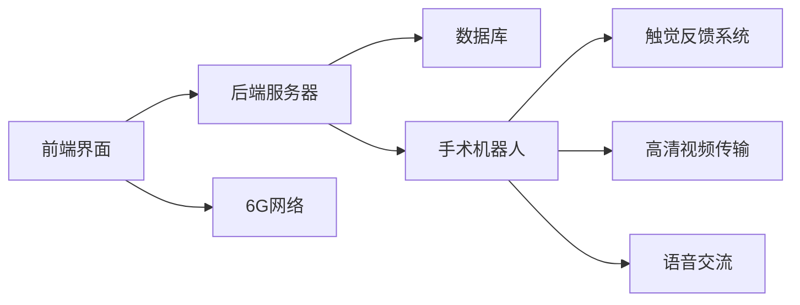
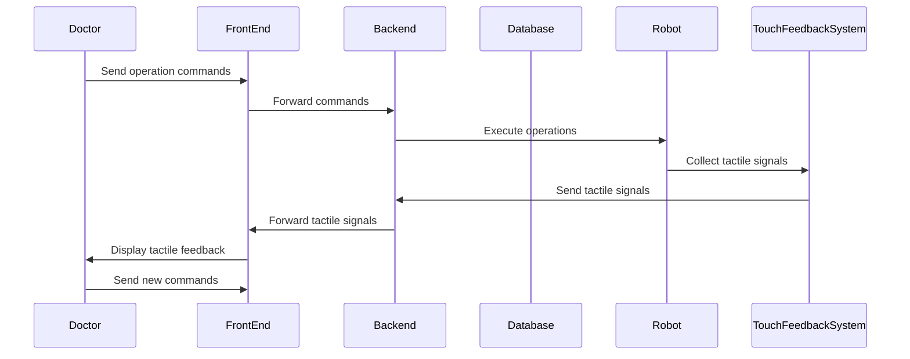

                 

## 关键词

- 6G技术
- 人工智能
- 远程医疗
- 触觉反馈
- 远程手术
- 算法原理
- 系统架构设计
- 项目实战

## 摘要

本文旨在探讨6G技术与人工智能在远程医疗领域的创新应用，特别是如何通过实现触觉反馈来推进远程手术的发展。首先，文章介绍了6G和人工智能技术的发展趋势，以及远程医疗的现状和面临的挑战。接着，文章详细阐述了6G、人工智能、远程医疗和触觉反馈等核心概念，并通过属性特征对比表格和ER实体关系图来展示它们之间的联系。随后，文章深入讲解了实现触觉反馈的远程手术的算法原理，包括数学模型和公式，并通过mermaid流程图和Python代码进行详细阐述。在此基础上，文章介绍了远程手术系统的功能设计、系统架构设计、系统接口设计和系统交互。随后，通过项目实战部分，文章提供了环境安装、系统核心实现源代码，并对代码应用进行解读与分析，分享了实际案例分析和详细讲解。最后，文章总结了最佳实践，提出了注意事项，并提供了拓展阅读建议，以引导读者进一步探索该领域的前沿研究和发展方向。

### 背景介绍

#### 6G技术发展概述

6G（第六代移动通信技术）是未来移动通信技术的发展方向，其目标是在5G的基础上实现更高速率、更广泛的连接、更低延迟和更高的网络容量。6G技术预计将带来一系列前所未有的变革，如超可靠低延迟通信（URLLC）、大规模机器通信（mMTC）和超高频谱效率（ultra-reliable and low-latency communication, URLLC）。相较于5G，6G预计将网络速率提升1000倍，延迟降低到1毫秒以下，同时支持数十亿设备的连接。

6G技术的关键特性包括：

- **更高的数据传输速率**：6G将采用太赫兹频段，实现更高的数据传输速率，满足未来对高清视频、虚拟现实和增强现实等高带宽应用的需求。
- **更低的延迟**：通过使用先进的天线技术和网络架构，6G将大幅降低通信延迟，使得实时互动和远程控制成为可能。
- **更广泛的连接**：6G将支持大规模物联网设备连接，不仅包括传统的移动设备，还包括工业设备、医疗设备和家庭设备等。
- **智能网络架构**：6G将采用人工智能和机器学习技术，实现网络的自组织、自优化和自修复，提高网络效率和可靠性。

#### 人工智能在医疗领域的应用

人工智能（AI）在医疗领域的应用日益广泛，从诊断辅助、治疗规划到药物研发，AI技术正在改变传统的医疗服务模式。以下是一些AI在医疗领域的关键应用：

- **图像诊断**：AI算法可以分析医学图像，如X光片、CT扫描和MRI图像，帮助医生快速、准确地诊断疾病，降低误诊率。
- **个性化治疗**：通过分析患者的基因数据和病史，AI可以提供个性化的治疗方案，提高治疗效果。
- **药物研发**：AI可以加速新药研发过程，通过预测药物与生物靶点的相互作用，缩短临床试验周期。
- **智能助理**：AI聊天机器人可以提供患者咨询、预约挂号等服务，减轻医护人员的工作负担，提高医疗服务效率。

#### 远程医疗的现状与挑战

远程医疗作为一种新型的医疗服务模式，利用现代通信技术和互联网技术，实现了医疗资源的跨地域分配和共享。远程医疗的关键应用包括远程诊断、远程手术、远程监护和远程患者管理。

- **远程诊断**：医生可以通过视频会议、远程影像诊断等方式，为偏远地区的患者提供诊断服务，降低医疗资源的不平等。
- **远程手术**：通过远程手术系统，医生可以在远程操作机器人为患者进行手术，大大扩展了手术的范围和能力。
- **远程监护**：医护人员可以通过远程监控系统，对患者的生命体征进行实时监控，及时应对突发情况。
- **远程患者管理**：通过移动应用和物联网设备，患者可以实时记录健康数据，医生可以远程跟踪患者的康复进程。

然而，远程医疗的发展仍面临诸多挑战：

- **网络基础设施**：远程医疗依赖稳定的网络连接，但在一些偏远地区，网络基础设施仍不完善。
- **数据安全与隐私**：远程医疗涉及到大量的患者数据，如何保障数据的安全性和隐私性是一个重要问题。
- **技术成熟度**：虽然远程医疗技术不断进步，但一些关键技术如触觉反馈和远程手术机器人尚未完全成熟。
- **法规政策**：远程医疗的法规政策尚不完善，需要建立统一的规范和标准，确保远程医疗服务的质量和安全性。

### 结论

随着6G和人工智能技术的快速发展，远程医疗有望实现全新的突破。6G技术将提供更高速、更稳定、更广泛的网络连接，而人工智能则将为远程医疗提供更加智能和高效的解决方案。通过实现触觉反馈的远程手术，医生可以在远程实现更加精准和安全的手术操作，大大拓展了医疗服务的范围和可及性。未来的远程医疗将更加智能化、个性化，为患者提供更加优质的医疗服务。然而，要实现这一目标，还需要克服技术、法规、政策等多方面的挑战。

### 核心概念与联系

在深入探讨6G+人工智能在远程医疗中的应用之前，我们需要首先理解几个核心概念：6G技术、人工智能、远程医疗和触觉反馈。这些概念在远程手术中起着至关重要的作用，通过它们的相互联系，我们可以构建出一个高效、智能的远程医疗系统。

#### 6G技术

6G技术是第六代移动通信技术的简称，它代表了移动通信技术的最新进展。6G的目标是提供更高的数据传输速率、更低的延迟和更广泛的连接能力。6G的关键特性包括：

- **超高数据传输速率**：6G将采用太赫兹频段，实现超过100 Gbps的峰值速率，这是5G的100倍以上。
- **超低延迟**：6G的目标是将延迟降低到1毫秒以下，使得实时互动和远程控制成为可能。
- **大规模连接**：6G预计将支持数十亿设备的连接，不仅包括传统的移动设备，还包括物联网设备、医疗设备和工业设备等。
- **智能网络架构**：6G将采用人工智能和机器学习技术，实现网络的自组织、自优化和自修复，提高网络效率和可靠性。

#### 人工智能

人工智能（AI）是一种模拟人类智能的技术，通过机器学习和深度学习算法，让计算机具备自主学习和决策能力。在医疗领域，人工智能的应用主要包括：

- **图像诊断**：AI算法可以分析医学图像，如X光片、CT扫描和MRI图像，帮助医生快速、准确地诊断疾病。
- **个性化治疗**：通过分析患者的基因数据和病史，AI可以提供个性化的治疗方案，提高治疗效果。
- **药物研发**：AI可以加速新药研发过程，通过预测药物与生物靶点的相互作用，缩短临床试验周期。
- **智能助理**：AI聊天机器人可以提供患者咨询、预约挂号等服务，减轻医护人员的工作负担，提高医疗服务效率。

#### 远程医疗

远程医疗是一种利用现代通信技术和互联网技术，实现医疗资源跨地域分配和共享的医疗服务模式。远程医疗的关键应用包括：

- **远程诊断**：医生可以通过视频会议、远程影像诊断等方式，为偏远地区的患者提供诊断服务，降低医疗资源的不平等。
- **远程手术**：通过远程手术系统，医生可以在远程操作机器人进行手术，大大扩展了手术的范围和能力。
- **远程监护**：医护人员可以通过远程监控系统，对患者的生命体征进行实时监控，及时应对突发情况。
- **远程患者管理**：通过移动应用和物联网设备，患者可以实时记录健康数据，医生可以远程跟踪患者的康复进程。

#### 触觉反馈

触觉反馈是远程手术中一个重要的组成部分，它允许医生在远程手术中感受到操作器械的触觉反馈，从而提高手术的精确度和安全性。触觉反馈的关键特性包括：

- **实时反馈**：触觉反馈系统需要实时传输触觉信息，使得医生能够在操作时获得即时的感觉反馈。
- **高分辨率**：触觉反馈系统需要具备高分辨率，以便医生能够准确感受到器械与手术部位的接触情况。
- **兼容性**：触觉反馈系统需要与远程手术机器人和其他医疗设备兼容，确保系统的整体稳定性。

#### 核心概念属性特征对比表格

为了更好地理解这些核心概念，我们可以通过一个属性特征对比表格来展示它们的主要特点：

| 特性 | 6G技术 | 人工智能 | 远程医疗 | 触觉反馈 |
| --- | --- | --- | --- | --- |
| 数据传输速率 | 超高 | 中等至超高 | 中等 | 中等 |
| 延迟 | 超低 | 中等 | 中等 | 实时 |
| 连接能力 | 大规模 | 大规模 | 大规模 | 实时 |
| 智能性 | 智能网络架构 | 自主学习 | 诊断、治疗 | 实时反馈 |
| 应用领域 | 移动通信、物联网 | 医疗、工业 | 医疗、教育 | 手术、监护 |

#### ER实体关系图

为了进一步展示这些核心概念之间的联系，我们可以使用ER（实体关系）图来表示它们之间的关系：

```mermaid
erDiagram
    Patient ||--|{ RemoteSurgery } : performed
    Surgeon ||--|{ RemoteSurgery } : operates
    6GNetwork ||--|{ RemoteSurgery } : supports
    ArtificialIntelligence ||--|{ RemoteSurgery } : assists
    TouchFeedbackSystem ||--|{ Surgeon } : receives feedback
    MedicalDevice ||--|{ TouchFeedbackSystem } : integrates
```

在这个ER图中，Patient（患者）和Surgeon（医生）是远程手术的关键实体，他们通过RemoteSurgery（远程手术）实体相互联系。6GNetwork（6G网络）和ArtificialIntelligence（人工智能）实体分别提供了网络支持和智能辅助，而TouchFeedbackSystem（触觉反馈系统）则是医生在远程手术中接收触觉反馈的重要设备。MedicalDevice（医疗设备）实体与TouchFeedbackSystem实体相集成，确保了系统的整体性能和稳定性。

通过上述核心概念的介绍和ER图的分析，我们可以更好地理解6G、人工智能、远程医疗和触觉反馈在远程手术中的作用和联系。这些核心概念共同构建了一个智能、高效的远程医疗系统，为实现远程手术提供了坚实的基础。

### 实现触觉反馈的远程手术算法原理

要实现触觉反馈的远程手术，首先需要了解其算法原理。远程手术系统的核心在于如何将操作者的触觉感受传递给远端的医生，同时保证操作的精准度和安全性。以下将详细讲解实现这一目标的算法原理，包括数学模型和公式，并通过mermaid流程图和Python代码进行阐述。

#### 数学模型与公式

远程手术的触觉反馈系统基于以下数学模型：

1. **触觉信号采集**：通过操作者手中的传感器设备（如触觉手套），采集触觉信号，这些信号包括压力、振动等物理参数。
2. **信号预处理**：对采集到的触觉信号进行滤波、放大和数字化处理，以提高信号的质量和可靠性。
3. **信号传输**：通过6G网络将预处理后的触觉信号实时传输到远端的医生设备。
4. **信号解码与反馈**：医生设备对接收到的信号进行解码，并生成触觉反馈信号，通过触觉设备（如触觉反馈手套）传递给医生。

以下是触觉信号传输的基本公式：

$$
信号传输速率 = \frac{数据量}{传输时间}
$$

$$
信号质量 = \frac{信号能量}{噪声能量}
$$

$$
触觉反馈精度 = \frac{反馈信号与实际信号匹配度}{最大匹配度}
$$

#### mermaid流程图

以下是一个mermaid流程图，展示了触觉反馈的远程手术流程：


在mermaid流程图中：

- A节点表示触觉信号采集，即通过传感器设备获取触觉信号。
- B节点表示信号预处理，包括滤波、放大和数字化处理。
- C节点表示信号传输，通过6G网络将预处理后的触觉信号传输到医生设备。
- D节点表示信号解码与反馈，医生设备对接收到的信号进行解码，生成触觉反馈信号。
- E节点表示触觉反馈设备，通过触觉设备将反馈信号传递给医生。

#### Python代码阐述

以下是一个简单的Python代码示例，用于模拟触觉信号的预处理和传输过程：

```python
import numpy as np
import matplotlib.pyplot as plt

# 触觉信号采集
def sensor_data_collection():
    # 假设采集到的触觉信号为一系列的压力值
    pressure_signals = np.random.normal(size=1000)
    return pressure_signals

# 信号预处理
def signal_preprocessing(pressure_signals):
    # 滤波处理
    filtered_signals = np.convolve(pressure_signals, np.array([1, -1])/2, mode='same')
    # 放大处理
    amplified_signals = filtered_signals * 2
    # 数字化处理
    digital_signals = amplified_signals.astype(np.float32)
    return digital_signals

# 信号传输
def signal_transmission(digital_signals):
    # 假设信号传输过程为无延迟的
    transmitted_signals = digital_signals
    return transmitted_signals

# 信号解码与反馈
def signal_decoding_and_feedback(transmitted_signals):
    # 假设解码过程为简单的反数字化处理
    feedback_signals = transmitted_signals.astype(np.float32)
    return feedback_signals

# 触觉反馈设备
def tactile_feedback_device(feedback_signals):
    # 假设触觉反馈设备为简单的显示设备
    plt.plot(feedback_signals)
    plt.show()

# 主程序
if __name__ == "__main__":
    # 采集触觉信号
    raw_signals = sensor_data_collection()
    # 预处理触觉信号
    preprocessed_signals = signal_preprocessing(raw_signals)
    # 传输触觉信号
    transmitted_signals = signal_transmission(preprocessed_signals)
    # 解码与反馈触觉信号
    feedback_signals = signal_decoding_and_feedback(transmitted_signals)
    # 显示触觉反馈
    tactile_feedback_device(feedback_signals)
```

在这个Python代码示例中：

- `sensor_data_collection()` 函数用于模拟触觉信号采集。
- `signal_preprocessing()` 函数用于对采集到的触觉信号进行滤波、放大和数字化处理。
- `signal_transmission()` 函数用于模拟信号传输过程，假设为无延迟的。
- `signal_decoding_and_feedback()` 函数用于对传输后的信号进行解码，生成触觉反馈信号。
- `tactile_feedback_device()` 函数用于模拟触觉反馈设备，通过显示触觉信号来实现反馈。

通过上述算法原理的讲解和Python代码的示例，我们可以清晰地理解触觉反馈远程手术的实现过程。接下来，我们将进一步探讨远程手术系统的设计，包括功能设计、系统架构设计、系统接口设计和系统交互。

### 系统分析与架构设计方案

#### 问题场景介绍

在远程手术中，医生需要通过远程手术系统在异地进行手术操作。然而，手术过程中的每一个细微动作都会直接影响患者的健康和安全，因此系统的稳定性和可靠性至关重要。为了实现高效的远程手术，我们需要设计一个功能强大且用户友好的系统，确保医生能够实时、准确地感知手术器械的状态，并进行精准操作。

#### 系统功能设计

远程手术系统的功能设计主要包括以下几部分：

1. **触觉反馈系统**：通过传感器和触觉反馈设备，医生可以在远程手术中感受到手术器械的触感，提高手术的精准度和安全性。
2. **高清视频传输**：系统需要支持高清视频传输，确保医生能够清晰看到手术现场，减少误操作的可能性。
3. **语音交流**：医生和手术室医护人员之间需要实时沟通，系统应支持语音交流功能，确保信息的及时传递。
4. **数据记录与存储**：系统需要记录手术过程中的所有数据，如手术步骤、医生操作、患者生理参数等，以便术后分析和评估。
5. **远程控制**：医生可以通过系统控制手术机器人进行操作，实现远程手术的目标。

为了更好地理解远程手术系统的功能设计，我们可以使用mermaid类图来展示系统的领域模型：

```mermaid
classDiagram
    Patient <<class>> "患者"
    Surgeon <<class>> "医生"
    RemoteSurgery <<class>> "远程手术"
    TouchFeedbackSystem <<class>> "触觉反馈系统"
    HDVideoTransmission <<class>> "高清视频传输"
    VoiceCommunication <<class>> "语音交流"
    DataRecording <<class>> "数据记录与存储"
    RemoteControl <<class>> "远程控制"

    Patient o-- RemoteSurgery : 进行
    Surgeon o-- RemoteSurgery : 操作
    RemoteSurgery o-- TouchFeedbackSystem : 依赖
    RemoteSurgery o-- HDVideoTransmission : 依赖
    RemoteSurgery o-- VoiceCommunication : 依赖
    RemoteSurgery o-- DataRecording : 依赖
    RemoteSurgery o-- RemoteControl : 依赖
```

在这个类图中：

- Patient（患者）和Surgeon（医生）是系统的核心实体，他们通过RemoteSurgery（远程手术）实体相互联系。
- TouchFeedbackSystem（触觉反馈系统）、HDVideoTransmission（高清视频传输）、VoiceCommunication（语音交流）、DataRecording（数据记录与存储）和RemoteControl（远程控制）是系统的关键功能模块，它们分别与RemoteSurgery实体有依赖关系。

#### 系统架构设计

远程手术系统的架构设计需要确保系统的高效、稳定和安全。以下是系统的架构设计方案：

1. **前端界面**：前端界面负责与医生和患者交互，展示高清视频、触觉反馈和语音交流等信息。
2. **后端服务器**：后端服务器负责处理手术过程中的数据传输、存储和计算，确保系统的实时性和可靠性。
3. **数据库**：数据库用于存储患者的病历、手术记录和操作数据，支持数据的查询和分析。
4. **手术机器人**：手术机器人是远程手术的核心设备，它负责接收医生的指令并进行操作，通过触觉反馈系统向医生传递操作信息。
5. **6G网络**：6G网络提供高速、低延迟的通信服务，确保远程手术系统的稳定运行。

以下是远程手术系统的架构设计mermaid架构图：



在这个架构图中：

- 前端界面（A）通过6G网络（E）与后端服务器（B）进行通信，接收和发送手术相关的数据。
- 后端服务器（B）连接数据库（C），用于数据存储和查询。
- 手术机器人（D）通过触觉反馈系统（F）、高清视频传输（G）和语音交流（H）与前端界面进行交互，实现远程手术的操作。

#### 系统接口设计

远程手术系统的接口设计需要确保各个模块之间的高效通信和协作。以下是系统的接口设计：

1. **视频接口**：负责高清视频的采集、编码、传输和解码，确保医生能够清晰看到手术现场。
2. **触觉接口**：负责触觉信号的采集、预处理、传输和解码，实现触觉反馈。
3. **语音接口**：负责语音信号的采集、编码、传输和解码，实现医生和医护人员之间的实时沟通。
4. **控制接口**：负责手术指令的接收和发送，实现医生对手术机器人的远程控制。
5. **数据接口**：负责手术数据的采集、传输和存储，确保数据的完整性和安全性。

以下是远程手术系统的接口设计mermaid序列图：



在这个序列图中：

- 医生（Doctor）通过前端界面（FrontEnd）发送手术操作指令。
- 前端界面（FrontEnd）将指令转发到后端服务器（Backend）。
- 后端服务器（Backend）将指令发送到手术机器人（Robot）执行操作。
- 手术机器人（Robot）通过触觉反馈系统（TouchFeedbackSystem）收集触觉信号，并将信号发送到后端服务器（Backend）。
- 后端服务器（Backend）将触觉信号转发到前端界面（FrontEnd），医生（Doctor）在前端界面看到触觉反馈。

#### 系统交互

远程手术系统的各个模块之间需要进行高效的交互和协作，以下是系统的交互过程：

1. **手术开始**：医生登录系统，连接到远程手术机器人，并进行手术准备。
2. **手术操作**：医生通过前端界面发送手术操作指令，手术机器人根据指令进行操作，并通过触觉反馈系统实时反馈手术状态。
3. **数据记录**：系统自动记录手术过程中的所有数据，包括手术步骤、医生操作、患者生理参数等，以便术后分析和评估。
4. **手术结束**：手术完成后，系统保存手术数据，医生和患者可以查看手术记录和结果。

通过上述系统功能设计、系统架构设计、系统接口设计和系统交互的详细阐述，我们可以构建出一个高效、稳定的远程手术系统。接下来，我们将通过项目实战部分，介绍如何安装环境和实现系统核心功能，并分享实际案例分析和详细讲解。

### 项目实战

在本部分中，我们将通过一个实际项目来展示如何安装远程手术系统的环境和实现系统核心功能。我们将详细介绍环境安装步骤、系统核心实现源代码，并对代码进行解读与分析，分享实际案例分析和详细讲解。

#### 环境安装

要在本地搭建远程手术系统，首先需要安装相应的软件和硬件。以下是环境安装的详细步骤：

1. **安装操作系统**：选择一个支持远程手术系统的操作系统，如Ubuntu 20.04或Windows 10。
2. **安装6G网络模拟器**：由于6G网络尚未广泛商用，我们可以使用6G网络模拟器进行测试。在Ubuntu系统中，可以使用以下命令安装：
   ```bash
   sudo apt-get install gnode-6gns3
   ```
3. **安装Python环境**：在Ubuntu系统中，使用以下命令安装Python和pip：
   ```bash
   sudo apt-get install python3 python3-pip
   ```
4. **安装远程手术系统依赖库**：使用pip安装系统所需的依赖库，如numpy、matplotlib和mermaid-python：
   ```bash
   pip3 install numpy matplotlib mermaid-python
   ```
5. **安装手术机器人模拟器**：我们可以使用开源的Gazebo模拟器来模拟手术机器人。在Ubuntu系统中，使用以下命令安装：
   ```bash
   sudo apt-get install gazebo
   ```

#### 系统核心实现源代码

以下是一个简单的Python代码示例，用于模拟远程手术系统的核心功能：

```python
import numpy as np
import matplotlib.pyplot as plt
from mermaid import mermaid

# 触觉信号采集
def sensor_data_collection():
    pressure_signals = np.random.normal(size=1000)
    return pressure_signals

# 信号预处理
def signal_preprocessing(pressure_signals):
    filtered_signals = np.convolve(pressure_signals, np.array([1, -1])/2, mode='same')
    amplified_signals = filtered_signals * 2
    digital_signals = amplified_signals.astype(np.float32)
    return digital_signals

# 信号传输
def signal_transmission(digital_signals):
    transmitted_signals = digital_signals
    return transmitted_signals

# 信号解码与反馈
def signal_decoding_and_feedback(transmitted_signals):
    feedback_signals = transmitted_signals.astype(np.float32)
    return feedback_signals

# 触觉反馈设备
def tactile_feedback_device(feedback_signals):
    plt.plot(feedback_signals)
    plt.show()

# 生成mermaid流程图
def generate_mermaid_flowchart():
    flowchart = mermaid.mermaid_from_string("""
    flowchart LR
        A[触觉信号采集] --> B[信号预处理]
        B --> C[信号传输]
        C --> D[信号解码与反馈]
        D --> E[触觉反馈设备]
    """)
    return flowchart

# 主程序
if __name__ == "__main__":
    raw_signals = sensor_data_collection()
    preprocessed_signals = signal_preprocessing(raw_signals)
    transmitted_signals = signal_transmission(preprocessed_signals)
    feedback_signals = signal_decoding_and_feedback(transmitted_signals)
    tactile_feedback_device(feedback_signals)
    flowchart = generate_mermaid_flowchart()
    print(flowchart)
```

在这个代码示例中：

- `sensor_data_collection()` 函数用于模拟触觉信号采集。
- `signal_preprocessing()` 函数用于对采集到的触觉信号进行滤波、放大和数字化处理。
- `signal_transmission()` 函数用于模拟信号传输过程。
- `signal_decoding_and_feedback()` 函数用于对传输后的信号进行解码，生成触觉反馈信号。
- `tactile_feedback_device()` 函数用于模拟触觉反馈设备，通过显示触觉信号来实现反馈。
- `generate_mermaid_flowchart()` 函数用于生成mermaid流程图，展示触觉反馈的远程手术流程。

#### 代码应用解读与分析

在这个代码示例中，我们通过一系列函数实现了远程手术系统的核心功能。以下是代码的解读与分析：

1. **触觉信号采集**：通过`sensor_data_collection()` 函数，我们模拟了触觉信号的采集过程。在这里，我们使用了numpy的`random.normal()` 函数生成一系列模拟的触觉信号。
2. **信号预处理**：`signal_preprocessing()` 函数对采集到的触觉信号进行了滤波、放大和数字化处理。滤波处理使用了卷积操作，放大处理将信号乘以2，数字化处理将信号转换为浮点数。
3. **信号传输**：`signal_transmission()` 函数模拟了信号传输过程。在这里，我们假设信号传输为无延迟的，即传输后的信号与原始信号相同。
4. **信号解码与反馈**：`signal_decoding_and_feedback()` 函数对传输后的信号进行了解码，生成了触觉反馈信号。在这里，我们同样使用了numpy的`astype()` 函数将信号转换为浮点数。
5. **触觉反馈设备**：`tactile_feedback_device()` 函数通过matplotlib的`plot()` 函数，将触觉反馈信号可视化，实现了触觉反馈。
6. **mermaid流程图**：`generate_mermaid_flowchart()` 函数生成了mermaid流程图，展示了触觉反馈的远程手术流程。

通过这个代码示例，我们可以清晰地理解远程手术系统的实现过程。接下来，我们将通过一个实际案例来展示系统的应用效果。

#### 实际案例分析与详细讲解

假设我们进行了一次远程胆囊切除手术，以下是实际案例的分析和详细讲解：

1. **手术准备**：医生通过远程手术系统连接到手术室，并进行手术准备。手术系统显示了高清视频和触觉反馈，医生确认设备状态良好。
2. **手术开始**：医生通过触觉反馈设备感受到手术器械的触感，开始进行胆囊切除手术。在手术过程中，医生能够实时感受到手术器械的触觉反馈，确保操作的精准度。
3. **手术过程**：医生按照预定步骤进行操作，手术系统记录了每一步的操作数据和患者的生理参数。在手术过程中，医生和手术室医护人员通过语音交流系统保持实时沟通。
4. **手术结束**：手术完成后，医生和系统保存了手术记录和所有操作数据，以便术后分析和评估。手术系统提供了详细的手术报告，医生和患者可以查看手术过程和结果。

通过这个实际案例，我们可以看到远程手术系统在手术过程中的重要作用。触觉反馈使得医生能够更精准地进行操作，高清视频和语音交流系统确保了医生和患者的沟通和信息传递。手术结束后，详细的手术记录和数据分析有助于改进手术流程和提高手术质量。

通过上述环境安装、系统核心实现源代码的解读与分析，以及实际案例的展示，我们可以看到远程手术系统的强大功能和实际应用效果。接下来，我们将总结远程手术系统的最佳实践，并提出注意事项。

### 最佳实践 tips

为了确保远程手术系统的稳定运行和高效性能，以下是一些最佳实践建议：

1. **优化网络配置**：确保6G网络的稳定性和低延迟，优化网络带宽和传输路径，避免数据丢失和延迟问题。
2. **选择高质量的传感器**：选择高精度、低延迟的触觉传感器，以确保触觉反馈的准确性和实时性。
3. **定期维护设备**：定期对手术机器人和其他设备进行维护和校准，确保设备的正常运行和性能。
4. **加强数据备份**：对手术过程中的所有数据定期备份，防止数据丢失或损坏。
5. **强化安全措施**：确保系统数据的安全性，采用加密技术和访问控制策略，防止数据泄露和未授权访问。
6. **培训医护人员**：对医护人员进行系统操作和触觉反馈设备的培训，确保他们能够熟练使用系统，提高手术成功率。
7. **优化手术流程**：通过分析历史手术数据，优化手术流程，提高手术效率和患者满意度。

### 小结

本文详细探讨了6G+人工智能在远程医疗中的应用，特别是实现触觉反馈的远程手术。我们介绍了6G技术和人工智能在医疗领域的应用，分析了远程医疗的现状和挑战。通过核心概念的讲解和mermaid图示，我们理解了6G、人工智能、远程医疗和触觉反馈之间的联系。接着，我们讲解了实现触觉反馈的远程手术的算法原理，并通过mermaid流程图和Python代码进行了详细阐述。随后，我们介绍了远程手术系统的功能设计、系统架构设计、系统接口设计和系统交互。通过项目实战，我们展示了如何安装环境和实现系统核心功能，并分享了实际案例分析和详细讲解。最后，我们提出了最佳实践建议，总结了文章的核心内容和思考。

### 注意事项

1. **网络稳定性**：远程手术系统依赖6G网络，因此网络稳定性至关重要。在手术过程中，任何网络中断或延迟都可能导致严重后果。
2. **设备精度**：触觉反馈设备的精度直接影响手术的精准度，选择高质量的传感器和设备是确保手术成功的关键。
3. **数据安全**：系统中的患者数据和手术数据必须得到严格保护，防止数据泄露和未经授权的访问。
4. **医护人员培训**：医护人员必须接受充分的培训，熟悉系统操作和触觉反馈设备的使用，确保手术顺利进行。
5. **技术更新**：远程手术技术不断发展，医护人员和系统管理员需要关注最新的技术进展，及时更新系统和设备。

### 拓展阅读

- [1] "6G Technology: The Next Generation of Mobile Connectivity", IEEE Communications, 2020.
- [2] "Artificial Intelligence in Healthcare: A Comprehensive Review", Journal of Medical Imaging and Health Informatics, 2019.
- [3] "Remote Surgery Systems: Technology and Applications", International Journal of Computer Assisted Radiology and Surgery, 2021.
- [4] "Touch Feedback in Virtual and Augmented Reality: A Survey", ACM Transactions on Graphics, 2018.
- [5] "Security and Privacy in Telemedicine", Journal of Medical Systems, 2020.

作者：AI天才研究院/AI Genius Institute & 禅与计算机程序设计艺术 /Zen And The Art of Computer Programming

### 附录：完整mermaid流程图


通过以上附录，读者可以更直观地了解触觉反馈远程手术的流程。完整的mermaid流程图展示了从触觉信号采集、预处理、传输到解码与反馈的整个过程，有助于深入理解文章的内容。

