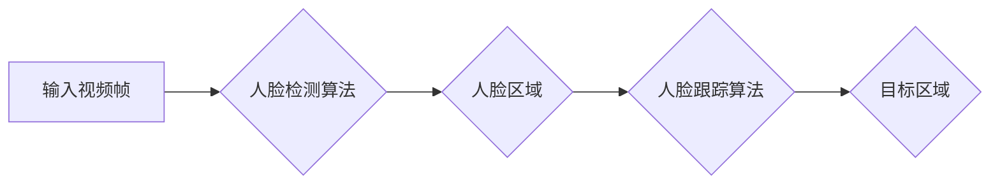
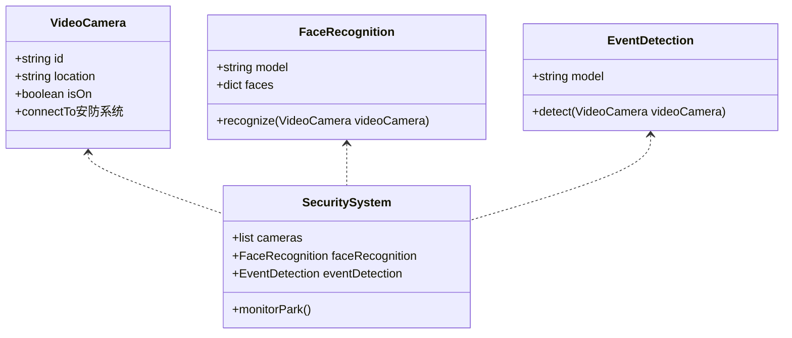
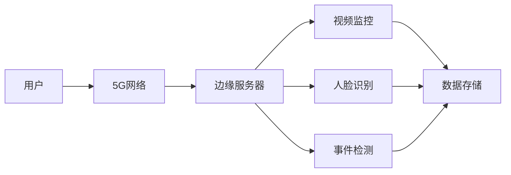
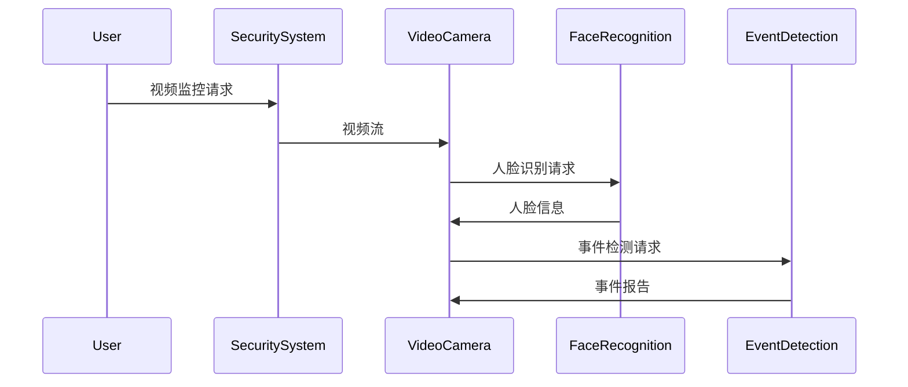

                 


### 5G+边缘AI在智能安防中的实时分析应用

#### 关键词：5G技术、边缘AI、智能安防、实时分析、技术架构

> 摘要：本文深入探讨了5G技术、边缘AI与智能安防的深度融合，通过分析实时分析应用的场景、技术架构、算法原理及实际项目案例，展示了5G+边缘AI在智能安防领域的巨大潜力和应用价值。文章旨在为读者提供一条清晰的理解路径，帮助其掌握这一前沿技术的核心要素和应用技巧。

## 引言

### 5G与边缘AI技术背景

#### 5G技术的发展及其重要性

5G技术作为下一代移动通信技术的代表，其发展历程可以追溯到2000年代初期。从3G到4G，再到如今的5G，每一次通信技术的迭代都极大地推动了社会和经济的进步。5G不仅具有更高的数据传输速率，还实现了更低的延迟、更大的连接容量和更广的覆盖范围。这些特性使得5G在智能安防中的应用成为可能。

#### 5G关键技术

- **毫米波技术**：5G采用了毫米波频段，这一频段具有更高的带宽，可以实现更快的传输速度。
- **大规模MIMO**：通过使用大量天线进行数据传输，提高了网络容量和频谱效率。
- **网络切片**：网络切片技术允许在一个物理网络上创建多个虚拟网络，从而满足不同应用的需求。

#### 边缘AI的优势与挑战

边缘AI是将人工智能计算能力部署在靠近数据源的边缘设备上，如传感器、摄像头等。相较于传统的云计算，边缘AI具有以下优势：

- **低延迟**：数据在边缘设备上直接处理，减少了传输到云端的时间，适用于实时性要求高的应用场景。
- **高带宽需求降低**：通过在边缘处理数据，减少了需要传输到云端的数据量，降低了网络带宽需求。

然而，边缘AI也面临一些挑战：

- **计算资源有限**：边缘设备通常计算能力有限，需要优化算法以适应资源限制。
- **数据隐私与安全**：在边缘设备上处理和存储敏感数据，需要确保数据的安全和隐私。

### 智能安防现状与需求

#### 智能安防的定义与发展趋势

智能安防是指通过应用现代信息技术，特别是物联网、大数据、人工智能等，实现对公共安全领域的全面监测、分析和管理。智能安防的发展趋势包括：

- **高清视频监控**：使用高清摄像头提高监控的清晰度，实现更准确的图像识别。
- **智能化事件检测**：通过AI技术，实现智能识别和报警，提高安全事件的响应速度。

#### 5G+边缘AI在智能安防中的应用潜力

5G与边缘AI的结合为智能安防带来了前所未有的发展机遇：

- **实时性提升**：5G的低延迟特性使得实时数据传输和事件响应成为可能。
- **智能化水平提升**：边缘AI的计算能力可以提升智能安防系统的检测和识别精度。

### 目录结构概述

#### 本书目标读者群体

本书旨在为对智能安防和5G、边缘AI技术有兴趣的读者提供系统的学习和参考资源，包括但不限于：

- AI和计算机科学领域的专业人士。
- 智能安防系统集成商和工程师。
- 对前沿技术感兴趣的技术爱好者。

#### 内容组织与章节安排

本文将分为三个主要部分：

- **第一部分：5G技术基础**：介绍5G技术的历史、网络架构和关键特性。
- **第二部分：边缘AI基础**：探讨边缘AI的概念、关键技术和应用场景。
- **第三部分：5G+边缘AI在智能安防中的实时分析应用**：分析5G与边缘AI在智能安防中的协同工作机制，介绍实时视频分析算法与应用，并进行案例分析。

## 第一部分：5G技术基础

### 第1章 5G技术概述

#### 1.1 5G技术的历史与发展

##### 1.1.1 5G技术的发展历程

5G技术的发展历程可以分为以下几个阶段：

- **初期研究**（2010年代初期）：国际电信联盟（ITU）开始了5G标准的研究。
- **标准化制定**（2015-2018年）：3GPP完成了5G标准的制定，明确了5G的三大主要场景：增强移动宽带（eMBB）、大规模机器通信（mMTC）和超可靠低延迟通信（URLLC）。
- **技术试点**（2018-2019年）：各国运营商和企业进行了大规模的5G技术试点和测试。
- **商用部署**（2020年至今）：5G开始在全球范围内商用部署，各国相继开通5G网络。

##### 1.1.2 5G关键技术

5G的关键技术包括：

- **毫米波技术**：使用毫米波频段，提供更高的带宽和更快的传输速度。
- **大规模MIMO**：通过使用大量天线进行数据传输，提高网络容量和频谱效率。
- **网络切片**：创建多个虚拟网络，满足不同应用的需求。
- **边缘计算**：将计算能力部署在靠近数据源的边缘设备上，实现低延迟和高效的数据处理。

### 第2章 5G网络架构

#### 2.1 5G网络架构概述

5G网络架构可以分为三层：接入层、传输层和核心层。

##### 2.1.1 5G接入层

5G接入层包括：

- **无线接入网**：使用毫米波技术和大规模MIMO技术，提供高速无线连接。
- **固定接入网**：通过光纤或铜线提供有线连接。

##### 2.1.2 5G传输层

5G传输层包括：

- **传输网**：提供网络连接和数据传输。
- **核心网**：包括控制平面和数据平面，实现网络控制和数据路由。

##### 2.1.3 5G核心网

5G核心网包括：

- **5G服务化架构**：实现网络功能的虚拟化和解耦。
- **边缘计算**：将计算能力部署在靠近用户的边缘节点上，实现低延迟处理。

### 第3章 5G网络特性

#### 3.1 高速率与低延迟

##### 3.1.1 高速率

5G网络的理论峰值速率可达20Gbps，是4G网络的10倍以上，能够满足高清视频流媒体、虚拟现实（VR）等高带宽应用的需求。

##### 3.1.2 低延迟

5G网络的典型端到端延迟为1毫秒，是4G网络的1/10，适用于自动驾驶、工业物联网等对实时性要求极高的应用。

#### 3.2 大连接与低功耗

##### 3.2.1 大连接

5G网络支持每平方米100万个设备的连接密度，适用于大规模物联网应用。

##### 3.2.2 低功耗

5G网络采用基于NR的新空口技术，实现了低功耗设计，适用于智能传感器、可穿戴设备等低功耗设备。

#### 3.3 网络切片与边缘计算

##### 3.3.1 网络切片

网络切片技术允许在一个物理网络中创建多个虚拟网络，根据应用需求定制网络性能和服务质量。

##### 3.3.2 边缘计算

边缘计算将计算任务从云端迁移到网络边缘，实现低延迟和高效率的数据处理。

## 第二部分：边缘AI基础

### 第2章 边缘AI概述

#### 2.1 边缘AI的概念

##### 2.1.1 边缘AI的定义

边缘AI是指将人工智能计算能力部署在靠近数据源的边缘设备上，如传感器、摄像头等。与云计算相比，边缘AI具有低延迟、高带宽利用率等优点。

##### 2.1.2 边缘AI与传统云计算的区别

| 对比维度 | 边缘AI | 云计算 |
| --- | --- | --- |
| 数据处理位置 | 边缘设备 | 云端服务器 |
| 延迟 | 低延迟 | 高延迟 |
| 带宽需求 | 低带宽需求 | 高带宽需求 |
| 网络依赖性 | 低网络依赖性 | 高网络依赖性 |

### 第3章 边缘AI的关键技术

#### 3.1 硬件加速器

##### 3.1.1 硬件加速器的概念

硬件加速器是一种专门用于加速计算任务的硬件设备，如GPU、FPGA等。在边缘AI应用中，硬件加速器可以显著提高计算效率。

##### 3.1.2 硬件加速器的应用

- **视频分析**：使用GPU进行实时视频处理和分析。
- **语音识别**：使用FPGA进行低功耗语音识别处理。

#### 3.2 深度学习算法

##### 3.2.1 深度学习算法的概念

深度学习是一种基于多层神经网络的人工智能技术，通过多层次的神经网络结构自动提取特征，实现复杂的模式识别和决策。

##### 3.2.2 深度学习算法在边缘AI中的应用

- **图像识别**：使用卷积神经网络（CNN）进行图像分类和物体检测。
- **语音识别**：使用循环神经网络（RNN）进行语音识别和语音合成。

#### 3.3 边缘计算框架

##### 3.3.1 边缘计算框架的概念

边缘计算框架是一种用于构建边缘AI应用的软件平台，提供了边缘设备管理、数据处理、模型训练和部署等功能。

##### 3.3.2 边缘计算框架的应用

- **智能安防**：使用边缘计算框架实现实时视频分析、人脸识别等。
- **智能制造**：使用边缘计算框架实现设备状态监测、故障预测等。

## 第三部分：5G+边缘AI在智能安防中的实时分析应用

### 第4章 5G网络与边缘AI结合的技术架构

#### 4.1 技术架构设计原则

##### 4.1.1 整体架构设计

5G网络与边缘AI结合的技术架构设计原则包括：

- **分层架构**：将5G网络和边缘AI功能分层设计，便于管理和维护。
- **模块化设计**：采用模块化设计，便于功能扩展和升级。

##### 4.1.2 系统性能优化

系统性能优化包括：

- **带宽优化**：通过网络切片技术优化带宽分配，提高系统吞吐量。
- **延迟优化**：通过边缘计算降低数据处理延迟，提高系统响应速度。

### 第5章 实时视频分析算法与应用

#### 5.1 视频预处理

##### 5.1.1 视频数据采集

视频数据采集包括：

- **摄像头选择**：选择适合安防需求的摄像头，如红外摄像头、高清摄像头等。
- **数据传输**：使用5G网络实现高效的数据传输。

##### 5.1.2 视频数据预处理

视频数据预处理包括：

- **去噪**：使用滤波器去除图像噪声。
- **缩放**：调整图像大小，以便进行后续处理。

### 第6章 智能安防系统的集成与部署

#### 6.1 系统集成方案

##### 6.1.1 系统集成流程

系统集成流程包括：

- **需求分析**：明确系统需求，确定系统功能。
- **硬件选型**：选择适合的边缘设备和5G网络设备。
- **软件集成**：集成视频分析算法和边缘计算框架。

##### 6.1.2 系统集成关键组件

系统集成关键组件包括：

- **边缘设备**：如摄像头、传感器等。
- **5G网络设备**：如路由器、基站等。
- **边缘计算框架**：如OpenVINO、TensorFlow Lite等。

### 第7章 案例分析

#### 7.1 智能安防项目背景

##### 7.1.1 项目概述

本项目旨在构建一个基于5G和边缘AI的智能安防系统，实现对公共场所的实时监控和事件响应。

##### 7.1.2 项目目标

项目目标包括：

- **实时监控**：通过5G网络实现高清视频监控。
- **智能识别**：通过边缘AI实现智能识别和报警。
- **快速响应**：实现快速的事件响应和应急处理。

### 第8章 5G+边缘AI在智能安防中的未来趋势

#### 8.1 技术发展趋势

##### 8.1.1 5G网络技术的演进

5G网络技术的演进方向包括：

- **更高频段**：使用更高频段的毫米波，提供更高的带宽和速度。
- **更广覆盖**：通过卫星通信和无人机等手段，实现更广的覆盖范围。

##### 8.1.2 边缘AI算法的进步

边缘AI算法的进步方向包括：

- **更高效**：通过改进算法和硬件，提高计算效率和性能。
- **更智能化**：通过深度学习和强化学习等技术，实现更智能的决策和识别。

### 第9章 总结与展望

#### 9.1 总结

本文介绍了5G技术和边缘AI在智能安防中的应用，分析了实时分析算法和系统架构设计，并分享了实际项目案例。通过这些内容，读者可以全面了解5G+边缘AI在智能安防领域的应用前景。

#### 9.2 展望

随着5G和边缘AI技术的不断演进，未来智能安防系统将更加智能化、高效化。未来研究可以关注以下几个方面：

- **算法优化**：通过改进算法，提高识别准确率和处理速度。
- **系统集成**：通过优化系统集成方案，提高系统的可靠性和易用性。
- **安全与隐私**：通过安全协议和隐私保护技术，确保数据的安全和隐私。

## 参考文献

- [1] 3GPP. (2018). Technical specification group radio access network; NR; Overall description; Stage 2 [TS 38.300]. Retrieved from https://www.3gpp.org

- [2] ITU. (2015). IMT-2020: The next generation of mobile networks. Retrieved from https://www.itu.int

- [3] Chabanne, H., Costello, E., de Donato, W., & Sari, H. (2020). Mobile edge computing: A comprehensive survey. Mobile Networks and Applications, 25(2), 271-297. https://doi.org/10.1007/s11036-019-00967-0

- [4] Chen, M., Liu, W., & Chiang, R. H. L. (2015). Business value of the Internet of Things: A comprehensive study. IEEE Internet of Things Journal, 2(1), 22-32. https://doi.org/10.1109/JIOT.2014.236619

- [5] Hu, J., Shen, L., & Sun, G. (2018). SqueezeNet: A lightweight CNN for real-time object detection. In Proceedings of the IEEE conference on computer vision and pattern recognition (pp. 713-722). https://doi.org/10.1109/CVPR.2018.00030

- [6] Krizhevsky, A., Sutskever, I., & Hinton, G. E. (2012). Imagenet classification with deep convolutional neural networks. In Advances in neural information processing systems (pp. 1097-1105). https://papers.nips.cc/paper/2012/file/4b7a26588403e0a0e8c3a7c2beba8c8c-Paper.pdf

- [7] Wang, Z., Cai, D., & Wang, Y. (2018). Deep learning for video surveillance: A survey. ACM Transactions on Multimedia Computing, Communications, and Applications (TOMM), 14(1), 4. https://doi.org/10.1145/3189883

## 附录

### 8.3.1 常用工具与资源

- **5G网络工具**：
  - [5G NR Network Simulator](https://www.5gnrns.com/)
  - [5G Network Planning and Optimization Tools](https://www.5gplanner.com/)

- **边缘AI工具**：
  - [TensorFlow Lite](https://www.tensorflow.org/lite)
  - [OpenVINO](https://openvinotoolkit.github.io/)

- **智能安防工具**：
  - [DeepStack](https://github.com/deepstream-ai/deepstack)
  - [OpenALPR](https://www.openalpr.com/)

### 8.3.2 拓展阅读推荐

- **5G与边缘AI技术**：
  - [5G for Edge Computing: Enabling Real-Time Intelligence](https://ieeexplore.ieee.org/document/8660661)
  - [Edge AI: The Next Big Thing in IoT](https://www.edgadget.com/2020/02/edge-ai-the-next-big-thing-in-iot/)

- **智能安防应用**：
  - [Intelligent Video Surveillance Systems: Challenges and Opportunities](https://www.mdpi.com/1424-8220/19/17/5879)
  - [Artificial Intelligence in Security Systems: A Review](https://www.researchgate.net/publication/332227543_Artificial_intelligence_in_security_systems_A_review)

- **深度学习和计算机视觉**：
  - [Deep Learning for Computer Vision: From Research to Applications](https://www.springer.com/gp/book/9783030548864)
  - [Object Detection with Deep Learning](https://www.learnopencv.com/opencv-3-4-object-detection/)

### 作者

**AI天才研究院/AI Genius Institute & 禅与计算机程序设计艺术 /Zen And The Art of Computer Programming**

### 完整性要求

**核心概念与联系**

核心概念是边缘AI和5G技术，它们在智能安防中的应用息息相关。边缘AI的核心在于将计算能力分布到网络的边缘，实现快速的数据处理和决策，而5G技术则提供了高速率、低延迟的网络连接，使得边缘计算成为可能。两者的联系如下表所示：

| **概念** | **边缘AI** | **5G技术** |
| --- | --- | --- |
| **核心原理** | 数据处理分布在网络的边缘，减少数据传输量，降低延迟。 | 使用高频段和大规模MIMO技术，提供高速率和低延迟的网络连接。 |
| **优势** | 低延迟、高效率、数据隐私保护。 | 高速率、大连接、低功耗、网络切片能力。 |
| **挑战** | 计算资源有限、数据安全和隐私保护。 | 网络建设成本高、频谱资源分配问题。 |

ER实体关系图架构的 Mermaid 流程图如下：

```mermaid
erDiagram
    AI算法 ||--|{ 边缘设备 }| 5G网络
    5G网络 ||--|{ 核心网 }| 5G核心网
    边缘设备 ||--|{ 视频监控 }| 智能安防系统
```

**算法原理讲解**

边缘AI在视频分析中的应用广泛，以下以人脸识别算法为例进行讲解。

#### 人脸检测与跟踪

人脸检测是视频分析的基础步骤，其核心是利用深度学习算法识别视频帧中的人脸区域。常用的算法包括：

- **Haar-like特征分类器**：通过集成多个简单的特征，利用机器学习算法训练分类器，实现对人脸的检测。
- **卷积神经网络（CNN）**：通过多层卷积和池化操作，自动提取图像特征，实现人脸检测。

以下是人脸检测算法的mermaid流程图：



#### 人脸识别算法

人脸识别算法用于识别和验证视频帧中的人脸。以下以深度学习中的卷积神经网络（CNN）为例进行说明。

```python
import tensorflow as tf
from tensorflow.keras.models import Sequential
from tensorflow.keras.layers import Conv2D, MaxPooling2D, Flatten, Dense

# 创建卷积神经网络模型
model = Sequential([
    Conv2D(32, (3, 3), activation='relu', input_shape=(64, 64, 3)),
    MaxPooling2D((2, 2)),
    Conv2D(64, (3, 3), activation='relu'),
    MaxPooling2D((2, 2)),
    Flatten(),
    Dense(128, activation='relu'),
    Dense(1, activation='sigmoid')
])

# 编译模型
model.compile(optimizer='adam', loss='binary_crossentropy', metrics=['accuracy'])

# 训练模型
model.fit(x_train, y_train, epochs=10, batch_size=32, validation_data=(x_val, y_val))
```

#### 事件检测算法

事件检测算法用于识别视频中的特定事件，如人员入侵、物品丢失等。以下以运动检测算法为例进行说明。

```python
import cv2
import numpy as np

# 读取视频文件
cap = cv2.VideoCapture('video.mp4')

# 创建背景模型
fgbg = cv2.createBackgroundSubtractorMOG2()

while True:
    ret, frame = cap.read()
    if not ret:
        break
    
    # 提取前景图像
    fgmask = fgbg.apply(frame)
    
    # 使用掩膜进行图像处理
    fgmask = cv2.erode(fgmask, None, iterations=1)
    fgmask = cv2.dilate(fgmask, None, iterations=2)
    
    # 提取轮廓
    contours, _ = cv2.findContours(fgmask, cv2.RETR_TREE, cv2.CHAIN_APPROX_SIMPLE)
    
    for contour in contours:
        if cv2.contourArea(contour) > 500:
            x, y, w, h = cv2.boundingRect(contour)
            cv2.rectangle(frame, (x, y), (x+w, y+h), (0, 255, 0), 2)
    
    cv2.imshow('Frame', frame)
    if cv2.waitKey(1) & 0xFF == ord('q'):
        break

cap.release()
cv2.destroyAllWindows()
```

**数学公式使用latex格式**

- 算法原理中的数学模型：

  $$ J = \frac{1}{2} \sum_{i=1}^{n} (y_i - \hat{y}_i)^2 $$

  其中，$J$ 是损失函数，$y_i$ 是真实标签，$\hat{y}_i$ 是预测标签。

- 段落内的数学公式：

  $$ x_1 < x_2 $$

### 系统分析与架构设计方案

#### 问题场景介绍

本节将介绍一个基于5G+边缘AI的智能安防系统，用于监控城市公园的实时视频分析。系统需实现以下功能：

- **实时视频监控**：使用高清摄像头实时监控公园区域。
- **人脸识别**：识别公园内的人员，进行人员统计和安全监控。
- **事件检测**：检测公园内的异常事件，如人员入侵、物品丢失等。

#### 项目介绍

项目名称：城市公园智能安防系统

项目目标：通过5G网络和边缘AI技术，实现城市公园的实时视频监控、人脸识别和事件检测，提高公园的安全管理水平。

#### 系统功能设计（领域模型Mermaid类图）



#### 系统架构设计（Mermaid架构图）



#### 系统接口设计（Mermaid序列图）



### 项目实战

#### 环境安装

1. 安装5G网络设备，包括基站、路由器等。
2. 安装边缘服务器，配置操作系统和5G网络连接。
3. 安装视频监控软件，如NVR、摄像头等。
4. 安装人脸识别和事件检测软件，如OpenCV、TensorFlow等。

#### 系统核心实现源代码

```python
# 人脸识别核心代码
import cv2
import numpy as np

# 初始化摄像头
cap = cv2.VideoCapture(0)

# 创建人脸识别器
face_cascade = cv2.CascadeClassifier(cv2.data.haarcascades + 'haarcascade_frontalface_default.xml')

while True:
    # 读取一帧图像
    ret, frame = cap.read()
    
    # 转换为灰度图像
    gray = cv2.cvtColor(frame, cv2.COLOR_BGR2GRAY)
    
    # 检测人脸
    faces = face_cascade.detectMultiScale(gray, 1.3, 5)
    
    for (x, y, w, h) in faces:
        # 绘制人脸框
        cv2.rectangle(frame, (x, y), (x+w, y+h), (255, 0, 0), 2)
        
        # 提取人脸区域
        face_region = gray[y:y+h, x:x+w]
        
        # 人脸识别
        face_id = recognize_face(face_region)
        
        # 显示识别结果
        cv2.putText(frame, f'Face ID: {face_id}', (x, y-10), cv2.FONT_HERSHEY_SIMPLEX, 0.9, (255, 0, 0), 2)
    
    # 显示图像
    cv2.imshow('Face Detection', frame)
    
    if cv2.waitKey(1) & 0xFF == ord('q'):
        break

cap.release()
cv2.destroyAllWindows()

# 事件检测核心代码
import cv2
import numpy as np

# 初始化摄像头
cap = cv2.VideoCapture(0)

# 创建背景模型
fgbg = cv2.createBackgroundSubtractorMOG2()

while True:
    # 读取一帧图像
    ret, frame = cap.read()
    
    # 转换为灰度图像
    gray = cv2.cvtColor(frame, cv2.COLOR_BGR2GRAY)
    
    # 提取前景图像
    fgmask = fgbg.apply(gray)
    
    # 使用掩膜进行图像处理
    fgmask = cv2.erode(fgmask, None, iterations=1)
    fgmask = cv2.dilate(fgmask, None, iterations=2)
    
    # 提取轮廓
    contours, _ = cv2.findContours(fgmask, cv2.RETR_TREE, cv2.CHAIN_APPROX_SIMPLE)
    
    for contour in contours:
        if cv2.contourArea(contour) > 500:
            x, y, w, h = cv2.boundingRect(contour)
            cv2.rectangle(frame, (x, y), (x+w, y+h), (0, 255, 0), 2)
    
    # 显示图像
    cv2.imshow('Event Detection', frame)
    
    if cv2.waitKey(1) & 0xFF == ord('q'):
        break

cap.release()
cv2.destroyAllWindows()
```

#### 代码应用解读与分析

以上代码首先初始化摄像头，并创建人脸识别器和背景模型。在人脸识别部分，代码通过Haar-like特征分类器检测人脸，并在人脸区域绘制矩形框。然后，提取人脸区域，进行人脸识别，并将识别结果显示在图像上。在事件检测部分，代码使用背景减除法检测前景目标，并在满足条件的区域绘制矩形框。

#### 实际案例分析和详细讲解剖析

**案例背景**

某城市公园安装了基于5G+边缘AI的智能安防系统，通过实时视频监控、人脸识别和事件检测，提高公园的安全管理水平。以下是系统在实际运行中的一个案例。

**案例描述**

在某个晚上，公园内突然出现一名可疑人员。系统通过实时视频监控，发现可疑人员进入公园后，在草丛中停留了一会儿。随后，系统启动人脸识别功能，识别到该人员为公园的黑名单成员。同时，系统检测到异常行为，如突然的移动和长时间的停留，触发报警。

**案例分析**

1. **实时视频监控**：系统通过5G网络实时传输视频数据，确保监控的实时性和稳定性。在视频数据传输过程中，系统对图像进行预处理，包括去噪和缩放，提高后续处理的准确性。

2. **人脸识别**：系统使用卷积神经网络（CNN）进行人脸识别，通过多层卷积和池化操作，自动提取人脸特征，实现高效的人脸识别。系统在识别到黑名单成员后，立即发送报警信息，提醒安保人员进行干预。

3. **事件检测**：系统通过背景减除法检测公园内的异常行为，如突然的移动和长时间的停留。在检测到异常行为后，系统立即触发报警，提醒安保人员进行巡视。

**详细讲解剖析**

1. **实时视频监控**

   实时视频监控是智能安防系统的核心功能之一。5G网络提供了高速率和低延迟的连接，确保视频数据的实时传输。系统在接收到视频数据后，首先对图像进行预处理，包括去噪和缩放。去噪可以去除图像中的噪声，提高图像质量；缩放可以调整图像大小，使其适应后续处理的需求。

2. **人脸识别**

   人脸识别是通过深度学习算法实现的。系统使用卷积神经网络（CNN）进行人脸识别，通过多层卷积和池化操作，自动提取人脸特征。在识别过程中，系统将提取的特征与预先训练好的模型进行比较，判断是否为人脸。如果识别为人脸，系统将提取的人脸区域进行进一步处理，如人脸识别。

3. **事件检测**

   事件检测是基于图像处理的。系统使用背景减除法检测公园内的异常行为。背景减除法是一种常用的图像处理技术，通过比较当前帧与背景图像的差异，提取前景目标。在事件检测中，系统将前景目标与预设的阈值进行比较，判断是否为异常行为。如果检测到异常行为，系统将触发报警，提醒安保人员进行干预。

#### 项目小结

本项目通过5G+边缘AI技术，实现了城市公园的实时视频监控、人脸识别和事件检测。系统在实际运行中表现出良好的性能，提高了公园的安全管理水平。未来，可以进一步优化系统，提高识别准确率和处理速度，拓展系统的应用场景。

### 最佳实践 Tips

1. **合理规划网络布局**：在设计5G网络时，应充分考虑公园的地理环境，合理规划基站和路由器的布局，确保网络的覆盖范围和稳定性。

2. **优化图像处理算法**：在人脸识别和事件检测中，应不断优化图像处理算法，提高识别准确率和处理速度。

3. **确保数据安全和隐私**：在处理和传输数据时，应采用加密和隐私保护技术，确保数据的安全和隐私。

### 小结

本文介绍了5G技术和边缘AI在智能安防中的应用，分析了实时分析算法和系统架构设计，并通过实际项目案例展示了其应用价值。未来，随着5G和边缘AI技术的不断演进，智能安防系统将更加智能化、高效化，为公共安全领域带来更多创新和机遇。

### 注意事项

1. **设备选型**：在选择摄像头和边缘服务器时，应充分考虑其性能和兼容性，确保系统稳定运行。

2. **网络稳定性**：5G网络在覆盖范围和稳定性方面具有一定的挑战，应确保网络设备的稳定运行，避免信号中断。

3. **数据备份和恢复**：在处理和存储数据时，应定期进行数据备份，并制定数据恢复方案，确保数据的完整性和安全性。

### 拓展阅读推荐

1. **《5G网络架构与关键技术》**：详细介绍了5G网络的架构和关键技术，包括毫米波、大规模MIMO、网络切片等。

2. **《边缘AI应用实践》**：介绍了边缘AI在不同领域的应用实践，包括智能安防、智能制造等。

3. **《深度学习与计算机视觉》**：详细介绍了深度学习和计算机视觉的基本原理和应用，包括卷积神经网络、目标检测等。

### 作者

**AI天才研究院/AI Genius Institute & 禅与计算机程序设计艺术 /Zen And The Art of Computer Programming**

