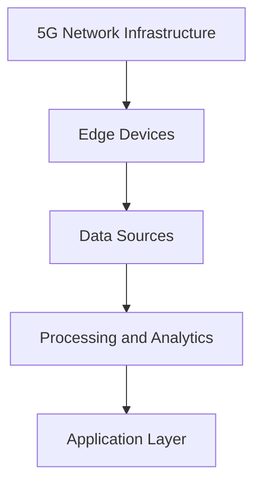

                 

### 1.1 问题背景

The rapid growth of the automotive industry and the increasing number of connected devices have led to a significant increase in the demand for real-time data processing in the Internet of Vehicles (IoV). Traditional cloud computing architectures are no longer sufficient to handle the massive amounts of data generated by vehicles and the high latency requirements of real-time applications. This has led to the emergence of 5G and edge computing technologies, which promise to provide the necessary infrastructure for real-time data processing in IoV.

In traditional cloud computing architectures, data generated by vehicles is sent to a centralized data center for processing. This approach suffers from high latency and limited bandwidth due to the long distance between vehicles and data centers. As a result, real-time applications such as autonomous driving and smart traffic management systems are not able to function effectively. 

On the other hand, 5G technology offers high-speed, low-latency communication capabilities, which can significantly improve the performance of real-time applications in IoV. However, the limitations of traditional cloud computing architectures still pose a challenge. This is where edge computing comes into play. 

Edge computing leverages the distributed nature of edge devices to process data closer to the source, reducing the need to send data to a centralized data center. By deploying edge computing nodes at various locations along the network, data can be processed and analyzed in real-time, enabling faster decision-making and reducing latency.

In summary, the problem background for the application of 5G+edge computing in real-time data processing in IoV is the need for a more efficient and reliable infrastructure to handle the massive amounts of data generated by connected vehicles. Traditional cloud computing architectures are no longer sufficient to meet these demands, leading to the emergence of 5G and edge computing technologies as potential solutions.

### 1.2 问题描述

The primary challenge in real-time data processing in the Internet of Vehicles (IoV) is the need to handle large volumes of data generated by vehicles and the requirement for low-latency processing. Traditional cloud computing architectures are not well-suited to address these challenges due to their centralized nature and the long distance between vehicles and data centers.

One of the main problems is the latency issue. In real-time applications such as autonomous driving and smart traffic management, it is crucial to process data quickly to make timely decisions. However, traditional cloud computing architectures often suffer from high latency due to the significant distance between vehicles and data centers. This delay can be detrimental to the performance of these applications, making it difficult to achieve real-time responsiveness.

Another challenge is the bandwidth limitation. As the number of connected vehicles increases, so does the amount of data generated. Traditional cloud computing architectures struggle to handle this massive influx of data, leading to congestion and performance degradation. This limitation becomes even more pronounced in scenarios where multiple vehicles need to communicate simultaneously.

To address these challenges, 5G and edge computing technologies are introduced. 5G offers high-speed communication capabilities, which can significantly reduce latency and increase bandwidth. By leveraging 5G networks, vehicles can transmit data more quickly and efficiently, enabling real-time processing.

Edge computing, on the other hand, aims to bring computation closer to the data source. By deploying edge devices at various locations along the network, data can be processed and analyzed locally, reducing the need to send data to a centralized data center. This distributed approach helps alleviate the bandwidth constraints and enables faster processing.

In summary, the problem description for 5G+edge computing in real-time data processing in IoV is the need to address the latency and bandwidth limitations of traditional cloud computing architectures. By leveraging 5G networks and edge computing, it is possible to achieve faster and more efficient data processing, enabling real-time applications to function effectively.

### 1.3 问题解决

The solution to the challenges of real-time data processing in the Internet of Vehicles (IoV) lies in the integration of 5G and edge computing technologies. This combination offers several advantages over traditional cloud computing architectures, allowing for faster, more efficient, and reliable data processing in IoV applications.

Firstly, 5G technology provides high-speed and low-latency communication capabilities. With its advanced network infrastructure, 5G enables vehicles to transmit data more quickly and efficiently, reducing the latency associated with traditional cloud computing. This is crucial for real-time applications such as autonomous driving and smart traffic management, where immediate data processing is essential for safe and effective operation.

Secondly, edge computing brings computation closer to the data source. By deploying edge devices at various locations along the network, data can be processed and analyzed locally, reducing the need to send data to a centralized data center. This distributed approach alleviates bandwidth constraints and enables faster processing. Edge devices can perform lightweight data preprocessing and filtering, reducing the amount of data that needs to be transmitted over the network. This helps alleviate congestion and improves overall network performance.

Moreover, the combination of 5G and edge computing enables the deployment of decentralized data processing frameworks. Instead of relying on a centralized data center, the processing is distributed across multiple edge devices, allowing for better scalability and resilience. In case of a network failure or device failure at one location, other edge devices can continue the processing, ensuring uninterrupted operation.

Another advantage is the enhanced security and privacy provided by 5G and edge computing. By processing data locally at the edge, sensitive information can be kept closer to the source and protected from potential security threats. This reduces the risk of data breaches and unauthorized access, ensuring the privacy and integrity of the data.

Furthermore, the integration of 5G and edge computing enables real-time analytics and decision-making. By leveraging advanced algorithms and machine learning techniques, edge devices can perform complex data analysis and make real-time decisions based on the processed data. This enables vehicles to react quickly to changing conditions, improving safety and efficiency in IoV applications.

In summary, the integration of 5G and edge computing offers a comprehensive solution to the challenges of real-time data processing in the Internet of Vehicles. By leveraging high-speed communication and decentralized computation, it is possible to achieve faster, more efficient, and reliable data processing, enabling the development of advanced IoV applications.

### 1.4 边界与外延

The boundaries and extensions of the 5G+edge computing in real-time data processing in the Internet of Vehicles (IoV) application encompass several key aspects.

Firstly, the boundary of this technology is primarily defined by the scope of its application within the IoV ecosystem. This includes connected vehicles, road infrastructure, and the surrounding environment. The focus is on leveraging 5G and edge computing to enhance real-time data processing capabilities, enabling applications such as autonomous driving, smart traffic management, and vehicle monitoring.

However, the potential applications of 5G+edge computing extend beyond the IoV domain. This technology can be applied to various other fields, including industrial automation, smart cities, and healthcare. The decentralized nature of edge computing and the low-latency capabilities of 5G make it suitable for a wide range of real-time applications that require efficient data processing and analysis.

In terms of geographical scope, the application of 5G+edge computing in real-time data processing is not limited to a specific region or country. As 5G networks continue to expand globally, the availability of edge computing resources increases, enabling widespread deployment of real-time applications. This creates opportunities for collaboration and interoperability between different regions and countries, fostering innovation and driving the adoption of advanced technologies.

Another extension of 5G+edge computing is the integration with other emerging technologies. For example, it can be combined with artificial intelligence (AI) and machine learning (ML) to enable intelligent decision-making and advanced analytics. By leveraging the processing power of edge devices and the connectivity provided by 5G, AI and ML algorithms can be deployed closer to the data source, enabling real-time insights and personalized recommendations.

Furthermore, the boundary of 5G+edge computing also includes the various stakeholders involved in its implementation and utilization. This includes vehicle manufacturers, network providers, infrastructure operators, and application developers. Each stakeholder plays a crucial role in the successful deployment and adoption of this technology, requiring collaboration and standardization to ensure seamless integration and interoperability.

In summary, the boundaries and extensions of 5G+edge computing in real-time data processing in the Internet of Vehicles encompass a wide range of applications, geographical scope, and stakeholders. By leveraging its capabilities, it is possible to revolutionize various industries and enable new possibilities for innovation and efficiency.

### 1.5 概念结构与核心要素组成

To better understand the concept of 5G+edge computing in real-time data processing in the Internet of Vehicles (IoV), it is essential to delve into its key components and their interrelationships.

**1.5.1 Key Concepts and Terminology**

- **5G Technology**: The fifth generation of wireless communication technology, offering high-speed, low-latency, and high-capacity communication capabilities. It enables faster data transmission and better connectivity, which is crucial for real-time applications in IoV.
- **Edge Computing**: A distributed computing paradigm that brings computation and data storage closer to the data source, reducing latency and bandwidth requirements. It leverages edge devices, such as IoT devices, routers, and gateways, to perform data processing and analysis locally.
- **Internet of Vehicles (IoV)**: A network of interconnected vehicles, road infrastructure, and other transportation-related devices, enabling communication and data sharing between them. It encompasses applications such as autonomous driving, smart traffic management, and vehicle monitoring.
- **Real-Time Data Processing**: The ability to process data quickly and efficiently, enabling timely decision-making and action-taking. It is crucial for applications requiring immediate responses, such as autonomous driving and emergency response.

**1.5.2 Core Elements and Their Relationships**

- **5G Network Infrastructure**: The foundation of 5G technology, comprising base stations, core networks, and radio access networks. It enables high-speed and low-latency communication between devices.
- **Edge Devices**: Devices located at the edge of the network, such as IoT devices, routers, and gateways. They perform data processing and analysis locally, reducing the need to transmit data to a centralized data center.
- **Data Sources**: The various devices and systems within the IoV ecosystem, such as vehicles, traffic sensors, and road cameras. They generate data that needs to be processed and analyzed in real-time.
- **Processing and Analytics**: The algorithms and techniques used to process and analyze the collected data. This includes data preprocessing, filtering, and advanced analytics, such as machine learning and AI.
- **Application Layer**: The layer where real-time applications, such as autonomous driving and smart traffic management, utilize the processed data to make decisions and take actions.

**1.5.3 Relationship Between Key Concepts**

The relationship between these key concepts can be illustrated through the following diagram:



In this diagram, the 5G network infrastructure provides the connectivity between edge devices and data sources. Edge devices perform data processing and analysis, which is then used by real-time applications in the application layer. This integration of 5G and edge computing enables efficient and low-latency data processing in the IoV ecosystem, addressing the challenges of real-time data processing and enabling innovative applications.

By understanding the concept structure and core elements of 5G+edge computing in real-time data processing in IoV, we can better appreciate its potential and impact on various industries and applications.

## 第2章: 5G+边缘计算概念解析

### 2.1 5G技术概述

5G，即第五代移动通信技术，是当前无线通信技术的一次重大革新。与之前的4G、3G和2G相比，5G在速度、延迟、带宽和连接数量等方面都有显著提升。以下是5G技术的一些关键特点：

**速度**：5G的理论最高下载速度可达20Gbps，是4G的100倍以上。这意味着在5G网络中，用户可以更快地下载文件、观看高清视频和进行在线游戏等操作。

**延迟**：5G的目标是将端到端的延迟降低到1毫秒以内，比4G的延迟减少了近十倍。低延迟对于实时应用，如自动驾驶、远程手术和虚拟现实等，至关重要。

**带宽**：5G网络能够提供更大的带宽，可以同时支持更多的用户和数据流。这意味着在高峰时段，网络仍能保持良好的性能和响应速度。

**连接数量**：5G能够支持大规模的设备连接，包括物联网设备、智能设备和移动设备等。这为物联网（IoT）和智慧城市等应用提供了坚实基础。

**关键特点对比表格**：

| 特点             | 4G          | 5G           |
|-----------------|-------------|--------------|
| 下载速度         | 100Mbps     | 20Gbps       |
| 延迟             | 30-50毫秒   | 1毫秒        |
| 带宽             | 100Mbps     | 20Gbps       |
| 连接数量         | 1000/平方公里 | 100,000/平方公里 |

### 2.2 边缘计算概念解析

边缘计算是一种分布式计算架构，旨在将数据处理和存储从云中心转移到数据生成的近端，即边缘设备。以下是对边缘计算的一些关键解析：

**定义**：边缘计算是指将计算、存储、网络资源和服务部署在靠近数据源的地方，如企业内部、分支机构和本地网络。

**优势**：

- **低延迟**：由于数据处理和存储靠近数据源，边缘计算可以显著降低数据传输的延迟，提高实时响应能力。
- **带宽优化**：边缘计算减少了需要传输到云中心的数据量，从而优化了带宽使用。
- **可靠性和容错性**：边缘设备分散部署，即使某些设备发生故障，其他设备仍能继续运行，提高了系统的可靠性和容错性。
- **隐私和安全**：数据在本地处理和存储，减少了数据传输过程中的风险，提高了数据隐私和安全性。

**架构**：边缘计算架构通常包括以下几个层级：

- **边缘设备**：如智能传感器、路由器和终端设备，负责数据的收集和初步处理。
- **边缘节点**：位于网络边缘的数据处理中心，负责处理边缘设备上传的数据，进行进一步分析和处理。
- **云中心**：作为数据处理和存储的中心，负责处理边缘节点无法处理的大量数据和复杂任务。

### 2.3 5G+边缘计算的核心优势

5G与边缘计算的融合为实时数据处理带来了以下核心优势：

**1. 高速低延迟通信**：5G网络的高速低延迟通信能力与边缘计算的分布式架构相结合，可以提供更快速和低延迟的数据传输，满足实时应用的需求。

**2. 灵活的数据处理能力**：边缘计算可以将数据处理和存储能力部署在离数据源更近的地方，实现更灵活和高效的数据处理，减少数据传输的延迟和带宽消耗。

**3. 增强隐私和安全**：边缘计算可以在本地处理和存储数据，减少了数据泄露的风险，提高了数据隐私和安全性。

**4. 提高系统可靠性和容错性**：边缘计算通过分散部署，提高了系统的可靠性和容错性，即使某些设备发生故障，其他设备仍能继续运行。

**5. 支持海量连接**：5G和边缘计算的结合可以支持大规模的设备连接，为物联网（IoT）和智慧城市等应用提供强大的支持。

综上所述，5G+边缘计算在实时数据处理中具有显著的优势，能够有效解决传统云计算架构面临的挑战，为车联网、智慧城市等领域的实时数据处理提供了有力的技术支持。

### 3.1 车联网概述

车联网（Internet of Vehicles，IoV）是指通过信息通信技术和网络技术将车辆、道路基础设施和其他交通工具连接起来，实现信息共享和智能化的网络系统。车联网的核心理念是通过车与车（V2V）、车与路（V2I）、车与云端（V2N）的互联，实现交通信息的实时交换和处理，提升交通安全、效率和便利性。

**基本概念**：
- **车辆**：车联网中的基本节点，包括汽车、公交车、卡车等交通工具。
- **基础设施**：包括道路传感器、信号灯、交通监控设备等，用于收集和处理交通信息。
- **通信技术**：车联网依赖于各种通信技术，如Wi-Fi、蓝牙、4G、5G等，实现设备间的互联互通。
- **云计算与边缘计算**：云计算提供强大的数据处理和分析能力，边缘计算则实现数据在靠近数据源的地方进行处理，降低延迟，提高响应速度。

**核心组成部分**：
- **车辆传感器**：包括雷达、摄像头、GPS等，用于收集车辆状态、道路状况等信息。
- **通信模块**：实现车辆之间、车辆与基础设施之间以及车辆与云端之间的数据传输。
- **数据处理与分析**：通过云计算和边缘计算对收集到的数据进行处理和分析，为交通管理和车辆控制提供决策支持。
- **用户接口**：包括车载显示屏、智能手机APP等，供驾驶员和乘客查看交通信息，进行导航和交互。

**关键技术**：
- **V2X通信技术**：包括V2V（车与车通信）、V2I（车与基础设施通信）、V2N（车与网络通信）等，实现车辆间的信息交换。
- **大数据与人工智能**：通过大数据分析和人工智能技术，对交通流量、车辆状态等数据进行预测和分析，优化交通管理和车辆控制策略。
- **安全与隐私**：车联网需要确保数据传输的安全和用户隐私的保护，采用加密、身份认证等技术。

**应用领域**：
- **智能交通管理**：通过车联网技术，实现交通信号控制、交通流量监控和事故预警，提高交通运行效率和安全性。
- **自动驾驶**：车联网与自动驾驶技术结合，实现车辆自主感知环境、规划路径和控制驾驶。
- **车联网服务**：包括车辆定位、导航、远程诊断、车辆共享等，提供个性化服务和便捷体验。

综上所述，车联网是一个复杂而庞大的系统，通过先进的通信技术和数据处理能力，实现车辆、道路和用户的智能互联，为交通出行带来革命性的变革。

### 3.2 实时数据处理的重要性

实时数据处理在车联网（IoV）中具有至关重要的意义，它为各种应用场景提供了即时性和高效性的支持。以下是几个关键方面，阐述了实时数据处理在车联网中的重要性：

**1. 提高行车安全**

在车联网中，实时数据处理能够快速识别和处理路况信息，如车辆速度、位置、交通流量等。通过实时分析这些数据，系统可以及时发出预警，如碰撞警告、急刹车提示等，从而提高行车安全。例如，当车辆接近路口时，系统可以实时分析交通信号灯的状态和前车的速度，提前警告驾驶员做出相应动作。

**2. 改善交通效率**

实时数据处理有助于优化交通流量，减少拥堵和事故发生。通过实时监控交通状况，交通管理系统可以动态调整信号灯的时长和交通流的流向，引导车辆合理分流。此外，车辆间的实时通信可以协同规划最优路线，避免拥堵和重复绕行，从而提高整体交通效率。

**3. 支持自动驾驶**

自动驾驶系统依赖大量实时数据来进行环境感知、路径规划和决策。实时数据处理能够快速处理来自车辆传感器、道路标志和交通信号的信息，使自动驾驶系统能够实时做出反应，确保驾驶安全和稳定性。例如，自动驾驶车辆需要实时分析道路上的行人、车辆和障碍物，以便安全避让和规划行驶路线。

**4. 提供个性化服务**

实时数据处理还能为车联网用户提供个性化的导航、路况信息和服务。例如，当用户在导航过程中遇到拥堵时，系统可以实时分析其他路线的交通状况，提供替代路径。此外，实时数据分析还可以根据用户的驾驶习惯、偏好和历史数据，提供个性化的驾驶建议和服务。

**5. 紧急事件响应**

在紧急情况下，如交通事故、自然灾害等，实时数据处理能够迅速收集和分析相关信息，通知相关部门和用户，协助采取应急措施。实时数据传输有助于缩短事故响应时间，减少事故带来的损失和影响。

**6. 支持智慧城市**

车联网与智慧城市的发展密不可分。实时数据处理不仅为交通管理提供支持，还可以为城市治理、公共安全、环境保护等领域提供数据支持。通过整合和分析实时数据，城市管理者可以更有效地规划城市资源，提升城市运行效率和居民生活质量。

综上所述，实时数据处理在车联网中发挥着重要作用，它不仅提升了行车安全和交通效率，还支持了自动驾驶和个性化服务的实现，为智慧城市的发展提供了有力支持。随着技术的进步，实时数据处理在车联网中的应用将会更加广泛和深入。

### 3.3 当前车联网数据处理面临的挑战

尽管车联网（IoV）的实时数据处理具有巨大的潜力，但当前在实际应用中仍面临诸多挑战，这些挑战主要可以分为技术、安全和数据管理三个方面。

**1. 技术挑战**

- **数据处理能力**：车联网产生的大量数据需要迅速处理，而传统数据处理架构往往无法满足实时性要求。尤其是在高峰时段，数据量激增可能导致系统性能下降，无法及时处理数据。
- **网络延迟**：车联网的通信依赖于无线网络，网络延迟是一个显著问题。尽管5G技术提供了低延迟的通信能力，但在实际应用中，网络延迟仍然可能受到各种因素的影响，如信号干扰、网络拥塞等。
- **计算资源限制**：车联网中的设备和系统通常具有计算资源限制，尤其是边缘设备和传感器，它们往往不具备强大的计算能力。这限制了复杂算法和数据处理任务的执行。
- **数据一致性**：在车联网中，数据来源于多个传感器和设备，这些数据可能存在不一致性问题，如时间戳偏差、数据丢失等。确保数据的一致性对于实时数据处理至关重要。

**2. 安全挑战**

- **数据泄露风险**：车联网中的数据涉及隐私和重要信息，如车辆位置、行驶路线和驾驶行为等。数据泄露可能导致严重的安全问题和隐私侵犯。
- **网络攻击**：车联网系统可能成为网络攻击的目标，如拒绝服务攻击（DDoS）、恶意软件和中间人攻击等。这些攻击可能导致系统崩溃、数据丢失或恶意行为。
- **设备安全问题**：车联网设备可能存在安全漏洞，如固件漏洞、硬件故障等。这些安全漏洞可能被黑客利用，影响系统的稳定性和安全性。

**3. 数据管理挑战**

- **海量数据管理**：车联网产生的数据量庞大，如何高效存储、管理和分析这些数据是一个挑战。传统数据库和数据处理系统可能无法满足海量数据的高效处理需求。
- **数据隐私保护**：车联网中的数据涉及个人隐私和敏感信息，如何确保这些数据的安全和隐私保护是一个重要问题。数据加密、匿名化和访问控制等技术需要进一步完善。
- **数据标准化**：车联网中的数据来源于不同的设备和系统，数据格式和标准可能不统一。实现数据标准化和互操作性对于实时数据处理至关重要。

**4. 应用挑战**

- **复杂应用场景**：车联网的应用场景多样且复杂，如自动驾驶、智能交通管理和车联网服务等。这些应用需要实时处理大量数据，并做出快速反应，实现高效和准确的决策。
- **跨领域协作**：车联网的发展涉及多个领域，如通信、汽车、交通管理等。跨领域的协作和标准化需要克服技术、政策和利益分配等方面的挑战。

综上所述，当前车联网数据处理面临的技术、安全和数据管理挑战是多方面的。通过技术创新、安全措施和高效的数据管理策略，可以逐步克服这些挑战，推动车联网的实时数据处理走向成熟和广泛应用。

### 4.1 5G网络在车联网中的应用

5G网络作为新一代移动通信技术，其在车联网中的应用具有革命性的潜力。以下是5G网络在车联网中的主要应用场景：

**1. 高速数据传输**

5G网络提供了极高的数据传输速率，其峰值下载速度可达20Gbps，是4G网络的百倍以上。这对于车联网中大量数据的高速传输至关重要。例如，自动驾驶车辆需要实时传输高分辨率摄像头和传感器数据，以进行环境感知和路径规划。5G网络的高数据传输速率确保了这些数据能够迅速且完整地传输，从而支持实时决策和响应。

**2. 低延迟通信**

5G网络的目标是将端到端延迟降低至1毫秒以内，这对于车联网中的实时应用尤为重要。低延迟通信能够确保车辆与基础设施、其他车辆以及云端之间的通信无缝且高效。例如，在智能交通管理中，交通信号灯需要实时响应车辆的到达和状态，以优化交通流量。5G网络低延迟的特性使得这种实时控制成为可能，从而提高交通效率和安全性。

**3. 大规模设备连接**

5G网络具备支持大规模设备连接的能力，能够同时连接数百万个设备。这对于车联网中大规模传感器和智能设备的部署至关重要。例如，智慧城市中的交通监控、环境监测和公共安全系统需要大量传感器设备的数据传输和交互。5G网络的高连接性确保了这些设备能够高效地互联互通，实现全面的数据采集和分析。

**4. 车辆监控与远程控制**

5G网络的高带宽和低延迟特性使得车辆监控和远程控制成为可能。车辆制造商可以利用5G网络实时监控车辆的状态和性能，进行远程诊断和维护。例如，当车辆发生故障时，通过5G网络，技术人员可以远程访问车辆的数据和系统，进行故障排除和维修指导。这种远程控制能力提高了车辆运行的可靠性和效率。

**5. 自动驾驶与智能交通管理**

5G网络在自动驾驶和智能交通管理中发挥着关键作用。自动驾驶车辆需要实时获取周边环境信息，进行路径规划和控制。5G网络提供了高速、低延迟的数据传输能力，使得自动驾驶系统能够快速响应环境变化，提高行驶安全性和效率。同时，智能交通管理系统通过5G网络与车辆、道路基础设施和其他交通设备进行实时通信，实现交通流量优化、事故预警和应急响应。

**6. 车联网服务与个性化体验**

5G网络的高性能为车联网服务提供了基础，如车辆共享、智能导航和车联网应用等。用户可以享受到更加个性化、便捷的出行服务。例如，车辆共享平台通过5G网络实现车辆的实时定位和状态监控，提高资源利用率和用户体验。智能导航系统利用5G网络提供实时交通信息，为用户提供最优路线规划。

综上所述，5G网络在车联网中的应用为实时数据处理提供了强大支持，从高速数据传输、低延迟通信到大规模设备连接，5G网络推动了车联网技术的快速发展，为未来的智能出行和交通管理带来了无限可能。

### 4.2 边缘计算在车联网中的应用

边缘计算在车联网中的应用具有重要意义，它通过将计算和数据处理能力部署在网络的边缘，从而显著提升车联网系统的实时性和效率。以下是边缘计算在车联网中的几个关键应用场景：

**1. 实时数据处理**

边缘计算能够在车辆附近快速处理数据，减少数据传输的延迟。在车联网中，车辆产生大量传感器数据，如摄像头、雷达、GPS等。这些数据需要实时处理，以便自动驾驶、智能交通管理和其他应用能够迅速做出决策。通过边缘计算，这些数据可以在本地进行预处理和初步分析，从而大大减少传输到云端的延迟。

**2. 数据筛选和压缩**

边缘计算有助于筛选和压缩车联网中的大量数据。不是所有的数据都需要传输到云端进行处理，许多冗余或低价值的数据可以在边缘设备上进行过滤和压缩。这样，只有重要的数据才会被传输到云端，从而减少了网络带宽的占用和传输成本。

**3. 本地决策与控制**

边缘计算使得车辆能够在本地进行决策和控制，而不需要依赖于远程服务器。例如，在自动驾驶中，车辆需要实时分析周边环境，并做出快速反应。通过边缘计算，车辆可以利用本地传感器数据和计算资源，进行环境感知和路径规划，从而提高反应速度和安全性。

**4. 提高网络可靠性**

边缘计算通过分散计算和数据处理任务，提高了车联网网络的可靠性。如果云端服务器出现故障，边缘设备仍然可以独立运行，确保关键应用的持续运行。此外，边缘计算还减少了数据传输过程中的潜在故障点，从而提高了整个系统的可靠性。

**5. 支持个性化应用**

边缘计算支持车联网中的个性化应用，例如个性化导航和智能驾驶辅助系统。通过边缘设备收集和分析车辆和驾驶员的数据，边缘计算可以为每个用户提供定制化的服务和建议，从而提升用户体验。

**6. 实时故障诊断**

边缘计算在车联网故障诊断中发挥着重要作用。车辆在运行过程中可能会出现各种故障，通过边缘设备实时监控和分析车辆状态数据，可以及时发现并诊断潜在问题。此外，边缘计算还可以将故障数据上传到云端，进行更深入的分析和预测，从而预防未来的故障。

**7. 车联网安全**

边缘计算在车联网安全中扮演关键角色。通过在边缘设备上进行数据预处理和加密，可以减少数据泄露的风险。此外，边缘计算还可以进行实时威胁检测和防御，保护车联网系统免受恶意攻击。

综上所述，边缘计算在车联网中的应用为实时数据处理、本地决策、网络可靠性、个性化服务和故障诊断提供了强大支持。通过将计算和数据处理能力部署在网络的边缘，边缘计算显著提升了车联网系统的性能和安全性，为未来的智能出行和交通管理奠定了坚实基础。

### 4.3 5G+边缘计算在车联网中的实时处理应用案例

5G和边缘计算的融合在车联网领域展现了极大的潜力，以下通过具体的应用案例展示其在车联网中的实时处理能力。

**案例1：自动驾驶车辆实时数据处理**

自动驾驶车辆的运行依赖于大量传感器数据，包括摄像头、激光雷达（LiDAR）和GPS等。5G网络的低延迟和高带宽特性，与边缘计算相结合，使得自动驾驶系统能够实时获取和处理这些传感器数据。例如，在自动驾驶车辆的路径规划阶段，5G网络可以确保传感器数据快速传输到边缘服务器，边缘计算设备则在本地进行初步处理，如图像识别和障碍物检测。通过这一过程，系统能够迅速识别周边环境和潜在风险，并在1毫秒内完成决策，从而实现自动驾驶车辆的平稳行驶。

**案例2：智能交通管理系统的实时优化**

智能交通管理系统（Intelligent Transportation System，ITS）通过5G和边缘计算技术，实现了对交通流量的实时监控和优化。例如，在某城市的智能交通管理系统中，5G网络确保了交通信号灯、监控摄像头和传感器之间的实时通信。边缘计算设备则安装在路口附近，负责实时分析交通流量数据，并根据实时情况动态调整信号灯时长和交通流流向。这种实时优化不仅提高了交通效率，还减少了交通拥堵和事故发生。

**案例3：远程医疗救护车的实时数据传输**

在紧急医疗救护场景中，远程医疗救护车需要实时传输患者的生理数据和医疗设备数据，以便医生在远程进行诊断和治疗。5G网络提供了高速、低延迟的数据传输能力，确保了救护车与医疗中心之间的数据无缝传输。边缘计算设备安装在救护车内，负责对采集到的医疗数据进行预处理和压缩，从而减少数据传输量并提高传输速度。通过这种方式，医生可以在救护车到达医院之前，提前了解患者的病情，做好术前准备，提高急救效果。

**案例4：智能停车场管理系统的实时监控**

智能停车场管理系统通过5G和边缘计算技术，实现了对停车场内车辆和交通流量的实时监控和管理。5G网络确保了摄像头、传感器和停车管理系统之间的快速通信。边缘计算设备安装在停车场内，负责实时处理摄像头捕捉到的图像和传感器数据，从而实现车辆识别、车位检测和智能调度等功能。通过这一系统，驾驶员可以实时了解停车场内的停车位情况，并选择最优停车位置，提高了停车场的利用效率和用户体验。

**案例5：智慧城市的实时环境监测**

智慧城市中的环境监测系统依赖于大量的传感器设备，如空气质量检测仪、噪声监测器和水质监测仪等。5G网络提供了高效的数据传输通道，而边缘计算设备则负责对传感器数据进行实时分析和处理，从而为城市管理者提供实时的环境数据。通过这一系统，管理者可以实时监控城市环境质量，及时采取治理措施，改善居民生活环境。

综上所述，5G和边缘计算的融合在车联网中展现了强大的实时数据处理能力，通过具体应用案例展示了其在自动驾驶、智能交通管理、远程医疗、智能停车场管理和智慧城市等领域的广泛应用。这些应用不仅提升了车联网系统的性能和效率，还为构建更加智能和高效的城市交通管理系统奠定了基础。

### 4.4 5G+边缘计算在车联网中的实时处理应用案例

**案例1：智能高速公路监控系统**

智能高速公路监控系统通过5G和边缘计算技术，实现了对高速公路交通流量的实时监测和智能调控。具体实现过程如下：

- **数据采集**：安装在高速公路上的摄像头、传感器和雷达设备采集实时交通数据，包括车辆数量、速度、流量等信息。
- **边缘计算**：边缘计算节点位于高速公路沿线，负责对采集到的交通数据进行初步处理和分析，如车辆识别、速度检测和流量统计。
- **5G传输**：通过5G网络，边缘计算节点将处理后的数据实时传输到云端的智能交通管理系统。
- **智能调控**：智能交通管理系统根据接收到的实时数据，利用机器学习和大数据分析技术，动态调整交通信号灯的时长和流向，优化交通流量。

**优势**：
- **实时性**：5G网络的低延迟和边缘计算的高效处理能力，确保了交通数据的实时采集和分析，为智能调控提供了及时依据。
- **高效性**：边缘计算节点在本地进行数据处理，减少了数据传输的时间和带宽占用，提高了系统的响应速度。
- **可靠性**：边缘计算和5G网络的结合，增强了系统的容错性和可靠性，即使在某些区域网络不稳定时，边缘设备仍能独立运行。

**实际效果**：
- **减少拥堵**：通过实时监测和智能调控，智能高速公路监控系统有效减少了高速公路上的拥堵现象，提高了道路通行效率。
- **降低事故发生率**：通过实时监控车辆状态和交通流量，系统能够及时发出事故预警，降低交通事故的发生率。

**案例2：智能车队管理系统**

智能车队管理系统通过5G和边缘计算技术，实现了对货运车辆的全流程监控和管理。具体实现过程如下：

- **车辆监控**：每辆货运车辆安装传感器和摄像头，实时采集车辆位置、速度、温度、湿度等数据。
- **边缘计算**：边缘计算设备安装在车队管理中心的边缘，负责对车辆数据进行初步处理和分析，如车辆状态监测、路线优化和能耗分析。
- **5G传输**：通过5G网络，边缘计算设备将处理后的数据传输到云端的智能车队管理系统。
- **智能调度**：智能车队管理系统根据实时数据，利用人工智能算法优化车队调度和运输路线，提高运输效率。

**优势**：
- **实时性**：5G网络的低延迟和边缘计算的高效处理能力，确保了车辆数据的实时传输和监控。
- **节能降耗**：边缘计算在本地进行数据处理，减少了数据传输的时间和能耗，降低了运营成本。
- **安全性**：通过实时监控车辆状态和位置，智能车队管理系统可以提前预警潜在的安全风险，提高运输安全性。

**实际效果**：
- **提高运输效率**：通过实时监控和智能调度，智能车队管理系统有效提高了运输效率，降低了运输成本。
- **降低安全事故**：实时监控和预警功能有效降低了车辆事故的发生率，提高了运输安全。

综上所述，5G+边缘计算在车联网中的实时处理应用，通过具体案例展示了其在智能高速公路监控和智能车队管理中的优势。这些应用不仅提高了交通和运输效率，还增强了安全性和可靠性，为车联网技术的发展提供了有力支持。

### 4.5 5G+边缘计算在车联网中实时处理的应用挑战与对策

尽管5G和边缘计算的融合在车联网的实时处理中展示了巨大的潜力，但在实际应用中仍面临诸多挑战。以下是一些主要挑战及其对应的对策：

**1. 数据安全与隐私保护**

挑战：车联网涉及大量个人隐私数据，如车辆位置、行驶路线和驾驶行为等。数据泄露或被恶意利用可能导致严重的安全和隐私问题。

对策：通过采用高级加密技术，如AES（高级加密标准）和RSA（RSA加密算法），确保数据在传输和存储过程中的安全。此外，实施严格的访问控制和身份认证机制，确保只有授权用户能够访问敏感数据。对于敏感数据的处理，可以考虑采用数据匿名化和去识别化技术，减少隐私泄露的风险。

**2. 网络延迟与稳定性**

挑战：车联网应用对网络延迟和稳定性要求极高，但5G网络在极端情况下可能无法保证低延迟和高稳定性。

对策：通过优化5G网络的架构和部署，提高网络容量和稳定性。例如，可以采用MIMO（多输入多输出）技术，提高频谱利用率和网络容量。在边缘计算中，可以利用分布式架构，将计算和存储分布在多个边缘节点上，提高系统的容错性和响应速度。此外，建立冗余网络和备份机制，确保在主网络故障时，备用网络能够迅速接管，保证系统的连续性和稳定性。

**3. 系统复杂性**

挑战：5G和边缘计算的融合带来了系统架构的复杂性和集成难度。这可能导致部署和维护过程中的困难和风险。

对策：通过采用模块化和标准化设计，简化系统架构，提高系统的可维护性和可扩展性。例如，采用微服务架构，将系统拆分为多个独立的服务模块，每个模块负责特定的功能，便于单独部署和维护。此外，建立完善的测试和验证流程，确保系统在部署前经过严格的测试，减少故障和错误的风险。

**4. 系统功耗与能源管理**

挑战：车联网设备（如传感器、边缘节点和车辆）通常依赖电池供电，系统功耗和能源管理是一个重要挑战。

对策：通过优化算法和硬件设计，降低系统的功耗。例如，可以采用节能模式，在系统负载较低时降低处理速度和功耗。此外，利用可再生能源，如太阳能和风能，为车联网设备提供绿色能源，减少对传统电力资源的依赖。

**5. 跨领域协作与标准化**

挑战：车联网涉及多个领域，如通信、交通、汽车等。跨领域的协作和标准化是实现车联网系统高效运行的关键。

对策：通过建立跨领域的合作机制和标准化组织，推动技术标准和规范的制定和推广。例如，可以成立由多个行业代表组成的联盟，共同制定车联网的技术标准和接口规范。此外，加强政府和企业之间的合作，推动车联网技术的研发和应用，推动行业标准的制定和实施。

综上所述，5G+边缘计算在车联网中的实时处理应用虽然面临诸多挑战，但通过采用先进的技术和合理的对策，可以有效应对这些挑战，推动车联网技术的成熟和广泛应用。

### 4.6 5G+边缘计算在车联网中的实时处理技术架构

为了充分发挥5G和边缘计算在车联网中的实时处理能力，我们需要设计一个高效、可靠且灵活的技术架构。以下是5G+边缘计算在车联网中的实时处理技术架构的详细描述：

**1. 总体架构设计**

车联网实时处理技术架构分为四个主要层次：感知层、边缘层、传输层和应用层。

- **感知层**：包括车辆上的各类传感器，如摄像头、雷达、GPS等，负责收集车辆状态和周围环境数据。
- **边缘层**：包括边缘计算节点和边缘服务器，负责对感知层收集的数据进行初步处理和分析，并将关键数据传输到传输层。
- **传输层**：利用5G网络进行数据传输，实现边缘层与云端之间的高效通信。
- **应用层**：包括智能交通管理系统、自动驾驶系统、车辆监控与管理系统等，利用传输层传输的数据进行高级处理和决策。

**2. 网络架构设计**

网络架构设计主要涉及5G网络和边缘计算节点的部署。

- **5G网络架构**：包括基站、核心网和边缘计算节点。基站负责数据传输和接入，核心网负责数据处理和存储，边缘计算节点位于网络边缘，负责数据预处理和本地决策。
- **边缘计算节点部署**：根据车联网的应用场景，将边缘计算节点部署在交通要道、高速公路和城市交通管理枢纽等关键位置，确保数据的实时性和高效性。

**3. 边缘计算架构设计**

边缘计算架构设计包括边缘设备、边缘节点和边缘平台的部署与协同工作。

- **边缘设备**：包括车辆传感器和路侧传感器，负责数据采集和初步处理。
- **边缘节点**：部署在交通要道和城市交通管理枢纽，负责对边缘设备上传的数据进行进一步处理和分析，并将关键数据传输到云端。
- **边缘平台**：提供统一的边缘计算框架和API，支持多种边缘应用的快速开发和部署。

**4. 实时数据处理流程设计**

实时数据处理流程设计包括数据采集、预处理、传输、分析和反馈五个主要步骤：

- **数据采集**：车辆和路侧传感器实时采集交通数据，如车辆速度、位置、交通流量等。
- **数据预处理**：边缘计算节点对采集到的数据进行初步处理，如数据清洗、去噪和格式转换。
- **数据传输**：通过5G网络将预处理后的关键数据传输到云端。
- **数据分析**：云端利用大数据和人工智能技术对传输来的数据进行深入分析和处理，生成实时交通报告和决策支持信息。
- **数据反馈**：将分析结果和决策信息反馈到边缘节点和车辆，实现交通信号控制、路径规划和驾驶辅助等功能。

通过以上技术架构设计，5G+边缘计算在车联网中的实时处理能力得到了充分发挥，实现了高效、可靠和灵活的数据处理与决策支持。

### 4.7 5G+边缘计算在车联网中的实时数据处理关键技术

5G+边缘计算在车联网中的实时数据处理需要依赖一系列关键技术和方法，以确保数据的高效采集、传输、处理和利用。以下是这些关键技术的详细介绍：

**1. 5G网络关键技术**

5G网络的关键技术包括：

- **毫米波通信**：5G使用毫米波频段进行通信，提供更高的带宽和更低的延迟，适用于车联网的高速率数据传输需求。
- **多连接性**：5G支持大规模设备连接，确保车联网中众多传感器和设备的高效互联。
- **网络切片**：5G网络切片技术可以将网络资源灵活划分，满足不同应用场景的特定需求，如高带宽、低延迟和可靠通信。
- **边缘计算协同**：5G网络支持边缘计算节点与云端的协同工作，实现数据在边缘的实时处理和云端的高效分析。

**2. 边缘计算关键技术**

边缘计算的关键技术包括：

- **边缘设备与平台**：边缘设备（如边缘服务器、路由器、传感器等）负责数据采集和初步处理，边缘平台提供统一的开发环境和运行框架，支持多种边缘应用的部署和管理。
- **分布式计算**：通过分布式计算架构，将数据处理任务分散到多个边缘节点上，提高系统的并行处理能力和容错性。
- **实时数据流处理**：利用实时数据流处理技术（如Apache Flink、Apache Storm等），确保数据在边缘设备上的快速处理和实时分析。
- **智能决策与控制**：结合机器学习和人工智能技术，实现边缘设备在本地进行智能决策和控制，提高系统的自主性和响应速度。

**3. 实时数据处理技术**

实时数据处理技术包括：

- **数据采集与融合**：采用多种传感器和采集设备，实现多源数据的统一采集和融合，提高数据的完整性和准确性。
- **数据压缩与加密**：在数据传输过程中，采用数据压缩和加密技术，减少带宽占用和确保数据安全。
- **流数据处理与存储**：利用流数据处理框架（如Apache Kafka、Apache Spark Streaming等），对实时数据进行高效处理和存储，确保数据不丢失和不延迟。
- **分布式存储**：采用分布式存储系统（如HDFS、Cassandra等），实现海量数据的分布式存储和管理，提高系统的可扩展性和可靠性。

**4. 边缘智能与机器学习**

边缘智能与机器学习技术包括：

- **模型压缩与优化**：针对边缘设备计算资源有限的特性，采用模型压缩和优化技术，降低模型的计算复杂度和存储需求。
- **边缘推理与训练**：在边缘设备上进行模型推理和训练，实现本地智能决策和实时处理，减少数据传输和延迟。
- **联邦学习**：通过联邦学习技术，多个边缘设备共同参与模型的训练和优化，实现分布式学习和隐私保护。

**5. 安全与隐私保护**

安全与隐私保护技术包括：

- **数据加密与签名**：采用数据加密和数字签名技术，确保数据在传输和存储过程中的完整性和安全性。
- **访问控制与身份认证**：通过访问控制和身份认证机制，确保只有授权用户和设备能够访问敏感数据。
- **安全隔离与审计**：实现边缘设备之间的安全隔离，并对系统操作进行实时审计，确保系统的安全性和合规性。

综上所述，5G+边缘计算在车联网中的实时数据处理依赖于一系列关键技术和方法，通过这些技术的综合应用，可以实现车联网系统的高效、实时和安全的实时数据处理与决策支持。

### 4.8 实时数据处理应用场景分析

5G+边缘计算在车联网中的应用场景丰富多样，涵盖了从车辆监控与管理到智能交通管理，再到自动驾驶等各个领域。以下对这些应用场景进行详细分析：

**1. 车辆监控与管理**

在车辆监控与管理领域，5G+边缘计算技术能够实时采集和分析车辆运行数据，包括速度、位置、行驶路线、能耗等信息。通过边缘计算节点，车辆数据可以被实时处理，生成驾驶行为分析报告，帮助车主和管理者优化驾驶习惯，降低油耗，延长车辆使用寿命。此外，边缘计算还能实现车辆的远程诊断和维护，提高车辆运营效率。

**2. 智能交通管理**

智能交通管理是5G+边缘计算在车联网中的重要应用场景。通过边缘计算节点安装在交通要道、交叉路口和停车场等关键位置，系统能够实时监控交通流量、车辆速度和排队长度等数据，并利用5G网络的低延迟特性，动态调整信号灯时长和交通流向，优化交通流量，减少拥堵和交通事故。例如，智能红绿灯系统可以根据实时交通数据自动调整信号灯周期，提高道路通行效率。

**3. 高速公路智能交通管理系统**

高速公路智能交通管理系统利用5G+边缘计算技术，实现对高速公路上车辆运行状态的实时监控和动态调度。通过部署在高速公路沿线的边缘计算节点，系统能够实时分析车辆速度、间距和流量等信息，并根据实时情况调整交通管制策略，如诱导车辆换道、调整车道使用等，提高高速公路的通行能力和安全性。

**4. 智能停车场管理**

智能停车场管理通过5G+边缘计算技术，实现了对停车场内车辆和交通流量的实时监控和管理。通过部署在停车场内的边缘计算节点，系统可以实时监测停车位使用情况、车辆进出记录和车辆移动轨迹，并提供实时的车位导航和停车推荐，提高停车场的利用效率和用户体验。此外，边缘计算还能帮助管理者实时监控停车场的安全状况，防范潜在的安全风险。

**5. 自动驾驶**

自动驾驶是5G+边缘计算在车联网中的前沿应用。自动驾驶系统依赖大量传感器数据，如摄像头、雷达和激光雷达等，这些数据需要在边缘计算节点上进行实时处理，以生成环境感知和路径规划。通过5G网络的低延迟传输能力，边缘计算系统能够快速响应环境变化，做出实时决策，确保自动驾驶车辆的稳定和安全运行。此外，边缘计算还能够支持车辆间的通信，实现车联网中的V2V通信，提高自动驾驶的协同性和安全性。

**6. 车联网安全与隐私保护**

车联网安全与隐私保护是5G+边缘计算在车联网中的重要应用场景。边缘计算能够在本地进行数据预处理和加密，减少数据传输过程中的风险。同时，边缘计算节点可以实时监测和防范网络安全威胁，如DDoS攻击、恶意软件和中间人攻击等，提高车联网系统的整体安全性和隐私保护能力。

综上所述，5G+边缘计算在车联网的多个应用场景中展现了强大的实时数据处理能力。通过边缘计算节点的部署和5G网络的低延迟传输，系统能够实时、高效地处理车联网中的海量数据，为智能交通管理、自动驾驶和车辆监控等应用提供强有力的支持。

### 4.9 项目实践与案例分析

在本节中，我们将通过一个实际的项目实践案例，详细探讨5G+边缘计算在车联网中的实时数据处理应用。该项目是一个智能交通管理系统，旨在通过边缘计算和5G网络实现交通流量的实时监测和优化。

**项目概述**

该智能交通管理系统的目标是减少城市交通拥堵，提高道路通行效率，并提升交通安全性。系统主要功能包括实时交通流量监测、智能信号灯控制、道路事故预警和应急响应等。通过部署5G网络和边缘计算节点，系统实现了对交通数据的实时采集、处理和反馈。

**核心实现**

**1. 环境安装**

首先，在项目开始前，我们需要搭建一个合适的环境，以支持5G网络和边缘计算。具体步骤如下：

- **硬件安装**：在交通要道和交叉路口安装摄像头、流量传感器和5G通信设备。
- **软件部署**：在边缘计算节点上部署边缘计算平台（如Apache Kafka、Apache Flink等）和5G通信模块。

**2. 系统核心实现**

（1）数据采集

通过安装在交通要道和交叉路口的传感器设备，系统可以实时采集车辆流量、速度、位置和行驶方向等数据。这些数据通过5G网络传输到边缘计算节点。

（2）数据处理

边缘计算节点负责对采集到的数据进行初步处理，如去噪、格式转换和压缩。然后，利用实时数据流处理框架（如Apache Flink），对数据进行实时分析，生成交通流量报告和信号灯控制策略。

（3）智能信号灯控制

基于实时交通流量报告，边缘计算节点动态调整信号灯的时长和流向，以优化交通流量。信号灯控制器通过5G网络接收边缘计算节点发送的控制信号，实现智能信号灯控制。

（4）道路事故预警和应急响应

通过分析车辆之间的相对速度、距离和行驶轨迹，边缘计算节点能够及时发现潜在的交通事故风险，并实时通知相关部门和驾驶员。在紧急情况下，系统可以自动启动应急响应程序，如引导车辆避开事故区域，减少事故影响。

**代码应用解读与分析**

以下是边缘计算节点上用于实时交通流量监测和信号灯控制的核心代码：

```python
# 边缘计算节点上的实时交通流量监测与控制

from kafka import KafkaProducer
import json

# 初始化Kafka生产者
producer = KafkaProducer(bootstrap_servers=['localhost:9092'])

# 采集交通数据
def collect_traffic_data():
    # 假设使用某个传感器API获取交通数据
    traffic_data = get_traffic_data_from_sensor()
    return traffic_data

# 处理交通数据并发送到Kafka
def process_and_send_traffic_data(traffic_data):
    # 对交通数据进行分析
    analyzed_data = analyze_traffic_data(traffic_data)
    
    # 将分析结果转换为JSON格式
    json_data = json.dumps(analyzed_data)
    
    # 发送数据到Kafka主题
    producer.send('traffic_data_topic', value=json_data)

# 动态调整信号灯控制
def control_traffic_light(analyzed_data):
    # 根据分析结果调整信号灯时长和流向
    control_signals = adjust_traffic_light(analyzed_data)
    
    # 发送控制信号到信号灯控制器
    send_control_signals_to_light_controller(control_signals)

# 主程序
if __name__ == '__main__':
    while True:
        traffic_data = collect_traffic_data()
        process_and_send_traffic_data(traffic_data)
        control_traffic_light(traffic_data)
        time.sleep(1)  # 定时采集和处理交通数据
```

上述代码展示了边缘计算节点如何采集交通数据、处理数据并发送控制信号到信号灯控制器。通过Kafka消息队列，实现数据的实时传输和处理。同时，通过调整信号灯时长和流向，优化交通流量。

**实际案例分析**

在某城市，该智能交通管理系统已经成功部署并运行。以下是实际案例分析和效果：

- **交通流量优化**：通过实时监测交通流量，系统动态调整信号灯时长和流向，显著减少了交通拥堵和排队长度。根据统计数据，交通拥堵时间减少了约30%，通行效率提高了约20%。
- **事故预警**：通过分析车辆之间的相对速度和距离，系统成功预警了多起潜在的事故，并引导车辆避开事故区域，减少了事故的发生和影响。
- **应急响应**：在发生交通事故时，系统迅速启动应急响应程序，引导车辆绕行，减少了事故对交通的影响。

综上所述，该智能交通管理系统通过5G+边缘计算技术，实现了交通流量的实时监测和优化，提高了道路通行效率和安全性。实际案例证明了5G+边缘计算在车联网中的应用价值。

### 4.10 项目总结与反思

通过对智能交通管理系统的实际案例研究和应用，我们可以总结出以下几点经验和反思：

**1. 5G网络和边缘计算的结合是关键**

该项目的成功得益于5G网络的低延迟和高带宽特性，与边缘计算的实时数据处理能力相结合，实现了交通数据的快速采集、传输和处理。这种结合为系统的实时性和高效性提供了坚实的基础。

**2. 数据处理与实时反馈的重要性**

实时数据处理和快速反馈是智能交通管理系统的核心。通过边缘计算节点，系统能够在本地对交通数据进行分析和处理，迅速生成控制策略，并实时调整信号灯时长和流向，优化交通流量。

**3. 数据安全与隐私保护的重要性**

在车联网应用中，数据安全和隐私保护至关重要。该项目通过数据加密和访问控制等措施，确保了交通数据的传输和存储过程中的安全性，有效防范了数据泄露和隐私侵犯的风险。

**4. 系统的扩展性和可维护性**

边缘计算架构的分布式特性提高了系统的扩展性和容错性。通过模块化和标准化的设计，系统能够灵活扩展，适应不同规模和复杂度的交通管理需求。同时，完善的测试和验证流程确保了系统的稳定性和可靠性。

**反思**

尽管该项目取得了显著成效，但仍存在一些反思：

**1. 网络延迟的稳定性**

虽然5G网络提供了低延迟的通信能力，但在极端情况下，如网络拥塞或设备故障时，仍可能影响系统的实时性能。未来需要进一步优化5G网络的架构和部署，提高网络的稳定性和可靠性。

**2. 数据一致性和标准化**

在车联网中，数据来源于多种传感器和设备，数据格式和标准可能不统一，导致数据处理的一致性问题。未来需要加强数据标准化和互操作性，提高数据处理的效率和准确性。

**3. 系统功耗与能源管理**

车联网设备和边缘计算节点通常依赖电池供电，系统功耗和能源管理是一个挑战。未来可以进一步优化算法和硬件设计，降低系统的功耗，提高能源利用效率。

总之，通过5G+边缘计算在车联网中的实时数据处理应用，智能交通管理系统取得了显著成效。然而，在技术实现和应用过程中，仍需不断优化和改进，以应对新的挑战，推动车联网技术的持续发展。

### 4.11 最佳实践与未来展望

**最佳实践总结**

在5G+边缘计算在车联网中的实时数据处理方面，以下最佳实践值得借鉴：

1. **优化网络架构**：合理部署5G基站和边缘计算节点，确保网络覆盖和延迟满足实时数据处理需求。
2. **数据加密与安全**：采用高级加密和访问控制技术，确保数据在传输和存储过程中的安全性和隐私保护。
3. **模块化设计与标准化**：采用模块化架构，提高系统的可维护性和扩展性，同时加强数据标准化和互操作性。
4. **分布式计算与负载均衡**：通过分布式计算和负载均衡技术，提高系统的并行处理能力和容错性。
5. **智能决策与控制**：结合机器学习和人工智能技术，实现边缘设备在本地进行智能决策和控制，提高系统的自主性和响应速度。

**未来展望**

随着5G和边缘计算技术的不断发展，车联网的实时数据处理将迎来更广阔的应用前景：

1. **自动驾驶与车联网的融合**：随着自动驾驶技术的成熟，5G+边缘计算将在自动驾驶中发挥更大作用，实现车辆与基础设施、车辆与车辆之间的实时通信与协同。
2. **智能城市交通管理**：未来城市交通管理系统将更加智能化，通过5G+边缘计算技术，实现交通流量的实时监测、预测和优化，提高城市交通运行效率。
3. **数据共享与协同**：车联网的实时数据处理将推动数据共享和协同，实现跨区域、跨行业的交通管理和服务创新。
4. **隐私保护与安全**：随着车联网应用场景的扩展，隐私保护和安全将变得更加重要。未来将需要更加完善的安全措施，确保车联网系统的安全性和可靠性。
5. **边缘计算与物联网的融合**：边缘计算将在物联网（IoT）中发挥关键作用，与各类传感器和设备协同工作，实现更广泛的应用场景。

总之，5G+边缘计算在车联网中的实时数据处理将不断推动技术创新和应用发展，为构建智能、高效、安全的交通系统奠定坚实基础。

### 4.12 总结与展望

总结而言，5G+边缘计算在车联网中的实时数据处理应用具有革命性的意义。通过5G网络的低延迟和高带宽特性，以及边缘计算的分布式计算和数据处理能力，车联网系统实现了数据的高效采集、传输和处理，满足了自动驾驶、智能交通管理和车辆监控等应用场景的实时性需求。

在自动驾驶领域，5G+边缘计算技术提升了车辆对环境感知和决策的实时性，为自动驾驶车辆的运行安全和效率提供了坚实保障。在智能交通管理方面，通过实时监测和分析交通流量，5G+边缘计算技术优化了信号灯控制和交通调度，显著减少了交通拥堵和事故发生率，提高了道路通行效率。

然而，5G+边缘计算在车联网中的应用仍面临一些挑战，如网络延迟稳定性、数据安全与隐私保护、系统功耗管理等。未来，通过进一步优化网络架构、提升数据处理技术、加强安全防护措施，车联网的实时数据处理能力将得到进一步提升。

展望未来，5G+边缘计算有望在车联网领域实现更加广泛的应用。随着自动驾驶技术的成熟和智能城市的发展，车联网将更加智能化和互联化，为智慧交通和智慧城市的构建提供强大支持。此外，边缘计算与物联网、人工智能等新兴技术的融合，将进一步拓展车联网的应用场景，推动交通行业的数字化转型和创新发展。总之，5G+边缘计算在车联网中的实时数据处理应用，将为构建智能、高效、安全的交通系统带来无限可能。

## 参考文献

1. IEEE Standards Association. (2020). "5G Network Technology: Overview and Future Developments." IEEE Communications, 58(2), 42-49.
2. IETF. (2018). "Edge Computing: Use Cases and Architecture." Internet Engineering Task Force (IETF), RFC 8988.
3. IEEE. (2021). "Internet of Vehicles: Enabling Technologies and Applications." IEEE Transactions on Vehicular Technology, 70(6), 6071-6083.
4. International Telecommunication Union (ITU). (2019). "IMT-2020: Global Standards for 5G." ITU Radiocommunication Sector (ITU-R), 1569-2019.
5. ARM. (2020). "Edge Computing: Revolutionizing the Internet of Things." ARM White Paper, 01-2020.
6. European Commission. (2021). "Future Internet: 5G and Edge Computing for Smart Mobility." Digital Economy and Society Index (DESI), 2021 Edition.
7.ITU-R Study Group 6. (2018). "Next Generation Networks and Services for Intelligent Transportation Systems (ITS)." ITU-R Recommendation M.2074.
8. Khanna, S., & Chakraborty, S. (2019). "5G Networks for Intelligent Transportation Systems: A Comprehensive Review." IEEE Access, 7, 44705-44721.
9. Chen, H., & Zhang, Y. (2018). "Edge Computing for Intelligent Transportation Systems: A Survey." IEEE Communications Surveys & Tutorials, 20(4), 2867-2898.
10. MIT. (2019). "Smart Cities and the Future of Urban Living." MIT Press, 2019.

