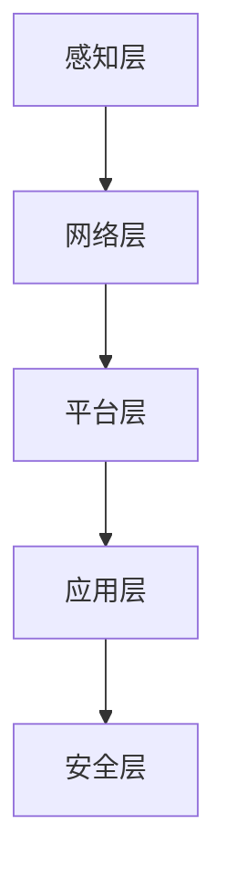
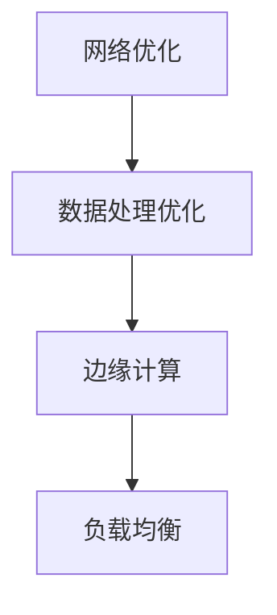
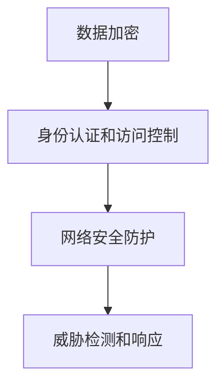

                 

### 概述背景

#### 1.1.1 5G与物联网的发展背景

5G技术的兴起，标志着移动通信技术进入了全新的时代。5G（第五代移动通信技术）相较于前几代，不仅在速度上有了巨大的提升，而且在低延迟、高可靠性和广覆盖方面也表现出色。随着5G网络的部署，为各行各业带来了前所未有的变革潜力，特别是在智慧城市建设中，5G技术成为了不可或缺的重要基础设施。

物联网（IoT）则是通过将各种物理设备、传感器、软件和网络连接起来，实现信息的实时采集、传输和处理。物联网的发展经历了多个阶段，从最初的简单连接到现在的智能化和复杂化，已经在智能家居、智能交通、智能医疗等多个领域得到了广泛应用。随着物联网设备的增多和连接的复杂性，对通信网络的要求也越来越高，5G技术的出现为物联网的发展提供了强有力的支持。

#### 1.1.2 智慧城市的需求与挑战

智慧城市是利用信息技术、物联网、人工智能等手段，将城市中的各种资源和服务进行整合，实现智能化管理和高效服务。智慧城市的需求主要来自于以下几个方面：

1. **资源优化**：通过物联网技术，可以实时收集城市中的各类数据，如交通流量、能耗情况等，从而优化资源配置，提高城市管理效率。
2. **服务提升**：利用人工智能技术，可以提供更加个性化和高效的服务，如智能交通管理、智能安防等，提升市民的生活质量。
3. **环境监控**：智慧城市需要对空气质量、水质等环境指标进行实时监控，以保障市民的健康和安全。

然而，智慧城市建设也面临着诸多挑战：

1. **技术复杂性**：智慧城市涉及到多种技术的融合和应用，包括5G、物联网、大数据、人工智能等，技术实现和整合的难度较大。
2. **数据安全**：智慧城市中收集和处理的大量数据，包括个人隐私数据，需要保证其安全性和隐私性。
3. **资金投入**：智慧城市的建设和维护需要大量的资金投入，特别是初期的基础设施建设，这对地方政府和企业的财力提出了较高要求。

#### 1.1.3 5G与物联网在智慧城市中的协同作用

5G和物联网在智慧城市中的协同作用主要体现在以下几个方面：

1. **网络速度与稳定性**：5G的高速度和低延迟特性，为物联网设备的数据传输和处理提供了坚实的基础，实现了实时监控和快速响应。
2. **海量连接**：5G网络的广覆盖和高密度接入能力，使得智慧城市中的各类设备能够无缝连接，形成一张庞大的物联网。
3. **智能化服务**：5G和物联网的结合，使得城市服务更加智能化，如通过AI算法优化交通流量，提高公共交通的运行效率。
4. **资源优化**：通过5G和物联网技术的协同，可以实现对城市各类资源的实时监控和优化配置，提高资源利用效率。

总的来说，5G和物联网的协同应用，不仅为智慧城市的建设提供了技术支持，也为城市管理和市民生活带来了巨大的变革。

### 关键词

- 5G
- 物联网
- 智慧城市
- 网络速度
- 数据连接
- 智能化服务
- 资源优化

### 摘要

本文旨在探讨5G与物联网在智慧城市中的协同应用。首先，我们回顾了5G和物联网的发展背景，以及智慧城市的需求与挑战。接着，分析了5G与物联网在智慧城市中的协同作用，包括网络速度与稳定性、海量连接、智能化服务和资源优化等方面。通过具体实例，展示了5G与物联网在智慧城市中实现协同应用的具体场景和效益。最后，我们对未来5G与物联网在智慧城市中的发展趋势和潜在应用领域进行了展望，为智慧城市的建设提供了有益的参考。

---

### 核心概念

在探讨5G与物联网在智慧城市中的协同应用之前，我们需要明确三个核心概念：5G、物联网和智慧城市。这些概念不仅是我们分析的基础，也是实现智慧城市不可或缺的技术元素。

#### 5G技术

5G（第五代移动通信技术）是当前移动通信领域的最新进展。它不仅仅是一个速度更快的网络，更是一个具有低延迟、高可靠性和广覆盖的综合性网络。5G技术的特点如下：

1. **高速率**：5G网络的理论峰值速率可以达到20Gbps，是4G网络的100倍以上。这意味着用户可以以更快的速度下载和上传数据。
2. **低延迟**：5G网络的延迟可以降低到1毫秒以下，这是4G网络的1/10。低延迟对于实时应用，如自动驾驶、远程医疗等至关重要。
3. **广覆盖**：5G采用了新的频段和通信技术，使得网络覆盖范围更广，特别是在高密度区域，如城市中心。

5G网络架构包括无线接入网、核心网和业务网。无线接入网负责连接用户设备和基站，核心网提供数据传输和处理服务，业务网则连接不同类型的业务平台。

#### 物联网

物联网（Internet of Things，IoT）是通过将各种物理设备、传感器、软件和网络连接起来，实现信息的实时采集、传输和处理的技术体系。物联网的核心概念包括：

1. **感知层**：包括各种传感器和执行器，用于采集环境数据和物理信号。
2. **网络层**：负责数据的传输，包括无线通信、有线通信等多种方式。
3. **平台层**：提供数据存储、处理和分析服务，将收集到的数据进行整合和分析，以提供智能决策支持。
4. **应用层**：包括各种应用场景，如智能家居、智能交通、智能医疗等。

物联网的关键技术包括传感器技术、通信协议（如WiFi、蓝牙、LoRa等）和数据处理技术。物联网设备需要具有低功耗、高可靠性和易于集成的特点。

#### 智慧城市

智慧城市是利用信息技术、物联网、人工智能等手段，实现城市管理和服务的智能化和高效化。智慧城市的核心要素包括：

1. **基础设施**：包括5G网络、物联网设备和云计算平台等。
2. **数据资源**：通过物联网和5G网络，实时收集城市中的各类数据，如交通流量、能耗、环境质量等。
3. **智能应用**：通过大数据分析和人工智能技术，提供智能化的城市管理和服务。
4. **安全保障**：确保数据安全和隐私保护，建立完善的安全体系和法律法规。

智慧城市的建设目标是实现城市资源的高效利用、提升市民生活质量、增强城市竞争力。

#### 关系分析

5G与物联网的关系体现在以下几个方面：

1. **网络支持**：5G技术为物联网提供了高速、低延迟的网络连接，使得大规模物联网设备的接入成为可能。
2. **数据传输**：5G的高带宽和低延迟特性，提高了物联网数据传输的效率和可靠性。
3. **应用协同**：5G与物联网的结合，使得智慧城市的各类应用可以实现无缝协同，提供更加智能化的服务。

智慧城市则是5G和物联网的应用场景，通过5G和物联网技术的协同，智慧城市可以实现资源优化、服务提升和环境监控等目标。

#### 5G与物联网的关联性

5G和物联网的协同作用体现在多个层面：

1. **网络层面**：5G提供了稳定、高速的通信网络，支持物联网设备的广泛接入和数据传输。
2. **技术层面**：5G和物联网技术的结合，实现了多种技术手段的融合，如网络切片、边缘计算等，为智慧城市的建设提供了技术支持。
3. **应用层面**：5G与物联网的协同，使得智慧城市的各类应用可以实现无缝对接，如智能交通管理、智能安防等。

#### 智慧城市中5G与物联网的应用实例

在智慧城市中，5G与物联网的应用实例非常多，以下是一些典型的应用场景：

1. **智能交通**：通过5G网络，实现交通信号灯的智能化管理，优化交通流量，减少拥堵。同时，通过物联网技术，实现对交通设施的实时监控和维护。
2. **智能安防**：利用5G网络，实现高清视频监控数据的实时传输和处理，提高安防监控的效率和准确性。物联网传感器可以实时监测环境变化，如烟雾、温度等，及时发现潜在的安全隐患。
3. **智能医疗**：通过5G网络，实现医疗设备的远程控制和数据传输，提高医疗服务效率和准确性。物联网传感器可以实时监测病人的生命体征，为医生提供更加精准的诊断和治疗建议。

#### 5G与物联网的协同效应

5G与物联网的协同应用，带来了以下几个显著的效益：

1. **提升效率**：通过5G网络的低延迟和高带宽特性，物联网设备可以实现实时数据传输和处理，大大提高了工作效率。
2. **优化资源配置**：通过物联网技术，可以实现对城市各类资源的实时监控和优化配置，如交通流量、能耗等，提高了资源利用效率。
3. **提升服务质量**：通过5G和物联网技术的协同，智慧城市的各类应用可以实现无缝对接，提供更加个性化和高效的服务，提升了市民的生活质量。

综上所述，5G与物联网在智慧城市中的协同应用，不仅为智慧城市的建设提供了技术支持，也为城市管理和市民生活带来了巨大的变革。通过深入理解和运用5G和物联网技术，我们可以打造更加智能、高效、安全的智慧城市。

### 关系分析

为了更好地理解5G与物联网在智慧城市中的协同作用，我们可以通过构建一个简单的ER实体关系图来展示它们之间的联系。ER图（Entity-Relationship Diagram）是数据库设计中常用的工具，用于表示实体之间的关联关系。

以下是5G、物联网和智慧城市在ER图中的关系表示：

```
[智慧城市] --<包含>--> [5G网络]
[智慧城市] --<包含>--> [物联网设备]
[5G网络] --<支持>--> [物联网设备]
[物联网设备] --<生成>--> [数据]
[数据] --<处理>--> [智慧城市应用]
```

1. **智慧城市**：作为总体架构，智慧城市包含了5G网络和物联网设备。它是所有相关实体和应用的综合体。
2. **5G网络**：作为基础设施，5G网络为物联网设备提供了高速、低延迟的通信连接。它是智慧城市中信息传递的核心。
3. **物联网设备**：作为感知层的关键，物联网设备负责采集和传输数据。这些设备广泛分布在城市的各个角落，是智慧城市的“眼睛”和“耳朵”。
4. **数据**：物联网设备采集的数据经过处理，成为智慧城市应用的基础。数据是智慧城市的“血液”，承载着城市管理的核心信息。
5. **智慧城市应用**：通过处理和分析数据，智慧城市应用为城市管理和服务提供智能化的解决方案。这些应用包括智能交通管理、智能安防、智能医疗等。

通过上述ER图，我们可以清晰地看到5G与物联网在智慧城市中的协同关系，它们共同构成了一个智能化、高效化、安全化的城市生态系统。

### 5G网络架构与技术原理

5G网络的架构和技术原理是理解其在智慧城市中应用的关键。5G不仅代表了更高的网络速度和更低的延迟，还引入了多项创新技术，使其在支持物联网设备和智能应用方面具有独特的优势。下面，我们将详细探讨5G网络架构及其关键技术。

#### 5G网络架构

5G网络架构可以分为三层：无线接入网、核心网和业务网。每一层都有特定的功能，共同构成了一个完整的5G生态系统。

1. **无线接入网（RAN）**：
   - **基站（gNB）**：5G基站被称为gNB（Generalized NodeB），它负责无线信号的接收和发送。gNB可以分为两种类型：gNodeB和gEN-DC（gNodeB in EN-DC）。
   - **无线接入技术**：5G采用了新的无线接入技术，包括NR（New Radio）和eMBB（Enhanced Mobile Broadband）。NR支持毫米波和Sub-6GHz频段，提供了更高的传输速率和更低的延迟。

2. **核心网（CN）**：
   - **5G核心网**：5G核心网采用了新的架构，称为服务化架构（Service-Based Architecture，SBA）。SBA通过微服务架构，将核心网功能拆分成多个独立的服务，实现了更高效和灵活的网络操作。
   - **用户面**：用户面负责数据传输，包括数据包的路由和转发。
   - **控制面**：控制面负责网络控制和业务管理，包括连接管理、资源分配等。

3. **业务网**：
   - **网络功能虚拟化（NFV）**：业务网通过网络功能虚拟化，将传统的硬件设备功能虚拟化为软件服务，实现了网络的灵活部署和管理。
   - **边缘计算（MEC）**：边缘计算将计算资源部署在网络的边缘，靠近数据源，以实现低延迟和高带宽的需求。

#### 5G关键技术

1. **5G NR无线技术**：
   - **频段**：5G NR支持毫米波（24GHz以上）和Sub-6GHz（低于6GHz）频段。毫米波频段提供了更高的带宽，但覆盖范围较小；Sub-6GHz频段则提供了更好的覆盖性能。
   - **多连接性**：5G NR通过多连接技术，实现了更高的数据传输速率。例如，4CC（4载波）可以实现高达4倍的传输速率。
   - **MIMO（多输入多输出）**：5G NR采用了先进的MIMO技术，通过多个天线实现更高的数据传输速率和更好的信号质量。

2. **5G网络切片技术**：
   - **定义**：网络切片是将一个物理网络划分为多个逻辑网络，每个逻辑网络具有独立的资源和服务能力。
   - **优势**：网络切片可以根据不同应用的需求，提供定制化的网络服务，如高带宽、低延迟、高可靠性等。
   - **应用场景**：网络切片在智慧城市中具有广泛的应用，如智能交通管理、智能制造、远程医疗等。

3. **5G毫米波技术**：
   - **优势**：毫米波频段提供了更高的带宽，可以实现更高速的数据传输。
   - **挑战**：毫米波信号的覆盖范围较小，容易受到障碍物的阻挡。
   - **应用**：毫米波技术主要应用于高带宽需求的场景，如超高清视频流、虚拟现实等。

#### 5G网络性能与优化

1. **网络性能指标**：
   - **速率**：5G网络的峰值速率可以达到20Gbps，是4G的10倍以上。
   - **延迟**：5G网络的端到端延迟可以降低到1毫秒以下。
   - **连接密度**：5G网络支持更高的连接密度，每平方米可以支持数十万个设备的连接。

2. **网络优化策略**：
   - **频谱资源管理**：通过动态频谱管理，优化频谱资源的分配和使用。
   - **多接入技术**：通过结合多种接入技术（如5G、Wi-Fi、卫星通信等），实现网络性能的优化。
   - **边缘计算**：通过将计算和存储资源部署在网络的边缘，降低延迟，提高网络性能。

3. **网络安全性**：
   - **端到端加密**：5G网络采用端到端加密技术，确保数据传输的安全性。
   - **身份验证和访问控制**：通过严格的身份验证和访问控制机制，确保网络资源的安全。
   - **威胁检测和响应**：通过实时监控和威胁检测机制，及时发现和应对网络安全威胁。

总之，5G网络架构和技术原理为智慧城市的建设提供了坚实的基础。通过深入理解和运用5G技术，我们可以实现更高效、更智能、更安全的智慧城市应用。

### 物联网架构与技术

物联网（IoT）架构和技术是实现智慧城市的关键组成部分。物联网通过将物理设备、传感器、软件和网络连接起来，实现信息的实时采集、传输和处理，从而为智慧城市提供了丰富的数据来源和智能化的解决方案。以下是物联网架构及其关键技术的详细解析。

#### 物联网架构

物联网架构通常分为四个层次：感知层、网络层、平台层和应用层。

1. **感知层**：
   - **传感器和执行器**：感知层由各种传感器和执行器组成，用于采集物理信号和环境数据。常见的传感器包括温度传感器、湿度传感器、光照传感器、加速度传感器等。
   - **数据采集**：传感器采集的数据包括温度、湿度、光照强度、位置信息等，这些数据为后续的数据处理和分析提供了基础。

2. **网络层**：
   - **通信方式**：网络层负责数据的传输，包括有线通信（如以太网、光纤等）和无线通信（如Wi-Fi、蓝牙、LoRa、NFC等）。无线通信技术具有灵活性高、成本低等优点，适用于大规模设备的连接。
   - **网关**：网关是连接感知层和平台层的桥梁，负责数据的接收、处理和转发。网关通常具有数据加密、协议转换等功能。

3. **平台层**：
   - **数据处理**：平台层负责对感知层传输的数据进行存储、处理和分析。数据处理技术包括数据清洗、数据整合、数据挖掘等，通过对大量数据的处理，可以提取出有价值的信息。
   - **云计算和边缘计算**：平台层可以利用云计算和边缘计算技术，实现数据的实时处理和分析。边缘计算将部分数据处理任务从云端转移到网络边缘，降低延迟，提高数据处理效率。

4. **应用层**：
   - **智能应用**：应用层是物联网架构的最高层，负责将处理后的数据应用于具体的场景中。智能应用包括智能家居、智能交通、智能医疗、智能农业等。
   - **用户体验**：应用层通过用户界面（UI）和用户体验（UX）设计，为用户提供便捷、智能的服务。例如，智能家居系统可以通过手机APP或语音助手实现设备的远程控制和场景设定。

#### 物联网关键技术

1. **传感器技术**：
   - **类型**：传感器是物联网的核心组件，常见的有温度传感器、湿度传感器、光照传感器、压力传感器等。
   - **特性**：传感器需要具备高精度、高灵敏度、低功耗等特点，以确保数据采集的准确性和设备的长期运行。

2. **通信协议**：
   - **Wi-Fi**：Wi-Fi是一种常见的无线通信协议，具有高带宽、广泛适用性等优点，适用于短距离高速数据传输。
   - **蓝牙**：蓝牙是一种低功耗、短距离的无线通信协议，适用于设备间的简单连接和数据传输。
   - **LoRa**：LoRa是一种低功耗广域网（LPWAN）技术，适用于长距离、低速率的数据传输，常用于智能家居和工业物联网。
   - **NFC**：NFC（近场通信）是一种短距离的高频无线通信技术，适用于手机支付、身份认证等场景。

3. **数据处理与存储**：
   - **数据处理**：数据处理技术包括数据清洗、数据整合、数据挖掘等。通过数据清洗，可以去除噪声和错误数据；数据整合可以合并来自多个传感器的数据；数据挖掘可以提取出有价值的信息，为智能应用提供支持。
   - **存储技术**：物联网设备需要具备数据存储功能，常见的存储技术包括闪存、SD卡、云存储等。云存储具有高容量、高可靠性等优点，适用于大数据量的存储和管理。

4. **安全性**：
   - **数据加密**：物联网设备需要实现数据加密，确保数据在传输过程中的安全性。
   - **身份认证**：物联网设备需要实现身份认证，确保只有授权设备可以访问网络和数据。
   - **网络安全**：物联网网络需要实现网络安全防护，防止恶意攻击和数据泄露。

#### 物联网应用场景

物联网技术在各个领域都有广泛的应用，以下是几个典型的应用场景：

1. **智能家居**：
   - **智能照明**：通过传感器和智能控制器，实现灯光的自动调节，提高能源利用效率。
   - **智能安防**：通过摄像头和传感器，实现家庭安全的实时监控和报警。
   - **智能家电**：通过物联网技术，实现家电设备的互联互通和远程控制。

2. **智能交通**：
   - **智能交通信号控制**：通过传感器和物联网技术，实现交通信号的智能调节，减少拥堵。
   - **智能停车场管理**：通过物联网技术，实现停车场的智能管理，提高车位利用率。

3. **智能医疗**：
   - **远程医疗**：通过物联网设备，实现病人的远程监控和医生的专业指导。
   - **智能诊断**：通过物联网技术和大数据分析，实现疾病的早期诊断和个性化治疗。

4. **智能农业**：
   - **环境监控**：通过物联网传感器，实时监控农田的土壤湿度、温度等环境参数，优化灌溉和施肥。
   - **智能种植**：通过物联网技术和大数据分析，实现农作物的精准种植和管理。

通过物联网技术的广泛应用，我们可以实现更加智能化、高效化的智慧城市，提升市民的生活质量和幸福感。

### 智慧城市中的5G与物联网协同应用

在智慧城市中，5G与物联网的协同应用不仅仅是一个技术组合，更是实现城市智能化管理和服务的核心驱动力。这种协同作用体现在多个层面，包括智能交通、智能安防和智能医疗等，下面我们将具体分析这些应用场景，并展示5G和物联网如何协同工作，提高城市管理的效率和居民的生活质量。

#### 5G与物联网在智能交通中的应用

智能交通是智慧城市的重要组成部分，通过5G和物联网技术的协同，可以实现交通流量管理、车辆监控和动态路线规划，从而提高交通效率和安全性。

1. **实时交通监控**：通过安装在道路上的传感器和摄像头，实时收集交通流量、车速和道路状况数据。5G网络的低延迟和高带宽特性，使得这些数据能够迅速传输到交通管理平台，实现实时监控和交通信号调节。

2. **车辆管理**：利用物联网技术，对城市中的出租车、公交车和共享单车等进行实时监控和管理。通过5G网络，车辆位置信息、行驶速度和运行状态可以实时传输到智能交通管理系统，便于调度和监控。

3. **动态路线规划**：基于实时交通数据和人工智能算法，5G和物联网技术可以提供个性化的路线规划服务。例如，当用户通过智能手机应用查询路线时，系统能够根据当前交通状况，为用户推荐最优路线，减少拥堵和行驶时间。

#### 5G与物联网在智能安防中的应用

智能安防是保障城市安全和居民生活安宁的重要手段，5G和物联网技术的结合，使安防系统更加高效、智能和安全。

1. **视频监控**：通过5G网络，高清视频监控信号可以实时传输到监控中心，实现远程监控和快速响应。物联网传感器可以与视频监控系统联动，当检测到异常情况时，自动触发报警并推送通知。

2. **人员识别**：物联网技术可以与面部识别、指纹识别等技术相结合，实现对人员的智能识别和跟踪。5G网络的低延迟特性，使得实时身份验证成为可能，有效提高安防系统的准确性和响应速度。

3. **智能预警**：通过大数据分析和人工智能算法，对监控视频和传感器数据进行实时分析，可以提前预警潜在的安全隐患。例如，当系统检测到大量人员聚集或异常行为时，可以及时通知相关部门进行干预。

#### 5G与物联网在智能医疗中的应用

智能医疗是智慧城市中提升居民健康水平和生活质量的重要领域，5G和物联网技术的协同应用，使医疗服务的效率和质量得到显著提升。

1. **远程医疗**：通过5G网络，医生可以通过远程视频和物联网设备，实时监测患者的健康状况，提供专业的医疗建议和诊断。物联网传感器可以实时传输患者的生理数据，如心率、血压等，帮助医生进行远程监控和诊断。

2. **智能监控**：对于慢性病患者，物联网传感器可以持续监测患者的生命体征，并将数据传输到云平台。5G网络的低延迟特性，确保了数据的实时性和准确性，有助于医生及时发现病情变化并采取相应措施。

3. **医疗资源共享**：通过物联网技术和5G网络，可以实现医疗资源的智能分配和共享。例如，当某个医院的床位或设备资源紧张时，系统可以自动将需求信息推送给附近的其他医院，实现资源的优化配置。

#### 5G与物联网的协同机制

5G与物联网在智慧城市中的协同机制，主要体现在以下几个方面：

1. **网络连接**：5G网络为物联网设备提供了高速、低延迟的网络连接，使得大规模物联网设备能够无缝接入，实现实时数据传输和处理。

2. **数据共享**：5G和物联网技术使得城市中的各类数据能够高效共享，为智能应用提供了丰富的数据支持。

3. **智能决策**：通过大数据分析和人工智能算法，对收集到的数据进行处理和分析，为城市管理和居民服务提供智能化的决策支持。

4. **安全保障**：5G和物联网技术共同保障了城市数据和系统的安全，通过数据加密、身份认证和网络安全防护等手段，确保数据的安全性和隐私性。

总之，5G与物联网在智慧城市中的协同应用，不仅提升了城市管理的效率和智能化水平，也为居民提供了更加便捷、高效和安全的公共服务。通过不断探索和深化5G与物联网技术的应用，我们可以建设更加智慧、可持续发展的城市。

### 5G与物联网在智慧城市中的系统集成与优化

在智慧城市建设中，5G与物联网技术的集成与优化是实现高效、智能化管理的关键。一个完善的系统集成框架和优化策略，不仅能够提高系统的性能和稳定性，还能确保数据的准确性和安全性。以下，我们将详细探讨5G与物联网在智慧城市中的系统集成框架、性能优化策略和安全性保障。

#### 系统集成框架

智慧城市中的系统集成框架通常包括以下几个核心模块：

1. **感知层**：感知层是系统的数据采集部分，包括各种传感器、摄像头、监测设备等。这些设备通过物联网技术实现数据的采集和传输。

2. **网络层**：网络层是数据传输的通道，主要依赖于5G网络。5G网络的高带宽、低延迟特性，使得大规模物联网设备的接入和实时数据传输成为可能。

3. **平台层**：平台层是数据处理和分析的核心，负责数据的存储、处理和分析。通过云计算和边缘计算技术，平台层可以实现实时数据处理和智能分析。

4. **应用层**：应用层是系统服务的最终体现，包括各种智慧城市应用，如智能交通管理、智能安防、智能医疗等。这些应用通过用户界面（UI）和用户体验（UX）设计，为用户提供便捷、智能的服务。

5. **安全层**：安全层贯穿于整个系统，负责数据的安全传输、存储和访问控制。通过加密、身份认证和网络安全防护等技术，确保系统的安全性。

以下是智慧城市系统集成框架的mermaid架构图：



#### 系统性能优化

系统性能优化是确保智慧城市系统稳定运行的关键。以下是几种常见的系统性能优化策略：

1. **网络优化**：
   - **频谱资源管理**：通过动态频谱管理，优化5G网络的频谱资源分配，提高网络带宽和利用率。
   - **多接入技术**：结合多种通信技术（如5G、Wi-Fi、LTE等），实现网络冗余和负载均衡，提高网络的稳定性和可靠性。

2. **数据处理优化**：
   - **数据压缩**：采用数据压缩技术，减少数据传输的带宽占用，提高传输效率。
   - **缓存机制**：通过缓存机制，减少对实时数据的频繁查询，提高数据处理速度。

3. **边缘计算**：
   - **本地处理**：通过边缘计算，将部分数据处理任务从云端转移到网络边缘，降低数据传输延迟，提高系统响应速度。
   - **分布式计算**：通过分布式计算技术，实现数据的并行处理，提高数据处理效率。

4. **负载均衡**：
   - **动态负载均衡**：根据系统负载情况，动态调整任务分配，避免单点过载，提高系统稳定性。
   - **服务优化**：通过优化系统的服务架构和算法，提高系统的吞吐量和响应速度。

以下是系统性能优化策略的mermaid架构图：



#### 系统安全性保障

智慧城市系统面临着大量的数据安全和隐私保护挑战，以下是一些常见的安全措施：

1. **数据加密**：
   - **传输加密**：采用TLS/SSL等加密协议，确保数据在传输过程中的安全性。
   - **存储加密**：对存储在数据库和云平台中的数据采用加密技术，防止数据泄露。

2. **身份认证和访问控制**：
   - **多因素认证**：采用多因素认证（MFA），提高用户身份验证的安全性。
   - **访问控制**：通过设置访问权限和角色管理，确保只有授权用户可以访问系统和数据。

3. **网络安全防护**：
   - **防火墙和入侵检测系统**：部署防火墙和入侵检测系统（IDS），实时监控网络流量，防止恶意攻击。
   - **安全审计**：定期进行安全审计，检查系统的安全漏洞和潜在威胁，及时进行修复。

4. **威胁检测和响应**：
   - **威胁检测**：通过大数据分析和机器学习算法，实时检测网络威胁和异常行为。
   - **应急响应**：建立应急响应机制，快速响应和处理安全事件，减少损失。

以下是系统安全性保障措施的mermaid架构图：



通过上述系统集成框架、性能优化策略和安全性保障措施，我们可以构建一个高效、稳定、安全的智慧城市系统，为城市管理和居民服务提供有力支持。

### 5G与物联网在智慧城市中的发展趋势与展望

随着5G和物联网技术的快速发展，智慧城市正迎来新的发展机遇和挑战。未来，5G与物联网将在智慧城市中发挥更加重要的作用，推动城市管理的智能化和高效化。以下是5G与物联网在智慧城市中的发展趋势、潜在应用领域以及未来发展策略。

#### 发展趋势

1. **网络速度与覆盖范围的提升**：
   - **更高网络速度**：随着5G技术的不断演进，网络速度将继续提升。未来的6G技术预计将实现更高的数据传输速率和更低的延迟，为智慧城市提供更强大的网络支持。
   - **更广覆盖范围**：5G网络的覆盖范围将逐渐扩大，特别是在城市中心和偏远地区。通过引入卫星通信和无人机网络，可以实现全球范围内的无缝连接。

2. **智能化与自动化水平的提升**：
   - **智能决策**：借助大数据分析和人工智能算法，智慧城市将实现更智能的决策支持系统。例如，通过实时分析交通流量数据，智能调整交通信号，减少拥堵。
   - **自动化管理**：自动化技术在智慧城市中的应用将更加广泛。例如，智能垃圾收集系统可以根据垃圾量自动调整收集频率，提高资源利用效率。

3. **边缘计算的普及**：
   - **分布式计算**：随着物联网设备的增加，边缘计算将发挥越来越重要的作用。通过在网络的边缘侧进行数据处理，可以减少数据传输延迟，提高系统响应速度。
   - **混合云架构**：未来，智慧城市将采用混合云架构，结合公有云和私有云的优势，实现资源的高效利用和数据的灵活处理。

4. **安全性和隐私保护的重要性提升**：
   - **数据安全**：随着数据量的增加，数据安全问题将变得更加突出。智慧城市将加强数据加密、访问控制和网络安全防护，确保数据的安全性和完整性。
   - **隐私保护**：在智慧城市建设中，个人隐私数据的保护将得到更多关注。通过采用隐私保护技术，如差分隐私和同态加密，可以保护用户的隐私信息。

#### 潜在应用领域

1. **智能交通**：
   - **自动驾驶**：5G和物联网技术将推动自动驾驶技术的发展。通过车联网（V2X）技术，实现车辆之间的实时通信和协同，提高交通安全性和效率。
   - **智能停车场管理**：利用物联网传感器和5G网络，实现停车场的智能管理，提高车位利用率。

2. **智能能源管理**：
   - **智能电网**：通过5G和物联网技术，实现电力系统的实时监测和管理，提高能源利用效率，减少能源浪费。
   - **智能建筑**：在智能建筑中，5G和物联网技术可以实现对空调、照明、安防等系统的智能控制，提高能源利用率。

3. **智能医疗**：
   - **远程医疗**：利用5G和物联网技术，实现医生与患者的远程医疗咨询和诊疗，提高医疗服务覆盖面和效率。
   - **智能健康监测**：通过可穿戴设备和物联网技术，实时监测患者健康数据，实现疾病的早期预防和诊断。

4. **智能环境监测**：
   - **空气质量监测**：利用物联网传感器和5G网络，实现实时监测空气质量，及时应对环境污染问题。
   - **水资源管理**：通过5G和物联网技术，实现对水资源的实时监控和管理，提高水资源利用效率。

5. **智能城市规划与管理**：
   - **城市数据平台**：通过5G和物联网技术，建立城市数据平台，集成各类城市数据，实现城市运行状态的实时监测和管理。
   - **智能公共服务**：利用5G和物联网技术，提供更加个性化和高效的公共服务，如智能交通导航、智能政务服务等。

#### 未来发展策略

1. **技术创新**：
   - **研发投入**：加大在5G、物联网、人工智能等关键技术领域的研发投入，推动技术创新和产业发展。
   - **标准制定**：积极参与国际标准的制定，推动全球智慧城市建设的技术规范和标准统一。

2. **政策支持**：
   - **政策扶持**：政府应加大对智慧城市建设的政策扶持力度，提供资金、土地、人才等支持。
   - **法规建设**：建立健全智慧城市建设的法律法规体系，确保数据安全和个人隐私保护。

3. **合作与协同**：
   - **政企合作**：政府与企业加强合作，共同推动智慧城市的建设和发展。
   - **跨领域合作**：鼓励不同领域的合作，如交通、能源、医疗等，实现技术的跨界融合和应用。

4. **人才培养**：
   - **教育培训**：加大对智慧城市相关人才的培养力度，提升人才的专业能力和综合素质。
   - **国际合作**：通过国际合作，引进国外先进的智慧城市建设经验和人才。

通过技术创新、政策支持、合作与协同以及人才培养等策略，我们可以加速智慧城市的发展，为城市管理和居民生活带来更多便利和福祉。

### 最佳实践与案例分析

在5G与物联网在智慧城市中的应用实践中，有许多成功的案例展示了这些技术的协同效应和实际效益。以下，我们将探讨几个典型的最佳实践案例，并总结成功的关键要素和经验。

#### 案例一：智慧交通管理系统

**案例背景**：某城市交通管理部门在智慧城市建设中引入了5G与物联网技术，构建了智能交通管理系统，旨在缓解交通拥堵，提高交通效率。

**技术实现**：
1. **传感器部署**：在城市主要交通节点安装高清摄像头、流量传感器和地磁传感器，实时采集交通流量数据。
2. **5G网络连接**：利用5G网络的高带宽和低延迟特性，实现传感器数据的实时传输。
3. **数据平台建设**：建立交通数据平台，通过云计算和边缘计算技术，对数据进行实时处理和分析。
4. **智能算法应用**：利用人工智能算法，对交通流量进行预测和优化，实时调整交通信号灯，提高道路通行效率。

**成功要素**：
- **高效的数据采集与传输**：5G网络提供了稳定、高速的通信连接，确保交通数据的实时性和准确性。
- **智能数据分析**：通过大数据分析和人工智能算法，实现了对交通流量的实时监控和优化。
- **协同工作机制**：交通管理部门、技术提供商和政府部门之间建立了紧密的协同机制，确保系统的高效运行。

**经验总结**：成功的智慧交通管理系统需要高效的数据采集与传输、智能的数据分析以及协同的工作机制。

#### 案例二：智能安防监控系统

**案例背景**：某城市公安局在智慧城市建设中引入了5G与物联网技术，构建了智能安防监控系统，以提高城市安全水平。

**技术实现**：
1. **高清摄像头部署**：在重要区域安装高清摄像头，利用5G网络实现视频信号的实时传输。
2. **物联网传感器**：部署物联网传感器，如人脸识别传感器、温度传感器等，实现实时数据采集。
3. **数据平台与AI分析**：建立安防数据平台，通过云计算和边缘计算技术，对采集的数据进行实时处理和分析。
4. **智能预警系统**：利用人工智能算法，对监控视频和传感器数据进行实时分析，实现智能预警。

**成功要素**：
- **高速数据传输**：5G网络提供了高效的数据传输通道，确保监控数据的实时性和准确性。
- **智能数据分析**：通过大数据分析和人工智能算法，实现了对监控数据的实时分析和智能预警。
- **跨部门协作**：公安局与相关部门建立了紧密的协作机制，确保安防系统的高效运行。

**经验总结**：智能安防监控系统需要高速数据传输、智能数据分析和跨部门协作，以提高安全预警和响应效率。

#### 案例三：智能医疗健康监测系统

**案例背景**：某医疗机构在智慧城市建设中引入了5G与物联网技术，构建了智能医疗健康监测系统，以实现患者健康数据的实时监控和远程诊疗。

**技术实现**：
1. **可穿戴设备**：为患者配备可穿戴设备，如智能手环、智能手表等，实时监测患者的心率、血压等健康数据。
2. **5G网络连接**：利用5G网络，实现健康数据的实时传输。
3. **医疗数据平台**：建立医疗数据平台，通过云计算技术，对健康数据进行分析和处理。
4. **远程诊疗系统**：通过远程诊疗系统，医生可以实时查看患者健康数据，提供远程诊断和治疗建议。

**成功要素**：
- **实时数据监测**：5G网络提供了高速、低延迟的连接，确保健康数据的实时监测和传输。
- **智能数据分析**：通过大数据分析和人工智能算法，实现了对健康数据的实时分析和智能诊断。
- **便捷的远程服务**：远程诊疗系统为患者提供了便捷的医疗服务，提高了医疗服务的覆盖面和效率。

**经验总结**：智能医疗健康监测系统需要实时数据监测、智能数据分析和便捷的远程服务，以提升医疗服务的质量和效率。

### 最佳实践总结与启示

从上述案例中，我们可以总结出以下几个最佳实践和启示：

1. **高效的数据采集与传输**：5G网络提供了高效、稳定的数据传输通道，是实现智慧城市应用的基础。通过利用5G技术，可以实现大规模物联网设备的实时数据采集和传输。

2. **智能数据分析与决策**：大数据分析和人工智能技术在智慧城市中的应用，使得数据的价值得以充分发挥。通过智能数据分析，可以实现对城市运行状态的实时监控和优化，提高管理效率和服务质量。

3. **协同工作机制**：智慧城市应用涉及到多个部门和领域的协同工作，需要建立有效的协同机制，确保各方高效合作，共同推进智慧城市建设。

4. **安全性保障**：在智慧城市建设中，数据安全和隐私保护至关重要。通过采用加密、身份认证和网络安全防护等技术，确保数据的安全性和隐私性。

总之，5G与物联网在智慧城市中的应用，不仅带来了技术上的变革，更为城市管理和居民生活带来了巨大的便利和提升。通过深入理解和运用5G与物联网技术，我们可以打造更加智能、高效、安全的智慧城市。

---

### 小结

通过本文的探讨，我们详细介绍了5G与物联网在智慧城市中的协同应用。5G技术以其高速率、低延迟和高可靠性，为物联网设备的连接和数据传输提供了坚实的基础。物联网则通过将各种物理设备、传感器和软件连接起来，实现了城市数据的实时采集和智能处理。二者结合，为智慧城市的建设提供了强有力的技术支撑。

在智慧城市中，5G与物联网的协同应用在智能交通、智能安防、智能医疗等多个领域展现出了巨大的潜力。通过高效的数据采集与传输、智能数据分析与决策、协同工作机制和安全性保障，智慧城市能够实现更加智能化、高效化和安全化的管理。

然而，智慧城市的建设仍面临诸多挑战，包括技术复杂性、数据安全和资金投入等。我们需要不断创新和优化技术，建立健全的政策和法规，加强跨部门的协作与沟通，共同推进智慧城市的建设。

展望未来，5G与物联网技术的发展将继续为智慧城市带来新的机遇。随着6G技术的兴起，网络速度和覆盖范围将进一步提升，智能应用和自动化水平也将不断提高。通过持续的技术创新和政策支持，我们有理由相信，智慧城市将迎来更加美好和繁荣的未来。

### 注意事项

在实施5G与物联网在智慧城市中的协同应用时，以下事项需要特别注意：

1. **数据隐私与安全**：确保个人隐私数据的安全，采用先进的加密技术和身份认证机制，防止数据泄露和未经授权的访问。
2. **网络稳定性与可靠性**：5G网络的高带宽和低延迟特性为物联网设备提供了良好的连接，但在复杂环境下，仍需确保网络的稳定性和可靠性，避免中断和服务质量下降。
3. **系统集成与兼容性**：智慧城市的系统集成为一个复杂的过程，需要确保不同系统和设备之间的兼容性和互操作性，避免因技术不兼容导致的问题。
4. **技术更新与升级**：5G和物联网技术快速发展，需要及时进行技术更新和升级，以适应新的需求和挑战。
5. **政策法规遵循**：在智慧城市建设中，应严格遵守相关政策和法规，确保项目的合法性和合规性。

### 拓展阅读

1. **5G与物联网技术标准**：了解国际标准组织和各大通信设备制造商制定的5G和物联网技术标准，有助于深入掌握相关技术细节。
2. **智慧城市最佳实践案例**：研究国内外智慧城市建设的成功案例，借鉴其经验和教训，以指导本地的智慧城市建设。
3. **边缘计算与云计算**：了解边缘计算和云计算在智慧城市中的应用，探讨如何实现分布式计算和资源的优化配置。
4. **智能数据分析与人工智能**：研究大数据分析和人工智能技术在智慧城市中的应用，探索如何通过智能分析提升城市管理和服务水平。

### 作者信息

**作者：**AI天才研究院/AI Genius Institute & 禅与计算机程序设计艺术 /Zen And The Art of Computer Programming

