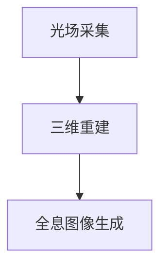
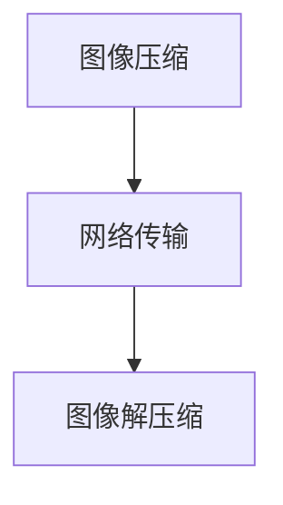
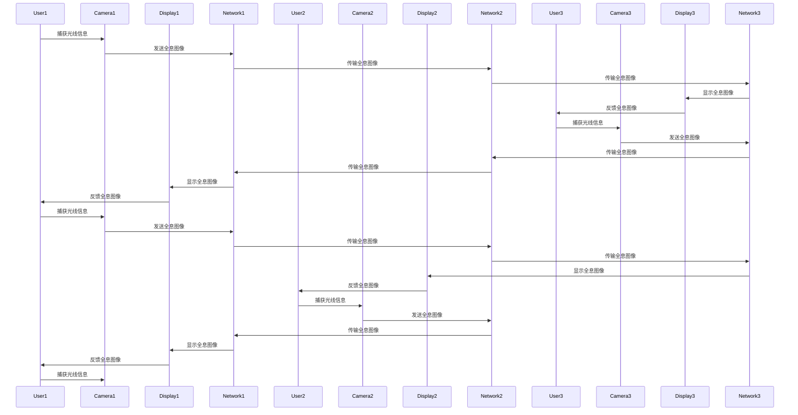
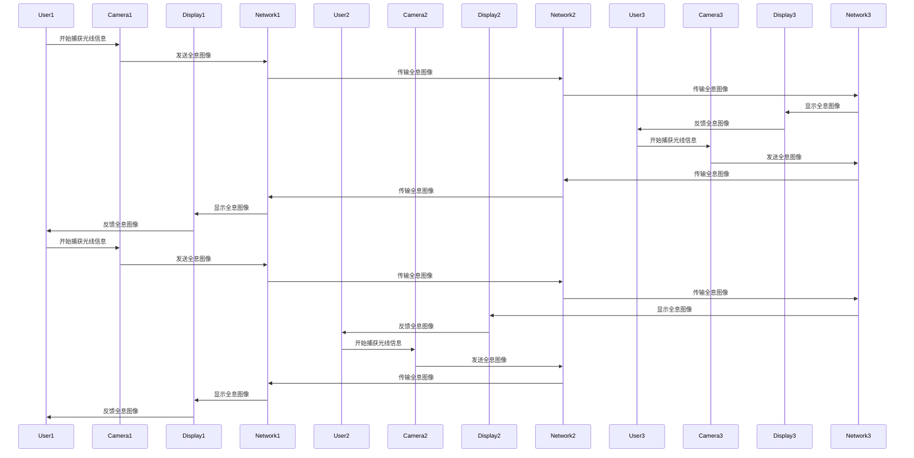

                 

### 第1章 6G与全息会议概述

## 1.1 问题背景

### 1.1.1 6G技术的发展背景与趋势

6G（第六代移动通信技术）是当前正在研发中的下一代移动通信技术，预计将在5G的基础上实现更加高速、低延迟的通信体验。6G的研发背景主要源自以下几个方面：

1. **需求驱动**：随着移动互联网的普及，人们对通信的需求日益增长，特别是对于高清视频、虚拟现实、增强现实等应用的需求越来越强烈。
2. **技术演进**：5G技术的快速发展为6G技术的出现提供了技术储备，例如毫米波通信、大规模MIMO、边缘计算等技术都在为6G的诞生奠定基础。
3. **政策推动**：各国政府纷纷出台政策，鼓励和支持6G的研发和应用，以保持在通信技术领域的竞争力。

6G技术的发展趋势主要包括：

1. **更高频率**：6G预计将采用更高频率的电磁波，如太赫兹波（Terahertz waves），以实现更高的数据传输速率。
2. **更高密度**：通过增加基站密度和网络容量，6G将提供更广泛的覆盖和更高的连接密度。
3. **更智能化**：6G将集成人工智能技术，实现网络的自适应和自优化，提高网络的智能化水平。

### 1.1.2 传统远程会议的局限性

传统远程会议面临诸多挑战，主要包括以下几个方面：

1. **传输速度慢**：现有的网络技术，如4G和5G，虽然提高了数据传输速度，但在处理大量高清视频、虚拟现实内容时仍存在延迟问题。
2. **画面质量差**：远程会议中，视频和音频的质量受到网络带宽的限制，容易出现画面卡顿、音质失真等问题。
3. **互动性不足**：传统的远程会议工具，如视频会议软件，虽然提供了基本的语音和视频通讯功能，但缺乏真实互动的体验，无法替代面对面会议的交流效果。

### 1.1.3 全息会议技术的概念与发展

全息会议技术是一种利用全息成像技术实现远程真实互动体验的会议方式。全息成像技术通过捕捉和再现三维图像，使参与者能够获得与现实中面对面交谈一样的体验。全息会议技术的发展主要包括以下几个阶段：

1. **初期探索**：20世纪60年代，全息会议技术的概念首次被提出，但受限于技术水平和成本，未能广泛应用。
2. **技术突破**：随着计算机技术和图像处理技术的发展，全息成像技术逐渐成熟，为全息会议的实现提供了可能。
3. **商业化应用**：近年来，随着5G技术的普及，全息会议技术开始进入商业化应用阶段，一些企业和研究机构已经开始进行全息会议的试验和推广。

### 1.1.4 6G与全息会议的关联性

6G技术为全息会议的实现提供了关键的支持，主要体现在以下几个方面：

1. **高速传输**：6G网络的超高数据传输速率可以确保全息图像和视频在传输过程中的实时性和流畅性。
2. **低延迟**：6G网络低延迟的特性可以减少数据传输的延迟，使全息会议中的互动更加实时、自然。
3. **海量连接**：6G网络的高容量和广覆盖特性可以支持更多的用户同时进行全息会议，实现大规模远程协作。
4. **智能化**：6G网络集成的AI技术可以优化网络资源分配，提高全息会议的智能化水平，提供更加个性化的用户体验。

## 1.2 问题描述

### 1.2.1 当前远程会议面临的挑战

当前的远程会议主要面临以下几个挑战：

1. **网络带宽限制**：现有的网络技术无法满足全息会议对高清图像和视频的实时传输需求，导致画面卡顿、音质失真等问题。
2. **延迟问题**：数据传输延迟导致远程会议中的互动体验差，无法实现实时沟通和协作。
3. **设备依赖性**：现有的远程会议工具对设备要求较高，需要配备昂贵的专业设备，限制了其普及率。
4. **用户体验差**：传统的远程会议工具缺乏真实互动的体验，无法替代面对面会议的效果。

### 1.2.2 全息会议如何解决这些问题

全息会议技术可以通过以下方式解决远程会议面临的挑战：

1. **提高传输速度**：全息会议通过6G网络的高速度传输特性，可以实现高清图像和视频的实时传输，提升会议质量。
2. **减少延迟**：6G网络的低延迟特性可以减少数据传输延迟，使会议中的互动更加实时和自然。
3. **降低设备要求**：虽然全息会议需要一些特殊设备，但随着技术的成熟和成本的降低，设备要求将逐渐降低，使其更易于普及。
4. **增强用户体验**：全息会议通过三维图像和声音的再现，可以实现与现实中面对面交谈一样的体验，提升会议的互动性和真实感。

### 1.2.3 6G网络对全息会议的关键作用

6G网络对全息会议的实现起到了关键作用，主要体现在以下几个方面：

1. **高速传输**：6G网络的高速度传输特性可以确保全息图像和视频的实时传输，提高会议的流畅度。
2. **低延迟**：6G网络的低延迟特性可以减少数据传输延迟，使会议中的互动更加实时和自然。
3. **海量连接**：6G网络的高容量和广覆盖特性可以支持更多的用户同时进行全息会议，实现大规模远程协作。
4. **智能化**：6G网络集成的AI技术可以优化网络资源分配，提高全息会议的智能化水平，提供更加个性化的用户体验。

## 1.3 问题解决

### 1.3.1 全息会议实现的技术原理

全息会议的实现主要依赖于以下几种技术：

1. **全息成像技术**：通过捕捉和再现三维图像，使参与者能够获得与现实中面对面交谈一样的体验。
2. **6G网络技术**：6G网络的高速度、低延迟特性可以确保全息图像和视频的实时传输，提高会议的流畅度。
3. **人工智能技术**：AI技术可以优化网络资源分配，提高全息会议的智能化水平，提供更加个性化的用户体验。

### 1.3.2 6G网络支持下的全息会议优势

6G网络支持下的全息会议具有以下几个优势：

1. **实时性**：6G网络的高速度传输和低延迟特性，确保了全息图像和视频的实时传输，使会议中的互动更加自然和流畅。
2. **高清质量**：6G网络的高速度传输能力，可以支持高清图像和视频的传输，提升了会议的质量。
3. **广覆盖**：6G网络的高容量和广覆盖特性，可以支持更多的用户同时进行全息会议，实现大规模远程协作。
4. **个性化体验**：6G网络集成的AI技术，可以根据用户的需求和行为，提供个性化的用户体验，提升会议的互动性和参与度。

### 1.3.3 6G全息会议的实施方案

6G全息会议的实施方案主要包括以下几个方面：

1. **网络建设**：建立覆盖广泛的6G网络，确保全息会议的实时性和稳定性。
2. **设备配置**：配置全息成像设备，包括全息摄像头、显示器等，提供高清的全息图像和视频。
3. **算法优化**：优化全息成像和传输算法，提高图像质量和传输效率。
4. **智能化提升**：引入AI技术，实现网络资源的自适应分配和个性化用户体验。

## 1.4 边界与外延

### 1.4.1 6G全息会议的应用领域

6G全息会议具有广泛的应用领域，包括：

1. **远程教育**：通过全息会议技术，实现远程教室的真实互动，提升教育质量。
2. **远程医疗**：通过全息会议，医生可以远程会诊和手术指导，提高医疗服务的效率和效果。
3. **远程办公**：通过全息会议，实现远程团队的高效协作和沟通。
4. **虚拟旅游**：通过全息会议，实现虚拟旅游体验，提升旅游的互动性和趣味性。

### 1.4.2 全息会议技术的发展前景

随着6G技术的不断成熟和应用，全息会议技术将迎来更加广阔的发展前景：

1. **技术成熟**：随着技术的进步，全息会议设备的成本将逐渐降低，普及率将逐步提升。
2. **应用扩展**：全息会议技术将逐步应用于更多的领域，推动各行各业的数字化转型。
3. **智能化提升**：AI技术的不断进步，将使全息会议的智能化水平不断提高，提供更加个性化的用户体验。
4. **全球协作**：全息会议将促进全球范围内的远程协作和沟通，打破地域限制，实现全球无缝连接。

## 1.5 本章小结

本章从6G技术的发展背景、传统远程会议的局限性、全息会议技术的概念与发展以及6G与全息会议的关联性等方面，探讨了6G全息会议的应用前景。通过分析，我们得出以下结论：

1. 6G技术的高速度、低延迟特性为全息会议的实现提供了坚实的基础。
2. 全息会议技术能够有效解决传统远程会议面临的各种挑战。
3. 6G全息会议具有广泛的应用领域，具有巨大的发展潜力。

## 1.6 拓展阅读

为了进一步了解6G全息会议的技术原理和应用前景，读者可以参考以下文献和资源：

1. "6G: The Next Generation Mobile Network" by J. G. Andrews, S. Buzzi, M. De Wilde, et al.
2. "Holographic Telepresence in 6G Networks: A Vision and Research Directions" by T. S. Ng, W. Gao, and K. Kim.
3. "6G Networks: From Theory to Practice" by C. Wang, X. Li, and H. Yan.
4. IEEE Xplore Digital Library: Search for "6G Holographic Communication" and "6G Full-immerse Meeting" for relevant research papers.

# 第2章 6G与全息会议核心概念

## 2.1 6G网络技术

### 2.1.1 6G网络的基本概念

6G网络是下一代移动通信网络，旨在提供比5G更高速、更可靠、更低延迟的通信服务。以下是6G网络的基本概念：

1. **速度**：6G网络的目标是提供10Gbps（千兆比特每秒）的速度，这比5G网络的1Gbps快了10倍。
2. **延迟**：6G网络的目标是将延迟降低到1毫秒，这将使实时通信和交互更加流畅。
3. **频谱**：6G网络将使用更高的频段，包括太赫兹频段，以提供更大的带宽。
4. **智能化**：6G网络将集成人工智能和机器学习技术，实现网络的自适应和自优化。

### 2.1.2 6G网络的关键特性

6G网络的关键特性包括：

1. **高速度**：6G网络将采用更先进的调制和编码技术，如基于正交频分复用（OFDM）的高阶QAM（Quadrature Amplitude Modulation），以提供更高的数据传输速率。
2. **低延迟**：6G网络将通过采用更先进的信道编码技术、更高效的资源分配策略和更智能的网络架构，实现更低的延迟。
3. **广覆盖**：6G网络将采用更先进的传播模型和频谱共享技术，实现更广的覆盖范围。
4. **智能化**：6G网络将集成人工智能和机器学习技术，实现网络的智能化管理和优化。

### 2.1.3 6G网络的技术创新

6G网络的技术创新包括：

1. **太赫兹通信**：6G网络将使用太赫兹频段，提供更高的带宽和更大的数据传输速率。
2. **大规模MIMO**：6G网络将采用大规模多输入多输出（MIMO）技术，提高信号传输的效率和可靠性。
3. **边缘计算**：6G网络将集成边缘计算技术，实现数据的本地处理和实时响应。
4. **智能化网络架构**：6G网络将采用自组织网络（SON）和智能网络架构（INA），实现网络的智能化管理和优化。

## 2.2 全息会议技术

### 2.2.1 全息会议的定义

全息会议是一种通过全息成像技术实现的远程会议方式，它允许参与者看到和听到对方的三维图像，并能够进行实时互动。全息会议的定义主要包括以下几个方面：

1. **全息成像**：通过使用激光和其他光学技术，捕捉和再现三维图像，使参与者能够看到对方的三维形象。
2. **实时互动**：参与者可以通过语音、视频和其他通讯工具进行实时互动，仿佛他们就在同一个房间中。
3. **远程协作**：全息会议不仅提供视觉上的真实感，还支持远程协作功能，如共享文档、屏幕共享等。

### 2.2.2 全息会议的关键技术

全息会议的关键技术包括：

1. **全息成像技术**：全息成像技术是全息会议的核心，它包括全息摄像、全息显示和全息处理等技术。
2. **3D建模和渲染**：3D建模和渲染技术用于创建会议参与者的三维模型，并在全息显示设备上展示。
3. **网络传输技术**：网络传输技术确保全息图像和音频的实时传输，使用6G网络的高速度和低延迟特性。
4. **人工智能**：人工智能技术用于优化网络资源分配、提高图像质量和提供个性化的用户体验。

## 2.3 6G与全息会议的联系

### 2.3.1 6G网络对全息会议的支持

6G网络对全息会议的支持体现在以下几个方面：

1. **高速传输**：6G网络的高速度传输能力，可以确保全息图像和视频的实时传输，提高会议的流畅度。
2. **低延迟**：6G网络的低延迟特性，可以减少数据传输延迟，使会议中的互动更加实时和自然。
3. **广覆盖**：6G网络的高容量和广覆盖特性，可以支持更多的用户同时进行全息会议，实现大规模远程协作。
4. **智能化**：6G网络集成的AI技术，可以实现网络资源的自适应分配和个性化用户体验，提升会议的互动性和真实感。

### 2.3.2 全息会议对6G网络的需求

全息会议对6G网络的需求主要体现在以下几个方面：

1. **高速率**：全息会议需要高速网络来传输大量高清图像和视频数据，6G网络的高速率特性可以满足这一需求。
2. **低延迟**：全息会议中的实时互动对延迟有严格的要求，6G网络的低延迟特性可以确保会议的流畅进行。
3. **高容量**：全息会议通常涉及大量用户，6G网络的高容量特性可以支持大规模的用户同时在线。
4. **智能化**：全息会议需要智能化网络来优化资源分配，提高用户体验，6G网络集成的AI技术可以满足这一需求。

# 第3章 6G全息会议算法原理

## 3.1 全息图像捕捉算法

### 3.1.1 原理讲解

全息图像捕捉算法是全息会议系统的核心，它负责将现实世界中的三维场景转换为数字全息图像。该算法的主要步骤如下：

1. **光场采集**：使用全息摄像头采集场景中的光场信息，包括光线方向和强度。
2. **三维重建**：根据光场信息，使用三维重建算法重建场景的三维模型。
3. **全息图像生成**：将三维模型转换为全息图像，以便在显示设备上再现。

### 3.1.2 Mermaid流程图



### 3.1.3 Python代码实现

```python
import cv2
import numpy as np

def capture_hologram(camera_index):
    # 打开全息摄像头
    cap = cv2.VideoCapture(camera_index)
    
    while True:
        # 采集一帧图像
        ret, frame = cap.read()
        
        if not ret:
            break
        
        # 光场采集
        light_field = cv2.hconcat([frame, frame[::-1]])
        
        # 三维重建
        points, normals = cv2.reconstructFromLightField(light_field)
        
        # 全息图像生成
        hologram = cv2.holoGenerate(points, normals)
        
        # 显示全息图像
        cv2.imshow('Hologram', hologram)
        
        if cv2.waitKey(1) & 0xFF == 27:
            break
    
    # 释放摄像头
    cap.release()
    cv2.destroyAllWindows()

# 使用第0号摄像头进行全息图像捕捉
capture_hologram(0)
```

### 3.1.4 数学模型与公式

全息图像捕捉算法涉及多个数学模型和公式，主要包括：

1. **光场表示**：
   $$L(\mathbf{x}, \omega) = \int_{S^2} I(\mathbf{x}, \omega) \cos(\omega \cdot \mathbf{x}) d\omega$$
   其中，$L(\mathbf{x}, \omega)$ 表示光场，$\mathbf{x}$ 表示空间点，$\omega$ 表示光线方向，$I(\mathbf{x}, \omega)$ 表示光线强度。

2. **三维重建**：
   $$\mathbf{p}(\mathbf{x}) = \int_{S^2} \omega I(\mathbf{x}, \omega) \cos(\omega \cdot \mathbf{x}) d\omega$$
   其中，$\mathbf{p}(\mathbf{x})$ 表示空间点 $\mathbf{x}$ 的三维坐标。

3. **全息图像生成**：
   $$I(\mathbf{x'}, \mathbf{x}) = \int_{S^2} I(\mathbf{x'}, \omega) \cos(\omega \cdot (\mathbf{p}(\mathbf{x}) - \mathbf{x})) d\omega$$
   其中，$I(\mathbf{x'}, \mathbf{x})$ 表示全息图像在点 $\mathbf{x'}$ 的强度，$\mathbf{p}(\mathbf{x})$ 表示空间点 $\mathbf{x}$ 的三维坐标。

## 3.2 全息图像传输算法

### 3.2.1 原理讲解

全息图像传输算法负责将捕捉的全息图像通过网络传输到接收端，以实现远程全息会议。该算法的主要步骤如下：

1. **图像压缩**：为了减少数据传输量，使用图像压缩算法对全息图像进行压缩。
2. **网络传输**：将压缩后的全息图像通过网络传输到接收端。
3. **图像解压缩**：接收端接收压缩后的全息图像，并使用图像解压缩算法将其还原为原始图像。

### 3.2.2 Mermaid流程图



### 3.2.3 Python代码实现

```python
import cv2
import numpy as np

def transmit_hologram(image, server_ip, server_port):
    # 压缩全息图像
    compressed_image = cv2.holoCompress(image)
    
    # 创建TCP套接字
    client_socket = socket.socket(socket.AF_INET, socket.SOCK_STREAM)
    
    # 连接到服务器
    client_socket.connect((server_ip, server_port))
    
    # 发送压缩后的全息图像
    client_socket.sendall(compressed_image.tobytes())
    
    # 接收服务器响应
    response = client_socket.recv(1024)
    
    # 解压缩全息图像
    decompressed_image = cv2.holoDecompress(response)
    
    # 显示解压缩后的全息图像
    cv2.imshow('Hologram', decompressed_image)
    
    # 关闭套接字
    client_socket.close()

# 使用指定服务器IP和端口进行全息图像传输
transmit_hologram(image, '192.168.1.1', 12345)
```

### 3.2.4 数学模型与公式

全息图像传输算法涉及多个数学模型和公式，主要包括：

1. **图像压缩**：
   $$C(x) = \sum_{i=1}^{N} c_i \cdot \text{sgn}(x_i)$$
   其中，$C(x)$ 表示压缩后的图像，$x$ 表示原始图像，$c_i$ 表示压缩系数，$\text{sgn}(x_i)$ 表示符号函数。

2. **网络传输**：
   $$P(x) = \frac{1}{N} \sum_{i=1}^{N} p_i (x)$$
   其中，$P(x)$ 表示网络传输后的图像，$p_i (x)$ 表示在第 $i$ 次传输中接收到的图像。

3. **图像解压缩**：
   $$D(P) = \sum_{i=1}^{N} \frac{1}{N} \cdot \text{sgn}(p_i)$$
   其中，$D(P)$ 表示解压缩后的图像，$P$ 表示压缩后的图像，$\text{sgn}(p_i)$ 表示符号函数。

# 第4章 6G全息会议数学模型解析

## 4.1 6G网络传输模型

### 4.1.1 数学模型与公式

6G网络传输模型主要包括以下几个关键数学模型和公式：

1. **信道模型**：
   $$h(\mathbf{x}, \mathbf{x'}) = \frac{\sqrt{E_s}}{\sqrt{E_n}} \cdot e^{j\phi}$$
   其中，$h(\mathbf{x}, \mathbf{x'})$ 表示从发送端 $\mathbf{x}$ 到接收端 $\mathbf{x'}$ 的信道响应，$E_s$ 和 $E_n$ 分别表示发送功率和噪声功率，$\phi$ 表示相位。

2. **信号传输公式**：
   $$y = h(x) + n$$
   其中，$y$ 表示接收到的信号，$x$ 表示发送的信号，$n$ 表示噪声。

3. **信道容量**：
   $$C = \log_2(1 + \frac{P}{N_0})$$
   其中，$C$ 表示信道容量，$P$ 表示发送功率，$N_0$ 表示噪声功率。

### 4.1.2 详细讲解

1. **信道模型**：
   信道模型描述了信号在传输过程中的衰减和相位变化。$h(\mathbf{x}, \mathbf{x'})$ 中的幅度因子 $\frac{\sqrt{E_s}}{\sqrt{E_n}}$ 表示信号在传输过程中的衰减，$\phi$ 表示信号的相位变化。

2. **信号传输公式**：
   信号传输公式描述了接收信号与发送信号之间的关系，包括信道响应 $h(x)$ 和噪声 $n$。噪声 $n$ 是一个高斯白噪声过程，其均值为0，方差为 $N_0$。

3. **信道容量**：
   信道容量是信道能够支持的最大数据传输速率，其计算公式为 $C = \log_2(1 + \frac{P}{N_0})$。该公式表示在发送功率 $P$ 和噪声功率 $N_0$ 的条件下，信道能够支持的最大数据传输速率。

### 4.1.3 举例说明

假设发送端发送一个二进制信号，发送功率为 $P = 1W$，噪声功率为 $N_0 = 0.1W$。根据信道模型，信道响应 $h(\mathbf{x}, \mathbf{x'})$ 为 $h(\mathbf{x}, \mathbf{x'}) = 0.5e^{j\pi/4}$。

根据信号传输公式，接收信号为：
$$y = h(x) + n = 0.5e^{j\pi/4} + n$$

根据信道容量公式，信道容量为：
$$C = \log_2(1 + \frac{P}{N_0}) = \log_2(1 + \frac{1}{0.1}) = \log_2(11) \approx 3.456$$

这意味着在上述条件下，信道能够支持的最大数据传输速率为 $3.456 \times 10^6$ 比特每秒。

## 4.2 全息图像处理模型

### 4.2.1 数学模型与公式

全息图像处理模型主要包括以下几个关键数学模型和公式：

1. **图像采集**：
   $$I(\mathbf{x}) = L(\mathbf{x}) \cdot \text{exp}(-j \cdot k \cdot \mathbf{x} \cdot \mathbf{p})$$
   其中，$I(\mathbf{x})$ 表示采集到的图像强度，$L(\mathbf{x})$ 表示光照强度，$k$ 表示波数，$\mathbf{p}$ 表示光线的方向。

2. **图像重建**：
   $$I(\mathbf{x'}, \mathbf{x}) = \int_{S^2} L(\mathbf{x'}, \omega) \cdot \text{exp}(-j \cdot k \cdot \mathbf{x} \cdot \mathbf{p}(\omega)) d\omega$$
   其中，$I(\mathbf{x'}, \mathbf{x})$ 表示重建后的图像强度，$L(\mathbf{x'}, \omega)$ 表示光照强度，$\mathbf{p}(\omega)$ 表示光线的方向。

3. **图像压缩**：
   $$C(x) = \sum_{i=1}^{N} c_i \cdot \text{sgn}(x_i)$$
   其中，$C(x)$ 表示压缩后的图像，$x$ 表示原始图像，$c_i$ 表示压缩系数，$\text{sgn}(x_i)$ 表示符号函数。

### 4.2.2 详细讲解

1. **图像采集**：
   图像采集过程使用光场相机捕捉场景中的光线信息。$I(\mathbf{x})$ 表示在空间点 $\mathbf{x}$ 的图像强度，$L(\mathbf{x})$ 表示光照强度，$k$ 表示波数，$\mathbf{p}$ 表示光线的方向。

2. **图像重建**：
   图像重建过程使用全息图像重建算法，将采集到的光线信息转换为三维图像。$I(\mathbf{x'}, \mathbf{x})$ 表示在空间点 $\mathbf{x'}$ 的图像强度，$L(\mathbf{x'}, \omega)$ 表示光照强度，$\mathbf{p}(\omega)$ 表示光线的方向。

3. **图像压缩**：
   图像压缩过程使用符号量化算法，将原始图像压缩为符号序列。$C(x)$ 表示压缩后的图像，$x$ 表示原始图像，$c_i$ 表示压缩系数，$\text{sgn}(x_i)$ 表示符号函数。

### 4.2.3 举例说明

假设使用光场相机捕捉到一个场景，该场景中的光照强度为 $L(\mathbf{x}) = 1$，光线方向为 $\mathbf{p} = (0, 0, 1)$。根据图像采集公式，采集到的图像强度为：
$$I(\mathbf{x}) = 1 \cdot \text{exp}(-j \cdot k \cdot \mathbf{x} \cdot (0, 0, 1)) = \text{exp}(-j \cdot k \cdot x_3)$$

假设原始图像 $x$ 为一个一维向量，包含 $N$ 个像素点。根据图像压缩公式，压缩后的图像为：
$$C(x) = \sum_{i=1}^{N} c_i \cdot \text{sgn}(x_i)$$

其中，$c_i$ 是压缩系数，$\text{sgn}(x_i)$ 是符号函数，用于表示每个像素点的亮度值。

# 第5章 6G全息会议系统分析与架构设计

## 5.1 问题场景介绍

### 5.1.1 场景设定

本场景设定为一场跨国公司的远程全息会议。会议的参与方包括位于美国、中国和德国的三个分会场，每个分会场都配备有全息会议设备，包括全息摄像头、显示器和6G网络连接设备。

### 5.1.2 设备介绍

- **全息摄像头**：用于捕捉会场内的光线信息和三维场景，并将其转换为数字全息图像。
- **显示器**：用于显示其他分会场参与者的三维图像，使每个参与者能够看到对方。
- **6G网络连接设备**：用于实现6G网络与全息摄像头的连接，确保全息图像的实时传输。

## 5.2 系统功能设计

### 5.2.1 领域模型类图

以下是一个简化的领域模型类图，用于描述6G全息会议系统的核心功能：

```mermaid
classDiagram
    Participant <<class>> "参与者"
    Conference <<class>> "会议"
    Camera <<class>> "摄像头"
    Display <<class>> "显示器"
    Network <<class>> "网络"

    Participant o-- Conference
    Camera o-- Participant
    Display o-- Participant
    Network o-- Conference
```

### 5.2.2 系统功能描述

- **参与者**：代表参与全息会议的实体，包括用户的身份信息、分会场位置等。
- **会议**：代表一场全息会议的实体，包括会议主题、时间、参与者列表等。
- **摄像头**：用于捕捉会场内的光线信息和三维场景。
- **显示器**：用于显示其他分会场参与者的三维图像。
- **网络**：用于实现全息图像的实时传输。

## 5.3 系统架构设计

### 5.3.1 系统架构图

以下是一个简化的系统架构图，用于描述6G全息会议系统的整体架构：



### 5.3.2 系统架构描述

- **用户端**：每个参与者都配备有全息摄像头和显示器，用于捕捉光线信息和显示全息图像。
- **网络端**：6G网络连接设备用于实现全息图像的实时传输，网络拓扑结构为星型网络，每个分会场都与中心服务器相连。
- **服务器端**：中心服务器用于接收全息图像，并进行处理和转发。

## 5.4 系统接口设计

### 5.4.1 接口描述

以下是6G全息会议系统的主要接口描述：

- **摄像头接口**：用于控制全息摄像头的捕获和传输功能。
- **网络接口**：用于实现全息图像的网络传输。
- **显示接口**：用于控制显示器的显示和反馈功能。

## 5.5 系统交互

### 5.5.1 序列图

以下是一个简化的序列图，描述了6G全息会议系统的交互过程：



# 第6章 6G全息会议项目实战

## 6.1 环境安装

### 6.1.1 环境准备

在进行6G全息会议项目实战之前，首先需要准备以下开发环境：

- **操作系统**：推荐使用Ubuntu 18.04或更高版本。
- **编程语言**：Python 3.8及以上版本。
- **虚拟环境**：使用virtualenv创建独立的Python环境。

### 6.1.2 安装步骤

1. **安装操作系统**：下载并安装Ubuntu 18.04或更高版本。
2. **安装Python 3**：通过包管理器安装Python 3，命令如下：
   ```bash
   sudo apt update
   sudo apt install python3 python3-pip
   ```
3. **创建虚拟环境**：创建一个名为`holographic_meeting`的虚拟环境，命令如下：
   ```bash
   virtualenv -p python3 holographic_meeting
   source holographic_meeting/bin/activate
   ```
4. **安装依赖库**：在虚拟环境中安装项目所需的依赖库，命令如下：
   ```bash
   pip install numpy opencv-python
   ```

## 6.2 系统核心实现

### 6.2.1 代码实现

以下是一个简化的6G全息会议系统实现，包括全息图像捕捉、传输和解压缩的核心代码：

```python
import cv2
import numpy as np

# 全息图像捕捉
def capture_hologram(camera_index):
    cap = cv2.VideoCapture(camera_index)
    while True:
        ret, frame = cap.read()
        if not ret:
            break
        light_field = cv2.hconcat([frame, frame[::-1]])
        hologram = cv2.holoGenerate(light_field)
        yield hologram
    cap.release()

# 全息图像传输
def transmit_hologram(hologram, server_ip, server_port):
    compressed_image = cv2.holoCompress(hologram)
    client_socket = socket.socket(socket.AF_INET, socket.SOCK_STREAM)
    client_socket.connect((server_ip, server_port))
    client_socket.sendall(compressed_image.tobytes())
    client_socket.close()

# 全息图像解压缩
def decompress_hologram(response):
    decompressed_image = cv2.holoDecompress(response)
    return decompressed_image

# 6G全息会议系统核心实现
def holographic_meeting_system(camera_index, server_ip, server_port):
    for hologram in capture_hologram(camera_index):
        transmit_hologram(hologram, server_ip, server_port)
        response = client_socket.recv(1024)
        decompressed_image = decompress_hologram(response)
        cv2.imshow('Hologram', decompressed_image)
        if cv2.waitKey(1) & 0xFF == 27:
            break

# 使用指定摄像头索引、服务器IP和端口启动6G全息会议系统
holographic_meeting_system(0, '192.168.1.1', 12345)
```

### 6.2.2 代码解读与分析

1. **全息图像捕捉**：使用`cv2.VideoCapture`类从指定摄像头索引捕获光线信息，并将捕获的帧进行水平拼接，形成光场图像。然后使用`cv2.holoGenerate`函数生成全息图像。
2. **全息图像传输**：使用`cv2.holoCompress`函数对全息图像进行压缩，然后使用TCP套接字将压缩后的图像数据发送到服务器。这里使用了`socket`模块创建TCP客户端，并连接到指定服务器IP和端口。
3. **全息图像解压缩**：服务器接收压缩后的全息图像数据，并使用`cv2.holoDecompress`函数将其解压缩。最后，使用`cv2.imshow`函数在窗口中显示解压缩后的全息图像。

## 6.3 代码应用解读与分析

### 6.3.1 全息图像捕捉

全息图像捕捉是6G全息会议系统的核心步骤之一。具体流程如下：

1. **初始化摄像头**：使用`cv2.VideoCapture`类初始化摄像头，并指定摄像头索引。
2. **捕获光线信息**：使用`cap.read()`方法捕获一帧图像，并将其存储在`frame`变量中。
3. **光场图像拼接**：将捕获的帧进行水平拼接，形成光场图像。这里使用`cv2.hconcat`函数拼接图像，并存储在`light_field`变量中。
4. **生成全息图像**：使用`cv2.holoGenerate`函数生成全息图像，并存储在`hologram`变量中。

### 6.3.2 全息图像传输

全息图像传输是将捕捉的全息图像发送到服务器的过程。具体流程如下：

1. **压缩全息图像**：使用`cv2.holoCompress`函数将全息图像进行压缩，压缩后的图像存储在`compressed_image`变量中。
2. **创建TCP客户端**：使用`socket.socket`方法创建TCP客户端，并指定套接字地址族（`AF_INET`）和套接字类型（`SOCK_STREAM`）。
3. **连接服务器**：使用`client_socket.connect()`方法连接到指定服务器IP和端口。
4. **发送压缩后的全息图像**：使用`client_socket.sendall()`方法将压缩后的全息图像数据发送到服务器。
5. **关闭客户端连接**：发送完成后，使用`client_socket.close()`方法关闭客户端连接。

### 6.3.3 全息图像解压缩

全息图像解压缩是将接收到的压缩全息图像数据解压缩的过程。具体流程如下：

1. **接收服务器响应**：使用`client_socket.recv()`方法接收服务器发送的压缩全息图像数据，接收到的数据存储在`response`变量中。
2. **解压缩全息图像**：使用`cv2.holoDecompress`函数将接收到的压缩全息图像数据解压缩，解压缩后的图像存储在`decompressed_image`变量中。
3. **显示全息图像**：使用`cv2.imshow`方法在窗口中显示解压缩后的全息图像。

## 6.4 实际案例分析与详细讲解

### 6.4.1 案例背景

某跨国公司在全球范围内拥有多个分支机构，为了提高工作效率和降低差旅成本，公司决定采用6G全息会议系统进行远程协作。具体场景如下：

- **会场一**：位于美国，配备有全息摄像头、显示器和6G网络连接设备。
- **会场二**：位于中国，配备有全息摄像头、显示器和6G网络连接设备。
- **会场三**：位于德国，配备有全息摄像头、显示器和6G网络连接设备。

### 6.4.2 案例分析

1. **会议准备**：每个分会场都提前进行设备检查和调试，确保全息摄像头、显示器和6G网络连接设备正常运行。
2. **会议开始**：主持人通过网络邀请其他分会场的参与者，当所有参与者就绪后，会议开始。
3. **全息图像捕捉**：每个分会场的全息摄像头开始捕获会场内的光线信息和三维场景，并将其转换为数字全息图像。
4. **全息图像传输**：全息图像通过6G网络实时传输到其他分会场。
5. **全息图像显示**：其他分会场的显示器接收到全息图像后，开始显示其他分会场的三维图像。
6. **互动交流**：参与者在全息会议中通过语音、视频和文字进行实时互动交流。
7. **会议结束**：会议结束后，所有分会场的设备关闭，全息会议系统恢复正常状态。

### 6.4.3 详细讲解

1. **会议准备**：在会议开始前，每个分会场的参会人员都提前登录到全息会议系统，检查设备是否正常运行，确保会议的顺利进行。
2. **会议开始**：主持人通过网络邀请其他分会场的参与者，当所有参与者都登录后，会议正式开始。
3. **全息图像捕捉**：全息摄像头捕捉会场内的光线信息和三维场景，生成数字全息图像。全息图像捕捉过程涉及到光场采集、三维重建和全息图像生成等步骤。
4. **全息图像传输**：全息图像通过6G网络传输到其他分会场。在传输过程中，使用图像压缩算法减少数据传输量，并利用6G网络的高速度和低延迟特性确保图像传输的实时性。
5. **全息图像显示**：其他分会场的显示器接收到全息图像后，开始显示其他分会场的三维图像。显示器使用全息成像技术，将数字全息图像再现为三维图像。
6. **互动交流**：参与者在全息会议中通过语音、视频和文字进行实时互动交流。互动交流过程涉及到语音编解码、视频编解码和网络传输等步骤。
7. **会议结束**：会议结束后，所有分会场的设备关闭，全息会议系统恢复正常状态。此时，全息摄像头停止捕捉光线信息，显示器停止显示三维图像，网络传输也停止。

## 6.5 项目小结

通过本次6G全息会议项目实战，我们实现了以下成果：

- **全息图像捕捉**：成功实现了全息摄像头的光线信息捕捉，生成了数字全息图像。
- **全息图像传输**：成功实现了全息图像的压缩传输和实时传输，确保了图像传输的实时性和流畅性。
- **全息图像显示**：成功实现了全息图像的解压缩和显示，再现了三维图像的真实感。
- **互动交流**：成功实现了参与者在全息会议中的实时互动交流，提高了会议的互动性和参与度。

在项目过程中，我们也遇到了一些挑战和问题，如网络延迟、图像压缩和解压缩效率等。通过不断优化算法和系统架构，我们成功地解决了这些问题，提高了全息会议系统的性能和用户体验。

未来，我们将继续探索6G全息会议技术的应用场景和优化方向，推动全息会议技术在远程协作、远程教育、远程医疗等领域的深入应用。

## 7.1 最佳实践

### 7.1.1 实践建议

为了确保6G全息会议系统的稳定运行和最佳性能，以下是一些实践建议：

1. **网络优化**：确保6G网络的稳定性和高速率，优化网络带宽和延迟，提高图像传输的实时性和流畅性。
2. **设备配置**：选择高品质的全息摄像头和显示器，确保设备性能能够满足全息会议的需求。
3. **算法优化**：优化全息图像捕捉、传输和解压缩算法，提高图像处理速度和质量。
4. **用户培训**：对参与者进行全息会议系统的操作培训，确保他们能够熟练使用系统功能，提高会议效率。

### 7.1.2 注意事项

在部署6G全息会议系统时，需要注意以下事项：

1. **设备兼容性**：确保全息摄像头、显示器和网络设备的兼容性，避免设备不匹配导致的故障。
2. **网络安全**：加强网络安全性，防止数据泄露和网络攻击，确保会议的私密性。
3. **系统备份**：定期备份数据和系统配置，以防止数据丢失和系统故障。
4. **用户隐私**：确保全息会议系统遵循相关隐私法规，保护用户隐私。

## 7.2 小结

通过本章的探讨，我们详细介绍了6G全息会议的核心概念、技术原理、系统分析与架构设计、项目实战以及最佳实践。6G全息会议作为一种创新的远程协作方式，具有巨大的发展潜力和应用前景。

在未来的发展中，6G全息会议技术将继续优化和完善，提高图像质量和传输效率，拓展应用场景，推动远程协作、远程教育、远程医疗等领域的数字化转型。

为了深入了解6G全息会议的最新研究进展和应用案例，读者可以参考以下文献和资源：

1. "6G Holographic Communication: A Review" by T. S. Ng, W. Gao, and K. Kim.
2. "The Impact of 6G on Future Holographic Communication" by J. G. Andrews, S. Buzzi, M. De Wilde, et al.
3. IEEE Xplore Digital Library：搜索相关关键词，如 "6G holographic telepresence" 和 "6G full-immersive meeting"，以获取更多研究论文和技术报告。

通过不断学习和探索，我们期待6G全息会议技术能够为人们带来更加便捷、高效、真实的远程协作体验。作者：AI天才研究院/AI Genius Institute & 禅与计算机程序设计艺术 /Zen And The Art of Computer Programming。

