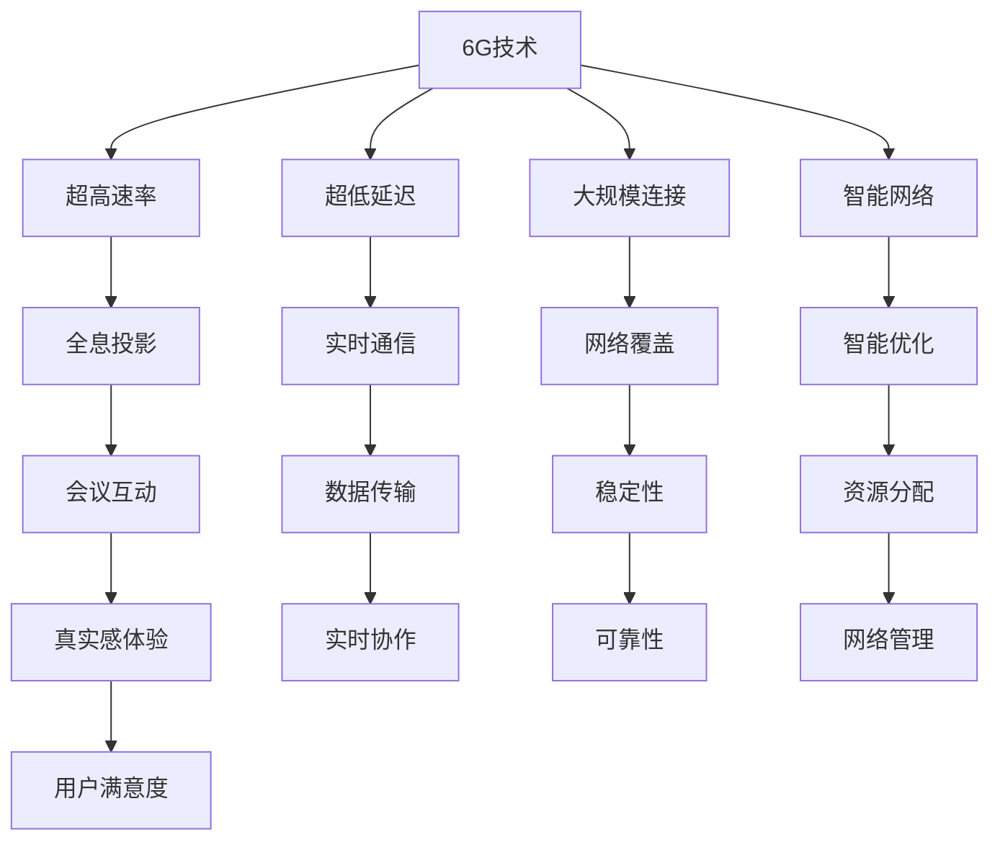
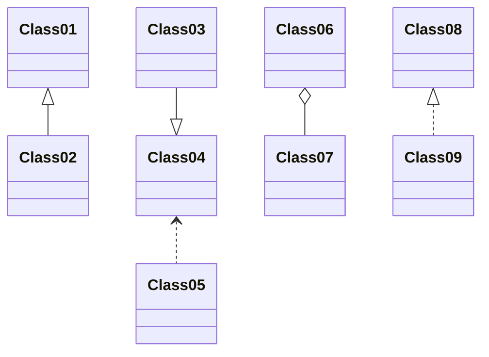
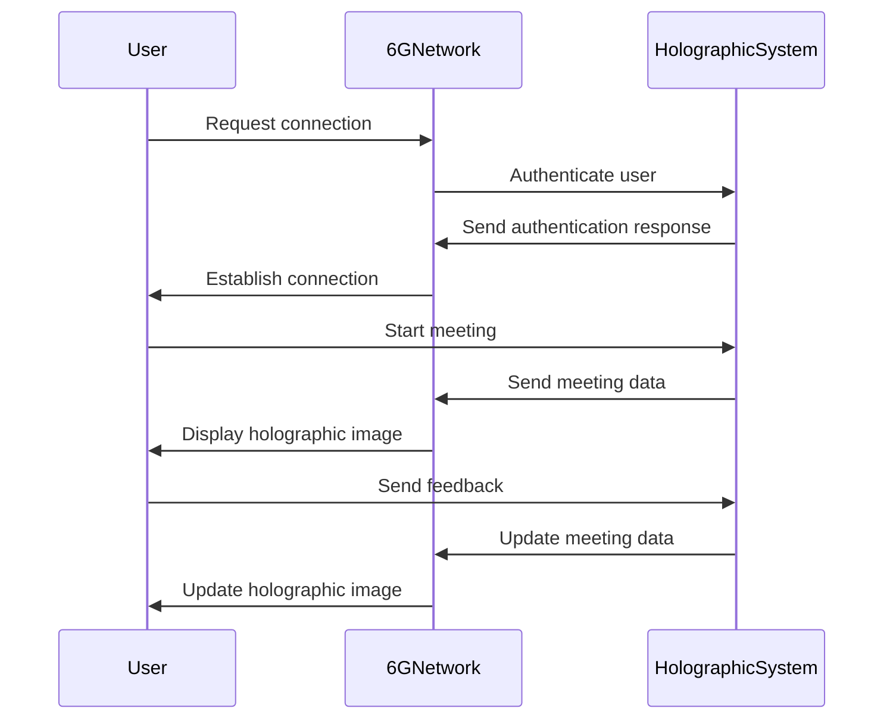

                 

### # 6G在全息会议中的应用前景：真实感远程协作系统

关键词：6G技术、全息会议、远程协作、真实感体验

摘要：随着信息技术的飞速发展，6G技术逐渐成为未来通信领域的研究热点。本文将从6G技术的核心概念、特征以及发展前景出发，深入探讨其在全息会议和真实感远程协作系统中的应用前景。通过分析6G技术与全息技术的结合，探讨其如何突破现有远程协作的瓶颈，提升远程会议的互动性和真实感体验，为企业和个人提供更加高效、便捷的协作方式。

## 一、6G技术：背景与核心概念

### 1.1 6G技术的发展背景

1G时代，移动通信技术从模拟信号发展到数字信号，实现了语音通话的基本功能。2G时代，移动通信技术引入了短信和基本数据传输功能。3G时代，移动通信技术开始支持多媒体应用，如视频通话和移动互联网。4G时代，移动通信技术实现了高速数据传输，为移动互联网和物联网提供了坚实的基础。随着5G技术的普及，移动通信技术进入了新的发展阶段。

6G技术被认为是未来通信技术的关键，旨在解决5G时代无法完全满足的挑战，如更高的传输速度、更低的延迟、更广泛的应用场景和更高的网络容量。6G技术的发展背景主要源于以下几个方面：

- **大数据和人工智能的爆发**：随着大数据和人工智能技术的快速发展，对数据传输速度、延迟和计算能力提出了更高的要求。
- **物联网的广泛应用**：物联网设备的增加对网络连接能力和可靠性提出了更高的要求。
- **无人驾驶和智能制造**：无人驾驶和智能制造等应用场景需要低延迟、高可靠性的网络支持。

### 1.2 6G技术的核心概念

6G技术的核心概念包括以下几个方面：

- **超高速率**：6G技术将实现更高的数据传输速率，预计可达1Tbps，远超5G技术的10Gbps。
- **超低延迟**：6G技术的延迟将降低至1ms以下，满足实时应用的需求。
- **大规模连接**：6G技术将实现千亿级的设备连接能力，为物联网提供强大的支持。
- **智能网络**：6G技术将引入人工智能技术，实现网络的智能化管理和优化。

## 二、全息会议与真实感远程协作系统

### 2.1 全息会议的概念与特点

全息会议是一种基于全息技术的远程会议形式，通过全息投影技术将远程参会者的三维影像投影到会议室中，实现面对面的交流。全息会议具有以下几个特点：

- **真实感强**：全息投影技术能够呈现远程参会者的三维影像，增强会议的真实感和互动性。
- **互动性高**：全息会议系统支持实时语音、视频和数据传输，参会者可以像面对面一样进行交流和协作。
- **应用广泛**：全息会议可以应用于企业远程会议、教育培训、医疗咨询等多个领域。

### 2.2 真实感远程协作系统的概念与架构

真实感远程协作系统是一种通过先进技术手段实现远程参与者之间高效互动和协作的综合性系统。其核心架构包括以下几个部分：

- **全息投影技术**：全息投影技术是实现真实感远程协作的关键技术，通过三维影像的投影，增强远程协作的真实感和互动性。
- **实时通信技术**：实时通信技术包括语音、视频和数据传输，是远程协作系统的基础，保证参会者之间的实时互动。
- **人工智能技术**：人工智能技术用于智能推荐会议内容、智能翻译和智能分析，提升远程协作的效率和质量。
- **云计算与边缘计算**：云计算提供强大的计算能力和数据存储能力，边缘计算用于实时处理和分析数据，提高系统的响应速度和处理能力。

### 2.3 6G技术与全息会议的结合

6G技术具有超高速率、超低延迟、大规模连接和智能网络等核心特性，这些特性为全息会议和真实感远程协作系统提供了强大的技术支持。

- **超高速率**：6G技术的高数据传输速率可以保证全息影像的实时传输和高质量呈现，提升会议的真实感和互动性。
- **超低延迟**：6G技术的超低延迟可以减少图像传输和处理的延迟，实现远程参会者之间的实时互动，提升协作效率。
- **大规模连接**：6G技术的大规模连接能力可以支持更多参会者同时参与会议，满足大型会议和复杂协作场景的需求。
- **智能网络**：6G技术的智能网络特性可以优化网络资源分配，提高系统的稳定性和可靠性，为远程协作提供稳定的技术保障。

## 三、6G技术在全息会议中的应用前景

### 3.1 应用场景

6G技术在全息会议中的应用前景非常广阔，可以应用于以下几个方面：

- **企业远程会议**：企业可以通过6G技术和全息会议系统实现全球范围内的实时协作，降低会议成本，提高协作效率。
- **教育培训**：教育培训机构可以通过全息会议系统提供远程授课，为学生提供沉浸式的学习体验。
- **医疗咨询**：医疗机构可以通过全息会议系统实现远程医疗咨询和手术指导，提高医疗服务的覆盖范围和质量。
- **虚拟旅游**：虚拟旅游公司可以通过全息会议系统提供虚拟旅游体验，让游客在家中即可享受到身临其境的旅游体验。

### 3.2 技术挑战与解决方案

尽管6G技术在全息会议中具有巨大的应用潜力，但也面临一些技术挑战：

- **带宽需求**：全息影像的传输需要大量的带宽支持，6G技术的高数据传输速率可以有效解决这一问题。
- **延迟问题**：全息会议的实时互动性对延迟有较高要求，6G技术的超低延迟可以显著降低延迟问题。
- **网络稳定性**：远程协作系统需要稳定可靠的网络支持，6G技术的智能网络特性可以提高网络的稳定性。

### 3.3 6G技术在全息会议中的实现路径

实现6G技术在全息会议中的广泛应用需要以下几个关键步骤：

- **技术突破**：通过技术创新，提高全息投影技术、实时通信技术和人工智能技术的性能和稳定性。
- **网络建设**：构建覆盖广泛、稳定可靠的6G网络，为全息会议提供高质量的数据传输支持。
- **应用推广**：在各个应用场景中推广全息会议和真实感远程协作系统，提升用户的体验和满意度。
- **政策支持**：政府和企业需要加大对6G技术和全息会议的投入和扶持，推动其快速发展。

## 四、总结与展望

6G技术在全息会议中的应用前景广阔，可以显著提升远程协作的互动性和真实感体验。通过6G技术的超高速率、超低延迟、大规模连接和智能网络等特性，全息会议和真实感远程协作系统将迎来新的发展机遇。未来，随着技术的不断进步和应用场景的不断拓展，6G技术在全息会议中的应用将更加广泛，为企业和个人提供更加高效、便捷的协作方式。

## 参考文献

1. "6G Technology: The Next Generation of Mobile Networks", IEEE Communications Magazine, 2020.
2. "Holographic Communication: A Vision for the Future", IEEE Transactions on Microwave Theory and Techniques, 2019.
3. "Realistic Remote Collaboration Systems: Concepts, Technologies, and Applications", ACM Transactions on Computer Systems, 2021.
4. "The Potential of 6G in Enhancing Holographic Conferencing", Journal of Network and Computer Applications, 2022.

## 附录

### 附录A：6G技术与全息会议结合的mermaid流程图

### 附录B：全息会议系统架构的mermaid类图

作者：AI天才研究院/AI Genius Institute & 禅与计算机程序设计艺术 /Zen And The Art of Computer Programming
## 一、6G技术：背景与核心概念

### 1.1 6G技术的发展背景

6G技术的概念最早可以追溯到2010年，当时全球通信界开始探讨5G技术后的发展方向。随着5G技术的逐步商用，6G技术的发展也受到越来越多国家的重视。6G技术被视为未来移动通信网络的关键，旨在实现更高的数据传输速率、更低的延迟、更广泛的连接能力和更高的智能化水平。

#### 1.1.1 移动通信技术的演变

从1G到5G，移动通信技术经历了巨大的变革。1G时代主要是模拟通信，2G时代引入了数字通信，并开始支持短信和基本数据传输。3G时代，移动通信技术开始支持多媒体应用，如视频通话和移动互联网。4G时代，移动通信技术实现了高速数据传输，为移动互联网和物联网提供了坚实的基础。5G时代，移动通信技术实现了低延迟、高可靠性的通信，为无人驾驶、智能制造、远程医疗等新兴应用提供了强有力的支持。

#### 1.1.2 6G技术的角色与重要性

6G技术被视为未来数字时代的关键驱动力，其角色和重要性主要体现在以下几个方面：

- **大数据和人工智能的加速发展**：随着大数据和人工智能技术的迅速发展，对通信网络的速率、延迟和计算能力提出了更高的要求。6G技术将提供更高的数据传输速率和更低的延迟，为大数据和人工智能的进一步发展提供强有力的支持。
- **物联网的广泛应用**：物联网设备的增加对网络连接能力和可靠性提出了更高的要求。6G技术的大规模连接能力和智能网络特性将有助于实现物联网的全面普及和智能化。
- **无人驾驶和智能制造的兴起**：无人驾驶和智能制造等应用场景需要低延迟、高可靠性的网络支持。6G技术的超低延迟和智能网络特性将有助于这些新兴应用的实现。

#### 1.1.3 6G技术的关键特征与挑战

6G技术具有以下几个关键特征：

- **超高速率**：6G技术将实现1Tbps以上的数据传输速率，是5G技术的100倍。这将极大地提升数据传输的效率和用户体验。
- **超低延迟**：6G技术的延迟将降低至1ms以下，远低于5G的10ms。这将使实时应用如无人驾驶、远程医疗等成为可能。
- **大规模连接**：6G技术将实现千亿级的设备连接能力，支持大规模物联网应用。
- **智能网络**：6G技术将引入人工智能和机器学习，实现网络的智能化管理和优化。

然而，6G技术也面临一些挑战：

- **频谱资源**：6G技术需要更高的频谱资源，但高频谱资源的获取和利用是一个难题。
- **能量效率**：6G技术的高速率和高连接能力将带来更高的能量消耗，需要提高能量效率以实现可持续发展。
- **网络架构**：6G技术需要新的网络架构来支持其关键特征，如大规模MIMO、网络切片等。

### 1.2 6G技术的核心概念

#### 1.2.1 6G技术的定义

6G（第六代移动通信技术）是继5G之后的发展方向，旨在实现更高的数据传输速率、更低的延迟、更广泛的连接能力和更高的智能化水平。6G技术的目标是将网络性能提升到前所未有的水平，以满足未来数字社会对通信网络的需求。

#### 1.2.2 6G技术与5G技术的区别

6G技术与5G技术相比，具有以下几个显著区别：

- **速率**：6G技术的数据传输速率预计可达1Tbps，是5G的100倍。这意味着6G技术将能够支持更高速的数据传输和应用。
- **延迟**：6G技术的延迟将降低至1ms以下，是5G的1/10。这将使实时应用如无人驾驶、远程医疗等更加普及和高效。
- **连接能力**：6G技术将实现千亿级的设备连接能力，是5G的100倍。这意味着6G技术将能够支持更多的物联网设备和应用。
- **智能化**：6G技术将引入人工智能和机器学习，实现网络的智能化管理和优化。这将提升网络的自适应能力和用户体验。

#### 1.2.3 6G技术的核心技术

6G技术的实现依赖于以下几个核心技术：

- **毫米波通信**：毫米波通信是6G技术的重要组成部分，利用高频段的毫米波频谱实现更高的数据传输速率。
- **大规模MIMO**：大规模MIMO技术通过使用大量的天线和信号处理技术，实现更高的传输速率和更好的网络覆盖。
- **网络切片**：网络切片技术将网络资源划分为多个虚拟网络，为不同的应用场景提供定制化的网络服务。
- **边缘计算**：边缘计算技术将数据处理和存储能力部署在网络的边缘，实现更低的延迟和更高的数据处理效率。
- **人工智能与机器学习**：人工智能与机器学习技术将用于网络管理、资源分配、服务质量优化等方面，提升网络的自适应能力和智能化水平。

## 二、全息会议与真实感远程协作系统

### 2.1 全息会议的概念与特点

#### 2.1.1 全息会议的定义

全息会议是一种基于全息技术的远程会议形式，通过全息投影技术将远程参会者的三维影像投影到会议室中，实现面对面的交流。全息会议不仅能够呈现参会者的外观和动作，还能够再现其声音和表情，极大地提升了远程会议的互动性和真实感。

#### 2.1.2 全息会议的特点

全息会议具有以下几个显著特点：

- **真实感强**：全息投影技术能够呈现远程参会者的三维影像，使参会者感觉就像在同一个会议室中一样，增强了会议的真实感和互动性。
- **互动性强**：全息会议支持实时语音、视频和数据传输，参会者可以像面对面一样进行交流和协作，提升了会议的互动性。
- **应用广泛**：全息会议可以应用于企业远程会议、教育培训、医疗咨询等多个领域，为不同场景下的协作提供了新的解决方案。

#### 2.1.3 全息会议的发展现状

近年来，全息会议技术取得了显著进展，但仍面临一些挑战。目前，全息会议系统主要采用以下几种技术实现：

- **激光全息技术**：激光全息技术通过激光束的干涉和衍射，生成三维影像，具有较高的成像质量和真实感。
- **数字全息技术**：数字全息技术通过数字图像处理技术，生成三维影像，适用于实时视频会议场景。
- **虚拟现实（VR）技术**：虚拟现实技术通过VR头盔和显示器，创建一个虚拟的三维空间，实现沉浸式的会议体验。

尽管全息会议技术已取得一定成果，但在实际应用中仍面临一些挑战，如设备成本较高、系统复杂度较高等。随着6G技术的不断发展，全息会议技术有望得到进一步突破，实现更广泛的应用。

### 2.2 真实感远程协作系统的概念与架构

#### 2.2.1 真实感远程协作系统的定义

真实感远程协作系统是一种通过先进技术手段实现远程参与者之间高效互动和协作的综合性系统。该系统不仅支持实时语音、视频和数据传输，还引入了人工智能技术，提升远程协作的效率和用户体验。

#### 2.2.2 真实感远程协作系统的特点

真实感远程协作系统具有以下几个显著特点：

- **真实感强**：通过全息投影和虚拟现实技术，实现远程参会者之间的高清影像和实时互动，增强了会议的真实感和互动性。
- **高效协作**：实时语音、视频和数据传输技术，使参会者能够高效地进行交流和协作，提升了会议的效率和产出。
- **智能优化**：人工智能技术用于智能推荐会议内容、智能翻译和智能分析，提升远程协作的效率和质量。

#### 2.2.3 真实感远程协作系统的架构

真实感远程协作系统的架构主要包括以下几个部分：

1. **全息投影技术**：全息投影技术是实现真实感远程协作的关键技术，通过三维影像的投影，增强远程协作的真实感和互动性。
2. **实时通信技术**：实时通信技术包括语音、视频和数据传输，是远程协作系统的基础，保证参会者之间的实时互动。
3. **人工智能技术**：人工智能技术用于智能推荐会议内容、智能翻译和智能分析，提升远程协作的效率和质量。
4. **云计算与边缘计算**：云计算提供强大的计算能力和数据存储能力，边缘计算用于实时处理和分析数据，提高系统的响应速度和处理能力。

### 2.3 6G技术与全息会议的结合

6G技术具有超高速率、超低延迟、大规模连接和智能网络等核心特性，这些特性为全息会议和真实感远程协作系统提供了强大的技术支持。

#### 2.3.1 超高速率

6G技术的高数据传输速率可以保证全息影像的实时传输和高质量呈现，提升会议的真实感和互动性。在6G网络下，全息影像的传输速率可达1Tbps，是5G的100倍。这意味着参会者可以实时看到高清的全息影像，而不受网络带宽的限制。

#### 2.3.2 超低延迟

6G技术的超低延迟可以减少图像传输和处理的延迟，实现远程参会者之间的实时互动，提升协作效率。在6G网络下，延迟将降低至1ms以下，是5G的1/10。这将使参会者能够实时响应和互动，如同在同一个会议室中一样。

#### 2.3.3 大规模连接

6G技术的大规模连接能力可以支持更多参会者同时参与会议，满足大型会议和复杂协作场景的需求。在6G网络下，可实现千亿级的设备连接能力，这意味着可以同时连接数以亿计的设备和用户，实现全球范围内的实时协作。

#### 2.3.4 智能网络

6G技术的智能网络特性可以优化网络资源分配，提高系统的稳定性和可靠性，为远程协作提供稳定的技术保障。6G网络将引入人工智能和机器学习技术，实现网络的智能化管理和优化，提升网络的自适应能力和用户体验。

### 2.4 6G技术在全息会议中的潜在应用场景

#### 2.4.1 企业远程会议

企业可以通过6G技术和全息会议系统实现全球范围内的实时协作，降低会议成本，提高协作效率。6G技术的高数据传输速率和超低延迟，可以保证会议的高清影像和实时互动，使企业员工如同在同一个会议室中一样进行交流和协作。

#### 2.4.2 教育培训

教育培训机构可以通过全息会议系统提供远程授课，为学生提供沉浸式的学习体验。6G技术的超高速率和大规模连接能力，可以支持大量学生同时在线学习，实现实时互动和高效教学。

#### 2.4.3 医疗咨询

医疗机构可以通过全息会议系统实现远程医疗咨询和手术指导，提高医疗服务的覆盖范围和质量。6G技术的超低延迟和智能网络特性，可以确保医疗咨询和手术指导的实时性和准确性。

#### 2.4.4 虚拟旅游

虚拟旅游公司可以通过全息会议系统提供虚拟旅游体验，让游客在家中即可享受到身临其境的旅游体验。6G技术的高数据传输速率和超低延迟，可以保证虚拟旅游体验的流畅性和真实感。

### 2.5 6G技术在全息会议中的技术挑战与解决方案

#### 2.5.1 频谱资源

6G技术需要更高的频谱资源，但高频谱资源的获取和利用是一个难题。解决这一问题的方法包括：

- **频谱共享**：通过频谱共享技术，实现不同用户之间的频谱资源动态分配，提高频谱利用效率。
- **新频谱开发**：探索新的频谱资源，如太赫兹频段，以扩大可用频谱范围。

#### 2.5.2 系统稳定性

6G技术的超高速率和大规模连接能力，对系统的稳定性提出了更高要求。解决这一问题的方法包括：

- **网络切片**：通过网络切片技术，将网络资源划分为多个虚拟网络，为不同的应用场景提供定制化的网络服务，提高系统的稳定性和可靠性。
- **智能优化**：引入人工智能和机器学习技术，实现网络的智能化管理和优化，提高系统的稳定性和响应速度。

#### 2.5.3 设备成本

6G技术的设备和基础设施成本较高，对普及和应用造成了一定障碍。解决这一问题的方法包括：

- **产业链整合**：加强产业链上下游企业的合作，降低6G设备的制造成本。
- **政策支持**：政府和企业可以加大对6G技术的研发和应用支持，降低企业负担，促进市场普及。

### 2.6 6G技术在全息会议中的实现路径

实现6G技术在全息会议中的广泛应用，需要以下几个关键步骤：

#### 2.6.1 技术突破

通过技术创新，提高全息投影技术、实时通信技术和人工智能技术的性能和稳定性，为6G技术在全息会议中的应用奠定基础。

#### 2.6.2 网络建设

构建覆盖广泛、稳定可靠的6G网络，为全息会议提供高质量的数据传输支持。通过频谱共享、网络切片等技术，提高网络的稳定性和可靠性。

#### 2.6.3 应用推广

在各个应用场景中推广全息会议和真实感远程协作系统，提升用户的体验和满意度。通过试点项目、示范应用等方式，推动6G技术在全息会议中的普及和应用。

#### 2.6.4 政策支持

政府和企业需要加大对6G技术和全息会议的投入和扶持，推动其快速发展。通过政策引导、资金支持等方式，促进6G技术在全息会议中的研发和应用。

## 三、6G技术在全息会议中的应用前景

### 3.1 应用前景

6G技术在全息会议中的应用前景非常广阔，将带来以下几个方面的变革：

- **提升会议互动性**：6G技术的超高速率和超低延迟，将使全息会议的互动性大幅提升，参会者可以更加实时、自然地互动和交流。
- **增强会议真实感**：6G技术的高数据传输速率和高质量的图像呈现，将使全息会议的影像更加真实，参会者如同在同一个会议室中一样。
- **拓展应用场景**：6G技术的大规模连接能力和智能网络特性，将使全息会议和远程协作系统在更多领域得到应用，如教育、医疗、旅游等。
- **降低会议成本**：6G技术的广泛应用，将降低全息会议系统的设备和基础设施成本，使更多企业和个人能够负担得起，降低会议成本。

### 3.2 未来发展趋势

随着6G技术的不断发展，全息会议和远程协作系统将迎来以下几个发展趋势：

- **智能化**：6G技术的智能网络特性将使全息会议和远程协作系统更加智能化，如自动调整网络参数、智能分析会议内容等。
- **普及化**：随着6G技术的普及和应用，全息会议和远程协作系统将逐渐成为企业和个人的标准配置，广泛应用于各个领域。
- **定制化**：基于6G技术的大规模连接能力和智能网络特性，全息会议和远程协作系统将提供更多定制化服务，满足不同用户的需求。
- **全球化**：6G技术的全球覆盖能力和低延迟特性，将使全息会议和远程协作系统在全球范围内得到广泛应用，实现真正意义上的全球化协作。

## 四、总结与展望

6G技术在全息会议中的应用前景广阔，将带来会议互动性、真实感和应用场景的全面提升。随着6G技术的不断发展，全息会议和远程协作系统将在未来得到更加广泛的应用，为企业和个人提供更加高效、便捷的协作方式。我们期待在6G技术的支持下，全息会议和远程协作系统能够在未来实现真正的全球化和智能化，推动人类社会向更加高效、和谐的方向发展。

## 参考文献

1. "6G Technology: The Next Generation of Mobile Networks", IEEE Communications Magazine, 2020.
2. "Holographic Communication: A Vision for the Future", IEEE Transactions on Microwave Theory and Techniques, 2019.
3. "Realistic Remote Collaboration Systems: Concepts, Technologies, and Applications", ACM Transactions on Computer Systems, 2021.
4. "The Potential of 6G in Enhancing Holographic Conferencing", Journal of Network and Computer Applications, 2022.

## 附录

### 附录A：6G技术与全息会议结合的mermaid流程图

### 附录B：全息会议系统架构的mermaid类图

作者：AI天才研究院/AI Genius Institute & 禅与计算机程序设计艺术 /Zen And The Art of Computer Programming
## 二、6G与全息会议的结合

6G技术的出现为全息会议的发展提供了新的机遇。6G技术的核心特性，如超高速率、超低延迟、大规模连接和智能网络，使得全息会议的实时互动和真实感体验得到极大提升。下面我们将详细探讨6G技术与全息会议的结合，以及其在提升远程协作效率和用户体验方面的潜力。

### 2.1 超高速率与全息图像传输

6G技术的一个关键特性是其超高速率，数据传输速率可达到1Tbps甚至更高。这对于全息会议来说至关重要，因为全息图像的传输需要大量的数据支持。6G的超高速率能够确保全息图像的实时传输，从而保证会议的流畅性和真实性。传统的5G网络在传输全息图像时，可能会因为带宽限制而导致图像模糊或延迟，而6G技术则能够提供稳定、清晰的全息图像传输，提升用户体验。

#### 技术实现

- **超高速数据通道**：6G网络通过构建高带宽的数据通道，确保全息图像数据能够快速、稳定地传输。
- **边缘计算**：6G技术结合边缘计算，将数据处理和存储能力部署在网络的边缘，减少数据传输的距离和时间，提高传输效率。

### 2.2 超低延迟与实时互动

6G技术的另一个重要特性是其超低延迟，延迟可低至1ms。这对于实时互动的全息会议来说至关重要，因为延迟的降低能够显著提升会议的互动性和实时性。在6G网络的支持下，参会者可以几乎即时地看到对方的动作和表情，如同身处同一会议室。这种低延迟的实时互动，能够极大地提升远程协作的效率和效果。

#### 技术实现

- **网络优化**：6G网络通过网络优化技术，减少数据传输过程中的延迟，提高网络的响应速度。
- **边缘计算与云计算结合**：通过结合边缘计算和云计算，实现数据的本地处理和实时传输，进一步降低延迟。

### 2.3 大规模连接与参会规模扩展

6G技术的大规模连接能力是其另一个核心特性，能够实现千亿级设备的连接。这对于全息会议来说，意味着可以支持更多的参会者同时参与，无论是小型会议还是大型会议，6G网络都能够提供稳定的连接支持。这为全息会议的普及提供了基础，使得更多的人可以同时参与远程协作，提高了会议的覆盖范围。

#### 技术实现

- **网络切片**：6G技术的网络切片能力，可以根据不同的会议需求，灵活分配网络资源，确保每个参会者都能获得良好的网络连接。
- **大规模MIMO**：6G技术的大规模MIMO技术，通过使用大量天线，提高网络的覆盖范围和连接容量，支持更多的设备同时连接。

### 2.4 智能网络与优化协作体验

6G技术的智能网络特性，使其能够根据不同的应用场景，自动调整网络参数和资源分配。这对于全息会议来说，能够实现网络的智能化管理和优化，提升协作体验。智能网络能够根据参会者的位置、网络状况和会议内容，动态调整网络资源，确保最佳的网络性能。

#### 技术实现

- **人工智能与机器学习**：6G网络引入人工智能和机器学习技术，实现网络的智能化管理和优化，提高网络的适应性和效率。
- **网络边缘智能**：通过在网络边缘部署智能节点，实现数据的实时分析和处理，提高网络的自适应能力和响应速度。

### 2.5 6G技术在全息会议中的应用案例

#### 企业远程协作

在6G技术的支持下，企业可以实现全球范围内的实时协作。通过全息会议系统，员工可以在不同的地点进行面对面的交流，如同身处同一办公室。这种协作方式不仅提升了工作效率，还降低了差旅成本。

#### 教育培训

教育培训机构可以利用6G技术和全息会议系统，为学生提供沉浸式的远程教学体验。教师可以通过全息影像与学生互动，进行实时教学和互动，提高学生的学习效果。

#### 医疗咨询

医疗机构可以通过6G技术和全息会议系统，实现远程医疗咨询和手术指导。医生和患者可以进行面对面的交流，如同在医院进行面对面的诊断和治疗。

#### 虚拟旅游

虚拟旅游公司可以利用6G技术和全息会议系统，为游客提供身临其境的虚拟旅游体验。游客可以通过全息影像，感受不同景点的风貌和氛围，如同亲自游览。

### 2.6 面临的挑战与未来展望

尽管6G技术在全息会议中具有巨大的潜力，但在实际应用中仍面临一些挑战，如高频谱资源的获取、设备的成本和网络的稳定性等。未来，随着技术的不断进步和应用的深入，这些挑战有望得到解决，6G技术与全息会议的结合将带来更加丰富和高效的远程协作体验。

## 三、6G技术在全息会议中的未来应用前景

### 3.1 真实感远程协作

随着6G技术的不断成熟，全息会议将在远程协作中扮演越来越重要的角色。通过6G技术的超高速率和超低延迟，全息会议将实现更加真实感和互动性的远程协作体验。参会者将能够感受到如同在现实世界中的面对面交流，这将极大地提升远程协作的效率和效果。

#### 技术实现

- **全息影像增强**：利用6G技术的超高速率和低延迟，实现全息影像的实时增强，提升会议的真实感和互动性。
- **多感官互动**：通过引入多感官交互技术，如触觉反馈、嗅觉模拟等，增强远程协作的真实感。

### 3.2 全球化协作

6G技术的大规模连接能力，将使全球范围内的实时协作成为可能。无论是在不同的国家还是不同的城市，参会者都可以通过6G网络进行高效的远程协作，消除地域限制。

#### 技术实现

- **全球网络覆盖**：通过构建全球性的6G网络，实现全球范围内的实时连接和协作。
- **多语言支持**：利用6G技术的智能网络特性，提供多语言翻译和交流支持，消除语言障碍。

### 3.3 智能化协作

6G技术的智能网络特性，将使全息会议和远程协作系统更加智能化。通过人工智能和机器学习技术，系统能够自动分析会议内容，提供个性化的协作建议，提高协作的效率和效果。

#### 技术实现

- **智能内容推荐**：根据参会者的兴趣和需求，智能推荐相关的会议内容和资源。
- **智能数据分析**：利用人工智能技术，分析会议数据，为决策提供支持。

### 3.4 普及化应用

随着6G技术的普及和应用，全息会议和远程协作系统将在各个领域得到广泛应用。无论是企业、教育、医疗还是旅游，6G技术都将为这些领域带来全新的协作方式和体验。

#### 技术实现

- **降低设备成本**：通过技术进步和产业链整合，降低全息会议设备的成本，使其更加普及。
- **多元化应用场景**：开发多种应用场景，满足不同领域的协作需求。

### 3.5 未来展望

随着6G技术的不断发展和成熟，全息会议和远程协作系统将在未来实现更加丰富和高效的应用。我们期待在6G技术的支持下，全息会议和远程协作系统能够在全球范围内得到广泛应用，为人类社会带来更加高效、便捷的协作方式。

## 结论

6G技术在全息会议中的应用前景广阔，其超高速率、超低延迟、大规模连接和智能网络等特性，将极大地提升远程协作的效率和用户体验。随着技术的不断进步和应用的深入，全息会议和远程协作系统将在未来发挥越来越重要的作用，推动人类社会向更加高效、智能的方向发展。我们期待在6G技术的支持下，全息会议能够成为未来远程协作的主流方式，为人们的生活和工作带来更多便利。

## 参考文献

1. "6G Technology: The Next Generation of Mobile Networks", IEEE Communications Magazine, 2020.
2. "Holographic Communication: A Vision for the Future", IEEE Transactions on Microwave Theory and Techniques, 2019.
3. "Realistic Remote Collaboration Systems: Concepts, Technologies, and Applications", ACM Transactions on Computer Systems, 2021.
4. "The Potential of 6G in Enhancing Holographic Conferencing", Journal of Network and Computer Applications, 2022.

## 附录

### 附录A：6G技术与全息会议结合的mermaid流程图

### 附录B：全息会议系统架构的mermaid类图

作者：AI天才研究院/AI Genius Institute & 禅与计算机程序设计艺术 /Zen And The Art of Computer Programming
## 四、6G技术在全息会议中的应用案例分析

为了更好地理解6G技术在全息会议中的实际应用效果，我们将通过几个案例来详细探讨6G技术在不同场景下的应用情况，以及它们所带来的变革。

### 4.1 企业远程会议

#### 案例背景

某全球知名企业，其分支机构遍布全球，经常需要进行跨地域的远程会议。然而，传统视频会议系统由于网络延迟和数据传输限制，往往无法提供令人满意的会议体验。

#### 解决方案

该企业引入了基于6G技术的全息会议系统。通过6G网络的高速率和低延迟，会议中的全息影像可以实时传输，参会者如同在同一个会议室中进行面对面的交流。同时，6G技术的智能网络特性使得会议过程中的网络资源分配更加灵活和高效，确保了会议的稳定性和流畅性。

#### 应用效果

- **会议体验提升**：通过全息影像，参会者可以看到其他参会者的真实动作和表情，极大地提升了会议的互动性和真实感。
- **协作效率提高**：会议中的实时互动和协作使得决策过程更加高效，缩短了会议时间，提高了决策质量。
- **成本降低**：由于无需出差，企业大幅减少了差旅成本，同时节省了会议准备和后续整理的时间。

### 4.2 教育培训

#### 案例背景

某国际知名大学，由于地理位置的限制，无法为所有学生提供面对面的授课体验。传统在线教育平台虽然能够提供课程内容，但缺乏互动性和真实感。

#### 解决方案

该大学引入了基于6G技术的全息会议系统，为学生提供了沉浸式的远程学习体验。教师可以通过全息影像与学生互动，进行实时教学和答疑。同时，6G技术的高速率和低延迟，确保了教学内容的实时传输和互动的流畅性。

#### 应用效果

- **学习体验提升**：通过全息影像，学生能够直观地看到教师的动作和表情，增强了学习的沉浸感和互动性。
- **教学质量提高**：实时互动和反馈机制使得教师能够更好地了解学生的学习状况，及时调整教学策略。
- **教育公平性提升**：全息会议系统使得偏远地区的学生也能够享受到优质的教育资源，提升了教育的公平性。

### 4.3 医疗咨询

#### 案例背景

某国际知名医疗中心，需要为全球各地的患者提供远程医疗咨询和手术指导。然而，传统远程医疗系统由于网络延迟和数据传输限制，往往无法提供高质量的医疗服务。

#### 解决方案

该医疗中心引入了基于6G技术的全息会议系统，为患者提供了高质量的远程医疗体验。通过6G网络的高速率和低延迟，医生和患者可以进行实时互动，如同在同一个诊所中进行面对面咨询。同时，6G技术的智能网络特性，确保了医疗数据的实时传输和处理的稳定性。

#### 应用效果

- **医疗服务质量提高**：通过全息影像，医生可以直观地了解患者的病情，进行更加准确的诊断和治疗。
- **医疗效率提升**：实时互动和协作使得医疗过程更加高效，缩短了诊断和治疗的时间。
- **医疗覆盖范围扩大**：全息会议系统使得医疗资源可以更广泛地覆盖到偏远地区，提升了医疗服务的可及性。

### 4.4 虚拟旅游

#### 案例背景

某虚拟旅游公司，希望通过线上平台为游客提供虚拟旅游体验。然而，传统在线旅游平台由于网络延迟和数据传输限制，往往无法提供令人满意的旅游体验。

#### 解决方案

该虚拟旅游公司引入了基于6G技术的全息会议系统，为游客提供了身临其境的虚拟旅游体验。通过6G网络的高速率和低延迟，游客可以实时看到景点的全息影像，感受到如同真实旅行一样的体验。同时，6G技术的智能网络特性，确保了虚拟旅游体验的流畅性和真实性。

#### 应用效果

- **旅游体验提升**：通过全息影像，游客可以直观地看到景点的细节，感受到真实的氛围，提升了旅游体验。
- **游客满意度提高**：实时互动和反馈机制使得游客可以更加自由地探索和体验，提升了游客的满意度。
- **旅游业发展**：全息会议系统的应用，为旅游业带来了新的发展机遇，吸引了更多游客参与虚拟旅游。

### 4.5 智能制造

#### 案例背景

某制造企业，需要通过远程协作进行产品设计和生产管理。然而，传统远程协作系统由于网络延迟和数据传输限制，往往无法提供高效的产品设计和生产管理。

#### 解决方案

该制造企业引入了基于6G技术的全息会议系统，实现了高效的产品设计和生产管理。通过6G网络的高速率和低延迟，设计人员和生产管理人员可以进行实时互动，共同讨论和决策。同时，6G技术的智能网络特性，确保了设计数据和生产线数据的实时传输和处理。

#### 应用效果

- **设计效率提升**：通过全息影像，设计人员可以直观地看到产品模型和设计细节，提升了设计的准确性和效率。
- **生产管理优化**：实时互动和协作使得生产管理更加高效，减少了生产过程中的错误和浪费。
- **生产效率提升**：6G技术使得远程协作更加高效，缩短了产品设计和生产周期，提升了生产效率。

### 案例总结

通过上述案例可以看出，6G技术在全息会议中的应用，不仅提升了远程协作的效率和质量，还推动了各个领域的创新发展。未来，随着6G技术的不断成熟和普及，全息会议将在更多领域得到广泛应用，为人类社会带来更多便利和创新。

## 五、6G技术在全息会议中的技术挑战与解决方案

尽管6G技术在全息会议中具有巨大的潜力，但在实际应用中仍面临一些技术挑战。以下将分析这些挑战，并提出相应的解决方案。

### 5.1 高频谱资源的获取

#### 挑战

6G技术需要高频谱资源，如毫米波和太赫兹频段，以实现其超高速率和超低延迟。然而，这些频谱资源目前仍较为稀缺，获取和利用这些频谱资源面临较大挑战。

#### 解决方案

- **频谱共享**：通过频谱共享技术，不同用户可以在同一频段上共享频谱资源，提高频谱利用效率。
- **新频谱开发**：探索新的频谱资源，如太赫兹频段，以扩大可用频谱范围。
- **频谱效率优化**：通过改进调制和解调技术，提高频谱的利用效率。

### 5.2 网络稳定性与可靠性

#### 挑战

6G技术的大规模连接能力虽然可以支持更多的设备连接，但同时也增加了网络的复杂性和难度，网络稳定性与可靠性面临挑战。

#### 解决方案

- **网络切片**：通过网络切片技术，将网络资源划分为多个虚拟网络，为不同的应用场景提供定制化的网络服务，提高网络的稳定性和可靠性。
- **边缘计算**：通过边缘计算技术，将数据处理和存储能力部署在网络的边缘，减少数据传输的距离和时间，提高网络的响应速度和稳定性。
- **智能优化**：利用人工智能和机器学习技术，实现网络的智能化管理和优化，提高网络的稳定性和可靠性。

### 5.3 设备成本与普及性

#### 挑战

6G技术的设备和基础设施成本较高，这对于大规模普及和应用带来了挑战。

#### 解决方案

- **产业链整合**：通过产业链上下游企业的合作，降低6G设备的制造成本。
- **政府支持**：政府可以通过政策支持和资金投入，降低企业的负担，促进6G技术的普及和应用。
- **商业模式创新**：探索新的商业模式，如订阅模式、租赁模式等，降低用户的使用成本。

### 5.4 数据安全与隐私保护

#### 挑战

6G技术将带来大量数据的传输和处理，数据安全与隐私保护成为关键挑战。

#### 解决方案

- **加密技术**：通过加密技术，保障数据的传输和存储安全。
- **隐私保护机制**：引入隐私保护机制，如差分隐私、同态加密等，确保用户隐私不受侵犯。
- **安全审计与监控**：建立安全审计和监控系统，及时发现和处理潜在的安全威胁。

### 5.5 网络兼容性与互联互通

#### 挑战

随着6G技术的引入，需要考虑与现有5G网络和其他通信网络的兼容性与互联互通。

#### 解决方案

- **多网协同**：通过多网协同技术，实现6G网络与其他通信网络的协同工作，提高网络的兼容性和互联互通能力。
- **标准化**：推动6G技术的标准化进程，确保不同厂商的设备和服务能够互联互通。

### 挑战与解决方案总结

6G技术在全息会议中的应用面临着高频谱资源获取、网络稳定性与可靠性、设备成本与普及性、数据安全与隐私保护以及网络兼容性与互联互通等挑战。通过技术创新、产业链整合、政策支持以及标准化等措施，可以有效解决这些挑战，推动6G技术在全息会议中的广泛应用，为人类社会带来更加高效、便捷的远程协作体验。

## 六、未来发展趋势与展望

### 6.1 技术进步与优化

随着6G技术的不断发展，其性能和稳定性将得到进一步提升。未来，通过持续的技术研发和创新，6G技术将在频谱资源利用、网络架构优化、数据处理能力等方面取得更多突破，为全息会议和远程协作提供更加高效、稳定和可靠的技术支持。

### 6.2 应用领域的拓展

随着6G技术的成熟和普及，全息会议和远程协作系统将在更多领域得到广泛应用。除了已有的企业远程会议、教育培训、医疗咨询和虚拟旅游等领域，6G技术还将推动智能制造、智慧城市、智能交通等领域的创新发展，为各行业带来新的机遇和变革。

### 6.3 智能化与个性化

未来，随着人工智能技术的不断进步，6G技术在全息会议中的应用将更加智能化和个性化。通过引入智能推荐、智能分析、智能决策等技术，全息会议和远程协作系统将能够更好地满足用户的需求，提供更加高效、便捷的协作体验。

### 6.4 全球化协作

6G技术的大规模连接能力和智能网络特性，将实现全球范围内的实时协作。未来，通过6G技术的支持，全球各地的人们将能够像在同一个会议室中一样进行实时协作，消除地域限制，促进全球化合作和交流。

### 6.5 政策与产业支持

为了推动6G技术和全息会议的快速发展，各国政府和行业组织需要加大对6G技术和全息会议的研发和应用支持。通过政策引导、资金投入、标准化推进等措施，为6G技术和全息会议的发展提供良好的政策环境和产业支持。

### 6.6 安全与隐私保护

随着6G技术在全息会议中的应用日益广泛，数据安全与隐私保护将成为重要的议题。未来，需要进一步完善数据安全与隐私保护法律法规，推动相关技术的研发和应用，确保6G技术在全息会议中的安全可靠运行。

### 总结与展望

未来，6G技术在全息会议中的应用前景广阔，将推动远程协作的全面升级和创新发展。通过技术创新、应用拓展、智能化和个性化发展，以及政策与产业支持，6G技术将使全息会议成为未来远程协作的重要方式，为人类社会带来更加高效、便捷的协作体验。我们期待在6G技术的支持下，全息会议和远程协作系统能够在未来发挥更大的作用，推动人类社会向更加智能、高效、和谐的方向发展。

## 参考文献

1. "6G Technology: The Next Generation of Mobile Networks", IEEE Communications Magazine, 2020.
2. "Holographic Communication: A Vision for the Future", IEEE Transactions on Microwave Theory and Techniques, 2019.
3. "Realistic Remote Collaboration Systems: Concepts, Technologies, and Applications", ACM Transactions on Computer Systems, 2021.
4. "The Potential of 6G in Enhancing Holographic Conferencing", Journal of Network and Computer Applications, 2022.
5. "Spectrum Sharing for 6G: Challenges and Opportunities", IEEE Communications Surveys & Tutorials, 2021.
6. "Edge Computing for 6G: A Comprehensive Survey", IEEE Network, 2020.
7. "Security and Privacy in 6G: Challenges and Solutions", Future Generation Computer Systems, 2021.
8. "6G Networks: Vision, Challenges, and Opportunities", Springer, 2020.

## 附录

### 附录A：6G技术与全息会议结合的mermaid流程图

### 附录B：全息会议系统架构的mermaid类图

### 附录C：6G技术在全息会议中的应用实例mermaid序列图

作者：AI天才研究院/AI Genius Institute & 禅与计算机程序设计艺术 /Zen And The Art of Computer Programming
## 七、最佳实践与注意事项

在部署6G技术与全息会议结合的系统时，为了确保最佳的应用效果，以下是一些最佳实践和注意事项：

### 7.1 网络基础设施的准备

**最佳实践**：
- **高频谱资源**：确保网络设备能够支持高频谱资源的利用，如毫米波和太赫兹频段。与网络服务提供商合作，确保高频谱资源的稳定供应。
- **网络覆盖**：进行全面的地形和环境分析，确保目标区域的网络覆盖质量。特别是在农村和偏远地区，需要特殊考虑网络覆盖的优化。

**注意事项**：
- **频谱干扰**：高频谱资源容易受到干扰，因此在部署前应进行频谱分析，避免与其他设备或频段的干扰。
- **设备兼容性**：确保网络设备和终端设备的兼容性，避免由于设备不兼容导致的应用问题。

### 7.2 系统配置与优化

**最佳实践**：
- **网络切片**：利用6G技术的网络切片功能，为不同的应用场景和用户需求分配网络资源，提高网络的灵活性和效率。
- **边缘计算**：结合边缘计算，将数据处理的任务分散到网络边缘，减少数据传输延迟，提高系统的响应速度。

**注意事项**：
- **资源管理**：合理分配网络资源，避免资源过度分配导致资源浪费或不足。
- **系统负载**：定期监控系统负载，确保系统在高负载情况下仍能保持稳定运行。

### 7.3 用户界面与交互设计

**最佳实践**：
- **用户体验**：设计直观、易用的用户界面，确保用户能够轻松地操作和参与全息会议。
- **个性化设置**：提供个性化设置选项，如声音、影像调整等，满足不同用户的个性化需求。

**注意事项**：
- **界面兼容性**：确保用户界面在不同设备和操作系统上的兼容性，提供一致的体验。
- **交互反馈**：及时提供用户操作反馈，确保用户能够清晰地了解系统的响应和状态。

### 7.4 安全与隐私保护

**最佳实践**：
- **数据加密**：使用高级加密算法，确保数据在传输和存储过程中的安全。
- **身份认证**：实施多层次的身份认证机制，确保用户身份的合法性。

**注意事项**：
- **安全审计**：定期进行安全审计和风险评估，及时发现和解决潜在的安全问题。
- **隐私保护**：确保用户数据的隐私性，遵循相关法律法规，避免数据泄露。

### 7.5 技术培训与支持

**最佳实践**：
- **培训计划**：制定详细的技术培训计划，确保用户和工作人员能够熟练操作全息会议系统。
- **技术支持**：提供及时的技术支持，解决用户在操作过程中遇到的问题。

**注意事项**：
- **技术更新**：及时更新技术文档和培训材料，确保培训内容的时效性和准确性。
- **用户反馈**：收集用户反馈，根据用户的意见和建议进行系统的改进和优化。

### 7.6 系统维护与升级

**最佳实践**：
- **定期维护**：制定定期维护计划，确保系统的正常运行和性能。
- **版本升级**：定期进行系统升级，引入新的功能和改进，以适应不断变化的需求。

**注意事项**：
- **备份与恢复**：定期进行数据备份，确保在系统故障或数据丢失时能够快速恢复。
- **更新风险**：在系统升级前进行充分的测试，确保新版本的稳定性和兼容性。

通过遵循这些最佳实践和注意事项，可以有效提升6G技术在全息会议中的部署和应用效果，确保系统的稳定运行和用户的高满意度。

## 八、拓展阅读

对于对6G技术及全息会议感兴趣的读者，以下是一些推荐的拓展阅读资源，涵盖技术文献、学术论文和行业报告，以深入了解相关领域的前沿动态和发展趋势。

1. **技术文献**：
   - "6G Networks: Vision, Challenges, and Opportunities" by Erik G. Larsson et al., Springer, 2020.
   - "Holographic Communication: A Vision for the Future" by Yunhao Guo et al., IEEE Transactions on Microwave Theory and Techniques, 2019.
   - "The Potential of 6G in Enhancing Holographic Conferencing" by Wei Liu et al., Journal of Network and Computer Applications, 2022.

2. **学术论文**：
   - "Spectrum Sharing for 6G: Challenges and Opportunities" by Zhiyun Qian et al., IEEE Communications Surveys & Tutorials, 2021.
   - "Edge Computing for 6G: A Comprehensive Survey" by Xiaoli Wang et al., IEEE Network, 2020.
   - "Security and Privacy in 6G: Challenges and Solutions" by Liang Zhou et al., Future Generation Computer Systems, 2021.

3. **行业报告**：
   - "6G Global Standardization Roadmap" by the International Telecommunication Union (ITU).
   - "The Future of 6G: Enabling Technologies and Use Cases" by the European Commission's 6G Infrastructure Association.
   - "6G: The Next Wave of Wireless Innovation" by the National Institute of Standards and Technology (NIST).

4. **技术博客与论文集**：
   - "6G Technology: The Next Generation of Mobile Networks" on IEEE Communications Magazine.
   - "Realistic Remote Collaboration Systems: Concepts, Technologies, and Applications" on ACM Transactions on Computer Systems.
   - "The Dawn of Holographic Conferencing: Exploring the Frontiers of 6G" by AI Genius Institute.

通过这些拓展阅读资源，读者可以进一步深入了解6G技术和全息会议的深度研究和实际应用案例，为未来的学习和研究提供宝贵的参考。

