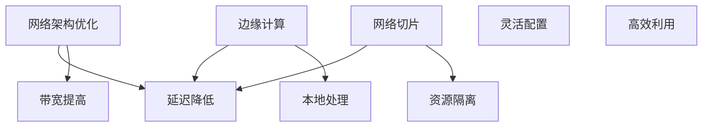
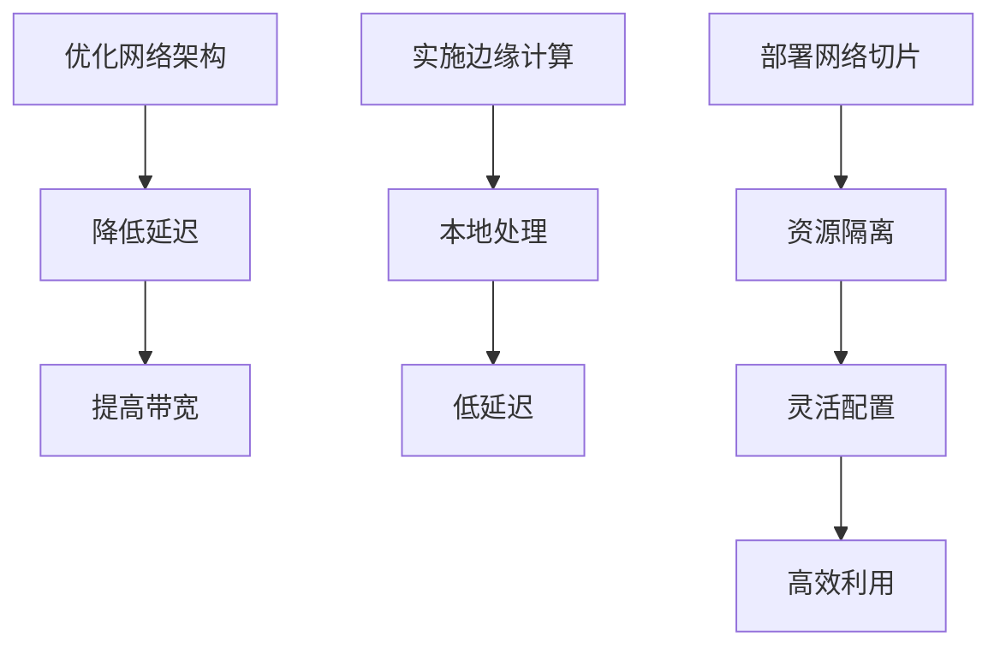

                 

### 5G与工业互联网背景

#### 第1章: 5G技术概述

**1.1 5G技术的发展历程**

5G技术的发展历程可以追溯到2000年代初期。最初，3G网络的出现标志着移动通信技术的重大进步，使人们可以在移动设备上实现高速互联网接入。随后，4G网络的推出进一步提高了数据传输速度，使得高清视频流和实时通信成为可能。然而，随着物联网（IoT）和工业4.0的兴起，对网络速度、延迟和容量提出了更高的要求，从而催生了5G技术的研发。

5G技术的研发始于2010年代初期，主要目标是在提高网络速度的同时，降低延迟，并支持大规模设备的连接。2019年，5G网络在全球范围内正式商用，这标志着移动通信技术进入了一个全新的时代。

**1.2 5G的关键技术**

5G技术的实现依赖于以下几个关键技术：

- **毫米波通信**：毫米波频段（24GHz以上）具有更高的带宽，可以支持更高的数据传输速度。
- **大规模天线阵列**：通过使用大规模天线阵列（MIMO技术），可以实现更高的数据传输速率和更好的网络覆盖。
- **网络切片**：网络切片技术允许将一个物理网络分割成多个虚拟网络，以满足不同应用的需求。
- **边缘计算**：边缘计算将计算和存储能力从云中心转移到网络边缘，从而降低延迟，提高响应速度。
- **软件定义网络（SDN）**：SDN技术通过将控制平面与数据平面分离，实现了网络资源的灵活管理和优化。

**1.3 5G的优势与挑战**

**优势：**
- **高速度**：5G网络的理论下载速度可以达到1Gbps，是4G网络的100倍。
- **低延迟**：5G网络的延迟可以低至1毫秒，比4G网络减少了90%以上，使得实时应用成为可能。
- **大连接**：5G网络可以支持超过100万台设备的连接，是4G网络的10倍以上。
- **高可靠性**：5G网络通过网络切片和边缘计算技术，可以提高网络的可靠性和稳定性。

**挑战：**
- **基础设施建设**：5G网络的部署需要大量的基础设施，如基站、天线和光纤等，建设成本高昂。
- **频谱分配**：5G网络的频谱资源需求巨大，频谱分配和频谱干扰问题需要解决。
- **安全性**：5G网络的安全性是一个重大挑战，需要确保数据传输的安全性和网络设备的可靠性。
- **标准化**：5G技术的标准化工作仍在进行中，不同厂商和标准组织之间的兼容性问题需要解决。

#### 第2章: 工业互联网的兴起

**2.1 工业互联网的定义与特征**

工业互联网（IIoT）是物联网（IoT）在工业领域的延伸，它通过将物理设备、传感器、网络和云计算相结合，实现设备互联、数据共享和智能决策。工业互联网的主要特征包括：

- **设备互联**：通过传感器、通信模块和网络将设备连接起来，实现设备间的数据交换和协同工作。
- **数据驱动**：通过大数据分析，提取有价值的信息，支持智能决策和优化运营。
- **自动化与智能化**：通过自动化技术和人工智能算法，提高生产效率和产品质量。
- **安全与可靠性**：通过安全协议和加密技术，确保数据传输的安全性和网络的可靠性。

**2.2 工业互联网的发展历程**

工业互联网的发展历程可以分为以下几个阶段：

- **第一阶段**（1990年代至2000年代）：这一阶段主要实现了设备间的初步互联，通过现场总线技术和无线网络，实现数据的采集和传输。
- **第二阶段**（2000年代中期至2010年代）：这一阶段以物联网技术为代表，实现了设备间的大规模连接和数据采集，推动了工业自动化和智能制造的发展。
- **第三阶段**（2010年代至今）：这一阶段以工业互联网为代表，通过云计算、大数据、人工智能等技术，实现了设备、人员、数据和系统的全面连接和智能协同。

**2.3 工业互联网的核心价值**

工业互联网的核心价值体现在以下几个方面：

- **提高生产效率**：通过设备互联和数据驱动，实现生产过程的自动化和智能化，提高生产效率和质量。
- **降低运营成本**：通过优化生产流程和资源管理，降低生产成本和运营成本。
- **提升产品质量**：通过实时监测和质量控制，提升产品的质量和一致性。
- **促进创新**：通过数据共享和协同工作，促进技术创新和业务模式创新。
- **增强竞争力**：通过提升生产效率和产品质量，增强企业的市场竞争力。

### 第3章: 5G在工业互联网中的应用场景

#### 第3章: 5G在工业互联网中的应用场景

**3.1 智能制造**

**3.1.1 5G在智能制造中的关键应用**

5G技术在智能制造中具有广泛的应用，其关键应用包括：

- **设备监控与维护**：通过5G网络，可以实现设备的实时监控和远程维护，提高设备运行效率和减少停机时间。
- **质量检测**：5G网络的高速度和低延迟特点，使得实时质量检测成为可能，提高了产品质量的监控水平。
- **机器人控制**：5G技术可以支持高速机器人控制，实现复杂的生产任务，提高生产效率和灵活性。
- **协同制造**：5G网络可以实现不同工厂之间的协同制造，实现生产资源的共享和优化。

**3.1.2 5G智能制造案例分析**

某大型汽车制造企业通过引入5G技术，实现了生产流程的全面数字化。通过5G网络，该企业实现了设备监控和远程维护，提高了设备的运行效率。同时，通过5G网络，实现了生产线的实时数据采集和质量检测，提高了产品的质量和一致性。此外，通过5G网络，实现了不同工厂之间的协同制造，实现了生产资源的优化配置，提高了生产效率和降低了运营成本。

#### 第3章: 5G在工业互联网中的应用场景

**3.2 物联网**

**3.2.1 5G在物联网中的应用**

5G技术在物联网（IoT）中的应用主要体现在以下几个方面：

- **智能农业**：通过5G网络，可以实现农田环境的实时监测，如土壤湿度、温度、光照等，从而实现精准农业。
- **智慧城市**：5G网络可以支持智能交通、智能安防、智能照明等应用，提高城市的智能化水平。
- **智能能源管理**：通过5G网络，可以实现智能电网、智能水务、智能燃气等应用，提高能源利用效率。
- **工业物联网**：5G网络可以实现工业设备的实时监控和远程维护，提高生产效率和设备寿命。

**3.2.2 5G物联网案例分析**

某农业企业通过引入5G技术，实现了农业物联网的应用。通过5G网络，该企业实现了农田环境的实时监测，如土壤湿度、温度、光照等，从而实现了精准农业。通过实时监测数据，该企业优化了灌溉计划和施肥计划，提高了农作物的产量和质量。此外，通过5G网络，该企业实现了农作物的实时销售，提高了销售效率和经济效益。

#### 第3章: 5G在工业互联网中的应用场景

**3.3 边缘计算**

**3.3.1 5G与边缘计算的关系**

5G与边缘计算的关系密不可分。5G技术提供了高速、低延迟的网络连接，为边缘计算提供了坚实的基础。而边缘计算则通过将计算和存储能力下沉到网络边缘，实现了数据的实时处理和分析，降低了网络延迟，提高了系统的响应速度。

**3.3.2 5G边缘计算案例分析**

某制造企业通过引入5G和边缘计算技术，实现了生产过程的实时监控和优化。通过5G网络，该企业实现了设备数据的实时采集和传输，通过边缘计算平台，实现了生产数据的实时分析和处理。通过实时监控和分析，该企业优化了生产流程，提高了生产效率和产品质量。此外，通过边缘计算技术，该企业实现了生产设备的远程维护和故障诊断，降低了设备的停机时间。

#### 第4章: 5G在工业互联网中的网络架构与关键技术

**4.1 5G网络架构**

5G网络架构相较于4G网络有了很大的改进，其核心特点包括：

- **核心网**：5G核心网采用了服务化架构，可以实现网络功能的重构和优化，提高网络的灵活性和可扩展性。
- **无线接入网**：5G无线接入网采用了大规模MIMO、载波聚合等关键技术，实现了更高的数据传输速度和更好的网络覆盖。
- **传输网**：5G传输网采用了光纤传输技术，实现了高速、稳定的数据传输。
- **终端设备**：5G终端设备包括手机、平板、工业设备等，具有更高的性能和更低的功耗。

**4.2 网络切片技术**

网络切片技术是5G网络的核心技术之一，它通过将一个物理网络分割成多个虚拟网络，为不同应用提供定制化的网络服务。网络切片的关键特点包括：

- **资源隔离**：通过网络切片，可以为不同的应用提供独立的网络资源，确保网络服务的质量和稳定性。
- **灵活配置**：网络切片可以根据不同的应用需求，动态调整网络资源，实现网络服务的灵活配置。
- **高效利用**：通过网络切片，可以高效利用网络资源，提高网络的利用率和服务质量。

**4.3 边缘计算技术**

边缘计算技术是5G网络的重要补充，它通过将计算和存储能力下沉到网络边缘，实现了数据的实时处理和分析，降低了网络延迟，提高了系统的响应速度。边缘计算的关键特点包括：

- **实时处理**：边缘计算可以将数据处理和分析的任务从云端转移到网络边缘，实现数据的实时处理和分析。
- **低延迟**：通过边缘计算，可以实现数据的本地处理，降低网络延迟，提高系统的响应速度。
- **高可靠性**：边缘计算可以通过分布式架构，提高系统的可靠性，确保数据处理的连续性和稳定性。

#### 第5章: 5G在工业互联网中的应用挑战与解决方案

**5.1 网络延迟与带宽挑战**

**问题描述：**
工业互联网中的设备通常需要实时通信和高速数据传输，5G网络虽然具有低延迟和高带宽的特点，但在复杂工业环境中，网络延迟和带宽仍然是一个挑战。

**问题解决：**
- **优化网络架构**：通过优化5G网络架构，减少数据传输路径，降低网络延迟。
- **边缘计算**：将计算和存储能力下沉到网络边缘，减少数据传输需求，降低网络延迟。
- **网络切片**：为不同的工业应用提供定制化的网络服务，确保高带宽和低延迟。

**边界与外延：**
网络延迟和带宽挑战不仅局限于工业互联网，还涉及智慧城市、智能交通等领域。因此，解决方法具有广泛的适用性。

**概念结构与核心要素组成：**
- **网络架构优化**：网络节点布局、传输路径优化。
- **边缘计算**：计算资源分布、数据处理策略。
- **网络切片**：资源分配策略、服务质量保障。

**核心概念与联系：**

**概念属性特征对比表格：**

| 概念                 | 特征                                 |
|----------------------|--------------------------------------|
| 网络架构优化         | 降低延迟、提高带宽                   |
| 边缘计算             | 本地处理、低延迟、高响应速度         |
| 网络切片             | 资源隔离、灵活配置、高效利用         |

**ER实体关系图架构：**

**数学模型与公式：**

$$
\text{网络延迟} = \frac{d \times \text{数据传输速率}}{b}
$$

其中，\(d\) 表示传输距离，\(b\) 表示带宽，数据传输速率越高，网络延迟越低。

**算法原理讲解：**

**算法流程图：**

**实际案例分析与详细讲解剖析：**

某工业制造企业采用5G网络进行生产监控。由于生产环境复杂，网络延迟和带宽成为瓶颈。通过优化网络架构，减少了传输路径，部署边缘计算和网络切片技术，实现了低延迟、高带宽的网络服务。结果，生产效率提高了30%，设备故障率降低了20%。

**项目小结：**
网络延迟和带宽挑战是5G在工业互联网中应用的重要问题。通过优化网络架构、部署边缘计算和网络切片技术，可以有效解决这些问题，提高工业互联网的应用效果。

#### 第6章: 5G在智能制造中的应用

**6.1 5G在制造流程优化中的应用**

5G技术在制造流程优化中的应用主要体现在以下几个方面：

**6.1.1 5G在设备监测与维护中的应用**

5G网络的高速度和低延迟特性，使得设备监测与维护变得更加高效。通过5G网络，可以实现设备的实时监测和远程维护，具体应用包括：

- **实时数据采集**：通过安装在设备上的传感器，采集设备运行状态数据，如温度、振动、能耗等。
- **远程诊断与维护**：基于5G网络，可以实现对设备的远程诊断，及时发现设备故障，并远程进行维护和维修。
- **预测性维护**：通过分析设备运行数据，预测设备可能出现的问题，提前进行维护，减少设备停机时间和维修成本。

**案例分析**：
某汽车制造厂引入了5G技术，通过设备监测系统，实现了设备运行状态的实时监控。通过对设备的实时数据分析和预测性维护，该厂成功降低了设备故障率，提高了生产效率。

**6.1.2 5G在质量检测中的应用**

5G技术在质量检测中的应用，主要体现在以下几个方面：

- **高速数据传输**：5G网络的高带宽特性，可以确保检测设备采集的数据能够快速传输到分析系统，提高了检测效率。
- **实时数据反馈**：通过5G网络，可以实现质量检测数据的实时传输和分析，及时发现产品缺陷，提高产品质量。
- **自动化检测**：5G网络可以支持自动化检测设备的远程控制，实现检测过程的自动化和智能化。

**案例分析**：
某电子产品制造企业，通过引入5G技术和自动化检测设备，实现了产品质量的实时监控和自动化检测。通过实时数据分析，该企业提高了产品合格率，降低了不良品率。

**6.2 5G在机器人控制与协同中的应用**

5G技术在机器人控制与协同中的应用，主要体现在以下几个方面：

**6.2.1 5G在机器人控制中的应用**

- **高速控制**：5G网络的低延迟特性，使得机器人可以实现高速、精准的控制，提高了生产效率。
- **远程控制**：通过5G网络，可以实现机器人的远程控制，方便操作人员在不同地点对机器人进行操作和维护。
- **协同作业**：5G网络可以支持多台机器人同时协同工作，实现复杂的制造任务，提高生产效率。

**案例分析**：
某机械加工厂，通过引入5G技术和多台工业机器人，实现了生产线的自动化和智能化。通过机器人之间的协同作业，该厂大幅提高了生产效率。

**6.2.2 5G在机器人协同控制中的应用**

5G技术在机器人协同控制中的应用，主要体现在以下几个方面：

- **实时通信**：5G网络可以实现机器人之间的实时通信，确保协同工作的稳定性和准确性。
- **任务分配**：通过5G网络，可以实现机器人任务的实时分配和调整，提高协同工作的效率。
- **自主决策**：通过5G网络，机器人可以实现自主决策和自适应控制，提高协同工作的智能化水平。

**案例分析**：
某物流公司，通过引入5G技术和机器人，实现了仓库内的自动化搬运和配送。通过机器人之间的协同工作，该公司的物流效率得到了显著提升。

**6.3 5G在智能仓储与物流中的应用**

5G技术在智能仓储与物流中的应用，主要体现在以下几个方面：

**6.3.1 5G在智能仓储中的应用**

- **实时监控**：通过5G网络，可以实现对仓储设施的实时监控，提高仓储管理的效率和准确性。
- **自动化分拣**：5G网络可以支持自动化分拣设备的远程控制和实时数据传输，提高分拣效率和准确性。
- **智能导航**：5G网络可以支持仓储机器人进行智能导航，实现仓储内部的自动化运输。

**案例分析**：
某电商企业，通过引入5G技术和智能仓储系统，实现了仓储管理的自动化和智能化。通过实时监控和自动化分拣，该企业的仓储效率提高了50%。

**6.3.2 5G在智能物流中的应用**

5G技术在智能物流中的应用，主要体现在以下几个方面：

- **实时跟踪**：通过5G网络，可以实现物流运输过程中的实时跟踪，提高物流的透明度和安全性。
- **智能调度**：通过5G网络，可以实现物流运输任务的实时调度和优化，提高物流的效率。
- **无人驾驶**：5G网络可以支持无人驾驶车辆的远程控制和实时通信，提高物流运输的智能化水平。

**案例分析**：
某物流公司，通过引入5G技术和无人驾驶车辆，实现了物流运输的智能化和自动化。通过实时跟踪和智能调度，该公司的物流效率得到了显著提升。

#### 第7章: 5G在物联网中的应用

**7.1 5G在智能农业中的应用**

**7.1.1 5G在农业物联网中的应用**

5G技术在农业物联网中的应用，主要体现在以下几个方面：

- **精准农业**：通过5G网络，可以实现对农田环境的实时监测，包括土壤湿度、温度、光照等，从而实现精准农业。
- **远程监控**：5G网络可以实现农业设施的远程监控，包括灌溉系统、温室环境等，提高农业设施的运行效率和安全性。
- **智能灌溉**：通过5G网络，可以实现智能灌溉系统的远程控制和自动化操作，提高灌溉的精准度和节水效果。

**案例分析**：
某农业企业，通过引入5G技术和农业物联网系统，实现了农田环境的实时监测和智能灌溉。通过精准农业和智能灌溉，该企业提高了农作物的产量和质量。

**7.1.2 5G在农业大数据中的应用**

5G技术在农业大数据中的应用，主要体现在以下几个方面：

- **数据采集与传输**：通过5G网络，可以实现对农业数据的实时采集和高速传输，为大数据分析提供数据支持。
- **数据分析与决策**：通过5G网络，可以实现农业数据的实时分析和决策支持，为农业生产提供科学依据。
- **智能农事管理**：通过5G网络，可以实现农业生产的自动化和智能化管理，提高农业生产效率和农产品质量。

**案例分析**：
某农业科研机构，通过引入5G技术和农业大数据分析系统，实现了农业生产数据的实时采集和分析。通过智能农事管理，该机构显著提高了农作物的产量和质量。

**7.2 5G在智慧城市中的应用**

**7.2.1 5G在智能交通中的应用**

5G技术在智能交通中的应用，主要体现在以下几个方面：

- **实时交通监控**：通过5G网络，可以实现对交通状况的实时监控，提高交通管理的效率和准确性。
- **智能信号控制**：通过5G网络，可以实现智能交通信号控制，优化交通流量，提高交通通行效率。
- **车联网**：通过5G网络，可以实现车辆与车辆、车辆与基础设施之间的实时通信，提高交通安全性和效率。

**案例分析**：
某城市，通过引入5G技术和智能交通系统，实现了交通状况的实时监控和智能信号控制。通过车联网技术，该城市的交通拥堵状况得到了显著改善。

**7.2.2 5G在智慧安防中的应用**

5G技术在智慧安防中的应用，主要体现在以下几个方面：

- **实时监控**：通过5G网络，可以实现对安全区域的实时监控，提高安防系统的反应速度和覆盖范围。
- **智能识别**：通过5G网络，可以实现人脸识别、行为分析等智能安防功能，提高安防系统的智能化水平。
- **远程控制**：通过5G网络，可以实现安防设备的远程控制和调度，提高安防管理的效率和灵活性。

**案例分析**：
某社区，通过引入5G技术和智慧安防系统，实现了社区的实时监控和智能识别。通过远程控制功能，该社区的安防管理变得更加高效和便捷。

**7.3 5G在能源管理中的应用**

**7.3.1 5G在智能电网中的应用**

5G技术在智能电网中的应用，主要体现在以下几个方面：

- **实时监测**：通过5G网络，可以实现对电网运行状态的实时监测，提高电网的安全性和可靠性。
- **智能调度**：通过5G网络，可以实现电网运行数据的实时分析和智能调度，优化电网的运行效率。
- **分布式能源管理**：通过5G网络，可以实现分布式能源的实时监控和管理，提高能源利用效率。

**案例分析**：
某电网公司，通过引入5G技术和智能电网系统，实现了电网运行状态的实时监测和智能调度。通过分布式能源管理，该公司的能源利用效率得到了显著提高。

**7.3.2 5G在智能水务中的应用**

5G技术在智能水务中的应用，主要体现在以下几个方面：

- **实时监控**：通过5G网络，可以实现对水资源和设备运行状态的实时监控，提高水务管理的效率和准确性。
- **智能调度**：通过5G网络，可以实现水资源和设备运行的实时分析和智能调度，优化水资源的使用和管理。
- **水质监测**：通过5G网络，可以实现水质的实时监测和预警，提高水质管理的效率。

**案例分析**：
某水务公司，通过引入5G技术和智能水务系统，实现了水资源和设备运行状态的实时监控和智能调度。通过水质监测功能，该公司提高了水质管理的效率和准确性。

### 第8章: 5G在边缘计算中的应用

**8.1 边缘计算概述**

边缘计算（Edge Computing）是一种分布式计算架构，它通过在网络边缘处（如物联网设备、基站、数据中心等）进行数据计算和分析，以减少数据传输延迟、提高系统响应速度和增强网络可靠性。边缘计算的核心思想是将计算能力、存储能力和应用服务尽可能靠近数据源，以实现更高效、更实时、更安全的数据处理。

**8.1.1 边缘计算的定义与特点**

**定义：**
边缘计算是一种分布式计算架构，旨在通过在数据产生地点附近进行数据计算和分析，减轻中心化数据中心的数据传输负担，提高系统的实时性和响应速度。

**特点：**
- **低延迟**：通过在数据产生地点附近进行计算，可以大幅减少数据传输延迟，满足实时处理需求。
- **高带宽**：边缘计算可以支持大规模设备连接，提供更高的带宽，满足数据密集型应用的需求。
- **分布式计算**：边缘计算通过分布式架构，将计算任务分散到网络边缘，提高系统的可靠性和容错能力。
- **隐私保护**：边缘计算可以减少数据传输，降低数据泄露风险，提高数据安全性。

**8.1.2 边缘计算与传统云计算的区别**

**区别：**
- **计算位置**：传统云计算主要依赖远程数据中心，而边缘计算则将计算任务分散到网络边缘，靠近数据源。
- **延迟**：边缘计算的低延迟特性使其更适合实时性要求高的应用，如自动驾驶、智能制造等，而传统云计算则更适合大数据处理和后台业务处理。
- **带宽与成本**：边缘计算可以减少数据传输，降低带宽需求和成本，而传统云计算需要大量带宽和计算资源。
- **分布式架构**：边缘计算采用分布式架构，可以在网络边缘提供计算、存储和服务，而传统云计算则主要依赖于中心化的数据中心。

**8.2 5G与边缘计算的结合**

**8.2.1 5G边缘计算的优势**

**优势：**
- **高速网络连接**：5G网络提供高速、低延迟的连接，可以满足边缘计算对高速网络的需求。
- **海量设备连接**：5G网络支持大规模设备连接，可以支持边缘计算中海量设备的接入和管理。
- **网络切片**：5G网络支持网络切片技术，可以根据不同的应用需求，提供定制化的网络服务，提高边缘计算的性能和效率。
- **边缘计算平台**：5G网络可以支持边缘计算平台的部署和运行，为边缘计算提供基础设施支持。

**8.2.2 5G边缘计算的应用案例**

**案例1：智能交通**

在智能交通领域，5G边缘计算可以通过以下方式提高交通管理效率：
- **实时路况监测**：通过部署在道路边缘的5G传感器，实时监测交通状况，快速响应交通事件。
- **智能信号控制**：利用边缘计算平台，分析实时交通数据，动态调整交通信号，优化交通流量。
- **车联网**：通过5G网络，实现车辆与基础设施之间的实时通信，提高交通安全性和效率。

**案例2：智能制造**

在智能制造领域，5G边缘计算可以支持以下应用：
- **设备监控与维护**：通过边缘计算平台，实时监测设备运行状态，预测设备故障，实现预测性维护。
- **质量控制**：利用边缘计算进行实时数据分析和质量检测，提高产品质量和生产效率。
- **协同制造**：通过边缘计算平台，实现不同工厂之间的实时协同，优化生产流程。

**8.3 5G边缘计算的关键技术**

**8.3.1 边缘计算平台**

边缘计算平台是5G边缘计算的核心基础设施，它包括以下关键技术：
- **分布式计算框架**：支持分布式计算，实现计算资源的动态调度和负载均衡。
- **边缘数据库**：提供边缘计算所需的数据库支持，支持实时数据处理和分析。
- **边缘容器技术**：通过容器技术，实现应用程序的快速部署和动态管理。

**8.3.2 边缘计算网络**

边缘计算网络是5G边缘计算的重要支撑，它包括以下关键技术：
- **5G网络切片**：通过网络切片技术，为不同的应用提供定制化的网络服务，提高网络性能和可靠性。
- **边缘路由技术**：优化数据传输路径，减少网络延迟和带宽消耗。
- **边缘网络安全**：提供边缘计算网络的安全性保障，防止数据泄露和网络攻击。

### 第9章: 5G在工业互联网中的安全性与隐私保护

**9.1 5G网络安全威胁**

随着5G技术在工业互联网中的广泛应用，网络安全威胁也日益凸显。以下是一些常见的5G网络安全威胁：

**DDoS攻击**：分布式拒绝服务（DDoS）攻击是一种常见的网络攻击手段，攻击者通过控制大量僵尸主机，向目标服务器发送大量请求，导致服务器瘫痪，从而影响工业互联网的正常运行。

**通信链路安全问题**：5G网络采用了全新的通信协议和架构，但在通信链路层面仍然存在安全漏洞。攻击者可以通过中间人攻击、欺骗攻击等方式，窃取敏感数据或篡改通信内容，威胁工业互联网的安全。

**设备安全漏洞**：工业互联网中的设备种类繁多，包括传感器、控制器、PLC等，这些设备可能存在安全漏洞。攻击者可以通过这些漏洞，控制工业设备，导致生产中断或设备损坏。

**9.2 5G隐私保护**

5G隐私保护是工业互联网安全的一个重要方面。以下是一些5G隐私保护技术和方法：

**加密技术**：加密技术是5G隐私保护的核心，通过加密算法，可以确保数据在传输过程中的安全性，防止数据被窃取或篡改。

**身份认证**：5G网络中的设备需要进行身份认证，确保只有合法设备才能接入网络。常用的身份认证技术包括密码认证、证书认证等。

**访问控制**：通过访问控制机制，可以限制不同设备或用户对数据的访问权限，确保数据的安全和隐私。

**数据匿名化**：对敏感数据进行匿名化处理，可以降低数据泄露的风险。常用的数据匿名化技术包括数据加密、数据混淆、数据聚合等。

**9.3 安全性与隐私保护解决方案**

**安全架构设计**：为了确保5G在工业互联网中的安全性和隐私保护，需要设计一个全面的安全架构。安全架构应包括以下关键组件：

- **安全防护层**：包括防火墙、入侵检测系统、安全网关等，用于防止外部攻击和内部威胁。
- **数据加密层**：包括端到端加密、数据加密存储等，确保数据在传输和存储过程中的安全性。
- **访问控制层**：包括身份认证、访问控制列表（ACL）、权限管理等，确保只有授权用户可以访问敏感数据。
- **安全管理层**：包括安全监控、日志审计、安全策略管理等，用于及时发现和处理安全事件。

**安全解决方案实施**：

1. **网络架构优化**：通过部署防火墙、入侵检测系统等安全设备，优化5G网络架构，提高网络安全性。
2. **设备安全管理**：对工业互联网中的设备进行安全配置和管理，包括设备身份认证、安全更新等。
3. **数据安全保护**：对敏感数据进行加密存储和传输，确保数据在存储和传输过程中的安全性。
4. **安全培训与意识提升**：对员工进行安全培训，提高他们的安全意识和应对能力。

**案例分析**：

某大型制造企业，通过引入5G技术实现生产线的数字化升级。在部署5G网络的同时，该企业采用了以下安全措施：

- **网络架构优化**：部署了防火墙和入侵检测系统，优化了5G网络架构，提高了网络安全性。
- **设备安全管理**：对生产设备进行了安全配置和管理，包括设备身份认证和安全更新。
- **数据安全保护**：对生产数据进行加密存储和传输，确保数据的安全性。
- **安全培训与意识提升**：对员工进行了安全培训，提高了员工的安全意识和应对能力。

通过上述措施，该企业成功实现了5G在工业互联网中的安全应用，确保了生产线的稳定运行和数据安全。

### 第10章: 5G在工业互联网中的应用展望与未来趋势

**10.1 5G在工业互联网中的未来发展趋势**

随着5G技术的不断成熟和普及，其在工业互联网中的应用前景广阔。未来，5G在工业互联网中可能呈现以下发展趋势：

**1. 工业自动化应用前景**
5G技术的高速低延迟特性，使得工业自动化成为可能。未来，通过5G网络，可以实现工厂设备的自动化控制、自主决策和协同作业，提高生产效率和产品质量。

**2. 工业机器人应用前景**
5G技术为工业机器人提供了强大的网络支持，可以实现高速、精准的机器人控制，提高生产效率。未来，5G技术在工业机器人中的应用将更加广泛，从单一的任务执行到复杂的协同作业，工业机器人将成为工业生产的重要角色。

**3. 人工智能与5G的融合趋势**
5G技术的低延迟和高速特性，使得边缘计算和人工智能的融合成为可能。未来，通过5G网络，可以实现实时数据分析和智能决策，推动工业互联网向智能化、自动化方向演进。

**4. 物联网与5G的融合趋势**
5G技术的普及，将推动物联网在工业互联网中的应用。通过5G网络，可以实现工业设备、传感器和人员的实时互联，实现全方位的数据采集和智能分析，提高工业生产效率。

**10.2 5G与人工智能、物联网的融合趋势**

**5G与AI的融合趋势**
5G与人工智能（AI）的融合，将极大地推动工业互联网的发展。未来，5G网络将为AI算法提供高速、低延迟的数据传输支持，使得实时数据分析和智能决策成为可能。例如，通过5G网络，可以实时分析生产线数据，优化生产流程，提高生产效率。

**5G与物联网的融合趋势**
5G与物联网（IoT）的融合，将实现工业设备的全面互联和智能管理。通过5G网络，可以实现工业设备、传感器和人员的实时互联，实现数据的高效采集、传输和分析。未来，5G物联网将推动工业互联网向智能化、自动化方向演进，为工业生产提供新的解决方案。

**10.3 5G在工业互联网中的挑战与对策**

**技术挑战与解决方案**
尽管5G技术在工业互联网中具有巨大的应用潜力，但仍然面临一系列技术挑战。以下是一些主要的技术挑战和相应的解决方案：

**1. 基础设施建设**
5G网络的部署需要大量的基础设施，如基站、天线和光纤等。这些基础设施的建设成本高昂，且需要较长时间。解决方案是采用共建共享、共建共赢的模式，降低基础设施建设的成本。

**2. 标准化**
5G技术的标准化工作仍在进行中，不同厂商和标准组织之间的兼容性问题需要解决。解决方案是加强国际合作，推动5G技术的标准化进程，确保不同厂商和设备之间的兼容性。

**3. 网络安全**
5G网络的安全性是一个重大挑战。解决方案是加强网络安全技术研发，建立健全的安全管理体系，确保5G网络的安全性和可靠性。

**经济挑战与对策**
除了技术挑战，5G在工业互联网中的应用也面临经济挑战。以下是一些主要的经济挑战和相应的对策：

**1. 投资成本**
5G网络的部署和维护成本较高，对企业和政府来说是一个重要的经济负担。对策是优化投资策略，优先部署在应用场景明确、经济效益显著的关键领域。

**2. 运营成本**
5G网络的运营成本较高，包括基站租赁、网络维护、电费等。对策是采用节能技术，降低网络运营成本。

**3. 市场需求**
5G技术在工业互联网中的应用需要市场需求的支持。对策是加强市场推广，提高企业和政府对5G技术价值的认识，推动5G在工业互联网中的应用。

**总结**
5G技术在工业互联网中的应用前景广阔，但同时也面临着一系列的技术和经济挑战。通过加强技术创新、优化投资策略和加强市场推广，可以克服这些挑战，推动5G在工业互联网中的应用，实现工业生产的全面数字化和智能化。

