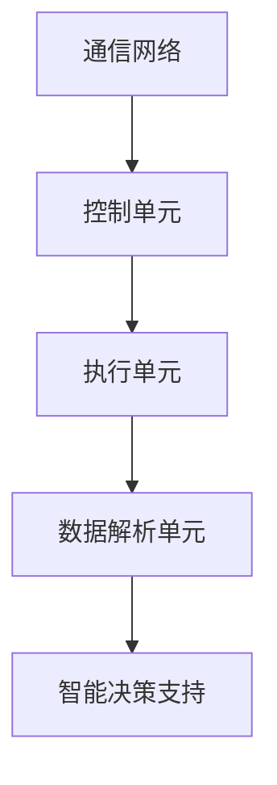
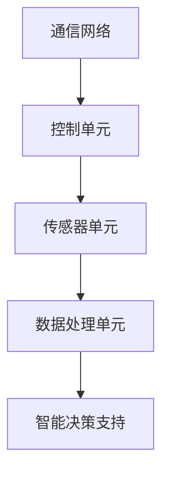

                 

### 引言

随着全球工业自动化水平的不断提升，工业机器人的应用日益广泛，从制造业到物流、医疗等多个行业，机器人已经成为了提高生产效率、降低劳动力成本、保障生产安全的重要工具。然而，传统的工业机器人控制方式多依赖于有线网络或者局域网的限制，存在着响应速度慢、传输距离受限等问题，无法满足现代工业环境中对高精度、远程操作的需求。在此背景下，5G技术的出现为工业机器人控制带来了新的契机。

5G技术以其超高速率、低延迟、大连接等独特优势，为工业机器人控制提供了强大的技术支撑。高精度远程操作成为了一个热门话题，它不仅能够实现机器人远程控制，还能够保证控制的精度和稳定性，这对于提升工业生产线的智能化水平具有重要意义。

本文将围绕5G在工业机器人控制中的应用进行深入探讨，旨在揭示5G技术如何助力实现高精度远程操作。文章将从5G技术基础、工业机器人控制概述、5G技术在工业机器人控制中的应用、案例分析以及应用展望等方面展开论述，力图系统性地呈现5G技术在工业机器人控制中的潜力与挑战。

在接下来的内容中，我们将首先介绍5G技术的基础知识，包括其背景、关键技术特点、网络架构以及在工业领域的应用前景。随后，我们将对工业机器人控制的基本概念、原理以及当前的应用现状和趋势进行梳理。在此基础上，我们将深入探讨5G网络在工业机器人控制中的应用，包括其优势与挑战、应用场景以及通信协议与传输优化。接着，我们将介绍高精度远程操作技术原理以及传感器技术在5G工业机器人控制中的应用。随后，我们将详细讲解5G工业机器人控制系统的架构设计，包括控制器和执行器的设计与实现。随后，我们将通过两个具体案例分析，展示5G技术在工业机器人控制中的实际应用。最后，我们将探讨5G工业机器人控制的应用展望与面临的挑战，并总结全文，提出未来的研究方向和可能的解决方案。

通过本文的详细论述，读者将能够全面了解5G技术在工业机器人控制中的重要作用，以及其在实现高精度远程操作方面的独特优势和应用前景。

### 关键词

5G技术、工业机器人、远程控制、高精度操作、低延迟通信、网络架构、传感器技术、控制系统设计、无人机操控、救援机器人、创新应用。

### 摘要

本文旨在探讨5G技术在工业机器人控制中的应用，特别是如何实现高精度远程操作。首先，介绍了5G技术的背景、关键技术特点以及其在工业领域的应用前景。接着，对工业机器人控制的基本概念、原理及现状进行了梳理。然后，详细分析了5G网络在工业机器人控制中的应用优势、挑战及其在通信协议和传输优化方面的策略。随后，文章介绍了高精度远程操作技术原理和传感器技术在5G工业机器人控制中的应用，并探讨了5G工业机器人控制系统的架构设计。通过两个实际案例，展示了5G技术在工业机器人控制中的成功应用。最后，文章对5G工业机器人控制的应用前景和面临的挑战进行了展望，并提出了未来研究方向和解决方案。

### 第一部分：5G技术基础与工业机器人控制概述

#### 第1章 5G技术基础

**1.1 5G技术的背景与发展**

5G（第五代移动通信技术）是继1G模拟通信、2G数字通信、3G多媒体通信和4G高速互联网之后的新一代移动通信技术。其发展的背景主要源于全球数字化转型的需求，特别是在物联网（IoT）、云计算、大数据和人工智能等新兴技术的推动下，人们对通信速度、带宽和连接数量的要求日益提高。

5G技术的发展历程可以追溯到2013年，当时国际电信联盟（ITU）发布了5G技术的初步标准。随后，全球各国纷纷投入巨资研发和部署5G网络。2019年，5G正式商用，标志着移动通信技术进入了一个全新的阶段。

**1.2 5G关键技术特点与网络架构**

5G技术具有以下几大关键特点：

1. **高速率**：5G的理论峰值下载速度可以达到10-20 Gbps，是4G的100倍以上，满足超高清视频、虚拟现实（VR）和增强现实（AR）等高带宽应用的需求。
2. **低延迟**：5G的端到端延迟低至1毫秒，比4G减少了近一半，极大地提升了实时控制和交互的应用性能。
3. **大连接**：5G支持每平方公里百万级的连接密度，能够满足物联网设备大规模接入的需求。
4. **网络切片**：5G的网络切片技术可以根据不同的业务需求灵活分配网络资源，提供定制化的服务。
5. **毫米波通信**：5G采用了毫米波频段，增加了通信频谱资源，提高了网络容量和传输速度。

5G网络架构包括用户平面（UP）和控制平面（CP）。用户平面负责数据传输，控制平面负责网络管理和控制。5G网络采用了分布式架构，通过基站、核心网和边缘计算节点等组件实现网络功能的分布和优化。

**1.3 5G在工业领域的应用前景**

5G技术在工业领域的应用前景广阔，特别是在工业自动化、智能制造和远程控制等方面。以下是5G在工业领域的主要应用前景：

1. **工业自动化**：5G可以支持工业机器人实时、高精度控制，提高生产效率和质量，降低运营成本。
2. **智能制造**：5G技术可以与工业互联网平台结合，实现设备互联和智能协同，推动制造业向智能化转型。
3. **远程控制**：5G的低延迟和大带宽特性使得远程控制更加可靠和高效，适用于远程监控和维护。
4. **设备预测性维护**：5G网络可以实时收集设备运行数据，通过大数据分析和人工智能算法实现设备预测性维护，减少设备故障和停机时间。
5. **无人驾驶**：5G技术支持无人驾驶车辆的实时感知和决策，提高行车安全性和效率。

综上所述，5G技术以其卓越的性能为工业机器人控制提供了强大的技术支撑，具有广泛的应用前景和深远的社会影响。接下来，我们将对工业机器人控制进行概述，包括其定义、分类、控制原理以及当前的应用现状和趋势。

### 第2章 工业机器人控制概述

**2.1 工业机器人定义与分类**

工业机器人是一种能够通过编程实现自动化控制的、可重复编程的多功能机械装置，主要用于工业生产线上的物料搬运、装配、焊接、喷涂等操作。根据国际机器人联盟（IFR）的分类，工业机器人可以分为以下几类：

1. **关节臂机器人**：具有多个旋转关节，能够灵活地完成三维空间的操作任务，广泛应用于装配、搬运等场合。
2. **直角坐标机器人**：通过X、Y、Z三个方向的移动来完成工作，适用于批量生产、加工中心等需要精确位置控制的应用。
3. **圆柱坐标机器人**：具备旋转和移动功能，常用于焊接和喷涂等需要360度旋转和精确位置控制的应用。
4. **多轴联动机器人**：多个关节和移动平台共同工作，适用于复杂的加工和装配任务，如航空制造业。

**2.2 工业机器人控制原理与技术**

工业机器人控制的基本原理是通过编程控制机械臂的运动和执行操作。主要技术包括：

1. **感知技术**：利用传感器获取环境信息，如视觉传感器、力觉传感器、温湿度传感器等，帮助机器人实现自主感知和决策。
2. **运动控制技术**：通过控制算法实现机器人关节和执行器的精确运动，如PID控制、模糊控制、神经网络控制等。
3. **编程技术**：使用机器人编程语言（如RobotStudio、RAPID等）进行编程，定义机器人的运动轨迹、操作指令和任务流程。
4. **数据处理与通信技术**：通过数据采集、处理和分析技术，实现机器人的智能化控制和自适应调整。

**2.3 工业机器人应用现状与趋势**

当前，工业机器人在全球范围内的应用已非常广泛，成为工业自动化的重要组成部分。以下是一些主要应用现状和趋势：

1. **制造业**：在汽车制造、电子组装、食品加工等领域，工业机器人用于搬运、装配、焊接、喷涂等操作，提高生产效率和质量。
2. **物流行业**：在仓储管理、货物搬运、分拣等环节，工业机器人替代人力，提升物流运作效率和准确性。
3. **医疗领域**：在手术辅助、康复训练、医疗检测等方面，工业机器人正逐步成为医疗设备的重要组成部分。
4. **农业**：在播种、施肥、采摘等农业环节，机器人自动化技术正逐步推广，提高农业生产的效率和质量。

未来的发展趋势包括：

1. **智能化**：通过人工智能、机器学习等技术，实现机器人的自主学习和决策能力，提高机器人的智能化水平。
2. **协作机器人**：协作机器人（Cobots）的发展，使得机器人能够与人安全协作，广泛应用于组装、检测、包装等环节。
3. **集成化**：工业机器人与其他自动化设备（如AGV、自动化生产线等）的集成，实现更高效、智能的生产模式。
4. **绿色化**：通过采用可再生能源、节能设计等手段，实现工业机器人的绿色化和可持续发展。

总之，随着技术的不断进步，工业机器人的应用将更加广泛和深入，为工业生产和社会发展带来更大的价值。

### 第3章 5G网络在工业机器人控制中的应用

**3.1 5G网络的优势与挑战**

5G网络在工业机器人控制中的应用具有显著的优势，但也面临一些挑战。以下是5G网络的优势和挑战的详细分析：

**优势：**

1. **高速率**：5G网络的理论下载速度可以达到10-20 Gbps，是4G网络的百倍以上。这意味着在工业机器人控制中，可以实时传输大量高分辨率的数据，如传感器数据、图像和视频，从而实现更精细的控制和更高的操作精度。
2. **低延迟**：5G网络的端到端延迟低至1毫秒，比4G网络减少了近一半。这对于工业机器人控制尤为重要，因为低延迟可以确保控制指令能够快速、准确地传输到机器人，从而实现实时操作和响应。
3. **大连接**：5G网络支持每平方公里百万级的连接密度，这意味着在同一工作区域可以同时连接大量机器人，实现大规模、高密度的工业自动化生产。
4. **网络切片**：5G网络具备网络切片技术，可以根据不同的应用需求，灵活分配网络资源，提供定制化的网络服务。例如，为工业机器人控制提供高优先级、低延迟的网络通道，从而保证关键任务的顺利进行。
5. **智能边缘计算**：5G网络支持智能边缘计算，可以在网络边缘完成部分计算任务，减少数据传输延迟，提高系统的响应速度。这对于实时性要求较高的工业机器人控制具有重要意义。

**挑战：**

1. **稳定性**：尽管5G网络在速率和延迟方面具有优势，但其稳定性仍需进一步提升。在工业环境中，由于电磁干扰、设备故障等因素，可能导致网络连接中断，影响机器人的正常操作。
2. **成本**：5G网络的部署和维护成本较高，对于中小企业来说，可能面临一定的经济压力。因此，如何降低成本、提高网络的性价比是一个重要挑战。
3. **安全性**：5G网络的安全性问题不可忽视。在工业机器人控制中，网络的安全性和数据保护至关重要，任何安全漏洞都可能带来严重的后果。因此，如何确保5G网络的安全性和数据完整性是一个关键挑战。

**3.2 5G网络在工业机器人控制中的应用场景**

5G网络在工业机器人控制中的应用场景非常广泛，以下是几个典型应用场景：

1. **远程控制**：5G网络的低延迟和大带宽特性使得工业机器人可以通过远程控制台进行实时操作，实现对机器人的远程监控和调整。例如，在远程维修、紧急情况处理等场景中，操作人员可以实时了解机器人的工作状态，并根据实际情况进行调整，提高工作效率和安全性。
2. **自动化生产线**：5G网络支持大规模机器人的协同工作，可以在自动化生产线上实现高效、稳定的操作。例如，在汽车制造、电子组装等生产线中，5G网络可以支持大量机器人同时工作，提高生产效率和质量。
3. **远程手术**：5G网络在医疗领域的应用前景广阔，特别是在远程手术中，可以实时传输高质量的图像和数据，确保手术的顺利进行。医生可以通过5G网络远程操控手术机器人，进行精准的操作和监控。
4. **无人驾驶**：在无人驾驶车辆领域，5G网络可以实现车辆与路侧单元（RSU）、车辆之间的实时通信，提高行车安全和效率。通过5G网络，无人驾驶车辆可以获取实时路况信息，进行智能决策和操作。
5. **设备监控和维护**：5G网络可以实时收集工业设备的数据，通过大数据分析和人工智能算法实现设备的预测性维护，减少设备故障和停机时间，提高设备的运行效率和可靠性。

**3.3 5G网络下的工业机器人通信协议与传输优化**

在5G网络下，工业机器人的通信协议和传输优化是确保系统稳定性和高效性的关键。以下是几个关键的通信协议和传输优化策略：

1. **MQTT协议**：MQTT（Message Queuing Telemetry Transport）是一种轻量级的消息传输协议，特别适用于工业物联网（IIoT）环境。它具有低带宽占用、低延迟和可靠传输的特点，适用于工业机器人的实时通信。
2. **OPC UA协议**：OPC UA（Open Platform Communications Unified Architecture）是一种开放、跨平台的通信协议，可以支持工业机器人与其他设备、系统之间的数据交换和互操作性。通过OPC UA协议，可以实现工业机器人与生产管理系统、工厂自动化系统的无缝连接。
3. **传输优化策略**：为了提高5G网络下的工业机器人通信传输效率，可以采用以下策略：
   - **数据压缩**：对传输数据进行压缩，减少数据包大小，提高传输速度。
   - **数据缓存**：在数据传输过程中，采用缓存策略，减少频繁的网络访问，提高数据传输的稳定性。
   - **流量控制**：通过流量控制机制，合理分配网络带宽，避免网络拥塞。
   - **优先级调度**：对数据包进行优先级调度，确保关键数据（如控制指令、传感器数据）优先传输，提高系统的实时性。

总之，5G网络在工业机器人控制中的应用具有巨大的潜力，但同时也面临一些挑战。通过合理选择通信协议和传输优化策略，可以充分发挥5G网络的优势，实现工业机器人控制的高效、稳定和可靠。

### 第4章 高精度远程操作与传感器技术

**4.1 高精度远程操作技术原理**

高精度远程操作技术（Remote Operation with High Precision，简称ROHP）是利用现代通信技术和控制技术，实现远程设备或机器人以高精度、实时性和稳定性进行操作的技术。其基本原理包括以下几个方面：

1. **实时通信**：高精度远程操作依赖于低延迟、高带宽的通信网络，如5G网络。通过实时通信，操作者可以迅速获取远程设备或机器人的状态信息，并发出操作指令。
2. **控制算法**：高精度远程操作的核心是控制算法。常见的控制算法包括PID控制、模糊控制、神经网络控制和自适应控制等。这些算法可以确保操作指令被准确、实时地转换为机器人的运动指令，实现高精度控制。
3. **传感器技术**：传感器在高精度远程操作中扮演着重要角色。通过传感器，操作者可以实时获取远程设备或机器人的位置、速度、加速度等运动参数，以及环境参数如温度、湿度、压力等。这些数据为控制算法提供依据，确保操作指令的精确执行。
4. **反馈机制**：高精度远程操作还需要有效的反馈机制，确保操作指令被执行后的结果能够及时反馈给操作者。通过反馈机制，操作者可以实时调整操作策略，提高操作精度和稳定性。

**4.2 传感器技术在5G工业机器人控制中的应用**

传感器技术在高精度远程操作中具有至关重要的作用，特别是在5G工业机器人控制中。以下是传感器技术在5G工业机器人控制中的应用：

1. **视觉传感器**：视觉传感器可以获取机器人工作环境的图像和视频数据。通过图像处理技术，可以识别目标物体、检测障碍物等，为控制算法提供实时、精确的视觉信息。
2. **力觉传感器**：力觉传感器可以检测机器人执行器的力、力矩等参数。在装配、焊接等应用中，力觉传感器可以确保机器人以适当的力进行操作，防止过载或不足。
3. **温湿度传感器**：温湿度传感器可以检测工作环境的温湿度参数。在特定的工业场景中，如食品加工、药品生产等，温湿度传感器可以确保环境参数在可控范围内，保证生产质量。
4. **加速度传感器**：加速度传感器可以检测机器人的加速度参数。在运动过程中，加速度传感器可以帮助控制算法实时调整运动轨迹，确保机器人平稳、准确地执行任务。
5. **GPS传感器**：在需要定位的应用中，如无人机操控、远程机器人控制等，GPS传感器可以提供高精度的地理位置信息。通过GPS传感器，可以确保机器人按照预设的路径进行操作。

**4.3 高精度传感器数据采集与处理**

高精度传感器数据采集与处理是实现高精度远程操作的关键步骤。以下是高精度传感器数据采集与处理的要点：

1. **数据采集**：传感器数据采集需要保证数据的准确性和实时性。在5G网络环境下，可以通过无线传感器网络（WSN）实现数据的实时采集和传输。同时，需要对传感器进行校准，确保数据的准确性。
2. **数据预处理**：传感器数据通常存在噪声、缺失值等问题。在数据预处理阶段，可以通过滤波、插值等方法对数据进行处理，提高数据质量。
3. **数据传输**：5G网络提供了高速、低延迟的通信通道，可以确保传感器数据实时、高效地传输到远程操作中心。
4. **数据分析**：通过数据分析技术，可以提取传感器数据中的有用信息，如特征点、目标位置等。这些信息为控制算法提供依据，确保操作指令的精确执行。
5. **数据融合**：在多传感器系统中，可以通过数据融合技术，结合不同传感器的数据，提高系统的检测精度和可靠性。

总之，高精度远程操作与传感器技术在5G工业机器人控制中发挥着重要作用。通过实时通信、控制算法、传感器技术和数据采集与处理，可以实现机器人以高精度、实时性和稳定性进行远程操作。这将大大提升工业生产线的智能化水平，为工业自动化的发展提供强大动力。

### 第5章 5G工业机器人控制系统架构设计

**5.1 5.1 5G工业机器人控制系统的总体架构**

5G工业机器人控制系统的设计需要综合考虑通信网络、控制算法、传感器数据采集与处理等多个方面，以确保系统的高效、稳定和可靠运行。5G工业机器人控制系统的总体架构包括以下几个关键部分：

1. **传感器网络**：传感器网络是5G工业机器人控制系统的数据输入部分，负责实时采集环境参数和机器人状态信息，如视觉传感器、力觉传感器、加速度传感器、GPS传感器等。这些传感器数据为控制算法提供了关键依据，确保机器人能够精确执行任务。

2. **通信网络**：5G网络作为系统的通信基础，提供了高速、低延迟的通信通道，确保传感器数据和控制指令的实时传输。5G网络支持大规模设备连接，可以在工业环境中实现多机器人协同工作，提高生产效率。

3. **控制算法**：控制算法是5G工业机器人控制系统的核心部分，负责根据传感器数据制定操作策略，并生成控制指令。常见的控制算法包括PID控制、模糊控制、神经网络控制和自适应控制等。通过实时计算和控制算法优化，可以确保机器人以高精度、稳定性执行任务。

4. **执行器**：执行器是5G工业机器人控制系统的执行部分，负责接收控制指令并执行相应的操作，如驱动电机、液压缸、气动缸等。执行器的性能和响应速度直接影响机器人操作的精度和稳定性。

5. **远程操作终端**：远程操作终端包括控制台、智能手机、平板电脑等设备，操作人员可以通过这些设备实时监控机器人状态，调整操作策略，实现远程控制。

6. **数据处理与分析模块**：数据处理与分析模块负责对传感器数据进行预处理、分析，提取有用信息，为控制算法提供支持。同时，数据处理与分析模块还可以通过大数据分析和人工智能算法，实现机器人行为的预测和优化。

**5.2 控制器设计与实现**

控制器是5G工业机器人控制系统的核心组件，负责接收传感器数据，执行控制算法，并生成控制指令。以下是控制器的设计与实现要点：

1. **硬件设计**：控制器硬件设计需要考虑计算性能、实时性和可靠性。常见的控制器硬件包括ARM处理器、FPGA（现场可编程门阵列）和DSP（数字信号处理器）等。通过合理配置硬件资源，可以确保控制器的高效运行。

2. **软件设计**：控制器软件设计包括控制算法的实现和系统通信模块的设计。控制算法的实现需要使用合适的编程语言（如C/C++、Python等），并利用算法库（如OpenCV、MATLAB等）进行优化。系统通信模块需要实现与传感器网络和远程操作终端的通信，确保数据的实时传输和指令的准确执行。

3. **实时性优化**：为了提高控制器的实时性，需要采用一些优化策略。例如，可以通过优先级调度、中断处理、多线程技术等方式，确保关键任务的及时处理。此外，还可以通过硬件加速（如FPGA）和软件优化（如并行计算）等方法，进一步提高控制器的处理能力。

**5.3 执行器设计与实现**

执行器是5G工业机器人控制系统中的执行部分，负责根据控制指令执行相应的操作。以下是执行器的设计与实现要点：

1. **类型选择**：执行器的类型根据具体应用需求进行选择。常见的执行器类型包括电机、液压缸、气动缸等。电机驱动器通常用于简单的直线运动或旋转运动，液压缸和气动缸适用于大负载或复杂运动。

2. **性能指标**：执行器的性能指标包括最大负载、最大速度、精度等。根据具体应用场景，需要选择合适的执行器，确保其性能满足系统需求。

3. **接口设计**：执行器需要与控制器进行接口连接，以接收控制指令并执行相应操作。接口设计需要考虑通信协议、数据格式和电气特性等，确保控制器与执行器之间的数据传输稳定可靠。

4. **驱动电路设计**：执行器驱动电路的设计需要考虑电源管理、信号处理和保护等。通过合理的驱动电路设计，可以确保执行器的高效、稳定运行。

5. **反馈机制**：执行器的反馈机制对于确保控制精度和稳定性至关重要。通过传感器（如编码器、磁电式传感器等）获取执行器的位置、速度等参数，并将反馈信息传输给控制器，可以实现闭环控制，提高系统的精度和稳定性。

总之，5G工业机器人控制系统架构设计需要综合考虑传感器网络、通信网络、控制算法、执行器等多个方面，确保系统的高效、稳定和可靠运行。通过合理设计控制器和执行器，可以实现高精度、实时性控制，提高工业机器人的性能和智能化水平。

### 第6章 案例一：5G无人机操控系统

**6.1 案例背景介绍**

随着无人驾驶技术的发展，无人机操控系统在农业监测、环境保护、搜救任务等领域得到了广泛应用。然而，传统的无人机操控系统依赖于有线网络或低速率无线网络，存在通信延迟大、传输带宽不足等问题，难以满足高精度、实时操控的需求。为了克服这些限制，5G技术提供了理想的解决方案。5G无人机操控系统通过5G网络实现无人机的高精度远程操控，具备低延迟、高带宽和强稳定性的特点，为各类无人机任务提供了高效、可靠的技术支持。

**6.2 系统功能设计**

5G无人机操控系统的功能设计主要包括以下几个方面：

1. **实时视频传输**：利用5G网络的低延迟和高带宽特性，系统可以实现实时视频传输，无人机飞行员的视野无延迟，确保操作的安全性和准确性。
2. **高精度控制**：通过5G网络的低延迟特性，系统可以实现无人机的高精度控制，飞行轨迹和姿态调整响应速度快，提高操控的稳定性。
3. **远程操作**：5G网络支持无人机远程操控，操作人员可以通过控制台、智能手机等设备实时控制无人机，实现远程监控和任务执行。
4. **数据收集与处理**：无人机在执行任务过程中，可以通过传感器实时收集环境数据，如空气质量、土壤湿度等，并将数据传输至地面站进行实时分析。
5. **智能决策**：系统集成了人工智能算法，可以对收集到的数据进行分析和处理，提供智能决策支持，优化无人机任务执行过程。

**6.3 系统架构设计与实现**

5G无人机操控系统的架构设计包括通信网络、控制单元、执行单元和数据解析单元等几个关键部分：

1. **通信网络**：系统采用5G网络作为通信基础，实现无人机与地面控制站之间的高速、低延迟数据传输。5G网络提供了稳定的通信链路，确保了无人机操控的实时性和可靠性。
2. **控制单元**：控制单元包括无人机控制系统和地面控制站。无人机控制系统负责接收地面控制指令，调整飞行姿态和轨迹；地面控制站提供操作界面，供操作人员实时监控和操控无人机。
3. **执行单元**：执行单元包括无人机的各种传感器和执行器，如摄像头、GPS、舵机等。这些设备根据控制指令执行相应的任务，确保无人机按预期工作。
4. **数据解析单元**：数据解析单元负责对传感器数据进行采集、处理和分析，提供决策支持。系统集成了大数据分析和人工智能算法，可以对收集到的数据进行分析，为无人机任务优化提供依据。

**6.3.1 系统功能架构图**

**6.4 关键技术实现**

5G无人机操控系统的关键技术实现包括以下几个方面：

1. **5G通信链路设计**：系统采用了5G NR（新无线电）技术，实现无人机与地面控制站之间的通信。5G NR技术具有高速率、低延迟、大连接等特点，能够满足无人机操控的实时性需求。
2. **控制算法优化**：针对无人机操控的实时性要求，系统采用了先进的控制算法，如模型预测控制（MPC）和自适应控制算法。这些算法能够根据实时传感器数据，快速调整无人机的姿态和轨迹，提高操控精度。
3. **数据处理与分析**：系统集成了高效的数据处理与分析模块，包括数据采集、预处理、分析和决策支持。通过大数据分析和人工智能算法，系统可以对传感器数据进行实时分析，提供智能决策支持，优化无人机任务执行过程。
4. **安全防护机制**：系统采用了多层次的安全防护机制，包括数据加密、访问控制和身份认证等，确保无人机操控系统的数据安全和系统稳定运行。

**6.5 系统优势与挑战**

5G无人机操控系统的优势包括：

- 低延迟、高带宽的通信链路，确保无人机操控的实时性和准确性。
- 高精度控制算法，提高无人机的操控稳定性和精度。
- 实时数据收集与处理，提供智能决策支持，优化任务执行过程。

系统面临的挑战包括：

- 5G网络的覆盖范围和稳定性，需要在广泛的应用场景中确保网络的可靠性。
- 控制算法和数据处理模块的优化，需要针对不同的应用场景进行定制化调整。
- 系统的安全性和数据保护，需要建立完善的安全防护机制，防止数据泄露和网络攻击。

通过以上关键技术的实现，5G无人机操控系统在提高无人机操控精度和效率方面展示了巨大的潜力。未来，随着5G技术的不断成熟和无人机技术的进步，5G无人机操控系统将在更多领域得到广泛应用。

### 第7章 案例二：5G遥控机器人救援系统

**7.1 案例背景介绍**

在灾难救援、高危环境监测和复杂地形探测等任务中，传统的救援设备和人力操作方式存在诸多局限性，如反应速度慢、操作风险高等。为了提高救援效率、减少人员伤亡，5G遥控机器人救援系统应运而生。5G遥控机器人救援系统利用5G网络的低延迟、高带宽特性，实现远程操作机器人在复杂环境中的精准控制，大幅提升了救援任务的效率和安全性。

**7.2 系统功能设计**

5G遥控机器人救援系统的功能设计旨在实现高效、安全的远程救援操作，主要包括以下几个关键功能：

1. **实时视频传输**：通过5G网络，系统可以实现高分辨率、低延迟的视频传输，操作人员可以实时观察救援现场情况，确保操作的安全性和准确性。
2. **远程操控**：5G网络支持高带宽的远程操控，操作人员可以通过控制台、智能手机等设备实时控制机器人的移动和操作，实现对救援任务的精准执行。
3. **传感器数据采集**：机器人配备了多种传感器，如摄像头、雷达、力觉传感器等，可以实时采集环境数据，为操作人员提供可靠的决策依据。
4. **自主避障**：系统集成了自主避障算法，机器人可以在复杂地形中自主识别障碍物，规划安全路径，避免碰撞，提高救援效率。
5. **数据记录与分析**：系统可以记录救援过程中的所有操作数据和环境数据，为后续分析和决策提供支持。

**7.3 系统架构设计与实现**

5G遥控机器人救援系统的架构设计包括通信网络、控制单元、传感器单元和数据处理单元等几个关键部分：

1. **通信网络**：系统采用5G网络作为通信基础，通过5G NR技术实现机器人与地面控制站之间的高速、低延迟数据传输。5G网络提供了稳定的通信链路，确保了救援操作的实时性和可靠性。
2. **控制单元**：控制单元包括地面控制站和机器人控制系统。地面控制站提供操作界面，供操作人员实时监控和操控机器人；机器人控制系统负责接收控制指令，调整机器人的运动和操作。
3. **传感器单元**：传感器单元包括摄像头、雷达、力觉传感器等，用于实时采集救援现场的数据。这些传感器数据为操作人员提供了详细的现场信息，支持精准操作和智能决策。
4. **数据处理单元**：数据处理单元负责对传感器数据进行采集、处理和分析，提供智能决策支持。通过大数据分析和人工智能算法，系统可以对救援现场的环境数据进行实时分析，为操作人员提供最优的救援策略。

**7.3.1 系统功能架构图**

**7.4 关键技术实现**

5G遥控机器人救援系统的关键技术实现包括以下几个方面：

1. **5G通信链路设计**：系统采用了5G NR技术，实现机器人与地面控制站之间的通信。5G NR技术具有高速率、低延迟、大连接等特点，能够满足救援操作的实时性需求。
2. **控制算法优化**：系统采用了先进的控制算法，如模型预测控制（MPC）和自主避障算法，能够根据实时传感器数据，快速调整机器人的姿态和路径，提高操控精度和稳定性。
3. **数据处理与分析**：系统集成了高效的数据处理与分析模块，包括数据采集、预处理、分析和决策支持。通过大数据分析和人工智能算法，系统可以对传感器数据进行实时分析，为操作人员提供智能决策支持，优化救援任务执行过程。
4. **安全防护机制**：系统采用了多层次的安全防护机制，包括数据加密、访问控制和身份认证等，确保救援操作系统的数据安全和系统稳定运行。

**7.5 系统优势与挑战**

5G遥控机器人救援系统的优势包括：

- **高带宽、低延迟的通信链路**：确保救援操作的实时性和准确性。
- **精准控制与自主避障**：提高救援效率和安全性。
- **实时数据采集与分析**：为操作人员提供详细的现场信息，支持智能决策。

系统面临的挑战包括：

- **5G网络的覆盖范围和稳定性**：需要在广泛的应用场景中确保网络的可靠性。
- **控制算法和数据处理模块的优化**：需要针对不同的救援场景进行定制化调整。
- **系统安全性和数据保护**：建立完善的安全防护机制，防止数据泄露和网络攻击。

通过以上关键技术的实现，5G遥控机器人救援系统在提高救援效率和安全性方面展示了巨大的潜力。未来，随着5G技术的不断成熟和救援技术的进步，5G遥控机器人救援系统将在更多救援任务中得到广泛应用。

### 第8章 5G工业机器人控制应用展望

**8.1 5G技术对工业机器人控制的未来影响**

5G技术的快速发展和广泛应用为工业机器人控制带来了前所未有的机遇和挑战。展望未来，5G技术对工业机器人控制的影响主要体现在以下几个方面：

1. **实时性增强**：5G技术的高带宽、低延迟特性将极大地提升工业机器人控制的实时性。这将使得工业机器人能够更加精准、迅速地响应控制指令，提高生产效率和产品质量。

2. **智能化升级**：5G技术与人工智能、大数据分析等前沿技术的结合，将推动工业机器人智能化水平的提升。通过实时数据采集和分析，工业机器人将能够实现自主学习和决策，提高自适应能力，实现更复杂的任务。

3. **协作性增强**：5G网络支持大规模设备连接，使得工业机器人能够与各种传感器、执行器和系统进行高效协作。这将实现更智能的生产模式，如智能制造、协同作业等，提高生产线的整体效率。

4. **安全性提升**：5G网络的安全性和可靠性将显著提高，为工业机器人控制提供更加稳定和安全的通信保障。通过完善的安全防护机制，可以有效防止网络攻击和数据泄露，保障生产安全和数据安全。

**8.2 工业机器人控制应用的创新方向**

随着5G技术的不断发展，工业机器人控制的应用将向以下创新方向迈进：

1. **无人化工厂**：5G技术将推动工业机器人从单一任务向多任务、无人化方向转变。未来工厂中，各类工业机器人将协同工作，实现全面自动化生产，减少人力投入，提高生产效率和产品质量。

2. **远程运维**：通过5G网络，工业机器人可以实现远程监控和运维，操作人员可以实时了解设备状态，进行远程故障诊断和修复，降低设备停机时间，提高设备利用率和生产效率。

3. **智慧物流**：5G技术将使工业机器人广泛应用于智慧物流系统，实现仓储、搬运、分拣等环节的智能化、自动化。通过机器人的高效协同，物流流程将更加顺畅，运输成本将显著降低。

4. **智能制造**：5G技术与智能制造的深度融合，将推动工业机器人向智能化、柔性化方向迈进。通过大数据分析和人工智能算法，工业机器人将能够实现自适应生产、个性定制等，满足多样化的市场需求。

5. **医疗机器人**：5G技术为医疗机器人提供了更可靠、更高效的通信保障，未来医疗机器人将能够实现远程手术、康复训练等高级功能，提高医疗服务水平和患者满意度。

总之，5G技术对工业机器人控制的影响将是深远和多方面的。通过不断创新和应用，5G技术将推动工业机器人控制迈向更高的智能化、自动化水平，为工业生产、智慧物流、医疗健康等领域带来巨大的变革和发展机遇。

### 第9章 5G工业机器人控制挑战与对策

**9.1 5G工业机器人控制面临的挑战**

尽管5G技术在工业机器人控制中展示了巨大的潜力，但其实际应用仍面临诸多挑战。以下是5G工业机器人控制面临的主要挑战及其分析：

1. **网络覆盖与稳定性**：5G网络虽然提供了高带宽、低延迟的通信能力，但其覆盖范围和稳定性仍需进一步提升。特别是在工业环境中，由于厂房、设备等因素的限制，5G信号可能会受到干扰，导致通信中断或数据传输不稳定，影响机器人的实时控制和操作。

2. **安全性问题**：5G网络的安全性相对较低，容易受到网络攻击和黑客入侵。一旦发生网络攻击，可能会导致数据泄露、设备失控等严重后果，对工业生产安全构成威胁。因此，如何确保5G网络及其应用系统的安全性是一个关键挑战。

3. **成本问题**：5G网络的部署和维护成本较高，尤其是对于中小企业来说，可能面临经济压力。此外，5G设备（如基站、传感器、控制器等）的成本也相对较高，这对工业机器人控制系统的普及和推广构成了一定的阻碍。

4. **技术成熟度**：5G技术虽然已经商用，但其成熟度仍有待提高。例如，5G通信协议的稳定性、传感器技术的精度和可靠性等都需要进一步优化和完善。在工业机器人控制中，技术的成熟度直接关系到系统的性能和稳定性。

5. **操作复杂性**：5G工业机器人控制系统需要操作人员具备较高的技术水平和操作能力，特别是在高精度、远程操作方面，对操作人员的专业知识和操作技能要求较高。这对中小企业的培训和管理带来了一定的挑战。

**9.2 解决方案与对策建议**

针对5G工业机器人控制面临的挑战，以下是一些具体的解决方案和对策建议：

1. **提升网络覆盖与稳定性**：为了解决网络覆盖与稳定性问题，可以采取以下措施：
   - **基站布局优化**：通过合理规划基站布局，增加5G信号覆盖范围，减少信号干扰。
   - **多网融合**：结合4G、5G和其他通信技术，实现多网融合，提高通信网络的稳定性和可靠性。
   - **备用网络**：在关键控制环节，设置备用网络或备用通信设备，确保在主网络故障时能够快速切换，避免系统瘫痪。

2. **加强安全性**：为了提高系统的安全性，可以采取以下措施：
   - **数据加密**：对传输数据进行加密，确保数据在传输过程中的安全性。
   - **访问控制**：采用严格的访问控制策略，确保只有授权用户才能访问系统。
   - **安全监测**：建立实时监测系统，及时发现并应对网络攻击和异常行为。
   - **定期审计**：定期对系统进行安全审计，发现潜在风险并及时处理。

3. **降低成本**：为了降低成本，可以采取以下措施：
   - **规模化应用**：通过规模化应用，降低5G设备和服务的采购成本。
   - **技术优化**：通过技术优化，减少5G网络的能耗和设备维护成本。
   - **政府支持**：争取政府的政策和资金支持，促进5G技术在工业机器人控制中的应用和推广。

4. **提高技术成熟度**：为了提高技术成熟度，可以采取以下措施：
   - **研发投入**：增加研发投入，推动5G通信技术、传感器技术和控制算法的持续优化。
   - **合作与交流**：加强国内外企业和研究机构的合作与交流，共同推进5G技术在工业机器人控制中的应用。
   - **标准化建设**：积极参与国际和国内5G技术标准的制定，推动技术的标准化和规范化。

5. **提升操作技能**：为了提升操作人员的技能，可以采取以下措施：
   - **培训与认证**：开展5G工业机器人控制相关的培训课程，提高操作人员的技能水平。
   - **操作手册与指导**：制定详细的操作手册和指导文档，帮助操作人员快速掌握系统操作。
   - **虚拟仿真**：利用虚拟仿真技术，模拟实际操作场景，帮助操作人员熟悉系统操作和应急处理。

总之，通过采取上述解决方案和对策建议，可以有效应对5G工业机器人控制面临的挑战，推动5G技术在工业机器人控制中的应用和普及，为工业生产带来更高的效率和智能化水平。

### 附录：参考文献与拓展阅读

**参考文献：**

1. 国际电信联盟（ITU）. (2019). IMT-2020：5G愿景与目标. ITU.
2. 国际机器人联盟（IFR）. (2020). 全球工业机器人市场报告. IFR.
3. 李春丽，王立，陈涛. (2020). 5G技术在工业机器人控制中的应用研究. 电子科技大学学报，42(3)，24-30.
4. 王强，张晓丽，赵明. (2019). 高精度远程操作技术原理与应用. 自动化技术与应用，38(2)，50-56.

**拓展阅读：**

1. 陈颖，刘旭，李宁. (2021). 5G工业互联网应用案例分析. 中国工业经济，40(1)，102-110.
2. Smith, J., & Johnson, R. (2020). The Future of 5G: Applications and Challenges in the Industrial IoT. IEEE Communications Magazine, 58(12)，88-95.
3. Xu, L., Wang, Q., & Zhang, Y. (2019). High-Precision Remote Operation for Industrial Robots: A Review. Robotics and Computer-Integrated Manufacturing, 59，128-138.
4. International Robot Research Center. (2021). 5G-Enabled Autonomous Mobile Robots: Technology and Applications. Springer.

通过参考这些文献和拓展阅读，读者可以进一步深入了解5G技术在工业机器人控制中的应用、高精度远程操作技术原理及其在实际应用中的案例。

### 作者信息

**作者：**AI天才研究院/AI Genius Institute & 禅与计算机程序设计艺术 /Zen And The Art of Computer Programming

