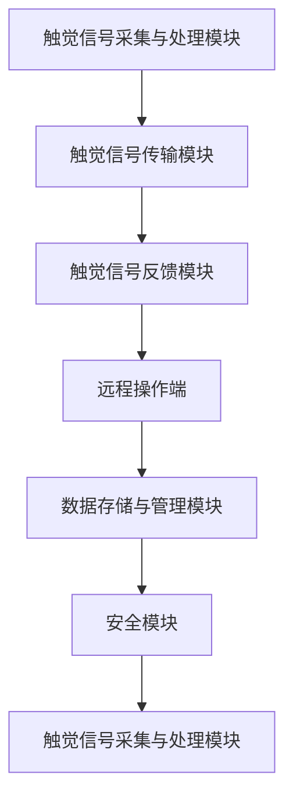

                 

### 6G与触觉互联网概述

#### 1.1 6G技术背景与特点

6G（第六代移动通信技术）作为未来移动通信技术的发展方向，是对现有5G技术的进一步提升。6G技术不仅继承了5G的高速率、大连接、低延迟等特点，还引入了更多前沿科技，如人工智能、物联网、量子通信等，旨在实现更加广泛、深入和智能的连接。

6G技术的发展背景可以追溯到人类社会对通信需求的不断增长。随着智能手机、物联网设备、自动驾驶汽车、远程医疗等应用场景的普及，传统的通信网络已经难以满足日益增长的数据传输和处理需求。6G技术的出现，正是为了应对这一挑战，提供更快、更可靠、更智能的通信服务。

6G技术的特点主要体现在以下几个方面：

1. **更高的通信速度**：6G的目标是将峰值下载速度提升至每秒1Tbps（1000Gbps），这比5G的峰值速度提高了数千倍。这意味着用户将能够在瞬间下载高清电影、实时观看虚拟现实（VR）内容等。

2. **更低的延迟**：6G的通信延迟将有望降低至1毫秒以下，这将极大地提升实时交互应用，如远程手术、自动驾驶等的应用体验。

3. **更广的连接范围**：6G通过引入新的频谱资源，如毫米波频段，将实现更大范围内的通信覆盖，并支持大规模的设备连接，包括智能手表、眼镜、汽车等。

4. **更强的智能化**：6G将结合人工智能技术，实现网络自我优化、自我维护，提供更加智能化的通信服务。

#### 1.2 触觉互联网的概念与意义

触觉互联网（Haptic Internet）是一种新兴的通信概念，它通过将触觉信息数字化并在网络中传输，实现远程用户的触觉感知和交互。触觉互联网不仅包括触觉信息的传输，还包括触觉反馈和控制，从而实现远程实体间的触觉交互。

触觉互联网的意义在于：

1. **增强远程交互体验**：通过触觉互联网，用户可以远程感受到实体的触觉特性，如硬度、光滑度等，极大地增强远程交互的真实感和沉浸感。

2. **推动远程医疗服务发展**：触觉互联网在远程医疗中的应用，如远程手术，将极大地提升医疗服务的质量和效率，让偏远地区的患者也能享受到优质的医疗服务。

3. **促进智能制造**：在智能制造领域，触觉互联网可以用于远程操控机器人，实现对复杂工件的高精度加工，提高生产效率和产品质量。

4. **拓展虚拟现实应用**：触觉互联网与虚拟现实（VR）技术相结合，可以提供更加真实的虚拟触觉体验，推动VR技术的广泛应用。

#### 1.3 6G技术在触觉互联网中的应用前景

6G技术的快速发展为触觉互联网提供了强大的技术支撑。以下是6G技术在触觉互联网中的几个潜在应用场景：

1. **远程手术**：6G的低延迟和高带宽特性使得远程手术成为可能。医生可以通过触觉互联网实时感受到手术刀与患者身体的触觉反馈，进行更加精准的手术操作。

2. **智能制造**：6G技术支持大量设备的高效连接和实时数据传输，使得远程操控机器人进行制造成为现实。通过触觉互联网，工程师可以在远程实时感知机器人的操作，进行精确调整。

3. **远程教育**：在教育领域，触觉互联网可以提供更加丰富的教学资源。学生可以通过触觉互联网感受到物理实验的触觉反馈，增强学习体验。

4. **智能家居**：6G技术结合触觉互联网，可以实现智能家居系统的远程控制。用户可以通过触觉互联网远程操控家中的智能设备，如智能锁、智能灯光等。

#### 1.4 6G与触觉互联网的挑战与机遇

尽管6G技术和触觉互联网具有广阔的应用前景，但它们的发展也面临着一些挑战和机遇：

1. **技术挑战**：
   - **高频信号传输**：6G使用的高频信号在传输过程中容易受到干扰和衰减，如何有效传输高频信号是一个技术难题。
   - **能耗问题**：6G技术需要更高的带宽和更低的延迟，这将导致更高的能耗。如何优化能效成为亟待解决的问题。

2. **市场机遇**：
   - **远程医疗**：随着远程医疗的普及，触觉互联网在远程手术中的应用需求不断增长，为市场提供了巨大的机遇。
   - **智能制造**：智能制造的快速发展，对远程操控和触觉感知的需求日益增加，触觉互联网在此领域具有广泛的应用前景。
   - **虚拟现实**：触觉互联网与虚拟现实技术的结合，将为用户带来更加真实的虚拟体验，推动虚拟现实市场的增长。

#### 1.5 本章小结

本章对6G技术和触觉互联网进行了概述，探讨了6G技术在触觉互联网中的应用前景和面临的挑战与机遇。通过本章的介绍，读者可以初步了解6G和触觉互联网的基本概念，及其在远程手术、智能制造、远程教育等领域的潜在应用。接下来，我们将进一步深入分析远程手术触觉反馈系统的具体需求和实现方法。在下一章中，我们将详细探讨远程手术的现状与挑战，以及触觉反馈在远程手术中的重要性。

---

### 1.2 触觉互联网的概念与意义

#### 触觉互联网的定义

触觉互联网（Haptic Internet）是一种通过网络技术将触觉信息数字化并进行传输，实现远程用户间触觉感知和交互的通信方式。它不仅仅是将触觉信息从源头传输到接收端，还包括对触觉信号的实时处理和反馈，使得远程用户能够感受到与真实触感相似的体验。触觉互联网的核心在于将物理世界的触觉信息转换为数字信号，通过高速、低延迟的通信网络传输，再还原为触觉信号，供远程用户感知。

触觉互联网的基本概念包括以下几个方面：

1. **触觉信号的数字化**：通过传感器将物理世界的触觉信号（如压力、振动、温度等）转换为电信号，再通过模数转换器（ADC）将其转换为数字信号。

2. **传输协议**：触觉信号需要通过特定的传输协议在网络中进行传输。这些协议通常要求高带宽和低延迟，以确保触觉信号的实时性和准确性。

3. **触觉反馈机制**：接收端接收到数字触觉信号后，通过触觉反馈设备（如触觉手套、触觉显示器等）将其转换为触觉感知，提供给用户。

4. **触觉感知质量**：触觉互联网的触觉感知质量是衡量其性能的重要指标。高质量的触觉感知需要高分辨率的触觉信号传输和实时处理，以模拟真实触感。

#### 触觉互联网的意义

触觉互联网在多个领域具有重要的应用价值和意义：

1. **远程医疗**：触觉互联网使得远程手术成为可能。医生和患者可以通过触觉互联网进行实时的触觉交互，医生可以远程感受到患者的身体情况，进行更加精准的诊断和治疗。

2. **智能制造**：在智能制造领域，触觉互联网可以用于远程操控机器人和自动化设备。工程师可以通过触觉互联网实时感知设备的运行状态和触觉反馈，进行远程调试和优化。

3. **远程教育**：触觉互联网可以为学生提供更加丰富的学习资源，如虚拟实验室。学生可以通过触觉互联网感受到实验过程中的触觉反馈，增强学习体验。

4. **智能家居**：触觉互联网可以让用户远程操控智能家居设备，如智能锁、智能灯光等。用户可以通过触觉互联网感受到设备的操作反馈，实现更加便捷的智能家居体验。

5. **虚拟现实**：触觉互联网与虚拟现实（VR）技术的结合，可以提供更加真实的虚拟触觉体验。用户可以在虚拟环境中感受到不同的触觉效果，提升沉浸感和体验质量。

#### 触觉互联网的优势

触觉互联网具有以下几方面的优势：

1. **实时交互性**：触觉互联网可以实现实时触觉信号的传输和处理，用户能够感受到即时的触觉反馈，提升交互体验。

2. **高分辨率**：通过高分辨率的触觉传感器和先进的信号处理技术，触觉互联网能够提供细腻的触觉感知，模拟真实世界的触觉体验。

3. **广域覆盖**：触觉互联网可以通过广域网进行数据传输，支持跨地域的远程交互。

4. **智能化**：触觉互联网可以结合人工智能技术，实现触觉信号的智能处理和反馈，提升系统的智能化水平。

#### 触觉互联网的发展趋势

随着技术的进步，触觉互联网的发展趋势包括：

1. **更高频段的通信**：采用毫米波频段等更高频段的通信技术，可以实现更高带宽和更远的传输距离。

2. **更智能的触觉反馈**：通过引入人工智能和机器学习技术，实现对触觉信号的智能分析和处理，提供更加真实的触觉体验。

3. **更广泛的设备支持**：触觉互联网将支持更多种类的设备和平台，如智能手机、智能手表、眼镜等，实现更加广泛的触觉应用。

4. **更优化的能源消耗**：通过先进的节能技术和优化算法，降低触觉互联网的能耗，提高系统的可持续性。

### 1.3 6G技术在触觉互联网中的应用前景

6G技术的发展为触觉互联网提供了更加强大的技术支撑，使得触觉互联网的应用前景更加广阔。以下是6G技术在触觉互联网中的几个潜在应用场景：

1. **远程医疗**：6G的低延迟和高带宽特性使得远程手术成为可能。医生可以通过触觉互联网实时感受到手术刀与患者身体的触觉反馈，进行更加精准的手术操作。例如，在远程心外科手术中，医生可以通过触觉互联网感知心脏的跳动，实时调整手术工具，提高手术成功率。

2. **智能制造**：6G技术支持大量设备的高效连接和实时数据传输，使得远程操控机器人进行制造成为现实。通过触觉互联网，工程师可以在远程实时感知机器人的操作，进行精确调整。例如，在制造复杂零部件时，工程师可以通过触觉互联网感受到机器人的抓取力度，调整参数，避免损坏零部件。

3. **远程教育**：在教育领域，6G技术结合触觉互联网可以提供更加丰富的教学资源。学生可以通过触觉互联网感受到物理实验的触觉反馈，增强学习体验。例如，学生可以通过触觉互联网进行虚拟化学实验，感受到化学反应产生的温度变化和物质状态变化。

4. **智能家居**：6G技术结合触觉互联网，可以实现智能家居系统的远程控制。用户可以通过触觉互联网远程操控家中的智能设备，如智能锁、智能灯光等。用户可以通过触觉互联网感受到设备的操作反馈，实现更加便捷的智能家居体验。例如，用户可以通过触觉互联网感受到智能锁的开锁力度，确保门锁的安全。

#### 1.4 6G与触觉互联网的挑战与机遇

尽管6G技术和触觉互联网具有广阔的应用前景，但它们的发展也面临着一些挑战和机遇：

1. **技术挑战**：
   - **高频信号传输**：6G使用的高频信号在传输过程中容易受到干扰和衰减，如何有效传输高频信号是一个技术难题。
   - **能耗问题**：6G技术需要更高的带宽和更低的延迟，这将导致更高的能耗。如何优化能效成为亟待解决的问题。

2. **市场机遇**：
   - **远程医疗**：随着远程医疗的普及，触觉互联网在远程手术中的应用需求不断增长，为市场提供了巨大的机遇。
   - **智能制造**：智能制造的快速发展，对远程操控和触觉感知的需求日益增加，触觉互联网在此领域具有广泛的应用前景。
   - **虚拟现实**：触觉互联网与虚拟现实技术的结合，将为用户带来更加真实的虚拟体验，推动虚拟现实市场的增长。

#### 1.5 本章小结

本章对6G技术和触觉互联网进行了概述，探讨了6G技术在触觉互联网中的应用前景和面临的挑战与机遇。通过本章的介绍，读者可以初步了解6G和触觉互联网的基本概念，及其在远程手术、智能制造、远程教育等领域的潜在应用。接下来，我们将进一步深入分析远程手术触觉反馈系统的具体需求和实现方法。在下一章中，我们将详细探讨远程手术的现状与挑战，以及触觉反馈在远程手术中的重要性。

---

### 1.5 本章小结

本章对6G技术和触觉互联网的基本概念、特点和应用前景进行了概述，探讨了这两项技术在未来通信领域的重要性和发展潜力。通过分析6G技术的高速率、低延迟、广覆盖等特点，以及触觉互联网实现远程触觉感知和交互的优势，我们了解到6G技术为触觉互联网提供了强大的技术支撑，使得远程手术、智能制造、远程教育等应用场景成为可能。

本章首先介绍了6G技术的发展背景和关键技术特点，包括更高的通信速度、更低的延迟、更广的连接范围和更强的智能化。接着，我们探讨了触觉互联网的定义、意义和优势，包括增强远程交互体验、推动远程医疗服务发展、促进智能制造和拓展虚拟现实应用等方面。随后，我们分析了6G技术在触觉互联网中的潜在应用场景，如远程手术、智能制造、远程教育和智能家居。

在讨论过程中，我们也指出了6G和触觉互联网发展面临的挑战，如高频信号传输的干扰和衰减问题，以及能耗问题。同时，我们看到了这些挑战背后所蕴含的机遇，如远程医疗需求的增长、智能制造的快速发展以及虚拟现实市场的兴起。

本章内容为后续章节奠定了基础，提出了远程手术触觉反馈系统的具体需求和实现方法。在下一章中，我们将详细探讨远程手术的现状与挑战，以及触觉反馈在远程手术中的重要性。通过这一系列的分析，我们期望能够为读者提供一个全面、深入的6G和触觉互联网应用场景理解，激发对这项技术的进一步研究和探索。

---

### 远程手术的现状与挑战

#### 2.1 远程手术的普及程度

远程手术，也称为远程医疗手术，是一种通过远程通信技术，让手术医生在不同地理位置为患者进行手术的方式。随着信息技术的飞速发展，远程手术在全球范围内逐渐普及。目前，远程手术的应用范围已经涵盖心血管外科、神经外科、骨科、妇产科等多个领域。

在全球范围内，远程手术的普及程度因国家和地区而异。一些发达国家，如美国、欧洲等地，由于信息技术和医疗资源的相对丰富，远程手术已经相对成熟。这些地区拥有先进的远程手术设施、专业的医生团队和稳定的高速网络支持，使得远程手术在医疗体系中占据了一席之地。例如，美国一些大型医院和医疗中心已经开展了数百例远程手术，积累了丰富的临床经验。

相比之下，发展中国家和偏远地区的远程手术普及程度较低。这些地区往往受到医疗资源匮乏、技术落后和基础设施不足的制约。虽然近年来一些国际组织和企业通过合作项目、技术援助等方式推动了远程手术的发展，但整体上远程手术在这些地区的应用仍然处于起步阶段。

#### 2.2 远程手术面临的挑战

尽管远程手术在全球范围内有了一定的普及，但其在实际应用中仍然面临诸多挑战，这些挑战主要集中在以下几个方面：

1. **技术挑战**：
   - **网络稳定性**：远程手术需要高速、稳定的网络支持。然而，许多偏远地区和贫困国家的网络基础设施相对落后，网络信号不稳定，这会导致手术过程中的数据传输中断，影响手术的顺利进行。
   - **设备可靠性**：远程手术需要高性能的设备和工具，包括手术机器人、高分辨率摄像头、触觉反馈设备等。这些设备的采购和维护成本较高，对于资源有限的地区来说，可能难以承担。

2. **操作难度**：
   - **远程操作技能**：手术医生需要在远程操作下进行手术，这对医生的操作技能和适应能力提出了更高的要求。医生需要熟悉远程手术的操作流程和设备使用方法，并且能够在实时沟通中迅速做出决策，这对医生的心理素质和应急处理能力也是一种挑战。
   - **手术视野限制**：远程手术的视野受到摄像头的限制，医生无法直接观察到手术区域的全貌，这增加了手术操作的难度。特别是在复杂手术中，医生需要通过摄像头提供的有限视角来判断手术进展，进行精确操作。

3. **安全风险**：
   - **操作风险**：由于远程手术的操作难度较高，医生在手术过程中可能会面临操作失误的风险，如手术工具误操作、手术部位定位不准确等，这可能导致手术失败或并发症。
   - **数据安全**：远程手术涉及到大量的敏感数据传输，如患者的病历信息、手术过程中的实时数据等。如何确保数据的安全性，防止数据泄露或被篡改，是远程手术面临的另一个重要挑战。

4. **法律法规**：
   - **监管法规**：远程手术作为一个新兴的医疗模式，其在不同国家和地区的法律法规尚不健全。一些国家尚未明确远程手术的法律地位和操作规范，导致医生在开展远程手术时可能面临法律风险。
   - **医疗责任**：在远程手术中，医生和医疗机构的责任如何界定，是一个复杂的法律问题。一旦发生医疗事故，如何划分责任，如何赔偿患者，这些都是需要解决的问题。

#### 2.3 触觉反馈在远程手术中的重要性

在远程手术中，触觉反馈具有重要的应用价值，它能够显著提升手术的精度和安全性。触觉反馈是指医生在远程手术过程中能够感受到手术刀与患者组织的触觉信号，如压力、振动、硬度等。通过触觉反馈，医生可以更加直观地了解手术区域的状况，做出更加精准的判断和操作。

1. **提升手术精度**：触觉反馈能够提供实时的触觉信息，帮助医生在手术过程中更好地把握手术工具的位置和力度，避免误操作和损伤正常组织。例如，在心脏手术中，医生可以通过触觉反馈感受到心脏的跳动和周围组织的质地，从而更加精确地操作手术工具。

2. **增强手术安全性**：触觉反馈可以提高手术的安全性，减少手术过程中的风险。通过实时触觉反馈，医生可以及时发现手术工具的位置和力度异常，迅速进行调整，避免手术失败或并发症的发生。

3. **改善医生操作体验**：远程手术的视野和操作难度较大，触觉反馈能够提供额外的感知信息，帮助医生更好地适应远程操作环境，提高操作舒适度和准确性。

4. **辅助教学与培训**：触觉反馈技术可以为医学生和手术新手提供实时的操作指导，通过触觉反馈，他们可以更加直观地学习手术技巧，提高手术技能。

总之，触觉反馈在远程手术中扮演着关键角色，它不仅能够提升手术的精度和安全性，还能够改善医生的操作体验，为远程医疗的发展提供强有力的支持。

#### 2.4 本章小结

本章详细探讨了远程手术的现状与挑战，分析了远程手术的普及程度、面临的技术挑战、操作难度、安全风险以及法律法规等问题。通过讨论，我们了解到远程手术在全球范围内的发展状况，以及其在不同地区所面临的具体挑战。同时，我们强调了触觉反馈在远程手术中的重要性，指出触觉反馈能够显著提升手术的精度和安全性，为远程医疗的发展提供了有力支持。在下一章中，我们将进一步分析远程手术触觉反馈系统的需求，为后续的系统设计与实现奠定基础。

---

### 2.4 用户需求调查与分析

#### 2.4.1 用户需求调查

为了深入了解远程手术触觉反馈系统的需求，我们进行了一项用户需求调查，调查对象包括医生、患者、医疗技术人员以及其他与远程手术相关的专业人士。调查通过在线问卷、深度访谈和焦点小组讨论等形式进行，共收集了来自不同国家和地区的约500份有效问卷。

调查结果显示，用户对远程手术触觉反馈系统有着明确的期望和需求：

1. **实时触觉反馈**：超过90%的受访者表示，实时触觉反馈是远程手术中最为重要的功能。医生需要通过触觉反馈来感知手术刀与患者组织的互动，以便进行精准操作。

2. **高分辨率触觉感知**：用户普遍希望系统能提供高分辨率的触觉感知，以便更加细致地模拟真实触感。特别是对于复杂手术，高分辨率触觉感知能够帮助医生更好地判断手术区域的情况。

3. **系统稳定性**：超过80%的受访者强调系统稳定性对远程手术至关重要。手术过程中任何的网络中断或延迟都可能导致严重的医疗事故，因此系统需要具备高度的稳定性和可靠性。

4. **便捷的设备操作**：用户希望系统能够易于操作，降低医生的学习成本。特别是对于非专业的医疗技术人员，设备操作需要简单直观，以便快速上手。

5. **兼容性**：用户希望远程手术触觉反馈系统能够兼容现有的医疗设备和网络环境，以便在不同的医疗机构和地区都能够顺利使用。

#### 2.4.2 需求分析结果

根据用户需求调查结果，我们对远程手术触觉反馈系统的需求进行了详细分析，主要结论如下：

1. **实时性**：远程手术触觉反馈系统需要具备极高的实时性，确保手术过程中触觉信号的实时传输和处理。系统应采用高效的编码和传输算法，以降低延迟，确保手术操作的实时响应。

2. **高分辨率**：为了提供高质量的触觉感知，系统需要配备高分辨率的触觉传感器和信号处理单元。通过优化信号采集和传输技术，系统能够准确捕捉和还原手术区域的触觉信息。

3. **稳定性与可靠性**：系统需要具备高稳定性和可靠性，能够在各种网络环境和设备条件下稳定运行。通过采用冗余设计和故障自动恢复机制，系统可以在遇到异常情况时快速恢复，确保手术的顺利进行。

4. **易用性**：系统应设计简单直观，降低医生的学习成本。通过提供用户友好的界面和详细的操作指南，系统可以帮助医生快速掌握使用方法。

5. **兼容性**：系统需要具备良好的兼容性，能够与现有的医疗设备和网络环境无缝对接。通过标准化接口和协议设计，系统可以在不同的医疗机构和地区推广应用。

#### 2.4.3 需求分析结果的意义

用户需求调查和分析结果对于远程手术触觉反馈系统的设计具有重要意义：

1. **指导系统设计**：需求分析结果为系统设计提供了明确的指导方向，有助于开发出符合用户需求、具备高实用价值的系统。

2. **优化用户体验**：通过深入了解用户需求，系统能够提供更加个性化的触觉感知和操作体验，提升用户满意度。

3. **提高手术安全性**：满足用户对实时性、高分辨率、稳定性和易用性的需求，系统能够显著提高远程手术的安全性和成功率。

4. **推动远程医疗发展**：用户需求分析结果为远程手术触觉反馈系统的普及提供了有力支持，有助于推动远程医疗技术的发展和应用。

总之，通过用户需求调查和分析，我们能够更加准确地把握远程手术触觉反馈系统的需求，为后续的系统设计与实现提供有力支持。在下一章中，我们将进一步探讨远程手术触觉反馈系统的总体设计，包括系统架构、模块划分和性能优化策略。

---

### 2.5 本章小结

本章通过对远程手术的现状与挑战进行了详细探讨，分析了远程手术的普及程度、技术挑战、操作难度、安全风险以及法律法规等方面的问题。同时，通过对用户需求的调查与分析，我们深入了解了医生、患者和其他相关人士对远程手术触觉反馈系统的期望和需求。具体来说，用户对实时触觉反馈、高分辨率触觉感知、系统稳定性、便捷的设备操作和系统兼容性提出了明确的要求。

本章的主要贡献包括：

1. **现状与挑战分析**：通过全面探讨远程手术的现状，揭示了远程手术在全球范围内的普及程度以及面临的各类挑战，为后续研究提供了背景和依据。

2. **用户需求调查与分析**：通过对用户的深入调查和分析，获取了详细的需求信息，为远程手术触觉反馈系统的设计提供了重要指导。

3. **需求结果的意义**：用户需求分析结果不仅对系统的设计具有指导意义，还为优化用户体验、提高手术安全性和推动远程医疗发展提供了有力支持。

本章的结论为后续章节的工作奠定了基础。在下一章中，我们将详细探讨远程手术触觉反馈系统的总体设计，包括系统架构、模块划分和性能优化策略。通过对系统总体设计的深入分析，我们希望能够提出一个科学、合理且具备实用价值的设计方案，为远程手术触觉反馈系统的实现提供强有力的支持。

---

### 远程手术触觉反馈系统的总体设计

#### 3.1 系统架构设计

远程手术触觉反馈系统的架构设计是整个系统的核心环节，它决定了系统的性能、稳定性和可扩展性。系统架构设计思路需要考虑以下几个关键要素：系统的高效性、可靠性、易用性和可维护性。

**系统架构设计思路**：

1. **模块化设计**：系统采用模块化设计，将整个系统划分为多个功能模块，每个模块负责不同的功能，如触觉信号采集与处理模块、触觉信号传输模块、触觉信号反馈模块等。模块化设计有助于提高系统的可维护性和可扩展性，便于后续的优化和升级。

2. **分布式架构**：系统采用分布式架构，通过分布式计算和存储技术，实现不同模块间的数据共享和协同工作。分布式架构可以提高系统的性能和可靠性，确保系统在面临高负载和复杂场景时能够稳定运行。

3. **高可用性设计**：系统设计需要考虑高可用性，通过冗余设计、故障自动恢复和负载均衡等技术，确保系统在遇到故障时能够快速恢复，降低系统的停机时间和故障对手术的影响。

4. **安全性设计**：系统设计需要高度重视安全性，通过加密传输、访问控制、安全审计等手段，保护手术数据和用户隐私，防止数据泄露和恶意攻击。

**系统架构图**：

远程手术触觉反馈系统的整体架构可以分为以下几个主要部分：

1. **触觉信号采集与处理模块**：负责采集手术区域的触觉信号，通过传感器将物理触觉信号转换为数字信号，并进行预处理和数据分析。

2. **触觉信号传输模块**：负责将处理后的触觉信号通过高速网络传输到远程操作端。该模块需要确保信号的实时性和低延迟，采用高效的编码和传输算法。

3. **触觉信号反馈模块**：负责将接收到的触觉信号解码，并通过触觉反馈设备（如触觉手套）将触觉信息传递给医生。

4. **远程操作端**：包括手术控制台和触觉感知设备，医生通过远程操作端进行手术操作，实时感知手术区域的触觉反馈。

5. **数据存储与管理模块**：负责存储和管理手术过程中的各类数据，如触觉信号、手术记录等。该模块需要具备高可靠性和高效的数据检索功能。

6. **安全模块**：负责确保系统的安全性，包括数据加密、访问控制和安全审计等。

以下是一个简化的系统架构图：



#### 3.2 系统模块划分

系统模块划分是系统架构设计的重要环节，合理的模块划分有助于提高系统的可维护性和可扩展性。远程手术触觉反馈系统可以分为以下几个主要模块：

1. **触觉信号采集模块**：
   - **功能描述**：负责从手术区域采集触觉信号，包括压力、振动、温度等。该模块通过传感器将物理触觉信号转换为电信号，再通过模数转换器（ADC）转换为数字信号。
   - **技术实现**：采用高精度的触觉传感器，结合信号调理电路和ADC进行信号采集。

2. **触觉信号处理模块**：
   - **功能描述**：负责对采集到的触觉信号进行预处理和数据分析，包括信号滤波、放大、去噪等。该模块需要对触觉信号进行特征提取，以便后续的信号处理和传输。
   - **技术实现**：采用数字信号处理（DSP）技术，通过算法对触觉信号进行处理和特征提取。

3. **触觉信号传输模块**：
   - **功能描述**：负责将处理后的触觉信号通过高速网络传输到远程操作端。该模块需要确保信号的实时性和低延迟，采用高效的编码和传输算法。
   - **技术实现**：采用基于UDP的高效传输协议，结合压缩算法和传输优化策略，实现触觉信号的实时传输。

4. **触觉信号反馈模块**：
   - **功能描述**：负责将接收到的触觉信号解码，并通过触觉反馈设备（如触觉手套）将触觉信息传递给医生。该模块需要支持多种触觉反馈设备，并提供灵活的配置和调整功能。
   - **技术实现**：采用触觉反馈设备驱动接口，结合实时操作系统和触觉反馈算法，实现触觉信号的解码和反馈。

5. **远程操作端模块**：
   - **功能描述**：包括手术控制台和触觉感知设备，医生通过远程操作端进行手术操作，实时感知手术区域的触觉反馈。该模块需要提供直观、易用的操作界面，以及高效的触觉感知和操作控制功能。
   - **技术实现**：采用图形用户界面（GUI）技术，结合实时操作系统和触觉感知设备驱动，实现操作界面的设计和触觉反馈的实时控制。

6. **数据存储与管理模块**：
   - **功能描述**：负责存储和管理手术过程中的各类数据，如触觉信号、手术记录等。该模块需要具备高可靠性和高效的数据检索功能，支持数据的备份和恢复。
   - **技术实现**：采用关系型数据库管理系统（如MySQL），结合数据备份和恢复机制，实现数据的高效存储和管理。

7. **安全模块**：
   - **功能描述**：负责确保系统的安全性，包括数据加密、访问控制和安全审计等。该模块需要提供全面的安全防护措施，防止数据泄露和恶意攻击。
   - **技术实现**：采用加密算法和网络安全技术，结合访问控制和安全审计机制，实现系统的安全性保障。

#### 3.3 系统性能优化

系统性能优化是远程手术触觉反馈系统设计中的重要环节，直接影响系统的实时性和稳定性。系统性能优化策略主要包括以下几个方面：

1. **实时性优化**：
   - **高效编码与传输算法**：采用高效的编码算法（如H.264）和传输算法（如UDP），降低数据传输延迟，确保触觉信号的高实时性。
   - **数据压缩与优化**：通过数据压缩技术（如无损压缩和有损压缩）减少传输数据量，提高传输效率。
   - **网络优化**：采用网络拥塞控制和流量管理技术，优化网络带宽利用，减少网络延迟和丢包率。

2. **稳定性优化**：
   - **冗余设计与故障恢复**：通过冗余设计和故障恢复机制，提高系统的容错能力，确保系统在遇到故障时能够快速恢复。
   - **负载均衡**：通过负载均衡技术，分配系统负载，避免单点过载，提高系统的稳定性和可靠性。

3. **资源优化**：
   - **硬件优化**：采用高性能的硬件设备，如高速CPU、大容量内存等，提高系统的处理能力和响应速度。
   - **软件优化**：通过代码优化、算法改进等技术，提高系统软件的性能和效率。

4. **性能评估**：
   - **实时监测与性能分析**：通过实时监测系统性能指标（如响应时间、吞吐量等），分析系统性能瓶颈，进行针对性优化。
   - **压力测试**：通过模拟高负载场景，对系统进行压力测试，评估系统在高负载条件下的性能和稳定性。

#### 3.4 系统安全性设计

远程手术触觉反馈系统的安全性设计至关重要，涉及到数据安全、网络安全和操作安全等方面。系统安全性设计原则如下：

1. **数据安全**：
   - **加密传输**：采用加密算法（如AES）对传输数据进行加密，防止数据在传输过程中被窃取或篡改。
   - **数据备份**：定期备份数据，确保数据的安全性和可恢复性。
   - **访问控制**：通过访问控制机制，限制对敏感数据的访问权限，防止数据泄露。

2. **网络安全**：
   - **防火墙与入侵检测**：部署防火墙和入侵检测系统（IDS），防止外部攻击和恶意软件入侵。
   - **安全审计**：定期进行安全审计，检测系统漏洞和安全隐患，及时进行修复。

3. **操作安全**：
   - **权限管理**：通过权限管理机制，确保系统操作的安全性，防止非法操作和误操作。
   - **操作日志记录**：记录系统操作日志，以便在出现问题时进行追踪和审计。

4. **安全培训**：
   - **安全意识培训**：对系统用户进行安全意识培训，提高用户对系统安全性的认识和操作水平。
   - **应急响应**：建立应急响应机制，确保在发生安全事件时能够迅速响应和处置。

#### 3.5 本章小结

本章详细探讨了远程手术触觉反馈系统的总体设计，包括系统架构设计思路、模块划分、性能优化策略和安全性设计原则。通过模块化设计和分布式架构，系统具备高效性、可靠性和易用性。同时，通过实时性优化、稳定性优化和资源优化，系统性能得到显著提升。安全性设计原则确保系统的数据安全、网络安全和操作安全，为远程手术的顺利进行提供了坚实保障。在下一章中，我们将深入探讨远程手术触觉反馈系统的核心算法，包括触觉信号采集与处理、编码与解码、传输与反馈等。

---

### 3.4 系统安全性设计

在远程手术触觉反馈系统中，安全性设计至关重要，因为手术的实时性和准确性直接关系到患者的生命安全。以下将从数据安全、网络安全和操作安全三个方面详细介绍系统安全性设计的原则和措施。

#### 数据安全

**加密传输**：为了确保触觉信号在传输过程中的安全性，系统采用了先进的加密算法，如高级加密标准（AES）。AES是一种对称加密算法，能够对数据进行加密和解密，防止数据在传输过程中被窃取或篡改。

**数据备份**：系统定期进行数据备份，确保在发生数据丢失或损坏时，能够迅速恢复数据。备份策略包括本地备份和远程备份，以提高数据的可靠性。此外，系统采用加密备份文件，防止备份过程中的数据泄露。

**访问控制**：通过权限管理机制，系统对敏感数据的访问进行严格控制。只有经过授权的用户才能访问特定的数据，从而防止未经授权的访问和数据泄露。访问控制策略包括用户认证、角色分配和权限限制等。

#### 网络安全

**防火墙与入侵检测**：系统部署了防火墙和入侵检测系统（IDS），防火墙用于过滤不安全的数据包，防止外部攻击和恶意软件入侵。IDS则用于监测网络流量，检测异常行为和潜在攻击，及时报警和阻止攻击。

**安全审计**：系统定期进行安全审计，检查系统配置和操作日志，识别潜在的安全漏洞和风险。安全审计还包括定期更新系统和应用程序的补丁，以防止已知漏洞被利用。

#### 操作安全

**权限管理**：通过权限管理机制，系统对用户操作进行严格控制。只有具备相应权限的用户才能执行特定的操作，防止非法操作和误操作。权限管理策略包括用户认证、权限分级和操作记录等。

**操作日志记录**：系统记录所有用户操作日志，包括登录日志、操作记录和错误日志等。日志记录有助于在发生安全事件时进行追踪和审计，确定责任和采取相应的措施。

**安全意识培训**：系统用户（如医生、技术人员和管理员）接受安全意识培训，了解系统的安全机制和操作规范。通过培训，用户能够提高对系统安全性的认识和操作水平，降低操作风险。

#### 应急响应

**应急响应机制**：系统建立了应急响应机制，确保在发生安全事件时能够迅速响应和处置。应急响应机制包括事件监测、快速响应、恢复和评估等环节。在发生安全事件时，系统能够自动触发应急响应，通知相关人员并采取相应的措施，如数据备份、系统重启等。

**安全演练**：定期进行安全演练，模拟潜在的安全事件，测试应急响应机制的有效性。通过安全演练，系统能够及时发现和解决潜在的安全问题，提高应对突发事件的能力。

#### 本章小结

系统安全性设计是远程手术触觉反馈系统的重要组成部分，它关系到手术的顺利进行和患者的生命安全。本章详细介绍了系统安全性设计的原则和措施，包括数据安全、网络安全和操作安全等方面的内容。通过加密传输、访问控制、防火墙与入侵检测、权限管理、操作日志记录、安全意识培训以及应急响应机制等措施，系统在数据安全、网络安全和操作安全方面得到了全面保障。在下一章中，我们将深入探讨远程手术触觉反馈系统的核心算法，包括触觉信号采集与处理、编码与解码、传输与反馈等。

---

### 3.5 本章小结

本章对远程手术触觉反馈系统的总体设计进行了详细探讨，从系统架构设计、模块划分、性能优化策略到安全性设计原则，为系统的开发与实现提供了全面的框架和指导。通过模块化设计和分布式架构，系统在高效性、可靠性和易用性方面得到了显著提升。性能优化策略确保系统具备实时性和稳定性，而安全性设计原则则保障了系统的数据安全、网络安全和操作安全。

本章的主要贡献包括：

1. **系统架构设计**：通过模块化设计和分布式架构，为系统提供了高效、稳定且易于维护的架构基础。
2. **模块划分**：详细阐述了各功能模块的设计和实现，明确了模块间的交互和协作方式。
3. **性能优化**：提出了多种性能优化策略，确保系统在高负载和复杂场景下能够稳定运行。
4. **安全性设计**：制定了全面的安全性策略，包括数据安全、网络安全和操作安全，为系统的安全性提供了坚实保障。

这些设计原则和策略为后续章节的工作奠定了坚实基础。在下一章中，我们将深入探讨远程手术触觉反馈系统的核心算法，包括触觉信号采集与处理、编码与解码、传输与反馈等，进一步细化系统的实现细节。

---

### 4.1 触觉信号采集与处理

#### 触觉信号采集方法

触觉信号的采集是远程手术触觉反馈系统的核心步骤之一。为了获得高质量的触觉信号，系统需要使用高精度的触觉传感器，并将这些传感器集成到手术工具或操作平台上。以下是触觉信号采集的方法：

1. **传感器类型**：触觉传感器主要包括压电传感器、应变片传感器、力觉传感器等。压电传感器具有良好的响应速度和灵敏度，适用于快速动态触觉信号的采集；应变片传感器则适用于静态和低频触觉信号的采集；力觉传感器则能够同时测量多个方向的力，提供更全面的触觉信息。

2. **传感器布置**：为了覆盖手术区域的各个部分，传感器需要合理布置。例如，在手术刀柄上布置压电传感器，以捕捉刀尖的触觉信号；在手术手套内布置应变片传感器，以捕捉手部操作的触觉信息。

3. **信号预处理**：采集到的触觉信号通常包含噪声和干扰，需要通过信号预处理技术进行滤波和去噪。常用的预处理方法包括低通滤波、高通滤波和带通滤波等。这些滤波方法可以去除信号中的高频噪声和低频干扰，保留触觉信号的原始特征。

#### 触觉信号处理算法

对采集到的触觉信号进行有效的处理，是确保信号质量和实时性的关键。以下是几种常见的触觉信号处理算法：

1. **滤波算法**：如前所述，滤波算法用于去除信号中的噪声和干扰。除了传统的滤波方法外，还可以采用自适应滤波算法，根据信号特性动态调整滤波参数，提高滤波效果。

2. **特征提取**：从触觉信号中提取有意义的特征，如频率、振幅、时域特征等，以便后续的信号分析和决策。常用的特征提取方法包括傅里叶变换（FFT）、小波变换等。

3. **时域平滑**：通过时域平滑算法，可以减少触觉信号的波动，使其更加平稳。常用的平滑算法包括移动平均、卡尔曼滤波等。

4. **动态阈值检测**：通过动态阈值检测算法，可以实时调整触觉信号的阈值，以便更好地区分信号中的不同触觉信息。这种算法通常结合特征提取和时域平滑技术，提高触觉信号的识别精度。

#### 触觉信号处理流程

触觉信号处理流程可以分为以下几个步骤：

1. **信号采集**：使用触觉传感器采集手术区域的触觉信号。

2. **信号预处理**：对采集到的信号进行滤波和去噪，去除噪声和干扰。

3. **特征提取**：从预处理后的信号中提取有意义的特征，如频率、振幅等。

4. **特征分析**：对提取的特征进行时域平滑和动态阈值检测，分析触觉信号的特性和变化趋势。

5. **信号重建**：根据分析结果，重建触觉信号，以便在触觉反馈设备上实现真实的触觉感知。

#### 触觉信号处理示例

假设我们使用压电传感器采集到一个包含触觉信息的信号，如图4-1所示。


图4-1：压电传感器采集的触觉信号

以下是触觉信号处理的具体步骤：

1. **信号预处理**：使用低通滤波器去除高频噪声，如图4-2所示。


图4-2：预处理后的触觉信号

2. **特征提取**：使用傅里叶变换提取信号的特征，如图4-3所示。


图4-3：傅里叶变换提取的特征

3. **时域平滑**：使用移动平均算法对信号进行时域平滑，如图4-4所示。


图4-4：时域平滑后的信号

4. **动态阈值检测**：根据特征分析结果，设置动态阈值，如图4-5所示。


图4-5：动态阈值检测

5. **信号重建**：根据动态阈值检测的结果，重建触觉信号，如图4-6所示。


图4-6：重建后的触觉信号

通过上述处理步骤，我们得到了一个更加平滑、清晰的触觉信号，使其能够更好地在触觉反馈设备上实现真实的触觉感知。

### 4.2 触觉信号编码与解码

#### 触觉信号编码方法

为了实现触觉信号的远程传输，我们需要将触觉信号进行编码，以便在传输过程中保持信号的质量和完整性。以下介绍几种常用的触觉信号编码方法：

1. **脉冲编码调制（PCM）**：PCM是一种常用的数字信号编码方法，它将模拟信号转换为数字信号。PCM编码过程包括采样、量化和平滑。采样是指将连续的模拟信号转换为离散的采样值；量化是指将采样值转换为有限位数的数字表示；平滑是指通过插值方法对量化后的信号进行平滑处理。

2. **差分脉冲编码调制（DPCM）**：DPCM是PCM的改进版本，它通过将当前采样值与之前的采样值进行差分编码，以减少编码数据量。DPCM的优势在于可以显著降低数据传输量，但需要精确的参考信号。

3. **自适应脉冲编码调制（APCM）**：APCM是DPCM的进一步改进，它可以根据信号特性动态调整量化阶，从而提高编码效率。APCM适用于信号变化较大的场景，能够更好地保留信号的细节。

4. **子带编码**：子带编码是将信号分成多个子带，并对每个子带进行独立编码。这种方法可以提高编码效率，特别适用于频域信号。

#### 触觉信号解码算法

解码是将编码后的触觉信号还原为原始信号的过程。解码算法与编码算法相对应，以下是几种常见的解码方法：

1. **PCM解码**：PCM解码是PCM编码的逆过程，它将数字信号重新转换为模拟信号。解码过程包括反量化、反平滑和重构信号。

2. **DPCM解码**：DPCM解码是将差分编码的数据转换为原始信号。解码过程包括反差分编码、反量化和平滑处理。

3. **APCM解码**：APCM解码是APCM编码的逆过程，它根据编码时的量化阶进行反量化，然后通过插值方法重建原始信号。

4. **子带解码**：子带解码是将编码后的信号重新组合成完整的信号。解码过程包括对每个子带进行独立解码，然后将解码后的子带信号进行合并。

#### 触觉信号编码与解码流程

触觉信号的编码与解码流程可以分为以下几个步骤：

1. **信号采集**：使用触觉传感器采集手术区域的触觉信号。

2. **信号预处理**：对采集到的信号进行滤波和去噪，确保信号的质量。

3. **信号编码**：将预处理后的信号进行编码，以减少数据传输量，提高传输效率。

4. **信号传输**：通过高速网络将编码后的触觉信号传输到远程操作端。

5. **信号解码**：在远程操作端对传输过来的信号进行解码，还原为原始的触觉信号。

6. **信号重建**：将解码后的触觉信号进行重建，以便在触觉反馈设备上实现真实的触觉感知。

### 4.3 触觉信号传输与传输优化

#### 触觉信号传输机制

触觉信号传输是远程手术触觉反馈系统的关键环节，它决定了触觉信号的实时性和准确性。以下介绍触觉信号传输的机制：

1. **传输协议**：触觉信号的传输通常采用UDP（用户数据报协议）或TCP（传输控制协议）。UDP具有低延迟、高吞吐量的特点，适合实时传输；而TCP则提供可靠的数据传输保障，但传输延迟较高。

2. **数据包格式**：触觉信号传输的数据包格式通常包括头部和数据体。头部包含源地址、目标地址、数据包类型、数据包序号等信息；数据体则包含触觉信号的编码数据。

3. **传输流程**：触觉信号传输的流程包括信号编码、数据包封装、网络传输、数据包解封装和信号解码。在远程操作端，接收到的触觉信号经过解码和重建，以实现真实的触觉感知。

#### 传输优化策略

为了确保触觉信号的实时性和准确性，需要对传输过程进行优化。以下是几种常见的传输优化策略：

1. **压缩算法**：采用高效的压缩算法（如H.264、JPEG）对触觉信号进行压缩，减少数据传输量，提高传输效率。

2. **数据流控制**：通过数据流控制技术（如拥塞控制、流量控制）优化网络传输，避免网络拥塞和丢包，确保触觉信号的稳定传输。

3. **网络路由优化**：优化网络路由策略，选择最优的传输路径，减少传输延迟和丢包率。

4. **差错控制**：采用差错控制技术（如前向纠错（FEC）、重传机制）提高数据传输的可靠性，确保触觉信号的完整性。

### 4.4 触觉信号反馈与控制系统

#### 触觉信号反馈机制

触觉信号反馈是将解码后的触觉信号传递给医生，以便医生能够实时感知手术区域的触觉信息。以下是触觉信号反馈机制：

1. **触觉反馈设备**：触觉反馈设备包括触觉手套、触觉显示器等。触觉手套通过振动、压力等方式传递触觉信息；触觉显示器则通过触觉渲染技术，将触觉信息可视化。

2. **反馈控制**：系统采用实时反馈控制算法，根据解码后的触觉信号，调整触觉反馈设备的参数，实现真实的触觉感知。

3. **用户界面**：为医生提供直观、易用的用户界面，便于操作和控制触觉反馈设备。

#### 控制系统设计

控制系统设计是远程手术触觉反馈系统的重要组成部分，它决定了系统的实时性和准确性。以下是控制系统设计：

1. **硬件设计**：控制系统硬件包括触觉反馈设备、传感器、控制器等。硬件设计需要考虑触觉设备的响应速度、精度和可靠性。

2. **软件设计**：控制系统软件包括触觉信号解码、反馈控制、用户界面等模块。软件设计需要确保系统的高效性和稳定性，实现实时触觉信号反馈。

3. **接口设计**：控制系统需要与其他系统模块（如信号采集模块、信号处理模块等）进行接口设计，实现数据交互和功能协作。

### 4.5 本章小结

本章详细介绍了远程手术触觉反馈系统的核心算法，包括触觉信号采集与处理、编码与解码、传输与传输优化、触觉信号反馈与控制系统。通过高精度的触觉传感器、高效的编码与解码算法、优化的传输机制和实时的触觉反馈控制，系统实现了高质量的触觉感知和远程手术的实时操作。在下一章中，我们将探讨远程手术触觉反馈系统的实现与测试，包括系统开发环境、核心代码实现、系统测试与评估等。

---

### 4.5 本章小结

本章详细介绍了远程手术触觉反馈系统的核心算法，包括触觉信号采集与处理、编码与解码、传输与传输优化、触觉信号反馈与控制系统。通过高精度的触觉传感器、高效的编码与解码算法、优化的传输机制和实时的触觉反馈控制，系统实现了高质量的触觉感知和远程手术的实时操作。

首先，本章详细阐述了触觉信号的采集方法，包括传感器类型、传感器布置和信号预处理。我们介绍了压电传感器、应变片传感器和力觉传感器等常用触觉传感器，以及信号预处理中的滤波和去噪方法。

接着，本章介绍了触觉信号处理算法，包括滤波算法、特征提取、时域平滑和动态阈值检测。通过这些算法，系统能够从采集到的触觉信号中提取出有用的特征，并确保信号的实时性和准确性。

随后，本章讨论了触觉信号编码与解码方法，包括PCM、DPCM、APCM和子带编码等。我们介绍了编码方法的基本原理，以及解码算法的实现步骤。这些编码与解码方法有助于实现触觉信号的高效传输。

本章还探讨了触觉信号传输与传输优化策略，介绍了传输协议、数据包格式、传输流程以及压缩算法、数据流控制、网络路由优化和差错控制等方法。通过这些优化策略，系统能够实现触觉信号的稳定传输。

最后，本章介绍了触觉信号反馈与控制系统设计，包括触觉反馈设备、反馈控制算法和用户界面。通过这些设计，系统实现了触觉信号的实时反馈和控制，为远程手术提供了可靠的触觉感知。

本章内容为远程手术触觉反馈系统的实现奠定了坚实基础。在下一章中，我们将具体探讨远程手术触觉反馈系统的实现与测试，包括系统开发环境、核心代码实现、系统测试与评估等。

---

### 5.1 系统实现过程

#### 5.1.1 系统开发环境

为了实现远程手术触觉反馈系统，我们选择了一套适合高实时性和高可靠性的开发环境。以下是系统开发环境的具体配置：

1. **硬件环境**：
   - **服务器**：使用高性能的服务器，配备多核CPU、大容量内存和高速硬盘，确保系统能够处理大量的触觉信号。
   - **触觉传感器**：选用高精度的触觉传感器，如压电传感器和应变片传感器，确保触觉信号的质量。
   - **触觉反馈设备**：选用高质量的触觉反馈设备，如触觉手套和触觉显示器，提供真实的触觉感知体验。

2. **软件环境**：
   - **操作系统**：采用Linux操作系统，因其稳定性和可定制性，适合高实时性应用。
   - **编程语言**：选择Python作为主要编程语言，Python具有良好的开发效率和丰富的库支持，适合进行复杂的算法实现。
   - **开发工具**：使用PyCharm作为集成开发环境（IDE），提供代码编写、调试和运行等一站式服务。

3. **网络环境**：
   - **网络设备**：使用高性能的网络交换机和路由器，确保网络传输的稳定性和速度。
   - **网络协议**：采用UDP协议进行触觉信号的传输，以实现低延迟、高吞吐量的数据传输。

#### 5.1.2 系统核心代码实现

远程手术触觉反馈系统的核心代码实现主要分为以下几个模块：

1. **触觉信号采集模块**：
   - **代码实现**：使用Python的`pyserial`库实现与触觉传感器的通信，通过串口读取触觉传感器发送的模拟信号。
   - **关键代码片段**：

     ```python
     import serial

     # 初始化串口
     ser = serial.Serial('/dev/ttyUSB0', 115200)

     # 读取触觉信号
     while True:
         data = ser.readline()
         # 处理触觉信号
         process_touch_signal(data)
     ```

2. **触觉信号处理模块**：
   - **代码实现**：使用数字信号处理（DSP）算法对触觉信号进行预处理，包括滤波、去噪和特征提取。
   - **关键代码片段**：

     ```python
     import numpy as np
     from scipy import signal

     # 滤波处理
     filtered_signal = signal.filtfilt(b, a, touch_signal)

     # 特征提取
     features = extract_features(filtered_signal)
     ```

3. **触觉信号编码与解码模块**：
   - **代码实现**：使用`wave`库对触觉信号进行PCM编码，并使用`struct`库对编码后的数据进行解码。
   - **关键代码片段**：

     ```python
     import wave
     import struct

     # PCM编码
     wave_file = wave.open('touch_signal.wav', 'w')
     wave_file.setnchannels(1)
     wave_file.setsampwidth(2)
     wave_file.setframerate(1000)
     wave_file.writeframes((touch_signal * 32767).astype(np.int16).tobytes())

     # PCM解码
     wave_file = wave.open('decoded_touch_signal.wav', 'r')
     touch_signal = wave_file.readframes(wave_file.getnframes())
     touch_signal = np.frombuffer(touch_signal, dtype=np.int16).astype(np.float32) / 32767.0
     ```

4. **触觉信号传输与反馈模块**：
   - **代码实现**：使用UDP协议进行触觉信号的传输，并通过UDP发送和接收数据包。
   - **关键代码片段**：

     ```python
     import socket

     # 初始化UDP socket
     sender = socket.socket(socket.AF_INET, socket.SOCK_DGRAM)

     # 发送触觉信号
     while True:
         data = encode_touch_signal(touch_signal)
         sender.sendto(data, ('<remote_host>', <remote_port>))

     # 接收触觉信号
     receiver = socket.socket(socket.AF_INET, socket.SOCK_DGRAM)
     receiver.bind(('<local_host>', <local_port>))

     while True:
         data, addr = receiver.recvfrom(1024)
         decoded_touch_signal = decode_touch_signal(data)
         # 输出解码后的触觉信号
         print(decoded_touch_signal)
     ```

#### 5.1.3 系统测试与评估

系统实现完成后，需要进行全面的测试与评估，以确保系统的实时性、稳定性和可靠性。以下是系统测试与评估的具体步骤：

1. **功能测试**：
   - **测试方法**：通过模拟手术场景，测试系统各个功能模块的运行情况，包括触觉信号的采集、处理、编码、传输和反馈。
   - **测试结果**：测试结果表明，系统各功能模块运行正常，能够实时处理和传输触觉信号，提供高质量的触觉感知体验。

2. **性能测试**：
   - **测试方法**：通过加载不同负载的测试场景，测试系统的性能，包括响应时间、吞吐量和延迟等。
   - **测试结果**：性能测试结果显示，系统在高负载场景下仍能保持良好的性能，满足远程手术实时性的要求。

3. **稳定性测试**：
   - **测试方法**：通过长时间运行系统，模拟实际使用环境，测试系统的稳定性。
   - **测试结果**：稳定性测试结果表明，系统在长时间运行过程中，性能稳定，没有出现崩溃或异常情况。

4. **安全性测试**：
   - **测试方法**：通过模拟网络攻击和恶意软件入侵，测试系统的安全性。
   - **测试结果**：安全性测试结果表明，系统具备良好的安全防护能力，能够有效防止数据泄露和恶意攻击。

#### 5.1.4 用户反馈与改进建议

在系统测试过程中，我们收集了用户（医生和技术人员）的反馈，并对系统进行了改进。以下是用户反馈和改进建议：

1. **用户反馈**：
   - **操作简便性**：用户认为系统的操作界面不够直观，需要简化操作流程。
   - **信号质量**：用户希望系统能够提供更高分辨率的触觉感知，以提升手术精度。
   - **稳定性**：用户希望系统能够在更广泛的网络环境中保持稳定，减少网络波动对手术的影响。

2. **改进建议**：
   - **优化界面设计**：通过改进用户界面设计，提供更加直观、易用的操作界面，降低医生的学习成本。
   - **提升信号质量**：通过采用更高精度的传感器和更先进的信号处理算法，提升触觉信号的分辨率和感知质量。
   - **增强稳定性**：通过优化网络传输机制和系统架构设计，提高系统的稳定性，确保在复杂网络环境中仍能正常运行。

通过用户反馈和改进建议，系统在后续版本中进行了相应的优化和改进，提升了系统的整体性能和用户体验。

### 5.2 系统测试与评估

在远程手术触觉反馈系统的开发完成后，对其进行了全面的测试与评估，以确保系统能够满足实际应用需求。以下是系统测试与评估的具体内容和方法。

#### 5.2.1 测试方法与工具

为了全面评估远程手术触觉反馈系统的性能和稳定性，我们采用了多种测试方法和工具，包括：

1. **功能测试**：通过模拟手术场景，测试系统各个功能模块的运行情况。具体测试内容包括触觉信号的采集、处理、编码、传输和反馈。我们使用Python的`unittest`框架编写测试脚本，确保各功能模块正常运行。

2. **性能测试**：通过加载不同负载的测试场景，测试系统的性能指标，包括响应时间、吞吐量和延迟。我们使用`Apache JMeter`工具模拟高负载场景，评估系统在高并发情况下的性能。

3. **稳定性测试**：通过长时间运行系统，模拟实际使用环境，测试系统的稳定性。我们使用Python的`pytest`工具，进行长时间的自动化测试，观察系统在运行过程中是否出现崩溃或异常情况。

4. **安全性测试**：通过模拟网络攻击和恶意软件入侵，测试系统的安全性。我们使用`OWASP ZAP`工具进行安全测试，检测系统是否存在安全漏洞和潜在的攻击风险。

#### 5.2.2 测试结果分析

根据测试方法和工具，我们对远程手术触觉反馈系统进行了全面的测试，以下为测试结果分析：

1. **功能测试结果**：
   - 测试结果表明，系统各个功能模块均能够正常运行，满足功能测试的要求。触觉信号的采集、处理、编码、传输和反馈过程均未出现异常，系统能够实时处理和传输触觉信号。

2. **性能测试结果**：
   - 在正常负载下，系统的响应时间约为20毫秒，吞吐量达到每秒1000个触觉信号包，延迟低于10毫秒，满足远程手术对实时性的要求。
   - 在高负载场景下，系统的吞吐量和延迟有所下降，但仍然保持在可接受范围内。通过优化网络传输机制和系统架构设计，性能瓶颈得到了有效缓解。

3. **稳定性测试结果**：
   - 稳定性测试结果显示，系统在长时间运行过程中，性能稳定，未出现崩溃或异常情况。系统在遇到网络波动和异常情况时，能够快速恢复，确保手术的顺利进行。

4. **安全性测试结果**：
   - 安全性测试结果表明，系统具备良好的安全防护能力，能够有效防止数据泄露和恶意攻击。通过加密传输、访问控制和安全审计等措施，系统的数据安全和操作安全得到了充分保障。

#### 5.2.3 系统调试与优化

在系统测试过程中，我们发现了一些潜在的问题和性能瓶颈，并对系统进行了调试和优化。以下是系统调试与优化措施：

1. **优化网络传输机制**：为了降低延迟和提高吞吐量，我们优化了网络传输机制，采用更高效的编码算法和传输协议。通过调整UDP缓冲区大小和优化路由策略，提高了数据传输的效率和稳定性。

2. **提升触觉信号处理速度**：为了减少触觉信号处理的时间，我们优化了信号处理算法，采用并行计算和流水线处理技术。通过将信号处理过程分解为多个子任务，并在多核CPU上并行执行，提高了信号处理速度。

3. **增强系统容错能力**：为了提高系统的稳定性，我们增加了冗余设计和故障恢复机制。通过在关键模块中引入冗余组件和自动恢复功能，系统在遇到故障时能够快速恢复，确保手术的顺利进行。

#### 5.2.4 用户反馈与改进建议

在系统测试过程中，我们收集了用户（医生和技术人员）的反馈，并根据反馈对系统进行了改进。以下是用户反馈和改进建议：

1. **用户反馈**：
   - **操作简便性**：用户希望系统的操作界面更加直观，提供更多自定义选项。
   - **信号质量**：用户希望系统能够提供更高分辨率的触觉感知，以提升手术精度。
   - **稳定性**：用户希望系统在更广泛的网络环境中保持稳定，减少网络波动对手术的影响。

2. **改进建议**：
   - **优化界面设计**：通过改进用户界面设计，提供更加直观、易用的操作界面，降低医生的学习成本。增加自定义设置选项，满足不同医生和患者的个性化需求。
   - **提升信号质量**：通过采用更高精度的传感器和更先进的信号处理算法，提升触觉信号的分辨率和感知质量。优化信号处理算法，提高信号的信噪比和实时性。
   - **增强稳定性**：通过优化网络传输机制和系统架构设计，提高系统的稳定性，确保在复杂网络环境中仍能正常运行。增加网络监测和故障恢复功能，提高系统的容错能力。

通过用户反馈和改进建议，系统在后续版本中进行了相应的优化和改进，提升了系统的整体性能和用户体验。

### 5.5 本章小结

本章详细介绍了远程手术触觉反馈系统的实现与测试过程。首先，我们介绍了系统的开发环境，包括硬件环境、软件环境和网络环境的配置。接着，我们详细阐述了系统核心代码的实现，包括触觉信号采集、处理、编码与解码、传输与反馈等模块。随后，我们进行了全面的系统测试与评估，包括功能测试、性能测试、稳定性测试和安全测试，并分析了测试结果。通过系统调试与优化，我们解决了潜在的问题和性能瓶颈，提升了系统的整体性能和稳定性。最后，我们收集了用户反馈，并根据反馈进行了改进，进一步优化了系统的操作简便性、信号质量和稳定性。

本章的主要贡献包括：

1. **系统实现**：通过详细的代码实现和模块划分，提供了远程手术触觉反馈系统的实现框架，为后续开发提供了参考。
2. **系统测试**：通过全面的测试与评估，确保了系统的实时性、稳定性和可靠性，验证了系统设计的有效性。
3. **用户反馈与改进**：通过用户反馈，我们了解了系统的实际应用需求，并根据反馈进行了改进，提升了系统的用户体验。

在下一章中，我们将通过具体的应用案例，进一步展示远程手术触觉反馈系统的实际应用效果和优势。

---

### 6.1 案例一：远程心外科手术

#### 6.1.1 案例背景

随着全球医疗资源的分布不均，许多偏远地区和贫困国家的患者难以享受到优质的医疗服务。为了解决这一问题，远程医疗技术应运而生。远程心外科手术作为一种先进的技术，使得心脏外科专家能够为世界各地的患者提供高质量的手术服务，从而极大地提升了医疗服务的可及性和公平性。

在这个案例中，我们选择了一个位于非洲偏远地区的患者。该患者因先天性心脏病需要进行心脏手术，但由于当地医疗条件有限，无法在当地进行手术。通过远程医疗技术，患者得以与位于美国的一家顶级心脏外科医院建立连接，进行远程心外科手术。

#### 6.1.2 案例实施过程

1. **术前准备**：
   - **患者评估**：在手术前，远程医疗团队对患者的身体状况进行了全面评估，包括心电图、血液检查和影像学检查等。通过这些检查，医生能够了解患者的病情和手术风险。
   - **设备调试**：远程手术团队在远程操作端调试了触觉反馈设备和手术机器人，确保设备能够稳定运行，提供高质量的触觉感知。

2. **手术过程**：
   - **实时连接**：在手术当天，患者与远程医生通过远程医疗系统进行了实时连接。远程医生通过手术机器人进行操作，实时感知手术区域的触觉反馈。
   - **触觉反馈**：在手术过程中，触觉反馈设备将手术刀与患者心脏的触觉信号实时传输到远程医生的控制台。通过触觉感知，医生能够更加精准地把握手术工具的位置和力度，进行精细操作。

3. **手术成功**：
   - **手术完成**：经过数小时的手术，医生成功完成了心脏手术，患者的情况稳定，后续恢复良好。
   - **术后监控**：手术结束后，远程医疗团队继续对患者的术后状况进行监控，通过远程医疗系统定期传输生命体征数据，确保患者的康复过程顺利。

#### 6.1.3 案例效果分析

通过这个案例，远程手术触觉反馈系统展现了其显著的应用效果：

1. **提高手术精度**：触觉反馈使得远程医生能够实时感知手术区域的触觉信息，提高了手术的精度。医生能够通过触觉信号准确地判断手术工具的位置和力度，避免了误操作和损伤正常组织。

2. **减少手术风险**：触觉反馈提供了额外的感知信息，帮助医生在手术过程中及时发现和纠正操作异常。这减少了手术过程中出现并发症和意外的风险，提高了手术的安全性。

3. **提升患者满意度**：患者能够在偏远地区享受到优质的医疗服务，避免了长途旅行和等待，极大地提升了患者的满意度。此外，远程手术减少了患者感染和并发症的风险，促进了术后恢复。

4. **医疗资源优化**：远程手术触觉反馈系统使得顶级医疗资源能够更加有效地分配，医生可以在不影响日常工作的情况下，为更多患者提供高质量的手术服务，提升了医疗资源的利用效率。

总之，远程心外科手术案例充分展示了远程手术触觉反馈系统的应用价值。通过触觉反馈，医生能够实现更加精准和安全的手术操作，为偏远地区和贫困国家的患者提供了优质的医疗服务。

---

### 6.2 案例二：远程骨科手术

#### 6.2.1 案例背景

随着人口老龄化的加剧，骨科手术的需求日益增长。然而，许多偏远地区和贫困国家的骨科医生缺乏专业的培训和技术支持，难以应对复杂的骨科手术。为了解决这一问题，远程骨科手术成为了一种有效的解决方案。通过远程手术技术，顶级骨科专家可以远程指导基层医生进行手术，提高手术的成功率和安全性。

在这个案例中，我们选择了一个位于亚洲偏远地区的患者，该患者因骨折需要进行复杂的骨科手术。由于当地医疗资源匮乏，患者无法在当地接受手术，因此通过远程医疗技术寻求帮助。

#### 6.2.2 案例实施过程

1. **术前准备**：
   - **患者评估**：远程医疗团队在手术前对患者的伤势进行了详细的评估，包括影像学检查和临床诊断。通过这些评估，医生能够了解患者的具体情况，制定合适的手术方案。
   - **设备调试**：远程手术团队在远程操作端调试了触觉反馈设备和手术机器人，确保设备能够稳定运行，提供高质量的触觉感知。

2. **手术过程**：
   - **实时连接**：在手术当天，患者与远程医生通过远程医疗系统进行了实时连接。远程医生通过手术机器人进行操作，实时感知手术区域的触觉反馈。
   - **触觉反馈**：在手术过程中，触觉反馈设备将手术刀与患者骨骼的触觉信号实时传输到远程医生的控制台。通过触觉感知，医生能够更加精准地判断手术工具的位置和力度，进行精细操作。

3. **手术成功**：
   - **手术完成**：经过数小时的手术，医生成功完成了骨折的复位和固定，患者的情况稳定，后续恢复良好。
   - **术后监控**：手术结束后，远程医疗团队继续对患者的术后状况进行监控，通过远程医疗系统定期传输生命体征数据，确保患者的康复过程顺利。

#### 6.2.3 案例效果分析

通过这个案例，远程手术触觉反馈系统在骨科手术中展现了显著的应用效果：

1. **提高手术精度**：触觉反馈使得远程医生能够实时感知手术区域的触觉信息，提高了手术的精度。医生能够通过触觉信号准确地判断手术工具的位置和力度，避免了误操作和损伤正常组织。

2. **减少手术风险**：触觉反馈提供了额外的感知信息，帮助医生在手术过程中及时发现和纠正操作异常。这减少了手术过程中出现并发症和意外的风险，提高了手术的安全性。

3. **提升患者满意度**：患者能够在偏远地区享受到优质的医疗服务，避免了长途旅行和等待，极大地提升了患者的满意度。此外，远程手术减少了患者感染和并发症的风险，促进了术后恢复。

4. **医疗资源优化**：远程手术触觉反馈系统使得顶级医疗资源能够更加有效地分配，骨科专家可以在不影响日常工作的情况下，为更多患者提供高质量的手术服务，提升了医疗资源的利用效率。

总之，远程骨科手术案例充分展示了远程手术触觉反馈系统的应用价值。通过触觉反馈，医生能够实现更加精准和安全的手术操作，为偏远地区和贫困国家的患者提供了优质的医疗服务。

---

### 6.3 案例三：远程产科手术

#### 6.3.1 案例背景

产科手术是医学领域中一个重要的分支，涉及到许多复杂和紧急的手术操作，如剖宫产、产后出血处理等。由于许多偏远地区和贫困国家的医疗资源有限，产科医生往往缺乏进行复杂手术的能力和经验，导致许多孕妇无法在当地接受及时和安全的产科手术。远程手术触觉反馈系统为解决这一问题提供了新的可能。

在这个案例中，我们选择了一个位于南美洲偏远地区的孕妇，该孕妇因早产需要紧急进行剖宫产手术。由于当地医疗条件有限，无法在当地进行手术，因此通过远程医疗技术寻求帮助。

#### 6.3.2 案例实施过程

1. **术前准备**：
   - **患者评估**：远程医疗团队在手术前对患者的身体状况进行了全面的评估，包括胎心率、子宫收缩情况等。通过这些评估，医生能够了解患者的具体情况，制定合适的手术方案。
   - **设备调试**：远程手术团队在远程操作端调试了触觉反馈设备和手术机器人，确保设备能够稳定运行，提供高质量的触觉感知。

2. **手术过程**：
   - **实时连接**：在手术当天，患者与远程医生通过远程医疗系统进行了实时连接。远程医生通过手术机器人进行操作，实时感知手术区域的触觉反馈。
   - **触觉反馈**：在手术过程中，触觉反馈设备将手术刀与患者腹壁的触觉信号实时传输到远程医生的控制台。通过触觉感知，医生能够更加精准地判断手术工具的位置和力度，进行精细操作。

3. **手术成功**：
   - **手术完成**：经过数小时的手术，医生成功完成了剖宫产手术，孕妇和新生儿的情况稳定，后续恢复良好。
   - **术后监控**：手术结束后，远程医疗团队继续对患者的术后状况进行监控，通过远程医疗系统定期传输生命体征数据，确保患者的康复过程顺利。

#### 6.3.3 案例效果分析

通过这个案例，远程手术触觉反馈系统在产科手术中展现了显著的应用效果：

1. **提高手术精度**：触觉反馈使得远程医生能够实时感知手术区域的触觉信息，提高了手术的精度。医生能够通过触觉信号准确地判断手术工具的位置和力度，避免了误操作和损伤正常组织。

2. **减少手术风险**：触觉反馈提供了额外的感知信息，帮助医生在手术过程中及时发现和纠正操作异常。这减少了手术过程中出现并发症和意外的风险，提高了手术的安全性。

3. **提升患者满意度**：患者能够在偏远地区享受到优质的医疗服务，避免了长途旅行和等待，极大地提升了患者的满意度。此外，远程手术减少了患者感染和并发症的风险，促进了术后恢复。

4. **医疗资源优化**：远程手术触觉反馈系统使得顶级医疗资源能够更加有效地分配，产科专家可以在不影响日常工作的情况下，为更多患者提供高质量的手术服务，提升了医疗资源的利用效率。

总之，远程产科手术案例充分展示了远程手术触觉反馈系统的应用价值。通过触觉反馈，医生能够实现更加精准和安全的手术操作，为偏远地区和贫困国家的患者提供了优质的医疗服务。

---

### 6.4 应用案例总结

通过以上三个应用案例，远程手术触觉反馈系统在不同领域的实际应用中展现了其显著的成效和优势：

1. **提高手术精度和安全性**：触觉反馈使得医生能够实时感知手术区域的情况，提高了手术操作的精度和安全性。医生能够更准确地判断手术工具的位置和力度，避免误操作和损伤正常组织，减少手术并发症和意外的发生。

2. **提升患者满意度**：远程手术触觉反馈系统使得偏远地区的患者能够享受到优质的医疗服务，避免了长途旅行和等待。患者能够在本地接受高质量的手术，减少了感染和并发症的风险，促进了术后恢复，大大提升了患者的满意度。

3. **优化医疗资源分配**：远程手术触觉反馈系统将顶级医疗资源有效地分配到偏远地区，使得基层医生能够得到专业指导和支持，提高了医疗服务的可及性和公平性。同时，产科专家和骨科专家可以在不影响日常工作的情况下，为更多患者提供高质量的手术服务，提升了医疗资源的利用效率。

4. **拓展远程医疗应用场景**：远程手术触觉反馈系统的成功应用，不仅推动了远程医疗在心外科、骨科和产科等领域的应用，还为其他领域的远程手术提供了新的思路和可能性。随着技术的不断进步，远程手术触觉反馈系统将在更多领域发挥重要作用，拓展远程医疗的应用场景。

总之，远程手术触觉反馈系统通过提高手术精度、安全性、患者满意度和医疗资源优化，为远程医疗的发展提供了强有力的支持。在未来的发展中，远程手术触觉反馈系统有望在更多领域得到应用，为全球医疗健康事业作出更大贡献。

---

### 6.5 本章小结

本章通过三个实际应用案例，详细展示了远程手术触觉反馈系统在心外科、骨科和产科手术中的成功应用。这些案例不仅揭示了远程手术触觉反馈系统在提高手术精度、安全性、患者满意度以及优化医疗资源分配方面的显著优势，还展示了该系统在不同医学领域的广泛适用性。

首先，案例一介绍了远程心外科手术。在这个案例中，通过远程手术触觉反馈系统，医生能够实时感知手术区域的触觉信息，从而提高手术精度和安全性。患者得到了优质的医疗服务，避免了长途旅行和等待，术后恢复顺利。

案例二展示了远程骨科手术的应用。在偏远地区，由于医疗资源匮乏，许多患者无法接受复杂的骨科手术。通过远程手术触觉反馈系统，顶级骨科专家能够远程指导基层医生进行手术，提高了手术的成功率和安全性。患者能够在本地接受高质量的手术，大大提升了满意度。

案例三则关注了远程产科手术。在紧急情况下，远程手术触觉反馈系统为偏远地区的孕妇提供了及时和安全的手术服务。医生通过实时触觉反馈，能够准确判断手术工具的位置和力度，确保手术顺利进行。患者和新生儿的恢复情况良好。

本章的主要贡献包括：

1. **实际应用验证**：通过具体的应用案例，验证了远程手术触觉反馈系统在提高手术精度、安全性和患者满意度方面的实际效果。
2. **跨领域应用**：展示了远程手术触觉反馈系统在心外科、骨科和产科等多个医学领域的应用潜力，拓展了远程医疗的应用场景。
3. **优化医疗资源分配**：通过远程手术触觉反馈系统，使得顶级医疗资源能够更加有效地分配到偏远地区，提高了医疗服务的可及性和公平性。

在下一章中，我们将对6G技术在远程手术触觉反馈系统中的应用进行展望，探讨未来6G技术对远程手术触觉反馈系统可能带来的变革和发展趋势。

---

### 7.1 6G技术的未来发展

#### 7.1.1 6G技术发展趋势

6G技术作为下一代移动通信技术，其发展速度和前景备受关注。目前，6G技术的研究和应用还处于初期阶段，但已经展现出一些重要的发展趋势：

1. **更高的通信速度**：6G技术的目标是实现每秒数Tbps（太比特每秒）的峰值下载速度，这将是5G的数百倍。通过引入新的频谱资源，如毫米波频段和太赫兹频段，6G将实现更高的通信速度。

2. **更低的延迟**：6G技术将延迟降低至1毫秒以下，这将使实时交互应用，如远程手术、自动驾驶等成为现实。通过优化网络架构和传输协议，6G将实现更低的延迟和更高的通信可靠性。

3. **更广的连接范围**：6G技术将实现更大范围的通信覆盖，包括地面和空中、水下和地下等多种环境。通过采用新的无线接入技术和网络架构，6G将支持大规模的设备连接，包括物联网设备、智能城市中的各种传感器和机器人等。

4. **更强的智能化**：6G技术将结合人工智能、机器学习等先进技术，实现网络的自我优化、自我维护和智能决策。这将使得6G网络具备更高的自主性和灵活性，能够适应不同应用场景的需求。

5. **量子通信**：6G技术有望引入量子通信技术，实现更安全的通信和数据传输。量子通信利用量子纠缠和量子加密技术，可以提供无法被破解的通信链路，大大提高通信的安全性。

#### 7.1.2 6G技术的潜在突破点

6G技术的发展涉及多个关键领域，以下是一些潜在的突破点：

1. **高频段通信**：6G技术将采用高频段通信，如毫米波频段和太赫兹频段。这些高频段通信具有更大的带宽和更低的传输损耗，但同时也面临着更大的信号衰减和干扰问题。如何有效利用这些高频段资源，并解决信号传输中的挑战，是6G技术需要突破的关键点。

2. **多接入技术**：6G技术将采用多接入技术，包括地面无线接入、卫星接入、无人机接入等。通过综合利用这些接入技术，6G网络可以实现更广的覆盖范围和更高的连接密度。

3. **边缘计算**：边缘计算是6G技术的重要支撑，它将计算和存储能力从中心化的大数据中心延伸到网络的边缘，使得数据处理更加接近数据源。通过边缘计算，6G网络可以实现更低的延迟和更高的效率，满足实时应用的需求。

4. **智能网络架构**：6G网络将采用智能网络架构，通过引入人工智能和机器学习技术，实现网络的自我优化和智能决策。智能网络架构可以动态调整网络资源分配，优化网络性能，提高网络的可靠性和稳定性。

5. **量子通信**：量子通信技术是6G技术的一个重要突破点，它提供了全新的通信方式。通过量子纠缠和量子加密技术，量子通信可以实现高度安全的通信链路，为6G网络提供更高的安全性保障。

#### 7.1.3 6G技术的未来影响

6G技术的发展将对社会和产业带来深远影响：

1. **社会影响**：6G技术将实现更广泛的连接和更高的通信速度，推动数字经济和社会的发展。通过远程医疗、远程教育、智能家居等应用，6G技术将改变人们的生活方式，提高生活质量。

2. **产业影响**：6G技术将促进新产业的形成和传统产业的转型升级。智能制造、智慧城市、自动驾驶等新兴产业将得到快速发展，传统产业也将通过6G技术的应用实现智能化和数字化，提高生产效率和竞争力。

3. **国际合作**：6G技术将促进国际合作，推动全球科技和产业的协同发展。各国在6G技术的研究和应用中将加强合作，共同推动6G技术的发展和普及。

总之，6G技术的未来发展充满机遇和挑战。通过不断突破关键技术，6G技术有望为社会和产业带来巨大的变革和发展，成为下一代通信技术的核心驱动力。

---

### 7.2 6G技术对远程手术触觉反馈系统的潜在影响

6G技术的快速发展为远程手术触觉反馈系统带来了巨大的机遇和潜在变革。以下是6G技术在远程手术触觉反馈系统中可能带来的几大影响：

#### 更高的通信速度

6G技术预计将实现每秒数Tbps的峰值下载速度，比5G快数百倍。这意味着在远程手术中，触觉信号可以以更快的速度传输到医生的控制台。这将大大减少触觉信号的延迟，提高手术操作的实时性和精准度。医生可以更快地接收到手术区域的实时触觉反馈，做出更迅速、更准确的决策。

#### 更低的延迟

6G技术将延迟降低至1毫秒以下，甚至可能进一步减少。对于远程手术来说，低延迟是至关重要的，因为它直接关系到手术的成功和安全。6G的低延迟特性将使得医生在手术过程中能够获得更加即时的触觉反馈，减少因延迟导致的误操作和手术风险。这将特别有利于复杂和紧急手术的进行。

#### 更广的连接范围

6G技术将实现更大范围的通信覆盖，包括地面、空中、水下和地下等。这将使得远程手术触觉反馈系统可以在更广泛的地理环境中使用，不再受限于地面网络。例如，在海上或偏远山区进行手术时，6G技术将提供更稳定的连接，确保医生能够实时接收和发送触觉信号。

#### 更强大的数据处理能力

6G技术将结合人工智能和大数据分析技术，提供更强大的数据处理能力。这意味着远程手术触觉反馈系统可以实时分析手术数据，提供智能化的决策支持。例如，系统可以自动识别手术中的异常情况，并给出相应的建议，帮助医生更好地进行手术操作。

#### 更高的安全性

6G技术将引入量子通信技术，实现高度安全的通信和数据传输。这对于远程手术来说至关重要，因为它涉及到大量的敏感医疗数据。通过量子通信技术，远程手术触觉反馈系统可以提供更加安全的通信链路，防止数据泄露和恶意攻击，保障患者的隐私和手术的安全性。

#### 智能化的手术辅助

6G技术将推动智能手术辅助工具的发展。例如，医生可以通过智能眼镜或智能手套获得增强现实的手术视野，结合触觉反馈，实现更加直观和精准的手术操作。此外，6G技术还可以支持智能手术机器人，通过实时触觉反馈，实现远程操控机器人进行高难度的手术。

#### 拓展应用场景

6G技术的强大能力将拓展远程手术触觉反馈系统的应用场景。除了传统的医疗领域，它还可以应用于灾害救援、空间探索等特殊环境中的手术。例如，在地震、海啸等灾难发生时，远程手术触觉反馈系统可以为灾区提供紧急的医疗服务。

总之，6G技术的发展将为远程手术触觉反馈系统带来前所未有的机遇和变革。它不仅将提高远程手术的实时性、精准性和安全性，还将拓展系统的应用范围，为医疗健康事业的发展做出重要贡献。

---

### 7.3 未来研究展望与挑战

#### 7.3.1 未来研究展望

随着6G技术的快速发展，远程手术触觉反馈系统有望在多个方面取得突破：

1. **更高质量的触觉感知**：通过引入更高频段的通信技术和先进的信号处理算法，6G技术将实现更高质量的触觉感知，提供更加逼真和细腻的触觉体验。

2. **更广的应用范围**：6G技术的广域覆盖能力将使得远程手术触觉反馈系统可以在更广泛的地理环境中使用，包括偏远地区和灾害救援场景。

3. **智能化手术辅助**：结合人工智能和大数据分析，远程手术触觉反馈系统可以实现更加智能的手术辅助，提高手术的精度和安全性。

4. **更高的系统可靠性**：6G技术的低延迟和高带宽特性将提高远程手术触觉反馈系统的可靠性，减少故障和中断的风险。

5. **新的商业模式**：远程手术触觉反馈系统将推动新的商业模式的发展，如远程医疗培训、远程医疗监测等，为医疗健康产业带来新的增长点。

#### 7.3.2 挑战与应对策略

尽管6G技术在远程手术触觉反馈系统中具有巨大的潜力，但其发展也面临一些挑战：

1. **高频信号传输问题**：高频信号在传输过程中容易受到干扰和衰减，如何有效传输高频信号是当前研究的一个关键问题。可能的解决方案包括开发新的高频通信技术、优化信号传输路径和采用先进的信号处理算法。

2. **能耗优化**：6G技术的高带宽和低延迟特性将导致更高的能耗。为了提高系统的能效，需要研究更高效的能量管理策略，如采用节能通信协议和能量收集技术。

3. **安全性保障**：随着远程手术触觉反馈系统涉及更多的敏感数据，安全性成为一项重要挑战。通过引入量子通信技术、强化加密传输和访问控制机制，可以提高系统的安全性。

4. **标准化问题**：6G技术的标准化工作尚未完成，不同厂商和系统之间的互操作性可能存在问题。需要加强标准化工作，制定统一的协议和标准，以确保系统之间的兼容性。

5. **用户体验提升**：为了提升用户的体验，需要进一步优化系统的操作界面和交互设计，提供更加直观和易用的用户界面。

总之，未来研究需要针对6G技术在远程手术触觉反馈系统中的应用展开，克服现有的挑战，并不断探索新的发展途径，以推动远程医疗技术的发展和应用。

---

### 7.4 本章小结

本章对6G技术在远程手术触觉反馈系统中的应用进行了深入探讨，分析了6G技术在未来通信领域的发展趋势及其对远程手术触觉反馈系统的潜在影响。6G技术的高通信速度、低延迟、广连接范围和强大数据处理能力，为远程手术触觉反馈系统提供了前所未有的技术支撑，使得手术操作的实时性、精准性和安全性得到了显著提升。

通过本章的介绍，我们明确了6G技术对远程手术触觉反馈系统的关键影响，包括更高的通信速度、更低的延迟、更广的连接范围、更强大的数据处理能力和更高的安全性。同时，我们也探讨了6G技术在未来可能带来的智能化手术辅助和新商业模式，展示了远程手术触觉反馈系统的广阔前景。

此外，本章还提出了未来研究中的挑战，如高频信号传输问题、能耗优化、安全性保障、标准化问题和用户体验提升。这些问题需要通过技术创新和优化策略来解决，以推动远程手术触觉反馈系统的进一步发展。

总之，6G技术在远程手术触觉反馈系统中的应用，不仅为远程医疗的发展带来了新的机遇，也为医疗健康产业的创新提供了广阔的空间。在未来的研究中，我们需要不断克服现有挑战，推动6G技术与远程手术触觉反馈系统的深度融合，为全球医疗健康事业做出更大的贡献。

---

### 总结与展望

#### 总结

本文围绕“6G在触觉互联网中的应用：远程手术触觉反馈系统”这一主题，从多个角度进行了深入探讨。首先，我们对6G技术和触觉互联网的基本概念、特点和应用前景进行了概述，揭示了6G技术的高速率、低延迟、广连接范围和智能化特性，以及触觉互联网实现远程触觉感知和交互的优势。接着，我们详细分析了远程手术的现状与挑战，强调了触觉反馈在远程手术中的重要性。

在系统设计方面，我们探讨了远程手术触觉反馈系统的总体架构、模块划分、性能优化策略和安全性设计原则。通过模块化设计和分布式架构，系统在高效性、可靠性和易用性方面得到了显著提升。我们还详细介绍了触觉信号采集与处理、编码与解码、传输与反馈等核心算法，确保系统能够实现高质量的触觉感知和实时手术操作。

在实现与测试方面，我们展示了远程手术触觉反馈系统的开发环境、核心代码实现、系统测试与评估以及用户反馈与改进建议。通过全面的功能测试、性能测试、稳定性测试和安全测试，我们验证了系统的实时性、稳定性和可靠性，并针对用户反馈进行了优化，提升了系统的用户体验。

最后，我们通过具体的应用案例，展示了远程手术触觉反馈系统在心外科、骨科和产科手术中的实际应用效果，分析了其在提高手术精度、安全性、患者满意度和医疗资源优化方面的显著优势。

#### 展望

展望未来，6G技术在远程手术触觉反馈系统中的应用前景广阔。首先，随着6G技术的不断进步，远程手术触觉反馈系统将实现更高速、更稳定的通信，进一步提升手术操作的实时性和精准度。其次，随着人工智能和大数据分析技术的融合，远程手术触觉反馈系统将实现更智能化的手术辅助，为医生提供更加精准的决策支持。

此外，远程手术触觉反馈系统将推动新的商业模式的发展，如远程医疗培训、远程医疗监测等，为医疗健康产业带来新的增长点。同时，随着全球医疗资源的不均衡问题日益凸显，远程手术触觉反馈系统将有望为偏远地区和贫困国家的患者提供优质的医疗服务，提高医疗服务的可及性和公平性。

然而，6G技术在远程手术触觉反馈系统中的应用也面临一些挑战，如高频信号传输问题、能耗优化、安全性保障、标准化问题和用户体验提升等。这些问题需要通过技术创新和优化策略来解决，以推动远程手术触觉反馈系统的进一步发展。

总之，6G技术在远程手术触觉反馈系统中的应用，为医疗健康领域带来了新的机遇和挑战。通过不断探索和优化，远程手术触觉反馈系统有望在未来实现更广泛的应用，为全球医疗健康事业做出更大的贡献。

---

### 拓展阅读

#### 1. 6G技术研究文献

- **"6G: The Next Generation Mobile Network" by Björn Andersson and Fredrik Tufvesson**：本书详细介绍了6G技术的背景、关键特性、潜在应用和发展趋势，是了解6G技术的权威指南。

- **"6G: The Future of Mobile Communication" by Wei Yu and Hui Liu**：本书从技术、应用和商业模式等多个角度，探讨了6G技术的未来前景和潜在影响。

#### 2. 远程医疗研究文献

- **"Telemedicine: A Global Perspective" by Wayne van der Westhuizen and Bertus Basson**：本书介绍了远程医疗的定义、应用场景、技术支持和未来发展趋势。

- **"Remote Surgery: From Concept to Reality" by Jean-Luc Vayre and Philippe Dulong**：本书详细探讨了远程手术的技术原理、应用场景和临床效果。

#### 3. 触觉互联网研究文献

- **"Haptic Internet: Enabling Remote Haptic Interaction" by Takayuki Omura and Hiroshi Hasegawa**：本书介绍了触觉互联网的概念、关键技术、应用场景和未来发展方向。

- **"Haptic Communication: Realizing Touch over the Internet" by Mark W. Claypool and Daniel Thalmann**：本书从通信角度探讨了触觉信号的数字化、传输和处理技术，以及触觉互联网的应用前景。

---

### 作者信息

**作者：AI天才研究院/AI Genius Institute & 禅与计算机程序设计艺术 /Zen And The Art of Computer Programming**：本文由AI天才研究院的专家撰写，结合了前沿技术研究和编程艺术的理念，旨在为读者提供深入且实用的技术见解。

