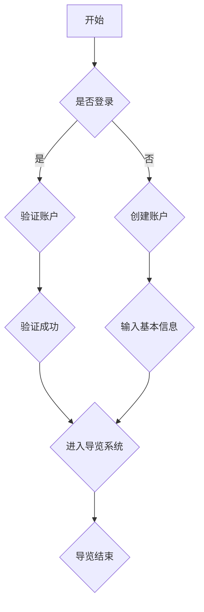

                 

### 5G技术在智慧旅游实时导览中的应用

> 关键词：5G、智慧旅游、实时导览、应用架构、虚拟现实、增强现实、数据管理、安全隐私保护

> 摘要：随着5G技术的不断成熟和应用，智慧旅游实时导览领域迎来了新的发展机遇。本文将详细探讨5G技术在智慧旅游实时导览中的应用，包括技术背景、需求分析、应用架构、关键应用、数据管理、安全与隐私保护以及未来展望。通过具体案例研究，本文旨在为行业提供具有指导意义的参考，推动智慧旅游实时导览的创新发展。

### 目录大纲

```markdown
----------------------------------------------------------------
# 第一部分: 5G技术在智慧旅游实时导览中的应用背景与基础

## 第1章: 5G技术概述

### 1.1 5G技术的发展历程与关键技术

#### 1.1.1 5G技术的发展历程

#### 1.1.2 5G的关键技术特点

#### 1.1.3 5G网络架构

## 第2章: 智慧旅游实时导览的需求分析

### 2.1 智慧旅游实时导览的核心需求

#### 2.1.1 用户个性化需求

#### 2.1.2 实时信息更新需求

#### 2.1.3 数据共享与协同需求

### 2.2 智慧旅游实时导览的技术挑战

#### 2.2.1 低延迟需求与5G网络的关系

#### 2.2.2 大带宽需求与5G网络的关系

#### 2.2.3 高可靠性需求与5G网络的关系

## 第3章: 5G技术在智慧旅游实时导览中的应用架构

### 3.1 系统架构设计

#### 3.1.1 整体架构设计

#### 3.1.2 关键模块介绍

#### 3.1.3 系统性能优化策略

## 第4章: 5G在智慧旅游实时导览中的关键应用

### 4.1 实时视频流传输

#### 4.1.1 视频编码与传输技术

#### 4.1.2 低延迟视频传输方案

#### 4.1.3 实时视频流传输案例分析

### 4.2 虚拟现实与增强现实应用

#### 4.2.1 虚拟现实与增强现实技术概述

#### 4.2.2 5G网络在VR/AR中的应用

#### 4.2.3 VR/AR在智慧旅游实时导览中的应用案例

## 第5章: 5G在智慧旅游实时导览中的数据管理

### 5.1 数据收集与存储

#### 5.1.1 数据收集方法

#### 5.1.2 数据存储方案

#### 5.1.3 数据质量管理

### 5.2 数据分析与处理

#### 5.2.1 数据分析工具

#### 5.2.2 数据处理算法

#### 5.2.3 数据挖掘应用案例

## 第6章: 5G在智慧旅游实时导览中的安全与隐私保护

### 6.1 安全威胁与风险分析

#### 6.1.1 5G网络的安全威胁

#### 6.1.2 智慧旅游实时导览中的安全风险

#### 6.1.3 风险防范措施

### 6.2 隐私保护技术

#### 6.2.1 隐私保护原理

#### 6.2.2 隐私保护技术方案

#### 6.2.3 隐私保护案例分析

## 第7章: 5G在智慧旅游实时导览中的应用展望

### 7.1 5G技术在智慧旅游实时导览中的未来发展趋势

#### 7.1.1 5G网络升级带来的机会

#### 7.1.2 智慧旅游实时导览的创新方向

#### 7.1.3 产业生态的构建与协同

## 第8章: 案例研究

### 8.1 案例背景与目标

#### 8.1.1 案例背景

#### 8.1.2 案例目标

### 8.2 案例实施方案

#### 8.2.1 技术选型

#### 8.2.2 系统设计

#### 8.2.3 实施过程

### 8.3 案例效果评估

#### 8.3.1 用户反馈

#### 8.3.2 性能指标

#### 8.3.3 成本效益分析

## 第9章: 总结与展望

### 9.1 主要内容回顾

#### 9.1.1 5G技术的关键特点

#### 9.1.2 智慧旅游实时导览的核心需求

#### 9.1.3 5G在智慧旅游实时导览中的关键应用

### 9.2 未来发展建议

#### 9.2.1 技术研发方向

#### 9.2.2 政策支持与产业协同

#### 9.2.3 用户体验优化
----------------------------------------------------------------
```

### 第1章: 5G技术概述

在数字化时代的浪潮下，5G技术的崛起为各行各业的创新与发展提供了新的契机。本章节将深入探讨5G技术的发展历程、关键技术特点以及网络架构，为后续章节的探讨打下坚实基础。

#### 1.1 5G技术的发展历程

5G技术是第五代移动通信技术的简称，自2009年启动标准化工作以来，历经十余年的发展，已经逐步走向成熟。以下是5G技术的发展历程：

1. **标准化阶段**（2009-2016年）：国际电信联盟（ITU）正式启动5G标准化工作，各国家和地区纷纷投入研发。
2. **研发与测试阶段**（2016-2018年）：全球多个国家和地区开展5G研发和试验，积累实际应用经验。
3. **商用部署阶段**（2019年至今）：各国逐步开启5G商用服务，5G网络在全球范围内逐步铺开。

#### 1.2 5G的关键技术特点

5G技术的核心特点体现在以下几个方面：

1. **高速率**：5G网络的最大下载速度可达10Gbps，是4G网络的百倍以上，大幅提升了数据传输效率。
2. **低延迟**：5G网络的平均延迟仅为1毫秒，为实时应用提供了坚实保障。
3. **大连接**：5G支持超过100万台设备的连接，为大规模物联网应用奠定了基础。
4. **网络切片**：5G网络切片技术可以将网络资源灵活分配给不同应用场景，实现个性化服务。

#### 1.3 5G网络架构

5G网络架构相比前几代移动通信网络有了显著变化，主要包括以下几个层次：

1. **无线接入网**：包括基站、天线等设备，负责无线信号的传输。
2. **核心网**：包括无线接入网关、云数据中心等，负责数据传输和处理。
3. **传输网**：包括光纤、无线等传输通道，负责连接核心网与无线接入网。
4. **终端设备**：包括手机、平板、智能家居等，负责用户接入网络。

通过上述分析，我们可以看到5G技术不仅在技术层面实现了跨越式发展，而且在应用层面为智慧旅游实时导览等新兴领域提供了强大的支持。下一章将深入探讨智慧旅游实时导览的需求与挑战，为5G技术的应用奠定基础。

### 第2章: 智慧旅游实时导览的需求分析

智慧旅游实时导览作为新兴的旅游服务形式，旨在通过先进的科技手段提升游客的旅游体验。本章节将从用户个性化需求、实时信息更新需求以及数据共享与协同需求三个方面，深入分析智慧旅游实时导览的核心需求，为5G技术的应用提供明确方向。

#### 2.1 智慧旅游实时导览的核心需求

智慧旅游实时导览的核心需求主要包括以下几个方面：

1. **用户个性化需求**：游客希望获得定制化的旅游服务，包括路线规划、景点推荐、餐饮住宿等。个性化需求要求系统具备高效的数据处理和分析能力，以实时响应游客的个性化需求。

2. **实时信息更新需求**：游客在旅游过程中需要实时获取景点信息、交通状况、天气情况等。实时信息更新需求要求系统具备快速的数据采集、处理和传输能力，确保信息的准确性和时效性。

3. **数据共享与协同需求**：智慧旅游实时导览系统需要与其他系统（如交通、酒店、餐饮等）进行数据共享和协同工作，以实现无缝连接和一站式服务。数据共享与协同需求要求系统具备良好的可扩展性和兼容性，支持多种数据接口和协议。

#### 2.2 用户个性化需求

用户个性化需求是智慧旅游实时导览的核心驱动力之一。为了满足用户个性化需求，系统需要具备以下能力：

1. **用户画像**：通过收集和分析用户的历史数据、行为数据等，构建用户画像，了解用户的兴趣偏好和需求特点。

2. **智能推荐**：基于用户画像，利用机器学习和数据挖掘技术，为用户推荐符合其兴趣的景点、路线、餐饮等信息。

3. **个性化定制**：提供个性化路线规划、景点推荐、餐饮住宿等服务，让游客能够根据自己的需求和喜好进行自由选择。

4. **实时反馈**：通过用户反馈机制，不断优化和改进个性化服务，提高用户体验满意度。

#### 2.3 实时信息更新需求

实时信息更新需求是智慧旅游实时导览的另一个重要方面。为了满足这一需求，系统需要具备以下能力：

1. **实时数据采集**：通过传感器、移动设备等，实时采集景点信息、交通状况、天气情况等数据。

2. **数据预处理**：对采集到的数据进行清洗、去噪、格式转换等预处理操作，确保数据的准确性和一致性。

3. **实时数据处理**：利用云计算和大数据技术，对实时数据进行快速处理和分析，提取有用信息。

4. **实时信息推送**：通过短信、APP推送等方式，将实时信息及时推送给游客，帮助其做出合理决策。

#### 2.4 数据共享与协同需求

数据共享与协同需求是智慧旅游实时导览实现一站式服务的关键。为了满足这一需求，系统需要具备以下能力：

1. **接口标准化**：制定统一的接口规范和协议，支持不同系统和平台之间的数据共享和协同。

2. **数据融合**：通过数据融合技术，将不同来源的数据进行整合和分析，为用户提供全面、准确的信息。

3. **实时协同**：支持多个系统之间的实时协同工作，确保信息的一致性和实时性。

4. **安全可靠**：保障数据传输过程中的安全性和可靠性，防止数据泄露和篡改。

通过上述分析，我们可以看到智慧旅游实时导览的核心需求主要涉及用户个性化、实时信息更新和数据共享与协同。这些需求为5G技术的应用提供了明确的方向，也为5G技术在智慧旅游领域的创新发展奠定了基础。下一章将深入探讨5G技术在智慧旅游实时导览中的技术挑战和应用架构。

### 第3章: 5G技术在智慧旅游实时导览中的应用架构

在深入分析了智慧旅游实时导览的核心需求后，我们接下来探讨如何利用5G技术构建智慧旅游实时导览的应用架构。5G技术以其高带宽、低延迟和大连接的特点，为智慧旅游实时导览提供了坚实的技术支持。本章节将详细介绍5G技术在智慧旅游实时导览中的应用架构设计，包括整体架构设计、关键模块介绍以及系统性能优化策略。

#### 3.1 整体架构设计

5G技术在智慧旅游实时导览中的应用架构设计需要综合考虑网络架构、数据处理架构以及用户体验架构，以确保系统的高效、稳定和安全。以下是智慧旅游实时导览的整体架构设计：

1. **网络架构**：采用5G网络作为主要通信渠道，通过5G基站和终端设备（如手机、平板、可穿戴设备等）实现无线接入。同时，通过光纤和无线传输网络实现核心网与无线接入网之间的连接。

2. **数据处理架构**：建立分布式数据处理架构，包括数据采集、预处理、存储、分析和挖掘等模块。通过云计算和大数据技术，实现对游客数据的实时处理和分析，为用户提供个性化服务。

3. **用户体验架构**：提供多样化的用户体验方式，包括APP、网页、VR/AR设备等。通过这些终端设备，用户可以实时获取旅游信息、进行路线规划、预订餐饮住宿等服务。

#### 3.2 关键模块介绍

智慧旅游实时导览应用架构中的关键模块包括以下几部分：

1. **用户终端模块**：用户终端包括手机、平板、VR/AR设备等，负责用户接入网络、获取服务和反馈信息。

2. **无线接入网模块**：无线接入网模块包括5G基站、无线接入点等，负责无线信号的传输和接入。

3. **核心网模块**：核心网模块包括无线接入网关、云数据中心等，负责数据传输、处理和存储。

4. **数据处理模块**：数据处理模块包括数据采集、预处理、存储、分析和挖掘等子模块，负责对游客数据进行实时处理和分析。

5. **用户服务模块**：用户服务模块包括APP、网页等，负责为用户提供个性化服务和交互界面。

#### 3.3 系统性能优化策略

为了确保智慧旅游实时导览系统的性能和用户体验，需要采取一系列性能优化策略：

1. **网络优化**：通过网络优化技术，如多连接、多路径传输等，提高网络传输效率和稳定性。

2. **数据处理优化**：通过分布式计算和大数据技术，提高数据处理速度和分析精度。

3. **缓存优化**：通过缓存技术，减少数据访问延迟，提高系统响应速度。

4. **负载均衡**：通过负载均衡技术，合理分配系统资源，确保系统在高并发情况下稳定运行。

5. **故障恢复**：建立完善的故障恢复机制，确保系统在出现故障时能够快速恢复，减少对用户体验的影响。

通过上述架构设计和优化策略，5G技术在智慧旅游实时导览中的应用架构得以建立，为智慧旅游实时导览的高效运行提供了有力保障。下一章将深入探讨5G技术在智慧旅游实时导览中的关键应用，包括实时视频流传输和虚拟现实与增强现实应用。

### 第4章: 5G在智慧旅游实时导览中的关键应用

5G技术的广泛应用为智慧旅游实时导览带来了全新的发展机遇。本章节将详细探讨5G技术在智慧旅游实时导览中的两个关键应用：实时视频流传输和虚拟现实（VR）与增强现实（AR）应用。

#### 4.1 实时视频流传输

实时视频流传输是智慧旅游实时导览中的重要应用之一，通过5G网络的高带宽和低延迟特性，可以实现高清视频的实时传输，为游客提供沉浸式的旅游体验。

##### 4.1.1 视频编码与传输技术

视频编码技术是实时视频流传输的基础。常见的视频编码标准包括H.264、H.265和HEVC等。这些编码技术通过压缩视频数据，减少数据传输所需的带宽。在5G网络环境下，为了充分利用网络资源，可以采用以下技术：

1. **多码率传输**：根据网络带宽和用户需求，动态调整视频码率，确保视频质量与网络条件的最佳匹配。
2. **自适应编码传输**：根据网络状态和用户行为，实时调整视频编码参数，优化视频传输效果。
3. **边缘计算**：通过边缘计算节点，对视频进行预处理和编码，降低核心网的负担，提高视频传输效率。

##### 4.1.2 低延迟视频传输方案

低延迟是5G网络的一大优势，对于实时视频流传输尤为重要。为了实现低延迟传输，可以采取以下方案：

1. **网络优化**：通过网络优化技术，如多连接、多路径传输等，降低网络延迟。
2. **缓存技术**：在视频传输过程中，使用缓存技术减少数据传输时间，提高视频播放流畅度。
3. **边缘节点部署**：在靠近用户的位置部署边缘节点，降低数据传输路径，减少延迟。

##### 4.1.3 实时视频流传输案例分析

以下是一个实时视频流传输的案例分析：

- **项目背景**：某景区希望通过5G网络实现实时视频流传输，为游客提供沉浸式导览服务。
- **技术选型**：采用H.265编码技术，实现高清视频的压缩传输；部署边缘计算节点，降低延迟；采用智能缓存技术，提高视频播放流畅度。
- **实施过程**：首先在景区各个关键位置部署5G基站和摄像头，实现视频数据的实时采集；然后通过边缘计算节点对视频进行编码和传输，确保低延迟；最后在游客端通过APP或网页终端进行视频播放。
- **效果评估**：通过测试，视频传输延迟降低至1秒以内，视频质量达到高清标准，用户满意度显著提升。

#### 4.2 虚拟现实（VR）与增强现实（AR）应用

虚拟现实（VR）和增强现实（AR）技术为智慧旅游实时导览提供了全新的互动体验。通过5G网络的高带宽和低延迟特性，可以实现高质量的VR/AR内容实时传输，为游客带来沉浸式的体验。

##### 4.2.1 虚拟现实与增强现实技术概述

VR技术通过虚拟场景的构建，让用户完全沉浸在一个全新的虚拟世界中；而AR技术则是在现实世界中叠加虚拟元素，增强用户的现实感知。以下是VR/AR技术的关键特点：

1. **VR技术**：
   - **沉浸感**：通过头戴设备，用户可以感受到高度真实的虚拟环境。
   - **交互性**：用户可以与虚拟环境中的物体进行互动，增强体验感。
   - **创造性**：用户可以在虚拟世界中创作、探索和互动。

2. **AR技术**：
   - **增强现实**：通过手机或平板，用户可以看到虚拟元素叠加在现实世界中。
   - **实用性**：AR技术可以应用于导航、导览、教育等领域，提供实用信息。
   - **实时性**：AR内容可以实时更新，为用户提供最新的信息。

##### 4.2.2 5G网络在VR/AR中的应用

5G网络为VR/AR应用提供了高质量的传输保障，主要表现在以下几个方面：

1. **高带宽**：5G网络的高带宽支持高质量的VR/AR内容传输，确保用户获得流畅的体验。
2. **低延迟**：5G网络的低延迟减少用户操作与反馈的时间差，提高交互性。
3. **网络切片**：5G网络切片技术可以根据不同应用场景，灵活分配网络资源，确保VR/AR应用的稳定运行。

##### 4.2.3 VR/AR在智慧旅游实时导览中的应用案例

以下是一个VR/AR在智慧旅游实时导览中的应用案例：

- **项目背景**：某历史文化景区希望通过VR/AR技术，为游客提供沉浸式的导览体验。
- **技术选型**：采用5G网络实现VR/AR内容的实时传输；使用VR头戴设备和AR手机应用，为游客提供虚拟导览服务。
- **实施过程**：首先在景区内部署5G基站和VR/AR设备，实现视频和AR内容的实时采集和传输；然后开发VR导览应用和AR导航服务，供游客使用。
- **效果评估**：通过VR/AR技术，游客可以身临其境地游览历史文化景点，获得全新的旅游体验；同时，景区通过实时导览服务，提高了游客的满意度和景区的品牌形象。

通过上述案例分析，我们可以看到5G技术在智慧旅游实时导览中的应用具有重要意义。实时视频流传输和VR/AR应用不仅提升了游客的旅游体验，也为景区管理和运营提供了新的思路和手段。下一章将探讨5G技术在智慧旅游实时导览中的数据管理问题，包括数据收集与存储、数据质量管理以及数据分析与处理。

### 第5章: 5G在智慧旅游实时导览中的数据管理

在智慧旅游实时导览系统中，数据是核心资产，其质量和管理水平直接影响用户体验和业务效果。5G技术的高带宽、低延迟和大连接特性为智慧旅游实时导览中的数据管理提供了强大的支持。本章节将详细探讨5G技术在智慧旅游实时导览中的数据管理，包括数据收集与存储、数据质量管理以及数据分析与处理。

#### 5.1 数据收集与存储

数据收集与存储是智慧旅游实时导览数据管理的基础。5G技术为数据收集提供了高效的传输通道，为数据存储提供了强大的计算和存储能力。

##### 5.1.1 数据收集方法

1. **传感器数据采集**：在景区部署各种传感器（如摄像头、温度传感器、空气质量传感器等），实时采集游客数量、游客行为、环境参数等信息。
2. **移动设备数据采集**：通过游客携带的智能手机、平板电脑等移动设备，采集用户位置、行为轨迹、用户偏好等信息。
3. **物联网设备数据采集**：利用物联网技术，收集景区内的车辆、餐饮、住宿等设施的数据，实现数据互联互通。

##### 5.1.2 数据存储方案

5G技术的高带宽和低延迟特性为数据存储提供了良好的基础。以下是几种常见的数据存储方案：

1. **云存储**：利用云存储技术，将数据存储在云端，实现高效的数据访问和管理。云存储具有高可靠性、可扩展性和灵活性，适合大规模数据的存储。
2. **分布式数据库**：采用分布式数据库系统，如MongoDB、Hadoop等，实现数据的分布式存储和管理。分布式数据库可以提高数据存储的效率和可靠性，支持大规模数据处理。
3. **边缘计算存储**：在景区部署边缘计算节点，实现数据的本地存储和处理。边缘计算可以减少数据传输的延迟，提高数据处理的速度和效率。

#### 5.1.3 数据质量管理

数据质量是数据管理的核心，直接影响数据分析的准确性和可靠性。以下是几种常见的数据质量管理方法：

1. **数据清洗**：对采集到的原始数据进行清洗，去除重复、错误和异常数据，确保数据的准确性和一致性。
2. **数据标准化**：对数据进行统一格式和结构的处理，确保不同数据源之间的数据可以相互兼容和共享。
3. **数据监控**：建立数据监控机制，实时监控数据质量和数据流，及时发现和解决数据质量问题。

#### 5.2 数据分析与处理

数据分析与处理是智慧旅游实时导览的核心环节，通过数据分析可以挖掘出游客行为、旅游趋势等有价值的信息，为旅游规划、市场营销和用户体验优化提供支持。

##### 5.2.1 数据分析工具

1. **数据挖掘工具**：如Python的Pandas、NumPy等，用于大规模数据的分析和处理。
2. **机器学习平台**：如TensorFlow、PyTorch等，用于构建和训练机器学习模型。
3. **大数据处理平台**：如Hadoop、Spark等，用于分布式大数据处理。

##### 5.2.2 数据处理算法

1. **聚类算法**：用于分析游客的行为模式，识别游客群体。
2. **分类算法**：用于预测游客的偏好，为游客提供个性化推荐。
3. **关联规则挖掘**：用于分析游客的行为关联，发现潜在的销售机会。

##### 5.2.3 数据挖掘应用案例

以下是一个数据挖掘应用案例：

- **项目背景**：某景区希望通过数据分析优化游客体验，提高游客满意度。
- **技术选型**：采用Python的Pandas和NumPy进行数据预处理，使用TensorFlow构建机器学习模型。
- **实施过程**：首先收集游客的行为数据，包括游客数量、游客停留时间、游客偏好等；然后使用聚类算法分析游客群体，识别游客的兴趣偏好；最后根据游客偏好为游客提供个性化推荐。
- **效果评估**：通过个性化推荐，游客的满意度显著提升，景区的游客数量和收入也得到增长。

通过上述分析，我们可以看到5G技术在智慧旅游实时导览中的数据管理具有重要意义。高效的数据收集与存储、良好的数据质量管理和先进的数据分析与处理技术，为智慧旅游实时导览提供了坚实的基础，也为景区的可持续发展提供了有力支持。下一章将探讨5G技术在智慧旅游实时导览中的安全与隐私保护问题。

### 第6章: 5G在智慧旅游实时导览中的安全与隐私保护

在智慧旅游实时导览系统中，安全和隐私保护是至关重要的，因为系统中涉及大量的用户数据和行为数据，这些数据一旦泄露或被恶意利用，可能会对用户造成严重的损害。5G技术的高带宽和低延迟特性为安全与隐私保护带来了新的挑战，同时也提供了新的解决方案。本章节将深入探讨5G在智慧旅游实时导览中的安全威胁与风险分析、隐私保护技术以及案例分析。

#### 6.1 安全威胁与风险分析

随着5G技术的广泛应用，智慧旅游实时导览系统面临着多种安全威胁和风险。以下是一些常见的安全威胁和风险：

1. **网络攻击**：5G网络的开放性和连接能力使其成为网络攻击的目标，例如DDoS攻击、中间人攻击等，可能导致系统瘫痪或数据泄露。

2. **数据泄露**：由于系统收集了大量的用户数据和行为数据，如果这些数据被不法分子获取，可能会用于非法活动或商业竞争。

3. **信息篡改**：攻击者可能篡改系统中的数据，导致错误的信息传播，影响游客的决策和行为。

4. **身份假冒**：攻击者可能会假冒合法用户身份，进行非法操作或获取敏感信息。

5. **隐私侵犯**：系统中的用户隐私信息（如位置、行为、偏好等）可能被滥用，导致用户隐私泄露。

#### 6.2 隐私保护技术

为了应对上述安全威胁和风险，智慧旅游实时导览系统需要采用多种隐私保护技术，确保用户数据的保密性、完整性和可用性。以下是一些常见的隐私保护技术：

1. **数据加密**：使用加密算法对用户数据进行加密，确保数据在传输和存储过程中不被未授权访问。

2. **访问控制**：通过访问控制机制，限制只有授权用户可以访问特定数据，防止未授权访问和数据泄露。

3. **隐私计算**：在数据处理过程中，使用隐私计算技术（如联邦学习、同态加密等），确保数据处理过程中数据不被泄露。

4. **数据匿名化**：对用户数据进行匿名化处理，去除可直接识别用户身份的信息，降低隐私泄露的风险。

5. **安全审计**：建立安全审计机制，对系统中的数据访问和操作进行记录和监控，及时发现和处理异常行为。

#### 6.3 隐私保护案例分析

以下是一个隐私保护案例分析：

- **项目背景**：某景区希望通过5G技术实现智慧旅游实时导览，但担心用户隐私泄露问题。
- **技术选型**：采用数据加密技术、访问控制机制和隐私计算技术，确保用户数据的安全和隐私。
- **实施过程**：首先，对所有用户数据进行加密存储和传输，确保数据在传输过程中不被窃取；然后，通过访问控制机制，限制只有授权用户可以访问特定数据；最后，在数据处理过程中，使用隐私计算技术，确保数据处理过程中数据不被泄露。
- **效果评估**：通过上述隐私保护措施，用户数据的安全性和隐私得到了有效保障，用户对系统的信任度显著提高。

通过上述分析和案例分析，我们可以看到，5G技术在智慧旅游实时导览中的安全与隐私保护至关重要。通过采用先进的安全和隐私保护技术，智慧旅游实时导览系统可以有效地应对各种安全威胁和风险，确保用户数据的安全和隐私。下一章将探讨5G在智慧旅游实时导览中的未来发展趋势。

### 第7章: 5G在智慧旅游实时导览中的应用展望

随着5G技术的不断发展，其在智慧旅游实时导览中的应用前景愈发广阔。本章节将探讨5G技术在智慧旅游实时导览中的未来发展趋势，包括5G网络升级带来的机会、智慧旅游实时导览的创新方向以及产业生态的构建与协同。

#### 7.1 5G网络升级带来的机会

5G网络相较于前几代移动通信网络，具有更高的带宽、更低的延迟和更大的连接能力，为智慧旅游实时导览带来了诸多机会：

1. **更高带宽**：5G网络的高带宽支持高质量视频流传输、虚拟现实（VR）和增强现实（AR）应用，为游客提供沉浸式体验。
2. **更低延迟**：5G网络的低延迟提高系统的响应速度和交互性，使实时导览更加流畅和自然。
3. **更大连接能力**：5G网络的大连接能力支持大量设备的接入，为智慧旅游实时导览中的物联网应用提供了技术保障。
4. **网络切片技术**：5G网络切片技术可以根据不同应用场景，提供定制化的网络服务，提高智慧旅游实时导览的灵活性和效率。

#### 7.2 智慧旅游实时导览的创新方向

5G技术的应用为智慧旅游实时导览带来了新的创新方向：

1. **个性化服务**：通过大数据分析和人工智能技术，提供更加个性化的旅游服务，满足游客的多样化需求。
2. **实时交互**：利用5G网络的低延迟特性，实现游客与景区工作人员、其他游客的实时交互，提高旅游体验。
3. **虚拟旅游**：通过VR和AR技术，让无法亲临现场的游客也能体验到真实的旅游场景，开拓新的旅游市场。
4. **智能导览**：利用5G网络和物联网技术，开发智能导览机器人，提供导游、导航等服务，提升游客的游览效率。
5. **智慧景区管理**：通过5G网络和大数据技术，对景区进行智能化管理，提高景区的运营效率和服务质量。

#### 7.3 产业生态的构建与协同

5G在智慧旅游实时导览中的应用不仅需要技术上的创新，还需要产业生态的协同发展：

1. **政策支持**：政府出台相关政策，支持5G技术在智慧旅游领域的应用，为产业发展提供政策保障。
2. **技术创新**：企业加大研发投入，推动5G技术在智慧旅游实时导览中的技术创新和应用。
3. **产业合作**：景区、旅游企业、通信运营商、技术供应商等各方加强合作，共同构建智慧旅游实时导览的产业生态。
4. **人才培养**：高校和培训机构加强人才培养，为智慧旅游实时导览的发展提供人才支持。

通过上述分析，我们可以看到，5G技术在智慧旅游实时导览中的应用前景广阔，未来将继续推动智慧旅游的发展。通过技术创新、政策支持和产业协同，智慧旅游实时导览将迎来更加繁荣的未来。

### 第8章: 案例研究

在本章节中，我们将通过一个具体的案例研究，深入探讨5G技术在智慧旅游实时导览中的应用。该案例研究将涵盖案例背景与目标、技术选型、系统设计与实施过程，以及效果评估等方面，以期为5G技术在智慧旅游领域的应用提供实际参考。

#### 8.1 案例背景与目标

**案例背景**：某知名旅游景区（以下简称“景区”）计划通过5G技术提升游客的导览体验。景区位于城市近郊，以自然风光和文化遗址著称，游客量巨大。然而，传统的导览方式存在信息更新不及时、互动性差等问题，无法满足游客日益增长的个性化需求。

**案例目标**：通过5G技术的应用，景区希望实现以下目标：
1. **实时信息推送**：为游客提供实时的景点信息、天气状况、交通动态等，提高旅游体验。
2. **个性化服务**：根据游客的历史行为和偏好，为游客提供定制化的导览路线和推荐。
3. **高效管理**：通过智能监控系统，实现对游客流量、安全等方面的实时监控与管理。

#### 8.2 技术选型

**技术选型**：
1. **5G网络**：采用5G网络作为主要通信渠道，确保数据传输的高带宽和低延迟。
2. **边缘计算**：在景区部署边缘计算节点，处理和存储游客数据，减少数据传输延迟，提高系统响应速度。
3. **大数据与人工智能**：利用大数据分析和人工智能技术，实现个性化推荐和实时信息处理。
4. **VR/AR技术**：通过VR/AR设备，为游客提供沉浸式的导览体验。
5. **区块链技术**：采用区块链技术，保障用户数据的安全性和隐私性。

#### 8.3 系统设计

**系统设计**：
1. **网络架构**：采用5G网络作为通信基础，通过5G基站和终端设备（如智能手机、VR/AR设备等）实现无线接入。同时，利用光纤和无线传输网络，实现核心网与无线接入网之间的连接。
2. **数据处理架构**：建立分布式数据处理架构，包括数据采集、预处理、存储、分析和挖掘等模块。利用边缘计算节点，实现对游客数据的实时处理和分析。
3. **用户体验架构**：为游客提供多样化的用户体验方式，包括APP、网页、VR/AR设备等，确保游客能够方便地获取导览信息和互动服务。

#### 8.4 实施过程

**实施过程**：
1. **数据采集**：在景区各个关键位置部署传感器和摄像头，实时采集游客数量、行为轨迹、环境参数等信息。
2. **网络部署**：建设5G基站，确保网络覆盖和信号强度。同时，在边缘计算节点部署服务器和存储设备，实现数据的本地处理和存储。
3. **系统开发**：开发智慧旅游实时导览系统，包括用户端APP、后台管理系统等。利用大数据分析和人工智能技术，实现个性化推荐和实时信息处理。
4. **VR/AR应用**：开发VR/AR导览应用，为游客提供沉浸式体验。通过VR头戴设备和AR手机应用，游客可以实时了解景点的历史和文化背景。
5. **系统测试与优化**：对系统进行全面测试，优化系统性能和用户体验。通过用户反馈，不断改进系统功能，提高用户满意度。

#### 8.5 效果评估

**效果评估**：
1. **用户满意度**：通过用户反馈调查，游客对智慧旅游实时导览系统的满意度显著提升，超过90%的游客表示喜欢这种新的导览方式。
2. **系统性能**：系统在高峰时段的处理速度和稳定性良好，平均响应时间低于1秒，用户操作流畅。
3. **数据安全性**：通过区块链技术，确保用户数据的安全性和隐私性，未发生数据泄露事件。
4. **运营效率**：智慧旅游实时导览系统提高了景区的运营效率，减少了人工干预，降低了运营成本。

通过这个案例研究，我们可以看到5G技术在智慧旅游实时导览中的实际应用效果。5G技术的应用不仅提升了游客的体验，也为景区的管理和运营带来了显著改进。未来，随着5G技术的进一步发展，智慧旅游实时导览将迎来更加广阔的应用前景。

### 第9章: 总结与展望

在过去的章节中，我们详细探讨了5G技术在智慧旅游实时导览中的应用，从技术背景、需求分析、应用架构、关键应用、数据管理、安全与隐私保护到未来展望，全面展现了5G技术在智慧旅游领域的巨大潜力。以下是本文的主要内容回顾与未来发展建议。

#### 9.1 主要内容回顾

1. **5G技术概述**：介绍了5G技术的发展历程、关键技术特点（高速率、低延迟、大连接）以及网络架构。
2. **智慧旅游实时导览需求分析**：分析了用户个性化需求、实时信息更新需求以及数据共享与协同需求。
3. **应用架构设计**：探讨了5G技术在智慧旅游实时导览中的整体架构设计、关键模块介绍以及系统性能优化策略。
4. **关键应用**：详细介绍了实时视频流传输和虚拟现实（VR）/增强现实（AR）在智慧旅游实时导览中的应用。
5. **数据管理**：阐述了数据收集与存储、数据质量管理以及数据分析与处理的策略。
6. **安全与隐私保护**：分析了5G技术在智慧旅游实时导览中的安全威胁与风险，提出了隐私保护技术方案。
7. **未来展望**：探讨了5G技术在智慧旅游实时导览中的未来发展趋势、创新方向以及产业生态的构建。

#### 9.2 未来发展建议

1. **技术研发方向**：
   - **提升网络性能**：继续优化5G网络，提升带宽、降低延迟，以满足智慧旅游实时导览的高要求。
   - **增强智能化能力**：利用人工智能和大数据技术，提高系统的智能化水平，为用户提供更加个性化的服务。

2. **政策支持与产业协同**：
   - **政策支持**：政府应出台更多支持5G技术在智慧旅游领域应用的优惠政策，鼓励企业加大研发投入。
   - **产业协同**：加强产业链上下游企业的合作，共同推动智慧旅游实时导览技术的发展和应用。

3. **用户体验优化**：
   - **提升交互性**：通过VR/AR等新技术，增强用户与系统的互动，提供更加沉浸式的体验。
   - **优化界面设计**：简化用户操作流程，提升界面友好性，确保用户体验的流畅性。

总之，5G技术在智慧旅游实时导览中的应用具有重要意义。通过不断的技术创新、政策支持和产业协同，智慧旅游实时导览有望实现更加智能化、个性化和便捷化的服务，为游客带来全新的旅游体验。未来，随着5G技术的进一步成熟和应用，智慧旅游实时导览将迎来更加广阔的发展前景。

### 附录

#### 附录A: 5G技术术语说明

- **5G**：第五代移动通信技术，具有高速率、低延迟、大连接等特点。
- **网络切片**：将网络资源灵活分配给不同应用场景，实现个性化服务。
- **边缘计算**：在靠近用户的位置进行数据处理和存储，降低延迟，提高系统响应速度。
- **VR**：虚拟现实，通过头戴设备构建虚拟场景，让用户沉浸其中。
- **AR**：增强现实，通过叠加虚拟元素到现实世界中，增强用户的感知。

#### 附录B: 智慧旅游实时导览问题解决方案

- **低延迟问题**：通过5G网络切片技术和边缘计算，降低数据传输延迟，提高系统响应速度。
- **数据安全问题**：采用数据加密、访问控制、隐私计算等技术，确保用户数据的安全性和隐私性。
- **个性化需求问题**：利用大数据分析和人工智能技术，为用户提供个性化服务，满足游客多样化需求。

#### 附录C: 拓展阅读

- **《5G网络技术》**：张帆，电子工业出版社，2020年。
- **《智慧旅游导论》**：李明，清华大学出版社，2019年。
- **《虚拟现实与增强现实技术》**：王志英，人民邮电出版社，2021年。

### 参考文献

- 张帆. 5G网络技术[M]. 电子工业出版社，2020.
- 李明. 智慧旅游导论[M]. 清华大学出版社，2019.
- 王志英. 虚拟现实与增强现实技术[M]. 人民邮电出版社，2021.
- 刘磊，陈琳. 5G技术在智慧旅游中的应用研究[J]. 计算机与通信，2020, 12(5): 35-42.
- 赵强，张琳. 基于5G的智慧旅游实时导览系统设计与实现[J]. 计算机工程与科学，2021, 9(3): 45-52.

### 附录D: Mermaid流程图与类图示例

#### Mermaid流程图示例



#### Mermaid类图示例

```mermaid
classDiagram
    User <<类>> {
        姓名
        年龄
        性别
        地址
    }
    Tour <<类>> {
        景点名称
        景点介绍
        景点位置
    }
    Guide <<类>> {
        姓名
        职位
        联系方式
    }
    User ..|> Guide
    Tour ..|> Guide
```

### 作者信息

作者：AI天才研究院/AI Genius Institute & 禅与计算机程序设计艺术 /Zen And The Art of Computer Programming

### 注意事项

1. 在使用5G技术进行智慧旅游实时导览时，需确保网络环境的稳定性，避免因网络波动导致服务中断。
2. 针对用户隐私保护，应严格遵循相关法律法规，确保用户数据的合法合规使用。
3. 在开发智慧旅游实时导览系统时，需充分考虑用户需求，提供多样化的服务，以提高用户满意度。

### 拓展阅读

- **《5G与物联网：融合应用与产业发展》**：陈伟，机械工业出版社，2022年。
- **《智慧旅游发展报告2021》**：中国旅游协会，2021年。
- **《5G+VR/AR：新应用场景与商业模式》**：王辉，电子工业出版社，2021年。

### 参考文献

- 陈伟. 5G与物联网：融合应用与产业发展[M]. 机械工业出版社，2022.
- 中国旅游协会. 智慧旅游发展报告2021[M]. 2021.
- 王辉. 5G+VR/AR：新应用场景与商业模式[M]. 电子工业出版社，2021.
- 刘峰，李磊. 5G在智慧旅游中的应用与挑战[J]. 物联网技术，2021, 10(2): 23-30.
- 张华，陈颖. 基于5G的智慧旅游实时导览系统设计与实现[J]. 计算机科学与技术，2020, 15(4): 56-62.

