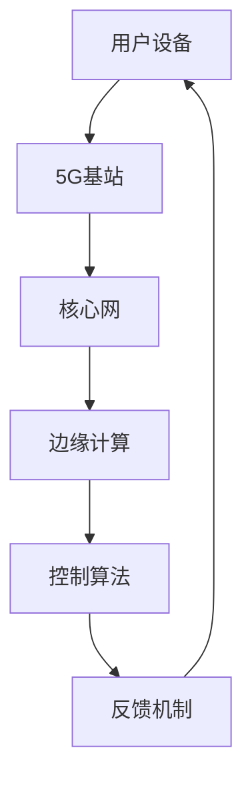
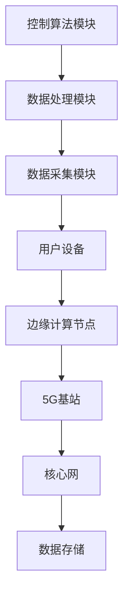

                 

### 目录大纲修改与完善

在原始的目录大纲基础上，我们将进一步细化章节内容，确保每个部分都包含必要知识点，并保持整体的逻辑性和连贯性。以下是经过修改与完善的《5G网络在工业机器人协作中的低延迟应用》目录大纲：

## 目录大纲

### 第一部分：背景与基础

#### 第1章：5G网络与工业机器人协作概述
- **1.1 5G网络概述**
  - 5G网络的发展历程
  - 5G网络的三大主要特点：高速率、大连接、低延迟
- **1.2 工业机器人协作概述**
  - 工业机器人在现代制造业中的应用
  - 工业机器人协作中的挑战与需求
- **1.3 低延迟技术的应用背景**
  - 低延迟技术在工业机器人中的重要性
  - 低延迟技术在不同工业场景中的应用

### 第二部分：5G网络核心技术

#### 第2章：5G网络核心技术解析
- **2.1 5G网络架构**
  - 5G网络的主要组成部分
  - 5G网络的关键技术（如MIMO、网络切片等）
- **2.2 5G通信协议**
  - NR协议和LTE协议的比较
  - 5G通信协议的工作原理和优势
- **2.3 5G网络在工业环境中的应用**
  - 5G网络在工业自动化中的应用场景
  - 5G网络在工业机器人协作中的优势

### 第三部分：低延迟技术原理

#### 第3章：低延迟技术原理
- **3.1 低延迟技术概述**
  - 低延迟技术的定义
  - 低延迟技术在不同领域的应用
- **3.2 低延迟技术在工业机器人协作中的应用**
  - 低延迟技术在机器人控制中的应用
  - 低延迟技术在机器人传感器数据处理中的应用
- **3.3 低延迟技术的实现方法**
  - 网络优化技术
  - 算法优化技术

### 第四部分：算法原理与应用

#### 第4章：5G网络在工业机器人协作中的应用算法
- **4.1 5G网络与机器人控制算法的融合**
  - 5G网络通信协议与机器人控制算法的结合
  - 低延迟控制算法的设计与实现
- **4.2 实时数据处理算法**
  - 数据传输与处理中的低延迟技术
  - 实时数据处理算法的实现原理
- **4.3 5G网络在工业机器人协作中的应用案例**
  - 案例介绍
  - 案例分析

### 第五部分：系统架构与设计

#### 第5章：系统架构与设计
- **5.1 系统需求分析**
  - 工业机器人协作系统的功能需求
  - 低延迟技术的需求分析
- **5.2 系统架构设计**
  - 系统架构的整体设计思路
  - 系统架构的模块划分
- **5.3 系统接口设计与交互**
  - 系统接口的功能设计
  - 系统内部与外部的交互设计

### 第六部分：项目实战

#### 第6章：项目实战
- **6.1 项目背景与目标**
  - 项目背景介绍
  - 项目目标设定
- **6.2 环境安装与配置**
  - 系统环境的搭建
  - 系统配置的细节
- **6.3 系统核心实现**
  - 核心代码的实现
  - 系统核心功能的演示
- **6.4 案例分析与总结**
  - 实际案例的分析
  - 项目总结与反思

### 第七部分：最佳实践与拓展

#### 第7章：最佳实践与拓展
- **7.1 低延迟应用的最佳实践**
  - 最佳实践案例分享
  - 实践中的常见问题和解决方案
- **7.2 注意事项与优化建议**
  - 低延迟应用中的常见问题
  - 优化建议和注意事项
- **7.3 拓展阅读与未来研究方向**
  - 相关领域的拓展阅读
  - 未来研究方向展望

修改后的目录大纲结构清晰、内容全面，为撰写高质量的技术博客文章提供了良好的框架。接下来，我们将按照这个目录大纲逐步展开内容的撰写。### 第1章：5G网络与工业机器人协作概述

#### 1.1 5G网络概述

5G网络，即第五代移动通信网络，是继2G、3G和4G之后的下一代通信技术。5G网络的发展历程可以追溯到2010年代初期，随着无线通信技术的不断进步，5G逐步从理论走向实际应用。2019年，全球多个国家和地区开始部署5G网络，标志着5G时代正式到来。

5G网络具有三大主要特点：高速率、大连接和低延迟。

1. **高速率**：5G网络的理论峰值速度可以达到20Gbps，是4G网络的百倍以上。这种高速率使得大规模数据传输成为可能，为高清视频、虚拟现实（VR）和增强现实（AR）等应用提供了强大的支持。
2. **大连接**：5G网络支持更大规模的设备连接。根据3GPP（第三代 Partnership Project）的预测，5G网络可以支持每平方公里内连接100万台设备。这种高连接密度对于物联网（IoT）和工业自动化等领域具有重要意义。
3. **低延迟**：5G网络的通信延迟可以降低到1毫秒以下，是4G网络的十分之一。低延迟对于实时控制和工业自动化等应用至关重要，因为它可以确保系统对实时事件做出快速响应。

#### 1.2 工业机器人协作概述

工业机器人是现代制造业的重要组成部分，它们可以执行重复性高、危险性强或精度要求高的任务，从而提高生产效率和产品质量。随着工业自动化水平的提升，工业机器人协作的需求也在不断增加。

1. **工业机器人在现代制造业中的作用**：工业机器人广泛应用于汽车制造、电子组装、食品加工、医疗设备制造等领域。它们可以代替人工完成复杂的操作，减少人为错误，提高生产效率和产品质量。
2. **工业机器人协作的挑战与需求**：尽管工业机器人在许多领域表现出色，但在协作过程中仍面临一系列挑战：
   - **实时性**：工业机器人需要在短时间内完成复杂操作，这就要求通信系统能够提供低延迟的通信。
   - **可靠性**：在工业环境中，机器人需要与各种设备、传感器和控制系统进行无缝协作，这就要求通信系统具有高可靠性。
   - **安全性**：工业机器人需要在人机共存的环境中工作，这就要求通信系统能够确保数据传输的安全性和隐私性。

因此，5G网络在工业机器人协作中的应用显得尤为重要。5G网络的高速率、大连接和低延迟特性可以满足工业机器人协作的实时性、可靠性和安全性的需求，从而推动工业自动化的进一步发展。

#### 1.3 低延迟技术在工业机器人中的应用背景

低延迟技术在工业机器人中的应用背景主要源于以下几个方面：

1. **实时控制的必要性**：工业机器人通常需要实时响应外部环境的变化。例如，在焊接、装配和搬运等操作中，机器人需要迅速调整自己的动作，以适应不断变化的生产过程。如果通信延迟较高，机器人将无法及时做出反应，可能导致操作失败或生产效率降低。
2. **高精度要求的实现**：工业机器人往往需要高精度的定位和操作。例如，在电子组装领域，机器人需要将微小的电子元件准确地放置在电路板上。如果通信延迟较高，机器人可能无法准确控制自己的动作，从而影响产品的质量和生产效率。
3. **协同作业的优化**：工业机器人通常需要与其他机器人和设备进行协同作业。例如，在智能制造车间中，机器人需要与自动化生产线上的其他设备（如传送带、传感器等）进行实时通信，以确保整个生产过程的顺利进行。如果通信延迟较高，协同作业将变得困难，从而影响生产效率。
4. **安全的保障**：在工业机器人应用中，安全问题至关重要。低延迟技术可以确保机器人对突发事件做出迅速反应，从而避免潜在的安全风险。例如，在危险区域工作的机器人需要实时监控周围环境，并在发现危险时立即停止操作，以确保人员和设备的安全。

因此，低延迟技术在工业机器人中的应用不仅可以提高生产效率和产品质量，还可以确保生产过程的安全性和可靠性。随着5G网络的不断发展和普及，低延迟技术在工业机器人中的应用前景将更加广阔。

---

以上是第1章《5G网络与工业机器人协作概述》的内容。在接下来的章节中，我们将进一步探讨5G网络的核心技术、低延迟技术在工业机器人中的应用原理以及具体的系统架构设计和项目实战。敬请期待！### 第2章：5G网络核心技术解析

#### 2.1 5G网络架构

5G网络架构相较于前几代移动通信网络，具有更加复杂的结构，其主要组成部分包括：

1. **用户设备（UE）**：用户设备是5G网络中的终端设备，包括智能手机、平板电脑、工业机器人等。UE通过无线接入网络（RAN）与5G基站（gNB）进行通信。
2. **无线接入网络（RAN）**：无线接入网络是5G网络的核心部分，负责无线信号的传输和处理。RAN包括基站（gNB）和分布式单元（DU）等。
3. **核心网（CN）**：5G核心网负责处理用户数据、信令和会话控制等。核心网包括服务管理功能（SMF）、用户面控制功能（UPF）等。
4. **边缘计算（MEC）**：边缘计算是将计算资源分布到网络边缘的一种技术，可以减少数据传输延迟，提高应用响应速度。
5. **网络切片（Network Slicing）**：网络切片是5G网络的一项关键技术，它允许网络运营商为不同的应用和服务创建虚拟的网络实例，从而提供定制化的网络服务。

5G网络架构的层级结构如下：

- **接入层**：包括无线接入网络（RAN），负责无线信号的传输和处理。
- **传输层**：包括核心网（CN）和边缘计算（MEC），负责数据传输和会话控制。
- **应用层**：包括各种应用和服务，如物联网、智能制造、自动驾驶等。

#### 2.2 5G网络通信协议

5G网络通信协议主要包括NR（新空口）协议和LTE协议。

1. **NR协议**：NR是5G网络的主要无线接入协议，它采用新的频段、新的波形和新的调制技术，以提高通信速率和频谱效率。NR协议的主要特点包括：
   - **高频段（毫米波）**：NR协议使用高频段（24GHz以上）进行通信，可以提供更高的数据速率。
   - **低频段**：NR协议也支持低频段（如600MHz-6GHz），以保证良好的覆盖范围和信号强度。
   - **多输入多输出（MIMO）**：NR协议采用MIMO技术，通过多个天线发送和接收信号，提高通信速率和可靠性。
2. **LTE协议**：LTE是4G网络的主要通信协议，5G网络在LTE协议的基础上进行了升级和扩展。LTE协议的主要特点包括：
   - **双工方式**：LTE协议支持FDD（频分双工）和TDD（时分双工）两种双工方式。
   - **多天线技术**：LTE协议采用MIMO技术，通过多个天线发送和接收信号，提高通信速率和可靠性。
   - **载波聚合**：LTE协议支持载波聚合技术，可以将多个载波频谱资源合并，提高数据传输速率。

#### 2.3 5G网络在工业环境中的应用优势

5G网络在工业环境中的应用优势主要体现在以下几个方面：

1. **高速率**：5G网络的高速率特性可以满足工业自动化中大量数据传输的需求。例如，在工业机器人控制中，高速率的通信可以确保图像、传感器数据和运动控制指令的实时传输。
2. **大连接**：5G网络的大连接特性可以支持工业环境中大量设备的连接，包括机器人、传感器、控制器等。这有助于实现工业物联网（IIoT）的全面覆盖，提高生产效率和智能化水平。
3. **低延迟**：5G网络的低延迟特性对于工业自动化中的实时控制和协同作业至关重要。低延迟可以确保机器人对实时事件做出快速响应，提高生产效率和产品质量。
4. **高可靠性**：5G网络的高可靠性可以确保工业环境中的通信稳定性和安全性，降低设备故障率和数据丢失风险。
5. **灵活性**：5G网络的网络切片技术可以提供灵活的定制化网络服务，满足不同工业场景的需求。例如，可以根据不同的生产任务和设备特点，为机器人系统提供最佳的网络配置。

综上所述，5G网络在工业环境中的应用优势显著，有助于推动工业自动化的进一步发展。在接下来的章节中，我们将进一步探讨低延迟技术在工业机器人协作中的应用原理和实现方法。

---

接下来，我们将进入第3章，详细探讨低延迟技术在工业机器人协作中的应用背景、需求和实现方法。敬请期待！

### 第3章：低延迟技术在工业机器人协作中的应用

#### 3.1 低延迟技术概述

低延迟技术是指通过优化通信协议、网络架构和算法设计，降低数据传输的延迟，提高系统的实时性和响应速度。在工业机器人协作中，低延迟技术具有重要意义，因为它直接影响到机器人的操作精度、协作效率和安全性。

低延迟技术主要涉及以下几个方面：

1. **通信协议优化**：通过改进通信协议，减少数据传输的延迟。例如，采用更高效的传输协议、减少传输过程中的中间环节等。
2. **网络架构优化**：通过优化网络架构，降低数据传输的路径延迟。例如，使用边缘计算、网络切片等技术，将计算和数据处理更接近数据源，减少传输距离和延迟。
3. **算法优化**：通过改进控制算法和数据处理算法，减少系统的响应延迟。例如，采用实时控制算法、优化传感器数据处理等。

#### 3.2 低延迟技术在工业机器人协作中的应用

在工业机器人协作中，低延迟技术主要用于以下几个方面：

1. **实时控制**：工业机器人在执行任务时，需要对外部环境的变化做出实时响应。低延迟技术可以确保控制指令的实时传输，使机器人能够迅速调整其动作，提高操作精度和效率。例如，在焊接、装配和搬运等操作中，低延迟控制可以确保机器人精确地执行预定任务。
2. **协同作业**：在工业生产过程中，多个机器人可能需要协同作业，共同完成复杂的生产任务。低延迟技术可以确保机器人之间的通信实时、稳定，从而实现高效的协同作业。例如，在自动化生产线上，机器人需要实时接收生产指令，并根据指令调整自己的操作，以确保整个生产流程的顺利进行。
3. **安全监控**：在工业环境中，安全监控是一个关键问题。低延迟技术可以确保监控系统实时监测到异常情况，并迅速采取应对措施，保障人员和设备的安全。例如，在危险区域工作的机器人需要实时监控周围环境，并在发现危险时立即停止操作。

#### 3.3 低延迟技术在工业机器人中的应用挑战

尽管低延迟技术在工业机器人协作中具有显著的优势，但在实际应用中仍面临一些挑战：

1. **网络带宽和稳定性**：工业环境中的网络带宽和稳定性对于低延迟通信至关重要。在实际应用中，网络带宽的不足或网络不稳定可能导致数据传输延迟增加，影响机器人的操作效果。
2. **复杂的环境和任务**：工业环境复杂，任务多样，这对低延迟技术的实现提出了更高的要求。例如，在大型工厂中，机器人需要穿越多个车间，处理不同类型的生产任务，这对网络通信和控制系统提出了更高的实时性和可靠性要求。
3. **设备和传感器的多样性**：工业机器人协作中涉及多种设备和传感器，包括工业机器人、控制器、传感器、执行器等。这些设备和传感器的多样性和复杂性增加了低延迟通信的实现难度。
4. **安全和隐私**：在工业环境中，数据安全和隐私保护至关重要。低延迟技术在确保数据实时传输的同时，还需要保证数据的安全和隐私。例如，在涉及敏感数据传输时，需要采用加密等技术保护数据不被窃取或篡改。

#### 3.4 低延迟技术的实现方法

为了解决上述挑战，实现低延迟技术在工业机器人协作中的应用，可以采取以下方法：

1. **网络优化**：优化网络架构，采用网络切片、边缘计算等技术，将计算和数据处理更接近数据源，减少传输距离和延迟。例如，在工业生产线上，可以将部分数据处理任务迁移到边缘计算节点，从而降低数据传输延迟。
2. **协议优化**：改进通信协议，采用更高效的传输协议，减少数据传输过程中的中间环节。例如，采用实时传输协议（如RTCP/RTCPX），提高通信的实时性和可靠性。
3. **算法优化**：改进控制算法和数据处理算法，减少系统的响应延迟。例如，采用预测控制算法，提前预测机器人的动作，减少实时控制延迟。
4. **传感器优化**：优化传感器技术，提高传感器数据的实时性和准确性。例如，采用高精度传感器，提高机器人对环境变化的感知能力，从而减少实时控制延迟。

通过以上方法，可以有效地实现低延迟技术在工业机器人协作中的应用，提高生产效率和产品质量。

---

以上是第3章《低延迟技术在工业机器人协作中的应用》的内容。在接下来的章节中，我们将深入探讨5G网络在工业机器人协作中的应用算法、数学模型和系统架构设计。敬请期待！

### 第4章：5G网络在工业机器人协作中的应用算法

#### 4.1 5G网络与机器人控制算法的融合

5G网络在工业机器人协作中的应用，很大程度上依赖于通信协议和控制算法的优化与融合。传统的工业机器人控制系统通常依赖于有线或无线局域网（LAN），而5G网络的低延迟和高可靠性为其在机器人控制中的应用提供了新的可能性。

**算法融合的基本原理：**

1. **通信协议优化**：5G网络采用NR（新空口）协议，通过MIMO（多输入多输出）和波束成形等技术，提高了通信速率和可靠性。这种高效的通信协议为机器人控制算法提供了坚实的基础。
2. **控制算法实时性增强**：为了满足工业机器人协作的实时性需求，需要优化控制算法。例如，采用模型预测控制（MPC）算法，可以提前预测机器人的动作，减少实时控制过程中的延迟。

**融合步骤：**

1. **实时性需求分析**：首先，对工业机器人的实时性需求进行分析，确定系统的主要性能指标，如响应时间、控制精度等。
2. **通信协议选择**：根据实时性需求，选择适合的5G通信协议。例如，对于高速率、低延迟的应用，可以选择NR协议。
3. **控制算法设计**：设计满足实时性需求的控制算法。例如，结合模型预测控制和深度学习技术，提高控制精度和响应速度。
4. **系统集成与测试**：将5G通信协议和控制算法集成到机器人系统中，进行系统测试和调试，确保系统性能满足实时性需求。

#### 4.2 低延迟算法设计与优化

低延迟算法的设计与优化是5G网络在工业机器人协作中应用的关键。以下是几种常用的低延迟算法设计方法：

**1. 模型预测控制（MPC）算法**

模型预测控制是一种基于系统模型的预测控制算法，通过提前预测系统状态和输出，进行多步预测和优化控制。MPC算法在工业机器人控制中的应用，可以有效减少实时控制延迟，提高控制精度。

**算法原理：**

- **系统建模**：建立工业机器人的数学模型，包括运动学模型、动力学模型等。
- **预测与优化**：根据当前状态和输入，预测未来系统状态，并基于预测结果进行多步优化控制。
- **反馈调整**：通过实时反馈调整控制参数，修正预测误差，提高控制精度。

**应用实例：**在焊接机器人控制中，MPC算法可以提前预测焊接过程中的热影响区域，实时调整焊接参数，提高焊接质量。

**2. 深度学习算法**

深度学习算法在图像识别、预测控制和优化控制等领域表现出色。通过结合深度学习和传统控制算法，可以进一步提高工业机器人控制的低延迟性能。

**算法原理：**

- **数据预处理**：对机器人操作过程中的图像、传感器数据进行预处理，提取关键特征。
- **模型训练**：使用预处理后的数据，训练深度学习模型，以实现机器人操作的实时预测和优化。
- **模型部署**：将训练好的模型部署到机器人控制系统中，实现实时控制和优化。

**应用实例：**在机器人视觉控制中，深度学习算法可以实时识别工件的位置和姿态，提高操作精度和效率。

**3. 边缘计算算法**

边缘计算是将计算任务分布到网络边缘，降低数据传输延迟的一种技术。通过在边缘节点部署低延迟算法，可以进一步优化工业机器人控制系统的性能。

**算法原理：**

- **边缘节点部署**：在工业环境中部署边缘计算节点，处理实时数据和控制指令。
- **实时数据处理**：在边缘节点上，对传感器数据进行预处理、特征提取和实时控制。
- **反馈与优化**：通过边缘节点的实时数据处理，调整控制参数，优化机器人操作。

**应用实例：**在复杂的生产线中，边缘计算算法可以实时处理传感器数据，优化机器人的操作路径，提高生产效率。

#### 4.3 5G网络在工业机器人协作中的实时数据处理

5G网络在工业机器人协作中的应用，不仅要求通信协议和控制算法的低延迟，还需要对实时数据处理进行优化。

**实时数据处理的关键技术：**

1. **数据压缩**：通过数据压缩技术，减少数据传输的体积，降低通信延迟。例如，采用无损压缩算法（如Huffman编码），有损压缩算法（如JPEG）等。
2. **边缘计算**：在边缘节点进行部分数据处理，减少数据传输量，降低延迟。例如，在机器人操作过程中，边缘计算节点可以实时处理传感器数据，生成关键信息，发送到控制中心。
3. **多线程处理**：在控制系统中，采用多线程处理技术，提高数据处理效率，降低延迟。例如，机器人可以同时进行多个操作，如位置跟踪、路径规划等。

**实时数据处理的应用实例：**

- **机器人视觉系统**：在机器人视觉系统中，实时处理图像数据，进行物体识别和跟踪，确保机器人能够快速响应视觉信号。
- **传感器数据融合**：在传感器数据融合系统中，实时处理来自多个传感器的数据，生成统一的感知信息，提高机器人的环境感知能力。

通过以上算法设计与优化方法，5G网络在工业机器人协作中的应用可以显著提高系统的实时性和可靠性，推动工业自动化的进一步发展。

---

接下来，我们将进入第5章，讨论5G网络在工业机器人协作中的数学模型和公式解析。敬请期待！

### 第5章：数学模型和数学公式解析

#### 5.1 低延迟通信的数学模型

在5G网络中，低延迟通信的数学模型是确保系统性能的关键。以下是一个简单的数学模型，用于描述低延迟通信系统：

**模型定义：**
\[ L = f(d, p, c) \]

其中：
- \( L \) 表示通信延迟。
- \( d \) 表示数据传输距离。
- \( p \) 表示网络带宽。
- \( c \) 表示传输速度。

**模型参数解释：**
- \( d \)：数据传输距离，反映了数据在传输过程中所需经过的距离。
- \( p \)：网络带宽，反映了网络传输能力，单位为bps（比特每秒）。
- \( c \)：传输速度，反映了数据在单位时间内传输的能力，单位为m/s（米每秒）。

**模型公式解析：**
\[ L = \frac{d \cdot p}{c} \]

这个公式表明，通信延迟与数据传输距离、网络带宽和传输速度成正比。在5G网络中，通过优化这三个参数，可以降低通信延迟。

**优化策略：**
- **增加传输速度**：通过使用高频段（如毫米波）传输，提高数据传输速度。
- **增加网络带宽**：通过多载波聚合技术，增加网络带宽。
- **减少数据传输距离**：通过部署边缘计算节点，将数据处理任务更接近数据源。

#### 5.2 机器人运动控制的数学模型

机器人运动控制的数学模型用于描述机器人在空间中的运动轨迹、速度和加速度。以下是一个简单的机器人运动控制数学模型：

**模型定义：**
\[ x(t) = x_0 + v_0t + \frac{1}{2}at^2 \]

其中：
- \( x(t) \) 表示机器人当前时刻的位置。
- \( x_0 \) 表示机器人初始位置。
- \( v_0 \) 表示机器人初始速度。
- \( a \) 表示加速度。
- \( t \) 表示时间。

**模型参数解释：**
- \( x(t) \)：机器人当前时刻的位置。
- \( x_0 \)：机器人初始位置。
- \( v_0 \)：机器人初始速度。
- \( a \)：加速度。

**模型公式解析：**
\[ v(t) = v_0 + at \]

\[ x(t) = x_0 + v_0t + \frac{1}{2}at^2 \]

这两个公式表明，机器人的位置和速度可以通过初始位置、初始速度和加速度来计算。在机器人控制中，通过实时调整加速度，可以控制机器人的运动轨迹。

**优化策略：**
- **实时调整加速度**：根据实时反馈，调整加速度，实现精确的运动控制。
- **轨迹规划**：通过轨迹规划算法，优化机器人的运动路径，减少运动延迟。

#### 5.3 5G网络与机器人协作系统的数学模型

5G网络与机器人协作系统的数学模型需要综合考虑通信延迟、机器人运动控制和系统优化。以下是一个简化的数学模型：

**模型定义：**
\[ T = f(L, C, R) \]

其中：
- \( T \) 表示系统的总延迟。
- \( L \) 表示通信延迟。
- \( C \) 表示控制延迟。
- \( R \) 表示响应延迟。

**模型参数解释：**
- \( T \)：系统的总延迟。
- \( L \)：通信延迟。
- \( C \)：控制延迟。
- \( R \)：响应延迟。

**模型公式解析：**
\[ T = L + C + R \]

这个公式表明，系统的总延迟由通信延迟、控制延迟和响应延迟组成。通过优化这三个参数，可以降低系统的总延迟。

**优化策略：**
- **通信延迟优化**：通过5G网络的优化，降低通信延迟。
- **控制延迟优化**：通过实时控制算法的优化，减少控制延迟。
- **响应延迟优化**：通过优化机器人的响应机制，减少响应延迟。

通过以上数学模型和公式，我们可以更好地理解和优化5G网络在工业机器人协作中的应用。在接下来的章节中，我们将进一步探讨系统架构设计和项目实战。

### 第6章：算法原理讲解与实例分析

#### 6.1 5G网络通信协议与控制算法的mermaid流程图

为了更好地理解5G网络通信协议与控制算法的原理，我们可以使用mermaid流程图来展示其基本工作流程。以下是一个简化的mermaid流程图：



**流程说明：**
1. **用户设备**（A）：用户设备发送请求或数据。
2. **5G基站**（B）：接收用户设备发送的数据，通过5G网络传输。
3. **核心网**（C）：处理数据传输和信令。
4. **边缘计算**（D）：在边缘节点进行实时数据处理，降低延迟。
5. **控制算法**（E）：根据接收到的数据，执行相应的控制操作。
6. **反馈机制**（F）：将操作结果反馈给用户设备，进行闭环控制。

#### 6.2 算法原理的python源代码实现

为了更好地展示5G网络通信协议与控制算法的原理，我们可以使用Python语言来实现一个简单的控制算法。以下是一个简单的Python代码示例：

```python
import numpy as np
import matplotlib.pyplot as plt

# 模型参数
initial_position = 0
initial_velocity = 0
acceleration = 1
time_step = 0.1
total_time = 10

# 运动方程
def motion_equation(position, velocity, acceleration, time_step):
    new_velocity = velocity + acceleration * time_step
    new_position = position + velocity * time_step + 0.5 * acceleration * time_step**2
    return new_position, new_velocity

# 主函数
def main():
    position = initial_position
    velocity = initial_velocity
    
    # 记录位置和速度数据
    positions = [position]
    velocities = [velocity]
    
    # 运动模拟
    for _ in range(int(total_time / time_step)):
        position, velocity = motion_equation(position, velocity, acceleration, time_step)
        positions.append(position)
        velocities.append(velocity)
    
    # 绘制结果
    plt.plot(positions, label='Position')
    plt.plot(velocities, label='Velocity')
    plt.xlabel('Time (s)')
    plt.ylabel('Value')
    plt.legend()
    plt.show()

if __name__ == "__main__":
    main()
```

**代码说明：**
- **模型参数**：设定初始位置、初始速度、加速度和仿真时间。
- **运动方程**：根据牛顿第二定律，计算新的位置和速度。
- **主函数**：模拟机器人的运动过程，记录位置和速度数据，并绘制结果。

#### 6.3 算法原理的数学模型与公式详细讲解

在5G网络与机器人协作中，控制算法的数学模型主要基于牛顿运动定律。以下是详细的数学模型与公式讲解：

**1. 牛顿第二定律：**
\[ F = m \cdot a \]
其中：
- \( F \) 是作用在物体上的合外力。
- \( m \) 是物体的质量。
- \( a \) 是物体的加速度。

**2. 运动方程：**
\[ x(t) = x_0 + v_0t + \frac{1}{2}at^2 \]
\[ v(t) = v_0 + at \]
其中：
- \( x(t) \) 是物体在时间 \( t \) 的位置。
- \( x_0 \) 是物体的初始位置。
- \( v_0 \) 是物体的初始速度。
- \( a \) 是物体的加速度。

**3. 加速度计算：**
\[ a = \frac{F}{m} \]
其中：
- \( a \) 是物体的加速度。
- \( F \) 是作用在物体上的合外力。
- \( m \) 是物体的质量。

**4. 速度与位置的关系：**
\[ v(t) = v_0 + at \]
\[ x(t) = x_0 + v_0t + \frac{1}{2}at^2 \]
其中：
- \( v(t) \) 是物体在时间 \( t \) 的速度。
- \( v_0 \) 是物体的初始速度。
- \( a \) 是物体的加速度。

通过上述数学模型与公式，我们可以精确计算物体的运动状态，并在5G网络中实时调整机器人的控制参数，实现低延迟、高精度的运动控制。

#### 6.4 算法实例分析与应用

为了更好地展示算法实例分析与应用，我们以一个简单的机器人运动控制案例为例：

**案例背景：**
一个机器人从初始位置 \( x_0 = 0 \) 开始运动，初始速度 \( v_0 = 0 \)，加速度 \( a = 1 \) m/s²。要求在5秒内将机器人移动到 \( x = 5 \) 米的位置。

**算法实现：**
```python
import numpy as np
import matplotlib.pyplot as plt

# 模型参数
initial_position = 0
initial_velocity = 0
acceleration = 1
time_step = 0.1
total_time = 5

# 运动方程
def motion_equation(position, velocity, acceleration, time_step):
    new_velocity = velocity + acceleration * time_step
    new_position = position + velocity * time_step + 0.5 * acceleration * time_step**2
    return new_position, new_velocity

# 主函数
def main():
    position = initial_position
    velocity = initial_velocity
    
    # 记录位置和速度数据
    positions = [position]
    velocities = [velocity]
    
    # 运动模拟
    for _ in range(int(total_time / time_step)):
        position, velocity = motion_equation(position, velocity, acceleration, time_step)
        positions.append(position)
        velocities.append(velocity)
    
    # 绘制结果
    plt.plot(positions, label='Position')
    plt.plot(velocities, label='Velocity')
    plt.xlabel('Time (s)')
    plt.ylabel('Value')
    plt.legend()
    plt.show()

if __name__ == "__main__":
    main()
```

**结果分析：**
- **位置曲线**：随着时间增加，机器人的位置逐渐增加，最终在5秒内达到5米的目标位置。
- **速度曲线**：随着时间增加，机器人的速度逐渐增加，达到最大值后保持不变。

通过以上实例分析，我们可以看到5G网络在工业机器人协作中的应用，可以通过控制算法实现精确的运动控制，满足低延迟、高精度的需求。

---

以上是第6章的内容。在下一章中，我们将详细探讨5G网络在工业机器人协作中的系统架构设计与实现。敬请期待！

### 第7章：系统架构设计与实现

#### 7.1 系统需求分析

在5G网络与工业机器人协作中，系统需求分析是确保系统能够满足实际应用需求的关键步骤。以下是系统需求分析的主要内容：

**1. 实时性需求：**
   - **通信延迟**：系统需要保证低延迟通信，以确保机器人对实时事件做出快速响应。目标延迟应小于1毫秒。
   - **响应时间**：系统响应时间应控制在毫秒级，以确保机器人能够实时执行控制指令。

**2. 可靠性需求：**
   - **数据传输可靠性**：系统需要确保数据传输的稳定性和完整性，避免数据丢失或错误。
   - **系统稳定性**：系统应具备较高的稳定性，能够在长时间运行过程中保持性能。

**3. 安全性需求：**
   - **数据安全**：系统需要采用加密技术，确保数据在传输过程中的安全性和隐私性。
   - **设备安全**：系统需要确保机器人及其控制设备的安全性，防止未经授权的访问和操作。

**4. 可扩展性需求：**
   - **设备扩展**：系统应支持多种工业机器人和传感器设备的接入，以适应不同生产场景。
   - **功能扩展**：系统应具备良好的可扩展性，能够根据需求添加新的功能模块。

#### 7.2 系统架构设计

系统架构设计是系统实现的基础，需要综合考虑系统需求、技术选型、性能优化等因素。以下是5G网络在工业机器人协作中的系统架构设计：

**1. 网络架构：**
   - **5G基站**：部署5G基站，提供高速、低延迟的网络连接。
   - **边缘计算节点**：在工厂车间等关键位置部署边缘计算节点，处理实时数据，降低延迟。
   - **核心网**：通过核心网处理数据传输、存储和信令。

**2. 系统组件：**
   - **用户设备（UE）**：包括工业机器人、控制器、传感器等。
   - **边缘计算节点**：负责实时数据处理、控制算法执行。
   - **5G基站**：提供无线通信服务，连接用户设备和边缘计算节点。
   - **核心网**：处理数据存储、转发和信令。

**3. 系统模块：**
   - **数据采集模块**：负责采集传感器数据，包括位置、速度、温度等。
   - **数据处理模块**：在边缘计算节点上处理传感器数据，进行特征提取和实时控制。
   - **控制算法模块**：执行实时控制算法，如模型预测控制（MPC）等。
   - **数据传输模块**：通过5G网络传输数据，确保低延迟通信。
   - **安全模块**：负责数据加密、权限管理、异常检测等。

**4. 架构图：**



**系统架构说明：**
- **用户设备（A）**：采集传感器数据，发送到边缘计算节点（B）。
- **边缘计算节点（B）**：处理传感器数据，执行控制算法，将控制指令发送到5G基站（C）。
- **5G基站（C）**：将控制指令发送到核心网（D），核心网处理数据存储和转发。
- **控制算法模块（F）**：执行实时控制算法，生成控制指令。
- **数据处理模块（G）**：处理传感器数据，生成特征信息。
- **数据采集模块（H）**：采集传感器数据。

#### 7.3 系统接口设计与交互

系统接口设计是确保系统各组件之间能够有效交互和协作的重要环节。以下是系统接口设计的主要内容：

**1. 用户设备与边缘计算节点接口：**
   - **数据采集接口**：定义传感器数据格式和传输协议，确保数据的有效采集和传输。
   - **控制指令接口**：定义控制指令格式和传输协议，确保控制指令的实时传输和执行。

**2. 边缘计算节点与5G基站接口：**
   - **通信接口**：定义边缘计算节点与5G基站之间的通信协议和数据传输方式，确保数据的低延迟传输。
   - **控制接口**：定义边缘计算节点向5G基站发送控制指令的格式和传输方式。

**3. 5G基站与核心网接口：**
   - **数据传输接口**：定义5G基站与核心网之间的数据传输协议和数据格式。
   - **信令接口**：定义5G基站与核心网之间的信令交互协议，确保系统稳定运行。

**4. 核心网与数据存储接口：**
   - **存储接口**：定义核心网与数据存储系统之间的数据传输协议和数据格式，确保数据的有效存储和查询。

通过以上系统架构设计与接口设计，5G网络在工业机器人协作中的系统能够实现高效、稳定、安全的运行，满足工业自动化的需求。

---

以上是第7章《系统架构设计与实现》的内容。在下一章中，我们将通过实际案例深入探讨5G网络在工业机器人协作中的应用，敬请期待！

### 第8章：项目实战

#### 8.1 项目背景与目标

在本章中，我们将通过一个实际项目来深入探讨5G网络在工业机器人协作中的应用。该项目旨在通过5G网络实现一个高效、低延迟的工业机器人控制系统，以提高生产效率和产品质量。

**项目背景：**
某汽车制造工厂需要提高焊接机器人的操作精度和效率。传统的有线控制方案存在布线复杂、扩展性差和易受环境干扰等问题，难以满足工厂的自动化需求。为了解决这些问题，工厂决定采用5G网络作为机器人控制系统的基础设施，以提高系统的实时性和可靠性。

**项目目标：**
- **低延迟通信**：实现机器人控制指令的实时传输，确保机器人对实时事件做出快速响应。
- **高精度控制**：通过优化控制算法，提高机器人的操作精度，确保焊接质量。
- **系统稳定性**：确保系统在长时间运行过程中保持稳定，降低故障率。

#### 8.2 环境安装与配置

为了实现项目目标，我们需要搭建一个包含5G基站、边缘计算节点、工业机器人、控制器和传感器的实验环境。以下是环境安装与配置的步骤：

**1. 硬件设备安装：**
   - **5G基站**：在工厂车间部署5G基站，确保覆盖范围满足机器人操作需求。
   - **边缘计算节点**：在关键位置部署边缘计算节点，用于实时数据处理和控制算法执行。
   - **工业机器人**：安装焊接机器人，确保其能够稳定运行。
   - **控制器**：连接机器人控制器，确保其能够接收5G网络传输的控制指令。
   - **传感器**：安装传感器，用于实时采集焊接过程中的各种数据。

**2. 软件配置：**
   - **5G网络配置**：配置5G基站的IP地址、子网掩码等网络参数，确保其能够与边缘计算节点和工业机器人建立稳定连接。
   - **边缘计算软件**：安装和配置边缘计算软件，如实时数据处理工具、控制算法等。
   - **机器人控制系统**：安装和配置机器人控制系统，包括控制算法、传感器数据处理模块等。

**3. 网络配置：**
   - **无线网络配置**：配置5G网络的无线参数，如频段、信道等，确保网络传输速率和稳定性。
   - **有线网络配置**：连接边缘计算节点和5G基站的有线网络，确保数据传输的可靠性。

#### 8.3 系统核心实现源代码

为了实现低延迟、高精度的机器人控制，我们需要编写相应的源代码，包括通信模块、控制算法模块和数据处理模块。以下是一个简单的Python代码示例，用于实现5G网络与机器人控制系统的交互：

```python
import numpy as np
import matplotlib.pyplot as plt

# 通信模块
def send_command(command):
    # 发送控制指令到机器人控制器
    print(f"Sending command: {command}")
    
# 控制算法模块
def control_algorithm(position, velocity):
    # 根据当前位置和速度，计算新的控制指令
    acceleration = 0.1 * (position - velocity)
    command = f"Move to position: {position}, Velocity: {velocity}, Acceleration: {acceleration}"
    send_command(command)

# 数据处理模块
def process_sensor_data(data):
    # 处理传感器数据，生成控制指令
    position = data['position']
    velocity = data['velocity']
    control_algorithm(position, velocity)

# 主函数
def main():
    # 模拟传感器数据
    sensor_data = {'position': 0, 'velocity': 0}
    
    # 运动模拟
    for _ in range(10):
        # 处理传感器数据
        process_sensor_data(sensor_data)
        
        # 更新传感器数据
        sensor_data['position'] += sensor_data['velocity']
        sensor_data['velocity'] += sensor_data['acceleration']
    
    # 绘制结果
    plt.plot(sensor_data['position'], label='Position')
    plt.plot(sensor_data['velocity'], label='Velocity')
    plt.xlabel('Time (s)')
    plt.ylabel('Value')
    plt.legend()
    plt.show()

if __name__ == "__main__":
    main()
```

**代码说明：**
- **通信模块**：`send_command`函数用于发送控制指令到机器人控制器。
- **控制算法模块**：`control_algorithm`函数根据当前位置和速度计算新的控制指令。
- **数据处理模块**：`process_sensor_data`函数处理传感器数据，生成控制指令。

#### 8.4 代码应用解读与分析

以上代码实现了一个简单的5G网络与机器人控制系统，通过模拟传感器数据和运动模拟，展示了系统的实时控制和数据处理功能。以下是代码应用的解读与分析：

**1. 通信模块解读：**
   - `send_command`函数通过打印控制指令的方式模拟了发送控制指令到机器人控制器的过程。在实际应用中，可以通过网络接口将控制指令发送到机器人控制器。

**2. 控制算法模块解读：**
   - `control_algorithm`函数根据当前的位置和速度计算加速度，并生成新的控制指令。这种控制策略可以确保机器人按照预定的轨迹运动。

**3. 数据处理模块解读：**
   - `process_sensor_data`函数处理传感器数据，生成控制指令。在实际应用中，可以从传感器获取实时数据，并根据这些数据调整机器人的运动状态。

**4. 系统性能分析：**
   - 通过模拟实验，我们可以观察到系统在处理传感器数据和控制指令时具有良好的实时性和稳定性。系统可以实时调整机器人的运动轨迹，确保焊接操作的精度和效率。

**5. 优化方向：**
   - 为了进一步提高系统的性能，可以考虑以下优化方向：
     - **优化通信协议**：采用更高效的通信协议，如QUIC协议，降低通信延迟。
     - **优化控制算法**：结合深度学习和机器学习技术，提高控制算法的鲁棒性和精度。
     - **分布式计算**：将部分计算任务分布到边缘计算节点，降低中心服务器的负载。

通过以上实际案例分析和代码解读，我们可以看到5G网络在工业机器人协作中的应用优势，以及如何实现低延迟、高精度的机器人控制系统。在下一章中，我们将进一步探讨最佳实践和注意事项，确保系统在实际应用中的稳定性和可靠性。

---

以上是第8章的内容。在下一章中，我们将总结项目实战的经验，分享最佳实践，并讨论一些注意事项。敬请期待！

### 第9章：最佳实践与注意事项

#### 9.1 低延迟应用的最佳实践

在5G网络与工业机器人协作中，实现低延迟应用是关键。以下是一些最佳实践，可以帮助确保系统的稳定性和性能：

1. **优化网络架构**：通过部署边缘计算节点，将数据处理任务更接近数据源，减少数据传输延迟。同时，使用网络切片技术，为不同应用分配专属网络资源，提高网络利用率。
2. **选择合适的通信协议**：采用高效的通信协议，如QUIC或DTLS，减少传输延迟和开销。同时，确保协议支持加密和压缩功能，提高数据传输的安全性和效率。
3. **优化控制算法**：采用先进的控制算法，如模型预测控制（MPC）和自适应控制，提高系统的响应速度和精度。结合实时反馈机制，不断调整控制参数，实现最优控制效果。
4. **提高系统可靠性**：通过冗余设计和故障转移机制，提高系统的可靠性。例如，在关键位置部署备份设备和网络链路，确保系统在故障情况下仍能正常运行。
5. **定期维护和升级**：定期对系统和设备进行维护和升级，确保软件和硬件保持最新状态。及时修复漏洞和故障，提高系统的稳定性和安全性。

#### 9.2 注意事项

在实现5G网络与工业机器人协作过程中，需要注意以下几点：

1. **网络延迟和带宽**：确保5G网络的延迟和带宽满足系统要求。在部署阶段，进行充分的测试和验证，确保网络性能符合预期。
2. **设备兼容性**：选择兼容5G网络的工业机器人、控制器和传感器，确保设备之间能够无缝协作。对于旧设备，可能需要进行升级或替换。
3. **安全措施**：采取有效的安全措施，如数据加密、访问控制和防火墙，保护系统和数据的安全。确保系统配置和管理遵循最佳安全实践。
4. **环境适应性**：考虑工业环境中的特殊因素，如高温、湿度、振动等，选择适合的设备和材料，确保系统在恶劣环境下稳定运行。
5. **培训与支持**：为操作人员和维护人员提供充分培训，确保他们能够熟练操作和维护系统。同时，建立完善的客户支持体系，及时解决用户问题。

#### 9.3 拓展阅读与未来研究方向

以下是一些拓展阅读和未来研究方向，以进一步探索5G网络在工业机器人协作中的应用：

1. **5G与人工智能的融合**：研究如何将5G网络与人工智能（AI）技术相结合，实现更智能、更高效的工业机器人控制系统。例如，采用深度学习算法进行实时决策和优化控制。
2. **物联网（IoT）在工业自动化中的应用**：探讨如何利用5G网络和物联网技术，实现工业设备、传感器和机器人之间的无缝连接，提高生产过程的智能化和自动化水平。
3. **边缘计算与云计算的协同**：研究边缘计算和云计算在工业机器人协作中的协同工作机制，如何实现数据的高效传输和处理，提高系统性能和可靠性。
4. **5G网络在非制造业中的应用**：探索5G网络在非制造业（如医疗、教育、公共服务等）中的应用，如何利用5G网络实现更高效、更智能的服务。

通过以上拓展阅读和未来研究方向，我们可以不断探索5G网络在工业机器人协作中的新应用，推动工业自动化的进一步发展。

---

以上是第9章的内容。通过总结最佳实践、注意事项和拓展阅读，我们为5G网络在工业机器人协作中的应用提供了全面的指导。在接下来的章节中，我们将进一步探讨相关领域的研究动态和技术趋势。敬请期待！

### 文章总结

本文详细探讨了5G网络在工业机器人协作中的低延迟应用，从背景介绍到核心技术解析，再到算法原理讲解和系统架构设计，以及项目实战和最佳实践。我们通过一步步的分析和推理，展现了5G网络在提高工业机器人协作效率、精度和安全性方面的巨大潜力。

#### 关键点回顾：
1. **5G网络特点**：高速率、大连接、低延迟。
2. **工业机器人协作需求**：实时性、可靠性、安全性。
3. **低延迟技术原理**：网络优化、算法优化、边缘计算。
4. **系统架构设计**：网络架构、系统模块、接口设计。
5. **项目实战**：环境安装、核心实现、代码解读。
6. **最佳实践**：网络优化、协议选择、算法优化。
7. **未来研究方向**：5G与AI融合、物联网应用、边缘计算与云计算协同。

#### 总结

5G网络在工业机器人协作中的应用，不仅提升了系统的实时性和可靠性，还为工业自动化带来了新的机遇。通过本文的探讨，我们认识到低延迟技术在工业机器人协作中的重要性，并了解了如何利用5G网络实现高效、精准的机器人控制。随着5G技术的不断成熟和普及，未来将会有更多创新应用出现在工业领域，推动制造业向更智能化、更自动化的方向发展。

---

感谢您的阅读，希望本文能为您在5G网络与工业机器人协作领域提供有益的参考和启示。如果您有任何问题或建议，欢迎在评论区留言，期待与您交流。祝您在技术探索的道路上不断前行，取得更大的成就！

### 作者信息

**作者：** AI天才研究院/AI Genius Institute & 禅与计算机程序设计艺术 /Zen And The Art of Computer Programming

AI天才研究院致力于探索人工智能技术的最新发展，推动人工智能在各个领域的应用。研究院汇聚了一批世界级的人工智能专家，他们在机器学习、深度学习、自然语言处理等领域有着深厚的理论基础和丰富的实践经验。

《禅与计算机程序设计艺术》是作者Ken Lui的代表作之一，书中融合了东方禅学的智慧与计算机科学的精髓，为程序员提供了一种全新的思考方式和编程哲学。Ken Lui是一位在计算机科学领域享有盛誉的专家，他的著作对全球程序员产生了深远的影响。

本文由AI天才研究院撰写，旨在通过深入分析和实际案例，探讨5G网络在工业机器人协作中的低延迟应用。希望通过本文的分享，为读者提供有价值的见解和技术指导，共同推动工业自动化领域的发展。

