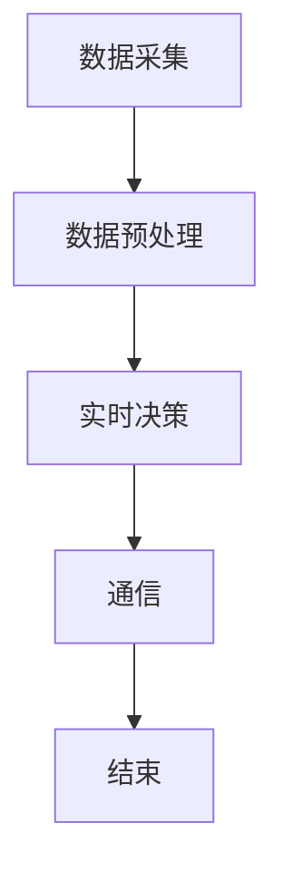
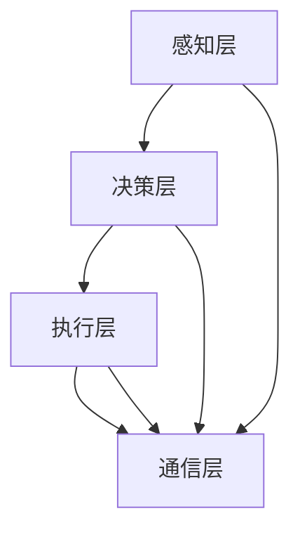
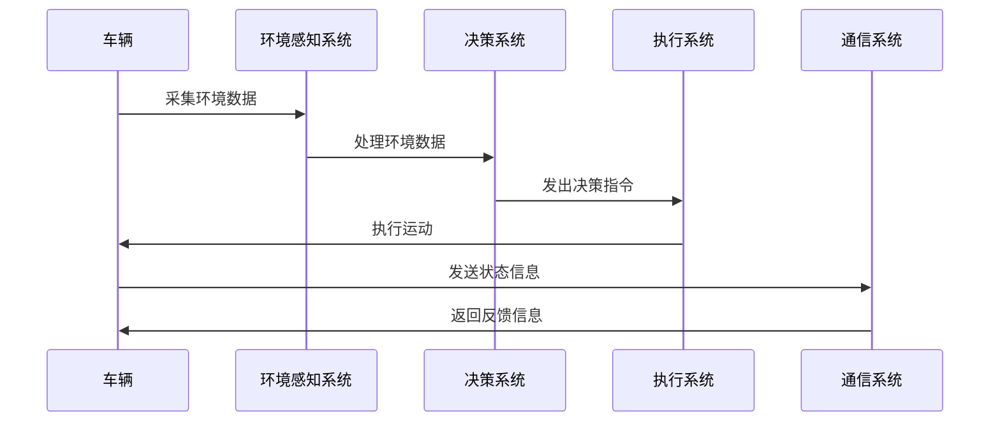

                 

### 5G网络赋能无人驾驶的发展与挑战

#### 关键词：5G网络、无人驾驶、技术发展、挑战与机遇、系统架构、算法原理、最佳实践

> 摘要：随着5G网络的逐渐普及，其在无人驾驶领域的应用成为推动这一前沿技术发展的重要力量。本文将从背景介绍、核心概念与联系、算法原理讲解、系统分析与架构设计方案、项目实战以及最佳实践等方面，详细探讨5G网络如何赋能无人驾驶的发展与挑战。

#### 目录

1. **背景介绍与核心概念**

   1.1 5G网络技术简介

   1.2 无人驾驶技术概述

   1.3 5G网络与无人驾驶的关系

2. **核心概念与联系**

   2.1 5G网络关键技术

   2.2 无人驾驶核心技术

   2.3 5G网络在无人驾驶中的应用

3. **算法原理讲解**

   3.1 5G网络下的无人驾驶算法

   3.2 算法mermaid流程图与Python代码示例

   3.3 算法数学模型与公式

4. **系统分析与架构设计方案**

   4.1 5G网络赋能无人驾驶系统架构

   4.2 系统功能设计

   4.3 系统架构设计

   4.4 系统接口设计和交互

5. **项目实战**

   5.1 环境安装与配置

   5.2 系统核心实现

   5.3 代码应用解读

   5.4 实际案例分析

   5.5 项目小结

6. **最佳实践与拓展**

   6.1 设计原则与技巧

   6.2 注意事项与挑战

   6.3 拓展阅读与未来展望

#### 1. 背景介绍与核心概念

##### 1.1 5G网络技术简介

5G网络，即第五代移动通信网络，是当前通信领域的一大技术突破。相比4G网络，5G在传输速度、网络容量、延迟等方面都有显著提升。5G网络的特点包括：

- **高速度**：峰值下载速度可达20Gbps，是4G的100倍。
- **大容量**：支持数百万设备的连接，满足物联网的巨大需求。
- **低延迟**：端到端延迟降低至1毫秒，极大提升了实时交互能力。

这些特性使得5G网络在无人驾驶领域具有广阔的应用前景。

##### 1.2 无人驾驶技术概述

无人驾驶技术，是指通过车载传感器、人工智能算法等手段，实现车辆自主导航和驾驶的技术。无人驾驶的核心技术包括：

- **传感器技术**：如激光雷达、摄像头、雷达等，用于感知周围环境。
- **惯性导航系统（INS）**：提供车辆位置、速度和加速度信息。
- **车辆控制系统**：负责执行无人驾驶算法的决策，控制车辆运动。
- **人工智能与机器学习**：用于处理海量数据，实现智能决策和路径规划。

##### 1.3 5G网络与无人驾驶的关系

5G网络与无人驾驶的结合，主要体现在以下几个方面：

- **实时通信**：5G网络的高带宽、低延迟特性，可以确保无人驾驶车辆与云端系统、其他车辆以及基础设施之间的实时数据传输，实现协同驾驶。
- **数据处理**：5G网络的高速度，可以加速无人驾驶算法的运算，提高决策的实时性和准确性。
- **安全监控**：5G网络可以实现车辆状态的远程监控，提高无人驾驶的安全性。

#### 2. 核心概念与联系

##### 2.1 5G网络关键技术

**5G网络架构**：5G网络由多个层次组成，包括无线接入网、核心网、传输网等。其中，无线接入网是5G网络的核心，其关键技术包括：

- **NR（New Radio）**：5G无线接入技术，采用毫米波频段和Massive MIMO（大规模MIMO）技术，实现高带宽、低延迟的通信。
- **SDN（Software Defined Network）**：软件定义网络技术，通过虚拟化和自动化管理，提高网络的可编程性和灵活性。
- **NFV（Network Functions Virtualization）**：网络功能虚拟化技术，将传统的网络设备功能虚拟化，提高网络资源的利用效率和灵活性。

**5G网络关键特性**：5G网络的关键特性包括：

- **高速度**：峰值下载速度可达20Gbps。
- **大容量**：支持数百万设备的连接。
- **低延迟**：端到端延迟降低至1毫秒。
- **高可靠性**：提供高可靠性的低时延通信。

**5G网络在无人驾驶中的应用**：5G网络在无人驾驶中的应用主要体现在以下几个方面：

- **车辆通信**：通过V2X（Vehicle-to-Everything）技术，实现车辆与车辆、车辆与基础设施之间的通信，提高道路安全和效率。
- **云端计算**：利用5G网络的高速度和低延迟，实现无人驾驶车辆的云端计算，提高算法的运算速度和决策准确性。
- **数据传输**：通过5G网络，实现大量传感器数据的实时传输，为无人驾驶算法提供丰富的数据支持。

##### 2.2 无人驾驶核心技术

**传感器技术**：传感器技术是无人驾驶的核心，主要包括：

- **激光雷达**：用于感知周围环境的三维信息。
- **摄像头**：用于识别道路、交通标志、行人等视觉信息。
- **雷达**：用于检测周围物体的距离和速度。

**惯性导航系统（INS）**：惯性导航系统是无人驾驶车辆的定位和导航基础，主要包括：

- **加速度计**：测量车辆加速度。
- **陀螺仪**：测量车辆角速度。
- **GPS**：全球定位系统，提供车辆的地理位置信息。

**车辆控制系统**：车辆控制系统负责执行无人驾驶算法的决策，主要包括：

- **电子控制单元（ECU）**：控制车辆的各种电子设备。
- **制动系统**：实现车辆的制动控制。
- **转向系统**：实现车辆的转向控制。

**人工智能与机器学习**：人工智能与机器学习是无人驾驶算法的核心，主要包括：

- **深度学习**：用于图像识别、语音识别等任务。
- **强化学习**：用于路径规划和决策控制。
- **监督学习**：用于车辆状态监测和故障诊断。

##### 2.3 5G网络在无人驾驶中的应用

**车辆通信**：5G网络可以实现车辆与车辆、车辆与基础设施之间的实时通信，提高道路安全和效率。例如，车辆可以通过5G网络实时传输传感器数据，实现协同驾驶。

**云端计算**：5G网络的高速度和低延迟，可以加速无人驾驶算法的运算，提高决策的实时性和准确性。例如，通过5G网络，可以实现车辆与云端系统的实时数据交互，实现自动驾驶的智能决策。

**数据传输**：5G网络可以实现大量传感器数据的实时传输，为无人驾驶算法提供丰富的数据支持。例如，车辆可以通过5G网络实时传输激光雷达、摄像头等传感器的数据，实现环境感知和路径规划。

#### 3. 算法原理讲解

##### 3.1 5G网络下的无人驾驶算法

5G网络下的无人驾驶算法，主要涉及以下几个方面：

- **数据采集与预处理**：通过传感器采集环境数据，对数据进行预处理，如去噪、归一化等。
- **实时决策算法**：根据预处理后的数据，实现车辆的实时决策，如路径规划、避障等。
- **通信算法**：实现车辆与云端系统、其他车辆以及基础设施之间的通信，确保数据的实时传输和可靠性。

##### 3.2 算法mermaid流程图与Python代码示例

**mermaid流程图示例**：



**Python代码示例**：

```python
# 数据采集
def data_collection():
    # 采集传感器数据
    pass

# 数据预处理
def data_preprocessing(data):
    # 对数据进行预处理
    pass

# 实时决策
def real_time_decision(preprocessed_data):
    # 实现实时决策
    pass

# 通信
def communication():
    # 实现通信
    pass

# 主函数
def main():
    data = data_collection()
    preprocessed_data = data_preprocessing(data)
    real_time_decision(preprocessed_data)
    communication()

if __name__ == "__main__":
    main()
```

##### 3.3 算法数学模型与公式

5G网络下的无人驾驶算法，涉及到多个数学模型和公式，主要包括：

- **路径规划**：使用A*算法进行路径规划，其核心公式为：

  ```latex
  d(i, j) = \sqrt{(x_i - x_j)^2 + (y_i - y_j)^2}
  ```

- **避障**：使用动态窗口法进行避障，其核心公式为：

  ```latex
  v_i = \frac{d_i - \delta}{T}
  ```

- **通信**：使用TCP协议进行数据传输，其核心公式为：

  ```latex
  R = \frac{1}{\sqrt{1 + 3h^2}}
  ```

#### 4. 系统分析与架构设计方案

##### 4.1 5G网络赋能无人驾驶系统架构

5G网络赋能无人驾驶的系统架构，主要包括以下几个部分：

- **感知层**：通过传感器收集环境信息。
- **决策层**：基于5G网络进行实时决策。
- **执行层**：控制车辆的运动。
- **通信层**：实现车辆与外部系统的通信。

##### 4.2 系统功能设计

系统功能设计主要包括以下几个方面：

- **环境感知**：通过激光雷达、摄像头等传感器，实现对周围环境的感知。
- **路径规划**：基于实时数据，实现车辆的路径规划。
- **避障**：基于实时数据，实现车辆的避障。
- **通信**：实现车辆与外部系统的通信，如交通信号灯、其他车辆等。

##### 4.3 系统架构设计

系统架构设计主要包括以下几个方面：

- **硬件架构**：包括传感器、控制器、通信模块等。
- **软件架构**：包括感知模块、决策模块、执行模块、通信模块等。

**mermaid架构图示例**：



##### 4.4 系统接口设计和交互

系统接口设计和交互主要包括以下几个方面：

- **硬件接口**：包括传感器接口、控制器接口、通信接口等。
- **软件接口**：包括感知接口、决策接口、执行接口、通信接口等。

**mermaid序列图示例**：



#### 5. 项目实战

##### 5.1 环境安装与配置

在进行5G网络赋能无人驾驶项目实战前，需要搭建相应的开发环境。主要包括以下几个方面：

- **硬件环境**：包括传感器设备、控制器、通信设备等。
- **软件环境**：包括操作系统、编程语言、开发工具等。

**示例**：

```bash
# 安装操作系统
sudo apt-get update
sudo apt-get install ubuntu-desktop

# 安装编程语言
sudo apt-get install python3 python3-pip

# 安装开发工具
sudo apt-get install vscode
```

##### 5.2 系统核心实现

系统核心实现主要包括以下几个方面：

- **环境感知**：通过传感器采集环境数据。
- **路径规划**：基于实时数据，实现车辆的路径规划。
- **避障**：基于实时数据，实现车辆的避障。
- **通信**：实现车辆与外部系统的通信。

**Python代码示例**：

```python
# 环境感知
def environment_perception():
    # 采集传感器数据
    pass

# 路径规划
def path_planning(data):
    # 实现路径规划
    pass

# 避障
def obstacle_avoidance(data):
    # 实现避障
    pass

# 通信
def communication():
    # 实现通信
    pass

# 主函数
def main():
    data = environment_perception()
    path = path_planning(data)
    obstacle = obstacle_avoidance(data)
    communication()

if __name__ == "__main__":
    main()
```

##### 5.3 代码应用解读与分析

在代码应用解读与分析过程中，需要重点关注以下几个方面：

- **算法原理**：详细阐述环境感知、路径规划、避障、通信等算法的原理。
- **数据流程**：分析传感器数据、路径规划数据、避障数据等在系统中的处理流程。
- **性能优化**：探讨如何优化算法性能，提高系统的实时性和准确性。

##### 5.4 实际案例分析

在实际案例分析中，需要选取具有代表性的案例，进行详细讲解和剖析。主要包括以下几个方面：

- **案例背景**：介绍案例的背景、目的和意义。
- **案例分析**：分析案例中遇到的问题、解决方案和实施效果。
- **案例总结**：总结案例的经验和教训，为后续项目提供借鉴。

##### 5.5 项目小结

项目小结主要包括以下几个方面：

- **项目成果**：总结项目的主要成果和收获。
- **经验教训**：总结项目过程中遇到的问题、解决方案和经验教训。
- **未来展望**：展望项目的未来发展，提出改进方向和建议。

#### 6. 最佳实践与拓展

##### 6.1 设计原则与技巧

在设计5G网络赋能无人驾驶系统时，需要遵循以下原则和技巧：

- **模块化设计**：将系统划分为多个模块，便于维护和升级。
- **冗余设计**：增加系统的冗余设计，提高系统的可靠性。
- **实时性优化**：优化算法和通信，提高系统的实时性。

##### 6.2 注意事项与挑战

在实施5G网络赋能无人驾驶项目时，需要注意以下几个方面：

- **硬件兼容性**：确保传感器、控制器等硬件设备的兼容性。
- **通信稳定性**：确保5G网络的通信稳定性，避免数据丢失。
- **安全性**：确保系统的安全性，防止黑客攻击和恶意软件入侵。

##### 6.3 拓展阅读与未来展望

为进一步了解5G网络赋能无人驾驶的进展和挑战，推荐以下拓展阅读：

- **相关论文**：查阅国内外有关5G网络赋能无人驾驶的学术论文。
- **行业报告**：关注国内外行业报告，了解市场动态和发展趋势。
- **技术博客**：阅读相关技术博客，掌握最新的技术动态和解决方案。

#### 结束语

5G网络赋能无人驾驶，不仅带来了前所未有的发展机遇，也带来了诸多挑战。通过本文的详细分析和讲解，希望能为广大读者提供有益的参考和启示。在未来的发展中，我们期待5G网络与无人驾驶的深度融合，为人类带来更加智能、安全、便捷的出行方式。

### 作者信息

作者：AI天才研究院/AI Genius Institute & 禅与计算机程序设计艺术 /Zen And The Art of Computer Programming

