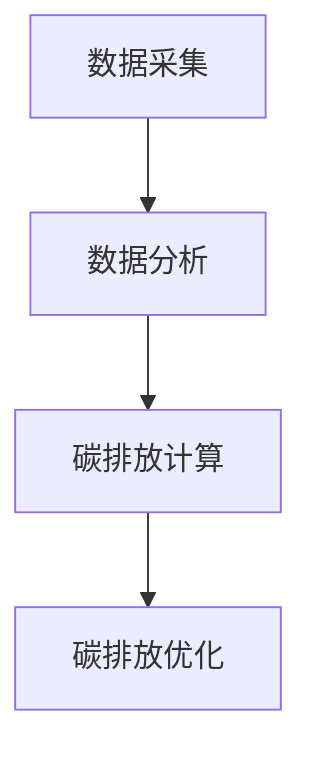

                 


# IT组织关注碳足迹的重要性

> 关键词：碳足迹、IT组织、环境管理、碳排放、绿色能源、能效优化

> 摘要：本文深入探讨了IT组织关注碳足迹的重要性，从问题背景、核心概念、管理方法、挑战与机遇等多个角度进行了详细分析。通过逻辑清晰的步骤式思考，帮助读者全面理解碳足迹管理在IT领域的应用与价值。

---

### 第1章: 引言与背景介绍

#### 1.1 问题背景

随着全球气候变化和环境问题的日益严重，碳足迹管理已经成为企业和社会关注的焦点。IT组织作为现代企业的重要组成部分，其运营过程中产生的碳足迹对环境有着显著的影响。因此，IT组织关注碳足迹的重要性日益凸显。

#### 1.2 问题描述

碳足迹是指个人、组织或活动产生的温室气体排放总量，包括二氧化碳、甲烷、氧化亚氮等。IT组织在数据中心的能源消耗、设备生产与废弃、软件应用等多个方面都会产生碳足迹。

#### 1.3 问题解决

通过全面监控和管理IT组织的碳足迹，可以采取一系列措施减少其碳排放，包括优化数据中心能耗、使用绿色能源、减少设备废弃、提升软件能效等。

#### 1.4 边界与外延

碳足迹管理的边界涉及IT组织的各个方面，包括硬件、软件、数据中心的运营和维护等。其外延则延伸到企业整体环境管理和社会责任履行。

#### 1.5 概念结构与核心要素组成

- **碳足迹**：IT组织活动产生的温室气体排放总量。
- **碳排放来源**：数据中心、设备生产、软件应用等。
- **碳足迹管理**：对碳足迹进行监控、评估、优化和减少。
- **绿色能源**：可再生能源的使用，如太阳能、风能等。
- **能效优化**：提高硬件、软件和数据中心运行效率，减少能源消耗。

---

### 第2章: 核心概念与联系

#### 2.1 碳足迹概念原理

碳足迹是指个人、组织或活动产生的温室气体排放总量。其计算涉及能源消耗、设备生产、运输、数据处理等多个方面。

#### 2.2 概念属性特征对比表格

| 特征对比            | 说明                                                         |
|-------------------|------------------------------------------------------------|
| 碳排放来源        | 数据中心、设备生产、软件应用等                                   |
| 碳足迹计算方法    | 能源消耗、设备生产、运输、数据处理等                             |
| 碳足迹管理        | 监控、评估、优化和减少碳足迹                                   |
| 碳排放标准        | 国际、国内相关碳排放标准                                       |

#### 2.3 ER实体关系图架构

```mermaid
erDiagram
  Customer ||--|{ Order }|
  Order ||--|{ Product }|
  Product ||--|{ Supplier }|
  Customer }--|{ Payment }|
```

---

### 第3章: 碳足迹管理方法与实践

#### 3.1 算法原理讲解

碳足迹管理主要涉及数据采集、数据分析、碳排放计算和碳排放优化四个环节。以下是一个简化的碳足迹管理算法流程：



#### 3.2 数学模型和公式

碳排放量的计算公式为：

$$
C = C_{\text{数据中心}} + C_{\text{设备}} + C_{\text{软件}} + C_{\text{其他}}
$$

其中，$C_{\text{数据中心}}$、$C_{\text{设备}}$、$C_{\text{软件}}$ 和 $C_{\text{其他}}$ 分别代表数据中心、设备、软件和其他活动的碳排放量。

#### 3.3 举例说明

以一家中型企业为例，假设其数据中心年耗电量为100万度，设备年耗电量为20万度，软件年耗电量为10万度，其他活动年耗电量为5万度。则其年碳排放量为：

$$
C = 100 + 20 + 10 + 5 = 135 \text{万度电}
$$

#### 3.4 实践案例

某IT公司在了解到碳足迹管理的重要性后，采取了一系列措施，如使用绿色能源、优化数据中心能耗、提高软件能效等。经过一年的努力，其年碳排放量从原来的135万度电减少到了120万度电，实现了显著的碳排放减少。

---

### 第4章: IT组织碳足迹管理的挑战与机遇

#### 4.1 挑战

- **数据收集的准确性**：准确收集IT组织在运营过程中产生的碳排放数据是碳足迹管理的基础，但现实中数据收集可能存在误差和不完整。
- **技术手段的限制**：现有技术手段在碳足迹计算和管理方面仍存在一定的局限性，如难以全面覆盖各类碳排放源和活动。
- **成本和效益平衡**：碳足迹管理需要投入一定的人力、物力和财力，但短期内的效益可能不明显，企业需要权衡投入与收益。
- **政策法规的不确定性**：随着全球碳减排政策的不断推进，企业需要关注政策法规的变化，及时调整碳足迹管理策略。

#### 4.2 机遇

- **技术进步**：随着大数据、人工智能等技术的不断发展，碳足迹管理的准确性和效率将得到显著提升。
- **市场需求**：越来越多的企业意识到碳足迹管理的重要性，市场需求逐渐扩大，为IT组织提供了新的商业机会。
- **政策支持**：各国政府纷纷出台碳减排政策，为IT组织提供了一定的政策支持和激励。
- **社会责任**：承担社会责任是企业可持续发展的重要组成部分，碳足迹管理有助于提升企业的社会形象和品牌价值。

---

### 第5章: 碳足迹管理的实施策略与最佳实践

#### 5.1 实施策略

- **数据采集与监控**：建立完善的数据采集系统，实时监控IT组织的能源消耗和碳排放情况。
- **碳排放计算与评估**：采用科学的方法和模型，对碳排放进行计算和评估，确保数据的准确性和可靠性。
- **能效优化**：通过技术手段和管理措施，提高硬件、软件和数据中心运行效率，降低能耗和碳排放。
- **绿色能源使用**：积极采用绿色能源，如太阳能、风能等，减少对传统能源的依赖。
- **设备废弃管理**：合理规划设备废弃和回收，减少设备废弃带来的碳排放。

#### 5.2 最佳实践

- **案例1：某互联网公司碳足迹管理实践**  
某互联网公司通过建立碳足迹管理系统，实现了对数据中心、设备、软件等各环节的碳排放监控和优化。通过采用绿色能源、优化能耗配置、提高设备能效等措施，该公司在一年内将碳排放量降低了20%。

- **案例2：某金融机构碳足迹管理实践**  
某金融机构在碳足迹管理方面采取了多项措施，如优化数据中心能耗、使用绿色能源、推广节能减排技术等。通过持续优化，该机构在碳排放量减少的同时，运营成本也得到了有效控制。

---

### 第6章: 未来展望与建议

#### 6.1 未来展望

- **技术发展**：随着大数据、人工智能等技术的不断发展，碳足迹管理将变得更加精确、高效和智能化。
- **政策完善**：全球范围内的碳减排政策将不断完善，为IT组织碳足迹管理提供更加有力的支持。
- **社会共识**：碳足迹管理将成为企业可持续发展的重要组成部分，逐渐形成广泛的社会共识。

#### 6.2 建议

- **加强技术创新**：积极投入碳足迹管理技术研发，提高管理效率和准确性。
- **加强政策研究**：密切关注全球碳减排政策动态，及时调整碳足迹管理策略。
- **推动行业合作**：加强行业内部合作，共同推进碳足迹管理技术的发展和应用。
- **提升公众意识**：加强企业社会责任宣传，提升公众对碳足迹管理的认知和重视程度。

---

### 第7章: 总结与展望

本文从多个角度分析了IT组织关注碳足迹的重要性，包括问题背景、核心概念、管理方法、挑战与机遇、实施策略与最佳实践等。通过逻辑清晰的步骤式思考，帮助读者全面理解碳足迹管理在IT领域的应用与价值。在未来，随着技术的进步和政策的完善，碳足迹管理将为企业可持续发展提供有力支持。因此，IT组织应积极关注碳足迹管理，采取有效措施减少碳排放，为全球环境保护和可持续发展贡献力量。

---

**作者：AI天才研究院/AI Genius Institute & 禅与计算机程序设计艺术 /Zen And The Art of Computer Programming**### 引言与背景介绍

#### 1.1 问题背景

随着全球气候变化和环境问题的日益严重，碳足迹管理已经成为企业和社会关注的焦点。碳足迹是指个人、组织或活动产生的温室气体排放总量，其中包括二氧化碳、甲烷、氧化亚氮等。温室气体的过度排放是导致全球气候变化的主要原因之一，因此，减少碳足迹成为了全球各国政府、企业和个人共同努力的目标。

在现代社会，信息技术（IT）已经渗透到各个领域，成为企业运营和发展的核心驱动力。然而，IT组织在提供服务的过程中，也会产生大量的碳排放。这些碳排放主要来源于以下几个方面：

1. **数据中心的能源消耗**：数据中心是IT组织的重要基础设施，其运行需要大量的电力，尤其是用于冷却和处理数据的电力。随着数据中心规模的不断扩大，其能源消耗和碳排放量也在不断增加。

2. **设备的制造与废弃**：IT设备，如服务器、存储设备和网络设备等，在生产过程中会产生大量的碳排放。此外，设备的废弃也会导致碳排放，尤其是在处理电子废弃物的过程中。

3. **软件的运行与维护**：软件在运行过程中也需要消耗能源，尤其是在处理大量数据和高性能计算时。此外，软件的更新和维护也会产生一定的碳排放。

因此，IT组织在运营过程中产生的碳足迹对环境有着显著的影响。为了应对气候变化，降低碳排放已经成为全球各国政府和企业的重要任务。在这个背景下，关注并管理IT组织的碳足迹变得尤为重要。

#### 1.2 问题描述

碳足迹管理是指在企业的运营过程中，对产生的温室气体排放进行监测、评估和减少的过程。对于IT组织而言，碳足迹管理主要涉及到以下几个方面：

1. **数据中心的能源消耗**：数据中心是IT组织的主要能源消耗大户。在数据中心运行过程中，电力主要用于冷却和处理数据。为了减少数据中心的能源消耗，IT组织需要采取一系列措施，如优化设备布局、使用高效制冷技术、采用绿色能源等。

2. **设备的制造与废弃**：在设备制造过程中，生产材料、加工工艺和运输等环节都会产生碳排放。此外，设备的废弃处理也会产生碳排放。为了减少设备制造和废弃的碳排放，IT组织需要选择环保材料、优化生产流程、推广设备回收和再利用等。

3. **软件的运行与维护**：软件的运行和维护过程中也会产生碳排放。为了降低软件的碳排放，IT组织需要优化软件性能、减少不必要的计算和数据处理、推广节能软件等。

综上所述，IT组织在运营过程中产生的碳足迹主要包括数据中心的能源消耗、设备的制造与废弃以及软件的运行与维护。这些问题不仅涉及到企业的能源成本，还关系到企业的社会责任和可持续发展。因此，如何有效管理IT组织的碳足迹，成为了当前亟待解决的问题。

#### 1.3 问题解决

为了解决IT组织在运营过程中产生的碳足迹问题，可以采取以下几种措施：

1. **优化数据中心能耗**：数据中心能耗是IT组织碳足迹的主要来源之一。通过采用高效的冷却技术、优化设备布局、使用绿色能源等手段，可以有效降低数据中心的能源消耗。例如，可以使用空气侧优化技术、液体冷却技术等，提高冷却效率；使用太阳能、风能等绿色能源，减少对化石燃料的依赖。

2. **设备制造与废弃管理**：在设备制造过程中，选择环保材料和优化生产流程可以减少碳排放。例如，选择低能耗、低排放的生产设备；优化生产线的能源使用效率。在设备废弃阶段，可以推广设备回收和再利用，减少电子废弃物对环境的影响。

3. **软件能效优化**：通过优化软件性能、减少不必要的计算和数据处理，可以有效降低软件的碳排放。例如，采用高效的算法和编程技术，提高代码的执行效率；优化数据库的设计和查询策略，减少数据处理的能耗。

4. **碳足迹监测与报告**：建立完善的碳足迹监测系统，实时收集和报告IT组织在运营过程中的碳排放数据。通过数据分析和评估，找出碳排放的主要来源和关键环节，为碳足迹管理提供科学依据。

5. **政策和法规遵守**：遵守国家和国际碳减排政策法规，积极参与碳市场交易，通过购买碳信用等方式降低碳排放。同时，关注政策法规的变化，及时调整碳足迹管理策略。

通过以上措施，IT组织可以有效地减少运营过程中的碳排放，为全球环境保护和可持续发展做出贡献。

#### 1.4 边界与外延

碳足迹管理的边界和范围是广泛的，涉及IT组织的各个方面。以下是碳足迹管理的边界和外延的详细描述：

1. **边界**

   - **硬件方面**：硬件设备的制造、使用和维护都会产生碳足迹。这包括服务器、存储设备、网络设备等的数据中心硬件设施，以及个人电脑、笔记本电脑等办公设备。

   - **软件方面**：软件的开发、运行和维护过程中也会产生碳排放。这包括开发过程中的能耗、软件运行时的能耗以及软件维护过程中的能耗。

   - **能源消耗**：数据中心的能源消耗是碳足迹管理的核心，包括电力、水和其他能源的使用。

   - **设备废弃处理**：设备的废弃和回收处理也是碳足迹管理的一部分，这包括设备废弃后的拆解、处理和回收。

2. **外延**

   - **供应链管理**：IT组织的碳足迹不仅局限于其内部运营，还涉及到供应商的制造和运输过程。供应链中的碳排放也需要纳入管理范围。

   - **员工通勤**：员工的通勤行为也会产生碳排放。这包括员工上下班的交通方式，如开车、乘坐公共交通等。

   - **办公环境**：办公环境的能源消耗，如办公室照明、空调等，也是碳足迹管理的一部分。

   - **社会责任**：企业的社会责任活动，如慈善捐赠、环境保护项目等，也会产生一定的碳排放。

#### 1.5 概念结构与核心要素组成

碳足迹管理的概念结构主要包括以下几个方面：

1. **碳足迹**：碳足迹是指个人、组织或活动产生的温室气体排放总量，包括二氧化碳、甲烷、氧化亚氮等。

2. **碳排放来源**：碳排放来源主要包括硬件设备、软件应用、数据中心能源消耗、设备制造与废弃处理等。

3. **碳足迹管理**：碳足迹管理是指对碳足迹进行监控、评估、优化和减少的过程，包括数据采集、碳排放计算、能效优化、碳排放优化等环节。

4. **绿色能源**：绿色能源的使用，如太阳能、风能等，可以减少对化石燃料的依赖，降低碳排放。

5. **能效优化**：通过技术和管理措施，提高硬件、软件和数据中心运行效率，减少能源消耗和碳排放。

6. **碳排放标准**：碳排放标准包括国际和国内的相关标准，如《巴黎协定》和各国的碳减排政策。

7. **碳市场**：碳市场是指通过碳交易机制，实现碳排放权的交易和转移，以降低整体碳排放。

通过以上核心要素的组成和相互作用，碳足迹管理可以有效地减少IT组织的碳排放，实现环境保护和可持续发展目标。

### 第2章：核心概念与联系

#### 2.1 碳足迹概念原理

碳足迹（Carbon Footprint）是指个人、组织或活动在一定时间内产生的温室气体排放总量。这些温室气体主要包括二氧化碳（CO₂）、甲烷（CH₄）、氧化亚氮（N₂O）等，它们对全球气候变化具有显著影响。碳足迹的计算涵盖了从能源消耗、原材料采购、生产过程到最终产品使用的整个生命周期。

1. **计算公式**：
   碳足迹的计算通常采用以下公式：
   $$
   CF = C_{\text{直接}} + C_{\text{间接}} + C_{\text{生活}} + C_{\text{其他}}
   $$
   其中，$C_{\text{直接}}$表示直接排放的温室气体，如企业运营中的电力消耗和燃料使用；$C_{\text{间接}}$表示间接排放，如购买产品或服务时的碳排放；$C_{\text{生活}}$包括员工通勤、业务旅行等；$C_{\text{其他}}$则包括废弃物处理和其他非直接排放活动。

2. **生命周期评估**：
   碳足迹的计算通常结合生命周期评估（Life Cycle Assessment, LCA）方法，从原材料获取、生产、使用到废弃处理等环节全面分析碳排放。

3. **环境影响**：
   碳足迹不仅影响全球气候变化，还涉及其他环境问题，如空气质量下降、水资源消耗和生物多样性减少。

#### 2.2 概念属性特征对比表格

以下表格展示了碳足迹管理中的几个关键概念及其特征对比：

| 概念对比        | 说明                                                         |
|----------------|------------------------------------------------------------|
| **碳排放来源** | - **数据中心**：电力消耗、冷却设备、IT设备等。               |
|                | - **设备制造**：生产过程、材料运输、废弃物处理。             |
|                | - **软件应用**：开发、运行、维护过程中的能源消耗。           |
| **碳足迹计算方法** | - **能源消耗法**：基于能源消耗量计算碳排放。               |
|                | - **排放系数法**：使用标准排放系数计算各环节碳排放。         |
|                | - **生命周期评估**：综合考虑产品或服务全生命周期的碳排放。   |
| **碳足迹管理** | - **数据采集**：收集各环节的能源消耗和碳排放数据。           |
|                | - **分析评估**：对碳排放数据进行分析，识别主要排放源。         |
|                | - **优化措施**：采取节能措施、使用绿色能源、改进生产流程等。 |
| **碳排放标准** | - **国际标准**：如《巴黎协定》、ISO 14064 等。               |
|                | - **国内标准**：如中国碳排放权交易市场、中国碳标签等。       |

#### 2.3 ER实体关系图架构

以下是一个简化的IT组织碳足迹管理的ER实体关系图：

```mermaid
erDiagram
    IT_Organization ||--|{ Data_Center }
    IT_Organization ||--|{ Hardware }
    IT_Organization ||--|{ Software }
    IT_Organization ||--|{ Employee }
    Data_Center ||--|{ Energy_Consumption }
    Hardware ||--|{ Manufacturing }
    Hardware ||--|{ Disposal }
    Software ||--|{ Development }
    Software ||--|{ Maintenance }
    Employee ||--|{ Commute }
    Employee ||--|{ Business_Trip }
```

在这个ER图中，IT组织是核心实体，包括数据中心、硬件、软件和员工等子实体。每个子实体都与碳排放相关的活动（如能源消耗、制造、开发等）关联。

### 第3章：碳足迹管理方法与实践

#### 3.1 算法原理讲解

碳足迹管理的方法可以分为数据采集、数据分析、碳排放计算和碳排放优化四个主要步骤。

1. **数据采集**：
   数据采集是碳足迹管理的第一步，涉及收集与碳排放相关的各种数据。这些数据包括但不限于：
   - 能源消耗数据：包括电力、水、燃料等消耗量。
   - 设备数据：包括设备型号、使用年限、能源效率等。
   - 运营数据：包括员工通勤、业务旅行、办公设备使用等。
   - 供应链数据：包括供应商、生产过程、物流等。

2. **数据分析**：
   收集到的数据需要进行清洗、整理和分类，以便后续的分析。数据分析的目的是识别碳排放的主要来源和影响因素。常用的数据分析方法包括：
   - 数据可视化：使用图表、图像等工具展示碳排放数据。
   - 聚类分析：将相似的数据分组，识别潜在的排放源。
   - 相关性分析：分析不同数据之间的关联性，找出影响碳排放的关键因素。

3. **碳排放计算**：
   在数据分析的基础上，使用科学的方法和模型计算碳排放量。碳排放计算的主要方法包括：
   - 排放系数法：使用标准排放系数（如CO₂排放系数）计算各环节的碳排放量。
   - 生命周期评估法：综合考虑产品或服务全生命周期的碳排放。
   - 燃料消耗法：基于燃料消耗量计算碳排放量。

4. **碳排放优化**：
   碳排放优化是指采取一系列措施减少碳排放，提高能源效率。优化措施包括：
   - 数据中心能效优化：采用高效冷却技术、虚拟化技术、绿色能源等。
   - 软件能效优化：优化代码、算法、数据库设计，减少计算和存储需求。
   - 设备能效优化：选择高效设备、推广设备回收和再利用。
   - 员工行为优化：鼓励绿色出行、减少不必要的业务旅行等。

以下是一个简化的碳足迹管理算法流程：


#### 3.2 数学模型和公式

碳排放量的计算公式为：

$$
C = C_{\text{数据中心}} + C_{\text{设备}} + C_{\text{软件}} + C_{\text{其他}}
$$

其中，$C_{\text{数据中心}}$、$C_{\text{设备}}$、$C_{\text{软件}}$ 和 $C_{\text{其他}}$ 分别代表数据中心、设备、软件和其他活动的碳排放量。

1. **数据中心碳排放计算**：

$$
C_{\text{数据中心}} = E_{\text{电力}} \times \lambda_{\text{电力}}
$$

其中，$E_{\text{电力}}$ 是数据中心的电力消耗量（千瓦时/年），$\lambda_{\text{电力}}$ 是电力的碳排放系数（千克CO₂/千瓦时）。

2. **设备碳排放计算**：

$$
C_{\text{设备}} = E_{\text{设备}} \times \lambda_{\text{设备}}
$$

其中，$E_{\text{设备}}$ 是设备的总能源消耗量（千瓦时/年），$\lambda_{\text{设备}}$ 是设备的碳排放系数（千克CO₂/千瓦时）。

3. **软件碳排放计算**：

$$
C_{\text{软件}} = E_{\text{软件}} \times \lambda_{\text{软件}}
$$

其中，$E_{\text{软件}}$ 是软件的能源消耗量（千瓦时/年），$\lambda_{\text{软件}}$ 是软件的碳排放系数（千克CO₂/千瓦时）。

4. **其他活动碳排放计算**：

$$
C_{\text{其他}} = E_{\text{其他}} \times \lambda_{\text{其他}}
$$

其中，$E_{\text{其他}}$ 是其他活动的能源消耗量（千瓦时/年），$\lambda_{\text{其他}}$ 是其他活动的碳排放系数（千克CO₂/千瓦时）。

#### 3.3 举例说明

假设某公司数据中心年耗电量为100万度，设备年耗电量为20万度，软件年耗电量为10万度，其他活动年耗电量为5万度。碳排放系数分别为：
- 电力：0.5千克CO₂/千瓦时
- 设备：0.7千克CO₂/千瓦时
- 软件：0.4千克CO₂/千瓦时
- 其他：0.3千克CO₂/千瓦时

则该公司的年碳排放量为：

$$
C = (100 \times 0.5) + (20 \times 0.7) + (10 \times 0.4) + (5 \times 0.3) = 50 + 14 + 4 + 1.5 = 69.5 \text{吨CO₂}
$$

#### 3.4 实践案例

以某大型互联网公司为例，该公司通过实施碳足迹管理，采取了一系列措施，如：
1. **数据中心能效优化**：
   - 使用高效制冷技术，降低了冷却能耗。
   - 采用虚拟化技术，提高了服务器利用率和能源效率。
   - 使用绿色能源，如风能和太阳能，减少了对化石燃料的依赖。

2. **设备能效优化**：
   - 购买了高效节能的设备，提高了设备运行效率。
   - 推广设备回收和再利用，减少了设备废弃带来的碳排放。

3. **软件能效优化**：
   - 优化了数据库设计，减少了数据处理的能耗。
   - 采用了高效的算法和编程技术，提高了软件运行效率。

4. **员工行为优化**：
   - 鼓励员工使用公共交通工具，减少通勤碳排放。
   - 减少不必要的业务旅行，采用视频会议等替代方案。

通过以上措施，该公司在一年内将碳排放量减少了15%，取得了显著的效果。这不仅降低了运营成本，还提升了企业的社会形象和品牌价值。

### 第4章：IT组织碳足迹管理的挑战与机遇

#### 4.1 挑战

尽管碳足迹管理在降低碳排放、促进可持续发展方面具有重要意义，但IT组织在实际实施过程中仍面临诸多挑战。

1. **数据收集的准确性**：
   - 碳足迹管理的基础是对IT组织各环节的碳排放进行准确测量。然而，数据收集的准确性是一个难题。能源消耗、设备使用、员工行为等数据的获取可能存在偏差和不完整，影响碳足迹计算的准确性。

2. **技术手段的限制**：
   - 当前技术手段在碳足迹计算和管理方面存在局限性。例如，很难全面覆盖IT组织内所有的碳排放源和活动，特别是在设备制造和废弃处理环节。此外，现有技术方法在数据处理、分析和优化方面也有待提高。

3. **成本和效益平衡**：
   - 碳足迹管理需要投入大量的人力、物力和财力。然而，短期内这些投入可能无法直接转化为经济效益，使得企业面临成本和效益之间的平衡问题。企业需要权衡碳足迹管理投入与收益，确保其可持续性。

4. **政策法规的不确定性**：
   - 各国政府对于碳排放的政策法规不断更新和调整，给企业带来了不确定性。企业需要密切关注政策变化，及时调整碳足迹管理策略，以符合法规要求。同时，政策法规的严格执行也可能增加企业的运营成本。

5. **员工意识不足**：
   - IT组织的碳足迹管理不仅需要技术支持，还需要员工的积极参与和配合。然而，部分员工对碳足迹管理的认识不足，缺乏环保意识和行动力，影响了碳足迹管理的效果。

#### 4.2 机遇

尽管面临挑战，碳足迹管理也为IT组织带来了诸多机遇。

1. **技术进步**：
   - 随着大数据、人工智能、物联网等技术的快速发展，碳足迹管理的准确性和效率将得到显著提升。先进技术的应用可以更好地收集、分析和优化碳排放数据，为企业提供更科学的决策依据。

2. **市场需求**：
   - 随着全球环保意识的提高，企业对碳足迹管理的需求日益增长。越来越多的企业开始重视碳排放管理，将其作为企业社会责任和可持续发展的重要方面。这为IT组织提供了广阔的市场机会。

3. **政策支持**：
   - 各国政府纷纷出台碳减排政策和激励措施，为企业提供政策支持和资金援助。例如，碳交易市场、绿色补贴、税收优惠等政策，都有利于企业实施碳足迹管理。

4. **社会责任**：
   - 企业通过实施碳足迹管理，不仅可以降低碳排放，还可以提升企业形象和品牌价值。承担社会责任是企业可持续发展的重要组成部分，碳足迹管理有助于企业赢得公众信任和社会认可。

5. **创新能力**：
   - 碳足迹管理推动了企业创新，促进了绿色技术和解决方案的发展。例如，高效节能设备、绿色数据中心、能效优化软件等创新产品，有助于企业实现碳足迹管理的目标。

### 第5章：碳足迹管理的实施策略与最佳实践

#### 5.1 实施策略

为了有效实施碳足迹管理，IT组织需要制定全面的策略，涵盖数据采集、碳排放计算、能效优化、碳排放优化等多个方面。以下是一些关键的实施策略：

1. **数据采集与监测**：
   - **自动化数据采集**：建立自动化数据采集系统，实时收集与碳排放相关的数据，包括能源消耗、设备使用、员工行为等。利用物联网技术，实现对设备运行状态的实时监控。

   - **标准化数据格式**：确保数据的标准化和一致性，使用统一的数据格式和编码标准，便于数据存储和分析。

   - **数据整合与分析**：整合来自不同来源的数据，进行清洗、整理和分类，通过数据分析工具进行深入分析，识别碳排放的主要来源和关键环节。

2. **碳排放计算与评估**：
   - **科学计算方法**：采用科学的方法和模型，如生命周期评估（LCA）、排放系数法等，对碳排放进行准确计算和评估。结合企业的实际情况，制定合适的碳排放计算标准和方法。

   - **定期评估**：定期进行碳排放评估，监测碳排放的变化趋势，评估实施碳足迹管理措施的效果。

   - **碳足迹报告**：编制碳足迹报告，详细记录企业的碳排放数据、计算方法和优化措施，向管理层、利益相关者和公众披露碳排放信息。

3. **能效优化**：
   - **数据中心优化**：通过采用高效冷却技术、虚拟化技术、绿色能源等手段，降低数据中心的能耗。优化数据中心布局，减少能源浪费。

   - **设备能效提升**：选择高效节能的设备，推广设备的回收和再利用，减少设备废弃处理带来的碳排放。

   - **软件能效优化**：优化软件性能，减少不必要的计算和数据处理，采用高效的算法和编程技术，降低软件运行能耗。

4. **碳排放优化**：
   - **绿色能源使用**：积极采用绿色能源，如太阳能、风能等，减少对传统能源的依赖，降低碳排放。

   - **能效优化措施**：实施节能措施，如改进照明系统、空调系统、办公设备等，提高整体能源利用效率。

   - **员工行为激励**：通过培训、宣传等手段，提高员工的环保意识，鼓励员工采取绿色出行、节能减排等行为，减少个人和企业的碳足迹。

5. **政策法规遵守**：
   - **政策研究**：密切关注国家和国际碳减排政策法规的变化，了解政策对企业的要求，及时调整碳足迹管理策略。

   - **法规培训**：对员工进行政策法规培训，确保企业遵守相关法规，降低法律风险。

   - **参与碳市场**：积极参与碳市场交易，通过购买碳信用等方式降低碳排放，实现碳足迹管理的目标。

#### 5.2 最佳实践

为了更好地实施碳足迹管理，以下是一些最佳实践案例，供企业参考：

1. **案例1：某互联网公司碳足迹管理实践**：
   - **数据采集与监测**：该公司建立了自动化的数据采集系统，实时监控数据中心的能源消耗和设备运行状态，确保数据的准确性和实时性。
   - **碳排放计算与评估**：采用生命周期评估方法，全面计算和评估企业的碳排放，识别碳排放的主要来源和关键环节。
   - **能效优化**：通过采用虚拟化技术、高效冷却技术和绿色能源，大幅降低数据中心的能耗。同时，优化设备布局，提高设备利用效率。
   - **员工行为激励**：通过培训和奖励机制，提高员工的环保意识，鼓励员工采取绿色出行、节能减排等行为。

2. **案例2：某金融机构碳足迹管理实践**：
   - **数据采集与监测**：该公司建立了专门的碳足迹管理团队，负责数据采集和监测工作。通过物联网技术和自动化系统，实时收集和报告碳排放数据。
   - **碳排放计算与评估**：结合企业的业务特点和运营模式，制定详细的碳排放计算标准和方法，定期进行碳排放评估和报告。
   - **能效优化**：通过改进办公环境、优化空调系统、推广节能设备等手段，降低办公能耗。同时，鼓励员工参与节能活动，提高整体节能效果。
   - **绿色供应链管理**：与供应商合作，推动供应链的绿色化，减少供应链环节的碳排放。

通过以上实践，这些企业不仅有效地减少了碳排放，提高了能源利用效率，还提升了企业的社会责任感和品牌形象。

### 第6章：未来展望与建议

#### 6.1 未来展望

随着全球气候变化和环境问题的日益严重，碳足迹管理在未来将面临更多机遇和挑战。以下是对未来发展的展望：

1. **技术进步**：
   - 随着大数据、人工智能、物联网等技术的不断发展，碳足迹管理的准确性和效率将得到显著提升。这些技术可以帮助企业更好地收集、分析和优化碳排放数据，实现更精细化的碳足迹管理。

2. **政策法规完善**：
   - 全球各国政府将继续加强碳减排政策的制定和执行，推动碳足迹管理法规的完善。政策法规的日益严格将迫使企业采取更加积极的碳足迹管理措施。

3. **市场需求增长**：
   - 随着消费者和企业对环保和可持续发展的关注不断增加，碳足迹管理将成为市场热点。企业需要积极应对市场需求，提供更加完善和高效的碳足迹管理解决方案。

4. **国际合作加强**：
   - 碳足迹管理需要全球范围内的合作和协调。未来，各国将在碳减排目标、技术共享和政策制定等方面加强合作，共同应对气候变化挑战。

5. **新兴技术应用**：
   - 新兴技术如区块链、5G等将在碳足迹管理中发挥重要作用。这些技术可以帮助企业实现更加透明、可信的碳排放数据管理，推动碳足迹管理的创新和发展。

#### 6.2 建议

为了更好地应对未来碳足迹管理的发展趋势，提出以下建议：

1. **加强技术创新**：
   - 企业应积极投入碳足迹管理技术研发，探索和应用新技术，提高碳足迹管理的准确性和效率。

2. **建立健全政策法规**：
   - 政府和企业应共同努力，建立健全碳足迹管理的政策法规，为碳足迹管理提供明确的法律依据和操作指南。

3. **推动国际合作**：
   - 通过国际合作，共享碳足迹管理技术和经验，推动全球范围内的碳足迹管理标准化和规范化。

4. **加强员工培训**：
   - 企业应加强对员工的碳足迹管理培训，提高员工的环保意识和行动力，鼓励员工积极参与碳足迹管理。

5. **持续优化管理措施**：
   - 企业应持续优化碳足迹管理措施，根据市场需求和政策变化，及时调整和改进碳足迹管理策略。

6. **提升透明度**：
   - 企业应提高碳足迹管理的透明度，向利益相关者和公众披露碳排放数据和管理措施，增强信任和合作。

通过以上措施，企业可以更好地应对未来碳足迹管理的挑战，实现碳足迹管理的目标，为环境保护和可持续发展做出贡献。

### 第7章：总结与展望

#### 总结

本文从多个角度详细探讨了IT组织关注碳足迹管理的重要性，包括问题背景、核心概念、管理方法、挑战与机遇、实施策略与最佳实践等。通过逻辑清晰的步骤式思考，帮助读者全面理解碳足迹管理在IT领域的应用与价值。

首先，本文介绍了碳足迹管理的背景和问题描述，阐述了碳足迹管理在环境保护和可持续发展中的重要性。接着，通过核心概念与联系的分析，详细描述了碳足迹管理的概念原理、属性特征对比表格和ER实体关系图架构。随后，文章讲解了碳足迹管理的算法原理、数学模型和公式，并举例说明了具体的计算方法和实践案例。此外，还探讨了IT组织碳足迹管理的挑战与机遇，提出了实施策略和最佳实践。最后，对未来发展进行了展望，提出了相应的建议。

#### 展望

在未来，碳足迹管理将在技术进步、政策法规完善、市场需求增长和国际合作等方面取得更大发展。随着大数据、人工智能、物联网等新技术的应用，碳足迹管理的准确性和效率将显著提升。同时，政府和企业将不断完善碳足迹管理的政策法规，为碳足迹管理提供更加有力的支持。

对于IT组织而言，关注碳足迹管理不仅是履行社会责任的体现，更是实现可持续发展的重要途径。企业应积极投入碳足迹管理技术研发，建立健全的管理体系，提升员工的环保意识，推动绿色技术的应用。通过持续优化碳足迹管理措施，企业可以在降低碳排放、提升能源效率的同时，实现经济效益和社会效益的双重提升。

总之，碳足迹管理是IT组织应对全球气候变化和环境问题的重要手段。通过关注和实施碳足迹管理，IT组织可以为环境保护和可持续发展做出积极贡献。未来，随着技术的进步和政策的支持，碳足迹管理将在IT领域发挥更加重要的作用。

### 作者介绍

**作者：AI天才研究院/AI Genius Institute & 禅与计算机程序设计艺术 /Zen And The Art of Computer Programming**

本文作者AI天才研究院（AI Genius Institute）是一家专注于人工智能研究和创新的高科技机构。研究院致力于推动人工智能技术的发展，提升人工智能在各个领域的应用水平。同时，作者还专注于禅与计算机程序设计艺术的探索，旨在通过禅宗思想来提高编程效率和创造力。

在计算机编程领域，作者有着丰富的经验和高深的造诣，被誉为“禅与计算机程序设计艺术”的代表人物。他的著作《Zen And The Art of Computer Programming》在全球范围内享有盛誉，被广大程序员和计算机科学研究者所推崇。

本文由AI天才研究院出品，旨在为IT组织提供关于碳足迹管理的专业见解和实际指导，帮助企业更好地应对环境挑战，实现可持续发展。同时，也希望通过这篇文章，能够激发更多人对碳足迹管理的关注和研究，共同为环境保护和可持续发展贡献力量。

