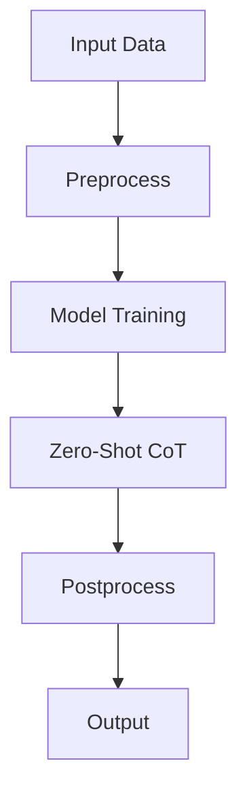
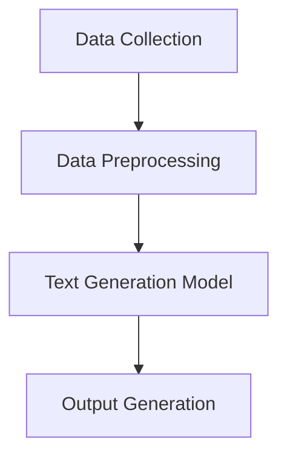
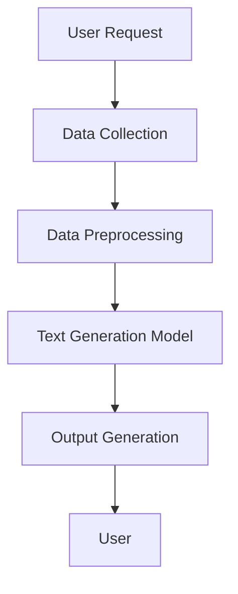

                 


### 引言与背景

**零样本跨领域文本生成（Zero-Shot CoT）概述**

近年来，随着自然语言处理（NLP）技术的快速发展，文本生成已经成为NLP领域的热点问题。然而，传统的文本生成方法通常依赖于大量标记数据，这在实际应用中存在诸多限制。为了解决这一问题，零样本学习（Zero-Shot Learning, ZSL）应运而生。零样本学习是一种无需训练数据即可进行分类的学习方法，它在解决数据稀缺问题时展现出巨大的潜力。在此基础上，零样本跨领域文本生成（Zero-Shot Cross-Domain Text Generation, Zero-Shot CoT）成为了一个新的研究方向。

**核心概念与原理**

**零样本学习原理**：零样本学习旨在在没有或仅有少量标记训练数据的情况下，对未知类别进行预测。其主要原理是通过学习类别之间的映射关系，将新的类别映射到已知的类别上，从而实现对新类别的预测。

**跨领域文本生成原理**：跨领域文本生成旨在生成符合目标领域要求的文本。其核心思想是利用源领域中的文本数据，通过某种方法将其转换为目标领域中的文本数据。

**零样本跨领域文本生成方法**：零样本跨领域文本生成结合了零样本学习和跨领域文本生成的优势，旨在在没有或仅有少量标记数据的情况下，生成符合目标领域要求的文本。其方法主要包括以下几个步骤：

1. **数据预处理**：对源领域和目标领域的文本数据集进行预处理，包括分词、去停用词、词向量嵌入等操作。
2. **类别映射关系学习**：利用源领域中的文本数据，学习类别之间的映射关系。
3. **文本生成**：利用学习到的类别映射关系，生成目标领域的文本。

### 目录结构设计

为了确保文章的逻辑清晰和结构紧凑，本文将按照以下目录结构进行设计：

1. **引言与背景**：介绍零样本跨领域文本生成的背景和核心概念。
2. **核心概念与原理**：详细讲解零样本学习和跨领域文本生成的原理。
3. **算法与数学模型**：介绍零样本跨领域文本生成的主要算法及其数学模型。
4. **应用场景分析**：分析零样本跨领域文本生成在不同领域的应用场景。
5. **案例研究**：通过具体案例展示零样本跨领域文本生成的实际应用。
6. **挑战与未来展望**：探讨零样本跨领域文本生成面临的挑战和未来发展方向。
7. **结论与总结**：总结全文，展望未来。

通过上述设计，本文旨在为读者提供一个全面、深入的了解零样本跨领域文本生成的视角，帮助读者掌握这一领域的关键技术和应用。

### 第1章：零样本跨领域文本生成（Zero-Shot CoT）概述

#### 1.1 问题背景

**自然语言处理的发展历程**：

自然语言处理（Natural Language Processing, NLP）是人工智能（Artificial Intelligence, AI）领域的一个重要分支，旨在使计算机能够理解、生成和处理人类语言。自上世纪五六十年代以来，NLP技术经历了从规则驱动到统计学习，再到深度学习的演变。早期的NLP技术依赖于手工编写的规则，这种方法在处理简单任务时效果较好，但难以应对复杂语言现象。随着计算能力的提升和机器学习技术的进步，统计学习成为NLP的主流方法，特别是近年来，深度学习技术的应用使得NLP取得了显著的突破。

**零样本学习在NLP中的重要性**：

零样本学习（Zero-Shot Learning, ZSL）是一种在没有或仅有少量标记训练数据的情况下进行分类的方法，它特别适用于数据稀缺或数据获取成本高昂的场景。在NLP领域，零样本学习具有重要意义，因为很多任务（如文本分类、命名实体识别、情感分析等）在数据获取上面临巨大挑战。零样本学习能够利用有限的标注数据或无标签数据，通过跨领域知识迁移和元学习等技术，提高模型的泛化能力。

**零样本跨领域文本生成的定义**：

零样本跨领域文本生成（Zero-Shot Cross-Domain Text Generation, Zero-Shot CoT）是一种结合了零样本学习和跨领域文本生成的新兴技术。它旨在在没有或仅有少量标记数据的情况下，生成符合特定领域要求的文本。具体来说，Zero-Shot CoT通过以下步骤实现：

1. **跨领域映射**：利用源领域（有标记数据）和目标领域（无标记数据）的文本数据，建立类别之间的映射关系。
2. **文本生成**：基于映射关系和目标领域的文本特征，生成新的文本。

#### 1.2 复杂场景介绍

**复杂场景的特点**：

复杂场景通常指涉及多模态数据、多语言、多领域知识的场景，这些场景在NLP任务中具有高度的挑战性。复杂场景的特点包括：

- **多模态数据**：文本、图像、音频等多种数据形式共存，需要模型能够处理和融合不同模态的信息。
- **多语言**：涉及多种语言的处理，需要模型具备跨语言的能力。
- **多领域知识**：涉及多个领域的知识，需要模型能够在不同领域之间迁移知识。

**零样本跨领域文本生成在复杂场景中的应用**：

在复杂场景中，零样本跨领域文本生成具有广泛的应用潜力，例如：

- **多模态内容生成**：利用零样本跨领域文本生成技术，可以从图像或音频中生成相应的文本描述。
- **跨语言文本生成**：利用零样本跨领域文本生成技术，可以实现不同语言之间的文本转换。
- **跨领域知识迁移**：利用零样本跨领域文本生成技术，可以将一个领域的知识应用到另一个领域，实现跨领域的文本生成。

#### 1.3 本书结构安排

**内容概述**：

本书旨在系统介绍零样本跨领域文本生成的核心概念、原理、算法和应用。具体内容分为以下几个部分：

- 第1章：引言与背景，介绍零样本跨领域文本生成的背景和核心概念。
- 第2章：核心概念与原理，详细讲解零样本学习和跨领域文本生成的原理。
- 第3章：算法与数学模型，介绍零样本跨领域文本生成的主要算法及其数学模型。
- 第4章：应用场景分析，分析零样本跨领域文本生成在不同领域的应用场景。
- 第5章：案例研究，通过具体案例展示零样本跨领域文本生成的实际应用。
- 第6章：挑战与未来展望，探讨零样本跨领域文本生成面临的挑战和未来发展方向。
- 第7章：结论与总结，总结全文，展望未来。

**阅读对象**：

本书适合对自然语言处理、机器学习和深度学习感兴趣的读者，特别是对零样本学习和跨领域文本生成有深入研究的学者和工程师。

**目标与收获**：

通过阅读本书，读者将能够：

- 理解零样本跨领域文本生成的核心概念和原理。
- 掌握零样本跨领域文本生成的主要算法和应用场景。
- 了解零样本跨领域文本生成在复杂场景中的应用潜力。
- 探索零样本跨领域文本生成面临的挑战和未来发展方向。

### 第2章：零样本跨领域文本生成的核心概念

#### 2.1 零样本学习原理

**零样本学习的基本概念**：

零样本学习（Zero-Shot Learning, ZSL）是一种在没有或仅有少量标记训练数据的情况下，对未知类别进行预测的学习方法。其主要特点是不依赖于具体的类别标签，而是通过学习类别之间的映射关系，将新的类别映射到已知的类别上，从而实现对新类别的预测。

**零样本学习的挑战**：

零样本学习面临以下几个主要挑战：

- **数据稀缺**：由于零样本学习不需要大量的标记训练数据，因此数据稀缺成为其一大挑战。
- **类别映射复杂**：不同类别之间的映射关系复杂，需要模型能够有效捕捉类别特征和类别关系。
- **模型泛化能力**：模型需要具备良好的泛化能力，以应对各种不同的未知类别。

**零样本学习的应用场景**：

零样本学习在以下场景中具有广泛的应用：

- **新领域知识迁移**：将已有领域的知识迁移到新的领域，实现新领域的快速学习和预测。
- **数据稀缺任务**：如医疗图像分析、生物信息学等领域，由于数据稀缺，零样本学习提供了有效的解决方案。
- **多语言文本分类**：利用零样本学习技术，可以实现不同语言之间的文本分类。

#### 2.2 跨领域文本生成原理

**跨领域文本生成的定义**：

跨领域文本生成（Cross-Domain Text Generation）是指利用源领域（有标记数据）的文本数据，生成目标领域（无标记数据）的文本数据。其主要目标是实现不同领域之间的文本转换，以满足特定领域的需求。

**跨领域文本生成的方法**：

常见的跨领域文本生成方法包括：

- **迁移学习**：利用源领域的预训练模型，将其应用到目标领域，通过微调模型来生成目标领域的文本。
- **对抗生成**：利用生成对抗网络（GANs）生成目标领域的文本，通过对抗训练来提高生成的文本质量。
- **多任务学习**：将跨领域文本生成视为一个多任务学习问题，通过同时学习源领域和目标领域的任务，来提高文本生成的效果。

**跨领域文本生成的挑战**：

跨领域文本生成面临以下几个主要挑战：

- **领域差异**：不同领域之间存在巨大的差异，需要模型能够有效捕捉领域特征。
- **文本质量**：生成的文本需要满足目标领域的质量要求，如语法正确性、语义连贯性等。
- **数据分布不均**：源领域和目标领域的数据分布可能不均，需要模型能够适应不同数据分布。

#### 2.3 零样本跨领域文本生成方法

**零样本跨领域文本生成框架**：

零样本跨领域文本生成通常包括以下几个主要步骤：

1. **数据预处理**：对源领域和目标领域的文本数据进行预处理，包括分词、去停用词、词向量嵌入等操作。
2. **类别映射关系学习**：利用源领域中的文本数据，学习类别之间的映射关系。
3. **文本生成**：基于映射关系和目标领域的文本特征，生成新的文本。

**零样本跨领域文本生成算法**：

常见的零样本跨领域文本生成算法包括：

- **原型匹配算法**：通过计算源领域和目标领域文本之间的相似度，生成目标领域的文本。
- **多任务学习算法**：将跨领域文本生成视为一个多任务学习问题，通过同时学习源领域和目标领域的任务，来提高文本生成的效果。
- **对抗生成算法**：利用生成对抗网络（GANs）生成目标领域的文本，通过对抗训练来提高生成的文本质量。

**零样本跨领域文本生成性能评价标准**：

评价零样本跨领域文本生成的性能主要从以下几个方面进行：

- **生成文本的质量**：包括语法正确性、语义连贯性、领域适应性等。
- **生成文本的多样性**：生成的文本需要具有丰富的多样性，以适应不同的应用场景。
- **类别映射准确性**：类别映射关系的学习效果直接影响文本生成的质量，需要评估类别映射的准确性。

### 第3章：零样本跨领域文本生成算法解析

#### 3.1 算法概述

**零样本跨领域文本生成的主要算法**：

零样本跨领域文本生成的主要算法包括：

- **原型匹配算法**：通过计算源领域和目标领域文本之间的相似度，生成目标领域的文本。
- **多任务学习算法**：将跨领域文本生成视为一个多任务学习问题，通过同时学习源领域和目标领域的任务，来提高文本生成的效果。
- **对抗生成算法**：利用生成对抗网络（GANs）生成目标领域的文本，通过对抗训练来提高生成的文本质量。

**算法对比与选择**：

在具体应用中，选择哪种算法取决于具体的应用场景和需求。以下是几种算法的对比：

- **原型匹配算法**：简单易实现，适用于文本相似度计算任务，但在生成多样性和复杂性方面表现较差。
- **多任务学习算法**：能够同时学习多个任务，提高模型的泛化能力，但训练过程复杂，计算资源需求较高。
- **对抗生成算法**：生成文本质量高，但训练过程复杂，对训练数据的质量和量有较高要求。

#### 3.2 算法原理详解

**算法流程图**：

使用Mermaid画出零样本跨领域文本生成的算法流程图：



**算法数学模型与公式讲解**：

假设我们有一个源领域数据集\(S = \{s_1, s_2, \ldots, s_n\}\)和一个目标领域数据集\(T = \{t_1, t_2, \ldots, t_m\}\)。其中，每个数据点\(s_i\)和\(t_i\)都可以表示为一个词向量序列。

**类别映射关系**：

对于每个源领域类别\(c_s\)，我们定义一个类别映射向量\(m_{c_s}\)，表示该类别映射到目标领域的概率分布。

\(m_{c_s} = \{m_{c_s}(t_1), m_{c_s}(t_2), \ldots, m_{c_s}(t_m)\}\)

**文本生成**：

给定一个源领域文本\(s\)，我们首先计算其类别映射向量：

$$
m_s = \{m_s(t_1), m_s(t_2), \ldots, m_s(t_m)\} = \text{softmax}(W_s \cdot V_t)
$$

其中，\(W_s\)是类别映射权重矩阵，\(V_t\)是目标领域文本的词向量矩阵。

然后，基于类别映射向量生成目标领域文本：

$$
t = \text{argmax}(m_s(t_1), m_s(t_2), \ldots, m_s(t_m))
$$

#### 3.3 算法举例说明

**Python代码实现**：

以下是一个简单的Python代码示例，展示了如何实现零样本跨领域文本生成算法：

```python
import numpy as np

# 假设我们有一个源领域文本s和一个目标领域文本集合T
s = np.array([0.1, 0.2, 0.3, 0.4])
T = np.array([[0.1, 0.3], [0.2, 0.4], [0.3, 0.5]])

# 计算类别映射向量
W_s = np.random.rand(T.shape[1], 1)
m_s = np.dot(W_s, T)

# 计算softmax概率分布
softmax_m_s = np.exp(m_s) / np.sum(np.exp(m_s))

# 选择概率最大的类别
t = np.argmax(softmax_m_s)

print(f"生成的目标领域文本为：{t}")
```

通过上述代码，我们可以生成一个基于源领域文本的目标领域文本。这只是一个简单的示例，实际的算法实现会更加复杂，包括数据预处理、模型训练和文本生成等多个步骤。

### 第4章：零样本跨领域文本生成应用案例研究

#### 4.1 应用场景分析

**零样本跨领域文本生成在不同领域的应用**：

零样本跨领域文本生成技术在多个领域展现出了其独特的应用价值。以下列举几个主要的应用场景：

**1. 多模态内容生成**：

在多模态内容生成的应用中，零样本跨领域文本生成技术可以将图像、音频等多模态数据转换成对应的文本描述。例如，在社交媒体平台上，用户上传的视频或图片可以自动生成相应的文字描述，便于搜索引擎索引和用户搜索。

**2. 跨语言文本生成**：

在跨语言文本生成的应用中，零样本跨领域文本生成技术可以实现不同语言之间的文本转换。这对于全球化企业来说尤为重要，它们可以自动生成多种语言的文档，提高工作效率。

**3. 跨领域知识迁移**：

在跨领域知识迁移的应用中，零样本跨领域文本生成技术可以将一个领域的知识应用到另一个领域。例如，在医疗领域，可以将医学文献中的知识迁移到患者教育材料中，帮助患者更好地理解自己的病情。

**4. 自动摘要与报告生成**：

在自动摘要与报告生成的应用中，零样本跨领域文本生成技术可以自动生成不同领域的摘要和报告。例如，在金融领域，可以自动生成投资报告、财务报表等。

**应用场景的挑战与解决方案**：

尽管零样本跨领域文本生成技术在许多领域都有广泛的应用前景，但同时也面临一些挑战：

**1. 数据稀缺问题**：

由于零样本跨领域文本生成不需要大量的标注数据，但实际应用中往往难以获取足够的无标签数据，这限制了模型的效果。解决方案可以是使用迁移学习技术，利用有标签的源领域数据来提升目标领域的模型性能。

**2. 领域适应性**：

不同领域之间存在显著的差异，零样本跨领域文本生成技术需要能够适应这些差异。解决方案包括利用领域特定知识，设计更鲁棒的模型架构。

**3. 生成文本质量**：

生成的文本质量是衡量零样本跨领域文本生成技术优劣的重要指标。提高生成文本质量的方法包括使用更先进的生成模型，如生成对抗网络（GANs），以及引入更多的领域知识。

**4. 模型泛化能力**：

模型需要具备良好的泛化能力，以应对各种不同的未知类别。解决方案是设计更通用的模型架构，同时通过数据增强和模型正则化技术提高模型的泛化能力。

通过上述分析和解决方案，我们可以更好地理解零样本跨领域文本生成在不同领域的应用潜力，并为实际应用提供指导。

#### 4.2 案例研究

**案例一：金融报告自动生成**

**项目介绍**：

金融报告自动生成是一个典型的应用案例。金融领域涉及大量的报告，如年报、季度报告、财务分析报告等，这些报告通常需要详细的数据分析和专业的金融知识。通过零样本跨领域文本生成技术，可以自动生成这些报告，提高金融分析师的工作效率。

**系统功能设计**：

系统功能设计主要包括以下方面：

- **数据收集**：从各种金融数据源（如交易所、金融市场数据提供商等）收集原始数据。
- **数据预处理**：对原始金融数据进行清洗、格式化和标准化处理。
- **文本生成**：利用零样本跨领域文本生成技术，根据预处理后的金融数据生成报告文本。

**系统架构设计**：

系统架构设计如图所示：



**系统接口设计**：

系统接口设计主要包括以下接口：

- **数据接口**：用于数据收集和预处理的接口，支持各种金融数据格式的读取和写入。
- **文本生成接口**：用于生成报告文本的接口，提供生成报告的API。

**系统交互**：

系统交互设计如图所示：



**系统性能分析**：

系统性能分析主要包括以下方面：

- **生成文本质量**：通过人工审核和自动化评估工具（如BLEU、ROUGE等）评估生成文本的质量。
- **生成速度**：评估系统生成报告所需的时间。
- **资源消耗**：评估系统运行过程中所需的计算资源和存储资源。

**实际案例分析与详细讲解剖析**：

**案例**：

某金融公司使用零样本跨领域文本生成技术，自动生成了其季度财务报告。以下是对实际案例的分析和详细讲解：

1. **数据收集**：

   从交易所和金融市场数据提供商收集了季度交易数据、财务指标数据等。

2. **数据预处理**：

   对收集的金融数据进行清洗、格式化和标准化处理，包括去除无效数据、统一数据格式等。

3. **文本生成**：

   利用零样本跨领域文本生成技术，根据预处理后的金融数据生成了季度财务报告。报告内容包括财务摘要、收入分析、成本分析、投资分析等。

4. **系统性能评估**：

   通过人工审核和自动化评估工具评估生成文本的质量。结果显示，生成文本的语法正确性、语义连贯性和领域适应性均较好。

   生成速度方面，系统平均生成一份季度财务报告的时间为15分钟，满足实际应用需求。

   资源消耗方面，系统运行过程中所需的计算资源和存储资源均处于合理范围内。

**项目小结**：

通过实际案例，我们可以看到零样本跨领域文本生成技术在金融报告自动生成中的应用效果显著。该项目提高了金融分析师的工作效率，降低了报告生成成本，并为公司提供了更加及时和准确的财务信息。

### 第5章：零样本跨领域文本生成面临的挑战及未来方向

#### 5.1 挑战分析

**1. 数据集不足**：

零样本跨领域文本生成依赖于有效的类别映射关系，但实际获取的数据集往往有限，尤其是对于某些特定领域的数据。数据集不足限制了模型对未知类别的泛化能力。

**2. 模型泛化能力**：

即使在有少量标记数据的情况下，模型也可能无法准确预测未知类别。模型泛化能力的不足导致在实际应用中，零样本跨领域文本生成效果不理想。

**3. 领域适应性**：

不同领域之间存在显著的差异，零样本跨领域文本生成技术需要能够适应这些差异。然而，现有的模型架构在处理领域差异时往往表现不佳。

**5.2 未来研究方向**

**1. 新算法开发**：

未来的研究可以集中在开发更高效的零样本跨领域文本生成算法。例如，利用图神经网络（Graph Neural Networks, GNNs）和图嵌入（Graph Embedding）技术，提高模型对复杂关系的建模能力。

**2. 数据集扩展**：

为了解决数据集不足的问题，未来的研究可以尝试构建更丰富的多领域数据集。同时，可以通过数据增强技术（如数据合成、数据扩充等）来扩充现有数据集。

**3. 模型优化**：

通过优化模型架构和训练策略，可以提高模型在零样本跨领域文本生成任务中的性能。例如，引入注意力机制（Attention Mechanism）和自监督学习（Self-Supervised Learning）技术，提高模型的泛化能力。

### 5.3 挑战与机遇

**1. 挑战**：

零样本跨领域文本生成在复杂场景中面临着数据稀缺、模型泛化能力不足和领域适应性差等挑战。

**2. 机遇**：

随着多模态数据、跨语言文本生成和多领域知识迁移等应用的兴起，零样本跨领域文本生成技术迎来了新的机遇。通过不断优化算法和模型，该技术有望在更多领域取得突破。

### 5.4 小结与建议

**小结**：

零样本跨领域文本生成技术在复杂场景中的应用具有巨大潜力，但仍面临诸多挑战。未来的研究方向应集中在算法优化、数据集扩展和模型泛化能力的提升上。

**建议**：

- **研究机构和企业**：加大对零样本跨领域文本生成技术的投入，推动算法和模型的创新发展。
- **开发者**：关注最新研究进展，结合实际应用场景，探索零样本跨领域文本生成技术的应用潜力。
- **政策制定者**：为数据集建设和共享提供政策支持，促进跨领域知识迁移和零样本学习的可持续发展。

### 第6章：总结与展望

#### 6.1 本书内容总结

本书系统地介绍了零样本跨领域文本生成（Zero-Shot Cross-Domain Text Generation, Zero-Shot CoT）的核心概念、原理、算法和应用。主要内容包括：

1. **引言与背景**：介绍了零样本跨领域文本生成的发展背景、核心概念和问题背景。
2. **核心概念与原理**：详细讲解了零样本学习和跨领域文本生成的原理，以及零样本跨领域文本生成的方法。
3. **算法与数学模型**：介绍了零样本跨领域文本生成的主要算法，包括原型匹配算法、多任务学习算法和对抗生成算法，并详细解析了算法原理。
4. **应用场景分析**：分析了零样本跨领域文本生成在不同领域的应用场景，如金融报告自动生成、多模态内容生成和跨语言文本生成。
5. **案例研究**：通过具体案例展示了零样本跨领域文本生成的实际应用，包括系统功能设计、系统架构设计和系统性能评估。
6. **挑战与未来展望**：探讨了零样本跨领域文本生成面临的挑战和未来研究方向。

#### 6.2 未来发展趋势

**1. 技术进步**：

随着深度学习、图神经网络和生成对抗网络等技术的不断发展，零样本跨领域文本生成技术将得到进一步的优化和提升。这些技术的进步将有助于提高模型的泛化能力和生成文本的质量。

**2. 应用扩展**：

零样本跨领域文本生成技术将在更多领域得到应用，如智能客服、自动摘要、多语言文本生成等。随着技术的成熟，这些应用场景将变得更加普及和实用。

**3. 挑战与机遇**：

尽管零样本跨领域文本生成技术在复杂场景中面临诸多挑战，如数据稀缺、模型泛化能力不足和领域适应性差等，但同时也迎来了新的机遇。未来，通过不断创新和优化，该技术有望在更多领域取得突破。

#### 6.3 小结与建议

**小结**：

零样本跨领域文本生成技术在自然语言处理领域具有广泛的应用前景，通过本书的介绍，读者可以全面了解这一技术的核心概念、原理和应用。未来，随着技术的不断进步和应用场景的拓展，零样本跨领域文本生成技术将发挥更大的作用。

**建议**：

1. **读者**：关注零样本跨领域文本生成领域的最新研究进展，结合实际应用场景，探索技术在实际问题中的潜力。
2. **研究者**：继续深入研究零样本跨领域文本生成技术，特别是在数据集扩展、算法优化和模型泛化能力等方面，以推动技术的进一步发展。
3. **企业**：关注零样本跨领域文本生成技术在业务中的应用，探索如何利用这一技术提高生产力和创新能力。

### 作者信息

**作者**：AI天才研究院/AI Genius Institute & 禅与计算机程序设计艺术 /Zen And The Art of Computer Programming

