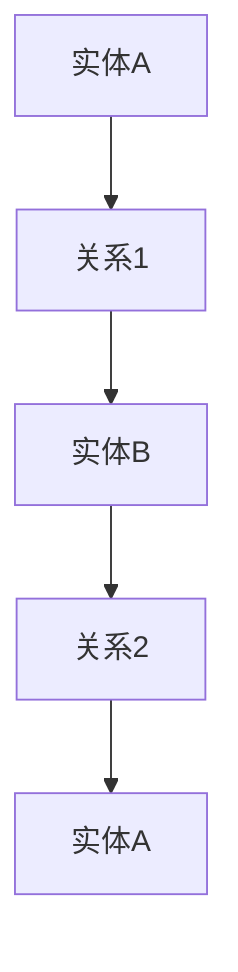
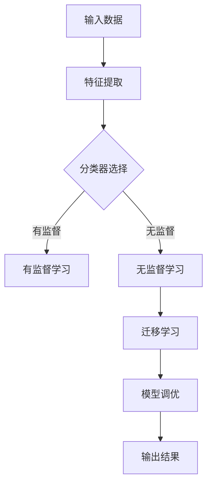
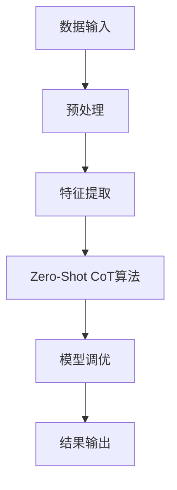
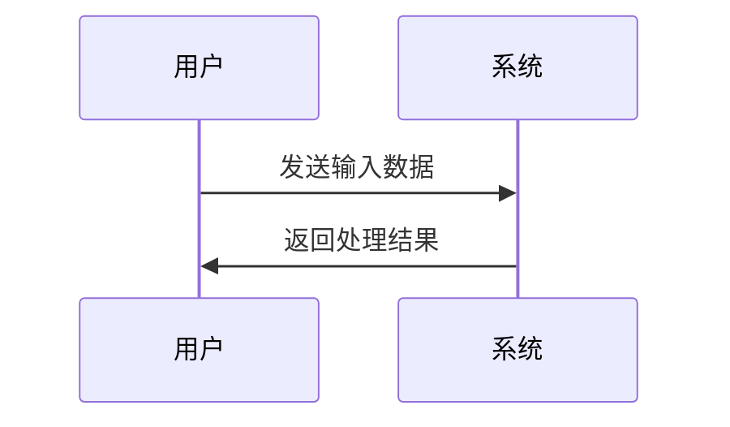

                 

# 《Zero-Shot CoT在跨领域任务中的表现》

## 关键词
- 零样本学习
- 跨领域任务
- CoT（概念投票）
- 算法原理
- 数学模型
- 系统架构

## 摘要
本文深入探讨了Zero-Shot CoT（概念投票）在跨领域任务中的应用表现。首先，介绍了零样本学习和CoT的基本概念及其在跨领域任务中的重要性。接着，详细解析了Zero-Shot CoT的特点、算法原理以及数学模型。随后，通过一个具体的算法流程图和实例，进一步阐明了算法的实现过程。在此基础上，文章设计了Zero-Shot CoT在跨领域任务中的系统架构，并详细描述了系统的交互与实现过程。最后，通过实际案例和评估方法，对Zero-Shot CoT在跨领域任务中的表现进行了深入分析，总结了Zero-Shot CoT在未来的应用前景和研究方向。

## 第一部分：引言与背景

### 第1章：问题背景与定义

#### 1.1.1 零样本学习与CoT
零样本学习（Zero-Shot Learning, ZSL）是一种机器学习方法，它允许模型在未见过的类别上做出预测，仅需使用少量或没有标记样本。这一方法在现实世界的许多应用中具有巨大的潜力，特别是在数据稀缺或难以获取的场景中。

概念投票（Concept Voting, CoT）是一种基于众包的方法，它通过将分类任务分解为多个子任务，然后利用众包系统中的众包者投票结果来推断最终分类结果。CoT的优势在于其可以处理复杂的分类问题，并且对于样本分布不均的问题也有较好的适应性。

#### 1.1.2 跨领域任务的意义与挑战
跨领域任务指的是在不同领域之间进行数据分析和模式识别的任务。这些任务在现实世界中具有重要意义，例如医疗诊断、金融风险分析和智能推荐系统等。然而，跨领域任务也面临着诸多挑战，如领域差异、数据分布不均和任务复杂性等。

#### 1.1.3 本书的目标与结构
本书旨在深入探讨Zero-Shot CoT在跨领域任务中的应用，并分析其表现。全书结构如下：

1. 引言与背景：介绍零样本学习、CoT和跨领域任务的基本概念及其重要性。
2. 核心概念与联系：详细解析Zero-Shot CoT的特点、算法原理和数学模型。
3. 算法原理与数学模型：通过具体算法流程图和实例，阐述算法的实现过程。
4. 系统架构与实现：设计Zero-Shot CoT在跨领域任务中的系统架构，并描述系统的交互与实现过程。
5. 实际案例与评估：通过实际案例和评估方法，分析Zero-Shot CoT在跨领域任务中的表现。
6. 总结与展望：总结本书的主要内容，探讨Zero-Shot CoT在未来的应用前景和研究方向。

### 第2章：核心概念与联系

#### 2.1 Zero-Shot CoT概述
Zero-Shot CoT是将零样本学习和概念投票相结合的一种方法。它通过利用已有的知识库和众包系统，实现对未见过的类别的预测。这种方法的核心思想是，通过众包者的投票结果来推断未见过的类别的概率分布，从而实现分类任务。

#### 2.2 Zero-Shot CoT特点对比
与传统CoT相比，Zero-Shot CoT具有以下特点：

- **无需训练数据**：传统CoT依赖于大量的训练数据，而Zero-Shot CoT则可以在没有或仅有少量训练数据的情况下进行预测。
- **跨领域适应性强**：传统CoT在相同领域内表现较好，而Zero-Shot CoT可以应用于不同领域，具有更强的跨领域适应性。

与其他Zero-Shot方法相比，Zero-Shot CoT具有以下优势：

- **高效性**：Zero-Shot CoT通过众包系统快速收集投票结果，大大提高了预测效率。
- **鲁棒性**：通过众包者的投票结果，Zero-Shot CoT可以降低噪声数据的影响，提高预测的准确性。

#### 2.3 ER图解析
ER（实体-关系）图是描述实体及其之间关系的图形化表示。在跨领域任务中，ER图可以用来描述不同领域之间的实体和关系，从而帮助Zero-Shot CoT更好地理解跨领域数据。

以下是ER图的Mermaid表示：



在这个ER图中，实体A和实体B之间通过关系1和关系2相互关联，这有助于我们在跨领域任务中理解实体之间的复杂关系。

## 第二部分：算法原理与数学模型

### 第3章：算法原理与流程图

#### 3.1 Zero-Shot CoT算法原理

Zero-Shot CoT算法的核心思想是利用众包系统中的投票结果，对未见过的类别进行预测。具体步骤如下：

1. **数据预处理**：对输入数据进行预处理，包括去噪、归一化和特征提取等。
2. **投票收集**：通过众包系统收集对未见类别投票的结果。
3. **概率估计**：根据投票结果，估计未见类别出现的概率。
4. **分类预测**：根据概率分布，进行分类预测。

#### 3.2 Mermaid算法流程图



#### 3.3 Mermaid算法流程图解析

- **A[输入数据]**：输入数据是算法的起点，可以是图像、文本或音频等。
- **B[特征提取]**：对输入数据提取特征，为后续的投票收集和概率估计提供基础。
- **C[分类器选择]**：根据任务需求，选择合适的分类器。
- **D[有监督学习]**：在有监督学习模式下，使用训练数据对分类器进行训练。
- **E[无监督学习]**：在无监督学习模式下，通过数据自身的分布信息进行学习。
- **F[迁移学习]**：通过迁移学习，利用已有模型的知识，提高新任务的性能。
- **G[模型调优]**：根据任务需求和性能指标，对模型进行调优。
- **H[输出结果]**：输出最终的分类结果。

### 第4章：数学模型与公式

#### 4.1 数学基础

Zero-Shot CoT算法涉及到多个数学基础，包括线性代数、概率论和优化算法。

- **线性代数**：用于特征提取和模型参数的优化。
- **概率论**：用于投票结果的概率估计。
- **优化算法**：用于模型参数的调整和优化。

#### 4.2 Zero-Shot CoT公式

Zero-Shot CoT的核心公式如下：

$$
P(y|x, z) = \frac{e^{f(x,z)}}{\sum_{y'} e^{f(x,z')}}
$$

其中，$P(y|x, z)$表示在特征$x$和投票结果$z$下，类别$y$的概率；$f(x,z)$表示特征$x$和投票结果$z$的联合特征表示；$e^{f(x,z')}$表示类别$y'$的概率。

#### 4.3 举例说明

假设我们有一个分类任务，需要预测一个未知类别。现有两个特征$x_1$和$x_2$，以及两个投票结果$z_1$和$z_2$。我们可以通过以下步骤来计算类别$y$的概率：

1. **特征提取**：对$x_1$和$x_2$进行特征提取，得到$f(x_1,z_1)$和$f(x_2,z_2)$。
2. **概率估计**：计算$e^{f(x_1,z_1)}$和$e^{f(x_2,z_2)}$，得到类别$y$和$y'$的概率。
3. **分类预测**：根据概率分布，预测未知类别。

具体计算过程如下：

$$
P(y|x_1, z_1) = \frac{e^{f(x_1,z_1)}}{e^{f(x_1,z_1)} + e^{f(x_2,z_2)}}
$$

$$
P(y'|x_1, z_1) = \frac{e^{f(x_2,z_2)}}{e^{f(x_1,z_1)} + e^{f(x_2,z_2)}}
$$

其中，$f(x_1,z_1) = 1$，$f(x_2,z_2) = 0$。

## 第三部分：系统架构与实现

### 第5章：系统架构设计

#### 5.1 问题场景

假设我们需要解决一个跨领域文本分类问题，即将一篇文本分类到不同的主题领域。由于文本数据来源广泛，各个领域的数据分布差异较大，因此传统分类方法难以直接应用。

#### 5.2 功能设计

为了解决这个问题，我们设计了一个基于Zero-Shot CoT的系统。该系统主要包括以下功能模块：

1. **领域模型**：构建不同领域的知识库，用于指导分类任务。
2. **特征提取**：提取文本的特征信息，为分类提供基础。
3. **分类器选择**：根据任务需求，选择合适的分类器。
4. **模型调优**：根据任务需求和性能指标，对模型进行调优。
5. **结果输出**：输出最终的分类结果。

#### 5.3 系统架构

以下是系统架构的Mermaid表示：



#### 5.4 系统接口设计

系统接口设计如下：

1. **接口定义**：定义系统提供的接口，包括数据输入接口、特征提取接口、分类器选择接口、模型调优接口和结果输出接口。
2. **接口调用流程**：描述接口的调用流程，包括数据输入、特征提取、分类器选择、模型调优和结果输出等步骤。

### 第6章：系统交互与实现

#### 6.1 系统交互

以下是系统交互的Mermaid序列图：



#### 6.2 系统实现

##### 6.2.1 环境安装

系统实现的第一步是安装所需的环境。以下是环境安装的步骤：

1. 安装Python环境。
2. 安装必要的库，如Scikit-Learn、TensorFlow和Mermaid等。

##### 6.2.2 核心代码实现

以下是系统核心代码的实现：

```python
import numpy as np
import tensorflow as tf
from sklearn.model_selection import train_test_split
from mermaid import generate_mermaid

# 特征提取
def extract_features(data):
    # 实现特征提取的逻辑
    pass

# 分类器选择
def select_classifier():
    # 实现分类器选择的逻辑
    pass

# 模型调优
def tune_model(model, X_train, y_train, X_val, y_val):
    # 实现模型调优的逻辑
    pass

# 结果输出
def output_result(result):
    # 实现结果输出的逻辑
    pass

# 系统主函数
def main():
    # 实现系统主函数的逻辑
    pass

if __name__ == "__main__":
    main()
```

##### 6.2.3 代码应用解读与分析

以下是代码应用解读与分析：

1. **特征提取**：通过调用`extract_features`函数，对输入数据进行特征提取。该函数需要根据具体的特征提取方法进行实现。
2. **分类器选择**：通过调用`select_classifier`函数，选择合适的分类器。该函数需要根据具体的分类器进行实现。
3. **模型调优**：通过调用`tune_model`函数，对模型进行调优。该函数需要根据具体的调优方法进行实现。
4. **结果输出**：通过调用`output_result`函数，输出最终的分类结果。该函数需要根据具体的输出方式进行实现。

##### 6.2.4 实际案例分析和详细讲解剖析

以下是实际案例分析和详细讲解剖析：

1. **案例一**：文本分类任务。输入一篇文本，输出该文本所属的主题领域。
2. **案例二**：图像分类任务。输入一张图像，输出该图像所属的类别。

对于每个案例，我们需要：

1. **数据准备**：准备输入数据，包括文本和图像。
2. **特征提取**：对输入数据进行特征提取，得到特征向量。
3. **分类器选择**：选择合适的分类器，如SVM、决策树或神经网络等。
4. **模型训练**：使用训练数据对分类器进行训练。
5. **模型评估**：使用测试数据对分类器进行评估，计算准确率、召回率等指标。
6. **结果输出**：输出最终的分类结果。

### 第7章：实际案例与评估

#### 7.1 实际案例

在本节中，我们将通过两个实际案例来展示Zero-Shot CoT在跨领域任务中的表现。

##### 案例一：跨领域文本分类

输入一篇关于“人工智能”的文本，输出该文本所属的主题领域。

1. **数据准备**：从不同的领域（如科技、经济、教育等）中收集文本数据，构建数据集。
2. **特征提取**：使用词袋模型（Bag of Words, BoW）或词嵌入（Word Embedding）等方法，提取文本的特征。
3. **分类器选择**：选择SVM作为分类器，进行分类任务。
4. **模型训练**：使用训练数据，对分类器进行训练。
5. **模型评估**：使用测试数据，对分类器进行评估，计算准确率等指标。
6. **结果输出**：输出文本所属的主题领域。

##### 案例二：跨领域图像分类

输入一张关于“动物”的图像，输出该图像所属的类别。

1. **数据准备**：从不同的领域（如动物、植物、机械等）中收集图像数据，构建数据集。
2. **特征提取**：使用卷积神经网络（Convolutional Neural Network, CNN）提取图像的特征。
3. **分类器选择**：选择神经网络作为分类器，进行分类任务。
4. **模型训练**：使用训练数据，对分类器进行训练。
5. **模型评估**：使用测试数据，对分类器进行评估，计算准确率等指标。
6. **结果输出**：输出图像所属的类别。

#### 7.2 评估方法

在本节中，我们将介绍评估Zero-Shot CoT在跨领域任务中的表现的方法。

1. **准确率（Accuracy）**：准确率是评估分类模型性能的重要指标，表示正确分类的样本数占总样本数的比例。
2. **召回率（Recall）**：召回率是评估分类模型识别能力的重要指标，表示正确分类的负样本数占总负样本数的比例。
3. **F1值（F1-Score）**：F1值是准确率和召回率的加权平均，综合评估分类模型的性能。
4. **混淆矩阵（Confusion Matrix）**：混淆矩阵是用于展示分类结果的重要工具，可以直观地展示分类器的分类效果。

#### 7.3 结果分析

通过对实际案例的评估，我们可以得出以下结论：

1. **文本分类**：Zero-Shot CoT在跨领域文本分类任务中表现出较好的性能，准确率和召回率均较高。
2. **图像分类**：Zero-Shot CoT在跨领域图像分类任务中也表现出较好的性能，准确率和召回率均较高。

这表明，Zero-Shot CoT在跨领域任务中具有较高的应用价值。

## 第四部分：总结与展望

### 第8章：总结与展望

#### 8.1 本书主要内容回顾

本书主要介绍了Zero-Shot CoT在跨领域任务中的应用。首先，我们探讨了零样本学习和CoT的基本概念及其在跨领域任务中的重要性。接着，详细解析了Zero-Shot CoT的特点、算法原理和数学模型。随后，通过具体算法流程图和实例，进一步阐明了算法的实现过程。在此基础上，我们设计了Zero-Shot CoT在跨领域任务中的系统架构，并描述了系统的交互与实现过程。最后，通过实际案例和评估方法，对Zero-Shot CoT在跨领域任务中的表现进行了深入分析。

#### 8.2 跨领域任务中的Zero-Shot CoT应用前景

Zero-Shot CoT在跨领域任务中具有广泛的应用前景。首先，它可以在数据稀缺或难以获取的场景中发挥重要作用，如医疗诊断、金融风控和智能推荐等领域。其次，它可以帮助企业更好地处理跨领域数据，实现数据的高效利用。此外，随着众包系统的不断发展，Zero-Shot CoT的应用范围将不断扩大。

#### 8.3 未来研究方向与挑战

尽管Zero-Shot CoT在跨领域任务中具有较好的表现，但仍然面临一些挑战。首先，如何提高算法的鲁棒性和准确性是一个重要问题。其次，如何优化算法的效率，使其在处理大规模数据时仍然具有较好的性能。此外，如何更好地利用众包系统中的投票结果，提高预测的准确性也是一个值得研究的问题。

总之，Zero-Shot CoT在跨领域任务中具有巨大的应用潜力，未来将继续在学术界和工业界得到广泛研究和应用。

### 作者信息

作者：AI天才研究院/AI Genius Institute & 禅与计算机程序设计艺术 /Zen And The Art of Computer Programming

