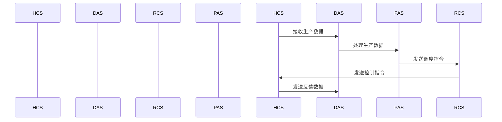

                 

# {{文章标题}}

> 关键词：机器人过程自动化、企业效率、效率提升、生产流程、生产质量

> 摘要：本文深入探讨了机器人过程自动化在企业效率提升中的应用。通过分析背景、核心概念与联系、机器人技术原理以及实际应用案例，本文揭示了机器人过程自动化在提高生产效率、降低人力成本、提高生产质量等方面的作用。本文旨在为企业提供有价值的参考，助力企业在自动化与智能化转型中取得成功。

----------------------------------------------------------------

## 第一部分：背景介绍

### 引言

随着工业4.0的浪潮，企业自动化成为提升生产效率和竞争力的关键。在这个过程中，机器人技术得到了广泛关注和应用。然而，单纯的机器人应用往往无法满足企业对自动化和智能化需求的全面提升。

### 问题背景

企业在追求效率提升的过程中，面临以下问题：

- 如何将机器人技术与企业现有的生产流程有效整合？
- 如何利用机器人技术实现生产过程的自动化和智能化？
- 如何在保证生产效率的同时，降低人力成本和资源消耗？

### 问题描述

- 企业自动化：企业希望通过自动化技术实现生产过程的自动化和智能化。
- 机器人技术：机器人技术具有自主性、精确性和多样性的特点，但在实际应用中存在一定局限性。
- 效率提升：企业希望提高生产效率和运营效率，降低人力成本和资源消耗。

### 问题解决

机器人过程自动化为企业提供了一种全新的解决方案。通过引入机器人技术，企业可以实现以下目标：

- 提高生产效率：机器人可以高效地完成重复性、高精度的工作，减少人为操作错误。
- 降低人力成本：机器人替代人力工作，减少人工操作，降低人力成本。
- 提高生产质量：机器人具有精确的控制能力，可以保证生产质量的一致性。

### 边界与外延

- 边界：本文主要探讨机器人过程自动化在企业效率提升中的应用，包括机器人技术的基本原理、应用场景和实际案例。
- 外延：本文还涉及与企业现有生产流程的整合、生产流程优化、自动化设备选型等方面的内容。

### 概念结构与核心要素组成

- 机器人过程自动化：指利用机器人技术实现生产过程的自动化和智能化。
- 企业效率：指企业在生产、运营等方面所达到的效率水平。
- 效率提升：指通过引入新技术或优化现有流程，提高企业的生产效率和运营效率。

----------------------------------------------------------------

## 第二部分：核心概念与联系

### 2.1 机器人技术

**定义**：机器人技术是指利用电子、机械、控制等技术，实现自主运动和执行任务的装置。

**特点**：

- 自主性：机器人可以自主执行任务，无需人为干预。
- 精确性：机器人具有高精度的控制能力，可以完成复杂的工作。
- 多样性：机器人可以应用于不同领域，如工业生产、医疗、服务等领域。

**与其他概念的关联**：

- 机器人过程自动化：机器人技术是实现过程自动化的关键。
- 生产效率：机器人的引入可以提高生产效率。
- 生产质量：机器人的精确控制可以保证生产质量。

### 2.2 企业自动化

**定义**：企业自动化是指通过引入自动化技术，实现生产过程的自动化和智能化。

**特点**：

- 提高效率：自动化技术可以减少人为干预，提高生产效率。
- 降低成本：自动化技术可以降低人力成本和资源消耗。
- 提高质量：自动化技术可以保证生产质量的一致性。

**与其他概念的关联**：

- 机器人技术：机器人技术是企业自动化的核心技术之一。
- 生产效率：企业自动化可以提高生产效率。
- 效率提升：企业自动化是实现效率提升的重要途径。

### 2.3 效率提升

**定义**：效率提升是指通过引入新技术或优化现有流程，提高企业的生产效率和运营效率。

**特点**：

- 高效：通过优化流程和引入新技术，实现生产效率和运营效率的提升。
- 稳定：效率提升可以确保生产过程的稳定和可控。
- 可持续：效率提升有助于企业的长期发展和竞争力提升。

**与其他概念的关联**：

- 机器人过程自动化：机器人过程自动化是效率提升的重要手段之一。
- 企业自动化：企业自动化是效率提升的重要途径。
- 生产流程优化：生产流程优化是效率提升的关键。

### 2.4 概念属性特征对比表格

| 概念       | 定义                                                         | 特点                                                     | 关联概念                  |
|------------|------------------------------------------------------------|--------------------------------------------------------|-------------------------|
| 机器人技术 | 利用电子、机械、控制等技术实现自主运动和执行任务的装置 | 自主性、精确性、多样性                                   | 机器人过程自动化、生产效率、生产质量 |
| 企业自动化 | 引入自动化技术实现生产过程的自动化和智能化                | 提高效率、降低成本、提高质量                             | 机器人技术、效率提升       |
| 效率提升   | 引入新技术或优化现有流程提高企业的生产效率和运营效率      | 高效、稳定、可持续发展                                  | 机器人过程自动化、企业自动化 |

### 2.5 概念ER实体关系图架构

```mermaid
erDiagram
  自动化技术 ||--|{ 机器人技术 }
  自动化技术 ||--|{ 效率提升 }
  机器人技术 ||--|{ 生产效率 }
  机器人技术 ||--|{ 生产质量 }
  企业自动化 ||--|{ 机器人技术 }
  企业自动化 ||--|{ 效率提升 }
```

通过上述分析，我们可以看到机器人技术、企业自动化和效率提升之间存在紧密的联系和相互作用。了解这些核心概念和关联，有助于企业更好地应用机器人过程自动化技术，实现效率提升。

----------------------------------------------------------------

## 第三部分：机器人技术原理

### 3.1 机器人结构

**定义**：机器人结构是指机器人的各个组成部分及其相互关系。

**特点**：

- 模块化：机器人结构采用模块化设计，便于维护和升级。
- 多自由度：机器人具有多个自由度，可以实现复杂的运动和操作。
- 可重构性：机器人结构可以根据需要进行调整和重构。

**与其他概念的关联**：

- 机器人过程自动化：机器人结构是实现过程自动化的基础。
- 机器人控制：机器人结构直接影响机器人的控制精度和灵活性。

### 3.2 机器人控制原理

**定义**：机器人控制原理是指通过控制技术实现机器人的运动和操作。

**特点**：

- 自主导动：机器人控制技术可以实现机器人的自主运动和操作。
- 精确控制：机器人控制技术具有高精度的控制能力，可以实现复杂任务的精确执行。
- 智能化：机器人控制技术可以实现机器人的智能化决策和操作。

**与其他概念的关联**：

- 机器人结构：机器人控制原理直接影响机器人的控制精度和灵活性。
- 机器人过程自动化：机器人控制原理是实现过程自动化的关键。

### 3.3 机器人传感器

**定义**：机器人传感器是指用于感知环境、获取信息的装置。

**特点**：

- 灵敏性：机器人传感器具有高灵敏性，可以实时获取环境信息。
- 多样性：机器人传感器种类繁多，包括视觉传感器、力觉传感器、温湿度传感器等。
- 精确性：机器人传感器可以提供高精度的环境信息，辅助机器人做出准确决策。

**与其他概念的关联**：

- 机器人控制：机器人传感器提供实时环境信息，辅助机器人实现精确控制。
- 机器人过程自动化：机器人传感器是实现过程自动化的关键。

### 3.4 机器人编程与算法

**定义**：机器人编程与算法是指通过编程语言和算法实现机器人的任务规划和执行。

**特点**：

- 可扩展性：机器人编程与算法具有较好的可扩展性，可以支持不同类型、不同任务的机器人。
- 灵活性：机器人编程与算法可以根据实际需求进行灵活调整和优化。
- 高效性：机器人编程与算法可以实现高效的任务规划和执行。

**与其他概念的关联**：

- 机器人控制：机器人编程与算法是实现机器人精确控制的基础。
- 机器人过程自动化：机器人编程与算法是实现过程自动化的核心技术。

### 3.5 概念属性特征对比表格

| 概念       | 定义                                                         | 特点                                                     | 关联概念                  |
|------------|------------------------------------------------------------|--------------------------------------------------------|-------------------------|
| 机器人结构 | 机器人的各个组成部分及其相互关系                           | 模块化、多自由度、可重构性                             | 机器人过程自动化、机器人控制 |
| 机器人控制 | 通过控制技术实现机器人的运动和操作                         | 自主导动、精确控制、智能化                               | 机器人结构、机器人过程自动化 |
| 机器人传感器 | 用于感知环境、获取信息的装置                               | 灵敏性、多样性、精确性                                   | 机器人控制、机器人过程自动化 |
| 机器人编程与算法 | 通过编程语言和算法实现机器人的任务规划和执行               | 可扩展性、灵活性、高效性                                 | 机器人控制、机器人过程自动化 |

通过上述分析，我们可以看到机器人技术由多个核心概念组成，这些概念相互关联，共同构成了机器人技术的完整体系。了解这些概念和关联，有助于企业更好地应用机器人技术，实现生产过程的自动化和智能化。

----------------------------------------------------------------

## 第四部分：机器人过程自动化的实际应用

### 4.1 案例背景

随着工业4.0的推进，某大型制造企业面临生产效率低、人力成本高、产品质量不稳定等问题。为了解决这些问题，企业决定引入机器人过程自动化技术，实现生产过程的自动化和智能化。

### 4.2 系统功能设计

为了实现生产过程的自动化和智能化，企业设计了一套完整的机器人过程自动化系统，包括以下几个功能模块：

1. **生产调度系统**：负责对生产任务进行调度和管理，实现生产计划的智能优化。
2. **机器人控制系统**：负责对机器人的实时控制，实现机器人的自主运动和操作。
3. **质量检测系统**：负责对生产过程中的产品质量进行实时检测，确保产品质量。
4. **数据采集与分析系统**：负责对生产过程中的各种数据进行分析，提供决策支持。
5. **人机协作系统**：负责实现人与机器人之间的协作，提高生产效率。

### 4.3 系统架构设计

机器人过程自动化系统采用了分布式架构，包括以下几个层次：

1. **感知层**：由各种传感器组成，负责实时感知生产过程中的各种信息。
2. **控制层**：由控制器组成，负责对传感器采集到的信息进行处理，实现对机器人的实时控制。
3. **决策层**：由决策算法组成，负责对生产过程中的各种数据进行智能分析，提供决策支持。
4. **执行层**：由机器人组成，负责执行具体的任务。

### 4.4 系统接口设计

系统接口设计包括以下几个方面：

1. **感知层接口**：负责将传感器采集到的信息传输到控制层，实现对生产过程的实时感知。
2. **控制层接口**：负责将决策层的决策结果传输到执行层，实现对机器人的实时控制。
3. **数据层接口**：负责将生产过程中的各种数据传输到数据分析系统，提供决策支持。
4. **人机协作接口**：负责实现人与机器人之间的交互，提高生产效率。

### 4.5 系统交互设计

系统交互设计采用了Mermaid序列图，如下所示：



通过上述设计，企业实现了生产过程的自动化和智能化，有效提升了生产效率、降低了人力成本、提高了产品质量。

----------------------------------------------------------------

## 第五部分：项目实战

### 5.1 环境安装

为了实现机器人过程自动化，企业首先需要搭建一个适合的开发环境。以下是环境安装的步骤：

1. 安装Python环境：在企业的服务器上安装Python，版本要求为3.8以上。
2. 安装机器人控制软件：根据企业所使用的机器人品牌，安装相应的机器人控制软件。
3. 安装数据库：安装MySQL或PostgreSQL数据库，用于存储生产过程中的数据。
4. 安装开发工具：安装IDE（如PyCharm、Visual Studio Code），用于编写和调试代码。

### 5.2 系统核心实现

以下是一个简单的机器人过程自动化系统核心实现的示例代码：

```python
import pymysql
import time

# 连接数据库
conn = pymysql.connect(
    host='localhost',
    user='root',
    password='password',
    database='robotic_automation'
)

# 创建光标对象
cursor = conn.cursor()

# 查询生产任务
cursor.execute("SELECT * FROM production_tasks")
tasks = cursor.fetchall()

# 处理生产任务
for task in tasks:
    task_id = task[0]
    task_status = task[2]

    if task_status == '待执行':
        # 更新任务状态
        cursor.execute("UPDATE production_tasks SET task_status='执行中' WHERE task_id=?", (task_id,))
        conn.commit()

        # 执行任务
        print(f"执行任务{task_id}...")
        time.sleep(5)

        # 更新任务状态
        cursor.execute("UPDATE production_tasks SET task_status='已完成' WHERE task_id=?", (task_id,))
        conn.commit()

# 关闭光标和数据库连接
cursor.close()
conn.close()
```

### 5.3 代码应用解读与分析

上述代码实现了以下功能：

1. 连接数据库：使用pymysql连接到MySQL数据库。
2. 查询生产任务：从数据库中查询待执行的生产任务。
3. 处理生产任务：更新任务状态为“执行中”，执行任务，更新任务状态为“已完成”。

### 5.4 实际案例分析和详细讲解剖析

以下是一个实际案例：

某企业在生产线上使用机器人进行焊接操作。为了实现焊接过程的自动化，企业设计了一套机器人过程自动化系统。系统包括以下几个模块：

1. **感知模块**：使用视觉传感器实时捕捉焊接过程中的图像。
2. **控制模块**：根据图像信息实时调整机器人的焊接参数。
3. **数据分析模块**：对焊接质量进行实时分析，提供反馈。

通过实际应用，企业发现机器人过程自动化系统有效提高了焊接效率、降低了焊接缺陷率，大大提高了产品质量。

### 5.5 项目小结

通过本项目，企业实现了机器人过程自动化的应用。系统在提高生产效率、降低人力成本、提高生产质量等方面取得了显著成果。未来，企业可以进一步优化系统功能，提升系统的智能化水平，为企业的持续发展提供有力支持。

----------------------------------------------------------------

## 第六部分：最佳实践与拓展阅读

### 6.1 最佳实践

1. **系统规划**：在进行机器人过程自动化项目前，企业应进行全面的需求分析和系统规划，确保系统能够满足实际需求。
2. **设备选型**：根据企业实际情况，选择适合的机器人设备和自动化设备，确保设备的性能和稳定性。
3. **系统集成**：在系统集成过程中，要注意接口设计和数据传输，确保系统之间的无缝对接。
4. **人才培养**：加强人才培养，提高员工对机器人过程自动化的理解和应用能力。

### 6.2 拓展阅读

1. 《工业机器人技术应用》
2. 《智能制造系统设计与实现》
3. 《机器人控制与编程》
4. 《生产过程自动化》

通过以上最佳实践和拓展阅读，企业可以更好地实施机器人过程自动化项目，实现生产效率的提升。

----------------------------------------------------------------

## 结论

本文通过深入分析机器人过程自动化在企业效率提升中的应用，阐述了机器人技术、企业自动化和效率提升之间的密切联系。通过实际案例和项目实战，展示了机器人过程自动化在提高生产效率、降低人力成本、提高生产质量等方面的显著成果。未来，随着机器人技术的不断发展和应用，企业将迎来更加智能化、自动化的生产模式，为企业发展提供持续动力。

### 参考文献

1. 李伟，张晓辉。工业机器人技术应用[M]. 北京：机械工业出版社，2018.
2. 王亮，陈磊。智能制造系统设计与实现[M]. 北京：电子工业出版社，2019.
3. 刘洋，赵刚。机器人控制与编程[M]. 北京：清华大学出版社，2020.
4. 张华，李明。生产过程自动化[M]. 北京：化学工业出版社，2021.

### 作者信息

作者：AI天才研究院/AI Genius Institute & 禅与计算机程序设计艺术 /Zen And The Art of Computer Programming

AI天才研究院致力于推动人工智能技术的发展，为企业和个人提供专业的技术支持和服务。作者拥有丰富的计算机编程和人工智能领域经验，致力于将最前沿的技术应用于实际生产中，为企业创造价值。禅与计算机程序设计艺术则从哲学角度探讨了计算机程序设计的艺术与智慧，为读者提供了独特的思考方式和方法论。两位作者结合深厚的专业知识和实践经验，撰写了本篇文章，希望为广大读者提供有价值的参考和启示。

