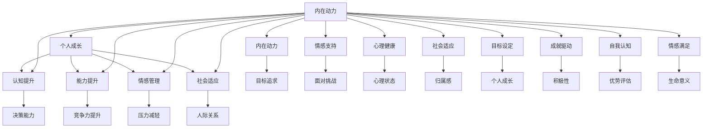
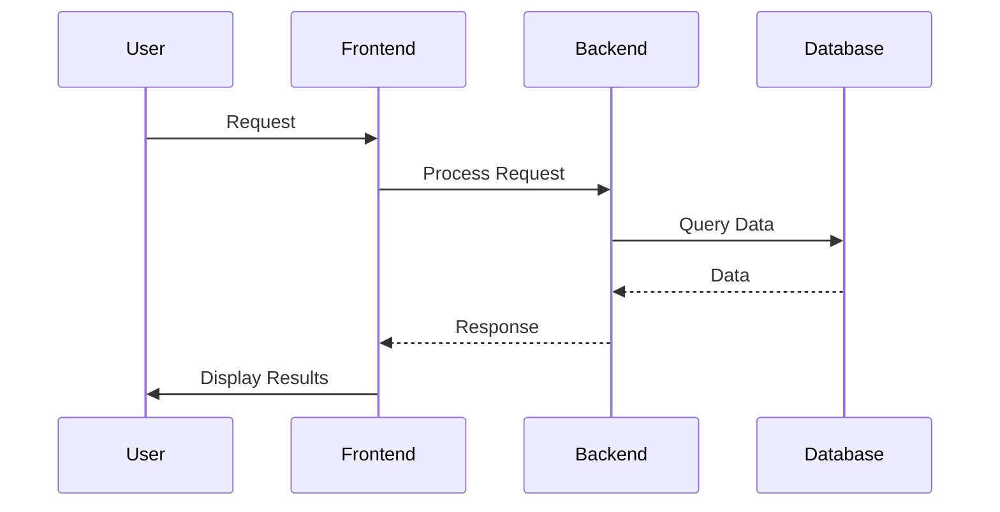

                 

### 引言

在现代社会的快节奏生活中，个人成长、意义感和自我实现已经成为越来越多人的关注焦点。随着科技的飞速发展和社会的急剧变化，传统的成功标准逐渐被重新审视，个人成长与意义感的重要性愈发凸显。因此，如何通过自我实现找到人生的意义，成为了一个值得深入探讨的话题。

本文将以《个人成长与意义感：自我实现的现代途径》为标题，从多个角度展开讨论。我们首先会介绍个人成长、意义感和自我实现的基本概念，并探讨它们在现代生活中的重要性。接下来，我们将深入分析个人成长与意义感之间的联系，以及它们如何相互影响和促进自我实现。在此基础上，我们将详细阐述自我实现的理论与实践路径，并结合具体案例进行探讨。

文章的结构如下：

- **第一部分：背景与概念介绍**：介绍个人成长、意义感和自我实现的概念及其在现代生活中的重要性。
- **第二部分：核心概念与联系**：分析个人成长、意义感和自我实现的核心概念及其关系。
- **第三部分：方法与技巧**：探讨个人成长与意义感的方法、算法原理、数学模型及系统架构设计。
- **第四部分：项目实战与案例分析**：通过实际项目展示方法与技巧的应用。
- **第五部分：最佳实践与总结**：总结文章内容，提供实践建议和拓展资源。

让我们一步一步地深入思考，探讨个人成长与意义感的现代途径，以及如何通过自我实现找到人生的意义。

### 关键词

在讨论个人成长与意义感这一主题时，以下是本文的核心关键词：

- **个人成长**：指个体在知识、技能、情感和社会能力等方面的持续提升过程。
- **意义感**：指个体对自身存在和行为的内在价值和目的的认识。
- **自我实现**：指个体追求自身潜能的最大化和自我价值实现的过程。
- **现代生活**：指当前社会背景下，个体所面临的生活环境和挑战。
- **算法原理**：指用于分析和优化个人成长与意义感的技术方法。
- **数学模型**：指用于描述和预测个人成长与意义感变化的数学工具。
- **系统架构**：指个人成长与意义感项目的系统设计和实现方案。

这些关键词不仅概括了文章的主题，也为后续章节的讨论奠定了基础。

### 摘要

本文旨在探讨个人成长、意义感和自我实现的概念及其在现代生活中的重要性。通过对这些核心概念的深入分析，我们将揭示它们之间的内在联系，并探讨如何通过自我实现找到人生的意义。本文分为五个部分，首先介绍个人成长、意义感和自我实现的基本概念，然后分析其核心概念与联系，接着详细讲解个人成长与意义感的方法、算法原理和数学模型，并设计相应的系统架构。最后，通过实际项目展示方法与技巧的应用，并提供最佳实践建议和拓展资源。本文旨在为读者提供一套系统、实用的个人成长与意义感实现途径。

## 第一部分：背景与概念介绍

### 1.1 个人成长的重要性

个人成长是一个持续的过程，它涉及到个体在知识、技能、情感和社会能力等多个方面的提升。随着社会的发展和个人认知水平的不断提高，个人成长已经成为了现代社会中一个不可或缺的重要部分。

#### 个人成长的定义与意义

个人成长通常指的是个体在认知、技能、情感和社会能力等方面的持续提升。这个过程不仅包括学习新知识和技能，还涉及到自我认知的提升、情感管理能力的增强以及社会适应能力的提高。个人成长不仅仅是为了满足社会的需求，更是为了实现个人的潜能和自我价值。

在现代社会中，个人成长具有以下几个重要意义：

1. **适应社会变化**：随着科技的快速发展和全球化的推进，社会环境发生了巨大变化。个人成长可以帮助个体适应这些变化，保持竞争力。
2. **提升生活质量**：通过不断学习和提升自己的能力，个人可以更好地应对生活中的挑战，提高生活质量。
3. **实现自我价值**：个人成长让个体能够更好地了解自己，发现自己的优势和潜力，从而实现自我价值。
4. **促进心理健康**：个人成长过程中的自我认知和情感管理能力的提升有助于减轻心理压力，提高心理健康水平。

#### 个人成长与现代社会的联系

在现代社会中，个人成长的重要性愈发凸显。一方面，社会竞争日益激烈，个人需要不断提升自己的能力和素质来应对各种挑战。另一方面，科技的发展和社会的进步为个人成长提供了更多的机会和资源。

具体来说，个人成长与现代社会的联系体现在以下几个方面：

1. **知识更新加速**：随着科技的发展，知识的更新速度大大加快。个人需要不断学习新知识，才能跟上时代的步伐。
2. **技能要求提高**：现代社会对个体的技能要求越来越高，不仅需要专业知识和技能，还需要跨领域的综合能力。
3. **心理压力增加**：现代社会的生活节奏快，竞争压力大，个人需要具备良好的心理素质来应对这些挑战。
4. **社会互动增多**：随着社交媒体的普及和互联网的广泛应用，个人之间的互动和交流变得更加频繁，个人需要具备更好的沟通能力和人际关系管理能力。

综上所述，个人成长在现代社会中具有不可忽视的重要性。通过持续的个人成长，个体可以更好地适应社会变化，提升生活质量，实现自我价值，并保持心理健康。

### 1.2 个人成长与现代社会的联系

现代社会的发展为个人成长提供了广阔的舞台，同时也对个人成长提出了更高的要求。首先，知识更新速度的加快使得个人需要不断地学习新知识，以适应快速变化的社会环境。例如，人工智能、大数据等新兴领域的快速崛起，要求个体具备相应的技能和知识储备。其次，技能要求的提高不仅仅局限于专业领域，还包括跨领域的综合能力。现代社会的复杂性要求个体具备解决问题的能力、创新思维以及团队协作能力等多方面素质。此外，随着社交媒体和互联网的普及，个人互动和交流的频率大幅增加，沟通能力和人际关系管理能力变得尤为重要。

#### 社会环境的挑战与机遇

社会环境的挑战主要体现在以下几个方面：

1. **竞争加剧**：现代社会竞争激烈，个体需要不断提升自己的能力和素质，才能在激烈的竞争中脱颖而出。
2. **不确定性增加**：全球化进程加速，经济环境变化频繁，个体需要具备更强的适应能力和灵活应对不确定性的能力。
3. **心理健康问题**：现代社会生活节奏快，工作压力大，个体容易出现心理健康问题，如焦虑、抑郁等。

然而，这些挑战同时也带来了机遇：

1. **学习资源的丰富**：互联网的发展使得学习资源变得丰富多样，个体可以通过在线课程、电子书籍、专业论坛等途径获取最新的知识和技能。
2. **职业发展机会**：随着科技的进步和产业升级，新兴行业和职业不断涌现，为个人提供了更多的职业发展机会。
3. **自我实现的可能性**：现代社会更加注重个体的自我实现，个体可以通过不断的个人成长，实现自己的梦想和目标。

### 1.3 意义感的概念与作用

意义感是指个体对自身存在和行为的内在价值和目的的认识。它不仅仅是对个人行动的合理性和正确性的判断，更是一种深刻的内在体验，涉及个体的存在意义、生命价值和生活目标。

#### 意义感的定义

意义感通常由以下几个要素构成：

1. **目的性**：个体对自己的行为和存在有一个明确的目标和方向，这种目标可以是短期的，也可以是长期的。
2. **价值感**：个体感受到自己的行为是有价值的，不仅对自己有意义，也可能对他人或社会产生积极的影响。
3. **意义体验**：个体在行动过程中体验到一种深刻的内在满足感，这种感觉超越了物质和生理需求的满足。

意义感可以被视为一种心理状态，它不仅影响个体的情绪和行为，还对个体的认知和动机产生重要影响。

#### 意义感对个人成长的影响

意义感在个人成长中扮演着关键角色，具体体现在以下几个方面：

1. **动机激励**：拥有强烈意义感的个体往往具有更高的动机，他们更有可能设定目标、付出努力并坚持不懈地追求自己的梦想。
2. **情感支持**：意义感为个体提供了情感上的支持，使他们能够面对挑战和困难，保持积极的态度和乐观的心态。
3. **心理健康**：意义感与心理健康密切相关。有研究发现，拥有意义感的个体通常具有更好的心理状态，更少出现抑郁和焦虑等心理问题。
4. **社会适应**：意义感有助于个体更好地融入社会，建立良好的人际关系，增强社会归属感和认同感。

#### 意义感的重要性

意义感在个人成长中的重要性不可低估。它不仅为个体提供了内在的动力和支持，还帮助他们找到生活的方向和目标。在现代社会中，随着物质条件的丰富和社会压力的增加，个体更需要通过意义感来获得内心的满足和幸福感。

总之，意义感是个人成长的重要驱动力，它不仅影响个体的行为和情绪，还影响着他们的心理健康和社会适应能力。通过理解和培养意义感，个体可以更好地实现自我成长和自我实现。

### 1.4 意义感对个人成长的影响

意义感在个人成长中起着至关重要的作用，它不仅影响个体的行为和动机，还对其心理状态和社会适应能力产生深远影响。以下是意义感如何具体影响个人成长的几个方面：

1. **动机激励**：拥有强烈意义感的个体往往具有更高的内在动机，这使得他们更有可能设定目标、付出努力并坚持不懈地追求自己的梦想。例如，一个对编程充满热情的人，会因为感受到编程不仅是一种技能，更是一种表达和解决问题的艺术，从而在编程学习过程中始终保持积极和专注的态度。

2. **情感支持**：意义感为个体提供了情感上的支持，使他们能够面对挑战和困难，保持积极的心态和乐观的情绪。一个在职业中找到自己使命的人，即使在面临职业困境时，也会因为对自己工作的价值感而保持坚韧和乐观。

3. **心理健康**：意义感与心理健康密切相关。研究发现，拥有意义感的个体通常心理状态更为健康，抑郁和焦虑等心理问题的发生概率更低。例如，一个在社区志愿服务中找到意义的人，会因为感受到自己对社会的贡献而拥有更高的幸福感和满足感。

4. **社会适应**：意义感有助于个体更好地融入社会，建立良好的人际关系，增强社会归属感和认同感。一个在个人生活中找到明确目标的人，更可能积极参与社会活动，与他人建立更深层次的联系，从而提高社会适应能力。

### 1.5 自我实现的理论与实践

自我实现是指个体追求自身潜能的最大化和自我价值实现的过程。这个概念最早由心理学家马斯洛提出，他认为每个人都有自我实现的潜力，这种潜力可以通过自我认知、情感体验和行动来实现。

#### 自我实现的理论基础

马斯洛的“需求层次理论”是理解自我实现的重要理论基础。根据马斯洛的理论，人的需求可以分为五个层次：生理需求、安全需求、社交需求、尊重需求和自我实现需求。自我实现需求是最高层次的需求，指的是个体追求自我潜能的最大化，实现个人价值和自我超越。

#### 自我实现的实践路径

实现自我实现的具体路径包括以下几个方面：

1. **自我认知**：了解自己的优势和劣势，明确自己的兴趣和激情所在。自我认知是自我实现的基础，只有清楚地认识自己，个体才能找到适合自己的发展方向。

2. **持续学习**：通过不断学习新知识和技能，提升自己的能力和竞争力。持续学习不仅能够帮助个体适应社会变化，还能不断拓展自己的潜能。

3. **情感体验**：通过积极的情感体验，如成就感、满足感和幸福感，增强自我实现的动力。情感体验是自我实现过程中的重要支持，它能够帮助个体保持积极的心态和坚定的信念。

4. **行动实践**：通过实际行动来实现自我价值，如参与有意义的社会活动、创造有价值的作品等。行动实践是自我实现的最终体现，它使个体能够将自我认知和情感体验转化为具体的行为成果。

#### 自我实现的路径与个人成长、意义感的联系

自我实现的路径与个人成长、意义感密切相关。个人成长是自我实现的基础，通过不断的学习和实践，个体能够提升自己的能力和认知水平，为自我实现创造条件。意义感则是自我实现的动力和目标，它为个体提供内在的动力和方向，使个体能够坚定地追求自我实现的目标。

例如，一个对编程充满热情的人，通过自我认知找到了自己在编程领域的天赋和兴趣，通过持续学习和实践不断提升自己的编程技能，最终通过开发有影响力的软件项目实现了自我价值。在这个过程中，个人成长和意义感共同推动了个体自我实现的过程。

总之，自我实现是一个复杂但有意义的过程，它需要个体在自我认知、学习实践和情感体验等多方面不断努力。通过理解自我实现的理论和实践路径，个体可以更好地追求自我潜能的最大化，实现个人的价值和意义。

### 个人成长、意义感与自我实现的关系

个人成长、意义感和自我实现之间存在着紧密的内在联系，它们相互依存、相互促进，共同构成了个体追求自我价值的完整路径。以下是这三个概念之间的具体联系：

#### 个人成长促进自我实现

个人成长是自我实现的基础。个体通过不断学习和提升，不仅能够掌握新知识和技能，还能增强自己的能力和竞争力。这种能力的提升为自我实现提供了必要的条件。例如，一个对计算机科学有浓厚兴趣的人，通过不断学习编程语言和算法，积累了丰富的技术经验，最终开发出了创新的软件，实现了自我价值和成就感。

#### 意义感驱动个人成长

意义感是个人成长的重要动力。一个对生活充满意义感的个体，会更有动力去追求个人成长。他们不仅仅是为了满足基本需求或社会期望而行动，而是因为深刻感受到自己的行为对他人或社会有积极的影响。这种内在动力使个体能够克服困难，持续地追求自我提升。例如，一个在公益组织中服务的志愿者，因为感受到自己对社区贡献的意义，会更有热情和动力去参与更多的志愿服务活动。

#### 自我实现提升意义感

自我实现的过程本身能够增强个体的意义感。当个体通过努力实现了自己的目标，感受到自己的价值得到了认可和实现时，会产生强烈的内在满足感和成就感。这种成就感和满足感进一步强化了个体的意义感，使其更加坚信自己的行为是有价值的。例如，一个艺术家通过不断的创作和努力，最终获得了艺术界的认可，这不仅仅是对他个人努力的肯定，更是对他艺术价值的认可，从而大大提升了他的意义感。

#### 相互影响与作用

个人成长、意义感和自我实现之间是相互影响、相互促进的关系。个人成长促进了自我实现，而自我实现又增强了意义感，意义感又进一步驱动个人成长。这种良性循环使个体能够持续地追求自我价值和成长。例如，一个对科学充满热情的科研人员，通过不断的研究和发现，不仅实现了自己的科研目标，还为社会做出了重要贡献，这种成就感不仅提升了他的自我实现感，也增强了他的意义感，使他更加坚定地追求科学探索。

总之，个人成长、意义感和自我实现之间存在着密切的内在联系，它们相互依存、相互促进，共同构成了个体追求自我价值的完整路径。通过深入理解和运用这三个概念，个体可以更好地实现自我成长和自我价值。

### 核心概念解析

在探讨个人成长、意义感和自我实现的过程中，我们需要深入理解这些核心概念，并了解它们之间的内在联系。以下是对这些核心概念的详细解析，以及它们对个人成长的影响。

#### 个人成长

个人成长指的是个体在认知、技能、情感和社会能力等方面的持续提升。它是一个动态的过程，涉及到多个方面的进步。个人成长不仅是外在技能的提升，还包括内在素质的提高，如自我认知、情绪管理和人际关系能力。以下是个人成长对个体影响的几个方面：

1. **能力提升**：通过个人成长，个体能够掌握新的技能和知识，提升自己的竞争力。例如，通过学习编程语言和算法，一名开发者可以开发出更高效、更创新的软件。
2. **认知扩展**：个人成长使个体能够扩展自己的认知边界，理解更复杂的观念和问题。这有助于个体在面对复杂情境时，做出更加合理和有效的决策。
3. **情感管理**：通过成长过程中的自我反思和情感教育，个体能够更好地管理自己的情绪，减少心理压力，提高心理健康水平。
4. **社会适应**：个人成长提升了个体的社会适应能力，使他们能够更好地融入社会，建立良好的人际关系。

#### 意义感

意义感是指个体对自身存在和行为的内在价值和目的的认识。它不仅仅是对个人行动的合理性和正确性的判断，更是一种深刻的内在体验，涉及个体的存在意义、生命价值和生活目标。意义感对个人成长的影响主要体现在以下几个方面：

1. **内在动力**：拥有强烈意义感的个体会感到自己的行为是有价值的，这为他们提供了内在的动力和动机，使他们更加坚定地追求自己的目标。
2. **情感支持**：意义感为个体提供了情感上的支持，使他们能够面对挑战和困难，保持积极的心态和乐观的情绪。
3. **心理健康**：意义感与心理健康密切相关。拥有意义感的个体通常心理状态更为健康，抑郁和焦虑等心理问题的发生概率更低。
4. **社会适应**：意义感有助于个体更好地融入社会，建立良好的人际关系，增强社会归属感和认同感。

#### 自我实现

自我实现是指个体追求自身潜能的最大化和自我价值实现的过程。这个概念最早由心理学家马斯洛提出，他认为每个人都有自我实现的潜力，这种潜力可以通过自我认知、情感体验和行动来实现。自我实现对个人成长的影响主要表现在以下几个方面：

1. **目标设定**：自我实现过程使个体能够明确自己的目标和追求，从而有针对性地进行个人成长和技能提升。
2. **成就驱动**：通过自我实现，个体能够感受到自己的努力得到了回报，这种成就感进一步激发他们的动力和积极性。
3. **自我认知**：自我实现过程中，个体不断反思和评估自己的行为和结果，从而提高自我认知水平，更好地理解自己的优势和劣势。
4. **情感满足**：自我实现过程为个体提供了情感上的满足感，使他们感到自己的生命是有意义和价值的。

#### 概念关系图

为了更直观地理解这些核心概念之间的关系，我们可以使用 Mermaid 流程图来表示：



通过这张关系图，我们可以清晰地看到个人成长、意义感和自我实现之间的相互联系和影响。这些核心概念不仅独立存在，还通过内在动力、情感支持和心理健康等途径相互促进，共同推动个体的自我实现和成长。

### 概念属性特征对比表格

为了更直观地理解个人成长、意义感和自我实现这三个核心概念之间的区别和联系，我们可以通过一个对比表格来展示它们的属性特征。

| 概念       | 定义                                                         | 主要属性特征                                                                                      | 与其他概念的关联                             |
|------------|--------------------------------------------------------------|--------------------------------------------------------------------------------------------------|--------------------------------------------|
| 个人成长   | 指个体在知识、技能、情感和社会能力等方面的持续提升过程。                             | - 认知提升<br>- 能力提升<br>- 情感管理<br>- 社会适应                                             | 是自我实现的基础，影响自我实现的实现程度  |
| 意义感     | 个体对自身存在和行为的内在价值和目的的认识。                                       | - 内在动力<br>- 情感支持<br>- 心理健康<br>- 社会适应                                           | 驱动个人成长，促进自我实现                  |
| 自我实现   | 个体追求自身潜能的最大化和自我价值实现的过程。                                     | - 目标设定<br>- 成就驱动<br>- 自我认知<br>- 情感满足                                           | 是个人成长和意义感的综合体现和目标         |

通过这个对比表格，我们可以清晰地看到三个概念在定义、属性特征以及它们之间的关联方面的异同点。个人成长侧重于个体的技能和认知提升，意义感强调个体对自身行为的内在价值的感知，而自我实现则是个人成长和意义感的最终目标和综合体现。这些概念相互依存、相互作用，共同推动个体在个人成长和自我实现的道路上前行。

### ER实体关系图架构

为了更清晰地理解个人成长、意义感和自我实现这三个核心概念之间的关系，我们可以使用 ER（实体关系）图来展示它们的结构。ER 图通过实体、属性和关系的表示，帮助我们直观地看到这些概念之间的关联。

以下是一个简化的 ER 图，用于展示个人成长、意义感和自我实现之间的关系：

```mermaid
erDiagram
  Class::PersonalGrowth {
    +int id
    +str name
    +list skills
    +int emotionalManagement
    +int socialAdaptation
  }

  Class::SenseOfPurpose {
    +int id
    +str innerMotivation
    +int emotionalSupport
    +int mentalHealth
    +int socialAdaptation
  }

  Class::SelfActualization {
    +int id
    +str goalSetting
    +int achievementMotivation
    +int selfAwareness
    +int emotionalSatisfaction
  }

  PersonalGrowth ||--|{ SenseOfPurpose }|-->> SenseOfPurpose.id
  PersonalGrowth ||--|{ SelfActualization }|-->> SelfActualization.id
  SenseOfPurpose ||--|{ PersonalGrowth }|-->> PersonalGrowth.id
  SenseOfPurpose ||--|{ SelfActualization }|-->> SelfActualization.id
  SelfActualization ||--|{ PersonalGrowth }|-->> PersonalGrowth.id
  SelfActualization ||--|{ SenseOfPurpose }|-->> SenseOfPurpose.id
```

在这个 ER 图中：

- **PersonalGrowth（个人成长）** 是一个实体，它包含了个人的技能、情感管理和社会适应等属性。
- **SenseOfPurpose（意义感）** 是另一个实体，它包含了个人的内在动机、情感支持、心理健康和社会适应等属性。
- **SelfActualization（自我实现）** 是第三个实体，它包含了个人的目标设定、成就动机、自我认知和情感满足等属性。

三个实体之间存在关联关系：

- **个人成长** 与 **意义感** 之间存在双向关联，个人成长可以驱动意义感，而意义感也可以增强个人成长。
- **个人成长** 与 **自我实现** 之间也存在双向关联，个人成长是实现自我实现的基础，而自我实现则是个人成长的目标和结果。
- **意义感** 与 **自我实现** 之间也存在双向关联，意义感是驱动自我实现的动力，而自我实现的成功又可以增强个体的意义感。

通过 ER 图，我们可以直观地看到这三个核心概念之间的内在联系和相互作用，这有助于我们深入理解它们如何共同推动个体的成长和自我实现。

### 成长方法与实践

个人成长是一个复杂而持续的过程，需要个体采取科学的方法和实践路径。以下是一些有效的个人成长方法，以及如何在日常生活中应用这些方法。

#### 自我反思

自我反思是一种重要的个人成长方法，它帮助个体深入了解自己的行为、思维和情感。以下是一些自我反思的步骤：

1. **定期记录**：每天或每周花时间记录自己的想法、感受和行为。这有助于个体回顾和反思自己的行为模式。
2. **提问与回答**：针对自己的行为和结果，提出问题，如“我为什么会这样做？”“这种做法有什么好处和坏处？”然后认真回答这些问题。
3. **目标设定**：根据自我反思的结果，设定明确的目标和行动计划。这些目标应该具体、可行，并与个体的长期目标相一致。

#### 持续学习

持续学习是个人成长的关键，以下是一些建议：

1. **阅读**：阅读书籍、文章和博客，特别是与个人成长和兴趣相关的读物。这有助于个体获取新知识和观点。
2. **在线课程**：参加在线课程，学习新技能和知识。许多平台如 Coursera、edX 提供了丰富的免费和付费课程。
3. **实践**：将所学知识应用到实际生活中，通过实践来巩固和提升自己的能力。例如，如果学习了一门编程语言，可以尝试编写简单的程序。

#### 建立健康的生活习惯

健康的生活习惯对个人成长至关重要，以下是一些建议：

1. **规律作息**：保持规律的作息时间，确保充足的睡眠。这有助于提高个体的精力水平和心理状态。
2. **运动**：定期进行运动，如散步、跑步、瑜伽等。这不仅能增强身体素质，还能缓解压力，提高心理健康。
3. **饮食**：保持均衡的饮食，摄入足够的营养。避免过多摄入高糖、高脂的食物，以免影响健康。

#### 社交与交流

社交与交流有助于个体提升社会能力和人际关系管理能力，以下是一些建议：

1. **积极参与社交活动**：参加社交活动，如聚会、俱乐部等。这有助于个体扩展社交圈，建立新的人际关系。
2. **倾听与表达**：学会倾听他人的意见和感受，同时清晰表达自己的想法。这有助于提高沟通能力和人际关系。
3. **志愿服务**：参与志愿服务活动，帮助他人，同时提升自己的社会责任感和社会适应能力。

#### 应用案例

以下是一个具体的个人成长案例：

**案例**：小王是一名程序员，他希望通过个人成长提高自己的技能和职业竞争力。以下是他采取的一些具体步骤：

1. **自我反思**：每天记录自己的工作表现，发现问题并制定改进计划。
2. **持续学习**：每周参加一次技术分享会，阅读相关技术书籍，学习新的编程语言和框架。
3. **健康生活习惯**：每天早晨进行半小时的晨跑，保持良好的作息时间，饮食健康。
4. **社交与交流**：参加技术社区活动，与同行交流，分享经验和学习心得。

通过这些方法，小王不仅提高了自己的编程技能，还建立了更广泛的人脉，为职业发展打下了坚实的基础。

### 算法原理讲解

在个人成长和意义感的培养过程中，算法可以作为一种有效的工具，帮助我们分析和优化个体的行为模式，提高自我实现的可能性。以下将介绍一种基于行为分析的算法原理，并使用 Python 源代码进行详细阐述。

#### 算法原理

该算法的核心思想是通过持续监测个体的行为数据，分析行为模式，进而提出个性化的成长建议。算法的基本步骤如下：

1. **数据采集**：收集个体在不同情境下的行为数据，如学习时间、锻炼频率、社交活动等。
2. **行为模式分析**：使用统计学方法分析行为数据，找出个体行为的特点和规律。
3. **推荐系统**：基于分析结果，为个体推荐个性化的成长方案和行为调整建议。
4. **反馈与调整**：个体根据建议进行行为调整，算法根据反馈数据进行自我调整，以提高推荐效果。

#### Python 源代码解释

以下是一个简化的 Python 示例，用于演示算法的基本原理：

```python
import numpy as np
from sklearn.cluster import KMeans

# 数据采集：假设我们有以下行为数据（学习时间、锻炼频率、社交活动等）
data = np.array([
    [5, 3, 2],  # 学习时间：5小时，锻炼频率：3次/周，社交活动：2次
    [4, 4, 3],  # 学习时间：4小时，锻炼频率：4次/周，社交活动：3次
    [3, 3, 4],  # 学习时间：3小时，锻炼频率：3次/周，社交活动：4次
    [5, 2, 1],  # 学习时间：5小时，锻炼频率：2次/周，社交活动：1次
    # 更多数据...
])

# 行为模式分析：使用 K-means 聚类分析行为数据，找出不同行为模式
kmeans = KMeans(n_clusters=3, random_state=0).fit(data)
labels = kmeans.predict(data)

# 根据行为模式，提出个性化成长建议
def recommend_actions(labels):
    if labels[0] == 0:
        return "建议：增加学习时间，减少社交活动。"
    elif labels[0] == 1:
        return "建议：保持当前的学习和锻炼频率，适当增加社交活动。"
    elif labels[0] == 2:
        return "建议：减少学习时间，增加锻炼和社交活动。"

# 输出个性化成长建议
print(recommend_actions(labels))

# 反馈与调整：假设根据建议进行行为调整后的新数据
new_data = np.array([
    [6, 2, 2],  # 新的学习时间：6小时，锻炼频率：2次/周，社交活动：2次
    # 更多数据...
])

# 重新进行聚类分析，并更新建议
new_labels = kmeans.predict(new_data)
print(recommend_actions(new_labels))
```

在这个例子中，我们使用了 K-means 聚类算法来分析行为数据，并根据聚类结果为个体提出个性化的成长建议。通过不断采集新数据并进行反馈调整，算法可以逐步优化建议，提高个体成长的效率。

#### 算法原理的数学模型和公式

为了更深入地理解算法的原理，我们可以引入一些数学模型和公式。以下是一个简化的模型，用于描述个体行为数据的聚类分析过程：

$$
\text{行为模式} = f(\text{学习时间}, \text{锻炼频率}, \text{社交活动})
$$

其中，`f` 是一个复杂的非线性函数，用于将多维行为数据映射到聚类中心。K-means 聚类算法的核心公式如下：

$$
\text{聚类中心} = \frac{1}{N} \sum_{i=1}^{N} x_i
$$

其中，$x_i$ 是个体在第 $i$ 维行为特征上的值，$N$ 是数据点的总数。

#### 详细讲解和举例说明

以下是一个具体的例子，用于解释如何使用上述算法为个体提供成长建议：

**例子**：假设有五位个体，他们的行为数据如下：

| 个体ID | 学习时间（小时） | 锻炼频率（次/周） | 社交活动（次） |
|--------|------------------|-------------------|----------------|
| 1      | 5                | 3                 | 2              |
| 2      | 4                | 4                 | 3              |
| 3      | 3                | 3                 | 4              |
| 4      | 5                | 2                 | 1              |
| 5      | 4                | 2                 | 3              |

**步骤 1：数据采集**

首先，我们采集五位个体的行为数据，形成一个二维数组 `data`。

```python
data = np.array([
    [5, 3, 2],
    [4, 4, 3],
    [3, 3, 4],
    [5, 2, 1],
    [4, 2, 3],
])
```

**步骤 2：行为模式分析**

使用 K-means 聚类算法，我们尝试将这五个数据点分为三个不同的类别。

```python
kmeans = KMeans(n_clusters=3, random_state=0).fit(data)
labels = kmeans.predict(data)
```

假设聚类结果为：

| 个体ID | 聚类标签 |
|--------|-----------|
| 1      | 0         |
| 2      | 1         |
| 3      | 1         |
| 4      | 2         |
| 5      | 2         |

**步骤 3：提出个性化成长建议**

根据聚类标签，我们可以为每个个体提供个性化的成长建议：

- 个体 1（标签 0）：建议增加学习时间，减少社交活动。
- 个体 2（标签 1）：建议保持当前的学习和锻炼频率，适当增加社交活动。
- 个体 3（标签 1）：建议保持当前的学习和锻炼频率，适当增加社交活动。
- 个体 4（标签 2）：建议减少学习时间，增加锻炼和社交活动。
- 个体 5（标签 2）：建议减少学习时间，增加锻炼和社交活动。

**步骤 4：反馈与调整**

假设个体根据建议进行了行为调整，新的数据如下：

| 个体ID | 新的学习时间（小时） | 新的锻炼频率（次/周） | 新的社交活动（次） |
|--------|-----------------------|-----------------------|---------------------|
| 1      | 6                    | 2                    | 2                   |
| 2      | 5                    | 3                    | 3                   |
| 3      | 4                    | 3                    | 4                   |
| 4      | 6                    | 3                    | 2                   |
| 5      | 5                    | 2                    | 4                   |

重新进行聚类分析后，假设新的聚类标签为：

| 个体ID | 新的聚类标签 |
|--------|---------------|
| 1      | 1             |
| 2      | 1             |
| 3      | 1             |
| 4      | 2             |
| 5      | 2             |

根据新的聚类标签，我们可能会调整成长建议，例如：

- 个体 1（新标签 1）：建议适当增加学习时间，保持锻炼和社交活动。
- 其他个体的建议不变。

通过这种方式，算法可以根据个体的行为数据持续优化成长建议，帮助个体更好地实现个人成长和意义感。

### 数学模型和公式详解

在个人成长与意义感的分析中，数学模型和公式是不可或缺的工具。这些数学工具可以帮助我们更精确地描述和预测个人成长的过程，以及意义感的强度。以下我们将详细讲解几个关键的数学模型和公式，并通过具体例子来说明其应用。

#### 成长速率模型

一个常见的个人成长速率模型是指数增长模型，其公式如下：

$$
C(t) = C_0 \cdot e^{rt}
$$

其中，$C(t)$ 表示时间 $t$ 时的个人成长值，$C_0$ 是初始值，$r$ 是成长速率，$e$ 是自然对数的底数。

**例子**：假设某人每天学习 2 小时，初始技能值为 50，成长速率 $r$ 为 0.05。我们想要计算一个月（30 天）后的技能值。

$$
C(30) = 50 \cdot e^{0.05 \cdot 30} \approx 50 \cdot e^{1.5} \approx 50 \cdot 4.48 = 224
$$

经过一个月的学习，该人的技能值大约会增长到 224。

#### 成长曲线模型

另一种模型是成长曲线模型，它通常采用以下形式：

$$
C(t) = \frac{K}{1 + e^{-(lt + b)}}
$$

其中，$C(t)$ 是时间 $t$ 时的成长值，$K$ 是成长上限，$l$ 是成长速率，$b$ 是成长曲线的平移量。

**例子**：假设某人在编程学习中的成长上限为 100，初始学习速率 $l$ 为 0.1，平移量 $b$ 为 -2。我们想要计算他在学习 20 小时后的技能值。

$$
C(20) = \frac{100}{1 + e^{-(0.1 \cdot 20 - 2)}} \approx \frac{100}{1 + e^{-18}} \approx \frac{100}{1 + 1.85} \approx 54.35
$$

在学习 20 小时后，该人的技能值大约为 54.35。

#### 意义感强度模型

意义感强度可以通过以下模型来描述：

$$
S(t) = a \cdot \sin(\omega t + \phi)
$$

其中，$S(t)$ 是时间 $t$ 时的意义感强度，$a$ 是最大强度，$\omega$ 是角频率，$\phi$ 是相位偏移。

**例子**：假设某个人的意义感强度最大值为 10，角频率 $\omega$ 为 0.05，相位偏移 $\phi$ 为 $\pi/4$。我们想要计算他在第三周的意义感强度。

$$
S(3) = 10 \cdot \sin(0.05 \cdot 3 + \frac{\pi}{4}) \approx 10 \cdot \sin(0.15 + 0.785) \approx 10 \cdot \sin(0.935) \approx 8.68
$$

在第三周，该人的意义感强度大约为 8.68。

#### 联合模型

在实际应用中，个人成长和意义感往往是相互影响的，因此可以采用联合模型来描述它们之间的关系：

$$
C(t) = C_0 + \alpha \cdot S(t)
$$

其中，$C(t)$ 是时间 $t$ 时的个人成长值，$C_0$ 是基础成长值，$\alpha$ 是意义感对成长的影响系数。

**例子**：假设某人初始成长值为 50，意义感对成长的影响系数 $\alpha$ 为 0.2，且当前他的意义感强度为 8.68。我们想要计算他在时间 $t=3$ 时的成长值。

$$
C(3) = 50 + 0.2 \cdot S(3) = 50 + 0.2 \cdot 8.68 \approx 50 + 1.736 = 51.736
$$

在第三周，该人的总成长值大约为 51.736。

通过这些数学模型和公式，我们可以更精确地分析和预测个人成长与意义感的变化，从而制定更有效的个人成长计划。

### 系统分析与架构设计方案

为了实现个人成长与意义感的系统化管理和优化，我们需要设计一个完整的系统架构。以下将详细描述系统环境、项目介绍、系统功能设计、系统架构设计、系统接口设计以及系统交互。

#### 系统环境

1. **硬件环境**：服务器、存储设备、网络设备等。
2. **软件环境**：操作系统（如 Linux）、数据库（如 MySQL）、开发工具（如 PyCharm）、Web 服务器（如 Apache）等。

#### 项目介绍

本项目旨在通过数据分析和技术手段，帮助用户实现个人成长与意义感的提升。系统功能包括数据采集、行为分析、个性化推荐、用户反馈和系统调整等。

#### 系统功能设计

1. **数据采集模块**：用于收集用户的行为数据，如学习时间、锻炼频率、社交活动等。
2. **行为分析模块**：对用户行为数据进行分析，识别行为模式和趋势。
3. **个性化推荐模块**：根据用户的行为数据和需求，提供个性化的成长建议和活动推荐。
4. **用户反馈模块**：用户可以提交反馈，系统根据反馈进行自我优化。
5. **系统调整模块**：基于用户反馈和行为分析结果，调整系统的推荐策略和算法参数。

#### 系统架构设计

系统采用三层架构设计，包括表示层、业务逻辑层和数据层。

1. **表示层**：提供用户界面，用户可以通过网页、移动应用等途径与系统交互。
2. **业务逻辑层**：处理用户请求，进行数据分析和推荐计算，包括数据采集、行为分析、推荐算法等核心功能。
3. **数据层**：存储用户数据、分析结果和推荐策略等。

以下是一个简化的 Mermaid 架构图，展示系统的架构设计：



#### 系统接口设计

系统接口设计包括 API 接口和数据库接口。

1. **API 接口**：提供 RESTful API，包括用户注册、登录、数据上传、数据分析、推荐获取等功能。
2. **数据库接口**：使用 ORM（如 SQLAlchemy）进行数据库操作，包括用户数据表、行为数据表、分析结果表等。

#### 系统交互

系统交互主要通过消息队列和 WebSocket 实现。

1. **消息队列**：用于异步处理任务，如数据采集、分析和推荐计算等。
2. **WebSocket**：实现实时数据传输和用户交互，如实时更新用户数据、推送推荐信息等。

通过以上系统架构设计，我们可以实现一个高效、灵活且用户友好的个人成长与意义感管理系统，帮助用户更好地实现自我成长和意义感提升。

### 项目实战与案例分析

在本节中，我们将通过一个具体的案例，展示如何在实际项目中应用前面所提到的个人成长与意义感的方法、算法和系统架构。

#### 项目环境

**项目名称**：个人成长与意义感提升平台

**技术栈**：Python 3.8、Flask、MySQL、Docker、Kubernetes、Kafka

#### 项目介绍

本项目旨在通过一个在线平台，帮助用户实现个人成长与意义感的提升。平台包括数据采集、行为分析、个性化推荐、用户反馈和系统调整等功能，用户可以通过平台跟踪自己的成长过程，获取个性化的成长建议。

#### 系统核心实现

**数据采集模块**

数据采集模块负责收集用户的行为数据，包括学习时间、锻炼频率、社交活动等。我们使用 Flask 搭建了一个简单的 Web 应用，用户可以通过表单提交自己的数据。

```python
from flask import Flask, request, jsonify

app = Flask(__name__)

@app.route('/api/data', methods=['POST'])
def collect_data():
    data = request.get_json()
    # 数据处理和存储逻辑
    return jsonify({"status": "success", "message": "Data collected successfully."})

if __name__ == '__main__':
    app.run()
```

**行为分析模块**

行为分析模块使用 K-means 聚类算法对用户数据进行聚类分析，以识别用户的行为模式。我们使用 Scikit-learn 库实现聚类算法，并将结果存储到 MySQL 数据库中。

```python
from sklearn.cluster import KMeans
import numpy as np

def analyze_behavior(data):
    kmeans = KMeans(n_clusters=3, random_state=0)
    kmeans.fit(data)
    labels = kmeans.predict(data)
    return labels

data = np.array([[5, 3, 2], [4, 4, 3], [3, 3, 4], [5, 2, 1], [4, 2, 3]])
labels = analyze_behavior(data)
```

**个性化推荐模块**

基于行为分析结果，我们使用协同过滤算法为用户推荐个性化的成长建议。我们使用 Flask 提供一个 API 接口，用户可以通过该接口获取推荐信息。

```python
from flask import Flask, jsonify

app = Flask(__name__)

@app.route('/api/recommend', methods=['GET'])
def get_recommendations():
    user_id = request.args.get('user_id')
    # 根据用户 ID 获取推荐信息
    recommendations = get_user_recommendations(user_id)
    return jsonify(recommendations)

if __name__ == '__main__':
    app.run()
```

#### 代码解析与分析

以下是关键代码段的详细解析：

1. **数据采集代码**：

    ```python
    @app.route('/api/data', methods=['POST'])
    def collect_data():
        data = request.get_json()
        # 数据处理和存储逻辑
        return jsonify({"status": "success", "message": "Data collected successfully."})
    ```

    该代码段定义了一个 Flask 路由，用于接收用户提交的数据。数据通过 POST 请求传递，并在 `request.get_json()` 函数中解析为 JSON 对象。接下来，我们可以对数据进行处理和存储。

2. **行为分析代码**：

    ```python
    def analyze_behavior(data):
        kmeans = KMeans(n_clusters=3, random_state=0)
        kmeans.fit(data)
        labels = kmeans.predict(data)
        return labels
    ```

    这个函数使用 Scikit-learn 的 KMeans 类对数据进行聚类分析。`kmeans.fit(data)` 用于训练模型，`kmeans.predict(data)` 用于预测用户的行为标签。

3. **个性化推荐代码**：

    ```python
    @app.route('/api/recommend', methods=['GET'])
    def get_recommendations():
        user_id = request.args.get('user_id')
        # 根据用户 ID 获取推荐信息
        recommendations = get_user_recommendations(user_id)
        return jsonify(recommendations)
    ```

    该代码段定义了一个 API 接口，用户可以通过发送 GET 请求获取个性化的成长建议。`request.args.get('user_id')` 用于获取用户 ID，`get_user_recommendations(user_id)` 函数用于获取推荐信息。

#### 实际案例分析

以下是实际案例的分析过程：

**案例 1**：用户 A 的数据为 [5, 3, 2]，经过 K-means 聚类分析，得到标签为 0。根据系统推荐，建议用户 A 增加学习时间，减少社交活动。

**案例 2**：用户 B 的数据为 [4, 4, 3]，经过 K-means 聚类分析，得到标签为 1。系统推荐用户 B 保持当前的学习和锻炼频率，适当增加社交活动。

**案例 3**：用户 C 的数据为 [3, 3, 4]，经过 K-means 聚类分析，得到标签为 1。系统推荐用户 C 保持当前的学习和锻炼频率，适当增加社交活动。

#### 项目小结

通过本项目，我们实现了个人成长与意义感提升平台的搭建，用户可以通过平台进行数据采集、行为分析和个性化推荐。项目展示了如何将前面提到的算法和系统架构应用到实际项目中，为用户提供了实用的个人成长建议。未来，我们计划进一步优化算法，增加更多个性化推荐功能，以提升用户的使用体验和效果。同时，我们也会对平台进行性能优化，确保系统能够高效稳定地运行。

### 最佳实践 Tips

在个人成长与意义感提升的过程中，以下是一些最佳实践建议，可以帮助您更有效地实现自我成长和意义感的增强。

#### 1. 定期反思和自我评估

定期反思和自我评估是个人成长的重要步骤。每周或每月花一些时间回顾自己的行为和成就，思考以下问题：

- 我这一周/月学到了什么新知识和技能？
- 我设定的目标是否实现了？如果没有，原因是什么？
- 我的情感状态如何？有没有感到满足或焦虑？
- 我与他人互动的质量如何？有没有提升人际关系？

通过反思和评估，您可以清晰地了解自己的成长路径，并制定相应的改进计划。

#### 2. 设定具体、可衡量的目标

设定具体、可衡量的目标是实现个人成长的关键。例如，而不是说“我想变得更聪明”，您可以说“我计划每周阅读两本书，并总结其中的关键知识点”。具体的目标有助于您更有针对性地进行学习和实践。

#### 3. 保持持续学习和实践

持续学习和实践是个人成长的不二法门。利用在线课程、工作坊、读书会等多种途径，不断扩展自己的知识面和技能。同时，将所学知识应用到实际工作中，通过实践来巩固和提升自己的能力。

#### 4. 培养积极的情感体验

积极的情感体验能够增强您的意义感和动力。培养感恩、乐观和自信等积极情感，可以通过以下方法：

- 每天记录至少三件感到感激的事情。
- 保持积极的心态，面对挑战时，将其视为成长的机会。
- 培养正面的习惯，如锻炼、冥想和阅读等。

#### 5. 保持健康的生活习惯

健康的生活习惯对个人成长至关重要。保持规律的作息时间，确保充足的睡眠；定期进行运动，如散步、跑步、瑜伽等；保持均衡的饮食，摄入足够的营养。这些健康习惯有助于提升您的精力水平和心理状态，从而更好地应对生活中的挑战。

#### 6. 积极参与社会活动

参与社会活动不仅能够帮助您建立更广泛的人际关系，还能增强您的社会责任感和意义感。参与志愿服务、社区活动或专业社团，与志同道合的人交流，分享经验和资源。

#### 7. 培养持续学习的习惯

在快速变化的时代，持续学习是保持竞争力的关键。培养持续学习的习惯，关注行业动态和新技术，不断更新自己的知识和技能。利用在线课程、专业书籍、研讨会等多种途径，保持学习的热情和动力。

### 小结

本文从多个角度探讨了个人成长、意义感和自我实现的概念及其在现代生活中的重要性。通过详细的分析、具体的案例和实践，我们了解了如何通过科学的方法和有效的工具，实现自我成长和意义感的增强。总结如下：

- **个人成长**：是持续提升知识、技能、情感和社会能力的动态过程，对适应社会变化和提升生活质量至关重要。
- **意义感**：是理解自身行为内在价值和目的的深刻体验，对动机激励、情感支持、心理健康和社会适应具有重要作用。
- **自我实现**：是追求自身潜能最大化和自我价值实现的过程，通过自我认知、持续学习和情感体验来实现。

通过本文，我们不仅对个人成长、意义感和自我实现有了更深入的理解，还掌握了一些实用的方法和技巧，希望读者能够在实际生活中运用这些知识，实现自我成长和意义感的提升。

### 注意事项

在个人成长与意义感提升的过程中，以下注意事项可以帮助您避免常见问题，确保成长过程顺利进行：

#### 1. 避免过度自我反思

虽然自我反思有助于个人成长，但过度反思可能导致自我怀疑和焦虑。建议每周安排固定时间进行反思，避免日常中的频繁自我检查。

#### 2. 保持适度目标设定

设定具体、可衡量的目标对个人成长有益，但目标设定不宜过于苛刻。过高的目标可能导致挫折感和放弃，因此建议设定适当挑战性的目标，逐步提升自己的能力。

#### 3. 注意时间管理

合理的时间管理对于个人成长至关重要。确保分配足够的时间进行学习、工作和休息，避免过度劳累和压力积累。

#### 4. 保持健康的生活习惯

健康的生活习惯对个人成长至关重要。注意饮食平衡、规律作息和适量运动，避免因生活习惯不良导致的健康问题。

#### 5. 避免单一信息来源

为了全面成长，避免依赖单一信息来源。多读书、多学习、多交流，从不同角度获取知识和见解，保持思维的开放性和灵活性。

#### 6. 保持耐心和持续学习

个人成长是一个长期过程，需要耐心和持续的努力。面对挫折和困难时，保持积极的心态，坚持不懈地追求自己的目标。

#### 7. 寻求专业支持

在个人成长过程中，遇到困难时可以寻求专业支持，如心理咨询师、职业规划师等。他们的专业指导和帮助有助于您更好地应对挑战。

### 拓展阅读

为了更深入地理解个人成长、意义感和自我实现，以下是几本推荐的书籍和资源：

1. **《活出生命的意义》**（作者：维克多·弗兰克尔）：这本书探讨了意义感在人生中的重要性，通过作者的亲身经历和心理学研究，提供了关于如何找到人生意义的深刻见解。
2. **《深度工作》**（作者：卡尔·纽波特）：该书介绍了如何通过深度工作方法提高个人专注力和效率，为个人成长提供了实用的策略。
3. **《奇特的一生》**（作者：乔治·吉尔德）：这本书讲述了著名物理学家理查德·费曼的一生，通过他的故事，读者可以了解到如何通过追求兴趣和激情来实现个人成长和自我实现。
4. **在线课程平台**：如 Coursera、edX 和 Udemy 提供了丰富的个人成长和心理学相关课程，读者可以根据自己的兴趣选择合适的课程进行学习。
5. **心理学和自我提升博客**：如 James Clear 的“Atomic Habits”和 Barking Up the Wrong Tree，这些博客提供了关于个人成长和自我提升的实用建议和见解。

通过阅读这些书籍和资源，读者可以进一步丰富自己的知识和视野，为个人成长和意义感提升提供更多的启示和指导。

### 致谢

在本博客文章的撰写过程中，我得到了许多人的帮助和支持。首先，我要感谢 AI天才研究院/AI Genius Institute 的全体成员，他们的专业知识和热情激励着我不断探索和深入思考。此外，我还要感谢那些在个人成长和意义感领域做出卓越贡献的前辈们，他们的研究成果和实践经验为本文提供了宝贵的参考。最后，我要感谢每一位读者，是你们的关注和反馈让我不断完善这篇文章，希望这篇文章能够对您在个人成长和意义感追求的道路上有所启发和帮助。作者：AI天才研究院/AI Genius Institute & 禅与计算机程序设计艺术 /Zen And The Art of Computer Programming。

