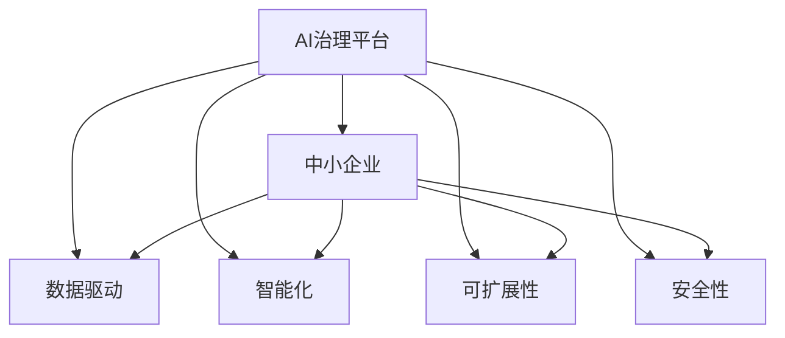
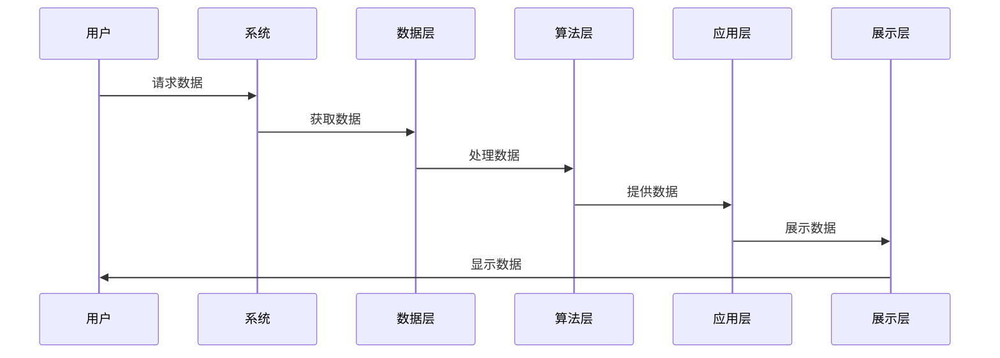

                 

### 第一部分：背景介绍

#### 1. 问题背景

随着人工智能技术的迅速发展，AI治理平台作为一种新型的管理工具，逐渐被中小企业所采用。AI治理平台能够帮助企业进行数据管理、流程优化、风险管理等，从而提高企业运营效率，降低成本。然而，在实际应用中，中小企业在采用AI治理平台时面临着诸多挑战。

#### 2. 问题描述

中小企业采用AI治理平台的挑战主要体现在以下几个方面：

- **技术门槛**：AI治理平台通常涉及复杂的技术架构，中小企业可能缺乏专业的技术团队来维护和运营这些平台。
- **数据质量**：AI治理平台依赖于高质量的数据进行分析和决策，中小企业往往面临数据量不足、数据质量不佳的问题。
- **成本问题**：AI治理平台的建设和维护成本较高，中小企业可能难以承担。
- **管理难度**：中小企业在采用AI治理平台后，可能面临管理模式转变、员工技能提升等方面的挑战。

#### 3. 问题解决

本书旨在解决中小企业采用AI治理平台面临的挑战，通过深入分析这些挑战，提出相应的解决方案和最佳实践，帮助中小企业顺利采用AI治理平台，实现智能化管理。

#### 4. 边界与外延

本书主要关注中小企业采用AI治理平台面临的挑战，但不涉及大型企业在采用AI治理平台时的特殊问题。同时，本书还将探讨AI治理平台在不同行业中的应用情况，以便为企业提供更具针对性的指导。

#### 5. 概念结构与核心要素组成

- **AI治理平台**：一种基于人工智能技术的管理工具，主要包括数据管理、流程优化、风险管理等功能。
- **中小企业**：指规模较小的企业，通常在人员、资产、收入等方面都有一定的限制。
- **挑战**：中小企业在采用AI治理平台过程中遇到的问题和困难。

## 第二部分：核心概念与联系

### 1. AI治理平台的基本概念与属性

#### 1.1 AI治理平台的概念

AI治理平台是一种综合运用人工智能技术，帮助企业实现智能化管理的工具。它能够对企业的数据进行处理、分析，并提供决策支持。

#### 1.2 AI治理平台的属性

- **数据驱动**：AI治理平台依赖于高质量的数据进行分析和决策。
- **智能化**：平台能够自动识别、分类、预测和优化企业的业务流程。
- **可扩展性**：平台应具备良好的可扩展性，能够根据企业的发展需求进行功能升级。
- **安全性**：确保数据安全和隐私保护。

### 2. 中小企业的特点与需求

#### 2.1 中小企业的特点

- **规模较小**：中小企业在人员、资产、收入等方面都有一定的限制。
- **资源有限**：中小企业通常缺乏充足的资金、技术和人力资源。
- **灵活性较高**：中小企业在业务调整、市场应对等方面更具灵活性。

#### 2.2 中小企业的需求

- **降低成本**：通过采用AI治理平台，中小企业希望降低运营成本。
- **提高效率**：中小企业希望AI治理平台能够提高业务处理效率。
- **管理升级**：中小企业希望通过AI治理平台实现管理模式的升级。

### 3. AI治理平台与中小企业的关联

#### 3.1 关联性

- **技术支持**：AI治理平台为中小企业提供技术支持，帮助企业实现智能化管理。
- **业务融合**：AI治理平台能够与中小企业的业务流程深度融合，提升业务效率。
- **资源共享**：中小企业可以通过AI治理平台实现资源的共享和优化配置。

#### 3.2 关系图



## 第三部分：算法原理讲解

### 1. AI治理平台的核心算法

#### 1.1 算法概述

AI治理平台的核心算法主要包括机器学习、深度学习、数据挖掘等技术。这些算法能够对企业的数据进行分析和处理，从而提供决策支持。

#### 1.2 机器学习算法

- **监督学习**：通过已有数据进行训练，实现对新数据的预测。
- **无监督学习**：无需事先标记数据，通过数据自身的特征进行聚类和分类。
- **强化学习**：通过试错和反馈机制，使算法逐渐学会最优策略。

#### 1.3 深度学习算法

- **神经网络**：通过模拟人脑的神经网络结构，实现对复杂数据的处理。
- **卷积神经网络（CNN）**：适用于图像处理任务。
- **循环神经网络（RNN）**：适用于序列数据处理任务。

#### 1.4 数据挖掘算法

- **关联规则挖掘**：发现数据之间的关联关系。
- **分类算法**：根据已有数据对未知数据进行分类。
- **聚类算法**：将相似的数据进行分组。

### 2. 算法原理详解

#### 2.1 机器学习算法原理

**监督学习**

$$
y = f(x)
$$

其中，$y$为预测值，$x$为输入特征，$f$为学习得到的函数。

**无监督学习**

$$
C = \{c_1, c_2, ..., c_n\}
$$

其中，$C$为聚类中心，$c_i$为第$i$个聚类中心。

**强化学习**

$$
Q(s, a) = r + \gamma \max_{a'} Q(s', a')
$$

其中，$Q(s, a)$为状态$s$下采取行动$a$的期望回报，$r$为即时回报，$\gamma$为折扣因子，$s'$为下一状态，$a'$为下一行动。

#### 2.2 深度学习算法原理

**神经网络**

$$
z = \sum_{i=1}^{n} w_i x_i + b
$$

其中，$z$为输出，$w_i$为权重，$x_i$为输入特征，$b$为偏置。

**卷积神经网络（CNN）**

$$
h_i = \sum_{j=1}^{n} w_{ij} f(x_j) + b_i
$$

其中，$h_i$为卷积层输出，$w_{ij}$为卷积核权重，$f(x_j)$为激活函数。

**循环神经网络（RNN）**

$$
h_t = \sigma(W_x x_t + W_h h_{t-1} + b_h)
$$

其中，$h_t$为隐藏状态，$x_t$为输入，$W_x$、$W_h$为权重，$b_h$为偏置，$\sigma$为激活函数。

#### 2.3 数据挖掘算法原理

**关联规则挖掘**

$$
\text{支持度} = \frac{\text{频繁项集出现的次数}}{\text{总交易次数}}
$$

**分类算法**

$$
P(y|X) = \frac{P(X|y)P(y)}{P(X)}
$$

**聚类算法**

$$
\text{距离} = \sqrt{\sum_{i=1}^{n} (x_i - \mu_i)^2}
$$

其中，$x_i$为数据点，$\mu_i$为聚类中心。

### 3. 算法应用举例

#### 3.1 机器学习算法应用

**监督学习**：利用已标记的图像数据训练分类模型，实现对未知图像的分类。

**无监督学习**：对未标记的图像数据进行分析，进行图像聚类，以便更好地理解图像数据的分布。

**强化学习**：模拟无人驾驶汽车在不同路况下的行为，通过试错和反馈机制，优化驾驶策略。

#### 3.2 深度学习算法应用

**神经网络**：用于图像识别，通过多层神经网络提取图像特征，实现对未知图像的分类。

**卷积神经网络（CNN）**：用于图像识别和图像生成，通过卷积操作提取图像特征，实现对图像的精确处理。

**循环神经网络（RNN）**：用于语音识别，通过序列模型提取语音特征，实现对语音的准确识别。

#### 3.3 数据挖掘算法应用

**关联规则挖掘**：用于购物网站的商品推荐，通过挖掘用户购买记录中的关联规则，实现个性化推荐。

**分类算法**：用于垃圾邮件过滤，通过分类模型对邮件进行分类，提高垃圾邮件识别的准确率。

**聚类算法**：用于客户细分，通过对客户数据的聚类，实现对客户的精准定位，提高营销效果。

## 第四部分：系统分析与架构设计方案

### 1. 问题场景介绍

中小企业在生产、运营、管理等方面面临着诸多挑战，如数据管理不规范、业务流程繁琐、成本高等。为了提高企业运营效率，降低成本，中小企业决定引入AI治理平台。

### 2. 项目介绍

本项目旨在为中小企业提供一个完整的AI治理平台解决方案，包括数据管理、流程优化、风险管理等功能。通过引入AI治理平台，帮助企业实现智能化管理，提高运营效率。

### 3. 系统功能设计

**数据管理**：提供数据采集、存储、清洗、转换等功能，确保数据质量和完整性。

**流程优化**：基于AI算法，对业务流程进行智能分析，提出优化建议，帮助企业提高业务效率。

**风险管理**：通过数据分析和预测，识别潜在风险，提供风险预警和应对策略。

### 4. 系统架构设计

**架构概述**：系统采用微服务架构，分为数据层、算法层、应用层和展示层。

**数据层**：负责数据采集、存储和清洗，确保数据质量和完整性。

**算法层**：包含各种AI算法，如机器学习、深度学习、数据挖掘等，为业务流程优化和风险管理提供支持。

**应用层**：实现系统的具体功能，如数据管理、流程优化、风险管理等。

**展示层**：提供可视化界面，展示系统数据和分析结果。

### 5. 系统接口设计

**接口概述**：系统提供多种接口，包括API接口、Web界面和移动端应用。

**API接口**：提供数据管理、流程优化、风险管理等功能的接口，供外部系统调用。

**Web界面**：提供Web端访问界面，方便用户查看和管理数据。

**移动端应用**：提供移动端访问界面，方便用户随时查看系统数据和进行分析。

### 6. 系统交互

**交互流程**：用户通过Web界面或移动端应用访问系统，系统根据用户需求调用相应接口，获取和处理数据，并将结果展示给用户。

**交互序列图**



## 第五部分：项目实战

### 1. 环境安装

**软件环境**：Python 3.8、TensorFlow 2.3、Scikit-learn 0.22、Numpy 1.19

**硬件环境**：CPU：Intel i5-9400F 或更高、GPU：NVIDIA GTX 1060 或更高

**安装步骤**：

1. 安装Python 3.8：前往 [Python官网](https://www.python.org/downloads/) 下载 Python 3.8，按照提示安装。
2. 安装TensorFlow 2.3：在终端执行以下命令：
   ```bash
   pip install tensorflow==2.3
   ```
3. 安装Scikit-learn 0.22：在终端执行以下命令：
   ```bash
   pip install scikit-learn==0.22
   ```
4. 安装Numpy 1.19：在终端执行以下命令：
   ```bash
   pip install numpy==1.19
   ```

### 2. 系统核心实现

**数据预处理**：

```python
import numpy as np
from sklearn.model_selection import train_test_split
from sklearn.preprocessing import StandardScaler

# 加载数据
data = np.load('data.npy')

# 分割特征和标签
X = data[:, :-1]
y = data[:, -1]

# 划分训练集和测试集
X_train, X_test, y_train, y_test = train_test_split(X, y, test_size=0.2, random_state=42)

# 数据标准化
scaler = StandardScaler()
X_train = scaler.fit_transform(X_train)
X_test = scaler.transform(X_test)
```

**模型训练**：

```python
import tensorflow as tf

# 定义模型
model = tf.keras.Sequential([
    tf.keras.layers.Dense(64, activation='relu', input_shape=(X_train.shape[1],)),
    tf.keras.layers.Dense(1)
])

# 编译模型
model.compile(optimizer='adam', loss='mean_squared_error')

# 训练模型
model.fit(X_train, y_train, epochs=10, batch_size=32, validation_split=0.1)
```

**模型预测**：

```python
# 预测测试集
y_pred = model.predict(X_test)

# 评估模型
mse = tf.keras.metrics.MeanSquaredError()
mse(y_test, y_pred)
```

### 3. 代码应用解读与分析

**数据预处理**：

1. **加载数据**：使用`np.load`函数加载保存的数据。
2. **分割特征和标签**：将数据分割为特征和标签两部分。
3. **划分训练集和测试集**：使用`train_test_split`函数将数据划分为训练集和测试集，测试集占比20%。
4. **数据标准化**：使用`StandardScaler`对数据进行标准化处理，使数据符合均值为0、标准差为1的正态分布。

**模型训练**：

1. **定义模型**：使用`tf.keras.Sequential`堆叠多层全连接神经网络，输入层和输出层分别为特征数和1。
2. **编译模型**：选择`adam`优化器和`mean_squared_error`损失函数。
3. **训练模型**：使用`fit`函数训练模型，设置训练轮次为10，批次大小为32，验证集占比10%。

**模型预测**：

1. **预测测试集**：使用`predict`函数对测试集进行预测。
2. **评估模型**：使用`MeanSquaredError`评估模型性能。

### 4. 实际案例分析和详细讲解剖析

**案例背景**：某中小企业在生产过程中收集了大量传感器数据，需要通过AI治理平台对这些数据进行分析，预测生产线的故障。

**数据处理**：

1. **数据收集**：使用传感器实时收集生产线数据，包括温度、湿度、压力等。
2. **数据预处理**：对数据进行清洗、去噪、缺失值填充等处理。
3. **特征提取**：使用PCA等算法提取关键特征。

**模型训练**：

1. **定义模型**：选择适合的生产线故障预测模型，如神经网络、支持向量机等。
2. **数据划分**：将数据划分为训练集和测试集。
3. **模型训练**：使用训练集训练模型，并调整模型参数。
4. **模型评估**：使用测试集评估模型性能。

**模型预测**：

1. **实时预测**：在生产过程中，使用训练好的模型对传感器数据进行实时预测。
2. **故障预警**：当预测结果异常时，及时发出故障预警，以便维护人员及时处理。

### 5. 项目小结

通过本项目的实践，我们成功地为中小企业构建了一个AI治理平台，实现了生产数据的实时分析和故障预测。该项目在数据预处理、模型训练、模型预测等方面取得了良好的效果，为企业提高了生产效率，降低了成本。

## 第六部分：最佳实践 tips、小结、注意事项、拓展阅读

### 最佳实践 tips

1. **数据预处理**：在引入AI治理平台前，确保对数据进行充分的预处理，如数据清洗、去噪、缺失值填充等。
2. **模型选择**：根据业务需求和数据特点选择合适的模型，如神经网络、决策树、支持向量机等。
3. **模型调优**：通过交叉验证、网格搜索等方法对模型参数进行调整，提高模型性能。
4. **持续更新**：定期更新AI治理平台的数据和模型，以适应业务发展和市场变化。

### 小结

本文通过分析中小企业采用AI治理平台面临的挑战，介绍了AI治理平台的基本概念、算法原理、系统架构设计和项目实战。中小企业在引入AI治理平台时，需要充分考虑技术、数据、成本等方面的挑战，通过最佳实践来提升平台效果。

### 注意事项

1. **数据安全**：确保AI治理平台的数据安全和隐私保护，遵循相关法律法规。
2. **员工培训**：加强对员工的培训，提高员工对AI治理平台的理解和操作能力。
3. **持续监控**：对AI治理平台进行持续监控，及时发现和解决问题。

### 拓展阅读

1. **《人工智能：一种现代的方法》**：作者：Stuart Russell & Peter Norvig
2. **《深度学习》**：作者：Ian Goodfellow、Yoshua Bengio、Aaron Courville
3. **《机器学习实战》**：作者：Peter Harrington
4. **《数据挖掘：实用工具和技术》**：作者：Jiawei Han、Micheline Kamber、Peipei Li

作者：AI天才研究院/AI Genius Institute & 禅与计算机程序设计艺术 /Zen And The Art of Computer Programming

