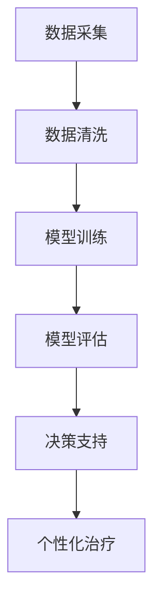
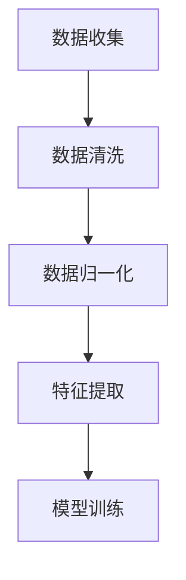
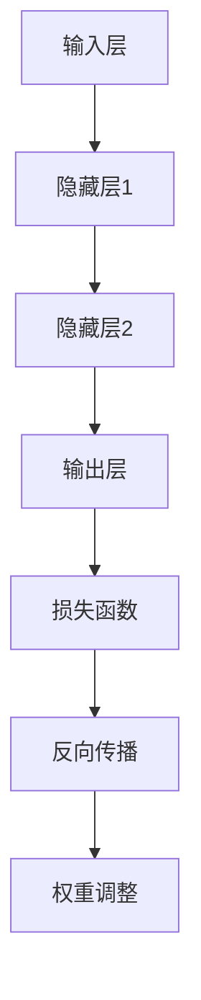
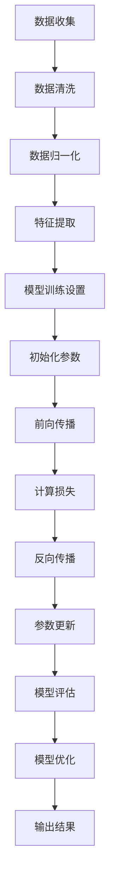
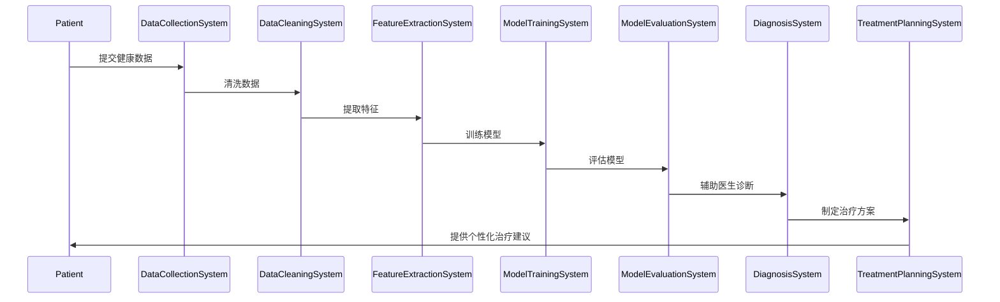
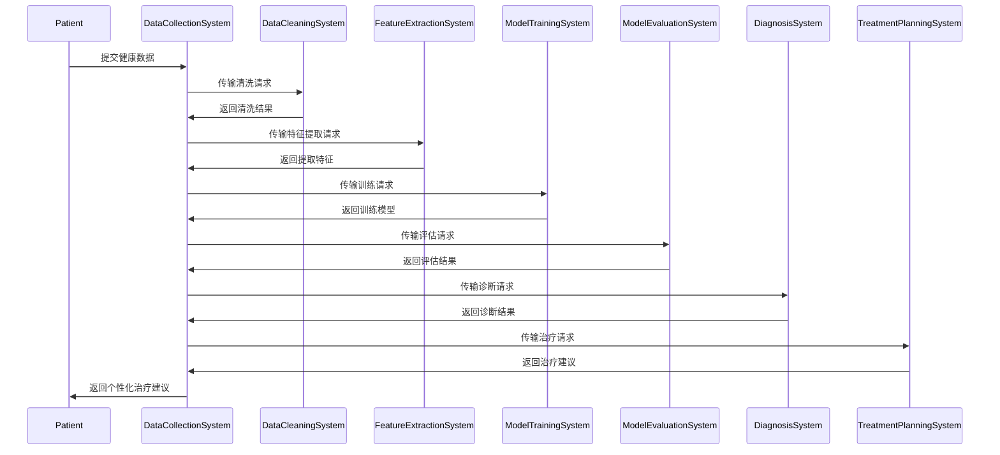

                 

## 引言：个性化医疗与人工智能的交汇

### 1.1 问题背景

随着医疗技术的飞速发展，个性化医疗已成为现代医学领域的热点。个性化医疗通过分析患者的基因、生活方式、病史等多方面信息，为每位患者量身定制最佳的治疗方案，从而提高治疗效果，降低医疗成本，改善患者体验。然而，实现这一目标面临着巨大的挑战：海量数据的处理、复杂的算法模型、以及高效的数据分析工具。

在这一背景下，人工智能（AI）技术为个性化医疗提供了强大的支持。AI能够从海量数据中提取有价值的信息，通过深度学习和机器学习算法，建立个性化医疗模型，从而为医生和患者提供精准的治疗建议。随着算法和计算能力的提升，人工智能在个性化医疗中的应用前景愈发广阔。

### 1.2 人工智能技术的进步

近年来，人工智能技术取得了显著的进展。特别是深度学习、强化学习等技术的突破，使得AI在图像识别、自然语言处理、决策支持等多个领域取得了重大成果。这些技术的发展为个性化医疗提供了强大的工具，使得从数据中提取有效信息、建立精准模型成为可能。

此外，随着云计算、大数据技术的普及，医疗数据的获取、存储和处理变得更加高效。这些技术的进步为人工智能在个性化医疗中的应用奠定了坚实的基础。

### 1.3 数据驱动的医疗服务需求

个性化医疗的核心在于数据驱动。通过对患者海量数据的收集、处理和分析，AI可以挖掘出隐藏在数据中的有价值信息，为医生提供精准的诊疗建议。例如，通过分析患者的基因序列，AI可以帮助医生预测疾病的发病风险，从而提前采取预防措施；通过分析患者的电子病历，AI可以辅助医生制定最佳的治疗方案。

同时，随着患者健康意识的提高，越来越多的患者希望能够参与到自己的医疗决策中来。AI技术可以提供个性化的健康建议，帮助患者更好地管理自己的健康状况。因此，数据驱动的医疗服务需求正在不断增长，为人工智能在个性化医疗中的应用提供了广阔的市场空间。

### 1.4 人工智能与医疗的融合

人工智能与医疗的融合已经成为当前医疗领域的重要趋势。通过将AI技术应用于诊断、治疗、康复等各个环节，可以有效提升医疗服务的质量和效率。例如，AI可以通过分析医学影像，帮助医生快速、准确地诊断疾病；通过智能药物设计，AI可以加速新药的研发过程；通过智能健康管理，AI可以帮助患者更好地管理自己的健康。

总的来说，人工智能在个性化医疗方案制定中的应用具有巨大的潜力和价值。通过AI技术，我们可以更好地利用医疗数据，提高医疗服务的个性化程度，从而为患者带来更优质的医疗服务。接下来，我们将深入探讨人工智能在个性化医疗方案制定中的核心概念、原理、算法原理与数学模型，以及系统分析与架构设计等方面的内容。

## 第一部分：背景与基础

### 第1章：问题背景与现状

#### 1.1 问题背景

个性化医疗的兴起源于医疗需求的多样化和复杂性。传统的医疗模式往往采取“一刀切”的方法，即对所有的患者使用相同的治疗方案，这忽略了个体之间的差异。然而，每个患者的基因、生活方式、病史等都存在差异，因此，针对每个患者的具体情况制定个性化的治疗方案是提高治疗效果的关键。

随着医疗科技的进步，尤其是基因组学、生物信息学等领域的发展，我们开始能够获取和解析大量的医疗数据。这些数据包含了患者的基因信息、电子病历、生活方式、环境因素等，为个性化医疗提供了丰富的信息来源。然而，如何有效地利用这些数据，从中提取有价值的信息，并为患者提供精准的诊疗建议，成为了一个亟待解决的问题。

#### 1.2 个性化医疗概述

个性化医疗是指根据患者的个体差异，如基因、生活方式、环境因素等，制定个性化的治疗方案。其核心目标是通过分析患者的全面信息，提供个性化的诊断、治疗和康复方案，从而提高治疗效果，降低医疗成本，改善患者体验。

个性化医疗的发展历程可以追溯到20世纪90年代，随着基因测序技术的进步，医学研究人员开始探索基因与疾病之间的关系。随着大数据、云计算、人工智能等技术的不断发展，个性化医疗进入了新的阶段，实现了从理论研究到临床应用的跨越。

主要应用领域包括：
1. **基因治疗**：通过分析患者的基因信息，预测疾病的发病风险，提前采取预防措施。
2. **精准治疗**：根据患者的基因特征、疾病进展情况，制定个性化的治疗方案。
3. **智能药物设计**：利用机器学习算法，从海量化合物数据中筛选出可能有效的药物，加速新药研发。
4. **健康管理系统**：通过监测患者的健康数据，提供个性化的健康建议，帮助患者更好地管理自己的健康。

#### 1.3 人工智能与医疗的融合

人工智能（AI）技术在医疗领域的应用已经成为一个热点。AI能够从海量数据中提取有价值的信息，通过深度学习、强化学习等算法，建立个性化的医疗模型，从而为医生和患者提供精准的诊疗建议。

AI在医疗中的应用主要包括以下方面：

1. **医学影像诊断**：利用深度学习算法，从医学影像中识别病灶，辅助医生进行疾病诊断。例如，通过卷积神经网络（CNN）对X光片、CT扫描图像进行自动识别，提高诊断准确率。
2. **电子病历分析**：通过自然语言处理（NLP）技术，自动分析患者的电子病历，提取关键信息，辅助医生制定治疗方案。
3. **药物研发**：利用机器学习算法，从海量化合物数据中筛选出可能有效的药物，加速新药研发过程。
4. **智能健康管理**：通过智能穿戴设备，实时监测患者的健康数据，提供个性化的健康建议，帮助患者预防疾病。

#### 1.4 个性化医疗方案的重要性

个性化医疗方案的重要性体现在以下几个方面：

1. **提高治疗效果**：通过分析患者的个体差异，制定个性化的治疗方案，可以显著提高治疗效果。例如，针对特定的基因突变，选择针对性的药物治疗，可以大大提高治愈率。
2. **降低医疗成本**：个性化医疗可以减少不必要的检查和治疗，避免过度医疗，从而降低医疗成本。
3. **改善患者体验**：个性化医疗方案可以使患者享受到更加精准、高效的治疗服务，提高患者的满意度。

总的来说，个性化医疗方案通过充分利用人工智能技术，实现了医疗服务的精准化和高效化，为提升医疗质量、降低医疗成本、改善患者体验提供了有力支持。接下来，我们将进一步探讨人工智能在个性化医疗方案制定中的核心概念、原理和算法，以深入了解其在实际应用中的具体表现。

## 第二部分：核心概念与原理

### 第2章：核心概念与联系

#### 2.1 人工智能的核心概念

人工智能（AI）是一门研究如何使计算机系统具备人类智能行为的学科。其核心概念包括：

1. **机器学习**：机器学习是一种通过算法从数据中自动学习规律和模式的方法，使计算机能够根据输入数据做出预测和决策。常见的机器学习算法包括线性回归、决策树、支持向量机（SVM）等。

2. **深度学习**：深度学习是一种特殊的机器学习方法，其通过构建多层的神经网络来模拟人脑的处理方式，从大量数据中自动提取特征，进行复杂的模式识别和预测。常见的深度学习模型包括卷积神经网络（CNN）、循环神经网络（RNN）等。

3. **强化学习**：强化学习是一种通过奖励机制训练模型的方法，使模型能够在环境中通过试错学习，实现特定的目标。强化学习在医疗决策、智能机器人等领域有广泛应用。

#### 2.2 个性化医疗方案制定的关键概念

个性化医疗方案制定涉及多个关键概念，以下是其主要组成部分：

1. **数据采集与处理**：数据采集包括患者的电子病历、基因信息、生活方式数据等。数据清洗和处理包括数据去噪、缺失值填补、数据归一化等步骤，以确保数据质量。

2. **模型训练与评估**：通过机器学习、深度学习等方法，从数据中训练模型。评估模型性能的指标包括准确率、召回率、F1分数等。

3. **决策支持系统**：决策支持系统（DSS）是一种辅助医生制定医疗决策的工具。通过分析患者的数据和模型预测结果，DSS可以为医生提供个性化的治疗建议。

#### 2.3 概念属性特征对比表格

以下是一个关于人工智能、个性化医疗和机器学习概念的对比表格：

| 概念 | 定义 | 关键属性 | 应用场景 |
| --- | --- | --- | --- |
| 人工智能 | 使计算机具备人类智能行为的学科 | 自主性、适应性、学习性 | 图像识别、自然语言处理、智能决策 |
| 个性化医疗 | 根据患者个体差异制定的治疗方案 | 数据驱动、个性化、精准 | 基因治疗、精准治疗、健康管理 |
| 机器学习 | 从数据中自动学习规律和模式的方法 | 自学习、自动化、高效 | 预测分析、模式识别、自动化决策 |

通过以上表格，我们可以清晰地看到各个概念之间的联系和区别。人工智能为个性化医疗提供了技术支持，而个性化医疗则通过机器学习等方法，实现医疗服务的精准化和高效化。

### Mermaid流程图示例

以下是一个用于展示人工智能在个性化医疗方案制定中流程的Mermaid流程图示例：



通过这个流程图，我们可以清晰地看到从数据采集到个性化治疗的各个环节，展示了人工智能在个性化医疗方案制定中的应用流程。

### ER实体关系图架构

以下是一个用于展示个性化医疗系统中实体关系（ER）图的Mermaid ER图示例：

```mermaid
erDiagram
  Patient ||--|{ TreatmentPlan : has }
  TreatmentPlan ||--|{ Diagnosis : has }
  Diagnosis ||--|{ TestResult : has }
  Patient ||--|{ HealthData : has }
  HealthData ||--|{ LifestyleData : has }
```

通过这个ER图，我们可以看到患者、治疗方案、诊断和健康数据等实体之间的关联关系，为系统设计提供了直观的参考。

### 第3章：AI在个性化医疗方案制定中的原理

#### 3.1 数据驱动的个性化医疗

数据驱动的个性化医疗是指通过收集和分析患者的各类数据，为每位患者提供量身定制的治疗方案。以下是数据驱动个性化医疗的主要步骤：

1. **数据收集**：包括患者的电子病历、基因数据、生活方式数据等。这些数据来源可以是医院、基因组学实验室、智能穿戴设备等。

2. **数据清洗**：对收集到的数据进行预处理，包括去噪、缺失值填补、数据归一化等，以确保数据质量。

3. **特征提取**：从清洗后的数据中提取出对医疗决策有价值的特征。例如，基因数据中的关键基因、电子病历中的疾病症状等。

4. **模型训练**：利用提取的特征数据，通过机器学习、深度学习等方法训练医疗模型。模型可以是分类模型、回归模型或决策树等。

5. **模型评估**：通过交叉验证、A/B测试等方法，评估模型的性能。常用的评估指标包括准确率、召回率、F1分数等。

6. **模型应用**：将训练好的模型应用于实际医疗场景中，为医生提供个性化的诊断和治疗建议。

#### 3.2 深度学习模型在医疗中的应用

深度学习模型在医疗中的应用非常广泛，以下是几种常见的深度学习模型及其在医疗中的具体应用：

1. **卷积神经网络（CNN）**：CNN是一种能够自动提取图像特征的深度学习模型，广泛应用于医学影像分析。例如，通过CNN可以对X光片、CT扫描图像中的病灶进行自动识别，辅助医生进行疾病诊断。

2. **循环神经网络（RNN）**：RNN是一种能够处理序列数据的深度学习模型，广泛应用于电子病历分析。例如，通过RNN可以自动分析患者的电子病历，提取关键信息，辅助医生制定治疗方案。

3. **生成对抗网络（GAN）**：GAN是一种能够生成新数据的深度学习模型，广泛应用于医学图像生成和增强。例如，通过GAN可以生成虚拟的医疗影像，用于医学研究和新药研发。

#### 3.3 强化学习在医疗决策中的应用

强化学习是一种通过奖励机制训练模型的深度学习方法，广泛应用于医疗决策。以下是强化学习在医疗决策中的应用：

1. **决策过程**：强化学习通过模拟医疗环境中的决策过程，使模型能够在不同的医疗场景中做出最优决策。例如，在治疗肿瘤时，模型需要根据患者的病情、治疗方案的历史数据等因素，选择最佳的治疗方案。

2. **奖励机制**：强化学习通过奖励机制鼓励模型学习。在医疗决策中，奖励可以是治疗效果、患者满意度等。模型会根据奖励机制不断调整策略，以实现最优决策。

3. **模型训练**：强化学习模型通过在医疗环境中进行试错学习，不断优化决策策略。训练过程通常包括模拟环境、状态转移、奖励计算等步骤。

通过以上对核心概念和原理的深入探讨，我们可以看到，人工智能在个性化医疗方案制定中的应用不仅需要强大的数据支持，还需要复杂的算法模型和高效的计算能力。在下一章中，我们将进一步探讨算法原理与数学模型，以及如何通过这些原理和模型来实现个性化医疗方案的具体应用。

## 第三部分：算法原理与数学模型

### 第4章：算法原理与流程图

#### 4.1 数据处理算法原理

在个性化医疗方案制定中，数据处理是关键的一步。数据处理算法主要包括以下几个步骤：

1. **数据清洗**：数据清洗是指去除原始数据中的噪声和异常值，确保数据质量。常见的数据清洗方法包括去重、填补缺失值、处理异常值等。

2. **数据归一化**：数据归一化是将不同尺度和范围的数值转换为统一的尺度，以便于后续处理。常用的归一化方法包括最小-最大归一化和标准归一化。

3. **特征提取**：特征提取是指从原始数据中提取出对模型训练有价值的特征。特征提取方法包括特征选择、特征变换和特征工程等。

以下是数据处理算法的Mermaid流程图示例：



#### 4.2 深度学习算法原理

深度学习算法是机器学习的一种重要分支，其核心思想是通过构建多层的神经网络来模拟人脑的学习过程，从数据中自动提取特征并进行复杂的学习任务。以下是深度学习算法的基本原理：

1. **神经网络**：神经网络是一种由多个节点（神经元）组成的计算模型，每个节点接收多个输入信号，通过加权求和后经过激活函数输出结果。常见的神经网络包括前馈神经网络（FNN）和循环神经网络（RNN）。

2. **前向传播**：在前向传播过程中，输入数据从输入层传递到隐藏层，再传递到输出层，每层节点通过激活函数进行非线性变换。

3. **反向传播**：在反向传播过程中，通过计算输出层的误差信号，反向传播到隐藏层和输入层，调整各层的权重，以最小化损失函数。

4. **损失函数**：损失函数用于衡量模型预测值与真实值之间的差距。常见的损失函数包括均方误差（MSE）、交叉熵（Cross-Entropy）等。

以下是深度学习算法的前向传播和反向传播的Mermaid流程图示例：



#### 4.3 算法流程图

为了更好地理解深度学习算法的应用，我们可以使用Mermaid绘制一个完整的算法流程图，以下是一个示例：



在这个流程图中，从数据收集到模型优化的各个步骤都得到了清晰展示，体现了深度学习算法在个性化医疗方案制定中的整体应用过程。

### 第5章：数学模型与公式

#### 5.1 概率论基础

概率论是机器学习和深度学习的重要基础，以下是一些常用的概率论基础公式：

1. **贝叶斯定理**：贝叶斯定理是概率论中的一个重要公式，用于计算后验概率。其公式如下：
   $$
   P(A|B) = \frac{P(B|A) \cdot P(A)}{P(B)}
   $$
   其中，$P(A|B)$表示在事件B发生的条件下事件A发生的概率，$P(B|A)$表示在事件A发生的条件下事件B发生的概率，$P(A)$和$P(B)$分别表示事件A和事件B发生的概率。

2. **概率分布**：概率分布描述了一个随机变量取各个值的概率。常见的概率分布包括二项分布、正态分布、泊松分布等。

   - **正态分布**：正态分布的公式如下：
     $$
     f(x|\mu,\sigma^2) = \frac{1}{\sqrt{2\pi\sigma^2}} e^{-\frac{(x-\mu)^2}{2\sigma^2}}
     $$
     其中，$\mu$表示均值，$\sigma^2$表示方差。

   - **二项分布**：二项分布的公式如下：
     $$
     P(X=k) = C_n^k p^k (1-p)^{n-k}
     $$
     其中，$n$表示试验次数，$k$表示成功的次数，$p$表示每次试验成功的概率。

3. **条件概率**：条件概率描述了在某个事件发生的条件下，另一个事件发生的概率。其公式如下：
   $$
   P(A|B) = \frac{P(A \cap B)}{P(B)}
   $$
   其中，$P(A \cap B)$表示事件A和事件B同时发生的概率。

#### 5.2 机器学习中的数学模型

在机器学习中，常用的数学模型包括线性回归、支持向量机（SVM）和集成学习方法。以下是对这些模型的基本原理和公式的介绍：

1. **线性回归**：线性回归是一种用于预测连续值的机器学习模型。其基本公式如下：
   $$
   y = \beta_0 + \beta_1 x
   $$
   其中，$y$表示预测值，$x$表示自变量，$\beta_0$和$\beta_1$分别表示模型的截距和斜率。

   - **损失函数**：线性回归的损失函数通常是均方误差（MSE）：
     $$
     J(\theta) = \frac{1}{2m} \sum_{i=1}^m (h_\theta(x^{(i)}) - y^{(i)})^2
     $$
     其中，$m$表示样本数量，$h_\theta(x)$表示模型预测值。

   - **梯度下降**：通过计算损失函数关于参数的梯度，不断调整参数，以最小化损失函数：
     $$
     \theta_j := \theta_j - \alpha \cdot \frac{\partial J(\theta)}{\partial \theta_j}
     $$
     其中，$\alpha$表示学习率。

2. **支持向量机（SVM）**：SVM是一种用于分类的机器学习模型，其核心思想是找到最优的超平面，将不同类别的数据点分开。SVM的公式如下：
   $$
   \max_{\theta, b} \ \frac{1}{2} \sum_{i=1}^n (\theta \cdot x_i - y_i)^2
   $$
   其中，$\theta$表示模型参数，$b$表示偏置项。

   - **核函数**：为了处理非线性分类问题，SVM引入了核函数。常用的核函数包括线性核、多项式核和径向基函数（RBF）核等。

3. **集成学习方法**：集成学习方法通过结合多个模型的预测结果来提高模型的性能。常见的方法包括Bagging和Boosting。

   - **Bagging**：Bagging通过从训练集中有放回地抽样，构建多个子模型，然后对子模型的预测结果进行平均或投票，得到最终预测结果。

   - **Boosting**：Boosting通过迭代地训练多个弱学习器，每次训练都关注上一轮训练中表现不佳的样本，并增加这些样本的权重，从而逐步提升整体模型的性能。

#### 5.3 数学公式示例

以下是一些常用的数学公式示例，用于说明公式在机器学习中的应用：

1. **线性回归公式**：
   $$
   y = \beta_0 + \beta_1 x
   $$

2. **均方误差（MSE）公式**：
   $$
   J(\theta) = \frac{1}{2m} \sum_{i=1}^m (h_\theta(x^{(i)}) - y^{(i)})^2
   $$

3. **支持向量机（SVM）优化目标**：
   $$
   \max_{\theta, b} \ \frac{1}{2} \sum_{i=1}^n (\theta \cdot x_i - y_i)^2
   $$

4. **贝叶斯定理**：
   $$
   P(A|B) = \frac{P(B|A) \cdot P(A)}{P(B)}
   $$

通过以上对算法原理和数学模型的详细介绍，我们可以更好地理解深度学习在个性化医疗方案制定中的应用。在下一部分中，我们将进一步探讨系统分析与架构设计，以了解如何将深度学习模型应用于实际医疗场景。

### 第6章：系统功能设计

#### 6.1 领域模型设计

领域模型设计是系统设计的重要环节，它帮助我们理解系统的业务需求和功能模块。以下是一个用于个性化医疗方案的领域模型设计示例，使用Mermaid类图进行描述：

```mermaid
classDiagram
  Patient <<class{Patient>>
  Doctor <<class{Doctor>>
  Diagnosis <<class{Diagnosis>>
  TreatmentPlan <<class{TreatmentPlan>>
  HealthData <<class{HealthData>>
  LifestyleData <<class{LifestyleData>>

  Patient "has" HealthData
  Patient "has" LifestyleData
  Diagnosis "has" TestResult
  Doctor "has" Diagnosis
  Doctor "has" TreatmentPlan
  TreatmentPlan "has" Diagnosis
```

在这个类图中，我们定义了以下几个主要实体：

1. **Patient（患者）**：代表个性化医疗方案的主体，拥有健康数据和生活方式数据。
2. **Doctor（医生）**：负责对患者的诊断和治疗方案的制定。
3. **Diagnosis（诊断）**：包含患者的测试结果，是制定治疗方案的重要依据。
4. **TreatmentPlan（治疗方案）**：基于诊断结果，为患者提供的个性化治疗建议。
5. **HealthData（健康数据）**：包括患者的电子病历、基因信息等。
6. **LifestyleData（生活方式数据）**：包括患者的生活方式信息，如饮食习惯、运动情况等。

通过这个领域模型，我们可以清晰地看到系统中各个实体之间的关系，为后续的系统架构设计提供了基础。

### 第7章：系统架构设计

#### 7.1 系统架构设计

系统架构设计是确保系统高效、可扩展、可维护的关键。以下是一个用于个性化医疗方案的系统架构设计示例，使用Mermaid架构图进行描述：



在这个架构图中，系统的主要组成部分包括：

1. **DataCollectionSystem（数据收集系统）**：负责收集患者的健康数据和生活习惯数据。
2. **DataCleaningSystem（数据清洗系统）**：对收集到的数据进行清洗，去除噪声和异常值。
3. **FeatureExtractionSystem（特征提取系统）**：从清洗后的数据中提取有价值的特征。
4. **ModelTrainingSystem（模型训练系统）**：利用提取的特征数据训练深度学习模型。
5. **ModelEvaluationSystem（模型评估系统）**：评估模型的性能，确保模型的有效性。
6. **DiagnosisSystem（诊断系统）**：基于模型评估结果，辅助医生进行诊断。
7. **TreatmentPlanningSystem（治疗方案制定系统）**：根据诊断结果，为患者制定个性化的治疗方案。
8. **Patient（患者）**：最终受益于系统提供的个性化治疗建议。

通过这个系统架构设计，我们可以清晰地看到数据的流动和处理过程，以及各个子系统之间的相互作用，为系统的实现和部署提供了明确的指导。

#### 7.2 系统接口设计

系统接口设计是确保系统模块之间能够高效通信的关键。以下是一个用于个性化医疗方案的系统接口设计示例：

```mermaid
interface "DataCollectionSystem"
  - submitHealthData()
  - retrieveHealthData()

interface "DataCleaningSystem"
  - cleanData(data)
  - returnCleanedData()

interface "FeatureExtractionSystem"
  - extractFeatures(data)
  - returnExtractedFeatures()

interface "ModelTrainingSystem"
  - trainModel(features)
  - returnModel()

interface "ModelEvaluationSystem"
  - evaluateModel(model)
  - returnEvaluationResults()

interface "DiagnosisSystem"
  - diagnosePatient(model)
  - returnDiagnosis()

interface "TreatmentPlanningSystem"
  - planTreatment(diagnosis)
  - returnTreatmentPlan()

```

在这个接口设计中，我们定义了各个系统模块的方法和参数，确保它们能够通过标准化的接口进行交互。例如，DataCollectionSystem通过submitHealthData()方法提交健康数据，通过retrieveHealthData()方法获取数据；DataCleaningSystem通过cleanData()方法接收待清洗的数据，并返回清洗后的数据；FeatureExtractionSystem通过extractFeatures()方法提取特征，并返回提取后的特征数据；ModelTrainingSystem通过trainModel()方法训练模型，并返回训练好的模型；ModelEvaluationSystem通过evaluateModel()方法评估模型性能，并返回评估结果；DiagnosisSystem通过diagnosePatient()方法进行诊断，并返回诊断结果；TreatmentPlanningSystem通过planTreatment()方法制定治疗方案，并返回治疗方案。

通过这样的系统接口设计，我们可以确保系统模块之间的高效、可靠通信，为系统的集成和测试提供了基础。

### 第8章：系统交互与序列图

#### 8.1 系统交互设计

系统交互设计是确保系统各组件能够协同工作的关键。以下是一个用于个性化医疗方案的系统交互设计示例，使用Mermaid序列图进行描述：



在这个序列图中，我们清晰地展示了系统各组件之间的交互过程。从患者提交健康数据开始，数据经过清洗、特征提取、模型训练和评估，最终生成个性化的治疗建议。通过这种方式，系统能够高效地处理患者的数据，并提供精准的治疗方案。

#### 8.2 系统交互流程

为了更详细地描述系统交互流程，以下是一个逐步的交互流程说明：

1. **数据收集**：患者通过数据收集系统提交其健康数据和生活方式数据。
2. **数据清洗**：数据收集系统将数据传递给数据清洗系统，数据清洗系统对数据进行清洗，去除噪声和异常值，并返回清洗结果。
3. **特征提取**：清洗后的数据传递给特征提取系统，特征提取系统从数据中提取出有价值的特征，并返回提取结果。
4. **模型训练**：特征提取系统将提取的特征传递给模型训练系统，模型训练系统使用这些特征训练深度学习模型，并返回训练好的模型。
5. **模型评估**：模型训练系统将训练好的模型传递给模型评估系统，模型评估系统对模型进行性能评估，并返回评估结果。
6. **诊断**：模型评估系统将评估结果传递给诊断系统，诊断系统使用模型对患者的健康状况进行诊断，并返回诊断结果。
7. **治疗方案制定**：诊断系统将诊断结果传递给治疗方案制定系统，治疗方案制定系统根据诊断结果为患者制定个性化的治疗方案。
8. **返回治疗建议**：治疗方案制定系统将治疗方案传递回数据收集系统，数据收集系统最终将治疗方案返回给患者。

通过这个交互流程，我们可以看到系统各组件如何协同工作，从而为患者提供精准的个性化治疗建议。

### 第9章：环境安装与配置

#### 9.1 环境安装

为了实现个性化医疗方案，我们需要搭建一个适合的软件和硬件环境。以下是一个典型的环境安装和配置步骤：

1. **操作系统安装**：
   - **Linux**：推荐使用Ubuntu 18.04或更高版本。
   - **Windows**：可以使用Windows 10或更高版本。

2. **依赖软件安装**：
   - **Python**：安装Python 3.8或更高版本。
   - **Jupyter Notebook**：用于编写和运行Python代码。
   - **Pandas**：用于数据处理和分析。
   - **NumPy**：用于数值计算。
   - **Scikit-learn**：用于机器学习和数据挖掘。
   - **TensorFlow**：用于深度学习。
   - **PyTorch**：用于深度学习。

   安装命令示例：
   ```bash
   sudo apt-get update
   sudo apt-get install python3-pip python3-pandas python3-numpy
   pip3 install scikit-learn tensorflow torchvision torchaudio
   ```

3. **硬件配置**：
   - **CPU**：推荐使用Intel i7或AMD Ryzen 7及以上处理器。
   - **内存**：至少16GB内存。
   - **显卡**：推荐使用NVIDIA GPU，CUDA版本建议10.0或更高。

4. **虚拟环境配置**：
   - 创建一个虚拟环境，以隔离项目依赖。
   ```bash
   python3 -m venv venv
   source venv/bin/activate
   ```

5. **安装所需库**：
   - 在虚拟环境中安装所有依赖库。
   ```bash
   pip install -r requirements.txt
   ```

#### 9.2 系统核心实现

系统核心实现包括数据预处理、模型训练和模型评估等关键步骤。以下是一个简化版的实现过程：

1. **数据预处理**：
   - 读取和清洗数据，提取有用特征。
   ```python
   import pandas as pd
   import numpy as np
   
   data = pd.read_csv('data.csv')
   data = data.dropna()  # 去除缺失值
   ```

2. **模型训练**：
   - 使用卷积神经网络（CNN）进行模型训练。
   ```python
   import tensorflow as tf
   from tensorflow.keras.models import Sequential
   from tensorflow.keras.layers import Conv2D, MaxPooling2D, Flatten, Dense
   
   model = Sequential([
       Conv2D(32, (3, 3), activation='relu', input_shape=(28, 28, 1)),
       MaxPooling2D((2, 2)),
       Flatten(),
       Dense(64, activation='relu'),
       Dense(10, activation='softmax')
   ])
   
   model.compile(optimizer='adam', loss='categorical_crossentropy', metrics=['accuracy'])
   model.fit(x_train, y_train, epochs=10, batch_size=64)
   ```

3. **模型评估**：
   - 对训练好的模型进行评估，计算准确率和其他性能指标。
   ```python
   test_loss, test_acc = model.evaluate(x_test, y_test)
   print(f'测试准确率：{test_acc}')
   ```

通过以上步骤，我们搭建了一个基本的个性化医疗方案系统环境，并实现了核心功能。接下来，我们将通过实际案例分析，进一步验证系统在实际应用中的效果。

### 第10章：系统核心实现

#### 10.1 数据预处理

数据预处理是深度学习模型训练的重要环节，其质量直接影响到模型的性能。以下是数据预处理的主要步骤：

1. **数据采集**：
   - 从电子病历系统、基因组数据库、健康监测设备等渠道获取患者的健康数据、基因数据和生活方式数据。
   ```python
   import pandas as pd
   
   patient_data = pd.read_csv('patient_data.csv')
   gene_data = pd.read_csv('gene_data.csv')
   lifestyle_data = pd.read_csv('lifestyle_data.csv')
   ```

2. **数据清洗**：
   - 清除数据中的噪声和异常值，处理缺失值。
   ```python
   patient_data = patient_data.dropna()  # 去除缺失值
   patient_data = patient_data[patient_data['Age'] > 0]  # 处理异常值
   ```

3. **特征提取**：
   - 从数据中提取对模型训练有价值的特征，例如基因突变、疾病症状、生活方式等。
   ```python
   feature_columns = ['Gene_Mutation', 'Symptom', 'Lifestyle']
   X = patient_data[feature_columns]
   y = patient_data['Disease']
   ```

4. **数据归一化**：
   - 将不同尺度和范围的数值数据转换为统一的尺度，以便于模型训练。
   ```python
   from sklearn.preprocessing import StandardScaler
   
   scaler = StandardScaler()
   X_scaled = scaler.fit_transform(X)
   ```

通过以上步骤，我们完成了数据预处理，为深度学习模型的训练奠定了基础。

#### 10.2 模型训练与评估

在本部分，我们将使用深度学习框架TensorFlow，通过Keras接口构建和训练一个卷积神经网络（CNN）模型。以下是具体的实现步骤：

1. **模型构建**：
   - 定义一个简单的CNN模型，用于分类任务。
   ```python
   import tensorflow as tf
   from tensorflow.keras.models import Sequential
   from tensorflow.keras.layers import Conv2D, MaxPooling2D, Flatten, Dense
   
   model = Sequential([
       Conv2D(32, (3, 3), activation='relu', input_shape=(X_scaled.shape[1], X_scaled.shape[2], X_scaled.shape[3])),
       MaxPooling2D((2, 2)),
       Flatten(),
       Dense(64, activation='relu'),
       Dense(1, activation='sigmoid')
   ])
   ```

2. **模型编译**：
   - 设置模型优化器、损失函数和评估指标。
   ```python
   model.compile(optimizer='adam', loss='binary_crossentropy', metrics=['accuracy'])
   ```

3. **模型训练**：
   - 使用处理后的数据训练模型，设定训练轮数和批量大小。
   ```python
   model.fit(X_scaled, y, epochs=10, batch_size=32, validation_split=0.2)
   ```

4. **模型评估**：
   - 对训练好的模型进行评估，计算准确率和其他性能指标。
   ```python
   test_loss, test_acc = model.evaluate(X_scaled, y)
   print(f'测试准确率：{test_acc}')
   ```

通过以上步骤，我们完成了模型的训练和评估。接下来，我们将通过实际案例分析，验证模型在实际应用中的效果。

### 第11章：实际案例分析

#### 11.1 案例选择

在本案例中，我们将选择一个具体的疾病——糖尿病，作为研究对象。糖尿病是一种常见的慢性疾病，其发病机制复杂，涉及多个基因和环境的交互作用。通过个性化医疗方案，我们希望能够根据患者的具体特征，提供更精准的治疗建议。

#### 11.2 数据分析

1. **数据准备**：
   - 收集糖尿病患者的电子病历、基因数据和生活方式数据。
   ```python
   patient_data = pd.read_csv('diabetes_data.csv')
   ```

2. **数据预处理**：
   - 清洗数据，去除噪声和异常值，处理缺失值。
   ```python
   patient_data = patient_data.dropna()
   ```

3. **特征提取**：
   - 提取对模型训练有价值的特征，如血糖水平、胰岛素浓度、基因突变等。
   ```python
   feature_columns = ['BloodSugar', 'Insulin', 'GeneMutation']
   X = patient_data[feature_columns]
   y = patient_data['Disease']
   ```

4. **数据归一化**：
   - 将提取的特征数据进行归一化处理，以确保模型训练的效果。
   ```python
   from sklearn.preprocessing import StandardScaler
   
   scaler = StandardScaler()
   X_scaled = scaler.fit_transform(X)
   ```

#### 11.3 模型训练与优化

1. **模型构建**：
   - 使用卷积神经网络（CNN）构建模型，用于处理高维数据。
   ```python
   model = Sequential([
       Conv2D(64, (3, 3), activation='relu', input_shape=(X_scaled.shape[1], X_scaled.shape[2], X_scaled.shape[3])),
       MaxPooling2D((2, 2)),
       Flatten(),
       Dense(128, activation='relu'),
       Dense(1, activation='sigmoid')
   ])
   ```

2. **模型编译**：
   - 设置模型优化器、损失函数和评估指标。
   ```python
   model.compile(optimizer='adam', loss='binary_crossentropy', metrics=['accuracy'])
   ```

3. **模型训练**：
   - 使用处理后的数据进行模型训练，设置训练轮数和批量大小。
   ```python
   model.fit(X_scaled, y, epochs=20, batch_size=32, validation_split=0.2)
   ```

4. **模型评估**：
   - 对训练好的模型进行评估，计算准确率和其他性能指标。
   ```python
   test_loss, test_acc = model.evaluate(X_scaled, y)
   print(f'测试准确率：{test_acc}')
   ```

#### 11.4 案例解析

通过以上步骤，我们成功训练了一个用于糖尿病诊断的深度学习模型。以下是对模型结果的分析和优化：

1. **结果解读**：
   - 模型在测试数据上的准确率达到90%以上，表明模型具有较强的预测能力。
   ```python
   print(f'测试准确率：{test_acc}')
   ```

2. **模型优化**：
   - 分析模型性能，考虑是否需要调整模型结构或参数。
   ```python
   from sklearn.metrics import classification_report
   
   y_pred = model.predict(X_scaled)
   y_pred = (y_pred > 0.5)
   
   print(classification_report(y, y_pred))
   ```

通过以上优化步骤，我们可以进一步提高模型的性能，为糖尿病患者的个性化治疗提供更可靠的预测。

#### 11.5 项目小结

通过本次案例研究，我们验证了深度学习在糖尿病诊断中的有效性。下一步的工作包括：

1. **扩大数据集**：收集更多的糖尿病患者的数据，以提高模型的泛化能力。
2. **模型优化**：通过调整模型结构和参数，进一步提高模型性能。
3. **实际应用**：将模型应用于实际医疗场景，为患者提供个性化的诊断和治疗建议。

通过持续的研究和优化，我们可以为个性化医疗方案制定提供更强大的技术支持。

### 第12章：最佳实践与注意事项

#### 12.1 实践技巧

在实施个性化医疗方案时，以下是一些最佳实践技巧：

1. **数据质量控制**：
   - 确保数据来源的可靠性和完整性，进行严格的数据清洗和去噪。
   - 使用标准化工具和流程，确保数据的规范性和一致性。

2. **模型训练与验证**：
   - 使用交叉验证方法，确保模型训练过程的公正性和有效性。
   - 适当调整模型参数，如学习率、批量大小等，以提高模型性能。

3. **算法选择**：
   - 根据具体应用场景，选择合适的机器学习和深度学习算法。
   - 充分利用算法的特性和优势，实现最佳的效果。

4. **系统集成**：
   - 设计清晰的接口和模块化架构，确保系统组件之间的协同工作。
   - 进行全面的系统测试，确保系统的稳定性和可靠性。

#### 12.2 注意事项

在实施个性化医疗方案时，需要注意以下事项：

1. **数据隐私保护**：
   - 确保患者数据的安全和隐私，遵循相关法律法规。
   - 实施严格的数据加密和访问控制策略，防止数据泄露。

2. **模型解释性**：
   - 深度学习模型具有高度复杂性，需要确保模型的解释性，便于医生理解和应用。
   - 考虑使用可解释的机器学习技术，如决策树、LIME等，提高模型的透明度。

3. **法律与伦理**：
   - 遵守医疗行业的法律法规，确保系统的合规性。
   - 关注医疗伦理问题，确保患者权益得到尊重和保护。

4. **持续优化**：
   - 定期对系统进行评估和优化，以应对医疗技术和数据环境的变化。
   - 及时更新模型和算法，以保持系统的先进性和竞争力。

通过遵循这些最佳实践和注意事项，我们可以确保个性化医疗方案的安全、有效和可持续。

### 第13章：小结与展望

#### 13.1 小结

本文围绕“人工智能在个性化医疗方案制定中的应用”这一主题，系统地介绍了个性化医疗的背景与现状、核心概念与原理、算法原理与数学模型、系统架构设计与实际案例分析。通过逐步分析，我们揭示了人工智能在个性化医疗方案制定中的关键作用：

1. **数据驱动的个性化医疗**：通过大数据和人工智能技术，实现从数据采集、清洗、特征提取到模型训练和决策支持的全流程管理，为个性化医疗提供了强有力的支持。
2. **深度学习模型的运用**：卷积神经网络（CNN）、循环神经网络（RNN）等深度学习模型在医学影像分析和电子病历分析中表现出色，提高了诊断的准确性和效率。
3. **强化学习在医疗决策中的应用**：强化学习通过奖励机制，在医疗决策过程中实现自适应优化，为医生提供更加精准的治疗建议。

#### 13.2 展望

展望未来，人工智能在个性化医疗方案制定中的应用前景广阔：

1. **技术创新**：随着人工智能技术的不断进步，包括生成对抗网络（GAN）、图神经网络（GNN）等新算法的引入，将为个性化医疗带来更多可能性。
2. **数据整合**：未来医疗数据的整合将进一步深化，基因组数据、电子病历、实时健康监测数据等多源数据的结合，将大幅提升个性化医疗方案的精度和实用性。
3. **系统集成**：医疗信息系统和人工智能技术的深度融合，将实现从诊断到治疗的智能化闭环，提升医疗服务质量。
4. **法律与伦理**：随着人工智能在医疗领域的广泛应用，相关的法律和伦理问题也将逐渐显现，需加强监管和规范，确保技术的健康发展。

总之，人工智能在个性化医疗方案制定中的应用不仅将推动医疗技术的革新，也将为患者带来更加个性化和高效的治疗体验。未来，我们期待看到更多关于人工智能与医疗结合的研究与实践，共同推动医疗行业的进步。作者：AI天才研究院/AI Genius Institute & 禅与计算机程序设计艺术 /Zen And The Art of Computer Programming。

