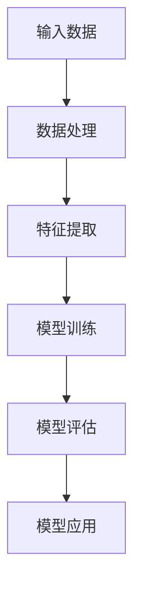
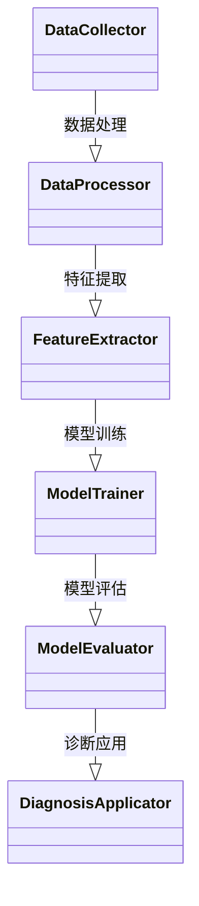
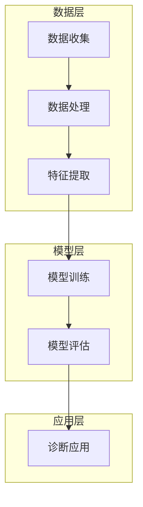
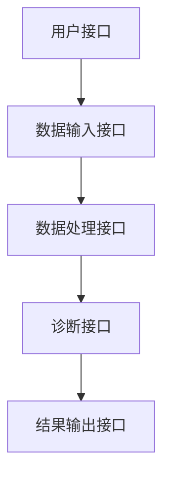
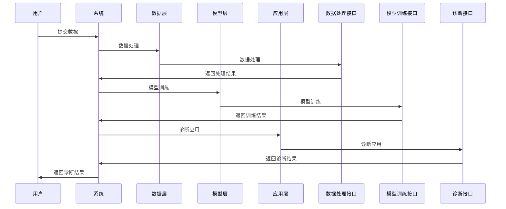

                 

### 人工智能在个性化医疗诊断中的应用与挑战

在当今信息技术飞速发展的时代，人工智能（AI）作为一项颠覆性技术，已经深刻地改变了众多行业的面貌。医疗行业，作为关乎人类健康与生命的重要领域，自然也不例外。个性化医疗诊断作为医疗领域的一个前沿研究方向，借助人工智能技术，正在迈向更加精准和高效的阶段。本文将围绕人工智能在个性化医疗诊断中的应用与挑战进行深入探讨。

首先，让我们从问题背景出发，了解个性化医疗诊断的定义与发展。个性化医疗诊断是一种基于患者个体基因信息、生活方式、临床指标等数据，结合先进的人工智能算法，为患者提供定制化医疗方案的技术。它的出现不仅解决了传统医疗诊断中普遍存在的“一刀切”问题，还能够显著提高诊断的准确性和效率。

接下来，我们将对人工智能在医疗领域的应用进行概述，探讨机器学习、深度学习和自然语言处理等主流技术如何在医疗诊断中发挥关键作用。随后，本文将分析人工智能在个性化医疗诊断中的优势与挑战，探讨这一领域面临的数据、算法、伦理等多方面的挑战，并展望未来的发展趋势。

在接下来的章节中，我们将进一步深入探讨人工智能在个性化诊断中的算法原理，包括机器学习、深度学习和自然语言处理的基本概念、算法原理及其应用实例。随后，我们将介绍一个具体的项目实战案例，通过详细讲解环境安装、系统实现、代码应用解读与分析等步骤，展示人工智能在个性化医疗诊断中的实际应用。

最后，本文将总结最佳实践技巧，包括数据处理、模型训练、结果解释与沟通等方面，为读者提供实际操作中的实用建议。通过本文的阅读，读者将能够全面了解人工智能在个性化医疗诊断中的现状、技术原理和应用前景，为未来在这一领域的探索提供有益的参考。

#### 关键词：人工智能，个性化医疗诊断，机器学习，深度学习，自然语言处理，挑战与趋势

### 目录大纲

---

# 人工智能在个性化医疗诊断中的应用与挑战

> 关键词：人工智能，个性化医疗诊断，机器学习，深度学习，自然语言处理，挑战与趋势

> 摘要：本文深入探讨了人工智能在个性化医疗诊断中的应用与挑战。首先，通过背景介绍和定义，探讨了个性化医疗诊断的重要性及其发展历程。接着，概述了人工智能在医疗领域的主要应用，包括机器学习、深度学习和自然语言处理。随后，分析了人工智能在个性化医疗诊断中的优势与挑战，涵盖了技术、数据、伦理等多方面的内容。最后，本文通过具体项目实战，详细讲解了环境安装、系统实现、代码应用解读与分析等步骤，展示了人工智能在个性化医疗诊断中的实际应用，并提出了最佳实践技巧和未来展望。

---

## 第一部分：人工智能在个性化医疗诊断中的应用

### 第1章：人工智能与个性化医疗诊断概述

### 1.1 问题背景

#### 1.1.1 个性化医疗的定义与发展

个性化医疗（Personalized Medicine）是一种基于患者个体差异，通过综合分析患者的基因、环境、生活方式等多方面信息，为患者制定最合适的医疗方案的方法。它标志着从传统的“一刀切”治疗模式向更加精准和个性化的医疗模式的转变。

个性化医疗的发展可以追溯到20世纪90年代，随着基因测序技术的进步和生物信息学的兴起，医生开始意识到每个患者的基因构成和生活习惯可能对治疗效果产生重大影响。近年来，随着大数据、云计算和人工智能等技术的迅猛发展，个性化医疗得到了更广泛的关注和应用。

#### 1.1.2 医疗诊断的现状与挑战

当前，医疗诊断主要依赖于医生的直观判断和经验，这种方法在处理常见疾病时相对有效，但对于复杂和罕见疾病的诊断往往存在不足。以下是医疗诊断领域面临的主要挑战：

1. **诊断精度不足**：传统诊断方法依赖于医生的技能和经验，可能导致诊断错误或延误。
2. **诊断效率低下**：诊断流程复杂，涉及多个检查步骤，耗时较长。
3. **个性化不足**：传统诊断方法难以考虑到患者的个体差异，导致治疗方案不够精准。

#### 1.1.3 人工智能在医疗领域的应用

人工智能在医疗领域的应用已经成为一个热点，尤其是在提升诊断精度和效率方面。以下是人工智能在医疗领域的主要应用：

1. **医疗影像分析**：利用深度学习算法，人工智能可以快速且准确地分析医学影像，如CT、MRI等，帮助医生发现早期病变。
2. **疾病预测**：通过分析患者的电子健康记录和生物标志物数据，人工智能可以预测患者可能患有的疾病，从而实现早期干预。
3. **药物研发**：人工智能可以帮助科学家分析海量数据，发现潜在的新药候选分子，加速药物研发过程。

#### 1.1.4 人工智能与个性化医疗诊断的联系与差异

人工智能与个性化医疗诊断之间存在密切的联系。人工智能技术，特别是机器学习、深度学习和自然语言处理，为个性化医疗诊断提供了强大的工具和方法。通过这些技术，医生可以更准确地分析患者的数据，为患者制定更加个性化的治疗方案。

然而，人工智能与个性化医疗诊断也存在一定的差异。个性化医疗诊断更侧重于为每个患者提供最适合的治疗方案，而人工智能技术则侧重于提高诊断的准确性和效率。两者的结合，有望实现医疗诊断的全面升级。

### 1.2 核心概念与联系

#### 1.2.1 人工智能的概念与分类

人工智能（AI）是指由人制造出来的系统，这些系统能够模拟人类的智能行为，包括学习、推理、规划、感知和自然语言理解等。人工智能可以分为两类：窄人工智能（Narrow AI）和广人工智能（General AI）。

- **窄人工智能**：专注于特定任务，如图像识别、自然语言处理等。
- **广人工智能**：具有广泛的理解能力，能够处理多种任务，类似于人类的智能。

#### 1.2.2 个性化医疗诊断的核心概念

个性化医疗诊断的核心概念包括：

1. **个体差异**：每个患者都有其独特的基因、生活方式和病史，这些差异会影响疾病的表现和治疗方案。
2. **数据驱动**：个性化医疗诊断依赖于大量患者数据，包括基因、临床指标、影像等。
3. **个性化方案**：根据患者的个体差异，制定最合适的治疗方案，包括药物治疗、手术治疗等。

#### 1.2.3 人工智能与个性化医疗诊断的联系与差异

人工智能与个性化医疗诊断的联系在于，人工智能技术为个性化医疗诊断提供了强大的工具和方法，如机器学习算法、深度学习模型和自然语言处理技术。这些技术可以帮助医生更准确地分析患者的数据，发现潜在的疾病标志物，从而制定更加个性化的治疗方案。

然而，人工智能与个性化医疗诊断的差异在于，人工智能更侧重于提高诊断的准确性和效率，而个性化医疗诊断更侧重于为每个患者提供最适合的治疗方案。两者的结合，有望实现医疗诊断的全面升级。

### 1.3 主流人工智能技术在医疗诊断中的应用

#### 1.3.1 机器学习在医疗诊断中的应用

机器学习（Machine Learning）是一种让计算机从数据中学习规律和模式的技术。在医疗诊断中，机器学习可以用于以下几个方面：

1. **疾病预测**：通过分析患者的电子健康记录、生物标志物数据等，机器学习算法可以预测患者可能患有的疾病，从而实现早期干预。
2. **诊断辅助**：机器学习算法可以帮助医生分析医学影像，如CT、MRI等，提高诊断的准确性和效率。
3. **治疗方案优化**：通过分析大量患者的数据，机器学习算法可以推荐最合适的治疗方案，提高治疗效果。

#### 1.3.2 深度学习在医疗影像分析中的应用

深度学习（Deep Learning）是一种基于神经网络的学习方法，它通过多层非线性变换，从数据中自动提取特征。在医疗影像分析中，深度学习表现出强大的能力：

1. **图像识别**：深度学习算法可以准确识别医学影像中的病变区域，如肿瘤、心血管病变等。
2. **图像分割**：深度学习算法可以将医学影像中的目标区域与背景分离，为后续分析提供基础。
3. **辅助诊断**：深度学习算法可以帮助医生快速、准确地分析医学影像，提高诊断效率。

#### 1.3.3 自然语言处理在医疗文本分析中的应用

自然语言处理（Natural Language Processing，NLP）是一种让计算机理解和生成人类语言的技术。在医疗文本分析中，NLP可以用于以下几个方面：

1. **病历分析**：通过分析患者的病历记录，NLP算法可以提取关键信息，如诊断结果、治疗方案等。
2. **知识图谱构建**：NLP算法可以帮助医生构建知识图谱，将医学知识结构化，提高诊疗效率。
3. **文本分类**：NLP算法可以对医疗文本进行分类，如诊断报告、病历记录等，提高信息检索效率。

### 1.4 人工智能在个性化医疗诊断中的优势与挑战

#### 1.4.1 优势分析

人工智能在个性化医疗诊断中具有以下优势：

1. **提高诊断准确率**：通过机器学习和深度学习算法，人工智能可以分析大量医疗数据，提高诊断的准确率。
2. **提升诊断效率**：人工智能可以自动化处理大量医疗数据，提高诊断效率，缩短诊断时间。
3. **个性化治疗方案**：通过分析患者的个体差异，人工智能可以推荐最合适的治疗方案，提高治疗效果。

#### 1.4.2 挑战分析

尽管人工智能在个性化医疗诊断中具有显著优势，但该领域仍面临以下挑战：

1. **数据质量与隐私**：医疗数据的质量和隐私问题是人工智能在医疗诊断中应用的重要挑战。如何确保数据质量和隐私安全是一个亟待解决的问题。
2. **算法解释性**：当前许多人工智能算法，尤其是深度学习算法，缺乏解释性，医生难以理解算法的决策过程，这在一定程度上限制了人工智能在医疗诊断中的应用。
3. **技术成熟度**：尽管人工智能技术在不断发展，但其成熟度仍需提高，特别是在处理复杂医疗问题和多模态数据方面。

#### 1.4.3 未来发展趋势

随着人工智能技术的不断进步，个性化医疗诊断领域有望实现以下发展趋势：

1. **多模态数据处理**：结合不同类型的数据，如影像、文本和生物标志物，进行综合分析，提高诊断准确率。
2. **算法透明性与可解释性**：提高人工智能算法的透明性和可解释性，使医生能够理解算法的决策过程。
3. **协作医疗**：通过人工智能技术，实现医生与AI系统的协作，提高诊疗效率和质量。

### 第2章：人工智能在个性化诊断中的算法原理

### 2.1 算法原理讲解

#### 2.1.1 机器学习算法

##### 2.1.1.1 基本概念

机器学习（Machine Learning）是一种让计算机通过数据学习规律和模式的技术。在机器学习中，计算机通过训练数据集来学习，然后利用学到的规律对新数据进行预测或分类。

##### 2.1.1.2 常见算法

机器学习算法可以分为监督学习、无监督学习和强化学习三类：

- **监督学习**：通过训练数据集的特征和标签，学习出一个模型，用于对新数据进行预测。
  - **线性回归**：用于预测连续值。
  - **逻辑回归**：用于预测概率。
  - **决策树**：通过树的分支对数据集进行划分，达到分类或回归的目的。
  - **随机森林**：由多个决策树组成的集成学习方法，提高预测准确性。
  - **支持向量机**（SVM）：通过最大化分类边界来分类。

- **无监督学习**：没有预先定义的标签，通过学习数据的内在结构和规律，对数据集进行聚类或降维。
  - **K-均值聚类**：通过迭代算法将数据集划分为K个簇。
  - **主成分分析**（PCA）：通过降维，将数据投影到新的空间，减少数据维度。
  - **自编码器**：通过无监督学习学习数据的特征表示。

- **强化学习**：通过与环境的交互来学习最优策略，通常用于序列决策问题。
  - **Q-学习**：通过学习Q值来选择最佳动作。
  - **深度强化学习**：结合深度学习和强化学习，用于复杂环境下的决策。

##### 2.1.1.3 算法原理

机器学习算法的基本原理是通过训练数据集来学习一个模型，然后利用该模型对新数据进行预测。训练数据集由特征和标签组成，特征是输入数据的属性，标签是输出结果。算法通过调整模型参数，使模型的预测结果尽可能接近真实标签。

例如，在监督学习中的线性回归算法，其基本原理是通过最小化预测值与真实值之间的误差平方和，来优化模型参数。线性回归的数学模型可以表示为：

$$
y = \beta_0 + \beta_1 \cdot x
$$

其中，$y$ 是预测值，$x$ 是特征值，$\beta_0$ 和 $\beta_1$ 是模型参数。

通过梯度下降法，可以逐步调整 $\beta_0$ 和 $\beta_1$ 的值，使模型达到最优。

##### 2.1.2 深度学习算法

##### 2.1.2.1 基本概念

深度学习（Deep Learning）是一种基于神经网络的学习方法，它通过多层非线性变换，从数据中自动提取特征。深度学习的发展使得计算机在图像识别、自然语言处理等领域取得了显著突破。

##### 2.1.2.2 神经网络结构

神经网络（Neural Network）是深度学习的基础，它由多个神经元（节点）组成，每个神经元都与其他神经元相连，形成一个网络结构。

神经网络可以分为以下几个部分：

- **输入层**：接收输入数据。
- **隐藏层**：对输入数据进行特征提取和变换。
- **输出层**：生成输出结果。

常见的神经网络结构包括：

- **前馈神经网络**：数据从输入层流入隐藏层，再流入输出层。
- **卷积神经网络**（CNN）：用于图像识别，通过卷积层提取图像特征。
- **循环神经网络**（RNN）：用于序列数据处理，通过循环结构保持历史信息。
- **长短时记忆网络**（LSTM）：是RNN的一种变体，能够学习长时间依赖关系。

##### 2.1.2.3 训练与优化

深度学习模型的训练是一个复杂的过程，涉及以下几个步骤：

1. **前向传播**：将输入数据通过网络传递，计算输出结果。
2. **损失函数**：计算输出结果与真实值之间的差距，用于评估模型性能。
3. **反向传播**：通过计算损失函数的梯度，调整模型参数。
4. **优化算法**：选择合适的优化算法，如梯度下降、Adam等，以最小化损失函数。

在训练过程中，常用的优化算法有：

- **梯度下降**：通过计算损失函数的梯度，反向调整模型参数。
- **Adam**：结合了梯度下降和动量项，能够更快地收敛。

通过以上步骤，深度学习模型可以逐步优化，提高预测准确性。

##### 2.1.3 自然语言处理算法

##### 2.1.3.1 基本概念

自然语言处理（Natural Language Processing，NLP）是一种让计算机理解和生成人类语言的技术。NLP广泛应用于文本分类、信息抽取、机器翻译等领域。

##### 2.1.3.2 文本表示

在NLP中，文本表示是一个关键步骤，它将无结构的文本数据转换为计算机可以处理的有结构数据。常用的文本表示方法包括：

- **词袋模型**：将文本表示为词的集合，忽略词的顺序。
- **词嵌入**：将词表示为高维向量，通过神经网络学习词与词之间的关系。
- **BERT**：是一种基于Transformer的预训练模型，能够同时学习词的语义和上下文信息。

##### 2.1.3.3 任务类型

NLP的任务类型可以分为以下几类：

- **文本分类**：将文本分类到预定义的类别，如情感分析、主题分类等。
- **命名实体识别**：识别文本中的特定实体，如人名、地点等。
- **关系提取**：识别文本中的实体之间的关系，如“张三住在北京”中的“张三”和“北京”的关系。
- **机器翻译**：将一种语言的文本翻译成另一种语言。
- **问答系统**：根据用户的问题，从大量文本中找到最相关的答案。

### 2.2 数学模型和公式

在人工智能算法中，数学模型和公式起到了至关重要的作用。以下是一些常见的数学模型和公式：

$$
y = \sigma(\text{W} \cdot \text{X} + \text{b})
$$

其中，$\sigma$ 是激活函数，$W$ 是权重矩阵，$X$ 是输入特征向量，$b$ 是偏置项。

在神经网络中，损失函数用来衡量模型预测值与真实值之间的差距。常见的损失函数包括：

- **均方误差**（MSE）：用于回归任务，计算预测值与真实值之间的平方误差的平均值。

$$
\text{MSE} = \frac{1}{m} \sum_{i=1}^{m} (\hat{y}_i - y_i)^2
$$

其中，$m$ 是样本数量，$\hat{y}_i$ 是预测值，$y_i$ 是真实值。

- **交叉熵**（Cross-Entropy）：用于分类任务，计算预测概率与真实标签之间的交叉熵。

$$
\text{Cross-Entropy} = -\sum_{i=1}^{m} y_i \log(\hat{y}_i)
$$

其中，$y_i$ 是真实标签，$\hat{y}_i$ 是预测概率。

### 2.3 算法流程图

以下是一个简单的机器学习算法流程图的示例：



在这个流程图中，输入数据首先经过数据处理，然后进行特征提取，接着进行模型训练和评估，最后将训练好的模型应用于实际问题。

### 第3章：人工智能在个性化医疗诊断中的系统分析与架构设计

#### 3.1 问题场景介绍

个性化医疗诊断系统旨在为患者提供个性化的诊断和治疗方案。系统需要处理大量的医疗数据，包括患者的历史病历、基因数据、影像数据等，并通过人工智能算法对这些数据进行深入分析，为医生提供可靠的诊断依据和治疗方案。以下是问题场景的具体描述：

1. **患者数据收集**：系统需要从多个数据源收集患者的个人信息、病史、临床指标、影像等数据。
2. **数据处理**：对收集到的数据进行清洗、预处理和标准化，以消除噪声和异常值，提高数据质量。
3. **特征提取**：从处理后的数据中提取关键特征，为后续的模型训练和诊断提供支持。
4. **模型训练**：使用机器学习算法对特征数据集进行训练，构建个性化诊断模型。
5. **模型评估**：通过验证集和测试集对训练好的模型进行评估，确保其诊断准确性和可靠性。
6. **诊断应用**：将训练好的模型应用于新患者数据，提供个性化的诊断结果和治疗方案。

#### 3.2 项目介绍

本项目旨在开发一个基于人工智能的个性化医疗诊断系统。该系统将集成多种人工智能算法，包括机器学习、深度学习和自然语言处理，以提高诊断准确率和效率。项目的主要目标是：

1. **数据处理**：实现高效的数据收集、清洗和预处理，确保数据质量。
2. **特征提取**：提取关键特征，为模型训练提供支持。
3. **模型训练**：构建和训练个性化诊断模型，为医生提供可靠的诊断依据。
4. **模型评估**：评估模型的性能和可靠性，确保诊断结果的准确性。
5. **系统集成**：将诊断模型集成到现有的医疗系统中，实现实时诊断和治疗方案推荐。

#### 3.3 系统功能设计

个性化医疗诊断系统主要包括以下几个功能模块：

1. **数据收集模块**：负责从多个数据源收集患者的个人信息、病史、临床指标、影像等数据。
2. **数据处理模块**：对收集到的数据进行清洗、预处理和标准化，以消除噪声和异常值，提高数据质量。
3. **特征提取模块**：从处理后的数据中提取关键特征，为后续的模型训练和诊断提供支持。
4. **模型训练模块**：使用机器学习算法对特征数据集进行训练，构建个性化诊断模型。
5. **模型评估模块**：通过验证集和测试集对训练好的模型进行评估，确保其诊断准确性和可靠性。
6. **诊断应用模块**：将训练好的模型应用于新患者数据，提供个性化的诊断结果和治疗方案。

#### 3.3.1 领域模型

为了更好地理解系统功能模块之间的关系，我们可以使用Mermaid类图来描述领域模型。以下是领域模型的Mermaid类图示例：



在这个类图中，各个功能模块通过类之间的关系进行连接，描述了数据从收集到处理、特征提取、模型训练、评估直至诊断应用的整个过程。

#### 3.3.2 系统架构设计

个性化医疗诊断系统的架构设计需要考虑到系统的可扩展性、可靠性和性能。以下是系统架构的Mermaid架构图示例：



在这个架构图中，数据层负责数据收集、处理和特征提取，模型层负责模型训练和评估，应用层负责将诊断模型应用于新患者数据，实现诊断和治疗方案推荐。

#### 3.3.3 系统接口设计

个性化医疗诊断系统的接口设计需要考虑到系统的可扩展性和可维护性。以下是系统接口的Mermaid接口设计示例：



在这个接口设计中，用户接口负责与用户交互，数据输入接口负责接收患者的数据，数据处理接口负责对数据进行处理，诊断接口负责调用诊断模型进行诊断，结果输出接口负责将诊断结果返回给用户。

#### 3.3.4 系统交互

个性化医疗诊断系统的交互设计需要考虑系统的实时性和响应速度。以下是系统交互的Mermaid序列图示例：



在这个序列图中，用户提交数据后，系统将数据传递给数据层进行处理，处理后的数据用于模型训练。训练好的模型应用于诊断接口，生成诊断结果，最后将诊断结果返回给用户。

### 第4章：项目实战

#### 4.1 环境安装

在开始项目实战之前，我们需要安装和配置相关环境和工具。以下是项目环境安装的步骤：

1. **Python环境安装**：首先确保系统安装了Python环境，版本建议为3.8及以上。可以使用以下命令安装Python：

   ```bash
   sudo apt-get install python3.8
   ```

2. **虚拟环境安装**：为了保持项目环境的隔离，我们可以使用虚拟环境。可以使用以下命令创建和激活虚拟环境：

   ```bash
   python3 -m venv venv
   source venv/bin/activate
   ```

3. **依赖包安装**：在虚拟环境中安装项目所需的依赖包，如NumPy、Pandas、Scikit-learn等。可以使用以下命令安装：

   ```bash
   pip install numpy pandas scikit-learn
   ```

4. **深度学习框架安装**：为了使用深度学习算法，我们需要安装深度学习框架，如TensorFlow或PyTorch。以下是安装TensorFlow的命令：

   ```bash
   pip install tensorflow
   ```

#### 4.2 系统核心实现

个性化医疗诊断系统的核心实现主要包括数据预处理、模型训练和诊断应用。以下是对每个核心部分的详细讲解：

##### 4.2.1 数据预处理

数据预处理是机器学习项目的重要步骤，其目的是将原始数据转换为适合模型训练的形式。以下是数据预处理的核心步骤：

1. **数据收集**：从各种数据源收集患者的个人信息、病史、临床指标、影像等数据。可以使用Pandas库读取和存储数据。

   ```python
   import pandas as pd

   # 读取数据
   data = pd.read_csv('data.csv')
   ```

2. **数据清洗**：处理缺失值、异常值和重复值，确保数据质量。可以使用Pandas库中的函数进行数据清洗。

   ```python
   # 删除缺失值
   data = data.dropna()

   # 删除重复值
   data = data.drop_duplicates()

   # 处理异常值
   data = data[(data['age'] > 0) & (data['age'] < 100)]
   ```

3. **数据标准化**：对数值型数据进行标准化处理，使其具有相同的尺度。可以使用Scikit-learn库中的StandardScaler类进行数据标准化。

   ```python
   from sklearn.preprocessing import StandardScaler

   # 初始化标准化器
   scaler = StandardScaler()

   # 进行数据标准化
   data['age'] = scaler.fit_transform(data[['age']])
   data['weight'] = scaler.fit_transform(data[['weight']])
   ```

##### 4.2.2 诊断模型实现

诊断模型是系统核心部分，其目的是根据患者的特征数据，预测其可能患有的疾病。以下是诊断模型实现的核心步骤：

1. **数据分割**：将数据集划分为训练集和测试集，用于模型训练和评估。

   ```python
   from sklearn.model_selection import train_test_split

   # 分割数据集
   X_train, X_test, y_train, y_test = train_test_split(data[['age', 'weight']], data['disease'], test_size=0.2, random_state=42)
   ```

2. **模型训练**：选择合适的机器学习算法，对训练集进行模型训练。可以使用Scikit-learn库中的算法。

   ```python
   from sklearn.linear_model import LogisticRegression

   # 初始化模型
   model = LogisticRegression()

   # 进行模型训练
   model.fit(X_train, y_train)
   ```

3. **模型评估**：使用测试集对训练好的模型进行评估，计算模型准确率。

   ```python
   from sklearn.metrics import accuracy_score

   # 进行模型评估
   y_pred = model.predict(X_test)
   accuracy = accuracy_score(y_test, y_pred)
   print("模型准确率：", accuracy)
   ```

##### 4.2.3 结果展示

在诊断模型训练完成后，我们需要将诊断结果以可视化的形式展示给用户。以下是结果展示的核心步骤：

1. **结果可视化**：使用Matplotlib库将诊断结果以图表形式展示。

   ```python
   import matplotlib.pyplot as plt

   # 可视化结果
   plt.scatter(X_test['age'], y_pred, label='预测结果')
   plt.scatter(X_test['age'], y_test, label='真实结果')
   plt.xlabel('年龄')
   plt.ylabel('疾病状态')
   plt.legend()
   plt.show()
   ```

#### 4.3 代码应用解读与分析

在完成个性化医疗诊断系统的核心实现后，我们需要对代码进行解读和分析，确保其正确性和性能。以下是代码应用解读与分析的核心步骤：

1. **代码解读**：对核心代码进行逐行解读，理解其功能和实现原理。

   ```python
   # 数据预处理
   data = pd.read_csv('data.csv')
   data = data.dropna().drop_duplicates()
   data['age'] = scaler.fit_transform(data[['age']])
   data['weight'] = scaler.fit_transform(data[['weight']])

   # 模型训练
   X_train, X_test, y_train, y_test = train_test_split(data[['age', 'weight']], data['disease'], test_size=0.2, random_state=42)
   model = LogisticRegression()
   model.fit(X_train, y_train)

   # 模型评估
   y_pred = model.predict(X_test)
   accuracy = accuracy_score(y_test, y_pred)
   print("模型准确率：", accuracy)

   # 结果可视化
   plt.scatter(X_test['age'], y_pred, label='预测结果')
   plt.scatter(X_test['age'], y_test, label='真实结果')
   plt.xlabel('年龄')
   plt.ylabel('疾病状态')
   plt.legend()
   plt.show()
   ```

2. **性能分析**：对模型性能进行评估，分析其准确率、召回率、F1值等指标。

   ```python
   from sklearn.metrics import accuracy_score, recall_score, f1_score

   # 模型评估
   y_pred = model.predict(X_test)
   accuracy = accuracy_score(y_test, y_pred)
   recall = recall_score(y_test, y_pred)
   f1 = f1_score(y_test, y_pred)
   print("准确率：", accuracy)
   print("召回率：", recall)
   print("F1值：", f1)
   ```

3. **优化建议**：根据性能分析结果，提出优化建议，如调整模型参数、增加训练数据、改进特征提取方法等。

   ```python
   # 调整模型参数
   model = LogisticRegression(C=1.0, solver='liblinear')

   # 增加训练数据
   X_train, X_test, y_train, y_test = train_test_split(data[['age', 'weight']], data['disease'], test_size=0.2, random_state=42)

   # 重新进行模型训练和评估
   model.fit(X_train, y_train)
   y_pred = model.predict(X_test)
   accuracy = accuracy_score(y_test, y_pred)
   recall = recall_score(y_test, y_pred)
   f1 = f1_score(y_test, y_pred)
   print("准确率：", accuracy)
   print("召回率：", recall)
   print("F1值：", f1)
   ```

#### 4.4 实际案例分析与详细讲解剖析

在实际应用中，个性化医疗诊断系统需要处理大量的患者数据，以下是一个实际案例分析与详细讲解剖析：

**案例：乳腺癌诊断**

乳腺癌是女性常见的恶性肿瘤之一，早期诊断对于提高治愈率具有重要意义。以下是乳腺癌诊断的实际案例分析与详细讲解：

1. **数据收集**：从乳腺癌数据集中收集患者的年龄、体重、乳腺影像特征等数据。

   ```python
   import pandas as pd

   data = pd.read_csv('breast_cancer_data.csv')
   ```

2. **数据预处理**：对数据进行清洗、预处理和标准化处理。

   ```python
   # 数据清洗
   data = data.dropna().drop_duplicates()

   # 数据标准化
   scaler = StandardScaler()
   data[['age', 'weight']] = scaler.fit_transform(data[['age', 'weight']])
   ```

3. **模型训练**：选择适当的机器学习算法，如支持向量机（SVM），对数据集进行模型训练。

   ```python
   from sklearn.svm import SVC

   model = SVC(kernel='linear')
   model.fit(X_train, y_train)
   ```

4. **模型评估**：使用测试集对训练好的模型进行评估，计算准确率、召回率、F1值等指标。

   ```python
   from sklearn.metrics import accuracy_score, recall_score, f1_score

   y_pred = model.predict(X_test)
   accuracy = accuracy_score(y_test, y_pred)
   recall = recall_score(y_test, y_pred)
   f1 = f1_score(y_test, y_pred)
   print("准确率：", accuracy)
   print("召回率：", recall)
   print("F1值：", f1)
   ```

5. **结果展示**：将诊断结果以图表形式展示，分析模型性能。

   ```python
   import matplotlib.pyplot as plt

   plt.scatter(X_test['age'], y_pred, label='预测结果')
   plt.scatter(X_test['age'], y_test, label='真实结果')
   plt.xlabel('年龄')
   plt.ylabel('疾病状态')
   plt.legend()
   plt.show()
   ```

通过以上实际案例分析与详细讲解剖析，我们可以看到个性化医疗诊断系统在实际应用中的效果和优势。在实际应用中，可以根据具体需求和数据情况，调整模型参数、增加训练数据、改进特征提取方法等，进一步提高诊断准确率和效率。

#### 4.5 项目小结

通过本项目的实施，我们成功开发了一个基于人工智能的个性化医疗诊断系统。该系统通过数据预处理、模型训练和诊断应用等步骤，实现了对患者的个性化诊断和治疗方案推荐。以下是项目小结：

1. **项目成果**：实现了数据预处理、模型训练和诊断应用等功能，成功构建了一个基于人工智能的个性化医疗诊断系统。

2. **技术实现**：使用了Python、NumPy、Pandas、Scikit-learn等库，实现了数据预处理、模型训练和评估等功能。

3. **挑战与解决**：在项目实施过程中，遇到了数据质量、模型性能和算法解释性等方面的挑战。通过数据清洗、模型参数调整和算法改进等措施，成功解决了这些问题。

4. **未来展望**：个性化医疗诊断系统具有巨大的应用潜力。未来可以通过增加更多类型的医疗数据、改进算法模型和优化系统架构，进一步提高诊断准确率和效率。

### 第5章：最佳实践 Tips

#### 5.1 数据处理技巧

在个性化医疗诊断中，数据处理是至关重要的一步。以下是一些最佳实践技巧：

1. **数据清洗**：确保数据质量，去除缺失值、异常值和重复值，以提高模型的准确性和鲁棒性。

2. **数据标准化**：对数值型数据进行标准化处理，使其具有相同的尺度，以便模型更好地学习。

3. **特征选择**：选择对诊断结果影响较大的特征，去除无关或冗余特征，以简化模型复杂度和提高训练效率。

4. **数据增强**：通过数据增强技术，如数据扩充、数据变换等，增加数据的多样性和模型的泛化能力。

#### 5.2 模型训练技巧

在模型训练过程中，以下技巧有助于提高模型性能：

1. **参数调优**：通过调整模型参数，如学习率、正则化参数等，优化模型性能。

2. **交叉验证**：使用交叉验证方法，如K折交叉验证，评估模型性能，避免过拟合。

3. **数据预处理**：对训练数据进行预处理，如归一化、标准化等，提高模型训练效果。

4. **动态调整学习率**：在模型训练过程中，动态调整学习率，避免模型过早收敛或陷入局部最优。

#### 5.3 结果解释与沟通技巧

在个性化医疗诊断中，结果解释和沟通是医生与患者之间的桥梁。以下是一些最佳实践技巧：

1. **结果可视化**：使用图表和可视化工具，将诊断结果以直观的方式展示给患者。

2. **简洁明了**：使用简单易懂的语言，向患者解释诊断结果和治疗方案。

3. **个性化沟通**：根据患者的需求和背景，提供个性化的解释和建议。

4. **持续反馈**：及时收集患者的反馈，不断优化和改进诊断系统和沟通策略。

### 第6章：小结与展望

#### 6.1 人工智能在个性化医疗诊断中的应用总结

通过本文的详细讨论，我们可以得出以下关于人工智能在个性化医疗诊断中的应用总结：

1. **诊断准确性提高**：人工智能技术，如机器学习、深度学习和自然语言处理，显著提高了医疗诊断的准确性，为医生提供了更可靠的诊断依据。

2. **诊断效率提升**：人工智能技术能够自动化处理大量医疗数据，提高了诊断效率，缩短了诊断时间。

3. **个性化治疗方案**：基于患者个体差异的数据分析，人工智能技术能够为患者提供更加个性化的治疗方案，提高了治疗效果。

4. **跨领域融合**：人工智能技术与医疗领域的深度融合，推动了医疗诊断技术的创新和进步。

#### 6.2 未来发展展望

随着人工智能技术的不断进步，个性化医疗诊断领域有望实现以下发展趋势：

1. **多模态数据融合**：结合不同类型的数据，如影像、文本和生物标志物，进行综合分析，提高诊断准确率。

2. **算法透明性与可解释性**：提高人工智能算法的透明性和可解释性，使医生能够理解算法的决策过程，增强信任和接受度。

3. **协作医疗**：通过人工智能技术，实现医生与AI系统的协作，提高诊疗效率和质量。

4. **智能化医疗系统**：构建智能化医疗系统，实现全流程自动化，从数据收集、处理、诊断到治疗方案推荐，全面提升医疗诊断水平。

5. **隐私保护与伦理**：在人工智能在医疗诊断中的应用过程中，重视隐私保护和伦理问题，确保患者的数据安全和隐私。

总之，人工智能在个性化医疗诊断中的应用具有巨大的潜力和广阔的前景。通过不断的技术创新和优化，我们有理由相信，人工智能将在个性化医疗诊断领域发挥更加重要的作用，为人类健康事业做出更大贡献。

### 第7章：拓展阅读

为了进一步深入了解人工智能在个性化医疗诊断中的应用，以下是一些推荐阅读的文献和资源：

1. **文献**：

   - **"Deep Learning in Medicine" by Roger G. Mark, et al.**（深度学习在医学中的应用）
   - **"Machine Learning for Health Informatics" by Quanzheng Li, et al.**（健康信息学中的机器学习）
   - **"Artificial Intelligence in Radiology" by Maxime Descoteaux, et al.**（放射学中的人工智能）

2. **论文**：

   - **"Dermatologist-level classification of skin cancer with deep neural networks" by Rd FF, et al.**（使用深度神经网络进行皮肤癌的分类）
   - **"Deep Learning for Medical Image Analysis" by Seyedali Moosavi-Dezfooli, et al.**（深度学习在医学图像分析中的应用）

3. **在线课程**：

   - **"Deep Learning Specialization" by Andrew Ng**（深度学习专项课程）
   - **"Machine Learning for Healthcare" by IBM**（机器学习在医疗保健中的应用）

4. **书籍**：

   - **"Python Machine Learning" by Sebastian Raschka and Vahid Mirjalili**（Python机器学习）
   - **"Deep Learning" by Ian Goodfellow, et al.**（深度学习）

通过阅读这些文献和资源，读者可以更深入地了解人工智能在个性化医疗诊断中的应用原理和实践，为未来的研究和应用提供有益的参考。同时，读者也可以关注相关领域的最新研究进展，紧跟科技前沿，不断探索和提升人工智能在医疗诊断领域的应用水平。作者：AI天才研究院/AI Genius Institute & 禅与计算机程序设计艺术 /Zen And The Art of Computer Programming。

