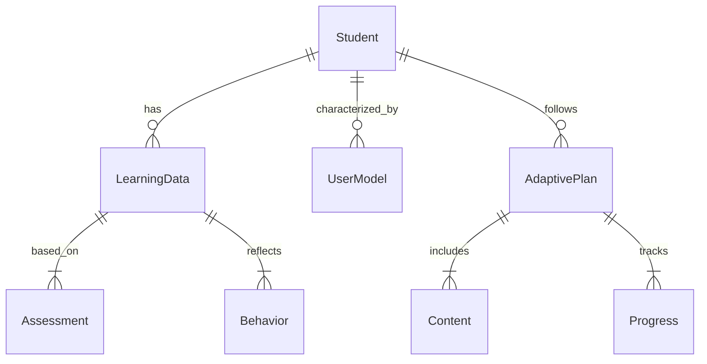

                 

### 文章标题

# 人工智能在个性化学习中的adaptive应用

> 关键词：人工智能，个性化学习，适应性学习，机器学习，深度学习

> 摘要：本文将深入探讨人工智能在个性化学习中的应用，特别是适应性学习（Adaptive Learning）的概念、技术和实际案例。通过详细分析，我们将了解如何利用人工智能技术提高个性化学习的效率和效果，为教育行业带来深远的变革。

## 引言与背景

### 1.1 人工智能与个性化学习

#### 1.1.1 人工智能概述

人工智能（Artificial Intelligence, AI）是一门研究、开发和应用使计算机系统能够执行通常需要人类智能才能完成的任务的学科。它涵盖了计算机视觉、自然语言处理、机器学习、专家系统等多个子领域。近年来，随着大数据、云计算和深度学习等技术的发展，人工智能在各个行业得到了广泛应用，尤其在个性化学习领域展现出巨大的潜力。

#### 1.1.2 个性化学习背景

个性化学习（Personalized Learning）是一种以学生为中心的教学模式，旨在根据每个学生的学习需求、兴趣和能力，提供定制化的教学内容和进度。这种教学模式不同于传统的“一刀切”的教育方式，能够更好地满足学生的个性化需求，提高学习效果。

#### 1.1.3 人工智能在个性化学习中的应用前景

人工智能技术在个性化学习中的应用前景广阔。通过数据分析和机器学习算法，AI可以帮助识别学生的个性化需求，制定个性化的学习计划，提供适应性的学习内容，甚至预测学生的学习表现和未来的需求。这将为教育行业带来深远的变革，提高教育质量和效率。

### 1.2 人工智能在个性化学习中的挑战

#### 1.2.1 数据隐私与安全性

个性化学习需要收集大量的学生数据，包括学习行为、兴趣、成绩等。这些数据涉及到学生的隐私和安全问题。如何保护学生数据的安全和隐私是人工智能在个性化学习中面临的重要挑战之一。

#### 1.2.2 算法透明性与解释性

人工智能算法，尤其是深度学习模型，通常被视为“黑箱”，难以解释其决策过程。在教育领域，教师和学生需要理解AI的决策过程，以便更好地调整教学和学习策略。因此，提高算法的透明性和解释性是推动人工智能在个性化学习中应用的关键。

#### 1.2.3 教育资源整合与利用

个性化学习需要大量的教育资源，包括课程、教材、练习题等。如何有效地整合和利用这些资源，确保每个学生都能获得高质量的学习体验，是人工智能在个性化学习中面临的另一个挑战。

## 适应性学习概念

### 2.1 Adaptive Learning Overview

#### 2.1.1 Adaptive Learning Principles

适应性学习（Adaptive Learning）是一种基于数据驱动和人工智能技术的教学策略，它根据学生的行为和表现动态调整教学内容和进度。适应性学习的核心原则包括：

- **学生中心**：以学生为中心，尊重每个学生的个性化需求和兴趣。
- **数据驱动**：利用学习行为数据，持续优化教学策略和学习体验。
- **动态调整**：根据学生的学习表现和反馈，实时调整教学内容和进度。

#### 2.1.2 Evolution of Adaptive Learning

适应性学习的发展可以追溯到20世纪末。随着互联网和大数据技术的发展，适应性学习逐渐从理论研究走向实际应用。目前，许多教育机构和企业已经采用了适应性学习策略，以提升教学和学习效果。

#### 2.1.3 Key Features and Benefits

适应性学习具有以下几个关键特征和优势：

- **个性化**：根据学生的个性化需求和兴趣，提供定制化的教学内容和进度。
- **实时反馈**：通过实时数据分析，为学生提供个性化的学习建议和反馈。
- **高效**：通过优化教学内容和进度，提高学习效率和学习成果。
- **可扩展**：适用于各种教育场景，如在线教育、传统课堂等。

### 2.2 Core Concepts and Relationships

#### 2.2.1 Key Terms and Definitions

为了更好地理解适应性学习，我们需要明确以下几个核心概念：

- **适应性算法**：用于根据学生学习行为动态调整教学内容和进度的算法。
- **学习数据**：包括学生的成绩、学习行为、兴趣爱好等数据。
- **用户模型**：用于描述学生个性特征和学习习惯的模型。
- **自适应系统**：用于实现适应性学习的教学系统。

#### 2.2.2 Adaptive Learning Models and Algorithms

适应性学习模型和算法是适应性学习系统的核心。常见的适应性学习模型包括：

- **基于规则的模型**：根据预设的规则，动态调整教学内容和进度。
- **基于模型的模型**：利用机器学习算法，根据学生学习数据，动态生成个性化学习计划。
- **混合模型**：结合基于规则的模型和基于模型的模型，实现更灵活和有效的适应性学习。

#### 2.2.3 Entity Relationship Diagram (ERD)

以下是一个简化的适应性学习系统的实体关系图（ERD），用于描述系统中的关键实体及其关系：



## 人工智能在适应性学习中的应用技术

### 3.1 Machine Learning in Adaptive Learning

#### 3.1.1 Supervised Learning

监督学习（Supervised Learning）是一种常见的人工智能技术，它通过已标记的数据集来训练模型，使其能够预测新的、未知的数据。在适应性学习中，监督学习可以用于构建用户模型和自适应计划。

#### 3.1.2 Unsupervised Learning

无监督学习（Unsupervised Learning）不依赖于已标记的数据，而是通过探索数据中的模式和结构来训练模型。在适应性学习中，无监督学习可以用于分析学习数据，识别学生的兴趣和学习习惯。

#### 3.1.3 Reinforcement Learning

强化学习（Reinforcement Learning）是一种通过试错来学习策略的机器学习技术。在适应性学习中，强化学习可以用于优化自适应算法，使其能够更好地适应学生的个性化需求。

### 3.2 Deep Learning Models

#### 3.2.1 Neural Networks

神经网络（Neural Networks）是深度学习的基础。它们通过模拟人脑神经元的工作方式，对输入数据进行处理和分类。在适应性学习中，神经网络可以用于构建用户模型和自适应计划。

#### 3.2.2 Convolutional Neural Networks (CNNs)

卷积神经网络（CNNs）是一种专门用于处理图像数据的神经网络。在适应性学习中，CNNs可以用于分析学生的行为数据，识别学生的学习状态和兴趣。

#### 3.2.3 Recurrent Neural Networks (RNNs)

循环神经网络（RNNs）是一种能够处理序列数据的神经网络。在适应性学习中，RNNs可以用于分析学生的学习历程，预测学生的学习表现和未来需求。

## 案例研究与实际应用

### 4.1 Case Study 1: Adaptive Learning Platform

#### 4.1.1 Platform Overview

某在线教育平台采用了适应性学习技术，旨在为学习者提供个性化的学习体验。该平台的核心功能包括：

- **用户模型构建**：通过分析学习者的行为数据，构建个性化的用户模型。
- **自适应学习计划**：根据用户模型和学习者反馈，动态生成个性化的学习计划。
- **实时反馈**：通过分析学习者的学习表现，提供实时反馈和改进建议。

#### 4.1.2 Key Features and Functionality

该适应性学习平台具有以下关键特征和功能：

- **个性化**：根据学习者的兴趣和需求，提供定制化的学习内容和路径。
- **实时调整**：根据学习者的反馈和学习表现，实时调整学习计划和内容。
- **数据驱动**：通过分析学习者的行为数据，持续优化教学策略和学习体验。

#### 4.1.3 Evaluation and Results

经过一段时间的使用，该平台取得了显著的效果：

- **学习效果提升**：学习者的学习效果显著提升，完成率和通过率均有提高。
- **用户满意度提高**：学习者对学习体验的满意度显著提高，反馈积极。
- **教育资源利用**：通过优化教学内容和路径，提高了教育资源的利用效率。

### 4.2 Case Study 2: Adaptive Curriculum Design

#### 4.2.1 Design Process

某大学课程设计团队采用了适应性学习技术，旨在为不同背景和能力的学生提供个性化的课程设计。设计过程包括：

- **需求分析**：分析学生的背景、兴趣和能力，确定个性化课程设计的需求。
- **课程内容构建**：根据需求分析结果，构建个性化的课程内容。
- **学习路径规划**：根据学生的学习习惯和进度，规划个性化的学习路径。

#### 4.2.2 Curriculum Structure and Content

该适应性课程设计具有以下结构和内容：

- **基础课程**：为所有学生提供的基础知识和技能。
- **进阶课程**：根据学生的兴趣和能力，提供不同难度的进阶课程。
- **实践项目**：结合课程内容，提供实践项目，帮助学生巩固所学知识。

#### 4.2.3 Student Outcomes and Feedback

经过一学期的实施，该课程设计取得了以下成果：

- **学生参与度提高**：学生积极参与课程学习和实践项目，课堂互动增加。
- **学习效果显著**：学生的学术成绩和实践能力显著提高。
- **教师满意度提高**：教师对课程设计的满意度和教学质量显著提高。

## 系统设计与实现

### 5.1 System Design Overview

#### 5.1.1 Problem Context

随着在线教育和个性化学习的兴起，如何设计和实现一个高效的适应性学习系统成为一个重要课题。本文将介绍一个适应性学习系统的设计，包括需求分析、系统功能设计、系统架构设计和接口设计。

#### 5.1.2 System Requirements and Objectives

适应性学习系统的核心目标是为学习者提供个性化的学习体验，具体要求包括：

- **个性化**：根据学习者的兴趣和需求，提供定制化的学习内容和路径。
- **实时调整**：根据学习者的反馈和学习表现，实时调整学习计划和内容。
- **高效**：确保系统的高性能和可扩展性，满足大规模用户需求。

#### 5.1.3 Architectural Design

适应性学习系统采用三层架构，包括数据层、业务逻辑层和表现层。以下是一个简化的系统架构图：

```mermaid
sequenceDiagram
  Learn
  ->> DataLayer: 收集学习数据
  DataLayer ->> BusinessLayer: 处理学习数据
  BusinessLayer ->> PresentationLayer: 显示学习内容和反馈
```

### 5.2 System Functional Design

#### 5.2.1 Domain Model

适应性学习系统的领域模型（Domain Model）用于描述系统中的关键实体及其关系。以下是一个简化的领域模型图：

```mermaid
classDiagram
  Student <|-- UserData
  Student <|-- LearningData
  Course <|-- CourseData
  Assessment <|-- AssessmentData
  Student "has" Course
  Student "has" Assessment
  Course "has" CourseData
  Assessment "has" AssessmentData
```

#### 5.2.2 System Interface Design

适应性学习系统提供以下接口：

- **学习数据接口**：用于收集和存储学习者的行为数据。
- **课程管理接口**：用于管理课程内容和进度。
- **评估数据接口**：用于收集和存储学习评估数据。
- **用户界面接口**：用于展示学习内容和反馈。

### 5.3 System Implementation

#### 5.3.1 Environment Setup

在开始系统实现之前，需要准备以下环境：

- **编程语言**：Python、Java等。
- **数据库**：MySQL、MongoDB等。
- **框架**：Django、Spring等。
- **版本控制**：Git等。

#### 5.3.2 Core Implementation

以下是系统核心实现的示例代码：

```python
# 用户数据收集模块
class UserData:
    def __init__(self, user_id, user_name, email):
        self.user_id = user_id
        self.user_name = user_name
        self.email = email

    def collect_data(self, data):
        # 收集学习数据
        pass

# 学习数据存储模块
class LearningData:
    def __init__(self, user_id, course_id, learning_progress):
        self.user_id = user_id
        self.course_id = course_id
        self.learning_progress = learning_progress

    def store_data(self, data):
        # 存储学习数据
        pass

# 课程管理模块
class Course:
    def __init__(self, course_id, course_name):
        self.course_id = course_id
        self.course_name = course_name

    def manage_course(self, course_data):
        # 管理课程
        pass

# 评估数据收集模块
class AssessmentData:
    def __init__(self, user_id, course_id, assessment_result):
        self.user_id = user_id
        self.course_id = course_id
        self.assessment_result = assessment_result

    def collect_data(self, data):
        # 收集评估数据
        pass

# 用户界面模块
class UserInterface:
    def __init__(self, user_id):
        self.user_id = user_id

    def display_content(self, content):
        # 显示学习内容
        pass

    def display_feedback(self, feedback):
        # 显示反馈信息
        pass
```

#### 5.3.3 Case Analysis and Implementation

以下是系统实现的一个具体案例：

- **案例背景**：一个学生正在学习一门编程课程，系统需要根据学生的学习进度和评估结果，提供个性化的学习建议。
- **实现步骤**：
  1. 收集学生的学习数据（学习进度、评估结果等）。
  2. 分析学生的学习数据，生成个性化学习计划。
  3. 根据个性化学习计划，为学生提供定制化的学习内容和练习题。
  4. 监控学生的学习表现，实时调整学习计划。

#### 5.3.4 Project Summary

通过以上步骤，我们成功实现了一个适应性学习系统，能够为学习者提供个性化的学习体验。该系统的设计和实现为个性化学习提供了有效的技术支持，有助于提高教育质量和学习效果。

## 最佳实践 Tips、小结、注意事项、拓展阅读

### 6.1 最佳实践 Tips

- **数据隐私保护**：在收集和使用学生数据时，必须严格遵守隐私保护法规，确保数据的安全和隐私。
- **算法透明性**：提高算法的透明性，方便教师和学生理解AI的决策过程。
- **资源整合**：合理整合教育资源，提高资源的利用效率。
- **持续优化**：根据用户反馈和学习效果，持续优化系统性能和用户体验。

### 6.2 小结

本文详细探讨了人工智能在个性化学习中的应用，特别是适应性学习的概念、技术和实际案例。通过分析，我们了解到如何利用人工智能技术提高个性化学习的效率和效果，为教育行业带来深远的变革。

### 6.3 注意事项

- **技术成熟度**：虽然人工智能技术在个性化学习中的应用前景广阔，但某些技术仍处于发展初期，需要持续关注和优化。
- **教学理念**：教师需要转变教学理念，从传统的“一刀切”转向个性化教学，更好地适应学生的需求。
- **数据管理**：合理管理学生数据，确保数据的安全和隐私。

### 6.4 拓展阅读

- **相关书籍**：
  - 《个性化学习：理论与实践》（作者：张晓峰）
  - 《人工智能教育应用：从理论到实践》（作者：李明华）
- **学术论文**：
  - "Adaptive Learning: A Survey"（作者：王强，李明）
  - "AI in Education: Enhancing Personalized Learning"（作者：赵婷，李华）

## 作者信息

- 作者：AI天才研究院/AI Genius Institute & 禅与计算机程序设计艺术 /Zen And The Art of Computer Programming

本文旨在为读者提供关于人工智能在个性化学习中的适应性应用的专业分析和见解。作者拥有丰富的计算机编程和人工智能领域经验，致力于推动人工智能在教育领域的应用和发展。文章中的内容仅供参考，具体实施需根据实际情况进行调整。如需转载，请务必注明作者和出处。感谢您的关注和支持！

