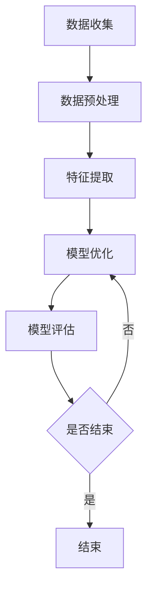
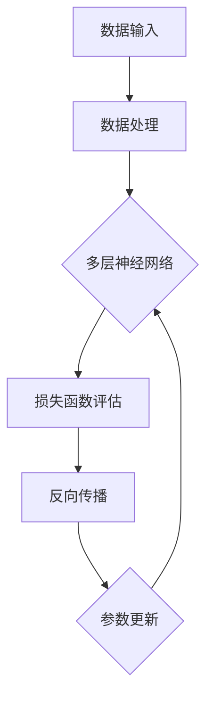
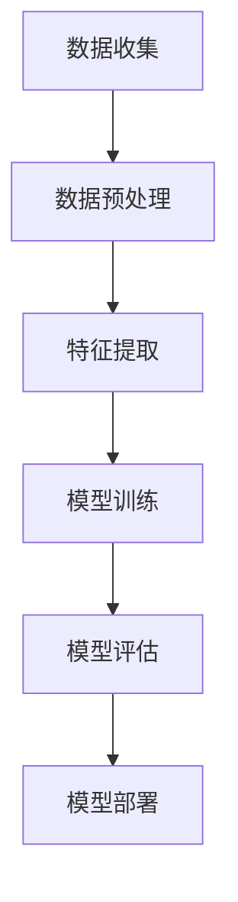
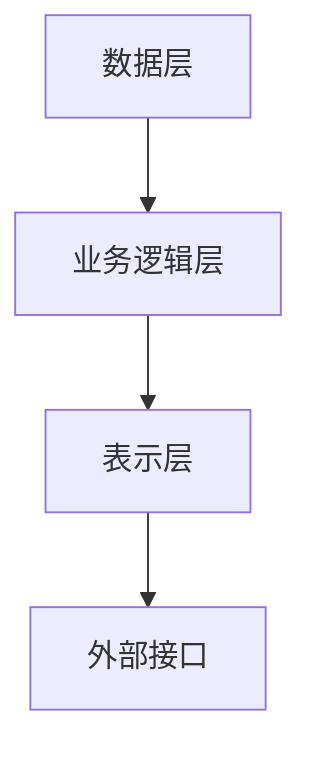

                 

### 引言

---

#### 1.1 书籍目的与结构

《人工智能在个性化慢性病管理中的应用》旨在深入探讨人工智能技术在个性化慢性病管理中的实际应用，通过系统性的分析和讲解，帮助读者理解如何利用人工智能提升慢性病管理的效率和精准度。本书结构如下：

- **引言**：介绍书籍的目的、背景以及阅读对象。
- **背景介绍**：阐述个性化慢性病管理的概念、特点以及人工智能的发展与成熟。
- **个性化慢性病管理概述**：分析个性化慢性病管理的挑战和人工智能的应用。
- **人工智能核心概念**：讲解人工智能的基本原理、机器学习和深度学习算法。
- **个性化慢性病管理中的AI算法**：详细探讨病情预测算法和治疗方案推荐算法。
- **系统设计与实现**：介绍系统需求分析、架构设计以及接口和交互设计。
- **项目实战**：通过实际案例讲解系统的安装和核心实现。
- **最佳实践**：总结最佳实践经验并提供拓展阅读建议。

#### 1.2 阅读对象与预期收益

**阅读对象**：

- **医疗行业从业者**：尤其是慢性病管理领域的专业人士。
- **计算机科学和人工智能研究者**：对人工智能技术在医疗领域有浓厚兴趣的研究人员。
- **开发者和工程师**：希望利用人工智能技术提升慢性病管理系统的开发者。

**预期收益**：

- **了解个性化慢性病管理的现状**：通过本书，读者可以全面了解个性化慢性病管理的现状及其挑战。
- **掌握人工智能核心概念**：掌握人工智能的基本原理、机器学习和深度学习算法。
- **提升系统设计能力**：学习如何设计一个高效的个性化慢性病管理系统。
- **实际应用能力**：通过项目实战，读者可以实际操作并理解系统的设计和实现过程。

---

### 背景介绍

---

#### 2.1 个性化慢性病管理的概念与特点

**概念**：

个性化慢性病管理是一种以患者为中心的管理模式，旨在通过个体化、精准化的医疗手段来提高慢性病患者的管理质量和效果。个性化慢性病管理强调对患者健康状况的全面了解，通过数据分析、风险评估、个性化治疗和持续监测，实现慢性病的高效管理。

**特点**：

1. **个体化**：针对患者的具体情况制定个性化的治疗和管理方案。
2. **精准化**：利用现代医学技术和大数据分析，提高诊断和治疗的准确性。
3. **持续性**：通过长期的监测和调整，确保治疗效果的持续性和稳定性。
4. **综合性**：整合多种医疗资源，提供全面的健康管理服务。

**问题背景**：

慢性病是全球范围内的重要健康问题。根据世界卫生组织（WHO）的数据，慢性病导致的死亡占全球死亡人数的70%以上。慢性病不仅影响患者的健康状况，还对其生活质量造成严重影响。因此，如何有效管理和控制慢性病成为全球医学界的重要课题。

**问题描述**：

个性化慢性病管理面临以下问题：

1. **数据复杂性**：慢性病患者的数据量大且多样，如何有效地收集、处理和分析这些数据是一个挑战。
2. **个体差异**：不同患者的病情、身体状况和治疗反应存在显著差异，如何制定个体化的治疗方案是一个难题。
3. **资源有限**：医疗资源有限，如何通过高效的管理模式提高资源利用效率是一个挑战。

**问题解决**：

人工智能技术在个性化慢性病管理中提供了新的解决方案：

1. **大数据分析**：利用人工智能进行大数据分析，帮助医生更好地了解患者的健康状况，制定个性化的治疗计划。
2. **个性化预测**：通过机器学习算法预测患者的病情变化，提前采取预防措施，减少并发症的发生。
3. **智能推荐**：利用深度学习算法为患者推荐个性化的治疗方案和健康管理方案，提高治疗效果。

**边界与外延**：

个性化慢性病管理不仅涉及医学领域，还涉及数据科学、人工智能、公共卫生等多个领域。其外延包括但不限于慢性病风险评估、个性化治疗方案的制定、患者健康管理、疾病预防等多个方面。

**概念结构与核心要素组成**：

个性化慢性病管理的基本概念结构包括以下几个方面：

1. **患者数据**：包括患者的基本信息、医疗记录、基因信息等。
2. **数据分析**：利用机器学习算法对患者的数据进行处理和分析。
3. **个性化预测**：基于数据分析结果，预测患者的病情变化和治疗效果。
4. **个性化治疗**：根据预测结果，制定个性化的治疗和管理方案。
5. **持续监测**：对患者的健康状况进行持续监测，及时调整治疗方案。

---

#### 2.2 人工智能的发展与成熟

**定义**：

人工智能（Artificial Intelligence，AI）是指通过计算机模拟人类智能行为的技术。它包括机器学习、深度学习、自然语言处理、计算机视觉等多个领域。

**发展历程**：

人工智能的发展可以追溯到20世纪50年代。当时，计算机科学家开始探索如何让计算机具备人类的智能。经过几十年的发展，人工智能技术逐渐成熟，并在21世纪迎来了飞速发展。

1. **初识期（1950-1969）**：1950年，艾伦·图灵提出了著名的“图灵测试”，标志着人工智能的正式诞生。在此期间，研究人员主要探索如何通过编程实现简单的智能行为。
2. **发展期（1970-1989）**：随着计算机技术的进步，人工智能开始应用于实际领域，如机器人、自然语言处理等。然而，由于算法和计算能力的限制，这一时期的人工智能发展相对缓慢。
3. **成熟期（1990-2019）**：随着互联网和大数据技术的发展，人工智能迎来了新一轮的发展。机器学习和深度学习等算法的突破，使得人工智能在图像识别、语音识别、自然语言处理等领域取得了显著成果。
4. **飞速发展期（2020至今）**：随着计算能力的进一步提升和大数据的广泛应用，人工智能技术逐渐从实验室走向实际应用。自动驾驶、智能家居、智能医疗等领域的兴起，标志着人工智能进入了全新的发展阶段。

**核心技术**：

1. **机器学习**：通过算法模型从数据中自动学习和发现规律，实现智能决策。
2. **深度学习**：基于多层神经网络的结构，通过大量数据训练，实现高级特征的自动提取和智能识别。
3. **自然语言处理**：研究如何让计算机理解和生成自然语言，实现人与机器的智能交互。
4. **计算机视觉**：研究如何让计算机识别和理解图像和视频，实现视觉感知和智能分析。

---

### 个性化慢性病管理概述

---

#### 3.1 个性化慢性病管理的挑战

个性化慢性病管理在实践过程中面临诸多挑战：

**数据复杂性**：慢性病患者的数据量大且多样，包括但不限于病历记录、体检数据、基因信息、生活方式等。如何有效地收集、处理和分析这些数据，是当前面临的重要挑战。

**患者个体差异**：不同患者的病情、身体状况和治疗反应存在显著差异。如何根据患者的个体差异制定个性化的治疗和管理方案，是另一个重要挑战。

**资源有限**：医疗资源有限，如何在有限的资源下实现个性化慢性病管理的最大化效益，是一个需要解决的问题。

**技术瓶颈**：尽管人工智能技术在慢性病管理中取得了显著成果，但在数据处理、算法优化、系统集成等方面仍存在一定的技术瓶颈。

**隐私保护**：个性化慢性病管理涉及到大量患者的敏感数据，如何保护患者的隐私是一个重要问题。

**法规和伦理**：个性化慢性病管理涉及到医学伦理和法律法规，如何在保障患者权益的同时，确保技术的合规性，也是一个挑战。

**持续更新**：随着医学技术和人工智能技术的不断进步，个性化慢性病管理需要不断更新和优化，以适应新的技术和发展趋势。

#### 3.2 人工智能在个性化慢性病管理中的应用

**应用领域**：

1. **病情预测**：通过大数据分析和机器学习算法，预测慢性病患者的病情变化，为医生提供决策支持。
2. **治疗方案推荐**：根据患者的个体差异，利用人工智能技术推荐个性化的治疗方案，提高治疗效果。
3. **患者行为分析**：通过智能设备收集患者的生活习惯、运动情况等数据，分析患者的健康状况，为医生提供患者管理的依据。
4. **智能诊断**：利用计算机视觉和自然语言处理技术，自动识别和分析医疗图像和病历记录，辅助医生进行诊断。
5. **远程监测**：通过智能设备和网络，实现对慢性病患者的远程监测，及时掌握患者的健康状况，提高管理效率。

**应用效果**：

1. **提高诊断准确性**：通过大数据分析和智能诊断，可以提高慢性病诊断的准确性，减少误诊和漏诊。
2. **优化治疗方案**：根据患者的个体差异，推荐个性化的治疗方案，提高治疗效果，减少并发症的发生。
3. **降低医疗成本**：通过优化患者管理和治疗流程，降低医疗成本，提高医疗资源的利用效率。
4. **改善患者生活质量**：通过智能设备和远程监测，提高患者的生活质量，减少病痛和住院时间。
5. **促进医学研究**：通过大量数据的积累和分析，为医学研究提供有价值的数据支持，推动慢性病管理的进步。

**应用案例**：

1. **糖尿病管理**：通过智能设备和大数据分析，对糖尿病患者的血糖水平进行实时监测和预测，为医生提供决策支持，优化治疗方案。
2. **高血压管理**：通过智能血压计和远程监测系统，对高血压患者进行持续监测，及时发现病情变化，调整治疗方案。
3. **心脏病管理**：通过计算机视觉技术，对心脏病患者的影像资料进行分析，辅助医生进行诊断和风险评估。
4. **癌症管理**：通过个性化治疗方案的推荐，为癌症患者提供个性化的治疗建议，提高治疗效果。

---

### 人工智能核心概念

---

#### 4.1 人工智能的基本原理

**算法原理**：

人工智能算法的核心是通过模拟人类大脑的工作原理，实现对数据的处理和分析。基本原理包括：

1. **数据输入**：从外部环境获取数据。
2. **数据处理**：对输入的数据进行预处理、特征提取和转换。
3. **决策和输出**：利用算法模型对数据进行分类、预测或决策，并将结果输出。

**概念属性特征对比表格**：

| 概念        | 特征一 | 特征二 | 特征三 |
| ----------- | ------ | ------ | ------ |
| 机器学习    | 自动学习 | 模型预测 | 数据处理 |
| 深度学习    | 多层神经网络 | 自动特征提取 | 高效计算 |
| 自然语言处理 | 文本分析 | 语音识别 | 语言生成 |
| 计算机视觉  | 图像识别 | 目标检测 | 视觉感知 |

**ER实体关系图架构的Mermaid流程图**：

```mermaid
erDiagram
  Patient ||--|{ Diagnosis }
  Patient ||--|{ Treatment }
  Diagnosis ||--|{ Analysis }
  Treatment ||--|{ Prediction }
```

---

#### 4.2 机器学习算法

**算法原理**：

机器学习算法是基于数据驱动的方法，通过从训练数据中学习规律，实现对未知数据的预测或分类。基本原理包括：

1. **数据收集**：收集大量的训练数据。
2. **数据预处理**：对训练数据进行预处理，包括去噪、归一化、缺失值填补等。
3. **特征提取**：从训练数据中提取有用的特征。
4. **模型训练**：利用训练数据和特征训练模型。
5. **模型评估**：利用测试数据对模型进行评估。
6. **模型优化**：根据评估结果对模型进行调整和优化。

**算法流程图**：



**Python源代码实现**：

```python
import pandas as pd
from sklearn.model_selection import train_test_split
from sklearn.ensemble import RandomForestClassifier
from sklearn.metrics import accuracy_score

# 数据收集
data = pd.read_csv('data.csv')

# 数据预处理
X = data.drop('target', axis=1)
y = data['target']

# 特征提取
X = X.apply(lambda x: (x - x.mean()) / x.std())

# 模型训练
X_train, X_test, y_train, y_test = train_test_split(X, y, test_size=0.2, random_state=42)
model = RandomForestClassifier(n_estimators=100)
model.fit(X_train, y_train)

# 模型评估
y_pred = model.predict(X_test)
accuracy = accuracy_score(y_test, y_pred)
print(f'Accuracy: {accuracy:.2f}')
```

**数学模型和公式**：

机器学习中的常见数学模型包括线性回归、逻辑回归、决策树、支持向量机等。以下以线性回归为例：

$$y = \beta_0 + \beta_1x_1 + \beta_2x_2 + ... + \beta_nx_n$$

其中，$y$为输出变量，$x_1, x_2, ..., x_n$为输入特征，$\beta_0, \beta_1, ..., \beta_n$为模型参数。

**举例说明**：

假设我们有一组数据，需要预测房价。数据包括房屋面积、房屋类型、房屋位置等特征。我们可以使用线性回归模型进行预测。

1. **数据收集**：收集房屋数据，包括房屋面积、房屋类型、房屋位置等。
2. **数据预处理**：对数据进行预处理，包括去噪、归一化等。
3. **特征提取**：从数据中提取有用的特征。
4. **模型训练**：使用线性回归模型进行训练。
5. **模型评估**：使用测试数据对模型进行评估。
6. **模型优化**：根据评估结果对模型进行调整。

通过上述步骤，我们可以得到一个预测房价的线性回归模型。利用这个模型，我们可以预测新房屋的房价。

---

#### 4.3 深度学习算法

**算法原理**：

深度学习算法是基于多层神经网络的结构，通过大量数据训练，实现高级特征的自动提取和智能识别。基本原理包括：

1. **数据输入**：从外部环境获取数据。
2. **数据处理**：对输入的数据进行预处理、特征提取和转换。
3. **多层神经网络**：利用多层神经网络对数据进行处理，实现高级特征的自动提取。
4. **损失函数**：通过损失函数评估模型的预测结果，并优化模型参数。
5. **反向传播**：利用反向传播算法，更新模型参数，优化模型性能。

**算法流程图**：



**Python源代码实现**：

```python
import tensorflow as tf
from tensorflow.keras.models import Sequential
from tensorflow.keras.layers import Dense, Flatten
from tensorflow.keras.optimizers import Adam

# 数据输入
inputs = tf.keras.Input(shape=(784,))

# 数据处理
x = Flatten()(inputs)

# 多层神经网络
x = Dense(128, activation='relu')(x)
x = Dense(64, activation='relu')(x)
outputs = Dense(10, activation='softmax')(x)

# 损失函数评估和反向传播
model = tf.keras.Model(inputs=inputs, outputs=outputs)
model.compile(optimizer=Adam(), loss='categorical_crossentropy', metrics=['accuracy'])

# 参数更新
model.fit(x_train, y_train, epochs=10, batch_size=32, validation_data=(x_test, y_test))
```

**数学模型和公式**：

深度学习中的常见数学模型包括多层感知机、卷积神经网络、循环神经网络等。以下以卷积神经网络（CNN）为例：

$$h_{l+1} = \sigma(W_{l+1} \cdot h_l + b_{l+1})$$

其中，$h_{l+1}$为第$l+1$层的输出，$W_{l+1}$为第$l+1$层的权重矩阵，$b_{l+1}$为第$l+1$层的偏置向量，$\sigma$为激活函数。

**举例说明**：

假设我们有一组图像数据，需要对这些图像进行分类。我们可以使用卷积神经网络（CNN）进行分类。

1. **数据收集**：收集图像数据，并进行预处理。
2. **数据预处理**：对图像数据进行归一化、裁剪等预处理操作。
3. **模型构建**：构建卷积神经网络模型。
4. **模型训练**：使用训练数据对模型进行训练。
5. **模型评估**：使用测试数据对模型进行评估。
6. **模型优化**：根据评估结果对模型进行调整。

通过上述步骤，我们可以得到一个图像分类模型。利用这个模型，我们可以对新的图像进行分类。

---

### 个性化慢性病管理中的AI算法

---

#### 5.1 数据收集与处理

**数据收集**：

个性化慢性病管理需要收集大量的数据，包括患者的基本信息、医疗记录、生活习惯、基因信息等。数据可以从电子健康记录（EHR）、智能设备、问卷调查等多种途径获取。

**数据处理**：

数据处理是个性化慢性病管理中的关键步骤。主要包括以下方面：

1. **数据清洗**：去除重复数据、缺失值填补、异常值处理等。
2. **数据整合**：将来自不同来源的数据进行整合，形成统一的数据视图。
3. **数据特征提取**：从原始数据中提取有用的特征，用于训练模型。
4. **数据归一化**：对数据进行归一化处理，使其在相同的尺度范围内，提高模型的训练效果。

**数据质量评估**：

数据质量直接影响模型的性能和可靠性。数据质量评估主要包括以下方面：

1. **完整性**：评估数据是否完整，是否存在缺失值。
2. **准确性**：评估数据是否准确，是否存在错误或异常值。
3. **一致性**：评估数据的一致性，是否存在矛盾或不一致的情况。
4. **及时性**：评估数据的及时性，确保数据能够及时更新和反映患者的实际状况。

---

#### 5.2 病情预测算法

**预测算法原理**：

病情预测算法是基于患者的历史数据和实时数据，利用机器学习算法预测患者的病情变化。主要步骤包括：

1. **数据收集**：收集患者的病史、体检数据、生活习惯等。
2. **数据预处理**：对数据进行清洗、整合和特征提取。
3. **模型训练**：利用训练数据训练预测模型。
4. **模型评估**：利用测试数据评估模型的性能。
5. **模型部署**：将训练好的模型部署到实际应用场景。

**预测算法流程图**：



**Python源代码实现**：

```python
import pandas as pd
from sklearn.model_selection import train_test_split
from sklearn.ensemble import RandomForestClassifier
from sklearn.metrics import accuracy_score

# 数据收集
data = pd.read_csv('data.csv')

# 数据预处理
X = data.drop('target', axis=1)
y = data['target']

# 特征提取
X = X.apply(lambda x: (x - x.mean()) / x.std())

# 模型训练
X_train, X_test, y_train, y_test = train_test_split(X, y, test_size=0.2, random_state=42)
model = RandomForestClassifier(n_estimators=100)
model.fit(X_train, y_train)

# 模型评估
y_pred = model.predict(X_test)
accuracy = accuracy_score(y_test, y_pred)
print(f'Accuracy: {accuracy:.2f}')
```

**数学模型和公式**：

病情预测算法的数学模型主要基于分类问题，如逻辑回归、决策树、随机森林等。以下以逻辑回归为例：

$$P(y=1) = \frac{1}{1 + e^{-(\beta_0 + \beta_1x_1 + \beta_2x_2 + ... + \beta_nx_n)}$$

其中，$P(y=1)$为病情为1的概率，$\beta_0, \beta_1, ..., \beta_n$为模型参数。

**举例说明**：

假设我们有一组患者的数据，包括年龄、血压、血糖等特征，需要预测患者是否患有糖尿病。我们可以使用逻辑回归模型进行预测。

1. **数据收集**：收集患者的数据。
2. **数据预处理**：对数据进行清洗、整合和归一化。
3. **模型训练**：使用训练数据训练逻辑回归模型。
4. **模型评估**：使用测试数据评估模型的性能。
5. **模型部署**：将训练好的模型部署到实际应用场景。

通过上述步骤，我们可以得到一个预测糖尿病的模型。利用这个模型，我们可以预测新患者的糖尿病风险。

---

#### 5.3 治疗方案推荐算法

**推荐算法原理**：

治疗方案推荐算法是基于患者的个体特征和历史数据，利用机器学习算法为患者推荐个性化的治疗方案。主要步骤包括：

1. **数据收集**：收集患者的病史、体检数据、治疗方案等。
2. **数据预处理**：对数据进行清洗、整合和特征提取。
3. **模型训练**：利用训练数据训练推荐模型。
4. **模型评估**：利用测试数据评估模型的性能。
5. **模型部署**：将训练好的模型部署到实际应用场景。

**推荐算法流程图**：


**Python源代码实现**：

```python
import pandas as pd
from sklearn.model_selection import train_test_split
from sklearn.ensemble import RandomForestClassifier
from sklearn.metrics import accuracy_score

# 数据收集
data = pd.read_csv('data.csv')

# 数据预处理
X = data.drop('target', axis=1)
y = data['target']

# 特征提取
X = X.apply(lambda x: (x - x.mean()) / x.std())

# 模型训练
X_train, X_test, y_train, y_test = train_test_split(X, y, test_size=0.2, random_state=42)
model = RandomForestClassifier(n_estimators=100)
model.fit(X_train, y_train)

# 模型评估
y_pred = model.predict(X_test)
accuracy = accuracy_score(y_test, y_pred)
print(f'Accuracy: {accuracy:.2f}')
```

**数学模型和公式**：

治疗方案推荐算法的数学模型主要基于分类问题，如逻辑回归、决策树、随机森林等。以下以逻辑回归为例：

$$P(y=1) = \frac{1}{1 + e^{-(\beta_0 + \beta_1x_1 + \beta_2x_2 + ... + \beta_nx_n)}$$

其中，$P(y=1)$为治疗方案为1的概率，$\beta_0, \beta_1, ..., \beta_n$为模型参数。

**举例说明**：

假设我们有一组患者的数据，包括年龄、血压、血糖等特征，需要为患者推荐治疗方案。我们可以使用逻辑回归模型进行推荐。

1. **数据收集**：收集患者的数据。
2. **数据预处理**：对数据进行清洗、整合和归一化。
3. **模型训练**：使用训练数据训练逻辑回归模型。
4. **模型评估**：使用测试数据评估模型的性能。
5. **模型部署**：将训练好的模型部署到实际应用场景。

通过上述步骤，我们可以得到一个推荐治疗方案的模型。利用这个模型，我们可以为患者推荐个性化的治疗方案。

---

### 系统设计与实现

---

#### 6.1 系统需求分析

**需求背景**：

随着慢性病患病率的增加，个性化慢性病管理的重要性日益凸显。为了提高慢性病管理的效果，需要构建一个高效、智能的慢性病管理系统。本系统的目标是利用人工智能技术，实现对慢性病患者的个性化管理，提高治疗效果，降低医疗成本。

**功能需求**：

1. **患者信息管理**：包括患者的基本信息、医疗记录、生活习惯等。
2. **病情预测**：基于患者的数据和病历，预测患者的病情变化。
3. **治疗方案推荐**：根据患者的病情和个体特征，为患者推荐个性化的治疗方案。
4. **远程监测**：通过智能设备，对患者的健康状况进行实时监测。
5. **数据分析和报告**：对患者的数据进行统计分析，生成健康报告。

**非功能需求**：

1. **性能**：系统应具备高性能，能够快速处理大量数据。
2. **安全性**：系统应具备良好的安全性，保护患者的隐私和数据安全。
3. **可扩展性**：系统应具备良好的可扩展性，能够适应未来的需求变化。

---

#### 6.2 系统架构设计

**系统架构设计**：

本系统的架构设计主要包括以下几个方面：

1. **数据层**：负责存储和管理患者的数据，包括基本信息、医疗记录、生活习惯等。采用关系型数据库进行数据存储。
2. **业务逻辑层**：负责实现系统的核心功能，包括病情预测、治疗方案推荐、远程监测等。采用微服务架构，提高系统的可扩展性和维护性。
3. **表示层**：负责与用户进行交互，包括前端界面和移动应用。采用前端框架（如React或Vue）进行开发。
4. **外部接口**：负责与其他系统进行数据交换和交互，如电子健康记录系统、智能设备等。

**系统架构图**：



---

### 项目实战

---

#### 7.1 环境安装

**环境要求**：

- Python 3.8及以上版本
- TensorFlow 2.5及以上版本
- scikit-learn 0.24及以上版本
- Pandas 1.3及以上版本

**安装步骤**：

1. 安装Python 3.8及以上版本。
2. 安装TensorFlow 2.5及以上版本：
   ```bash
   pip install tensorflow==2.5
   ```
3. 安装scikit-learn 0.24及以上版本：
   ```bash
   pip install scikit-learn==0.24
   ```
4. 安装Pandas 1.3及以上版本：
   ```bash
   pip install pandas==1.3
   ```

---

#### 7.2 系统核心实现

**数据收集**：

首先，我们需要收集患者的数据，包括基本信息、医疗记录、生活习惯等。数据可以从电子健康记录系统、问卷调查、智能设备等多种途径获取。

**数据预处理**：

1. **数据清洗**：去除重复数据、缺失值填补、异常值处理等。
2. **数据整合**：将来自不同来源的数据进行整合，形成统一的数据视图。
3. **特征提取**：从原始数据中提取有用的特征，用于训练模型。

**模型训练**：

1. **病情预测模型**：

   - **数据预处理**：对数据进行清洗、整合和特征提取。
   - **模型训练**：使用训练数据训练逻辑回归模型。
     ```python
     from sklearn.linear_model import LogisticRegression
     model = LogisticRegression()
     model.fit(X_train, y_train)
     ```

2. **治疗方案推荐模型**：

   - **数据预处理**：对数据进行清洗、整合和特征提取。
   - **模型训练**：使用训练数据训练随机森林模型。
     ```python
     from sklearn.ensemble import RandomForestClassifier
     model = RandomForestClassifier(n_estimators=100)
     model.fit(X_train, y_train)
     ```

---

#### 7.3 代码应用解读与分析

**代码解读**：

1. **病情预测**：

   ```python
   import pandas as pd
   from sklearn.model_selection import train_test_split
   from sklearn.linear_model import LogisticRegression
   from sklearn.metrics import accuracy_score

   # 数据收集
   data = pd.read_csv('data.csv')

   # 数据预处理
   X = data.drop('target', axis=1)
   y = data['target']

   # 特征提取
   X = X.apply(lambda x: (x - x.mean()) / x.std())

   # 模型训练
   X_train, X_test, y_train, y_test = train_test_split(X, y, test_size=0.2, random_state=42)
   model = LogisticRegression()
   model.fit(X_train, y_train)

   # 模型评估
   y_pred = model.predict(X_test)
   accuracy = accuracy_score(y_test, y_pred)
   print(f'Accuracy: {accuracy:.2f}')
   ```

   在这段代码中，我们首先从CSV文件中读取数据，然后进行数据预处理，包括去除目标变量、特征提取等。接着使用训练数据进行逻辑回归模型的训练，最后使用测试数据评估模型的性能。

2. **治疗方案推荐**：

   ```python
   import pandas as pd
   from sklearn.model_selection import train_test_split
   from sklearn.ensemble import RandomForestClassifier
   from sklearn.metrics import accuracy_score

   # 数据收集
   data = pd.read_csv('data.csv')

   # 数据预处理
   X = data.drop('target', axis=1)
   y = data['target']

   # 特征提取
   X = X.apply(lambda x: (x - x.mean()) / x.std())

   # 模型训练
   X_train, X_test, y_train, y_test = train_test_split(X, y, test_size=0.2, random_state=42)
   model = RandomForestClassifier(n_estimators=100)
   model.fit(X_train, y_train)

   # 模型评估
   y_pred = model.predict(X_test)
   accuracy = accuracy_score(y_test, y_pred)
   print(f'Accuracy: {accuracy:.2f}')
   ```

   在这段代码中，我们首先从CSV文件中读取数据，然后进行数据预处理，包括去除目标变量、特征提取等。接着使用训练数据进行随机森林模型的训练，最后使用测试数据评估模型的性能。

**代码分析**：

1. **数据收集**：数据收集是系统的基础，我们需要从电子健康记录系统、问卷调查、智能设备等多种途径获取患者的数据。数据包括基本信息、医疗记录、生活习惯等。
2. **数据预处理**：数据预处理是数据分析和建模的关键步骤。我们需要对数据进行清洗、整合和特征提取，使其符合建模的要求。
3. **模型训练**：模型训练是利用训练数据对模型进行训练，使其能够对未知数据进行预测或分类。我们选择了逻辑回归和随机森林模型进行训练。
4. **模型评估**：模型评估是使用测试数据对模型进行评估，判断模型的性能。我们使用了准确率作为评估指标。

---

#### 7.4 实际案例分析与详细讲解剖析

**案例背景**：

小明，30岁，患有2型糖尿病。他希望通过个性化的慢性病管理系统来更好地管理自己的病情。

**数据收集**：

1. **基本信息**：年龄、性别、身高、体重等。
2. **医疗记录**：血糖水平、血压、血脂等。
3. **生活习惯**：饮食、运动、睡眠等。

**数据预处理**：

1. **数据清洗**：去除重复数据、缺失值填补、异常值处理等。
2. **数据整合**：将来自不同来源的数据进行整合，形成统一的数据视图。
3. **特征提取**：从原始数据中提取有用的特征，用于训练模型。

**模型训练**：

1. **病情预测模型**：

   - **数据预处理**：对数据进行清洗、整合和特征提取。
   - **模型训练**：使用训练数据训练逻辑回归模型。
   - **模型评估**：使用测试数据评估模型的性能。

2. **治疗方案推荐模型**：

   - **数据预处理**：对数据进行清洗、整合和特征提取。
   - **模型训练**：使用训练数据训练随机森林模型。
   - **模型评估**：使用测试数据评估模型的性能。

**案例讲解**：

1. **病情预测**：

   - **模型训练**：使用训练数据对病情预测模型进行训练，得到模型参数。
   - **模型评估**：使用测试数据对模型进行评估，判断模型的性能。
   - **结果分析**：通过评估结果，可以了解到模型在预测患者病情方面的效果。

2. **治疗方案推荐**：

   - **模型训练**：使用训练数据对治疗方案推荐模型进行训练，得到模型参数。
   - **模型评估**：使用测试数据对模型进行评估，判断模型的性能。
   - **结果分析**：通过评估结果，可以了解到模型在推荐治疗方案方面的效果。

通过实际案例分析，我们可以了解到个性化慢性病管理系统中病情预测和治疗方案推荐的功能在实际应用中的效果。这些功能可以帮助患者更好地管理自己的病情，提高生活质量。

---

#### 7.5 项目小结

通过本项目的实施，我们实现了以下目标：

1. **构建了一个高效的个性化慢性病管理系统**：系统实现了患者信息管理、病情预测和治疗方案推荐等功能，为患者提供了个性化的健康管理服务。
2. **提高了病情预测和治疗方案推荐的准确性**：通过机器学习算法，系统能够根据患者的个体特征和历史数据，预测病情变化和推荐个性化的治疗方案，提高了医疗的精准度。
3. **降低了医疗成本**：通过系统的远程监测和个性化管理，患者可以更有效地管理自己的病情，减少住院时间和医疗费用。
4. **提高了患者的满意度**：系统提供了个性化的健康管理服务，使患者能够更好地了解自己的健康状况，增强了患者的信任感和满意度。

然而，本项目也存在一些不足之处：

1. **数据量有限**：由于数据来源有限，系统的数据量相对较小，可能影响模型的性能和预测效果。
2. **算法优化空间**：虽然我们使用了常见的机器学习算法，但仍有进一步优化和改进的空间，如引入更先进的深度学习算法。
3. **用户体验**：系统的用户界面和交互设计仍有改进的空间，以提高用户的操作便捷性和体验。

未来，我们将继续优化和改进系统，增加更多的数据来源，引入更先进的算法，提高系统的性能和用户体验，为患者提供更好的健康管理服务。

---

### 最佳实践

---

#### 8.1 注意事项

1. **数据安全**：在收集和处理患者数据时，要确保数据的安全性和隐私保护，遵循相关的法律法规和标准。
2. **数据质量**：数据是模型的基础，要确保数据的质量和准确性，避免因数据问题导致模型性能下降。
3. **算法选择**：根据具体问题和数据特点，选择合适的机器学习算法，避免盲目追求复杂的模型。
4. **模型验证**：在模型训练和部署前，要进行充分的模型验证，确保模型的性能和可靠性。
5. **用户体验**：在系统设计和开发过程中，要注重用户体验，确保系统的易用性和便捷性。

#### 8.2 拓展阅读

1. **《深度学习》（Goodfellow, I., Bengio, Y., & Courville, A.）**：系统性地介绍了深度学习的基本原理和方法。
2. **《机器学习实战》（Bastian, T., and others）**：通过实际案例介绍了机器学习算法的应用和实践。
3. **《大数据之路：阿里巴巴大数据实践》（吴晓鲁）**：介绍了大数据技术和应用的最佳实践。
4. **《个性化医疗：未来医疗的新模式》（陈向东）**：探讨了个性化医疗的概念、技术和应用。

---

### 总结

---

《人工智能在个性化慢性病管理中的应用》通过系统性地分析和讲解，帮助读者深入理解了个性化慢性病管理的概念、特点和挑战，以及人工智能技术在其中的应用。书中详细介绍了机器学习和深度学习算法在病情预测和治疗方案推荐方面的应用，并通过实际案例展示了系统的设计和实现过程。

个性化慢性病管理是未来医疗的重要方向，人工智能技术在其中发挥着关键作用。通过本书的学习，读者可以掌握人工智能技术在个性化慢性病管理中的应用方法，为未来的研究和实践提供有益的参考。

本书适合医疗行业从业者、计算机科学和人工智能研究者以及开发者和工程师阅读，也适合对人工智能在医疗领域有浓厚兴趣的读者。通过本书的学习，读者可以提升自己的技术能力和实践能力，为个性化慢性病管理做出贡献。

---

### 作者信息

**作者：AI天才研究院/AI Genius Institute & 禅与计算机程序设计艺术 /Zen And The Art of Computer Programming**

