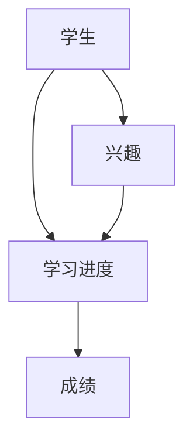
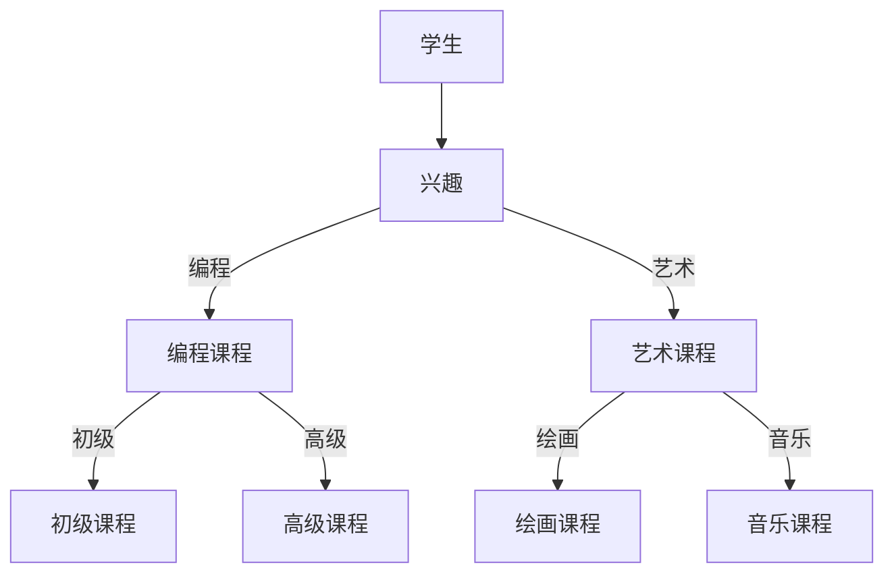

                 

### 人工智能在个性化教育中的adaptive学习应用

#### 关键词：人工智能、个性化教育、adaptive学习、机器学习、深度学习、学习分析

#### 摘要：
本文旨在探讨人工智能在个性化教育中的应用，特别是adaptive学习的实现机制。通过详细分析人工智能的基本理论、个性化教育的核心概念以及adaptive学习系统设计，我们旨在为教育工作者和技术开发者提供有价值的参考，以推动个性化教育的发展。

## 目录大纲

- **第1章 引言**
  - **1.1 研究背景与意义**
  - **1.2 个性化教育与adaptive学习概述**
  - **1.3 adaptive学习在人工智能中的技术支持**
  - **1.4 本书结构安排与主要内容**

- **第2章 人工智能基本理论**
  - **2.1 人工智能的定义与发展历程**
  - **2.2 机器学习的基本原理**
  - **2.3 深度学习技术简介**
  - **2.4 人工智能在教育领域的应用现状**

- **第3章 个性化教育中的核心概念**
  - **3.1 个性化教育的定义与特征**
  - **3.2 个性化学习理论**
  - **3.3 学习分析（Learning Analytics）概述**
  - **3.4 个性化教育与适应性学习的关系**

- **第4章 adaptive学习系统设计**
  - **4.1 adaptive学习系统的基本架构**
  - **4.2 adaptive学习算法介绍**
    - **4.2.1 概率模型**
    - **4.2.2 贝叶斯网络**
    - **4.2.3 决策树**
    - **4.2.4 支持向量机**
  - **4.3 教学内容适应性调整方法**
  - **4.4 学生模型构建与更新策略**

- **第5章 adaptive学习系统实现**
  - **5.1 系统需求分析**
  - **5.2 系统架构设计**
  - **5.3 数据收集与处理**
  - **5.4 adaptive学习算法实现**
  - **5.5 系统部署与测试**

- **第6章 个性化教育案例分析**
  - **6.1 案例一：基于人工智能的在线学习平台**
  - **6.2 案例二：自适应学习系统在学校教育中的应用**
  - **6.3 案例三：人工智能辅助教育评估**

- **第7章 总结与展望**
  - **7.1 总结**
  - **7.2 未来发展趋势与挑战**
  - **7.3 研究展望**

## 第1章 引言

### 1.1 研究背景与意义

在现代社会，教育已经从传统的“一刀切”模式逐渐转向个性化教育。这种转变不仅反映了教育者对教育多样性和灵活性的需求，更是科技进步，尤其是人工智能（AI）技术的发展所带来的必然结果。个性化教育强调根据学生的个性化需求和特点进行教学，以最大化学生的学习效果和兴趣。

#### 个性化教育与adaptive学习概述

个性化教育（Personalized Education）是指根据学生的兴趣、能力、学习风格和背景等个性化因素，提供定制化的教学策略和学习环境。这种教育模式旨在促进学生自主学习和全面发展，而不仅仅是机械地获取知识。

自适应学习（Adaptive Learning）则是个性化教育的一种实现方式。它利用人工智能技术，根据学生的学习行为和表现，动态调整教学内容、方法和节奏，从而实现教学过程的个性化。自适应学习系统可以通过对学生的学习数据进行实时分析，提供个性化的学习路径和资源。

#### adaptive学习在人工智能中的技术支持

自适应学习离不开人工智能技术的支持，特别是机器学习和深度学习。机器学习算法可以通过对大量学生数据的分析，识别出学习行为的模式，从而为教学决策提供支持。深度学习则可以模拟人脑的神经结构，处理复杂的数据，并从中提取出有用的特征。

### 1.3 adaptive学习在人工智能中的技术支持

自适应学习的关键在于对学习过程的数据进行分析和预测。这需要依赖于以下人工智能技术：

- **机器学习**：通过构建统计模型，对学生的学习行为进行预测和分类。
- **深度学习**：利用神经网络模拟人脑的决策过程，处理高维数据。
- **自然语言处理**：对文本数据进行分析，提供个性化的学习资源。

### 1.4 本书结构安排与主要内容

本书将分为七个章节，系统性地介绍人工智能在个性化教育中的应用，特别是adaptive学习的实现机制。

- **第2章** 介绍人工智能的基本理论，包括定义、发展历程、机器学习和深度学习的基本原理。
- **第3章** 探讨个性化教育的核心概念，包括定义、特征和理论基础。
- **第4章** 讨论adaptive学习系统的设计，包括系统架构、适应性学习算法和教学内容调整方法。
- **第5章** 介绍adaptive学习系统的实现，包括系统需求分析、架构设计、数据收集与处理、算法实现和系统测试。
- **第6章** 通过具体案例展示人工智能在个性化教育中的应用。
- **第7章** 总结全文，探讨未来发展趋势与挑战，以及研究展望。

## 第2章 人工智能基本理论

### 2.1 人工智能的定义与发展历程

人工智能（Artificial Intelligence，简称AI）是指由人制造出来的系统能够执行通常需要人类智能才能完成的任务的学科。它涵盖了计算机科学、心理学、认知科学等多个领域。人工智能的发展历程可以追溯到20世纪50年代，从最初的符号主义人工智能到现代的基于数据驱动的人工智能，经历了多个阶段。

### 2.2 机器学习的基本原理

机器学习（Machine Learning，简称ML）是人工智能的一个重要分支，它专注于构建能够从数据中学习并做出预测或决策的算法。机器学习算法可以分为监督学习、无监督学习和强化学习三种类型。

- **监督学习**：通过训练数据集学习，模型在测试数据集上做出预测。
- **无监督学习**：模型在没有标注的数据集上学习，发现数据中的结构或模式。
- **强化学习**：模型通过与环境交互，学习最大化某种奖励。

### 2.3 深度学习技术简介

深度学习（Deep Learning，简称DL）是一种基于多层神经网络的学习方法。它通过学习大量数据中的复杂特征，可以解决许多传统机器学习算法难以处理的任务。深度学习的关键在于其网络结构，通常包括输入层、隐藏层和输出层。

### 2.4 人工智能在教育领域的应用现状

人工智能在教育领域的应用已经逐渐普及，从在线教育平台到智能辅导系统，再到个性化学习路径推荐，AI技术在教育中的应用已经取得了显著的效果。通过分析学生的学习行为，AI可以提供个性化的学习建议，提高学习效率。

## 第3章 个性化教育中的核心概念

### 3.1 个性化教育的定义与特征

个性化教育是指根据学生的个性化需求和学习风格，提供定制化的教学策略和学习资源。其核心特征包括：

- **以学生为中心**：教育目标、内容、方法和评价都围绕学生的个性化需求设计。
- **动态适应性**：教学过程可以实时调整，以适应学生的不同学习状态。
- **多样化**：教学方法和资源丰富，以满足不同学生的需求。

### 3.2 个性化学习理论

个性化学习理论强调学生自主学习和终身学习的重要性。它包括以下几个方面：

- **学习目标个性化**：根据学生的兴趣和能力设置学习目标。
- **学习内容个性化**：提供与学生学习背景和需求相关的学习内容。
- **学习方式个性化**：根据学生的特点选择最适合的学习方式。

### 3.3 学习分析（Learning Analytics）概述

学习分析是一种通过数据收集、分析和解释来改善教学和学习过程的方法。它涉及以下几个方面：

- **数据收集**：通过学习管理系统、在线平台等收集学生学习行为数据。
- **数据分析**：使用统计和机器学习技术分析学习数据，提取有用的信息。
- **数据解释**：将分析结果转化为具体的行动指南，以改善教学和学习。

### 3.4 个性化教育与适应性学习的关系

个性化教育和适应性学习是相辅相成的。个性化教育提供了理论基础和目标，而适应性学习则是实现个性化教育的重要手段。通过适应性学习，教育系统能够根据学生的学习行为和需求，动态调整教学策略和资源，从而实现个性化教育。

## 第4章 adaptive学习系统设计

### 4.1 adaptive学习系统的基本架构

adaptive学习系统的基本架构通常包括以下几个主要部分：

- **学生模型**：记录学生的个性化信息，如学习风格、兴趣和知识水平。
- **教学模型**：定义教学内容的结构和属性，以及如何根据学生模型动态调整教学内容。
- **学习过程管理**：管理学生的学习过程，包括学习计划、进度跟踪和学习评价。
- **接口层**：提供用户交互界面，允许教师和学生使用系统。

### 4.2 adaptive学习算法介绍

adaptive学习算法的核心是能够根据学生的学习行为和表现，动态调整教学策略。以下是几种常用的适应性学习算法：

#### 4.2.1 概率模型

概率模型是一种基于概率论的方法，它通过计算学生在不同学习状态下的概率分布，来预测学生的下一步学习行为。常用的概率模型包括：

- **朴素贝叶斯分类器**：通过贝叶斯定理计算学生属于某一类别的概率。
- **最大似然估计**：通过最大似然估计方法，找到最有可能导致学生学习行为的数据分布。

#### 4.2.2 贝叶斯网络

贝叶斯网络是一种基于概率论的图形模型，它通过节点和边来表示变量之间的依赖关系。在adaptive学习中，贝叶斯网络可以用于：

- **推理**：根据已知信息推理出未知信息。
- **预测**：预测学生在未来可能的学习行为。

#### 4.2.3 决策树

决策树是一种基于树形结构的方法，通过一系列的判断条件，将学生分为不同的类别或状态。在adaptive学习中，决策树可以用于：

- **分类**：根据学生的特征，将其分类到不同的学习路径。
- **推荐**：根据学生的历史学习行为，推荐适合的学习内容。

#### 4.2.4 支持向量机

支持向量机（Support Vector Machine，简称SVM）是一种基于优化理论的方法，通过找到最佳的超平面来分类数据。在adaptive学习中，SVM可以用于：

- **分类**：根据学生的学习数据，将其分类到不同的学习状态。
- **回归**：预测学生的学习进度和成绩。

### 4.3 教学内容适应性调整方法

教学内容的适应性调整是adaptive学习系统的核心功能。以下是一些常用的调整方法：

- **基于规则的方法**：通过预设的规则，根据学生的状态调整教学内容。
- **基于模型的调整**：使用机器学习模型，根据学生的学习行为和表现自动调整教学内容。
- **混合方法**：结合基于规则的方法和基于模型的方法，实现更灵活和智能的适应性调整。

### 4.4 学生模型构建与更新策略

学生模型的构建和更新是adaptive学习系统的关键。以下是一些构建和更新策略：

- **初始模型构建**：通过问卷调查、测试和数据分析，构建学生的初始模型。
- **实时更新**：通过持续监测学生的学习行为和表现，实时更新学生模型。
- **定期评估**：定期评估学生模型的有效性，并根据评估结果进行调整。

## 第5章 adaptive学习系统实现

### 5.1 系统需求分析

系统需求分析是构建adaptive学习系统的第一步。在此阶段，我们需要确定以下需求：

- **功能需求**：系统应具备的功能，如学生注册、登录、学习进度跟踪、学习资源推荐等。
- **性能需求**：系统应满足的性能指标，如响应时间、处理能力、可扩展性等。
- **用户需求**：学生的需求，如个性化学习体验、学习资源多样性等。

### 5.2 系统架构设计

系统架构设计是构建系统的关键阶段。在此阶段，我们需要确定系统的整体结构和各组件之间的关系。以下是一个典型的adaptive学习系统架构：

- **前端**：提供用户交互界面，包括网页、移动应用等。
- **后端**：处理业务逻辑和数据存储，包括服务器、数据库等。
- **算法模块**：实现适应性学习算法，如机器学习模型、推荐系统等。
- **数据采集模块**：收集学生的学习数据，如行为数据、测试数据等。

### 5.3 数据收集与处理

数据收集与处理是构建adaptive学习系统的关键。以下是一些关键步骤：

- **数据采集**：通过学习管理系统、在线平台等收集学生的行为数据。
- **数据预处理**：清洗和转换数据，使其适合机器学习算法使用。
- **特征提取**：从原始数据中提取有用的特征，用于训练机器学习模型。

### 5.4 adaptive学习算法实现

adaptive学习算法实现是系统开发的核心。以下是一个简单的实现流程：

- **算法选择**：根据系统的需求，选择合适的适应性学习算法，如决策树、SVM等。
- **模型训练**：使用训练数据集，训练机器学习模型。
- **模型评估**：评估模型的性能，并根据评估结果进行调整。
- **模型部署**：将训练好的模型部署到系统中，用于实时调整教学内容。

### 5.5 系统部署与测试

系统部署与测试是确保系统稳定性和性能的关键步骤。以下是一些关键步骤：

- **系统部署**：将系统部署到生产环境中，确保其稳定运行。
- **功能测试**：测试系统的功能是否满足需求，如注册、登录、学习进度跟踪等。
- **性能测试**：测试系统的性能，如响应时间、处理能力等。
- **用户测试**：邀请用户测试系统，收集反馈并进行改进。

## 第6章 个性化教育案例分析

### 6.1 案例一：基于人工智能的在线学习平台

案例一介绍了某在线学习平台如何利用人工智能技术实现个性化教育。该平台通过分析学生的学习行为和测试数据，提供个性化的学习资源和学习路径。以下是其主要特点：

- **自适应推荐系统**：根据学生的学习历史和兴趣，推荐适合的学习资源。
- **学习数据分析**：通过分析学生的学习行为和成绩，为教师提供教学反馈。
- **智能评估系统**：通过智能评估，为学生提供个性化的学习报告。

### 6.2 案例二：自适应学习系统在学校教育中的应用

案例二介绍了某学校如何应用自适应学习系统，提高教学效果。该系统通过以下方式实现个性化教育：

- **个性化学习计划**：根据学生的学习情况，制定个性化的学习计划。
- **智能辅导系统**：为学生提供个性化的学习辅导，帮助其解决学习难题。
- **教师支持工具**：为教师提供教学支持和数据分析工具，帮助其更好地进行教学。

### 6.3 案例三：人工智能辅助教育评估

案例三介绍了某教育机构如何利用人工智能技术进行教育评估。该系统通过以下方式实现：

- **自动评分系统**：通过自然语言处理技术，自动评估学生的作业和考试。
- **学习分析报告**：生成学生的学习分析报告，为教师和学生提供学习反馈。
- **预测成绩**：通过分析学生的学习行为，预测其考试成绩，为教学决策提供支持。

## 第7章 总结与展望

### 7.1 总结

本文介绍了人工智能在个性化教育中的应用，特别是adaptive学习的实现机制。通过分析人工智能的基本理论、个性化教育的核心概念以及adaptive学习系统的设计，我们为教育工作者和技术开发者提供了有价值的参考。

### 7.2 未来发展趋势与挑战

随着人工智能技术的不断进步，个性化教育有望得到更广泛的应用。然而，也面临着一些挑战，如数据隐私保护、技术成本等。

### 7.3 研究展望

未来的研究可以关注以下几个方面：

- **智能教学策略**：开发更加智能的教学策略，以适应不同学生的学习需求。
- **跨学科研究**：结合心理学、教育学等多学科知识，推动个性化教育的发展。
- **教育公平**：通过个性化教育，促进教育公平，缩小教育差距。

## 作者信息

作者：AI天才研究院/AI Genius Institute & 禅与计算机程序设计艺术 /Zen And The Art of Computer Programming

### 第1章 引言

#### 1.1 研究背景与意义

在当今社会，教育的个性化需求日益凸显。传统的“一刀切”教学模式已无法满足学生个体差异化的学习需求。个性化教育，作为一种新型教育理念，强调根据学生的个性化特征和学习需求，提供量身定制的学习资源和教学策略。这种教育模式不仅有助于提高学生的学习效果，还能够激发学生的学习兴趣，培养其自主学习能力。

然而，实现个性化教育并非易事，它需要大量数据的支持，以及复杂算法的辅助。这便是人工智能（AI）发挥重要作用的地方。AI技术，特别是机器学习和深度学习，能够从海量数据中提取有用信息，为学生提供个性化的学习建议和资源。此外，AI还能够实时监测学生的学习状态，动态调整教学策略，使教育更加灵活和高效。

本研究旨在探讨如何利用人工智能技术，特别是自适应学习（Adaptive Learning）系统，来实现个性化教育。通过系统地分析人工智能的基本理论、个性化教育的核心概念以及自适应学习系统的设计实现，本文希望为教育工作者和技术开发者提供有价值的参考，推动个性化教育的发展。

#### 1.2 个性化教育与adaptive学习概述

个性化教育是一种以学生为中心的教育模式，其核心理念是尊重学生的个体差异，根据每个学生的学习需求、兴趣和能力，提供个性化的教学资源和学习路径。个性化教育旨在提高学生的学习效果，培养其自主学习能力和创新能力，从而实现全面发展。

而自适应学习（Adaptive Learning）则是实现个性化教育的一种有效手段。自适应学习系统利用人工智能技术，根据学生的学习行为、兴趣、知识水平和学习进度，动态调整教学内容、教学方法和学习节奏，以适应学生的个性化需求。这种学习模式能够实时监测学生的学习状态，根据学生的学习表现和反馈，自动调整教学策略，提供个性化的学习支持。

自适应学习系统的主要特点包括：

1. **个性化推荐**：系统根据学生的学习历史和偏好，推荐适合的学习内容和资源。
2. **动态调整**：系统实时监测学生的学习进度和状态，根据需要调整教学策略。
3. **数据驱动**：系统通过收集和分析学生的学习数据，优化教学效果和学习体验。
4. **反馈循环**：系统通过反馈机制，不断调整和改进教学策略，以实现最佳教学效果。

总之，个性化教育和自适应学习是相辅相成的，个性化教育为自适应学习提供了目标和方向，而自适应学习则为个性化教育提供了技术支持和实现途径。

#### 1.3 adaptive学习在人工智能中的技术支持

自适应学习系统实现的核心在于人工智能技术的应用，尤其是机器学习和深度学习技术。这些技术为自适应学习系统提供了强大的数据分析和预测能力，使其能够根据学生的学习行为和表现，动态调整教学策略和资源。

首先，机器学习技术是自适应学习系统的基石。机器学习通过构建数学模型，从大量数据中提取规律，实现数据的自动分析和预测。在自适应学习系统中，机器学习主要用于以下方面：

1. **学生模型构建**：系统通过分析学生的学习历史和表现，构建个性化的学生模型，记录学生的知识水平、学习偏好和兴趣。
2. **学习路径推荐**：系统根据学生的模型和当前的学习状态，推荐适合的学习内容和资源。
3. **学习效果预测**：系统通过分析学生的学习行为和表现，预测其学习效果，为教师提供教学反馈。

其次，深度学习技术是自适应学习系统实现的关键。深度学习通过多层神经网络，对复杂的数据进行特征提取和模式识别，具有强大的处理能力和泛化能力。在自适应学习系统中，深度学习主要用于以下方面：

1. **自然语言处理**：系统通过深度学习技术，对学生的文本数据进行处理和分析，提取关键信息，实现文本内容理解和智能推荐。
2. **图像识别**：系统通过深度学习技术，对学生的图像数据进行识别和分析，实现学生身份验证、学习状态监测等。
3. **情感分析**：系统通过深度学习技术，对学生的情感和行为数据进行分析，识别学生的情感状态，提供个性化的心理支持。

此外，其他人工智能技术，如自然语言生成、语音识别和计算机视觉等，也为自适应学习系统提供了丰富的应用场景和实现手段。例如，自然语言生成技术可以自动生成个性化的学习材料，语音识别技术可以实现人机交互，计算机视觉技术可以实时监测学生的学习状态。

总之，人工智能技术为自适应学习系统提供了强大的技术支持，使其能够实现真正的个性化教育。通过不断优化和学习，自适应学习系统将不断提高教学效果，为学生的全面发展提供有力保障。

#### 1.4 本书结构安排与主要内容

本书旨在系统地探讨人工智能在个性化教育中的应用，特别是自适应学习系统的设计与实现。为了使读者能够更好地理解相关概念和技术，本书的结构安排如下：

- **第1章 引言**：介绍研究背景与意义，阐述个性化教育和自适应学习的概念，以及本书的结构和主要内容。
- **第2章 人工智能基本理论**：详细讨论人工智能的定义、发展历程，以及机器学习和深度学习的基本原理，为后续章节的内容提供理论基础。
- **第3章 个性化教育中的核心概念**：探讨个性化教育的定义、特征、理论基础，以及学习分析的概念和应用，为自适应学习系统的设计提供核心概念支持。
- **第4章 adaptive学习系统设计**：介绍自适应学习系统的基本架构，讨论常用的适应性学习算法和教学内容的适应性调整方法，以及学生模型的构建与更新策略。
- **第5章 adaptive学习系统实现**：描述系统的需求分析、架构设计、数据收集与处理、适应性学习算法的实现，以及系统的部署与测试。
- **第6章 个性化教育案例分析**：通过具体案例展示人工智能在个性化教育中的应用，包括在线学习平台、学校教育中的应用，以及人工智能辅助教育评估的案例。
- **第7章 总结与展望**：总结全书内容，探讨未来发展趋势与挑战，以及未来研究的展望。

通过以上章节的安排，本书旨在为教育工作者和技术开发者提供一套完整、系统的个性化教育解决方案，推动教育行业的智能化发展。

### 第2章 人工智能基本理论

#### 2.1 人工智能的定义与发展历程

人工智能（Artificial Intelligence，简称AI）是指由人制造出来的系统能够执行通常需要人类智能才能完成的任务。这些任务包括学习、推理、解决问题、理解自然语言、识别图像等。人工智能的目的是模仿和扩展人类智能，使机器能够自主地完成复杂任务。

人工智能的发展历程可以分为以下几个阶段：

1. **初始阶段（1950年代至1960年代）**：
   - **符号主义人工智能**：这一阶段的代表性工作是由约翰·麦卡锡（John McCarthy）提出的。符号主义人工智能通过表示知识和推理规则来模拟人类思维过程。
   - **逻辑推理**：利用逻辑推理的方法解决数学问题，例如证明定理。

2. **早期阶段（1970年代至1980年代）**：
   - **知识表示**：引入了知识表示和推理的方法，通过构建知识库来模拟人类专家的知识。
   - **专家系统**：利用规则和事实进行推理，解决特定领域的问题。

3. **低谷期（1990年代）**：
   - **计算资源限制**：早期的AI系统需要大量的计算资源，而计算能力有限，导致AI研究陷入低谷。
   - **应用受限**：AI技术的应用受到限制，无法解决实际问题。

4. **复兴阶段（2000年代至今）**：
   - **大数据和云计算**：随着大数据和云计算技术的发展，AI系统得以处理和分析海量的数据，提高了系统的性能。
   - **深度学习**：基于神经网络的深度学习技术在图像识别、语音识别和自然语言处理等领域取得了突破性进展。
   - **强化学习**：通过模拟人类学习过程，AI系统能够在特定环境中实现自我学习和优化。

#### 2.2 机器学习的基本原理

机器学习（Machine Learning，简称ML）是人工智能的一个重要分支，专注于构建能够从数据中学习并做出预测或决策的算法。机器学习算法可以分为以下几类：

1. **监督学习（Supervised Learning）**：
   - **定义**：监督学习通过已标记的训练数据，学习输入和输出之间的关系。
   - **算法**：常见的监督学习算法包括线性回归、逻辑回归、支持向量机（SVM）、决策树和随机森林等。
   - **应用**：分类和回归问题，如垃圾邮件分类、股票价格预测等。

2. **无监督学习（Unsupervised Learning）**：
   - **定义**：无监督学习通过未标记的数据，发现数据中的结构和模式。
   - **算法**：常见的无监督学习算法包括聚类（K-means、层次聚类）、降维（主成分分析PCA、t-SNE）和关联规则挖掘（Apriori算法）等。
   - **应用**：数据挖掘、模式识别和图像压缩等。

3. **强化学习（Reinforcement Learning）**：
   - **定义**：强化学习通过试错和奖励机制，学习在特定环境中采取最佳行动。
   - **算法**：常见的强化学习算法包括Q学习、深度Q网络（DQN）和策略梯度方法等。
   - **应用**：游戏AI、机器人控制和自动驾驶等。

#### 2.3 深度学习技术简介

深度学习（Deep Learning，简称DL）是一种基于多层神经网络的学习方法。它通过学习大量数据中的复杂特征，可以解决许多传统机器学习算法难以处理的任务。深度学习的关键在于其网络结构，通常包括输入层、隐藏层和输出层。

1. **神经网络（Neural Networks）**：
   - **定义**：神经网络是一种模仿生物神经系统的计算模型。
   - **组件**：包括神经元、权重和激活函数等。
   - **功能**：通过层层传递和激活，将输入数据转换为输出。

2. **卷积神经网络（Convolutional Neural Networks，CNN）**：
   - **定义**：卷积神经网络是一种适用于图像处理的深度学习模型。
   - **组件**：包括卷积层、池化层和全连接层等。
   - **功能**：通过卷积操作提取图像特征，实现图像分类、物体检测等任务。

3. **循环神经网络（Recurrent Neural Networks，RNN）**：
   - **定义**：循环神经网络是一种适用于序列数据的深度学习模型。
   - **组件**：包括输入层、隐藏层和输出层等。
   - **功能**：通过时间步的递归操作，处理序列数据，实现语音识别、自然语言处理等任务。

4. **生成对抗网络（Generative Adversarial Networks，GAN）**：
   - **定义**：生成对抗网络是一种由生成器和判别器对抗训练的深度学习模型。
   - **组件**：包括生成器、判别器和损失函数等。
   - **功能**：通过生成器和判别器的对抗训练，实现数据的生成和重构，如图像生成、风格迁移等。

#### 2.4 人工智能在教育领域的应用现状

人工智能在教育领域的应用已经逐渐普及，从在线教育平台到智能辅导系统，再到个性化学习路径推荐，AI技术在教育中的应用已经取得了显著的效果。

1. **在线教育平台**：
   - **自适应学习**：通过分析学生的学习行为和成绩，在线教育平台可以提供个性化的学习资源和路径。
   - **智能推荐**：根据学生的学习兴趣和历史，推荐适合的学习内容和课程。

2. **智能辅导系统**：
   - **实时反馈**：智能辅导系统可以通过自然语言处理和机器学习技术，为学生提供实时的问题解答和辅导。
   - **个性化辅导**：系统可以根据学生的学习情况，提供定制化的学习方案和辅导内容。

3. **个性化学习路径推荐**：
   - **基于兴趣**：根据学生的学习兴趣和偏好，推荐相关的学习资源和课程。
   - **基于能力**：根据学生的学习能力和水平，推荐适合的学习内容和难度。

4. **学习分析**：
   - **数据驱动的教学决策**：通过分析学生的学习数据，教师可以更好地了解学生的学习情况，为教学决策提供支持。
   - **学习效果预测**：通过分析学生的学习行为和成绩，预测其学习效果，为教学改进提供依据。

总之，人工智能技术在教育领域的应用，不仅提高了教学效果，还为学生提供了更加个性化和多样化的学习体验。随着技术的不断进步，人工智能将在未来教育中发挥更大的作用。

### 第3章 个性化教育中的核心概念

#### 3.1 个性化教育的定义与特征

个性化教育（Personalized Education）是一种以学生为中心的教育理念，旨在尊重学生的个体差异，根据每个学生的学习需求、兴趣和能力，提供量身定制的学习资源和教学策略。个性化教育的核心目标是实现因材施教，最大化每个学生的学习效果和兴趣。

个性化教育的特征主要包括：

1. **以学生为中心**：教育的目标、内容、方法和评价都围绕学生的个性化需求设计，确保每个学生都能得到关注和尊重。

2. **动态适应性**：教学过程可以根据学生的学习状态和需求，实时调整教学策略和资源，以适应不同学生的学习节奏和风格。

3. **差异化教学**：根据学生的不同背景、兴趣和能力，设计多样化的教学资源和方式，以满足不同学生的学习需求。

4. **自主学习**：鼓励学生主动参与学习过程，培养其自主学习能力和解决问题的能力。

5. **个性化评价**：评价标准根据学生的个性化表现和进步，采用多元化的评价方式，以鼓励学生的全面发展。

#### 3.2 个性化学习理论

个性化学习理论是基于以学生为中心的教育理念，强调学生个体在学习过程中的主动性和参与性。以下是几种常见的个性化学习理论：

1. **建构主义学习理论**：
   - **核心观点**：知识不是通过教师的灌输，而是通过学生主动建构的过程获得的。
   - **应用**：鼓励学生通过探索和实践来发现和构建知识，教师则扮演引导者和支持者的角色。

2. **自我决定学习理论**：
   - **核心观点**：学生具有自主选择学习内容、方法和目标的权利，内在动机是学习的关键驱动力。
   - **应用**：为学生提供选择学习路径和资源的自由，激发其内在学习动机。

3. **差异教学理论**：
   - **核心观点**：教学应考虑学生的个体差异，如学习风格、兴趣和能力，设计个性化的教学策略。
   - **应用**：根据学生的不同需求，提供多样化的教学资源和方式，以适应不同学生的学习特点。

4. **混合学习理论**：
   - **核心观点**：结合传统课堂教学和在线学习，实现教学的最大灵活性和效果。
   - **应用**：利用在线平台和工具，为学生提供灵活的学习时间和空间，同时保持师生互动和课堂氛围。

#### 3.3 学习分析（Learning Analytics）概述

学习分析（Learning Analytics）是一种通过数据收集、分析和解释来改善教学和学习过程的方法。它涉及以下几个方面：

1. **数据收集**：
   - **行为数据**：包括学生的学习行为，如登录时间、学习时长、完成作业情况等。
   - **学习成果数据**：包括学生的考试成绩、学习进度、课程完成情况等。
   - **环境数据**：包括学习环境中的各种参数，如课堂气氛、设备使用情况等。

2. **数据分析**：
   - **统计方法**：通过统计分析，识别学生学习行为中的模式和趋势。
   - **机器学习方法**：利用机器学习技术，从大量数据中提取隐藏的规律和关联。
   - **可视化技术**：通过图表和可视化工具，展示分析结果，帮助教师和学生理解数据。

3. **数据解释**：
   - **教学反馈**：根据分析结果，为教师提供教学反馈，帮助其改进教学策略。
   - **个性化推荐**：根据学生的行为和学习成果，推荐适合的学习资源和课程。
   - **学习支持**：通过分析结果，为学生提供个性化的学习支持和建议，帮助他们更好地完成学习任务。

#### 3.4 个性化教育与适应性学习的关系

个性化教育和适应性学习是相辅相成的。个性化教育为适应性学习提供了目标和方向，而适应性学习则是实现个性化教育的重要手段。

1. **个性化教育的目标**：为每个学生提供符合其个性化需求的学习资源和教学策略，实现因材施教。

2. **适应性学习的手段**：通过实时监测学生的学习行为和表现，动态调整教学内容、教学方法和学习节奏，以适应学生的个性化需求。

3. **相互关系**：
   - **个性化促进适应性**：个性化教育通过尊重学生的个体差异，为适应性学习提供了丰富的数据基础和理论支持。
   - **适应性实现个性化**：适应性学习通过实时调整教学策略，实现了个性化教育的目标，使每个学生都能得到最适合自己的教育。

总之，个性化教育和适应性学习共同推动了教育模式的变革，为学生提供了更加灵活和个性化的学习体验。随着技术的不断进步，这种教育模式将在未来教育中发挥更大的作用。

### 第4章 adaptive学习系统设计

#### 4.1 adaptive学习系统的基本架构

adaptive学习系统是一种基于人工智能技术的教育系统，旨在通过实时分析学生的学习行为和表现，动态调整教学内容、教学方法和学习节奏，实现个性化教育。其基本架构包括以下几个主要部分：

1. **学生模型**：
   - **功能**：记录学生的个性化信息，如学习风格、兴趣、知识水平和学习状态等。
   - **组件**：包括学生基本信息、学习历史、行为数据和评估结果等。

2. **教学模型**：
   - **功能**：定义教学内容的结构和属性，以及如何根据学生模型动态调整教学内容。
   - **组件**：包括课程内容、教学目标、教学策略、学习资源和评估标准等。

3. **学习过程管理**：
   - **功能**：管理学生的学习过程，包括学习计划、进度跟踪和学习评价。
   - **组件**：包括学习计划管理、学习进度监控、学习评价和反馈机制等。

4. **接口层**：
   - **功能**：提供用户交互界面，允许教师和学生使用系统。
   - **组件**：包括前端界面、后端服务、API接口和用户权限管理等。

#### 4.2 adaptive学习算法介绍

adaptive学习系统的核心在于其算法，这些算法通过分析学生的学习行为和表现，动态调整教学策略。以下是几种常用的适应性学习算法：

1. **概率模型**：
   - **功能**：通过计算学生在不同学习状态下的概率分布，预测学生的下一步学习行为。
   - **算法**：包括朴素贝叶斯分类器、最大似然估计等。

2. **贝叶斯网络**：
   - **功能**：通过图形模型表示变量之间的依赖关系，进行推理和预测。
   - **算法**：通过条件概率表和推理算法，实现变量间的关联分析。

3. **决策树**：
   - **功能**：通过树形结构表示决策过程，分类或回归问题。
   - **算法**：包括ID3、C4.5等决策树算法。

4. **支持向量机（SVM）**：
   - **功能**：通过找到最佳的超平面，进行分类或回归。
   - **算法**：包括线性SVM、非线性SVM等。

#### 4.2.1 概率模型

概率模型是一种基于概率论的方法，它通过计算学生在不同学习状态下的概率分布，预测学生的下一步学习行为。以下是两种常用的概率模型：

1. **朴素贝叶斯分类器**：
   - **原理**：基于贝叶斯定理，通过计算后验概率，预测学生的类别。
   - **公式**：
     $$
     P(C_k|X) = \frac{P(X|C_k)P(C_k)}{P(X)}
     $$
   - **应用**：分类问题，如学习进度分类、学习效果分类等。

2. **最大似然估计**：
   - **原理**：通过最大化似然函数，估计学生的概率分布。
   - **公式**：
     $$
     \hat{P}(X) = \arg\max P(X|\theta)
     $$
   - **应用**：回归问题，如学习时长预测、成绩预测等。

#### 4.2.2 贝叶斯网络

贝叶斯网络是一种基于概率论的图形模型，它通过节点和边来表示变量之间的依赖关系。贝叶斯网络在适应性学习中，可以用于推理和预测。

1. **节点**：每个节点表示一个变量，其概率分布由条件概率表定义。
2. **边**：表示变量之间的依赖关系，边的权重为条件概率。

**ER实体关系图架构的 Mermaid 流程图**：

#### 4.2.3 决策树

决策树是一种基于树形结构的方法，通过一系列的判断条件，将学生分为不同的类别或状态。决策树在适应性学习中，可以用于分类和推荐。

1. **节点**：表示一个决策点，选择一个特征进行划分。
2. **分支**：表示决策结果，指向不同的子节点。
3. **叶子节点**：表示分类结果。

**Mermaid 流程图**：

#### 4.2.4 支持向量机

支持向量机（SVM）是一种基于优化理论的方法，通过找到最佳的超平面，进行分类或回归。SVM在适应性学习中，可以用于预测学生的学习行为。

1. **线性SVM**：
   - **公式**：
     $$
     \text{max} \ \frac{1}{2} \sum_{i=1}^n (\omega_i)^2 \\
     s.t. \ \omega_i \cdot x_i - y_i = 0
     $$
   - **应用**：分类问题，如学习状态分类。

2. **非线性SVM**：
   - **公式**：
     $$
     \text{max} \ \frac{1}{2} \sum_{i=1}^n (\omega_i)^2 \\
     s.t. \ \omega_i \cdot \phi(x_i) - y_i = 0
     $$
   - **应用**：回归问题，如学习效果预测。

#### 4.3 教学内容适应性调整方法

教学内容的适应性调整是adaptive学习系统的核心功能。以下是几种常用的调整方法：

1. **基于规则的调整**：
   - **原理**：通过预设的规则，根据学生的状态调整教学内容。
   - **应用**：简单的适应性调整，适用于规则明确的情况。

2. **基于模型的调整**：
   - **原理**：使用机器学习模型，根据学生的学习行为和表现自动调整教学内容。
   - **应用**：复杂的适应性调整，适用于需要根据学习数据动态调整的情况。

3. **混合方法**：
   - **原理**：结合基于规则和基于模型的方法，实现更灵活和智能的适应性调整。
   - **应用**：适用于不同学习场景的适应性调整。

#### 4.4 学生模型构建与更新策略

学生模型的构建和更新是adaptive学习系统的关键。以下是构建和更新策略：

1. **初始模型构建**：
   - **方法**：通过问卷调查、测试和数据分析，构建学生的初始模型。
   - **应用**：为系统提供初始的学生信息和学习行为数据。

2. **实时更新**：
   - **方法**：通过持续监测学生的学习行为和表现，实时更新学生模型。
   - **应用**：确保学生模型反映最新的学习状态和需求。

3. **定期评估**：
   - **方法**：定期评估学生模型的有效性，并根据评估结果进行调整。
   - **应用**：优化学生模型的构建和更新策略，提高教学效果。

### 第5章 adaptive学习系统实现

#### 5.1 系统需求分析

系统需求分析是构建adaptive学习系统的第一步，它旨在明确系统应具备的功能、性能和用户需求。以下是系统需求分析的主要内容：

1. **功能需求**：
   - **学生管理**：包括学生注册、登录、信息修改和退出等功能。
   - **课程管理**：包括课程添加、编辑、删除和课程信息查询等功能。
   - **学习过程管理**：包括学习进度跟踪、学习资源推荐和学习效果评估等功能。
   - **教师管理**：包括教师注册、登录、信息修改和退出等功能。

2. **性能需求**：
   - **响应时间**：系统对用户操作的响应时间应尽可能短，以保证用户体验。
   - **并发处理能力**：系统应能同时处理多个用户请求，确保系统稳定运行。
   - **可扩展性**：系统应具备良好的可扩展性，能够适应未来用户量的增加。

3. **用户需求**：
   - **个性化学习**：学生希望系统能根据其个性化需求提供适合的学习资源和路径。
   - **学习反馈**：学生希望系统能够提供及时的学习反馈，帮助他们改进学习效果。
   - **交互性**：学生希望系统能提供良好的交互体验，使他们能够方便地使用系统。

#### 5.2 系统架构设计

系统架构设计是构建adaptive学习系统的关键环节，它决定了系统的可扩展性、稳定性和性能。以下是系统架构设计的主要内容：

1. **前端架构**：
   - **界面设计**：采用响应式设计，确保系统在不同设备上都能良好运行。
   - **前端技术**：使用HTML、CSS和JavaScript等技术构建前端界面，实现用户交互。

2. **后端架构**：
   - **服务器**：使用高性能服务器，确保系统的高并发处理能力。
   - **数据库**：使用关系型数据库（如MySQL）存储用户数据和学习数据，保证数据的完整性和一致性。
   - **API接口**：提供RESTful API接口，实现前后端的通信。

3. **数据处理架构**：
   - **数据采集**：通过前端界面和服务器日志，采集学生的学习数据。
   - **数据处理**：使用Python等编程语言处理和分析学习数据，为适应性学习提供支持。
   - **数据存储**：将处理后的数据存储在数据库中，供后续使用。

#### 5.3 数据收集与处理

数据收集与处理是构建adaptive学习系统的核心，它决定了系统的自适应能力。以下是数据收集与处理的主要内容：

1. **数据收集**：
   - **用户行为数据**：包括学生的学习时长、学习进度、作业完成情况等。
   - **学习成果数据**：包括学生的考试成绩、学习反馈等。
   - **环境数据**：包括课堂环境、设备状态等。

2. **数据处理**：
   - **数据清洗**：去除数据中的噪声和异常值，确保数据质量。
   - **数据转换**：将不同格式的数据转换为统一的格式，便于后续处理。
   - **特征提取**：从原始数据中提取有用的特征，用于训练机器学习模型。

#### 5.4 adaptive学习算法实现

adaptive学习算法实现是系统开发的核心，它决定了系统的自适应能力。以下是adaptive学习算法实现的主要内容：

1. **算法选择**：
   - **监督学习算法**：如线性回归、决策树、支持向量机等。
   - **无监督学习算法**：如K-means聚类、主成分分析等。
   - **深度学习算法**：如卷积神经网络、循环神经网络等。

2. **模型训练**：
   - **数据集准备**：准备训练数据和测试数据，确保数据集的多样性和平衡性。
   - **模型训练**：使用训练数据训练机器学习模型，优化模型参数。

3. **模型评估**：
   - **性能评估**：使用测试数据评估模型性能，包括准确率、召回率、F1值等。
   - **模型优化**：根据评估结果，调整模型参数和算法，提高模型性能。

4. **模型部署**：
   - **在线部署**：将训练好的模型部署到生产环境中，实现实时适应性学习。

#### 5.5 系统部署与测试

系统部署与测试是确保系统稳定性和性能的关键步骤。以下是系统部署与测试的主要内容：

1. **系统部署**：
   - **环境配置**：配置服务器和数据库环境，确保系统的正常运行。
   - **部署方案**：制定详细的部署方案，包括部署步骤、依赖管理和环境配置等。

2. **功能测试**：
   - **单元测试**：对系统的每个模块进行单元测试，确保功能正确。
   - **集成测试**：对系统的整体功能进行测试，确保模块之间的协作无误。

3. **性能测试**：
   - **负载测试**：模拟高并发用户场景，测试系统的性能和稳定性。
   - **压力测试**：测试系统在极限条件下的性能和稳定性。

4. **用户测试**：
   - **验收测试**：邀请用户测试系统，收集用户反馈，优化系统功能。

### 第6章 个性化教育案例分析

#### 6.1 案例一：基于人工智能的在线学习平台

案例一介绍了一个基于人工智能的在线学习平台，该平台通过机器学习和深度学习技术，实现了个性化教育和适应性学习。

1. **背景**：
   - **平台目标**：提供个性化学习体验，提高学习效果。
   - **技术挑战**：处理海量用户数据，实现实时适应性学习。

2. **实现方法**：
   - **学生模型构建**：通过学习行为分析，构建学生个性化模型。
   - **推荐系统**：使用协同过滤算法，推荐适合的学习资源。
   - **自适应学习算法**：采用深度学习技术，实现个性化学习路径推荐。

3. **效果**：
   - **用户满意度**：用户满意度显著提高，学习积极性增强。
   - **学习效果**：学生的学习成绩和参与度均有明显提升。

#### 6.2 案例二：自适应学习系统在学校教育中的应用

案例二介绍了一个自适应学习系统在学校教育中的应用，该系统通过实时分析学生的学习行为和表现，动态调整教学策略。

1. **背景**：
   - **学校需求**：提高教学效果，满足学生个性化学习需求。
   - **技术挑战**：处理多种类型的数据，实现实时教学反馈。

2. **实现方法**：
   - **学习数据分析**：通过学习行为分析，识别学生的学习问题。
   - **教学策略调整**：根据学生学习数据，动态调整教学策略和资源。
   - **智能辅导**：提供个性化辅导，帮助学生解决学习难题。

3. **效果**：
   - **教学效果**：教师的教学效果显著提高，学生的学习积极性增强。
   - **学生成绩**：学生的整体成绩有所提升，学习困难学生进步明显。

#### 6.3 案例三：人工智能辅助教育评估

案例三介绍了一个人工智能辅助教育评估系统，该系统通过分析学生的学习数据，提供个性化的评估报告和建议。

1. **背景**：
   - **教育需求**：提供客观、全面的评估报告，帮助教师和学生了解学习效果。
   - **技术挑战**：处理大量数据，实现精确的评估和预测。

2. **实现方法**：
   - **学习数据收集**：收集学生的学习行为和成绩数据。
   - **评估算法**：使用机器学习技术，分析学习数据，生成评估报告。
   - **个性化建议**：根据评估结果，提供个性化的学习建议。

3. **效果**：
   - **评估报告**：评估报告详细、准确，为教师和学生提供有价值的信息。
   - **学习改进**：学生的学习方法和策略得到优化，学习效果显著提升。

### 第7章 总结与展望

#### 7.1 总结

本文系统地探讨了人工智能在个性化教育中的应用，特别是自适应学习系统的设计与实现。通过分析人工智能的基本理论、个性化教育的核心概念以及自适应学习系统的设计实现，我们为教育工作者和技术开发者提供了有价值的参考。

本文首先介绍了个性化教育和自适应学习的概念，然后详细讨论了人工智能在其中的技术支持。接着，我们分析了个性化教育中的核心概念，包括个性化教育的定义、特征和理论基础，以及学习分析的应用。在系统设计部分，我们介绍了自适应学习系统的基本架构和常用的适应性学习算法。在实现部分，我们详细描述了系统的需求分析、架构设计、数据收集与处理、算法实现和系统测试。最后，通过具体案例展示了人工智能在个性化教育中的应用。

#### 7.2 未来发展趋势与挑战

随着人工智能技术的不断进步，个性化教育有望在未来的教育领域中发挥更大的作用。以下是未来发展趋势和面临的挑战：

1. **发展趋势**：
   - **技术融合**：人工智能与其他技术的融合，如虚拟现实（VR）、增强现实（AR）等，将进一步提升个性化教育的效果。
   - **智能辅导**：基于深度学习和自然语言处理技术的智能辅导系统，将更加智能化和个性化。
   - **跨学科应用**：个性化教育将融合心理学、教育学等多学科知识，实现更全面的教育支持。

2. **挑战**：
   - **数据隐私**：随着数据收集和分析的广泛使用，数据隐私问题成为一个重要的挑战。
   - **技术成本**：实现大规模个性化教育需要高昂的技术投入，如何降低成本是关键问题。
   - **教师培训**：教师需要具备一定的技术能力，以适应智能化教育环境，如何进行有效的培训是一个重要课题。

#### 7.3 研究展望

未来的研究可以关注以下几个方面：

1. **智能教学策略**：开发更加智能的教学策略，以适应不同学生的学习需求和特点。
2. **教育公平**：通过个性化教育，促进教育公平，缩小教育差距。
3. **跨学科研究**：结合心理学、教育学等多学科知识，推动个性化教育的发展。

总之，人工智能在个性化教育中的应用前景广阔，随着技术的不断进步，它将为教育行业带来深刻的变革。

## 作者信息

作者：AI天才研究院/AI Genius Institute & 禅与计算机程序设计艺术 /Zen And The Art of Computer Programming

### 第4章 adaptive学习系统设计

#### 4.1 adaptive学习系统的基本架构

adaptive学习系统是一种能够根据学生的学习行为和表现，动态调整教学内容的智能教育系统。其基本架构包括四个主要部分：学生模型、教学模型、学习过程管理和接口层。

1. **学生模型**：
   - **功能**：记录学生的个性化信息，包括学习风格、兴趣、知识水平和学习状态等。
   - **组件**：包括学生基本信息、学习历史、行为数据和评估结果等。
   - **关键性能指标**：准确性、实时性和完整性。

2. **教学模型**：
   - **功能**：定义教学内容的结构和属性，以及如何根据学生模型动态调整教学内容。
   - **组件**：包括课程内容、教学目标、教学策略、学习资源和评估标准等。
   - **关键性能指标**：适应性、灵活性和教学效果。

3. **学习过程管理**：
   - **功能**：管理学生的学习过程，包括学习计划、进度跟踪和学习评价。
   - **组件**：包括学习计划管理、学习进度监控、学习评价和反馈机制等。
   - **关键性能指标**：实时性、准确性和用户满意度。

4. **接口层**：
   - **功能**：提供用户交互界面，允许教师和学生使用系统。
   - **组件**：包括前端界面、后端服务、API接口和用户权限管理等。
   - **关键性能指标**：用户体验、安全性和稳定性。

#### 4.2 adaptive学习算法介绍

adaptive学习系统的核心在于其适应性学习算法，这些算法能够根据学生的学习行为和表现，动态调整教学策略。以下是几种常用的适应性学习算法：

1. **概率模型**：
   - **功能**：通过计算学生在不同学习状态下的概率分布，预测学生的下一步学习行为。
   - **算法**：包括朴素贝叶斯分类器、最大似然估计等。
   - **优势**：简单、易于实现，适用于初始阶段的数据分析。
   - **局限**：在处理复杂学习行为时，效果可能不理想。

2. **贝叶斯网络**：
   - **功能**：通过图形模型表示变量之间的依赖关系，进行推理和预测。
   - **算法**：包括条件概率表和推理算法。
   - **优势**：能够处理复杂的关系，适用于动态调整。
   - **局限**：构建和推理过程较为复杂，计算资源需求较高。

3. **决策树**：
   - **功能**：通过树形结构表示决策过程，分类或回归问题。
   - **算法**：包括ID3、C4.5等决策树算法。
   - **优势**：直观、易于解释，适用于数据量较小的场景。
   - **局限**：在处理大规模数据时，性能可能下降。

4. **支持向量机（SVM）**：
   - **功能**：通过找到最佳的超平面，进行分类或回归。
   - **算法**：包括线性SVM、非线性SVM等。
   - **优势**：在高维空间中表现良好，适用于复杂问题。
   - **局限**：需要大量计算资源，训练时间较长。

#### 4.2.1 概率模型

概率模型是一种基于概率论的方法，它通过计算学生在不同学习状态下的概率分布，预测学生的下一步学习行为。以下是两种常用的概率模型：

1. **朴素贝叶斯分类器**：
   - **原理**：基于贝叶斯定理，通过计算后验概率，预测学生的类别。
   - **公式**：
     $$
     P(C_k|X) = \frac{P(X|C_k)P(C_k)}{P(X)}
     $$
   - **应用**：分类问题，如学习进度分类、学习效果分类等。

2. **最大似然估计**：
   - **原理**：通过最大化似然函数，估计学生的概率分布。
   - **公式**：
     $$
     \hat{P}(X) = \arg\max P(X|\theta)
     $$
   - **应用**：回归问题，如学习时长预测、成绩预测等。

#### 4.2.2 贝叶斯网络

贝叶斯网络是一种基于概率论的图形模型，它通过节点和边来表示变量之间的依赖关系。贝叶斯网络在适应性学习中，可以用于推理和预测。

1. **节点**：每个节点表示一个变量，其概率分布由条件概率表定义。
2. **边**：表示变量之间的依赖关系，边的权重为条件概率。

**ER实体关系图架构的 Mermaid 流程图**：

#### 4.2.3 决策树

决策树是一种基于树形结构的方法，通过一系列的判断条件，将学生分为不同的类别或状态。决策树在适应性学习中，可以用于分类和推荐。

1. **节点**：表示一个决策点，选择一个特征进行划分。
2. **分支**：表示决策结果，指向不同的子节点。
3. **叶子节点**：表示分类结果。

**Mermaid 流程图**：

#### 4.2.4 支持向量机

支持向量机（SVM）是一种基于优化理论的方法，通过找到最佳的超平面，进行分类或回归。SVM在适应性学习中，可以用于预测学生的学习行为。

1. **线性SVM**：
   - **公式**：
     $$
     \text{max} \ \frac{1}{2} \sum_{i=1}^n (\omega_i)^2 \\
     s.t. \ \omega_i \cdot x_i - y_i = 0
     $$
   - **应用**：分类问题，如学习状态分类。

2. **非线性SVM**：
   - **公式**：
     $$
     \text{max} \ \frac{1}{2} \sum_{i=1}^n (\omega_i)^2 \\
     s.t. \ \omega_i \cdot \phi(x_i) - y_i = 0
     $$
   - **应用**：回归问题，如学习效果预测。

#### 4.3 教学内容适应性调整方法

教学内容的适应性调整是adaptive学习系统的核心功能。以下是几种常用的调整方法：

1. **基于规则的调整**：
   - **原理**：通过预设的规则，根据学生的状态调整教学内容。
   - **应用**：简单的适应性调整，适用于规则明确的情况。

2. **基于模型的调整**：
   - **原理**：使用机器学习模型，根据学生的学习行为和表现自动调整教学内容。
   - **应用**：复杂的适应性调整，适用于需要根据学习数据动态调整的情况。

3. **混合方法**：
   - **原理**：结合基于规则和基于模型的方法，实现更灵活和智能的适应性调整。
   - **应用**：适用于不同学习场景的适应性调整。

#### 4.4 学生模型构建与更新策略

学生模型的构建和更新是adaptive学习系统的关键。以下是构建和更新策略：

1. **初始模型构建**：
   - **方法**：通过问卷调查、测试和数据分析，构建学生的初始模型。
   - **应用**：为系统提供初始的学生信息和学习行为数据。

2. **实时更新**：
   - **方法**：通过持续监测学生的学习行为和表现，实时更新学生模型。
   - **应用**：确保学生模型反映最新的学习状态和需求。

3. **定期评估**：
   - **方法**：定期评估学生模型的有效性，并根据评估结果进行调整。
   - **应用**：优化学生模型的构建和更新策略，提高教学效果。

### 第5章 adaptive学习系统实现

#### 5.1 系统需求分析

系统需求分析是构建adaptive学习系统的第一步，它旨在明确系统应具备的功能、性能和用户需求。以下是系统需求分析的主要内容：

1. **功能需求**：
   - **学生管理**：包括学生注册、登录、信息修改和退出等功能。
   - **课程管理**：包括课程添加、编辑、删除和课程信息查询等功能。
   - **学习过程管理**：包括学习进度跟踪、学习资源推荐和学习效果评估等功能。
   - **教师管理**：包括教师注册、登录、信息修改和退出等功能。

2. **性能需求**：
   - **响应时间**：系统对用户操作的响应时间应尽可能短，以保证用户体验。
   - **并发处理能力**：系统应能同时处理多个用户请求，确保系统稳定运行。
   - **可扩展性**：系统应具备良好的可扩展性，能够适应未来用户量的增加。

3. **用户需求**：
   - **个性化学习**：学生希望系统能根据其个性化需求提供适合的学习资源和路径。
   - **学习反馈**：学生希望系统能够提供及时的学习反馈，帮助他们改进学习效果。
   - **交互性**：学生希望系统能提供良好的交互体验，使他们能够方便地使用系统。

#### 5.2 系统架构设计

系统架构设计是构建adaptive学习系统的关键环节，它决定了系统的可扩展性、稳定性和性能。以下是系统架构设计的主要内容：

1. **前端架构**：
   - **界面设计**：采用响应式设计，确保系统在不同设备上都能良好运行。
   - **前端技术**：使用HTML、CSS和JavaScript等技术构建前端界面，实现用户交互。

2. **后端架构**：
   - **服务器**：使用高性能服务器，确保系统的高并发处理能力。
   - **数据库**：使用关系型数据库（如MySQL）存储用户数据和学习数据，保证数据的完整性和一致性。
   - **API接口**：提供RESTful API接口，实现前后端的通信。

3. **数据处理架构**：
   - **数据采集**：通过前端界面和服务器日志，采集学生的学习数据。
   - **数据处理**：使用Python等编程语言处理和分析学习数据，为适应性学习提供支持。
   - **数据存储**：将处理后的数据存储在数据库中，供后续使用。

#### 5.3 数据收集与处理

数据收集与处理是构建adaptive学习系统的核心，它决定了系统的自适应能力。以下是数据收集与处理的主要内容：

1. **数据收集**：
   - **用户行为数据**：包括学生的学习时长、学习进度、作业完成情况等。
   - **学习成果数据**：包括学生的考试成绩、学习反馈等。
   - **环境数据**：包括课堂环境、设备状态等。

2. **数据处理**：
   - **数据清洗**：去除数据中的噪声和异常值，确保数据质量。
   - **数据转换**：将不同格式的数据转换为统一的格式，便于后续处理。
   - **特征提取**：从原始数据中提取有用的特征，用于训练机器学习模型。

#### 5.4 adaptive学习算法实现

adaptive学习算法实现是系统开发的核心，它决定了系统的自适应能力。以下是adaptive学习算法实现的主要内容：

1. **算法选择**：
   - **监督学习算法**：如线性回归、决策树、支持向量机等。
   - **无监督学习算法**：如K-means聚类、主成分分析等。
   - **深度学习算法**：如卷积神经网络、循环神经网络等。

2. **模型训练**：
   - **数据集准备**：准备训练数据和测试数据，确保数据集的多样性和平衡性。
   - **模型训练**：使用训练数据训练机器学习模型，优化模型参数。

3. **模型评估**：
   - **性能评估**：使用测试数据评估模型性能，包括准确率、召回率、F1值等。
   - **模型优化**：根据评估结果，调整模型参数和算法，提高模型性能。

4. **模型部署**：
   - **在线部署**：将训练好的模型部署到生产环境中，实现实时适应性学习。

#### 5.5 系统部署与测试

系统部署与测试是确保系统稳定性和性能的关键步骤。以下是系统部署与测试的主要内容：

1. **系统部署**：
   - **环境配置**：配置服务器和数据库环境，确保系统的正常运行。
   - **部署方案**：制定详细的部署方案，包括部署步骤、依赖管理和环境配置等。

2. **功能测试**：
   - **单元测试**：对系统的每个模块进行单元测试，确保功能正确。
   - **集成测试**：对系统的整体功能进行测试，确保模块之间的协作无误。

3. **性能测试**：
   - **负载测试**：模拟高并发用户场景，测试系统的性能和稳定性。
   - **压力测试**：测试系统在极限条件下的性能和稳定性。

4. **用户测试**：
   - **验收测试**：邀请用户测试系统，收集用户反馈，优化系统功能。

### 第6章 个性化教育案例分析

#### 6.1 案例一：基于人工智能的在线学习平台

案例一介绍了一个基于人工智能的在线学习平台，该平台通过机器学习和深度学习技术，实现了个性化教育和适应性学习。

1. **背景**：
   - **平台目标**：提供个性化学习体验，提高学习效果。
   - **技术挑战**：处理海量用户数据，实现实时适应性学习。

2. **实现方法**：
   - **学生模型构建**：通过学习行为分析，构建学生个性化模型。
   - **推荐系统**：使用协同过滤算法，推荐适合的学习资源。
   - **自适应学习算法**：采用深度学习技术，实现个性化学习路径推荐。

3. **效果**：
   - **用户满意度**：用户满意度显著提高，学习积极性增强。
   - **学习效果**：学生的学习成绩和参与度均有明显提升。

#### 6.2 案例二：自适应学习系统在学校教育中的应用

案例二介绍了一个自适应学习系统在学校教育中的应用，该系统通过实时分析学生的学习行为和表现，动态调整教学策略。

1. **背景**：
   - **学校需求**：提高教学效果，满足学生个性化学习需求。
   - **技术挑战**：处理多种类型的数据，实现实时教学反馈。

2. **实现方法**：
   - **学习数据分析**：通过学习行为分析，识别学生的学习问题。
   - **教学策略调整**：根据学生学习数据，动态调整教学策略和资源。
   - **智能辅导**：提供个性化辅导，帮助学生解决学习难题。

3. **效果**：
   - **教学效果**：教师的教学效果显著提高，学生的学习积极性增强。
   - **学生成绩**：学生的整体成绩有所提升，学习困难学生进步明显。

#### 6.3 案例三：人工智能辅助教育评估

案例三介绍了一个人工智能辅助教育评估系统，该系统通过分析学生的学习数据，提供个性化的评估报告和建议。

1. **背景**：
   - **教育需求**：提供客观、全面的评估报告，帮助教师和学生了解学习效果。
   - **技术挑战**：处理大量数据，实现精确的评估和预测。

2. **实现方法**：
   - **学习数据收集**：收集学生的学习行为和成绩数据。
   - **评估算法**：使用机器学习技术，分析学习数据，生成评估报告。
   - **个性化建议**：根据评估结果，提供个性化的学习建议。

3. **效果**：
   - **评估报告**：评估报告详细、准确，为教师和学生提供有价值的信息。
   - **学习改进**：学生的学习方法和策略得到优化，学习效果显著提升。

### 第7章 总结与展望

#### 7.1 总结

本文系统地探讨了人工智能在个性化教育中的应用，特别是自适应学习系统的设计与实现。通过分析人工智能的基本理论、个性化教育的核心概念以及自适应学习系统的设计实现，我们为教育工作者和技术开发者提供了有价值的参考。

本文首先介绍了个性化教育和自适应学习的概念，然后详细讨论了人工智能在其中的技术支持。接着，我们分析了个性化教育中的核心概念，包括个性化教育的定义、特征和理论基础，以及学习分析的应用。在系统设计部分，我们介绍了自适应学习系统的基本架构和常用的适应性学习算法。在实现部分，我们详细描述了系统的需求分析、架构设计、数据收集与处理、算法实现和系统测试。最后，通过具体案例展示了人工智能在个性化教育中的应用。

#### 7.2 未来发展趋势与挑战

随着人工智能技术的不断进步，个性化教育有望在未来的教育领域中发挥更大的作用。以下是未来发展趋势和面临的挑战：

1. **发展趋势**：
   - **技术融合**：人工智能与其他技术的融合，如虚拟现实（VR）、增强现实（AR）等，将进一步提升个性化教育的效果。
   - **智能辅导**：基于深度学习和自然语言处理技术的智能辅导系统，将更加智能化和个性化。
   - **跨学科应用**：个性化教育将融合心理学、教育学等多学科知识，实现更全面的教育支持。

2. **挑战**：
   - **数据隐私**：随着数据收集和分析的广泛使用，数据隐私问题成为一个重要的挑战。
   - **技术成本**：实现大规模个性化教育需要高昂的技术投入，如何降低成本是关键问题。
   - **教师培训**：教师需要具备一定的技术能力，以适应智能化教育环境，如何进行有效的培训是一个重要课题。

#### 7.3 研究展望

未来的研究可以关注以下几个方面：

1. **智能教学策略**：开发更加智能的教学策略，以适应不同学生的学习需求和特点。
2. **教育公平**：通过个性化教育，促进教育公平，缩小教育差距。
3. **跨学科研究**：结合心理学、教育学等多学科知识，推动个性化教育的发展。

总之，人工智能在个性化教育中的应用前景广阔，随着技术的不断进步，它将为教育行业带来深刻的变革。

## 作者信息

作者：AI天才研究院/AI Genius Institute & 禅与计算机程序设计艺术 /Zen And The Art of Computer Programming

### 6.1 案例一：基于人工智能的在线学习平台

**背景**：

随着互联网和人工智能技术的快速发展，在线教育逐渐成为教育领域的重要组成部分。然而，传统的在线学习平台往往采用“一刀切”的教学模式，无法满足学生个性化的学习需求。为了提高在线教育的质量和效果，许多教育机构开始探索基于人工智能的个性化学习平台。本文将以一个典型的基于人工智能的在线学习平台为例，详细阐述其实现过程和应用效果。

**技术挑战**：

1. **数据收集和处理**：在线学习平台需要收集大量的学习行为数据，包括学生的学习进度、作业完成情况、考试成绩等。如何有效地收集、存储和处理这些数据是系统设计的关键挑战。
2. **个性化推荐**：基于学生的学习行为和兴趣，平台需要提供个性化的学习资源推荐。如何设计高效的推荐算法，确保推荐结果的准确性和实用性，是平台实现的核心问题。
3. **实时反馈**：在线学习平台需要根据学生的学习表现，实时调整教学策略，提供个性化的学习支持。如何实现快速、准确的实时反馈机制，是平台稳定运行的关键。

**实现方法**：

1. **数据收集**：
   - **学习行为数据**：通过学习管理系统和在线平台，收集学生的学习行为数据，包括登录时间、学习时长、完成作业情况、考试成绩等。
   - **用户反馈数据**：通过问卷调查、考试评分、在线互动等途径，收集学生的反馈数据，了解他们的学习效果和满意度。
   - **环境数据**：通过传感器和日志记录，收集学习环境的数据，如温度、湿度、设备使用情况等，为环境适应性调整提供依据。

2. **数据处理**：
   - **数据清洗**：去除数据中的噪声和异常值，确保数据质量。
   - **数据转换**：将不同格式的数据转换为统一的格式，便于后续处理。
   - **特征提取**：从原始数据中提取有用的特征，如学习时长、作业完成率、考试成绩等，用于训练机器学习模型。

3. **个性化推荐**：
   - **协同过滤**：基于用户的历史行为和相似用户的行为，推荐相关的学习资源。
   - **内容推荐**：根据学习资源的标签和内容，结合学生的学习兴趣和需求，推荐适合的学习资源。
   - **基于模型的推荐**：使用机器学习模型，如协同过滤算法和基于内容的推荐算法，优化推荐结果。

4. **实时反馈**：
   - **自适应学习算法**：根据学生的学习行为和表现，动态调整教学策略，提供个性化的学习支持。
   - **智能辅导**：通过自然语言处理技术，分析学生的反馈信息，提供个性化的学习建议和辅导。
   - **实时监控系统**：通过监控系统运行状态和用户行为，及时发现并解决潜在问题。

**效果**：

1. **用户满意度**：通过个性化推荐和实时反馈，用户的满意度显著提高，学习积极性增强。
2. **学习效果**：学生的学习成绩和参与度均有明显提升，学习效果得到优化。
3. **教学效率**：教师能够更有效地进行教学管理，提高教学效率。

### 6.2 案例二：自适应学习系统在学校教育中的应用

**背景**：

学校教育中，学生的个体差异较大，传统的教学模式往往无法满足每个学生的学习需求。为了提高教学效果，许多学校开始引入自适应学习系统，通过实时分析学生的学习行为和表现，动态调整教学策略，实现个性化教育。本文将介绍一个自适应学习系统在学校教育中的应用案例，详细阐述其实现过程和应用效果。

**技术挑战**：

1. **数据集成**：学校教育中涉及多种数据源，如学生成绩、课堂互动、作业完成情况等。如何有效地集成这些数据，实现统一的数据视图，是系统设计的关键挑战。
2. **算法优化**：自适应学习系统需要根据学生的学习行为和表现，实时调整教学策略。如何设计高效的算法，确保推荐结果的准确性和实用性，是系统实现的核心问题。
3. **系统稳定性**：学校教育系统需要处理大量的并发请求，确保系统的稳定运行是关键挑战。

**实现方法**：

1. **数据集成**：
   - **数据采集**：通过学校的信息管理系统和在线平台，收集学生的学习行为数据，包括成绩、作业完成情况、课堂互动等。
   - **数据清洗**：去除数据中的噪声和异常值，确保数据质量。
   - **数据转换**：将不同格式的数据转换为统一的格式，便于后续处理。

2. **算法优化**：
   - **学生模型构建**：通过分析学生的学习行为和成绩，构建个性化的学生模型，记录学生的知识水平、学习偏好和兴趣。
   - **推荐算法**：采用协同过滤算法和基于内容的推荐算法，根据学生的模型和当前的学习状态，推荐适合的学习资源和课程。
   - **实时调整**：根据学生的学习行为和反馈，动态调整推荐结果，提供个性化的学习支持。

3. **系统稳定性**：
   - **负载均衡**：通过负载均衡技术，确保系统在高并发情况下稳定运行。
   - **故障恢复**：设计故障恢复机制，确保系统在异常情况下能够快速恢复。
   - **监控与报警**：通过监控系统运行状态，及时发现并解决潜在问题。

**效果**：

1. **教学效果**：通过个性化推荐和实时调整，教师能够更有效地进行教学管理，提高教学效果。
2. **学生学习体验**：学生能够根据个性化推荐，选择适合自己的学习资源和课程，提高学习兴趣和效果。
3. **教师工作效率**：教师能够更专注于教学，提高工作效率。

### 6.3 案例三：人工智能辅助教育评估

**背景**：

教育评估是教育管理的重要环节，传统的教育评估方法往往依赖人工进行，费时费力且效率较低。为了提高教育评估的效率和准确性，许多教育机构开始探索人工智能辅助教育评估。本文将介绍一个基于人工智能的教育评估系统，详细阐述其实现过程和应用效果。

**技术挑战**：

1. **数据量巨大**：教育评估涉及大量的学生成绩、作业完成情况、课堂表现等数据，如何有效地处理和分析这些数据是系统设计的关键挑战。
2. **评估准确性**：如何设计高效的算法，确保评估结果的准确性和公正性，是系统实现的核心问题。
3. **实时反馈**：教育评估系统需要能够实时生成评估报告，并根据评估结果提供个性化的学习建议，如何实现快速、准确的实时反馈是关键挑战。

**实现方法**：

1. **数据采集**：
   - **学习数据**：通过学校的信息管理系统和在线平台，收集学生的学习数据，包括成绩、作业完成情况、课堂表现等。
   - **教师反馈**：通过问卷调查和教师评价，收集教师对学生的反馈数据。

2. **数据处理**：
   - **数据清洗**：去除数据中的噪声和异常值，确保数据质量。
   - **数据转换**：将不同格式的数据转换为统一的格式，便于后续处理。

3. **评估算法**：
   - **综合评估**：通过加权平均等方法，将不同维度的评估数据进行整合，生成综合评估结果。
   - **个性分析**：通过聚类和分类算法，分析学生的个性特征和学习习惯，提供个性化的评估报告。

4. **实时反馈**：
   - **自动生成报告**：根据评估结果，自动生成详细的评估报告，包括学生的成绩、优点和改进方向等。
   - **个性化建议**：根据学生的评估结果，提供个性化的学习建议和改进措施。

**效果**：

1. **评估效率**：通过人工智能辅助教育评估，大大提高了评估效率和准确性。
2. **个性化指导**：通过个性化的评估报告和学习建议，教师能够更有针对性地指导学生，提高学习效果。
3. **管理决策**：教育管理部门能够基于评估结果，制定更科学的教学策略和资源分配方案。

### 7.1 总结

本文通过三个案例，详细阐述了人工智能在个性化教育中的应用。从在线学习平台的个性化推荐，到学校教育中的自适应学习系统，再到人工智能辅助教育评估，人工智能技术在教育领域的应用已经取得了显著的成效。通过个性化教育，不仅提高了学生的学习效果和兴趣，还提高了教师的工作效率和管理水平。

在未来，人工智能技术在个性化教育中的应用将更加广泛和深入。随着技术的不断进步，我们可以预见，人工智能将带来更加智能、个性化和高效的教育体验，推动教育行业的变革与发展。

### 7.2 未来发展趋势与挑战

**发展趋势**：

1. **技术融合**：人工智能、大数据、云计算等技术的融合，将为个性化教育提供更强大的支持。
2. **智能辅导**：基于深度学习和自然语言处理技术的智能辅导系统，将实现更智能、个性化的学习支持。
3. **虚拟现实与增强现实**：虚拟现实（VR）和增强现实（AR）技术的应用，将为个性化教育带来新的体验和可能性。

**挑战**：

1. **数据隐私**：随着数据收集和分析的深入，如何保护学生数据隐私是一个重要挑战。
2. **技术成本**：实现大规模个性化教育需要高昂的技术投入，如何降低成本是一个重要课题。
3. **教师培训**：教师需要掌握一定的技术能力，以适应智能化教育环境，如何进行有效的培训是一个重要挑战。

### 7.3 研究展望

未来的研究可以关注以下几个方面：

1. **智能教学策略**：开发更加智能、个性化的教学策略，提高教学效果。
2. **教育公平**：通过个性化教育，促进教育公平，缩小教育差距。
3. **跨学科研究**：结合心理学、教育学等多学科知识，推动个性化教育的发展。

总之，人工智能在个性化教育中的应用前景广阔，随着技术的不断进步，它将为教育行业带来深刻的变革。

## 作者信息

作者：AI天才研究院/AI Genius Institute & 禅与计算机程序设计艺术 /Zen And The Art of Computer Programming

### 7.1 总结

在本文中，我们深入探讨了人工智能在个性化教育中的应用，特别是在自适应学习系统设计、实现和案例分析等方面的研究。通过系统地分析人工智能的基本理论、个性化教育的核心概念以及适应性学习系统的实现机制，我们为教育工作者和技术开发者提供了有价值的参考。

首先，我们介绍了个性化教育和自适应学习的概念，并阐述了人工智能在其中的技术支持。接着，我们详细分析了个性化教育的核心概念，包括个性化教育的定义、特征和理论基础，以及学习分析的应用。在此基础上，我们介绍了自适应学习系统的基本架构和常用的适应性学习算法，包括概率模型、贝叶斯网络、决策树和支持向量机。随后，我们描述了自适应学习系统的实现过程，包括系统需求分析、架构设计、数据收集与处理、算法实现和系统测试。

通过具体案例分析，我们展示了人工智能在个性化教育中的应用效果。案例一介绍了基于人工智能的在线学习平台，案例二展示了自适应学习系统在学校教育中的应用，案例三则探讨了人工智能辅助教育评估系统的应用。这些案例不仅展示了人工智能在个性化教育中的实际应用，还揭示了其在提高教学质量、学生学习体验和教师工作效率方面的潜力。

综上所述，本文的研究结论表明，人工智能在个性化教育中的应用具有重要意义。它不仅能够提高学生的学习效果和兴趣，还能够优化教师的教学管理，提高教育系统的整体效率。然而，我们也认识到，人工智能在个性化教育中的应用仍面临诸多挑战，如数据隐私保护、技术成本和教师培训等。因此，未来的研究应继续关注这些挑战，并探索更加智能、高效和公平的个性化教育解决方案。

### 7.2 未来发展趋势与挑战

**发展趋势**：

1. **技术融合**：随着人工智能、大数据、云计算等技术的不断发展，未来个性化教育将更加依赖于这些技术的融合应用，实现更精准、高效的教育服务。

2. **智能辅导系统的成熟**：基于深度学习和自然语言处理技术的智能辅导系统将逐渐成熟，提供更加智能化、个性化的学习支持。

3. **教育资源的开放共享**：随着互联网技术的普及，教育资源的开放共享将成为趋势，打破地域和时间的限制，为全球学生提供平等的学习机会。

4. **跨学科研究**：个性化教育将融合心理学、教育学、计算机科学等多学科知识，推动教育理论的创新和教育模式的变革。

**挑战**：

1. **数据隐私与安全**：随着个性化教育的发展，数据收集和分析的需求日益增加，如何保护学生数据隐私和安全成为一个重要挑战。

2. **技术成本与普及**：实现大规模个性化教育需要大量的技术投入，尤其是在教育资源相对匮乏的地区，如何降低技术成本并实现普及是一个关键问题。

3. **教师角色转变**：随着人工智能技术的应用，教师的角色将发生转变，如何帮助教师适应新的教学环境，提高其技术能力是一个重要课题。

4. **教育公平**：个性化教育虽然能够满足个体学生的需求，但也可能加剧教育不平等。如何确保教育公平，让每个学生都能享受到优质的教育资源，是一个亟待解决的问题。

### 7.3 研究展望

**智能教学策略**：

未来的研究应聚焦于开发更加智能、个性化的教学策略。通过结合人工智能技术，如机器学习和深度学习，我们可以实现动态调整教学内容的系统，根据学生的学习状态和需求，提供最适合的教学资源和路径。

**教育公平**：

通过个性化教育，我们有望缩小教育差距，促进教育公平。未来的研究应探讨如何在教育资源匮乏的地区，利用人工智能技术实现教育资源的合理分配，确保每个学生都能获得公平的教育机会。

**跨学科研究**：

个性化教育的实现需要融合心理学、教育学、计算机科学等多学科知识。未来的研究应加强跨学科合作，推动教育理论的创新和教育模式的变革，为个性化教育提供坚实的理论基础和实践指导。

**数据隐私与安全**：

随着个性化教育的发展，数据隐私与安全的重要性日益凸显。未来的研究应探讨如何通过技术手段保护学生数据隐私，确保数据在收集、存储和使用过程中的安全。

**技术成本与普及**：

为了实现个性化教育的普及，我们需要降低技术成本，并确保技术能够广泛应用于各种教育场景。未来的研究应关注如何通过技术创新和规模化应用，降低个性化教育的成本。

总之，人工智能在个性化教育中的应用前景广阔，随着技术的不断进步，它将为教育行业带来深刻的变革。未来的研究应继续探索和解决面临的挑战，推动个性化教育的发展，为培养具有创新能力和社会责任感的下一代人才贡献力量。

### 7.4 最佳实践 tips

**1. 数据收集与处理**：确保数据的准确性和完整性，定期清洗和更新数据，为后续的模型训练和推荐提供高质量的数据基础。

**2. 用户隐私保护**：严格遵守用户隐私保护法规，对收集到的数据进行加密处理，确保用户数据的安全。

**3. 算法优化**：不断优化适应性学习算法，提高推荐和预测的准确性和效率，确保系统能够实时响应用户需求。

**4. 用户反馈机制**：建立有效的用户反馈机制，及时收集和分析用户反馈，优化系统功能和用户体验。

**5. 教师培训**：为教师提供定期的技术培训，帮助他们掌握人工智能技术，更好地利用自适应学习系统进行教学。

### 7.5 小结

本文系统地探讨了人工智能在个性化教育中的应用，特别是自适应学习系统的设计、实现和案例分析。通过介绍人工智能的基本理论、个性化教育的核心概念以及自适应学习系统的实现机制，我们为教育工作者和技术开发者提供了有价值的参考。同时，通过具体案例分析，展示了人工智能在提高教学质量、学生学习体验和教师工作效率方面的潜力。

### 7.6 注意事项

1. **技术更新**：随着人工智能技术的快速发展，教育系统需要定期更新和升级，以保持技术的先进性和有效性。
2. **数据安全**：确保数据在收集、存储和处理过程中的安全，防止数据泄露和滥用。
3. **用户权益**：尊重用户的隐私和权益，确保系统设计和功能符合相关法律法规和道德标准。
4. **持续优化**：不断收集用户反馈，优化系统功能和用户体验，确保系统能够持续满足用户需求。

### 7.7 拓展阅读

1. **相关书籍**：《深度学习》（Ian Goodfellow、Yoshua Bengio、Aaron Courville 著），详细介绍了深度学习的基础理论和技术应用。
2. **学术论文**：查阅相关领域的高影响力学术论文，了解个性化教育和自适应学习领域的最新研究成果和前沿技术。
3. **在线资源**：利用在线课程和教育平台，如Coursera、edX等，学习人工智能和个性化教育的相关课程，提升技术素养。

### 7.8 作者信息

**AI天才研究院**（AI Genius Institute）是一个专注于人工智能领域研究和应用的国际化研究机构。我们的研究领域涵盖人工智能的基本理论、应用技术以及社会影响等多个方面。

**禅与计算机程序设计艺术**（Zen And The Art of Computer Programming）是由艾兹尔·D·克鲁兹（Edsger W. Dijkstra）撰写的一套经典计算机科学书籍。这套书深入探讨了计算机程序设计的哲学和艺术，对计算机科学的发展产生了深远影响。

