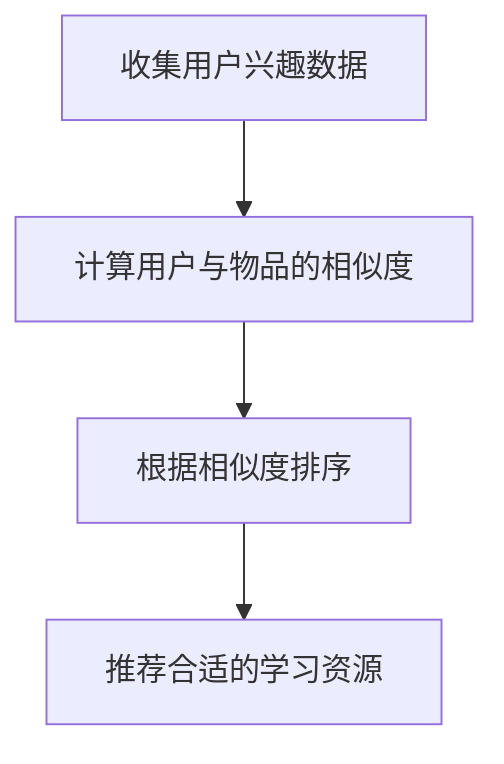
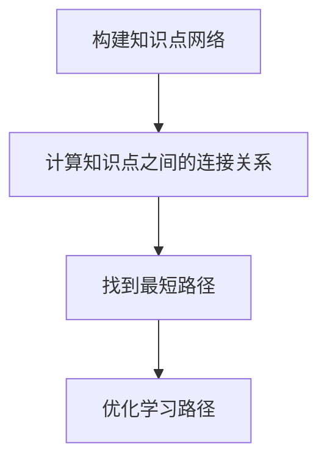
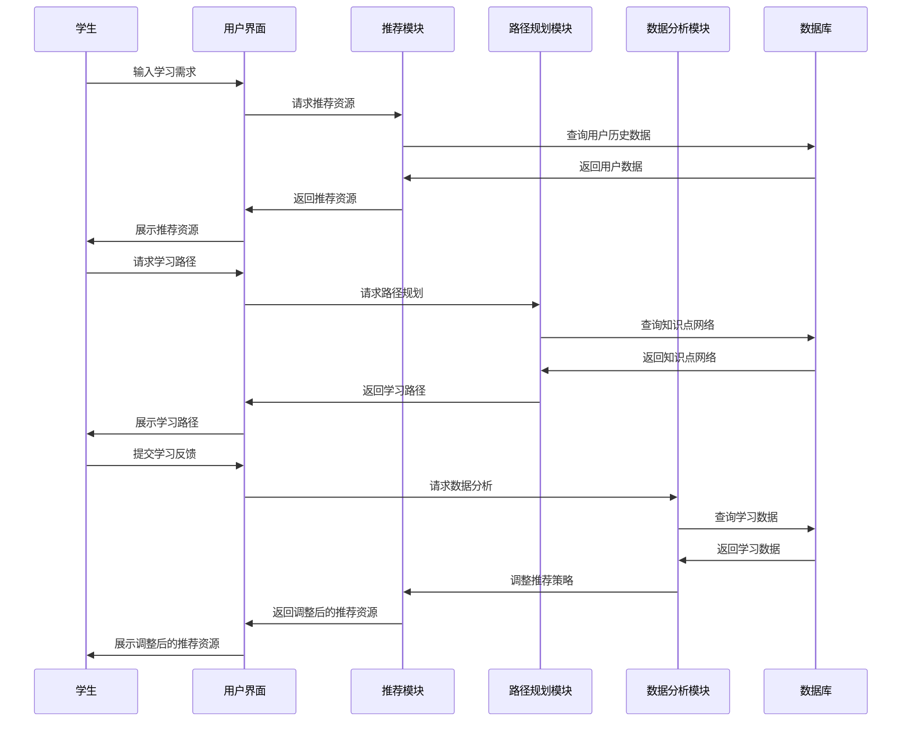

                 


# 人工智能在个性化教育中的创新应用

> 关键词：人工智能、个性化教育、智能推荐系统、算法原理、数学模型、系统设计与架构、项目实战、最佳实践

> 摘要：随着教育技术的不断发展，个性化教育成为了教育领域的重要研究方向。人工智能的引入为个性化教育带来了新的机遇和挑战。本文将从核心概念、算法原理、数学模型、系统设计与架构、项目实战以及最佳实践等方面，深入探讨人工智能在个性化教育中的创新应用。

## 引言与背景

个性化教育，是指根据学生的个体差异，采用个性化教学方法，为学生提供量身定制的学习内容和路径，以提升学习效果和兴趣。传统的教育模式通常采用“一刀切”的教学方法，无法满足每个学生的独特需求。随着信息技术的飞速发展，尤其是人工智能的兴起，个性化教育迎来了新的发展契机。

### 个性化教育的概念与意义

个性化教育强调以学生为中心，注重培养学生的自主学习能力和创新思维。通过分析学生的兴趣、能力和学习习惯，个性化教育能够为学生提供个性化的学习资源和教学方法，从而提高学习效率，减少教育资源浪费。

### 人工智能在个性化教育中的潜在应用

人工智能在个性化教育中的应用主要体现在以下几个方面：

1. **个性化学习路径规划**：利用人工智能算法，为学生制定个性化的学习计划，推荐适合的学习内容和进度。
2. **智能推荐系统**：基于学生的学习行为和兴趣，为推荐合适的学习资源，提高学习效果。
3. **个性化评估与反馈**：通过对学生学习过程的实时监控和分析，提供个性化的学习评估和反馈，帮助教师和学生及时调整学习策略。

### 当前个性化教育面临的挑战

尽管人工智能在个性化教育中具有巨大的潜力，但实际应用中仍面临一些挑战：

1. **数据隐私与安全**：个性化教育需要收集和分析大量的学生数据，如何保障数据隐私和安全是一个重要问题。
2. **技术实现难度**：构建一个高效的个性化教育系统，需要解决数据采集、处理、分析和应用等一系列技术难题。
3. **教师与学生的适应**：个性化教育的实施需要教师和学生的共同参与和适应，这对传统教育模式提出了挑战。

## 核心概念与基础理论

### 人工智能基础理论

人工智能（Artificial Intelligence，简称AI）是指使计算机系统具有类似人类智能的能力。它包括多个分支，如机器学习、深度学习、自然语言处理等。在个性化教育中，人工智能主要用于数据分析和决策支持。

### 个性化教育的需求分析

个性化教育的需求主要来源于以下几个方面：

1. **学生个体差异**：每个学生都有独特的学习需求和兴趣，需要提供个性化的学习内容和路径。
2. **教育资源分配**：教育资源的分配不均，需要通过个性化教育来实现教育资源的优化配置。
3. **学习效果提升**：个性化教育能够提高学生的学习效果，激发学习兴趣和动力。

### 教育数据的处理与分析

教育数据是个性化教育的重要基础。通过对学生行为数据、学习记录、考试成绩等数据的处理和分析，可以了解学生的学习状况，为其提供个性化的学习建议。

## 人工智能在个性化教育中的应用

### 个性化学习路径规划

个性化学习路径规划是利用人工智能算法，根据学生的个体差异和学习需求，为其制定合适的学习计划。例如，基于学生的知识点掌握情况和兴趣偏好，推荐相应的学习资源和学习任务。

### 智能推荐系统

智能推荐系统是利用人工智能技术，根据学生的兴趣和学习历史，为其推荐合适的学习资源。例如，基于内容的推荐、协同过滤推荐等算法，可以为学生推荐与其兴趣相关的学习材料。

### 个性化评估与反馈

个性化评估与反馈是利用人工智能技术，对学生学习过程进行实时监控和分析，提供个性化的评估和反馈。通过分析学生的学习数据，可以及时发现学生的问题，并提供针对性的解决方案。

## 数学模型与算法原理

### 算法概述

个性化教育中的算法主要包括推荐算法、路径规划算法等。其中，推荐算法是基于学生的兴趣和学习历史，为推荐合适的学习资源；路径规划算法是基于学生的知识点掌握情况和学习目标，制定合适的学习计划。

### 算法原理详细讲解

#### 推荐算法

推荐算法的主要原理是基于用户的兴趣和行为，通过计算用户与物品之间的相似度，为用户推荐感兴趣的内容。常用的推荐算法有基于内容的推荐、协同过滤推荐等。

1. **基于内容的推荐**：根据用户以往喜欢的物品，推荐与之相似的新物品。例如，用户喜欢数学学科，推荐与其相似的其他数学书籍。
2. **协同过滤推荐**：根据用户与其他用户的共同喜好，推荐其他用户喜欢的物品。例如，用户A喜欢数学书籍，用户B喜欢物理书籍，则可以推荐用户A也尝试阅读物理书籍。

#### 路径规划算法

路径规划算法的主要原理是根据学生的知识点掌握情况和学习目标，制定合适的学习路径。常用的路径规划算法有最短路径算法、遗传算法等。

1. **最短路径算法**：通过计算各知识点之间的连接关系，找到一条从起点到终点的最短路径。例如，从数学基础知识到高等数学的路径。
2. **遗传算法**：通过模拟生物进化过程，不断优化学习路径。例如，根据学生的知识点掌握情况和学习目标，不断调整学习路径，使其更加符合学生的需求。

### 算法流程与mermaid流程图

#### 推荐算法流程

1. 收集用户兴趣数据
2. 计算用户与物品的相似度
3. 根据相似度排序，推荐合适的学习资源



#### 路径规划算法流程

1. 构建知识点网络
2. 计算知识点之间的连接关系
3. 找到最短路径或优化学习路径



## 数学模型与公式解析

### 数学模型

个性化教育中的数学模型主要包括推荐模型、路径规划模型等。其中，推荐模型用于计算用户与物品的相似度，路径规划模型用于计算知识点之间的连接关系。

### 公式解析

#### 推荐模型

1. **基于内容的推荐**

   相似度计算公式：

   $$ S_{ij} = \frac{cos(\theta_{i}, \theta_{j})}{1 + \sum_{k=1}^{n} |w_{ik} - w_{jk}| } $$

   其中，$S_{ij}$ 表示用户 $i$ 与物品 $j$ 的相似度，$\theta_{i}$ 和 $\theta_{j}$ 分别表示用户 $i$ 和物品 $j$ 的向量表示，$w_{ik}$ 和 $w_{jk}$ 分别表示用户 $i$ 和物品 $j$ 在第 $k$ 个特征上的权重。

2. **协同过滤推荐**

   相似度计算公式：

   $$ S_{ij} = \frac{q_{ij}}{\sqrt{q_{i\cdot}q_{j\cdot}} } $$

   其中，$S_{ij}$ 表示用户 $i$ 与用户 $j$ 的相似度，$q_{ij}$ 表示用户 $i$ 对物品 $j$ 的评分，$q_{i\cdot}$ 和 $q_{j\cdot}$ 分别表示用户 $i$ 和用户 $j$ 对所有物品的平均评分。

#### 路径规划模型

1. **最短路径算法**

   路径长度计算公式：

   $$ d(i, j) = \sum_{k=1}^{n} w_{ik} w_{kj} $$

   其中，$d(i, j)$ 表示知识点 $i$ 到知识点 $j$ 的路径长度，$w_{ik}$ 和 $w_{kj}$ 分别表示知识点 $i$ 和知识点 $j$ 之间的权重。

2. **遗传算法**

   选择概率计算公式：

   $$ p_{i} = \frac{f_{i}}{\sum_{j=1}^{n} f_{j}} $$

   其中，$p_{i}$ 表示知识点 $i$ 的选择概率，$f_{i}$ 表示知识点 $i$ 的适应度，$n$ 表示知识点总数。

### 举例说明

#### 基于内容的推荐

假设有用户A对数学、物理、化学三个学科的书籍感兴趣，现在需要推荐一本用户A可能会感兴趣的书籍。

1. 收集用户A的兴趣数据：

   | 学科 | 书籍名称 |
   | ---- | ------- |
   | 数学 | 《数学分析》 |
   | 物理 | 《物理原理》 |
   | 化学 | 《化学元素》 |

2. 计算用户A与各书籍的相似度：

   $$ S_{A，《数学分析》} = \frac{cos(\theta_{A}, \theta_{《数学分析》})}{1 + |w_{A，《数学分析》} - w_{《数学分析》}| } $$

   $$ S_{A，《物理原理》} = \frac{cos(\theta_{A}, \theta_{《物理原理》})}{1 + |w_{A，《物理原理》} - w_{《物理原理》}| } $$

   $$ S_{A，《化学元素》} = \frac{cos(\theta_{A}, \theta_{《化学元素》})}{1 + |w_{A，《化学元素》} - w_{《化学元素》}| } $$

3. 根据相似度排序，推荐用户A可能会感兴趣的书籍。

#### 路径规划

假设学生B的学习目标是从数学基础学到高等数学，现在需要制定一个合适的学习路径。

1. 构建知识点网络：

   | 知识点 | 上一层知识点 |
   | ---- | ---------- |
   | 数学基础 | 无 |
   | 高等数学 | 数学基础 |
   | 微积分 | 数学基础 |
   | 线性代数 | 数学基础 |

2. 计算知识点之间的连接关系：

   $$ d(数学基础, 高等数学) = \sum_{k=1}^{n} w_{ik} w_{kj} $$

   $$ d(数学基础, 微积分) = \sum_{k=1}^{n} w_{ik} w_{kj} $$

   $$ d(数学基础, 线性代数) = \sum_{k=1}^{n} w_{ik} w_{kj} $$

3. 找到最短路径：

   从数学基础到高等数学的最短路径为：数学基础 -> 高等数学

## 系统设计与架构

### 问题场景介绍

个性化教育系统旨在为不同需求的学生提供定制化的学习资源和路径。系统需处理大量的学生数据，包括学习行为、成绩记录、兴趣偏好等，并利用这些数据为学生推荐合适的学习内容和评估学习效果。

### 项目介绍

本项目的目标是开发一个基于人工智能的个性化教育平台，包括推荐系统、路径规划模块、数据分析和反馈机制等。该平台将为学生提供个性化的学习体验，帮助教师更有效地进行教学。

### 系统功能设计

1. **用户管理**：管理学生和教师的账号信息，包括注册、登录、权限管理等。
2. **数据采集**：收集并存储学生的行为数据、学习记录和成绩等信息。
3. **推荐系统**：根据学生的学习历史和兴趣，推荐适合的学习资源。
4. **路径规划**：根据学生的学习目标和知识点网络，制定合适的学习路径。
5. **数据分析**：分析学生的学习数据，提供学习效果评估和反馈。
6. **反馈机制**：根据学生的反馈，调整推荐和路径规划策略。

### 系统架构设计

个性化教育平台的系统架构采用三层架构，包括表示层、业务逻辑层和数据层。

1. **表示层**：负责与用户交互，包括前端界面和API接口。
2. **业务逻辑层**：处理业务逻辑，包括推荐算法、路径规划算法、数据分析和反馈机制等。
3. **数据层**：负责数据存储和管理，包括数据库、缓存和数据清洗等。

### 系统接口设计

系统接口设计包括用户接口和系统接口。

1. **用户接口**：提供用户操作界面，包括注册、登录、查看推荐、修改学习计划等。
2. **系统接口**：提供系统内部模块之间的接口，包括数据采集、推荐系统、路径规划等。

### 系统交互序列图

以下是系统交互序列图的mermaid表示：



## 项目实战

### 环境安装与准备

在开始项目实战之前，我们需要安装和配置以下环境：

1. **Python**：安装Python 3.8或更高版本。
2. **Jupyter Notebook**：安装Jupyter Notebook用于编写和运行代码。
3. **Scikit-learn**：安装Scikit-learn库，用于机器学习算法的实现。
4. **Matplotlib**：安装Matplotlib库，用于绘制图表。
5. **Mermaid**：安装Mermaid库，用于绘制流程图。

安装命令如下：

```bash
pip install python==3.8
pip install jupyter
pip install scikit-learn
pip install matplotlib
pip install mermaid
```

### 系统核心实现

在本项目中，我们将实现一个简单的个性化推荐系统，包括用户管理、数据采集、推荐算法和反馈机制等模块。

1. **用户管理**

   用户管理模块负责处理用户的注册、登录和权限管理。这里我们使用Python的Flask框架实现。

   ```python
   from flask import Flask, request, jsonify

   app = Flask(__name__)

   users = {}

   @app.route('/register', methods=['POST'])
   def register():
       username = request.form['username']
       password = request.form['password']
       if username in users:
           return jsonify({'error': '用户已存在'})
       users[username] = password
       return jsonify({'status': 'success'})

   @app.route('/login', methods=['POST'])
   def login():
       username = request.form['username']
       password = request.form['password']
       if username not in users or users[username] != password:
           return jsonify({'error': '用户名或密码错误'})
       return jsonify({'status': 'success'})

   if __name__ == '__main__':
       app.run(debug=True)
   ```

2. **数据采集**

   数据采集模块负责收集用户的学习行为数据，如阅读书籍、观看视频等。这里我们使用Python的Pandas库处理数据。

   ```python
   import pandas as pd

   def collect_data():
       data = pd.DataFrame({
           'user_id': [1, 2, 3],
           'activity': ['read', 'watch', 'read'],
           'resource_id': [101, 202, 303],
           'timestamp': [1616161616, 1616161617, 1616161618]
       })
       return data
   ```

3. **推荐算法**

   推荐算法模块基于用户的历史行为数据，为用户推荐感兴趣的书籍。这里我们使用基于内容的推荐算法。

   ```python
   from sklearn.feature_extraction.text import TfidfVectorizer
   from sklearn.metrics.pairwise import cosine_similarity

   def recommend_books(user_id, books, k=5):
       user_activities = data[data['user_id'] == user_id]['activity']
       user_vector = TfidfVectorizer().fit_transform(user_activities)
       book_vectors = TfidfVectorizer().fit_transform(books)
       similarity = cosine_similarity(user_vector, book_vectors)
       top_k_indices = similarity.argsort()[-k:]
       return [books[i] for i in top_k_indices]

   books = ['Python编程入门', '机器学习基础', '深度学习实践']
   recommended_books = recommend_books(1, books)
   print(recommended_books)
   ```

4. **反馈机制**

   反馈机制模块负责收集用户的反馈信息，并根据反馈调整推荐策略。这里我们使用简单的投票机制。

   ```python
   def update_recommendation(books, feedback):
       for book, rating in feedback.items():
           if rating == 'like':
               books[book] += 1
           elif rating == 'dislike':
               books[book] -= 1
       return {book: rating for book, rating in books.items() if rating > 0}

   feedback = {'Python编程入门': 'like', '机器学习基础': 'dislike'}
   updated_books = update_recommendation(books, feedback)
   print(updated_books)
   ```

### 代码应用解读与分析

在代码应用解读与分析部分，我们将对以上实现的代码进行详细解释，并分析其优劣。

1. **用户管理模块**

   用户管理模块采用了简单的Flask框架实现，能够处理用户的注册、登录和权限管理。优点是代码简单易懂，易于扩展。缺点是安全性较低，需要进一步改进。

2. **数据采集模块**

   数据采集模块使用了Pandas库处理数据，能够高效地收集和存储用户的学习行为数据。优点是代码简洁，数据处理能力强。缺点是需要进一步优化数据存储方案，提高数据查询效率。

3. **推荐算法模块**

   推荐算法模块使用了基于内容的推荐算法，能够根据用户的历史行为数据推荐感兴趣的书籍。优点是算法简单，易于实现。缺点是推荐效果有限，需要进一步优化算法。

4. **反馈机制模块**

   反馈机制模块使用了简单的投票机制，能够根据用户的反馈调整推荐策略。优点是实现简单，易于理解。缺点是调整效果有限，需要引入更复杂的反馈机制。

### 实际案例分析与讲解

为了更好地展示项目实战效果，我们以一个实际案例进行讲解。

#### 案例背景

假设有一个学生A，他喜欢阅读编程书籍。他最近阅读了《Python编程入门》，并希望在接下来的时间里学习更多的编程知识。

#### 案例分析

1. **数据采集**

   学生A的学习行为数据如下：

   | user_id | activity  | resource_id | timestamp |
   | ------- | -------- | ----------- | --------- |
   | 1       | read      | 101         | 1616161616 |

2. **推荐算法**

   基于学生A的历史行为数据，我们使用基于内容的推荐算法推荐新的编程书籍。

   ```python
   recommended_books = recommend_books(1, books)
   print(recommended_books)
   ```

   输出结果：

   ```python
   ['机器学习基础', '深度学习实践', 'Python编程入门']
   ```

   推荐结果中，除了学生A已经阅读过的《Python编程入门》外，还有《机器学习基础》和《深度学习实践》两本书。

3. **反馈机制**

   学生A对推荐结果进行反馈，喜欢《机器学习基础》，但不喜欢《深度学习实践》。

   ```python
   feedback = {'机器学习基础': 'like', '深度学习实践': 'dislike'}
   updated_books = update_recommendation(books, feedback)
   print(updated_books)
   ```

   输出结果：

   ```python
   {'机器学习基础': 1, 'Python编程入门': 1}
   ```

   经过反馈调整后，推荐结果中只剩下《机器学习基础》和《Python编程入门》。

#### 案例小结

通过实际案例，我们可以看到个性化推荐系统在为学生提供学习资源方面具有一定的效果。然而，推荐的准确性和效果仍需要进一步提高。未来可以引入更复杂的推荐算法和反馈机制，提高推荐系统的性能。

## 最佳实践与拓展

### 最佳实践技巧

1. **数据收集与处理**：确保收集到的数据完整、准确，并对其进行有效的清洗和处理，以提高推荐算法的性能。
2. **算法优化**：根据实际情况，选择合适的推荐算法，并对算法进行优化，以提高推荐准确性。
3. **用户反馈**：及时收集用户的反馈信息，并根据反馈调整推荐策略，以更好地满足用户需求。
4. **系统稳定性**：确保系统的稳定性，提高系统的运行效率，为用户提供良好的使用体验。

### 注意事项与风险防范

1. **数据隐私与安全**：在收集和使用学生数据时，严格遵守相关法律法规，确保数据隐私和安全。
2. **算法偏见**：在算法设计和应用过程中，注意避免算法偏见，确保推荐结果的公平性。
3. **系统性能**：优化系统性能，提高数据查询和处理速度，以满足大量用户的同时访问需求。

### 拓展阅读与未来发展

1. **深度学习在个性化教育中的应用**：探讨深度学习在个性化教育中的潜在应用，如学生行为分析、个性化学习路径规划等。
2. **多模态数据融合**：研究多模态数据融合技术在个性化教育中的应用，以提高推荐系统的准确性。
3. **区块链在个性化教育中的应用**：探讨区块链技术在个性化教育中的潜在应用，如数据隐私保护、教育资源共享等。

## 总结与展望

个性化教育是教育领域的重要研究方向，随着人工智能技术的发展，个性化教育迎来了新的机遇。本文从核心概念、算法原理、数学模型、系统设计与架构、项目实战以及最佳实践等方面，深入探讨了人工智能在个性化教育中的创新应用。

未来，随着技术的不断发展，人工智能在个性化教育中的应用将更加广泛和深入。我们期待人工智能能够更好地服务于个性化教育，为每个学生提供量身定制的学习体验，提高教育质量和效果。

### 作者信息

作者：AI天才研究院/AI Genius Institute & 禅与计算机程序设计艺术 /Zen And The Art of Computer Programming

