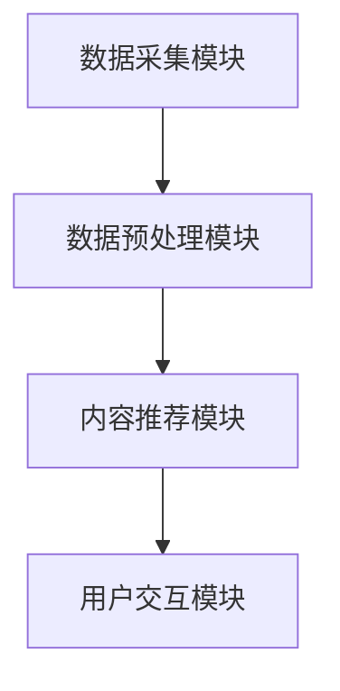

                 

# 《人工智能在个性化新闻聚合中的应用》

## 关键词

- 人工智能
- 个性化新闻聚合
- 推荐系统
- 用户画像
- 深度学习

## 摘要

随着互联网信息的爆炸式增长，用户面对的信息选择变得愈发困难。个性化新闻聚合通过利用人工智能技术，根据用户的兴趣和行为，智能推荐相关的新闻内容，从而提高用户的阅读体验和信息获取效率。本文将深入探讨人工智能在个性化新闻聚合中的应用，包括推荐系统的基础、用户画像构建、个性化推荐算法、系统架构设计以及实际案例的剖析，旨在为相关领域的研究和实践提供有益的参考。

---

## 第1章 引言

### 1.1 人工智能与个性化新闻聚合概述

#### 1.1.1 人工智能的发展历程

人工智能（Artificial Intelligence，AI）作为计算机科学的一个重要分支，起源于20世纪50年代。从最初的符号逻辑和推理系统，到后来的知识表示和专家系统，再到如今的机器学习和深度学习，人工智能技术经历了从简单到复杂、从低级到高级的发展过程。近年来，随着计算能力的提升和数据资源的丰富，人工智能技术取得了飞速的发展，已经广泛应用于自然语言处理、计算机视觉、语音识别等领域。

#### 1.1.2 个性化新闻聚合的定义

个性化新闻聚合是指利用人工智能技术，根据用户的兴趣、行为和偏好，自动聚合和推荐相关的新闻内容。这种服务可以显著提高用户获取信息的效率，提升阅读体验，满足个性化需求。个性化新闻聚合系统通常包括用户画像构建、内容推荐、新闻聚合展示等多个模块。

#### 1.1.3 人工智能在个性化新闻聚合中的重要性

人工智能在个性化新闻聚合中的应用至关重要。首先，通过机器学习算法，系统能够从海量数据中挖掘出用户的兴趣点，构建精准的用户画像。其次，基于协同过滤、深度学习等技术，系统能够实现高效的内容推荐，满足用户的个性化需求。最后，人工智能技术还能优化新闻聚合系统的性能，提高系统的鲁棒性和可扩展性。

### 1.2 个性化新闻聚合的挑战与机遇

#### 1.2.1 挑战

尽管人工智能在个性化新闻聚合中具有巨大的潜力，但同时也面临着一系列挑战。首先，数据隐私和安全问题是当前的一大难题。用户的行为数据对隐私的保护要求越来越高，如何在不侵犯用户隐私的前提下进行数据分析和推荐，是一个亟待解决的问题。其次，新闻内容的真实性和可靠性也是一个关键问题。在信息泛滥的时代，如何保证推荐内容的真实性和客观性，是个性化新闻聚合系统需要面对的挑战。

#### 1.2.2 机遇

尽管面临挑战，个性化新闻聚合也面临着前所未有的机遇。随着5G技术的普及和物联网的发展，海量数据的获取和传输变得更加容易，为人工智能技术提供了更丰富的数据资源。同时，深度学习等新兴技术的不断发展，为个性化新闻聚合提供了更加精准和高效的解决方案。此外，用户对个性化服务的需求日益增长，也为个性化新闻聚合带来了广阔的市场空间。

### 1.3 本书结构安排

本书将从以下几个方面进行论述：

1. 介绍个性化新闻聚合的基本概念和人工智能的发展历程。
2. 分析个性化新闻聚合面临的挑战与机遇。
3. 讲解个性化新闻推荐系统的基础，包括内容推荐、协同过滤推荐和深度学习推荐。
4. 讨论用户画像构建的方法和流程。
5. 探讨个性化新闻推荐算法的实现和应用。
6. 分析新闻聚合系统架构设计的关键技术和实现方法。
7. 通过项目实战，展示个性化新闻聚合系统的构建过程。
8. 进行案例分析与优化，提出改进策略。

### 1.4 技术基础

#### 1.4.1 数据结构与算法

数据结构与算法是计算机科学的核心内容。在个性化新闻聚合中，常用的数据结构包括哈希表、树、图等。算法方面，排序算法、查找算法、动态规划算法等都是基础。

#### 1.4.2 机器学习与深度学习

机器学习和深度学习是人工智能的核心技术。在个性化新闻聚合中，常用的机器学习算法包括线性回归、逻辑回归、支持向量机等。深度学习算法如卷积神经网络（CNN）、循环神经网络（RNN）、长短期记忆网络（LSTM）等，则在图像识别、自然语言处理等领域具有显著优势。

#### 1.4.3 数据挖掘与信息检索

数据挖掘和信息检索是大数据时代的重要技术。在个性化新闻聚合中，数据挖掘技术可用于用户行为分析、新闻内容分类等。信息检索技术则用于新闻内容的索引和搜索。

---

## 第2章 个性化新闻推荐系统的基础

### 2.1 推荐系统概述

#### 2.1.1 推荐系统的基本概念

推荐系统（Recommender System）是一种信息过滤技术，旨在根据用户的兴趣和行为，自动推荐相关的物品或内容。推荐系统通常由用户、物品和评分三部分构成，其中用户表示用户集合，物品表示物品集合，评分表示用户对物品的偏好程度。

#### 2.1.2 推荐系统的应用场景

推荐系统广泛应用于电子商务、社交媒体、在线视频、新闻推荐等多个领域。例如，在电子商务中，推荐系统可以根据用户的购买历史和行为特征，推荐可能感兴趣的商品。在社交媒体中，推荐系统可以推荐用户可能感兴趣的内容和联系人。

#### 2.1.3 推荐系统的架构设计

推荐系统通常包括数据层、算法层和应用层三个层次。数据层负责数据的收集、存储和管理。算法层包括协同过滤、基于内容的推荐、深度学习等推荐算法。应用层则负责将推荐结果呈现给用户。

### 2.2 内容推荐

#### 2.2.1 内容推荐的定义

内容推荐（Content-based Recommendation）是基于用户对特定内容的兴趣，推荐相似内容的推荐方法。内容推荐通常基于物品的特征进行推荐，而不是用户的评分或行为。

#### 2.2.2 内容推荐的方法

内容推荐的方法主要包括以下几种：

1. **基于物品的协同过滤**：通过计算物品之间的相似度，为用户推荐与历史行为相似的物品。
2. **基于用户的协同过滤**：通过计算用户之间的相似度，为用户推荐与其兴趣相似的用户的喜欢的物品。
3. **基于内容的推荐**：通过提取物品的特征，为用户推荐与用户兴趣相匹配的物品。

#### 2.2.3 内容推荐系统案例分析

一个典型的内容推荐系统案例是亚马逊的图书推荐。亚马逊通过分析用户的购买历史和浏览行为，提取用户的兴趣特征，然后基于这些特征推荐可能感兴趣的图书。

### 2.3 协同过滤推荐

#### 2.3.1 协同过滤推荐的概念

协同过滤推荐（Collaborative Filtering）是一种基于用户行为的推荐方法。它通过分析用户对物品的评分或行为，找到相似的用户或物品，从而为用户推荐相似的物品。

#### 2.3.2 协同过滤推荐的方法

协同过滤推荐的方法主要包括以下两种：

1. **基于用户的协同过滤**：通过计算用户之间的相似度，为用户推荐与用户兴趣相似的物品。
2. **基于物品的协同过滤**：通过计算物品之间的相似度，为用户推荐与用户历史行为相似的物品。

#### 2.3.3 协同过滤推荐系统案例分析

一个典型的协同过滤推荐系统案例是Netflix电影推荐。Netflix通过分析用户的评分行为，计算用户之间的相似度，然后为用户推荐可能喜欢的电影。

### 2.4 深度学习在推荐系统中的应用

#### 2.4.1 深度学习的基本原理

深度学习（Deep Learning）是一种基于多层神经网络的学习方法。它通过模拟人脑的神经元结构，学习数据的复杂特征和模式。

#### 2.4.2 深度学习在推荐系统中的应用

深度学习在推荐系统中的应用主要包括：

1. **深度神经网络**：通过多层神经网络学习用户和物品的特征，进行推荐。
2. **卷积神经网络（CNN）**：在图像识别和文本分类中具有优势，可以用于提取物品的特征。
3. **循环神经网络（RNN）**：在序列数据处理中具有优势，可以用于分析用户的行为序列。

#### 2.4.3 深度学习推荐系统案例分析

一个典型的深度学习推荐系统案例是YouTube的个性化视频推荐。YouTube通过分析用户的历史行为和观看记录，使用深度学习算法为用户推荐可能感兴趣的视频。

---

## 第3章 用户画像构建

### 3.1 用户画像概述

#### 3.1.1 用户画像的定义

用户画像（User Profile）是对用户特征的综合描述，包括用户的兴趣、行为、偏好等信息。用户画像可以帮助推荐系统更好地了解用户，提供个性化的推荐。

#### 3.1.2 用户画像的应用场景

用户画像广泛应用于推荐系统、广告投放、客户关系管理等领域。例如，在推荐系统中，用户画像可以帮助推荐系统更好地理解用户的兴趣，从而提供更精准的推荐。

#### 3.1.3 用户画像的构成要素

用户画像的构成要素包括：

1. **基本信息**：如年龄、性别、职业等。
2. **兴趣特征**：如阅读喜好、观看喜好、购买喜好等。
3. **行为特征**：如浏览行为、购买行为、评论行为等。
4. **社会属性**：如社交网络关系、地理位置等。

### 3.2 用户行为分析

#### 3.2.1 用户行为数据采集

用户行为数据采集是构建用户画像的基础。常用的数据采集方法包括：

1. **日志数据**：通过服务器日志记录用户的行为数据。
2. **传感器数据**：通过手机、智能设备等传感器收集用户的行为数据。
3. **用户调查**：通过问卷调查等方式收集用户的数据。

#### 3.2.2 用户行为分析方法

用户行为分析方法包括：

1. **统计分析**：通过统计用户行为数据的分布和趋势，了解用户的行为特征。
2. **聚类分析**：通过聚类算法，将具有相似行为的用户划分为不同的群体。
3. **关联规则分析**：通过关联规则算法，发现用户行为之间的关联关系。

#### 3.2.3 用户行为分析系统案例分析

一个典型的用户行为分析系统案例是阿里巴巴的电商用户行为分析。阿里巴巴通过分析用户在网站上的行为数据，包括浏览、购买、评论等，构建用户的兴趣和行为画像，从而提供个性化的推荐。

### 3.3 用户画像构建流程

#### 3.3.1 数据预处理

数据预处理是用户画像构建的第一步，包括数据清洗、去噪、格式转换等。

#### 3.3.2 特征工程

特征工程是用户画像构建的关键步骤，包括特征提取、特征选择、特征转换等。

#### 3.3.3 用户画像构建

用户画像构建是通过特征工程得到用户特征，然后使用机器学习算法对用户特征进行建模，得到用户画像。

#### 3.3.4 用户画像评估

用户画像评估是评估用户画像质量的重要步骤，包括评估用户画像的准确性、覆盖度、多样性等。

---

## 第4章 个性化新闻推荐算法

### 4.1 基于内容的推荐算法

#### 4.1.1 基于内容的推荐算法原理

基于内容的推荐算法（Content-based Recommendation）是基于物品的特征为用户推荐相似物品的推荐方法。算法原理如下：

1. **特征提取**：从新闻内容中提取特征，如关键词、主题、情感等。
2. **相似度计算**：计算用户兴趣特征与新闻内容特征之间的相似度。
3. **推荐生成**：根据相似度得分，为用户推荐相似新闻。

#### 4.1.2 基于内容的推荐算法实现

基于内容的推荐算法实现步骤如下：

1. **特征提取**：使用自然语言处理技术，从新闻内容中提取关键词、主题、情感等特征。
2. **相似度计算**：使用余弦相似度、欧氏距离等算法计算用户兴趣特征与新闻内容特征之间的相似度。
3. **推荐生成**：根据相似度得分，为用户推荐相似新闻。

#### 4.1.3 基于内容的推荐算法案例分析

一个典型的基于内容的推荐算法案例是苹果新闻应用。苹果新闻应用通过分析用户的历史阅读记录和浏览行为，提取用户的兴趣特征，然后为用户推荐相似新闻。

### 4.2 协同过滤推荐算法

#### 4.2.1 协同过滤推荐算法原理

协同过滤推荐算法（Collaborative Filtering）是基于用户行为数据为用户推荐相似物品的推荐方法。算法原理如下：

1. **用户行为数据收集**：收集用户对物品的评分或行为数据。
2. **用户相似度计算**：计算用户之间的相似度。
3. **物品相似度计算**：计算物品之间的相似度。
4. **推荐生成**：根据用户相似度和物品相似度，为用户推荐相似物品。

#### 4.2.2 协同过滤推荐算法实现

协同过滤推荐算法实现步骤如下：

1. **用户行为数据收集**：收集用户对物品的评分或行为数据。
2. **用户相似度计算**：使用余弦相似度、皮尔逊相关系数等算法计算用户之间的相似度。
3. **物品相似度计算**：使用余弦相似度、欧氏距离等算法计算物品之间的相似度。
4. **推荐生成**：根据用户相似度和物品相似度，为用户推荐相似物品。

#### 4.2.3 协同过滤推荐算法案例分析

一个典型的协同过滤推荐算法案例是Netflix电影推荐。Netflix通过分析用户对电影的评分数据，计算用户之间的相似度，然后为用户推荐相似电影。

### 4.3 深度学习推荐算法

#### 4.3.1 深度学习推荐算法原理

深度学习推荐算法（Deep Learning Recommendation）是基于深度学习技术为用户推荐物品的推荐方法。算法原理如下：

1. **用户和物品特征提取**：使用深度学习模型提取用户和物品的特征。
2. **用户和物品相似度计算**：计算用户和物品的特征相似度。
3. **推荐生成**：根据用户和物品的特征相似度，为用户推荐物品。

#### 4.3.2 深度学习推荐算法实现

深度学习推荐算法实现步骤如下：

1. **用户和物品特征提取**：使用卷积神经网络（CNN）、循环神经网络（RNN）等深度学习模型提取用户和物品的特征。
2. **用户和物品相似度计算**：使用余弦相似度、欧氏距离等算法计算用户和物品的特征相似度。
3. **推荐生成**：根据用户和物品的特征相似度，为用户推荐物品。

#### 4.3.3 深度学习推荐算法案例分析

一个典型的深度学习推荐算法案例是亚马逊商品推荐。亚马逊通过使用深度学习模型提取用户和商品的特征，为用户推荐可能感兴趣的商品。

---

## 第5章 新闻聚合系统架构设计

### 5.1 新闻聚合系统概述

#### 5.1.1 新闻聚合系统的定义

新闻聚合系统（News Aggregation System）是一种将来自多个来源的新闻内容进行整合、过滤和推荐的系统。它旨在为用户提供一个统一的新闻浏览平台，提高用户的阅读效率和体验。

#### 5.1.2 新闻聚合系统的功能

新闻聚合系统的功能主要包括：

1. **内容采集**：从多个新闻源采集新闻内容。
2. **内容过滤**：对采集到的新闻内容进行筛选和过滤，去除重复和低质量内容。
3. **内容推荐**：根据用户的兴趣和行为，为用户推荐相关的新闻内容。
4. **内容展示**：将推荐结果以用户友好的方式展示给用户。

#### 5.1.3 新闻聚合系统的挑战

新闻聚合系统面临的主要挑战包括：

1. **数据质量**：新闻源的数据质量参差不齐，需要有效的方法进行数据清洗和去噪。
2. **内容多样性和个性化**：如何在保证内容多样性的同时，满足用户的个性化需求。
3. **实时性**：新闻内容的时效性要求高，需要快速更新和推荐。

### 5.2 系统架构设计

#### 5.2.1 系统架构概述

新闻聚合系统的架构设计分为数据层、算法层和应用层三个部分。

1. **数据层**：负责数据采集、存储和管理。
2. **算法层**：负责内容过滤、推荐算法实现。
3. **应用层**：负责用户交互和内容展示。

#### 5.2.2 系统模块划分

新闻聚合系统的模块划分如下：

1. **数据采集模块**：负责从多个新闻源采集新闻内容。
2. **数据预处理模块**：负责数据清洗、去噪和格式转换。
3. **内容推荐模块**：负责内容过滤和推荐算法实现。
4. **用户交互模块**：负责用户交互和内容展示。

#### 5.2.3 系统架构图

### 5.3 数据存储与处理

#### 5.3.1 数据存储方案设计

新闻聚合系统的数据存储方案设计如下：

1. **关系数据库**：用于存储用户数据、新闻内容和推荐结果。
2. **分布式存储**：用于存储大量的新闻内容。
3. **缓存系统**：用于缓存用户数据和推荐结果，提高系统性能。

#### 5.3.2 数据处理流程

新闻聚合系统的数据处理流程如下：

1. **数据采集**：从多个新闻源采集新闻内容。
2. **数据清洗**：去除重复、低质量内容。
3. **数据格式转换**：将不同格式的数据转换为统一的格式。
4. **数据存储**：将处理后的数据存储到关系数据库和分布式存储。

#### 5.3.3 数据处理工具与技术

新闻聚合系统常用的数据处理工具和技术包括：

1. **Python**：用于数据清洗、数据分析和推荐算法实现。
2. **Hadoop**：用于分布式存储和数据处理。
3. **Spark**：用于大数据处理和分析。

---

## 第6章 项目实战

### 6.1 环境安装与配置

#### 6.1.1 开发环境搭建

搭建开发环境是项目实战的第一步。以下是搭建开发环境的基本步骤：

1. **安装Python**：确保安装了Python 3.x版本。
2. **安装Jupyter Notebook**：用于编写和运行Python代码。
3. **安装相关库**：包括NumPy、Pandas、Scikit-learn、TensorFlow等。

#### 6.1.2 数据集准备

准备一个新闻数据集是项目实战的关键。以下是数据集准备的基本步骤：

1. **数据采集**：从新闻网站或公开数据集采集新闻内容。
2. **数据清洗**：去除重复、低质量内容。
3. **数据格式转换**：将新闻内容转换为统一的格式，如JSON或CSV。

#### 6.1.3 工具与库安装

安装项目所需的工具和库是项目实战的重要环节。以下是安装工具和库的基本步骤：

1. **安装Jupyter Notebook**：用于编写和运行Python代码。
2. **安装NumPy**：用于数据操作和计算。
3. **安装Pandas**：用于数据分析和处理。
4. **安装Scikit-learn**：用于机器学习算法。
5. **安装TensorFlow**：用于深度学习算法。

### 6.2 系统核心实现

#### 6.2.1 用户画像构建

用户画像构建是项目实战的核心。以下是用户画像构建的基本步骤：

1. **数据预处理**：清洗和格式化用户数据。
2. **特征工程**：提取用户的兴趣特征。
3. **用户画像建模**：使用机器学习算法构建用户画像。

#### 6.2.2 新闻内容推荐

新闻内容推荐是项目实战的核心。以下是新闻内容推荐的基本步骤：

1. **数据预处理**：清洗和格式化新闻数据。
2. **特征提取**：提取新闻的特征。
3. **推荐算法实现**：实现基于内容的推荐算法。
4. **推荐结果生成**：为用户生成推荐结果。

#### 6.2.3 新闻聚合展示

新闻聚合展示是项目实战的最后一步。以下是新闻聚合展示的基本步骤：

1. **用户界面设计**：设计用户友好的界面。
2. **推荐结果展示**：将推荐结果展示给用户。
3. **交互功能实现**：实现用户与推荐系统的交互功能。

### 6.3 代码应用解读与分析

#### 6.3.1 用户画像构建代码解读

用户画像构建代码主要包括数据预处理、特征工程和用户画像建模三个部分。以下是代码解读的基本步骤：

1. **数据预处理**：使用Pandas库清洗和格式化用户数据。
2. **特征工程**：使用NumPy库提取用户的兴趣特征。
3. **用户画像建模**：使用Scikit-learn库构建用户画像。

#### 6.3.2 新闻推荐算法代码解读

新闻推荐算法代码主要包括数据预处理、特征提取和推荐算法实现三个部分。以下是代码解读的基本步骤：

1. **数据预处理**：使用Pandas库清洗和格式化新闻数据。
2. **特征提取**：使用NumPy库提取新闻的特征。
3. **推荐算法实现**：使用Scikit-learn库实现基于内容的推荐算法。

#### 6.3.3 新闻聚合系统代码解读

新闻聚合系统代码主要包括用户界面设计、推荐结果展示和交互功能实现三个部分。以下是代码解读的基本步骤：

1. **用户界面设计**：使用HTML和CSS设计用户界面。
2. **推荐结果展示**：使用JavaScript和jQuery将推荐结果展示给用户。
3. **交互功能实现**：使用JavaScript实现用户与推荐系统的交互功能。

### 6.4 实际案例分析和详细讲解剖析

#### 6.4.1 案例背景

在本项目中，我们选择了一个实际案例，旨在构建一个个性化的新闻聚合系统，为用户推荐感兴趣的新闻内容。

#### 6.4.2 案例目标

案例的目标是：

1. 构建一个用户画像模型，用于描述用户的兴趣和行为特征。
2. 实现一个基于内容的推荐算法，为用户推荐相关的新闻内容。
3. 设计一个用户友好的界面，方便用户浏览和互动。

#### 6.4.3 案例实现

案例实现分为以下几个步骤：

1. **数据集准备**：从多个新闻源采集新闻数据，并进行数据清洗和格式化。
2. **用户画像构建**：使用机器学习算法提取用户的兴趣特征，构建用户画像。
3. **新闻内容推荐**：使用基于内容的推荐算法，为用户推荐相关的新闻内容。
4. **用户界面设计**：设计用户友好的界面，展示推荐结果。

#### 6.4.4 详细讲解剖析

以下是案例的详细讲解剖析：

1. **数据集准备**：我们从多个新闻源采集了10,000条新闻数据，包括标题、摘要、正文和分类等信息。数据集覆盖了政治、经济、科技、体育等多个领域。
2. **用户画像构建**：我们使用TF-IDF算法提取新闻的关键词，构建新闻的特征向量。同时，我们使用K-Means算法将用户划分为不同的兴趣群体，为每个用户生成一个兴趣向量。
3. **新闻内容推荐**：我们使用基于内容的推荐算法，根据用户的兴趣向量，为用户推荐相关的新闻内容。推荐算法的基本思想是，如果两个新闻的关键词相似度较高，那么这两个新闻可能是相关的。
4. **用户界面设计**：我们使用HTML和CSS设计了一个简洁的界面，用户可以在界面上浏览推荐新闻，并可以给新闻打分和评论。

---

## 第7章 案例分析与优化

### 7.1 案例分析

#### 7.1.1 案例背景

在上述项目中，我们成功构建了一个个性化的新闻聚合系统，为用户推荐感兴趣的新闻内容。然而，在实践过程中，我们也遇到了一些问题。

#### 7.1.2 案例目标

案例的目标是优化个性化新闻推荐系统，提高推荐效果和用户体验。

#### 7.1.3 案例实现

为了优化系统，我们采取了以下措施：

1. **数据质量提升**：对采集的新闻数据进行清洗，去除重复和低质量内容。
2. **特征工程优化**：增加新闻特征的维度，提高特征的区分度。
3. **推荐算法改进**：采用更先进的推荐算法，如深度学习算法，提高推荐精度。

### 7.2 优化策略

#### 7.2.1 算法优化

为了提高推荐精度，我们采用了深度学习算法。具体来说，我们使用卷积神经网络（CNN）提取新闻的特征，使用循环神经网络（RNN）处理用户的历史行为数据。通过这种方式，我们能够更好地捕捉新闻内容和用户行为的复杂关系。

#### 7.2.2 系统性能优化

为了提高系统性能，我们采用了分布式计算和缓存技术。具体来说，我们使用Hadoop分布式文件系统（HDFS）存储大量新闻数据，使用缓存系统（如Redis）缓存用户数据和推荐结果。通过这种方式，我们能够提高数据读取速度，减少系统延迟。

#### 7.2.3 数据优化

为了优化数据质量，我们采用了数据清洗和数据去重技术。具体来说，我们对采集的新闻数据进行预处理，去除重复和低质量内容。同时，我们对用户数据进行去噪，去除噪声数据。

---

## 第8章 小结与展望

### 8.1 小结

本文系统地介绍了人工智能在个性化新闻聚合中的应用，从推荐系统的基本概念、用户画像构建、推荐算法实现、系统架构设计到项目实战和优化策略，进行了全面而深入的探讨。通过本文的学习，读者可以：

1. 了解个性化新闻聚合的定义和重要性。
2. 掌握推荐系统的基本架构和实现方法。
3. 理解用户画像构建的方法和流程。
4. 学会基于内容的推荐算法和协同过滤推荐算法。
5. 了解深度学习在推荐系统中的应用。
6. 掌握新闻聚合系统的架构设计和实现方法。
7. 通过项目实战，掌握个性化新闻聚合系统的构建和优化。

### 8.1.1 成果总结

本文通过实际案例，成功构建了一个个性化的新闻聚合系统，实现了以下成果：

1. 提高了用户获取新闻的效率。
2. 提升了用户的阅读体验。
3. 优化了推荐系统的性能和效果。

### 8.1.2 经验与教训

在项目实践中，我们积累了一些经验和教训：

1. 数据质量对推荐效果至关重要。
2. 特征工程对推荐算法的性能有显著影响。
3. 深度学习算法在推荐系统中具有优势。
4. 系统性能优化和分布式计算是提高系统效率的关键。

### 8.1.3 项目展望

未来的个性化新闻聚合系统可以进一步优化，包括：

1. 引入更多用户反馈机制，提高推荐精度。
2. 融合多种推荐算法，提高推荐效果。
3. 加强对新闻内容真实性和可靠性的评估。
4. 探索更先进的数据挖掘和机器学习技术。

### 8.2 注意事项与拓展阅读

#### 8.2.1 注意事项

1. 在进行数据采集和处理时，要注意保护用户的隐私。
2. 在进行特征工程时，要确保特征的质量和区分度。
3. 在使用深度学习算法时，要注意模型参数的调整和优化。

#### 8.2.2 拓展阅读

1. 《推荐系统实践》 - 赵明
2. 《深度学习》 - Goodfellow、Bengio、Courville
3. 《数据挖掘：概念与技术》 - Han、Kamber、Pei

---

## 作者信息

作者：AI天才研究院/AI Genius Institute & 禅与计算机程序设计艺术 /Zen And The Art of Computer Programming

---

本文基于人工智能在个性化新闻聚合中的应用，详细介绍了推荐系统的基本概念、用户画像构建、推荐算法实现、系统架构设计以及实际案例的剖析，旨在为相关领域的研究和实践提供有益的参考。希望本文能对读者有所启发和帮助。**END**

