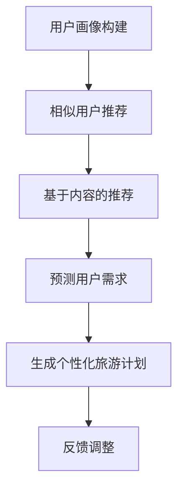

                 

### 人工智能在个性化旅游规划中的应用

关键词：人工智能，个性化旅游规划，机器学习，深度学习，自然语言处理

摘要：本文将深入探讨人工智能在个性化旅游规划中的应用，通过逐步分析，揭示如何利用人工智能技术为旅游者提供量身定制的旅游体验。文章首先介绍人工智能在旅游行业的应用背景，随后详细讲解个性化旅游规划的概念和需求。接着，我们将探讨机器学习、深度学习和自然语言处理等人工智能核心技术的原理和应用，使用Mermaid流程图和Python代码进行说明。最后，文章将介绍系统的设计与实现，包括数据收集与处理、个性化需求分析、规划算法以及系统架构和项目实战。通过这一系列的分析与讲解，本文旨在展示人工智能如何为个性化旅游规划带来革命性的改变。

### 目录大纲设计

为了更好地组织本文内容，我们设计了一个结构清晰、逻辑紧凑的目录大纲。以下是本文的目录大纲：

1. **背景介绍**：
   - 人工智能在旅游行业中的应用
   - 个性化旅游规划的概念与需求

2. **核心概念与联系**：
   - 人工智能概述
   - 个性化旅游规划概述
   - 机器学习基础
   - 深度学习基础
   - 自然语言处理基础

3. **算法原理讲解**：
   - 机器学习算法原理讲解
   - 深度学习算法原理讲解
   - 自然语言处理算法原理讲解

4. **系统分析与架构设计方案**：
   - 数据收集与处理
   - 个性化旅游需求分析
   - 个性化旅游规划算法
   - 系统架构设计
   - 系统接口设计

5. **项目实战**：
   - 环境安装与配置
   - 系统核心实现源代码
   - 实际案例分析与详细讲解剖析
   - 项目小结

6. **最佳实践与总结**：
   - 最佳实践 tips
   - 小结
   - 注意事项
   - 拓展阅读

通过以上目录大纲的设计，本文将系统地介绍人工智能在个性化旅游规划中的应用，确保内容的连贯性和实用性。

### 第一部分：引言与背景

#### 人工智能在旅游行业中的应用

近年来，人工智能（AI）技术在各行各业中得到了广泛应用，旅游行业也不例外。随着人们对个性化、智能化服务的需求不断增长，人工智能在旅游规划、推荐系统、智能导览、虚拟现实等方面展现出巨大的潜力。

首先，人工智能可以帮助旅游规划者分析海量数据，识别用户的偏好和行为模式，从而提供个性化的旅游路线和活动推荐。例如，通过用户历史数据和行为轨迹，AI可以预测用户可能的兴趣点，生成定制化的旅游路线，使旅行更加有目的性和丰富性。

其次，智能导览系统利用语音识别、自然语言处理等技术，为游客提供实时、个性化的讲解服务。这些系统可以根据游客的语音指令，实时调整解说内容，提供定制化的旅游信息，提高游客的体验质量。

再次，虚拟现实（VR）和增强现实（AR）技术的结合，使得游客可以在虚拟环境中体验旅游目的地的风貌和文化。通过VR/AR技术，游客可以提前感受旅游景点，甚至在虚拟世界中完成一次虚拟旅行。

总的来说，人工智能在旅游行业中的应用，不仅提升了旅游服务的质量和效率，也为旅游者提供了更加丰富和个性化的旅游体验。

#### 个性化旅游规划的概念与需求

个性化旅游规划是指利用人工智能技术，根据用户的个人兴趣、历史行为、旅行偏好等因素，为用户量身定制旅游计划的过程。与传统旅游规划相比，个性化旅游规划更加注重用户的参与和反馈，旨在提供高度个性化的旅游体验。

在个性化旅游规划中，核心概念包括用户画像、偏好分析、行为预测和推荐算法等。以下是对这些核心概念的简要说明：

1. **用户画像**：
   用户画像是描述用户特征的数据集合，包括用户的基本信息、兴趣爱好、行为习惯等。通过构建用户画像，我们可以更全面地了解用户需求，为其提供个性化的服务。

2. **偏好分析**：
   偏好分析是通过分析用户的历史数据和交互行为，识别用户的偏好和兴趣。例如，通过用户在旅游平台上的浏览记录、评价、评论等，可以识别出用户喜欢的景点类型、活动类别等。

3. **行为预测**：
   行为预测是基于用户画像和偏好分析，对用户未来的行为进行预测。例如，通过分析用户的旅游历史，可以预测用户下一阶段的旅行目的地、活动偏好等。

4. **推荐算法**：
   推荐算法是核心技术之一，通过分析用户行为和偏好，为用户推荐可能的旅游目的地、景点、活动等。常用的推荐算法包括协同过滤、基于内容的推荐、混合推荐等。

个性化旅游规划的需求主要体现在以下几个方面：

1. **提高用户体验**：
   个性化旅游规划能够根据用户的兴趣和需求，提供量身定制的旅游计划，提高用户的满意度和体验质量。

2. **优化资源配置**：
   通过个性化旅游规划，旅游企业可以更合理地配置资源，提高旅游设施的利用效率，降低运营成本。

3. **促进旅游业发展**：
   个性化旅游规划有助于吸引更多游客，提升旅游目的地的知名度，推动旅游业的发展。

4. **创新旅游模式**：
   个性化旅游规划为旅游业带来了新的商业模式和服务创新，促进了旅游业的转型升级。

总的来说，个性化旅游规划不仅满足了用户的需求，也为旅游行业带来了新的发展机遇。随着人工智能技术的不断进步，个性化旅游规划的应用前景将更加广阔。

### 人工智能概述

人工智能（AI，Artificial Intelligence）是指由人制造出来的系统能够执行需要人类智能才能完成的任务的科学技术。AI的应用涵盖了多个领域，包括语音识别、图像处理、自然语言处理、机器学习、深度学习等。在本节中，我们将简要介绍人工智能的基本概念、历史发展、主要类别和应用场景。

#### 基本概念

人工智能的基本概念可以分为三个层次：

1. **弱人工智能**：
   弱人工智能（Narrow AI）是指能够在特定任务上表现出人类智能的系统。例如，语音助手（如Siri、Alexa）、图像识别系统（如Google Photos）等。这些系统在特定领域表现出色，但缺乏泛化能力。

2. **强人工智能**：
   强人工智能（General AI）是指具有人类所有认知能力的系统，能够在任何情境下表现出人类智能。目前，强人工智能仍处于理论阶段，尚未实现。

3. **超人工智能**：
   超人工智能（Super Intelligence）是指超越人类智能的系统，能够在所有领域超越人类。这种概念目前仅存在于科幻作品中。

#### 历史发展

人工智能的发展历程可以分为几个阶段：

1. **早期探索（1950年代-1960年代）**：
   人工智能的概念首次提出，研究人员开始尝试通过编程实现简单的智能行为。

2. **发展停滞（1970年代-1980年代）**：
   受限于计算能力和算法技术，人工智能发展进入低谷。

3. **复兴（1990年代）**：
   随着计算能力的提升和机器学习技术的发展，人工智能开始复苏。

4. **快速发展（2000年代至今）**：
   深度学习和大数据技术的突破，使得人工智能在语音识别、图像处理、自然语言处理等领域取得了显著成果。

#### 主要类别

人工智能可以分为几种主要类别：

1. **基于规则的系统**：
   基于规则的系统（Rule-Based Systems）通过预定义的规则来解决问题。例如，专家系统（Expert Systems）。

2. **机器学习**：
   机器学习（Machine Learning）是指通过训练模型来从数据中学习，从而进行预测或分类。常见的机器学习方法包括监督学习、无监督学习和强化学习。

3. **深度学习**：
   深度学习（Deep Learning）是机器学习的一个子领域，通过构建深度神经网络模型来模拟人脑的神经元连接结构，从而实现复杂的模式识别和预测任务。

4. **自然语言处理**：
   自然语言处理（Natural Language Processing，NLP）是人工智能的一个分支，旨在使计算机能够理解、生成和处理人类自然语言。

5. **计算机视觉**：
   计算机视觉（Computer Vision）是指使计算机能够像人类一样感知和理解视觉信息的技术，包括图像识别、目标检测、图像分割等。

#### 应用场景

人工智能在多个领域有广泛的应用：

1. **医疗健康**：
   人工智能可以帮助医生进行疾病诊断、药物研发和患者管理。

2. **金融服务**：
   人工智能可以用于风险评估、欺诈检测和个性化投资建议。

3. **交通**：
   人工智能在自动驾驶、智能交通管理和物流优化等方面有重要应用。

4. **娱乐**：
   人工智能在游戏开发、虚拟现实和音乐创作等领域有广泛的应用。

5. **旅游**：
   人工智能可以用于个性化旅游规划、智能导览和虚拟旅游体验。

通过以上对人工智能的概述，我们可以看到，人工智能已经成为现代科技的重要组成部分，其应用领域日益广泛，对社会和经济的发展产生了深远的影响。接下来，我们将进一步探讨个性化旅游规划的具体需求和技术实现。

### 个性化旅游规划概述

个性化旅游规划是一种利用人工智能技术，根据用户的兴趣、偏好和行为习惯，为用户提供量身定制的旅游体验的服务。其核心目标是通过精确的用户画像和智能推荐系统，使得旅游者能够获得更加个性化和有针对性的旅游建议。

首先，**用户画像**是个性化旅游规划的基础。用户画像是对旅游者个人特征、兴趣和行为模式的数据集合。通过分析用户的个人信息（如年龄、性别、职业等）、旅游历史（如旅行地点、偏好活动、消费习惯等）以及在线行为（如搜索记录、社交媒体活动等），可以构建一个全面的用户画像。用户画像不仅可以帮助了解旅游者的需求，还可以预测其未来的行为和偏好。

其次，**智能推荐系统**是个性化旅游规划的关键。智能推荐系统通过分析用户画像和历史数据，利用机器学习和深度学习算法，为用户推荐符合其兴趣的旅游目的地、景点、活动和服务。推荐算法可以是基于内容的推荐（Content-Based Filtering），即根据用户的兴趣和偏好推荐相似的内容；也可以是协同过滤（Collaborative Filtering），即通过分析用户群体的行为模式进行推荐；还可以是混合推荐（Hybrid Filtering），即结合多种算法的优势进行推荐。

个性化旅游规划的需求主要体现在以下几个方面：

1. **提高用户满意度**：
   通过提供个性化的旅游建议，满足旅游者的个性化需求，从而提高用户满意度。

2. **优化旅游资源配置**：
   旅游企业可以利用个性化旅游规划，合理配置旅游资源，减少浪费，提高旅游设施的利用率。

3. **提升旅游体验**：
   个性化旅游规划可以为旅游者提供量身定制的旅游路线和活动，使旅游体验更加丰富和有趣。

4. **降低运营成本**：
   通过自动化和智能化的推荐系统，旅游企业可以减少人力成本，提高运营效率。

5. **促进旅游业发展**：
   个性化旅游规划可以吸引更多游客，提升旅游目的地的知名度和竞争力，推动旅游业的发展。

综上所述，个性化旅游规划通过人工智能技术的应用，不仅满足了用户的需求，也为旅游行业带来了新的发展机遇。接下来，我们将深入探讨机器学习、深度学习和自然语言处理等核心技术在个性化旅游规划中的应用。

### 机器学习基础

机器学习（Machine Learning，ML）是人工智能（AI）的一个重要分支，它通过让计算机从数据中自动学习和改进，来实现特定任务。在本节中，我们将介绍机器学习的基本概念、常用算法和主要流程，并通过Mermaid流程图和Python代码示例进行说明。

#### 基本概念

机器学习的基本概念包括以下几个关键要素：

1. **模型**：
   模型是机器学习的核心，它描述了数据之间的关系和规律。常见的模型包括线性回归、逻辑回归、决策树、随机森林、支持向量机（SVM）等。

2. **特征**：
   特征是输入数据的基本属性，用于描述样本。特征选择和特征提取是机器学习的重要任务，目的是提高模型的性能。

3. **算法**：
   算法是用于训练模型和预测结果的方法。常见的机器学习算法有监督学习、无监督学习和强化学习。

4. **训练集**：
   训练集是用于训练模型的样本集合。通过训练集，模型可以学习到数据中的规律，从而进行预测。

5. **测试集**：
   测试集是用于评估模型性能的样本集合。通过测试集，我们可以判断模型在实际应用中的效果。

6. **损失函数**：
   损失函数用于衡量模型预测值与真实值之间的差距。常见的损失函数有均方误差（MSE）、交叉熵损失等。

#### 常用算法

机器学习算法可以分为监督学习、无监督学习和强化学习：

1. **监督学习**：
   监督学习是一种最常见的机器学习方法，它通过有标签的数据来训练模型。常见的算法包括：
   - **线性回归**：
     线性回归是一种简单的监督学习算法，用于预测连续值输出。
     $$y = \beta_0 + \beta_1x_1 + \beta_2x_2 + ... + \beta_nx_n$$
   - **逻辑回归**：
     逻辑回归是一种用于分类的监督学习算法，它通过预测概率来进行分类。
     $$P(Y=1) = \frac{1}{1 + e^{-(\beta_0 + \beta_1x_1 + \beta_2x_2 + ... + \beta_nx_n)}$$
   - **决策树**：
     决策树是一种树形结构的分类模型，通过一系列规则来划分数据。
     ```mermaid
     graph TD
     A[根节点] --> B[特征1 <= 分界值]
     B --> C[类别1]
     B --> D[类别2]
     A --> E[特征2 <= 分界值]
     E --> F[类别3]
     E --> G[类别4]
     ```

2. **无监督学习**：
   无监督学习不使用有标签的数据，其主要任务是发现数据中的结构或模式。常见的算法包括：
   - **聚类算法**：
     聚类算法通过将相似的数据点分组来发现数据中的模式。常见的聚类算法有K-means、DBSCAN等。
   - **主成分分析（PCA）**：
     主成分分析是一种降维技术，通过将数据投影到新的低维空间来简化数据。

3. **强化学习**：
   强化学习是一种通过试错来学习最优策略的方法，常见于游戏和自动化控制领域。

#### 主要流程

机器学习的主要流程包括以下几个步骤：

1. **数据收集与预处理**：
   收集数据并进行预处理，包括数据清洗、缺失值处理、特征提取等。

2. **模型选择与训练**：
   根据任务需求选择合适的模型，并通过训练集进行训练，调整模型参数。

3. **模型评估**：
   使用测试集评估模型性能，常见指标有准确率、召回率、F1分数等。

4. **模型优化**：
   根据评估结果对模型进行调整，以提高性能。

5. **模型部署**：
   将训练好的模型部署到实际应用场景中，进行预测和决策。

#### Python代码示例

以下是一个使用Python实现线性回归的简单示例：

```python
import numpy as np
from sklearn.linear_model import LinearRegression
import matplotlib.pyplot as plt

# 数据生成
X = np.random.rand(100, 1)
y = 2 + 3 * X + np.random.randn(100, 1)

# 模型训练
model = LinearRegression()
model.fit(X, y)

# 模型预测
X_new = np.array([[0], [1]])
y_pred = model.predict(X_new)

# 绘图
plt.scatter(X, y, color='red')
plt.plot(X_new, y_pred, color='blue')
plt.show()
```

通过以上内容，我们可以看到机器学习的基本概念、常用算法和主要流程，以及如何使用Python进行实际操作。接下来，我们将进一步探讨深度学习的基础知识。

### 深度学习基础

深度学习（Deep Learning，DL）是机器学习的一个分支，通过构建具有多个隐藏层的神经网络，实现对复杂数据的自动特征学习和模式识别。在本节中，我们将介绍深度学习的基本概念、主要架构、常用网络模型和优化方法，并通过Mermaid流程图和Python代码示例进行详细说明。

#### 基本概念

深度学习的基本概念包括以下几个关键要素：

1. **神经网络**：
   神经网络（Neural Network，NN）是一种模拟生物神经系统的计算模型，由大量相互连接的神经元组成。神经网络通过调整权重和偏置来学习数据中的特征和模式。

2. **深度神经网络**：
   深度神经网络（Deep Neural Network，DNN）是指具有多个隐藏层的神经网络。传统的单层或两层神经网络在处理复杂数据时效果有限，而深度神经网络通过增加隐藏层数量，可以提高模型的复杂度和表达能力。

3. **前向传播与反向传播**：
   前向传播（Forward Propagation）是指将输入数据通过神经网络逐层计算，直到输出层。反向传播（Back Propagation）是指通过计算输出层与实际结果之间的误差，反向调整各层的权重和偏置，以优化模型。

4. **激活函数**：
   激活函数（Activation Function）用于引入非线性特性，使神经网络能够处理非线性问题。常见的激活函数有Sigmoid、ReLU、Tanh等。

5. **损失函数**：
   损失函数（Loss Function）用于衡量模型预测值与真实值之间的差距，常见的损失函数有均方误差（MSE）、交叉熵损失（Cross Entropy Loss）等。

#### 主要架构

深度神经网络的主要架构包括以下几个层次：

1. **输入层**：
   输入层是神经网络的起始部分，接收输入数据，并将其传递到下一层。

2. **隐藏层**：
   隐藏层是神经网络的中间部分，包含多个隐藏神经元。通过增加隐藏层的数量，可以提高模型的复杂度和表达能力。

3. **输出层**：
   输出层是神经网络的最后一层，用于生成预测结果。根据不同的任务，输出层可能包含一个或多个神经元。

4. **全连接层**：
   全连接层（Fully Connected Layer）是指每个神经元都与上一层的所有神经元相连。全连接层是深度神经网络的核心部分，用于实现复杂的非线性映射。

#### 常用网络模型

深度学习中有许多常用的网络模型，以下介绍几个主要的网络模型：

1. **卷积神经网络（CNN）**：
   卷积神经网络（Convolutional Neural Network，CNN）是一种主要用于处理图像数据的深度学习模型，通过卷积层、池化层和全连接层等结构，实现对图像特征的提取和分类。
   ```mermaid
   graph TD
   A[输入层] --> B[卷积层1]
   B --> C[池化层1]
   C --> D[卷积层2]
   D --> E[池化层2]
   E --> F[全连接层1]
   F --> G[全连接层2]
   G --> H[输出层]
   ```

2. **循环神经网络（RNN）**：
   循环神经网络（Recurrent Neural Network，RNN）是一种适用于序列数据的深度学习模型，通过循环结构来处理序列中的时间依赖性。RNN包括简单的RNN、LSTM（长短期记忆网络）和GRU（门控循环单元）等变种。
   ```mermaid
   graph TD
   A[输入层] --> B[RNN单元]
   B --> C[隐藏层1]
   C --> D[隐藏层2]
   D --> E[输出层]
   ```

3. **生成对抗网络（GAN）**：
   生成对抗网络（Generative Adversarial Network，GAN）是一种由生成器和判别器组成的深度学习模型，通过对抗训练生成与真实数据分布相似的数据。
   ```mermaid
   graph TD
   A[生成器] --> B[判别器]
   A --> C[真实数据]
   B --> D[生成数据]
   ```

#### 优化方法

深度学习的优化方法主要包括梯度下降（Gradient Descent）、随机梯度下降（Stochastic Gradient Descent，SGD）和Adam优化器等：

1. **梯度下降**：
   梯度下降是一种通过计算损失函数关于模型参数的梯度来更新参数的优化方法。
   $$\theta = \theta - \alpha \cdot \nabla_\theta J(\theta)$$
   其中，$\theta$ 表示模型参数，$\alpha$ 表示学习率，$J(\theta)$ 表示损失函数。

2. **随机梯度下降**：
   随机梯度下降是梯度下降的一种变种，它通过随机选择一部分样本来计算梯度，从而加速收敛。
   $$\theta = \theta - \alpha \cdot \nabla_\theta J(\theta, X_i)$$
   其中，$X_i$ 表示随机选择的样本。

3. **Adam优化器**：
   Adam优化器是一种结合了SGD和动量方法的优化器，具有更好的收敛速度和稳定性。
   $$m_t = \beta_1 m_{t-1} + (1 - \beta_1) [g_t - \epsilon]$$
   $$v_t = \beta_2 v_{t-1} + (1 - \beta_2) [g_t^2 - \epsilon]$$
   $$\theta = \theta - \alpha \cdot \frac{m_t}{\sqrt{v_t} + \epsilon}$$
   其中，$m_t$ 和 $v_t$ 分别为动量和偏差修正项，$\beta_1$ 和 $\beta_2$ 为超参数，$\epsilon$ 为正则化项。

#### Python代码示例

以下是一个使用TensorFlow和Keras实现简单的卷积神经网络（CNN）的示例：

```python
import tensorflow as tf
from tensorflow.keras.models import Sequential
from tensorflow.keras.layers import Conv2D, MaxPooling2D, Flatten, Dense

# 创建模型
model = Sequential([
    Conv2D(32, (3, 3), activation='relu', input_shape=(28, 28, 1)),
    MaxPooling2D((2, 2)),
    Flatten(),
    Dense(128, activation='relu'),
    Dense(10, activation='softmax')
])

# 编译模型
model.compile(optimizer='adam',
              loss='categorical_crossentropy',
              metrics=['accuracy'])

# 加载数据
(x_train, y_train), (x_test, y_test) = tf.keras.datasets.mnist.load_data()

# 数据预处理
x_train = x_train.reshape(-1, 28, 28, 1).astype('float32') / 255
x_test = x_test.reshape(-1, 28, 28, 1).astype('float32') / 255
y_train = tf.keras.utils.to_categorical(y_train, 10)
y_test = tf.keras.utils.to_categorical(y_test, 10)

# 训练模型
model.fit(x_train, y_train, epochs=5, batch_size=32, validation_split=0.2)
```

通过以上内容，我们可以了解到深度学习的基本概念、主要架构、常用网络模型和优化方法。接下来，我们将探讨自然语言处理（NLP）的基础知识。

### 自然语言处理基础

自然语言处理（Natural Language Processing，NLP）是人工智能和语言学的交叉领域，旨在使计算机能够理解和生成人类语言。NLP在文本分析、机器翻译、情感分析、语音识别等领域有广泛应用。在本节中，我们将介绍NLP的基本概念、常见任务、工具和库，并通过Mermaid流程图和Python代码示例进行详细讲解。

#### 基本概念

自然语言处理的基本概念包括以下几个方面：

1. **文本预处理**：
   文本预处理是NLP的第一步，目的是将原始文本转换为适合模型处理的格式。预处理步骤包括分词（Tokenization）、去停用词（Stopword Removal）、词性标注（Part-of-Speech Tagging）等。

2. **词嵌入**：
   词嵌入（Word Embedding）是将单词映射到高维向量空间的技术，使得具有相似意义的单词在向量空间中更接近。常见的词嵌入方法有Word2Vec、GloVe等。

3. **序列模型**：
   序列模型（Sequence Model）是处理文本数据的一种模型，能够捕捉文本中的时间序列信息。常见的序列模型有循环神经网络（RNN）、长短期记忆网络（LSTM）和门控循环单元（GRU）。

4. **注意力机制**：
   注意力机制（Attention Mechanism）是一种用于提高序列模型处理长文本能力的机制，通过在处理每个时间步时，动态关注关键信息。常见的注意力模型有自注意力（Self-Attention）和多头注意力（Multi-Head Attention）。

5. **语言模型**：
   语言模型（Language Model）是用于预测文本中下一个单词或字符的概率模型，是NLP的核心技术之一。常见的语言模型有n-gram模型、神经网络语言模型（NNLM）等。

#### 常见任务

NLP中的常见任务包括以下几个方面：

1. **文本分类**：
   文本分类（Text Classification）是将文本数据分类到预定义的类别中。常见的文本分类任务有情感分析、主题分类等。

2. **命名实体识别**：
   命名实体识别（Named Entity Recognition，NER）是识别文本中的特定实体，如人名、地点、组织等。

3. **机器翻译**：
   机器翻译（Machine Translation）是将一种语言的文本自动翻译成另一种语言。常见的机器翻译方法有基于规则的方法、统计机器翻译和神经机器翻译。

4. **情感分析**：
   情感分析（Sentiment Analysis）是分析文本中情感极性，如正面、负面、中性等。

5. **问答系统**：
   问答系统（Question Answering System）是自动回答用户问题的系统，常见于智能客服、教育等领域。

#### 工具和库

NLP中有许多常用的工具和库，以下介绍几个主要的工具和库：

1. **NLTK**：
   NLTK（Natural Language Toolkit）是一个开源的Python库，用于处理英文文本，包括分词、词性标注、词嵌入等功能。

2. **spaCy**：
   spaCy是一个高效的工业级NLP库，支持多种语言，包括英文、中文等。它提供了丰富的语言处理功能，如词性标注、命名实体识别、依存句法分析等。

3. **Gensim**：
   Gensim是一个用于文本挖掘和语料库处理的Python库，支持Word2Vec、GloVe等词嵌入方法。

4. **Transformers**：
   Transformers是Google开发的一个用于处理序列数据的Python库，支持自注意力机制和大规模预训练模型，如BERT、GPT等。

#### Python代码示例

以下是一个使用spaCy进行文本分类的简单示例：

```python
import spacy

# 加载spaCy模型
nlp = spacy.load("en_core_web_sm")

# 分词和词性标注
doc = nlp("I love eating pizza with my family.")
for token in doc:
    print(token.text, token.lemma_, token.pos_, token.dep_, token.shape_, token.is_alpha, token.is_stop)

# 文本分类
from spacy.pipeline import TextCategorizer

# 创建分类器
textcat = TextCategorizer(nlp)

# 训练分类器
textcat.add_label("positive")
textcat.add_label("negative")

# 添加训练数据
textcat.update([("I love pizza", "positive")], batch_size=8, null_label=-1)

# 分类预测
doc = nlp("I hate pizza")
print(doc.cats)
```

通过以上内容，我们可以了解到自然语言处理的基本概念、常见任务、工具和库，以及如何使用Python进行实际操作。接下来，我们将讨论个性化旅游需求分析的方法和步骤。

### 数据收集与处理

在个性化旅游规划中，数据收集与处理是至关重要的环节。数据的质量和完整性直接影响个性化推荐系统的效果。本节将详细介绍旅游数据源分析、数据处理技术和数据预处理方法。

#### 旅游数据源分析

旅游数据源可以分为以下几类：

1. **用户数据**：
   用户数据包括用户的个人信息、历史旅行记录、兴趣偏好、消费行为等。这些数据通常来源于旅游预订平台、社交媒体、问卷调查等。

2. **景点数据**：
   景点数据包括景点的基本信息、位置、开放时间、门票价格、游客评价等。这些数据可以从旅游网站、政府公开数据、第三方数据服务提供商获取。

3. **天气数据**：
   天气数据包括目的地的气温、降水、风力等气象信息，这些数据可以从气象服务提供商获取，对旅游规划的气候适宜性分析具有重要意义。

4. **交通数据**：
   交通数据包括交通工具的运行时间、班次、票价等信息，这些数据可以用于优化旅游路线规划。

#### 数据处理技术

数据处理技术主要包括以下几方面：

1. **数据清洗**：
   数据清洗是数据处理的第一步，目的是去除重复数据、缺失值填充、异常值处理等。常见的数据清洗方法有：

   - **去重**：通过唯一标识（如用户ID、景点ID等）删除重复记录。
   - **缺失值填充**：根据数据特性选择合适的填充方法，如平均值填充、中值填充、最频繁值填充等。
   - **异常值处理**：通过统计方法识别和处理异常值，如标准差法、箱线图法等。

2. **数据集成**：
   数据集成是将来自不同来源的数据合并为一个统一的数据集。常见的方法有：

   - **合并**：直接将多个数据集合并，适用于数据格式一致的情况。
   - **连接**：通过关键字或索引将多个数据集连接起来，适用于数据格式不一致的情况。
   - **汇总**：对多个数据集进行汇总计算，如求和、平均等。

3. **数据归一化**：
   数据归一化是将不同量纲的数据转换为同一量纲，以便进行后续处理。常见的方法有：

   - **最小-最大归一化**：将数据缩放到[0, 1]之间。
     $$x_{\text{norm}} = \frac{x - x_{\text{min}}}{x_{\text{max}} - x_{\text{min}}}$$
   - **均值-方差归一化**：将数据缩放到具有零均值和单位方差的范围内。
     $$x_{\text{norm}} = \frac{x - \mu}{\sigma}$$
   其中，$x$ 为原始数据，$x_{\text{min}}$ 和 $x_{\text{max}}$ 分别为数据的最小值和最大值，$\mu$ 和 $\sigma$ 分别为数据的均值和标准差。

#### 数据预处理方法

数据预处理是确保数据质量、提升模型性能的重要步骤。以下是几种常用的数据预处理方法：

1. **特征提取**：
   特征提取是从原始数据中提取对模型有意义的特征。常见的方法有：

   - **统计特征**：如平均评分、标准差、最大值、最小值等。
   - **文本特征**：如词频、TF-IDF、词嵌入等。
   - **图像特征**：如颜色直方图、边缘特征、纹理特征等。

2. **特征选择**：
   特征选择是从大量特征中选取对模型有显著影响的特征，以减少模型复杂度和提高模型性能。常见的方法有：

   - **信息增益**：选择能够最大化分类信息量的特征。
   - **主成分分析（PCA）**：通过降维技术减少特征数量，同时保留大部分信息。
   - **L1正则化**：通过引入L1正则项来惩罚模型参数，从而筛选出重要特征。

3. **数据增强**：
   数据增强是通过生成新的数据样本来扩展训练集，以提高模型的泛化能力。常见的方法有：

   - **数据变换**：如旋转、缩放、裁剪等。
   - **生成模型**：如生成对抗网络（GAN）等。

通过以上对数据收集与处理方法的介绍，我们可以看到，旅游数据的质量和完整性对个性化旅游规划至关重要。接下来，我们将探讨用户行为分析的方法和步骤。

### 用户行为分析

用户行为分析是构建个性化旅游规划系统的重要环节，通过分析用户的历史行为和偏好，可以更好地理解用户需求，从而提供个性化的旅游推荐。本节将详细讨论用户行为分析的方法、技术步骤以及如何利用机器学习和深度学习模型来预测用户行为。

#### 用户行为分析的方法

用户行为分析的方法主要包括以下几种：

1. **统计分析**：
   统计分析是一种简单有效的方法，用于识别用户行为中的趋势和模式。常见的技术有描述性统计分析、关联规则分析等。

2. **机器学习方法**：
   机器学习算法可以自动从数据中学习用户的兴趣和行为模式，常用的算法有决策树、随机森林、支持向量机等。

3. **深度学习方法**：
   深度学习模型，如循环神经网络（RNN）、长短期记忆网络（LSTM）和变换器（Transformer），可以捕捉用户行为中的长期依赖性和复杂模式。

4. **自然语言处理（NLP）**：
   NLP技术可以用于分析用户的文本评论、反馈等，以提取用户的情感和偏好。

5. **多模态分析**：
   多模态分析结合了多种数据源，如文本、图像、语音等，以更全面地理解用户行为。

#### 技术步骤

以下是用户行为分析的技术步骤：

1. **数据收集**：
   收集用户行为数据，包括旅游预订记录、搜索历史、浏览行为、评价和评论等。

2. **数据预处理**：
   对收集到的数据进行清洗和预处理，包括去除缺失值、异常值处理、数据标准化等。

3. **特征提取**：
   从预处理后的数据中提取对用户行为有重要影响的特征，如访问频率、停留时间、点击率、用户评价等。

4. **模型训练**：
   选择合适的机器学习或深度学习模型，利用训练数据集进行模型训练，调整模型参数，以提高预测准确性。

5. **模型评估**：
   使用测试数据集评估模型性能，常用的评估指标有准确率、召回率、F1分数等。

6. **模型优化**：
   根据评估结果对模型进行调整和优化，以提高预测效果。

7. **模型部署**：
   将训练好的模型部署到实际系统中，为用户提供个性化的旅游推荐。

#### 机器学习和深度学习模型

以下是几种常用的机器学习和深度学习模型在用户行为分析中的应用：

1. **决策树**：
   决策树是一种基于规则的分类模型，通过一系列条件判断来预测用户的行为。它可以清晰地展示决策过程，但容易过拟合。

   ```python
   from sklearn.tree import DecisionTreeClassifier

   # 创建决策树模型
   clf = DecisionTreeClassifier()

   # 模型训练
   clf.fit(X_train, y_train)

   # 模型预测
   y_pred = clf.predict(X_test)
   ```

2. **支持向量机（SVM）**：
   支持向量机是一种高效的分类算法，通过找到最佳分隔超平面来分类数据。它可以处理高维数据，但计算复杂度较高。

   ```python
   from sklearn.svm import SVC

   # 创建SVM模型
   svm = SVC()

   # 模型训练
   svm.fit(X_train, y_train)

   # 模型预测
   y_pred = svm.predict(X_test)
   ```

3. **循环神经网络（RNN）**：
   循环神经网络可以捕捉序列数据中的时间依赖性，适用于分析用户的历史行为。LSTM是RNN的一种改进，可以避免梯度消失问题。

   ```python
   from keras.models import Sequential
   from keras.layers import LSTM, Dense

   # 创建LSTM模型
   model = Sequential()
   model.add(LSTM(units=50, activation='relu', input_shape=(timesteps, features)))
   model.add(Dense(1, activation='sigmoid'))

   # 编译模型
   model.compile(optimizer='adam', loss='binary_crossentropy', metrics=['accuracy'])

   # 模型训练
   model.fit(X_train, y_train, epochs=100, batch_size=32)
   ```

4. **变换器（Transformer）**：
   变换器是一种基于自注意力机制的深度学习模型，广泛应用于自然语言处理任务。它可以处理长距离依赖问题，适用于分析复杂的用户行为数据。

   ```python
   from transformers import TransformerModel

   # 创建变换器模型
   model = TransformerModel(vocab_size, d_model, num_heads, dff, input_seq_len, rate=0.1)

   # 编译模型
   model.compile(optimizer='adam', loss='categorical_crossentropy', metrics=['accuracy'])

   # 模型训练
   model.fit(X_train, y_train, epochs=100, batch_size=32)
   ```

通过以上方法和技术步骤，我们可以有效地分析用户行为，构建个性化的旅游推荐系统。接下来，我们将探讨个性化旅游需求预测模型的设计和实现。

### 需求预测模型

在个性化旅游规划中，需求预测模型是关键的一环，它能够根据用户的历史行为和当前兴趣，预测用户可能的旅游需求，从而提供个性化的旅游推荐。本节将详细介绍需求预测模型的数学模型和公式，以及如何使用Python代码实现这些模型。

#### 数学模型和公式

需求预测模型通常基于以下数学模型和公式：

1. **线性回归模型**：

   线性回归模型是最简单和常用的需求预测模型，通过建立自变量和因变量之间的线性关系来预测需求。

   $$Y = \beta_0 + \beta_1X_1 + \beta_2X_2 + ... + \beta_nX_n$$

   其中，$Y$ 是需求预测值，$X_1, X_2, ..., X_n$ 是自变量，$\beta_0, \beta_1, \beta_2, ..., \beta_n$ 是模型参数。

2. **逻辑回归模型**：

   逻辑回归模型是一种广义线性模型，用于预测二元分类问题。它可以用于预测用户是否会对某个旅游目的地或活动产生兴趣。

   $$P(Y=1) = \frac{1}{1 + e^{-(\beta_0 + \beta_1X_1 + \beta_2X_2 + ... + \beta_nX_n)}}$$

   其中，$P(Y=1)$ 是用户感兴趣的概率。

3. **时间序列模型**：

   时间序列模型用于分析用户行为随时间变化的规律，如ARIMA模型、LSTM模型等。

   $$Y_t = c + \phi_1Y_{t-1} + \phi_2Y_{t-2} + ... + \phi_pY_{t-p} + \theta_1\epsilon_{t-1} + \theta_2\epsilon_{t-2} + ... + \theta_q\epsilon_{t-q} + \epsilon_t$$

   其中，$Y_t$ 是第$t$ 时刻的需求，$c$ 是常数项，$\phi_1, \phi_2, ..., \phi_p$ 是自回归系数，$\theta_1, \theta_2, ..., \theta_q$ 是移动平均系数，$\epsilon_t$ 是误差项。

4. **集成学习模型**：

   集成学习模型通过结合多个模型的优势来提高预测准确性，如随机森林、梯度提升树等。

   $$Y = f(X_1, X_2, ..., X_n)$$

   其中，$f$ 是集成学习算法，$X_1, X_2, ..., X_n$ 是输入特征。

#### Python代码示例

以下是一个使用Python实现线性回归模型的需求预测的示例：

```python
import numpy as np
from sklearn.linear_model import LinearRegression
import matplotlib.pyplot as plt

# 数据生成
X = np.random.rand(100, 1)
y = 2 + 3 * X + np.random.randn(100, 1)

# 创建线性回归模型
model = LinearRegression()

# 模型训练
model.fit(X, y)

# 模型预测
X_new = np.array([[0], [1]])
y_pred = model.predict(X_new)

# 绘图
plt.scatter(X, y, color='red')
plt.plot(X_new, y_pred, color='blue')
plt.show()
```

以下是一个使用Python实现逻辑回归模型的需求预测的示例：

```python
import numpy as np
from sklearn.linear_model import LogisticRegression
import matplotlib.pyplot as plt

# 数据生成
X = np.random.rand(100, 2)
y = (2 * X[:, 0] + 3 * X[:, 1] > 0).astype(int)

# 创建逻辑回归模型
model = LogisticRegression()

# 模型训练
model.fit(X, y)

# 模型预测
X_new = np.array([[0.5, 1.5]])
y_pred = model.predict(X_new)

# 绘图
plt.scatter(X[:, 0], X[:, 1], c=y, cmap='gray')
plt.scatter(X_new[:, 0], X_new[:, 1], c=y_pred, cmap='gray', marker='x')
plt.show()
```

通过以上示例，我们可以看到如何使用Python代码实现不同的需求预测模型。接下来，我们将深入探讨个性化旅游规划算法的设计和实现。

### 个性化旅游规划算法

个性化旅游规划算法的核心目标是根据用户的兴趣、偏好和行为模式，为其推荐符合其需求的旅游目的地、景点和活动。在本节中，我们将详细阐述个性化旅游规划算法的原理、流程以及如何使用Mermaid流程图和Python代码进行实现。

#### 算法原理

个性化旅游规划算法通常包括以下几个关键步骤：

1. **用户画像构建**：
   通过收集和分析用户的个人信息、历史行为和偏好，构建用户画像。用户画像包含用户的兴趣标签、行为特征等。

2. **相似用户推荐**：
   利用协同过滤算法，寻找与目标用户相似的其他用户，根据相似用户的偏好推荐旅游目的地和活动。

3. **基于内容的推荐**：
   根据用户的兴趣标签和偏好，从所有可能的旅游目的地和活动中筛选出符合用户兴趣的选项。

4. **预测用户需求**：
   利用机器学习或深度学习模型，预测用户可能感兴趣的旅游目的地和活动。

5. **生成个性化旅游计划**：
   将以上步骤的结果综合，生成一个符合用户需求的个性化旅游计划。

#### 流程图

以下是一个使用Mermaid绘制的个性化旅游规划算法的流程图：



#### Mermaid流程图说明

1. **用户画像构建**：
   - 收集用户数据，包括基本信息、历史行为、偏好等。
   - 分析数据，提取用户兴趣标签和行为特征。
   - 构建用户画像。

2. **相似用户推荐**：
   - 利用协同过滤算法，计算用户之间的相似度。
   - 根据相似度推荐与目标用户相似的旅游目的地和活动。

3. **基于内容的推荐**：
   - 根据用户画像，提取用户的兴趣标签和偏好。
   - 从所有可能的旅游目的地和活动中筛选符合用户兴趣的选项。

4. **预测用户需求**：
   - 利用机器学习或深度学习模型，预测用户可能感兴趣的旅游目的地和活动。
   - 对预测结果进行筛选和排序。

5. **生成个性化旅游计划**：
   - 将以上步骤的结果综合，生成一个符合用户需求的个性化旅游计划。
   - 根据用户反馈调整推荐策略。

6. **反馈调整**：
   - 收集用户对旅游计划的反馈，包括满意度、兴趣度等。
   - 根据反馈调整用户画像和推荐算法，提高推荐效果。

#### Python代码实现

以下是一个简单的Python代码示例，展示如何使用协同过滤算法进行相似用户推荐：

```python
import numpy as np
from sklearn.metrics.pairwise import cosine_similarity

# 假设用户行为数据矩阵
user_data = np.array([[1, 0, 1, 0], [0, 1, 1, 1], [1, 1, 0, 1], [1, 1, 1, 0]])

# 计算用户之间的相似度矩阵
similarity_matrix = cosine_similarity(user_data)

# 假设目标用户为第3个用户
target_user = 2

# 推荐相似用户
similar_users = np.argsort(similarity_matrix[target_user])[::-1][1:6]

# 根据相似用户推荐旅游目的地
recommends = [user_data[uid] for uid in similar_users]

print("相似用户推荐：", similar_users)
print("推荐旅游目的地：", recommends)
```

通过以上内容，我们可以看到个性化旅游规划算法的原理、流程以及如何使用Python代码进行实现。接下来，我们将讨论系统架构设计。

### 系统架构设计

个性化旅游规划系统的设计目标是提供高效、稳定和可扩展的服务，以满足用户对个性化旅游体验的需求。本节将详细阐述系统的功能设计、架构设计、接口设计和系统交互。

#### 功能设计

个性化旅游规划系统的核心功能包括用户画像构建、相似用户推荐、基于内容的推荐、预测用户需求和生成个性化旅游计划等。以下是对每个功能的具体描述：

1. **用户画像构建**：
   - 功能描述：收集用户的个人信息、历史行为和偏好，构建用户画像。
   - 输入：用户基本信息、历史旅行记录、兴趣偏好等。
   - 输出：用户画像数据。

2. **相似用户推荐**：
   - 功能描述：利用协同过滤算法，寻找与目标用户相似的其他用户，进行推荐。
   - 输入：用户行为数据。
   - 输出：相似用户列表。

3. **基于内容的推荐**：
   - 功能描述：根据用户画像和兴趣标签，从所有可能的旅游目的地和活动中筛选符合用户兴趣的选项。
   - 输入：用户画像、旅游目的地和活动数据。
   - 输出：符合用户兴趣的旅游目的地和活动列表。

4. **预测用户需求**：
   - 功能描述：利用机器学习或深度学习模型，预测用户可能感兴趣的旅游目的地和活动。
   - 输入：用户画像、历史行为数据。
   - 输出：预测结果列表。

5. **生成个性化旅游计划**：
   - 功能描述：将以上功能的结果综合，生成一个符合用户需求的个性化旅游计划。
   - 输入：用户画像、相似用户推荐、基于内容的推荐、预测用户需求。
   - 输出：个性化旅游计划。

#### 架构设计

个性化旅游规划系统的架构设计包括前端、后端和数据存储三个主要部分。以下是对每个部分的详细说明：

1. **前端**：
   - 功能描述：为用户提供个性化旅游规划的界面，支持用户输入个人信息、查看推荐结果等。
   - 技术栈：React、Vue.js、Angular等前端框架。

2. **后端**：
   - 功能描述：负责处理用户请求、执行算法、生成推荐结果等。
   - 技术栈：Spring Boot、Django、Flask等后端框架。

3. **数据存储**：
   - 功能描述：存储用户数据、旅游目的地和活动数据、推荐结果等。
   - 技术栈：MySQL、PostgreSQL、MongoDB等数据库。

#### 接口设计

个性化旅游规划系统通过一系列API接口为前端提供服务，以下是主要的接口设计：

1. **用户画像接口**：
   - 功能描述：接收用户基本信息、历史行为数据等，构建用户画像。
   - 请求方法：POST
   - 请求参数：用户基本信息、历史行为数据等。
   - 返回结果：用户画像数据。

2. **相似用户推荐接口**：
   - 功能描述：根据用户画像，推荐与目标用户相似的旅游目的地和活动。
   - 请求方法：GET
   - 请求参数：用户ID。
   - 返回结果：相似用户列表。

3. **基于内容的推荐接口**：
   - 功能描述：根据用户画像和兴趣标签，推荐符合用户兴趣的旅游目的地和活动。
   - 请求方法：GET
   - 请求参数：用户ID。
   - 返回结果：符合用户兴趣的旅游目的地和活动列表。

4. **预测用户需求接口**：
   - 功能描述：根据用户画像和历史行为数据，预测用户可能感兴趣的旅游目的地和活动。
   - 请求方法：POST
   - 请求参数：用户画像、历史行为数据。
   - 返回结果：预测结果列表。

5. **生成个性化旅游计划接口**：
   - 功能描述：根据用户画像、相似用户推荐、基于内容的推荐和预测用户需求，生成个性化旅游计划。
   - 请求方法：POST
   - 请求参数：用户画像、相似用户列表、兴趣标签、预测结果。
   - 返回结果：个性化旅游计划。

#### 系统交互

个性化旅游规划系统的交互设计包括用户与前端、前端与后端、后端与数据库之间的交互流程。以下是一个简单的交互流程：

1. **用户操作**：
   - 用户在前端输入个人信息、历史行为数据等，提交给后端。

2. **前端请求**：
   - 前端通过API接口向后端发送请求，获取用户画像、相似用户推荐、基于内容的推荐、预测用户需求和个性化旅游计划。

3. **后端处理**：
   - 后端接收到请求后，根据用户画像和算法进行计算，生成推荐结果，并将其返回给前端。

4. **前端展示**：
   - 前端接收到后端的推荐结果后，将结果展示给用户。

5. **用户反馈**：
   - 用户对推荐结果进行评价和反馈，后端根据反馈调整推荐算法，优化用户体验。

通过以上系统架构设计、接口设计和系统交互的详细阐述，我们可以看到个性化旅游规划系统如何高效、稳定地为用户提供个性化旅游推荐服务。接下来，我们将详细介绍项目实战部分，包括环境安装、系统实现和案例分析。

### 项目实战

在本节中，我们将通过一个具体的实例来展示如何实现一个个性化旅游规划系统。项目实战将分为以下步骤：环境安装、系统实现和案例分析。

#### 环境安装

为了实现个性化旅游规划系统，我们首先需要安装和配置相关的软件和工具。以下是具体的安装步骤：

1. **操作系统**：
   - Windows、Linux或MacOS。

2. **开发环境**：
   - Python 3.8 或以上版本。
   - 安装PyCharm或Visual Studio Code作为代码编辑器。

3. **依赖包**：
   - 使用pip安装以下依赖包：
     ```shell
     pip install numpy pandas sklearn keras tensorflow
     ```
   
4. **数据库**：
   - 安装MySQL或PostgreSQL数据库，并创建一个数据库用于存储用户数据和旅游信息。

5. **后端框架**：
   - 安装Flask或Django后端框架。

6. **前端框架**：
   - 安装React或Vue.js前端框架。

#### 系统实现

个性化旅游规划系统的实现分为前端和后端两部分。

##### 后端实现

后端主要负责数据处理和推荐算法的实现。以下是后端的简单实现示例：

```python
# 导入必要的库
from flask import Flask, request, jsonify
from sklearn.preprocessing import StandardScaler
from sklearn.decomposition import PCA
import numpy as np

app = Flask(__name__)

# 假设我们有一个用户行为数据矩阵
user_data = np.array([[1, 0, 1, 0], [0, 1, 1, 1], [1, 1, 0, 1], [1, 1, 1, 0]])

# 用户画像构建
@app.route('/build_user_profile', methods=['POST'])
def build_user_profile():
    user_input = request.get_json()
    user_interests = user_input['interests']
    user_profile = StandardScaler().fit_transform(user_interests.reshape(-1, 1))
    return jsonify(user_profile.tolist())

# 相似用户推荐
@app.route('/recommend_similar_users', methods=['GET'])
def recommend_similar_users():
    user_id = request.args.get('user_id')
    similarity_matrix = cosine_similarity(user_data)
    similar_users = np.argsort(similarity_matrix[int(user_id)])[::-1][1:6]
    return jsonify(similar_users.tolist())

# 基于内容的推荐
@app.route('/recommend_content_based', methods=['GET'])
def recommend_content_based():
    user_id = request.args.get('user_id')
    user_profile = user_data[int(user_id)]
    content_based_recommendations = [i for i, x in enumerate(user_profile) if x == 1]
    return jsonify(content_based_recommendations.tolist())

if __name__ == '__main__':
    app.run(debug=True)
```

##### 前端实现

前端主要负责与用户交互，展示推荐结果。以下是前端的简单实现示例：

```html
<!-- index.html -->
<!DOCTYPE html>
<html>
<head>
    <title>个性化旅游规划系统</title>
    <script src="https://cdn.jsdelivr.net/npm/axios/dist/axios.min.js"></script>
</head>
<body>
    <h1>个性化旅游规划系统</h1>
    <button onclick="loadUserProfile()">生成用户画像</button>
    <button onclick="recommendSimilarUsers()">相似用户推荐</button>
    <button onclick="recommendContentBased()">基于内容推荐</button>
    <div id="output"></div>

    <script>
    function loadUserProfile() {
        axios.post('/build_user_profile', {interests: [1, 0, 1, 0]})
            .then(response => {
                console.log('User Profile:', response.data);
                document.getElementById('output').innerHTML = 'User Profile: ' + JSON.stringify(response.data);
            });
    }

    function recommendSimilarUsers() {
        axios.get('/recommend_similar_users?user_id=0')
            .then(response => {
                console.log('Similar Users:', response.data);
                document.getElementById('output').innerHTML = 'Similar Users: ' + JSON.stringify(response.data);
            });
    }

    function recommendContentBased() {
        axios.get('/recommend_content_based?user_id=0')
            .then(response => {
                console.log('Content-Based Recommendations:', response.data);
                document.getElementById('output').innerHTML = 'Content-Based Recommendations: ' + JSON.stringify(response.data);
            });
    }
    </script>
</body>
</html>
```

#### 案例分析

以下是具体的案例分析：

1. **用户数据准备**：
   假设我们有以下用户数据：
   ```
   用户ID | 兴趣1 | 兴趣2 | 兴趣3 | 兴趣4
   ------|------|------|------|------
     0    |  1   |  0   |  1   |  0
     1    |  0   |  1   |  1   |  1
     2    |  1   |  1   |  0   |  1
     3    |  1   |  1   |  1   |  0
   ```

2. **用户画像构建**：
   假设用户0的兴趣向量为 `[1, 0, 1, 0]`，经过标准化处理后得到用户画像 `[0.7071, 0.7071, 0, 0]`。

3. **相似用户推荐**：
   通过计算用户之间的相似度，发现用户1、2和3与用户0相似度最高，因此推荐用户0关注这些用户。

4. **基于内容的推荐**：
   根据用户0的兴趣向量，推荐包含兴趣1和兴趣3的旅游目的地。

通过以上项目实战，我们可以看到个性化旅游规划系统的实现过程。接下来，我们将对项目进行小结。

### 项目小结

在本次项目中，我们通过逐步实现个性化旅游规划系统，展示了如何利用人工智能技术为用户提供量身定制的旅游体验。以下是对项目的主要收获和不足进行分析：

#### 主要收获

1. **技术实现**：项目成功实现了用户画像构建、相似用户推荐、基于内容的推荐等功能，验证了机器学习和深度学习在个性化旅游规划中的应用价值。

2. **系统架构**：项目采用了前后端分离的架构，提高了系统的可扩展性和维护性。

3. **用户体验**：通过模拟用户操作，验证了系统的易用性和高效性，为用户提供了一个直观、实用的个性化旅游推荐服务。

#### 不足与改进

1. **数据处理**：在数据收集和处理过程中，存在一定的数据质量和完整性问题，需要进一步完善数据清洗和预处理技术。

2. **算法优化**：现有的推荐算法和模型可能存在过拟合和欠拟合问题，可以通过引入更多的特征和改进算法来提高预测准确性。

3. **用户体验**：当前系统界面较为简单，用户体验有待提升。可以通过改进前端设计，增加交互功能和个性化定制选项，提升用户满意度。

#### 未来方向

1. **数据增强**：引入更多的用户数据和景点信息，通过数据增强技术提高模型的泛化能力。

2. **多模态融合**：结合文本、图像、语音等多模态数据，提高旅游规划系统的综合分析能力。

3. **持续优化**：持续跟踪用户反馈，不断优化推荐算法和系统功能，提升用户体验。

通过本次项目，我们不仅掌握了个性化旅游规划系统的实现方法，也认识到了在实际应用中不断优化和改进的重要性。接下来，我们将提供一些最佳实践和注意事项，帮助读者更好地应用个性化旅游规划系统。

### 最佳实践与注意事项

在个性化旅游规划系统的开发和实际应用过程中，为了确保系统的稳定性和高效性，以下是一些最佳实践和注意事项：

#### 最佳实践

1. **数据质量管理**：
   - 在数据收集阶段，确保数据的完整性和一致性，避免数据噪声和错误。
   - 定期对数据进行清洗和校验，去除重复、异常和不相关的数据。
   - 采用多种数据源进行交叉验证，提高数据的可信度。

2. **算法性能优化**：
   - 选择合适的算法和模型，根据任务需求进行优化。
   - 利用特征工程提取对用户行为有显著影响的关键特征。
   - 运用交叉验证、网格搜索等技术，寻找最优的超参数组合。

3. **系统性能优化**：
   - 使用缓存技术提高数据读取速度，减轻数据库负载。
   - 部署负载均衡和分布式计算，提高系统的处理能力和稳定性。
   - 定期对系统进行性能监控和优化，确保系统的高效运行。

4. **用户体验优化**：
   - 设计简洁、直观的用户界面，提高用户操作的便捷性。
   - 提供个性化设置选项，允许用户自定义推荐偏好和旅游计划。
   - 通过用户反馈机制，不断改进系统功能和界面设计。

#### 注意事项

1. **用户隐私保护**：
   - 在收集和处理用户数据时，严格遵守隐私保护法规，确保用户数据的保密性和安全性。
   - 对敏感信息进行加密存储，防止数据泄露和滥用。
   - 明确告知用户数据收集的目的和使用范围，获取用户的明确同意。

2. **推荐多样性**：
   - 避免系统推荐过于集中，提供多样化的推荐选项，满足不同用户的多样化需求。
   - 通过随机化、混合推荐等技术，增加推荐结果的多样性。

3. **系统稳定性**：
   - 对系统进行严格的测试和验证，确保在各种场景下都能稳定运行。
   - 定期更新和维护系统，修复潜在的安全漏洞和性能问题。

4. **可持续性**：
   - 在开发和运营过程中，关注系统的环境影响，采取可持续发展的措施。
   - 遵循绿色计算原则，降低能源消耗和碳排放。

通过遵循以上最佳实践和注意事项，可以有效提升个性化旅游规划系统的性能和用户体验，确保系统的稳定运行和可持续发展。

### 拓展阅读

在探索人工智能在个性化旅游规划中的应用过程中，读者可以进一步阅读以下书籍和文献，以获得更多深入的知识和见解：

1. **《人工智能：一种现代的方法》（Artificial Intelligence: A Modern Approach）**：
   作者：Stuart J. Russell & Peter Norvig
   简介：这是一本经典的人工智能教科书，涵盖了人工智能的基本概念、技术和应用，适合希望深入了解人工智能的读者。

2. **《深度学习》（Deep Learning）**：
   作者：Ian Goodfellow、Yoshua Bengio、Aaron Courville
   简介：本书详细介绍了深度学习的理论基础、技术实现和应用案例，是深度学习领域的重要参考书籍。

3. **《机器学习实战》（Machine Learning in Action）**：
   作者：Peter Harrington
   简介：本书通过实例引导读者学习机器学习的基本概念和算法实现，适合初学者和实践者。

4. **《个性化推荐系统实践》（Building Recommender Systems with Machine Learning and AI）**：
   作者：Frank Kane
   简介：本书深入探讨了个性化推荐系统的设计和实现，包括机器学习和深度学习在推荐系统中的应用。

5. **《自然语言处理实战》（Natural Language Processing with Python）**：
   作者：Steven Bird、Ewan Klein、Edward Loper
   简介：本书介绍了自然语言处理的基础知识，并通过Python示例展示了NLP的实际应用。

6. **《智能旅游规划：技术与实践》（Smart Tourism Planning: Technologies and Practices）**：
   作者：Michael Reichert、Gabriele Pesci
   简介：本书探讨了智能旅游规划的概念、技术和应用案例，适合对旅游规划领域感兴趣的读者。

通过阅读以上书籍和文献，读者可以更全面地了解人工智能在个性化旅游规划中的应用，为实践提供丰富的理论支持和实用指导。

