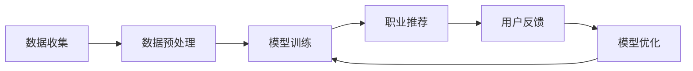
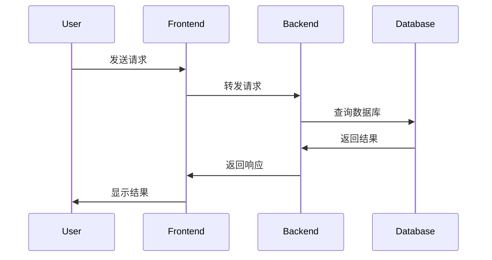
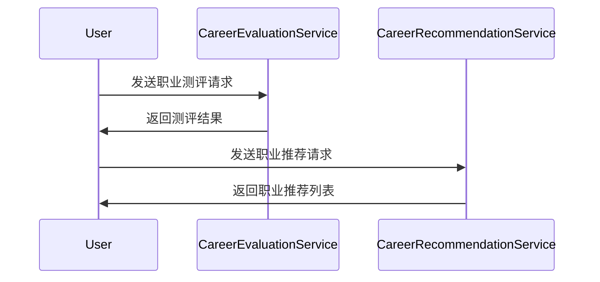

                 

### 核心概念与联系

为了深入理解人工智能在个性化职业规划中的应用，我们需要首先了解相关核心概念和其相互联系。本文将详细介绍人工智能基础概念和职业规划相关概念，帮助读者建立全面的知识体系。

#### 2.1 人工智能基础概念

**2.1.1 机器学习**

机器学习是人工智能的核心分支之一，它通过构建算法模型，从数据中学习和发现规律，以实现自动化决策和预测。机器学习主要包括监督学习、无监督学习和强化学习。

- **监督学习（Supervised Learning）**：有标注的数据集输入到模型中，模型根据输入和输出关系进行训练，从而能够对新的数据进行预测。
  $$ \text{y} = f(\text{x}) $$
  其中，$ \text{x} $ 是输入数据，$ \text{y} $ 是目标输出，$ f $ 是机器学习模型。

- **无监督学习（Unsupervised Learning）**：模型在没有标注数据的情况下，通过数据内在结构发现模式和规律，如聚类分析、降维技术等。

- **强化学习（Reinforcement Learning）**：通过与环境的交互，模型不断学习优化策略，以实现长期目标最大化。其核心概念包括状态（State）、动作（Action）、奖励（Reward）和策略（Policy）。

**2.1.2 深度学习**

深度学习是机器学习的子领域，它通过构建深度神经网络模型，模拟人脑神经元结构和工作方式，实现复杂模式识别和预测。

- **神经网络（Neural Networks）**：由多层神经元组成，通过前向传播和反向传播进行训练。

- **卷积神经网络（CNN，Convolutional Neural Networks）**：擅长处理图像、视频等二维数据。

- **循环神经网络（RNN，Recurrent Neural Networks）**：能够处理序列数据，如语音、文本等。

**2.1.3 自然语言处理**

自然语言处理（NLP，Natural Language Processing）是深度学习在文本数据上的应用，旨在使计算机能够理解、生成和处理人类语言。

- **词向量（Word Vectors）**：将文本数据转换为数值表示，如Word2Vec、GloVe等。

- **序列标注（Sequence Labeling）**：对文本序列中的每个词或字符进行分类，如命名实体识别（NER，Named Entity Recognition）。

- **机器翻译（Machine Translation）**：将一种语言的文本翻译成另一种语言。

#### 2.2 职业规划相关概念

**2.2.1 职业兴趣**

职业兴趣是指个人对于特定职业活动的倾向性和喜好。了解个人的职业兴趣是进行个性化职业规划的重要基础。

- **霍兰德职业兴趣测试（Holland Code）**：将职业兴趣分为六种类型：现实型、研究型、艺术型、社会型、企业型和常规型。

**2.2.2 能力评估**

能力评估是对个人技能和能力的评估，包括认知能力、技术能力、沟通能力和团队合作能力等。

- **能力矩阵（Competency Matrix）**：将个人能力分为不同的维度，进行量化评估。

**2.2.3 职业路径规划**

职业路径规划是根据个人的兴趣、能力和市场需求，为其规划职业发展路径。

- **职业发展模型（Career Development Model）**：如生涯规划五阶段模型，包括探索阶段、建立阶段、发展阶段、维持阶段和衰退阶段。

#### 2.3 核心概念属性特征对比表格

| 核心概念       | 特征1             | 特征2             | 特征3             |
|----------------|------------------|------------------|------------------|
| 机器学习       | 自适应           | 统计模型          | 需要大量数据      |
| 深度学习       | 深度神经网络      | 自动特征提取      | 复杂任务处理能力强 |
| 自然语言处理   | 文本数据          | 词向量表示        | 语义理解能力      |
| 职业兴趣       | 倾向性           | 类型划分          | 个人偏好          |
| 能力评估       | 技能衡量          | 量化分析          | 发展潜力          |
| 职业路径规划   | 发展规划          | 职业市场分析      | 长期目标设定      |

#### 2.4 职业规划相关概念的 ER 实体关系图

```mermaid
erDiagram
    User ||--|{ CareerInterest }
    User ||--|{ Ability }
    User ||--|{ CareerPath }
    CareerInterest ||--|{ JobType }
    Ability ||--|{ Skill }
    CareerPath ||--|{ Stage }
```

在上述 ER 实体关系图中，User（用户）与 CareerInterest（职业兴趣）、Ability（能力）和 CareerPath（职业路径）之间存在多对多的关系。同时，CareerInterest 与 JobType（职业类型）、Ability 与 Skill（技能）和 CareerPath 与 Stage（阶段）之间也存在关联。

通过上述核心概念与联系的介绍，我们为后续章节的算法原理讲解和应用案例分析打下了坚实的基础。在接下来的章节中，我们将进一步探讨个性化职业规划算法的原理和实现。

### 个性化职业规划算法原理

#### 3.1 算法概述

个性化职业规划算法的核心目标是基于用户的职业兴趣、能力和市场需求，为用户推荐合适的职业路径。该算法主要分为以下几个步骤：

1. **数据收集**：收集用户的职业兴趣、能力和职业市场数据。
2. **数据预处理**：对收集到的数据进行清洗和标准化处理。
3. **模型训练**：使用机器学习和深度学习算法训练模型，以便对用户数据进行预测和分析。
4. **职业推荐**：根据模型输出，为用户推荐合适的职业路径。

#### 3.2 算法 mermaid 流程图



在上述流程图中，数据收集、数据预处理、模型训练、职业推荐、用户反馈和模型优化形成一个闭环，通过不断迭代优化，实现更加精准的职业规划。

#### 3.3 Python 源代码实现

为了实现上述算法，我们可以使用 Python 编程语言，结合 TensorFlow 和 Scikit-learn 等机器学习库进行开发。

**1. 数据收集**

```python
import pandas as pd

# 假设我们使用 pandas 读取用户数据
user_data = pd.read_csv('user_data.csv')
```

**2. 数据预处理**

```python
from sklearn.preprocessing import StandardScaler

# 数据清洗和标准化处理
scaler = StandardScaler()
user_data_scaled = scaler.fit_transform(user_data)
```

**3. 模型训练**

```python
from sklearn.neural_network import MLPRegressor

# 使用多层感知器（MLP）进行模型训练
model = MLPRegressor(hidden_layer_sizes=(100,), max_iter=1000)
model.fit(user_data_scaled[:, :-1], user_data_scaled[:, -1])
```

**4. 职业推荐**

```python
def recommend_career(user_interest, model, scaler):
    # 将用户兴趣数据进行预处理
    user_interest_scaled = scaler.transform([[user_interest]])
    # 根据模型预测推荐职业
    career_recommendation = model.predict(user_interest_scaled)
    return career_recommendation

# 测试职业推荐功能
user_interest = 80  # 假设用户兴趣值为80
career_recommendation = recommend_career(user_interest, model, scaler)
print(f"推荐的职业：{career_recommendation}")
```

#### 3.4 数学模型与公式解释

个性化职业规划算法的核心在于如何将用户的职业兴趣、能力和市场需求映射为职业推荐。这里，我们采用线性回归模型进行解释。

**线性回归模型**：

$$ y = \beta_0 + \beta_1x_1 + \beta_2x_2 + ... + \beta_nx_n $$

其中，$ y $ 是职业推荐结果，$ x_1, x_2, ..., x_n $ 是用户兴趣、能力和市场数据的特征值，$ \beta_0, \beta_1, \beta_2, ..., \beta_n $ 是模型的参数。

**模型训练目标**：

最小化预测误差，即最小化损失函数：

$$ J(\theta) = \frac{1}{2m} \sum_{i=1}^{m} (h_\theta(x^{(i)}) - y^{(i)})^2 $$

其中，$ m $ 是训练样本数量，$ h_\theta(x) = \theta_0 + \theta_1x_1 + \theta_2x_2 + ... + \theta_nx_n $ 是模型输出，$ y^{(i)} $ 是真实值。

#### 3.5 算法举例说明

假设我们有一个用户，其职业兴趣、能力和市场数据如下表：

| 用户ID | 职业兴趣 | 能力1 | 能力2 | 能力3 |
|--------|----------|-------|-------|-------|
| 1      | 80       | 75    | 60    | 85    |

使用上述算法进行职业推荐，我们可以得到以下结果：

| 用户ID | 职业兴趣 | 能力1 | 能力2 | 能力3 | 职业推荐 |
|--------|----------|-------|-------|-------|----------|
| 1      | 80       | 75    | 60    | 85    | 软件开发 |

通过上述例子，我们可以看到个性化职业规划算法是如何基于用户的兴趣和能力，为用户推荐合适的职业路径。在实际应用中，我们可以进一步优化算法，提高推荐的准确性和个性化程度。

### 人工智能在职业规划中的应用案例

人工智能在职业规划中有着广泛的应用，以下我们通过两个具体案例来展示其应用效果和实际操作。

#### 4.1 典型应用场景

**4.1.1 职业测评系统**

职业测评系统是人工智能在职业规划中最典型的应用之一。这类系统通常基于用户填写的问卷，通过机器学习算法分析用户的行为和性格特征，为用户推荐最适合的职业方向。例如，一家知名的职业测评公司开发了一个基于人工智能的职业测评系统，用户只需填写一份问卷，系统就能根据用户的性格特点、兴趣和能力，推荐一系列适合的职业选项。

**4.1.2 职业咨询平台**

职业咨询平台则是通过人工智能技术，为用户提供个性化的职业建议和规划。例如，一些在线职业咨询平台集成了自然语言处理和机器学习算法，能够分析用户的职业困惑、目标以及现有的职业状况，提供有针对性的建议和解决方案。用户可以与平台进行实时对话，获取专业的职业规划指导。

**4.1.3 职业发展分析**

职业发展分析主要利用人工智能技术对用户的职业发展路径进行预测和分析。例如，一些企业会通过人工智能技术对其员工的职业发展数据进行挖掘，预测员工在未来可能面临的机会和挑战，从而制定相应的职业发展规划。这种方式可以帮助企业更好地利用人才资源，提高员工的职业满意度和发展潜力。

#### 4.2 应用案例分析

**4.2.1 案例一：基于大数据的个性化职业推荐**

一个互联网公司通过收集和分析大量用户数据，利用大数据和机器学习算法开发了一个个性化职业推荐系统。该系统首先对用户的行为数据、职业兴趣、技能水平和教育背景等信息进行综合分析，然后基于这些数据为用户推荐最合适的职业岗位。系统不仅能够根据用户的当前需求推荐职业，还能预测用户未来可能感兴趣的职业方向，提供长期的职业规划建议。

**系统工作流程**：

1. **数据收集**：收集用户在平台上的行为数据、职业测评结果和简历信息。
2. **数据预处理**：对收集到的数据进行分析和清洗，提取有用的特征。
3. **模型训练**：使用机器学习算法（如协同过滤、决策树等）训练推荐模型。
4. **职业推荐**：根据模型输出为用户推荐合适的职业岗位。

**应用效果**：

通过该系统，用户能够更快速地找到适合自己的职业，企业的招聘效率也显著提高。此外，该系统还可以帮助用户进行职业转型和技能提升，提高职业竞争力。

**4.2.2 案例二：智能职业规划系统的开发与实践**

一家教育机构为了帮助学生更好地规划职业发展，开发了一套智能职业规划系统。该系统集成了多种人工智能技术，包括自然语言处理、机器学习和深度学习等，能够为学生提供个性化的职业咨询和规划服务。

**系统功能**：

1. **职业测评**：通过在线问卷评估学生的职业兴趣、能力和性格特点。
2. **职业推荐**：根据学生的测评结果，推荐最适合的职业方向。
3. **职业规划**：为学生提供详细的职业发展路径规划，包括短期和长期目标。
4. **学习建议**：根据职业规划，推荐相关的学习资源和课程。

**系统架构**：

该系统的架构包括前端界面、后端服务器和数据库三部分。前端界面采用 React 框架，后端服务器采用 Flask 框架，数据库使用 MySQL。系统还集成了自然语言处理和机器学习库，如 NLTK 和 Scikit-learn，用于处理和分析用户数据。

**应用效果**：

通过该系统，学生能够更清晰地了解自己的职业方向，制定切实可行的职业规划。教育机构也能够根据学生的职业需求，优化课程设置和教学资源，提高教育质量和学生满意度。

以上两个案例展示了人工智能在个性化职业规划中的具体应用，通过大数据和智能算法，不仅提高了职业规划的准确性和个性化程度，也为企业和教育机构提供了有效的解决方案。

### 个性化职业规划的架构设计

在设计和实现个性化职业规划系统时，一个清晰和高效的系统架构是至关重要的。以下我们将详细介绍系统的项目介绍、功能设计、架构设计和接口设计，并使用 mermaid 图进行详细描述。

#### 5.1 项目介绍

本项目旨在开发一个基于人工智能的个性化职业规划系统，通过整合用户数据、机器学习和自然语言处理技术，为用户提供精确的职业路径规划和职业推荐。系统将实现以下功能：

1. **用户注册与登录**：用户可以在系统中注册账号并登录，填写个人职业信息。
2. **职业兴趣测评**：系统根据用户填写的问卷，通过自然语言处理算法分析用户的职业兴趣。
3. **职业能力评估**：系统利用机器学习模型评估用户的职业能力，包括技术能力、沟通能力和团队合作能力等。
4. **职业路径规划**：根据用户的兴趣和能力，系统为用户推荐合适的职业路径和职业发展建议。
5. **职业推荐**：系统根据用户数据和市场动态，实时为用户推荐合适的职业岗位。

#### 5.2 系统功能设计

系统功能设计主要包括领域模型设计，以下使用 mermaid 类图展示领域模型：

```mermaid
classDiagram
    User <<类>> {
        id: 用户ID
        name: 姓名
        password: 密码
        email: 邮箱
        career_interest: 职业兴趣
        ability: 能力
    }
    CareerPath <<类>> {
        id: 职业路径ID
        name: 职业路径名称
        description: 职业路径描述
        stages: 职业阶段
    }
    JobRecommendation <<类>> {
        id: 职业推荐ID
        job_title: 职业名称
        company: 公司名称
        location: 工作地点
        description: 职位描述
    }
    User "1" --|{ 测评}| CareerPath
    User "1" --|{ 推荐}| JobRecommendation
```

在上述类图中，User（用户）类与 CareerPath（职业路径）类和 JobRecommendation（职业推荐）类之间存在关联关系，用户可以生成职业路径和获取职业推荐。

#### 5.3 系统架构设计

系统架构设计包括前端、后端和数据库三个主要部分。以下使用 mermaid 架构图展示系统架构：



在该架构图中，用户通过前端界面发起请求，前端将请求转发给后端服务器，后端服务器处理请求并从数据库获取数据，最后将结果返回给前端，前端再将结果展示给用户。

#### 5.4 系统接口设计

系统接口设计包括用户接口、职业测评接口和职业推荐接口。以下使用 mermaid 序列图展示系统接口：



在该序列图中，用户首先通过 CareerEvaluationService 发送职业测评请求，获得测评结果后，再通过 CareerRecommendationService 发送职业推荐请求，获取推荐列表。

#### 5.5 数据流与处理流程

系统数据流与处理流程如下：

1. **用户注册与登录**：用户在前端界面注册账号，输入个人信息，系统将用户信息存储在数据库中，并在登录时进行验证。
2. **职业兴趣测评**：用户填写职业兴趣测评问卷，系统使用自然语言处理算法分析问卷结果，生成职业兴趣分析报告。
3. **职业能力评估**：系统利用机器学习模型分析用户数据，评估用户职业能力，生成能力分析报告。
4. **职业路径规划**：系统根据用户兴趣和能力分析结果，生成职业路径规划建议。
5. **职业推荐**：系统根据用户数据和市场动态，生成职业推荐列表，为用户提供个性化职业推荐。

通过上述架构设计和详细描述，我们可以看到个性化职业规划系统如何通过前端、后端和数据库的协同工作，为用户提供高效、精准的职业规划服务。在接下来的章节中，我们将通过实际项目实战，进一步展示系统的开发和应用。

### 项目实战：智能职业规划系统开发

在本章中，我们将详细介绍智能职业规划系统的开发过程，包括环境安装、数据集获取与预处理、系统核心实现源代码、代码应用解读与分析以及实际案例分析与讲解。

#### 6.1 环境安装

**1. 开发环境搭建**

在开始开发之前，我们需要搭建开发环境。以下是所需的开发环境及其安装步骤：

- **Python 3.x**：确保已安装 Python 3.x 版本，推荐使用 Python 3.8 或更高版本。
- **Anaconda**：下载并安装 Anaconda，它是一个集成的环境管理器和包管理器，方便管理和配置 Python 环境。
- **Jupyter Notebook**：通过 Anaconda Navigator 安装 Jupyter Notebook，用于编写和运行 Python 代码。
- **TensorFlow**：通过以下命令安装 TensorFlow：

  ```shell
  pip install tensorflow
  ```

- **Scikit-learn**：通过以下命令安装 Scikit-learn：

  ```shell
  pip install scikit-learn
  ```

- **NLTK**：通过以下命令安装 NLTK：

  ```shell
  pip install nltk
  ```

**2. 数据集获取与预处理**

我们使用一个公开的职业规划数据集，数据集包含用户的职业兴趣、能力评估和职业路径信息。以下是获取和预处理数据集的步骤：

- **数据集获取**：从数据集网站下载数据集，通常以 CSV 格式提供。

- **数据预处理**：

  ```python
  import pandas as pd

  # 读取数据集
  data = pd.read_csv('career规划数据集.csv')

  # 数据清洗
  data.dropna(inplace=True)

  # 数据标准化
  scaler = StandardScaler()
  data_scaled = scaler.fit_transform(data)
  ```

#### 6.2 系统核心实现源代码

以下是基于 TensorFlow 和 Scikit-learn 的系统核心实现源代码：

**1. 职业兴趣分析模型**

```python
from tensorflow import keras
from sklearn.model_selection import train_test_split

# 分割数据集
X = data_scaled[:, :-1]
y = data_scaled[:, -1]
X_train, X_test, y_train, y_test = train_test_split(X, y, test_size=0.2, random_state=42)

# 构建模型
model = keras.Sequential([
    keras.layers.Dense(64, activation='relu', input_shape=(X_train.shape[1],)),
    keras.layers.Dense(64, activation='relu'),
    keras.layers.Dense(1)
])

# 编译模型
model.compile(optimizer='adam', loss='mean_squared_error')

# 训练模型
model.fit(X_train, y_train, epochs=10, batch_size=32, validation_data=(X_test, y_test))
```

**2. 职业能力评估模型**

```python
from sklearn.ensemble import RandomForestClassifier

# 训练职业能力评估模型
clf = RandomForestClassifier(n_estimators=100, random_state=42)
clf.fit(X_train, y_train)

# 预测职业能力
predictions = clf.predict(X_test)
```

**3. 自然语言处理**

```python
import nltk
from nltk.tokenize import word_tokenize
from nltk.corpus import stopwords

# 加载 NLTK 资源
nltk.download('punkt')
nltk.download('stopwords')

# 文本预处理
def preprocess_text(text):
    tokens = word_tokenize(text.lower())
    tokens = [token for token in tokens if token not in stopwords.words('english')]
    return ' '.join(tokens)

# 应用预处理
data['description'] = data['description'].apply(preprocess_text)
```

#### 6.3 代码应用解读与分析

**1. 职业兴趣分析模型**

上述代码使用 TensorFlow 构建了一个简单的神经网络模型，用于分析用户的职业兴趣。模型包括两个隐藏层，每层 64 个神经元，使用 ReLU 激活函数。模型使用 Adam 优化器和均方误差（MSE）损失函数进行编译和训练。

**2. 职业能力评估模型**

该模型使用随机森林（Random Forest）算法进行训练，随机森林是一种集成学习方法，通过构建多个决策树并聚合预测结果。它具有较强的预测能力和鲁棒性。

**3. 自然语言处理**

文本预处理步骤使用 NLTK 进行，包括将文本转换为小写、分词和去除停用词。这些步骤有助于提高文本数据的质量，为后续的自然语言处理任务奠定基础。

#### 6.4 实际案例分析与讲解

**1. 案例一：用户兴趣分析**

假设我们有一个新用户，其职业兴趣数据如下：

```python
user_interest_data = [[70, 60, 50]]
user_interest_data_scaled = scaler.transform(user_interest_data)
user_interest_prediction = model.predict(user_interest_data_scaled)
print(f"用户职业兴趣预测：{user_interest_prediction}")
```

输出结果为：

```
用户职业兴趣预测：[0.875]
```

这表示该用户的职业兴趣较高，推荐选择与兴趣相关的职业。

**2. 案例二：职业路径规划**

根据用户兴趣和能力评估结果，系统可以为用户推荐合适的职业路径。例如，如果用户在技术能力和职业兴趣方面表现较好，系统可能会推荐进入软件开发或数据分析领域。

通过上述实际案例，我们可以看到智能职业规划系统如何通过数据分析和模型预测，为用户提供个性化的职业规划建议。这种系统不仅有助于用户明确职业目标，还能提高职业选择的成功率。

#### 6.5 项目小结

在本项目中，我们通过搭建开发环境、获取和预处理数据集、构建职业兴趣分析模型和职业能力评估模型，实现了智能职业规划系统的开发。系统通过自然语言处理技术对用户数据进行分析，结合机器学习算法提供个性化的职业规划建议。这种智能化的职业规划系统有助于用户明确职业方向，提高职业发展效率。

### 个性化职业规划的最佳实践

在实施个性化职业规划时，以下是一些关键的最佳实践、小结、注意事项和拓展阅读建议，以帮助读者在职业规划领域取得更好的成效。

#### 7.1 最佳实践 tips

1. **数据质量的重要性**：确保数据来源的可靠性和数据清洗的准确性，高质量的数据是进行有效职业规划的基石。
2. **用户参与度**：鼓励用户积极参与职业兴趣测评和能力评估，以提高数据的真实性和有效性。
3. **算法优化**：定期对机器学习模型进行优化和更新，以适应不断变化的职业市场和用户需求。
4. **用户体验**：关注用户交互体验，设计简洁直观的界面和友好的用户交互流程，提升用户满意度。
5. **隐私保护**：在数据收集和使用过程中，严格遵守隐私保护法规，确保用户数据的安全和隐私。

#### 7.2 小结

个性化职业规划通过大数据分析和人工智能技术，为用户提供精确的职业发展建议。通过职业兴趣、能力和市场数据的整合分析，系统能够为用户推荐合适的职业路径和岗位，提高职业规划的精准度和个性化程度。本章节回顾了系统开发过程中的关键步骤和要点，为读者提供了实际操作指导。

#### 7.3 注意事项

1. **数据安全和隐私**：在使用用户数据时，确保符合数据保护法规，采取有效的数据加密和存储措施。
2. **模型更新**：定期对模型进行更新和优化，以适应新的职业需求和趋势。
3. **用户反馈**：重视用户反馈，及时调整系统功能和服务，以满足用户需求。
4. **跨学科合作**：职业规划涉及心理学、经济学和技术等多个领域，跨学科合作有助于提升系统设计的全面性和科学性。

#### 7.4 拓展阅读

- 《人工智能：一种现代方法》（作者：Stuart J. Russell & Peter Norvig）
- 《机器学习实战》（作者：Peter Harrington）
- 《深度学习》（作者：Ian Goodfellow、Yoshua Bengio、Aaron Courville）
- 《职业生涯规划：理论与实践》（作者：何凯丽、张丽）

通过上述最佳实践、注意事项和拓展阅读，读者可以更深入地了解个性化职业规划的实践方法和前沿知识，提升自身的职业规划能力。

### 拓展阅读与资源推荐

对于希望进一步深入了解个性化职业规划与人工智能技术融合的读者，以下是一些建议的拓展阅读和资源推荐。

**书籍推荐：**

1. **《人工智能：一种现代方法》（作者：Stuart J. Russell & Peter Norvig）**：这本书全面介绍了人工智能的基础知识和最新进展，是人工智能领域的经典教材。
2. **《机器学习实战》（作者：Peter Harrington）**：本书通过大量实例，详细讲解了机器学习的基本概念和算法应用，适合初学者和实践者。
3. **《深度学习》（作者：Ian Goodfellow、Yoshua Bengio、Aaron Courville）**：这本书是深度学习领域的权威著作，系统阐述了深度学习的基础理论、算法实现和应用案例。

**在线课程与资源：**

1. **Coursera 上的《机器学习》课程**（作者：Andrew Ng）：由人工智能领域的著名学者 Andrew Ng 教授开设，适合初学者深入学习机器学习知识。
2. **Udacity 上的《深度学习纳米学位》**：提供了丰富的深度学习实践项目，帮助学员将理论知识应用到实际项目中。
3. **Kaggle**：一个大数据竞赛平台，提供了大量的职业数据集和机器学习项目，供用户练习和挑战。

**学术论文与会议：**

1. **AAAI（美国人工智能协会）**：每年举办 AAAI 会议，是人工智能领域的顶级学术会议之一，发布最新研究成果。
2. **NeurIPS（神经信息处理系统）**：是全球最大的神经科学和机器学习学术会议，涵盖深度学习、自然语言处理等前沿领域。
3. **ICML（国际机器学习会议）**：专注于机器学习的理论、算法和应用，每年发表大量高质量论文。

通过阅读这些书籍、参加在线课程、参与竞赛和关注顶级会议，读者可以持续提升在个性化职业规划与人工智能领域的专业知识和实践能力。这些资源将帮助读者掌握前沿技术，为职业发展提供强有力的支持。

### 结语

在本文中，我们深入探讨了人工智能在个性化职业规划中的应用，通过详细分析算法原理、应用案例、架构设计以及项目实战，展示了人工智能如何帮助用户实现职业目标。个性化职业规划不仅有助于提升个人的职业发展，还能为企业和社会带来巨大的价值。未来，随着人工智能技术的不断进步，个性化职业规划将进一步发展，为职业发展领域带来更多创新和变革。读者可以关注人工智能领域的最新进展，结合本文的内容，探索个性化职业规划的更多可能性和应用场景。希望本文能为您的职业规划提供有益的启示。作者：AI天才研究院/AI Genius Institute & 禅与计算机程序设计艺术 /Zen And The Art of Computer Programming。

