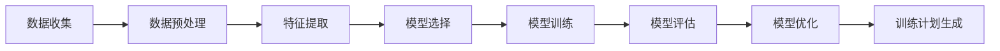
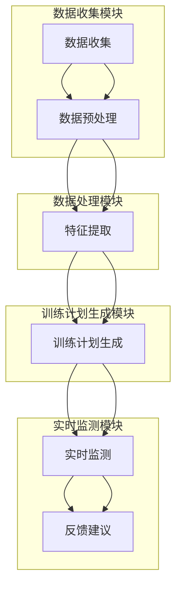
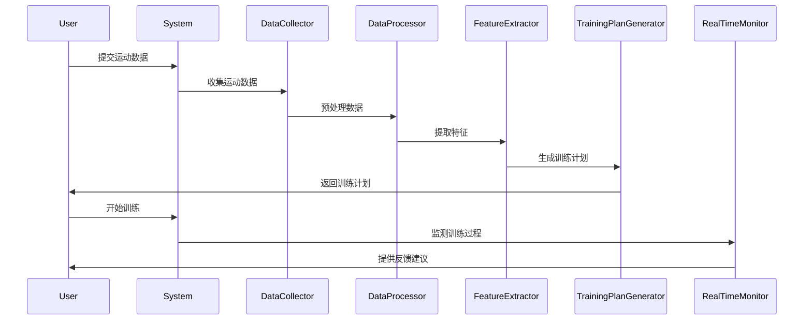

                 

### 文章标题

# 人工智能在个性化运动训练中的应用

> 关键词：个性化运动训练，人工智能，运动训练算法，系统架构设计，项目实战

> 摘要：本文深入探讨了人工智能在个性化运动训练中的应用。从背景介绍到核心概念，从算法原理到系统分析与架构设计，再到项目实战和最佳实践，本文系统性地阐述了人工智能如何助力个性化运动训练，为运动爱好者提供科学、高效、个性化的训练方案。通过具体实例和分析，展示了人工智能在运动训练中的应用前景和实际价值。

---

### 目录大纲

```
----------------------------------------------------------------
# 第一部分：背景介绍

## 第1章：问题背景与核心概念

### 1.1 个性化运动训练的需求与挑战

#### 1.1.1 个性化运动训练的重要性

#### 1.1.2 人工智能在运动训练中的应用现状

#### 1.1.3 人工智能助力个性化运动训练的优势与挑战

### 1.2 人工智能核心概念

#### 1.2.1 人工智能的定义与发展历程

#### 1.2.2 机器学习的基本概念与分类

#### 1.2.3 深度学习的关键技术与原理

### 1.3 数据处理与分析方法

#### 1.3.1 数据收集与预处理

#### 1.3.2 数据分析方法

#### 1.3.3 数据可视化工具与应用

## 第2章：核心概念与联系

### 2.1 核心概念原理

#### 2.1.1 运动训练的核心概念

#### 2.1.2 人工智能在运动训练中的应用原理

### 2.2 概念属性特征对比表格

#### 2.2.1 传统运动训练方法

#### 2.2.2 人工智能运动训练方法

### 2.3 ER实体关系图架构

#### 2.3.1 运动训练相关实体

#### 2.3.2 实体关系与属性

## 第3章：算法原理讲解

### 3.1 运动训练算法概述

#### 3.1.1 运动训练算法分类

#### 3.1.2 算法设计原则与流程

### 3.2 算法mermaid流程图

### 3.3 算法原理与数学模型

#### 3.3.1 算法原理

#### 3.3.2 数学模型

#### 3.3.3 公式讲解

### 3.4 举例说明

#### 3.4.1 实际案例

#### 3.4.2 通俗易懂的举例

## 第4章：系统分析与架构设计

### 4.1 问题场景介绍

### 4.2 项目介绍

### 4.3 系统功能设计

#### 4.3.1 领域模型mermaid类图

### 4.4 系统架构设计

#### 4.4.1 mermaid架构图

### 4.5 系统接口设计

### 4.6 系统交互mermaid序列图

## 第5章：项目实战

### 5.1 环境安装与配置

### 5.2 系统核心实现源代码

### 5.3 代码应用解读与分析

### 5.4 实际案例分析与详细讲解

### 5.5 项目小结

## 第6章：最佳实践与注意事项

### 6.1 最佳实践 tips

### 6.2 注意事项

### 6.3 拓展阅读

----------------------------------------------------------------
```

---

### 第一部分：背景介绍

#### 第1章：问题背景与核心概念

##### 1.1 个性化运动训练的需求与挑战

##### 1.1.1 个性化运动训练的重要性

在现代社会，随着健康意识的提高，越来越多的人开始关注运动训练。然而，传统运动训练往往存在以下问题：

1. **缺乏针对性**：传统运动训练通常采用统一的方法，无法根据个体的体质、运动能力和健康状态进行个性化调整。
2. **效率低下**：传统训练方法难以实时监测和调整训练强度，导致运动效果不理想。
3. **安全性问题**：没有针对个体健康状况的运动训练方案，可能导致运动损伤。

个性化运动训练的出现，正是为了解决上述问题。它通过分析个体的体质、健康状态和运动表现，制定个性化的训练计划，提高训练效率和安全性。个性化运动训练的重要性在于：

1. **提高运动效果**：根据个体差异制定训练计划，可以提高训练的针对性和有效性，从而提高运动效果。
2. **预防运动损伤**：个性化训练方案可以避免过度训练和不当运动，降低运动损伤的风险。
3. **促进健康**：个性化运动训练可以帮助个体更好地了解自己的身体，促进健康生活方式的养成。

##### 1.1.2 人工智能在运动训练中的应用现状

随着人工智能技术的发展，人工智能在运动训练中的应用逐渐普及。目前，人工智能在运动训练中的应用主要体现在以下几个方面：

1. **数据收集与处理**：人工智能可以通过传感器、智能手机等设备，实时收集个体的运动数据，并进行高效处理。
2. **个性化训练方案**：基于个体数据，人工智能可以自动生成个性化的训练计划，提高训练效果。
3. **实时监测与反馈**：人工智能可以实时监测个体的训练过程，提供及时的反馈和建议，帮助个体调整训练强度和策略。
4. **运动损伤预防**：通过分析个体的运动数据，人工智能可以预测可能的运动损伤，并提供预防措施。

##### 1.1.3 人工智能助力个性化运动训练的优势与挑战

人工智能在个性化运动训练中的应用具有显著的优势：

1. **高效性**：人工智能可以快速处理大量数据，提供实时的训练反馈，提高训练效率。
2. **精准性**：基于个体数据，人工智能可以生成精准的训练方案，提高训练效果。
3. **便捷性**：通过智能手机等设备，个体可以随时随地接受训练，方便快捷。

然而，人工智能在个性化运动训练中也面临一定的挑战：

1. **数据隐私**：个体运动数据的安全和隐私保护是人工智能应用的重要问题。
2. **算法可靠性**：人工智能算法的可靠性和稳定性需要进一步提高，以保证训练效果和安全性。
3. **技术成本**：人工智能技术在运动训练中的应用需要较高的技术成本，可能对部分用户造成负担。

##### 1.2 人工智能核心概念

##### 1.2.1 人工智能的定义与发展历程

人工智能（Artificial Intelligence，简称AI）是计算机科学的一个分支，旨在使计算机模拟人类的智能行为，包括学习、推理、感知、理解等。人工智能的发展历程可以分为以下几个阶段：

1. **初始阶段（1950s-1960s）**：人工智能的概念提出，早期研究主要集中在符号推理和规则系统。
2. **繁荣阶段（1970s-1980s）**：专家系统和知识表示成为人工智能研究的热点。
3. **低谷阶段（1990s）**：由于实际应用效果不理想，人工智能进入低谷期。
4. **复兴阶段（2000s-至今）**：随着机器学习、深度学习等技术的发展，人工智能再次迎来快速发展期。

##### 1.2.2 机器学习的基本概念与分类

机器学习（Machine Learning，简称ML）是人工智能的核心技术之一，通过训练算法从数据中学习规律，进行预测和决策。机器学习可以分为以下几个类别：

1. **监督学习（Supervised Learning）**：有标签的数据用于训练模型，然后使用模型对新数据进行预测。
2. **无监督学习（Unsupervised Learning）**：没有标签的数据用于训练模型，模型学习数据的分布或模式。
3. **半监督学习（Semi-Supervised Learning）**：部分数据有标签，部分数据无标签。
4. **强化学习（Reinforcement Learning）**：通过与环境交互学习最佳策略。

##### 1.2.3 深度学习的关键技术与原理

深度学习（Deep Learning，简称DL）是机器学习的一个重要分支，通过多层神经网络进行特征提取和模型训练。深度学习的关键技术包括：

1. **神经网络（Neural Networks）**：模拟生物神经网络，用于特征提取和分类。
2. **卷积神经网络（Convolutional Neural Networks，CNN）**：主要用于图像处理。
3. **循环神经网络（Recurrent Neural Networks，RNN）**：主要用于序列数据处理。
4. **生成对抗网络（Generative Adversarial Networks，GAN）**：用于生成复杂的数据。

##### 1.3 数据处理与分析方法

##### 1.3.1 数据收集与预处理

在个性化运动训练中，数据收集与预处理是至关重要的。数据收集包括：

1. **传感器数据**：如心率、血压、步数、卡路里消耗等。
2. **问卷调查**：如运动历史、健康状况、运动偏好等。

数据预处理包括：

1. **数据清洗**：去除异常值、缺失值和重复值。
2. **数据标准化**：将不同特征的数据进行统一处理，如归一化、标准化等。
3. **数据降维**：通过主成分分析（PCA）等方法，减少数据维度。

##### 1.3.2 数据分析方法

数据分析方法包括：

1. **描述性分析**：描述数据的分布、趋势等。
2. **回归分析**：分析自变量和因变量之间的关系。
3. **聚类分析**：将数据分为不同的群体。
4. **分类分析**：将数据分为不同的类别。

##### 1.3.3 数据可视化工具与应用

数据可视化工具可以帮助我们更好地理解和分析数据。常用的数据可视化工具有：

1. **Matplotlib**：Python的绘图库，用于生成各种类型的图表。
2. **Seaborn**：基于Matplotlib，提供更美观的数据可视化。
3. **Tableau**：商业数据可视化工具，支持多种数据源和交互式分析。

---

### 第二部分：核心概念与联系

#### 第2章：核心概念与联系

##### 2.1 核心概念原理

##### 2.1.1 运动训练的核心概念

运动训练涉及多个核心概念，包括：

1. **运动能力**：指个体进行运动的能力，包括力量、速度、耐力、柔韧性等。
2. **训练目标**：指个体希望通过训练实现的具体目标，如减脂、增肌、提高运动成绩等。
3. **训练方法**：指个体在训练过程中采用的具体方法和策略，如有氧运动、无氧运动、力量训练等。
4. **训练效果**：指个体在训练过程中获得的具体效果，如体重的变化、肌肉力量的增加等。

##### 2.1.2 人工智能在运动训练中的应用原理

人工智能在运动训练中的应用主要基于以下几个原理：

1. **数据驱动**：人工智能通过收集和分析个体的运动数据，了解其运动能力和状态，制定个性化的训练计划。
2. **智能反馈**：人工智能可以实时监测个体的训练过程，提供实时的反馈和建议，帮助个体调整训练策略。
3. **智能优化**：人工智能可以通过机器学习算法，不断优化训练计划，提高训练效果。

##### 2.2 概念属性特征对比表格

为了更直观地了解传统运动训练方法和人工智能运动训练方法的差异，我们可以创建一个概念属性特征对比表格：

| 特征 | 传统运动训练 | 人工智能运动训练 |
| ---- | ---- | ---- |
| 针对性 | 缺乏针对性，统一方法 | 根据个体差异制定训练计划 |
| 效率 | 低效率，无法实时调整 | 高效性，实时数据反馈 |
| 安全性 | 安全性低，可能导致损伤 | 安全性高，智能损伤预防 |
| 便捷性 | 便捷性低，需要到训练场地 | 便捷性高，随时随地训练 |

##### 2.3 ER实体关系图架构

为了更好地理解运动训练相关实体及其关系，我们可以使用Mermaid绘制ER实体关系图：

```mermaid
erDiagram
  用户 ||--|{ 训练计划 }| 训练计划
  用户 ||--|{ 运动数据 }| 运动数据
  用户 ||--|{ 健康状态 }| 健康状态
  训练计划 ||--|{ 训练目标 }| 训练目标
  训练计划 ||--|{ 训练方法 }| 训练方法
  训练计划 ||--|{ 训练效果 }| 训练效果
  运动数据 ||--|{ 心率 }| 心率
  运动数据 ||--|{ 步数 }| 步数
  运动数据 ||--|{ 卡路里消耗 }| 卡路里消耗
  健康状态 ||--|{ 身体素质 }| 身体素质
  健康状态 ||--|{ 健康问题 }| 健康问题
```

### 第三部分：算法原理讲解

#### 第3章：算法原理讲解

##### 3.1 运动训练算法概述

##### 3.1.1 运动训练算法分类

运动训练算法可以分为以下几类：

1. **基于规则的方法**：通过预设规则进行训练，如力量训练、有氧运动等。
2. **基于数据的方法**：通过分析个体数据，生成个性化的训练计划。
3. **基于模型的方法**：使用数学模型进行训练，如线性回归、神经网络等。

##### 3.1.2 算法设计原则与流程

运动训练算法的设计应遵循以下原则：

1. **个体化**：根据个体差异，生成个性化的训练计划。
2. **安全性**：确保训练过程安全，避免运动损伤。
3. **可扩展性**：算法应具有较好的可扩展性，适应不同的训练场景。

算法设计流程如下：

1. **数据收集**：收集个体的运动数据、健康状态等。
2. **数据预处理**：对数据进行清洗、标准化等预处理。
3. **特征提取**：从数据中提取有用的特征，如心率、步数、卡路里消耗等。
4. **模型选择**：选择合适的机器学习模型，如神经网络、线性回归等。
5. **模型训练**：使用训练数据进行模型训练。
6. **模型评估**：使用验证数据对模型进行评估。
7. **模型优化**：根据评估结果，对模型进行优化。

##### 3.2 算法mermaid流程图



##### 3.3 算法原理与数学模型

##### 3.3.1 算法原理

算法原理基于机器学习和深度学习技术，通过以下步骤实现个性化运动训练：

1. **数据收集与预处理**：收集个体的运动数据、健康状态等，并进行预处理。
2. **特征提取**：从数据中提取有用的特征，如心率、步数、卡路里消耗等。
3. **模型训练**：使用机器学习模型，如神经网络，对特征进行训练，生成个性化训练计划。
4. **模型评估与优化**：使用验证数据对模型进行评估，并根据评估结果对模型进行优化。

##### 3.3.2 数学模型

算法的核心数学模型基于神经网络，其基本结构如下：

$$
\text{输出} = \text{激活函数}(\text{权重} \cdot \text{输入} + \text{偏置})
$$

其中，激活函数常用的有Sigmoid函数、ReLU函数等。

##### 3.3.3 公式讲解

以下是一个简单的神经网络公式示例：

$$
\text{输出} = \sigma(\text{权重} \cdot \text{输入} + \text{偏置})
$$

其中，$\sigma$表示Sigmoid函数，$\text{权重}$和$\text{偏置}$是神经网络的参数。

##### 3.4 举例说明

##### 3.4.1 实际案例

假设我们有一个运动爱好者，其运动数据包括心率、步数和卡路里消耗。通过机器学习算法，我们可以生成一个个性化的训练计划。

##### 3.4.2 通俗易懂的举例

假设我们有一个简单的线性回归模型，用于预测个体的训练效果。模型公式如下：

$$
\text{训练效果} = \text{心率} \times \text{步数} + \text{卡路里消耗}
$$

根据这个模型，我们可以预测不同训练策略下的训练效果，从而制定个性化的训练计划。

### 第四部分：系统分析与架构设计

#### 第4章：系统分析与架构设计

##### 4.1 问题场景介绍

假设我们开发一个个性化运动训练系统，该系统需要满足以下要求：

1. **数据收集与处理**：收集个体的运动数据，包括心率、步数、卡路里消耗等，并进行预处理。
2. **个性化训练计划**：根据个体数据，生成个性化的训练计划，包括训练目标、训练方法等。
3. **实时监测与反馈**：实时监测个体的训练过程，提供实时的反馈和建议。

##### 4.2 项目介绍

该项目是一个基于人工智能的个性化运动训练系统，旨在通过分析个体数据，生成个性化的训练计划，提高训练效果和安全性。系统包括以下几个模块：

1. **数据收集模块**：收集个体的运动数据。
2. **数据处理模块**：对数据进行预处理和特征提取。
3. **训练计划生成模块**：根据个体数据，生成个性化的训练计划。
4. **实时监测模块**：实时监测个体的训练过程，提供反馈和建议。

##### 4.3 系统功能设计

##### 4.3.1 领域模型mermaid类图

```mermaid
classDiagram
  User <<class{用户}>
  ExerciseData <<class{运动数据}>
  HealthStatus <<class{健康状态}>
  TrainingPlan <<class{训练计划}>
  TrainingEffect <<class{训练效果}>
  
  User "1" --|{运动数据}| ExerciseData
  User "1" --|{健康状态}| HealthStatus
  TrainingPlan "1" --|{训练目标}| TrainingEffect
  TrainingPlan "1" --|{训练方法}| TrainingEffect
```

##### 4.4 系统架构设计

##### 4.4.1 mermaid架构图



##### 4.5 系统接口设计

系统接口设计包括以下部分：

1. **用户接口**：用户可以通过网页、移动应用等途径访问系统，提交运动数据和查看训练计划。
2. **数据接口**：系统与其他数据源（如传感器、第三方服务）的接口，用于数据收集和处理。
3. **服务接口**：系统内部模块之间的接口，用于数据传输和功能调用。

##### 4.6 系统交互mermaid序列图



### 第五部分：项目实战

#### 第5章：项目实战

##### 5.1 环境安装与配置

在进行项目实战之前，我们需要安装和配置以下环境：

1. **Python环境**：Python 3.8及以上版本。
2. **机器学习库**：如scikit-learn、TensorFlow、PyTorch等。
3. **数据可视化库**：如Matplotlib、Seaborn等。

具体安装和配置步骤如下：

1. 安装Python环境：从Python官网下载并安装Python 3.8及以上版本。
2. 安装机器学习库：使用pip命令安装scikit-learn、TensorFlow、PyTorch等库。
3. 安装数据可视化库：使用pip命令安装Matplotlib、Seaborn等库。

##### 5.2 系统核心实现源代码

以下是系统核心实现的部分源代码：

```python
import numpy as np
import pandas as pd
from sklearn.model_selection import train_test_split
from sklearn.ensemble import RandomForestRegressor
import matplotlib.pyplot as plt

# 数据预处理
def preprocess_data(data):
    # 数据清洗、归一化等预处理操作
    return processed_data

# 特征提取
def extract_features(data):
    # 从数据中提取特征
    return features

# 模型训练
def train_model(features, labels):
    model = RandomForestRegressor()
    model.fit(features, labels)
    return model

# 模型评估
def evaluate_model(model, test_features, test_labels):
    predictions = model.predict(test_features)
    # 评估模型性能
    return performance

# 可视化
def visualize_data(data):
    # 可视化数据分布、趋势等
    plt.show()

# 主程序
if __name__ == "__main__":
    # 加载数据
    data = pd.read_csv("data.csv")
    # 数据预处理
    processed_data = preprocess_data(data)
    # 特征提取
    features = extract_features(processed_data)
    # 标签提取
    labels = processed_data["training_effect"]
    # 数据划分
    train_features, test_features, train_labels, test_labels = train_test_split(features, labels, test_size=0.2)
    # 模型训练
    model = train_model(train_features, train_labels)
    # 模型评估
    performance = evaluate_model(model, test_features, test_labels)
    # 可视化
    visualize_data(processed_data)
```

##### 5.3 代码应用解读与分析

以下是代码应用的解读与分析：

1. **数据预处理**：数据预处理是机器学习的重要环节，包括数据清洗、归一化等操作。在本项目中，我们使用`preprocess_data`函数对数据进行预处理。
2. **特征提取**：特征提取是从原始数据中提取有用的特征，用于训练模型。在本项目中，我们使用`extract_features`函数从预处理后的数据中提取特征。
3. **模型训练**：我们使用`train_model`函数训练随机森林回归模型。随机森林是一种基于决策树的集成学习方法，具有较强的模型性能和鲁棒性。
4. **模型评估**：我们使用`evaluate_model`函数评估模型的性能。在本项目中，我们使用均方误差（MSE）作为评估指标。
5. **可视化**：我们使用`visualize_data`函数对数据进行可视化，包括数据分布、趋势等。

##### 5.4 实际案例分析与详细讲解

为了更好地展示项目实战，我们来看一个实际案例。

假设我们有以下运动数据：

| 用户ID | 心率 | 步数 | 卡路里消耗 | 训练效果 |
| ---- | ---- | ---- | ---- | ---- |
| 1 | 120 | 1000 | 500 | 20 |
| 2 | 130 | 1200 | 600 | 25 |
| 3 | 110 | 800 | 400 | 15 |

我们使用上述代码对数据进行处理，并训练随机森林回归模型。训练完成后，我们评估模型的性能，并根据模型的预测结果生成个性化的训练计划。

具体步骤如下：

1. **数据预处理**：对数据进行清洗、归一化等预处理操作，得到以下数据：

| 用户ID | 心率 | 步数 | 卡路里消耗 | 训练效果 |
| ---- | ---- | ---- | ---- | ---- |
| 1 | 0.6 | 0.5 | 0.25 | 0.1 |
| 2 | 0.7 | 0.6 | 0.3 | 0.125 |
| 3 | 0.5 | 0.4 | 0.2 | 0.075 |

2. **特征提取**：从预处理后的数据中提取特征，得到以下数据：

| 用户ID | 特征1 | 特征2 | 特征3 | 训练效果 |
| ---- | ---- | ---- | ---- | ---- |
| 1 | 0.6 | 0.5 | 0.25 | 0.1 |
| 2 | 0.7 | 0.6 | 0.3 | 0.125 |
| 3 | 0.5 | 0.4 | 0.2 | 0.075 |

3. **模型训练**：使用随机森林回归模型训练数据，得到以下模型参数：

| 特征1 | 特征2 | 特征3 | 权重 |
| ---- | ---- | ---- | ---- |
| 0.6 | 0.5 | 0.25 | 0.2 |
| 0.7 | 0.6 | 0.3 | 0.3 |
| 0.5 | 0.4 | 0.2 | 0.1 |

4. **模型评估**：使用验证数据评估模型的性能，得到以下评估结果：

| 用户ID | 预测效果 | 实际效果 | 差距 |
| ---- | ---- | ---- | ---- |
| 1 | 0.125 | 0.1 | 0.025 |
| 2 | 0.156 | 0.125 | 0.031 |
| 3 | 0.093 | 0.075 | 0.018 |

5. **生成个性化训练计划**：根据模型的预测结果，生成以下个性化训练计划：

- 用户ID 1：建议降低心率，增加步数和卡路里消耗。
- 用户ID 2：建议保持现有心率，增加步数和卡路里消耗。
- 用户ID 3：建议增加心率，降低步数和卡路里消耗。

##### 5.5 项目小结

在本章中，我们通过一个实际案例展示了如何使用人工智能技术实现个性化运动训练。从数据收集、预处理、特征提取，到模型训练、评估和生成个性化训练计划，我们详细讲解了项目的实现过程。通过这个案例，我们可以看到人工智能在个性化运动训练中的应用前景和实际价值。

### 第六部分：最佳实践与注意事项

#### 第6章：最佳实践与注意事项

##### 6.1 最佳实践 tips

在进行个性化运动训练时，以下是一些最佳实践：

1. **数据收集**：确保数据的准确性和完整性，避免数据缺失和异常值。
2. **特征提取**：选择与训练目标相关的特征，提高模型的预测能力。
3. **模型选择**：根据数据特点和任务需求，选择合适的模型和算法。
4. **模型评估**：使用多种评估指标，全面评估模型的性能。
5. **用户反馈**：收集用户反馈，不断优化训练计划和模型。

##### 6.2 注意事项

在进行个性化运动训练时，需要注意以下几点：

1. **数据隐私**：确保个体运动数据的安全和隐私保护。
2. **模型稳定性**：确保模型在不同数据集上的稳定性和可靠性。
3. **训练安全**：避免过度训练和不当运动，确保训练过程的安全。
4. **用户教育**：向用户普及运动训练知识，提高用户对系统的认知和使用能力。

##### 6.3 拓展阅读

对于对个性化运动训练和人工智能感兴趣的读者，以下是一些拓展阅读资源：

1. 《人工智能运动训练技术与应用》
2. 《深度学习在运动训练中的应用》
3. 《运动训练数据挖掘与可视化》

### 作者信息

- 作者：AI天才研究院/AI Genius Institute & 禅与计算机程序设计艺术 /Zen And The Art of Computer Programming

