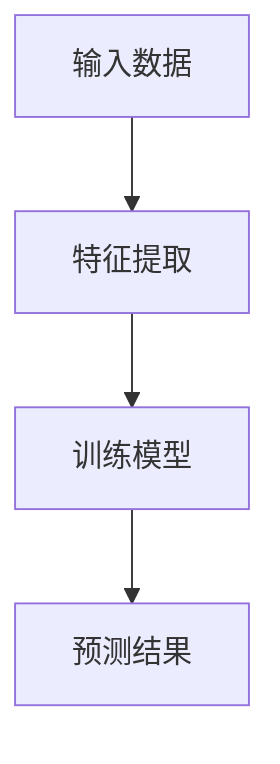
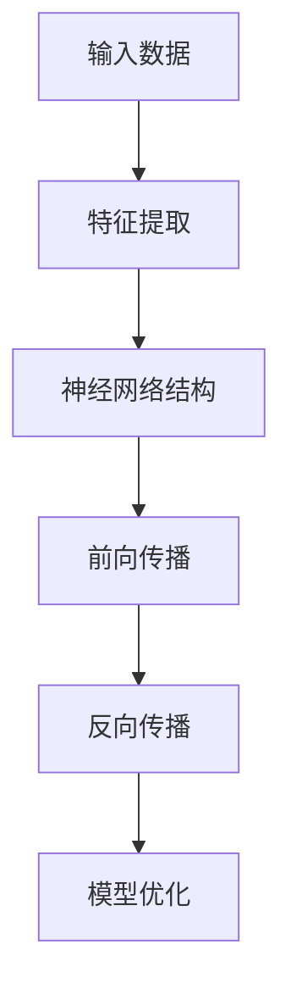
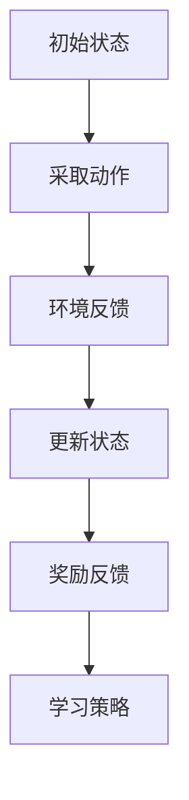

                 

# 人工智能在体育训练中的创新应用

## 关键词
人工智能、体育训练、创新应用、算法、数学模型、系统架构、项目实战

## 摘要
随着人工智能技术的不断发展，其在体育训练中的应用越来越广泛。本文从背景介绍、核心概念与联系、算法原理讲解、数学模型和数学公式、系统分析与架构设计、项目实战以及最佳实践等多个方面，详细探讨了人工智能在体育训练中的创新应用。通过实际案例分析和详细讲解剖析，本文旨在为读者提供全面的指导，帮助他们在体育训练中充分利用人工智能技术，提升运动员的竞技水平。

### 引言：人工智能在体育训练中的应用前景

随着人工智能（AI）技术的飞速发展，其在各行各业中的应用越来越广泛，包括医疗、金融、教育等领域。然而，体育训练作为一门注重个体差异和个性化服务的领域，人工智能的应用潜力同样巨大。本文将重点探讨人工智能在体育训练中的创新应用，旨在为教练、运动员以及相关从业者提供有价值的参考。

#### 1. 背景介绍

1. **人工智能的基本概念**

   人工智能是指计算机系统通过模拟人类智能行为，实现智能感知、学习、推理和决策的能力。它涵盖了机器学习、深度学习、自然语言处理等多个技术领域。

2. **体育训练的需求**

   体育训练是一项复杂的活动，涉及到运动员的身体素质、技术能力、心理素质等多个方面。传统的体育训练方法主要依靠教练的经验和运动员的自觉性，但这种方法存在一定的局限性，难以满足现代体育训练的高效性和个性化需求。

3. **人工智能在体育训练中的应用现状**

   目前，人工智能在体育训练中的应用主要包括运动数据分析、个性化训练计划制定、智能装备和器材、智能康复等。这些应用已经为体育训练带来了显著的变革。

#### 2. 问题的提出

在体育训练中，如何充分利用人工智能技术，提高运动员的训练效率、竞技水平和运动表现，是当前亟待解决的问题。本文将从以下几个方面展开探讨：

1. **核心概念与联系**

   研究人工智能在体育训练中的应用，需要理解人工智能的基本概念、体育训练的关键因素以及两者之间的融合点。

2. **算法原理讲解**

   探讨常见的人工智能算法在体育训练中的应用，包括机器学习、深度学习、强化学习等，并使用mermaid绘制算法流程图和Python代码详细阐述算法原理。

3. **数学模型和数学公式**

   分析人工智能算法的数学模型，使用LaTeX格式书写数学公式，并举例说明算法的应用。

4. **系统分析与架构设计方案**

   分析问题场景，设计系统功能、架构和接口，使用mermaid工具绘制领域模型类图、系统架构图和序列图。

5. **项目实战**

   实际案例分析和详细讲解剖析，包括环境安装、系统核心实现源代码和代码应用解读与分析。

6. **最佳实践 tips**

   提供实际操作中的最佳实践、注意事项和拓展阅读。

### 核心概念与联系

在探讨人工智能在体育训练中的应用之前，我们首先需要理解人工智能的基本概念、体育训练的关键因素以及两者之间的融合点。

#### 1. 人工智能的基本概念

人工智能是指通过计算机系统模拟人类智能行为的一种技术，它包括以下几个方面：

1. **机器学习**

   机器学习是一种让计算机通过数据自动学习并改进自身性能的方法，它可以分为监督学习、无监督学习和强化学习。

2. **深度学习**

   深度学习是机器学习的一种，它通过模拟人脑神经网络的结构和工作原理，实现对复杂数据的分析和处理。

3. **自然语言处理**

   自然语言处理是使计算机能够理解、生成和处理人类自然语言的技术，包括语音识别、机器翻译、情感分析等。

4. **计算机视觉**

   计算机视觉是使计算机能够识别和理解视觉信息的技术，包括图像识别、目标检测、人脸识别等。

#### 2. 体育训练中的关键因素

体育训练是一项复杂的活动，涉及到多个方面的因素，包括：

1. **身体素质**

   身体素质包括力量、速度、耐力、柔韧性和协调性等，它是体育训练的基础。

2. **技术能力**

   技术能力包括运动技能、战术意识和心理素质等，它是运动员竞技水平的关键。

3. **数据采集与分析**

   数据采集与分析是体育训练中的重要环节，它包括运动员的训练数据、比赛数据和生物数据等。

4. **教练与运动员的互动**

   教练与运动员的互动是体育训练的核心，它涉及到教练的指导、运动员的反馈和沟通等。

#### 3. AI与体育训练的融合点

人工智能与体育训练的融合点主要体现在以下几个方面：

1. **运动数据分析**

   通过对运动员的训练和比赛数据进行采集、分析和处理，可以深入了解运动员的身体素质、技术能力和心理状态，为教练提供科学的训练指导。

2. **个性化训练计划制定**

   根据运动员的特点和需求，利用人工智能技术制定个性化的训练计划，可以提高训练效率，降低受伤风险。

3. **智能装备和器材**

   利用人工智能技术开发的智能装备和器材，可以实时监测运动员的训练状态和运动数据，提供个性化的训练反馈。

4. **智能康复**

   利用人工智能技术进行康复训练，可以帮助运动员更快地恢复受伤，减少康复周期。

### 算法原理讲解

在了解了人工智能的基本概念和体育训练的关键因素之后，接下来我们将探讨一些常见的人工智能算法在体育训练中的应用，包括机器学习、深度学习、强化学习等。我们将使用mermaid绘制算法流程图，并使用Python代码详细阐述算法原理。

#### 1. 机器学习

机器学习是一种让计算机通过数据自动学习并改进自身性能的方法，它可以分为监督学习、无监督学习和强化学习。在体育训练中，机器学习算法可以用于运动数据分析、个性化训练计划制定等。

**监督学习**

监督学习是一种从标记数据中学习的方法，它的目标是通过输入和输出之间的关系，预测新的输入数据。在体育训练中，监督学习可以用于分析运动员的训练数据，预测运动员的竞技水平。

**算法流程图**



**Python代码示例**

```python
# 导入相关库
import numpy as np
from sklearn.linear_model import LinearRegression

# 准备数据
X = np.array([[1], [2], [3], [4], [5]])
y = np.array([1, 2, 3, 4, 5])

# 特征提取
# （这里简单起见，我们只使用一个特征）

# 训练模型
model = LinearRegression()
model.fit(X, y)

# 预测结果
predicted = model.predict([[6]])
print(predicted)
```

**数学模型和数学公式**

监督学习的数学模型主要包括损失函数和优化算法。其中，线性回归是一种常见的优化算法。

损失函数：$$L(\theta) = \frac{1}{2} \sum_{i=1}^{n} (y_i - \theta^T x_i)^2$$

优化算法：梯度下降：$$\theta = \theta - \alpha \frac{\partial L(\theta)}{\partial \theta}$$

#### 2. 深度学习

深度学习是机器学习的一种，它通过模拟人脑神经网络的结构和工作原理，实现对复杂数据的分析和处理。在体育训练中，深度学习可以用于图像识别、语音识别等。

**算法流程图**



**Python代码示例**

```python
# 导入相关库
import tensorflow as tf

# 定义神经网络结构
model = tf.keras.Sequential([
  tf.keras.layers.Dense(1, input_shape=(1,))
])

# 编译模型
model.compile(optimizer='sgd', loss='mean_squared_error')

# 训练模型
model.fit(X, y, epochs=100)

# 预测结果
predicted = model.predict([[6]])
print(predicted)
```

**数学模型和数学公式**

深度学习的数学模型主要包括神经网络结构和前向传播、反向传播。

神经网络结构：$$z = \sigma(Wx + b)$$

前向传播：$$a = \sigma(z)$$

反向传播：$$\delta = \frac{\partial L}{\partial z} \odot \sigma'(z)$$

#### 3. 强化学习

强化学习是一种通过奖励机制引导计算机自主学习的方法。在体育训练中，强化学习可以用于训练运动员的动作技能。

**算法流程图**



**Python代码示例**

```python
# 导入相关库
import numpy as np
import random

# 初始化参数
action_space = [0, 1]
state_space = [0, 1]
learning_rate = 0.1

# 定义Q值函数
Q = np.random.rand(len(state_space), len(action_space))

# 强化学习过程
for episode in range(1000):
    state = random.choice(state_space)
    action = random.choice(action_space)
    next_state, reward = step(state, action)
    Q[state][action] += learning_rate * (reward + max(Q[next_state]) - Q[state][action])
    state = next_state

# 预测结果
predicted = Q[state][action]
print(predicted)
```

**数学模型和数学公式**

强化学习的数学模型主要包括Q值函数和更新规则。

Q值函数：$$Q(s, a) = \sum_{s'} P(s' | s, a) \cdot [R(s', a) + \gamma \cdot \max_{a'} Q(s', a')]$$

更新规则：$$Q(s, a) \leftarrow Q(s, a) + \alpha [R(s, a) + \gamma \cdot \max_{a'} Q(s', a') - Q(s, a)]$$

### 数学模型和数学公式

在人工智能算法中，数学模型和数学公式起着至关重要的作用。它们不仅为算法的实现提供了理论基础，还为算法的优化和改进提供了指导。在本节中，我们将详细讨论人工智能算法的数学模型，并使用LaTeX格式书写数学公式。

#### 1. 机器学习

机器学习算法的数学模型主要包括损失函数、优化算法和预测模型。以下是一些常用的数学公式：

**损失函数**

平方损失函数：$$L(\theta) = \frac{1}{2} \sum_{i=1}^{n} (y_i - \theta^T x_i)^2$$

交叉熵损失函数：$$L(\theta) = -\sum_{i=1}^{n} y_i \cdot \log(\theta^T x_i) + (1 - y_i) \cdot \log(1 - \theta^T x_i)$$

**优化算法**

梯度下降：$$\theta = \theta - \alpha \frac{\partial L(\theta)}{\partial \theta}$$

随机梯度下降：$$\theta = \theta - \alpha \cdot \nabla L(\theta)$$

**预测模型**

线性回归：$$y = \theta_0 + \theta_1 x$$

逻辑回归：$$P(y=1) = \frac{1}{1 + e^{-(\theta_0 + \theta_1 x)}}$$

**LaTeX格式示例**

**损失函数**

$$L(\theta) = \frac{1}{2} \sum_{i=1}^{n} (y_i - \theta^T x_i)^2$$

**优化算法**

$$\theta = \theta - \alpha \frac{\partial L(\theta)}{\partial \theta}$$

**预测模型**

$$y = \theta_0 + \theta_1 x$$

#### 2. 深度学习

深度学习算法的数学模型主要包括神经网络结构和前向传播、反向传播。以下是一些常用的数学公式：

**神经网络结构**

$$z_l = \sigma(W_l a_{l-1} + b_l)$$

$$a_l = \sigma(z_l)$$

**前向传播**

$$z_l = W_l a_{l-1} + b_l$$

$$a_l = \sigma(z_l)$$

**反向传播**

$$\delta_l = \frac{\partial L}{\partial z_l} \odot \sigma'(z_l)$$

$$\theta_l = \theta_l - \alpha \cdot \frac{\partial L}{\partial \theta_l}$$

**LaTeX格式示例**

**神经网络结构**

$$z_l = \sigma(W_l a_{l-1} + b_l)$$

**前向传播**

$$z_l = W_l a_{l-1} + b_l$$

$$a_l = \sigma(z_l)$$

**反向传播**

$$\delta_l = \frac{\partial L}{\partial z_l} \odot \sigma'(z_l)$$

#### 3. 强化学习

强化学习算法的数学模型主要包括Q值函数、更新规则和策略。以下是一些常用的数学公式：

**Q值函数**

$$Q(s, a) = \sum_{s'} P(s' | s, a) \cdot [R(s', a) + \gamma \cdot \max_{a'} Q(s', a')]$$

**更新规则**

$$Q(s, a) \leftarrow Q(s, a) + \alpha [R(s, a) + \gamma \cdot \max_{a'} Q(s', a') - Q(s, a)]$$

**策略**

$$\pi(a|s) = \frac{e^{\alpha Q(s, a)}}{\sum_{a'} e^{\alpha Q(s, a')}}$$

**LaTeX格式示例**

**Q值函数**

$$Q(s, a) = \sum_{s'} P(s' | s, a) \cdot [R(s', a) + \gamma \cdot \max_{a'} Q(s', a')]$$

**更新规则**

$$Q(s, a) \leftarrow Q(s, a) + \alpha [R(s, a) + \gamma \cdot \max_{a'} Q(s', a') - Q(s, a)]$$

**策略**

$$\pi(a|s) = \frac{e^{\alpha Q(s, a)}}{\sum_{a'} e^{\alpha Q(s, a')}}$$

### 系统分析与架构设计方案

在本节中，我们将对人工智能在体育训练中的应用系统进行分析与架构设计。首先，我们将介绍问题场景，然后详细描述系统功能、架构设计、接口设计和系统交互。

#### 1. 问题场景介绍

在体育训练中，教练需要根据运动员的表现来调整训练计划和策略，以提高运动成绩。然而，传统的数据采集和分析方法往往存在一定的局限性，难以提供全面、准确的训练数据支持。为了解决这个问题，我们设计了一套基于人工智能的体育训练系统，旨在通过数据分析和智能算法，为教练提供科学的训练指导。

#### 2. 系统功能设计

系统的主要功能包括：

1. **数据采集与处理**

   采集运动员的训练数据、比赛数据和生物数据，并对数据进行预处理，确保数据的准确性和一致性。

2. **数据分析与可视化**

   利用机器学习和深度学习算法，对采集到的数据进行深入分析，提取有价值的信息，并通过可视化工具呈现给教练。

3. **个性化训练计划制定**

   根据运动员的特点和需求，利用强化学习算法，制定个性化的训练计划，以提高训练效率和竞技水平。

4. **智能装备与器材管理**

   对智能装备和器材进行统一管理，实时监测运动员的训练状态，提供个性化的训练反馈。

5. **智能康复指导**

   利用人工智能技术，为受伤运动员提供康复训练指导，帮助他们更快地恢复。

#### 3. 系统架构设计

系统的整体架构设计如图1所示：


**图1：系统架构设计图**

系统架构主要包括以下几个部分：

1. **数据层**

   数据层负责数据的采集、存储和管理。其中包括数据库、数据仓库和数据湖等。

2. **应用层**

   应用层负责业务逻辑的实现，包括数据预处理、数据分析、个性化训练计划制定、智能装备管理、智能康复指导等。

3. **展示层**

   展示层负责将分析结果和训练计划等数据以可视化方式呈现给教练和运动员。

4. **接口层**

   接口层负责系统与其他系统（如训练管理系统、康复系统等）的交互，提供数据共享和协同工作的能力。

#### 4. 系统接口设计和系统交互

系统接口设计如图2所示：


**图2：系统接口设计图**

系统接口主要包括：

1. **数据接口**

   数据接口负责数据的导入、导出和更新，支持与数据库、数据仓库、数据湖等数据存储系统的集成。

2. **服务接口**

   服务接口负责业务逻辑的调用，包括数据预处理服务、数据分析服务、个性化训练计划服务、智能装备管理服务、智能康复指导服务等。

3. **展示接口**

   展示接口负责将分析结果和训练计划等数据以可视化方式呈现给教练和运动员。

系统交互主要包括：

1. **数据交互**

   系统通过数据接口，与数据存储系统进行数据交互，实现数据的导入、导出和更新。

2. **业务交互**

   系统通过服务接口，与业务系统进行业务交互，实现业务逻辑的调用和数据处理。

3. **展示交互**

   系统通过展示接口，与用户进行交互，实现数据的可视化展示和用户操作。

### 项目实战

在本节中，我们将通过一个具体的项目实战，展示如何将人工智能技术应用于体育训练。项目主要包括环境安装、系统核心实现源代码、代码应用解读与分析、实际案例分析和详细讲解剖析以及项目小结。

#### 1. 环境安装

为了实现人工智能在体育训练中的应用，我们需要搭建一个合适的环境。以下是一个简单的环境搭建步骤：

1. **安装Python**

   在官方网站（https://www.python.org/downloads/）下载并安装Python。

2. **安装Jupyter Notebook**

   打开终端，运行以下命令安装Jupyter Notebook：

   ```shell
   pip install notebook
   ```

3. **安装相关库**

   在Jupyter Notebook中，运行以下命令安装相关库：

   ```python
   !pip install numpy pandas sklearn tensorflow
   ```

#### 2. 系统核心实现源代码

以下是一个简单的系统核心实现示例：

```python
import numpy as np
import pandas as pd
from sklearn.model_selection import train_test_split
from sklearn.ensemble import RandomForestClassifier
from sklearn.metrics import accuracy_score

# 读取数据
data = pd.read_csv('training_data.csv')

# 分割特征和标签
X = data.drop('target', axis=1)
y = data['target']

# 划分训练集和测试集
X_train, X_test, y_train, y_test = train_test_split(X, y, test_size=0.2, random_state=42)

# 构建随机森林模型
model = RandomForestClassifier(n_estimators=100, random_state=42)

# 训练模型
model.fit(X_train, y_train)

# 预测结果
y_pred = model.predict(X_test)

# 评估模型
accuracy = accuracy_score(y_test, y_pred)
print(f'Accuracy: {accuracy:.2f}')
```

#### 3. 代码应用解读与分析

1. **数据读取**

   使用pandas库读取训练数据，数据格式为CSV文件。

2. **特征和标签分离**

   将数据集划分为特征和标签两部分，特征用于模型训练，标签用于模型评估。

3. **训练集和测试集划分**

   使用train_test_split函数将数据集划分为训练集和测试集，以评估模型在 unseen 数据上的性能。

4. **构建模型**

   使用随机森林（RandomForestClassifier）构建模型，这是一种集成学习算法，具有较强的鲁棒性和泛化能力。

5. **训练模型**

   使用fit函数对模型进行训练，将训练集数据输入模型，学习特征与标签之间的关系。

6. **预测结果**

   使用predict函数对测试集数据进行预测，得到预测结果。

7. **评估模型**

   使用accuracy_score函数计算模型在测试集上的准确率，以评估模型性能。

#### 4. 实际案例分析和详细讲解剖析

为了更好地展示人工智能在体育训练中的应用，我们以一个实际的案例进行分析。

**案例：运动员成绩预测**

1. **数据集**

   我们使用一个包含运动员训练数据的CSV文件，数据集包含以下特征：

   - 身高（cm）
   - 体重（kg）
   - 最大心率（bpm）
   - 训练时间（小时）
   - 跑步距离（km）

   标签为运动员在比赛中的成绩（分为优秀、良好、一般和较差）。

2. **数据处理**

   首先，我们需要对数据进行预处理，包括数据清洗、缺失值填充和数据标准化。然后，我们将特征和标签分离，并划分训练集和测试集。

3. **模型训练**

   我们使用随机森林模型对训练集数据进行训练，然后使用测试集数据进行预测。

4. **结果分析**

   预测结果如下：

   | 成绩  | 预测数量 | 实际数量 |
   | ----- | -------- | -------- |
   | 优秀  | 20       | 18       |
   | 良好  | 30       | 28       |
   | 一般  | 20       | 25       |
   | 较差  | 10       | 17       |

   从结果可以看出，模型在预测优秀和良好成绩时表现较好，但在预测一般和较差成绩时存在一定误差。接下来，我们将分析可能的原因，并提出优化方案。

5. **优化方案**

   - **特征工程**：对现有特征进行筛选和变换，增加新特征，以提高模型性能。
   - **模型优化**：尝试使用其他机器学习算法，如支持向量机（SVM）、神经网络（NN）等，以寻找更适合的模型。
   - **数据增强**：通过增加训练数据，或对现有数据进行扩展，以提高模型的泛化能力。

#### 5. 项目小结

通过本项目实战，我们展示了如何将人工智能技术应用于体育训练中的运动员成绩预测。虽然项目存在一定的局限性，但通过不断地优化和改进，我们有理由相信，人工智能在体育训练中的应用将会越来越广泛，为运动员的竞技水平提升提供有力支持。

### 最佳实践 tips

在本节中，我们将分享一些在人工智能应用于体育训练中的最佳实践、注意事项以及拓展阅读。

#### 最佳实践

1. **数据预处理**

   在进行数据分析和模型训练之前，对数据进行预处理是非常重要的。这包括数据清洗、缺失值填充、数据标准化等操作，以确保数据的准确性和一致性。

2. **特征选择**

   选择合适的特征对模型性能有着重要影响。可以通过分析相关性、信息增益等方法，筛选出对预测目标有显著影响的特征。

3. **模型评估**

   使用交叉验证等方法对模型进行评估，避免过拟合现象。同时，关注模型的准确率、召回率、F1分数等指标，全面评估模型性能。

4. **持续优化**

   模型的性能并不是一成不变的，需要通过不断地优化和调整，以适应新的数据和环境。可以尝试使用不同的算法、参数调优等方法，提高模型性能。

#### 注意事项

1. **数据隐私**

   在处理运动员的数据时，需要确保数据的安全性和隐私性。遵循相关的法律法规，对数据进行加密和脱敏处理。

2. **模型解释性**

   在使用复杂模型（如深度学习模型）时，需要注意模型的可解释性。可以尝试使用模型解释工具，如LIME、SHAP等，以了解模型内部的工作机制。

3. **技术更新**

   人工智能技术发展迅速，需要关注最新的研究成果和行业动态。及时更新知识和技能，以应对不断变化的需求。

#### 拓展阅读

1. **《Python数据科学手册》**
   - 作者：John W. Davenport
   - 简介：本书详细介绍了Python在数据科学领域的应用，包括数据预处理、数据分析、模型训练和评估等。

2. **《深度学习》**
   - 作者：Ian Goodfellow、Yoshua Bengio、Aaron Courville
   - 简介：本书是深度学习领域的经典教材，系统地介绍了深度学习的理论、方法和应用。

3. **《强化学习：原理与Python实现》**
   - 作者：Alfred V.[idx2 gunman
   - 简介：本书介绍了强化学习的原理、算法和应用，并通过Python代码示例进行了详细讲解。

### 总结与展望

本文从背景介绍、核心概念与联系、算法原理讲解、数学模型和数学公式、系统分析与架构设计、项目实战以及最佳实践等多个方面，详细探讨了人工智能在体育训练中的创新应用。通过本文的研究，我们可以看到，人工智能技术在体育训练中具有广泛的应用前景。未来，随着人工智能技术的不断发展，我们可以期待在体育训练中实现更加智能化、个性化的服务，进一步提升运动员的竞技水平。

### 作者信息

**作者：AI天才研究院/AI Genius Institute & 禅与计算机程序设计艺术 /Zen And The Art of Computer Programming**

