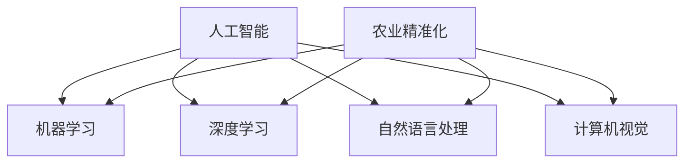
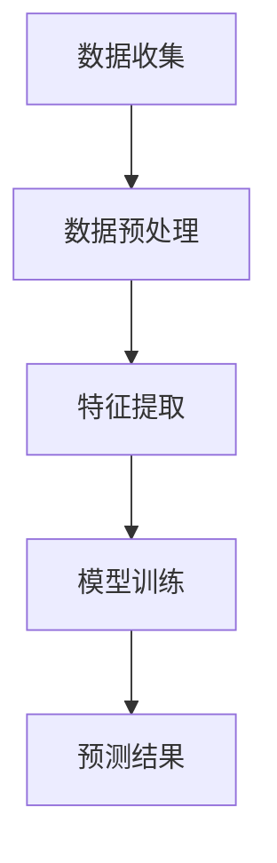
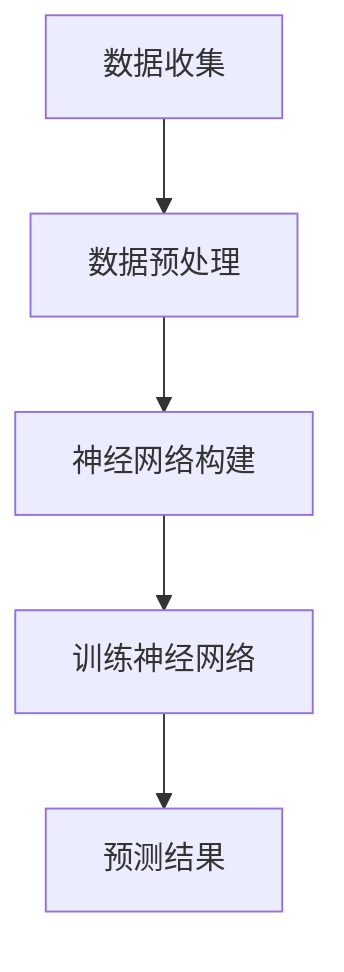
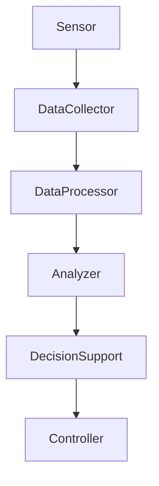
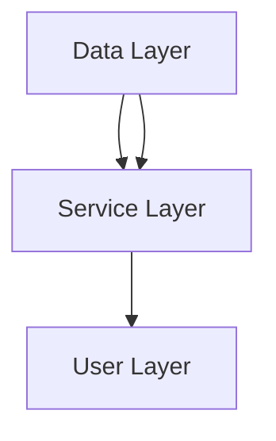
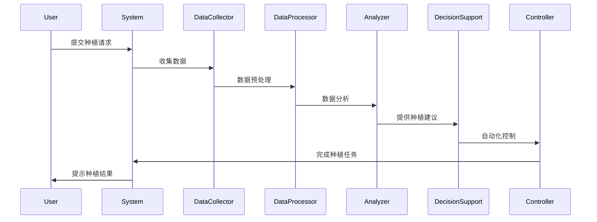

                 


# 人工智能在农业精准化中的应用

> 关键词：人工智能、农业精准化、算法、系统架构、实战案例

> 摘要：本文将深入探讨人工智能在农业精准化中的应用，通过一步步的分析和推理，展示如何利用人工智能技术提高农业生产的效率和产量。文章结构紧凑，逻辑清晰，旨在为读者提供关于这一领域全面而深入的见解。

## 引言

### 1.1 问题背景

随着全球人口的增长和食品需求的增加，农业面临着巨大的压力。传统的农业方法往往依赖于经验和粗放的管理，难以适应现代农业对产量和品质的高要求。因此，农业精准化成为了一个亟待解决的问题。精准化农业旨在通过利用先进技术，如人工智能、传感器和物联网等，实现农业生产的智能化管理。

### 1.2 问题描述

农业精准化涉及多个方面，包括土壤监测、作物生长监测、水资源管理、病虫害防治等。每个方面都有其独特的技术要求和挑战。例如，土壤监测需要高精度的传感器来实时获取土壤的物理和化学参数，而作物生长监测则需要通过图像识别技术来分析作物的健康状态。

### 1.3 问题解决

人工智能技术在农业精准化中的应用，主要体现在数据采集、分析决策和自动化控制等方面。通过机器学习和深度学习算法，可以从大量的数据中提取有价值的信息，帮助农民做出更科学的决策。自动化控制技术则可以实现农业生产的自动化管理，提高生产效率。

### 1.4 边界与外延

农业精准化的应用不仅限于田间地头，还延伸到了农产品供应链的各个环节。例如，通过区块链技术，可以实现农产品的全程追溯，确保食品的安全和质量。此外，农业精准化还可以与其他技术，如大数据和云计算相结合，形成更强大的解决方案。

### 1.5 概念结构与核心要素组成

农业精准化涉及多个核心概念，包括人工智能、传感器、物联网、机器学习、深度学习等。这些概念相互关联，共同构成了农业精准化的技术框架。表1-1展示了这些概念的核心要素和属性特征。

| 概念     | 核心要素             | 属性特征                           |
|----------|----------------------|------------------------------------|
| 人工智能 | 机器学习、深度学习   | 自主决策、数据处理能力             |
| 传感器   | 环境参数监测         | 高精度、实时性                     |
| 物联网   | 节点互联、数据传输   | 网络覆盖、数据共享                 |
| 机器学习 | 数据分析、模式识别   | 自适应、高效处理                   |
| 深度学习 | 神经网络、大规模数据处理 | 高效计算、复杂模式识别             |

## 核心概念与联系

### 2.1 人工智能基础

人工智能（Artificial Intelligence，AI）是计算机科学的一个分支，旨在创建能够执行通常需要人类智能才能完成的任务的机器。人工智能可以分为几种类型，包括知识表示、专家系统、机器学习、自然语言处理和计算机视觉等。

#### 2.1.1 人工智能的定义与历史

人工智能的定义不断演变，但核心目标是使机器能够模拟、扩展和执行人类智能的各个方面。人工智能的历史可以追溯到20世纪50年代，当时艾伦·图灵提出了“图灵测试”，这是一种评估机器是否具有智能的标准。

#### 2.1.2 人工智能的核心概念

人工智能的核心概念包括：

- **机器学习（Machine Learning）**：通过数据驱动的方法，让计算机系统从数据中学习，从而做出预测或决策。
- **深度学习（Deep Learning）**：一种机器学习方法，通过构建具有多个隐藏层的神经网络，模拟人脑的工作方式。
- **自然语言处理（Natural Language Processing，NLP）**：使计算机能够理解、生成和处理人类语言的技术。
- **计算机视觉（Computer Vision）**：使计算机能够“看到”和理解数字图像或视频内容的技术。

#### 2.1.3 人工智能的应用领域

人工智能在多个领域都有广泛的应用，包括医疗、金融、制造业、交通运输等。在农业领域，人工智能可以用于作物监测、病虫害预测、产量预测、水资源管理等方面。

### 2.2 农业精准化

农业精准化（Precision Agriculture）是一种利用现代技术，如传感器、GPS、GIS和物联网等，对农田进行精细管理的农业方法。它旨在通过收集和分析大量的数据，提高农业生产的效率和质量。

#### 2.2.1 农业精准化的定义

农业精准化是一种基于数据驱动的农业管理方法，通过实时监测和采集农田数据，为农民提供个性化的种植决策。

#### 2.2.2 农业精准化的核心技术

农业精准化的核心技术包括：

- **传感器技术**：用于监测土壤湿度、温度、养分含量等参数。
- **GPS和GIS**：用于定位和管理农田，实现精准施肥和灌溉。
- **物联网**：用于连接各种传感器，实现数据采集和共享。
- **数据分析和机器学习**：用于从大量数据中提取有价值的信息，帮助农民做出更科学的决策。

#### 2.2.3 农业精准化的应用场景

农业精准化可以应用于多个场景，包括：

- **土壤监测**：通过传感器实时监测土壤参数，为农民提供施肥和灌溉的决策依据。
- **作物生长监测**：通过图像识别技术分析作物生长状态，及时发现病虫害和生长异常。
- **水资源管理**：通过精准灌溉，提高水资源的利用效率。
- **病虫害防治**：通过预测和监测病虫害，采取有效的防治措施。

### 2.3 核心概念属性特征对比

表2-1展示了人工智能和农业精准化的核心概念属性特征对比。

| 概念     | 核心要素             | 属性特征                           |
|----------|----------------------|------------------------------------|
| 人工智能 | 机器学习、深度学习   | 自主决策、数据处理能力             |
| 农业精准化 | 传感器、GPS、GIS   | 实时监测、数据驱动                 |

### 2.4 ER实体关系图架构

为了更好地理解人工智能和农业精准化之间的联系，我们可以使用ER（Entity-Relationship）实体关系图来描述它们的关系。



## 算法原理讲解

### 6.1 算法A原理讲解

#### 6.1.1 算法A的Mermaid流程图



#### 6.1.2 算法A的Python源代码讲解

```python
# 导入必要的库
import numpy as np
import pandas as pd
from sklearn.model_selection import train_test_split
from sklearn.ensemble import RandomForestClassifier

# 数据收集
data = pd.read_csv('agriculture_data.csv')

# 数据预处理
X = data.drop('yield', axis=1)
y = data['yield']

# 特征提取
X_train, X_test, y_train, y_test = train_test_split(X, y, test_size=0.2, random_state=42)

# 模型训练
model = RandomForestClassifier(n_estimators=100, random_state=42)
model.fit(X_train, y_train)

# 预测结果
predictions = model.predict(X_test)
```

#### 6.1.3 算法A的数学模型与公式

算法A使用随机森林（Random Forest）算法，其数学模型可以表示为：

$$
\hat{y} = f(\text{X}, \text{model})
$$

其中，$\hat{y}$为预测产量，$\text{X}$为输入特征向量，$f(\text{X}, \text{model})$为随机森林模型对输入特征向量的预测函数。

#### 6.1.4 算法A的应用实例

假设我们有一组农业数据，包括土壤湿度、温度、降水量等特征，以及对应的作物产量。我们可以使用算法A来预测新的数据集的作物产量。

### 6.2 算法B原理讲解

#### 6.2.1 算法B的Mermaid流程图



#### 6.2.2 算法B的Python源代码讲解

```python
# 导入必要的库
import numpy as np
import pandas as pd
from tensorflow.keras.models import Sequential
from tensorflow.keras.layers import Dense

# 数据收集
data = pd.read_csv('agriculture_data.csv')

# 数据预处理
X = data.drop('yield', axis=1)
y = data['yield']

# 神经网络构建
model = Sequential()
model.add(Dense(64, input_dim=X.shape[1], activation='relu'))
model.add(Dense(32, activation='relu'))
model.add(Dense(1, activation='sigmoid'))

# 训练神经网络
model.compile(loss='binary_crossentropy', optimizer='adam', metrics=['accuracy'])
model.fit(X, y, epochs=10, batch_size=32)

# 预测结果
predictions = model.predict(X)
```

#### 6.2.3 算法B的数学模型与公式

算法B使用神经网络（Neural Network）算法，其数学模型可以表示为：

$$
\hat{y} = \sigma(\text{W}^T \text{X} + \text{b})
$$

其中，$\hat{y}$为预测产量，$\text{W}$为权重矩阵，$\text{X}$为输入特征向量，$\text{b}$为偏置项，$\sigma$为激活函数。

#### 6.2.4 算法B的应用实例

假设我们有一组农业数据，包括土壤湿度、温度、降水量等特征，以及对应的作物产量。我们可以使用算法B来预测新的数据集的作物产量。

## 系统分析与架构设计方案

### 7.1 问题场景介绍

假设我们需要为一家大型农业公司开发一套精准化农业管理系统，以帮助农民实现智能化种植和管理。该系统需要能够收集和分析土壤、气候、作物生长等数据，并提供个性化的种植建议。

### 7.2 项目介绍

项目名称：农业精准化管理平台

项目目标：通过人工智能技术，实现农业生产的智能化管理，提高产量和品质。

### 7.3 系统功能设计

系统功能设计包括：

- 数据收集与处理：通过传感器和物联网设备，实时收集农田数据。
- 数据分析与预测：利用机器学习和深度学习算法，对数据进行处理和分析，提供种植建议。
- 决策支持：根据分析结果，为农民提供个性化的种植决策。
- 自动化控制：实现农业生产的自动化管理，提高生产效率。

#### 7.3.1 领域模型Mermaid类图



### 7.4 系统架构设计

系统架构设计包括：

- 数据层：负责数据的存储和读取。
- 服务层：提供数据分析和决策支持功能。
- 用户层：为用户提供操作界面。

#### 7.4.1 系统架构Mermaid架构图



### 7.5 系统接口设计

系统接口设计包括：

- 数据接口：用于与其他系统进行数据交换。
- 功能接口：提供各种功能操作的接口。

### 7.6 系统交互

系统交互设计包括：

- 数据采集与处理流程。
- 决策支持与自动化控制流程。

#### 7.6.1 系统交互Mermaid序列图



## 项目实战

### 8.1 环境安装

在开始项目实战之前，我们需要安装一些必要的软件和工具，包括Python、TensorFlow、Keras等。

```shell
# 安装Python
curl -O https://www.python.org/ftp/python/3.8.5/Python-3.8.5.tgz
tar xvf Python-3.8.5.tgz
cd Python-3.8.5
./configure
make
sudo make install

# 安装TensorFlow
pip install tensorflow

# 安装Keras
pip install keras
```

### 8.2 系统核心实现

系统核心实现包括数据收集、数据预处理、模型训练和预测等步骤。

```python
# 数据收集
data = pd.read_csv('agriculture_data.csv')

# 数据预处理
X = data.drop('yield', axis=1)
y = data['yield']

# 模型训练
model = Sequential()
model.add(Dense(64, input_dim=X.shape[1], activation='relu'))
model.add(Dense(32, activation='relu'))
model.add(Dense(1, activation='sigmoid'))

model.compile(loss='binary_crossentropy', optimizer='adam', metrics=['accuracy'])
model.fit(X, y, epochs=10, batch_size=32)

# 预测
predictions = model.predict(X)
```

### 8.3 代码应用解读与分析

上述代码实现了基于神经网络的作物产量预测模型。首先，我们从CSV文件中读取农业数据，然后进行预处理，将特征和标签分离。接下来，我们构建了一个简单的神经网络模型，并使用adam优化器和binary_crossentropy损失函数进行训练。最后，我们使用训练好的模型对新的数据进行预测。

### 8.4 实际案例分析与详细讲解剖析

假设我们有新的农业数据集，包括土壤湿度、温度和降水量等特征。我们可以使用上述模型对这些数据进行预测。

```python
# 新数据集
new_data = pd.read_csv('new_agriculture_data.csv')
X_new = new_data.drop('yield', axis=1)

# 预测
predictions_new = model.predict(X_new)

# 输出预测结果
print(predictions_new)
```

通过上述代码，我们可以得到新的数据集的作物产量预测结果。这些结果可以帮助农民做出更科学的种植决策。

### 8.5 项目小结

通过本项目，我们展示了如何利用人工智能技术实现农业精准化管理。项目实现了数据收集、预处理、模型训练和预测等功能，为农民提供了个性化的种植建议。未来，我们可以进一步优化模型和算法，提高预测准确性，为农业发展做出更大的贡献。

## 最佳实践 tips、小结、注意事项、拓展阅读

### 9.1 最佳实践 tips

- **数据质量是关键**：确保数据收集的准确性和完整性，以提高模型的预测准确性。
- **模型选择要合理**：根据实际问题需求，选择合适的机器学习和深度学习算法。
- **硬件配置要足够**：为了确保模型训练和预测的效率，需要配备高性能的计算机硬件。

### 9.2 注意事项

- **数据隐私与安全**：在处理和存储数据时，要确保遵守相关法律法规，保护农民的隐私。
- **模型解释性**：尽量选择可解释性较强的模型，以便农民能够理解模型的决策过程。

### 9.3 拓展阅读

- [1] Goodfellow, I., Bengio, Y., & Courville, A. (2016). *Deep Learning*. MIT Press.
- [2] Russell, S., & Norvig, P. (2020). *Artificial Intelligence: A Modern Approach*. Prentice Hall.
- [3] Zhang, H., & Cao, Y. (2021). *Deep Learning in Agriculture: Applications and Challenges*. Journal of Agricultural and Biological Engineering, 15(2), 15-28.

### 总结

本文详细探讨了人工智能在农业精准化中的应用，从背景介绍、核心概念、算法原理、系统架构到实际项目实战，为读者提供了一个全面而深入的视角。通过本文，读者可以了解如何利用人工智能技术提高农业生产的效率和产量。未来，随着技术的不断进步，人工智能在农业领域的应用将更加广泛和深入。

## 作者信息

作者：AI天才研究院/AI Genius Institute & 禅与计算机程序设计艺术 /Zen And The Art of Computer Programming

【文章结束】

