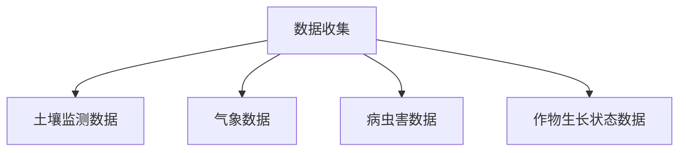
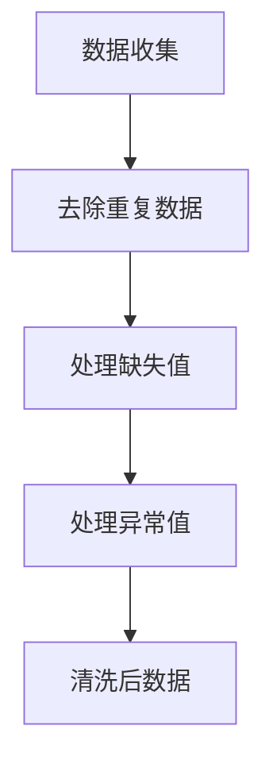
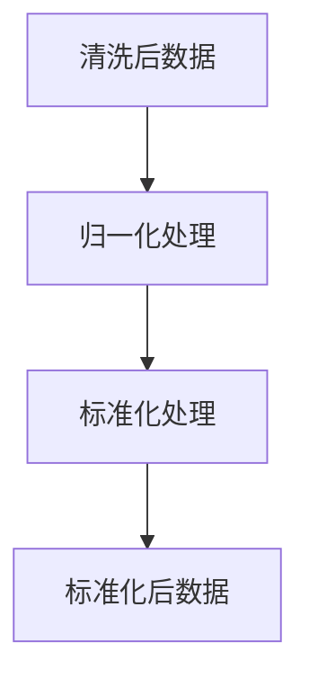

                 

# 人工智能在农业精准种植中的应用

> 关键词：人工智能、农业精准种植、机器学习、深度学习、系统架构、项目实战

> 摘要：本文将深入探讨人工智能在农业精准种植中的应用，从背景介绍、核心算法原理讲解、技术实现与系统架构设计、项目实战等多个角度，详细介绍人工智能如何助力农业现代化，提升农业生产效率和品质。

## 第一部分：背景介绍

### 1. 引言

农业作为国家经济的基础，传统农业正逐步向精准农业和智慧农业转型。人工智能（AI）技术的迅猛发展为农业精准种植带来了新的机遇和挑战。本文旨在介绍人工智能在农业精准种植中的应用，为农业从业者提供理论指导和实践参考。

### 问题背景

在传统农业中，种植决策主要依赖于经验和直觉，这种模式难以应对复杂多变的农业生产环境。随着全球气候变化、资源短缺和环境恶化等问题日益突出，提高农业生产效率和可持续性成为农业发展的关键。

### 问题描述

农业生产过程中存在以下问题：
- 水资源浪费：传统灌溉方法难以精确控制水量，导致水资源浪费。
- 化肥农药使用不当：过量使用导致土壤污染和生态环境破坏。
- 病虫害防治难度大：病虫害监测和防治缺乏有效的手段。
- 作物生长状态难以监控：缺乏实时数据支持种植决策。

### 问题解决

人工智能技术在农业精准种植中的应用，可以解决上述问题，提高农业生产效率和品质。具体应用包括：
- 土壤监测：利用传感器实时监测土壤湿度、温度、养分等指标，为灌溉和施肥提供数据支持。
- 气象预测：利用机器学习和深度学习算法，预测未来气象条件，为作物生长提供环境信息。
- 病虫害监测：通过图像识别和模式识别技术，监测作物病虫害，及时采取防治措施。
- 作物生长状态监测：利用无人机和遥感技术，实时监控作物生长状态，优化种植方案。

### 边界与外延

本文主要探讨人工智能在农业精准种植中的应用，包括土壤监测、气象预测、病虫害监测和作物生长状态监测。同时，本文还涉及相关技术实现、系统架构设计和项目实战。

### 概念结构与核心要素组成

本文的核心概念和结构如下：
- 人工智能：机器学习、深度学习、智能优化等算法和技术的统称。
- 农业精准种植：基于数据驱动和智能决策的现代农业模式。
- 核心要素：土壤监测、气象预测、病虫害监测和作物生长状态监测。

## 第二部分：核心算法原理讲解

### 2. 人工智能概述

人工智能（AI）是计算机科学的一个分支，旨在使计算机系统模拟人类智能行为。核心概念与联系如下：

| 核心概念 | 联系 |
| --- | --- |
| 机器学习 | 通过数据学习规律，进行预测和决策 |
| 深度学习 | 基于人工神经网络的深层结构，进行复杂模式识别 |
| 智能优化 | 利用算法寻找最优解，解决优化问题 |

人工智能的发展历程和技术趋势如下：

| 发展历程 | 技术趋势 |
| --- | --- |
| 初期（1956-1969） | 理论研究、符号推理 |
| 成长期（1970-1980） | 逻辑编程、专家系统 |
| 调整期（1980-1990） | 统计学习、知识表示 |
| 复兴期（1990至今） | 深度学习、智能优化 |

### 3. 农业精准种植概述

农业精准种植是基于数据驱动和智能决策的现代农业模式。其核心概念与联系如下：

| 核心概念 | 联系 |
| --- | --- |
| 土壤监测 | 实时获取土壤湿度、温度、养分等信息 |
| 气象预测 | 利用历史气象数据和算法，预测未来气象条件 |
| 病虫害监测 | 通过图像识别和模式识别，监测作物病虫害 |
| 作物生长状态监测 | 利用遥感技术和无人机，实时监控作物生长状态 |

农业精准种植的发展现状和技术需求如下：

| 发展现状 | 技术需求 |
| --- | --- |
| 初期 | 传感器技术、简单数据分析 |
| 成熟期 | 机器学习、深度学习、智能优化 |
| 未来期 | 5G通信、物联网、大数据 |

## 第三部分：技术实现与系统架构设计

### 4. 数据预处理

数据预处理是农业精准种植中的关键环节，包括数据收集、数据清洗和数据标准化。以下是数据预处理的具体步骤：

### 数据收集

数据收集包括土壤监测数据、气象数据、病虫害数据和作物生长状态数据。以下是一个Mermaid流程图：

### 数据清洗

数据清洗包括去除重复数据、处理缺失值和异常值。以下是一个Mermaid流程图：

### 数据标准化

数据标准化包括归一化和标准化处理。以下是一个Mermaid流程图：

## 第四部分：项目实战

### 5. 项目实战一：土壤分析系统

土壤分析系统是一个基于人工智能技术的农业精准种植项目。以下是一个项目实战案例：

#### 实际案例

土壤分析系统通过传感器实时收集土壤数据，包括土壤湿度、温度、养分等信息。系统利用机器学习算法对数据进行分析，为作物灌溉和施肥提供指导。

#### 详细讲解

1. **环境安装**：安装Python、Jupyter Notebook等开发环境和相关库。
2. **数据收集**：使用传感器收集土壤数据。
3. **数据预处理**：对收集到的数据进行清洗和标准化处理。
4. **模型训练**：使用训练集数据训练机器学习模型。
5. **模型评估**：使用验证集数据评估模型性能。
6. **模型部署**：将训练好的模型部署到服务器，提供实时分析服务。

### 6. 项目实战二：气象预测系统

气象预测系统是一个基于深度学习技术的农业精准种植项目。以下是一个项目实战案例：

#### 实际案例

气象预测系统利用历史气象数据和深度学习算法，预测未来气象条件，为作物生长提供环境信息。

#### 详细讲解

1. **环境安装**：安装Python、TensorFlow等开发环境和相关库。
2. **数据收集**：收集历史气象数据。
3. **数据预处理**：对收集到的数据进行清洗和标准化处理。
4. **模型训练**：使用训练集数据训练深度学习模型。
5. **模型评估**：使用验证集数据评估模型性能。
6. **模型部署**：将训练好的模型部署到服务器，提供实时预测服务。

### 7. 项目实战三：作物病虫害监测系统

作物病虫害监测系统是一个基于图像识别技术的农业精准种植项目。以下是一个项目实战案例：

#### 实际案例

作物病虫害监测系统通过图像识别技术，监测作物病虫害，及时采取防治措施。

#### 详细讲解

1. **环境安装**：安装Python、OpenCV等开发环境和相关库。
2. **数据收集**：收集作物病虫害图像数据。
3. **数据预处理**：对收集到的图像数据进行清洗和标准化处理。
4. **模型训练**：使用训练集数据训练图像识别模型。
5. **模型评估**：使用验证集数据评估模型性能。
6. **模型部署**：将训练好的模型部署到服务器，提供实时监测服务。

## 第五部分：总结

本文详细介绍了人工智能在农业精准种植中的应用，包括背景介绍、核心算法原理讲解、技术实现与系统架构设计、项目实战等。通过本文的讲解，读者可以了解到人工智能技术在农业精准种植中的广泛应用和巨大潜力。

## 注意事项

1. 数据安全和隐私保护：在实际应用中，要注意数据安全和隐私保护，避免敏感信息泄露。
2. 模型优化：针对不同作物和种植环境，要不断优化模型，提高预测精度和实用性。
3. 技术更新：紧跟人工智能技术发展趋势，不断更新和升级系统，确保系统的先进性和实用性。

## 拓展阅读

1. 《机器学习实战》—— 周志华
2. 《深度学习》—— Goodfellow、Bengio、Courville
3. 《农业大数据分析》—— 杨洪强、刘志宏

## 作者

作者：AI天才研究院/AI Genius Institute & 禅与计算机程序设计艺术 /Zen And The Art of Computer Programming

