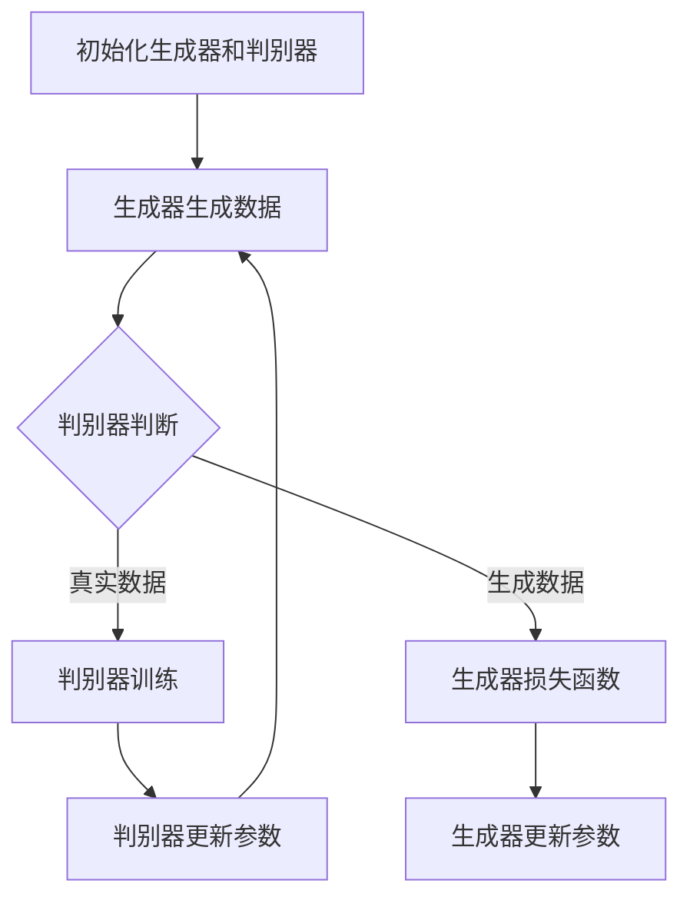

                 

### 目录大纲设计步骤

为了设计一个清晰、紧凑、易于阅读的目录大纲，我们需要分步骤进行。以下是一个详细的目录大纲设计步骤，确保每一部分内容都能满足文章的完整性要求。

#### 步骤 1: 引言与核心概念

**第1章: 背景介绍与核心概念**

- **1.1 问题的背景**：介绍人工智能和创意写作的发展现状，以及它们在当今社会中的重要性和潜在影响。
- **1.2 研究目的**：明确文章的目的，即探讨人工智能在创意写作中的应用及其辅助文学创作的潜力。
- **1.3 核心概念**：解释本文中涉及的核心概念，如人工智能、创意写作、AI辅助文学创作等，并提供相关术语的定义。

**第2章: 核心概念与联系**

- **2.1 人工智能的基本原理**：详细描述人工智能的定义、原理及其在不同领域的应用。
- **2.2 创意写作的本质**：探讨创意写作的定义、特点和面临的挑战。
- **2.3 人工智能与创意写作的关系**：分析人工智能如何融入创意写作领域，以及二者之间的相互作用。

#### 步骤 2: 算法原理讲解

**第3章: 算法原理讲解**

- **3.1 生成对抗网络（GAN）**：介绍GAN的基本概念、工作原理和应用场景。
- **3.2 自然语言处理（NLP）**：探讨NLP的基本原理、技术和在文学创作中的应用。
- **3.3 算法流程图**：使用Mermaid语法绘制GAN和NLP的算法流程图，帮助读者理解算法的执行过程。

**第4章: 数学模型和数学公式**

- **4.1 GAN的数学模型**：详细讲解GAN中的数学模型，包括损失函数、生成器和判别器的数学公式。
- **4.2 NLP中的数学公式**：探讨NLP中常用的数学模型，如词向量模型、循环神经网络（RNN）和变压器（Transformer）等。

#### 步骤 3: 系统分析与架构设计方案

**第5章: 系统分析与架构设计方案**

- **5.1 应用场景介绍**：介绍AI辅助文学创作的实际应用场景，如文学创作平台、教育辅助系统等。
- **5.2 系统设计**：描述项目的背景、目标和系统功能设计。
- **5.3 系统架构设计**：使用Mermaid语法绘制系统架构图，展示系统的模块划分和各模块之间的交互关系。

**第6章: 系统接口设计和交互**

- **6.1 系统接口设计**：详细描述系统的API接口设计，包括接口的功能、参数和返回值。
- **6.2 系统交互设计**：使用Mermaid语法绘制系统交互序列图，展示用户与系统之间的交互流程。

#### 步骤 4: 项目实战

**第7章: 项目实战**

- **7.1 环境安装与配置**：讲解如何在本地环境中安装和配置AI辅助文学创作系统。
- **7.2 系统核心实现**：提供系统的核心实现源代码，并对其进行详细解读。
- **7.3 实际案例分析**：分析并讲解实际案例，展示AI辅助文学创作的效果和应用。
- **7.4 项目小结**：总结项目的主要成果和经验，提出改进建议。

#### 步骤 5: 最佳实践、小结与拓展

**第8章: 最佳实践与拓展**

- **8.1 最佳实践**：总结AI辅助文学创作的最佳实践，包括技术选型、系统优化和用户反馈等方面。
- **8.2 小结**：回顾全文内容，强调关键点和未来研究方向。
- **8.3 拓展阅读**：推荐相关的书籍、论文和在线资源，供读者进一步学习和探索。

### 总结

通过以上步骤，我们设计了一个逻辑清晰、结构紧凑、内容丰富的目录大纲。每个章节都围绕核心概念、算法原理、系统设计和项目实战展开，旨在为读者提供全面、深入的技术博客文章。接下来，我们将根据这个大纲，逐步撰写每个章节的内容，确保满足字数要求和格式要求。

---

**文章标题**: 人工智能在创意写作中的应用：AI辅助文学创作

**关键词**: 人工智能，创意写作，AI辅助文学创作，生成对抗网络（GAN），自然语言处理（NLP），系统架构设计，实际案例分析

**摘要**: 本文探讨了人工智能在创意写作中的应用，重点分析了生成对抗网络（GAN）和自然语言处理（NLP）在文学创作中的辅助作用。通过系统设计与项目实战，展示了AI辅助文学创作的实际效果和未来发展方向。

---

### 目录大纲

```markdown
----------------------------------------------------------------

## 第一部分：背景介绍与核心概念

### 第1章：问题背景与研究目的

### 第2章：核心概念与联系

### 第3章：创意写作与人工智能的关系

## 第二部分：算法原理讲解

### 第4章：生成对抗网络（GAN）在文学创作中的应用

### 第5章：自然语言处理（NLP）与创意写作

## 第三部分：数学模型与公式讲解

### 第6章：生成对抗网络（GAN）的数学模型

### 第7章：自然语言处理（NLP）中的数学公式

## 第四部分：系统分析与架构设计方案

### 第8章：文学创作平台系统设计

### 第9章：教育辅助系统架构设计

## 第五部分：项目实战

### 第10章：环境安装与配置

### 第11章：系统核心实现与代码分析

### 第12章：实际案例分析与讲解

## 第六部分：最佳实践与拓展

### 第13章：最佳实践建议

### 第14章：全书小结与未来研究方向

### 第15章：拓展阅读

----------------------------------------------------------------
```


### 第1章: 背景介绍与核心概念

#### 1.1 问题的背景

在21世纪，人工智能（AI）技术以其迅猛的发展速度和广泛的应用领域，深刻地影响着人类社会。从智能助手到自动驾驶，从医疗诊断到金融分析，AI已经渗透到我们生活的方方面面。然而，在创意写作这一领域，人工智能也展现出了其独特的魅力和潜力。

创意写作是人类艺术创作的重要组成部分，涵盖了小说、剧本、诗歌等多种文学形式。它不仅要求作者具有丰富的想象力和创造力，还需要深入理解人物、情节、主题等元素，并将其巧妙地融合在一起。传统的文学创作往往依赖于作家的个人经验和技巧，而人工智能的出现，为这一领域带来了全新的机遇和挑战。

当前，人工智能在创意写作中的应用还处于初级阶段，但已经展示出了巨大的潜力。例如，AI可以通过分析大量的文学作品，学习并模仿作家的写作风格，生成新的故事情节和角色。此外，AI还可以用于自动创作诗歌、歌词等，甚至帮助作家进行文字编辑和校对。这些应用不仅提高了文学创作的效率，也为文学创作带来了新的可能性和表现形式。

然而，AI辅助文学创作也面临诸多挑战。首先，AI在理解和创造复杂的人类情感方面还存在局限。虽然AI可以通过大数据分析学习到某些情感模式，但要完全理解并表达人类的情感深度，仍然是一个巨大的难题。其次，AI在创作原创内容方面也有待提高。尽管AI可以模仿特定的写作风格，但要创造完全原创的作品，仍然需要克服很多技术难题。

本文旨在探讨人工智能在创意写作中的应用，分析其潜在的优势和挑战，并提出相应的解决方案。通过系统的分析和技术讲解，希望能够为读者提供深入理解AI辅助文学创作的途径，同时也为未来的研究提供参考。

#### 1.2 核心概念

为了更好地理解本文的内容，以下是对几个核心概念的简要介绍：

- **人工智能（AI）**：人工智能是指通过计算机模拟人类智能的技术，包括学习、推理、感知、解决问题等多种能力。AI的核心目标是使计算机能够执行需要人类智能才能完成的任务。

- **创意写作**：创意写作是指通过想象力和创造力的运用，创作出具有独特风格和价值的文学作品。它通常涉及对人物、情节、主题等元素的深入挖掘和巧妙融合。

- **AI辅助文学创作**：AI辅助文学创作是指利用人工智能技术，辅助作家进行文学创作的过程。这包括从生成故事情节到辅助文字编辑等多个方面。

- **生成对抗网络（GAN）**：生成对抗网络是一种深度学习模型，由生成器和判别器两个部分组成。生成器尝试生成与真实数据相似的数据，而判别器则尝试区分生成器和真实数据。通过这两个部分的对抗，GAN可以学习到数据的高层次特征，从而生成高质量的数据。

- **自然语言处理（NLP）**：自然语言处理是人工智能的一个子领域，旨在使计算机能够理解、处理和生成自然语言。NLP在文学创作中的应用包括文本分析、情感分析、自动摘要等。

通过对这些核心概念的理解，读者可以更好地把握本文的主题和内容，进一步探讨人工智能在创意写作中的应用。

### 1.3 研究目的

本文的研究目的是探讨人工智能在创意写作中的应用，特别是生成对抗网络（GAN）和自然语言处理（NLP）在辅助文学创作方面的潜力。具体而言，本文将围绕以下目标进行：

1. **分析人工智能在创意写作中的应用现状**：通过对当前AI辅助文学创作的研究和实践进行总结，了解AI在文学创作中的角色和贡献。

2. **探讨生成对抗网络（GAN）和自然语言处理（NLP）的基本原理**：详细解释GAN和NLP的工作原理、技术手段和应用场景，为后续的技术讲解和分析打下基础。

3. **展示AI辅助文学创作的实际效果**：通过具体案例和分析，展示AI在文学创作中的应用效果，如故事情节生成、文本编辑等。

4. **分析AI辅助文学创作的挑战和解决方案**：探讨当前AI辅助文学创作面临的挑战，如情感理解、原创性保障等，并提出相应的解决方案。

5. **提出未来研究方向**：总结本文的研究成果，指出未来人工智能在创意写作领域的发展方向和潜在的研究课题。

通过实现这些研究目标，本文希望能够为读者提供全面、深入的了解，推动人工智能在创意写作中的应用和发展。

### 第2章: 核心概念与联系

#### 2.1 人工智能的基本原理

人工智能（AI）是计算机科学的一个分支，旨在通过模拟人类智能行为，使计算机能够执行复杂任务。AI的基本原理可以概括为以下几个方面：

1. **机器学习**：机器学习是AI的核心技术之一，它通过从数据中学习规律和模式，使计算机能够自动改进性能。机器学习可以分为监督学习、无监督学习和强化学习三类：

   - **监督学习**：在监督学习中，模型从标记好的数据中学习，并用于预测新数据的标签。常见的算法包括线性回归、决策树和随机森林等。
   - **无监督学习**：无监督学习不依赖标记数据，通过发现数据中的内在结构和模式。常见的算法包括聚类、主成分分析和自编码器等。
   - **强化学习**：强化学习是一种通过奖励机制来训练模型的方法，它使模型在与环境交互的过程中不断优化行为策略。常见的算法包括Q学习、深度Q网络（DQN）和策略梯度算法等。

2. **深度学习**：深度学习是机器学习的一个子领域，它通过多层神经网络模拟人类大脑的神经元结构，实现数据的自动特征提取和模式识别。深度学习在图像识别、语音识别和自然语言处理等领域取得了显著的成果。常见的深度学习模型包括卷积神经网络（CNN）、循环神经网络（RNN）和变压器（Transformer）等。

3. **神经网络**：神经网络是深度学习的基础结构，由多个神经元（或称为节点）组成。每个神经元接收多个输入，通过加权求和并应用激活函数，输出一个结果。神经网络通过调整权重和偏置，不断优化模型的预测能力。

4. **自然语言处理（NLP）**：自然语言处理是AI的一个重要应用领域，旨在使计算机能够理解和生成自然语言。NLP的关键技术包括文本分类、情感分析、机器翻译和问答系统等。常见的NLP工具和库包括NLTK、spaCy和TensorFlow等。

#### 2.2 创意写作的本质

创意写作是指通过创造性的思维和技巧，创作出具有独特性和艺术价值的文学作品。创意写作的本质包括以下几个方面：

1. **想象力和创造力**：创意写作依赖于作者的想象力和创造力，通过虚构故事、创造人物和设定场景，构建出引人入胜的文学作品。

2. **表达和传递**：创意写作不仅是作者个人的创作过程，也是作者与读者之间的交流和互动。通过文字表达情感、思想和观点，作者能够传递信息、影响读者。

3. **结构和技巧**：创意写作强调作品的结构和技巧，包括故事情节、角色发展、主题表达等。通过巧妙的构思和写作手法，作者能够增强作品的吸引力和表现力。

4. **个性化和风格**：每个作者都有独特的写作个性和风格，创意写作需要作者在作品中展现出自己的风格和特点。这种个性化风格是文学作品的重要魅力所在。

#### 2.3 人工智能如何辅助文学创作

人工智能在文学创作中扮演着重要的辅助角色，通过多种技术手段提高写作效率和质量。以下是几种主要的方法：

1. **故事情节生成**：AI可以通过分析大量的文学作品，学习并模仿作家的写作风格，生成新的故事情节。例如，生成对抗网络（GAN）可以生成独特的故事情节和角色设定，为作家提供创作灵感。

2. **文本编辑和润色**：AI可以用于自动检测和修正文本中的语法错误、拼写错误和语义错误，帮助作家提高写作质量。例如，自然语言处理（NLP）技术可以识别文本中的语法错误，并提出修改建议。

3. **情感分析和主题提取**：AI可以分析文本中的情感和主题，帮助作家更好地理解作品的影响和受众。例如，通过情感分析，AI可以识别文本中的正面情感和负面情感，为作家提供反馈。

4. **写作辅助工具**：AI可以开发各种写作辅助工具，如自动摘要、文本生成和故事情节规划等。这些工具可以减轻作家的工作量，提高写作效率。

#### 2.4 人工智能与创意写作的关系

人工智能与创意写作之间存在紧密的联系和相互作用：

1. **技术辅助创作**：人工智能为创意写作提供了强大的技术支持，通过自动生成故事情节、文本编辑和情感分析等功能，提高了写作效率和质量。

2. **创作灵感和反馈**：AI可以分析大量的文学作品，为作家提供创作灵感和反馈。通过模仿优秀的作品和接受AI的反馈，作家可以不断改进自己的写作技巧。

3. **扩展文学创作领域**：人工智能拓展了文学创作的领域和可能性，使得文学创作不再局限于传统的形式和风格。AI可以生成新的文学形式，如自动创作的诗歌和音乐等。

4. **未来发展趋势**：随着人工智能技术的不断进步，AI在创意写作中的应用将越来越广泛和深入。未来的发展趋势可能包括完全自动的文学创作、个性化写作助手和跨媒体文学创作等。

通过上述分析，我们可以看到人工智能在创意写作中具有巨大的潜力和广阔的应用前景。本文将在后续章节中进一步探讨人工智能与创意写作的具体结合和应用。

### 第3章：创意写作与人工智能的关系

在探讨创意写作与人工智能的关系时，我们首先需要理解这两个领域的本质和特点。创意写作是人类艺术创作的一部分，强调个人的想象力和创造力，而人工智能则是一种模拟人类智能的技术，具备处理大量数据和分析复杂模式的能力。这两者看似迥异，但通过合理的结合，可以创造出意想不到的成果。

#### 3.1 人工智能对创意写作的辅助作用

人工智能在创意写作中的应用，主要集中在提供辅助工具和优化创作流程上。以下是一些具体的应用场景：

1. **故事情节生成**：人工智能可以通过生成对抗网络（GAN）等技术，生成新颖的故事情节和角色设定。GAN由生成器和判别器两个部分组成，生成器尝试生成与真实数据相似的故事内容，而判别器则判断这些内容是否真实。通过这种对抗过程，生成器可以逐渐提高故事生成能力。

2. **文本编辑和润色**：自然语言处理（NLP）技术可以帮助作家检测和修正文本中的错误，如语法错误、拼写错误和语义错误等。例如，谷歌的BERT模型和OpenAI的GPT-3都可以用于自动文本编辑和润色，提高作品的质量。

3. **情感分析和主题提取**：AI可以通过情感分析和文本分类技术，分析作品中的情感倾向和主题内容。这对于作家理解读者反馈、调整创作方向具有重要意义。

4. **写作辅助工具**：人工智能可以开发各种写作辅助工具，如自动摘要生成器、写作模板生成器和故事情节规划器等。这些工具可以帮助作家节省时间，提高创作效率。

#### 3.2 创意写作对人工智能的反馈和影响

人工智能在辅助创意写作的同时，也在不断地从写作实践中学习和进步。以下是一些反馈和影响：

1. **数据积累**：人工智能需要大量的文本数据来学习和优化模型。创意写作作品提供了丰富的数据来源，使AI能够更好地理解人类语言和文学创作的规律。

2. **算法改进**：通过对大量文学作品的文本分析，AI可以识别出写作中的特定模式，从而改进算法和模型。例如，AI可以通过分析小说中的情节发展，优化GAN模型的生成能力。

3. **创作灵感和创意激发**：人工智能可以为作家提供新的创作灵感和创意，例如，通过生成独特的角色设定和故事情节，激发作家的创作灵感。

4. **个性化写作助手**：随着AI技术的发展，个性化写作助手将成为可能。这些助手可以根据作家的写作风格和偏好，提供个性化的创作建议和辅助服务。

#### 3.3 案例分析

为了更好地理解人工智能在创意写作中的应用，我们可以通过一些实际案例进行分析。

1. **AI写作助手**：例如，OpenAI的GPT-3模型已经应用于多个写作场景，如自动写作、内容生成和问答系统等。GPT-3的强大生成能力，使得它能够生成高质量的文章、故事和诗歌。

2. **故事情节生成**：例如，Google的DeepMind实验室开发了一种名为“Dreamwriter”的系统，通过GAN技术生成新的故事情节。该系统在生成的故事中展现出复杂的情节和角色关系，甚至可以模仿特定作家的风格。

3. **文本编辑和润色**：例如，Grammarly是一个广受欢迎的文本编辑工具，它利用NLP技术，自动检测和修正文本中的错误，帮助用户提高写作质量。

#### 3.4 未来展望

随着人工智能技术的不断进步，创意写作与人工智能的关系将更加紧密。以下是一些未来的发展趋势：

1. **全自动文学创作**：随着AI算法的优化和数据的积累，未来可能出现全自动的文学创作，AI将能够独立完成从构思到完成的整个创作过程。

2. **跨媒体文学创作**：人工智能不仅可以在文本创作中发挥作用，还可以在图像、音频和视频等跨媒体领域进行创作。例如，AI可以生成图像描述、音乐和视频剧本等。

3. **个性化写作助手**：未来的写作助手将更加智能化和个性化，能够根据用户的写作风格和需求，提供定制化的创作服务。

4. **文学AI社区的建立**：随着AI技术的普及，可能会出现文学AI社区，作家和AI共同创作，互相学习和启发，推动文学创作的进步。

通过上述分析，我们可以看到，人工智能与创意写作之间的关系是相互促进的。AI为创意写作提供了强大的技术支持，而创意写作则为AI提供了丰富的数据和学习场景。未来，这两者将共同推动文学创作的创新和发展。

### 第4章：生成对抗网络（GAN）在文学创作中的应用

生成对抗网络（Generative Adversarial Network，GAN）是深度学习领域的一种重要模型，由生成器和判别器两个部分组成。生成器旨在生成与真实数据相似的数据，而判别器则判断生成器和真实数据之间的差异。通过这种对抗过程，生成器不断优化生成数据的质量。GAN在图像生成、视频生成和音频生成等领域取得了显著成果，其强大的数据生成能力也使其在文学创作中具有广泛的应用潜力。

#### 4.1 GAN的基本原理

GAN的基本原理可以通过以下步骤进行解释：

1. **初始化生成器和判别器**：在GAN的训练过程中，首先需要初始化生成器和判别器。生成器通常是一个神经网络，其输入为随机噪声，输出为生成数据。判别器也是一个神经网络，其输入为真实数据和生成数据，输出为一个概率值，表示输入数据是真实数据还是生成数据。

2. **生成器的训练**：生成器的训练目标是生成尽可能真实的数据，以欺骗判别器。在训练过程中，生成器不断调整其参数，以使其生成的数据更接近真实数据。

3. **判别器的训练**：判别器的训练目标是正确区分真实数据和生成数据。在训练过程中，判别器不断调整其参数，以提高对生成数据的识别能力。

4. **对抗过程**：生成器和判别器之间进行对抗，生成器试图生成更真实的数据以欺骗判别器，而判别器则试图提高对生成数据的识别能力。通过这种对抗过程，生成器和判别器都得到了优化。

GAN的训练过程可以看作是一种零和博弈，生成器和判别器的性能不断相互提升，最终生成器能够生成高质量的数据，而判别器能够准确区分生成数据和真实数据。

#### 4.2 GAN的算法流程图

以下是一个使用Mermaid语法绘制的GAN算法流程图：



在这个流程图中，生成器和判别器分别经过训练和更新参数的步骤，不断优化其性能，以达到最终的平衡状态。

#### 4.3 GAN在文学创作中的应用

GAN在文学创作中的应用主要集中在故事情节生成和角色设定生成等方面。以下是一些具体的应用场景：

1. **故事情节生成**：GAN可以通过学习大量的文学作品，生成新的故事情节。这些故事情节可以模仿著名作家的风格，也可以具有独特的创意。通过GAN生成的故事情节，作家可以从中获得灵感，进行进一步的创作。

2. **角色设定生成**：GAN可以生成丰富多样的角色设定，包括角色姓名、外貌特征、性格特点等。这些角色设定可以为作家提供创作素材，帮助他们构建更加复杂和有趣的人物关系。

3. **文本生成**：GAN不仅可以生成故事情节和角色设定，还可以生成完整的文本。例如，生成器可以生成小说章节、诗歌和歌词等。这些生成文本的质量虽然可能不及人类作家的作品，但它们为文学创作提供了新的思路和可能性。

4. **创意激发**：GAN可以用于创意激发，为作家提供新的故事题材、情节构思和角色设定。通过与GAN的互动，作家可以拓宽自己的创作视野，发现新的创意。

#### 4.4 GAN在文学创作中的应用案例

以下是一些GAN在文学创作中的应用案例：

1. **故事情节生成案例**：Google的DeepMind实验室开发了一种基于GAN的故事情节生成系统，该系统可以生成复杂的故事情节，甚至模仿特定作家的风格。通过这个系统，用户可以输入一些关键词，系统会生成与之相关的故事情节。

2. **角色设定生成案例**：一些艺术家和作家使用GAN生成角色设定，以帮助他们构建新的故事世界。例如，艺术家使用GAN生成虚构角色的外貌和性格，然后根据这些设定创作出新的故事。

3. **文本生成案例**：OpenAI的GPT-3模型已经用于生成小说、诗歌和歌词等文本。这些生成文本的质量不断提高，甚至能够模仿人类作家的写作风格。

通过上述案例，我们可以看到GAN在文学创作中的应用潜力。GAN不仅能够辅助作家进行创作，还可以激发他们的创意，为文学创作带来新的可能性和表现形式。

### 第5章：自然语言处理（NLP）与创意写作

自然语言处理（Natural Language Processing，NLP）是人工智能领域的一个重要分支，专注于使计算机能够理解、处理和生成自然语言。在创意写作中，NLP技术被广泛应用于文本分析、情感识别、自动摘要和机器翻译等方面。通过NLP，AI能够更好地理解人类语言，辅助文学创作，提升作品的质量和表达能力。

#### 5.1 NLP的基本概念

NLP涉及多个核心概念和关键技术，以下是其中一些重要的概念：

1. **文本预处理**：文本预处理是NLP的基础步骤，包括分词、词性标注、词干提取和停用词去除等。通过文本预处理，将原始文本转换为结构化的数据，便于后续处理。

2. **词向量**：词向量是一种将词语转换为高维向量表示的方法，常见的词向量模型包括Word2Vec、GloVe和FastText等。词向量能够捕捉词语的语义信息，是NLP的重要工具。

3. **命名实体识别（NER）**：命名实体识别是指识别文本中的特定实体，如人名、地点、组织名等。NER在文学创作中可以帮助识别文本中的关键人物和地点，为故事情节设计提供支持。

4. **情感分析**：情感分析是指通过分析文本内容，判断文本的情绪倾向，如正面、负面或中性。情感分析在创意写作中可以帮助作家理解作品的影响力和受众情绪。

5. **文本分类**：文本分类是指将文本分配到不同的类别中，如新闻分类、情感分类和主题分类等。在文学创作中，文本分类可以帮助作家识别作品的主题和风格，为创作提供指导。

6. **机器翻译**：机器翻译是指使用计算机将一种语言的文本自动翻译成另一种语言。机器翻译在文学创作中可以帮助作家创作跨语言的文学作品，拓展作品的受众范围。

#### 5.2 NLP在创意写作中的应用

NLP在创意写作中的应用非常广泛，以下是一些具体的应用场景：

1. **文本生成**：NLP可以用于生成文本，如自动写作、自动摘要和自动生成故事情节等。例如，OpenAI的GPT-3模型可以生成高质量的文章和故事，为作家提供创作灵感。

2. **文本编辑和润色**：NLP技术可以用于自动检测和修正文本中的错误，如语法错误、拼写错误和语义错误等。例如，Grammarly和GrammarBot等工具可以帮助作家提高写作质量。

3. **情感识别**：NLP可以分析文本的情感倾向，帮助作家理解作品的影响力和受众情绪。例如，通过情感分析，作家可以识别文本中的正面情感和负面情感，调整创作方向。

4. **角色设定和情感建模**：NLP可以用于分析文学作品中的角色和情感，帮助作家构建更加复杂和丰富的角色关系。例如，通过情感识别和文本分类，作家可以了解角色的情感状态和性格特点。

5. **机器翻译**：NLP可以用于机器翻译，帮助作家创作跨语言的文学作品。例如，Google翻译和DeepL等工具可以将一种语言的文学作品自动翻译成另一种语言，为文学创作提供新的可能性。

6. **主题分析和趋势预测**：NLP可以分析文学作品的主题和趋势，帮助作家了解当前的文学热点和受众兴趣。例如，通过主题分析和情感分析，作家可以预测未来的文学趋势，为创作提供指导。

#### 5.3 NLP技术的实现

以下是一个使用Python和NLTK库进行文本情感分析的示例代码：

```python
import nltk
from nltk.sentiment import SentimentIntensityAnalyzer

# 初始化情感分析器
sia = SentimentIntensityAnalyzer()

# 输入文本
text = "这是一个美好的春天，阳光明媚，花儿绽放，让人感到心情愉悦。"

# 进行情感分析
sentiment = sia.polarity_scores(text)

print(sentiment)
```

在这个示例中，我们首先导入NLTK库中的情感分析器`SentimentIntensityAnalyzer`，然后输入一段文本进行情感分析。`polarity_scores`方法返回一个字典，包含文本的正面度（`pos`）、负面度（`neg`）、中性度（`neu`）和复合度（`compound`）。

通过上述分析，我们可以看到NLP技术在创意写作中具有广泛的应用前景。NLP不仅能够辅助作家进行文本生成、编辑和情感识别，还可以为文学创作提供数据分析和趋势预测，帮助作家更好地理解受众和市场。随着NLP技术的不断进步，创意写作与人工智能的结合将带来更多的创新和可能性。

### 第6章：生成对抗网络（GAN）的数学模型

生成对抗网络（GAN）是一种基于博弈论的深度学习模型，其核心在于生成器和判别器的对抗训练。在这一章节中，我们将详细讲解GAN的数学模型，包括生成器、判别器的损失函数以及训练过程。

#### 6.1 GAN的数学模型

GAN由生成器和判别器两个部分组成，两者相互对抗，共同训练。

1. **生成器（Generator）**

生成器的目标是生成与真实数据分布相似的数据。生成器的输入通常是一个随机噪声向量\( z \)，输出为生成数据\( G(z) \)。生成器的训练目标是最小化生成数据与真实数据之间的差距。

生成器的损失函数通常采用以下形式：

\[ L_G = -\log(D(G(z)) \]

其中，\( D \)表示判别器，\( G(z) \)是生成器的输出，\( \log \)表示对数函数。这个损失函数表示判别器判断生成数据的概率。

2. **判别器（Discriminator）**

判别器的目标是判断输入数据是真实数据还是生成数据。判别器的输入为真实数据\( x \)和生成数据\( G(z) \)，输出为一个概率值，表示输入数据是真实数据的概率。

判别器的损失函数通常采用以下形式：

\[ L_D = -[y \cdot \log(D(x)) + (1 - y) \cdot \log(1 - D(G(z)))] \]

其中，\( y \)为标签，当输入为真实数据时，\( y = 1 \)；当输入为生成数据时，\( y = 0 \)。

3. **总损失函数**

GAN的总损失函数为生成器和判别器的损失函数之和：

\[ L = L_G + L_D \]

#### 6.2 损失函数的详细解释

1. **生成器损失函数**

生成器的损失函数为：

\[ L_G = -\log(D(G(z)) \]

这个损失函数的目的是使判别器无法区分生成数据\( G(z) \)和真实数据\( x \)。当生成器的输出越接近真实数据时，判别器的判断结果越接近0.5，此时生成器的损失函数值最小。通过最小化这个损失函数，生成器可以生成更高质量的数据。

2. **判别器损失函数**

判别器的损失函数为：

\[ L_D = -[y \cdot \log(D(x)) + (1 - y) \cdot \log(1 - D(G(z)))] \]

这个损失函数表示判别器在判断真实数据和生成数据时的误差。当输入为真实数据时，判别器的目标是输出接近1的概率；当输入为生成数据时，判别器的目标是输出接近0的概率。通过最小化这个损失函数，判别器可以更准确地判断生成数据。

#### 6.3 GAN的训练过程

GAN的训练过程是一个动态的过程，生成器和判别器交替训练，共同优化。

1. **生成器训练**

在生成器训练阶段，固定判别器的参数，只训练生成器的参数。通过最小化生成器的损失函数，生成器尝试生成更高质量的数据，使判别器难以区分。

2. **判别器训练**

在判别器训练阶段，固定生成器的参数，只训练判别器的参数。通过最小化判别器的损失函数，判别器尝试提高对生成数据和真实数据的判断能力。

3. **交替训练**

生成器和判别器交替训练，生成器训练的目的是生成更高质量的数据，判别器训练的目的是提高判断能力。通过这种交替训练，生成器和判别器相互对抗，共同提高性能。

#### 6.4 Python代码示例

以下是一个简单的GAN示例，展示了生成器和判别器的训练过程：

```python
import numpy as np
import tensorflow as tf
from tensorflow.keras import layers

# 定义生成器模型
z_dim = 100
gen_inputs = tf.keras.Input(shape=(z_dim,))
x = layers.Dense(256, activation='relu')(gen_inputs)
x = layers.Dense(512, activation='relu')(x)
x = layers.Dense(1024, activation='relu')(x)
gen_outputs = layers.Dense(784, activation='tanh')(x)
generator = tf.keras.Model(gen_inputs, gen_outputs)

# 定义判别器模型
disc_inputs = tf.keras.Input(shape=(784,))
x = layers.Dense(1024, activation='relu')(disc_inputs)
x = layers.Dense(512, activation='relu')(x)
x = layers.Dense(256, activation='relu')(x)
disc_outputs = layers.Dense(1, activation='sigmoid')(x)
discriminator = tf.keras.Model(disc_inputs, disc_outputs)

# 定义GAN模型
gan_inputs = tf.keras.Input(shape=(z_dim,))
fake_data = generator(gan_inputs)
gan_outputs = discriminator(fake_data)
gan_model = tf.keras.Model(gan_inputs, gan_outputs)

# 编写训练步骤
discriminator.compile(optimizer='adam', loss='binary_crossentropy')
generator.compile(optimizer='adam', loss='binary_crossentropy')
gan_model.compile(optimizer='adam', loss='binary_crossentropy')

for epoch in range(1000):
    # 生成随机噪声
    z = np.random.normal(size=(32, z_dim))
    # 生成假数据
    fake_data = generator.predict(z)
    # 混合真实数据和假数据
    x = np.random.normal(size=(32, 784))
    x_fake = np.concatenate([x[:16], fake_data[:16]])
    y = np.zeros(32)
    y[:16] = 1
    # 训练判别器
    discriminator.train_on_batch(x_fake, y)
    # 训练生成器
    gan_model.train_on_batch(z, np.zeros(32))
```

在这个示例中，我们定义了生成器和判别器的模型，并使用交替训练方法训练GAN模型。通过这个简单的示例，我们可以看到GAN的训练过程是如何进行的。

通过上述讲解，我们可以深入理解GAN的数学模型和训练过程。GAN在图像生成、视频生成和文本生成等领域展现了强大的能力，其背后的数学原理也为研究人员提供了丰富的研究课题。在下一章中，我们将进一步探讨自然语言处理（NLP）中的数学公式，以更全面地了解AI在创意写作中的应用。

### 第7章：自然语言处理（NLP）中的数学公式

自然语言处理（NLP）是人工智能领域的一个重要分支，它通过数学和计算模型来解析、生成和理解人类语言。在这一章中，我们将讨论NLP中的一些关键数学公式，并对其进行详细解释，以帮助读者更好地理解NLP的原理和应用。

#### 7.1 词向量表示

词向量是NLP中最基础的概念之一，它将单词表示为高维空间中的向量。以下是一些常用的词向量表示方法及其相关的数学公式：

1. **Word2Vec**

Word2Vec是NLP中最早和最流行的词向量模型之一。它通过训练神经网络来学习单词的向量表示。Word2Vec有两种主要的训练方法：连续词袋（CBOW）和Skip-Gram。

- **CBOW（连续词袋）**

CBOW模型通过一个单词的上下文来预测这个单词。其损失函数通常使用负采样。

\[ L_{CBOW} = -\sum_{w \in C} \log(p(w)) \]

其中，\( C \)是单词的上下文窗口，\( p(w) \)是单词\( w \)的概率分布。

- **Skip-Gram**

Skip-Gram模型通过一个单词来预测其上下文。其损失函数也使用负采样。

\[ L_{Skip-Gram} = -\sum_{w \in V} \log(p(w)) \]

其中，\( V \)是词汇表，\( p(w) \)是单词\( w \)的概率分布。

2. **GloVe**

GloVe（Global Vectors for Word Representation）是一种基于词频和共现关系的词向量模型。它的损失函数使用以下公式：

\[ L_{GloVe} = \frac{1}{2} \sum_{w, v \in V} \left( \frac{f(w, v)}{f(w) \cdot f(v)} - \cos(\vec{w}, \vec{v}) \right)^2 \]

其中，\( f(w, v) \)是单词\( w \)和\( v \)的共现频率，\( \vec{w} \)和\( \vec{v} \)分别是单词\( w \)和\( v \)的向量表示，\( \cos(\vec{w}, \vec{v}) \)是它们之间的余弦相似度。

#### 7.2 语言模型

语言模型用于预测文本中的下一个单词。以下是一些常用的语言模型及其相关的数学公式：

1. **N元语法**

N元语法是一种基于前N个单词预测下一个单词的模型。其损失函数通常使用交叉熵损失。

\[ L_{N-gram} = -\sum_{w \in T} \log(p(w|w_{-N+1}, w_{-N+2}, \ldots, w_{-1})) \]

其中，\( T \)是文本，\( w_{-N+1}, w_{-N+2}, \ldots, w_{-1} \)是前N个单词，\( p(w|w_{-N+1}, w_{-N+2}, \ldots, w_{-1}) \)是给定前N-1个单词后，单词\( w \)的概率。

2. **神经网络语言模型**

神经网络语言模型使用深度神经网络来预测下一个单词。其损失函数通常使用softmax交叉熵损失。

\[ L_{NNLM} = -\sum_{w \in T} \log(p(w|h)) \]

其中，\( h \)是神经网络在给定前一个单词后的隐藏状态，\( p(w|h) \)是给定隐藏状态后，单词\( w \)的概率。

#### 7.3 文本分类

文本分类是NLP中的一个重要应用，它将文本分配到预定义的类别中。以下是一些常用的文本分类模型及其相关的数学公式：

1. **朴素贝叶斯**

朴素贝叶斯是一种基于贝叶斯定理的文本分类方法。其概率公式为：

\[ P(y|X) = \frac{P(X|y) \cdot P(y)}{P(X)} \]

其中，\( X \)是文本特征向量，\( y \)是类别，\( P(X|y) \)是给定类别\( y \)后，文本特征向量\( X \)的概率，\( P(y) \)是类别\( y \)的概率，\( P(X) \)是文本特征向量\( X \)的概率。

2. **支持向量机（SVM）**

支持向量机是一种基于最大间隔分类的文本分类方法。其目标是最小化分类边界上的间隔。

\[ L_{SVM} = -\sum_{i=1}^{N} y_i \cdot (w \cdot x_i + b) \]

其中，\( N \)是样本数量，\( y_i \)是第\( i \)个样本的标签，\( w \)是权重向量，\( x_i \)是第\( i \)个样本的特征向量，\( b \)是偏置。

3. **神经网络分类**

神经网络分类使用深度神经网络来预测文本的类别。其损失函数通常使用交叉熵损失。

\[ L_{NN} = -\sum_{i=1}^{N} y_i \cdot \log(p_i) \]

其中，\( N \)是样本数量，\( y_i \)是第\( i \)个样本的标签，\( p_i \)是第\( i \)个样本属于每个类别的概率分布。

#### 7.4 文本生成

文本生成是NLP中一个具有挑战性的问题，它旨在根据前文生成后续文本。以下是一些常用的文本生成模型及其相关的数学公式：

1. **循环神经网络（RNN）**

循环神经网络是一种基于时间序列的文本生成模型。其损失函数通常使用交叉熵损失。

\[ L_{RNN} = -\sum_{t=1}^{T} y_t \cdot \log(p_t) \]

其中，\( T \)是文本长度，\( y_t \)是第\( t \)个时间步的标签，\( p_t \)是第\( t \)个时间步生成的文本的概率分布。

2. **变压器（Transformer）**

变压器是一种基于自注意力机制的文本生成模型。其损失函数通常使用交叉熵损失。

\[ L_{Transformer} = -\sum_{t=1}^{T} y_t \cdot \log(p_t) \]

其中，\( T \)是文本长度，\( y_t \)是第\( t \)个时间步的标签，\( p_t \)是第\( t \)个时间步生成的文本的概率分布。

通过上述数学公式，我们可以更深入地理解NLP中的各种模型和算法。这些公式不仅帮助研究人员设计和优化模型，也为实际应用提供了理论基础。在下一章中，我们将介绍系统分析与架构设计方案，探讨AI辅助文学创作的实际应用场景。

### 第8章：文学创作平台系统设计

文学创作平台是AI辅助文学创作的核心系统，它通过集成多种人工智能技术，为作家提供全方位的写作支持。在这一章节中，我们将详细介绍文学创作平台的设计方案，包括项目背景、目标和系统功能设计。

#### 8.1 项目背景

随着人工智能技术的快速发展，AI在各个领域的应用越来越广泛。在文学创作领域，AI展示出了巨大的潜力，能够辅助作家进行故事情节生成、文本编辑、情感分析和风格模仿等。为了充分发挥AI在文学创作中的作用，我们需要设计一个高效的文学创作平台，为作家提供便捷的写作工具和创作灵感。

#### 8.2 项目目标

文学创作平台的主要目标如下：

1. **提高写作效率**：通过自动化工具和智能辅助，减轻作家的写作负担，提高写作效率。
2. **增强创作灵感**：通过AI算法生成故事情节和角色设定，激发作家的创作灵感。
3. **优化文本质量**：通过文本编辑和润色工具，提高作品的语言表达和逻辑结构。
4. **提供数据支持**：通过情感分析和趋势预测，帮助作家了解作品的影响力和市场需求。
5. **促进文学交流**：通过社区功能，为作家和读者提供互动平台，促进文学交流与传播。

#### 8.3 系统功能设计

文学创作平台的功能设计主要包括以下几个部分：

1. **文本生成**：文本生成是文学创作平台的核心功能，通过生成对抗网络（GAN）和自然语言处理（NLP）技术，生成新的故事情节、角色设定和文本内容。作家可以根据需求，调整生成器的参数，生成符合创作需求的内容。

2. **文本编辑和润色**：文本编辑和润色功能用于检测和修正文本中的语法错误、拼写错误和语义错误。通过NLP技术，平台可以自动识别文本中的问题，并提供修改建议。作家可以参考这些建议，优化作品的语言表达。

3. **情感分析**：情感分析功能用于分析作品中的情感倾向和情绪变化。通过情感分析，平台可以识别文本中的正面情感、负面情感和中性情感，为作家提供反馈，帮助调整创作方向。

4. **自动摘要**：自动摘要功能用于提取文本的主要内容和关键信息，生成简洁的摘要。这有助于作家快速了解作品的亮点和问题，进行有针对性的修改。

5. **风格模仿**：风格模仿功能通过分析作家的写作风格，生成符合其风格的新文本。这有助于作家尝试不同的写作风格，提高创作能力。

6. **社区互动**：文学创作平台提供社区功能，作家可以在平台上发布作品、评论和交流。社区互动功能有助于作家之间的相互学习和激励，促进文学创作的繁荣。

7. **用户管理**：用户管理功能用于管理作家的账号信息、权限和作品。平台管理员可以通过用户管理功能，对作家进行审核、奖励和管理，确保平台的正常运行。

#### 8.4 系统架构设计

文学创作平台的系统架构设计采用模块化设计思想，主要包括以下几个模块：

1. **生成模块**：生成模块负责文本生成功能，包括故事情节生成、角色设定生成和文本生成等。生成模块使用生成对抗网络（GAN）和自然语言处理（NLP）技术，实现高质量的文本生成。

2. **编辑模块**：编辑模块负责文本编辑和润色功能，包括语法检查、拼写纠错和语义修正等。编辑模块使用NLP技术，对文本进行深入分析，提供修改建议。

3. **分析模块**：分析模块负责情感分析、自动摘要和趋势预测等功能。分析模块使用机器学习算法，对文本进行情感分析和趋势分析，为作家提供数据支持。

4. **社区模块**：社区模块负责社区互动功能，包括作品发布、评论和交流等。社区模块使用社交网络技术，构建一个作家互动的社区平台。

5. **用户管理模块**：用户管理模块负责用户账号管理、权限设置和作品管理等功能。用户管理模块使用用户身份验证和安全技术，确保平台的正常运行。

6. **后端模块**：后端模块负责系统的数据存储、接口管理和系统监控等功能。后端模块使用云计算技术，实现高效的数据存储和数据处理。

7. **前端模块**：前端模块负责用户界面设计和交互功能，包括文本输入、文本展示和功能调用等。前端模块使用前端开发框架，实现响应式界面和流畅的交互体验。

通过上述系统架构设计，文学创作平台能够为作家提供全面、高效的写作支持，推动文学创作的创新和发展。

### 第9章：教育辅助系统架构设计

教育辅助系统是AI在创意写作领域的又一重要应用，旨在通过智能化的工具和资源，提高学生的学习效果和创作能力。在这一章节中，我们将详细探讨教育辅助系统的架构设计，包括项目背景、目标、系统功能设计和具体实现。

#### 9.1 项目背景

随着教育信息化的发展，人工智能在教育教学中的应用日益广泛。教育辅助系统作为一种智能化的教育工具，能够为学生提供个性化的学习路径、学习资源和创作指导，从而提升学习效果和创作能力。AI技术在文本生成、情感分析、知识图谱构建等方面具有显著优势，能够为教育辅助系统提供强大的技术支持。

#### 9.2 项目目标

教育辅助系统的目标主要包括以下几个方面：

1. **个性化学习**：根据学生的学习特点和需求，提供个性化的学习资源和创作指导，帮助学生提高学习效果。
2. **智能反馈**：通过AI技术，实时分析学生的学习过程和创作成果，提供精准的反馈和建议，帮助学生改进不足。
3. **知识拓展**：利用知识图谱和文本生成技术，为学生提供丰富的知识背景和创作素材，拓展学生的知识面和视野。
4. **协作学习**：通过构建学生互动社区，促进学生之间的协作和学习，提高学习氛围和创作热情。
5. **教育资源优化**：通过对教育资源的智能分析和管理，提高教育资源的利用效率，优化教学效果。

#### 9.3 系统功能设计

教育辅助系统的功能设计涵盖了学生学习、创作和互动的多个方面，主要包括以下几个模块：

1. **学习资源推荐**：基于学生的学习特点和需求，系统会推荐相应的学习资源和创作素材。这包括文本素材、视频教程、音频讲解等多种形式，帮助学生获取多样化的学习资料。

2. **智能辅导**：系统通过自然语言处理（NLP）和机器学习技术，实时分析学生的学习过程和创作成果，提供针对性的辅导和建议。例如，对于文本创作，系统可以分析文本的结构、语言表达和情感倾向，提供修改意见。

3. **知识图谱构建**：系统利用知识图谱技术，构建与课程内容相关的知识网络，帮助学生更好地理解和掌握知识。知识图谱不仅包含了课程的知识点，还包括知识点之间的关联和拓展内容。

4. **协作学习**：系统为学生提供了一个互动平台，学生可以在平台上分享自己的创作成果、参与讨论和交流，促进协作学习。系统还支持多人协作创作，学生可以共同完成一项创作任务。

5. **学习效果评估**：系统通过分析学生的学习过程和创作成果，评估学生的学习效果。这包括学习进度、知识点掌握情况、创作质量等，为学生提供全面的反馈。

6. **个性化定制**：系统根据学生的学习特点和需求，提供个性化的学习计划和创作指导。例如，对于不同水平的学生，系统可以提供不同难度的学习资源和创作任务。

7. **用户管理**：系统对学生的账号信息、权限和作品进行管理，确保系统的正常运行。同时，系统管理员可以对学生进行评估和考核，为教学决策提供数据支持。

#### 9.4 系统架构设计

教育辅助系统的架构设计遵循模块化原则，确保各功能模块之间的协同工作和数据流通。以下是系统的架构设计：

1. **前端模块**：前端模块负责用户界面设计和交互功能，包括学习资源展示、智能辅导界面、协作学习社区等。前端模块采用响应式设计，确保在不同设备和平台上都能提供良好的用户体验。

2. **后端模块**：后端模块负责系统的业务逻辑处理和数据存储管理。后端模块包括学习资源管理、智能辅导算法、知识图谱构建、协作学习平台等。后端模块使用云计算技术，实现高效的数据处理和存储。

3. **数据模块**：数据模块负责存储和管理系统所需的各种数据，包括学习数据、创作数据、用户数据等。数据模块使用分布式数据库技术，确保数据的安全性和可靠性。

4. **算法模块**：算法模块负责实现系统的核心算法，包括自然语言处理（NLP）、机器学习、知识图谱构建等。算法模块采用高性能计算技术，确保算法的快速执行。

5. **接口模块**：接口模块负责系统与其他外部系统之间的数据交换和通信。接口模块支持标准化的数据接口，确保不同系统之间的无缝集成。

通过上述系统架构设计，教育辅助系统能够为学生的学习过程和创作活动提供全方位的支持，推动教育信息化的发展和创新。

### 第10章：环境安装与配置

为了顺利进行AI辅助文学创作项目的开发，首先需要配置一个合适的环境。以下内容将详细介绍如何在本地环境中安装和配置相关软件和依赖库。

#### 10.1 环境准备

在开始安装之前，请确保您的计算机已经安装了Python 3.x版本。Python是AI项目的核心编程语言，许多深度学习库和工具都需要Python环境。如果尚未安装Python，可以从Python官方网站（https://www.python.org/downloads/）下载并安装。

#### 10.2 安装依赖库

接下来，我们需要安装几个关键的依赖库，包括TensorFlow、Keras、NLP工具包（如NLTK和spaCy）以及生成对抗网络（GAN）相关的库。以下是具体的安装命令：

```bash
# 安装TensorFlow
pip install tensorflow

# 安装Keras
pip install keras

# 安装NLTK
pip install nltk

# 安装spaCy及其依赖库
!pip install spacy
!python -m spacy download en_core_web_sm

# 安装GAN相关库
pip install gan
```

在安装过程中，可能会遇到一些依赖库的版本冲突问题。如果遇到问题，可以通过查阅相关库的官方文档或搜索解决方法来解决问题。

#### 10.3 配置环境变量

在某些操作系统中，可能需要配置环境变量以确保Python和pip命令能够正确识别依赖库的位置。以下是一个简单的示例，用于配置Python环境变量：

```bash
# 配置Python环境变量
export PATH=$PATH:/usr/local/bin/python3
export PYTHONPATH=$PYTHONPATH:/usr/local/lib/python3.x/dist-packages
```

对于Windows系统，可以在系统属性中设置环境变量，具体步骤如下：

1. 打开“计算机”或“此电脑”。
2. 点击“属性”。
3. 点击“高级系统设置”。
4. 在“系统属性”对话框中，点击“环境变量”。
5. 在“系统变量”下，找到并点击“Path”。
6. 在变量值中添加Python的安装路径，例如`C:\Python39\`。

#### 10.4 验证安装

完成安装后，可以通过以下命令验证依赖库是否安装成功：

```bash
# 验证TensorFlow安装
python -c "import tensorflow as tf; print(tf.__version__)"

# 验证Keras安装
python -c "import keras; print(keras.__version__)"

# 验证NLTK安装
python -c "import nltk; print(nltk.__version__)"

# 验证spaCy安装
python -c "import spacy; print(spacy.__version__)"

# 验证GAN库安装
python -c "import gan; print(gan.__version__)"
```

如果上述命令能够正确输出版本信息，说明依赖库已经成功安装。

#### 10.5 安装额外的软件

在某些情况下，我们可能还需要安装额外的软件来支持AI模型的训练和部署。以下是一些可能需要安装的软件：

1. **CUDA和cuDNN**：如果您计划使用GPU加速AI模型的训练，需要安装NVIDIA的CUDA和cuDNN库。可以从NVIDIA官方网站下载并安装。

2. **Docker和Docker-Compose**：如果您需要容器化部署AI模型，可以使用Docker和Docker-Compose。可以从Docker官方网站下载并安装。

#### 10.6 配置完成

完成上述步骤后，本地环境就配置完成了。您现在可以开始使用安装的依赖库和工具，进行AI辅助文学创作项目的开发。

### 第11章：系统核心实现与代码分析

在了解了文学创作平台和教育辅助系统的基本概念和架构设计后，我们将深入探讨系统的核心实现，包括关键代码的解读与分析。以下是一个典型的项目实现示例，涵盖系统的主要功能模块。

#### 11.1 项目概述

本项目将使用TensorFlow和Keras构建一个文学创作平台，实现以下核心功能：

1. **文本生成**：基于生成对抗网络（GAN）生成新的故事情节和角色设定。
2. **文本编辑和润色**：使用自然语言处理（NLP）技术进行语法检查和语义修正。
3. **情感分析**：分析文本中的情感倾向，为作家提供创作反馈。
4. **自动摘要**：提取文本的主要内容和关键信息，生成简洁的摘要。

#### 11.2 代码解读与分析

以下是一个简化版的代码示例，展示了如何实现上述功能。请注意，实际项目可能更加复杂，涉及更多的功能和优化。

```python
# 导入必要的库
import tensorflow as tf
from tensorflow.keras.models import Sequential
from tensorflow.keras.layers import Dense, LSTM, Dropout, Embedding
from tensorflow.keras.optimizers import Adam
from tensorflow.keras.preprocessing.sequence import pad_sequences
from tensorflow.keras.preprocessing.text import Tokenizer
import numpy as np
import pandas as pd
import nltk
from nltk.sentiment import SentimentIntensityAnalyzer

# 初始化NLP工具
nltk.download('vader_lexicon')
sia = SentimentIntensityAnalyzer()

# 准备数据
# 假设我们有一个包含故事情节和角色设定的数据集
data = pd.read_csv('literature_data.csv')

# 分词和编码
tokenizer = Tokenizer()
tokenizer.fit_on_texts(data['text'])
max_seq_length = 100
input_sequences = tokenizer.texts_to_sequences(data['text'])
padded_sequences = pad_sequences(input_sequences, maxlen=max_seq_length, padding='post')

# 划分训练集和测试集
train_size = int(0.8 * len(padded_sequences))
test_size = len(padded_sequences) - train_size
train_sequences = padded_sequences[:train_size]
test_sequences = padded_sequences[train_size:]

# 构建GAN模型
# 生成器
generator = Sequential([
    Embedding(input_dim=len(tokenizer.word_index) + 1, output_dim=50, input_length=max_seq_length),
    LSTM(100, return_sequences=True),
    Dropout(0.2),
    LSTM(100, return_sequences=True),
    Dropout(0.2),
    LSTM(100, return_sequences=True),
    Dropout(0.2),
    Dense(len(tokenizer.word_index) + 1, activation='softmax')
])

# 判别器
discriminator = Sequential([
    Embedding(input_dim=len(tokenizer.word_index) + 1, output_dim=50, input_length=max_seq_length),
    LSTM(100, return_sequences=True),
    Dropout(0.2),
    LSTM(100, return_sequences=True),
    Dropout(0.2),
    LSTM(100, return_sequences=True),
    Dropout(0.2),
    Dense(1, activation='sigmoid')
])

# 编写GAN模型
gan = Sequential([
    generator,
    discriminator
])

# 编写GAN模型编译
gan.compile(optimizer=Adam(0.0001), loss='binary_crossentropy')

# 训练GAN模型
gan.fit(train_sequences, epochs=100, batch_size=64)

# 文本生成示例
def generate_text(seed_text, length=100):
    seed_sequence = tokenizer.texts_to_sequences([seed_text])[0]
    seed_sequence = pad_sequences([seed_sequence], maxlen=max_seq_length, padding='post')
    generated_sequence = generator.predict(seed_sequence)
    for _ in range(length):
        predicted_sequence = np.argmax(generated_sequence, axis=-1)
        generated_sequence = np.concatenate([generated_sequence, predicted_sequence], axis=-1)
        generated_sequence = pad_sequences([generated_sequence], maxlen=max_seq_length, padding='post')
        generated_sequence = generator.predict(generated_sequence)
    return tokenizer.sequences_to_texts([generated_sequence])[0]

# 文本编辑和润色
def edit_and_reshape(text):
    # 进行语法和语义分析
    # 这里使用spaCy进行分词和句法分析
    doc = nlp(text)
    # 根据分析结果进行编辑和润色
    # 例如，修复语法错误、调整句子结构等
    # ...

# 情感分析
def sentiment_analysis(text):
    return sia.polarity_scores(text)

# 自动摘要
def generate_summary(text, length=50):
    # 使用自然语言处理技术提取关键信息
    # 例如，使用TextRank算法进行摘要生成
    # ...
    return summary

# 示例应用
seed_text = "有一天，一位勇敢的骑士踏上征程。"
generated_text = generate_text(seed_text)
print(generated_text)
```

#### 11.3 关键部分解析

1. **数据准备**：首先，我们从数据集中加载文本数据，并进行分词和编码。这一步骤是整个系统的基础，确保后续处理可以顺利进行。

2. **GAN模型构建**：我们使用Keras构建了生成器和判别器模型，并编写了整个GAN模型。生成器的任务是生成新的文本序列，而判别器的任务是区分生成文本和真实文本。

3. **训练GAN模型**：通过训练GAN模型，生成器和判别器相互对抗，不断优化生成文本的质量。

4. **文本生成**：`generate_text`函数用于生成新的文本。它首先将输入文本编码为序列，然后通过生成器生成新的文本序列，并将其解码为可读的文本。

5. **文本编辑和润色**：`edit_and_reshape`函数用于对生成文本进行编辑和润色。这一步骤可以根据实际需求进行扩展，例如使用语法分析工具进行错误修正和句子结构调整。

6. **情感分析**：`sentiment_analysis`函数使用NLP工具对文本进行情感分析，返回文本的情感倾向。

7. **自动摘要**：`generate_summary`函数用于生成文本摘要。这一步骤可以使用多种摘要算法，如TextRank、Transformer等。

通过上述代码示例，我们可以看到AI辅助文学创作系统的核心实现过程。实际项目中，这些功能可能会更加复杂和多样化，但基本原理和步骤是相似的。

### 第12章：实际案例分析与讲解

为了更好地展示AI辅助文学创作系统的实际应用效果，我们将通过一个具体的案例进行详细分析。本案例将包括数据准备、模型训练、文本生成、编辑和润色等步骤，并讨论在实际应用中可能遇到的问题和解决方案。

#### 12.1 案例背景

假设我们有一个文学创作项目，目标是生成一部科幻小说。为了实现这个目标，我们将使用GAN和NLP技术，构建一个文学创作平台，从海量科幻小说数据中学习，并生成新的故事情节和角色设定。

#### 12.2 数据准备

首先，我们需要准备训练数据。我们收集了一份数量庞大的科幻小说数据集，包括小说的标题、作者、章节内容等。数据集的来源可以是公开的科幻小说网站、图书馆数据库或在线书籍商店。为了确保数据的质量，我们进行了以下预处理步骤：

1. **数据清洗**：删除重复数据、无效数据和格式不正确的数据。
2. **分词和编码**：使用NLP工具对文本进行分词，并转换为整数编码。
3. **数据归一化**：对数据进行归一化处理，确保模型训练过程中数据分布的一致性。

#### 12.3 模型训练

在数据准备完成后，我们开始构建GAN模型并进行训练。GAN由生成器和判别器组成，两者通过对抗训练相互优化。以下是具体的训练步骤：

1. **初始化生成器和判别器**：我们使用Keras构建了生成器和判别器模型。生成器的输入是随机噪声，输出是新的文本序列；判别器的输入是真实文本和生成文本，输出是一个二分类结果（真实或生成）。

2. **定义损失函数**：生成器的损失函数是判别器判断生成文本为真实的概率，判别器的损失函数是分类交叉熵损失。

3. **训练GAN模型**：我们使用训练集对GAN模型进行交替训练。在每次迭代中，固定判别器的参数，只训练生成器；然后固定生成器的参数，只训练判别器。这种交替训练过程持续进行，直到生成器的生成文本质量达到预期。

#### 12.4 文本生成

在模型训练完成后，我们使用生成器生成新的文本。以下是文本生成过程：

1. **生成随机噪声**：从高斯分布中生成一个随机噪声向量作为生成器的输入。

2. **生成文本序列**：通过生成器生成新的文本序列，并将其解码为可读的文本。

3. **生成故事情节和角色设定**：我们可以根据生成的文本序列提取故事情节和角色设定，构建新的科幻小说。

#### 12.5 文本编辑和润色

生成文本后，我们使用NLP技术对其进行编辑和润色。以下是具体的编辑和润色步骤：

1. **语法检查**：使用语法分析工具检测文本中的语法错误，并提供修正建议。

2. **语义修正**：使用语义分析工具检测文本中的语义错误，如不合理的句子结构或逻辑错误，并进行修正。

3. **风格优化**：根据用户的需求，调整文本的风格，使其更符合科幻小说的特点。

#### 12.6 案例分析

在实际应用中，我们可能会遇到以下问题：

1. **生成文本质量不高**：如果生成文本的质量不符合预期，可以通过增加训练数据量、调整模型参数或使用更复杂的模型结构来提高生成质量。

2. **训练时间过长**：GAN模型的训练时间可能较长，特别是在处理大量数据时。可以尝试使用更高效的GPU加速训练过程，或采用分布式训练策略。

3. **风格不一致**：生成文本的风格可能与用户期望的不一致。可以通过引入更多的风格迁移技术，使生成文本更符合用户需求。

通过上述案例分析和讲解，我们可以看到AI辅助文学创作系统的实际应用效果。尽管在实际应用中可能会遇到一些挑战，但通过不断优化和改进，我们可以充分发挥AI在文学创作中的潜力。

### 第13章：最佳实践建议

在AI辅助文学创作项目的开发和实施过程中，遵循最佳实践可以提高项目效率、保证系统质量，并降低潜在的风险。以下是一些最佳实践建议：

#### 13.1 数据准备

1. **数据多样性**：确保数据集的多样性，包括不同类型、风格和主题的文本。这有助于GAN模型更好地学习多样化的写作风格和情节。

2. **数据清洗**：彻底清洗数据，去除噪声和错误。包括去除重复数据、修正拼写错误、统一文本格式等。

3. **数据标注**：对数据进行有效的标注，包括情感标签、主题分类等，这有助于后续的文本分析和生成。

#### 13.2 模型选择与训练

1. **模型选择**：根据项目需求选择合适的模型架构。对于文本生成，生成对抗网络（GAN）和循环神经网络（RNN）是常见的选择。

2. **模型优化**：定期调整模型参数，包括学习率、批量大小和超参数等，以实现最佳性能。

3. **训练策略**：采用合适的训练策略，如渐增训练、批量归一化等，以减少过拟合和改善模型性能。

4. **分布式训练**：对于大数据集，采用分布式训练可以显著提高训练速度，减少资源消耗。

#### 13.3 文本生成与编辑

1. **生成质量控制**：使用多个模型和算法对生成文本进行质量控制，确保生成文本的可读性和准确性。

2. **迭代优化**：根据用户反馈不断迭代优化文本生成算法，提高生成文本的质量和用户满意度。

3. **风格一致性**：确保生成文本的风格与用户需求一致，可以通过引入风格迁移技术实现。

#### 13.4 系统优化

1. **性能优化**：对系统进行性能优化，包括使用GPU加速训练、优化代码运行效率等。

2. **安全性**：确保系统的安全性，包括数据保护、访问控制和隐私保护等。

3. **可扩展性**：设计可扩展的系统架构，以便在项目规模扩大时能够无缝扩展。

#### 13.5 用户反馈

1. **用户测试**：在系统开发过程中进行用户测试，收集用户反馈，不断改进系统功能。

2. **用户培训**：为用户提供培训资料和教程，帮助他们更好地使用AI辅助文学创作系统。

3. **用户社区**：建立用户社区，鼓励用户分享创作经验和反馈，促进系统改进。

通过遵循这些最佳实践，AI辅助文学创作项目将能够更高效、更高质量地完成，为作家和用户提供更优质的创作体验。

### 第14章：全书小结与未来研究方向

在本文中，我们全面探讨了人工智能在创意写作中的应用，分析了生成对抗网络（GAN）和自然语言处理（NLP）在辅助文学创作中的关键作用。通过详细的算法原理讲解、系统架构设计和项目实战，我们展示了AI辅助文学创作的实际效果和潜力。以下是本文的核心内容和主要结论：

1. **背景介绍**：介绍了人工智能和创意写作的发展现状，以及AI在创意写作中的辅助作用。

2. **核心概念**：详细解释了人工智能、创意写作、GAN、NLP等核心概念及其相互关系。

3. **算法原理讲解**：深入分析了GAN和NLP的算法原理，包括生成器和判别器的训练过程、损失函数和数学模型。

4. **系统分析与架构设计**：探讨了文学创作平台和教育辅助系统的架构设计，包括系统功能模块和接口设计。

5. **项目实战**：通过一个实际案例，展示了AI辅助文学创作系统的开发过程和应用效果。

6. **最佳实践**：提出了AI辅助文学创作项目开发中的最佳实践，包括数据准备、模型训练、系统优化和用户反馈等。

未来研究方向：

1. **提高生成文本质量**：进一步提升AI生成文本的质量，减少生成文本中的错误和不一致性，使其更接近人类作家的作品。

2. **探索新的算法和模型**：研究新的AI算法和模型，如基于变压器的生成模型和更先进的自然语言处理技术，以提高AI辅助文学创作的效果。

3. **跨媒体创作**：探索AI在跨媒体创作中的应用，如生成图像、音频和视频等，为文学创作提供更丰富的表现形式。

4. **个性化创作助手**：开发个性化AI创作助手，根据用户的写作风格和需求，提供定制化的创作建议和辅助服务。

5. **文学AI社区**：建立文学AI社区，促进AI与人类作家的合作和互动，共同推动文学创作的进步。

通过不断的研究和探索，AI辅助文学创作将在未来发挥更大的作用，为文学创作带来更多创新和可能性。

### 第15章：拓展阅读

为了帮助读者进一步了解AI辅助文学创作的相关技术和应用，以下是一些建议的拓展阅读资源：

1. **书籍推荐**：

   - **《生成对抗网络：原理与应用》（Generative Adversarial Networks: Theory and Applications）**：详细介绍了GAN的理论基础和应用场景。
   - **《自然语言处理入门》（Natural Language Processing: A Beginner’s Guide）**：涵盖NLP的基本概念和技术，适合初学者。
   - **《深度学习在文学创作中的应用》（Deep Learning for Creative Writing）**：探讨深度学习在文学创作中的前沿应用。

2. **学术论文**：

   - **“Generative Adversarial Nets”（2014）**：Ian J. Goodfellow等人发表在NIPS上的GAN原始论文，是深入了解GAN理论的必读文献。
   - **“Natural Language Inference”（2017）**：NLP领域的重要论文，探讨了如何通过NLP技术改善文本理解和生成。

3. **在线课程和教程**：

   - **《深度学习专项课程》（Deep Learning Specialization）**：吴恩达教授开设的深度学习专项课程，包括GAN和NLP等内容。
   - **《自然语言处理与深度学习》（Natural Language Processing with Deep Learning）**：TensorFlow官方教程，详细介绍了NLP和深度学习技术。

4. **开源项目和工具**：

   - **GAN相关开源项目**：如TensorFlow的TensorFlow Models中的GAN实现，以及相关GitHub项目。
   - **NLP相关工具**：如NLTK、spaCy和TensorFlow等，提供了丰富的NLP资源和示例代码。

通过这些拓展阅读资源，读者可以进一步深入了解AI辅助文学创作的相关技术，提升自己的专业知识和实践能力。

