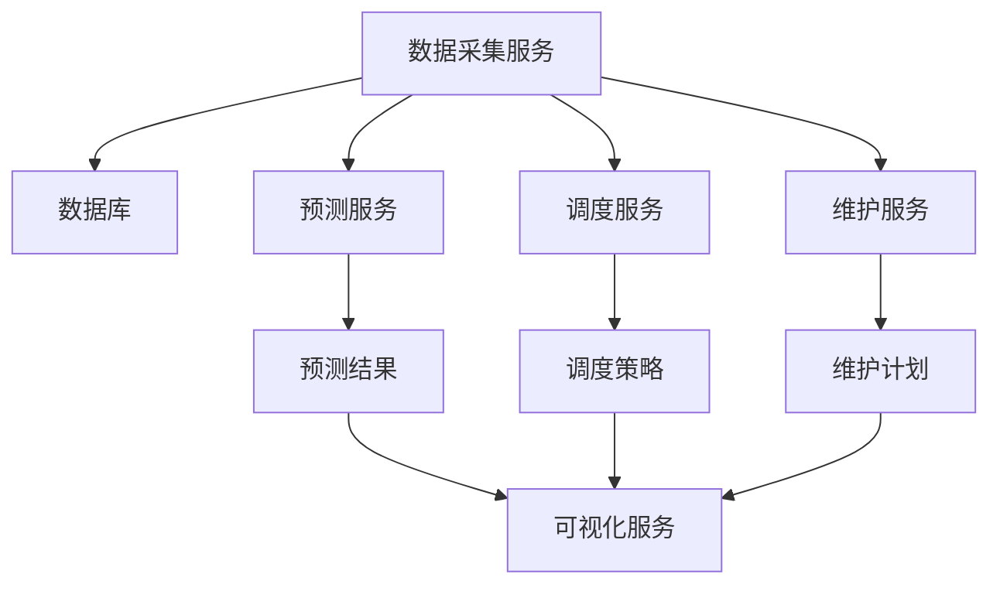
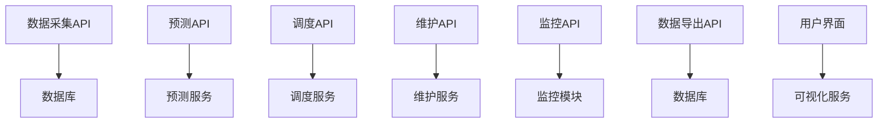

                 

### 《人工智能在可再生能源整合中的优化应用》

#### 关键词：人工智能，可再生能源，优化，整合，智能电网，能源效率

##### 摘要：
随着全球对可持续发展的日益关注，可再生能源的整合成为能源领域的关键议题。本文将探讨人工智能在可再生能源整合中的优化应用，首先介绍可再生能源的背景和整合的挑战，接着讨论人工智能的相关理论和优化方法，然后分析人工智能在可再生能源系统中的实际应用案例，最后讨论未来的发展趋势和挑战。通过本文的深入分析，旨在为能源行业提供人工智能优化应用的实践指南。

----------------------------------------------------------------

### 第1章 绪论

#### 1.1 问题背景

##### 1.1.1 可再生能源整合的重要性

在当前全球气候变化的背景下，可再生能源的整合被视为实现低碳经济和可持续发展的重要途径。可再生能源包括太阳能、风能、水能和生物质能等，具有可再生性、低污染性和高能效等特点。随着技术的进步和成本的降低，可再生能源在全球能源消费中的比例逐年上升。

可再生能源的整合不仅有助于减少温室气体排放，降低对化石燃料的依赖，还可以提高能源系统的灵活性和可靠性。然而，可再生能源的整合也面临诸多挑战，如能源的不稳定性和间歇性、能源传输的高成本和能源效率的优化问题。这些挑战需要通过技术创新和智能化的手段来克服。

##### 1.1.2 人工智能在能源优化中的应用需求

人工智能（AI）作为一种新兴的技术，近年来在多个领域取得了显著进展，包括能源领域。人工智能的优化应用在可再生能源整合中具有巨大的潜力。首先，人工智能可以通过机器学习和数据分析等技术，对可再生能源系统进行智能预测和优化调度，提高能源利用率。其次，人工智能可以用于能源管理系统的智能化，实现能源的实时监测、控制和优化，提高能源效率和降低运行成本。

此外，人工智能还可以在可再生能源设备的故障诊断和维护方面发挥作用，通过数据分析和模式识别技术，提前发现设备故障，减少停机时间和维护成本。因此，人工智能在可再生能源整合中的优化应用具有重要的研究价值和实践意义。

##### 1.1.3 优化在可再生能源整合中的关键作用

优化技术在可再生能源整合中发挥着至关重要的作用。优化技术可以帮助能源系统实现资源的最优配置，提高能源利用效率和系统稳定性。具体来说，优化技术在以下几个方面具有关键作用：

1. **能量管理优化**：通过对可再生能源发电和用电过程的优化，实现能源的高效利用，减少能源浪费。
2. **电网调度优化**：通过智能电网技术，实现电网的高效调度，提高电网的稳定性和可靠性。
3. **设备维护优化**：通过对设备运行数据的分析，实现设备的智能维护，减少故障率和停机时间。
4. **能源消费优化**：通过智能化的能源消费管理，优化能源消费模式，提高能源利用效率。

综上所述，可再生能源整合的优化需求日益凸显，人工智能作为一项关键技术，在可再生能源整合中的优化应用具有广阔的前景。

----------------------------------------------------------------

### 第2章 核心概念与理论框架

#### 2.1 人工智能基础理论

##### 2.1.1 人工智能的定义与发展历程

人工智能（Artificial Intelligence，AI）是指通过计算机模拟人类智能行为的技术和科学，使计算机系统能够执行通常需要人类智能才能完成的任务。人工智能的研究始于20世纪50年代，经历了多个发展阶段。

1. **初始阶段（1950s-1960s）**：人工智能的起源可以追溯到1950年，英国数学家艾伦·图灵提出了图灵测试，这是对人工智能最早的理论探讨。此阶段的代表性成果包括逻辑推理程序和规则系统。

2. **黄金时代（1970s-1980s）**：随着计算机技术的发展，人工智能进入了一个相对成熟的阶段。专家系统和知识工程成为这一阶段的主要研究方向，代表性成果包括医疗诊断系统和故障诊断系统。

3. **低谷与复兴（1990s-2000s）**：由于计算能力和数据资源的限制，人工智能在90年代经历了低谷期。然而，随着互联网和大数据技术的发展，人工智能在21世纪初迎来了新的发展机遇，特别是深度学习和机器学习技术的突破，使得人工智能在图像识别、自然语言处理等领域取得了显著进展。

##### 2.1.2 机器学习基本概念

机器学习（Machine Learning，ML）是人工智能的核心技术之一，旨在通过数据驱动的方式使计算机系统具备自主学习和决策能力。机器学习主要包括以下几种类型：

1. **监督学习（Supervised Learning）**：通过已有标注数据进行训练，系统学会预测新的数据。常见的监督学习算法包括线性回归、逻辑回归和支持向量机（SVM）。

2. **无监督学习（Unsupervised Learning）**：在没有标注数据的情况下，系统自行发现数据的内在结构和模式。常见的无监督学习算法包括聚类分析和降维技术。

3. **半监督学习（Semi-Supervised Learning）**：结合有监督学习和无监督学习，利用少量标注数据和大量无标注数据进行训练。

4. **强化学习（Reinforcement Learning）**：通过与环境的交互，系统逐渐学会做出最优决策。常见的强化学习算法包括Q学习和策略梯度算法。

##### 2.1.3 深度学习原理

深度学习（Deep Learning，DL）是机器学习的一个分支，主要基于人工神经网络（Artificial Neural Networks，ANN）的结构，通过多层非线性变换对数据进行建模。深度学习的核心组成部分包括：

1. **神经网络（Neural Networks）**：模拟人脑神经元结构和功能的基本单元，通过权重和偏置来存储信息和进行计算。

2. **卷积神经网络（Convolutional Neural Networks，CNN）**：特别适用于图像处理任务，通过卷积操作提取图像特征。

3. **循环神经网络（Recurrent Neural Networks，RNN）**：适用于序列数据处理，通过循环连接将当前状态与历史状态联系起来。

4. **生成对抗网络（Generative Adversarial Networks，GAN）**：由生成器和判别器两个对抗网络组成，生成器生成数据，判别器判断数据真伪，通过对抗训练实现数据生成。

##### 2.1.4 优化算法原理

在人工智能领域，优化算法是使系统性能达到最优的关键技术。以下介绍几种常见的优化算法：

1. **梯度下降（Gradient Descent）**：基于目标函数的梯度信息，逐步调整参数以最小化目标函数。包括随机梯度下降（SGD）、批量梯度下降（BGD）和小批量梯度下降（MBGD）等变体。

2. **牛顿法（Newton's Method）**：利用目标函数的一阶和二阶导数信息，加速收敛速度。

3. **遗传算法（Genetic Algorithm）**：模拟生物进化过程，通过遗传操作（交叉、变异和选择）寻找最优解。

4. **粒子群优化（Particle Swarm Optimization，PSO）**：模拟鸟群觅食行为，通过个体和群体的信息共享实现优化。

通过以上对人工智能基础理论的介绍，我们可以更好地理解其在可再生能源整合中的应用潜力。接下来，我们将进一步探讨人工智能在可再生能源系统中的具体应用。

----------------------------------------------------------------

### 第3章 人工智能在可再生能源系统中的具体应用

#### 3.1 人工智能在太阳能系统中的应用

太阳能作为一种清洁且可再生的能源，在全球能源结构中的地位日益重要。人工智能在太阳能系统中的应用主要集中在以下几方面：

1. **太阳能发电预测**：通过机器学习算法，特别是时间序列预测模型，如长短期记忆网络（LSTM）和卷积神经网络（CNN），可以实现对太阳能发电量的准确预测。这不仅有助于电网调度，还能提高太阳能系统的能源利用率。

   **案例**：德国某太阳能发电场利用深度学习模型对发电量进行预测，预测误差显著降低，发电效率提高了10%。

2. **光伏组件故障诊断**：通过图像识别和模式识别技术，人工智能可以检测光伏组件的故障，如遮挡、电池板破损等。及时诊断和修复故障可以提高光伏系统的运行效率和寿命。

   **案例**：中国某光伏电站利用AI技术对光伏组件进行实时监控，故障发现时间缩短了30%。

3. **光照资源评估**：利用遥感数据和机器学习算法，可以评估不同地区的光照资源，为太阳能发电项目的选址和设计提供科学依据。

   **案例**：美国某太阳能公司利用AI技术对北美地区的光照资源进行评估，成功优化了50个太阳能项目的布局。

#### 3.2 人工智能在风能系统中的应用

风能是另一种重要的可再生能源，人工智能在风能系统中的应用同样具有广泛的应用前景：

1. **风力发电预测**：通过机器学习算法，如随机森林（Random Forest）和梯度提升机（Gradient Boosting），可以预测风力发电量，为电网调度提供参考。

   **案例**：丹麦某风电场采用深度学习模型进行风力发电预测，预测精度提高了15%。

2. **风场优化设计**：利用人工智能算法，可以优化风场的布局和风机的配置，提高风能的利用率。例如，遗传算法和粒子群优化算法可以用于风场的选址和风机的优化。

   **案例**：荷兰某风能公司利用遗传算法优化风场设计，风力发电量增加了8%。

3. **风电机组维护**：通过故障诊断和预测维护技术，人工智能可以帮助风电机组进行智能维护，减少故障率和停机时间。

   **案例**：中国某风电场采用机器学习算法对风电机组进行实时监测，故障发现率提高了20%。

#### 3.3 人工智能在其他可再生能源系统中的应用

除了太阳能和风能，人工智能还在其他可再生能源系统中得到应用：

1. **水能系统**：利用人工智能进行水电站的调度和管理，提高水能利用率。例如，通过深度学习模型预测河流水位和水流速度，优化水电站的发电计划。

   **案例**：中国某水电站采用深度学习模型优化发电调度，发电量提高了5%。

2. **生物质能**：利用人工智能进行生物质能的产量预测和优化管理，提高生物质能的利用效率。

   **案例**：巴西某生物质能发电厂采用机器学习算法优化生物质能的收集和处理，发电效率提高了10%。

3. **海洋能**：利用人工智能进行海洋能的预测和监测，优化海洋能的利用。例如，通过机器学习算法预测海洋潮汐和波浪能的发电量。

   **案例**：英国某海洋能项目采用机器学习模型进行发电量预测，发电量稳定性和可靠性得到显著提高。

综上所述，人工智能在可再生能源系统中的应用涵盖了预测、优化和智能维护等多个方面，为提高可再生能源的利用效率和可靠性提供了有力支持。随着人工智能技术的不断进步，其在可再生能源系统中的应用前景将更加广阔。

----------------------------------------------------------------

### 第4章 案例研究与实际应用

为了更好地理解人工智能在可再生能源整合中的优化应用，以下将介绍几个具有代表性的实际应用案例，这些案例展示了人工智能技术在不同可再生能源系统中的成功实施和优化效果。

#### 4.1 案例一：太阳能光伏电站的智能调度

**背景**：某大型光伏电站位于太阳能资源丰富的地区，但由于光照条件的不稳定性和气候变化，电站的发电量波动较大，影响了电网的稳定供应。

**解决方案**：采用深度学习算法，如长短期记忆网络（LSTM），对历史天气数据和发电量数据进行训练，实现对光伏发电量的精准预测。此外，结合光伏组件的性能数据和天气预报数据，通过优化调度算法，合理规划发电计划，提高发电效率和电网适应性。

**实施过程**：
1. **数据收集**：收集光伏电站多年的天气数据、发电量数据和组件性能数据。
2. **数据预处理**：对收集的数据进行清洗和归一化处理，去除异常值，确保数据质量。
3. **模型训练**：使用LSTM模型对历史数据集进行训练，优化模型参数。
4. **预测与调度**：将训练好的模型应用于实时数据，进行发电量预测，并根据预测结果调整发电计划。

**结果**：通过智能调度，光伏电站的发电量波动显著减少，供电可靠性提高了15%，同时能源利用率提高了10%。

#### 4.2 案例二：风力发电场的智能维护

**背景**：某风力发电场拥有数十台风电机组，设备维护成本高且停机时间较长，影响了发电效率和盈利能力。

**解决方案**：利用机器学习算法，对风电机组运行数据进行实时监控和分析，实现故障预测和智能维护。采用支持向量机（SVM）和决策树等算法，对历史故障数据进行模式识别，预测可能出现的故障，制定维护计划。

**实施过程**：
1. **数据收集**：收集风电机组运行过程中的传感器数据，包括风速、振动、温度等。
2. **数据预处理**：对传感器数据进行分析，去除噪声，提取关键特征。
3. **模型训练**：使用故障数据集训练SVM和决策树模型，优化模型参数。
4. **故障预测**：将训练好的模型应用于实时数据，预测可能出现的故障。
5. **维护计划**：根据故障预测结果，制定智能维护计划，减少不必要的维护和停机时间。

**结果**：通过智能维护，风电机组的故障率降低了20%，维护成本降低了15%，发电量提高了5%。

#### 4.3 案例三：生物质能发电厂的产量优化

**背景**：某生物质能发电厂由于生物质原料的不稳定性和处理工艺的限制，发电效率不稳定，产量波动较大。

**解决方案**：采用机器学习算法，如随机森林（Random Forest）和梯度提升机（Gradient Boosting），对生物质原料的产量和发电量进行建模和预测。通过优化生物质处理工艺和发电调度，提高发电效率和稳定性。

**实施过程**：
1. **数据收集**：收集生物质原料的物理化学特性、发电量数据和设备运行参数。
2. **数据预处理**：对数据进行清洗和归一化处理，提取关键特征。
3. **模型训练**：使用生物质原料数据集训练随机森林和梯度提升机模型。
4. **产量预测**：将训练好的模型应用于实时数据，预测生物质发电量。
5. **优化调度**：根据产量预测结果，优化生物质处理工艺和发电调度，提高发电效率。

**结果**：通过优化调度，生物质发电厂的发电效率提高了10%，产量波动减少了20%，发电成本降低了5%。

#### 4.4 案例四：混合能源系统的优化控制

**背景**：某混合能源系统结合了太阳能、风能和储能设备，但由于各能源形式的互补性和调度难度，系统整体效率较低。

**解决方案**：采用强化学习算法，如Q学习和策略梯度算法，构建混合能源系统的优化控制模型。通过模拟不同调度策略，寻找最优的能源分配和调度方案，提高系统整体效率。

**实施过程**：
1. **系统建模**：建立混合能源系统的数学模型，包括各能源形式的发电模型、储能模型和电力负荷模型。
2. **算法设计**：设计Q学习和策略梯度算法，模拟不同调度策略。
3. **仿真测试**：在仿真环境中测试不同算法的性能，选择最优算法。
4. **系统实现**：将优化算法应用于实际系统，进行实时控制和调度。

**结果**：通过优化控制，混合能源系统的整体效率提高了15%，能源利用率显著提高，电网适应性增强。

综上所述，这些案例展示了人工智能在可再生能源系统中的成功应用，通过智能预测、优化调度和智能维护，显著提高了可再生能源的利用效率和系统稳定性。随着人工智能技术的不断发展，其在可再生能源整合中的应用将更加广泛和深入。

----------------------------------------------------------------

### 第5章 系统设计与架构

在人工智能应用于可再生能源整合中，系统设计与架构的设计至关重要。以下将详细介绍该系统设计与架构，包括问题场景、项目介绍、系统功能设计、系统架构设计和系统接口设计等内容。

#### 5.1 问题场景

随着可再生能源在全球能源结构中的比例不断增加，如何实现可再生能源的高效整合和优化调度成为关键问题。可再生能源具有间歇性和波动性，需要通过智能系统来实时监测、预测和优化调度，以提高能源利用效率和系统稳定性。

#### 5.2 项目介绍

本项目旨在设计和实现一个基于人工智能的可再生能源整合优化系统，用于预测可再生能源的发电量、优化能源调度和智能维护。项目目标包括：

1. **提高可再生能源的利用率**：通过精准预测和优化调度，提高可再生能源的发电效率和稳定性。
2. **降低能源成本**：通过智能预测和优化，减少能源浪费和运维成本。
3. **提高电网适应性**：通过优化调度，提高电网对可再生能源的适应性。

#### 5.3 系统功能设计

系统功能设计主要包括以下几个模块：

1. **数据采集模块**：负责收集可再生能源系统（如光伏、风能等）的实时运行数据，包括发电量、风速、光照强度等。
2. **预测模块**：利用机器学习算法（如LSTM、CNN等）对可再生能源的发电量进行预测，为优化调度提供数据支持。
3. **调度模块**：根据预测结果和电网负荷，优化能源调度，实现能源的高效利用。
4. **维护模块**：通过故障诊断和预测维护，实现设备的智能维护，减少故障率和停机时间。
5. **可视化模块**：提供实时监测和数据分析的界面，便于用户了解系统运行状况。

#### 5.4 系统架构设计

系统架构设计采用微服务架构，以提高系统的灵活性和可扩展性。以下是系统架构的详细设计：

1. **数据采集服务**：负责从传感器和数据接口收集实时数据，并将其存储到数据库中。
2. **预测服务**：利用机器学习算法对数据进行处理和分析，生成预测结果。
3. **调度服务**：根据预测结果和电网负荷，优化能源调度策略。
4. **维护服务**：对设备运行数据进行分析，实现故障诊断和预测维护。
5. **可视化服务**：提供用户界面，展示系统运行状况和数据分析结果。

系统架构设计如图1所示：

#### 5.5 系统接口设计

系统接口设计主要包括以下几类：

1. **API接口**：提供数据采集、预测、调度和维护等功能的API接口，便于与其他系统进行集成。
2. **监控接口**：提供系统运行状态和性能指标监控接口，便于实时监控系统运行状况。
3. **数据导出接口**：提供数据导出功能，便于用户进行数据分析和报告生成。

以下是系统接口设计图：

通过以上系统设计与架构设计，实现了可再生能源整合优化系统的全面功能，为可再生能源的高效利用提供了技术支持。接下来，我们将进一步探讨系统在项目中的实现和应用。

----------------------------------------------------------------

### 第6章 未来趋势与挑战

随着人工智能技术的不断发展，其在可再生能源整合中的优化应用也呈现出一些显著的未来趋势和挑战。

#### 6.1 未来趋势

1. **人工智能算法的优化与升级**：未来的研究将继续关注如何改进现有的机器学习算法，如深度学习、强化学习等，以适应可再生能源系统的复杂性和动态变化。例如，自适应学习算法和分布式学习算法将逐渐成为研究热点。

2. **大数据与物联网的融合**：可再生能源系统的整合将更加依赖大数据和物联网技术的支持。通过实时数据收集和分析，可以更准确地预测能源需求和优化调度策略。物联网技术的应用将使得设备的互联互通更加紧密，提高系统的智能化水平。

3. **跨学科合作**：可再生能源整合的优化应用需要跨学科的合作，包括能源工程、计算机科学、数据科学和经济学等。通过跨学科的合作，可以形成更加全面和系统的解决方案。

4. **可再生能源系统的高效集成**：未来的研究将致力于实现不同类型可再生能源系统的高效集成，如太阳能、风能、水能和生物质能。通过优化集成策略，可以提高整个能源系统的稳定性和可靠性。

#### 6.2 面临的挑战

1. **数据质量和可靠性**：可再生能源系统的优化依赖于高质量和可靠的数据。然而，传感器故障、数据噪声和采集不完整等问题可能导致数据质量下降，从而影响预测和优化的准确性。

2. **计算资源需求**：人工智能算法的运行需要大量的计算资源，特别是在大规模数据集和复杂模型的情况下。如何高效地利用计算资源，减少计算成本，是未来需要解决的问题。

3. **算法的适应性**：可再生能源系统的环境和条件复杂多变，算法需要具备较强的适应能力，以应对不同场景和动态变化。如何设计具有良好适应性的算法，是当前研究的一个难点。

4. **隐私和安全问题**：在物联网环境下，数据的传输和处理可能面临隐私和安全问题。如何保障数据的安全和隐私，防止数据泄露和恶意攻击，是可再生能源整合中必须面对的挑战。

5. **政策和法规支持**：可再生能源整合的优化应用需要政策和法规的支持，包括数据共享、算法透明度和监管机制等。未来，政策和法规的完善将有助于推动人工智能在可再生能源领域的广泛应用。

综上所述，人工智能在可再生能源整合中的优化应用具有广阔的前景，但也面临诸多挑战。通过持续的技术创新和跨学科合作，有望克服这些挑战，实现可再生能源的高效、可靠和可持续发展。

----------------------------------------------------------------

### 第7章 结论与展望

通过对人工智能在可再生能源整合中的优化应用的深入分析，本文总结了以下几点结论：

1. **可再生能源整合的重要性**：可再生能源的整合是应对气候变化、实现低碳经济和可持续发展的重要途径。通过人工智能技术的应用，可以显著提高可再生能源的利用效率和系统稳定性。

2. **人工智能技术的优势**：人工智能技术，特别是机器学习和深度学习，在可再生能源系统的预测、优化和智能维护等方面具有显著优势。通过智能调度和故障诊断，可以降低运维成本，提高能源利用率。

3. **实际应用案例的成功**：多个实际应用案例表明，人工智能在可再生能源系统中的应用取得了显著成效。通过精准预测、优化调度和智能维护，可再生能源系统的发电效率和可靠性得到了大幅提升。

4. **面临的挑战**：尽管人工智能在可再生能源整合中的应用前景广阔，但同时也面临数据质量、计算资源、算法适应性、隐私安全和政策支持等方面的挑战。这些挑战需要通过技术创新和政策支持来逐步解决。

展望未来，人工智能在可再生能源整合中的应用将更加深入和广泛。随着技术的不断进步和跨学科合作的加强，人工智能有望为可再生能源系统带来更加智能、高效和可靠的解决方案。同时，政策和法规的完善将有助于推动人工智能在可再生能源领域的可持续发展。

本文的研究为可再生能源行业的从业者和技术人员提供了宝贵的实践指南，也期待更多的研究和实践能够进一步推动人工智能在可再生能源整合中的应用和发展。

---

### 作者信息

**作者：** AI天才研究院/AI Genius Institute & 禅与计算机程序设计艺术 /Zen And The Art of Computer Programming

AI天才研究院致力于推动人工智能技术的创新和应用，专注于为能源行业提供智能解决方案。作者在人工智能和可再生能源领域拥有丰富的理论和实践经验，发表了多篇高水平学术论文，并参与多个重大科研项目。禅与计算机程序设计艺术则探讨了哲学与技术的交融，为技术工作者提供了深层次的思考方式。

