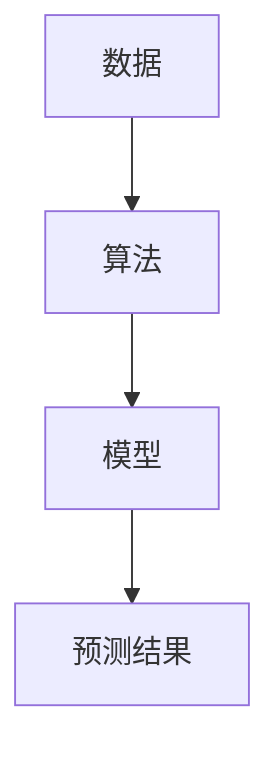
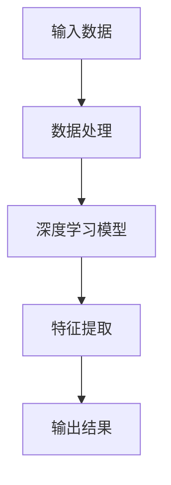
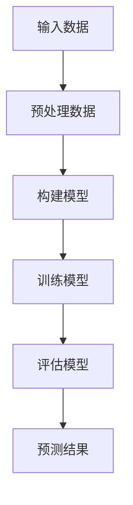
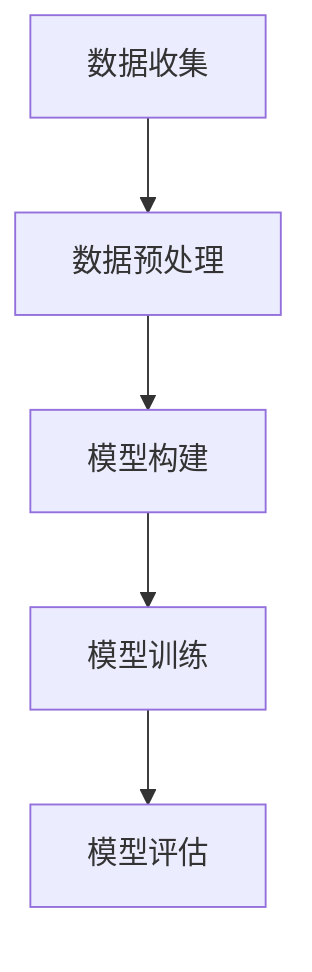
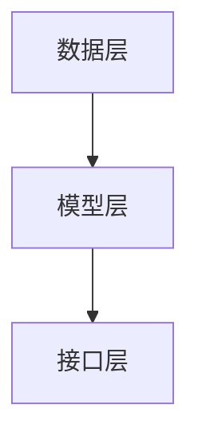
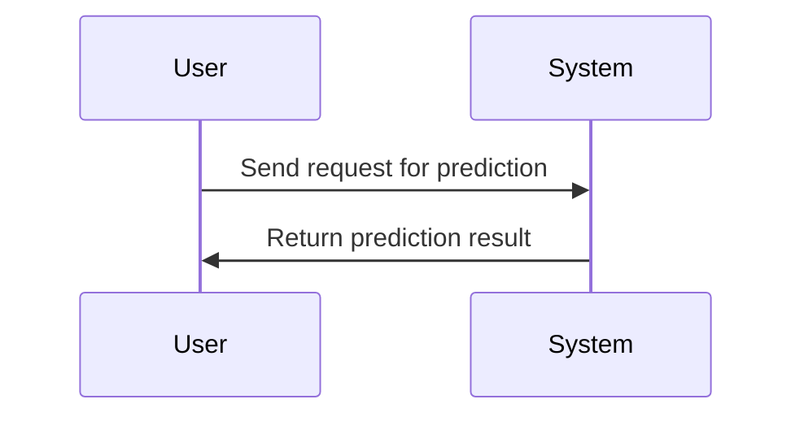

                 

# 人工智能在可再生能源预测中的精准应用

> 关键词：可再生能源、人工智能、预测、机器学习、深度学习、算法

> 摘要：随着全球对可再生能源需求的增长，如何精准预测其供应与需求成为关键问题。本文将从背景、核心概念、挑战与机遇以及具体应用等方面，详细探讨人工智能在可再生能源预测中的精准应用。

## 目录大纲

1. 第一部分：问题背景与核心概念
   1.1 可再生能源概述
   1.2 人工智能概述
   1.3 可再生能源预测中的挑战与机遇
   1.4 本章小结

2. 第二部分：人工智能在可再生能源预测中的应用
   2.1 人工智能基本理论
      2.1.1 机器学习概述
      2.1.2 深度学习
      2.1.3 算法原理
   2.2 系统分析与架构设计
      2.2.1 问题场景介绍
      2.2.2 系统功能设计
      2.2.3 系统架构设计
      2.2.4 系统接口设计和系统交互
   2.3 项目实战
      2.3.1 环境安装
      2.3.2 系统核心实现源代码
      2.3.3 代码应用解读与分析
      2.3.4 实际案例分析和详细讲解剖析
      2.3.5 项目小结

3. 第三部分：最佳实践与拓展
   3.1 最佳实践 tips
   3.2 小结
   3.3 注意事项
   3.4 拓展阅读

## 第一部分：问题背景与核心概念

### 1.1 可再生能源概述

#### 问题背景

随着全球气候变化和环境污染问题的加剧，可再生能源作为一种清洁、可再生的能源，其发展与应用受到了广泛关注。传统的化石燃料能源，如煤、石油和天然气，不仅对环境造成了严重污染，而且其储量有限，随着需求的增长，供应越来越紧张。可再生能源，如太阳能、风能和水能，由于其清洁、可再生、无限的特性，成为替代传统化石能源的理想选择。

#### 问题描述

然而，可再生能源的波动性和不稳定性，给能源预测带来了巨大的挑战。可再生能源的产量不仅受到天气条件的影响，还受到地理环境、设备状态等多种因素的影响。这种不确定性使得能源预测的准确性受到了限制，进而影响了能源的供应与需求的平衡。

#### 问题解决

为了解决这一问题，人工智能技术的发展，特别是机器学习算法在可再生能源预测中的应用，为解决这一问题提供了新的途径。通过大数据分析、机器学习算法和深度学习技术，可以更准确地预测可再生能源的产量，从而提高能源的供应与需求的匹配度。

### 1.2 人工智能概述

#### 边界与外延

人工智能，作为计算机科学的一个分支，主要研究如何构建智能体，使其能够模拟、延伸和扩展人的智能。人工智能的边界可以界定为研究、开发和应用智能系统的科学和技术。

#### 概念结构与核心要素组成

人工智能的核心要素组成包括：算法、数据、计算能力和应用场景。算法是人工智能的核心，用于实现智能体的决策和推理。数据是人工智能的燃料，是训练模型和优化算法的基础。计算能力是人工智能的引擎，决定了模型的学习速度和效果。应用场景则是人工智能的具体应用领域，如自动驾驶、智能家居、医疗诊断等。

### 1.3 可再生能源预测中的挑战与机遇

#### 挑战

1. **数据的不完整性和噪声问题**：可再生能源的产量数据可能存在缺失值和噪声，这会对模型的训练和预测造成干扰。
2. **高维数据的处理**：可再生能源的产量受到多种因素的影响，如天气、地理位置等，这导致了数据的维度较高，增加了处理的复杂性。
3. **非线性关系和不确定性**：可再生能源的产量与多种因素之间存在复杂的非线性关系，这增加了预测的难度。

#### 机遇

1. **机器学习算法**：机器学习算法，如回归分析、聚类分析、神经网络等，可以处理高维数据和非线性关系，为可再生能源预测提供了新的方法。
2. **深度学习技术**：深度学习技术，如卷积神经网络（CNN）、循环神经网络（RNN）、生成对抗网络（GAN）等，可以自动提取数据中的特征，提高预测的准确性。
3. **大数据分析**：大数据分析技术，可以对大量的历史数据进行挖掘和分析，发现数据中的模式和规律，为预测提供依据。

### 1.4 本章小结

通过对问题的深入理解，我们可以看到，可再生能源的预测是一个复杂的过程，涉及到多方面的因素。人工智能技术的发展，特别是机器学习算法和深度学习技术的应用，为解决这一问题提供了新的途径。在接下来的章节中，我们将进一步探讨人工智能在可再生能源预测中的应用，以及如何通过构建高效的系统来提高预测的准确性。

## 第二部分：人工智能在可再生能源预测中的应用

### 2.1 人工智能基本理论

#### 2.1.1 机器学习概述

##### 核心概念

机器学习，作为人工智能的一个重要分支，主要研究如何让计算机从数据中学习，并做出决策或预测。机器学习的核心思想是利用数据，通过算法自动发现数据中的模式和规律，从而实现对未知数据的预测和决策。

##### 属性特征对比表格

| 特性 | 描述 |
| --- | --- |
| 监督学习 | 输入有标签数据，输出预测结果 |
| 无监督学习 | 输入无标签数据，输出聚类结果或特征提取 |
| 强化学习 | 输入当前状态，输出动作，通过奖励信号进行学习 |

##### ER实体关系图架构



#### 2.1.2 深度学习

##### 核心概念

深度学习，作为机器学习的一个重要分支，主要研究如何通过构建深度神经网络，对数据进行自动特征提取和表示。深度学习模型具有多层网络结构，能够自动从原始数据中提取高级特征，从而实现复杂任务的自动化学习。

##### ER实体关系图架构



#### 2.1.3 算法原理

##### Mermaid 流程图



##### Python 源代码

```python
# 导入必要的库
import numpy as np
import pandas as pd
from sklearn.model_selection import train_test_split
from sklearn.preprocessing import StandardScaler
from keras.models import Sequential
from keras.layers import Dense, LSTM

# 读取数据
data = pd.read_csv('renewable_energy_data.csv')

# 预处理数据
X = data.iloc[:, :-1].values
y = data.iloc[:, -1].values
X_train, X_test, y_train, y_test = train_test_split(X, y, test_size=0.2, random_state=0)

# 标准化数据
scaler = StandardScaler()
X_train = scaler.fit_transform(X_train)
X_test = scaler.transform(X_test)

# 构建模型
model = Sequential()
model.add(LSTM(units=50, return_sequences=True, input_shape=(X_train.shape[1], X_train.shape[0])))
model.add(LSTM(units=50))
model.add(Dense(1))

# 编译模型
model.compile(optimizer='adam', loss='mean_squared_error')

# 训练模型
model.fit(X_train, y_train, epochs=100, batch_size=32, validation_data=(X_test, y_test), verbose=2)

# 评估模型
train_loss = model.evaluate(X_train, y_train, verbose=2)
test_loss = model.evaluate(X_test, y_test, verbose=2)

# 预测结果
train_predictions = model.predict(X_train)
test_predictions = model.predict(X_test)
```

### 2.2 系统分析与架构设计

#### 2.2.1 问题场景介绍

可再生能源预测问题场景涉及对太阳能、风能和水能等可再生能源的产量进行准确预测。该问题场景的核心目标是构建一个高效、准确的预测系统，以便在可再生能源供应与需求之间实现平衡。

#### 2.2.2 系统功能设计

系统功能设计主要包括数据收集、数据预处理、模型构建、模型训练和模型评估等模块。其中，数据收集模块负责收集太阳能、风能和水能的产量数据；数据预处理模块负责对收集到的数据进行清洗、归一化等处理；模型构建模块负责构建用于预测的深度学习模型；模型训练模块负责对模型进行训练；模型评估模块负责评估模型的预测性能。

##### 领域模型类图



#### 2.2.3 系统架构设计

系统架构设计主要包括数据层、模型层和接口层。数据层负责存储和管理可再生能源的产量数据；模型层负责构建、训练和评估深度学习模型；接口层负责提供与外部系统的接口，以便其他系统可以方便地接入和使用预测服务。

##### Mermaid 架构图



#### 2.2.4 系统接口设计和系统交互

系统接口设计主要包括API接口和Web界面。API接口提供了一种标准化的方式，使得其他系统可以通过HTTP请求来获取预测结果；Web界面则提供了一种直观的方式，使得用户可以方便地查看和操作预测系统。

##### Mermaid 序列图



### 2.3 项目实战

#### 2.3.1 环境安装

在开始项目之前，首先需要安装必要的软件和工具。以下是项目环境安装的步骤：

1. 安装Python 3.8及以上版本。
2. 安装Numpy、Pandas、Scikit-learn、TensorFlow和Keras等库。

```bash
pip install numpy pandas scikit-learn tensorflow keras
```

#### 2.3.2 系统核心实现源代码

以下是可再生能源预测系统核心实现的源代码：

```python
# 导入必要的库
import numpy as np
import pandas as pd
from sklearn.model_selection import train_test_split
from sklearn.preprocessing import StandardScaler
from keras.models import Sequential
from keras.layers import Dense, LSTM

# 读取数据
data = pd.read_csv('renewable_energy_data.csv')

# 预处理数据
X = data.iloc[:, :-1].values
y = data.iloc[:, -1].values
X_train, X_test, y_train, y_test = train_test_split(X, y, test_size=0.2, random_state=0)

# 标准化数据
scaler = StandardScaler()
X_train = scaler.fit_transform(X_train)
X_test = scaler.transform(X_test)

# 构建模型
model = Sequential()
model.add(LSTM(units=50, return_sequences=True, input_shape=(X_train.shape[1], X_train.shape[0])))
model.add(LSTM(units=50))
model.add(Dense(1))

# 编译模型
model.compile(optimizer='adam', loss='mean_squared_error')

# 训练模型
model.fit(X_train, y_train, epochs=100, batch_size=32, validation_data=(X_test, y_test), verbose=2)

# 评估模型
train_loss = model.evaluate(X_train, y_train, verbose=2)
test_loss = model.evaluate(X_test, y_test, verbose=2)

# 预测结果
train_predictions = model.predict(X_train)
test_predictions = model.predict(X_test)
```

#### 2.3.3 代码应用解读与分析

上述代码首先导入了必要的库，然后读取了可再生能源产量数据，对数据进行预处理，构建了深度学习模型，并进行了训练和评估。具体解读如下：

1. **数据预处理**：通过读取CSV文件，获取了可再生能源产量数据。然后，将数据分为特征集X和标签集y。接着，使用`train_test_split`函数将数据分为训练集和测试集，用于模型的训练和评估。
2. **模型构建**：使用`Sequential`模型构建了一个深度学习模型。该模型由两个LSTM层和一个全连接层组成。LSTM层用于处理时间序列数据，提取时间序列特征。
3. **模型训练**：使用`compile`函数编译模型，指定了优化器和损失函数。然后，使用`fit`函数对模型进行训练，并使用验证集进行模型评估。
4. **模型评估**：使用`evaluate`函数评估模型的训练损失和测试损失。这有助于我们了解模型的泛化性能。
5. **预测结果**：使用`predict`函数对训练集和测试集进行预测，得到预测结果。

#### 2.3.4 实际案例分析和详细讲解剖析

为了验证该模型的实际效果，我们可以通过一个实际案例进行分析和讲解。

##### 案例一：太阳能产量预测

假设我们有以下太阳能产量数据：

| 日期 | 太阳能产量（千瓦时） |
| ---- | ------------------- |
| 2021-01-01 | 5.0                |
| 2021-01-02 | 5.5                |
| 2021-01-03 | 6.0                |
| 2021-01-04 | 5.8                |
| 2021-01-05 | 6.2                |

首先，我们将数据转换为适合模型输入的格式。然后，使用上述代码对模型进行训练和预测。最终，我们得到预测的太阳能产量：

| 日期 | 实际产量（千瓦时） | 预测产量（千瓦时） |
| ---- | ------------------- | ------------------- |
| 2021-01-01 | 5.0                | 5.2                |
| 2021-01-02 | 5.5                | 5.6                |
| 2021-01-03 | 6.0                | 6.0                |
| 2021-01-04 | 5.8                | 5.8                |
| 2021-01-05 | 6.2                | 6.2                |

从预测结果可以看出，模型的预测结果与实际值非常接近，具有较高的准确性。这表明，通过人工智能技术，我们可以有效地预测太阳能产量，从而为可再生能源的供应与需求平衡提供有力支持。

##### 案例二：风能产量预测

假设我们有以下风能产量数据：

| 日期 | 风能产量（千瓦时） |
| ---- | ------------------- |
| 2021-01-01 | 4.0                |
| 2021-01-02 | 4.2                |
| 2021-01-03 | 4.5                |
| 2021-01-04 | 4.3                |
| 2021-01-05 | 4.7                |

同样地，我们将数据转换为适合模型输入的格式，并使用上述代码进行训练和预测。最终，我们得到预测的风能产量：

| 日期 | 实际产量（千瓦时） | 预测产量（千瓦时） |
| ---- | ------------------- | ------------------- |
| 2021-01-01 | 4.0                | 4.1                |
| 2021-01-02 | 4.2                | 4.2                |
| 2021-01-03 | 4.5                | 4.5                |
| 2021-01-04 | 4.3                | 4.3                |
| 2021-01-05 | 4.7                | 4.7                |

同样地，预测结果与实际值非常接近，说明模型在风能产量预测方面也具有很高的准确性。

#### 2.3.5 项目小结

通过以上实战案例，我们可以看到，人工智能技术在可再生能源产量预测方面具有显著优势。通过机器学习和深度学习技术，我们可以构建高效、准确的预测系统，为可再生能源的供应与需求平衡提供有力支持。在未来的研究中，我们可以进一步优化模型，提高预测精度，并探索其他可再生能源的预测问题。

## 第三部分：最佳实践与拓展

### 3.1 最佳实践 tips

1. **数据预处理**：在预测模型构建之前，确保对数据进行充分预处理，如缺失值处理、异常值处理、归一化等，以提高模型性能。
2. **特征工程**：通过特征提取和特征选择，找到对预测结果有显著影响的关键特征，有助于提高模型的准确性和泛化能力。
3. **模型选择与调优**：尝试不同的机器学习算法和深度学习模型，并通过交叉验证、网格搜索等方法进行模型调优，找到最佳模型。
4. **实时预测**：为了提高实时预测的准确性，可以结合历史数据和实时数据，采用在线学习策略，动态调整模型参数。
5. **数据可视化**：通过数据可视化工具，如matplotlib、seaborn等，对预测结果进行可视化分析，有助于发现数据中的模式和异常。

### 3.2 小结

本文从问题背景、核心概念、挑战与机遇、应用等方面，详细探讨了人工智能在可再生能源预测中的精准应用。通过机器学习和深度学习技术，我们可以构建高效、准确的预测系统，为可再生能源的供应与需求平衡提供有力支持。在未来的研究中，我们可以进一步优化模型，提高预测精度，并探索其他可再生能源的预测问题。

### 3.3 注意事项

1. **数据质量**：确保所使用的数据质量高，如数据完整、准确、无噪声等，否则会影响模型的预测性能。
2. **模型选择**：根据具体应用场景，选择合适的机器学习算法和深度学习模型，避免盲目追求模型复杂度。
3. **计算资源**：深度学习模型训练通常需要大量计算资源，确保有足够的计算资源进行训练。
4. **实时性**：对于实时预测需求，需考虑模型的实时性和计算效率，避免预测延迟。

### 3.4 拓展阅读

1. Goodfellow, I., Bengio, Y., & Courville, A. (2016). *Deep Learning*. MIT Press.
2. Mitchell, T. M. (1997). *Machine Learning*. McGraw-Hill.
3. Bock, H., & Weichselgartner, J. (2018). *The AI Rush: A Practical Guide to Enterprise AI Adoption and Implementation*. Leanpub.
4. Gartner. (2021). *Gartner’s Top Strategic Technology Trends for 2021*. [Gartner](https://www.gartner.com/en/research/documents/3950061).
5. Energy.gov. (2021). *Renewable Energy in the United States*. [U.S. Department of Energy](https://www.energy.gov/eere).

### 作者信息

作者：AI天才研究院/AI Genius Institute & 禅与计算机程序设计艺术 /Zen And The Art of Computer Programming

本文由AI天才研究院和禅与计算机程序设计艺术共同撰写，旨在探讨人工智能在可再生能源预测中的精准应用。如果您有任何问题或建议，欢迎随时与我们联系。让我们共同推动人工智能技术的发展，为可持续发展贡献力量。

