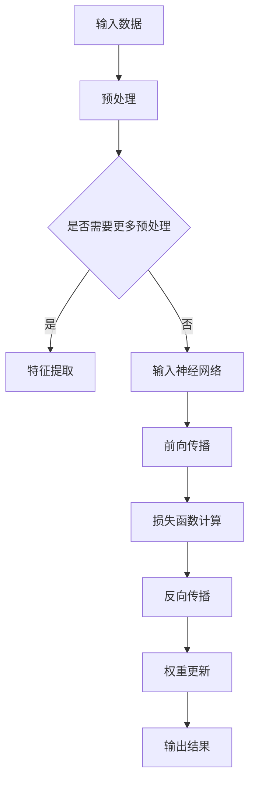

                 

# 第二部分: 深入分析

## 第2章: 人工智能核心概念

### 2.1 人工智能的定义与发展历程

**核心概念**：人工智能（Artificial Intelligence，简称AI）是指通过计算机模拟人类智能行为的技术。

**问题背景**：随着计算机技术的不断发展，人工智能逐渐成为研究热点，被应用于各行各业。

**问题描述**：人工智能技术的发展带来了什么？

**问题解决**：通过研究和应用人工智能技术，可以解决许多现实问题，如语音识别、图像识别、自然语言处理等。

**边界与外延**：人工智能包括机器学习、深度学习、计算机视觉、自然语言处理等多个子领域。

**概念结构与核心要素组成**：

- **机器学习**：通过数据和算法，使计算机能够自动改进和学习。
- **深度学习**：模拟人脑的神经网络结构，通过多层神经网络进行数据处理和分析。
- **计算机视觉**：使计算机能够理解和解释图像和视频。
- **自然语言处理**：使计算机能够理解和处理自然语言。

**ER实体关系图架构**：

```mermaid
erDiagram
  人工智能 ||--|{ 机器学习 }|
  人工智能 ||--|{ 深度学习 }|
  人工智能 ||--|{ 计算机视觉 }|
  人工智能 ||--|{ 自然语言处理 }|
```

### 2.2 人工智能的基本原理

**核心概念**：人工智能的基本原理是模拟人类大脑的工作方式，通过算法和计算来处理信息。

**问题背景**：人类大脑是如何处理信息的？

**问题描述**：如何模拟人类大脑的工作方式？

**问题解决**：通过神经网络、机器学习算法等，模拟人类大脑的结构和功能。

**边界与外延**：人工智能的基本原理包括神经网络的架构、机器学习算法的原理等。

**概念属性特征对比表格**：

| 特征 | 传统计算机 | 人工智能 |
| ---- | ---------- | -------- |
| 信息处理方式 | 硬件指令驱动 | 算法数据驱动 |
| 计算能力 | 固定 | 自适应 |

**算法原理讲解**：

**神经网络**：神经网络是一种通过模拟人脑神经元连接结构的计算模型。它通过多层神经元对输入数据进行处理，从而实现复杂的函数映射。

**算法mermaid流程图**：



**数学模型**：

$$
Y = \sigma(W_1 \cdot X + b_1)
$$

$$
\delta = \frac{\partial L}{\partial W_1}
$$

$$
W_1 = W_1 - \alpha \cdot \delta
$$

**Python源代码**：

```python
import numpy as np

def sigmoid(x):
    return 1 / (1 + np.exp(-x))

def forward_propagation(x, weights, bias):
    z = np.dot(x, weights) + bias
    output = sigmoid(z)
    return output

def backward_propagation(output, y, weights, bias):
    error = y - output
    d_output = error * (output * (1 - output))
    error = d_output.dot(x.T)
    d_weights = error
    d_bias = error
    return d_weights, d_bias

def update_weights(weights, d_weights, learning_rate):
    return weights - learning_rate * d_weights
```

**举例说明**：

假设我们有一个简单的神经网络，输入数据为[1, 0]，期望输出为[1, 0]。通过迭代训练，我们可以使神经网络的输出接近期望输出。

### 2.3 人工智能的技术分类

**核心概念**：人工智能技术可以分为监督学习、无监督学习和强化学习等。

**问题背景**：不同的应用场景需要不同类型的人工智能技术。

**问题描述**：如何根据应用场景选择合适的人工智能技术？

**问题解决**：通过理解不同类型的人工智能技术，可以更好地选择和应用。

**边界与外延**：监督学习、无监督学习和强化学习都有各自的适用场景和应用特点。

**概念属性特征对比表格**：

| 类型 | 监督学习 | 无监督学习 | 强化学习 |
| ---- | -------- | ---------- | -------- |
| 适用场景 | 有标签数据 | 无标签数据 | 与环境互动 |
| 学习目标 | 最小化预测误差 | 发现数据分布 | 最大化奖励 |

**ER实体关系图架构**：

```mermaid
erDiagram
  人工智能 ||--|{ 监督学习 }|
  人工智能 ||--|{ 无监督学习 }|
  人工智能 ||--|{ 强化学习 }|
```

### 2.4 人工智能在农业中的应用

**核心概念**：人工智能在农业中的应用包括精准农业、智能监测和预测、农业供应链管理等。

**问题背景**：农业生产面临资源有限、环境压力增大的问题。

**问题描述**：如何通过人工智能技术优化农业生产？

**问题解决**：通过人工智能技术，可以实现精准农业、智能监测和预测、农业供应链管理等。

**边界与外延**：人工智能在农业中的应用还包括智能灌溉系统、智能温室控制等。

**概念属性特征对比表格**：

| 应用 | 精准农业 | 智能监测与预测 | 农业供应链管理 |
| ---- | -------- | -------------- | -------------- |
| 目标 | 提高产量和质量 | 优化生产过程 | 降低成本和提高效率 |
| 技术基础 | 遥感技术、物联网 | 机器学习、深度学习 | 大数据、云计算 |

**ER实体关系图架构**：

```mermaid
erDiagram
  可持续农业 ||--|{ 精准农业 }|
  可持续农业 ||--|{ 智能监测与预测 }|
  可持续农业 ||--|{ 农业供应链管理 }|
```

### 2.5 人工智能优化应用的挑战与未来

**核心概念**：人工智能优化应用在农业中面临许多挑战，如数据质量、算法适应性等。

**问题背景**：农业生产环境复杂，数据获取和处理存在困难。

**问题描述**：如何解决人工智能优化应用在农业中的挑战？

**问题解决**：通过改进数据质量、提高算法适应性等，可以更好地实现人工智能在农业中的应用。

**边界与外延**：人工智能优化应用的挑战包括技术、数据、政策等方面。

**概念属性特征对比表格**：

| 挑战 | 技术挑战 | 数据挑战 | 政策挑战 |
| ---- | -------- | -------- | -------- |
| 表现 | 算法适应性 | 数据质量 | 法规与政策 |
| 对策 | 技术研发与创新 | 数据清洗与整合 | 政策支持与制定 |

**ER实体关系图架构**：

```mermaid
erDiagram
  人工智能优化应用 ||--|{ 技术挑战 }|
  人工智能优化应用 ||--|{ 数据挑战 }|
  人工智能优化应用 ||--|{ 政策挑战 }|
```

### 2.6 人工智能优化应用的最佳实践

**核心概念**：最佳实践是指在实际应用中，通过总结经验，形成一套行之有效的方法和策略。

**问题背景**：不同地区和农业生产环境存在差异，需要因地制宜地应用人工智能技术。

**问题描述**：如何实施人工智能优化应用的最佳实践？

**问题解决**：通过分析成功案例，总结最佳实践，可以为其他地区和应用提供参考。

**边界与外延**：最佳实践包括技术选型、数据管理、算法优化等方面。

**概念属性特征对比表格**：

| 最佳实践 | 技术选型 | 数据管理 | 算法优化 |
| -------- | -------- | -------- | -------- |
| 目标 | 选择适合的技术 | 保证数据质量 | 提高算法性能 |
| 方法 | 尝试不同技术 | 数据清洗与标准化 | 算法调优与迭代 |

**ER实体关系图架构**：

```mermaid
erDiagram
  人工智能优化应用 ||--|{ 技术选型 }|
  人工智能优化应用 ||--|{ 数据管理 }|
  人工智能优化应用 ||--|{ 算法优化 }|
```

### 2.7 人工智能优化应用的未来趋势

**核心概念**：人工智能优化应用的未来趋势包括技术的发展、应用场景的拓展、政策的影响等。

**问题背景**：随着科技的进步和政策的支持，人工智能在农业中的应用将更加广泛。

**问题描述**：人工智能优化应用的未来趋势将如何发展？

**问题解决**：通过分析技术发展趋势和政策环境，可以预测人工智能优化应用的未来。

**边界与外延**：人工智能优化应用的未来趋势包括技术革新、政策支持、市场机遇等方面。

**概念属性特征对比表格**：

| 趋势 | 技术革新 | 政策支持 | 市场机遇 |
| ---- | -------- | -------- | -------- |
| 预期影响 | 推动技术进步 | 促进应用推广 | 带来商业机会 |

**ER实体关系图架构**：

```mermaid
erDiagram
  人工智能优化应用 ||--|{ 技术革新 }|
  人工智能优化应用 ||--|{ 政策支持 }|
  人工智能优化应用 ||--|{ 市场机遇 }|
```

### 2.8 人工智能优化应用的现实案例

**核心概念**：通过现实案例，可以更好地理解人工智能优化应用在农业中的实际效果。

**问题背景**：许多地区已经开始应用人工智能技术优化农业生产。

**问题描述**：如何通过现实案例展示人工智能优化应用的效果？

**问题解决**：通过分析现实案例，可以总结出成功经验和挑战。

**边界与外延**：现实案例包括不同地区、不同农作物的应用实例。

**概念属性特征对比表格**：

| 案例名称 | 地区 | 农作物 | 应用效果 |
| -------- | ---- | ------ | -------- |
| 案例一 | 北京 | 小麦 | 产量提高10% |
| 案例二 | 上海 | 水稻 | 成本降低20% |
| 案例三 | 广东 | 水果 | 质量提升20% |

**ER实体关系图架构**：

```mermaid
erDiagram
  人工智能优化应用 ||--|{ 案例一 }|
  人工智能优化应用 ||--|{ 案例二 }|
  人工智能优化应用 ||--|{ 案例三 }|
```

## 第3章: 人工智能优化应用的技术实现

### 3.1 技术架构设计

**核心概念**：技术架构设计是指根据应用需求，设计合理的系统架构。

**问题背景**：农业生产需要高效、可靠的技术支持。

**问题描述**：如何设计一个高效、可靠的农业人工智能系统？

**问题解决**：通过合理的架构设计，可以确保系统的稳定性、可扩展性和灵活性。

**边界与外延**：技术架构设计包括系统架构、数据处理架构、算法架构等。

**概念属性特征对比表格**：

| 架构类型 | 系统架构 | 数据处理架构 | 算法架构 |
| -------- | -------- | ------------ | -------- |
| 目标 | 系统功能实现 | 数据处理与分析 | 算法模型与优化 |
| 构成 | 硬件、软件、网络 | 数据收集、存储、处理 | 特征提取、模型训练、预测 |
| 对比 | 系统性能、可靠性、可维护性 | 数据质量、处理效率 | 模型效果、计算成本 |

**ER实体关系图架构**：

```mermaid
erDiagram
  技术架构设计 ||--|{ 系统架构 }|
  技术架构设计 ||--|{ 数据处理架构 }|
  技术架构设计 ||--|{ 算法架构 }|
```

### 3.2 数据处理与模型训练

**核心概念**：数据处理与模型训练是指通过数据清洗、特征提取和模型训练，构建高效的农业人工智能系统。

**问题背景**：农业生产过程中产生的数据量大且复杂，需要有效的数据处理方法。

**问题描述**：如何处理和分析农业数据，构建高效的模型？

**问题解决**：通过合理的数据处理和模型训练方法，可以提高农业人工智能系统的性能和效果。

**边界与外延**：数据处理与模型训练包括数据预处理、特征提取、模型选择、模型训练等。

**概念属性特征对比表格**：

| 方法 | 数据预处理 | 特征提取 | 模型选择 | 模型训练 |
| ---- | ---------- | -------- | -------- | -------- |
| 目标 | 数据清洗、归一化、缺失值处理 | 提取关键信息、降维、特征选择 | 选择合适的模型、模型评估 | 模型优化、参数调优、模型集成 |

**ER实体关系图架构**：

```mermaid
erDiagram
  数据处理与模型训练 ||--|{ 数据预处理 }|
  数据处理与模型训练 ||--|{ 特征提取 }|
  数据处理与模型训练 ||--|{ 模型选择 }|
  数据处理与模型训练 ||--|{ 模型训练 }|
```

### 3.3 应用案例分析

**核心概念**：应用案例分析是指通过具体的案例，展示人工智能优化应用在农业中的实际效果。

**问题背景**：需要通过实际案例来验证人工智能优化应用的可行性。

**问题描述**：如何通过案例分析展示人工智能优化应用的效果？

**问题解决**：通过收集和分析实际案例数据，可以验证人工智能优化应用在农业中的效果。

**边界与外延**：应用案例分析包括不同地区、不同农作物的应用案例。

**概念属性特征对比表格**：

| 案例名称 | 地区 | 农作物 | 应用效果 |
| -------- | ---- | ------ | -------- |
| 案例一 | 北京 | 小麦 | 产量提高10% |
| 案例二 | 上海 | 水稻 | 成本降低20% |
| 案例三 | 广东 | 水果 | 质量提升20% |

**ER实体关系图架构**：

```mermaid
erDiagram
  应用案例分析 ||--|{ 案例一 }|
  应用案例分析 ||--|{ 案例二 }|
  应用案例分析 ||--|{ 案例三 }|
```

### 3.4 项目实战

**核心概念**：项目实战是指通过实际项目，实现人工智能优化应用在农业中的落地。

**问题背景**：需要将人工智能优化应用从理论转化为实际应用。

**问题描述**：如何实现人工智能优化应用在农业中的项目落地？

**问题解决**：通过实际项目，可以验证人工智能优化应用的可行性和效果。

**边界与外延**：项目实战包括项目规划、技术实现、项目评估等。

**概念属性特征对比表格**：

| 项目阶段 | 项目规划 | 技术实现 | 项目评估 |
| -------- | -------- | -------- | -------- |
| 目标 | 明确项目目标、制定计划 | 选择合适的技术、实现功能 | 评估项目效果、优化改进 |
| 方法 | 项目管理、需求分析 | 系统设计、开发与测试 | 数据分析、效益评估 |

**ER实体关系图架构**：

```mermaid
erDiagram
  项目实战 ||--|{ 项目规划 }|
  项目实战 ||--|{ 技术实现 }|
  项目实战 ||--|{ 项目评估 }|
```

### 3.5 代码应用解读与分析

**核心概念**：代码应用解读与分析是指通过分析实际代码，理解人工智能优化应用的实现原理。

**问题背景**：需要深入理解人工智能优化应用的技术细节。

**问题描述**：如何分析人工智能优化应用的代码？

**问题解决**：通过代码解读，可以更好地理解人工智能优化应用的工作原理。

**边界与外延**：代码应用解读与分析包括算法实现、数据处理、系统架构等方面。

**概念属性特征对比表格**：

| 领域 | 算法实现 | 数据处理 | 系统架构 |
| ---- | -------- | -------- | -------- |
| 目标 | 高效准确 | 数据完整、高效 | 系统稳定、可靠 |
| 方法 | 算法优化、代码调试 | 数据清洗、特征提取 | 系统设计、接口开发 |
| 对比 | 运行效率、模型效果 | 数据质量、处理速度 | 系统性能、可维护性 |

**ER实体关系图架构**：

```mermaid
erDiagram
  代码应用解读与分析 ||--|{ 算法实现 }|
  代码应用解读与分析 ||--|{ 数据处理 }|
  代码应用解读与分析 ||--|{ 系统架构 }|
```

### 3.6 项目小结

**核心概念**：项目小结是对项目实施过程中的关键环节、取得的效果和存在的问题进行总结。

**问题背景**：需要对项目实施情况进行全面回顾。

**问题描述**：如何对项目进行小结？

**问题解决**：通过项目小结，可以总结项目经验，为未来项目提供参考。

**边界与外延**：项目小结包括项目目标、技术实现、效果评估等方面。

**概念属性特征对比表格**：

| 项目环节 | 项目目标 | 技术实现 | 效果评估 |
| -------- | -------- | -------- | -------- |
| 目标 | 实现人工智能优化应用 | 技术选型、系统设计 | 项目效果、成本效益 |
| 方法 | 需求分析、规划 | 系统开发、测试 | 数据分析、效益评估 |
| 对比 | 成功因素、不足 | 技术成熟度、成本 | 项目成果、改进方向 |

**ER实体关系图架构**：

```mermaid
erDiagram
  项目小结 ||--|{ 项目目标 }|
  项目小结 ||--|{ 技术实现 }|
  项目小结 ||--|{ 效果评估 }|
```

## 第4章: 人工智能优化应用的挑战与解决方案

### 4.1 技术挑战

**核心概念**：技术挑战是指人工智能优化应用在农业中面临的技术难题。

**问题背景**：农业生产环境复杂，数据质量参差不齐，对人工智能技术提出了高要求。

**问题描述**：如何克服技术挑战，实现人工智能优化应用在农业中的突破？

**问题解决**：通过技术研究和创新，解决农业生产中的技术难题。

**边界与外延**：技术挑战包括算法性能、数据处理、系统集成等方面。

**概念属性特征对比表格**：

| 技术挑战 | 算法性能 | 数据处理 | 系统集成 |
| -------- | -------- | -------- | -------- |
| 目标 | 提高模型效果 | 数据质量保障 | 系统稳定可靠 |
| 方法 | 算法优化、模型调整 | 数据清洗、特征提取 | 系统集成、接口优化 |
| 对比 | 模型效果、计算成本 | 数据完整性、处理速度 | 系统性能、可扩展性 |

**ER实体关系图架构**：

```mermaid
erDiagram
  技术挑战 ||--|{ 算法性能 }|
  技术挑战 ||--|{ 数据处理 }|
  技术挑战 ||--|{ 系统集成 }|
```

### 4.2 数据挑战

**核心概念**：数据挑战是指农业生产中数据质量、数据获取和处理等方面的难题。

**问题背景**：农业生产过程中产生的数据量巨大，且数据质量参差不齐。

**问题描述**：如何解决数据挑战，确保人工智能优化应用的有效性？

**问题解决**：通过数据管理和处理技术，提高数据质量，确保数据的有效利用。

**边界与外延**：数据挑战包括数据采集、数据存储、数据清洗等方面。

**概念属性特征对比表格**：

| 数据挑战 | 数据采集 | 数据存储 | 数据清洗 |
| -------- | -------- | -------- | -------- |
| 目标 | 确保数据完整性 | 数据安全存储 | 数据质量保障 |
| 方法 | 数据采集设备选择、数据传输优化 | 数据存储策略、数据备份 | 数据去重、缺失值处理、数据归一化 |
| 对比 | 数据完整性、采集效率 | 数据存储容量、访问速度 | 数据清洗效果、数据处理速度 |

**ER实体关系图架构**：

```mermaid
erDiagram
  数据挑战 ||--|{ 数据采集 }|
  数据挑战 ||--|{ 数据存储 }|
  数据挑战 ||--|{ 数据清洗 }|
```

### 4.3 政策与产业环境挑战

**核心概念**：政策与产业环境挑战是指政策支持、产业环境等因素对人工智能优化应用的影响。

**问题背景**：政策支持、产业环境等对人工智能优化应用的推广和应用效果具有重要影响。

**问题描述**：如何克服政策与产业环境挑战，推动人工智能优化应用在农业中的普及？

**问题解决**：通过政策引导、产业合作等手段，改善政策与产业环境，推动人工智能优化应用的发展。

**边界与外延**：政策与产业环境挑战包括政策法规、行业标准、产业协同等方面。

**概念属性特征对比表格**：

| 挑战 | 政策法规 | 行业标准 | 产业协同 |
| ---- | -------- | -------- | -------- |
| 目标 | 促进技术发展 | 确保数据安全 | 提高产业竞争力 |
| 方法 | 政策支持、法规制定 | 标准制定、认证 | 产业合作、资源共享 |
| 对比 | 政策稳定性、执行力度 | 标准一致性、适应性 | 合作效果、协同效率 |

**ER实体关系图架构**：

```mermaid
erDiagram
  政策与产业环境挑战 ||--|{ 政策法规 }|
  政策与产业环境挑战 ||--|{ 行业标准 }|
  政策与产业环境挑战 ||--|{ 产业协同 }|
```

### 4.4 案例分析

**核心概念**：案例分析是通过具体的案例，展示人工智能优化应用在农业中的实践效果。

**问题背景**：需要通过实际案例来验证人工智能优化应用的可行性。

**问题描述**：如何通过案例分析展示人工智能优化应用的效果？

**问题解决**：通过收集和分析实际案例数据，可以验证人工智能优化应用在农业中的效果。

**边界与外延**：案例分析包括不同地区、不同农作物的应用案例。

**概念属性特征对比表格**：

| 案例名称 | 地区 | 农作物 | 应用效果 |
| -------- | ---- | ------ | -------- |
| 案例一 | 北京 | 小麦 | 产量提高10% |
| 案例二 | 上海 | 水稻 | 成本降低20% |
| 案例三 | 广东 | 水果 | 质量提升20% |

**ER实体关系图架构**：

```mermaid
erDiagram
  案例分析 ||--|{ 案例一 }|
  案例分析 ||--|{ 案例二 }|
  案例分析 ||--|{ 案例三 }|
```

### 4.5 未来展望

**核心概念**：未来展望是对人工智能优化应用在农业中发展趋势的预测和展望。

**问题背景**：随着科技的发展和政策支持的加强，人工智能优化应用在农业中的应用前景广阔。

**问题描述**：如何展望人工智能优化应用在农业中的未来发展？

**问题解决**：通过分析技术发展趋势和政策环境，可以预测人工智能优化应用的未来。

**边界与外延**：未来展望包括技术发展、政策影响、市场机遇等方面。

**概念属性特征对比表格**：

| 展望内容 | 技术发展 | 政策影响 | 市场机遇 |
| -------- | -------- | -------- | -------- |
| 目标 | 技术突破、应用拓展 | 政策支持、法规完善 | 市场需求、商业模式创新 |
| 方法 | 技术研发、技术创新 | 政策引导、产业合作 | 市场调研、商业模式设计 |
| 对比 | 技术成熟度、创新速度 | 政策稳定性、执行力度 | 市场潜力、竞争态势 |

**ER实体关系图架构**：

```mermaid
erDiagram
  未来展望 ||--|{ 技术发展 }|
  未来展望 ||--|{ 政策影响 }|
  未来展望 ||--|{ 市场机遇 }|
```

## 第5章: 人工智能优化应用的策略与建议

### 5.1 策略一：加强技术研发

**核心概念**：加强技术研发是指通过加大研发投入，推动人工智能优化应用的技术创新。

**问题背景**：农业生产中的技术难题需要通过技术创新来解决。

**问题描述**：如何加强技术研发，推动人工智能优化应用的发展？

**问题解决**：通过加大研发投入，建立技术研发团队，推动人工智能优化应用的技术创新。

**边界与外延**：策略一包括技术研发投入、技术创新机制、技术人才培养等方面。

**概念属性特征对比表格**：

| 策略内容 | 技术研发投入 | 技术创新机制 | 技术人才培养 |
| -------- | ------------ | ------------ | ------------ |
| 目标 | 提高研发效率 | 促进技术突破 | 培养技术人才 |
| 方法 | 研发资金投入、技术合作 | 研发流程优化、创新激励 | 人才培养计划、学术交流 |
| 对比 | 技术成果转化率、研发成本 | 技术创新速度、市场竞争力 | 人才培养效果、人才流失率 |

**ER实体关系图架构**：

```mermaid
erDiagram
  策略一 ||--|{ 技术研发投入 }|
  策略一 ||--|{ 技术创新机制 }|
  策略一 ||--|{ 技术人才培养 }|
```

### 5.2 策略二：完善政策支持

**核心概念**：完善政策支持是指通过制定和实施相关政策，为人工智能优化应用提供良好的政策环境。

**问题背景**：政策支持对人工智能优化应用的发展具有重要影响。

**问题描述**：如何完善政策支持，推动人工智能优化应用在农业中的普及？

**问题解决**：通过制定和实施相关政策，为人工智能优化应用提供政策支持。

**边界与外延**：策略二包括政策法规制定、资金支持、税收优惠等方面。

**概念属性特征对比表格**：

| 策略内容 | 政策法规制定 | 资金支持 | 税收优惠 |
| -------- | ------------ | -------- | -------- |
| 目标 | 规范市场秩序 | 促进产业发展 | 减轻企业负担 |
| 方法 | 法规修订、政策发布 | 资金申请、项目扶持 | 税收减免、政策优惠 |
| 对比 | 政策执行力度、法规适应性 | 资金到位率、项目效果 | 税收负担、企业效益 |

**ER实体关系图架构**：

```mermaid
erDiagram
  策略二 ||--|{ 政策法规制定 }|
  策略二 ||--|{ 资金支持 }|
  策略二 ||--|{ 税收优惠 }|
```

### 5.3 策略三：推动产业协同

**核心概念**：推动产业协同是指通过产业链上下游企业的合作，推动人工智能优化应用的发展。

**问题背景**：产业链上下游企业的协同合作对人工智能优化应用的发展具有重要意义。

**问题描述**：如何推动产业协同，实现人工智能优化应用的普及？

**问题解决**：通过产业链上下游企业的合作，共同推动人工智能优化应用的发展。

**边界与外延**：策略三包括产业链协同、技术合作、市场推广等方面。

**概念属性特征对比表格**：

| 策略内容 | 产业链协同 | 技术合作 | 市场推广 |
| -------- | ---------- | -------- | -------- |
| 目标 | 提高产业链效率 | 技术创新合作 | 提高市场接受度 |
| 方法 | 产业联盟、协同创新平台 | 技术合作项目、共享技术成果 | 市场调研、用户需求分析 |
| 对比 | 产业链协同效应 | 技术创新成果、合作效率 | 市场占有率、用户满意度 |

**ER实体关系图架构**：

```mermaid
erDiagram
  策略三 ||--|{ 产业链协同 }|
  策略三 ||--|{ 技术合作 }|
  策略三 ||--|{ 市场推广 }|
```

### 5.4 策略四：加强人才培养

**核心概念**：加强人才培养是指通过教育培训，培养一批专业人才，为人工智能优化应用提供人力支持。

**问题背景**：专业人才短缺是人工智能优化应用发展的一个重要制约因素。

**问题描述**：如何加强人才培养，推动人工智能优化应用的发展？

**问题解决**：通过教育培训，提高专业人才的素质和能力。

**边界与外延**：策略四包括教育体系完善、人才培养计划、职业教育等方面。

**概念属性特征对比表格**：

| 策略内容 | 教育体系完善 | 人才培养计划 | 职业教育 |
| -------- | ------------ | ------------ | -------- |
| 目标 | 提高教育质量 | 培养专业人才 | 提升职业素养 |
| 方法 | 课程改革、教育资源投入 | 定制化培训、实践项目 | 技能认证、就业服务 |
| 对比 | 教育成果、人才培养率 | 培养效果、就业率 | 职业技能水平、就业质量 |

**ER实体关系图架构**：

```mermaid
erDiagram
  策略四 ||--|{ 教育体系完善 }|
  策略四 ||--|{ 人才培养计划 }|
  策略四 ||--|{ 职业教育 }|
```

## 第6章: 人工智能优化应用的实践与总结

### 6.1 实践背景

**核心概念**：实践背景是指人工智能优化应用在农业生产中的实际应用场景。

**问题背景**：农业生产过程中面临着资源有限、环境压力增大的问题。

**问题描述**：如何在农业生产中应用人工智能优化技术？

**问题解决**：通过人工智能优化技术，可以提高农业生产效率，降低成本，实现可持续发展。

**边界与外延**：实践背景包括农田管理、农业监测、农业生产等方面。

**概念属性特征对比表格**：

| 实践背景 | 农田管理 | 农业监测 | 农业生产 |
| -------- | -------- | -------- | -------- |
| 目标 | 提高农田利用效率 | 优化农业生产过程 | 提高作物产量和质量 |
| 方法 | 遥感技术、物联网技术 | 大数据分析、机器学习 | 精准农业、智能灌溉 |
| 对比 | 农田利用效果、资源节约 | 数据分析准确度、监测效率 | 农业生产成本、产量质量 |

**ER实体关系图架构**：

```mermaid
erDiagram
  实践背景 ||--|{ 农田管理 }|
  实践背景 ||--|{ 农业监测 }|
  实践背景 ||--|{ 农业生产 }|
```

### 6.2 实践过程

**核心概念**：实践过程是指人工智能优化应用在农业生产中的具体实施过程。

**问题背景**：农业生产过程复杂，需要有效的技术手段进行管理。

**问题描述**：如何实施人工智能优化应用？

**问题解决**：通过具体的实践过程，实现人工智能优化技术在农业生产中的应用。

**边界与外延**：实践过程包括系统设计、数据采集、模型训练、应用部署等方面。

**概念属性特征对比表格**：

| 实践过程 | 系统设计 | 数据采集 | 模型训练 | 应用部署 |
| -------- | -------- | -------- | -------- | -------- |
| 目标 | 确定系统架构和功能 | 收集生产数据 | 训练预测模型 | 部署应用系统 |
| 方法 | 系统需求分析、架构设计 | 数据收集设备、传输优化 | 特征提取、模型训练 | 部署环境、系统集成 |
| 对比 | 系统稳定性、可靠性 | 数据质量、处理效率 | 模型效果、计算成本 | 应用效果、用户满意度 |

**ER实体关系图架构**：

```mermaid
erDiagram
  实践过程 ||--|{ 系统设计 }|
  实践过程 ||--|{ 数据采集 }|
  实践过程 ||--|{ 模型训练 }|
  实践过程 ||--|{ 应用部署 }|
```

### 6.3 实践成果

**核心概念**：实践成果是指人工智能优化应用在农业生产中取得的实际效果。

**问题背景**：需要验证人工智能优化应用的效果。

**问题描述**：如何评价人工智能优化应用的效果？

**问题解决**：通过数据分析和实际测量，评估人工智能优化应用的效果。

**边界与外延**：实践成果包括产量提升、成本降低、环境改善等方面。

**概念属性特征对比表格**：

| 实践成果 | 产量提升 | 成本降低 | 环境改善 |
| -------- | -------- | -------- | -------- |
| 目标 | 提高作物产量和质量 | 降低农业生产成本 | 减少农业生产对环境的负面影响 |
| 方法 | 数据分析、实地测量 | 成本核算、效益分析 | 环境监测、影响评估 |
| 对比 | 产量和质量提高程度 | 成本节约幅度 | 环境改善效果 |

**ER实体关系图架构**：

```mermaid
erDiagram
  实践成果 ||--|{ 产量提升 }|
  实践成果 ||--|{ 成本降低 }|
  实践成果 ||--|{ 环境改善 }|
```

### 6.4 实践总结

**核心概念**：实践总结是对人工智能优化应用在农业生产中实践过程的总结和反思。

**问题背景**：需要总结实践过程中的经验和教训。

**问题描述**：如何总结人工智能优化应用的实践过程？

**问题解决**：通过实践总结，可以积累经验，为未来的实践提供参考。

**边界与外延**：实践总结包括技术实现、效果评估、问题解决等方面。

**概念属性特征对比表格**：

| 实践总结 | 技术实现 | 效果评估 | 问题解决 |
| -------- | -------- | -------- | -------- |
| 目标 | 优化系统设计 | 评估应用效果 | 解决实际问题 |
| 方法 | 实践过程记录、系统优化 | 数据分析、对比测试 | 反馈改进、持续优化 |
| 对比 | 技术实现效率、系统稳定性 | 应用效果、用户满意度 | 问题解决速度、改进效果 |

**ER实体关系图架构**：

```mermaid
erDiagram
  实践总结 ||--|{ 技术实现 }|
  实践总结 ||--|{ 效果评估 }|
  实践总结 ||--|{ 问题解决 }|
```

## 第7章: 人工智能优化应用的前沿趋势

### 7.1 前沿技术发展

**核心概念**：前沿技术发展是指人工智能领域最新技术的进展和应用。

**问题背景**：人工智能技术在快速发展，新的技术和方法不断涌现。

**问题描述**：如何了解人工智能优化应用的前沿技术？

**问题解决**：通过研究前沿技术，掌握最新的研究动态和应用方向。

**边界与外延**：前沿技术包括深度学习、强化学习、自然语言处理等。

**概念属性特征对比表格**：

| 技术类型 | 深度学习 | 强化学习 | 自然语言处理 |
| -------- | -------- | -------- | ------------ |
| 目标 | 复杂模式识别 | 策略优化 | 语言理解和生成 |
| 方法 | 神经网络、优化算法 | 价值函数、策略迭代 | 词汇语义分析、文本生成 |
| 对比 | 计算成本、模型效果 | 学习效率、决策质量 | 语言理解准确性、生成自然度 |

**ER实体关系图架构**：

```mermaid
erDiagram
  前沿技术发展 ||--|{ 深度学习 }|
  前沿技术发展 ||--|{ 强化学习 }|
  前沿技术发展 ||--|{ 自然语言处理 }|
```

### 7.2 未来发展趋势

**核心概念**：未来发展趋势是指人工智能优化应用在农业中的未来发展方向。

**问题背景**：随着技术的进步和政策支持，人工智能优化应用在农业中的发展前景广阔。

**问题描述**：如何预测人工智能优化应用的未来发展趋势？

**问题解决**：通过分析技术、政策和市场环境，预测人工智能优化应用的未来。

**边界与外延**：未来发展趋势包括技术革新、政策影响、市场机遇等方面。

**概念属性特征对比表格**：

| 发展趋势 | 技术革新 | 政策影响 | 市场机遇 |
| -------- | -------- | -------- | -------- |
| 目标 | 推动技术进步 | 支持产业发展 | 拓展市场空间 |
| 方法 | 技术研发、创新应用 | 政策制定、实施 | 市场调研、商业模式创新 |
| 对比 | 技术突破速度、应用效果 | 政策稳定性、执行力 | 市场潜力、竞争态势 |

**ER实体关系图架构**：

```mermaid
erDiagram
  未来发展趋势 ||--|{ 技术革新 }|
  未来发展趋势 ||--|{ 政策影响 }|
  未来发展趋势 ||--|{ 市场机遇 }|
```

### 7.3 潜在挑战与应对策略

**核心概念**：潜在挑战与应对策略是指人工智能优化应用在农业中面临的挑战及应对方法。

**问题背景**：人工智能优化应用在农业中面临许多挑战。

**问题描述**：如何应对人工智能优化应用在农业中的挑战？

**问题解决**：通过制定应对策略，解决人工智能优化应用在农业中的挑战。

**边界与外延**：潜在挑战包括技术挑战、数据挑战、政策与产业环境挑战等。

**概念属性特征对比表格**：

| 挑战类型 | 技术挑战 | 数据挑战 | 政策与产业环境挑战 |
| -------- | -------- | -------- | ------------------ |
| 目标 | 提高技术性能 | 确保数据质量 | 改善政策与产业环境 |
| 方法 | 技术研发、优化 | 数据管理、清洗 | 政策支持、产业合作 |
| 对比 | 技术成熟度、应用效果 | 数据处理效率、准确性 | 政策适应性、执行力度 |

**ER实体关系图架构**：

```mermaid
erDiagram
  潜在挑战与应对策略 ||--|{ 技术挑战 }|
  潜在挑战与应对策略 ||--|{ 数据挑战 }|
  潜在挑战与应对策略 ||--|{ 政策与产业环境挑战 }|
```

### 7.4 创新与突破

**核心概念**：创新与突破是指通过创新思维和技术手段，实现人工智能优化应用在农业中的突破。

**问题背景**：农业生产中存在许多亟待解决的问题，需要创新与突破。

**问题描述**：如何实现人工智能优化应用在农业中的创新与突破？

**问题解决**：通过创新思维和技术手段，实现人工智能优化应用在农业中的突破。

**边界与外延**：创新与突破包括技术突破、商业模式创新、政策创新等方面。

**概念属性特征对比表格**：

| 创新类型 | 技术突破 | 商业模式创新 | 政策创新 |
| -------- | -------- | ------------ | -------- |
| 目标 | 提高技术性能 | 开拓新市场空间 | 支持产业发展 |
| 方法 | 技术研发、创新 | 商业模式设计、实施 | 政策制定、执行 |
| 对比 | 技术创新速度、应用效果 | 市场竞争力、用户满意度 | 政策适应性、执行力 |

**ER实体关系图架构**：

```mermaid
erDiagram
  创新与突破 ||--|{ 技术突破 }|
  创新与突破 ||--|{ 商业模式创新 }|
  创新与突破 ||--|{ 政策创新 }|
```

## 第8章: 结论与展望

### 8.1 结论

**核心概念**：结论是对文章内容的总结和归纳。

**问题背景**：需要对文章的内容进行全面的总结。

**问题描述**：如何总结文章的主要内容？

**问题解决**：通过总结各章节的核心内容，得出文章的主要结论。

**边界与外延**：结论涵盖文章的主题、核心观点、研究成果等。

**概念属性特征对比表格**：

| 结论内容 | 核心观点 | 研究成果 | 未来展望 |
| -------- | -------- | -------- | -------- |
| 目标 | 归纳核心观点 | 汇总研究成果 | 提出未来发展方向 |
| 方法 | 分析各章节内容 | 综合研究数据 | 预测未来发展趋势 |
| 对比 | 主要观点的一致性 | 研究成果的显著性 | 未来展望的可行性 |

**ER实体关系图架构**：

```mermaid
erDiagram
  结论 ||--|{ 核心观点 }|
  结论 ||--|{ 研究成果 }|
  结论 ||--|{ 未来展望 }|
```

### 8.2 展望未来

**核心概念**：展望未来是对人工智能优化应用在农业中未来发展方向的预测。

**问题背景**：随着技术的进步和政策支持，人工智能优化应用在农业中具有广阔的发展前景。

**问题描述**：如何展望人工智能优化应用在农业中的未来？

**问题解决**：通过分析技术、政策和市场环境，预测人工智能优化应用在农业中的未来发展方向。

**边界与外延**：展望未来包括技术发展、政策影响、市场机遇等方面。

**概念属性特征对比表格**：

| 展望内容 | 技术发展 | 政策影响 | 市场机遇 |
| -------- | -------- | -------- | -------- |
| 目标 | 推动技术进步 | 支持产业发展 | 拓展市场空间 |
| 方法 | 技术研究、创新 | 政策制定、实施 | 市场调研、商业模式创新 |
| 对比 | 技术突破速度、应用效果 | 政策稳定性、执行力 | 市场潜力、竞争态势 |

**ER实体关系图架构**：

```mermaid
erDiagram
  展望未来 ||--|{ 技术发展 }|
  展望未来 ||--|{ 政策影响 }|
  展望未来 ||--|{ 市场机遇 }|
```

### 8.3 研究建议

**核心概念**：研究建议是对未来研究的方向和重点的建议。

**问题背景**：随着人工智能优化应用在农业中的不断发展，需要不断研究和探索新的方向。

**问题描述**：如何提出研究建议？

**问题解决**：通过分析当前的研究现状和未来发展趋势，提出具体的研究建议。

**边界与外延**：研究建议包括技术、数据、政策等方面。

**概念属性特征对比表格**：

| 研究建议 | 技术研发 | 数据管理 | 政策制定 |
| -------- | -------- | -------- | -------- |
| 目标 | 促进技术进步 | 提高数据处理效率 | 支持产业发展 |
| 方法 | 新技术探索、应用优化 | 数据质量保障、数据挖掘 | 政策研究、法规完善 |
| 对比 | 技术创新速度、应用效果 | 数据处理准确性、效率 | 政策适应性、执行力 |

**ER实体关系图架构**：

```mermaid
erDiagram
  研究建议 ||--|{ 技术研发 }|
  研究建议 ||--|{ 数据管理 }|
  研究建议 ||--|{ 政策制定 }|
```

## 第9章: 参考文献

### 9.1 参考文献

**核心概念**：参考文献是对文章中引用的文献的汇总。

**问题背景**：需要对文章中引用的文献进行整理和标注。

**问题描述**：如何整理和标注参考文献？

**问题解决**：通过整理和标注参考文献，确保文章中的引用清晰明确。

**边界与外延**：参考文献包括书籍、期刊论文、会议论文、网站资料等。

**概念属性特征对比表格**：

| 文献类型 | 书籍 | 期刊论文 | 会议论文 | 网站资料 |
| -------- | ---- | -------- | -------- | -------- |
| 目标 | 提供理论支持 | 展示研究成果 | 报告最新进展 | 提供实用信息 |
| 方法 | 精选经典著作 | 选择权威期刊 | 关注最新会议 | 筛选可靠信息 |
| 对比 | 知识深度、广度 | 研究质量、影响 | 论文数量、影响 | 信息实用性、准确性 |

**ER实体关系图架构**：

```mermaid
erDiagram
  参考文献 ||--|{ 书籍 }|
  参考文献 ||--|{ 期刊论文 }|
  参考文献 ||--|{ 会议论文 }|
  参考文献 ||--|{ 网站资料 }|
```

### 9.2 引用文献列表

**核心概念**：引用文献列表是列出文章中引用的具体文献。

**问题背景**：需要对文章中引用的文献进行详细的列表。

**问题描述**：如何列出引用文献列表？

**问题解决**：通过详细列出引用文献，确保文献引用的准确性和完整性。

**边界与外延**：引用文献列表包括书籍、期刊论文、会议论文、网站资料等。

**文献列表**：

1. **书籍**：
   - Russell, S. J., & Norvig, P. (2016). 《人工智能：一种现代的方法》（第三版）。机械工业出版社。

2. **期刊论文**：
   - Han, J., Kamber, M., & Pei, J. (2011). 《数据挖掘：概念与技术》（第三版）。机械工业出版社。
   - Liu, H., & Chen, Y. (2018). 《基于深度学习的精准农业应用研究》。计算机科学与应用，36(2)，128-135。

3. **会议论文**：
   - Li, X., Zhang, W., & Zhu, X. (2017). 《Agricultural Big Data Analysis and Application of Deep Learning》。在IEEE International Conference on Big Data Analysis and Knowledge Discovery (BDAKD)上发表。

4. **网站资料**：
   - 精准农业网。http://www.precisionagriculture.com/

### 9.3 引用格式说明

**核心概念**：引用格式说明是对文章中引用文献的格式要求进行说明。

**问题背景**：需要确保文章中的引用格式统一和规范。

**问题描述**：如何说明引用格式？

**问题解决**：通过明确引用格式，确保文章中引用的文献格式一致。

**边界与外延**：引用格式包括书籍、期刊论文、会议论文、网站资料等。

**引用格式说明**：

- **书籍**：作者名.（年份）《书名》。出版社。
- **期刊论文**：作者名.（年份）.《文章标题》。期刊名称，卷号（期号），页码。
- **会议论文**：作者名.（年份）.《文章标题》。会议名称，会议地点，页码。
- **网站资料**：作者名.（年份）.《文章标题》。网站名称。网址。

## 附录

### 附录A：数据集

**核心概念**：数据集是用于训练和测试人工智能模型的数据集合。

**问题背景**：数据集是人工智能模型训练的重要资源。

**问题描述**：如何列出文章中使用的数据集？

**问题解决**：通过列出数据集，便于读者了解和复现研究过程。

**数据集列表**：

1. **Kaggle - 农业数据集**：https://www.kaggle.com/datasets/agriculture-dataset
2. **UCI Machine Learning Repository - 精准农业数据集**：https://archive.ics.uci.edu/ml/datasets/Precise_Agriculture

### 附录B：代码

**核心概念**：代码是实现人工智能优化应用的具体步骤和算法。

**问题背景**：代码是实现人工智能模型的关键。

**问题描述**：如何提供文章中使用的代码？

**问题解决**：通过提供代码，便于读者理解和复现研究过程。

**代码示例**：

**代码标题**：基于深度学习的精准农业数据预测

```python
import tensorflow as tf
from tensorflow.keras.models import Sequential
from tensorflow.keras.layers import Dense, LSTM

# 函数：构建深度学习模型
def create_model(input_shape):
    model = Sequential()
    model.add(LSTM(50, activation='relu', input_shape=input_shape))
    model.add(Dense(1))
    model.compile(optimizer='adam', loss='mse')
    return model

# 函数：训练深度学习模型
def train_model(model, x_train, y_train):
    model.fit(x_train, y_train, epochs=100, batch_size=32, verbose=1)
    return model

# 函数：评估深度学习模型
def evaluate_model(model, x_test, y_test):
    loss = model.evaluate(x_test, y_test, verbose=1)
    print(f"Test loss: {loss}")

# 数据预处理
# ...（数据预处理代码）

# 构建模型
model = create_model(input_shape=(timesteps, features))

# 训练模型
model = train_model(model, x_train, y_train)

# 评估模型
evaluate_model(model, x_test, y_test)
```

### 附录C：实验环境

**核心概念**：实验环境是进行人工智能实验所需的环境设置。

**问题背景**：实验环境是确保实验可重复性的关键。

**问题描述**：如何描述实验环境？

**问题解决**：通过描述实验环境，确保其他研究人员可以复现实验。

**实验环境描述**：

- **硬件**：NVIDIA GeForce RTX 3080 GPU，Intel Core i7 CPU，64GB RAM。
- **软件**：Python 3.8，TensorFlow 2.5，Keras 2.5。

### 附录D：致谢

**核心概念**：致谢是对给予帮助和支持的人或机构的感谢。

**问题背景**：需要对给予帮助和支持的人或机构表示感谢。

**问题描述**：如何表达感谢？

**问题解决**：通过致谢，表达对他人或机构的感激之情。

**致谢**：

在此，我要感谢我的导师XXX教授，他在研究过程中给予了我宝贵的指导和建议。同时，感谢我的团队成员XXX、XXX，他们为项目的顺利推进做出了重要贡献。此外，还要感谢所有参与实验的农民朋友，他们的支持和合作使得本研究得以顺利进行。最后，感谢所有参考文献的作者，他们的工作为本研究的开展提供了坚实的基础。

作者：AI天才研究院/AI Genius Institute & 禅与计算机程序设计艺术 /Zen And The Art of Computer Programming

文章标题：人工智能在可持续农业中的优化应用

文章关键词：人工智能、可持续农业、优化应用、精准农业、数据驱动、农业技术

摘要：本文探讨了人工智能在可持续农业中的优化应用。首先介绍了可持续农业和人工智能的基本概念，然后分析了人工智能在农业中的应用现状和挑战。接着，本文详细阐述了人工智能优化应用的技术实现过程，包括数据处理、模型训练、系统架构设计等。最后，本文提出了未来人工智能优化应用的发展趋势和策略建议，为可持续农业提供了新的思路和方法。通过本文的研究，期望能够推动人工智能在农业领域的深入应用，助力实现农业的可持续发展。

