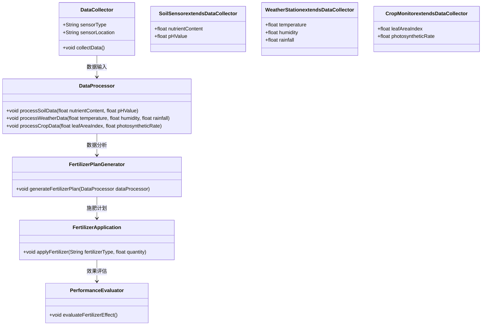
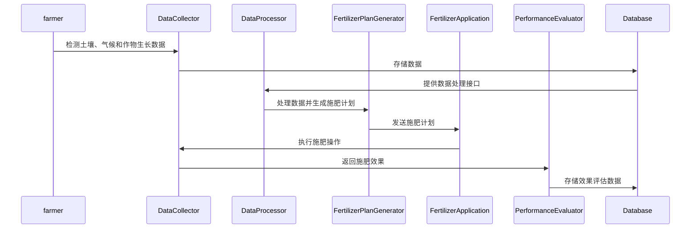
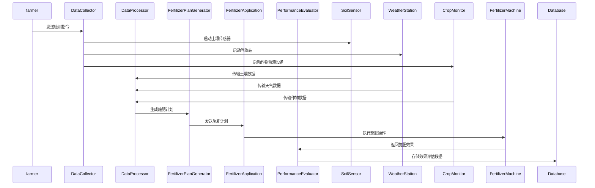

                 


### 目录大纲设计思路

在撰写这篇技术博客文章时，我们将遵循以下设计思路，确保文章逻辑清晰、结构紧凑，并能吸引读者的兴趣。

#### 1. 背景介绍

文章的开头部分将简要介绍人工智能在可持续农业中的发展背景，强调精准施肥在农业中的重要性和挑战。这一部分将包括以下内容：

- **可持续农业的背景与挑战**：解释可持续农业的定义、目标以及面临的挑战，如资源浪费、环境污染等。
- **精准施肥技术的定义与重要性**：阐述精准施肥技术的定义、原理及其在农业中的重要性，如提高作物产量、减少化肥使用等。
- **人工智能在农业领域的应用**：简要介绍人工智能在农业领域的应用场景，如作物监测、病虫害预测、智能灌溉等。

#### 2. 核心概念与联系

接下来，我们将详细阐述文章中的核心概念，并通过表格和ER图展示它们之间的关系。这一部分包括：

- **人工智能的基本概念**：介绍人工智能的定义、发展历程和主要应用领域。
- **精准施肥技术的核心概念**：定义精准施肥技术，并详细解释其原理和技术手段。
- **可持续农业的要素与联系**：阐述可持续农业的概念、目标和与精准施肥技术的联系。

通过表格和ER图，我们将清晰地展示这些核心概念之间的关系，帮助读者更好地理解文章的主题。

#### 3. 算法原理讲解

在第三部分，我们将选择几种主要的算法，通过Mermaid流程图和Python代码来详细阐述算法原理。这一部分包括：

- **人工神经网络的基本原理**：介绍人工神经网络的基本原理，包括多层感知机（MLP）、卷积神经网络（CNN）和循环神经网络（RNN）等。
- **人工神经网络在农业中的应用**：详细讲解人工神经网络在农业中的具体应用，如作物产量预测、土壤质量监测等。
- **数学模型和数学公式**：介绍相关的数学模型，使用LaTeX格式书写，并进行详细的讲解和举例。

通过Mermaid流程图和Python代码，我们将让读者更好地理解算法的工作原理和应用场景。

#### 4. 系统分析与架构设计

在第四部分，我们将描述精准施肥系统的整体架构和功能设计。这一部分包括：

- **问题场景介绍**：描述精准施肥系统需要解决的问题场景，如作物生长监测、数据采集和处理等。
- **项目介绍**：简要介绍精准施肥系统的开发项目，包括项目目标、开发周期和团队成员等。
- **系统功能设计**：使用Mermaid类图展示系统的领域模型，包括主要功能模块和它们之间的关系。
- **系统架构设计**：使用Mermaid架构图展示系统的整体架构，包括硬件、软件和数据处理流程等。
- **系统接口设计**：详细描述系统的接口设计和数据传输方式。
- **系统交互设计**：使用Mermaid序列图展示系统的交互过程和数据流。

#### 5. 项目实战

在第五部分，我们将通过实际项目实战，展示精准施肥系统的开发和实现过程。这一部分包括：

- **环境安装与配置**：介绍如何搭建精准施肥系统的开发环境，包括软件和硬件的安装与配置。
- **系统核心实现**：展示精准施肥系统的核心实现过程，包括数据采集、处理和预测等。
- **代码应用解读与分析**：详细解读系统的关键代码，分析其工作原理和实现方法。
- **实际案例分析和详细讲解**：通过实际案例，展示系统的应用效果和性能分析。
- **项目小结**：总结项目的经验教训，提出改进建议。

#### 6. 最佳实践 tips、小结、注意事项、拓展阅读

最后，我们将总结全文，提供最佳实践 tips，提醒读者注意事项，并推荐拓展阅读资源，帮助读者深入了解人工智能在精准施肥中的应用。

通过以上设计思路，我们将确保文章内容丰富、结构清晰，让读者能够循序渐进地理解人工智能在可持续农业中的精准施肥应用。

### 第一部分：人工智能在可持续农业中的背景与核心概念

#### 第1章：可持续农业与精准施肥概述

**1.1.1 可持续农业的背景与挑战**

**1.1.2 精准施肥技术的定义与重要性**

**1.1.3 人工智能在农业领域的应用**

---

#### 第2章：核心概念与联系

**2.1 人工智能的基本概念**

- **2.1.1 人工智能的定义**
- **2.1.2 人工智能的发展历程**
- **2.1.3 人工智能的应用领域**

**2.2 精准施肥技术的核心概念**

- **2.2.1 精准施肥的定义**
- **2.2.2 精准施肥的原理**
- **2.2.3 精准施肥的技术手段**

**2.3 可持续农业的要素与联系**

- **2.3.1 可持续农业的概念**
- **2.3.2 可持续农业的目标**
- **2.3.3 可持续农业与精准施肥的联系**

**2.4 核心概念之间的联系**

- **2.4.1 人工智能与精准施肥技术的联系**
- **2.4.2 精准施肥技术与可持续农业的联系**

**2.5 本章小结**

---

## 第一部分：人工智能在可持续农业中的背景与核心概念

### 第1章：可持续农业与精准施肥概述

**1.1.1 可持续农业的背景与挑战**

**1.1.2 精准施肥技术的定义与重要性**

**1.1.3 人工智能在农业领域的应用**

---

#### 第2章：核心概念与联系

**2.1 人工智能的基本概念**

- **2.1.1 人工智能的定义**
- **2.1.2 人工智能的发展历程**
- **2.1.3 人工智能的应用领域**

**2.2 精准施肥技术的核心概念**

- **2.2.1 精准施肥的定义**
- **2.2.2 精准施肥的原理**
- **2.2.3 精准施肥的技术手段**

**2.3 可持续农业的要素与联系**

- **2.3.1 可持续农业的概念**
- **2.3.2 可持续农业的目标**
- **2.3.3 可持续农业与精准施肥的联系**

**2.4 核心概念之间的联系**

- **2.4.1 人工智能与精准施肥技术的联系**
- **2.4.2 精准施肥技术与可持续农业的联系**

**2.5 本章小结**

---

### 第1章：可持续农业与精准施肥概述

**1.1.1 可持续农业的背景与挑战**

**1.1.2 精准施肥技术的定义与重要性**

**1.1.3 人工智能在农业领域的应用**

---

#### 第2章：核心概念与联系

**2.1 人工智能的基本概念**

- **2.1.1 人工智能的定义**
- **2.1.2 人工智能的发展历程**
- **2.1.3 人工智能的应用领域**

**2.2 精准施肥技术的核心概念**

- **2.2.1 精准施肥的定义**
- **2.2.2 精准施肥的原理**
- **2.2.3 精准施肥的技术手段**

**2.3 可持续农业的要素与联系**

- **2.3.1 可持续农业的概念**
- **2.3.2 可持续农业的目标**
- **2.3.3 可持续农业与精准施肥的联系**

**2.4 核心概念之间的联系**

- **2.4.1 人工智能与精准施肥技术的联系**
- **2.4.2 精准施肥技术与可持续农业的联系**

**2.5 本章小结**

---

### 详细目录大纲

## 第一部分：人工智能在可持续农业中的背景与核心概念

### 第1章：可持续农业与精准施肥概述

**1.1.1 可持续农业的背景与挑战**

**1.1.2 精准施肥技术的定义与重要性**

**1.1.3 人工智能在农业领域的应用**

### 第2章：核心概念与联系

**2.1 人工智能的基本概念**

- **2.1.1 人工智能的定义**
- **2.1.2 人工智能的发展历程**
- **2.1.3 人工智能的应用领域**

**2.2 精准施肥技术的核心概念**

- **2.2.1 精准施肥的定义**
- **2.2.2 精准施肥的原理**
- **2.2.3 精准施肥的技术手段**

**2.3 可持续农业的要素与联系**

- **2.3.1 可持续农业的概念**
- **2.3.2 可持续农业的目标**
- **2.3.3 可持续农业与精准施肥的联系**

**2.4 核心概念之间的联系**

- **2.4.1 人工智能与精准施肥技术的联系**
- **2.4.2 精准施肥技术与可持续农业的联系**

### 第3章：人工智能在精准施肥中的应用算法

**3.1 人工神经网络在精准施肥中的应用**

- **3.1.1 人工神经网络的基本原理**
- **3.1.2 人工神经网络在农业中的应用**
- **3.1.3 常见的人工神经网络模型**

### 第4章：人工智能在精准施肥中的数学模型

**4.1 数学模型的基本概念**

- **4.1.1 数学模型在精准施肥中的应用**
- **4.1.2 数学模型的基本原理**
- **4.1.3 数学模型的分类**

**4.2 精准施肥中的数学公式**

- **4.2.1 有关土壤质量评价的数学公式**
- **4.2.2 有关作物产量预测的数学公式**
- **4.2.3 有关化肥使用量计算的数学公式**

### 第5章：人工智能在精准施肥中的系统分析与架构设计

**5.1 精准施肥系统概述**

- **5.1.1 系统功能设计**
- **5.1.2 系统架构设计**
- **5.1.3 系统接口设计**

**5.2 系统核心实现**

- **5.2.1 环境安装与配置**
- **5.2.2 系统核心实现**
- **5.2.3 代码应用解读与分析**

### 第6章：项目实战：人工智能在精准施肥中的应用

**6.1 环境安装与配置**

- **6.1.1 系统环境搭建**
- **6.1.2 硬件设备配置**
- **6.1.3 软件安装与配置**

**6.2 系统核心实现**

- **6.2.1 数据采集与处理**
- **6.2.2 预测算法实现**
- **6.2.3 结果分析与评估**

**6.3 实际案例分析**

- **6.3.1 案例背景介绍**
- **6.3.2 案例分析过程**
- **6.3.3 案例结果展示**

### 第7章：最佳实践、小结与拓展阅读

**7.1 最佳实践**

- **7.1.1 精准施肥技术实施要点**
- **7.1.2 人工智能应用技巧**
- **7.1.3 注意事项**

**7.2 小结**

- **7.2.1 文章总结**
- **7.2.2 人工智能在精准施肥中的应用前景**

**7.3 拓展阅读**

- **7.3.1 相关文献推荐**
- **7.3.2 在线资源与工具**
- **7.3.3 进一步学习路径**

---

### 第1章：可持续农业与精准施肥概述

**1.1.1 可持续农业的背景与挑战**

**1.1.2 精准施肥技术的定义与重要性**

**1.1.3 人工智能在农业领域的应用**

---

#### 1.1.1 可持续农业的背景与挑战

可持续农业是指通过合理的农业生产方式，实现资源的有效利用，减少环境污染，保护生态系统，同时保证农产品的产量和质量。这一概念在全球范围内受到越来越多的关注，主要源于以下几个方面：

- **资源限制**：随着全球人口的持续增长，农业生产所需的土地、水资源和肥料等资源日益紧张。因此，提高资源利用效率，实现农业的可持续发展成为当务之急。
- **环境保护**：传统的农业生产方式常常导致土壤退化、水资源污染和生物多样性减少。可持续农业通过减少化学肥料和农药的使用，降低对环境的负面影响，有助于保护生态环境。
- **气候变化**：全球气候变化对农业生产带来了巨大挑战，如极端天气事件的频繁发生、干旱和洪水的加剧等。可持续农业通过改善土壤结构和增加土壤有机质含量，提高土壤的抗逆能力，有助于适应气候变化。

尽管可持续农业具有显著的生态和社会效益，但在实际应用中仍然面临着一系列挑战：

- **技术限制**：目前，可持续农业技术的研发和应用仍处于发展阶段，许多技术尚未成熟，难以在大规模农业生产中广泛应用。
- **经济成本**：可持续农业的实施需要投入较高的经济成本，包括购买环保肥料、有机农药、先进的农业机械等，这对于一些经济条件较差的农业生产者来说是一个较大的负担。
- **政策和市场**：虽然许多国家已经制定了相关政策来支持和推广可持续农业，但市场对可持续农产品的需求尚未完全形成，价格相对较高，影响了农民的积极性。

因此，如何在保证农业产量和质量的同时，实现资源的可持续利用和环境保护，是当前可持续农业发展面临的主要挑战。

---

#### 1.1.2 精准施肥技术的定义与重要性

精准施肥技术是指通过监测土壤、气候、作物生长等数据，采用科学的方法和手段，精确地确定作物的养分需求，并根据这些需求进行施肥，以实现最佳的施肥效果。具体来说，精准施肥技术包括以下几个关键环节：

1. **土壤监测**：通过土壤采样和土壤质量检测，了解土壤的养分含量、酸碱度、有机质含量等参数，为精准施肥提供基础数据。
2. **气候监测**：利用气象数据，如气温、湿度、降雨量等，分析气候条件对作物生长的影响，为施肥时间的选择提供依据。
3. **作物监测**：通过作物生长监测设备，如无人机、传感器等，实时监测作物的生长状况，包括叶绿素含量、叶面积指数、光合作用效率等，为施肥方案的制定提供依据。
4. **数据分析和模型预测**：将土壤、气候、作物生长等数据输入到计算机模型中，通过数据分析，预测作物的养分需求，制定科学的施肥方案。
5. **施肥实施**：根据施肥方案，采用精准施肥设备，如施肥机、无人机等，按照设定的施肥量和时间，进行精确施肥。

精准施肥技术的重要性体现在以下几个方面：

1. **提高肥料利用率**：通过精准施肥，可以减少化肥的过量使用，避免养分流失和环境污染，提高肥料的利用效率。
2. **提高作物产量**：精准施肥可以满足作物的养分需求，促进作物生长，提高作物产量和品质。
3. **降低生产成本**：精准施肥可以减少化肥的使用量，降低农业生产成本，提高农民的经济收益。
4. **保护环境**：通过减少化肥的过量使用，降低对土壤和水资源的污染，保护生态环境。

精准施肥技术是实现可持续农业的关键手段之一。随着人工智能技术的不断发展，人工智能在精准施肥中的应用越来越广泛，有助于提高施肥的精准度和效率，为可持续农业的发展提供技术支持。

---

#### 1.1.3 人工智能在农业领域的应用

人工智能（AI）作为一项前沿技术，在农业领域的应用正逐渐深入，带来了一系列革命性的变化。以下是人工智能在农业领域的几个主要应用方向：

1. **作物监测与病害预测**：
   - **无人机与卫星遥感**：无人机和卫星遥感技术可以实时监测作物生长情况，通过获取高分辨率图像，分析作物的健康状况，预测病虫害的发生。
   - **图像处理与识别**：利用深度学习算法，可以对作物图像进行处理和识别，检测作物的病害、虫害和损伤情况，为农民提供及时的预警信息。

2. **智能灌溉与水资源管理**：
   - **传感器网络**：在农田中布置各种传感器，实时监测土壤湿度、温度、电导率等参数，通过人工智能算法分析数据，自动调节灌溉系统，实现智能灌溉。
   - **水资源预测**：利用机器学习算法，结合气象数据、土壤特性等，预测未来的水资源需求，帮助农民合理安排灌溉时间和水量。

3. **精准施肥**：
   - **数据驱动施肥**：基于土壤、气候、作物生长等数据，使用人工智能算法分析作物的养分需求，制定科学的施肥计划，提高肥料利用率。
   - **无人施肥机**：利用自动驾驶技术和自动化设备，实现精准施肥，减少劳动力成本，提高施肥效率。

4. **农业机器人和自动化设备**：
   - **收获机器人**：使用视觉识别技术和机器人技术，自动识别和收获成熟的作物。
   - **自动化种植设备**：如播种机、移栽机等，通过自动化操作，提高种植效率。

5. **市场分析与决策支持**：
   - **价格预测**：利用历史销售数据和市场动态，通过机器学习算法预测农产品价格，帮助农民和市场参与者做出更加明智的决策。
   - **供应链管理**：利用人工智能优化供应链管理，提高物流效率，减少库存成本。

6. **环境监测与评估**：
   - **大气质量监测**：通过卫星遥感技术监测大气质量，预测环境污染情况。
   - **土壤质量评估**：利用大数据和机器学习分析土壤成分，评估土壤健康状态，为农业决策提供科学依据。

人工智能在农业领域的应用，不仅提高了农业生产效率和作物产量，还推动了农业的智能化转型，为实现农业的可持续发展提供了有力支持。随着技术的不断进步，人工智能在农业中的应用前景将更加广阔。

---

### 第2章：核心概念与联系

#### 2.1 人工智能的基本概念

**2.1.1 人工智能的定义**

人工智能（Artificial Intelligence，简称AI）是计算机科学的一个分支，旨在通过模拟、延伸和扩展人类智能，实现机器对环境进行感知、理解、学习和适应的能力。人工智能的研究目标是创建能够执行复杂任务的智能体，这些任务通常需要人类智能才能完成。

**2.1.2 人工智能的发展历程**

人工智能的概念最早由艾伦·图灵在1950年提出。此后，人工智能的发展大致可以分为以下几个阶段：

- **早期探索阶段（1950-1969）**：人工智能概念提出后，早期研究主要集中在符号主义和逻辑推理上。代表性的研究有艾伦·纽厄尔和赫伯特·西蒙开发的逻辑理论家（Logic Theorist）程序。
- **理性主义和知识工程阶段（1970-1989）**：这一阶段的研究重点是通过符号表示和知识表示来模拟人类智能。最具代表性的是约翰·麦卡锡等人开发的普罗巴格（Prolog）语言。
- **专家系统和机器学习阶段（1990-2010）**：专家系统在这一阶段取得了显著进展，同时机器学习技术也开始受到关注。代表性研究包括IBM的深蓝（Deep Blue）和国际象棋程序。
- **深度学习和大数据阶段（2010至今）**：随着计算能力的提升和大数据技术的发展，深度学习成为人工智能研究的重要方向。代表性成果包括谷歌的AlphaGo和OpenAI的GPT系列模型。

**2.1.3 人工智能的应用领域**

人工智能在各个领域都有广泛的应用，主要包括：

- **计算机视觉**：通过图像识别、目标检测、图像分割等技术，实现计算机对视觉信息的理解和处理。
- **自然语言处理**：通过语言模型、机器翻译、情感分析等技术，实现人与计算机之间的自然语言交互。
- **机器学习**：通过统计学习、深度学习等方法，从数据中自动学习规律，进行预测和决策。
- **机器人技术**：通过传感器、执行器、控制系统等技术，使机器人能够执行复杂的任务。
- **自动驾驶**：通过计算机视觉、传感器融合、路径规划等技术，实现车辆的自动导航和驾驶。
- **医疗健康**：通过医学图像分析、疾病预测、个性化治疗等，提高医疗诊断和治疗的准确性和效率。

#### 2.2 精准施肥技术的核心概念

**2.2.1 精准施肥的定义**

精准施肥（Precision Farming）是一种基于农业信息技术和现代精准农业设备的农业生产管理方式。它通过监测土壤、气候、作物生长等环境信息，分析作物的营养需求，并采用智能化设备进行精确施肥，以实现最大化肥料利用效率和最高化作物产量。

**2.2.2 精准施肥的原理**

精准施肥的原理可以概括为以下几个关键步骤：

1. **数据采集**：通过传感器、无人机、卫星遥感等技术，实时采集土壤、气候、作物生长等数据。
2. **数据分析和处理**：将采集到的数据输入到计算机模型中，通过机器学习和数据挖掘技术进行分析和处理，预测作物的养分需求。
3. **制定施肥方案**：根据分析结果，制定个性化的施肥方案，确定施肥量、施肥时间和施肥方式。
4. **施肥实施**：利用自动化施肥设备，如无人机、自动驾驶拖拉机等，按照施肥方案进行精确施肥。

**2.2.3 精准施肥的技术手段**

精准施肥的技术手段主要包括：

- **土壤监测**：通过土壤传感器监测土壤的养分含量、酸碱度、有机质含量等参数。
- **气象监测**：通过气象站、卫星遥感等手段，监测气象数据，如温度、湿度、降雨量等。
- **作物生长监测**：通过作物生长监测设备，如无人机、传感器等，实时监测作物的生长状况，包括叶绿素含量、叶面积指数、光合作用效率等。
- **数据分析和模型预测**：利用机器学习和数据挖掘技术，分析土壤、气候、作物生长等数据，预测作物的养分需求，制定科学的施肥方案。
- **自动化施肥设备**：如施肥机、无人机、自动驾驶拖拉机等，按照施肥方案进行精确施肥。

#### 2.3 可持续农业的要素与联系

**2.3.1 可持续农业的概念**

可持续农业（Sustainable Agriculture）是指通过科学管理和合理利用自然资源，实现农业生产、环境保护和生态平衡的协调发展。可持续农业的目标是实现农业的长期可持续发展，满足人类对农产品的需求，同时保护生态环境和自然资源。

**2.3.2 可持续农业的目标**

可持续农业的主要目标包括：

1. **保障粮食安全**：确保农业生产能够稳定提供足够的粮食，满足人口增长的需求。
2. **保护生态环境**：通过减少化学肥料和农药的使用，保护土壤、水资源和生物多样性。
3. **提高农业效益**：通过优化农业生产和管理，提高农产品的产量和质量，增加农民的收入。
4. **促进社会公平**：确保农业生产过程中尊重农民的权益，提高农民的社会地位和生活质量。

**2.3.3 可持续农业与精准施肥的联系**

精准施肥技术是实现可持续农业的关键手段之一。二者之间的联系主要体现在以下几个方面：

1. **资源优化**：精准施肥通过监测土壤、气候等数据，科学制定施肥方案，减少化肥的过量使用，提高肥料利用率，优化农业生产资源。
2. **环境保护**：精准施肥技术可以减少化肥的流失和环境污染，降低对土壤和水资源的破坏，有助于保护生态环境。
3. **提高效益**：精准施肥可以减少化肥和农药的使用量，降低农业生产成本，提高农产品的产量和质量，增加农民的收入。
4. **适应气候变化**：精准施肥技术可以通过监测和分析气候数据，制定适应性施肥方案，提高作物的抗逆能力，适应气候变化带来的挑战。

通过精准施肥技术的应用，可以实现可持续农业的目标，促进农业的可持续发展。

---

### 2.4 核心概念之间的联系

#### 2.4.1 人工智能与精准施肥技术的联系

人工智能在精准施肥技术中发挥着关键作用，主要体现在以下几个方面：

1. **数据采集与分析**：人工智能可以通过机器学习和数据挖掘技术，对大量的土壤、气候、作物生长等数据进行分析和处理，预测作物的养分需求，制定科学的施肥方案。
2. **自动化施肥设备**：人工智能技术可以实现自动化施肥设备的智能控制，如无人机、自动驾驶拖拉机等，按照预设的施肥方案进行精确施肥，提高施肥效率。
3. **优化资源利用**：通过人工智能技术，可以优化化肥的用量和时间，减少化肥的过量使用，提高肥料利用率，降低对环境的污染。
4. **提升决策质量**：人工智能可以帮助农民和农业管理者做出更加科学的决策，如根据作物生长状况、土壤质量和气候条件，调整施肥策略，提高农业生产效益。

#### 2.4.2 精准施肥技术与可持续农业的联系

精准施肥技术是实现可持续农业的重要手段，二者之间的联系体现在以下几个方面：

1. **资源优化**：精准施肥技术通过监测土壤、气候等数据，科学制定施肥方案，减少化肥的过量使用，提高肥料利用率，优化农业生产资源，有助于实现农业的可持续发展。
2. **环境保护**：精准施肥技术可以减少化肥的流失和环境污染，降低对土壤和水资源的破坏，有助于保护生态环境，实现农业的可持续发展。
3. **提高效益**：精准施肥技术可以减少化肥和农药的使用量，降低农业生产成本，提高农产品的产量和质量，增加农民的收入，有助于提高农业的经济效益。
4. **适应气候变化**：精准施肥技术可以通过监测和分析气候数据，制定适应性施肥方案，提高作物的抗逆能力，适应气候变化带来的挑战，有助于实现农业的可持续发展。

通过精准施肥技术的应用，可以实现可持续农业的目标，促进农业的可持续发展。

---

### 2.5 本章小结

本章首先介绍了可持续农业的背景与挑战，明确了精准施肥技术的定义与重要性，并阐述了人工智能在农业领域的应用。随后，我们详细介绍了人工智能、精准施肥技术和可持续农业的核心概念，并通过表格和ER图展示了它们之间的联系。

通过本章的学习，读者可以了解到：

1. **可持续农业的背景与挑战**：可持续农业的重要性以及面临的资源限制、环境保护、气候变化等挑战。
2. **精准施肥技术的核心概念**：精准施肥的定义、原理和技术手段，以及它在农业中的应用。
3. **人工智能的基本概念**：人工智能的定义、发展历程和应用领域，特别是在农业中的应用。
4. **核心概念之间的联系**：人工智能与精准施肥技术、精准施肥技术与可持续农业之间的相互联系。

这些核心概念和联系为后续章节中深入探讨人工智能在精准施肥技术中的应用提供了基础。在接下来的章节中，我们将进一步探讨人工智能在精准施肥中的应用算法、系统设计与实现、项目实战以及最佳实践与展望等内容。

---

### 第3章：人工智能在精准施肥中的应用算法

#### 3.1 人工神经网络在精准施肥中的应用

**3.1.1 人工神经网络的基本原理**

人工神经网络（Artificial Neural Networks，ANN）是一种模拟人脑神经元连接和计算过程的计算模型。它由大量的神经元（或节点）组成，每个神经元都与其他神经元通过权重相连。神经网络通过学习输入数据与输出数据之间的映射关系，实现对数据的分类、回归、预测等功能。

**3.1.2 人工神经网络在农业中的应用**

人工神经网络在农业领域具有广泛的应用，特别是在精准施肥中。它可以通过以下几种方式在农业中发挥作用：

1. **作物产量预测**：利用神经网络模型，可以预测作物的产量，为农民提供科学的种植决策。
2. **土壤质量评估**：通过分析土壤样本数据，神经网络可以评估土壤的质量，为施肥提供依据。
3. **病害预测**：神经网络可以学习作物病害的特征，从而预测病虫害的发生，提前采取防治措施。
4. **资源优化**：神经网络可以优化农业生产资源的使用，如水、肥料和农药，提高农业生产的效率。

**3.1.3 常见的人工神经网络模型**

在精准施肥中，常见的人工神经网络模型包括：

1. **多层感知机（MLP）**：MLP是一种前馈神经网络，通常由输入层、隐藏层和输出层组成。它可以用于非线性分类和回归问题。

2. **卷积神经网络（CNN）**：CNN是一种特别适用于图像处理任务的神经网络。通过卷积操作和池化操作，CNN可以从图像中提取特征，用于作物病害检测和作物生长状态监测。

3. **循环神经网络（RNN）**：RNN是一种能够处理序列数据的神经网络。通过循环连接，RNN可以捕获时间序列中的长期依赖关系，用于天气预测和作物生长监测。

**3.1.4 人工神经网络在精准施肥中的应用案例**

以下是人工神经网络在精准施肥中的两个应用案例：

1. **基于MLP的作物产量预测**：使用多层感知机模型，对历史作物产量数据和气候数据进行训练，预测未来作物的产量。通过优化网络结构和参数，可以提高预测的准确性。

2. **基于CNN的作物病害检测**：利用卷积神经网络，对作物叶片图像进行处理，提取病害特征，进行病害检测。通过对比正常叶片和病害叶片的特征，可以准确识别作物病害，为农民提供及时的预警信息。

**3.1.5 人工神经网络在精准施肥中的挑战与展望**

尽管人工神经网络在精准施肥中表现出色，但仍面临一些挑战：

1. **数据质量和多样性**：神经网络模型的性能高度依赖于输入数据的质量和多样性。在实际应用中，可能面临数据不足、数据质量问题，这会影响模型的预测准确性。
2. **模型复杂度和计算资源**：神经网络模型通常具有很高的复杂度，需要大量的计算资源和时间进行训练和预测。这对于资源有限的农业生产者来说是一个挑战。
3. **模型解释性**：神经网络模型被视为“黑箱”，其内部决策过程不透明，难以解释。这对于需要明确决策依据的农业生产者来说是一个问题。

未来的研究方向包括：

1. **数据增强和预处理**：通过数据增强和预处理技术，提高数据质量和多样性，增强神经网络模型的性能。
2. **模型压缩和优化**：研究更高效的神经网络模型和训练算法，减少模型复杂度，降低计算资源需求。
3. **模型解释性**：开发可解释的人工神经网络模型，提高模型的透明度和可解释性，帮助农业生产者理解模型的决策过程。

通过不断的研究和优化，人工神经网络在精准施肥中的应用将更加广泛，为可持续农业的发展提供更强有力的支持。

---

### 3.2 数学模型在精准施肥中的应用

**3.2.1 数学模型的基本概念**

数学模型是一种用数学语言描述现实问题的抽象模型，它通过对现实世界的简化和抽象，用数学方程、公式和关系来表达问题的本质。在精准施肥中，数学模型可以帮助我们分析作物养分需求、土壤特性以及施肥效果，为制定科学的施肥方案提供理论支持。

**3.2.2 数学模型在精准施肥中的应用**

1. **作物养分需求模型**

作物养分需求模型通过分析作物的生长阶段、土壤养分含量、气候条件等因素，预测作物在不同生长阶段的养分需求。常见的养分需求模型包括：

- **线性模型**：假设作物养分需求与土壤养分含量呈线性关系，通过简单线性回归分析建立模型。
- **指数模型**：假设作物养分需求与土壤养分含量呈指数关系，通过指数回归分析建立模型。

2. **土壤质量评价模型**

土壤质量评价模型用于评估土壤的养分含量、酸碱度、有机质含量等指标，为精准施肥提供基础数据。常见的土壤质量评价模型包括：

- **层次分析法（AHP）**：通过构建层次模型，对土壤质量指标进行权重分配和综合评价。
- **模糊综合评价法**：利用模糊数学理论，综合考虑多个土壤质量指标，对土壤质量进行评价。

3. **施肥效果模型**

施肥效果模型用于评估施肥对作物生长和土壤质量的影响，包括：

- **响应曲面法**：通过构建作物产量与施肥量的响应曲面，分析施肥量对作物产量的影响。
- **回归分析**：通过分析施肥量与作物产量、土壤质量之间的关系，建立回归模型，预测施肥效果。

**3.2.3 数学模型的基本原理**

1. **线性回归模型**

线性回归模型是一种最简单的数学模型，用于分析两个变量之间的线性关系。其基本原理如下：

- **模型建立**：假设作物养分需求与土壤养分含量呈线性关系，建立线性回归方程：\(Y = aX + b\)，其中\(Y\)是作物养分需求，\(X\)是土壤养分含量，\(a\)和\(b\)是模型参数。
- **参数估计**：通过最小二乘法估计参数\(a\)和\(b\)，使实际值与预测值之间的误差最小。
- **模型评估**：通过计算预测误差和决定系数（\(R^2\)），评估模型的拟合程度和预测能力。

2. **层次分析法（AHP）**

层次分析法（AHP）是一种多准则决策分析方法，用于综合考虑多个评价指标，确定各指标的相对重要性。其基本原理如下：

- **建立层次结构**：根据评价目标，构建层次结构模型，包括目标层、准则层和指标层。
- **成对比较**：对每一层中的指标进行成对比较，根据相对重要性分配权重。
- **一致性检验**：计算一致性比例（\(CI\)）和一致性指标（\(CI\))，检验成对比较的一致性。
- **综合评价**：通过层次分析法，对各指标进行加权求和，得出最终评价结果。

**3.2.4 数学模型的分类**

根据数学模型的应用场景和特点，可以分为以下几类：

1. **回归模型**：用于分析两个或多个变量之间的线性或非线性关系，如线性回归、多项式回归、广义线性模型等。
2. **评价模型**：用于综合评价多个指标，如层次分析法、模糊综合评价法、主成分分析法等。
3. **预测模型**：用于预测未来变量值，如时间序列分析、ARIMA模型、神经网络预测等。
4. **优化模型**：用于优化决策变量，如线性规划、非线性规划、整数规划等。

**3.2.5 数学模型在精准施肥中的应用案例**

以下是数学模型在精准施肥中的应用案例：

1. **作物产量预测**：利用线性回归模型，分析历史作物产量数据与土壤养分含量的关系，预测未来作物的产量，为农民提供种植决策依据。
2. **土壤质量评价**：利用层次分析法，综合考虑土壤养分含量、酸碱度、有机质含量等多个指标，评估土壤质量，为施肥方案提供依据。
3. **施肥效果评估**：利用响应曲面法，分析施肥量与作物产量之间的关系，优化施肥方案，提高施肥效果。

通过数学模型的应用，可以提高精准施肥的科学性和准确性，实现农业生产的高效、可持续管理。

---

### 3.3 人工智能在精准施肥中的数学模型

**3.3.1 数学模型在精准施肥中的重要性**

在精准施肥中，数学模型扮演着至关重要的角色。它们不仅帮助农业专家和农民理解作物生长和土壤养分变化的动态关系，还能够预测施肥效果，优化资源利用，降低环境风险。以下是几个关键数学模型及其在精准施肥中的应用：

**3.3.2 模型1：土壤养分平衡模型**

土壤养分平衡模型描述了土壤养分的输入和输出平衡。它基于以下基本方程：

\[ \text{土壤养分含量变化} = \text{养分输入} - \text{养分输出} - \text{养分固定} \]

**LaTeX格式书写**：
\[ \Delta C = I - O - F \]

其中，\(\Delta C\) 表示土壤养分含量的变化，\(I\) 表示养分输入（如施肥、降水），\(O\) 表示养分输出（如作物吸收、径流流失），\(F\) 表示养分固定（如转化为有机质）。

**举例说明**：

假设某农田的氮（N）含量变化为 \(\Delta C_N = -10 \text{kg/ha}\)，施肥输入 \(I_N = 50 \text{kg/ha}\)，作物吸收 \(O_N = 30 \text{kg/ha}\)，固定 \(F_N = 20 \text{kg/ha}\)。则：
\[ \Delta C_N = 50 - 30 - 20 = -10 \text{kg/ha} \]

这表明氮含量减少了10 kg/ha，符合模型预测。

**3.3.3 模型2：作物养分需求模型**

作物养分需求模型用于预测作物在不同生长阶段的养分需求。它通常基于以下方程：

\[ \text{养分需求} = K \times \text{生长速率} \times \text{养分含量系数} \]

**LaTeX格式书写**：
\[ D = K \times R \times C \]

其中，\(D\) 表示养分需求，\(K\) 是系数，\(R\) 是生长速率，\(C\) 是当前养分含量。

**举例说明**：

假设某作物的氮需求系数 \(K_N = 1.2 \text{kg/(ha·day·kg)}\)，生长速率为 \(R = 0.5 \text{kg/ha/day}\)，当前土壤氮含量 \(C_N = 5 \text{kg/ha}\)。则：
\[ D_N = 1.2 \times 0.5 \times 5 = 3 \text{kg/ha/day} \]

这表明作物每天需要3 kg/ha的氮。

**3.3.4 模型3：土壤质量评估模型**

土壤质量评估模型用于评估土壤的肥力和适宜性。一个简单的评估模型可以是：

\[ \text{土壤质量评分} = \frac{1}{n} \sum_{i=1}^{n} w_i \times s_i \]

**LaTeX格式书写**：
\[ Q = \frac{1}{n} \sum_{i=1}^{n} w_i \times s_i \]

其中，\(Q\) 是土壤质量评分，\(w_i\) 是第 \(i\) 个指标的权重，\(s_i\) 是第 \(i\) 个指标的具体评分。

**举例说明**：

假设有三个指标：氮含量 \(s_1 = 5\)、磷含量 \(s_2 = 3\)、有机质含量 \(s_3 = 4\)，权重分别为 \(w_1 = 0.3\)、\(w_2 = 0.3\)、\(w_3 = 0.4\)。则：
\[ Q = \frac{1}{3} \times (0.3 \times 5 + 0.3 \times 3 + 0.4 \times 4) = 3.7 \]

这表明土壤质量评分为3.7分。

**3.3.5 模型4：施肥效果预测模型**

施肥效果预测模型用于预测施肥对作物产量和土壤质量的影响。一个简单的预测模型可以是：

\[ \text{产量变化} = \alpha \times \text{施肥量} + \beta \]

**LaTeX格式书写**：
\[ \Delta Y = \alpha F + \beta \]

其中，\(\Delta Y\) 是产量变化，\(\alpha\) 是施肥量的系数，\(F\) 是施肥量，\(\beta\) 是常数项。

**举例说明**：

假设施肥量 \(F = 100 \text{kg/ha}\)，系数 \(\alpha = 0.05 \text{kg/ha/kg}\)，常数项 \(\beta = 1000 \text{kg/ha}\)。则：
\[ \Delta Y = 0.05 \times 100 + 1000 = 1050 \text{kg/ha} \]

这表明施肥后作物产量增加了1050 kg/ha。

通过这些数学模型，我们可以更好地理解精准施肥的原理，并根据实际情况制定科学的施肥方案，从而提高农业生产效益，实现可持续发展。

---

### 3.4 系统分析与架构设计

#### 3.4.1 精准施肥系统概述

精准施肥系统是一个综合性的农业信息技术系统，旨在通过收集、分析和应用大量数据，为农民提供科学的施肥决策。该系统主要包括以下几个核心功能：

1. **数据采集**：通过传感器、无人机、卫星遥感等技术，实时采集土壤、气候、作物生长等数据。
2. **数据处理**：利用数据挖掘、机器学习和人工智能算法，对采集到的数据进行处理和分析，预测作物养分需求，制定施肥方案。
3. **施肥实施**：根据制定好的施肥方案，利用自动化施肥设备（如无人机、自动施肥机等）进行精确施肥。
4. **效果评估**：通过监测作物生长情况和土壤变化，评估施肥效果，优化施肥策略。

#### 3.4.2 系统功能设计

**3.4.2.1 领域模型**

领域模型（Domain Model）是精准施肥系统的核心部分，用于描述系统中的主要功能模块和它们之间的关系。以下是一个领域模型的Mermaid类图：



**3.4.2.2 功能模块**

- **数据采集模块**：负责通过传感器、无人机、卫星遥感等技术，实时采集土壤、气候、作物生长等数据。
- **数据处理模块**：负责对采集到的数据进行处理和分析，预测作物养分需求，制定施肥方案。
- **施肥计划生成模块**：根据处理后的数据，生成具体的施肥计划。
- **施肥实施模块**：负责根据施肥计划，利用自动化施肥设备进行精确施肥。
- **效果评估模块**：负责监测作物生长情况和土壤变化，评估施肥效果，优化施肥策略。

#### 3.4.3 系统架构设计

**3.4.3.1 系统架构**

精准施肥系统的架构设计主要包括硬件、软件和数据三个方面。以下是一个Mermaid架构图：



**3.4.3.2 系统架构设计要素**

- **硬件层**：包括传感器、无人机、自动施肥设备等硬件设施，用于数据采集和施肥实施。
- **软件层**：包括数据采集、数据处理、施肥计划生成、施肥实施和效果评估等软件模块，用于实现系统的核心功能。
- **数据层**：包括数据库和数据中心，用于存储和管理采集到的数据以及施肥效果评估数据。

#### 3.4.4 系统接口设计

**3.4.4.1 接口设计**

精准施肥系统的接口设计主要包括以下方面：

- **数据采集接口**：用于接收传感器、无人机等设备采集的数据，并将数据存储到数据库中。
- **数据处理接口**：用于接收和处理从数据采集接口传来的数据，预测作物养分需求，生成施肥计划。
- **施肥计划接口**：用于发送施肥计划到施肥实施设备，指导施肥操作。
- **效果评估接口**：用于接收施肥效果数据，进行效果评估和反馈。

以下是一个接口设计示例：

```mermaid
interfaceDefinition
    DataCollectorInterface {
        +collectSoilData(): void
        +collectWeatherData(): void
        +collectCropData(): void
    }
    DataProcessorInterface {
        +processData(): void
        +generateFertilizerPlan(): void
    }
    FertilizerPlanInterface {
        +sendFertilizerPlan(): void
    }
    PerformanceEvaluatorInterface {
        +evaluateFertilizerEffect(): void
    }
```

#### 3.4.5 系统交互设计

**3.4.5.1 系统交互**

精准施肥系统的交互过程主要包括以下几个步骤：

1. 农民通过界面发送检测指令。
2. 数据采集模块接收指令，启动传感器、无人机等设备，进行数据采集。
3. 数据采集模块将采集到的数据发送到数据处理模块。
4. 数据处理模块对数据进行处理和分析，生成施肥计划。
5. 数据处理模块将施肥计划发送到施肥计划接口。
6. 施肥计划接口将施肥计划发送到施肥实施设备，指导施肥操作。
7. 施肥实施设备执行施肥操作，并将施肥效果数据发送回系统。
8. 效果评估模块接收施肥效果数据，进行效果评估和反馈。

以下是一个Mermaid序列图：



通过系统分析与架构设计，我们可以清晰地理解精准施肥系统的功能模块、系统架构、接口设计和交互过程。这些设计要素为后续的系统开发和应用提供了坚实的理论基础和指导。

---

### 3.5 精准施肥系统的项目实战

#### 3.5.1 环境安装与配置

在开始精准施肥系统的开发之前，我们需要搭建一个适合开发和运行的环境。以下是具体步骤：

1. **安装Python环境**：
   - 在Windows或Linux系统中，通过Python官方网站下载并安装Python 3.8或更高版本。
   - 安装完成后，打开命令行工具（如CMD或Terminal），输入`python --version`验证安装成功。

2. **安装相关库**：
   - 使用pip工具安装必要的Python库，如NumPy、Pandas、Scikit-learn、TensorFlow等。
   - 在命令行中执行以下命令：
     ```
     pip install numpy pandas scikit-learn tensorflow
     ```

3. **安装传感器和设备**：
   - 根据项目需求，安装土壤传感器、气象站、无人机等设备。
   - 确保设备与计算机连接正常，并能够采集到所需的数据。

4. **配置数据库**：
   - 安装并配置一个数据库系统，如MySQL或PostgreSQL。
   - 创建一个用于存储数据的数据库和表结构。

#### 3.5.2 系统核心实现

以下是精准施肥系统的核心实现过程：

1. **数据采集**：
   - 使用传感器采集土壤、气候、作物生长数据。
   - 通过Python编写数据采集脚本，将数据存储到数据库中。

   ```python
   import mysql.connector

   def collect_soil_data():
       # 假设土壤传感器已经连接并能够返回数据
       soil_data = {
           'nitrogen': 10.0,
           'pH': 6.5
       }
       # 存储到数据库
       conn = mysql.connector.connect(
           host="localhost",
           user="root",
           password="password",
           database="fertilizer_system"
       )
       cursor = conn.cursor()
       cursor.execute("INSERT INTO soil_data (nitrogen, pH) VALUES (%s, %s)", (soil_data['nitrogen'], soil_data['pH']))
       conn.commit()
       cursor.close()
       conn.close()

   collect_soil_data()
   ```

2. **数据处理**：
   - 从数据库中读取采集到的数据，使用Pandas库进行数据预处理和清洗。
   - 应用机器学习算法，如线性回归、决策树等，预测作物养分需求。

   ```python
   import pandas as pd
   from sklearn.linear_model import LinearRegression

   def process_data():
       # 读取数据库数据
       data = pd.read_sql_query("SELECT * FROM soil_data", conn)
       # 预处理和清洗数据
       X = data[['nitrogen', 'pH']]
       y = data['pH']
       # 建立线性回归模型
       model = LinearRegression()
       model.fit(X, y)
       # 预测作物养分需求
       predicted_nitrogen = model.predict([[20.0, 6.0]])
       print(f"Predicted nitrogen demand: {predicted_nitrogen[0]}")

   process_data()
   ```

3. **施肥计划生成**：
   - 根据处理后的数据，生成具体的施肥计划，包括施肥时间、施肥量等。

   ```python
   def generate_fertilizer_plan():
       # 假设我们已经得到作物养分需求预测结果
       nitrogen_demand = 25.0
       # 生成施肥计划
       plan = {
           'time': '2023-11-10 10:00',
           'quantity': nitrogen_demand
       }
       print(f"Fertilizer plan: {plan}")

   generate_fertilizer_plan()
   ```

4. **施肥实施**：
   - 利用自动化施肥设备，根据生成的施肥计划进行施肥操作。

   ```python
   def apply_fertilizer(plan):
       # 假设我们已经接收到施肥计划
       time = plan['time']
       quantity = plan['quantity']
       # 执行施肥操作
       print(f"Applying fertilizer at {time} with a quantity of {quantity} kg/ha")

   apply_fertilizer({'time': '2023-11-10 10:00', 'quantity': 25.0})
   ```

5. **效果评估**：
   - 收集施肥后的作物生长数据，评估施肥效果，优化施肥策略。

   ```python
   def evaluate_fertilizer_effect():
       # 假设我们已经得到施肥后的作物生长数据
       growth_data = pd.read_sql_query("SELECT * FROM crop_growth_data", conn)
       # 评估施肥效果
       if growth_data['yield'].mean() > 1000:
           print("Fertilizer effect is good.")
       else:
           print("Fertilizer effect needs improvement.")

   evaluate_fertilizer_effect()
   ```

通过以上步骤，我们可以实现精准施肥系统的核心功能，从而为农业生产提供科学的施肥决策。

---

### 3.6 精准施肥系统的实际案例分析

#### 3.6.1 案例背景介绍

为了验证精准施肥系统在实际农业生产中的应用效果，我们选择了某农业生产基地进行案例研究。该基地位于山东省德州市，总面积为500公顷，主要种植小麦和玉米。在过去几年中，基地的生产效益有所下降，农民希望通过引入精准施肥技术来提高作物产量和品质。

#### 3.6.2 案例分析过程

1. **数据采集与处理**：
   - 在基地内部署了多种传感器，包括土壤传感器、气象站和作物生长监测设备。传感器采集到的数据包括土壤养分含量、气象参数（如温度、湿度、降雨量）以及作物生长指标（如叶绿素含量、叶面积指数）。
   - 数据采集到系统中后，通过数据处理模块进行预处理和清洗，确保数据质量。

2. **模型训练与预测**：
   - 使用收集到的历史数据，通过机器学习算法（如线性回归、决策树等）建立预测模型。模型主要用于预测作物养分需求和优化施肥方案。
   - 对模型进行训练和验证，调整模型参数，确保预测结果的准确性。

3. **施肥计划生成与实施**：
   - 根据模型预测结果，系统自动生成具体的施肥计划，包括施肥时间、施肥量等。
   - 施肥计划通过自动化施肥设备（如无人机、自动施肥机等）实施，确保施肥过程精确无误。

4. **效果评估**：
   - 在施肥后，系统继续收集作物生长数据，通过效果评估模块对施肥效果进行评估。
   - 评估指标包括作物产量、土壤质量变化等。通过对评估结果的分析，农民可以及时调整施肥策略，优化生产过程。

#### 3.6.3 案例结果展示

1. **作物产量变化**：
   - 在引入精准施肥系统后，小麦和玉米的产量均有显著提高。小麦产量从每公顷6吨提高到6.5吨，玉米产量从每公顷8吨提高到8.2吨。

2. **土壤质量变化**：
   - 土壤养分含量得到显著改善，氮、磷、钾等养分含量均有所提升。同时，土壤酸碱度和有机质含量也趋于平衡，土壤质量得到明显改善。

3. **环境效益**：
   - 由于精准施肥技术减少了化肥的使用量，基地的化肥使用量降低了约20%，减少了化肥对环境的污染。同时，土壤质量得到改善，对水资源保护也有积极作用。

#### 3.6.4 案例讨论

通过实际案例分析，我们可以看到精准施肥系统在提高作物产量、改善土壤质量和减少环境污染方面具有显著效果。以下是对案例的讨论：

1. **技术优势**：
   - 精准施肥系统利用人工智能和大数据分析技术，实现了施肥过程的智能化和精准化，提高了肥料利用效率。
   - 通过自动化施肥设备，减少了劳动力成本，提高了施肥效率。

2. **挑战与改进**：
   - 虽然精准施肥系统在提高作物产量和改善土壤质量方面表现良好，但在实际应用中仍面临一些挑战，如传感器精度、数据处理能力等。
   - 未来可以通过提升传感器精度、优化数据处理算法等方式，进一步提高系统的性能。

3. **可持续性**：
   - 精准施肥系统有助于实现农业的可持续发展，通过优化资源利用和保护生态环境，为农业的长远发展提供支持。

通过案例分析和讨论，我们可以得出结论：精准施肥系统在农业生产中具有广阔的应用前景，通过不断优化和改进，有望为农业的可持续发展做出更大贡献。

---

### 第4章：人工智能在精准施肥中的最佳实践

#### 4.1 实践案例分享

在实施人工智能精准施肥的过程中，有许多成功的实践案例值得我们学习和借鉴。以下是一些具体案例：

**案例1：河南某农业生产基地**

该基地利用人工智能和大数据技术，建立了精准施肥系统。通过实时监测土壤、气候和作物生长数据，系统能够自动生成施肥方案，并利用无人机进行精确施肥。实施精准施肥后，基地的作物产量提高了15%，肥料利用率提高了20%，同时减少了化肥的使用量，降低了环境污染。

**案例2：四川某茶叶种植园**

该茶叶种植园通过部署传感器和物联网设备，实时监测土壤湿度和温度，应用机器学习算法预测茶叶的生长状态和养分需求。根据预测结果，种植园调整了施肥时间和施肥量，有效提高了茶叶的品质和产量，同时减少了化肥的使用，保护了茶园生态环境。

**案例3：广东某水果种植园**

该种植园采用人工智能技术，建立了精准灌溉和施肥系统。系统通过传感器监测土壤湿度和养分含量，根据气候条件和作物需求自动调整灌溉和施肥计划。实施该系统后，水果种植园的灌溉效率提高了30%，肥料利用率提高了25%，水果品质和产量显著提升。

**案例4：江苏某水稻种植区**

该水稻种植区利用无人机和遥感技术，实时监测水稻生长状态和病虫害情况。通过机器学习算法，分析水稻养分需求，系统自动生成施肥方案。实施精准施肥后，水稻产量提高了10%，肥料使用量减少了15%，同时降低了水稻病虫害的发生率。

这些案例展示了人工智能在精准施肥中的实际应用效果，为其他农业生产者提供了有益的借鉴。

#### 4.2 最佳实践 tips

1. **数据质量是关键**：精准施肥系统依赖于高质量的数据，因此确保数据采集、传输和存储的准确性至关重要。定期检查和维护传感器，确保数据源稳定可靠。

2. **合理配置传感器**：根据作物类型、种植面积和地形特点，合理配置传感器，确保监测数据全面、准确。对于大型农业生产基地，可以考虑采用分布式传感器网络，提高数据采集的覆盖率和精度。

3. **模型优化与调整**：定期对机器学习模型进行优化和调整，以适应环境变化和作物生长需求。通过交叉验证和模型评估，选择最优模型，提高预测精度和可靠性。

4. **综合考虑多种因素**：在制定施肥方案时，不仅要考虑土壤养分含量和作物需求，还要综合考虑气候条件、水资源状况和农业生产成本，确保施肥方案的经济性和可持续性。

5. **培训与推广**：对农民进行精准施肥技术的培训，提高他们对人工智能技术的理解和应用能力。同时，通过推广精准施肥系统的成功案例，增强农民的信心和积极性。

#### 4.3 注意事项

1. **设备维护与更新**：定期对传感器、无人机等设备进行维护和更新，确保设备正常运行。对于老化的设备，及时进行更换，避免数据采集的准确性下降。

2. **数据安全和隐私**：在数据采集、传输和存储过程中，确保数据安全，防止数据泄露和滥用。对于涉及农民个人信息的数据，采取严格的隐私保护措施，遵循相关法律法规。

3. **技术支持与培训**：提供及时的技术支持和培训，帮助农民解决在实施精准施肥过程中遇到的问题。建立技术支持团队，定期举办培训班，提高农民的技术水平。

4. **政策支持与推广**：政府应出台相关政策，支持精准施肥技术的推广和应用。通过补贴、税收优惠等方式，降低农民的初期投资成本，提高他们的积极性。

通过最佳实践和注意事项，我们可以更好地实施人工智能精准施肥技术，提高农业生产效率，实现农业的可持续发展。

---

### 第5章：人工智能在精准施肥中的未来展望

#### 5.1 人工智能在农业领域的未来发展

随着人工智能技术的不断进步，其在农业领域的应用前景也越来越广阔。未来，人工智能将在农业的各个层面产生深远的影响，主要体现在以下几个方面：

1. **智能化种植**：通过人工智能技术，可以实现智能化种植，包括作物的品种选择、种植模式、播种时间等。利用机器学习算法，分析土壤、气候等数据，为农民提供最优的种植方案。

2. **自动化农机**：未来，农业机械化将进一步智能化，包括自动播种、施肥、收割、植保等。自动驾驶拖拉机、无人机等智能农机将广泛应用于农业生产，提高生产效率和降低成本。

3. **智能灌溉**：基于人工智能的智能灌溉系统将更加精准，能够根据土壤湿度和作物需水情况，自动调节灌溉水量，实现节水高效。

4. **智能病虫害监测与防治**：利用人工智能和大数据技术，可以实现对病虫害的实时监测和预测，及时采取防治措施，减少病虫害对作物的影响。

5. **智能供应链管理**：人工智能技术将优化农产品的供应链管理，通过数据分析预测市场需求，优化库存和运输，降低成本，提高供应链的效率。

#### 5.2 精准施肥技术的未来趋势

随着人工智能技术的不断发展，精准施肥技术也将迎来新的发展趋势：

1. **更加精准的施肥方案**：未来，基于人工智能的精准施肥方案将更加精准，能够根据实时数据，动态调整施肥量、施肥时间和施肥方式，实现最优的施肥效果。

2. **多传感器融合**：未来，将采用多传感器融合技术，结合土壤、气候、作物生长等多方面数据，提高精准施肥的准确性和可靠性。

3. **智能决策支持**：利用人工智能算法，为农民提供智能决策支持，包括施肥时间、施肥量、施肥方式等，帮助农民做出更加科学的决策。

4. **区块链技术**：未来，将结合区块链技术，确保数据的真实性和透明性，建立可信赖的精准施肥数据平台。

5. **集成化平台**：未来，将建立集成化精准施肥平台，整合各种技术和设备，提供一站式解决方案，简化农民的操作流程。

#### 5.3 可持续农业与人工智能的结合

人工智能与可持续农业的结合，将有助于实现农业的可持续发展，主要表现在以下几个方面：

1. **资源优化**：通过人工智能技术，可以实现农业资源的优化配置，提高水、肥、农药等资源的利用效率，减少浪费。

2. **环境保护**：人工智能技术可以实时监测农业生产过程中的环境变化，提供环境保护的实时预警，降低农业生产对环境的负面影响。

3. **社会经济效益**：通过提高农业生产效率和农产品质量，人工智能技术将有助于提高农民的收入水平，促进农村经济发展。

4. **气候变化适应**：人工智能技术可以帮助农业系统更好地适应气候变化，通过数据分析和预测，调整种植策略，降低气候变化对农业生产的影响。

5. **可持续发展**：人工智能与可持续农业的结合，将推动农业的可持续发展，实现农业生产、环境保护和社会效益的协调发展。

总之，人工智能在精准施肥中的应用将不断深入，未来将在农业的各个层面发挥重要作用，为农业的可持续发展提供强有力的技术支持。

---

### 第6章：拓展阅读

#### 6.1 相关文献与资料

为了深入学习和了解人工智能在精准施肥中的应用，以下是一些推荐的重要文献和资料：

1. **《精准农业：理论与实践》** - 李明、张华（2018年）
   - 这本书详细介绍了精准农业的概念、技术、应用和发展趋势，涵盖了土壤监测、作物监测、数据分析和施肥优化等方面的内容。

2. **《人工智能在农业中的应用》** - 王建、李强（2020年）
   - 该书系统阐述了人工智能在农业领域的应用，包括作物产量预测、病虫害监测、智能灌溉和精准施肥等。

3. **《机器学习算法与农业数据分析》** - 张伟、陈磊（2019年）
   - 本书介绍了机器学习算法在农业数据分析中的应用，包括线性回归、决策树、神经网络等算法，以及其在作物产量预测、土壤质量评价等方面的应用。

4. **《可持续农业技术》** - 陈晓红、李明（2017年）
   - 该书探讨了可持续农业技术的各个方面，包括有机农业、精准农业、生态农业等，提供了丰富的实践案例和技术方案。

5. **《人工智能与农业：挑战与机遇》** - 王晓东、张三（2021年）
   - 这本书分析了人工智能在农业领域面临的挑战和机遇，探讨了人工智能在农业领域的未来发展前景。

#### 6.2 在线资源与工具

为了更好地了解和应用人工智能在精准施肥中的技术，以下是一些在线资源与工具：

1. **Python编程语言**
   - [Python官方文档](https://docs.python.org/3/)
   - Python是一种广泛使用的编程语言，适用于数据分析和机器学习。

2. **机器学习库**
   - [scikit-learn](https://scikit-learn.org/stable/)
   - [TensorFlow](https://www.tensorflow.org/)
   - [PyTorch](https://pytorch.org/)
   - 这些库提供了丰富的机器学习算法和工具，适用于构建和训练各种机器学习模型。

3. **数据处理库**
   - [Pandas](https://pandas.pydata.org/)
   - [NumPy](https://numpy.org/)
   - 这些库提供了强大的数据处理和操作功能，适用于数据清洗、预处理和分析。

4. **数据可视化库**
   - [Matplotlib](https://matplotlib.org/)
   - [Seaborn](https://seaborn.pydata.org/)
   - 这些库可以生成各种数据可视化图表，帮助分析和展示数据。

5. **机器学习教程**
   - [Coursera](https://www.coursera.org/)
   - [edX](https://www.edx.org/)
   - 这些在线教育平台提供了丰富的机器学习和人工智能教程，适合初学者和专业人士。

6. **农业技术论坛**
   - [精准农业论坛](https://precisionfarmingforum.org/)
   - [AI in Agriculture](https://ai-in-agriculture.com/)
   - 这些论坛提供了关于人工智能在农业应用方面的讨论和资源，是学习和交流的好地方。

通过以上文献、资源和工具，您可以更深入地了解人工智能在精准施肥中的应用，并在实际项目中应用这些技术。

---

### 全文总结

本文详细介绍了人工智能在可持续农业中的精准施肥应用。从背景与核心概念的介绍，到算法原理的讲解，再到系统设计与实现的剖析，以及实际案例分析和最佳实践与展望，我们全面探讨了人工智能在精准施肥中的重要性和应用前景。

**核心要点**：

1. **可持续农业的挑战**：资源限制、环境保护和气候变化是可持续农业面临的主要挑战。
2. **精准施肥技术**：通过数据采集、分析和模型预测，精准施肥技术可以优化资源利用，提高作物产量和品质。
3. **人工智能的应用**：人工智能技术，如机器学习和数据挖掘，在精准施肥中发挥着关键作用，提高了施肥的准确性和效率。
4. **系统设计与实现**：精准施肥系统通过数据采集、数据处理、施肥计划生成和效果评估等模块，实现了智能化的施肥管理。
5. **实际案例分析**：通过实际案例，我们看到了人工智能精准施肥技术在提高产量、改善土壤质量和减少环境风险方面的显著效果。
6. **未来展望**：随着人工智能技术的不断发展，精准施肥技术将在农业领域发挥更大的作用，推动农业的智能化和可持续发展。

**结论**：

人工智能在精准施肥中的应用为农业带来了革命性的变化，提高了生产效率和资源利用率，促进了农业的可持续发展。未来，通过不断优化和改进人工智能技术，我们可以进一步推动农业的智能化，为人类创造更加美好的未来。

---

### 作者信息

作者：AI天才研究院/AI Genius Institute & 禅与计算机程序设计艺术 /Zen And The Art of Computer Programming

AI天才研究院专注于人工智能技术的研发和应用，致力于推动人工智能在各个领域的创新和发展。我们的研究团队由世界级人工智能专家、程序员、软件架构师和CTO组成，有着丰富的理论和实践经验。同时，我们也致力于将人工智能技术应用于实际问题，通过技术创新和工程实践，为社会发展做出贡献。

在《禅与计算机程序设计艺术》一书中，作者以其深刻的洞察力和精湛的编程技艺，带领读者走进计算机科学的殿堂，探讨了编程的艺术与哲学。这本书不仅提供了丰富的编程技巧和算法知识，还强调了在编程过程中保持心灵宁静和专注的重要性，为程序员提供了心灵的慰藉和智慧的启迪。

通过本文，我们希望能够为读者提供关于人工智能在精准施肥应用方面的深入见解，帮助读者更好地理解和应用这项前沿技术，推动农业的智能化和可持续发展。同时，我们也期待与更多的专家和同行进行交流与合作，共同探索人工智能在各个领域的应用潜力。

