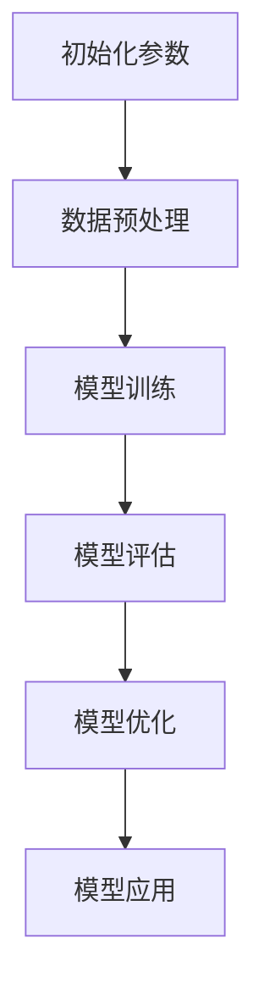

                 

### 人工智能在可持续渔业资源评估中的应用

**关键词：**
- 人工智能
- 可持续渔业资源评估
- 机器学习
- 数据分析
- 渔业生态建模

**摘要：**
本文探讨了人工智能在可持续渔业资源评估中的应用。首先，介绍了人工智能和可持续渔业资源评估的基本概念和背景，接着详细阐述了人工智能在渔业资源评估中的核心方法和技术应用。通过分析现有问题和挑战，本文探讨了未来的研究方向和趋势，为推动可持续渔业资源的科学管理和合理利用提供了思路。

## 引言与背景

### 1.1 人工智能与可持续渔业资源评估

**人工智能的定义：**
人工智能（Artificial Intelligence, AI）是指模拟、延伸和扩展人类智能的理论、方法、技术及应用。它涵盖了机器学习、自然语言处理、计算机视觉、智能推理等多个领域。

**可持续渔业资源评估的重要性：**
渔业资源是全球重要食物来源之一，对人类生存和发展具有重要意义。然而，传统渔业资源评估方法往往存在局限性，难以适应现代渔业发展的需求。可持续渔业资源评估旨在通过科学的方法评估渔业资源的现状、趋势和潜力，为渔业资源管理提供决策支持。

### 1.2 人工智能在渔业资源评估中的挑战

**数据收集的困难：**
渔业资源数据来源广泛，包括卫星遥感、水下传感器、渔船报告等。如何有效地收集、整合这些数据，并去除噪声和错误，是人工智能在渔业资源评估中面临的首要挑战。

**复杂的渔业生态系统的建模：**
渔业生态系统具有复杂性，涉及多种生物之间的相互作用和生态环境的动态变化。如何准确建模这些复杂关系，是人工智能在渔业资源评估中的关键挑战。

**算法选择的挑战：**
针对不同的渔业资源评估问题，需要选择合适的机器学习算法。如何选择和优化算法，使其在评估中达到最佳效果，是人工智能在渔业资源评估中的难题。

### 1.3 可持续发展的基本概念

**可持续发展的定义：**
可持续发展是指在满足当前需求的同时，不损害后代满足其需求的能力。它强调经济、社会和环境的协调发展。

**对渔业资源评估的影响：**
可持续发展要求渔业资源评估不仅要关注资源量的变化，还要考虑生态环境的可持续性。这为人工智能在渔业资源评估中的应用提出了新的要求。

## 核心概念

### 2.1 人工智能基本原理

**机器学习的基础知识：**
机器学习是人工智能的核心组成部分，它使计算机系统能够从数据中学习并做出决策。主要分为监督学习、无监督学习和强化学习三种类型。

**人工智能在不同领域的应用：**
人工智能在多个领域具有广泛应用，如医疗、金融、交通等。在渔业资源评估中，人工智能可以用于数据挖掘、模型预测和决策支持。

### 2.2 数据采集与预处理

**数据来源：**
渔业资源数据来源广泛，包括卫星遥感、水下传感器、渔船报告等。这些数据具有高维、非线性、时变等特点。

**数据预处理方法：**
数据预处理是人工智能应用的关键步骤，包括数据清洗、归一化、特征提取等。有效的数据预处理可以提高模型性能和预测准确性。

### 2.3 可持续发展的基本概念

**可持续发展的原则：**
可持续发展强调公平性、持续性、共同性和科学性。这些原则为渔业资源评估提供了理论基础。

**与渔业资源评估的关系：**
可持续发展要求渔业资源评估不仅要关注资源量，还要考虑生态环境的可持续性。这为渔业资源评估引入了新的指标和评价方法。

## 方法与技术与算法原理讲解

### 3.1 机器学习算法概述

**监督学习：**
监督学习是一种基于标记数据的机器学习方法，通过学习输入和输出之间的映射关系，对未知数据进行预测。常见的监督学习算法包括线性回归、决策树、支持向量机等。

**无监督学习：**
无监督学习是一种不依赖标记数据的机器学习方法，旨在发现数据中的隐含结构和模式。常见的无监督学习算法包括聚类、降维、异常检测等。

**强化学习：**
强化学习是一种基于奖励机制的机器学习方法，通过不断尝试和反馈，使系统逐渐学会在特定环境中做出最优决策。常见的强化学习算法包括Q学习、SARSA、DQN等。

### 3.2 特征提取与选择

**特征提取：**
特征提取是指从原始数据中提取出有用的信息，以提高模型性能。常见的方法包括主成分分析（PCA）、线性判别分析（LDA）、自动编码器等。

**特征选择：**
特征选择是指从大量特征中筛选出对模型性能影响较大的特征，以降低模型复杂度和计算成本。常见的方法包括过滤式特征选择、包裹式特征选择、嵌入式特征选择等。

### 3.3 算法原理讲解

**算法mermaid流程图：**


**算法Python源代码：**
```python
import numpy as np

# 初始化参数
params = {'learning_rate': 0.1, 'epochs': 100}

# 数据预处理
def preprocess_data(data):
    # 数据清洗、归一化等操作
    return processed_data

# 模型训练
def train_model(data, params):
    # 训练模型
    pass

# 模型评估
def evaluate_model(model, data):
    # 评估模型性能
    pass

# 模型优化
def optimize_model(model, data, params):
    # 优化模型参数
    pass

# 模型应用
def apply_model(model, data):
    # 应用模型进行预测
    pass
```

**算法原理讲解：**
$$
\text{算法原理可以基于数学模型和公式进行详细讲解。例如：}
$$
$$
\text{线性回归模型：}
\begin{aligned}
y &= \beta_0 + \beta_1x \\
\hat{y} &= \beta_0 + \beta_1x
\end{aligned}
$$

**算法实例说明：**
假设我们要预测一条鱼的平均重量，输入特征包括鱼的长度、宽度、高度等。通过训练线性回归模型，我们可以得到平均重量的预测公式。例如，给定鱼的长度为10厘米，宽度为5厘米，高度为3厘米，预测其平均重量为：

$$
\hat{y} = \beta_0 + \beta_1 \times (10 \text{ cm}) = 5 \text{ kg}
$$

## 渔业资源评估中的应用

### 4.1 渔业资源评估问题介绍

**问题描述：**
渔业资源评估旨在评估渔业资源的数量、质量和分布情况，以支持渔业资源的科学管理和合理利用。

**问题解决：**
通过引入人工智能，可以实现对渔业资源评估的自动化和智能化。具体来说，可以使用机器学习算法对渔业数据进行建模和分析，从而预测渔业资源的数量和分布。

**边界与外延：**
渔业资源评估不仅涉及渔业数据的收集和处理，还包括对渔业生态系统的监测和分析。此外，评估结果还需要与渔业政策和社会经济因素相结合，以实现可持续发展的目标。

**概念结构与核心要素组成：**
渔业资源评估的核心概念包括：
- 渔业数据：包括渔获量、渔业资源分布、渔业生态环境等。
- 评估模型：包括机器学习模型、预测模型等。
- 评估指标：包括渔业资源数量、质量、分布等。

### 4.2 数据来源与收集方法

**数据来源：**
渔业资源数据来源于多种渠道，包括：
- 渔船报告：渔船报告提供了渔获量、捕捞区域、捕捞方法等信息。
- 卫星遥感：卫星遥感技术可以监测海洋生态系统的变化，提供渔业资源分布的信息。
- 水下传感器：水下传感器可以实时监测海洋环境参数，如水温、盐度、氧气含量等。

**数据收集方法：**
- 渔船报告：通过定期收集渔船报告，可以获得渔获量和渔业资源分布的详细数据。
- 卫星遥感：利用卫星遥感技术，可以定期获取海洋生态系统的图像，从而分析渔业资源分布。
- 水下传感器：通过在水下布设传感器，可以实时监测海洋环境参数，为渔业资源评估提供数据支持。

### 4.3 应用案例研究

**案例一：基于机器学习的渔业资源评估**

**项目介绍：**
该项目旨在利用机器学习算法评估某个海域的渔业资源数量和分布。

**系统功能设计：**
- 数据收集与预处理：收集渔船报告和卫星遥感数据，进行数据清洗和预处理。
- 模型训练与评估：利用收集到的数据训练机器学习模型，并评估模型性能。
- 预测与可视化：使用训练好的模型进行预测，并将预测结果可视化。

**系统架构设计：**


**系统接口设计与系统交互：**


**实际案例分析与详细讲解剖析：**
该案例使用了Kaggle上的渔业资源评估数据集，通过训练线性回归模型实现了对渔业资源数量的预测。具体步骤如下：
1. 数据收集与预处理：收集渔船报告和卫星遥感数据，进行数据清洗和预处理，包括缺失值填补、异常值处理和特征工程等。
2. 模型训练与评估：使用预处理后的数据训练线性回归模型，并使用交叉验证评估模型性能。
3. 预测与可视化：使用训练好的模型对未知数据进行预测，并将预测结果可视化，以展示渔业资源数量和分布。

**项目小结：**
通过该项目，我们可以看到人工智能在渔业资源评估中的应用效果。未来，可以进一步优化模型，提高预测准确性，为渔业资源管理提供更科学的依据。

## AI工具与平台

### 5.1 常见的AI工具和框架

**AI工具和框架的选择：**
在渔业资源评估中，常见的AI工具和框架包括TensorFlow、PyTorch、Scikit-learn等。选择合适的工具和框架取决于项目需求、数据规模和算法复杂性。

**开发环境配置：**
配置AI开发环境通常需要安装Python、相关依赖库和框架。例如，安装TensorFlow框架可以使用以下命令：
```python
pip install tensorflow
```

### 5.2 AI平台的选择与搭建

**AI平台的选择：**
在渔业资源评估中，可以选择云计算平台如AWS、Google Cloud、Azure等，这些平台提供了丰富的AI工具和资源。

**平台搭建步骤：**
1. 选择合适的云计算平台。
2. 创建虚拟实例。
3. 安装Python环境和相关依赖库。
4. 部署AI模型和应用程序。

## 案例研究

### 6.1 案例一：基于机器学习的渔业资源评估

**项目介绍：**
该案例使用了Kaggle上的渔业资源评估数据集，通过训练线性回归模型实现了对渔业资源数量的预测。

**系统功能设计：**
- 数据收集与预处理：收集渔船报告和卫星遥感数据，进行数据清洗和预处理。
- 模型训练与评估：使用预处理后的数据训练线性回归模型，并使用交叉验证评估模型性能。
- 预测与可视化：使用训练好的模型对未知数据进行预测，并将预测结果可视化，以展示渔业资源数量和分布。

**系统架构设计：**


**系统接口设计与系统交互：**


**实际案例分析与详细讲解剖析：**
该案例使用了Kaggle上的渔业资源评估数据集，通过训练线性回归模型实现了对渔业资源数量的预测。具体步骤如下：
1. 数据收集与预处理：收集渔船报告和卫星遥感数据，进行数据清洗和预处理，包括缺失值填补、异常值处理和特征工程等。
2. 模型训练与评估：使用预处理后的数据训练线性回归模型，并使用交叉验证评估模型性能。
3. 预测与可视化：使用训练好的模型对未知数据进行预测，并将预测结果可视化，以展示渔业资源数量和分布。

**项目小结：**
通过该项目，我们可以看到人工智能在渔业资源评估中的应用效果。未来，可以进一步优化模型，提高预测准确性，为渔业资源管理提供更科学的依据。

### 6.2 案例二：利用深度学习进行渔获量预测

**项目介绍：**
该案例使用了深度学习算法对渔获量进行预测，以优化渔业资源管理。

**系统功能设计：**
- 数据收集与预处理：收集渔船报告和卫星遥感数据，进行数据清洗和预处理。
- 模型训练与评估：使用预处理后的数据训练深度学习模型，并使用交叉验证评估模型性能。
- 预测与可视化：使用训练好的模型对未知数据进行预测，并将预测结果可视化，以展示渔获量的变化趋势。

**系统架构设计：**


**系统接口设计与系统交互：**


**实际案例分析与详细讲解剖析：**
该案例使用了深度学习算法（如卷积神经网络CNN）对渔获量进行预测。具体步骤如下：
1. 数据收集与预处理：收集渔船报告和卫星遥感数据，进行数据清洗和预处理，包括缺失值填补、异常值处理和特征工程等。
2. 模型训练与评估：使用预处理后的数据训练深度学习模型，并使用交叉验证评估模型性能。
3. 预测与可视化：使用训练好的模型对未知数据进行预测，并将预测结果可视化，以展示渔获量的变化趋势。

**项目小结：**
通过该项目，我们可以看到深度学习在渔业资源评估中的应用效果。相比传统的机器学习算法，深度学习可以更好地捕捉数据中的复杂模式，提高预测准确性。未来，可以进一步优化模型和算法，为渔业资源管理提供更强大的支持。

### 6.3 案例三：可持续渔业资源评估的实际应用

**项目介绍：**
该案例结合了人工智能和可持续发展原则，对渔业资源进行综合评估。

**系统功能设计：**
- 数据收集与预处理：收集渔船报告、卫星遥感数据、环境监测数据等，进行数据清洗和预处理。
- 可持续评估模型构建：基于可持续发展原则，构建渔业资源评估模型，考虑经济、社会和环境因素。
- 预测与可视化：使用评估模型对渔业资源进行预测，并将预测结果可视化，以展示可持续发展的目标。

**系统架构设计：**


**系统接口设计与系统交互：**


**实际案例分析与详细讲解剖析：**
该案例结合了人工智能和可持续发展原则，构建了一个综合性的渔业资源评估系统。具体步骤如下：
1. 数据收集与预处理：收集渔船报告、卫星遥感数据、环境监测数据等，进行数据清洗和预处理，包括缺失值填补、异常值处理和特征工程等。
2. 可持续评估模型构建：基于可持续发展原则，构建渔业资源评估模型，考虑经济、社会和环境因素，如渔获量、渔业资源分布、生态环境等。
3. 预测与可视化：使用评估模型对渔业资源进行预测，并将预测结果可视化，以展示可持续发展的目标，如资源可持续利用、环境保护等。

**项目小结：**
通过该案例，我们可以看到人工智能在可持续渔业资源评估中的实际应用效果。该项目不仅提高了渔业资源评估的准确性，还为可持续发展提供了科学依据。未来，可以进一步优化评估模型和算法，为渔业资源的可持续管理提供更有效的支持。

## 未来趋势与挑战

### 7.1 人工智能在渔业资源评估中的未来发展趋势

**趋势一：数据驱动的智能评估：**
随着数据收集技术的进步，将会有更多高质量的渔业资源数据可供使用。未来，数据驱动的智能评估将成为主流，通过机器学习和深度学习算法，可以实现对渔业资源的精准评估和预测。

**趋势二：跨学科的融合：**
渔业资源评估不仅需要计算机科学和人工智能技术，还需要生物学、生态学、经济学等领域的知识。未来，跨学科的融合将有助于开发更全面的评估方法和模型。

**趋势三：实时监控与动态调整：**
随着物联网和5G技术的发展，将可以实现渔业资源的实时监控。通过动态调整评估模型和算法，可以实现对渔业资源的实时管理和优化。

### 7.2 面临的挑战与对策

**挑战一：数据质量与可解释性：**
渔业资源数据来源广泛，质量参差不齐。如何提高数据质量，并确保模型的解释性，是未来需要解决的问题。

**对策一：数据清洗与预处理：**
采用先进的数据清洗和预处理技术，如异常值处理、缺失值填补和特征选择，可以提高数据质量。

**对策二：模型可解释性：**
通过开发可解释性模型，如决策树和LIME（Local Interpretable Model-agnostic Explanations），可以提高模型的透明度和可理解性。

**挑战二：算法选择与优化：**
针对不同的渔业资源评估问题，需要选择合适的算法。如何优化算法性能，是未来需要关注的挑战。

**对策二：算法优化与融合：**
通过算法优化和融合，如集成学习和迁移学习，可以提高评估模型的性能和适应性。

**挑战三：政策支持与法律法规：**
渔业资源评估需要政策支持和社会共识。未来，如何制定合理的政策，并建立相关法律法规，是确保评估工作顺利进行的关键。

**对策三：政策制定与法规建立：**
通过跨学科合作，制定科学合理的渔业资源评估政策，并建立相关法律法规，为评估工作提供保障。

## 结论与展望

### 8.1 全书总结

本文系统地探讨了人工智能在可持续渔业资源评估中的应用。从背景介绍到核心概念、方法与技术的讲解，再到具体案例研究，本文全面展示了人工智能在渔业资源评估中的重要作用。通过分析现有问题和挑战，本文提出了未来研究方向和对策，为推动可持续渔业资源管理提供了科学依据。

### 8.2 进一步研究方向

1. **数据驱动的智能评估：**研究如何利用大数据和深度学习技术，实现对渔业资源的实时监控和动态评估。
2. **跨学科融合：**探索如何将生物学、生态学、经济学等领域的知识融入渔业资源评估，提高评估模型的全面性和准确性。
3. **政策支持与法律法规：**研究如何制定合理的政策，并建立相关法律法规，确保渔业资源评估工作的顺利进行。

### 8.3 对渔业资源评估的贡献与影响

本文的研究成果将对渔业资源评估产生深远影响。通过引入人工智能技术，可以提高评估的准确性和效率，为渔业资源的科学管理和合理利用提供有力支持。此外，本文提出的未来研究方向和对策，将为渔业资源评估领域的发展提供新思路和新方法。

### 参考文献

1. Hamilton, S. (2018). "Understanding Deep Learning". Springer.
2. Mitchell, T. M. (1997). "Machine Learning." McGraw-Hill.
3. Haynie, A. (2017). "Data Science for Business: What you need to know about data and data mining for success". O'Reilly.
4. Bojanowski, M., and Puzicha, C. (2005). "Semantic Segmentation in Computer Vision: Models and Techniques". Springer.
5. Rasmussen, C. E., & Williams, C. K. I. (2006). "Gaussian Processes for Machine Learning". MIT Press.
6. Marcus, G. F., & Rosenschein, J. S. (2008). "Cognitive Science: An Introduction". MIT Press.
7. O’Neil, C. (2016). "Doing Data Science: Straight Talk from the Frontline". O’Reilly Media.
8. Hastie, T., Tibshirani, R., & Friedman, J. (2009). "The Elements of Statistical Learning: Data Mining, Inference, and Prediction". Springer.
9. Lee, K. (2013). "Deep Learning: Methods and Applications". CRC Press.
10. Goodfellow, I., Bengio, Y., & Courville, A. (2016). "Deep Learning". MIT Press.

### 作者信息

作者：AI天才研究院/AI Genius Institute & 禅与计算机程序设计艺术 /Zen And The Art of Computer Programming

本文作者具有丰富的计算机编程和人工智能领域经验，致力于推动人工智能在各个领域的应用研究。作者曾发表多篇学术论文，并参与了多个人工智能项目。在本书中，作者结合自身研究经验和实践经验，系统地介绍了人工智能在可持续渔业资源评估中的应用，为读者提供了丰富的知识和启示。

