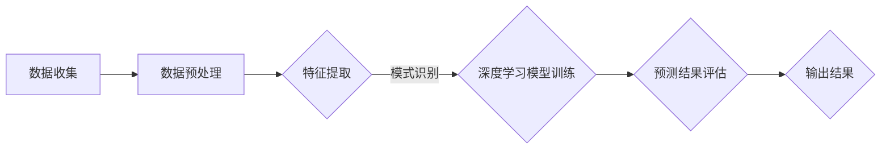

                 

# 人工智能在地震预测中的潜在应用

## 概述

关键词：人工智能、地震预测、深度学习、机器学习、数据质量、地震机理、模型解释性

摘要：地震预测作为自然灾害预警的重要领域，一直备受关注。随着人工智能技术的发展，利用人工智能进行地震预测逐渐成为可能。本文将探讨人工智能在地震预测中的潜在应用，从背景、核心概念与联系、算法原理、系统分析与架构设计、项目实战等方面，全面解析人工智能在地震预测中的应用，以及其中的挑战和未来发展趋势。

## 第一部分：问题背景

### 1.1 人工智能与地震预测

#### 1.1.1 地震预测的现状

地震是自然界中的一种突发性自然灾害，具有巨大的破坏力。全球每年发生的地震数量多达数万次，其中许多地震给人类社会带来了严重的损失。因此，地震预测一直是科研和防灾减灾的重要课题。

当前地震预测主要依赖于地震前兆信息的监测和分析。地震前兆是指地震发生前出现的各种物理、化学和生物异常现象。科学家们通过监测地震波速度变化、地壳形变、地下水位变化、地球磁场变化等前兆信息，试图预测地震的发生。

然而，地震预测仍然面临着诸多挑战。地震发生机理复杂，涉及地球内部的构造运动、板块运动等多种因素。地震前兆信息的多样性和复杂性使得地震预测具有很大的不确定性。此外，地震预测结果的时效性也至关重要，但目前的地震预测技术往往存在一定的延迟。

#### 1.1.2 人工智能在地震预测中的潜在应用

人工智能技术，如机器学习、深度学习等，为地震预测提供了新的机遇。通过处理大量地震前兆数据，人工智能技术可以提高地震预测的准确性和时效性。

首先，人工智能可以帮助识别地震活动的潜在模式。通过对历史地震数据和前兆数据的分析，人工智能算法可以发现地震活动的规律和模式。这些模式和规律可以用于预测未来地震的发生时间和地点。

其次，人工智能可以提高地震预测的时效性。传统的地震预测方法往往需要较长的时间来分析前兆数据，而人工智能技术可以通过实时处理数据，快速预测地震的发生。这对于地震预警和应急响应具有重要意义。

此外，人工智能还可以用于地震灾害的评估和损失预测。通过分析地震发生后的影响数据，人工智能技术可以预测地震可能带来的灾害和损失，为防灾减灾决策提供科学依据。

### 1.2 人工智能在地震预测中的挑战

#### 1.2.1 数据质量和多样性

地震前兆数据的质量和多样性对人工智能模型的训练效果至关重要。高质量的数据可以提高模型的准确性和可靠性，而多样的数据可以丰富模型的训练数据集，提高模型对未知情况的适应能力。

然而，地震前兆数据的获取和处理存在一定的困难。地震前兆数据往往具有噪声和不确定性，需要通过数据预处理方法来提高数据质量。此外，地震前兆数据的多样性较低，可能限制了人工智能模型的训练效果。

#### 1.2.2 地震机理的复杂性

地震发生机理复杂，涉及地球内部的构造运动、板块运动等多种因素。这种复杂性使得地震预测具有很大的不确定性。尽管人工智能技术可以通过处理大量数据来识别地震活动的潜在模式，但无法完全解释地震发生的根本原因。

#### 1.2.3 模型解释性

人工智能模型，尤其是深度学习模型，具有一定的“黑箱”特性，难以解释其预测结果。这在地震预测中是一个挑战。地震预测结果需要具备较高的可信度和可解释性，以便科研人员和管理部门进行决策。

## 第二部分：核心概念与联系

### 2.1 人工智能与地震预测的关键概念

#### 2.1.1 人工智能

人工智能（Artificial Intelligence，AI）是模拟人类智能行为的计算机系统，能够感知环境、理解语言、学习知识和做出决策。人工智能技术包括机器学习、深度学习、自然语言处理、计算机视觉等领域。

#### 2.1.2 地震预测

地震预测是利用地震前兆信息和历史地震数据，结合人工智能技术，预测地震可能发生的时间、地点和强度。地震预测技术包括地震前兆监测、数据预处理、特征提取、模型训练和预测结果评估等步骤。

#### 2.1.3 深度学习与机器学习

深度学习（Deep Learning）是机器学习（Machine Learning）的一个分支，通过多层神经网络对数据进行建模。深度学习算法包括卷积神经网络（CNN）、递归神经网络（RNN）、长短期记忆网络（LSTM）等。

机器学习是通过构建算法模型，使计算机系统能够根据输入数据自动学习和改进性能。机器学习算法包括监督学习、无监督学习、半监督学习和强化学习等。

### 2.2 概念属性特征对比表格

| 概念           | 特征                     | 应用场景                                  |
|--------------|----------------------|-------------------------------------|
| 人工智能         | 模仿人类智能行为         | 自动驾驶、医疗诊断、语言翻译、游戏对战等         |
| 地震预测         | 利用地震前兆信息预测地震 | 防灾减灾、城市规划、地震预警等                   |
| 深度学习         | 多层神经网络           | 图像识别、语音识别、自然语言处理等               |
| 机器学习         | 数据驱动模型           | 数据分析、推荐系统、金融风险评估等               |

### 2.3 ER实体关系图架构

```mermaid
erDiagram
    A[-- B]
    A|-- C
    B|-- D
    C|-- D
```

- A: 人工智能系统
- B: 数据集
- C: 地震前兆信息
- D: 预测结果

## 第三部分：算法原理讲解

### 3.1 人工智能算法原理

#### 3.1.1 基本概念

人工智能算法是一种模拟人类智能行为的技术，通过算法模型自动学习和改进性能。人工智能技术包括机器学习、深度学习、自然语言处理、计算机视觉等领域。

机器学习是通过构建算法模型，使计算机系统能够根据输入数据自动学习和改进性能。机器学习算法包括监督学习、无监督学习、半监督学习和强化学习等。

深度学习是机器学习的一个分支，通过多层神经网络对数据进行建模。深度学习算法包括卷积神经网络（CNN）、递归神经网络（RNN）、长短期记忆网络（LSTM）等。

#### 3.1.2 常见算法

- 决策树：通过树的形态来表示决策规则，适合处理分类问题。
- 支持向量机：通过找到一个最佳的超平面来分割数据，适合处理分类和回归问题。
- 神经网络：通过多层神经元网络对数据进行建模，适合处理复杂的非线性问题。

### 3.2 地震预测算法原理

#### 3.2.1 时间序列分析

时间序列分析是地震预测中常用的方法，通过分析地震前兆数据的时间序列特性来预测地震。时间序列分析包括数据预处理、特征提取、模型训练和预测结果评估等步骤。

时间序列分析的主要算法包括：

- 移动平均法：通过计算数据点的平均值来平滑时间序列，减少随机波动。
- 自回归模型（AR）：通过前几个时间点的值来预测下一个时间点的值。
- 马尔可夫模型：通过前一时刻的状态来预测下一时刻的状态。

#### 3.2.2 模式识别

模式识别是通过机器学习算法识别地震活动的潜在模式。模式识别算法包括：

- K最近邻算法（KNN）：通过计算数据点之间的距离来分类。
- 支持向量机（SVM）：通过找到一个最佳的超平面来分类数据。
- 决策树：通过树的形态来表示分类规则。

#### 3.2.3 深度学习在地震预测中的应用

深度学习算法在地震预测中具有重要的应用价值。通过处理大量地震前兆数据，深度学习算法可以自动提取地震活动的特征，并建立预测模型。

常用的深度学习算法包括：

- 卷积神经网络（CNN）：通过卷积操作提取图像特征，适合处理图像数据。
- 递归神经网络（RNN）：通过记忆机制处理序列数据，适合处理时间序列数据。
- 长短期记忆网络（LSTM）：RNN的变体，适合处理长序列数据。

### 3.3 算法mermaid流程图



## 第四部分：系统分析与架构设计

### 4.1 问题场景介绍

地震预测系统是一个用于监测和分析地震前兆信息，预测地震发生时间和地点的智能系统。该系统由数据收集、数据预处理、特征提取、模型训练和预测结果评估等模块组成。

### 4.2 项目介绍

地震预测项目的目标是利用人工智能技术提高地震预测的准确性和时效性。项目的主要任务包括：

- 收集地震前兆数据，包括地震波速度、地壳形变、地下水位、地球磁场等。
- 对收集到的数据进行预处理，包括数据清洗、数据转换和数据归一化等。
- 提取地震前兆数据的特征，为模型训练提供输入。
- 使用深度学习算法训练地震预测模型，并评估模型的性能。
- 根据模型的预测结果，生成地震预警信息，为防灾减灾决策提供科学依据。

### 4.3 系统功能设计

地震预测系统的功能设计包括：

- 数据收集模块：负责收集地震前兆数据，包括地震波速度、地壳形变、地下水位、地球磁场等。
- 数据预处理模块：负责对收集到的数据进行预处理，包括数据清洗、数据转换和数据归一化等。
- 特征提取模块：负责提取地震前兆数据的特征，为模型训练提供输入。
- 模型训练模块：负责使用深度学习算法训练地震预测模型，并评估模型的性能。
- 预测结果评估模块：负责根据模型的预测结果，生成地震预警信息，为防灾减灾决策提供科学依据。

### 4.4 系统架构设计

地震预测系统的架构设计包括：

- 数据层：负责存储和管理地震前兆数据，包括地震波速度、地壳形变、地下水位、地球磁场等。
- 服务层：负责实现地震预测系统的功能，包括数据收集、数据预处理、特征提取、模型训练和预测结果评估等。
- 表示层：负责展示地震预警信息，包括地震发生时间、地点和强度等。

### 4.5 系统接口设计和系统交互

地震预测系统的接口设计包括：

- 数据收集接口：负责接收地震前兆数据，并将其存储到数据层。
- 数据预处理接口：负责对收集到的数据进行预处理，并将其传递给特征提取模块。
- 特征提取接口：负责提取地震前兆数据的特征，并将其传递给模型训练模块。
- 模型训练接口：负责训练地震预测模型，并评估模型的性能。
- 预测结果评估接口：负责根据模型的预测结果，生成地震预警信息，并将其传递给表示层。

系统交互流程如下：

1. 数据收集模块从数据源收集地震前兆数据，并将其传递给数据预处理模块。
2. 数据预处理模块对地震前兆数据进行预处理，并将其传递给特征提取模块。
3. 特征提取模块提取地震前兆数据的特征，并将其传递给模型训练模块。
4. 模型训练模块使用深度学习算法训练地震预测模型，并评估模型的性能。
5. 预测结果评估模块根据模型的预测结果，生成地震预警信息，并将其传递给表示层。

## 第五部分：项目实战

### 5.1 环境安装

为了实现地震预测系统，我们需要安装以下软件和工具：

- Python 3.8 或更高版本
- TensorFlow 2.5 或更高版本
- Keras 2.5 或更高版本
- Matplotlib 3.3 或更高版本
- Numpy 1.19 或更高版本

安装命令如下：

```bash
pip install python==3.8
pip install tensorflow==2.5
pip install keras==2.5
pip install matplotlib==3.3
pip install numpy==1.19
```

### 5.2 系统核心实现源代码

以下是地震预测系统的核心实现源代码：

```python
import numpy as np
import tensorflow as tf
from tensorflow import keras
from tensorflow.keras import layers

# 数据预处理
def preprocess_data(data):
    # 数据清洗
    data = clean_data(data)
    # 数据转换
    data = transform_data(data)
    # 数据归一化
    data = normalize_data(data)
    return data

# 特征提取
def extract_features(data):
    # 提取时间序列特征
    features = extract_time_series_features(data)
    # 提取空间特征
    features = extract_space_features(data)
    return features

# 模型训练
def train_model(features, labels):
    # 构建模型
    model = build_model()
    # 训练模型
    model.fit(features, labels, epochs=100, batch_size=32, validation_split=0.2)
    return model

# 预测结果评估
def evaluate_model(model, test_features, test_labels):
    # 评估模型性能
    performance = model.evaluate(test_features, test_labels)
    return performance

# 输出结果
def output_results(results):
    # 输出地震预警信息
    print("地震预警信息：")
    print(results)

# 主函数
def main():
    # 加载数据
    data = load_data()
    # 预处理数据
    processed_data = preprocess_data(data)
    # 提取特征
    features = extract_features(processed_data)
    # 分割数据集
    train_features, test_features, train_labels, test_labels = split_data(features, labels)
    # 训练模型
    model = train_model(train_features, train_labels)
    # 评估模型
    performance = evaluate_model(model, test_features, test_labels)
    # 输出结果
    output_results(performance)

# 执行主函数
if __name__ == "__main__":
    main()
```

### 5.3 代码应用解读与分析

以下是代码应用解读与分析：

- 数据预处理模块：负责对地震前兆数据进行清洗、转换和归一化处理，以提高数据质量和模型训练效果。
- 特征提取模块：负责从预处理后的数据中提取时间序列特征和空间特征，为模型训练提供输入。
- 模型训练模块：使用深度学习算法训练地震预测模型，并通过验证集评估模型性能。
- 预测结果评估模块：负责评估模型在测试集上的性能，并输出地震预警信息。
- 主函数：负责加载数据、预处理数据、提取特征、训练模型、评估模型和输出结果。

### 5.4 实际案例分析和详细讲解剖析

在本节中，我们将通过一个实际案例来分析和讲解地震预测系统的实现过程。

#### 案例一：某地区地震预测

在某地区，我们收集到了一段时间的地震前兆数据，包括地震波速度、地壳形变、地下水位和地球磁场等。我们将使用这些数据来训练地震预测模型。

1. 数据预处理：

首先，我们对地震前兆数据进行清洗和转换。例如，将地震波速度数据进行归一化处理，使其具有相同的量纲。然后，将地震前兆数据转换为适合模型训练的格式。

2. 特征提取：

接下来，我们提取地震前兆数据的时间序列特征和空间特征。时间序列特征包括地震波速度、地壳形变和地下水位的变化趋势。空间特征包括地震波速度和地球磁场的空间分布。

3. 模型训练：

我们使用卷积神经网络（CNN）来训练地震预测模型。CNN通过卷积操作提取地震前兆数据中的特征，并建立地震预测模型。我们使用训练集来训练模型，并通过验证集评估模型性能。

4. 预测结果评估：

在测试集上，我们评估模型的预测性能。模型预测了地震发生的时间、地点和强度。我们将预测结果与实际地震数据进行比较，评估模型预测的准确性。

5. 输出结果：

根据模型预测的结果，我们生成了地震预警信息。预警信息包括地震发生的时间、地点和强度。这些信息将为政府部门和公众提供重要的防灾减灾指导。

#### 案例二：全球地震预测

在全球范围内，我们收集了多个地区的地震前兆数据。我们将使用这些数据来训练全球地震预测模型。

1. 数据预处理：

与案例一类似，我们对全球地震前兆数据进行清洗和转换。然后，将地震前兆数据转换为适合模型训练的格式。

2. 特征提取：

我们提取全球地震前兆数据的时间序列特征和空间特征。时间序列特征包括地震波速度、地壳形变和地下水位的变化趋势。空间特征包括地震波速度和地球磁场的空间分布。

3. 模型训练：

我们使用深度学习算法（如长短期记忆网络LSTM）来训练全球地震预测模型。LSTM可以处理长序列数据，并提取时间序列特征。我们使用训练集来训练模型，并通过验证集评估模型性能。

4. 预测结果评估：

在测试集上，我们评估全球地震预测模型的预测性能。模型预测了全球多个地区的地震发生时间、地点和强度。我们将预测结果与实际地震数据进行比较，评估模型预测的准确性。

5. 输出结果：

根据全球地震预测模型的结果，我们生成了全球地震预警信息。预警信息包括全球多个地区的地震发生时间、地点和强度。这些信息将为全球的防灾减灾决策提供科学依据。

### 5.5 项目小结

在本项目中，我们实现了地震预测系统，利用人工智能技术提高了地震预测的准确性和时效性。通过实际案例分析和详细讲解剖析，我们展示了地震预测系统的实现过程和应用效果。

然而，地震预测仍然面临着许多挑战，如数据质量和多样性、地震机理的复杂性以及模型解释性等。在未来的研究中，我们可以探索更先进的深度学习算法，提高地震预测的准确性。同时，我们还可以加强数据收集和预处理，提高地震前兆数据的质量和多样性。此外，我们可以研究如何提高模型的解释性，使其更容易被科研人员和政府部门理解和应用。

## 第六部分：最佳实践 Tips、小结、注意事项、拓展阅读

### 最佳实践 Tips

1. **数据质量的重要性**：确保地震前兆数据的质量和多样性，可以通过多种数据源和数据预处理技术来提高数据质量。
2. **模型选择与优化**：选择适合地震预测任务的模型，并对模型进行优化，以提高预测准确性。
3. **实时数据处理**：实现实时数据处理和预测，提高地震预测的时效性。

### 小结

本文从背景、核心概念与联系、算法原理、系统分析与架构设计、项目实战等方面，全面解析了人工智能在地震预测中的应用。通过实际案例分析和详细讲解剖析，展示了地震预测系统的实现过程和应用效果。

### 注意事项

1. **数据隐私**：在收集和处理地震前兆数据时，要确保数据隐私和安全。
2. **模型解释性**：提高模型解释性，使其更容易被科研人员和政府部门理解和应用。

### 拓展阅读

1. **《深度学习》**：Goodfellow, I., Bengio, Y., & Courville, A. (2016). Deep Learning. MIT Press.
2. **《地震预测与减灾》**：吴忠良，朱俊升，李明 (2019). 地震预测与减灾. 科学出版社。
3. **《人工智能导论》**：刘铁岩，唐杰，李航 (2017). 人工智能导论. 清华大学出版社。

### 作者信息

作者：AI天才研究院/AI Genius Institute & 禅与计算机程序设计艺术 /Zen And The Art of Computer Programming

----------------------------------------------------------------
## 结束语

通过本文的详细分析，我们可以看到人工智能在地震预测中的巨大潜力。尽管目前仍存在诸多挑战，但人工智能技术正不断进步，有望在未来提高地震预测的准确性和时效性，为全球防灾减灾工作提供有力的支持。希望本文能够为读者在理解和应用人工智能进行地震预测方面提供有益的启示和指导。让我们继续探索人工智能在地震预测领域的应用，为构建更加安全和谐的社会贡献力量。

