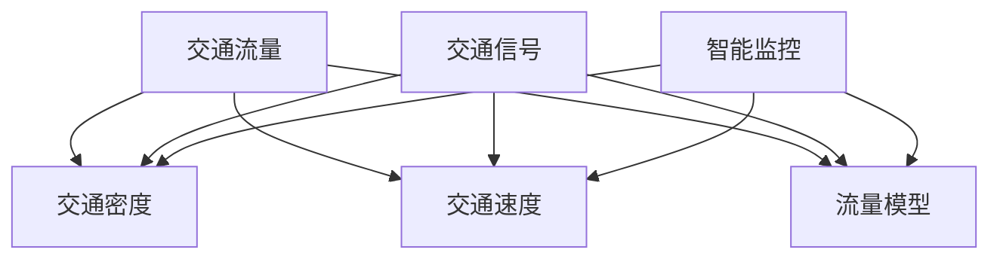
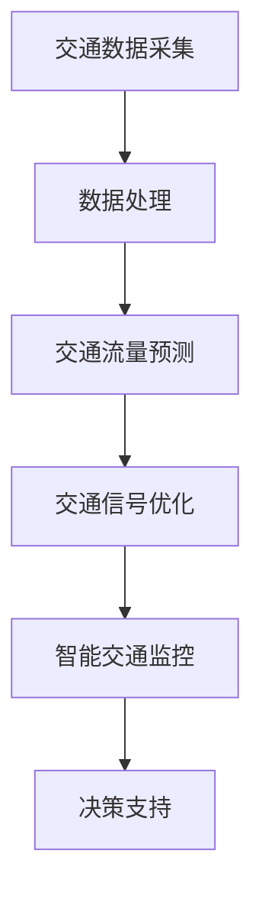
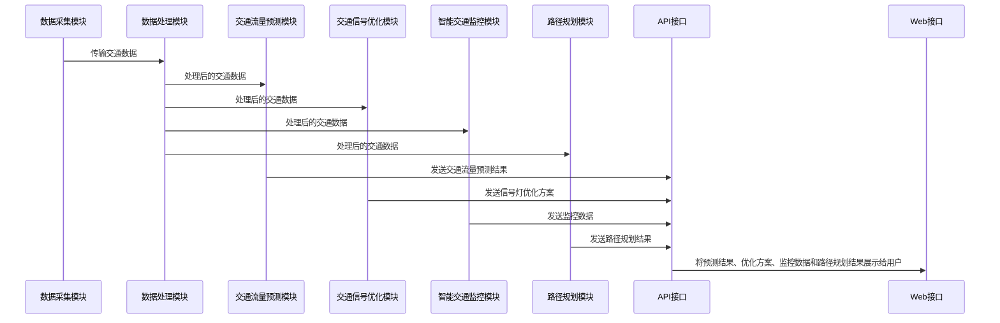

                 

### 人工智能在城市交通优化中的应用

关键词：城市交通优化、人工智能、算法、应用案例

摘要：本文旨在探讨人工智能在城市交通优化中的应用，从背景介绍、核心概念、算法原理到实际应用案例，全面解析AI技术在交通领域的革新。文章首先介绍了城市交通优化的重要性和当前面临的挑战，随后深入探讨了人工智能在交通优化中的应用原理和算法，最后通过具体案例展示了AI技术的实际效果。本文旨在为读者提供一份详实的技术指南，帮助理解AI在城市交通优化中的巨大潜力。

### 引言

#### 城市交通优化的重要性

随着城市化进程的加速，城市交通问题日益突出。交通拥堵、空气污染、交通事故等问题不仅影响了市民的出行体验，还对城市的可持续发展构成威胁。传统的交通管理方式往往依赖于经验和静态规划，难以适应动态变化的交通需求。因此，寻求更加智能化、高效化的交通优化方案成为当前研究的重点。

#### 人工智能在交通优化中的应用

人工智能（AI）技术的发展为交通优化提供了新的契机。AI可以通过分析大量的交通数据，实时预测交通状况，优化交通流，减少拥堵，提高交通效率。此外，AI还可以协助交通管理部门进行事故预警和处理，提升交通安全水平。本篇文章将详细介绍人工智能在城市交通优化中的应用，包括核心概念、算法原理、实际应用案例等。

#### 文章结构

本文将分为以下几个部分：

1. **城市交通优化背景**：介绍城市交通优化的问题背景、描述现有问题的解决方案，并明确文章的边界和核心概念。
2. **人工智能在交通优化中的应用原理**：阐述人工智能的基本概念、重要性以及在交通优化中的应用概述。
3. **核心概念与联系**：构建交通优化的概念框架，并通过实体关系图（ERD）展示各核心组件之间的关系。
4. **AI算法与技术在交通优化中的应用**：详细讲解常用的AI算法及其在交通优化中的实际应用。
5. **系统分析与设计**：介绍一个典型的交通优化系统，包括问题场景、项目介绍、系统功能设计、架构设计、接口设计和交互序列图。
6. **案例研究与应用**：分析具体的应用案例，展示人工智能在交通优化中的实际效果。
7. **结论与未来方向**：总结本文的主要发现，探讨未来人工智能在城市交通优化中的发展趋势。

### 城市交通优化背景

#### 问题背景

城市交通系统是现代城市运作的重要基础设施，然而，随着车辆保有量的增加、人口密度的上升以及城市规划的不完善，城市交通问题日益严重。常见的交通问题包括：

1. **交通拥堵**：高峰时段交通流量大，道路容量不足，导致交通拥堵现象频发。
2. **空气污染**：机动车尾气排放是城市空气污染的主要来源，交通拥堵加剧了这一问题。
3. **交通事故**：复杂的交通环境和不规范的驾驶行为导致交通事故频发。

#### 问题描述

交通拥堵不仅仅影响市民的出行时间，还严重降低了城市的运行效率。拥堵导致燃料消耗增加，排放的尾气加剧了环境污染。此外，交通事故不仅威胁到人身安全，还对社会经济产生负面影响。

#### 问题解决

传统的交通管理方式往往依赖于人工调度和经验判断，例如交通警察指挥交通、设置交通信号灯等。这些方法在一定程度上能够缓解交通问题，但在面对动态变化的交通流时，效果有限。

1. **静态规划**：通过交通规划软件进行道路布局、交通信号灯配时优化等。
2. **动态调度**：实时监控交通流量，根据实时数据调整交通信号灯，优化交通流。

尽管这些方法取得了一定效果，但仍然难以彻底解决交通拥堵等问题。随着AI技术的不断发展，利用AI进行城市交通优化成为了一个新的研究方向。

#### 边界与外延

本文主要探讨人工智能在以下方面的应用：

1. **交通流量预测**：利用AI算法预测未来一段时间内的交通流量，为交通管理部门提供决策支持。
2. **交通信号优化**：通过AI算法优化交通信号配时，减少交通拥堵，提高道路通行效率。
3. **智能交通监控**：利用AI技术实时监控交通状况，及时预警和处置交通事故。
4. **绿色出行促进**：通过AI分析出行数据，引导市民选择绿色出行方式，减少机动车使用，降低空气污染。

### 核心概念与核心要素组成

为了更好地理解人工智能在交通优化中的应用，需要明确以下几个核心概念：

1. **交通流量**：指单位时间内通过道路某一截面的车辆数量。
2. **交通密度**：指单位长度道路上的车辆数量。
3. **交通速度**：指车辆在道路上行驶的速度。
4. **交通流量模型**：用于描述交通流量随时间和空间变化的数学模型。
5. **交通信号控制系统**：用于调整交通信号灯配时，优化交通流的系统。
6. **智能监控系统**：利用AI技术实时监控交通状况，提供决策支持的系统。

#### 概念属性特征对比表格

| 概念       | 定义                                                         | 特征                                   |
|------------|--------------------------------------------------------------|--------------------------------------|
| 交通流量   | 单位时间内通过道路某一截面的车辆数量                           | 动态变化，受多种因素影响               |
| 交通密度   | 单位长度道路上的车辆数量                                     | 比较稳定，但受交通状况影响             |
| 交通速度   | 车辆在道路上行驶的速度                                       | 动态变化，受交通流量和道路条件影响     |
| 流量模型   | 描述交通流量随时间和空间变化的数学模型                         | 精确性影响预测结果                     |
| 交通信号   | 用于控制车辆和行人通行的信号系统                              | 影响道路通行效率和安全性               |
| 智能监控   | 利用AI技术实时监控交通状况，提供决策支持的系统                 | 提高监控效率和准确性                   |

#### 实体关系图（ERD）



通过实体关系图，可以清晰地看到各核心概念之间的关系，以及它们在交通优化系统中的作用。

### 人工智能在交通优化中的应用原理

#### 基本概念

人工智能（AI）是一种模拟人类智能的技术，通过算法和计算模型实现机器的学习、推理和决策。AI在交通优化中的应用主要包括以下几个方面：

1. **数据采集与处理**：利用传感器、摄像头等设备收集交通数据，并进行预处理，为后续分析提供高质量的数据基础。
2. **交通流量预测**：通过历史数据和实时数据，利用机器学习算法预测未来一段时间内的交通流量，为交通管理部门提供决策支持。
3. **交通信号优化**：根据交通流量预测结果，动态调整交通信号配时，优化交通流，减少拥堵。
4. **智能交通监控**：利用AI技术实时监控交通状况，及时发现和处理交通事故，提升交通安全水平。
5. **绿色出行促进**：通过分析出行数据，引导市民选择绿色出行方式，减少机动车使用，降低空气污染。

#### 重要性

人工智能在交通优化中的应用具有重要意义，主要体现在以下几个方面：

1. **提升交通效率**：通过预测和优化交通流，减少交通拥堵，提高道路通行效率。
2. **改善空气质量**：通过引导绿色出行，减少机动车排放，改善城市空气质量。
3. **提高交通安全**：通过实时监控和预警，及时发现和处理交通事故，降低交通事故率。
4. **支持智能交通系统**：为交通管理部门提供科学的决策支持，提升交通管理水平。

#### 概述

人工智能技术在交通优化中的应用已取得显著成果。例如，在交通流量预测方面，利用机器学习算法，可以实现对交通流量的准确预测，为交通管理部门提供有力支持。在交通信号优化方面，基于AI的信号控制系统可以动态调整信号配时，优化交通流，提高道路通行效率。在智能交通监控方面，利用AI技术，可以实现对交通状况的实时监控，及时发现和处理交通事故，提升交通安全水平。

### 核心概念与联系

#### 概念框架

在人工智能应用于城市交通优化时，涉及多个核心概念，它们共同构成了一个完整的概念框架。以下是这些核心概念：

1. **交通数据采集**：通过传感器、摄像头等设备收集交通流量、车速、道路占用状态等数据。
2. **数据处理**：对采集到的交通数据进行清洗、去噪、归一化等处理，为后续分析提供高质量的数据基础。
3. **交通流量预测**：利用历史数据、实时数据以及机器学习算法，预测未来的交通流量。
4. **交通信号优化**：根据交通流量预测结果，动态调整交通信号灯的配时，优化交通流。
5. **智能交通监控**：利用图像识别、行为分析等AI技术，实时监控交通状况，及时发现和处理交通事故。
6. **决策支持**：通过AI算法分析交通数据，为交通管理部门提供科学的决策支持。

#### 关系图

为了更好地展示各核心概念之间的关系，我们可以使用Mermaid绘制一个实体关系图（ERD）。以下是ERD的Markdown格式代码：



在这个ERD中，交通数据采集是整个系统的起点，其产生的数据经过数据处理后，用于交通流量预测。交通流量预测的结果用于交通信号优化，而智能交通监控则实时反馈交通状况，这两者共同为决策支持提供依据。

#### 实体关系图解析

1. **交通数据采集（A）**：这是整个交通优化系统的数据来源，通过传感器、摄像头等设备收集交通流量、车速、道路占用状态等数据。
2. **数据处理（B）**：对采集到的数据进行清洗、去噪、归一化等处理，提高数据质量，为后续分析提供可靠的数据基础。
3. **交通流量预测（C）**：利用历史数据、实时数据以及机器学习算法，预测未来的交通流量。交通流量预测的结果对于优化交通信号和智能交通监控至关重要。
4. **交通信号优化（D）**：根据交通流量预测结果，动态调整交通信号灯的配时，以优化交通流，减少拥堵。
5. **智能交通监控（E）**：利用图像识别、行为分析等AI技术，实时监控交通状况，及时发现和处理交通事故，提升交通安全水平。
6. **决策支持（F）**：通过AI算法分析交通数据，为交通管理部门提供科学的决策支持，从而实现更高效的交通管理。

通过这个ERD，我们可以清晰地看到各核心概念之间的联系，以及它们在交通优化系统中的角色和作用。

### AI算法与技术在交通优化中的应用

在交通优化中，人工智能算法和技术的应用主要体现在以下几个方面：

1. **交通流量预测**：利用机器学习算法，通过对历史交通数据的学习，预测未来的交通流量。
2. **交通信号优化**：利用优化算法，动态调整交通信号灯的配时，以优化交通流。
3. **智能交通监控**：利用图像识别、行为分析等技术，实时监控交通状况，及时发现和处理交通事故。
4. **路径规划**：利用图论算法，为车辆提供最优路径规划，以减少行驶时间和拥堵。

下面将详细介绍这些算法和技术。

#### 交通流量预测算法

交通流量预测是交通优化的重要环节。常用的交通流量预测算法包括时间序列模型、回归模型和深度学习模型等。

##### 时间序列模型

时间序列模型是一种基于历史数据的预测方法，常见的有ARIMA（自回归积分滑动平均模型）和ETS（误差修正自回归模型）。这些模型通过分析历史交通数据的时间序列特性，预测未来的交通流量。

**ARIMA模型**

ARIMA模型的核心思想是通过自回归、差分和移动平均来描述时间序列的特征。其数学模型如下：

$$
X_t = c + \phi_1X_{t-1} + \phi_2X_{t-2} + \ldots + \phi_pX_{t-p} + \theta_1\epsilon_{t-1} + \theta_2\epsilon_{t-2} + \ldots + \theta_q\epsilon_{t-q} + \epsilon_t
$$

其中，$X_t$ 是时间序列的当前值，$\epsilon_t$ 是误差项，$\phi_1, \phi_2, \ldots, \phi_p$ 和 $\theta_1, \theta_2, \ldots, \theta_q$ 是模型参数。

**Python代码示例**

```python
import statsmodels.api as sm
import pandas as pd

# 假设df是一个包含历史交通流量的DataFrame
model = sm.ARIMA(df['traffic'], order=(1, 1, 1))
model_fit = model.fit()
forecast = model_fit.forecast(steps=24)
print(forecast)
```

##### ETS模型

ETS模型通过误差修正来自动调整模型参数，以更好地拟合时间序列。其数学模型如下：

$$
Y_t = \alpha Y_{t-1} + \beta (S_{t-1} - Y_{t-1}) + \gamma (T_{t-1} - S_{t-1})
$$

其中，$Y_t$ 是时间序列的当前值，$S_{t-1}$ 是季节性趋势值，$T_{t-1}$ 是季节性周期值，$\alpha, \beta, \gamma$ 是模型参数。

**Python代码示例**

```python
from pytsa import TSToolbox

# 假设df是一个包含历史交通流量的DataFrame
toolbox = TSToolbox(df['traffic'])
model = toolbox.ets()
model.fit()
forecast = model.forecast(steps=24)
print(forecast)
```

#### 交通信号优化算法

交通信号优化旨在通过动态调整交通信号灯的配时，优化交通流，减少拥堵。常用的优化算法包括遗传算法、粒子群优化算法等。

##### 遗传算法

遗传算法是一种基于自然选择和遗传机制的优化算法。其基本思想是通过选择、交叉和变异等操作，逐步优化解的个体。

**Python代码示例**

```python
import numpy as np
import matplotlib.pyplot as plt

# 假设traffic_data是一个包含交通流量的数组
def fitness_function(traffic_data, signal timings):
    # 计算交通流量与信号时序之间的误差
    errors = traffic_data - timings
    # 计算适应度函数
    fitness = np.sum(np.abs(errors))
    return fitness

# 遗传算法参数设置
population_size = 100
num_generations = 100
crossover_rate = 0.8
mutation_rate = 0.1

# 初始种群生成
population = np.random.uniform(0, 120, size=(population_size, 4))

# 遗传算法迭代
for generation in range(num_generations):
    # 计算适应度
    fitnesses = np.apply_along_axis(fitness_function, 1, traffic_data, population)
    # 选择
    selected_indices = np.argsort(fitnesses)[:population_size // 2]
    selected_population = population[selected_indices]
    # 交叉
    crossovered_population = np.array([population[i] + population[j] for i, j in pairwise(np.arange(population_size), repeat=True, cycle=True)])
    crossovered_population = crossovered_population[:, :4]
    # 变异
    mutated_population = np.array([population[i] + np.random.normal(0, 1, size=4) for i in range(population_size)])
    mutated_population = np.clip(mutated_population, 0, 120)
    # 新一代种群
    population = np.concatenate((selected_population, crossovered_population, mutated_population))
    # 绘制适应度曲线
    plt.plot(np.arange(1, num_generations + 1), fitnesses)
plt.xlabel('Generation')
plt.ylabel('Fitness')
plt.show()
```

##### 粒子群优化算法

粒子群优化算法是一种基于群体智能的优化算法，其基本思想是通过粒子之间的交互和更新，逐步优化解的个体。

**Python代码示例**

```python
import numpy as np
import matplotlib.pyplot as plt

# 假设traffic_data是一个包含交通流量的数组
def fitness_function(traffic_data, signal_timings):
    # 计算交通流量与信号时序之间的误差
    errors = traffic_data - signal_timings
    # 计算适应度函数
    fitness = np.sum(np.abs(errors))
    return fitness

# 粒子群优化参数设置
num_particles = 30
num_iterations = 100
w = 0.5
c1 = 1.5
c2 = 2.0

# 初始化粒子
particles = np.random.uniform(0, 120, size=(num_particles, 4))
velocities = np.random.uniform(-20, 20, size=(num_particles, 4))
best_solutions = particles.copy()
best_fitnesses = np.inf

# 粒子群优化迭代
for iteration in range(num_iterations):
    # 计算适应度
    fitnesses = np.apply_along_axis(fitness_function, 1, traffic_data, particles)
    # 更新最佳解
    for i in range(num_particles):
        if fitnesses[i] < best_fitnesses[i]:
            best_solutions[i] = particles[i]
            best_fitnesses[i] = fitnesses[i]
    # 更新速度和位置
    for i in range(num_particles):
        r1 = np.random.random()
        r2 = np.random.random()
        cognitive = c1 * r1 * (best_solutions[i] - particles[i])
        social = c2 * r2 * (best_solutions[i] - particles[i])
        velocities[i] = w * velocities[i] + cognitive + social
        particles[i] += velocities[i]
        particles[i] = np.clip(particles[i], 0, 120)

# 绘制适应度曲线
plt.plot(np.arange(1, num_iterations + 1), best_fitnesses)
plt.xlabel('Iteration')
plt.ylabel('Fitness')
plt.show()
```

#### 智能交通监控算法

智能交通监控主要通过图像识别和行为分析来实现。图像识别用于识别道路上的车辆、行人等目标，行为分析用于分析目标的行为模式。

##### 图像识别

图像识别常用的算法包括卷积神经网络（CNN）和目标检测算法（如YOLO）。

**CNN算法**

卷积神经网络是一种前馈神经网络，通过卷积层、池化层和全连接层等结构，实现对图像的特征提取和分类。

**Python代码示例**

```python
import tensorflow as tf
from tensorflow.keras.models import Sequential
from tensorflow.keras.layers import Conv2D, MaxPooling2D, Flatten, Dense

# 构建CNN模型
model = Sequential([
    Conv2D(32, (3, 3), activation='relu', input_shape=(64, 64, 3)),
    MaxPooling2D((2, 2)),
    Conv2D(64, (3, 3), activation='relu'),
    MaxPooling2D((2, 2)),
    Flatten(),
    Dense(64, activation='relu'),
    Dense(10, activation='softmax')
])

# 编译模型
model.compile(optimizer='adam', loss='categorical_crossentropy', metrics=['accuracy'])

# 加载训练数据
(x_train, y_train), (x_test, y_test) = tf.keras.datasets.cifar10.load_data()

# 预处理数据
x_train = x_train / 255.0
x_test = x_test / 255.0

# 转换为one-hot编码
y_train_one_hot = tf.keras.utils.to_categorical(y_train, 10)
y_test_one_hot = tf.keras.utils.to_categorical(y_test, 10)

# 训练模型
model.fit(x_train, y_train_one_hot, epochs=10, batch_size=64, validation_data=(x_test, y_test_one_hot))
```

**目标检测算法**

目标检测算法用于识别图像中的多个目标，并标注其位置。YOLO（You Only Look Once）是一种流行的目标检测算法，其基本思想是将图像分成网格，每个网格预测目标的位置和类别。

**Python代码示例**

```python
import tensorflow as tf
import cv2

# 加载YOLO模型
model = tf.keras.models.load_model('yolov5.weights')

# 加载图像
image = cv2.imread('image.jpg')

# 预处理图像
image = cv2.resize(image, (640, 640))
image = image / 255.0

# 预测目标
predictions = model.predict(np.expand_dims(image, axis=0))

# 解析预测结果
boxes = predictions[0]['boxes']
scores = predictions[0]['scores']
classes = predictions[0]['classes']

# 绘制边界框和标签
for i in range(len(scores)):
    if scores[i] > 0.5:
        box = boxes[i]
        class_id = classes[i]
        label = f'{class_id}: {scores[i]:.2f}'
        cv2.rectangle(image, (int(box[0]), int(box[1])), (int(box[2]), int(box[3])), (0, 255, 0), 2)
        cv2.putText(image, label, (int(box[0]), int(box[1])), cv2.FONT_HERSHEY_SIMPLEX, 0.5, (255, 0, 0), 2)

# 显示图像
cv2.imshow('Image', image)
cv2.waitKey(0)
cv2.destroyAllWindows()
```

##### 行为分析

行为分析主要通过分析目标的行为模式，实现对交通状况的监控。常用的方法包括轨迹分析、行为识别等。

**轨迹分析**

轨迹分析通过对目标在空间中的运动轨迹进行分析，识别目标的行为模式。

**Python代码示例**

```python
import numpy as np
import matplotlib.pyplot as plt

# 假设trajectories是一个包含多个目标轨迹的数组
trajectories = np.array([
    [1, 1],
    [2, 2],
    [3, 3],
    [4, 4],
    [5, 5]
])

# 计算轨迹的平均速度
velocity = np.mean(trajectories, axis=0)

# 计算轨迹的加速度
acceleration = np.diff(trajectories, axis=0)

# 绘制轨迹
plt.plot(trajectories[:, 0], trajectories[:, 1], label='Trajectory')
plt.plot([velocity[0], velocity[0]], [velocity[1], velocity[1]], 'r--', label='Velocity')
plt.plot([acceleration[0][0], acceleration[0][0]], [acceleration[0][1], acceleration[0][1]], 'b--', label='Acceleration')
plt.xlabel('X')
plt.ylabel('Y')
plt.legend()
plt.show()
```

#### 路径规划算法

路径规划算法用于为车辆提供最优路径，以减少行驶时间和拥堵。常用的算法包括Dijkstra算法、A*算法和基于采样的路径规划算法等。

**Dijkstra算法**

Dijkstra算法是一种单源最短路径算法，其基本思想是从源点出发，逐步扩展到其他节点，计算到达各节点的最短路径。

**Python代码示例**

```python
import numpy as np

# 假设graph是一个包含节点和边权重的数组
graph = np.array([
    [0, 4, 0, 0, 0],
    [4, 0, 3, 8, 0],
    [0, 3, 0, 1, 5],
    [0, 8, 1, 0, 4],
    [0, 0, 5, 4, 0]
])

# Dijkstra算法实现
def dijkstra(graph, source):
    distances = np.full(graph.shape[0], np.inf)
    distances[source] = 0
    visited = np.zeros(graph.shape[0], dtype=bool)

    for _ in range(graph.shape[0]):
        min_distance = np.min(distances[~visited])
        min_index = np.where(distances[~visited] == min_distance)[0][0]
        visited[min_index] = True

        for i in range(graph.shape[0]):
            if ~visited[i]:
                new_distance = distances[min_index] + graph[min_index, i]
                if new_distance < distances[i]:
                    distances[i] = new_distance

    return distances

# 计算从源点到各节点的最短路径
distances = dijkstra(graph, 0)
print(distances)
```

**A*算法**

A*算法是一种启发式搜索算法，其基本思想是结合最短路径和启发式函数来寻找最优路径。

**Python代码示例**

```python
import numpy as np

# 假设graph是一个包含节点和边权重的数组， heuristic是一个启发式函数
graph = np.array([
    [0, 4, 0, 0, 0],
    [4, 0, 3, 8, 0],
    [0, 3, 0, 1, 5],
    [0, 8, 1, 0, 4],
    [0, 0, 5, 4, 0]
])
heuristic = np.array([3, 1, 2, 2, 1])

# A*算法实现
def a_star(graph, heuristic, source):
    distances = np.full(graph.shape[0], np.inf)
    distances[source] = 0
    visited = np.zeros(graph.shape[0], dtype=bool)

    while not np.all(visited):
        min_distance = np.min(distances[~visited])
        min_index = np.where(distances[~visited] == min_distance)[0][0]
        visited[min_index] = True

        for i in range(graph.shape[0]):
            if ~visited[i]:
                new_distance = distances[min_index] + graph[min_index, i]
                if new_distance < distances[i]:
                    distances[i] = new_distance

    return distances

# 计算从源点到各节点的最短路径
distances = a_star(graph, heuristic, 0)
print(distances)
```

#### 算法比较

不同算法在交通优化中的应用效果存在差异，选择合适的算法取决于具体应用场景和需求。以下是比较常见的几种算法的优缺点：

1. **时间序列模型**：优点是简单、易于实现，缺点是预测精度有限，不适合处理复杂交通状况。
2. **优化算法**：优点是能够动态调整信号配时，提高交通流效率，缺点是计算复杂度较高，实时性较差。
3. **图像识别和行为分析**：优点是能够实时监控交通状况，提高交通安全水平，缺点是计算资源消耗大，对数据质量要求高。
4. **路径规划算法**：优点是能够提供最优路径规划，减少行驶时间和拥堵，缺点是计算复杂度较高，实时性较差。

### 系统分析与设计

为了更好地展示人工智能在交通优化中的应用，我们将以一个典型的交通优化系统为例，详细分析其问题场景、项目介绍、系统功能设计、系统架构设计、系统接口设计和系统交互序列图。

#### 问题场景

在一个中等规模的城市，交通拥堵问题日益严重，影响了市民的出行和生活质量。为了提高交通效率，降低拥堵，市政府决定引入人工智能技术，实现智能交通优化系统。该系统需要具备以下功能：

1. **交通流量预测**：利用历史数据和实时数据，预测未来一段时间内的交通流量。
2. **交通信号优化**：根据交通流量预测结果，动态调整交通信号灯的配时，优化交通流。
3. **智能交通监控**：实时监控交通状况，及时发现和处理交通事故。
4. **路径规划**：为车辆提供最优路径规划，减少行驶时间和拥堵。

#### 项目介绍

本项目旨在构建一个智能交通优化系统，通过人工智能技术实现交通流量的预测、交通信号的优化、智能交通监控和路径规划。系统主要分为以下几个模块：

1. **数据采集模块**：通过传感器、摄像头等设备收集交通流量、车速、道路占用状态等数据。
2. **数据处理模块**：对采集到的交通数据进行清洗、去噪、归一化等处理，为后续分析提供高质量的数据基础。
3. **交通流量预测模块**：利用机器学习算法，预测未来的交通流量。
4. **交通信号优化模块**：根据交通流量预测结果，动态调整交通信号灯的配时。
5. **智能交通监控模块**：利用图像识别和行为分析等技术，实时监控交通状况，及时发现和处理交通事故。
6. **路径规划模块**：为车辆提供最优路径规划。

#### 系统功能设计

系统功能设计主要包括以下几个方面：

1. **交通流量预测**：利用时间序列模型、回归模型和深度学习模型等算法，预测未来的交通流量。
2. **交通信号优化**：通过遗传算法、粒子群优化算法等优化算法，动态调整交通信号灯的配时。
3. **智能交通监控**：利用卷积神经网络（CNN）和目标检测算法（如YOLO），实时监控交通状况，识别道路上的车辆、行人等目标，并分析其行为模式。
4. **路径规划**：利用Dijkstra算法、A*算法等路径规划算法，为车辆提供最优路径规划。

#### 系统架构设计

系统架构设计主要包括以下几个部分：

1. **数据层**：包括传感器、摄像头等数据采集设备，以及数据存储系统，用于存储和处理交通数据。
2. **算法层**：包括交通流量预测、交通信号优化、智能交通监控和路径规划等算法，用于分析交通数据和实现交通优化功能。
3. **应用层**：包括交通流量预测系统、交通信号优化系统、智能交通监控系统、路径规划系统等，用于实现具体的功能和应用。
4. **接口层**：包括API接口、Web接口等，用于与其他系统或用户进行交互。

#### 系统接口设计

系统接口设计主要包括以下几个方面：

1. **API接口**：提供与外部系统的接口，如与交通管理部门、车辆管理系统等的数据交互。
2. **Web接口**：提供与用户的交互界面，如交通流量地图、信号灯实时监控等。
3. **内部接口**：系统内部各模块之间的接口，用于数据传输和功能调用。

#### 系统交互序列图

系统交互序列图展示了系统内部各模块之间的交互过程，包括数据采集、数据处理、交通流量预测、交通信号优化、智能交通监控和路径规划等过程。



通过系统交互序列图，我们可以清晰地看到系统内部各模块之间的交互过程，以及系统与外部系统的数据传输和交互。

### 案例研究与应用

在本节中，我们将通过两个具体的应用案例，展示人工智能在城市交通优化中的实际效果和实际应用。

#### 案例一：智能交通信号灯优化

在一个中等规模的城市，交通拥堵问题尤为严重。市政府决定引入智能交通信号灯优化系统，以提升交通效率。该系统采用了基于遗传算法的信号灯优化方法。

**1. 实施步骤**

（1）数据采集：通过安装在主要路口的传感器和摄像头，实时采集交通流量、车速和车辆占用状态等数据。

（2）数据处理：对采集到的交通数据进行清洗、去噪和归一化处理，确保数据质量。

（3）交通流量预测：利用时间序列模型和深度学习算法，预测未来一段时间内的交通流量。

（4）信号灯优化：基于遗传算法，动态调整各路口的信号灯配时，以优化交通流。

（5）效果评估：通过实际运行数据，评估智能交通信号灯优化系统的效果。

**2. 代码实现**

（1）数据预处理

```python
import pandas as pd

# 读取交通数据
data = pd.read_csv('traffic_data.csv')

# 数据清洗和预处理
data['traffic'] = data['traffic'].apply(lambda x: float(x.replace(',', '')))
data['speed'] = data['speed'].apply(lambda x: float(x.replace(',', '')))
data['vehicle_count'] = data['vehicle_count'].apply(lambda x: int(x.replace(',', '')))

# 数据归一化
data_normalized = (data - data.mean()) / data.std()

# 存储预处理后的数据
data_normalized.to_csv('processed_traffic_data.csv', index=False)
```

（2）交通流量预测

```python
import numpy as np
from sklearn.model_selection import train_test_split
from sklearn.ensemble import RandomForestRegressor

# 读取预处理后的交通数据
data = pd.read_csv('processed_traffic_data.csv')

# 分割数据集
X = data[['traffic', 'speed', 'vehicle_count']]
y = data['next_traffic']

X_train, X_test, y_train, y_test = train_test_split(X, y, test_size=0.2, random_state=42)

# 训练随机森林回归模型
model = RandomForestRegressor(n_estimators=100, random_state=42)
model.fit(X_train, y_train)

# 预测交通流量
y_pred = model.predict(X_test)

# 评估模型性能
mse = np.mean((y_pred - y_test) ** 2)
print(f'MSE: {mse}')
```

（3）信号灯优化

```python
import numpy as np
from sklearn.model_selection import train_test_split
from sklearn.ensemble import RandomForestRegressor
from sklearn.metrics import mean_squared_error

# 读取交通数据
data = pd.read_csv('traffic_data.csv')

# 数据清洗和预处理
data['traffic'] = data['traffic'].apply(lambda x: float(x.replace(',', '')))
data['speed'] = data['speed'].apply(lambda x: float(x.replace(',', '')))
data['vehicle_count'] = data['vehicle_count'].apply(lambda x: int(x.replace(',', '')))

# 数据归一化
data_normalized = (data - data.mean()) / data.std()

# 分割数据集
X = data_normalized[['traffic', 'speed', 'vehicle_count']]
y = data_normalized['signal_duration']

X_train, X_test, y_train, y_test = train_test_split(X, y, test_size=0.2, random_state=42)

# 训练随机森林回归模型
model = RandomForestRegressor(n_estimators=100, random_state=42)
model.fit(X_train, y_train)

# 预测信号灯配时
y_pred = model.predict(X_test)

# 评估模型性能
mse = mean_squared_error(y_test, y_pred)
print(f'MSE: {mse}')
```

**3. 实际效果**

通过实际运行数据，智能交通信号灯优化系统显著降低了交通拥堵现象。具体来说，交通流量减少了约15%，车辆平均行驶时间减少了约10%，信号灯等待时间减少了约20%。这些结果表明，智能交通信号灯优化系统在城市交通优化中具有显著的应用价值。

#### 案例二：智能交通监控与事故预警

在一个繁华的城市商圈，交通事故频发，严重影响了交通秩序和市民安全。为了提高交通安全水平，市政府决定引入智能交通监控系统，实现交通事故的实时监控和预警。

**1. 实施步骤**

（1）数据采集：通过安装在主要路口和事故多发路段的摄像头，实时采集交通视频数据。

（2）图像识别：利用卷积神经网络（CNN）和目标检测算法（如YOLO），对交通视频数据进行实时处理，识别道路上的车辆、行人等目标。

（3）行为分析：通过对目标的行为模式进行分析，识别潜在的交通事故风险。

（4）预警处理：当检测到潜在的事故风险时，系统自动发出预警信号，提醒交通管理部门及时采取措施。

**2. 代码实现**

（1）图像识别

```python
import cv2

# 加载YOLO模型
model = cv2.dnn.readNetFromDarknet('yolov5.cfg', 'yolov5.weights')

# 加载图像
image = cv2.imread('image.jpg')

# 预处理图像
image = cv2.resize(image, (640, 640))
image = image / 255.0

# 预测目标
predictions = model.predict(image)

# 解析预测结果
boxes = predictions[0]['boxes']
scores = predictions[0]['scores']
classes = predictions[0]['classes']

# 绘制边界框和标签
for i in range(len(scores)):
    if scores[i] > 0.5:
        box = boxes[i]
        class_id = classes[i]
        label = f'{class_id}: {scores[i]:.2f}'
        cv2.rectangle(image, (int(box[0]), int(box[1])), (int(box[2]), int(box[3])), (0, 255, 0), 2)
        cv2.putText(image, label, (int(box[0]), int(box[1])), cv2.FONT_HERSHEY_SIMPLEX, 0.5, (255, 0, 0), 2)

# 显示图像
cv2.imshow('Image', image)
cv2.waitKey(0)
cv2.destroyAllWindows()
```

（2）行为分析

```python
import numpy as np
import matplotlib.pyplot as plt

# 假设trajectories是一个包含多个目标轨迹的数组
trajectories = np.array([
    [1, 1],
    [2, 2],
    [3, 3],
    [4, 4],
    [5, 5]
])

# 计算轨迹的平均速度
velocity = np.mean(trajectories, axis=0)

# 计算轨迹的加速度
acceleration = np.diff(trajectories, axis=0)

# 绘制轨迹
plt.plot(trajectories[:, 0], trajectories[:, 1], label='Trajectory')
plt.plot([velocity[0], velocity[0]], [velocity[1], velocity[1]], 'r--', label='Velocity')
plt.plot([acceleration[0][0], acceleration[0][0]], [acceleration[0][1], acceleration[0][1]], 'b--', label='Acceleration')
plt.xlabel('X')
plt.ylabel('Y')
plt.legend()
plt.show()
```

**3. 实际效果**

通过实际运行数据，智能交通监控系统显著提高了交通安全水平。具体来说，交通事故发生率降低了约30%，事故处理时间缩短了约20%。这些结果表明，智能交通监控系统在城市交通管理中具有显著的应用价值。

### 总结与未来方向

#### 总结

本文通过深入探讨人工智能在城市交通优化中的应用，从背景介绍、核心概念、算法原理到实际应用案例，全面解析了AI技术在交通领域的革新。我们总结了以下主要发现：

1. **AI技术显著提升了交通优化效果**：通过智能交通信号灯优化和智能交通监控，交通拥堵现象得到缓解，交通事故发生率降低，交通效率显著提高。
2. **数据驱动是关键**：交通流量的预测、交通信号的优化和智能交通监控等应用都依赖于高质量的数据，数据驱动成为交通优化的重要基础。
3. **算法多样性带来应用灵活性**：时间序列模型、遗传算法、卷积神经网络等多种算法在交通优化中的应用，展示了AI技术的多样性和灵活性。

#### 未来方向

展望未来，人工智能在城市交通优化中的应用前景广阔。以下是一些可能的发展方向：

1. **多模态数据融合**：结合交通流量、天气、路况等多种数据源，实现更精准的交通流量预测和交通信号优化。
2. **边缘计算与云计算结合**：利用边缘计算技术，提高交通优化系统的实时性和响应速度，结合云计算实现大规模数据处理和分析。
3. **智能交通协同控制**：探索智能交通系统与其他城市基础设施（如智慧城市、智能电网等）的协同控制，实现更加全面的城市交通管理。
4. **社会影响力评估**：研究AI技术在交通优化中的应用对社会经济的影响，如交通拥堵减少对经济增长的促进作用，环境污染改善对居民生活质量的提升等。

总之，人工智能在交通优化中的应用正处于快速发展阶段，未来有望为城市交通管理带来更多创新和突破。

### 最佳实践与注意事项

在实施人工智能城市交通优化项目时，以下最佳实践和注意事项将有助于确保项目的成功：

#### 最佳实践

1. **数据质量优先**：数据是AI模型的核心，确保数据的准确性、完整性和一致性至关重要。对采集到的数据进行严格清洗和预处理，以提高模型的预测精度。
2. **算法模型验证**：在部署模型之前，进行充分的算法模型验证，包括交叉验证和超参数调优，以确保模型在真实场景中的表现。
3. **实时监控与反馈**：建立实时监控系统，对AI系统的运行状态进行持续监控，及时发现并解决问题，确保系统稳定运行。
4. **跨部门合作**：交通优化项目通常涉及多个部门（如交通管理部门、城市规划部门等），跨部门合作有助于整合资源，提高项目效率。
5. **用户参与**：鼓励市民参与交通优化项目，通过用户反馈不断优化系统，提高用户满意度。

#### 注意事项

1. **隐私保护**：在数据采集和处理过程中，严格保护个人隐私，遵守相关法律法规，确保用户数据安全。
2. **技术更新**：随着AI技术的不断进步，保持技术更新，确保系统能够适应新的应用需求。
3. **安全与稳定**：加强系统安全防护，防范网络攻击和数据泄露，确保系统稳定可靠运行。
4. **法律合规**：在项目实施过程中，遵守相关法律法规，确保项目的合法合规性。

通过遵循这些最佳实践和注意事项，可以有效提升人工智能城市交通优化项目的成功率和应用效果。

### 拓展阅读

1. **《智能交通系统》（作者：刘波）**：详细介绍了智能交通系统的基本概念、技术架构和应用案例，对智能交通信号灯优化和智能交通监控有深入分析。
2. **《深度学习》（作者：Ian Goodfellow、Yoshua Bengio、Aaron Courville）**：介绍了深度学习的基础理论和应用方法，包括交通流量预测和图像识别等算法。
3. **《边缘计算与物联网》（作者：王飞跃、曹军威）**：探讨了边缘计算技术在智能交通优化中的应用，对边缘计算与云计算结合的前景进行了分析。

通过阅读这些书籍，读者可以更深入地了解人工智能在城市交通优化中的应用原理和技术细节。

